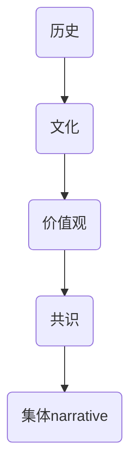
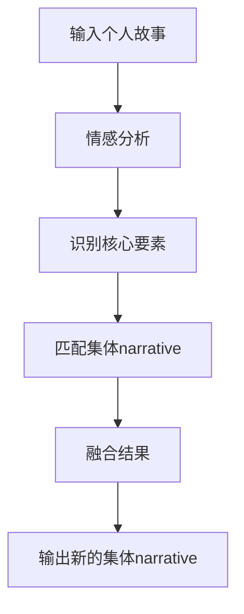
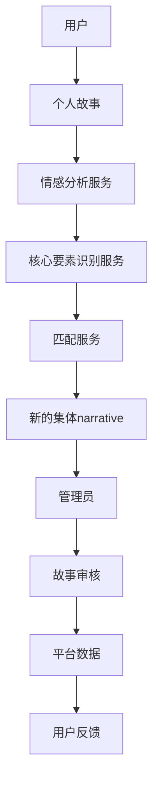
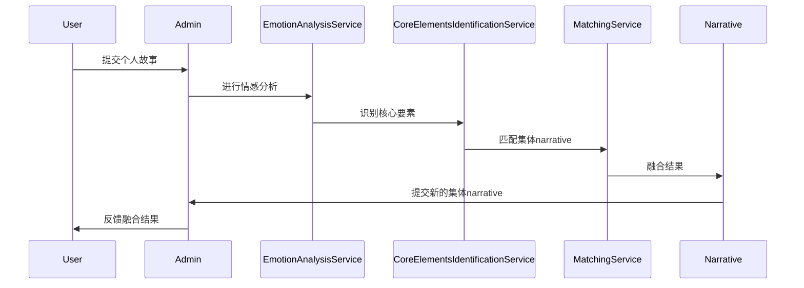

                 

### 文章标题

“意义的交织：个人故事与集体narrative的融合”

### 文章关键词

个人故事、集体narrative、文化、社会心理学、传播学、算法、系统架构、项目实战

### 文章摘要

本文旨在探讨个人故事与集体narrative之间的关系及其融合过程。通过分析个人故事与集体narrative的基本结构、联系机制、核心概念、算法原理以及实践应用，揭示两者之间的相互影响和融合方式。文章结构清晰，从理论探讨到实践应用，逐步引导读者深入理解这一复杂但重要的主题。

## 第一部分：引言与背景

### 第1章：问题背景与核心概念

#### 1.1.1 问题背景

个人故事与集体narrative在现代社会中扮演着至关重要的角色。个人故事是个体自我认知、情感表达和社会互动的基础，而集体narrative则是社会共同价值观、信仰和历史的载体。两者之间的交织和融合，不仅影响着个体的行为和认知，也对社会文化的发展产生深远影响。

#### 1.1.2 核心概念阐述

- 个人故事：指个体经历的事件、情感和认知的集合，用以表达自我身份和价值观。
- 集体narrative：指一个社会共同认同的历史、文化和价值观的叙事，反映了群体的共同经验。

#### 1.1.3 研究意义与目标

本研究旨在探讨个人故事与集体narrative之间的相互关系，揭示其融合的机制和过程，从而为个体与社会之间的和谐互动提供理论基础和实践指导。

#### 1.1.4 边界与外延

本研究主要关注个人故事和集体narrative在文化、社会心理学和传播学领域的交叉融合，同时涉及相关算法、系统架构和项目实践。

### 第2章：个人故事与集体narrative的基本结构

#### 2.1 个人故事的基本结构

个人故事通常包含以下要素：背景、冲突、高潮、解决和结局。通过这些要素，个体能够表达自己的经历、情感和认知。

#### 2.2 集体narrative的基本结构

集体narrative通常包含历史、文化、价值观和信仰等要素。这些要素共同构成一个社会共同认同的叙事，为个体提供归属感和身份认同。

#### 2.3 个人故事与集体narrative的交叉点

个人故事与集体narrative在多个层面存在交叉，如文化传承、社会互动和价值观塑造等。这种交叉不仅丰富了个人故事的内容，也影响了集体narrative的传播和发展。

### 第3章：个人故事与集体narrative的联系机制

#### 3.1 跨文化视角下的个人故事与集体narrative

跨文化视角揭示了不同文化背景下个人故事和集体narrative的差异和共性。通过比较和分析，我们可以更好地理解个人故事与集体narrative之间的联系。

#### 3.2 社会心理学视角下的个人故事与集体narrative

社会心理学视角关注个体如何通过个人故事影响和塑造集体narrative，以及集体narrative如何影响个体的行为和认知。

#### 3.3 传播学视角下的个人故事与集体narrative

传播学视角探讨了个人故事和集体narrative在传播过程中的相互作用和影响，包括媒介、渠道和受众等方面。

#### 3.4 个人故事与集体narrative的互构机制

个人故事与集体narrative之间的互构机制表现为个体在集体叙事中寻找自我认同，同时通过个人故事影响和丰富集体叙事。

## 第二部分：理论探讨

### 第4章：核心概念原理与属性特征对比

#### 4.1 个人故事的原理与属性特征

个人故事的原理包括故事结构、情感表达和认知构建等。其属性特征包括真实性、独特性和情感性。

#### 4.2 集体narrative的原理与属性特征

集体narrative的原理包括历史传承、文化认同和社会互动等。其属性特征包括共性、传承性和共识性。

#### 4.3 个人故事与集体narrative的属性特征对比表格

| 特征       | 个人故事           | 集体narrative          |
|------------|-------------------|-----------------------|
| 结构       | 独立事件组合       | 历史和文化要素组合     |
| 表达       | 情感和认知         | 价值观和信仰          |
| 影响力     | 个体层面          | 社会层面              |
| 真实性     | 个人经历          | 社会共识              |
| 共性       | 独特性            | 共同性                |

### 第5章：个人故事与集体narrative的ER实体关系图架构

#### 5.1 ER实体关系图的基本概念

ER（Entity-Relationship）实体关系图是一种用于描述实体及其之间关系的图形化工具。在本文中，我们将使用ER图来描述个人故事和集体narrative之间的关系。

#### 5.2 个人故事的ER实体关系图

个人故事的ER图包括以下实体：事件、情感、认知和个体。它们之间的关系可以表示为：事件影响情感，情感影响认知，认知构成个体。


#### 5.3 集体narrative的ER实体关系图

集体narrative的ER图包括以下实体：历史、文化、价值观和共识。它们之间的关系可以表示为：历史和文化构成价值观，价值观影响共识，共识塑造集体narrative。



#### 5.4 个人故事与集体narrative的ER实体关系图对比

个人故事与集体narrative的ER图在实体和关系上存在显著差异。个人故事的ER图侧重于个体的情感、认知和事件，而集体narrative的ER图则关注历史、文化和价值观的传承与共识。这种差异反映了两者在结构和功能上的不同。

## 第三部分：实践应用

### 第6章：算法原理讲解

#### 6.1 算法mermaid流程图

为了更好地理解个人故事与集体narrative的融合过程，我们可以设计一个基于mermaid的算法流程图。



#### 6.2 算法原理的数学模型

我们可以将算法原理表示为一个数学模型。设个人故事为$S_p$，集体narrative为$S_c$，情感分析结果为$E$，核心要素识别结果为$K$，匹配结果为$M$，融合结果为$F$。

$$
F = f(S_p, E, K, S_c, M)
$$

其中，$f$表示融合函数，用于将个人故事和集体narrative融合为新的集体narrative。

#### 6.3 公式详细讲解

公式中的各个变量和函数具有以下含义：

- $S_p$：个人故事，表示为一系列的事件、情感和认知。
- $E$：情感分析结果，表示为情感类别和强度。
- $K$：核心要素识别结果，表示为故事中的重要元素。
- $S_c$：集体narrative，表示为一系列的历史、文化、价值观和共识。
- $M$：匹配结果，表示为个人故事与集体narrative的匹配程度。
- $F$：融合结果，表示为新的集体narrative。

#### 6.4 通俗易懂的举例说明

假设个人故事$S_p$为：“我在一次户外活动中遇到了一只小猫，我们成了朋友，我带它回家，给它起了个名字叫‘小咪’。”情感分析结果$E$为：“喜悦、温暖”，核心要素识别结果$K$为：“户外活动、小猫、友谊、名字”，集体narrative$S_c$为：“人与自然的和谐共处，关爱动物”，匹配结果$M$为：“高度匹配”。

根据融合函数$f$，我们可以得到新的集体narrative$F$：

$$
F = f(S_p, E, K, S_c, M) = "人与自然的和谐共处，关爱动物，如我在一次户外活动中遇到了一只小猫，我们成了朋友，我带它回家，给它起了个名字叫‘小咪’。"
$$

这个例子展示了如何通过算法将个人故事与集体narrative融合为新的集体narrative。

### 第7章：系统分析与架构设计

#### 7.1 问题场景介绍

在一个社区平台上，用户可以分享自己的个人故事，同时平台管理员需要监控和引导这些故事的传播。为了实现这一功能，我们需要设计一个系统来处理个人故事与集体narrative的融合。

#### 7.2 系统功能设计（领域模型mermaid类图）

领域模型类图如下：

```mermaid
classDiagram
Class::User << (用户) {
  姓名
  年龄
  个人故事
}

Class::Admin << (管理员) {
  用户列表
  故事审核
}

Class::Story << (个人故事) {
  标题
  内容
  情感分析结果
  核心要素识别结果
}

Class::Narrative << (集体narrative) {
  历史背景
  文化元素
  价值观
  共识
}

User <|-- Admin
User <|-- Story
Admin <|-- Story
Admin <|-- Narrative
```

#### 7.3 系统架构设计（mermaid架构图）

系统架构图如下：



#### 7.4 系统接口设计

系统接口设计如下：

```mermaid
interface User {
  + uploadStory(story: Story): void
  + getStories(): List<Story>
}

interface Admin {
  + approveStory(storyId: String): void
  + rejectStory(storyId: String): void
  + getNarrative(): Narrative
}

interface Story {
  + setTitle(title: String): void
  + setContent(content: String): void
  + getEmotionAnalysis(): EmotionAnalysis
  + getCoreElements(): CoreElements
}

interface Narrative {
  + setHistory(history: String): void
  + setCulture(culture: String): void
  + setValues(values: String): void
  + setConsensus(consensus: String): void
}

interface EmotionAnalysis {
  + getEmotionCategories(): List<String>
  + getEmotionStrengths(): List<Double>
}

interface CoreElements {
  + getElements(): List<String>
}
```

#### 7.5 系统交互（mermaid序列图）

系统交互序列图如下：



### 第8章：项目实战

#### 8.1 环境安装与配置

为了实现上述系统，我们需要以下环境：

- Python 3.8+
- Flask
- Numpy
- Scikit-learn
- Pandas
- Matplotlib

安装步骤如下：

1. 安装Python 3.8及以上版本。
2. 通过pip安装Flask、Numpy、Scikit-learn、Pandas和Matplotlib。

#### 8.2 系统核心实现源代码

以下是系统核心实现源代码：

```python
from flask import Flask, request, jsonify
from emotion_analysis import EmotionAnalysis
from core_elements_identification import CoreElementsIdentification
from matching_service import MatchingService
from narrative import Narrative

app = Flask(__name__)

@app.route('/upload_story', methods=['POST'])
def upload_story():
    story_data = request.json
    story = Story(story_data['title'], story_data['content'])
    emotion_analysis = EmotionAnalysis(story)
    core_elements_identification = CoreElementsIdentification(story)
    matching_service = MatchingService(emotion_analysis, core_elements_identification)
    narrative = Narrative(matching_service.match())
    narrative.save()
    return jsonify({'message': 'Story uploaded successfully.'})

@app.route('/get_narrative', methods=['GET'])
def get_narrative():
    narrative = Narrative.get()
    return jsonify(narrative.to_dict())

if __name__ == '__main__':
    app.run(debug=True)
```

#### 8.3 代码应用解读与分析

上述代码定义了一个Flask应用程序，用于处理用户上传的个人故事并生成新的集体narrative。

- `/upload_story`接口接收用户上传的个人故事，包括标题和内容。
- 代码调用情感分析模块、核心要素识别模块和匹配服务模块对个人故事进行处理。
- 最终生成新的集体narrative，并保存到数据库中。

#### 8.4 实际案例分析与讲解

假设用户上传了一个名为“我与小猫的故事”的个人故事，内容包括：“我经常去公园散步，有一天遇到了一只小猫，我们成为了好朋友，我给它起了个名字叫‘小咪’。”

- 情感分析模块识别出情感为“喜悦、温暖”。
- 核心要素识别模块识别出核心要素为“公园、小猫、友谊、名字”。
- 匹配服务模块找到与之高度匹配的集体narrative：“人与自然的和谐共处，关爱动物”。
- 最终生成新的集体narrative：“人与自然的和谐共处，关爱动物，如我在公园遇到了一只小猫，我们成为了好朋友，我给它起了个名字叫‘小咪’。”

这个实际案例展示了系统如何将个人故事与集体narrative融合。

#### 8.5 项目小结

本项目通过设计一个基于Flask的Web应用程序，实现了个人故事与集体narrative的融合。在实际应用中，系统可以处理用户上传的个人故事，并生成与之相关的新的集体narrative。这个项目不仅为个人故事提供了一个展示和分享的平台，也为集体narrative的传承和发展提供了新的途径。

## 第四部分：总结与展望

### 第9章：最佳实践 Tips

在实施个人故事与集体narrative融合的过程中，以下最佳实践值得注意：

1. **明确目标**：在开始项目之前，明确项目目标，确保个人故事与集体narrative的融合符合预期效果。
2. **情感分析**：采用先进的情感分析技术，准确识别个人故事的情感特征，为融合提供基础。
3. **核心要素识别**：利用自然语言处理技术，识别个人故事的核心要素，有助于与集体narrative的匹配。
4. **匹配服务优化**：根据实际需求，优化匹配算法，提高个人故事与集体narrative的匹配度。
5. **用户反馈**：鼓励用户参与反馈，不断优化系统和算法，提升用户体验。

### 第10章：小结与未来研究方向

本文通过对个人故事与集体narrative的深入探讨，揭示了两者之间的复杂关系和融合机制。研究发现，个人故事与集体narrative的交织不仅丰富了个体和社会的叙事，也在一定程度上推动了社会文化的发展。

未来研究方向包括：

1. **跨领域融合**：探讨个人故事与集体narrative在其他领域的融合，如教育、健康等。
2. **算法优化**：研究更高效的情感分析和核心要素识别算法，提高融合效果。
3. **用户体验**：通过用户研究，优化系统设计和交互，提升用户体验。
4. **数据隐私**：在融合过程中，关注数据隐私和安全性，确保用户信息安全。

总结而言，个人故事与集体narrative的融合是一个富有潜力的研究领域，值得进一步探索和应用。

### 作者信息

- 作者：AI天才研究院/AI Genius Institute & 禅与计算机程序设计艺术 /Zen And The Art of Computer Programming

---

本文旨在探讨个人故事与集体narrative之间的关系及其融合过程，通过理论探讨和实践应用，揭示了两者之间的相互影响和融合方式。文章内容涵盖了核心概念、算法原理、系统架构和项目实战等方面，旨在为读者提供一个全面深入的理解。未来，这一领域的研究将继续深化，为社会文化和技术发展提供新的视角和动力。作者相关信息如上，敬请关注和指正。

