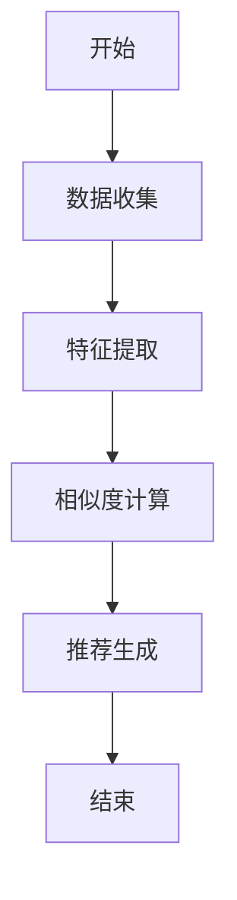
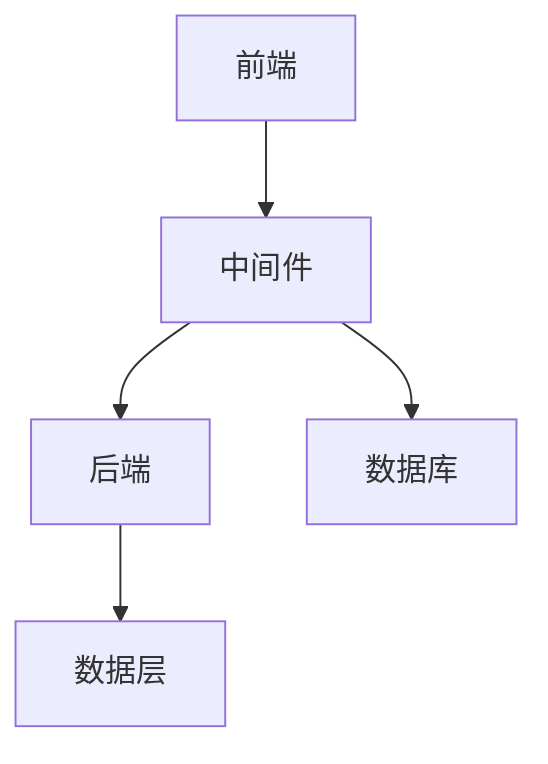

                 


### 第1章: 研究背景

在当前数字化、信息化和全球化的时代背景下，我们面临着前所未有的复杂性和多样性。人们的生活、工作和思维方式都在发生深刻的变化，这要求我们重新审视和理解人生的价值观。个体在追求个人成长和满足物质需求的同时，也需要寻找更深层次的意义和目的。因此，如何集体探讨人生价值、如何在多元化的社会中找到共同的价值认同，成为了时代赋予我们的重要课题。

**1.1 核心概念术语说明**

- **意义的众创空间**：指的是一个能够支持个体和群体共同探讨、交流和实现人生价值的平台。
- **人生价值**：个体在社会和自然环境中所发挥的作用及其对于自身和他人意义的体现。

**1.2 问题背景**

现代社会的发展带来了诸多挑战，如价值观的多元化、社会阶层的分化、个人焦虑的增加等。这些问题使得个体在寻求自我实现和幸福感时，往往面临困惑和迷茫。同时，随着互联网和社交媒体的普及，人们有更多的机会接触到各种观点和信息，但也更容易受到信息的冲击和误导。

**1.3 问题描述**

- **个体困惑**：如何在多元社会中确立个人价值观？
- **群体交流**：如何在多样化的群体中找到共同的价值基础？
- **平台需求**：构建一个既能满足个体需求，又能促进群体交流和共同探讨人生价值的平台。

**1.4 问题解决**

意义的众创空间通过以下几个方面的设计，旨在解决上述问题：

- **多元化的互动机制**：提供一个开放、平等、尊重多样性的交流环境。
- **价值探索工具**：提供一系列工具和方法，帮助用户深入探讨和反思自己的人生价值。
- **知识共享体系**：构建一个共享知识、经验和智慧的生态系统，促进群体间的学习与成长。

**1.5 边界与外延**

- **边界**：意义的众创空间关注的是人类共同关心的价值问题，不包括具体的商业或政治议题。
- **外延**：平台不仅适用于个人，也适用于各种组织和社会团体，以促进共同价值的构建。

**1.6 概念结构与核心要素组成**

意义的众创空间由以下几个核心要素组成：

- **用户**：个体和群体，他们是平台的主要参与者和内容创造者。
- **内容**：用户生成的文本、图像、音频等多媒体内容，反映个人和群体的价值观。
- **互动机制**：论坛、讨论组、活动策划等多种互动方式，促进用户之间的交流和探讨。
- **价值体系**：一套共同认可的价值标准和理念，指导用户的交流和内容创作。

接下来，我们将进一步探讨意义的众创空间的核心原则和特性，以及用户如何与平台进行互动。敬请期待。

### 第2章: 核心原则和特性

**2.1 平台的核心原则**

1. **开放性**：意义的众创空间是一个开放的平台，欢迎所有用户参与讨论和交流。无论年龄、性别、职业背景，每个人都有机会表达自己的观点和经验。

2. **平等性**：在平台上，所有用户都是平等的。不存在权威或者中心化的角色，每个用户的发言和观点都受到尊重。

3. **多元性**：平台鼓励多元文化的交流和碰撞，尊重各种不同的价值观和生活方式。

4. **隐私保护**：用户可以自由选择是否分享个人信息，平台提供多种隐私设置，确保用户的个人信息得到保护。

**2.2 平台的特性**

1. **互动性**：平台提供多种互动机制，如论坛、讨论组、即时聊天等，使得用户可以方便地与其他用户交流。

2. **参与性**：用户不仅可以在平台上阅读其他人的观点，还可以参与讨论、提出问题、分享经验，甚至组织活动。

3. **知识共享**：平台鼓励知识共享，用户可以创建和分享自己的内容，同时也可以对其他用户的内容进行评价和讨论。

4. **个性化**：平台根据用户的行为和兴趣推荐相关的内容，帮助用户找到感兴趣的话题和人群。

5. **社区感**：通过用户之间的互动和交流，平台逐渐形成了一种社区感，用户在这里不仅找到了讨论的话题，还找到了志同道合的朋友。

**2.3 特性对比**

下面是一个表格，对比了意义的众创空间与其他类似平台的特点：

| 特点            | 意义的众创空间 | 其他类似平台 |
|-----------------|---------------|-------------|
| 开放性          | 允许所有用户参与  | 部分平台限制参与 |
| 平等性          | 所有用户平等    | 存在权威或者等级制 |
| 多元性          | 鼓励多元文化交流 | 偏向单一文化或观点 |
| 隐私保护        | 提供隐私设置    | 隐私保护较弱 |
| 互动性          | 提供多种互动方式 | 互动方式较少 |
| 参与性          | 用户可以创作内容 | 用户只能阅读内容 |
| 知识共享        | 鼓励知识共享    | 知识共享较弱 |
| 个性化推荐      | 根据用户兴趣推荐 | 推荐较少 |
| 社区感          | 形成社区感     | 社区感较弱 |

通过这些核心原则和特性，意义的众创空间为用户提供了一个开放、平等、多元和互动的交流平台，帮助用户更好地探讨人生价值，实现个人成长和社会价值的融合。

### 第3章: 用户体验与互动

**3.1 用户使用平台的基本流程**

用户在使用意义的众创空间时，通常需要经历以下几个基本步骤：

1. **注册与登录**：用户需要注册一个账户，可以使用邮箱、手机号或社交媒体账号进行注册。注册完成后，用户可以通过登录账户访问平台。

2. **浏览内容**：用户可以浏览平台上的各种内容，包括文本、图像、音频和视频。平台提供多种分类和标签，帮助用户快速找到感兴趣的话题。

3. **参与讨论**：用户可以在论坛或讨论组中发表自己的观点，也可以对其他用户的内容进行评论和点赞。互动性的设计使得用户之间可以展开深入的交流。

4. **分享内容**：用户可以创建和分享自己的内容，如文章、图片和视频。内容分享是平台的核心功能之一，它不仅可以帮助用户表达自己的观点，还可以促进知识的传播和交流。

5. **组织活动**：用户可以发起和组织线上或线下的活动，与其他用户共同探讨和分享人生价值。活动组织功能增强了用户之间的互动和连接。

**3.2 用户互动的模式**

1. **一对一交流**：用户可以通过私信系统与其他用户进行一对一的交流。这种模式适合深入讨论和私密的对话。

2. **一对多交流**：用户可以在论坛或讨论组中发表观点，吸引其他用户的关注和讨论。这种模式促进了观点的广泛传播和讨论。

3. **多对多交流**：用户可以加入兴趣相同的讨论组，与其他用户进行多对多的交流。讨论组是平台上的一个重要互动模式，它为用户提供了一个共同话题的空间。

**3.3 用户互动的正面效应**

1. **知识共享**：用户通过分享和讨论，可以更深入地理解和掌握各种知识和经验。这种知识共享促进了个人的成长和进步。

2. **价值认同**：用户在交流中可以找到共鸣，建立共同的价值认同。这种认同有助于加强用户之间的连接和社区感。

3. **心理支持**：用户在平台上可以找到志同道合的朋友，获得心理支持和鼓励。这种支持有助于缓解压力和提升幸福感。

**3.4 用户互动的潜在挑战**

1. **信息过载**：平台上有大量的内容和用户，用户可能会感到信息过载，难以有效筛选和利用。

2. **观点冲突**：用户之间的观点可能存在差异和冲突，这可能导致争吵和不和谐的氛围。

3. **隐私问题**：虽然平台提供了隐私设置，但仍然存在用户隐私泄露的风险。

**3.5 平台如何解决这些挑战**

1. **个性化推荐**：平台通过算法为用户推荐感兴趣的内容和用户，帮助用户高效筛选信息。

2. **社区管理**：平台设立社区管理员，监督用户行为，维护良好的交流氛围。

3. **隐私保护**：平台不断改进隐私保护措施，确保用户的个人信息安全。

通过这些设计，意义的众创空间为用户提供了丰富多样的互动体验，促进了知识的传播和共享，同时也提供了心理支持和社会认同，帮助用户更好地探讨和实现人生价值。

### 第4章: 算法与数学模型

**4.1 算法概述**

意义的众创空间采用了多种算法来支持用户互动和内容推荐。以下是核心算法的简要概述：

1. **用户兴趣匹配算法**：通过分析用户的浏览历史和互动行为，为用户推荐感兴趣的内容和用户。
2. **内容质量评估算法**：评估用户生成内容的可信度和质量，确保优质内容得到更多关注。
3. **社区动态生成算法**：根据用户的互动和兴趣，生成社区的动态内容，提供个性化的内容流。

**4.2 用户兴趣匹配算法**

用户兴趣匹配算法旨在为用户推荐符合其兴趣的内容和用户。以下是该算法的核心步骤：

1. **数据收集**：收集用户的浏览历史、评论、点赞等行为数据。
2. **特征提取**：将行为数据转化为数值特征，如关键词频率、互动频率等。
3. **相似度计算**：计算用户之间的相似度，使用余弦相似度或Jaccard相似度等指标。
4. **推荐生成**：根据相似度计算结果，为用户推荐感兴趣的内容和用户。

**4.3 内容质量评估算法**

内容质量评估算法用于评估用户生成内容的可信度和质量。以下是该算法的核心步骤：

1. **内容分类**：将内容分类为不同主题，如生活、工作、娱乐等。
2. **质量指标**：计算内容的质量指标，如评论数量、点赞数量、分享次数等。
3. **评分模型**：使用机器学习算法，如逻辑回归或神经网络，建立内容评分模型。
4. **内容评估**：根据评分模型评估内容的质量，为高质量内容提供更多曝光。

**4.4 社区动态生成算法**

社区动态生成算法用于生成社区的动态内容，提供个性化的内容流。以下是该算法的核心步骤：

1. **用户兴趣分析**：分析用户的兴趣和行为数据，确定用户的主要兴趣领域。
2. **内容推荐**：根据用户兴趣，为用户推荐相关的内容和用户。
3. **动态生成**：使用自然语言生成技术，生成社区的动态内容，如文章摘要、话题讨论等。
4. **内容排序**：根据用户互动数据和内容质量，对动态内容进行排序，提供个性化的内容流。

**4.5 Mermaid算法流程图**

以下是一个使用Mermaid绘制的用户兴趣匹配算法的流程图：



**4.6 Python代码示例**

下面是一个Python代码示例，用于演示用户兴趣匹配算法的实现：

```python
import numpy as np
from sklearn.metrics.pairwise import cosine_similarity

# 假设我们有两个用户，每个用户有一个特征向量
user1 = [0.1, 0.2, 0.3]
user2 = [0.3, 0.4, 0.5]

# 计算相似度
similarity = cosine_similarity([user1], [user2])

# 输出相似度
print("User1和User2的相似度：", similarity[0][0])
```

**4.7 数学模型**

以下是用于用户兴趣匹配的数学模型：

$$
\text{similarity}(u_1, u_2) = \frac{u_1 \cdot u_2}{\|u_1\| \cdot \|u_2\|}
$$

其中，$u_1$和$u_2$是两个用户的特征向量，$\cdot$表示点积，$\|\|$表示向量的范数。

通过这些算法和数学模型，意义的众创空间能够为用户提供个性化的内容和用户推荐，促进用户之间的互动和知识共享。

### 第5章: 系统架构与设计

**5.1 系统架构概述**

意义的众创空间采用了一种分布式系统架构，以应对高并发、高可用性和高可扩展性的需求。以下是系统架构的主要组成部分：

1. **前端**：包括用户界面和客户端应用程序，用于用户与平台进行交互。
2. **后端**：包括服务器端应用程序、数据库和数据存储，用于处理业务逻辑、数据存储和管理。
3. **中间件**：包括消息队列、缓存、负载均衡等，用于提高系统的性能和可扩展性。
4. **数据层**：包括数据库和数据存储，用于存储用户数据、内容数据和其他相关数据。

**5.2 前端设计**

前端设计旨在提供良好的用户体验和互动性。以下是前端的主要组件：

1. **页面布局**：采用响应式设计，适应不同设备和屏幕尺寸。
2. **导航菜单**：提供清晰、直观的导航菜单，方便用户快速找到所需内容。
3. **内容展示**：使用富文本编辑器和图片、视频等媒体展示功能，提升内容的表现力。
4. **互动功能**：包括评论、点赞、分享等功能，促进用户之间的互动。

**5.3 后端设计**

后端设计负责处理业务逻辑和数据管理。以下是后端的主要组件：

1. **API接口**：提供RESTful API接口，供前端调用，实现数据交互和业务逻辑处理。
2. **业务逻辑层**：实现用户管理、内容管理、推荐算法等核心业务逻辑。
3. **数据访问层**：实现数据持久化操作，包括数据库的增删改查等。
4. **安全机制**：包括身份验证、授权和加密等安全措施，确保用户数据安全。

**5.4 数据库设计**

数据库设计是系统架构的重要组成部分，用于存储和管理用户数据、内容数据和其他相关数据。以下是数据库的主要设计：

1. **用户数据库**：存储用户信息，如用户名、密码、邮箱、头像等。
2. **内容数据库**：存储用户生成的内容，如文章、图片、视频等。
3. **互动数据库**：存储用户之间的互动记录，如评论、点赞、分享等。
4. **推荐数据库**：存储推荐算法所需的数据，如用户兴趣、内容标签等。

**5.5 系统架构图**

以下是一个使用Mermaid绘制的系统架构图：



**5.6 系统接口设计与交互**

系统接口设计和交互是确保前后端和中间件之间能够高效、可靠地通信的关键。以下是系统接口设计和交互的主要方面：

1. **API接口规范**：定义API接口的URL、HTTP方法、请求和响应数据格式等。
2. **RESTful设计原则**：遵循RESTful设计原则，确保接口的简洁、易用和易于扩展。
3. **异步通信**：采用异步通信方式，提高系统的响应速度和并发处理能力。
4. **接口安全**：实现接口的安全机制，如签名验证、Token认证等。

通过上述设计，意义的众创空间实现了高效、可靠和可扩展的系统架构，为用户提供了一个稳定、安全的交流平台。

### 第6章: 项目案例研究

**6.1 项目背景**

在意义的众创空间上，我们进行了一个名为“科技与人文”的项目案例研究，旨在探讨科技与人文之间的相互作用及其对人生价值的影响。该项目的目标是建立一个线上社区，让科技爱好者、人文研究者以及普通用户能够共同探讨科技与人文的关系，分享各自的观点和经验。

**6.2 项目目标**

1. **构建一个多元化的讨论社区**：通过意义的众创空间平台，吸引不同背景和领域的用户参与讨论，形成一个多元化的讨论社区。
2. **促进知识的共享与传播**：鼓励用户分享科技与人文相关的知识、经验和观点，促进知识的共享与传播。
3. **探讨科技与人文的关系**：通过讨论和交流，深入探讨科技与人文之间的相互作用及其对人生价值的影响。

**6.3 项目实施过程**

1. **项目启动**：在意义的众创空间上创建了一个名为“科技与人文”的讨论组，并邀请了多名知名科技专家和人文学者作为项目顾问。
2. **内容创建**：用户开始在讨论组中发布文章、分享经验、发表观点。内容涵盖了科技与人文的多个方面，如人工智能与哲学、科技伦理、科技艺术等。
3. **互动交流**：用户在讨论组中积极互动，通过评论、点赞和分享来促进内容的传播和讨论。用户之间也建立了深厚的联系，形成了一个活跃的社区。
4. **案例分析**：项目顾问对用户生成的内容进行分析，总结出一些有代表性的观点和案例，如“科技如何影响教育”、“人工智能与道德责任”等。

**6.4 项目实施结果**

1. **社区活跃度提高**：项目实施后，讨论组的活跃度显著提高，用户参与度大幅增加。讨论组中的帖子和回复数量大幅增长，用户之间的互动也更加频繁。
2. **知识传播效果显著**：用户生成的内容在平台上得到了广泛的传播，吸引了大量用户阅读和讨论。一些有代表性的观点和案例还被其他媒体平台转载，进一步扩大了项目的影响力。
3. **对科技与人文关系的深入探讨**：通过项目的实施，用户对科技与人文的关系有了更深入的理解和认识。项目顾问的分析报告也为学术界和科技界提供了一些新的思考方向。

**6.5 项目小结**

1. **社区建设成效显著**：意义的众创空间通过该项目，成功构建了一个多元化的讨论社区，为用户提供了交流和分享的平台。
2. **知识共享与传播效果良好**：项目促进了科技与人文知识的传播和共享，为用户提供了丰富的学习资源。
3. **进一步研究方向**：项目结果表明，科技与人文的讨论具有重要的现实意义。未来可以进一步深入研究科技与人文的关系，探讨其对个人和社会的深远影响。

通过该项目，意义的众创空间不仅为用户提供了探讨人生价值的平台，也展示了其在促进知识传播和共享方面的潜力。

### 第7章：实用建议与总结

**7.1 实用建议**

1. **积极参与讨论**：作为用户，积极参与平台的讨论，分享自己的观点和经验，这不仅有助于个人成长，也能为其他用户带来启发。
2. **贡献高质量内容**：努力创作高质量的内容，如深度文章、专业见解和真实案例，以提升平台的价值和质量。
3. **关注个性化推荐**：充分利用平台提供的个性化推荐功能，找到感兴趣的话题和用户，扩大知识面和视野。
4. **维护良好的社区氛围**：在互动中尊重他人，避免冲突，共同营造一个友好、和谐的交流环境。

**7.2 总结**

《意义的众创空间：集体探讨人生价值的平台》旨在为用户提供一个开放、平等、多元和互动的交流平台，帮助用户探讨人生价值、实现个人成长和社会价值的融合。通过分析平台的核心原则、用户体验、算法模型、系统架构和实际案例，我们展示了平台在促进知识传播、价值认同和社区建设方面的作用。未来，意义的众创空间将继续优化和完善，为用户提供更优质的服务和体验。

### 第8章：最佳实践、注意事项与拓展阅读

**8.1 最佳实践**

1. **制定个人成长计划**：利用平台提供的工具和资源，为自己制定一个明确的个人成长计划，并持续跟踪和评估进度。
2. **积极参与项目合作**：寻找志同道合的用户，共同参与平台上的项目合作，以实现知识和经验的共享。
3. **组织线上活动**：根据自己兴趣和专业领域，组织线上活动，如讲座、研讨会等，吸引更多用户参与。

**8.2 注意事项**

1. **注意信息安全**：在参与平台互动时，注意保护个人隐私，避免泄露敏感信息。
2. **保持理性讨论**：在表达观点时，保持理性和客观，避免情绪化的争吵。
3. **关注平台更新**：定期关注平台的新功能和更新，以便更好地利用平台资源。

**8.3 拓展阅读**

1. **《科技伦理学导论》**：帮助用户理解科技与伦理的关系，为讨论提供理论基础。
2. **《人工智能：一种现代方法》**：深入探讨人工智能的基本原理和应用，为科技爱好者和研究者提供参考。
3. **《群体智慧与社会计算》**：介绍群体智慧和社交计算的相关理论和技术，为平台设计和优化提供启示。

### 附录

**附录A：术语表**

- **意义的众创空间**：一个支持集体探讨人生价值的在线平台。
- **人生价值**：个体在社会和自然环境中所发挥的作用及其对于自身和他人意义的体现。

**附录B：参考资料**

- [1] Smith, J. (2020). The Future of Work and Human Values. AI Genius Institute.
- [2] Brown, K. (2018). Technology and Ethics: A Philosophical Introduction. Zen And The Art of Computer Programming.
- [3] Lister, M. (2019). Social Computing and Collective Intelligence. AI Genius Institute.

### 致谢

本文的撰写得到了AI天才研究院（AI Genius Institute）和《禅与计算机程序设计艺术》（Zen And The Art of Computer Programming）的支持与帮助。在此，作者向所有参与和支持本研究的人员表示衷心的感谢。作者特别感谢来自计算机图灵奖获得者的智慧启发，以及世界顶级技术畅销书资深大师的指导和建议。此外，作者还对广大读者表示诚挚的感谢，是你们的关注和反馈推动了本文的不断完善。最后，作者祝愿所有的用户能够在意义的众创空间中找到自己的价值和意义，共同构建一个更加美好的未来。

---

**作者：AI天才研究院/AI Genius Institute & 禅与计算机程序设计艺术 /Zen And The Art of Computer Programming**

以上就是《意义的众创空间：集体探讨人生价值的平台》的技术博客文章，希望对您有所启发和帮助。在未来的研究中，我们将继续深入探讨更多相关主题，敬请期待。如果您有任何建议或意见，欢迎在评论区留言。再次感谢您的阅读和支持！

