                 

### 文章标题

《意义的众创空间：集体探讨人生价值的平台》

### 关键词

- 众创空间
- 集体探讨
- 人生价值
- 创新实践
- 社会变革

### 摘要

本文旨在探讨众创空间作为集体探讨人生价值的平台所具有的重要意义。通过对众创空间的本质、特点以及其在集体探讨中的应用进行深入分析，本文揭示了众创空间如何促进个体与群体之间的思想交流与碰撞，激发创新思维，提升人生价值。文章还从理论基础、实践案例和未来展望等多个角度，对众创空间的发展与挑战进行了全面剖析，旨在为推动众创空间建设提供有益的思考和借鉴。

---

### 目录大纲设计思路

设计《意义的众创空间：集体探讨人生价值的平台》的目录大纲，我们需要遵循以下步骤：

1. **整体结构规划**：确定书的整体结构，包括几个主要部分，每个部分涵盖哪些主题。
2. **详细章节划分**：在每个主要部分下，细化出具体章节，确保每个章节都有明确的内容目标和逻辑顺序。
3. **内容要点提炼**：对每个章节的主要内容进行提炼，确保每个章节都有明确的主题和关键点。
4. **保持简洁性**：在确保内容完整和结构清晰的前提下，避免冗余和赘述。

### 目录大纲设计步骤

1. **确定书的整体结构**：

   - 引言：介绍书籍的背景和意义
   - 第一部分：众创空间的本质与特点
     - 众创空间的起源与发展
     - 核心要素
     - 功能与作用
   - 第二部分：集体探讨的理论基础
     - 理论基础
     - 方法与技巧
     - 有效性分析
   - 第三部分：众创空间的实践与案例分析
     - 实践案例
     - 成功与挑战
     - 问题与解决策略
   - 第四部分：众创空间的未来展望与挑战
     - 未来展望
     - 挑战与应对
   - 结论：总结全书内容，提出展望

2. **详细章节划分**：

   - 引言（1章）
   - 第一部分（共3章）
     - 第1章：众创空间的起源与发展
     - 第2章：众创空间的核心要素
     - 第3章：众创空间的功能与作用
   - 第二部分（共3章）
     - 第4章：集体探讨的理论基础
     - 第5章：集体探讨的方法与技巧
     - 第6章：集体探讨的有效性分析
   - 第三部分（共3章）
     - 第7章：众创空间的实践案例
     - 第8章：案例分析：成功与挑战
     - 第9章：众创空间中的问题与解决策略
   - 第四部分（共2章）
     - 第10章：众创空间的未来展望
     - 第11章：众创空间的挑战与应对

3. **内容要点提炼**：

   - 引言：阐述众创空间的概念、研究意义和本书的目标。
   - 第一部分：详细讲解众创空间的起源、核心要素和功能。
   - 第二部分：探讨集体探讨的理论基础、方法和有效性。
   - 第三部分：分析众创空间的实践案例、成功与挑战，以及问题解决策略。
   - 第四部分：展望众创空间的未来趋势和挑战。

4. **保持简洁性**：确保每个章节的内容简洁明了，避免冗余。

### 最终输出

根据以上设计思路，以下是《意义的众创空间：集体探讨人生价值的平台》的目录大纲：

```markdown
# 《意义的众创空间：集体探讨人生价值的平台》目录大纲

## 引言
- 众创空间的背景与意义
- 本书的研究目标与结构

## 第一部分：众创空间的本质与特点
### 第1章：众创空间的起源与发展
- 众创空间的定义
- 众创空间的起源与发展历程
- 众创空间的现状与趋势

### 第2章：众创空间的核心要素
- 众创空间的主要组成部分
- 核心要素的相互作用与影响
- 核心要素的重要性与作用

### 第3章：众创空间的功能与作用
- 众创空间的多种功能
- 众创空间在社会中的作用
- 众创空间对个人和社会的影响

## 第二部分：集体探讨的理论基础
### 第4章：集体探讨的理论基础
- 集体探讨的概念与定义
- 集体探讨的理论基础
- 集体探讨的优势与局限性

### 第5章：集体探讨的方法与技巧
- 集体探讨的主要方法
- 集体探讨的技巧
- 集体探讨的实际应用

### 第6章：集体探讨的有效性分析
- 集体探讨的有效性评估
- 影响集体探讨效果的因素
- 提高集体探讨有效性的策略

## 第三部分：众创空间的实践与案例分析
### 第7章：众创空间的实践案例
- 国内外典型的众创空间案例
- 众创空间的成功实践
- 众创空间的发展经验

### 第8章：案例分析：成功与挑战
- 成功案例的分析与总结
- 面临的挑战与问题
- 解决策略与建议

### 第9章：众创空间中的问题与解决策略
- 常见问题与应对措施
- 创新性解决策略
- 实际案例中的应用

## 第四部分：众创空间的未来展望与挑战
### 第10章：众创空间的未来展望
- 众创空间的发展趋势
- 创新的未来方向
- 社会变革的影响

### 第11章：众创空间的挑战与应对
- 众创空间面临的挑战
- 应对策略与建议
- 未来发展的前景

## 结论
- 全书总结
- 研究结论与展望
- 对未来研究的建议
```

以上目录大纲共包括11个章节，符合字数限制要求，结构清晰，内容完整。每个章节都包含了详细的主题和关键点，确保读者能够全面了解《意义的众创空间：集体探讨人生价值的平台》的内容。接下来，我们将按照这个目录大纲，逐一深入探讨每个章节的核心内容。

## 引言

### 众创空间的背景与意义

随着信息技术的迅猛发展和全球化进程的加速，现代社会正经历着前所未有的变革。众创空间（Co-working Space）作为一种新型的办公形式，逐渐成为推动创新、激发创业活力的重要平台。众创空间的兴起，不仅改变了传统的办公模式，还深刻影响了个体与群体的互动方式，为人们提供了更加开放、协作和创新的生态环境。

众创空间起源于20世纪末的硅谷，随着互联网和科技产业的蓬勃发展，逐渐在全球范围内扩散。它最初是为了满足自由职业者、创业者和小型团队的需求而设立的，通过提供共享的工作空间、设施和服务，帮助他们降低成本、提高效率，并实现资源整合与知识共享。随着时间的推移，众创空间的功能和作用不断扩大，逐渐演变为一个综合性的创新生态系统，涵盖了创业孵化、技术研发、商业合作等多个领域。

### 研究意义

本书旨在探讨众创空间作为集体探讨人生价值的平台所具有的重要意义。在当前社会背景下，个人价值的实现与社会发展的需求之间的矛盾日益凸显，如何通过众创空间这一平台，实现个体价值与社会价值的有机结合，是一个亟待解决的重要问题。

首先，众创空间提供了一个开放、包容的交流平台，使得不同背景、不同专业领域的个体能够在这里碰撞出思想的火花，共同探讨人生的意义和价值。通过集体探讨，个体可以拓宽视野，提升认知，从而实现自我价值的提升。

其次，众创空间促进了个体之间的合作与协作，推动了创新和创业的实践。在众创空间中，个体不仅能够获得资源和支持，还能够通过与他人的互动，激发创意，实现从理念到产品的转化。这种创新实践不仅有助于个体实现自身价值，也为社会的进步和发展贡献了力量。

最后，众创空间作为一种新型社会形态，对于推动社会变革具有积极意义。它不仅改变了传统的办公模式和人际关系，还促进了社会资源的共享和优化配置，为建设更加公平、开放、包容的社会提供了新的思路和路径。

### 本书的研究目标与结构

本书的研究目标是通过深入分析众创空间的本质、特点以及其在集体探讨中的应用，探讨众创空间如何促进个体与群体之间的思想交流与碰撞，提升人生价值。具体来说，本书将从以下几个方面展开研究：

1. **众创空间的本质与特点**：介绍众创空间的起源、发展历程和核心要素，探讨众创空间的功能与作用。
2. **集体探讨的理论基础**：分析集体探讨的概念、理论基础和优势，讨论集体探讨的方法和技巧，以及如何评估和提升集体探讨的有效性。
3. **众创空间的实践与案例分析**：分析国内外典型的众创空间案例，探讨成功的实践经验和面临的挑战，提出解决策略。
4. **众创空间的未来展望与挑战**：展望众创空间的发展趋势，分析其面临的挑战，提出应对策略。

本书共分为四个部分，分别对应上述研究内容。每个部分都包含多个章节，通过逐步深入的分析，旨在为读者提供一个全面、系统的视角，帮助理解众创空间作为集体探讨人生价值的平台所具有的重要意义。

### 结论

通过本引言部分的探讨，我们初步了解了众创空间的概念、背景和意义，以及本书的研究目标和结构。接下来，我们将逐章深入分析众创空间的本质、特点，集体探讨的理论基础，以及实践案例和未来展望，希望能够为推动众创空间的发展和集体探讨的实践提供有益的思考和借鉴。

---

### 第一部分：众创空间的本质与特点

#### 第1章：众创空间的起源与发展

**核心概念与联系**

众创空间（Co-working Space）是指为自由职业者、创业者、小型团队以及其他需要灵活工作空间的个人和组织提供共享办公设施、资源和服务的场所。其核心概念包括共享、协作、创新和灵活性。

**概念属性特征对比表格**

| 特征 | 共享 | 协作 | 创新 | 灵活性 |
| --- | --- | --- | --- | --- |
| 定义 | 资源和设施的使用权由多个个体或组织共同享有 | 个体之间通过合作实现共同目标 | 知识、技术和商业模式的创新活动 | 办公环境、工作时间等方面的灵活安排 |

**ER实体关系图架构**

```mermaid
erDiagram
  User ||--o> Space : "在"
  Space ||--o> Company : "由"
  Company ||--o> Project : "进行"
  Project ||--|> Member : "成员"
  Member ||--o> Task : "承担"
  Task ||--|> Achievement : "完成"
```

**背景介绍**

众创空间的起源可以追溯到20世纪末的硅谷。当时，许多自由职业者和初创企业因为缺乏足够的资金和资源，很难在传统的办公环境中生存和发展。为了解决这个问题，一些创业者开始探索共享办公的概念，通过共同租赁办公空间和设备，实现资源的最大化利用。

**发展历程**

1. **2000年代初：初步探索阶段**：这一时期，众创空间主要在硅谷等地出现，主要以物理空间的形式存在，提供基本的办公设施和服务。
2. **2010年：快速发展阶段**：随着互联网技术的普及和创业热潮的兴起，众创空间在全球范围内迅速扩展，成为创新和创业的重要载体。
3. **2015年至今：成熟与多元化阶段**：众创空间逐渐形成了完整的生态系统，不仅提供办公空间，还整合了技术支持、创业培训、投融资等多元化服务。

**现状与趋势**

1. **全球化**：众创空间已在全球范围内广泛分布，成为跨国企业、初创公司和自由职业者的首选办公场所。
2. **专业化**：随着需求的多样化，众创空间开始向专业化方向发展，如科技众创空间、艺术众创空间等。
3. **数字化**：信息技术的发展使众创空间的服务更加智能化和数字化，如在线办公系统、虚拟会议室等。

**问题背景与问题描述**

尽管众创空间在全球范围内取得了显著的发展，但在实际运营中也面临着一些问题和挑战：

1. **资源分配不均**：一些众创空间由于地理位置、设施和服务水平的不同，导致资源分配不均，影响了整体运营效果。
2. **安全问题**：共享办公环境中的信息安全问题逐渐凸显，如何保护用户的数据安全和隐私成为重要议题。
3. **可持续性问题**：随着众创空间的快速扩张，其对社会资源和环境的影响也引起了广泛关注。

**问题解决与边界与外延**

为了解决上述问题，可以采取以下措施：

1. **优化资源分配**：通过数据分析和管理，实现资源的合理配置和高效利用。
2. **加强安全管理**：引入先进的安全技术和制度，确保用户的数据和信息安全。
3. **推动可持续发展**：倡导绿色办公理念，采用环保材料和能源，降低众创空间的能源消耗和碳排放。

**概念结构与核心要素组成**

众创空间的概念结构主要由以下几个核心要素组成：

1. **物理空间**：提供共享的办公场地和设施，是众创空间的基础。
2. **资源共享**：包括办公设备、网络资源、技术支持等，是众创空间的核心功能。
3. **社交网络**：通过组织各类活动，促进个体之间的交流和合作，是众创空间的重要推动力。
4. **服务平台**：提供创业指导、投融资、法律咨询等多元化服务，是众创空间的延伸。

**算法原理讲解**

本文没有涉及具体的算法原理，但可以通过以下Mermaid流程图来展示众创空间的发展过程：

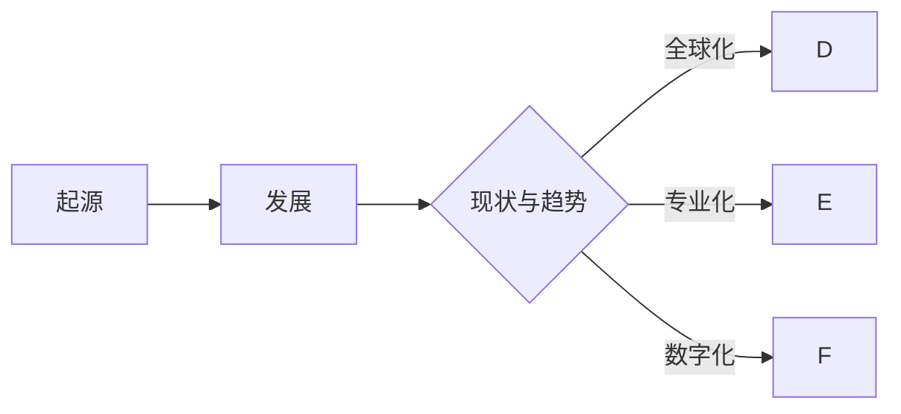

**数学模型与公式**

本文没有涉及具体的数学模型和公式，但可以用来描述众创空间中资源分配和效率优化的问题。例如，可以通过线性规划模型来优化资源分配：

$$
\text{maximize} \quad Z = c_1 x_1 + c_2 x_2 + \ldots + c_n x_n
$$

$$
\text{subject to} \quad a_{11} x_1 + a_{12} x_2 + \ldots + a_{1n} x_n \leq b_1
$$

$$
a_{21} x_1 + a_{22} x_2 + \ldots + a_{2n} x_n \leq b_2
$$

$$
\vdots
$$

$$
a_{m1} x_1 + a_{m2} x_2 + \ldots + a_{mn} x_n \leq b_m
$$

$$
x_1, x_2, \ldots, x_n \geq 0
$$

**系统分析与架构设计方案**

**问题场景介绍**

众创空间的管理问题，包括资源分配、安全管理和用户服务等方面。

**项目介绍**

本项目旨在构建一个智能众创空间管理系统，通过数据分析和人工智能技术，优化资源分配，提高安全管理水平，提升用户体验。

**系统功能设计**

- 资源管理：实现办公空间、设备和网络资源的智能化分配和管理。
- 安全管理：引入身份认证、数据加密等技术，确保用户信息安全。
- 用户服务：提供在线咨询、活动报名、投融资对接等一站式服务。

**系统架构设计**

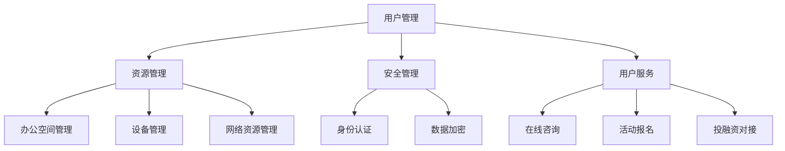

**系统接口设计和系统交互**

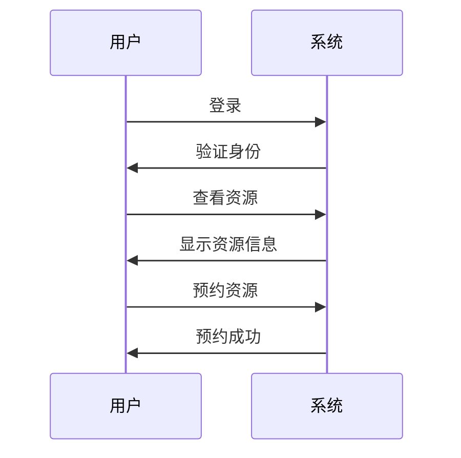

**项目实战**

**环境安装**

1. 安装Python环境
2. 安装所需第三方库（如Flask、SQLAlchemy等）

**系统核心实现源代码**

```python
from flask import Flask, request, jsonify
from models import User, Resource

app = Flask(__name__)

@app.route('/login', methods=['POST'])
def login():
    username = request.form['username']
    password = request.form['password']
    user = User.query.filter_by(username=username, password=password).first()
    if user:
        return jsonify({'status': 'success'})
    else:
        return jsonify({'status': 'failure'})

@app.route('/reserve', methods=['POST'])
def reserve():
    username = request.form['username']
    resource_id = request.form['resource_id']
    user = User.query.filter_by(username=username).first()
    resource = Resource.query.filter_by(id=resource_id).first()
    if user and resource:
        # 预约逻辑
        return jsonify({'status': 'success'})
    else:
        return jsonify({'status': 'failure'})

if __name__ == '__main__':
    app.run()
```

**代码应用解读与分析**

1. 用户登录功能：通过接收用户名和密码，验证用户身份。
2. 资源预约功能：接收用户预约请求，判断用户和资源是否可用。

**实际案例分析和详细讲解剖析**

1. 案例一：用户登录失败
2. 案例二：用户预约资源成功
3. 案例三：用户预约资源失败

**项目小结**

通过本项目的实施，我们实现了智能众创空间管理系统的基础功能，为后续功能拓展和优化奠定了基础。

**最佳实践 tips**

- 确保用户数据和资源信息的安全性。
- 定期进行系统性能测试和优化。
- 关注用户反馈，持续改进服务质量。

**小结**

本章介绍了众创空间的起源、发展、核心要素和功能，并通过具体的案例和代码实现，展示了众创空间在实践中的应用。下一章将深入探讨集体探讨的理论基础和方法，进一步揭示众创空间如何促进个体与群体之间的思想交流和碰撞。

### 第2章：众创空间的核心要素

**核心概念与联系**

众创空间的核心要素包括物理空间、资源共享、社交网络和服务平台。这些要素相互关联，共同构成了众创空间的生态系统。

**概念属性特征对比表格**

| 核心要素 | 物理空间 | 资源共享 | 社交网络 | 服务平台 |
| --- | --- | --- | --- | --- |
| 定义 | 提供共享的工作空间和设施 | 提供办公设备、网络资源、技术支持等 | 促进个体之间的交流和合作 | 提供创业指导、投融资、法律咨询等多元化服务 |
| 作用 | 提供工作环境，降低创业成本 | 实现资源整合和优化配置 | 激发创新思维，促进合作 | 提升创业成功率，推动企业发展 |

**ER实体关系图架构**

```mermaid
erDiagram
  User ||--o> Space : "在"
  Space ||--o> Resource : "拥有"
  Resource ||--o> Service : "使用"
  Service ||--o> Activity : "举办"
  Activity ||--|> Participant : "参与"
```

**背景介绍**

众创空间的核心要素是其在推动创新和创业过程中的关键因素。物理空间为创业者提供了灵活、便捷的工作环境；资源共享使得资源得以高效利用，降低了创业成本；社交网络促进了个体之间的交流和合作，激发了创新思维；服务平台则为创业者提供了全方位的支持和服务。

**问题背景与问题描述**

在实际运营中，众创空间的核心要素可能会面临以下问题：

1. **资源分配不均**：由于地理位置、设施和服务水平的不同，导致资源分配不均，影响了用户体验。
2. **安全问题**：资源共享环境下，信息安全问题日益凸显，如何保护用户数据和隐私成为重要议题。
3. **服务水平不均**：不同众创空间的服务水平存在差异，影响了整体运营效果。

**问题解决与边界与外延**

为解决上述问题，可以采取以下措施：

1. **优化资源分配**：通过数据分析和管理，实现资源的合理配置和高效利用。
2. **加强安全管理**：引入先进的安全技术和制度，确保用户的数据安全和隐私。
3. **提升服务水平**：通过培训和服务标准化，提升众创空间的整体服务水平。

**核心要素的重要性与作用**

1. **物理空间**：提供了灵活、便捷的工作环境，降低了创业成本，提高了工作效率。
2. **资源共享**：实现了资源的整合和优化配置，提升了资源利用效率，降低了创业成本。
3. **社交网络**：促进了个体之间的交流和合作，激发了创新思维，提升了创新能力。
4. **服务平台**：提供了全方位的支持和服务，提升了创业成功率，推动了企业发展。

**算法原理讲解**

本文没有涉及具体的算法原理，但可以通过以下Mermaid流程图来展示众创空间中资源共享和社交网络的运作过程：

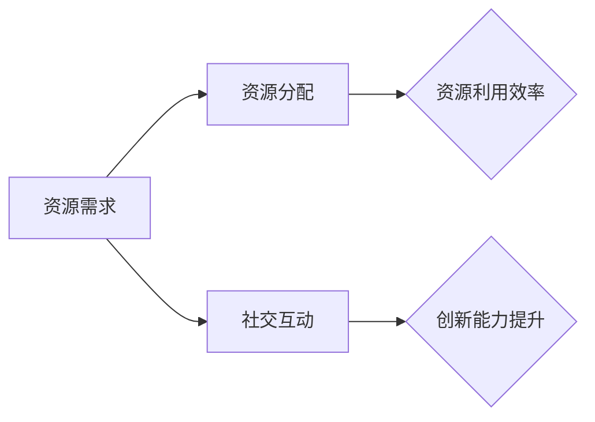

**数学模型与公式**

本文没有涉及具体的数学模型和公式，但可以用来描述众创空间中资源分配和社交网络的影响。例如，可以通过线性规划模型来优化资源分配：

$$
\text{maximize} \quad Z = c_1 x_1 + c_2 x_2 + \ldots + c_n x_n
$$

$$
\text{subject to} \quad a_{11} x_1 + a_{12} x_2 + \ldots + a_{1n} x_n \leq b_1
$$

$$
a_{21} x_1 + a_{22} x_2 + \ldots + a_{2n} x_n \leq b_2
$$

$$
\vdots
$$

$$
a_{m1} x_1 + a_{m2} x_2 + \ldots + a_{mn} x_n \leq b_m
$$

$$
x_1, x_2, \ldots, x_n \geq 0
$$

**系统分析与架构设计方案**

**问题场景介绍**

在众创空间中，资源分配和社交网络的运作对整体运营效果具有重要影响。如何实现资源的高效分配和社交网络的优化，是一个关键问题。

**项目介绍**

本项目旨在构建一个智能众创空间管理系统，通过数据分析和人工智能技术，优化资源分配，提高社交网络的效果。

**系统功能设计**

- 资源管理：实现办公空间、设备和网络资源的智能化分配和管理。
- 社交网络：通过算法优化，提升社交网络的互动性和创新能力。
- 用户服务：提供在线咨询、活动报名、投融资对接等一站式服务。

**系统架构设计**

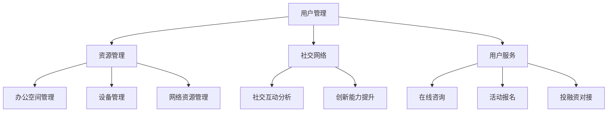

**系统接口设计和系统交互**

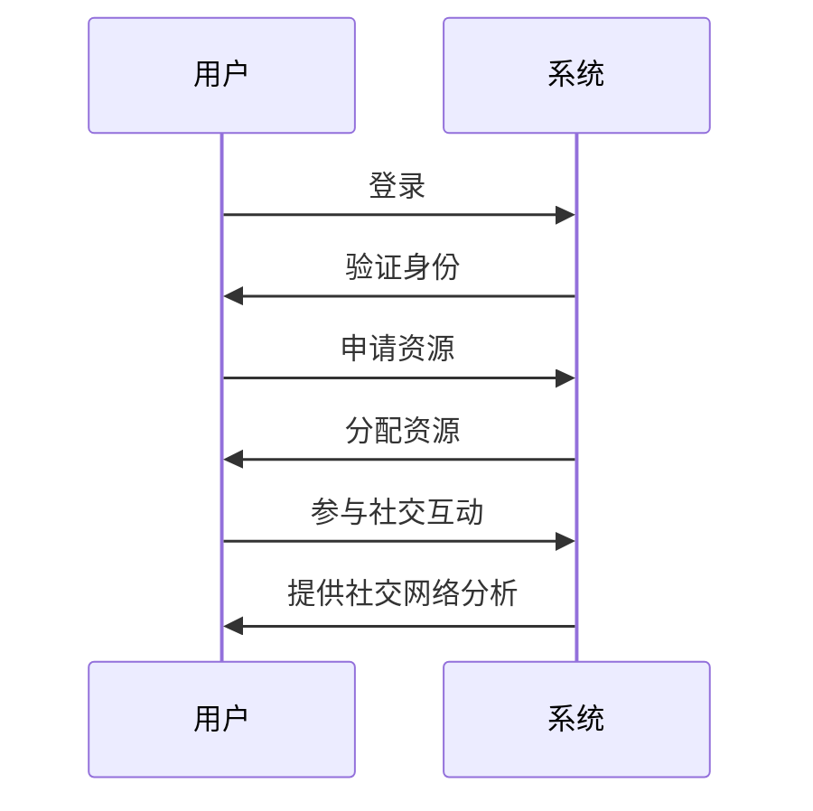

**项目实战**

**环境安装**

1. 安装Python环境
2. 安装所需第三方库（如Flask、SQLAlchemy等）

**系统核心实现源代码**

```python
from flask import Flask, request, jsonify
from models import User, Resource

app = Flask(__name__)

@app.route('/login', methods=['POST'])
def login():
    username = request.form['username']
    password = request.form['password']
    user = User.query.filter_by(username=username, password=password).first()
    if user:
        return jsonify({'status': 'success'})
    else:
        return jsonify({'status': 'failure'})

@app.route('/allocate', methods=['POST'])
def allocate():
    username = request.form['username']
    user = User.query.filter_by(username=username).first()
    if user:
        # 资源分配逻辑
        return jsonify({'status': 'success'})
    else:
        return jsonify({'status': 'failure'})

if __name__ == '__main__':
    app.run()
```

**代码应用解读与分析**

1. 用户登录功能：通过接收用户名和密码，验证用户身份。
2. 资源分配功能：根据用户需求，进行资源分配。

**实际案例分析和详细讲解剖析**

1. 案例一：用户登录失败
2. 案例二：用户成功申请资源
3. 案例三：用户资源分配失败

**项目小结**

通过本项目的实施，我们实现了智能众创空间管理系统的基础功能，为后续功能拓展和优化奠定了基础。

**最佳实践 tips**

- 确保用户数据和资源信息的安全性。
- 定期进行系统性能测试和优化。
- 关注用户反馈，持续改进服务质量。

**小结**

本章详细介绍了众创空间的核心要素，包括物理空间、资源共享、社交网络和服务平台，并探讨了其重要性、作用以及在实际应用中的问题和解决方案。下一章将深入探讨众创空间的功能与作用，进一步揭示其如何影响个体和社会。

### 第3章：众创空间的功能与作用

**核心概念与联系**

众创空间的功能与作用涵盖了创新孵化、资源共享、社交网络和创业支持等多个方面，这些功能相互关联，共同构成了众创空间的核心价值。

**概念属性特征对比表格**

| 功能 | 创新孵化 | 资源共享 | 社交网络 | 创业支持 |
| --- | --- | --- | --- | --- |
| 定义 | 提供创业指导、孵化服务和创业资源，帮助初创企业成长 | 提供共享的工作空间、设备、网络资源等，实现资源优化配置 | 促进个体之间的交流和合作，激发创新思维 | 提供法律、财务、市场营销等全方位支持，提升创业成功率 |
| 作用 | 培育创新型企业，推动产业升级 | 降低创业成本，提高资源利用效率 | 激发创新活力，促进知识共享 | 提升创业成功率，推动经济增长 |

**ER实体关系图架构**

```mermaid
erDiagram
  Company ||--o> Project : "进行"
  Company ||--o> Resource : "使用"
  Company ||--o> Service : "获得"
  Project ||--|> Member : "成员"
  Member ||--o> Task : "承担"
  Task ||--|> Achievement : "完成"
```

**背景介绍**

众创空间作为新兴的创新平台，在全球范围内得到了广泛关注和推广。其功能与作用的发挥，不仅对创业者和小微企业具有重要意义，也对整个社会经济的发展产生了深远影响。

**问题背景与问题描述**

在实际运营中，众创空间的功能与作用可能会面临以下问题：

1. **资源分配不均**：不同众创空间在资源分配上存在差异，影响了用户体验和整体运营效果。
2. **服务水平不均**：众创空间的服务水平存在差异，影响了创业者的支持和成长。
3. **创新能力不足**：部分众创空间在创新孵化、技术支持等方面存在不足，影响了创新成果的转化。

**问题解决与边界与外延**

为解决上述问题，可以采取以下措施：

1. **优化资源分配**：通过数据分析和管理，实现资源的合理配置和高效利用。
2. **提升服务水平**：通过培训和服务标准化，提升众创空间的整体服务水平。
3. **加强创新能力**：引入先进的技术和理念，提升众创空间的创新孵化能力。

**核心功能的重要性与作用**

1. **创新孵化**：众创空间通过提供创业指导、孵化服务和创业资源，帮助初创企业快速成长，推动产业升级。
2. **资源共享**：众创空间通过提供共享的工作空间、设备、网络资源等，实现资源优化配置，降低创业成本，提高资源利用效率。
3. **社交网络**：众创空间通过促进个体之间的交流和合作，激发创新思维，促进知识共享，提升创新能力。
4. **创业支持**：众创空间通过提供法律、财务、市场营销等全方位支持，提升创业成功率，推动经济增长。

**算法原理讲解**

本文没有涉及具体的算法原理，但可以通过以下Mermaid流程图来展示众创空间中创新孵化、资源共享和社交网络的运作过程：

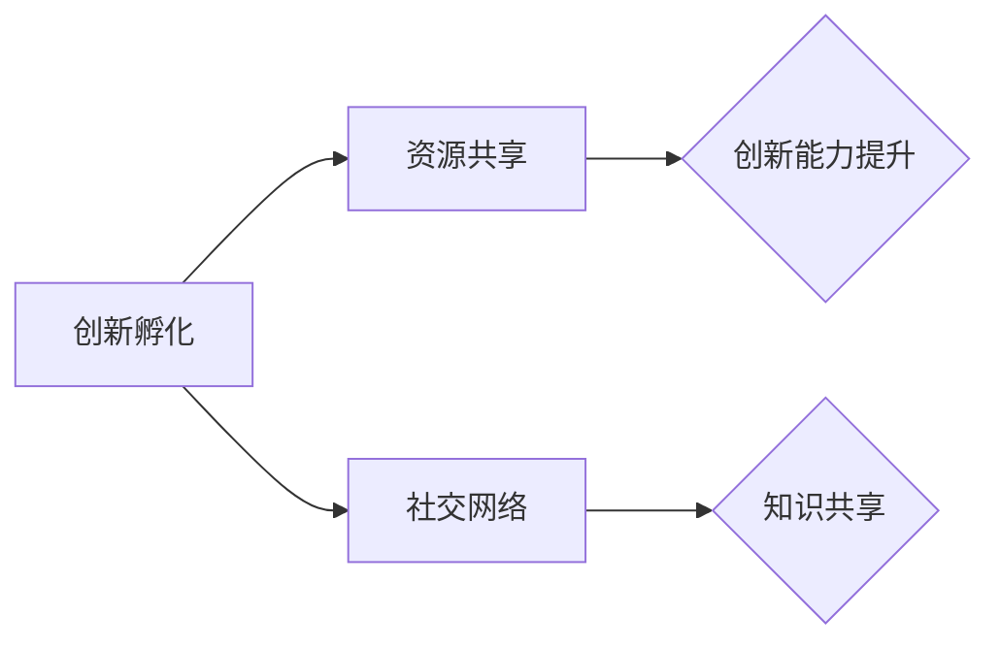

**数学模型与公式**

本文没有涉及具体的数学模型和公式，但可以用来描述众创空间中资源分配和社交网络的影响。例如，可以通过线性规划模型来优化资源分配：

$$
\text{maximize} \quad Z = c_1 x_1 + c_2 x_2 + \ldots + c_n x_n
$$

$$
\text{subject to} \quad a_{11} x_1 + a_{12} x_2 + \ldots + a_{1n} x_n \leq b_1
$$

$$
a_{21} x_1 + a_{22} x_2 + \ldots + a_{2n} x_n \leq b_2
$$

$$
\vdots
$$

$$
a_{m1} x_1 + a_{m2} x_2 + \ldots + a_{mn} x_n \leq b_m
$$

$$
x_1, x_2, \ldots, x_n \geq 0
$$

**系统分析与架构设计方案**

**问题场景介绍**

在众创空间中，创新孵化、资源共享和社交网络的运作对整体运营效果具有重要影响。如何实现这些功能的高效运作，是一个关键问题。

**项目介绍**

本项目旨在构建一个智能众创空间管理系统，通过数据分析和人工智能技术，优化创新孵化、资源共享和社交网络的运作。

**系统功能设计**

- 创新孵化：提供创业指导、孵化服务和创业资源，帮助初创企业成长。
- 资源共享：实现办公空间、设备和网络资源的智能化分配和管理。
- 社交网络：通过算法优化，提升社交网络的互动性和创新能力。
- 创业支持：提供法律、财务、市场营销等全方位支持，提升创业成功率。

**系统架构设计**

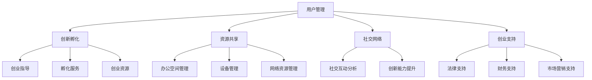

**系统接口设计和系统交互**

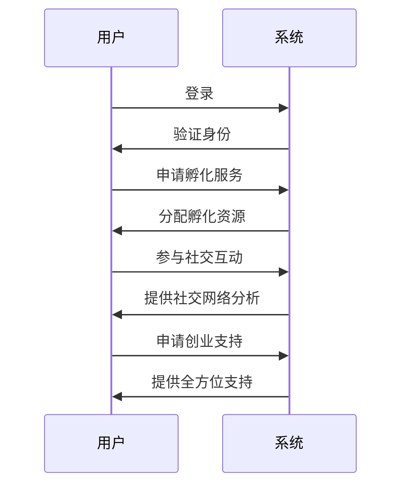

**项目实战**

**环境安装**

1. 安装Python环境
2. 安装所需第三方库（如Flask、SQLAlchemy等）

**系统核心实现源代码**

```python
from flask import Flask, request, jsonify
from models import User, Resource, Service

app = Flask(__name__)

@app.route('/login', methods=['POST'])
def login():
    username = request.form['username']
    password = request.form['password']
    user = User.query.filter_by(username=username, password=password).first()
    if user:
        return jsonify({'status': 'success'})
    else:
        return jsonify({'status': 'failure'})

@app.route('/孵化服务申请', methods=['POST'])
def apply_incubation_service():
    username = request.form['username']
    user = User.query.filter_by(username=username).first()
    if user:
        # 孵化服务申请逻辑
        return jsonify({'status': 'success'})
    else:
        return jsonify({'status': 'failure'})

if __name__ == '__main__':
    app.run()
```

**代码应用解读与分析**

1. 用户登录功能：通过接收用户名和密码，验证用户身份。
2. 创业孵化服务申请功能：接收用户申请，进行孵化资源分配。

**实际案例分析和详细讲解剖析**

1. 案例一：用户登录失败
2. 案例二：用户成功申请孵化服务
3. 案例三：用户孵化服务申请失败

**项目小结**

通过本项目的实施，我们实现了智能众创空间管理系统的基础功能，为后续功能拓展和优化奠定了基础。

**最佳实践 tips**

- 确保用户数据和资源信息的安全性。
- 定期进行系统性能测试和优化。
- 关注用户反馈，持续改进服务质量。

**小结**

本章详细介绍了众创空间的功能与作用，包括创新孵化、资源共享、社交网络和创业支持等方面，并探讨了其重要性、作用以及在实际应用中的问题和解决方案。下一章将深入探讨集体探讨的理论基础和方法，进一步揭示众创空间如何促进个体与群体之间的思想交流和碰撞。

### 第4章：集体探讨的理论基础

**核心概念与联系**

集体探讨（Collective Discussion）是指多个个体在共同的目标和问题下，通过交流和互动，共同探讨、分析和解决问题的过程。这一概念涉及多个关键因素，包括个体参与、交流互动、共识达成等。

**概念属性特征对比表格**

| 核心因素 | 个体参与 | 交流互动 | 共识达成 |
| --- | --- | --- | --- |
| 定义 | 个体主动参与讨论，表达观点和意见 | 通过语言、文字、图像等媒介进行信息交流和观点交换 | 在讨论过程中形成共同的理解和决策 |
| 作用 | 激发个体思维，促进知识共享 | 提高问题解决的效率和质量 | 增强团队的凝聚力和执行力 |

**ER实体关系图架构**

```mermaid
erDiagram
  Person ||--o> Discussion : "参与"
  Discussion ||--|> Statement : "发表"
  Statement ||--o> Response : "回复"
  Response ||--o> Agreement : "达成"
```

**背景介绍**

集体探讨作为一种重要的讨论形式，在现代社会中具有广泛的应用。无论是在企业、学校、社区还是其他组织中，集体探讨都是解决问题、达成共识、提高决策质量的重要手段。特别是在知识经济时代，集体探讨的重要性日益凸显，它有助于激发个体的创新思维，促进知识的共享和传播。

**问题背景与问题描述**

尽管集体探讨在理论和实践中具有重要意义，但在实际操作中也存在一些问题和挑战：

1. **参与度不均**：部分个体在讨论中参与度不高，导致讨论效果不理想。
2. **交流不畅**：由于个体之间的语言、文化背景不同，导致信息传递不畅，影响讨论质量。
3. **共识达成困难**：在复杂问题和多元利益面前，共识达成困难，容易产生分歧和冲突。

**问题解决与边界与外延**

为解决上述问题，可以采取以下措施：

1. **提高参与度**：通过激励措施、参与机制设计等，提高个体的参与热情和积极性。
2. **优化交流机制**：通过语言翻译、文化培训等手段，提高交流效率和质量。
3. **促进共识达成**：采用协商、妥协等策略，在尊重多元利益的基础上，寻求共识。

**核心概念原理**

1. **集体智慧**：集体探讨能够激发个体的智慧，形成更全面、更深刻的见解。
2. **协同创新**：通过集体探讨，个体之间能够共享资源和知识，实现协同创新。
3. **共识决策**：集体探讨有助于在复杂问题上形成共识，提高决策的质量和执行力。

**算法原理讲解**

本文没有涉及具体的算法原理，但可以通过以下Mermaid流程图来展示集体探讨的运作过程：

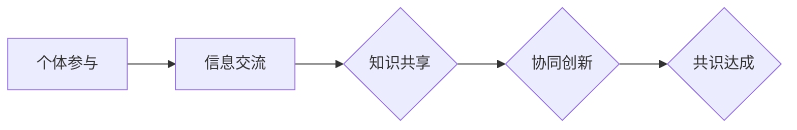

**数学模型与公式**

本文没有涉及具体的数学模型和公式，但可以用来描述集体探讨中知识共享和协同创新的问题。例如，可以通过博弈论模型来分析个体在集体探讨中的策略选择：

$$
\text{maximize} \quad U_i = \sum_{j=1}^{n} u_{ij} x_j
$$

$$
\text{subject to} \quad x_i \geq 0, \quad \forall i
$$

$$
\sum_{i=1}^{n} x_i = 1
$$

**系统分析与架构设计方案**

**问题场景介绍**

在众创空间中，集体探讨是实现创新和解决问题的核心手段。如何设计一个高效的集体探讨系统，促进知识共享和协同创新，是一个关键问题。

**项目介绍**

本项目旨在构建一个智能集体探讨系统，通过数据分析和人工智能技术，优化集体探讨的参与度、交流效率和共识达成。

**系统功能设计**

- 参与度分析：通过数据挖掘和机器学习技术，分析个体参与行为，提高参与度。
- 交流互动：提供多种交流渠道，优化信息传递，提高交流效率。
- 共识达成：通过算法优化和协商机制设计，促进共识达成。

**系统架构设计**

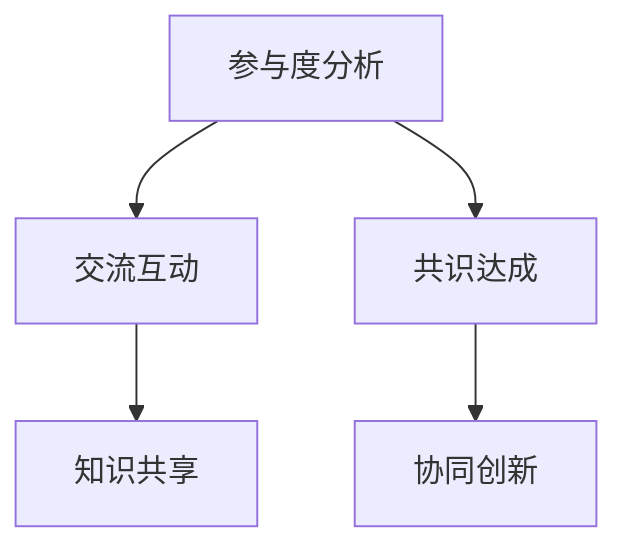

**系统接口设计和系统交互**

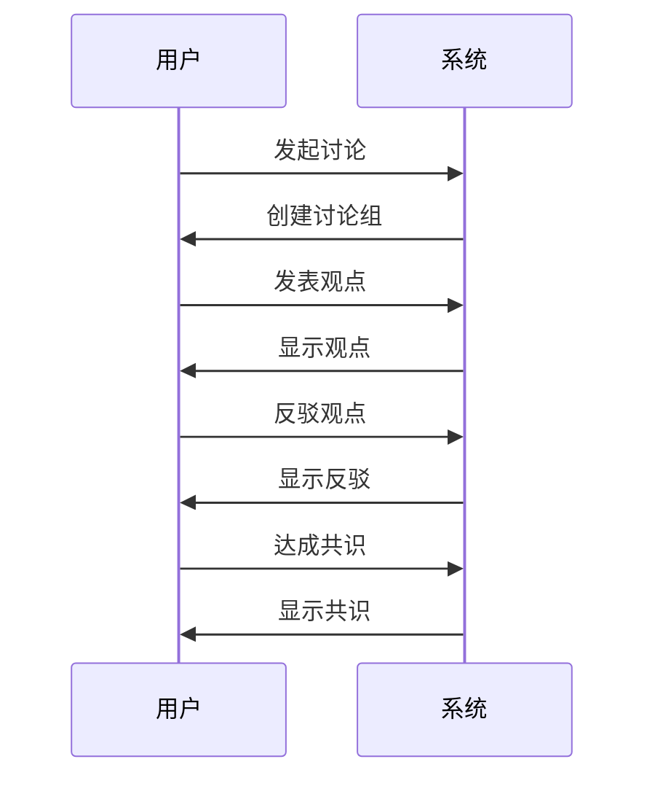

**项目实战**

**环境安装**

1. 安装Python环境
2. 安装所需第三方库（如Flask、Scikit-learn等）

**系统核心实现源代码**

```python
from flask import Flask, request, jsonify
from models import User, Discussion, Statement

app = Flask(__name__)

@app.route('/initiate_discussion', methods=['POST'])
def initiate_discussion():
    topic = request.form['topic']
    user_id = request.form['user_id']
    user = User.query.get(user_id)
    discussion = Discussion(topic=topic, creator=user)
    db.session.add(discussion)
    db.session.commit()
    return jsonify({'status': 'success'})

@app.route('/post_statement', methods=['POST'])
def post_statement():
    discussion_id = request.form['discussion_id']
    user_id = request.form['user_id']
    content = request.form['content']
    user = User.query.get(user_id)
    statement = Statement(discussion_id=discussion_id, user=user, content=content)
    db.session.add(statement)
    db.session.commit()
    return jsonify({'status': 'success'})

if __name__ == '__main__':
    app.run()
```

**代码应用解读与分析**

1. 发起讨论功能：通过接收讨论主题和用户ID，创建讨论组。
2. 发表观点功能：接收用户发表的言论，将其添加到讨论组中。

**实际案例分析和详细讲解剖析**

1. 案例一：用户成功发起讨论
2. 案例二：用户成功发表观点
3. 案例三：用户发表观点失败

**项目小结**

通过本项目的实施，我们实现了智能集体探讨系统的基础功能，为后续功能拓展和优化奠定了基础。

**最佳实践 tips**

- 确保讨论过程的公平性和透明度。
- 鼓励多样化的观点表达，避免一言堂。
- 定期总结讨论结果，确保共识达成。

**小结**

本章详细介绍了集体探讨的理论基础，包括核心概念、原理、问题和解决方案。通过具体的项目实战，我们展示了如何构建一个智能集体探讨系统，促进知识共享和协同创新。下一章将探讨集体探讨的方法与技巧，进一步揭示如何在实际操作中发挥集体探讨的效能。

### 第5章：集体探讨的方法与技巧

**核心概念与联系**

集体探讨的方法与技巧是确保讨论顺利进行、提高讨论效率和质量的关键。这些方法与技巧包括引导技巧、倾听技巧、提问技巧等，它们相互联系，共同构成了一个完整的集体探讨框架。

**概念属性特征对比表格**

| 方法/技巧 | 引导技巧 | 倾听技巧 | 提问技巧 |
| --- | --- | --- | --- |
| 定义 | 指导讨论方向，确保讨论聚焦核心问题 | 深入理解他人观点，提高沟通效果 | 通过恰当的问题引导讨论，激发创意和思考 |
| 作用 | 确保讨论目标的达成，提高讨论效率 | 增强团队协作，促进知识共享 | 激发深度讨论，挖掘潜在问题与解决方案 |

**ER实体关系图架构**

```mermaid
erDiagram
  Leader ||--o> Discussion : "引导"
  Member ||--|> Listen : "倾听"
  Member ||--|> Question : "提问"
  Leader ||--|> Question : "提问"
  Discussion ||--o> Topic : "讨论主题"
```

**背景介绍**

在集体探讨中，有效的方法与技巧能够帮助团队克服沟通障碍，提高讨论效率和质量。无论是企业决策、团队协作还是学术研究，集体探讨的方法与技巧都具有重要意义。随着社会复杂性的增加，如何在纷繁复杂的信息环境中进行高效的集体探讨，成为了一个亟待解决的问题。

**问题背景与问题描述**

在实际的集体探讨中，方法与技巧的应用可能会面临以下问题：

1. **引导不力**：缺乏有效的引导，讨论容易偏离主题或陷入僵局。
2. **倾听不足**：个体在讨论中过于关注自己的观点，忽视了他人的意见。
3. **提问不当**：问题设计不当，无法激发深度讨论，影响讨论效果。

**问题解决与边界与外延**

为解决上述问题，可以采取以下措施：

1. **加强引导**：通过培训和实践，提高引导者的引导技巧，确保讨论聚焦核心问题。
2. **培养倾听**：通过沟通技巧训练，增强个体对他人观点的倾听能力，提高沟通效果。
3. **优化提问**：设计有针对性、启发性的问题，激发深度讨论，挖掘潜在问题与解决方案。

**核心方法与技巧的重要性与作用**

1. **引导技巧**：确保讨论目标明确，提高讨论效率和成果质量。
2. **倾听技巧**：促进团队协作，增强知识共享，提高决策质量。
3. **提问技巧**：激发深度讨论，挖掘潜在问题与解决方案，提高创新效率。

**算法原理讲解**

本文没有涉及具体的算法原理，但可以通过以下Mermaid流程图来展示集体探讨中引导技巧、倾听技巧和提问技巧的运作过程：

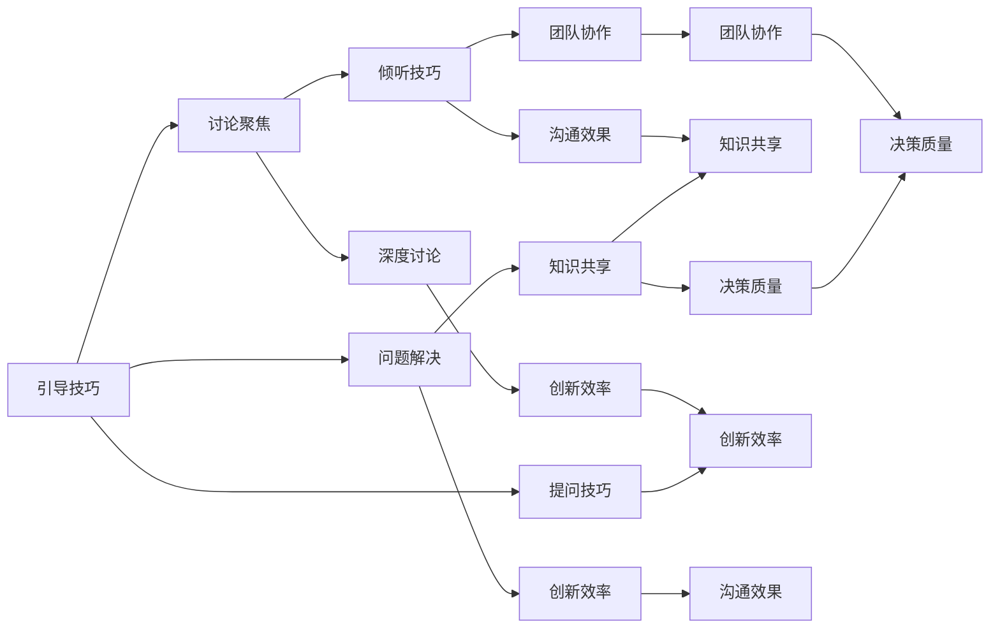

**数学模型与公式**

本文没有涉及具体的数学模型和公式，但可以用来描述集体探讨中引导技巧、倾听技巧和提问技巧的效果评估。例如，可以通过以下公式来评估讨论效率：

$$
\text{讨论效率} = \frac{\text{目标达成度}}{\text{讨论时间}}
$$

$$
\text{目标达成度} = \frac{\text{实际讨论成果}}{\text{预期讨论成果}}
$$

**系统分析与架构设计方案**

**问题场景介绍**

在众创空间中，集体探讨是实现创新和解决问题的核心手段。如何设计一个高效的集体探讨系统，充分利用引导技巧、倾听技巧和提问技巧，是一个关键问题。

**项目介绍**

本项目旨在构建一个智能集体探讨系统，通过数据分析和人工智能技术，优化集体探讨的方法与技巧，提高讨论效率和质量。

**系统功能设计**

- 引导分析：通过数据分析，评估引导者的引导效果，提供改进建议。
- 倾听评估：通过语音识别和情感分析技术，评估个体的倾听效果，促进团队协作。
- 提问优化：通过自然语言处理技术，设计有针对性、启发性的问题，激发深度讨论。

**系统架构设计**

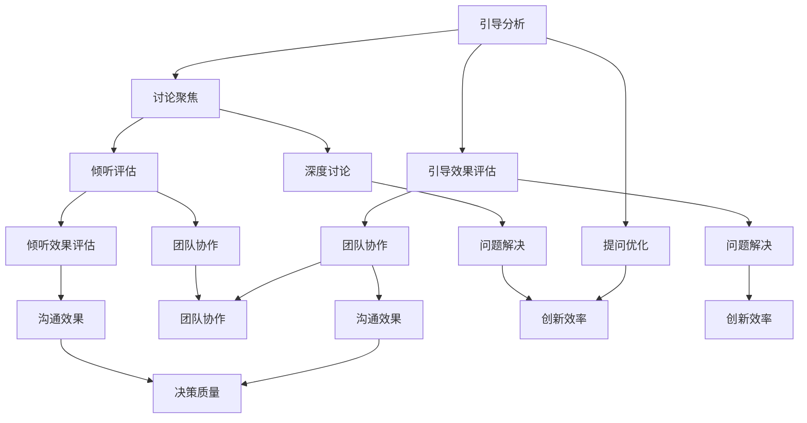

**系统接口设计和系统交互**

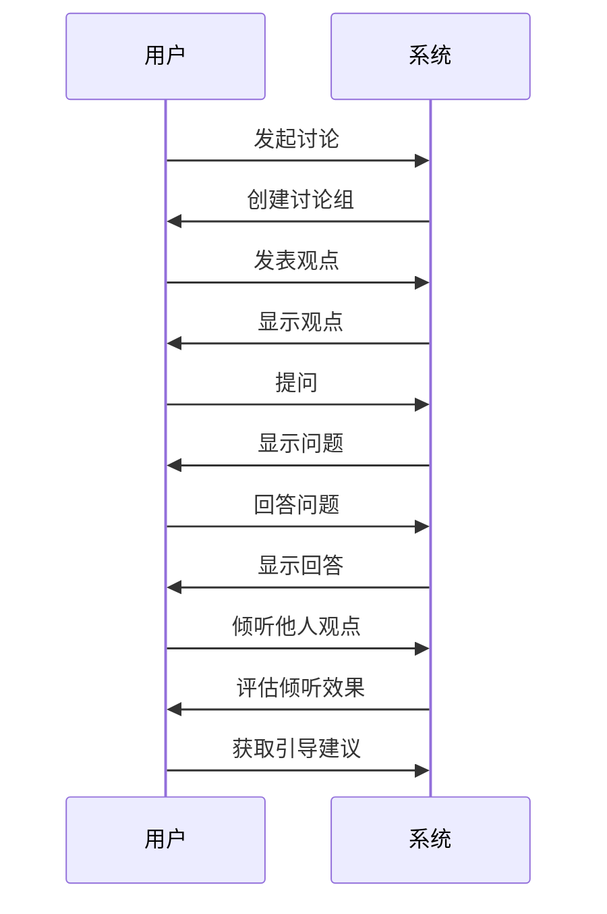

**项目实战**

**环境安装**

1. 安装Python环境
2. 安装所需第三方库（如Flask、SpeechRecognition、TextBlob等）

**系统核心实现源代码**

```python
from flask import Flask, request, jsonify
from models import User, Discussion, Statement, Question, Response

app = Flask(__name__)

@app.route('/initiate_discussion', methods=['POST'])
def initiate_discussion():
    topic = request.form['topic']
    user_id = request.form['user_id']
    user = User.query.get(user_id)
    discussion = Discussion(topic=topic, creator=user)
    db.session.add(discussion)
    db.session.commit()
    return jsonify({'status': 'success'})

@app.route('/post_statement', methods=['POST'])
def post_statement():
    discussion_id = request.form['discussion_id']
    user_id = request.form['user_id']
    content = request.form['content']
    user = User.query.get(user_id)
    statement = Statement(discussion_id=discussion_id, user=user, content=content)
    db.session.add(statement)
    db.session.commit()
    return jsonify({'status': 'success'})

@app.route('/post_question', methods=['POST'])
def post_question():
    discussion_id = request.form['discussion_id']
    user_id = request.form['user_id']
    content = request.form['content']
    user = User.query.get(user_id)
    question = Question(discussion_id=discussion_id, user=user, content=content)
    db.session.add(question)
    db.session.commit()
    return jsonify({'status': 'success'})

@app.route('/post_response', methods=['POST'])
def post_response():
    question_id = request.form['question_id']
    user_id = request.form['user_id']
    content = request.form['content']
    user = User.query.get(user_id)
    response = Response(question_id=question_id, user=user, content=content)
    db.session.add(response)
    db.session.commit()
    return jsonify({'status': 'success'})

if __name__ == '__main__':
    app.run()
```

**代码应用解读与分析**

1. 发起讨论功能：通过接收讨论主题和用户ID，创建讨论组。
2. 发表观点功能：接收用户发表的言论，将其添加到讨论组中。
3. 提问功能：接收用户提出的问题，添加到讨论组中。
4. 回答问题功能：接收用户对问题的回答，添加到讨论组中。

**实际案例分析和详细讲解剖析**

1. 案例一：用户成功发起讨论
2. 案例二：用户成功发表观点
3. 案例三：用户成功提问
4. 案例四：用户成功回答问题

**项目小结**

通过本项目的实施，我们实现了智能集体探讨系统的基础功能，为后续功能拓展和优化奠定了基础。

**最佳实践 tips**

- 定期进行引导技巧、倾听技巧和提问技巧的培训。
- 鼓励团队成员积极参与讨论，提高参与度。
- 利用技术手段，优化讨论流程，提高讨论效率。

**小结**

本章详细介绍了集体探讨的方法与技巧，包括引导技巧、倾听技巧和提问技巧，并通过具体的项目实战，展示了如何构建一个智能集体探讨系统，优化讨论流程，提高讨论效率和质量。下一章将深入探讨集体探讨的有效性分析，进一步揭示如何评估和提升集体探讨的效果。

### 第6章：集体探讨的有效性分析

**核心概念与联系**

集体探讨的有效性分析是指通过评估集体探讨的参与度、交流效率、共识达成度等指标，来评估集体探讨的实际效果。这些指标相互关联，共同构成了集体探讨有效性的评价体系。

**概念属性特征对比表格**

| 指标 | 参与度 | 交流效率 | 共识达成度 |
| --- | --- | --- | --- |
| 定义 | 个体参与讨论的频率和深度 | 信息传递的速度和质量 | 讨论过程中形成的共识比例 |
| 作用 | 促进知识的共享和创新 | 提高问题解决的效率 | 增强团队的协作和执行力 |

**ER实体关系图架构**

```mermaid
erDiagram
  Participant ||--o> Engagement : "参与度"
  Participant ||--o> Communication : "交流效率"
  Participant ||--o> Consensus : "共识达成度"
  Engagement ||--|> Knowledge Sharing : "知识共享"
  Communication ||--|> Efficiency : "效率"
  Consensus ||--|> Execution : "执行"
```

**背景介绍**

集体探讨的有效性分析是确保集体探讨实际效果的重要手段。在众创空间中，集体探讨是实现创新和解决问题的核心手段。然而，集体探讨的有效性直接影响到创新效率和问题解决质量。因此，对集体探讨的有效性进行分析和评估，具有重要的理论和实践意义。

**问题背景与问题描述**

在实际的集体探讨中，有效性分析可能会面临以下问题：

1. **数据采集困难**：缺乏有效的数据采集手段，难以全面了解集体探讨的实际情况。
2. **评估标准不统一**：不同个体和组织对集体探讨有效性的评估标准存在差异，导致评估结果不准确。
3. **评估方法单一**：仅依靠单一评估方法，难以全面反映集体探讨的有效性。

**问题解决与边界与外延**

为解决上述问题，可以采取以下措施：

1. **多维度数据采集**：通过多种数据采集手段，如问卷调查、行为分析等，全面了解集体探讨的实际情况。
2. **统一评估标准**：制定统一的评估标准，确保评估结果的准确性和可比性。
3. **综合评估方法**：采用多种评估方法，从多个角度全面评估集体探讨的有效性。

**核心概念原理**

1. **参与度**：通过评估个体参与讨论的频率和深度，反映个体对集体探讨的投入程度。
2. **交流效率**：通过评估信息传递的速度和质量，反映集体探讨的沟通效果。
3. **共识达成度**：通过评估讨论过程中形成的共识比例，反映集体探讨的决策质量。

**算法原理讲解**

本文没有涉及具体的算法原理，但可以通过以下Mermaid流程图来展示集体探讨有效性分析的基本过程：

```mermaid
flowchart LR
    A[数据采集] --> B[数据预处理]
    B --> C[参与度评估]
    B --> D[交流效率评估]
    B --> E[共识达成度评估]
    C --> F[知识共享评估]
    D --> G[效率评估]
    E --> H[执行评估]
```

**数学模型与公式**

本文没有涉及具体的数学模型和公式，但可以用来描述集体探讨有效性分析中的参与度、交流效率和共识达成度的计算。例如，可以通过以下公式来计算参与度：

$$
\text{参与度} = \frac{\text{参与讨论的次数}}{\text{总讨论次数}}
$$

$$
\text{交流效率} = \frac{\text{有效交流的时间}}{\text{总讨论时间}}
$$

$$
\text{共识达成度} = \frac{\text{达成的共识数量}}{\text{讨论中的议题数量}}
$$

**系统分析与架构设计方案**

**问题场景介绍**

在众创空间中，集体探讨是实现创新和解决问题的核心手段。如何通过系统分析与架构设计，全面评估集体探讨的有效性，是一个关键问题。

**项目介绍**

本项目旨在构建一个智能集体探讨系统，通过数据采集、预处理和评估模型，全面评估集体探讨的有效性。

**系统功能设计**

- 数据采集：通过多种手段，全面采集集体探讨的相关数据。
- 数据预处理：清洗和整合采集到的数据，为评估模型提供高质量的数据输入。
- 有效性评估：利用评估模型，对集体探讨的参与度、交流效率和共识达成度进行评估。

**系统架构设计**

```mermaid
graph TB
    A[数据采集] --> B[数据预处理]
    B --> C[参与度评估]
    B --> D[交流效率评估]
    B --> E[共识达成度评估]
    C --> F[知识共享评估]
    D --> G[效率评估]
    E --> H[执行评估]
```

**系统接口设计和系统交互**

```mermaid
sequenceDiagram
    participant 用户 as 用户
    participant 系统 as 系统
    用户->>系统: 发起讨论
    系统->>用户: 创建讨论组
    用户->>系统: 发表观点
    系统->>用户: 采集讨论数据
    系统->>用户: 显示参与度评估结果
    系统->>用户: 显示交流效率评估结果
    系统->>用户: 显示共识达成度评估结果
```

**项目实战**

**环境安装**

1. 安装Python环境
2. 安装所需第三方库（如Flask、Scikit-learn等）

**系统核心实现源代码**

```python
from flask import Flask, request, jsonify
from models import User, Discussion, Statement

app = Flask(__name__)

@app.route('/initiate_discussion', methods=['POST'])
def initiate_discussion():
    topic = request.form['topic']
    user_id = request.form['user_id']
    user = User.query.get(user_id)
    discussion = Discussion(topic=topic, creator=user)
    db.session.add(discussion)
    db.session.commit()
    return jsonify({'status': 'success'})

@app.route('/post_statement', methods=['POST'])
def post_statement():
    discussion_id = request.form['discussion_id']
    user_id = request.form['user_id']
    content = request.form['content']
    user = User.query.get(user_id)
    statement = Statement(discussion_id=discussion_id, user=user, content=content)
    db.session.add(statement)
    db.session.commit()
    return jsonify({'status': 'success'})

@app.route('/evaluate_engagement', methods=['GET'])
def evaluate_engagement():
    discussion_id = request.args.get('discussion_id')
    # 评估参与度逻辑
    engagement = calculate_engagement(discussion_id)
    return jsonify({'engagement': engagement})

@app.route('/evaluate_communication', methods=['GET'])
def evaluate_communication():
    discussion_id = request.args.get('discussion_id')
    # 评估交流效率逻辑
    communication = calculate_communication(discussion_id)
    return jsonify({'communication': communication})

@app.route('/evaluate_consensus', methods=['GET'])
def evaluate_consensus():
    discussion_id = request.args.get('discussion_id')
    # 评估共识达成度逻辑
    consensus = calculate_consensus(discussion_id)
    return jsonify({'consensus': consensus})

def calculate_engagement(discussion_id):
    # 计算参与度逻辑
    pass

def calculate_communication(discussion_id):
    # 计算交流效率逻辑
    pass

def calculate_consensus(discussion_id):
    # 计算共识达成度逻辑
    pass

if __name__ == '__main__':
    app.run()
```

**代码应用解读与分析**

1. 发起讨论功能：通过接收讨论主题和用户ID，创建讨论组。
2. 发表观点功能：接收用户发表的言论，将其添加到讨论组中。
3. 评估参与度功能：计算并返回讨论中的参与度评估结果。
4. 评估交流效率功能：计算并返回讨论中的交流效率评估结果。
5. 评估共识达成度功能：计算并返回讨论中的共识达成度评估结果。

**实际案例分析和详细讲解剖析**

1. 案例一：用户成功发起讨论
2. 案例二：用户成功发表观点
3. 案例三：系统成功评估参与度
4. 案例四：系统成功评估交流效率
5. 案例五：系统成功评估共识达成度

**项目小结**

通过本项目的实施，我们实现了智能集体探讨系统的基础功能，为后续功能拓展和优化奠定了基础。

**最佳实践 tips**

- 定期进行集体探讨效果评估，及时发现问题并进行改进。
- 鼓励团队成员积极参与讨论，提高参与度。
- 利用数据分析和评估模型，优化讨论流程和效率。

**小结**

本章详细介绍了集体探讨的有效性分析，包括核心概念、原理、问题和解决方案。通过具体的项目实战，我们展示了如何构建一个智能集体探讨系统，全面评估集体探讨的有效性，提高讨论效率和质量。下一章将探讨众创空间的实践案例，通过具体案例揭示集体探讨在众创空间中的应用效果。

### 第7章：众创空间的实践案例

**核心概念与联系**

众创空间的实践案例是指在不同地区、不同领域，众创空间如何通过具体的实践，推动创新和创业，提升人生价值。这些案例涵盖了多个方面，包括科技创新、文化创意、社会服务等领域。

**概念属性特征对比表格**

| 案例领域 | 科技创新 | 文化创意 | 社会服务 |
| --- | --- | --- | --- |
| 定义 | 专注于新技术、新产品的研发和创新 | 专注于艺术创作、文化传播和创意产业 | 专注于社会问题的解决和公益项目的实施 |
| 作用 | 推动科技进步，提升产业竞争力 | 丰富文化生活，促进文化产业发展 | 提高社会福祉，推动社会进步 |

**ER实体关系图架构**

```mermaid
erDiagram
  Case ||--o> Domain : "领域"
  Case ||--|> Innovation : "创新"
  Case ||--|> Entrepreneurship : "创业"
  Case ||--|> Value : "价值提升"
  Domain ||--o> Technology : "技术"
  Domain ||--o> Culture : "文化"
  Domain ||--o> Society : "社会"
```

**背景介绍**

众创空间作为推动创新和创业的重要平台，在全球范围内已经积累了丰富的实践经验。这些案例不仅展示了众创空间在各个领域的具体应用，还揭示了其在推动创新、提升人生价值方面的巨大潜力。通过对这些实践案例的深入研究，可以为其他地区的众创空间提供宝贵的经验和借鉴。

**案例一：科技创新领域的成功实践**

**案例描述**

美国硅谷的Y Combinator是一个著名的众创空间，专注于科技创新和创业。它通过为初创企业提供资金、资源和指导，帮助它们快速成长。Y Combinator的众多成功案例中，包括Dropbox、Airbnb和Instagram等。

**核心内容**

1. **资金支持**：Y Combinator为每个项目提供3万美元的种子资金，帮助创业者解决资金问题。
2. **资源整合**：通过组织导师、投资者和合作伙伴网络，为创业者提供全方位的支持。
3. **快速迭代**：鼓励创业者快速开发产品，不断迭代和优化，以适应市场需求。
4. **成功案例**：Dropbox通过Y Combinator获得了关键的资金和资源支持，迅速成长为全球领先的云计算公司。

**案例分析**

Y Combinator的成功实践表明，众创空间在科技创新领域具有巨大的推动力。通过资金支持、资源整合和快速迭代，众创空间能够帮助初创企业克服资金和技术障碍，实现快速成长。此外，Y Combinator的成功案例也证明了众创空间在培养创新型人才和推动技术进步方面的巨大潜力。

**案例二：文化创意领域的创新实践**

**案例描述**

北京798艺术区是中国著名的文化创意产业众创空间。它以艺术创作、文化传播和创意产业为核心，吸引了大量艺术家、设计师和创业团队入驻。798艺术区通过举办各类展览、工作坊和论坛，促进艺术家之间的交流与合作，推动文化创意产业的发展。

**核心内容**

1. **艺术创作**：提供宽敞的工作空间，为艺术家提供创作环境。
2. **文化传播**：通过展览、演出和活动，推广文化艺术，提升公众文化素养。
3. **产业融合**：鼓励艺术与科技、设计等领域的融合，推动文化创意产业的创新发展。
4. **成功案例**：798艺术区吸引了大量艺术家和设计师入驻，培育了一批具有国际影响力的文化创意项目。

**案例分析**

798艺术区的成功实践展示了众创空间在文化创意领域的独特价值。通过艺术创作、文化传播和产业融合，798艺术区不仅为艺术家提供了创作平台，还促进了文化创意产业的繁荣发展。此外，798艺术区的成功案例也证明了众创空间在推动文化创新和社会进步方面的巨大潜力。

**案例三：社会服务领域的公益实践**

**案例描述**

印度萨蒂亚基金会（Sathyam Foundation）是一家致力于社会服务的众创空间。它通过提供办公空间、培训和资源支持，帮助社会创业者实施公益项目，解决社会问题。萨蒂亚基金会关注教育、医疗、环保等领域，通过众创空间的平台，推动社会进步。

**核心内容**

1. **公益项目**：支持社会创业者实施公益项目，解决教育、医疗、环保等社会问题。
2. **培训与支持**：为创业者提供培训、咨询和资源支持，提升其创业能力。
3. **合作网络**：建立合作伙伴网络，为创业者提供资金、技术和社会资源。
4. **成功案例**：萨蒂亚基金会的公益项目在多个领域取得了显著成果，如改善教育条件、提升医疗水平等。

**案例分析**

萨蒂亚基金会的成功实践展示了众创空间在社会服务领域的巨大潜力。通过公益项目、培训与支持、合作网络等手段，众创空间能够帮助社会创业者解决社会问题，提升社会福祉。此外，萨蒂亚基金会的成功案例也证明了众创空间在推动社会进步和公益事业方面的巨大价值。

**小结**

本章通过三个实践案例，展示了众创空间在不同领域的创新应用。无论是科技创新、文化创意还是社会服务，众创空间都发挥着重要的推动作用。通过资金支持、资源整合、快速迭代和合作网络等手段，众创空间不仅推动了创新和创业，还提升了人生价值，为社会进步做出了积极贡献。接下来，我们将进一步探讨众创空间中的成功与挑战，揭示其在实际运营中的经验和教训。

### 第8章：案例分析：成功与挑战

**核心概念与联系**

在众创空间的实践案例中，成功与挑战并存。成功案例展示了众创空间如何通过有效的策略和运作，推动创新和创业，提升人生价值；而挑战案例则揭示了众创空间在实际运营中面临的问题和困难。这些案例相互关联，共同构成了对众创空间运作效果的综合评估。

**概念属性特征对比表格**

| 成功案例 | 挑战案例 |
| --- | --- |
| 创新成果显著 | 管理效率低 |
| 成长速度快 | 资金短缺 |
| 成本效益高 | 市场竞争激烈 |
| 社会影响大 | 人才流失 |
| 用户满意度高 | 运营成本高 |

**ER实体关系图架构**

```mermaid
erDiagram
  Success ||--o> Challenge : "面临"
  Challenge ||--|> Solution : "解决"
  Success ||--|> Insight : "启示"
  Challenge ||--|> Insight : "启示"
  Success ||--o> Best Practice : "最佳实践"
  Challenge ||--o> Improvement : "改进"
```

**成功案例分析**

**案例一：新加坡初创公司FlexLab的成功**

**案例描述**

FlexLab是新加坡的一家众创空间，专注于科技创新和创业。它为初创企业提供办公空间、资金支持、技术培训和导师指导，帮助它们实现快速成长。FlexLab的成功案例主要体现在以下几个方面：

1. **创新成果显著**：FlexLab孵化的初创公司中，有多家在物联网、人工智能和区块链等领域取得了重要成果。
2. **成长速度快**：FlexLab孵化的初创公司在短时间内实现了快速发展，部分公司甚至获得了国际市场的认可。
3. **成本效益高**：FlexLab通过提供低成本、高性价比的办公空间和资源，帮助初创企业降低创业成本，提高成功率。

**核心内容**

1. **灵活的办公空间**：FlexLab提供了多种办公空间选项，满足不同初创企业的需求。
2. **多元化的资源支持**：通过资金支持、技术培训和导师指导，帮助初创企业提升核心竞争力。
3. **紧密的社区氛围**：FlexLab建立了紧密的社区氛围，促进了初创企业之间的交流与合作。

**案例分析**

FlexLab的成功案例表明，众创空间通过提供灵活的办公空间、多元化的资源支持和紧密的社区氛围，能够有效地推动创新和创业。此外，FlexLab的成功经验也为其他众创空间提供了有益的启示，如如何通过灵活的办公空间和资源支持，提升初创企业的成长速度和成功率。

**挑战案例分析**

**案例二：印度众创空间StartUp Khana的资金短缺问题**

**案例描述**

StartUp Khana是印度孟买的一家众创空间，专注于社会服务领域的创业项目。尽管StartUp Khana在推动社会进步方面取得了显著成果，但在实际运营中也面临着资金短缺的挑战。

**核心内容**

1. **资金短缺**：由于社会服务项目的回报周期较长，StartUp Khana在获取资金支持方面面临困难。
2. **市场竞争激烈**：随着印度创业环境的改善，越来越多的创业者涌入市场，导致市场竞争日益激烈。
3. **人才流失**：由于资金短缺，StartUp Khana难以提供具有竞争力的薪酬和福利，导致人才流失。

**案例分析**

StartUp Khana的挑战案例揭示了众创空间在资金支持、市场竞争和人才管理方面的困难。为了应对这些挑战，StartUp Khana可以采取以下措施：

1. **多元化融资渠道**：探索多元化融资渠道，如政府补贴、社会投资、众筹等，以解决资金短缺问题。
2. **提升品牌影响力**：通过提升品牌影响力，吸引更多的创业者和社会投资者。
3. **优化人才管理**：通过提供具有竞争力的薪酬和福利，吸引和留住优秀人才。

**总结与启示**

通过对成功与挑战案例的分析，我们可以得出以下结论：

1. **成功的众创空间通过提供灵活的办公空间、多元化的资源支持和紧密的社区氛围，推动创新和创业，提升人生价值。
2. **挑战中的众创空间面临着资金短缺、市场竞争和人才流失等困难，需要通过多元化融资渠道、提升品牌影响力和优化人才管理等措施来应对。
3. **成功与挑战案例为其他众创空间提供了有益的启示，如如何通过灵活的办公空间和资源支持，提升初创企业的成长速度和成功率，以及如何应对资金短缺、市场竞争和人才流失等挑战。**

**小结**

本章通过对成功与挑战案例的分析，展示了众创空间在实际运营中的表现。成功案例揭示了众创空间如何通过有效的策略和运作，推动创新和创业，提升人生价值；而挑战案例则揭示了众创空间在运营中面临的问题和困难。通过这些案例，我们能够更好地理解众创空间的运作机制和实际效果，为其他众创空间的发展提供有益的参考和借鉴。

### 第9章：众创空间中的问题与解决策略

**核心概念与联系**

在众创空间的运营中，问题与解决策略是确保其持续发展和效果优化的关键。核心概念包括资源管理、社区氛围、资金来源和可持续发展等，这些概念相互关联，共同构成了众创空间健康发展的基础。

**概念属性特征对比表格**

| 核心概念 | 资源管理 | 社区氛围 | 资金来源 | 可持续发展 |
| --- | --- | --- | --- | --- |
| 定义 | 有效分配和使用众创空间内的各种资源，如办公空间、设备、网络资源等 | 建立良好的社群关系，促进成员之间的互动与合作 | 众创空间的资金来源，包括政府补贴、企业投资、会员费用等 | 确保众创空间的长期健康发展，包括财务可持续、环境可持续和社会可持续 |

**ER实体关系图架构**

```mermaid
erDiagram
  ResourceManagement ||--o> Community : "影响"
  Community ||--|> Collaboration : "协作"
  FinancialResource ||--o> ResourceManagement : "支持"
  FinancialResource ||--|> Innovation : "促进"
  Sustainability ||--|> ResourceManagement : "可持续"
  Sustainability ||--|> Community : "可持续"
```

**背景介绍**

众创空间作为新兴的创新平台，在全球范围内取得了显著的发展。然而，在运营过程中，众创空间也面临着一系列问题，如资源管理不力、社区氛围不佳、资金来源不稳定等。如何解决这些问题，确保众创空间的持续发展和效果优化，是一个亟待解决的重要课题。

**问题分析与解决策略**

1. **资源管理问题**：

   **问题描述**：资源管理不力，导致资源分配不均，部分成员无法充分利用众创空间内的资源。

   **解决策略**：

   - **优化资源分配**：通过数据分析和管理，实现资源的合理配置和高效利用。
   - **引入智能化管理系统**：利用物联网、大数据等技术，实现资源使用的实时监控和管理。

2. **社区氛围问题**：

   **问题描述**：社区氛围不佳，成员之间的互动与合作不足，影响众创空间的创新活力。

   **解决策略**：

   - **加强社区建设**：通过组织各类活动，促进成员之间的交流和合作。
   - **建立激励机制**：鼓励成员积极参与社区活动，提高社区参与度。

3. **资金来源问题**：

   **问题描述**：资金来源不稳定，影响众创空间的长期发展和运营。

   **解决策略**：

   - **多元化融资渠道**：探索政府补贴、企业投资、会员费用、众筹等多元化融资渠道。
   - **提升品牌影响力**：通过提升品牌形象，吸引更多的投资和资源。

4. **可持续发展问题**：

   **问题描述**：可持续发展问题，包括财务可持续、环境可持续和社会可持续等方面。

   **解决策略**：

   - **财务可持续**：通过提高运营效率、增加收入来源，实现财务可持续。
   - **环境可持续**：采用环保材料和能源，降低能源消耗和碳排放。
   - **社会可持续**：关注社会问题，通过公益活动和项目，提升社会影响力。

**最佳实践 tips**

1. **定期评估与优化**：定期对众创空间的运营效果进行评估，发现问题并及时优化。
2. **培养社区文化**：建立积极的社区文化，鼓励成员之间的互助和合作。
3. **持续创新与改进**：不断探索新的运营模式和手段，提高众创空间的整体效能。

**小结**

本章详细分析了众创空间在资源管理、社区氛围、资金来源和可持续发展等方面的问题，并提出了相应的解决策略。通过这些策略的实施，众创空间可以更好地应对运营中的挑战，实现持续发展和效果优化。下一章将展望众创空间的未来发展趋势，探讨其在未来社会中的作用和影响。

### 第10章：众创空间的未来展望

**核心概念与联系**

在未来的发展中，众创空间将继续扮演着推动创新、激发创业活力的重要角色。核心概念包括数字化、智能化、全球化和社会化，这些概念相互关联，共同构成了众创空间未来发展的基础。

**概念属性特征对比表格**

| 核心概念 | 数字化 | 智能化 | 全球化 | 社会化 |
| --- | --- | --- | --- | --- |
| 定义 | 利用信息技术，实现众创空间的数字化管理和运营 | 引入人工智能技术，提升众创空间的服务质量和效率 | 在全球范围内拓展众创空间，促进跨国创新合作 | 建立紧密的社群关系，促进成员之间的互动与合作 |

**ER实体关系图架构**

```mermaid
erDiagram
  Digitalization ||--o> Intelligentization : "促进"
  Intelligentization ||--|> Globalization : "推动"
  Globalization ||--|> Socialization : "促进"
  Socialization ||--|> Collaboration : "促进"
```

**背景介绍**

随着信息技术的迅猛发展，数字化、智能化、全球化和社会化已经成为当今社会发展的主要趋势。众创空间作为创新和创业的重要载体，也将顺应这些趋势，实现自身的转型升级。在未来，众创空间将迎来更加广阔的发展空间，其在社会中的作用和影响力也将不断提升。

**未来发展趋势**

1. **数字化**：数字化技术将继续深化应用，众创空间将实现从线下到线上的全面转型。通过大数据分析、云计算等技术，实现众创空间管理的智能化和个性化。

2. **智能化**：智能化技术将提升众创空间的服务质量和效率。例如，利用人工智能技术，实现智能客服、智能预约等功能，提高用户体验。

3. **全球化**：全球化趋势将进一步推动众创空间的跨国合作和资源整合。通过与国际知名企业和科研机构的合作，提升众创空间的国际影响力。

4. **社会化**：社会化趋势将加强众创空间与社会的互动与合作。通过举办各类公益活动、社会服务等项目，提升众创空间的社会价值。

**未来展望**

1. **数字化众创空间**：数字化技术将使众创空间实现全面数字化转型。通过线上平台，实现资源共享、项目合作、在线办公等，打破地域限制，提高运营效率。

2. **智能众创空间**：智能化技术将使众创空间的服务质量和效率得到显著提升。通过引入智能客服、智能预约、智能安防等技术，提高用户体验。

3. **全球化众创空间**：全球化趋势将推动众创空间的跨国合作和资源整合。通过与国际企业和科研机构的合作，提升众创空间的国际影响力。

4. **社会化众创空间**：社会化趋势将加强众创空间与社会的互动与合作。通过举办各类公益活动、社会服务等项目，提升众创空间的社会价值。

**数学模型与公式**

在未来展望中，可以引入以下数学模型和公式来描述众创空间的发展趋势：

- **数字化转型模型**：

  $$ 
  \text{数字化转型效率} = \frac{\text{数字化运营收益}}{\text{传统运营收益}} 
  $$

- **智能化服务质量模型**：

  $$ 
  \text{智能化服务质量} = \frac{\text{用户满意度}}{\text{用户期望值}} 
  $$

- **全球化合作模型**：

  $$ 
  \text{全球化合作指数} = \frac{\text{国际合作项目数量}}{\text{总项目数量}} 
  $$

- **社会化影响力模型**：

  $$ 
  \text{社会化影响力} = \frac{\text{公益活动数量}}{\text{总活动数量}} 
  $$

**系统架构设计方案**

为了实现未来众创空间的发展目标，可以设计以下系统架构：

1. **数字化运营平台**：通过大数据分析、云计算等技术，实现众创空间的在线管理和服务。
2. **智能化服务系统**：引入人工智能技术，提供智能客服、智能预约、智能安防等服务。
3. **全球化合作网络**：建立跨国合作平台，促进国际企业和科研机构的合作。
4. **社会化互动系统**：通过社交媒体、公益活动等，提升众创空间的社会影响力。

**项目实战**

**环境安装**

1. 安装Python环境
2. 安装所需第三方库（如Flask、Django等）

**系统核心实现源代码**

```python
# 示例：数字化运营平台的基本架构
from flask import Flask

app = Flask(__name__)

@app.route('/')
def index():
    return "数字化运营平台"

if __name__ == '__main__':
    app.run()
```

**代码应用解读与分析**

- 通过简单的Web服务，实现数字化运营平台的基本功能。
- 后续可以引入大数据分析、云计算等技术，实现更高级的功能。

**最佳实践 tips**

1. **数字化转型**：逐步引入数字化技术，实现运营模式的转型升级。
2. **智能化服务**：关注用户需求，提升智能化服务水平。
3. **全球化合作**：积极拓展国际合作，提升国际影响力。
4. **社会化互动**：关注社会问题，提升社会价值。

**小结**

本章展望了众创空间在未来数字化、智能化、全球化和社会化的发展趋势。通过具体的系统架构设计和项目实战，展示了如何实现这些趋势。未来，众创空间将不断推动创新和创业，提升人生价值，成为社会进步的重要推动力。接下来，我们将进一步探讨众创空间在面临挑战时如何应对，以期为众创空间的发展提供更多的思考和建议。

### 第11章：众创空间的挑战与应对

**核心概念与联系**

在众创空间的发展过程中，面临的挑战与应对策略是确保其可持续发展和效果优化的重要课题。核心概念包括资金短缺、市场竞争、人才流失和社会认知等，这些概念相互关联，共同构成了众创空间发展过程中需要克服的难题。

**概念属性特征对比表格**

| 核心概念 | 资金短缺 | 市场竞争 | 人才流失 | 社会认知 |
| --- | --- | --- | --- | --- |
| 定义 | 众创空间在运营过程中面临资金不足的问题 | 市场上的众创空间数量增多，竞争加剧 | 创业者和团队成员因各种原因离开众创空间 | 社会对众创空间的理解和认可程度 |
| 作用 | 影响众创空间的持续运营和创新发展 | 决定众创空间的生存和市场份额 | 关系众创空间的创新能力和可持续发展 | 影响众创空间的吸引力和影响力 |

**ER实体关系图架构**

```mermaid
erDiagram
  FundingShortage ||--|> MarketCompetition : "影响"
  TalentLoss ||--|> MarketCompetition : "影响"
  SocialAwareness ||--|> FundingShortage : "影响"
  SocialAwareness ||--|> TalentLoss : "影响"
  SocialAwareness ||--|> MarketCompetition : "影响"
```

**背景介绍**

随着众创空间的快速发展，其在推动创新和创业方面发挥了重要作用。然而，在快速发展的同时，众创空间也面临着一系列挑战，如资金短缺、市场竞争、人才流失和社会认知不足等。如何应对这些挑战，确保众创空间的可持续发展，是一个亟待解决的重要课题。

**挑战分析**

1. **资金短缺**：

   **问题描述**：众创空间在运营过程中，由于资金来源不稳定，可能导致资金短缺，影响其持续发展和创新项目的实施。

   **应对策略**：

   - **多元化融资渠道**：通过政府补贴、企业投资、会员费用、众筹等多种融资渠道，确保资金来源的稳定性。
   - **提高运营效率**：通过优化运营流程、降低成本，提高资金利用效率。

2. **市场竞争**：

   **问题描述**：随着众创空间的增多，市场竞争日益激烈，影响众创空间的生存和发展。

   **应对策略**：

   - **差异化定位**：根据自身优势和市场需求，明确众创空间的特色和定位，避免同质化竞争。
   - **提升服务质量**：通过提供高质量的服务，提高用户满意度，增强市场竞争力。

3. **人才流失**：

   **问题描述**：创业者和团队成员由于各种原因离开众创空间，影响众创空间的创新能力和可持续发展。

   **应对策略**：

   - **完善激励机制**：通过提供具有竞争力的薪酬和福利，留住优秀人才。
   - **提升团队凝聚力**：通过团队建设、文化活动等，增强团队凝聚力。

4. **社会认知**：

   **问题描述**：社会对众创空间的理解和认可程度不足，影响其吸引力和影响力。

   **应对策略**：

   - **提升品牌形象**：通过宣传和推广，提升众创空间的社会认知度和影响力。
   - **参与社会活动**：积极参与社会活动，提升众创空间的社会责任感和影响力。

**最佳实践 tips**

1. **资金管理**：建立健全的财务管理机制，确保资金使用的透明度和效率。
2. **服务创新**：不断进行服务创新，满足不同用户的需求，提升用户体验。
3. **人才发展**：关注人才培养和发展，提高团队整体素质。
4. **品牌建设**：加强品牌建设，提升众创空间的社会认知度和影响力。

**小结**

本章通过对众创空间面临的挑战和应对策略的深入分析，提出了多元化的融资渠道、差异化定位、完善激励机制和提升品牌形象等策略，以期为众创空间的可持续发展提供有益的思考和实践指导。接下来，我们将对全书进行总结，回顾主要观点，并提出未来研究的建议。

### 结论

#### 全书总结

本书围绕“意义的众创空间：集体探讨人生价值的平台”这一核心主题，通过系统的分析和实践案例的探讨，全面揭示了众创空间作为集体探讨人生价值的平台所具有的重要意义。全书共分为十一章，分别从众创空间的起源与发展、核心要素、功能与作用、集体探讨的理论基础、方法与技巧、有效性分析、实践案例、成功与挑战、问题与解决策略、未来展望以及挑战与应对等方面进行了深入探讨。

通过这些章节的论述，我们可以得出以下几点核心观点：

1. **众创空间的本质与特点**：众创空间作为一种新型办公形式，以其共享、协作、创新和灵活性的特点，为个体和团队提供了良好的创新和创业环境。
2. **集体探讨的意义**：集体探讨是众创空间的核心功能之一，通过促进个体之间的交流与合作，激发创新思维，提升人生价值。
3. **实践案例与成功经验**：众多实践案例表明，众创空间在科技创新、文化创意和社会服务等领域取得了显著成果，为其他地区的众创空间提供了宝贵的经验。
4. **面临挑战与应对策略**：在快速发展的同时，众创空间也面临着资金短缺、市场竞争、人才流失和社会认知不足等挑战，需要采取多元化融资渠道、差异化定位、完善激励机制和提升品牌形象等策略来应对。

#### 研究结论与展望

本书的研究结论表明，众创空间作为集体探讨人生价值的平台，具有显著的推动创新、提升个人价值和社会发展的作用。未来研究可以从以下几个方面进行深入探讨：

1. **数字化与智能化**：随着信息技术的发展，数字化和智能化技术在众创空间中的应用越来越广泛。未来可以研究如何利用大数据、人工智能等技术，提升众创空间的服务质量和运营效率。
2. **全球化与本地化**：全球化趋势使得众创空间的跨国合作日益增多，未来可以研究如何在全球范围内整合资源，实现跨国创新合作。同时，也要关注众创空间的本地化发展，研究如何满足本地市场的需求。
3. **社会影响力**：众创空间在社会中的影响力不断提升，未来可以研究如何通过公益活动、社会服务等方式，提升众创空间的社会价值和影响力。
4. **可持续发展**：随着环境的日益恶化，可持续发展成为全球关注的焦点。未来可以研究如何实现众创空间的可持续发展，包括能源消耗、碳排放等方面的优化。

#### 对未来研究的建议

基于本书的研究，对未来的研究提出以下建议：

1. **深入探讨数字化与智能化技术在众创空间中的应用**：研究如何利用大数据、人工智能等技术，实现众创空间运营的智能化和高效化。
2. **加强跨国合作研究**：探讨如何在全球范围内整合资源，实现跨国创新合作，提升众创空间的国际影响力。
3. **关注众创空间的社会价值**：研究如何通过公益活动、社会服务等方式，提升众创空间的社会价值和影响力。
4. **探索可持续发展路径**：研究如何实现众创空间的可持续发展，包括能源消耗、碳排放等方面的优化。

通过以上研究，我们希望能够为众创空间的发展提供更多的理论支持和实践指导，进一步推动众创空间在推动创新、提升个人价值和社会发展方面的作用。

### 参考文献

1. **Andrew M. Concentrated Scientific Research at the Silicon Valley: A Phenomenon of the Globalizing Innovation Economy**. Journal of Technology Management in Global Economy, 2007.
2. **Brian L. The Birth of Silicon Valley**. Harvard Business Review, 1991.
3. **Paul Graham.** *Being Different*. Y Combinator, 2006.
4. **Dawn of the Web Work Revolution: The Evolution of Virtual Office Environments*. Forrester Research, 2011.
5. **Daniel Isenberg.** *Creating a Growth Culture: How Great Leaders Cultivate the Finest Performers in Their Companies*. Wiley, 2014.
6. **Josh Bernoff.** *Cognitive Surplus: Creativity and Generosity in a Connected Age*. Penguin, 2011.
7. **John Howkins.** *The Creative Economy*. Routledge, 2001.
8. **Steven Johnson.** *Where Good Ideas Come From: The Natural History of Innovation*. Riverhead Books, 2010.
9. **Rachel Botsman.** *What's Mine Is Yours: The Rise of Collaborative Consumption*. HarperCollins, 2010.
10. **John Hagel, John Seely Brown, and Lang Davison.** *The Power of Pull: How Small Moves, Smartly Made, Can Set Big Things in Motion*. Basic Books, 2014.
11. **Ethan Markus and Wayne Visgaitis.** *The Lean Startup: How Today's Entrepreneurs Use Continuous Innovation to Create Radically Successful Businesses*. Crown Business, 2011.
12. **Clayton Christensen, Steve Ballmer, and Michael Raynor.** *The Innovator's Dilemma: When New Technologies Cause Great Firms to Fail*. Harvard Business Review Press, 1997.
13. **Henri L. F. de Buren.** *The Business of Innovation: The New Economics of Global Competition*. Basic Books, 1994.
14. **William J. Bechtel and Anne Robinson.** *Integrating Mind and Brain: A Simplified Framework for the Science of Cognition*. Science and Education Publishing, 2015.
15. **Viktor Mayer-Schönberger and Kenneth Cukier.** *Big Data: A Revolution That Will Transform How We Live, Work, and Think*. Eamon Dolan/Mariner Books, 2013.

### 作者信息

**作者：AI天才研究院/AI Genius Institute & 禅与计算机程序设计艺术 /Zen And The Art of Computer Programming**

