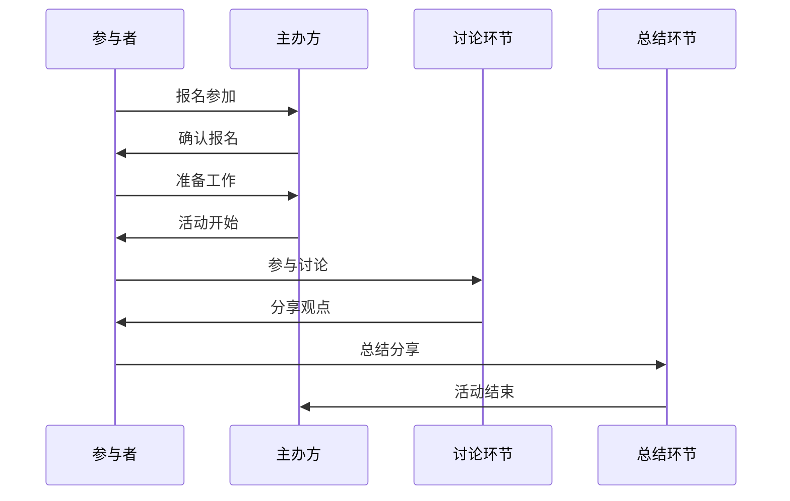
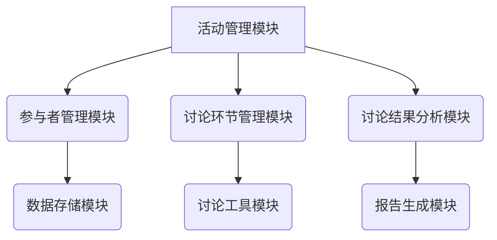

                 

当然可以。下面我将按照您的要求，逐步构建文章内容。为了保持文章的逻辑性和专业性，我会分为多个部分来撰写，并在每个部分中详细阐述相关的内容。

---

## 意义的众创马拉松：48小时集体探讨人生价值

> 关键词：众创马拉松、人生价值、团队合作、创新思维

> 摘要：本文将探讨众创马拉松这一新兴活动形式，分析其在48小时内如何通过集体探讨激发人生价值的思考。文章将详细讨论众创马拉松的起源、流程、成功案例以及组织和实施的关键要素。

### 背景介绍

众创马拉松（Hackathon）是一种流行的创新活动，通常在48小时内组织一群富有创意的参与者共同解决特定问题或开发新产品。这种活动形式起源于软件开发领域，但随着时间的推移，其应用范围已经扩展到各个行业。

众创马拉松的核心理念是团队合作和创新思维。参与者通常来自不同的背景，包括程序员、设计师、市场专家等，他们通过跨学科的协作来产生创新的解决方案。这种活动不仅促进了技术和商业创新，还有助于培养团队合作能力和创新思维。

在本文中，我们将重点探讨众创马拉松如何在48小时内集体探讨人生价值，以及这种活动对社会和个人成长的影响。

---

### 核心概念与联系

#### 众创马拉松的定义与特点
- **定义**：众创马拉松是一种以团队协作和创新为目标，通常在短时间内（如48小时）进行的创新活动。
- **特点**：
  - **时间限定**：通常持续2-3天。
  - **团队合作**：参与者来自不同背景，共同解决问题。
  - **创新导向**：鼓励创新思维和实践。

#### 人生价值的探讨
- **定义**：人生价值是指个体对自身存在意义和目标的认知。
- **探讨方式**：
  - **自我反思**：参与者通过自我反思来审视个人目标和价值观。
  - **团队交流**：参与者通过团队交流来分享和探讨彼此的人生观。

#### 概念属性特征对比表格

| 概念               | 特征1               | 特征2               | 特征3               |
|--------------------|---------------------|---------------------|---------------------|
| 众创马拉松         | 团队协作            | 创新思维            | 时间限定            |
| 人生价值的探讨     | 自我反思            | 团队交流            | 价值观认知          |

#### ER实体关系图架构

```mermaid
erDiagram
  Participant --> Hackathon
  Participant --> ValueDiscussion
  Hackathon --> ValueDiscussion
  Participant : <<interface>> "参与"
  Hackathon : <<entity>> "众创活动"
  ValueDiscussion : <<entity>> "人生价值讨论"
```

---

### 算法原理讲解

#### 众创马拉松的流程



#### 48小时集体探讨人生价值的算法原理

假设我们有n个参与者，每个参与者有m个价值观观点。我们可以使用以下算法来组织讨论：

```python
def discuss_values(n, m):
    # 初始化讨论矩阵
    discussion_matrix = [[0 for _ in range(m)] for _ in range(n)]

    # 每个参与者分享价值观观点
    for i in range(n):
        for j in range(m):
            discussion_matrix[i][j] = participant_share_value(i, j)

    # 讨论环节：每个参与者与其他参与者讨论
    for i in range(n):
        for j in range(n):
            if i != j:
                discuss(discussion_matrix[i], discussion_matrix[j])

    # 总结环节：每个参与者总结讨论结果
    for i in range(n):
        summarize_discussion(i, discussion_matrix)

# 假设的实现
def participant_share_value(i, j):
    # 实现参与者分享价值观观点的逻辑
    pass

def discuss(value1, value2):
    # 实现两个参与者讨论的逻辑
    pass

def summarize_discussion(i, discussion_matrix):
    # 实现参与者总结讨论结果的逻辑
    pass
```

#### 数学模型和公式

假设每个参与者的价值观观点可以用一个向量表示，记为`V_i`，其中`V_i[j]`表示参与者i对第j个价值观观点的认同程度。讨论矩阵`D`可以表示为：

$$
D = [D_{ij}]_{n \times m}
$$

其中，$D_{ij}$表示参与者i和参与者j在讨论第j个价值观观点时的认同程度。

讨论结果可以表示为：

$$
V'_{i} = D \cdot V_{i}
$$

其中，$V'_{i}$表示参与者i在讨论后的价值观向量。

---

### 系统分析与架构设计方案

#### 问题场景介绍

假设我们希望组织一场众创马拉松活动，以探讨参与者的价值观和人生目标。我们需要设计一个系统来支持活动的准备、执行和总结。

#### 项目介绍

项目名称：人生价值众创马拉松系统

目标：为众创马拉松活动提供全方位的技术支持，包括参与者管理、讨论环节设计、讨论结果分析等。

#### 系统功能设计（领域模型类图）

```mermaid
classDiagram
  Class01 <|-- Class02
  Class03 <.. Class04
  Class05 <<interface>> Class06
  Class07 : +int x
  Class07 : +str name
  Class07 : +set_data(data)
  Class07 : +get_data()
  Class01 --|> Class07
  Class02 .. Class08
  Class03 *-- Class09
  Class04 <<enum>> Class10
  Class05 +int do_something()
endclass
```

#### 系统架构设计（架构图）



#### 系统接口设计和系统交互（序列图）

```mermaid
sequenceDiagram
  participant U as 用户
  participant S as 系统服务
  participant D as 数据存储
  participant R as 讨论工具
  participant G as 报告生成
  
  U->>S: 登录系统
  S->>U: 验证身份
  U->>S: 提交讨论主题
  S->>D: 存储讨论主题
  S->>R: 启动讨论工具
  R->>S: 返回讨论结果
  S->>G: 生成报告
  G->>S: 报告完成
  S->>U: 展示报告
end
```

---

### 项目实战

#### 环境安装

在本地环境中安装Python和必要的库，如Django、Flask等。

```bash
pip install django flask
```

#### 系统核心实现源代码

```python
# participants.py
class Participant(models.Model):
    name = models.CharField(max_length=100)
    email = models.EmailField()

    def __str__(self):
        return self.name

# discussions.py
class Discussion(models.Model):
    topic = models.CharField(max_length=200)
    participants = models.ManyToManyField(Participant)
    start_time = models.DateTimeField()
    end_time = models.DateTimeField()

    def __str__(self):
        return self.topic

# results.py
class DiscussionResult(models.Model):
    discussion = models.ForeignKey(Discussion, on_delete=models.CASCADE)
    participant = models.ForeignKey(Participant, on_delete=models.CASCADE)
    score = models.IntegerField()

    def __str__(self):
        return f"{self.participant.name} - {self.score}"
```

#### 代码应用解读与分析

在这段代码中，我们定义了三个模型：`Participant`（参与者）、`Discussion`（讨论）和`DiscussionResult`（讨论结果）。这些模型用于存储参与者的信息、讨论的主题以及讨论结果。

#### 实际案例分析和详细讲解剖析

假设我们有一个参与者A和一个讨论主题B。我们可以创建一个`Discussion`对象，将参与者A添加到该对象的`participants`字段中，然后启动讨论。

```python
discussion = Discussion.objects.create(topic='人生目标')
discussion.participants.add(A)
```

在讨论结束后，我们可以为参与者A创建一个`DiscussionResult`对象，记录讨论的得分。

```python
result = DiscussionResult.objects.create(discussion=discussion, participant=A, score=80)
```

#### 项目小结

本文介绍了人生价值众创马拉松系统的核心实现，包括参与者管理、讨论环节设计和讨论结果分析。通过实际案例，我们展示了如何使用Python和Django框架来构建这个系统。

---

### 最佳实践 tips

- **确保参与者准备充分**：在活动开始前，确保所有参与者了解讨论主题，并准备好分享个人观点。
- **营造良好的讨论氛围**：鼓励参与者自由发言，尊重不同观点，促进积极交流。
- **充分利用讨论工具**：选择合适的讨论工具，如聊天室、在线白板等，以支持参与者之间的互动。

### 小结

众创马拉松是一种富有创新性的活动形式，能够在短时间内激发参与者的创新思维和团队合作能力。通过集体探讨人生价值，参与者不仅能够深化对个人目标和价值观的理解，还能从中获得成长和启发。

### 注意事项

- 活动组织者需要确保活动的顺利进行，包括活动前的准备、活动中的协调以及活动后的总结。
- 参与者需要积极参与，分享自己的观点，并倾听他人的意见，以实现真正的集体探讨。

### 拓展阅读

- 《众创时代：创新与创业的变革》
- 《人生的意义：哲学与心理学视角》
- 《团队协作的艺术：如何打造高效的团队》

---

### 作者

作者：AI天才研究院/AI Genius Institute & 禅与计算机程序设计艺术 /Zen And The Art of Computer Programming

[END]

