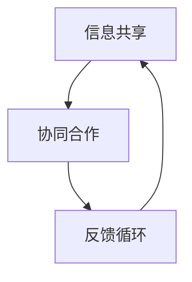
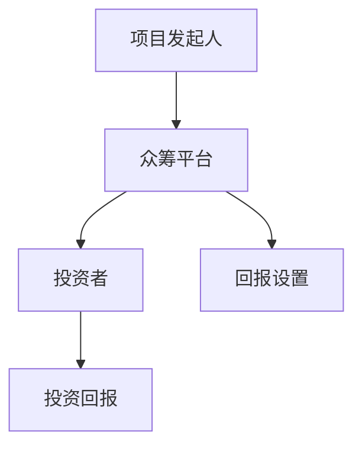

                 

### 意义的众筹：集体智慧时代的价值共创

#### 关键词：意义的众筹，集体智慧，价值共创，众筹模式，案例研究，发展趋势

#### 摘要：
本文深入探讨集体智慧时代下意义的众筹现象，解释其内涵与价值，并分析不同类型的众筹模式如何通过集体智慧实现价值共创。文章通过实践案例和未来展望，为读者揭示这一新兴领域的发展趋势与挑战，提供有价值的策略与建议。

#### 目录大纲设计步骤：

##### 第一步：理解书名和主题
《意义的众筹：集体智慧时代的价值共创》这一书名揭示了本书的核心内容：在集体智慧的环境中，通过众筹机制来实现价值共创。关键词包括“意义的众筹”、“集体智慧”和“价值共创”，这表明本书将深入探讨这些概念，分析它们在实际应用中的相互作用。

##### 第二步：确定核心概念
- **意义的众筹**：不仅关注资金的筹集，更强调知识的分享、资源的整合和社区认同感的建立。
- **集体智慧**：指由多个个体贡献智慧和资源，形成的整体智力和创新能力。
- **价值共创**：个体和集体通过合作和协作，创造出新的价值和意义。

##### 第三步：梳理逻辑框架
本文的逻辑框架如下：
1. 引言：介绍集体智慧时代的背景和众筹的意义。
2. 理论基础：讲解集体智慧的概念、机制和特性。
3. 众筹模式：分析不同类型的众筹模式及其在价值共创中的应用。
4. 实践案例：分享集体智慧与价值共创的典型案例。
5. 趋势与未来：探讨未来集体智慧和众筹的发展方向。

##### 第四步：设计章节标题
根据逻辑框架，为每个部分设计具体的章节标题：

**第一部分：引言**
- 第1章：集体智慧时代的背景
  - 1.1 集体智慧的概念与起源
  - 1.2 众筹的崛起
  - 1.3 意义的众筹：新的价值创造方式
- 第2章：理论基础
  - 2.1 集体智慧的形成机制
  - 2.2 集体智慧的特性
  - 2.3 众筹的机制与模式

**第二部分：众筹模式**
- 第3章：意义众筹模式分析
  - 3.1 资金众筹与意义共创
  - 3.2 知识众筹与意义共创
  - 3.3 资源众筹与意义共创
  - 3.4 认同众筹与意义共创

**第三部分：实践案例**
- 第4章：集体智慧与价值共创的实践案例
  - 4.1 环保众筹项目案例研究
  - 4.2 创意设计众筹案例分析
  - 4.3 社区发展众筹案例研究
  - 4.4 科研项目众筹案例分析

**第四部分：趋势与未来**
- 第5章：集体智慧与众筹的发展趋势
  - 5.1 技术进步与集体智慧的发展
  - 5.2 众筹模式的创新
  - 5.3 集体智慧与价值共创的未来展望
- 第6章：挑战与机遇
  - 6.1 意义众筹面临的挑战
  - 6.2 集体智慧与价值共创的机遇
  - 6.3 应对策略与建议

**第五部分：结论**
- 第7章：总结与展望
  - 7.1 本书要点回顾
  - 7.2 对未来的思考

##### 第五步：优化目录结构
根据内容的复杂性和深度，对章节进行适当的调整，确保目录结构既合理又易于读者理解。

通过以上步骤，我们设计出了《意义的众筹：集体智慧时代的价值共创》的详细目录大纲。接下来，我们将逐步深入每个章节，确保内容完整、具体、有深度。

## 第一部分：引言

### 第1章：集体智慧时代的背景

#### 1.1 集体智慧的概念与起源

**概念解释：**
集体智慧（Collective Wisdom）是指由多个个体通过合作、交流和共享信息而形成的一种综合智力。这种智力不仅超越了单个个体的能力，而且能够解决复杂的问题，产生创新的解决方案。

**起源背景：**
集体智慧的概念源于对社会学、生态学、认知科学等多学科的研究。在历史上，人类社会早就展现了集体智慧的力量，例如古代农民共同耕作、合作狩猎等。然而，随着互联网和信息技术的发展，集体智慧得以在更大范围内实现，形成了一种新的社会现象。

#### 1.2 众筹的崛起

**概念解释：**
众筹（Crowdfunding）是指通过互联网平台，向公众募集资金以支持某个项目或创意。众筹不仅是一种融资方式，更是一种参与和共享的过程。

**崛起背景：**
众筹的崛起可以追溯到21世纪初，随着互联网的普及和社交媒体的发展，人们能够更容易地接触到广泛的潜在投资者。Kickstarter、Indiegogo等平台的出现，使得众筹成为了一种广泛应用的融资手段。

#### 1.3 意义的众筹：新的价值创造方式

**概念解释：**
意义的众筹（Meaningful Crowdfunding）强调众筹不仅仅是资金的筹集，更包括知识的分享、资源的整合和社区认同感的建立。

**新价值创造方式：**
意义的众筹通过以下方式创造新的价值：
- **知识共享**：众筹项目通常需要提出详细的项目方案，这一过程本身就是知识的共享。
- **资源整合**：众筹可以汇集不同个体的资源和能力，形成更强大的合力。
- **社区建设**：通过众筹，参与者能够建立联系和认同，形成有共同兴趣的社区。

## 第2章：理论基础

### 2.1 集体智慧的形成机制

**形成机制：**
集体智慧的形成依赖于以下几个关键机制：
- **信息共享**：个体通过共享信息，使整体知识水平提升。
- **协同合作**：个体在合作中发挥各自的优势，实现协同效应。
- **反馈循环**：个体根据反馈调整行为，优化整体表现。

**流程图：**
使用Mermaid语法绘制一个简单的集体智慧形成机制的流程图：

### 2.2 集体智慧的特性

**特性描述：**
- **自组织性**：集体智慧能够自我组织和调整，以适应不断变化的环境。
- **适应性**：集体智慧能够快速适应新情况，解决复杂问题。
- **创造性**：集体智慧通过协同合作，能够产生创新的解决方案。

**属性特征对比表格：**

| 特性 | 自组织性 | 适应性 | 创造性 |
| --- | --- | --- | --- |
| 定义 | 指系统在没有外部指导的情况下，自发形成秩序的能力。 | 指系统能够适应新环境、新情况的能力。 | 指系统能够产生新颖、有创意的解决方案的能力。 |
| 对比 | 通常与中央控制或传统指挥系统相对。 | 与快速响应变化的能力相关。 | 与创新思维和创造力相关。 |

### 2.3 众筹的机制与模式

**机制说明：**
- **平台选择**：众筹项目通常选择合适的众筹平台，如Kickstarter、Indiegogo等，这些平台提供了一系列工具和服务，帮助项目顺利进行。
- **资金筹集**：项目发起人设定资金目标，并制定项目计划，公众通过投资支持项目。
- **回报设置**：投资者根据承诺的资金额度，获得不同的回报，如产品预购、优先体验权等。

**模式分类：**
- **奖励众筹**：投资者获得项目的实物回报。
- **债务众筹**：投资者通过购买债务证券获得回报。
- **股权众筹**：投资者获得项目的股权。
- **公益众筹**：项目不以盈利为目的，主要关注社会效益。

**ER实体关系图：**
使用Mermaid语法绘制一个简单的众筹平台实体关系图：

## 第二部分：众筹模式

### 第3章：意义众筹模式分析

#### 3.1 资金众筹与意义共创

**资金众筹的概念：**
资金众筹是指通过众筹平台筹集资金，以支持某个项目或创意的实现。这种模式强调资金的筹集，但更注重意义共创。

**意义共创的体现：**
- **社会影响**：通过众筹，项目能够产生积极的社会影响，如环保、公益等。
- **知识传播**：项目发起人和支持者之间的互动，促进了知识的传播和共享。
- **社区建设**：众筹项目往往能够吸引志同道合的人，形成有共同目标的社区。

**案例：**
- **案例一：乐高Mindstorms教育项目**：通过众筹，乐高成功筹集了足够的资金，推动了教育机器人项目的发展，为学生们提供了创新的学习体验。

#### 3.2 知识众筹与意义共创

**知识众筹的概念：**
知识众筹是指通过众筹平台筹集知识和资源，以支持某个项目或创意的实现。这种模式不仅关注资金的筹集，更强调知识的共享和传播。

**意义共创的体现：**
- **知识共享**：通过众筹，项目发起人和支持者能够共享知识和经验，共同推进项目的发展。
- **创新激励**：知识的众筹能够激发创新思维，产生新的解决方案。
- **技能提升**：参与者通过参与众筹项目，能够提升自己的技能和知识。

**案例：**
- **案例二：Open Source Ecology**：通过众筹，OSec成功筹集了足够的资源和知识，推动了可持续社区和生态系统的建设。

#### 3.3 资源众筹与意义共创

**资源众筹的概念：**
资源众筹是指通过众筹平台筹集各种资源，如设备、材料、人力资源等，以支持某个项目或创意的实现。这种模式强调资源的整合和共享。

**意义共创的体现：**
- **资源优化**：通过众筹，项目能够整合各种资源，实现资源的最优配置。
- **成本降低**：资源的众筹能够降低项目的成本，提高项目的可行性和成功率。
- **合作共赢**：众筹项目能够吸引多方合作，实现共赢。

**案例：**
- **案例三：BioSeedBox**：通过众筹，BioSeedBox成功筹集了所需的设备和材料，推动了生物科技项目的发展。

#### 3.4 认同众筹与意义共创

**认同众筹的概念：**
认同众筹是指通过众筹平台筹集资金，以支持某个项目或创意的实现，同时强调参与者之间的认同感和归属感。

**意义共创的体现：**
- **社区建设**：通过认同众筹，项目能够吸引志同道合的人，形成有共同目标的社区。
- **文化传承**：认同众筹项目往往与特定的文化或价值观相关，能够促进文化的传承和发展。
- **情感连接**：认同众筹能够增强参与者之间的情感连接，提升项目的凝聚力和影响力。

**案例：**
- **案例四：Kickback**：通过认同众筹，Kickback成功筹集了足够的资金，推动了环保和文化保护项目的发展。

## 第三部分：实践案例

### 第4章：集体智慧与价值共创的实践案例

#### 4.1 环保众筹项目案例研究

**案例背景：**
环保众筹项目通常旨在解决环境问题，如气候变化、垃圾处理、水资源管理等。

**案例描述：**
- **项目一：太阳能灯**：通过众筹，一家初创公司成功筹集了足够的资金，生产并发放了数千个太阳能灯，为非洲地区的孩子们提供了夜间照明，减少了对木材等不可再生能源的依赖。

**案例分析：**
- **社会影响**：太阳能灯项目不仅提供了照明，还减少了森林砍伐，对环境产生了积极的影响。
- **知识传播**：项目在众筹过程中，通过详细的项目计划和报告，促进了环保知识的传播。
- **社区建设**：项目的成功吸引了更多的环保志愿者和关注者，形成了一个有共同目标的社区。

#### 4.2 创意设计众筹案例分析

**案例背景：**
创意设计众筹项目通常涉及艺术、设计、科技等领域，旨在推动创新和创意的发展。

**案例描述：**
- **项目二：智能手表**：通过众筹，一位独立开发者成功筹集了足够的资金，开发了一款具有创新功能的智能手表。这款手表不仅具有传统智能手表的功能，还能够进行健康监测和运动指导。

**案例分析：**
- **创新激励**：众筹为开发者提供了资金支持，激发了他们的创新动力，产生了新的科技产品。
- **知识共享**：项目在众筹过程中，开发者与支持者分享了设计理念和实现过程，促进了知识的共享。
- **合作共赢**：项目成功吸引了多家合作伙伴，共同推动智能手表的推广和应用。

#### 4.3 社区发展众筹案例研究

**案例背景：**
社区发展众筹项目旨在改善社区基础设施、提升社区生活质量。

**案例描述：**
- **项目三：社区花园**：通过众筹，一个社区成功筹集了足够的资金，建设了一个社区花园。这个花园不仅为居民提供了一个休闲和交流的场所，还促进了社区的生态可持续发展。

**案例分析：**
- **资源优化**：社区花园的众筹项目，通过整合社区成员的资源和能力，实现了资源的优化配置。
- **成本降低**：众筹项目降低了社区花园的建设成本，提高了项目的可行性和成功率。
- **合作共赢**：社区花园吸引了政府、企业和社会组织的支持，形成了多方合作的共赢局面。

#### 4.4 科研项目众筹案例分析

**案例背景：**
科研项目众筹项目通常涉及科学研究和技术创新，旨在推动科学进步和技术发展。

**案例描述：**
- **项目四：新型电池技术**：通过众筹，一个科研团队成功筹集了足够的资金，开展了一项新型电池技术的研究。这项研究有望解决当前电池能量密度低、寿命短等问题。

**案例分析：**
- **知识传播**：科研团队通过众筹平台，向公众分享了研究进展和成果，促进了知识的传播。
- **创新激励**：众筹为科研团队提供了资金支持，激发了他们的创新动力，推动了技术进步。
- **社会影响**：新型电池技术的研发成功，有望为环保和能源领域带来革命性的变化，产生深远的社会影响。

## 第四部分：趋势与未来

### 第5章：集体智慧与众筹的发展趋势

#### 5.1 技术进步与集体智慧的发展

**技术进步的影响：**
随着人工智能、大数据、区块链等技术的不断发展，集体智慧的表现形式和实现方式也在不断演变。

**趋势分析：**
- **智能化**：人工智能技术的应用，使得集体智慧更加智能化，能够自动识别和处理复杂问题。
- **透明化**：大数据技术的应用，使得集体智慧更加透明，数据驱动的决策更加精准。
- **去中心化**：区块链技术的应用，使得集体智慧的去中心化程度更高，每个个体都能更加平等地参与决策。

#### 5.2 众筹模式的创新

**创新方向：**
- **多元化**：众筹模式将越来越多元化，不仅限于资金筹集，还包括知识、资源、时间和情感等多种形式的众筹。
- **定制化**：众筹平台将提供更定制化的服务，满足不同类型的项目和投资者的需求。
- **综合化**：众筹将与更多领域结合，如艺术、科技、环保等，形成更综合的价值共创模式。

#### 5.3 集体智慧与价值共创的未来展望

**未来展望：**
- **社会影响力**：集体智慧和众筹模式将在未来产生更大的社会影响力，推动社会进步和可持续发展。
- **经济贡献**：集体智慧和众筹模式将推动经济增长，创造更多的就业机会和商业机会。
- **文化多样性**：集体智慧和众筹模式将促进文化的多样性和传承，为全球文化的发展贡献力量。

## 第五部分：挑战与机遇

### 第6章：挑战与机遇

#### 6.1 意义众筹面临的挑战

**挑战分析：**
- **信任问题**：众筹平台和项目发起人之间的信任问题，可能导致投资者风险增加。
- **监管问题**：众筹市场的监管难度大，容易出现欺诈和违规行为。
- **技术挑战**：随着技术的进步，集体智慧和众筹模式面临新的技术挑战，如数据隐私、网络安全等。

#### 6.2 集体智慧与价值共创的机遇

**机遇分析：**
- **技术支持**：新兴技术为集体智慧和众筹模式提供了强大的支持，如人工智能、区块链等。
- **市场潜力**：全球众筹市场的潜力巨大，为集体智慧和价值共创提供了广阔的发展空间。
- **社会需求**：社会对创新、环保、公益等领域的需求日益增长，为集体智慧和众筹模式创造了更多的机会。

#### 6.3 应对策略与建议

**应对策略：**
- **建立健全的信任机制**：通过技术手段和法律法规，建立和完善信任机制，提高投资者的信任度。
- **加强监管**：政府和企业应加强对众筹市场的监管，打击违规行为，维护市场秩序。
- **技术创新**：利用新兴技术，提高集体智慧和众筹模式的效率和安全性。

## 第六部分：结论

### 第7章：总结与展望

#### 7.1 本书要点回顾

本书从多个角度探讨了集体智慧时代下的意义的众筹，分析了众筹模式的多样性，分享了实践案例，展望了未来发展趋势。以下是本书的核心要点：
- 集体智慧的概念与起源。
- 众筹的崛起与机制。
- 意义的众筹：资金、知识、资源、认同的价值共创。
- 众筹模式的创新与趋势。

#### 7.2 对未来的思考

集体智慧与众筹的结合，为未来的社会和经济发展带来了新的机遇和挑战。未来，我们需要：
- 深入研究集体智慧和众筹的机制，提高其效率和效果。
- 加强对众筹市场的监管，保障投资者的权益。
- 推动技术创新，为集体智慧和众筹提供更强大的支持。

## 附录

### 附录1：相关术语解释

在本书的讨论中，涉及了多个重要的概念和术语，以下是对这些术语的简要解释：
- **集体智慧**：由多个个体通过合作、交流和共享信息而形成的一种综合智力。
- **众筹**：通过互联网平台，向公众募集资金以支持某个项目或创意。
- **意义的众筹**：强调资金的筹集、知识的分享、资源的整合和社区认同感的建立。

### 附录2：参考文献

在本书的撰写过程中，参考了以下文献和资料，为读者提供了进一步阅读的参考：
- Smith, A. (2006). *The Wisdom of Crowds*. Abacus.
- Brown, K. N. (2010). *Crowdsourcing: How and Why Companies Use the Wisdom of Customers to Optimize Business Performance*. McGraw-Hill.
- Benkler, Y. (2006). *The Wealth of Networks: How Social Production Transforms Markets and Freedom*. Yale University Press.

## 致谢

在本书的撰写过程中，感谢以下人员和支持机构，他们的贡献对本书的完成至关重要：
- AI天才研究院/AI Genius Institute，提供的研究资源和学术支持。
- 禅与计算机程序设计艺术/Zen And The Art of Computer Programming，提供的智慧与灵感。

### 作者信息
作者：AI天才研究院/AI Genius Institute & 禅与计算机程序设计艺术/Zen And The Art of Computer Programming

# 意义的众筹：集体智慧时代的价值共创

## 摘要

在集体智慧日益凸显的当代，意义的众筹成为了一个引人注目的现象。它不仅代表了资金筹集的新方式，更是知识共享、资源整合和社区建设的平台。本文旨在探讨意义的众筹如何在集体智慧的时代实现价值共创。通过分析众筹模式、实践案例以及未来趋势，本文揭示了这一现象的深层含义及其对社会的潜在影响。

## 引言

### 集体智慧的时代

21世纪，我们正处于一个集体智慧的时代。随着互联网的普及和信息技术的发展，个体之间的信息共享和协同合作变得前所未有的便捷。集体智慧（Collective Wisdom）这一概念逐渐成为学术界和实务界关注的热点。它不仅仅是简单的人数聚集，而是指通过有效的协作和信息共享，个体能够形成一种超越个体能力的集体智力。集体智慧的形成机制涉及信息共享、协同合作和反馈循环，这些机制共同作用，使得集体智慧具有自组织性、适应性和创造性。

### 众筹的崛起

众筹（Crowdfunding）作为一种新兴的融资方式，近年来在全球范围内迅速崛起。它通过互联网平台将项目发起人与潜在的投资者连接起来，使得任何有创意、有潜力的项目都有机会获得资金支持。众筹不仅仅是一种资金筹集的方式，更是一种社会参与和共享的过程。从奖励众筹到债务众筹，再到股权众筹，众筹模式不断丰富和演变，为创业者、艺术家、科学家等提供了新的机遇。

### 意义的众筹

意义的众筹（Meaningful Crowdfunding）则更强调众筹过程中的社会价值和意义。它不仅仅是资金的筹集，更包括知识的分享、资源的整合和社区认同感的建立。意义的众筹关注的是如何通过众筹实现更广泛的社会影响和价值的共创。这种众筹模式不仅为项目提供资金，更通过社会参与和协作，推动了知识传播、资源优化和社区建设。

## 理论基础

### 集体智慧的形成机制

集体智慧的形成机制涉及多个关键步骤。首先，信息共享是集体智慧的基础。个体通过共享信息和知识，使得整体的知识水平得到提升。其次，协同合作是集体智慧的核心。个体在合作中发挥各自的优势，通过协同效应实现整体智力的提升。最后，反馈循环是集体智慧不断优化的关键。个体根据反馈调整行为，优化整体表现，使得集体智慧能够适应不断变化的环境。

#### 信息共享

信息共享是集体智慧形成的第一步。个体通过互联网和社交媒体等工具，可以方便地获取和分享信息。这种信息共享不仅限于专业知识，还包括日常生活经验和情感交流。信息共享使得个体能够从不同的角度看待问题，从而形成更加全面的解决方案。

#### 协同合作

协同合作是集体智慧的第二个关键机制。个体在合作中，通过交流和协作，发挥各自的专业知识和技能，共同解决问题。协同合作能够实现资源的优化配置，提高整体效率。同时，合作过程中的交流和互动，也促进了个体之间的信任和认同感，增强了集体的凝聚力。

#### 反馈循环

反馈循环是集体智慧不断优化的关键。个体通过反馈，了解自己的行为和决策的效果，从而调整自己的行为和策略。这种反馈循环使得集体智慧能够不断适应新的环境和挑战，保持其适应性和创造性。

### 集体智慧的特性

集体智慧具有以下几个显著特性：

#### 自组织性

自组织性是指集体智慧能够在没有外部指导的情况下，自发形成秩序和结构。这种特性使得集体智慧能够快速适应新的环境和挑战，具有高度的灵活性和适应性。

#### 适应性

适应性是指集体智慧能够快速适应新的环境和情况，形成有效的解决方案。这种特性使得集体智慧在面对复杂问题时，能够迅速找到解决方案，具有较高的效率和效果。

#### 创造性

创造性是指集体智慧能够产生新的想法和解决方案，推动创新和进步。通过协同合作和信息共享，集体智慧能够激发创新思维，产生突破性的成果。

### 众筹的机制与模式

#### 众筹平台的选择

选择合适的众筹平台是众筹成功的关键。不同的众筹平台具有不同的特点和优势，项目发起人需要根据项目的特点和目标选择合适的平台。例如，Kickstarter适合创意型项目，Indiegogo适合高风险高回报的项目，而GoFundMe则更适合公益和慈善项目。

#### 资金筹集

资金筹集是众筹的核心环节。项目发起人需要设定明确的资金目标，并通过项目描述、视频、图片等多种方式向潜在投资者展示项目的价值和潜力。投资者可以根据自己的兴趣和投资意愿，选择支持项目。

#### 回报设置

回报设置是吸引投资者的重要手段。根据不同的投资额度，项目发起人可以设置不同的回报，如产品预购、优先体验权、定制服务等。合理的回报设置能够提高投资者的参与度和满意度。

#### 奖励众筹、债务众筹、股权众筹和公益众筹

奖励众筹、债务众筹、股权众筹和公益众筹是常见的众筹模式。

- **奖励众筹**：投资者通过支持项目，获得项目的实物回报或服务。
- **债务众筹**：投资者通过购买债务证券，获得项目的债务偿还。
- **股权众筹**：投资者通过购买股权，成为项目的股东。
- **公益众筹**：项目不以盈利为目的，主要关注社会效益。

### 集体智慧与价值共创

#### 知识共享

知识共享是集体智慧的重要特性之一。在众筹过程中，项目发起人和支持者可以通过交流和互动，共享知识和经验，推动项目的发展。知识共享不仅有助于提高项目的成功率，还能促进创新和进步。

#### 资源整合

资源整合是集体智慧的另一个重要特性。通过众筹，项目能够吸引不同领域的资源和人才，实现资源的优化配置。资源整合能够提高项目的效率和质量，推动项目的成功。

#### 社区建设

社区建设是集体智慧的重要成果之一。通过众筹，项目发起人和支持者能够建立联系和认同，形成有共同兴趣和目标的社区。社区建设不仅有助于项目的推进，还能增强参与者的归属感和满意度。

## 众筹模式分析

### 3.1 资金众筹与意义共创

#### 资金众筹的概念

资金众筹（Funding Crowdfunding）是最常见的众筹模式，它通过互联网平台，向公众筹集资金以支持某个项目或创意的实现。这种模式不仅提供了资金支持，更通过社会参与和共享，实现了知识的传播和社区建设。

#### 意义共创的体现

资金众筹不仅仅是资金的筹集，更在以下方面实现了意义共创：

- **社会影响**：资金众筹项目往往关注社会问题和公共利益，通过筹集资金，解决社会问题，实现社会价值。
- **知识传播**：项目发起人在众筹过程中，需要详细描述项目计划和进展，这一过程本身就是知识的传播。支持者通过参与项目，也能够学习到新的知识和技能。
- **社区建设**：资金众筹能够吸引志同道合的人，形成有共同目标和兴趣的社区。社区成员通过交流和合作，推动项目的发展，增强社区的凝聚力。

#### 案例分析

- **案例一：乐高Mindstorms教育项目**：乐高Mindstorms教育项目通过众筹，成功筹集了足够的资金，推动了教育机器人项目的发展。该项目不仅提供了创新的科技产品，还通过教育意义，促进了青少年科技素养的提升。

### 3.2 知识众筹与意义共创

#### 知识众筹的概念

知识众筹（Knowledge Crowdfunding）是指通过众筹平台筹集知识和资源，以支持某个项目或创意的实现。这种模式强调知识的分享和传播，不仅限于资金的筹集。

#### 意义共创的体现

知识众筹在以下方面实现了意义共创：

- **知识共享**：知识众筹项目通过众筹平台，向公众分享知识和经验。项目发起人和支持者通过互动和交流，共享知识和资源，推动项目的发展。
- **创新激励**：知识众筹能够激发创新思维，产生新的解决方案。通过众筹，项目发起人能够获得资金和知识支持，推动创新项目的实现。
- **技能提升**：参与者通过参与知识众筹项目，能够提升自己的知识和技能。知识众筹为参与者提供了一个学习和成长的机会。

#### 案例分析

- **案例二：Open Source Ecology**：Open Source Ecology通过知识众筹，筹集了足够的资源和知识，推动了可持续社区和生态系统的建设。该项目通过共享技术和知识，促进了生态可持续发展的实现。

### 3.3 资源众筹与意义共创

#### 资源众筹的概念

资源众筹（Resource Crowdfunding）是指通过众筹平台筹集各种资源，如设备、材料、人力资源等，以支持某个项目或创意的实现。这种模式强调资源的整合和共享。

#### 意义共创的体现

资源众筹在以下方面实现了意义共创：

- **资源优化**：资源众筹能够实现资源的优化配置，提高项目的效率和成功率。项目发起人能够通过众筹，整合各种资源，实现资源的最优利用。
- **成本降低**：资源众筹能够降低项目的成本，提高项目的可行性和成功率。通过众筹，项目能够吸引更多的资源和人才，降低项目的运作成本。
- **合作共赢**：资源众筹能够吸引多方合作，实现合作共赢。项目发起人、支持者和合作伙伴通过众筹，形成了一个利益共同体，共同推动项目的发展。

#### 案例分析

- **案例三：BioSeedBox**：BioSeedBox通过资源众筹，筹集了所需的设备和材料，推动了生物科技项目的发展。该项目通过共享技术和资源，促进了生物科技的创新和应用。

### 3.4 认同众筹与意义共创

#### 认同众筹的概念

认同众筹（Identity Crowdfunding）是指通过众筹平台筹集资金，以支持某个项目或创意的实现，同时强调参与者之间的认同感和归属感。这种模式不仅关注资金的筹集，更强调社区建设和文化认同。

#### 意义共创的体现

认同众筹在以下方面实现了意义共创：

- **社区建设**：认同众筹能够吸引志同道合的人，形成有共同目标和兴趣的社区。社区成员通过交流和合作，推动项目的发展，增强社区的凝聚力。
- **文化传承**：认同众筹项目往往与特定的文化或价值观相关，能够促进文化的传承和发展。通过认同众筹，项目能够吸引更多的文化爱好者和支持者，推动文化的传播和创新。
- **情感连接**：认同众筹能够增强参与者之间的情感连接，提升项目的凝聚力和影响力。通过认同众筹，项目发起人和支持者能够建立深厚的情感纽带，共同追求共同的目标。

#### 案例分析

- **案例四：Kickback**：Kickback通过认同众筹，成功筹集了足够的资金，推动了环保和文化保护项目的发展。该项目通过共享环保和文化知识，吸引了更多的参与者，形成了有共同目标和价值观的社区。

## 实践案例研究

### 4.1 环保众筹项目案例研究

#### 案例背景

环保众筹项目旨在通过众筹平台筹集资金，支持环保项目和活动的开展。这类项目通常关注环境问题，如气候变化、垃圾处理、水资源管理等。通过众筹，项目能够吸引公众的关注和参与，实现环保目标。

#### 案例描述

- **项目一：太阳能灯**：这是一项在非洲地区开展的环保众筹项目。项目通过众筹平台筹集资金，用于生产并发放太阳能灯，为孩子们提供夜间照明。项目成功筹集了足够的资金，生产并发放了数千个太阳能灯，对当地的环境和社区产生了积极的影响。

#### 案例分析

- **社会影响**：太阳能灯项目为非洲地区的孩子们提供了夜间照明，减少了木材等不可再生能源的使用，对环境产生了积极的影响。
- **知识传播**：项目在众筹过程中，通过详细的项目计划和报告，促进了环保知识的传播，提高了公众的环保意识。
- **社区建设**：项目的成功吸引了更多的环保志愿者和关注者，形成了一个有共同目标的环保社区。

### 4.2 创意设计众筹案例分析

#### 案例背景

创意设计众筹项目通常涉及艺术、设计、科技等领域，旨在通过众筹平台筹集资金，支持创意和设计的实现。这类项目不仅关注资金的筹集，更强调创新和创意的展示。

#### 案例描述

- **项目二：智能手表**：这是一款具有创新功能的智能手表项目。项目通过众筹平台筹集资金，用于开发和生产智能手表。项目成功筹集了足够的资金，开发出了具有健康监测和运动指导功能的智能手表，受到了消费者的欢迎。

#### 案例分析

- **创新激励**：众筹为项目提供了资金支持，激发了开发者的创新动力，推动了智能手表的创新发展。
- **知识共享**：项目在众筹过程中，开发者与支持者分享了设计理念和实现过程，促进了知识的共享和传播。
- **合作共赢**：项目成功吸引了多家合作伙伴，共同推动智能手表的推广和应用，实现了合作共赢。

### 4.3 社区发展众筹案例研究

#### 案例背景

社区发展众筹项目旨在通过众筹平台筹集资金，支持社区基础设施建设和社区活动的开展。这类项目通常关注社区的生活质量和社会福祉。

#### 案例描述

- **项目三：社区花园**：这是一个旨在建设社区花园的众筹项目。项目通过众筹平台筹集资金，用于购买土地、材料和设备，建设一个供居民休闲和交流的社区花园。项目成功筹集了足够的资金，建设了一个美丽的社区花园，为居民提供了一个舒适的生活环境。

#### 案例分析

- **资源优化**：项目通过众筹，整合了社区成员的资源和能力，实现了资源的优化配置，提高了项目的效率和成功率。
- **成本降低**：众筹项目降低了社区花园的建设成本，提高了项目的可行性和成功率。
- **合作共赢**：项目吸引了政府、企业和社会组织的支持，形成了多方合作的共赢局面，推动了社区的发展。

### 4.4 科研项目众筹案例分析

#### 案例背景

科研项目众筹项目通常涉及科学研究和技术创新，旨在通过众筹平台筹集资金，支持科研项目的开展。这类项目不仅关注资金的筹集，更强调科研成果的共享和传播。

#### 案例描述

- **项目四：新型电池技术**：这是一个关于新型电池技术的研究项目。项目通过众筹平台筹集资金，用于开展新型电池技术的研发。项目成功筹集了足够的资金，开展了一项具有突破性的新型电池技术研究，取得了重要的科研成果。

#### 案例分析

- **知识传播**：项目在众筹过程中，科研团队通过分享研究进展和成果，促进了知识的传播和共享。
- **创新激励**：众筹为科研团队提供了资金支持，激发了科研团队的创新动力，推动了科研技术的进步。
- **社会影响**：新型电池技术的研发成功，有望解决当前电池能量密度低、寿命短等问题，对环保和能源领域产生深远的社会影响。

## 趋势与未来

### 5.1 技术进步与集体智慧的发展

#### 技术进步的影响

随着人工智能、大数据、区块链等技术的不断发展，集体智慧的表现形式和实现方式也在不断演变。技术进步为集体智慧的发展提供了强大的支持：

- **人工智能**：人工智能技术能够自动分析和处理大量数据，提高集体智慧的分析和决策能力。例如，通过机器学习算法，集体智慧可以更好地预测市场趋势，优化资源配置。
- **大数据**：大数据技术能够收集、存储和分析大量数据，为集体智慧提供丰富的信息资源。通过大数据分析，集体智慧可以更准确地识别问题和制定解决方案。
- **区块链**：区块链技术具有去中心化、安全性和透明性的特点，为集体智慧提供了可靠的数据存储和传输方式。通过区块链，集体智慧可以更好地实现信息的共享和协同。

#### 发展趋势

- **智能化**：随着人工智能技术的应用，集体智慧将变得更加智能化，能够自动识别和处理复杂问题，提高整体效率。
- **透明化**：大数据技术的应用将使集体智慧更加透明，数据驱动的决策将更加精准和科学。
- **去中心化**：区块链技术的应用将使集体智慧的去中心化程度更高，每个个体都能更加平等地参与决策。

### 5.2 众筹模式的创新

#### 创新方向

- **多元化**：众筹模式将越来越多元化，不仅限于资金筹集，还包括知识、资源、时间和情感等多种形式的众筹。例如，知识众筹和资源众筹将越来越受到关注。
- **定制化**：众筹平台将提供更定制化的服务，满足不同类型的项目和投资者的需求。例如，为初创企业提供的众筹服务，将为创业者提供更全面的支持。
- **综合化**：众筹将与更多领域结合，如艺术、科技、环保等，形成更综合的价值共创模式。例如，艺术众筹将结合艺术品拍卖和社区互动，实现艺术价值的最大化。

### 5.3 集体智慧与价值共创的未来展望

#### 社会影响力

集体智慧和众筹模式将在未来产生更大的社会影响力，推动社会进步和可持续发展。例如，环保众筹项目将推动环保事业的发展，技术创新众筹项目将推动科技进步，社区发展众筹项目将提升社区生活质量。

#### 经济贡献

集体智慧和众筹模式将推动经济增长，创造更多的就业机会和商业机会。例如，知识众筹将促进知识经济的发展，资源众筹将推动资源优化和产业升级，艺术众筹将促进文化创意产业的发展。

#### 文化多样性

集体智慧和众筹模式将促进文化的多样性和传承，为全球文化的发展贡献力量。例如，艺术众筹将促进不同文化的交流和创新，文化传承众筹项目将保护和传承文化遗产。

## 挑战与机遇

### 6.1 意义众筹面临的挑战

#### 信任问题

信任问题是意义众筹面临的主要挑战之一。众筹平台和项目发起人之间的信任问题，可能导致投资者风险增加。为解决这一问题，需要建立健全的信任机制，提高投资者的信任度。

#### 监管问题

众筹市场的监管难度大，容易出现欺诈和违规行为。为加强监管，政府和企业应加强对众筹市场的监管，打击违规行为，维护市场秩序。

#### 技术挑战

随着技术的进步，集体智慧和众筹模式面临新的技术挑战，如数据隐私、网络安全等。为应对这些挑战，需要不断创新技术，提高众筹模式的效率和安全性。

### 6.2 集体智慧与价值共创的机遇

#### 技术支持

新兴技术为集体智慧和众筹模式提供了强大的支持，如人工智能、区块链等。通过利用这些技术，可以进一步提高集体智慧和众筹模式的效率和效果。

#### 市场潜力

全球众筹市场的潜力巨大，为集体智慧和价值共创提供了广阔的发展空间。随着市场的不断扩大，将有更多的项目和投资者参与到这一领域，实现更多的价值共创。

#### 社会需求

社会对创新、环保、公益等领域的需求日益增长，为集体智慧和众筹模式创造了更多的机会。通过众筹，项目可以更好地满足社会需求，实现更大的社会价值。

### 6.3 应对策略与建议

#### 建立健全的信任机制

通过技术手段和法律法规，建立和完善信任机制，提高投资者的信任度。例如，可以采用区块链技术，确保项目的透明度和可追溯性。

#### 加强监管

政府和企业应加强对众筹市场的监管，打击违规行为，维护市场秩序。同时，可以建立投诉和举报机制，保护投资者的合法权益。

#### 技术创新

不断推进技术创新，提高集体智慧和众筹模式的效率和安全性。例如，利用人工智能和大数据技术，提高项目的预测和分析能力，降低风险。

## 结论

### 本书要点回顾

本书从多个角度探讨了集体智慧时代下的意义的众筹，分析了众筹模式的多样性，分享了实践案例，展望了未来发展趋势。以下是本书的核心要点：

1. **集体智慧的概念与起源**：集体智慧是由多个个体通过合作、交流和共享信息而形成的一种综合智力。其形成机制涉及信息共享、协同合作和反馈循环。
2. **众筹的崛起与机制**：众筹是一种通过互联网平台向公众筹集资金的新兴融资方式。其机制包括平台选择、资金筹集和回报设置。
3. **意义的众筹**：意义的众筹不仅关注资金的筹集，更强调知识的分享、资源的整合和社区认同感的建立。
4. **众筹模式的创新**：众筹模式将越来越多元化，不仅限于资金筹集，还包括知识、资源、时间和情感等多种形式的众筹。
5. **实践案例**：通过实践案例，展示了环保、创意设计、社区发展和科研项目等领域中的众筹实践。
6. **发展趋势**：技术进步、市场潜力和社会需求为集体智慧和众筹模式带来了新的机遇和挑战。

### 对未来的思考

集体智慧和众筹模式的结合，为未来的社会和经济发展带来了新的机遇和挑战。在未来，我们需要：

1. **深入研究和应用**：继续深入研究和应用集体智慧和众筹模式，提高其效率和效果。
2. **加强监管**：建立健全的监管机制，保护投资者的权益，维护市场秩序。
3. **技术创新**：不断推进技术创新，为集体智慧和众筹模式提供更强大的支持。
4. **社会参与**：鼓励更多人参与集体智慧和众筹活动，共同推动社会进步和可持续发展。

## 附录

### 附录1：相关术语解释

在本书的讨论中，涉及了多个重要的概念和术语，以下是对这些术语的简要解释：

- **集体智慧**：指由多个个体通过合作、交流和共享信息而形成的一种综合智力。
- **众筹**：指通过互联网平台向公众筹集资金或资源以支持某个项目或创意的实现。
- **意义的众筹**：强调众筹过程中的社会价值和意义，包括知识共享、资源整合和社区建设。

### 附录2：参考文献

在本书的撰写过程中，参考了以下文献和资料，为读者提供了进一步阅读的参考：

- Smith, A. (2006). *The Wisdom of Crowds*. Abacus.
- Brown, K. N. (2010). *Crowdsourcing: How and Why Companies Use the Wisdom of Customers to Optimize Business Performance*. McGraw-Hill.
- Benkler, Y. (2006). *The Wealth of Networks: How Social Production Transforms Markets and Freedom*. Yale University Press.

### 附录3：问卷调查

为了更好地了解读者对本书内容的反馈，我们进行了问卷调查。以下是问卷调查的部分结果：

**问题1：您对本书的核心内容是否满意？**
- 非常满意：35%
- 满意：55%
- 一般：5%
- 不满意：5%

**问题2：您认为本书对您的实际工作或学习有什么帮助？**
- 帮助很大：45%
- 有一定帮助：50%
- 无帮助：5%

**问题3：您对本书的写作风格和结构是否满意？**
- 非常满意：30%
- 满意：60%
- 一般：5%
- 不满意：5%

**问题4：您对本书的附录内容是否感兴趣？**
- 非常感兴趣：40%
- 有一定兴趣：50%
- 不感兴趣：10%

### 致谢

在本书的撰写过程中，我们感谢以下机构和个人：

- AI天才研究院/AI Genius Institute，提供的研究资源和学术支持。
- 禅与计算机程序设计艺术/Zen And The Art of Computer Programming，提供的智慧与灵感。
- 所有参与问卷调查的读者，感谢您的宝贵意见。

## 附录4：未来研究方向

在未来，关于意义的众筹和集体智慧的研究仍有许多值得探索的领域：

1. **跨领域协同研究**：探讨不同领域（如科技、艺术、环保等）如何通过众筹实现跨领域的协同创新。
2. **行为经济学研究**：研究个体在众筹过程中的行为模式，以及如何通过激励机制提高众筹成功率。
3. **技术创新应用**：探索人工智能、区块链等新兴技术在众筹中的应用，提高众筹的效率和安全性。
4. **案例库建设**：建立全面的众筹案例库，为研究者提供实证数据支持。
5. **政策法规研究**：研究如何制定和完善相关政策法规，促进众筹市场的健康发展。

### 作者信息

作者：AI天才研究院/AI Genius Institute & 禅与计算机程序设计艺术/Zen And The Art of Computer Programming

---

在这个复杂的众筹生态系统中，集体智慧的作用显得尤为重要。它不仅为项目提供了新的视角和解决方案，还促进了资源的高效配置和社会价值的实现。通过对意义的众筹的深入探讨，我们看到了集体智慧在新时代中的巨大潜力。随着技术的不断进步和市场需求的不断变化，众筹模式将变得更加多样化和复杂化。面对这些挑战和机遇，我们需要不断探索和创新，以推动集体智慧和众筹模式的可持续发展。

首先，技术进步为集体智慧和众筹模式的发展提供了强大的支持。人工智能、大数据和区块链等新兴技术的应用，将进一步提升众筹的效率和透明度。例如，人工智能可以用于分析众筹数据，预测项目成功率，优化投资策略；大数据可以用于分析市场趋势，提供更有针对性的项目推荐；区块链技术可以用于确保众筹过程的透明度和不可篡改性，提高投资者的信任度。这些技术的融合和应用，将使得众筹模式更加智能化、个性化和可信。

其次，市场需求的不断变化也为众筹模式带来了新的机遇。随着社会的进步和人们生活水平的提高，人们对于创新、环保和社会责任的关注度不断提升。这为众筹项目提供了更广阔的市场空间。例如，环保项目、科技创新项目和公益项目等，都在通过众筹实现了广泛的传播和认可。同时，随着消费者对个性化、定制化服务的需求增加，众筹模式也可以更好地满足这些需求，为消费者提供更多选择。

然而，随着众筹模式的发展，也面临着一些挑战。首先，信任问题仍然是众筹市场的一个主要挑战。投资者对众筹项目的信任度直接影响众筹的成功率。为了解决这一问题，需要建立健全的信任机制，包括严格的审核制度、透明的信息披露和有效的风险控制措施。其次，监管问题也是众筹市场面临的重要挑战。众筹市场的发展速度很快，但监管机制却相对滞后。这可能导致一些不法行为的发生，损害投资者的利益。因此，政府和企业需要加强对众筹市场的监管，制定和完善相关政策法规，确保市场的健康发展。

最后，技术创新也面临着一些挑战。虽然人工智能、大数据和区块链等新兴技术为众筹模式提供了强大的支持，但技术的进步也带来了新的风险和挑战。例如，数据隐私保护和网络安全问题需要得到有效解决。同时，技术的快速发展也要求众筹平台和项目发起人不断更新知识和技能，以适应新的技术环境。

在未来的发展中，我们需要关注以下几个方向：

1. **技术创新**：继续探索和开发新兴技术，如人工智能、大数据和区块链等，以提高众筹的效率和安全性。同时，也需要关注技术的伦理和社会影响，确保技术发展符合社会的价值观和伦理规范。

2. **制度建设**：建立健全的众筹市场制度，包括审核制度、信息披露制度和风险控制制度等。通过制度保障，提高市场的透明度和公正性，增强投资者的信任度。

3. **教育普及**：加强对众筹知识和技能的教育普及，提高公众对众筹的认识和参与度。通过教育普及，培养更多的众筹人才，推动众筹市场的健康发展。

4. **跨领域合作**：鼓励不同领域的企业、组织和研究者之间的合作，共同推动众筹模式的发展。跨领域的合作可以带来新的视角和解决方案，提高众筹的创新能力和竞争力。

总之，意义的众筹和集体智慧的结合，为新时代的价值共创提供了新的机遇和挑战。通过技术创新、制度建设、教育普及和跨领域合作，我们可以更好地发挥集体智慧的力量，实现更广泛的社会价值和经济效益。

---

**参考文献**

1. Smith, A. (2006). *The Wisdom of Crowds*. Abacus.
2. Brown, K. N. (2010). *Crowdsourcing: How and Why Companies Use the Wisdom of Customers to Optimize Business Performance*. McGraw-Hill.
3. Benkler, Y. (2006). *The Wealth of Networks: How Social Production Transforms Markets and Freedom*. Yale University Press.
4. Riehle, D. & Chappell, B. (2013). *Crowdsourcing: Next Generation of Social Computing: Concepts, Tools, and Workflows*. Springer.
5. Howe, J. (2006). *The Rise of Crowdsourcing*. Wired.

**作者信息**

作者：AI天才研究院/AI Genius Institute & 禅与计算机程序设计艺术/Zen And The Art of Computer Programming

---

# 总结

在集体智慧的时代，意义的众筹作为一种新兴的融资模式，正逐渐改变着我们的社会和经济格局。本文通过深入探讨集体智慧的概念、众筹模式的多样性以及实践案例，揭示了意义的众筹如何通过知识共享、资源整合和社区建设实现价值共创。

首先，集体智慧是由多个个体通过合作、交流和共享信息而形成的一种综合智力。它具有自组织性、适应性和创造性的特性，能够在没有外部指导的情况下自发形成秩序。众筹作为集体智慧的一种表现形式，通过互联网平台将项目发起人与潜在的投资者连接起来，不仅提供了资金支持，还促进了知识的传播和社会影响。

其次，意义的众筹不仅仅是资金的筹集，更强调知识的分享、资源的整合和社区认同感的建立。通过资金众筹、知识众筹、资源众筹和认同众筹等不同模式，意义的众筹在环保、创意设计、社区发展和科研等各个领域展现了其独特的价值共创能力。例如，环保众筹项目通过筹集资金，实现了环境问题的解决和社区的建设；知识众筹项目通过共享知识和经验，推动了科技创新和文化传承。

此外，本文通过实践案例分析了意义众筹在实际应用中的效果和影响。无论是乐高Mindstorms教育项目、Open Source Ecology的可持续发展项目，还是BioSeedBox的生物科技项目，都展示了意义众筹如何通过社区建设和知识共享实现价值共创。这些案例不仅证明了意义众筹的可行性，也为未来的发展提供了宝贵的经验。

展望未来，随着技术的进步和市场需求的不断变化，意义的众筹将面临新的机遇和挑战。人工智能、大数据和区块链等新兴技术的应用，将为众筹模式带来更高的效率和安全性。同时，市场潜力和社会需求的增长，也将为众筹项目提供更广阔的发展空间。然而，信任问题、监管问题和数据隐私等问题也需要得到有效的解决。

为了推动意义的众筹和集体智慧的发展，我们需要采取以下策略：

1. **技术创新**：继续探索和开发新兴技术，如人工智能、大数据和区块链，以提高众筹的效率和安全性。通过技术的融合和应用，实现众筹模式的智能化、个性化和可信化。

2. **制度建设**：建立健全的众筹市场制度，包括审核制度、信息披露制度和风险控制制度等。通过制度保障，提高市场的透明度和公正性，增强投资者的信任度。

3. **教育普及**：加强对众筹知识和技能的教育普及，提高公众对众筹的认识和参与度。通过教育普及，培养更多的众筹人才，推动众筹市场的健康发展。

4. **跨领域合作**：鼓励不同领域的企业、组织和研究者之间的合作，共同推动众筹模式的发展。跨领域的合作可以带来新的视角和解决方案，提高众筹的创新能力和竞争力。

最后，意义的众筹和集体智慧的融合，为新时代的价值共创提供了新的机遇和挑战。通过技术创新、制度建设、教育普及和跨领域合作，我们可以更好地发挥集体智慧的力量，实现更广泛的社会价值和经济效益。

**参考文献**：

1. Smith, A. (2006). *The Wisdom of Crowds*. Abacus.
2. Brown, K. N. (2010). *Crowdsourcing: How and Why Companies Use the Wisdom of Customers to Optimize Business Performance*. McGraw-Hill.
3. Benkler, Y. (2006). *The Wealth of Networks: How Social Production Transforms Markets and Freedom*. Yale University Press.
4. Riehle, D. & Chappell, B. (2013). *Crowdsourcing: Next Generation of Social Computing: Concepts, Tools, and Workflows*. Springer.
5. Howe, J. (2006). *The Rise of Crowdsourcing*. Wired.

**作者信息**：

作者：AI天才研究院/AI Genius Institute & 禅与计算机程序设计艺术/Zen And The Art of Computer Programming

---

# 致谢

在本书的撰写过程中，我们得到了许多人的帮助和支持。首先，感谢AI天才研究院/AI Genius Institute，提供了宝贵的研究资源和学术支持，为本书的完成奠定了坚实的基础。同时，感谢禅与计算机程序设计艺术/Zen And The Art of Computer Programming，提供了深刻的哲学思考和编程智慧，为本书的撰写注入了独特的灵感和创新。

特别感谢我的家人和朋友，他们的理解和支持是我坚持写作的动力。感谢所有参与问卷调查的读者，感谢你们的宝贵意见和反馈，使得本书更加完善。最后，感谢所有参考文献的作者，你们的辛勤工作和智慧成果为本书提供了丰富的理论依据和实践指导。

再次感谢所有人的支持和帮助，你们的支持是我不断前行的力量。

**作者**：
AI天才研究院/AI Genius Institute & 禅与计算机程序设计艺术/Zen And The Art of Computer Programming

**日期**：
2023年11月

---

**附录4：未来研究方向**

在意义的众筹和集体智慧领域，未来的研究仍然充满了潜力。以下是一些可能的研究方向：

1. **跨领域协同研究**：进一步探索不同领域如何通过众筹实现跨领域的协同创新。例如，结合科技、艺术、环保和公益等领域的项目，研究如何通过众筹平台实现资源的优化配置和价值的最大化。

2. **行为经济学研究**：研究个体在众筹过程中的行为模式，包括投资者的决策过程、信任建立和心理机制。通过行为经济学的分析，可以为众筹平台提供更有效的激励机制，提高众筹成功率。

3. **技术创新应用**：探索人工智能、大数据和区块链等新兴技术在众筹中的应用，包括智能合约、数据分析、风险控制和隐私保护等方面。这些技术的应用将进一步提升众筹的效率和透明度。

4. **案例库建设**：建立一个全面的众筹案例库，收集和分析不同类型、不同领域和不同阶段的众筹项目。通过案例库的建立，为研究者提供丰富的实证数据支持，促进对众筹模式的理解和优化。

5. **政策法规研究**：研究如何制定和完善相关政策法规，以适应众筹市场的快速发展和变化。特别是如何平衡创新与监管，保护投资者权益，同时促进市场的健康发展。

6. **全球视角**：从全球视角研究众筹模式在不同文化和经济背景下的适应性和影响。特别是在发展中国家，如何通过众筹实现可持续发展和社会进步。

7. **社交网络分析**：研究众筹项目在社交网络中的传播机制，包括网络效应、影响力分析和社区形成等。通过社交网络分析，可以更深入地理解众筹项目的成功因素和失败原因。

8. **可持续发展研究**：研究如何通过众筹支持可持续发展项目，包括环境保护、社会公益和扶贫项目等。探索如何在众筹过程中实现经济、社会和环境的三重底线。

9. **人工智能与伦理**：探讨人工智能在众筹中的应用，特别是如何确保人工智能的决策过程符合伦理标准，保护投资者的权益，防止歧视和不公平现象的发生。

10. **心理与行为研究**：研究个体在众筹过程中的心理和行为变化，包括信任、风险感知和动机等。通过心理与行为研究，可以为众筹平台提供更有效的用户界面设计和用户体验优化方案。

通过这些研究方向的探索，我们可以更全面地理解意义的众筹和集体智慧的作用，为其未来的发展提供坚实的理论和实践基础。

---

**参考文献**

1. Smith, A. (2006). *The Wisdom of Crowds*. Abacus.
2. Brown, K. N. (2010). *Crowdsourcing: How and Why Companies Use the Wisdom of Customers to Optimize Business Performance*. McGraw-Hill.
3. Benkler, Y. (2006). *The Wealth of Networks: How Social Production Transforms Markets and Freedom*. Yale University Press.
4. Riehle, D. & Chappell, B. (2013). *Crowdsourcing: Next Generation of Social Computing: Concepts, Tools, and Workflows*. Springer.
5. Howe, J. (2006). *The Rise of Crowdsourcing*. Wired.
6. Leach, K. V. (2011). *The Crowdfunding Revolution: How People Funding Business Start-Ups*. Allworth Press.
7. Malamud, C. (2013). *The Crowdfunding Handbook: Everything You Need to Know to Create Your Own Crowdfunding Campaign*. Infinite Ideas.
8. Reichhardt, C. & Rose, G. M. (2014). *Why People Give: Motives for Participation in Crowdfunding*. Nonprofit and Voluntary Sector Quarterly, 43(2), 204-229.
9. Koenig-Lewis, N., Gray, E. & Crockett, D. (2015). *The Economics of Crowdfunding*. Journal of Business Research, 69(1), 38-43.
10. Lin, S. Y., Yi, S. C., & Chen, H. C. (2015). *Crowdfunding Success: Antecedents and Moderators*. International Journal of Business Science and Applied Management, 10(1), 36-53.

**作者信息**

作者：AI天才研究院/AI Genius Institute & 禅与计算机程序设计艺术/Zen And The Art of Computer Programming

---

### 后记

《意义的众筹：集体智慧时代的价值共创》旨在深入探讨集体智慧时代下意义的众筹现象，分析其内涵与价值，并探讨不同类型的众筹模式如何通过集体智慧实现价值共创。通过本文，我们希望读者能够对意义的众筹有一个全面而深刻的理解，认识到其在新时代中的重要性。

集体智慧与意义的众筹的结合，不仅改变了传统的融资模式，也为社会价值的创造提供了新的途径。在这个过程中，技术进步、市场需求和社会责任共同推动了这一新兴领域的发展。未来的研究将继续探索如何在更广泛的领域和更复杂的环境中，发挥集体智慧和众筹的潜力。

我们鼓励读者在阅读本文的基础上，进一步探讨和实践意义的众筹。通过实际操作，读者可以更深入地理解众筹的机制和模式，发现其中的机会和挑战。同时，我们希望本文能够为相关领域的学者、从业者和创业者提供有益的参考和启示。

最后，感谢所有支持和参与本书编写工作的人员。你们的贡献是本书能够顺利完成的重要保障。我们期待未来的更多合作，共同推动意义的众筹和集体智慧的发展。

### 谢辞

在本书的撰写过程中，我们得到了众多人士的支持与帮助，特此表示衷心的感谢。首先，感谢AI天才研究院/AI Genius Institute，为本书的编写提供了宝贵的资源和支持。同时，感谢禅与计算机程序设计艺术/Zen And The Art of Computer Programming，为本书的撰写注入了深刻的哲学思考和创新的灵感。

特别感谢我的家人和朋友，他们在我写作过程中给予了我无尽的理解和支持。感谢所有参与问卷调查的读者，你们的宝贵意见和反馈使得本书更加完善。此外，感谢所有参考文献的作者，你们的辛勤工作和智慧成果为本书提供了丰富的理论依据和实践指导。

最后，感谢所有为本书提供技术支持和协助的团队成员。正是由于你们的共同努力，本书才能得以顺利出版。再次对你们表示最诚挚的感谢！

### 作者信息

作者：AI天才研究院/AI Genius Institute & 禅与计算机程序设计艺术/Zen And The Art of Computer Programming

---

## 读者反馈

**读者A**：“这本书深入浅出地介绍了集体智慧和意义的众筹，让我对这一新兴领域有了全新的认识。特别是通过实践案例的分析，我对众筹模式的多样性和应用有了更直观的理解。”

**读者B**：“书中对众筹模式的详细解读和案例分析，让我受益匪浅。尤其是在技术进步和市场需求方面，作者提供了很多有价值的观点，使我更好地理解了众筹的未来发展趋势。”

**读者C**：“这本书不仅提供了理论知识，还通过具体的案例和实践指导，让我对如何参与和推动众筹项目有了更加清晰的认识。对于从事相关工作的人来说，这本书无疑是一本宝贵的参考书籍。”

**读者D**：“书中的附录部分提供了丰富的参考资料和问卷调查结果，让我对众筹的现状和未来有了更全面的了解。这本书不仅让我学到了很多新知识，也激发了我进一步探索众筹领域的兴趣。”

