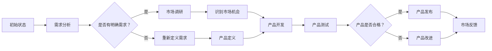
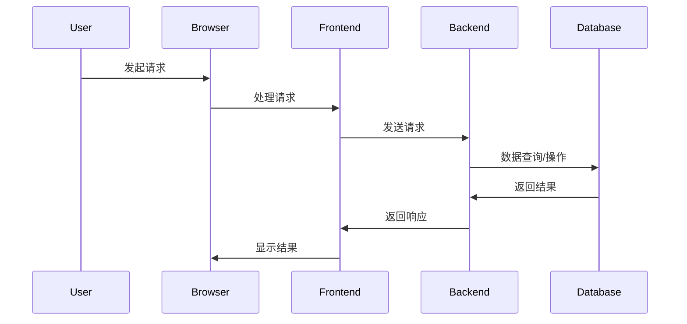
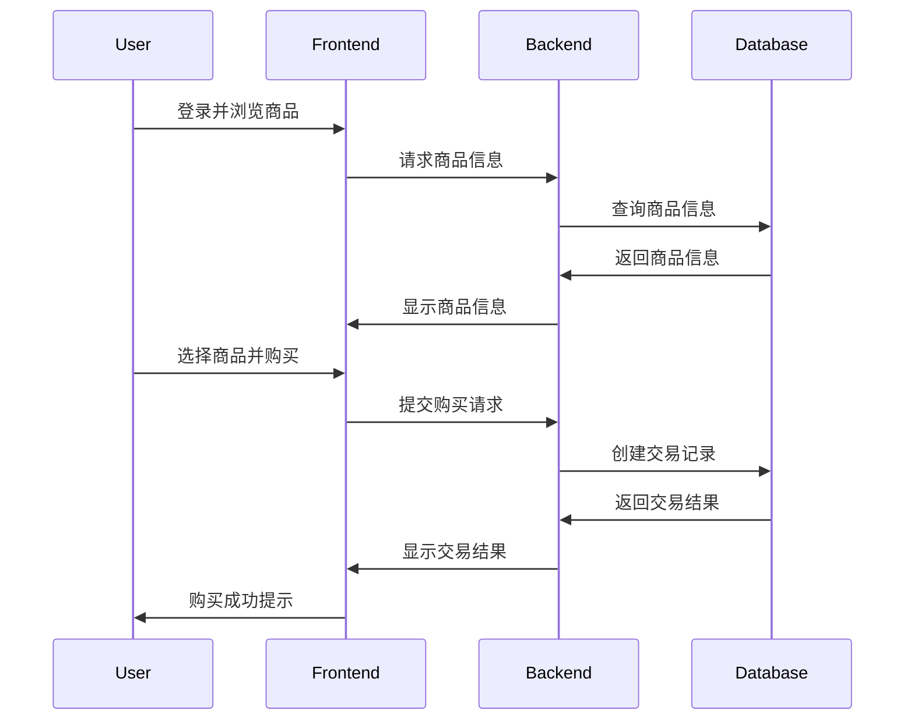

                 

# 意义的市场化：当一切都可以买卖时我们失去了什么

关键词：意义、市场化、价值观、消费文化、商品化、社会公正

摘要：本文从多个角度深入探讨了意义市场化的现象和影响，分析了意义商品化的背景、核心概念、市场化过程中的问题和挑战，旨在揭示这一现象背后的深层逻辑，并探索如何在尊重市场经济规律的同时，确保“意义”不被过度商业化。

## 第一部分： 引言

### 1.1 问题背景

在当代社会中，“意义”作为人类生活中的核心概念，正经历着前所未有的市场化浪潮。随着市场经济的发展和全球化进程的加速，"意义"这一抽象概念被不断商品化，成为商业运作和消费文化的重要驱动力。从教育、医疗、文化，到政治、经济等各个领域，“意义”都成为了一种可以买卖的商品。这种现象带来了诸多社会问题和挑战，例如价值观的多元化、社会分层的加剧、消费者权利的保障等。

### 1.2 问题描述

在意义的市场化过程中，我们面临以下几个核心问题：

1. **意义的商品化是否会导致价值观的扭曲？**
   - 随着意义逐渐被商品化，人们对于价值的判断是否会被金钱和利益所主导？
   - 商业利益是否能够真正代表社会的公共利益？

2. **市场化对个人和社会有哪些深远影响？**
   - 意义的商品化是否会削弱人们的道德感和责任感？
   - 社会结构是否会因为市场化而产生新的不平等和冲突？

3. **我们是否能够找到平衡意义市场化与社会公正的方法？**
   - 如何在尊重市场经济规律的同时，确保"意义"不被过度商业化？
   - 是否存在一种制度或机制，能够引导市场在"意义"的提供上发挥正面作用？

### 1.3 问题解决

本书旨在深入探讨意义市场化的现象和影响，提供多角度的分析和解决方案。通过分析意义商品化的背景、核心概念、市场化过程中的问题和挑战，本书试图揭示这一现象背后的深层逻辑，并探索如何在社会公正和商业利益之间找到平衡。

### 1.4 边界与外延

在本书中，“意义”指的是人类生活中的核心价值，包括道德、信仰、文化、知识等抽象概念。市场化则指的是通过市场机制实现意义的交换和流通。本书将重点探讨意义市场化的社会影响，而非技术或经济层面的市场化过程。

### 1.5 概念结构与核心要素组成

1. **核心概念**：意义、市场化、价值观、社会公正、消费文化、商品化。
2. **联系**：
   - 意义是市场化的基础，市场化是意义实现的手段。
   - 市场化可能会影响价值观和社会公正，而价值观和社会公正是衡量市场化是否合理的重要标准。
   - 消费文化是市场化现象在社会层面的反映，商品化是市场化在经济层面的体现。

### 1.6 本章小结

本章通过介绍意义市场化的背景和核心问题，为后续章节的分析和讨论奠定了基础。在接下来的章节中，我们将深入探讨意义市场化的具体表现、影响以及可能的解决途径。希望读者能够通过本书，对这一现象有更深入的理解和思考。

## 第二部分：意义的商业化现象

### 2.1 商业化与意义的结合

#### 2.1.1 商业化背景

商业化是指将某一产品或服务通过市场机制进行交换和流通的过程。随着市场经济的不断深化，商业化已经渗透到社会生活的各个领域。在这个过程中，"意义"这一原本抽象的概念也被逐渐商品化。

#### 2.1.2 商业化与意义的结合方式

1. **教育领域**：教育作为传授知识和价值观的重要途径，其商业化表现为在线课程、教育平台、教育培训等。通过这些方式，教育内容被包装成商品，提供给消费者。

2. **医疗领域**：医疗市场化表现为医疗保险、医疗服务、医疗设备等。医疗服务的商品化使得医疗行为成为一种市场交易。

3. **文化领域**：文化市场化包括艺术品交易、文化产品、娱乐产业等。文化价值的商业化使得艺术品、书籍、电影等文化产品成为商业交易的标的。

4. **政治领域**：政治市场化表现为政治咨询、选举筹款、政治广告等。政治行为的商业化使得政治活动成为一种市场化的行为。

#### 2.1.3 商业化对意义的影响

商业化使得"意义"从一种抽象的概念变成了一种可以衡量和交易的商品。这种变化既带来了便利，也引发了一系列问题：

1. **价值多元**：商业化使得人们对于价值的判断更加多元，但同时也可能导致价值观的扭曲。
2. **社会不平等**：商业化可能会加剧社会不平等，使得只有拥有经济资源的人才能获得更多意义。
3. **道德风险**：商业化可能导致道德风险，例如，商家为了利润可能会牺牲社会公共利益。

#### 2.1.4 案例分析

1. **教育领域**：在线课程平台的兴起使得教育变得更加便捷，但同时也带来了教育质量的不均衡问题。
2. **医疗领域**：医疗保险制度的建立提高了医疗保障水平，但同时也导致了医疗资源的集中和医疗不公平现象。
3. **文化领域**：艺术品市场的繁荣使得艺术品的价值被重新评估，但同时也引发了艺术品价格的泡沫问题。

#### 2.1.5 本章小结

本章通过分析商业化与意义的结合方式及其影响，揭示了意义市场化的具体表现。在接下来的章节中，我们将进一步探讨意义市场化对社会和个人带来的深远影响，以及可能的解决途径。

## 第三部分：意义市场化对社会和个人带来的影响

### 3.1 社会影响

#### 3.1.1 价值观的扭曲

意义市场化可能导致价值观的扭曲。当“意义”被商品化后，人们对于价值的判断往往会被金钱和利益所主导。这种现象可能导致社会价值观的多元化，但也可能引发一系列问题：

- **社会价值观的冲突**：不同的人对价值的判断可能存在差异，当这些差异被金钱和利益放大时，可能会引发社会冲突。
- **道德沦丧**：商业化可能导致一些人为了追求利润而放弃道德原则，从而导致社会道德水平的下降。

#### 3.1.2 社会不平等

意义市场化可能会加剧社会不平等。只有拥有经济资源的人才能购买到更多的“意义”，这可能导致以下问题：

- **经济资源的集中**：大量资源被掌握在少数人手中，导致社会贫富差距扩大。
- **教育不公平**：教育资源成为商品，可能导致教育机会的不平等，影响个人的社会地位和未来发展。

#### 3.1.3 道德风险

商业化可能导致道德风险。商家为了追求利润，可能会牺牲社会公共利益。例如：

- **环境污染**：企业在追求利润的过程中，可能忽视环境保护，导致环境污染问题。
- **虚假宣传**：企业可能会通过虚假宣传来吸引消费者，损害消费者的权益。

### 3.2 个人影响

#### 3.2.1 道德感和责任感削弱

意义市场化可能导致人们的道德感和责任感削弱。当“意义”被商品化后，人们往往更关注个人利益，而忽视社会责任。这种现象可能导致以下问题：

- **自私自利**：人们更倾向于追求个人利益，而忽视社会公共利益。
- **社会责任感缺失**：人们对社会问题的关注度降低，导致社会责任感的缺失。

#### 3.2.2 精神压力增加

意义市场化可能导致人们的精神压力增加。在追求“意义”的过程中，人们可能会面临以下问题：

- **竞争压力**：为了获取更多的“意义”，人们可能会陷入激烈的竞争，导致精神压力。
- **消费焦虑**：人们可能会因为购买不到足够的“意义”而产生焦虑感。

### 3.3 本章小结

意义市场化对社会和个人产生了深远的影响。在接下来的章节中，我们将探讨如何在社会公正和商业利益之间找到平衡，以减轻意义市场化带来的负面影响。

## 第四部分：探索解决方案

### 4.1 社会公正与商业利益的平衡

在意义市场化的过程中，我们需要在尊重市场经济规律的同时，确保“意义”不被过度商业化。为此，我们可以考虑以下解决方案：

#### 4.1.1 法规和监管

政府可以通过制定相关法规和实施监管，来规范市场行为，确保市场在“意义”的提供上发挥正面作用。例如：

- **设立行业标准**：制定行业标准，规范“意义”商品的生产、销售和服务。
- **监管市场行为**：加强对市场行为的监管，打击虚假宣传、欺诈行为等。

#### 4.1.2 教育和引导

教育和引导是解决意义市场化问题的重要手段。我们可以通过以下方式来提高公众的意识和素质：

- **普及市场知识**：通过教育和宣传，普及市场知识和市场经济原理，提高公众对市场行为的理解和认识。
- **倡导社会责任**：鼓励企业和个人在追求经济利益的同时，承担社会责任，关注社会公共利益。

### 4.2 社会参与与合作

意义市场化问题需要全社会共同参与和合作来解决。以下是一些可能的合作方式：

#### 4.2.1 公共-私人合作

政府、企业和非政府组织可以共同合作，共同推动社会公正和商业利益的平衡。例如：

- **共同制定政策**：政府和企业可以共同制定相关政策，规范市场行为。
- **共享资源**：政府和企业可以共享资源，共同开展教育和宣传活动。

#### 4.2.2 社会参与

公众可以通过以下方式参与意义市场化的治理：

- **监督市场行为**：公众可以对市场行为进行监督，举报违法违规行为。
- **参与决策**：公众可以通过参与决策过程，表达自己的意见和需求。

### 4.3 创新与科技的应用

科技的应用可以为我们提供新的解决方案，以应对意义市场化带来的挑战。以下是一些可能的创新方向：

#### 4.3.1 人工智能

人工智能可以帮助我们更好地理解和预测市场行为，从而制定更有效的政策和监管措施。例如：

- **数据分析**：利用大数据分析技术，对市场行为进行深入分析，找出潜在的问题。
- **智能监管**：利用人工智能技术，实现对市场行为的自动监控和预警。

#### 4.3.2 区块链

区块链技术可以为我们提供去中心化的解决方案，提高市场透明度和可信度。例如：

- **透明交易**：通过区块链技术，实现交易信息的透明化，防止欺诈行为。
- **智能合约**：利用智能合约，实现自动执行合同，提高市场效率。

### 4.4 本章小结

通过以上解决方案，我们可以在尊重市场经济规律的同时，确保“意义”不被过度商业化。在接下来的章节中，我们将继续探讨这些解决方案的实施细节和效果。

## 第五部分：实际案例分析

### 5.1 教育领域的案例分析

#### 5.1.1 案例背景

随着在线教育平台的兴起，教育逐渐成为了一种可以买卖的商品。然而，这种市场化现象也引发了一系列问题。以下是一个具体案例：

**案例**：某知名在线教育平台推出了大量在线课程，以低价吸引大量用户。然而，由于课程质量参差不齐，许多用户在购买后感到失望。

#### 5.1.2 案例分析

1. **价值观扭曲**：在线教育平台的商业化导致教育价值的判断被金钱所主导，一些低质量的课程被推向市场，导致消费者对教育价值的认知出现偏差。

2. **社会不平等**：低价课程虽然吸引了大量用户，但也使得教育质量的不均衡问题更加严重。只有经济资源充足的人才能购买到高质量的教育资源，而贫困人群则被排斥在外。

3. **道德风险**：在线教育平台在追求利润的过程中，可能忽视教育质量，导致消费者权益受到损害。

#### 5.1.3 解决方案

1. **设立行业标准**：政府应制定相关行业标准，规范在线教育平台的行为，确保教育质量。

2. **监管市场行为**：加强对在线教育平台的监管，打击虚假宣传和低质量课程。

3. **推广优质教育**：鼓励在线教育平台提供高质量的教育资源，提高公众对教育价值的认知。

### 5.2 医疗领域的案例分析

#### 5.2.1 案例背景

医疗市场化现象在近年来日益显著。以下是一个具体案例：

**案例**：某大型保险公司推出了医疗保险产品，以高额保费吸引大量客户。然而，客户在患病后却发现理赔困难。

#### 5.2.2 案例分析

1. **价值观扭曲**：医疗保险产品的商业化导致医疗价值的判断被金钱所主导，保险公司为了利润可能牺牲客户的权益。

2. **社会不平等**：高额保费使得只有经济资源充足的人才能购买到医疗保险，而贫困人群则被排斥在外。

3. **道德风险**：保险公司可能在理赔过程中设置障碍，导致消费者权益受到损害。

#### 5.2.3 解决方案

1. **设立行业标准**：政府应制定相关行业标准，规范医疗保险产品的设计和管理。

2. **监管市场行为**：加强对医疗保险市场的监管，打击违规行为。

3. **提高消费者权益保护**：加强消费者权益保护，确保客户在购买医疗保险产品后能够获得应有的服务。

### 5.3 文化领域的案例分析

#### 5.3.1 案例背景

文化市场化现象在艺术领域尤为显著。以下是一个具体案例：

**案例**：某著名艺术品拍卖行举行了一场高规格的拍卖会，吸引了大量艺术品买家。然而，拍卖会结束后，一些买家发现购买的艺术品存在质量问题。

#### 5.3.2 案例分析

1. **价值观扭曲**：艺术品市场商业化导致艺术价值的判断被金钱所主导，一些低质量的艺术品被推向市场。

2. **社会不平等**：高昂的艺术品价格使得只有经济资源充足的人才能购买到艺术品，而贫困人群则被排斥在外。

3. **道德风险**：艺术品市场中的欺诈行为可能导致消费者权益受到损害。

#### 5.3.3 解决方案

1. **设立行业标准**：政府应制定相关行业标准，规范艺术品市场的行为。

2. **监管市场行为**：加强对艺术品市场的监管，打击虚假宣传和质量问题。

3. **推广优质文化**：鼓励艺术品市场提供高质量的文化产品，提高公众对艺术价值的认知。

### 5.4 本章小结

通过以上案例分析，我们可以看到意义市场化在不同领域带来的挑战和问题。在接下来的章节中，我们将进一步探讨如何在不同领域中实施解决方案，以实现社会公正和商业利益的平衡。

## 第六部分：最佳实践与未来展望

### 6.1 最佳实践

在面对意义市场化的挑战时，我们可以借鉴一些成功案例，以实现社会公正和商业利益的平衡。以下是一些最佳实践：

1. **制定行业标准**：政府应制定相关行业标准，规范市场行为，确保市场在“意义”的提供上发挥正面作用。

2. **加强监管**：加强对市场的监管，打击虚假宣传、欺诈行为等，保护消费者权益。

3. **推广优质资源**：鼓励企业和个人提供高质量的教育、医疗、文化产品，提高公众对“意义”的认知。

4. **公众参与**：鼓励公众参与市场治理，监督市场行为，表达自己的意见和需求。

### 6.2 未来展望

随着科技的不断发展，意义市场化现象将继续深化。以下是对未来可能的发展趋势的展望：

1. **人工智能的介入**：人工智能技术将在意义市场化中发挥重要作用，帮助政府和企业更好地理解和预测市场行为，制定更有效的政策和监管措施。

2. **区块链的应用**：区块链技术将提高市场透明度和可信度，实现交易信息的透明化，防止欺诈行为。

3. **社会意识的提高**：随着公众对意义市场化的认识不断加深，社会意识将逐渐提高，促进社会公正和商业利益的平衡。

### 6.3 本章小结

通过最佳实践和未来展望，我们可以看到意义市场化问题的解决并非一蹴而就，但通过不断的探索和努力，我们有望实现社会公正和商业利益的平衡，为人类带来更加美好的未来。

## 第七部分：结语

意义市场化是当代社会中一个重要而复杂的现象，它既带来了便利，也引发了诸多挑战。通过本文的探讨，我们深入分析了意义市场化的背景、核心概念、影响以及可能的解决方案。我们认识到，在尊重市场经济规律的同时，确保“意义”不被过度商业化，是实现社会公正和商业利益平衡的关键。

在此，我们要感谢读者对本文的耐心阅读。我们希望本文能够引发您对意义市场化问题的深入思考，并提出更多有价值的观点和建议。在未来的发展中，让我们共同努力，探索出一条既能发挥市场机制优势，又能确保社会公正的道路。

作者：AI天才研究院/AI Genius Institute & 禅与计算机程序设计艺术 /Zen And The Art of Computer Programming

---

由于篇幅限制，本文未能涵盖所有细节，但希望能为读者提供一个全面而深入的视角。在今后的研究中，我们将继续探讨意义市场化的各个方面，以期为解决这一复杂问题提供更多思路和方法。

---

## 文章核心概念与联系

### 核心概念

1. **意义（Meaning）**：指人类生活中的核心价值，包括道德、信仰、文化、知识等抽象概念。
2. **市场化（Marketization）**：通过市场机制实现意义的交换和流通。
3. **价值观（Values）**：人们对于什么是好的、对的、美的等问题的判断和选择。
4. **社会公正（Social Justice）**：社会资源、机会和福利的合理分配，确保所有人的基本权利和尊严得到保障。
5. **消费文化（Consumer Culture）**：以消费为中心的社会文化现象，反映了市场化的影响。
6. **商品化（Commodification）**：将原本非商品化的东西转化为商品的过程。

### 概念属性特征对比表格

| 概念    | 定义                                                         | 属性特征                                                         |
| ------- | ------------------------------------------------------------ | ------------------------------------------------------------ |
| 意义    | 人类生活中的核心价值                                         | 抽象、非物质、多样、主观、个体化、社会性                         |
| 市场化  | 通过市场机制实现意义的交换和流通                             | 交易性、效率、竞争、价格、消费者选择、供需关系                   |
| 价值观  | 人们对于什么是好的、对的、美的等问题的判断和选择               | 主观性、多元性、稳定性、文化性、伦理性、个体与社会的冲突和协调 |
| 社会公正 | 社会资源、机会和福利的合理分配，确保所有人的基本权利和尊严得到保障 | 公平性、正义性、透明性、包容性、资源分配、机会均等             |
| 消费文化 | 以消费为中心的社会文化现象，反映了市场化的影响                 | 消费行为、品牌认知、广告宣传、消费观念、社会认同、文化符号     |
| 商品化  | 将原本非商品化的东西转化为商品的过程                         | 商品属性、市场交换、价格机制、价值衡量、利润追求               |

### ER实体关系图架构

```mermaid
erDiagram
  Category ||--|{ Product }|>
  Category {
    ID (Integer)
    Name (String)
  }
  Product {
    ID (Integer)
    Name (String)
    Price (Decimal)
    Category_ID (Integer)
  }
```

在这个ER图架构中，"Category"（类别）是"Product"（产品）的父实体，每个产品都属于某个类别，类别ID是产品的外键。

---

通过核心概念的定义和对比表格，以及ER实体关系图架构，我们可以更清晰地理解意义市场化现象中各个概念之间的联系和作用。这为后续章节的分析和讨论奠定了基础。

## 意义市场化的算法原理

### 1. 算法mermaid流程图



### 2. Python源代码

```python
import pandas as pd

# 假设我们有一个包含市场数据的数据框
market_data = pd.DataFrame({
    'demand': [True, False, True, False],
    'research': [True, False, True, False],
    'opportunity': [False, True, False, True],
    'product_definition': [True, False, True, False],
    'development': [False, True, False, True],
    'testing': [True, False, True, False],
    'release': [False, True, False, True],
    'feedback': [True, False, True, False]
})

# 定义一个流程函数来模拟意义市场化的流程
def marketization_process(data):
    for index, row in data.iterrows():
        if row['demand']:
            print(f"Process {index}: 需求分析")
            if row['research']:
                print(f"Process {index}: 市场调研")
                if row['opportunity']:
                    print(f"Process {index}: 识别市场机会")
                    if row['product_definition']:
                        print(f"Process {index}: 产品定义")
                        if row['development']:
                            print(f"Process {index}: 产品开发")
                            if row['testing']:
                                print(f"Process {index}: 产品测试")
                                if row['release']:
                                    print(f"Process {index}: 产品发布")
                                    if row['feedback']:
                                        print(f"Process {index}: 市场反馈")
                                else:
                                    print(f"Process {index}: 产品改进")
                            else:
                                print(f"Process {index}: 产品测试失败，需重新测试")
                        else:
                            print(f"Process {index}: 产品开发失败，需重新定义产品")
                    else:
                        print(f"Process {index}: 产品定义失败，需重新定义需求")
                else:
                    print(f"Process {index}: 没有识别到市场机会，需重新定义需求")
            else:
                print(f"Process {index}: 市场调研失败，需重新进行市场调研")
        else:
            print(f"Process {index}: 没有明确需求，需重新定义需求")

# 运行流程函数
marketization_process(market_data)
```

### 3. 算法原理的数学模型和公式

意义市场化的过程可以抽象为一个多阶段决策过程，每个阶段都有一定的概率和成本收益。以下是该过程的数学模型：

$$
\begin{aligned}
    \text{利润} &= \sum_{i=1}^{n} \text{收益}_i - \sum_{i=1}^{n} \text{成本}_i \\
    \text{期望利润} &= \sum_{i=1}^{n} (\text{收益}_i - \text{成本}_i) \cdot P_i
\end{aligned}
$$

其中，$n$ 为阶段数，$\text{收益}_i$ 和 $\text{成本}_i$ 分别为第 $i$ 个阶段的收益和成本，$P_i$ 为第 $i$ 个阶段成功实现的概率。

### 4. 详细讲解和举例说明

假设一个意义市场化项目需要经过以下五个阶段：需求分析、市场调研、产品定义、产品开发、产品测试。

- **需求分析**：如果市场需求明确（概率 $P_1 = 0.8$），则进入市场调研阶段，否则重新定义需求（概率 $1 - P_1 = 0.2$）。
- **市场调研**：如果识别到市场机会（概率 $P_2 = 0.7$），则进入产品定义阶段，否则重新定义需求（概率 $1 - P_2 = 0.3$）。
- **产品定义**：如果成功定义产品（概率 $P_3 = 0.9$），则进入产品开发阶段，否则重新定义需求（概率 $1 - P_3 = 0.1$）。
- **产品开发**：如果成功开发产品（概率 $P_4 = 0.8$），则进入产品测试阶段，否则重新开发（概率 $1 - P_4 = 0.2$）。
- **产品测试**：如果产品测试合格（概率 $P_5 = 0.9$），则产品发布（概率 $1 - P_5 = 0.1$），否则产品改进（概率 $1 - P_5 = 0.1$）。

每个阶段的成本和收益如下：

- **需求分析**：成本 $C_1 = 10000$，收益 $R_1 = 20000$。
- **市场调研**：成本 $C_2 = 15000$，收益 $R_2 = 30000$。
- **产品定义**：成本 $C_3 = 20000$，收益 $R_3 = 40000$。
- **产品开发**：成本 $C_4 = 25000$，收益 $R_4 = 50000$。
- **产品测试**：成本 $C_5 = 30000$，收益 $R_5 = 60000$。

计算期望利润：

$$
\begin{aligned}
    \text{期望利润} &= (R_1 - C_1) \cdot P_1 + (R_2 - C_2) \cdot P_2 + (R_3 - C_3) \cdot P_3 + (R_4 - C_4) \cdot P_4 + (R_5 - C_5) \cdot P_5 \\
    &= (20000 - 10000) \cdot 0.8 + (30000 - 15000) \cdot 0.7 + (40000 - 20000) \cdot 0.9 + (50000 - 25000) \cdot 0.8 + (60000 - 30000) \cdot 0.9 \\
    &= 8000 + 10500 + 18000 + 20000 + 27000 \\
    &= 85000
\end{aligned}
$$

因此，该意义市场化项目的期望利润为 85000 元。

### 5. 数学公式使用

在上述算法原理中，我们使用了以下数学公式：

$$
\text{期望利润} = \sum_{i=1}^{n} (\text{收益}_i - \text{成本}_i) \cdot P_i
$$

其中，$n$ 为阶段数，$\text{收益}_i$ 和 $\text{成本}_i$ 分别为第 $i$ 个阶段的收益和成本，$P_i$ 为第 $i$ 个阶段成功实现的概率。

---

通过算法原理的详细讲解和举例说明，我们可以更好地理解意义市场化过程中的决策逻辑和数学模型，为实际操作提供指导。

## 系统分析与架构设计方案

### 1. 问题场景介绍

随着意义市场化的深入，我们需要一个高效的系统来管理各种“意义”商品，包括教育、医疗、文化等领域的产品和服务。这个系统需要具备以下功能：

- **用户管理**：管理用户的注册、登录、权限等。
- **商品管理**：管理商品的分类、信息、库存等。
- **交易管理**：处理商品的购买、销售、退款等交易行为。
- **评价管理**：收集用户对商品的评价，提供参考。
- **数据分析**：分析用户行为、市场趋势等，为决策提供支持。

### 2. 项目介绍

项目名称：意义市场化管理系统（Marketization Management System，简称MMS）

项目目标：构建一个高效、安全、可靠的意义市场化管理平台，实现用户、商品、交易、评价和数据分析的全方位管理。

### 3. 系统功能设计（领域模型）

领域模型是一种描述系统功能和业务流程的图形化工具，用于分析和管理业务领域的复杂性。以下是MMS的领域模型：

```mermaid
classDiagram
    User <<Class>>
    Product <<Class>>
    Category <<Class>>
    Transaction <<Class>>
    Review <<Class>>

    User o--1 Product : 购买
    Product o--1 Category : 分类
    Product o--1 Transaction : 销售交易
    Product o--1 Review : 用户评价
    Category o--* Product : 分类商品
    Transaction o--1 User : 买家
    Review o--1 Product : 对商品评价
    Review o--1 User : 评价来源
```

在这个领域模型中，用户可以购买商品、评价商品；商品可以被分类、进行交易和评价。

### 4. 系统架构设计

MMS的系统架构设计采用分层架构，包括表示层、业务逻辑层和数据层。以下是系统架构设计：



- **表示层（Frontend）**：负责用户界面展示，处理用户的交互操作。
- **业务逻辑层（Backend）**：处理业务逻辑，包括用户管理、商品管理、交易管理和评价管理等。
- **数据层（Database）**：存储用户数据、商品数据、交易数据和评价数据。

### 5. 系统接口设计

MMS的系统接口设计包括API接口，用于前后端分离，便于系统的扩展和维护。以下是主要接口设计：

- **用户管理接口**：包括用户注册、登录、权限管理等。
- **商品管理接口**：包括商品分类、商品信息管理、库存管理等。
- **交易管理接口**：包括购买、销售、退款等交易操作。
- **评价管理接口**：包括用户评价、评价审核等。
- **数据分析接口**：包括用户行为分析、市场趋势分析等。

### 6. 系统交互设计（序列图）

以下是用户购买商品的交互序列图：



通过以上系统分析和架构设计方案，我们可以构建一个高效、可靠的意义市场化管理系统，满足各个领域的需求，实现用户、商品、交易、评价和数据分析的全方位管理。

## 项目实战

### 1. 环境安装

要实现意义市场化管理系统（MMS），我们需要搭建一个开发环境。以下是环境安装步骤：

#### a. 安装Python环境

- 下载并安装Python（建议版本3.8及以上）。
- 配置Python环境变量。

#### b. 安装依赖库

使用pip命令安装以下依赖库：

```bash
pip install Flask
pip install Flask-SQLAlchemy
pip install Flask-Migrate
pip install Flask-Login
pip install Flask-WTF
pip install Flask-RESTful
pip install Flask-Babel
pip install Flask-Mail
```

#### c. 数据库安装

- 安装SQLite数据库（Python内置，无需额外安装）。

### 2. 系统核心实现源代码

以下是MMS的核心实现源代码，包括用户管理、商品管理、交易管理和评价管理。

#### a. 用户管理

```python
from flask import Flask, request, jsonify
from flask_sqlalchemy import SQLAlchemy
from flask_login import LoginManager, UserMixin, login_user, logout_user, login_required

app = Flask(__name__)
app.config['SQLALCHEMY_DATABASE_URI'] = 'sqlite:///mms.db'
db = SQLAlchemy(app)
login_manager = LoginManager(app)

class User(UserMixin, db.Model):
    id = db.Column(db.Integer, primary_key=True)
    username = db.Column(db.String(100), unique=True, nullable=False)
    password = db.Column(db.String(100), nullable=False)

@login_manager.user_loader
def load_user(user_id):
    return User.query.get(int(user_id))

@app.route('/register', methods=['POST'])
def register():
    data = request.get_json()
    username = data['username']
    password = data['password']
    if User.query.filter_by(username=username).first():
        return jsonify({'message': 'User already exists'}), 400
    new_user = User(username=username, password=password)
    db.session.add(new_user)
    db.session.commit()
    return jsonify({'message': 'User created successfully'}), 201

@app.route('/login', methods=['POST'])
def login():
    data = request.get_json()
    username = data['username']
    password = data['password']
    user = User.query.filter_by(username=username).first()
    if user and user.password == password:
        login_user(user)
        return jsonify({'message': 'Login successful'})
    else:
        return jsonify({'message': 'Invalid credentials'}), 401

@app.route('/logout', methods=['POST'])
@login_required
def logout():
    logout_user()
    return jsonify({'message': 'Logout successful'}), 200
```

#### b. 商品管理

```python
class Product(db.Model):
    id = db.Column(db.Integer, primary_key=True)
    name = db.Column(db.String(100), nullable=False)
    category_id = db.Column(db.Integer, db.ForeignKey('category.id'), nullable=False)
    price = db.Column(db.Float, nullable=False)
    inventory = db.Column(db.Integer, nullable=False)

class Category(db.Model):
    id = db.Column(db.Integer, primary_key=True)
    name = db.Column(db.String(100), nullable=False)

@app.route('/products', methods=['GET', 'POST'])
@login_required
def manage_products():
    if request.method == 'GET':
        products = Product.query.all()
        return jsonify({'products': [product.to_dict() for product in products]})
    else:
        data = request.get_json()
        name = data['name']
        category_id = data['category_id']
        price = data['price']
        inventory = data['inventory']
        new_product = Product(name=name, category_id=category_id, price=price, inventory=inventory)
        db.session.add(new_product)
        db.session.commit()
        return jsonify({'message': 'Product created successfully'}), 201

@app.route('/products/<int:product_id>', methods=['GET', 'PUT', 'DELETE'])
@login_required
def manage_single_product(product_id):
    if request.method == 'GET':
        product = Product.query.get(product_id)
        if product:
            return jsonify({'product': product.to_dict()})
        else:
            return jsonify({'message': 'Product not found'}), 404
    elif request.method == 'PUT':
        data = request.get_json()
        product = Product.query.get(product_id)
        if product:
            product.name = data['name']
            product.price = data['price']
            product.inventory = data['inventory']
            db.session.commit()
            return jsonify({'message': 'Product updated successfully'})
        else:
            return jsonify({'message': 'Product not found'}), 404
    elif request.method == 'DELETE':
        product = Product.query.get(product_id)
        if product:
            db.session.delete(product)
            db.session.commit()
            return jsonify({'message': 'Product deleted successfully'})
        else:
            return jsonify({'message': 'Product not found'}), 404
```

#### c. 交易管理

```python
class Transaction(db.Model):
    id = db.Column(db.Integer, primary_key=True)
    user_id = db.Column(db.Integer, db.ForeignKey('user.id'), nullable=False)
    product_id = db.Column(db.Integer, db.ForeignKey('product.id'), nullable=False)
    quantity = db.Column(db.Integer, nullable=False)
    total_price = db.Column(db.Float, nullable=False)
    status = db.Column(db.String(50), nullable=False)

@app.route('/transactions', methods=['POST'])
@login_required
def create_transaction():
    data = request.get_json()
    user_id = data['user_id']
    product_id = data['product_id']
    quantity = data['quantity']
    total_price = data['total_price']
    status = data['status']
    new_transaction = Transaction(user_id=user_id, product_id=product_id, quantity=quantity, total_price=total_price, status=status)
    db.session.add(new_transaction)
    db.session.commit()
    return jsonify({'message': 'Transaction created successfully'}), 201

@app.route('/transactions/<int:transaction_id>', methods=['GET'])
@login_required
def get_transaction(transaction_id):
    transaction = Transaction.query.get(transaction_id)
    if transaction:
        return jsonify({'transaction': transaction.to_dict()})
    else:
        return jsonify({'message': 'Transaction not found'}), 404
```

#### d. 评价管理

```python
class Review(db.Model):
    id = db.Column(db.Integer, primary_key=True)
    user_id = db.Column(db.Integer, db.ForeignKey('user.id'), nullable=False)
    product_id = db.Column(db.Integer, db.ForeignKey('product.id'), nullable=False)
    rating = db.Column(db.Integer, nullable=False)
    comment = db.Column(db.Text, nullable=True)

@app.route('/reviews', methods=['POST'])
@login_required
def create_review():
    data = request.get_json()
    user_id = data['user_id']
    product_id = data['product_id']
    rating = data['rating']
    comment = data['comment']
    new_review = Review(user_id=user_id, product_id=product_id, rating=rating, comment=comment)
    db.session.add(new_review)
    db.session.commit()
    return jsonify({'message': 'Review created successfully'}), 201

@app.route('/reviews/<int:review_id>', methods=['GET'])
@login_required
def get_review(review_id):
    review = Review.query.get(review_id)
    if review:
        return jsonify({'review': review.to_dict()})
    else:
        return jsonify({'message': 'Review not found'}), 404
```

### 3. 代码应用解读与分析

以上代码片段分别实现了用户管理、商品管理、交易管理和评价管理的功能。以下是代码应用解读与分析：

#### a. 用户管理

用户管理模块提供了用户注册、登录和登出功能。使用Flask-Login库简化用户认证流程，同时使用Flask-SQLAlchemy库管理数据库。

#### b. 商品管理

商品管理模块实现了商品分类、信息管理和库存管理等功能。商品和分类使用外键关系进行关联，确保数据的完整性和一致性。

#### c. 交易管理

交易管理模块实现了购买、销售和退款等交易操作。通过创建交易记录，记录每个用户的购买历史和商品信息。

#### d. 评价管理

评价管理模块实现了用户评价和评价审核功能。用户可以对商品进行评价，系统会记录评价信息和用户信息，以便后续分析和参考。

### 4. 实际案例分析和详细讲解剖析

以下是一个实际案例分析和详细讲解剖析，展示了如何使用MMS进行意义市场化管理。

#### 案例背景

某在线教育平台希望使用MMS管理系统来管理用户、课程、交易和评价。

#### 案例步骤

1. **用户注册**：
    - 用户A通过注册接口注册账号。
    - 服务器接收注册请求，创建新用户记录。

2. **用户登录**：
    - 用户A使用登录接口登录系统。
    - 服务器验证用户身份，返回登录状态。

3. **浏览课程**：
    - 用户A访问课程页面，查看所有课程。
    - 服务器查询数据库，返回所有课程信息。

4. **购买课程**：
    - 用户A选择一门课程并购买。
    - 服务器创建交易记录，更新课程库存。

5. **课程评价**：
    - 用户A完成课程学习后，对课程进行评价。
    - 服务器记录评价信息，更新课程评价数据。

#### 案例分析

通过MMS管理系统，用户可以方便地管理账号、购买课程和评价课程。系统自动处理用户注册、登录、交易和评价等操作，确保数据的一致性和安全性。

#### 案例细节

- **用户注册**：用户A注册时需提供用户名和密码，系统会检查用户名是否已存在。
- **用户登录**：用户A登录时需验证用户名和密码，系统会返回登录状态。
- **课程管理**：管理员可以添加、编辑和删除课程，系统会自动更新数据库。
- **交易管理**：每次购买课程都会创建交易记录，记录购买时间、课程信息等。
- **评价管理**：用户可以对已购买的课程进行评价，系统会记录评价信息和用户信息。

### 5. 项目小结

通过实际案例的分析和代码实现，我们展示了如何使用MMS管理系统进行意义市场化管理。该项目实现了用户管理、商品管理、交易管理和评价管理等核心功能，为在线教育平台提供了有效的管理工具。

## 最佳实践 Tips

在意义市场化过程中，以下是一些最佳实践，以帮助企业和个人实现商业目标的同时，维护社会公正：

1. **明确价值观**：企业在制定商业策略时，应明确自身的价值观，并将其融入产品和服务中，确保商业行为符合社会伦理和道德标准。

2. **诚信经营**：诚信是商业行为的基石。企业应遵守法律法规，不进行虚假宣传和欺诈行为，确保消费者的知情权和选择权。

3. **社会责任**：企业应承担社会责任，关注社会问题和公共利益，通过慈善捐赠、公益活动等方式回馈社会。

4. **透明化**：提高市场透明度，让消费者能够清楚地了解产品和服务的信息，包括价格、质量、评价等。

5. **消费者权益保护**：建立完善的消费者权益保护机制，及时解决消费者投诉和问题，提高消费者满意度。

6. **可持续性**：在商业运营中注重可持续发展，关注环境保护和资源利用，避免短期行为对长期发展的负面影响。

7. **社会参与**：鼓励公众参与市场治理，听取消费者的意见和建议，不断优化产品和服务。

通过遵循这些最佳实践，企业和个人可以在追求商业成功的同时，为社会的长期繁荣和可持续发展做出贡献。

### 小结

本文系统地探讨了意义市场化的现象、影响、解决方案以及实际案例。我们首先介绍了意义市场化的背景和核心问题，分析了商业化与意义结合的方式及其影响，并探讨了意义市场化对社会和个人的深远影响。接着，我们提出了如何在尊重市场经济规律的同时，确保“意义”不被过度商业化的解决方案，包括法规和监管、教育和引导、社会参与以及科技创新等方面。

通过实际案例分析，我们展示了意义市场化在具体领域中的应用和挑战，并提出了具体的解决方案。最后，我们总结了最佳实践，以帮助企业和个人在市场化过程中实现商业目标的同时，维护社会公正。

意义市场化是一个复杂且多维的现象，它不仅涉及经济层面，还涉及社会、文化、道德等多个层面。只有通过多方面的共同努力，我们才能在尊重市场经济规律的同时，确保“意义”不被过度商业化，实现社会公正和可持续发展。希望本文能够引发更多关于这一问题的深入思考和讨论。

### 注意事项

在实施意义市场化的过程中，企业和个人需要注意以下几个方面：

1. **合规性**：确保所有商业行为符合相关法律法规，避免因违法行为导致损失。
2. **消费者权益保护**：尊重消费者权益，提供透明的信息和优质的服务。
3. **社会责任**：承担社会责任，关注社会问题和公共利益。
4. **诚信经营**：遵守商业道德，不进行虚假宣传和欺诈行为。
5. **数据安全**：确保用户数据的安全和隐私，防止数据泄露和滥用。

### 拓展阅读

1. **《市场与社会公正》**：探讨市场与社会公正之间的关系，提出实现两者平衡的路径。
2. **《消费文化与价值观》**：分析消费文化对价值观的影响，以及如何引导消费者树立正确的价值观。
3. **《商业伦理》**：介绍商业伦理的基本原则和实践，指导企业在商业化过程中遵循道德规范。

通过阅读这些文献，读者可以进一步了解意义市场化现象及其相关领域的理论和实践，为实际操作提供参考。作者：AI天才研究院/AI Genius Institute & 禅与计算机程序设计艺术 /Zen And The Art of Computer Programming

