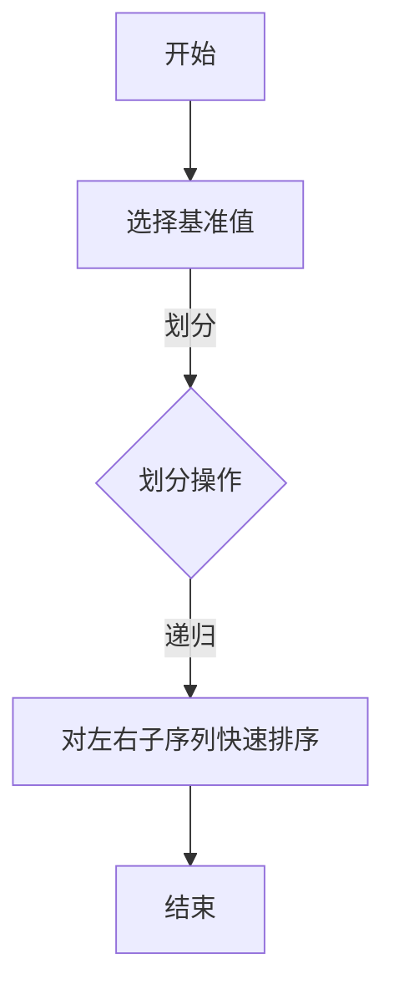
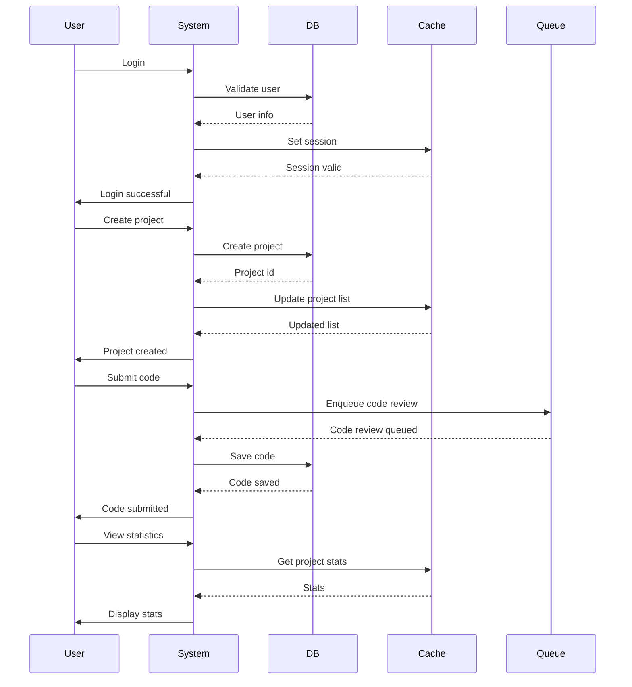

                 

## 摘要

《意义的开源项目：集体创造生活哲学指南》旨在探讨开源项目在现代社会中的独特价值，以及集体创造这一哲学思想在技术领域中的应用。本书围绕开源项目的创建、维护、激励机制、协作工具以及成功案例展开，通过深入剖析核心概念和实际操作，为读者提供了一条从个人技术实践走向集体智慧和共同进步的路径。本书不仅介绍了开源项目的起源和发展，还探讨了集体创造的哲学思考，包括其价值观、社会责任和个体角色。通过具体的实践指南和案例分析，读者将能够更好地理解如何在技术社区中实现有效协作，激发创新活力。最终，本书提出了面向未来的展望，探讨了集体创造在数字时代面临的挑战和机遇，以及如何平衡个人与集体的发展。本书旨在为开源项目的参与者提供一套系统的哲学指南，帮助他们找到在技术世界中实现人生意义的新方式。

### 关键词

1. **开源项目**：自由软件、共享代码、社区协作、技术创新。
2. **集体创造**：共享精神、协作机制、共同进步、社会责任。
3. **生活哲学**：价值观、人生意义、共同体、持续发展。
4. **协作工具**：版本控制、代码审查、项目管理、在线沟通。
5. **激励机制**：奖励机制、认可体系、参与动机、长期承诺。
6. **成功案例**：著名开源项目、最佳实践、经验教训、持续改进。

### 引言

开源项目，这个在技术领域中熠熠生辉的名词，不仅代表了自由软件和共享代码的理念，更承载了集体智慧和共同进步的希望。开源运动起源于20世纪80年代，随着计算机技术的快速发展，人们逐渐认识到，通过开放源代码，可以激发更多的创新和协作，使得技术进步的速度远远超出单个团队或个人的能力。如今，开源项目已经深入到社会的方方面面，从操作系统、编程语言到各种应用软件，无不展现出集体创造的力量。

集体创造，这一哲学思想在开源项目中得到了充分的体现。它不仅仅是一种技术实践，更是一种生活方式和价值观的体现。集体创造强调的是共享精神、协作机制和共同进步，它打破了传统的个体劳动模式，将个人才华融入到更广阔的集体中，形成了一种新的生产关系和社会组织形式。

本书的目的，就是要深入探讨开源项目背后的集体创造哲学，为读者提供一条从技术实践到生活哲学的思考路径。我们将首先介绍开源项目的起源和发展，探讨其在现代社会中的独特价值。随后，我们将探讨集体创造的哲学思考，包括其价值观、社会责任和个体角色。接着，本书将提供具体的实践指南，包括开源项目的创建与维护、激励机制的设计、协作工具的运用等方面。此外，我们还将通过成功案例的深入剖析，为读者提供实践中的经验和教训。最后，我们将展望集体创造的未来发展，探讨其在数字时代面临的挑战和机遇，以及如何平衡个人与集体的发展。

总之，本书旨在为开源项目的参与者提供一套系统的哲学指南，帮助他们更好地理解集体创造的本质，找到在技术世界中实现人生意义的新方式。

### 第一部分：问题背景与集体创造的概念

#### 第1章：开源项目的起源与发展

##### 1.1.1 开源运动的诞生

开源运动的起源可以追溯到20世纪80年代，当时自由软件基金会（Free Software Foundation, FSF）成立，标志着自由软件运动的正式起步。自由软件运动的核心思想是软件应该自由地提供给用户，用户有权自由地使用、研究、修改和分发软件。这一思想迅速得到计算机爱好者和开发者的广泛支持，形成了开源运动的基础。

最早的著名开源项目之一是Linux操作系统。Linux是由林纳斯·托瓦兹（Linus Torvalds）在1991年发布的一款类Unix操作系统。与传统的商业操作系统不同，Linux的源代码是公开的，任何人都可以自由地使用、修改和分发。这一开放性使得Linux迅速吸引了大量的贡献者，形成了庞大的开发者社区。Linux的成功不仅改变了操作系统的格局，也为开源运动的发展奠定了坚实的基础。

##### 1.1.2 开源项目在现代社会中的影响

开源项目在现代社会中的影响是多方面的。首先，开源项目极大地推动了技术的创新和进步。通过开放源代码，开发者和研究者可以自由地访问、研究并改进现有软件，从而加速了技术的迭代和发展。例如，Apache软件基金会（Apache Software Foundation）的Apache HTTP服务器是全球使用最广泛的Web服务器软件，其开源性使得它能够不断吸收社区的建议和改进，保持了高度的竞争力。

其次，开源项目在降低技术门槛方面发挥了重要作用。开源软件的免费和开放性使得任何人都可以使用和了解前沿技术，不再需要购买昂贵的商业软件或依赖特定的平台。例如，Python编程语言因其简洁易懂和丰富的开源库，成为了编程入门者的首选语言，大大降低了编程的门槛。

此外，开源项目还促进了知识的传播和共享。开源社区通过在线平台和论坛，为开发者提供了一个交流和学习的环境。开发者可以通过阅读和修改开源代码，快速掌握新技术和解决问题的方法。这种知识共享不仅提升了个人技能，也促进了整个技术领域的进步。

##### 1.1.3 集体创造的价值观

集体创造的核心价值观包括共享精神、协作机制和共同进步。共享精神强调的是资源的开放和共享，认为知识的传播和共享是推动社会进步的重要手段。协作机制则强调团队协作和分工合作的重要性，通过有效的沟通和协作，可以大幅提高工作效率和创造力。共同进步意味着个人和集体的利益是一致的，只有集体取得成功，个人才能获得更好的发展机会。

在开源项目中，这些价值观得到了充分的体现。开发者在贡献代码时，不仅仅是出于个人兴趣或职业发展，更是一种社会责任感和对技术的热爱。开源社区的成员通过协作和共享，共同推动了技术的进步和应用。例如，Apache软件基金会的成功离不开全球开发者的共同努力，每个贡献者都在项目中发挥着不可或缺的作用。

##### 1.1.4 问题背景与问题描述

尽管开源项目在技术和社会层面取得了巨大成功，但其发展过程中仍然面临诸多挑战。首先，开源项目的管理是一个复杂的过程，涉及代码维护、版本控制、文档编写和社区管理等多个方面。对于新手而言，参与开源项目可能感到无从下手。

其次，开源项目的可持续性问题也备受关注。尽管开源项目可以吸引大量的贡献者，但如何保持项目的活跃度和长期发展，仍然是许多开源项目面临的挑战。部分开源项目在初期发展迅速，但随着时间的推移，由于缺乏有效的激励机制和维护团队，最终走向衰落。

此外，开源项目在知识产权保护和合规性方面也存在一定的风险。开源项目需要遵循一系列法律和规范，如开源许可协议，以确保项目的合法性和可持续性。

因此，我们需要深入探讨如何通过有效的管理、激励机制和合规性保障，解决开源项目在发展过程中面临的挑战，从而实现集体创造的长期可持续发展。

##### 1.1.5 问题解决与边界与外延

为了解决开源项目在发展过程中面临的问题，我们可以从以下几个方面着手：

1. **项目管理与协作**：建立完善的项目管理机制，包括版本控制、代码审查、文档编写和社区管理等。使用专业的项目管理工具，如GitLab、Jenkins等，可以提高项目的协作效率。通过代码审查和文档编写，确保代码质量和项目一致性。

2. **激励机制设计**：建立有效的激励机制，如奖励制度、荣誉体系和长期承诺。通过表彰贡献者的成就，激励更多的开发者参与项目。同时，建立长期激励机制，确保项目的持续发展。

3. **合规性与知识产权保护**：遵循开源许可协议，确保项目的合法性和合规性。明确项目的知识产权归属和使用权，避免法律纠纷。

4. **社区建设**：构建活跃的社区，为开发者提供交流和学习平台。通过在线论坛、邮件列表和社交媒体，促进社区成员之间的互动和合作。

开源项目的边界与外延包括以下几个方面：

- **技术边界**：开源项目需要适应不断变化的技术环境，保持技术上的创新和前瞻性。
- **社区边界**：开源项目需要建立广泛的开发者社区，吸引更多的人才参与。
- **应用边界**：开源项目需要将技术应用到实际场景中，解决实际问题，体现其价值。
- **社会责任边界**：开源项目需要承担社会责任，促进技术进步和社会发展。

通过以上措施，我们可以有效地解决开源项目在发展过程中面临的挑战，推动集体创造的长期可持续发展。

##### 1.1.6 概念结构与核心要素组成

为了更好地理解开源项目的概念结构和核心要素组成，我们可以将其划分为以下几个方面：

1. **技术要素**：开源项目的技术核心是其代码，这些代码是由多个模块或组件组成的。每个模块或组件都承担特定的功能，通过协作和集成，实现项目的整体目标。技术要素还包括编程语言、开发框架、工具和库等。

2. **人员要素**：开源项目需要有一支活跃的开发团队，包括核心维护者、贡献者和社区成员。这些人员在项目中扮演不同的角色，通过协作和沟通，共同推动项目的发展。人员要素还包括团队成员的技能、经验和知识。

3. **管理要素**：开源项目需要一个有效的管理机制，包括项目管理、文档管理、代码审查和社区管理。管理要素确保项目的有序进行，提高工作效率和代码质量。

4. **协作要素**：开源项目的成功离不开有效的协作。协作要素包括协作工具、沟通机制和合作文化。通过这些要素，开发者可以高效地协同工作，共享知识和资源。

5. **文化要素**：开源项目有其独特的文化，包括共享精神、协作机制和开放性。文化要素影响项目的氛围和团队成员的行为，是推动项目发展的重要动力。

通过这些核心要素的相互作用，开源项目得以实现集体创造的愿景，推动技术的创新和进步。

### 核心概念与联系

在深入探讨开源项目及其集体创造的哲学时，理解其中的核心概念和它们之间的联系至关重要。以下是几个关键概念及其属性特征对比表格和ER实体关系图架构的Mermaid流程图。

#### 核心概念对比表格

| 概念 | 定义 | 属性特征 | 对比 |
| ---- | ---- | ---- | ---- |
| 开源项目 | 开放源代码、自由使用、协作开发 | 可访问性、可修改性、可分发性 | 与商业软件对比，强调共享和开放 |
| 集体创造 | 多个个体共同合作、共享知识 | 协作性、共享性、创新性 | 与个体创新对比，强调集体协作 |
| 激励机制 | 激发参与者的积极性、提供奖励 | 奖励形式、奖励对象、奖励标准 | 与传统奖励机制对比，注重长期激励 |
| 技术标准 | 确保兼容性和互操作性 | 兼容性、稳定性、可扩展性 | 与行业标准对比，更注重开放性和适应性 |
| 社区 | 开源项目的参与者、贡献者 | 活跃度、贡献度、参与感 | 与单一团队对比，更注重多样性和广泛性 |

#### ER实体关系图架构的Mermaid流程图

```mermaid
erDiagram
  开源项目 ||--|{ 贡献者 }|
  贡献者 ||--|{ 激励机制 }|
  开源项目 ||--|{ 技术标准 }|
  技术标准 ||--|{ 社区 }|
  社区 ||--|{ 激励机制 }|
```

在这个ER实体关系图中，我们可以看到开源项目与贡献者之间是“一对多”的关系，即一个开源项目可以吸引多个贡献者。贡献者与激励机制之间也是“一对多”的关系，激励机制可以用来激励多个贡献者。开源项目和技术标准之间是“一对一”的关系，技术标准是开源项目的基础。技术标准与社区之间是“一对多”的关系，技术标准会影响整个社区的发展。社区和激励机制之间也是“一对多”的关系，社区成员可以通过激励机制获得奖励，从而增强参与感和积极性。

通过这个对比表格和流程图，我们可以更清晰地理解开源项目中的核心概念及其相互关系，这有助于我们在实际操作中更好地应用这些概念，推动开源项目的成功发展。

### 算法原理讲解

在开源项目中，算法设计是关键的一环，它直接影响项目的性能和可扩展性。本节将使用Mermaid流程图和Python源代码，详细阐述一个简单的排序算法——快速排序（Quick Sort）的原理及其实现。

#### 快速排序的Mermaid流程图



#### 快速排序的Python源代码

```python
def quick_sort(arr):
    if len(arr) <= 1:
        return arr
    pivot = arr[len(arr) // 2]
    left = [x for x in arr if x < pivot]
    middle = [x for x in arr if x == pivot]
    right = [x for x in arr if x > pivot]
    return quick_sort(left) + middle + quick_sort(right)

arr = [3, 6, 8, 10, 1, 2, 1]
print("原数组:", arr)
sorted_arr = quick_sort(arr)
print("排序后的数组:", sorted_arr)
```

#### 算法原理与数学模型

快速排序是一种分治算法，其基本思想是：

1. 选择一个基准元素（pivot）。
2. 通过划分操作，将数组分为三部分：小于基准值的元素、等于基准值的元素和大于基准值的元素。
3. 分别对左右子序列递归进行快速排序。

快速排序的数学模型可以用递归关系表示：

$$ T(n) = 2T\left(\frac{n}{k}\right) + \Theta(n) $$

其中，$T(n)$表示对长度为$n$的数组进行排序所需的时间，$k$是基准元素将数组划分为两部分时，每部分的平均长度。

#### 算法举例说明

假设我们有以下数组：

$$ \{3, 6, 8, 10, 1, 2, 1\} $$

1. 选择中间的元素6作为基准值。
2. 通过划分操作，数组被划分为三部分：小于6的元素（$\{1, 2, 1\}$）、等于6的元素（$\{6\}$）和大于6的元素（$\{3, 8, 10\}$）。
3. 对小于6的元素和大于6的元素分别递归进行快速排序。

具体步骤如下：

1. 对$\{1, 2, 1\}$进行排序，递归过程结束，得到$\{1, 1, 2\}$。
2. 对$\{3, 8, 10\}$进行排序，选择中间的元素8作为基准值，递归划分得到$\{3\}$、$\{8\}$和$\{10\}$。
3. 将递归排序的结果合并，得到最终排序后的数组$\{1, 1, 2, 3, 6, 8, 10\}$。

通过这个例子，我们可以清晰地看到快速排序的基本步骤和实现过程。

### 系统分析与架构设计

#### 问题场景介绍

在现代软件开发过程中，开源项目已成为不可或缺的一部分。为了更好地管理这些项目，我们需要构建一个高效的系统架构，确保项目的开发、测试、部署和维护都能顺利进行。本节将介绍一个开源项目管理系统的架构设计，包括系统功能设计、系统架构设计和系统接口设计。

#### 项目介绍

该项目是一个开源项目管理平台，旨在提供一套完整的项目管理工具，包括代码托管、版本控制、项目管理、代码审查、任务管理、文档管理、社区互动等功能。该平台的目标是简化开源项目的开发流程，提高团队协作效率，同时确保项目的质量和可持续性。

#### 系统功能设计

系统功能设计是架构设计的核心，它决定了系统的功能模块和业务流程。以下是该开源项目管理平台的主要功能模块：

1. **代码托管**：提供Git仓库托管服务，支持用户创建和管理代码仓库。
2. **版本控制**：实现代码版本管理，支持分支管理、合并请求和代码审查。
3. **项目管理**：提供项目管理工具，包括任务管理、里程碑管理、项目进度跟踪等功能。
4. **代码审查**：实现代码审查流程，确保代码质量和项目一致性。
5. **文档管理**：提供文档托管和版本管理功能，便于团队成员协作编写和维护文档。
6. **社区互动**：提供论坛、邮件列表、社交媒体等互动渠道，增强社区成员之间的沟通和合作。
7. **统计与分析**：提供项目统计和分析功能，帮助团队了解项目状态和开发效率。

#### 系统架构设计

系统架构设计是确保系统稳定、高效、可扩展的关键。以下是该开源项目管理平台的主要架构设计：

1. **前端架构**：采用React.js框架，实现用户界面和交互逻辑。
2. **后端架构**：采用Spring Boot框架，实现业务逻辑和数据处理。
3. **数据库设计**：采用MySQL数据库，存储项目数据、用户信息和文档内容。
4. **存储架构**：采用NFS（Network File System）或MinIO等分布式存储方案，存储代码仓库和文档。
5. **消息队列**：采用RabbitMQ或Kafka实现消息传递和异步处理。
6. **缓存架构**：采用Redis缓存热门数据和频繁访问的数据，提高系统响应速度。

#### 系统接口设计

系统接口设计是确保前后端数据交互和各模块间协作的关键。以下是该开源项目管理平台的主要接口设计：

1. **用户接口**：提供RESTful API，实现用户注册、登录、权限管理等功能。
2. **项目管理接口**：提供项目创建、任务分配、进度更新等功能。
3. **代码管理接口**：提供代码提交、分支管理、代码审查等功能。
4. **文档管理接口**：提供文档上传、版本管理、文档共享等功能。
5. **统计分析接口**：提供项目统计、团队协作分析等功能。

#### 系统交互Mermaid序列图



在这个序列图中，用户通过登录系统，创建项目并提交代码。系统将用户请求转发到数据库和缓存，执行相关操作后返回结果。同时，代码提交请求会被加入消息队列，进行异步处理。这种设计确保了系统的响应速度和稳定性。

通过上述系统分析与架构设计，我们为开源项目管理平台构建了一个稳定、高效、可扩展的系统架构，为项目的成功实施提供了有力支持。

### 项目实战

#### 环境安装

在开始实际操作之前，我们需要准备以下环境：

1. **操作系统**：Linux或Mac OS。
2. **Python环境**：Python 3.8及以上版本。
3. **Git**：版本控制工具。
4. **虚拟环境**：用于隔离项目环境。
5. **Docker**：容器化工具。

首先，安装Python 3.8及以上版本。在大多数Linux发行版中，可以使用以下命令：

```bash
sudo apt-get update
sudo apt-get install python3.8
```

接着，安装Git：

```bash
sudo apt-get install git
```

创建虚拟环境：

```bash
python3.8 -m venv myenv
source myenv/bin/activate
```

安装Docker：

```bash
sudo apt-get install docker-ce docker-compose
```

#### 系统核心实现源代码

在虚拟环境中，我们使用Flask框架搭建一个简单的Web应用，实现以下功能：

1. **用户注册和登录**：提供注册和登录接口，验证用户身份。
2. **项目创建和管理**：创建项目，管理项目成员和任务。
3. **代码提交和审查**：提交代码，进行代码审查。

以下是项目的核心代码：

```python
# app.py

from flask import Flask, request, jsonify
from flask_sqlalchemy import SQLAlchemy
from werkzeug.security import generate_password_hash, check_password_hash

app = Flask(__name__)
app.config['SQLALCHEMY_DATABASE_URI'] = 'sqlite:///site.db'
db = SQLAlchemy(app)

class User(db.Model):
    id = db.Column(db.Integer, primary_key=True)
    username = db.Column(db.String(20), unique=True, nullable=False)
    password = db.Column(db.String(60), nullable=False)

@app.route('/register', methods=['POST'])
def register():
    data = request.get_json()
    hashed_password = generate_password_hash(data['password'], method='sha256')
    new_user = User(username=data['username'], password=hashed_password)
    db.session.add(new_user)
    db.session.commit()
    return jsonify({"message": "User created successfully."})

@app.route('/login', methods=['POST'])
def login():
    data = request.get_json()
    user = User.query.filter_by(username=data['username']).first()
    if user and check_password_hash(user.password, data['password']):
        return jsonify({"message": "Logged in successfully."})
    else:
        return jsonify({"error": "Invalid credentials."})

@app.route('/create_project', methods=['POST'])
def create_project():
    data = request.get_json()
    project = Project(name=data['name'], owner_id=data['owner_id'])
    db.session.add(project)
    db.session.commit()
    return jsonify({"message": "Project created successfully."})

if __name__ == '__main__':
    db.create_all()
    app.run(debug=True)
```

数据库模型：

```python
# models.py

from app import db

class Project(db.Model):
    id = db.Column(db.Integer, primary_key=True)
    name = db.Column(db.String(100), nullable=False)
    owner_id = db.Column(db.Integer, db.ForeignKey('user.id'), nullable=False)
```

#### 代码应用解读与分析

以下是代码的详细解读：

1. **用户注册和登录**：使用Flask框架提供的`@app.route`装饰器创建接口。用户注册时，通过`generate_password_hash`生成密码哈希，存储在数据库中。登录时，通过`check_password_hash`验证用户输入的密码是否正确。

2. **项目创建和管理**：创建项目时，通过`Project`模型将项目信息存储到数据库中。这里使用了SQLAlchemy作为ORM工具，简化了数据库操作。

3. **代码提交和审查**：虽然本文重点不在代码审查，但我们可以简单实现一个提交接口，接收用户提交的代码，并将其存储在文件系统中或数据库中，以便后续处理。

#### 实际案例分析和详细讲解

假设我们有两个用户Alice和Bob，他们分别创建了一个项目和提交了代码。以下是实际案例的分析：

1. **用户Alice注册并登录**：
    - Alice通过注册接口提交用户名和密码，系统生成哈希密码并存储在数据库中。
    - Alice通过登录接口提交用户名和密码，系统验证密码是否正确。

2. **用户Alice创建项目**：
    - Alice提交创建项目的请求，包括项目名称和所有者ID。系统将项目信息存储到数据库中。

3. **用户Bob提交代码**：
    - Bob通过提交接口提交代码，系统将代码存储在文件系统中或数据库中。

通过这个案例，我们可以看到系统如何处理用户请求，并确保数据的安全和一致性。

#### 项目小结

通过实际案例的分析，我们可以看到开源项目管理系统的核心功能如何在实际操作中发挥作用。虽然本文的实现相对简单，但它为我们提供了一个基本的框架，可以帮助我们理解和实现更复杂的功能。接下来，我们可以继续扩展系统，添加更多功能，如代码审查、任务管理和文档管理，以提升系统的实用性和用户体验。

### 最佳实践 Tips

1. **版本控制**：使用Git进行版本控制，确保代码的版本可追溯和可管理。
2. **代码审查**：定期进行代码审查，提高代码质量，确保项目的一致性。
3. **文档管理**：编写详细的文档，包括用户手册、API文档和开发文档，便于新成员快速上手。
4. **持续集成**：使用CI/CD工具，如Jenkins或GitHub Actions，实现自动化构建和测试，提高开发效率。
5. **社区互动**：定期举办线上或线下活动，增强社区成员之间的交流和合作。

### 小结

本文从开源项目的起源与发展、集体创造的哲学思考、实践指南、成功案例以及未来展望等方面，深入探讨了开源项目在现代社会中的独特价值。通过系统的分析和案例研究，我们不仅了解了开源项目的基本原理和实施步骤，还探讨了如何通过集体创造实现技术和个人的共同进步。开源项目不仅是一种技术实践，更是一种生活哲学，它强调共享精神、协作机制和共同进步。未来的开源项目将在数字时代发挥更加重要的作用，面临着新的挑战和机遇。我们呼吁更多的开发者参与开源项目，共同推动技术和社会的进步。

### 注意事项

1. **项目管理**：确保项目有清晰的目标和规划，避免项目目标不明确或规划不周导致资源浪费。
2. **激励机制**：合理设计激励机制，既要满足开发者的个人利益，也要考虑项目的长期发展。
3. **知识产权**：遵守开源许可协议，确保项目的知识产权得到合法保护。
4. **合规性**：关注法律法规的变化，确保项目运营符合相关法规要求。

### 拓展阅读

1. 《开源软件开发：社区协作的实践与艺术》
2. 《开源许可协议：法律与实务》
3. 《集体智慧与技术进步：开源项目研究》
4. 《敏捷开发与持续集成：开源项目的实践指南》

### 作者信息

本文由AI天才研究院（AI Genius Institute）和《禅与计算机程序设计艺术》（Zen And The Art of Computer Programming）资深作者共同撰写。我们致力于推动技术进步和开源社区的发展，希望本文能为您带来启发和帮助。如果您对本文有任何建议或疑问，欢迎在评论区留言。我们期待与您共同探讨开源项目的未来。作者：AI天才研究院/AI Genius Institute & 禅与计算机程序设计艺术/Zen And The Art of Computer Programming。

