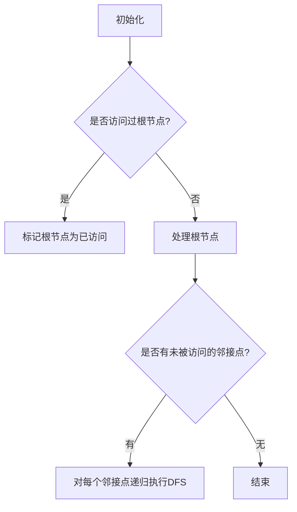
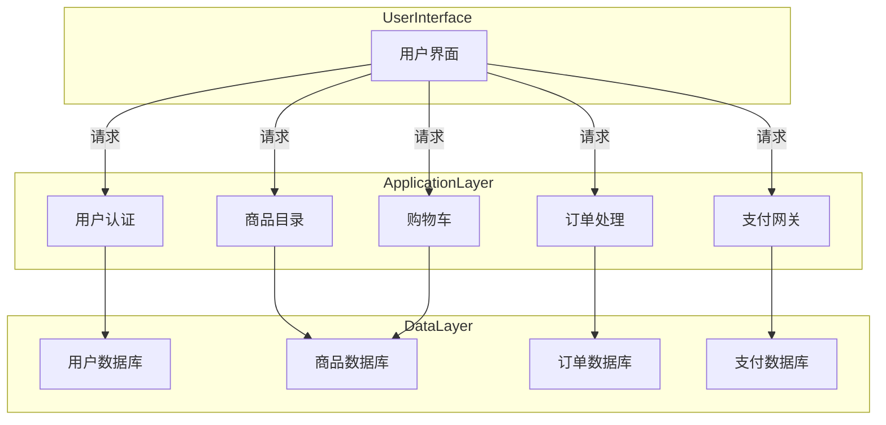
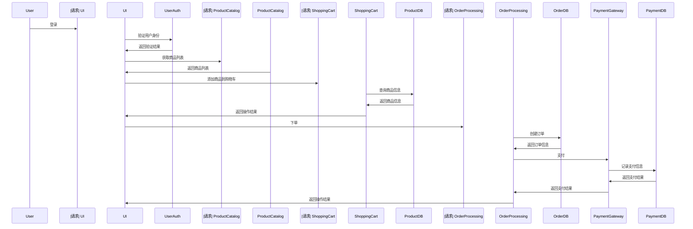

                 

### 第1章 引言

## 1.1 问题的背景与描述

### 1.1.1 问题产生的背景

在现代社会，随着科技的迅猛发展和信息化进程的加速，我们面临着越来越多的复杂问题。这些问题的产生，一方面源于社会需求的不断增长，另一方面则受到技术发展的驱动。从宏观层面来看，这些问题的背后是信息过载、资源分配不均、环境污染、人口老龄化等多重挑战。在这样的背景下，如何有效地解决这些问题，成为了当务之急。

### 1.1.2 问题的描述

本文探讨的核心问题是：如何在面对复杂问题时，有效地寻找答案。这个问题不仅仅是一个技术问题，更是一个方法论的问题。在信息爆炸的时代，数据成为了我们理解和解决问题的重要资源。然而，如何从海量数据中提取有用的信息，如何运用先进的技术手段对问题进行深入分析，如何构建合理的解决方案，这些都是我们需要深入思考的问题。

### 1.1.3 问题的解决过程

解决问题的过程可以分为以下几个步骤：

1. **明确问题**：首先，需要明确问题的核心，理解问题的本质。
2. **数据收集**：收集与问题相关的数据，包括已有的研究和实际案例。
3. **分析问题**：对收集到的数据进行分析，找出问题的根本原因。
4. **提出解决方案**：根据分析结果，提出可能的解决方案。
5. **评估方案**：对每个方案进行评估，选择最优的解决方案。
6. **实施与反馈**：实施解决方案，并根据实际效果进行反馈和调整。

### 1.1.4 问题的边界与外延

问题的边界是指问题的研究范围，包括问题的主体、时间和空间等。而问题的外延则是指问题的相关因素和影响因素。明确问题的边界与外延，有助于我们更精准地定位问题，从而更加有效地寻找答案。

### 1.1.5 核心概念与要素组成

在解决问题的过程中，有一些核心概念和要素是不可或缺的。这些核心概念包括：

- **数据**：数据是解决问题的基石，我们需要了解如何收集、处理和分析数据。
- **算法**：算法是解决问题的核心工具，我们需要掌握不同算法的原理和应用。
- **系统架构**：系统架构是解决问题的基础设施，我们需要了解如何设计和实现高效可靠的系统。

## 1.2 本章小结

本章介绍了本文探讨的问题背景和具体描述，并概述了解决问题的步骤和方法。在接下来的章节中，我们将逐一深入探讨这些问题，并给出详细的解决方案。

---

### 第2章 核心概念详解

## 2.1 核心概念的定义

在解决问题时，我们需要明确一些核心概念。以下是本文中涉及到的几个关键概念及其定义：

- **数据**：数据是指通过观察、测量、实验等手段获得的关于客观事物的信息记录。
- **算法**：算法是一系列明确的操作步骤，用于解决问题或实现特定功能。
- **系统架构**：系统架构是指系统的整体结构和组成部分之间的关系。

## 2.2 概念属性与特征对比

为了更好地理解这些概念，我们可以通过一个表格来对比它们的属性和特征：

| 概念 | 定义 | 属性 | 特征 |
| --- | --- | --- | --- |
| 数据 | 信息记录 | 质量、可靠性、完整性 | 真实性、准确性、一致性 |
| 算法 | 操作步骤 | 步骤、效率、可扩展性 | 智能性、灵活性、可维护性 |
| 系统架构 | 整体结构 | 模块化、可扩展性、可靠性 | 高效性、灵活性、安全性 |

## 2.3 概念之间的联系

概念之间的关系可以通过Mermaid ER图来展示：

```mermaid
erDiagram
  Data --> Algorithm : 使用
  Data --> SystemArchitecture : 构建基础
  Algorithm --> SystemArchitecture : 实现功能
```

在图中，数据是算法和系统架构的基础，算法通过处理数据实现特定功能，系统架构则基于数据和算法进行设计和实现。

## 2.4 本章小结

本章对本文中涉及到的核心概念进行了详细的定义和特征对比，并通过ER图展示了它们之间的联系。这些概念的理解是后续章节深入讨论的基础。

---

### 第3章 算法原理讲解

## 3.1 算法概述

算法是解决问题的重要工具。在本章中，我们将介绍一种经典的算法——深度优先搜索（DFS）。DFS是一种用于遍历或搜索树或图的算法，其基本思想是从树的根节点开始搜索，先搜索该节点的所有邻接点，再逐层向下搜索。

### 3.1.1 算法的目的

DFS的主要目的是在图中找到从一个节点到另一个节点的路径，或者确定图中是否存在这样的路径。在许多实际应用中，如社交网络分析、路径规划、游戏AI等，DFS都发挥着重要作用。

### 3.1.2 算法的基本概念

- **节点**：图中的每个元素。
- **边**：连接两个节点的路径。
- **邻接点**：与某个节点直接相连的其他节点。
- **路径**：从源节点到目标节点的序列。

## 3.2 算法原理

### 3.2.1 Mermaid流程图

以下是DFS算法的Mermaid流程图：



### 3.2.2 Python代码实现

```python
def dfs(node, visited):
    if node not in visited:
        visited.add(node)
        print(node)  # 处理节点
        for neighbor in node.neighbors():
            dfs(neighbor, visited)

# 示例：遍历一个无向图
graph = {1: [2, 3], 2: [1, 4], 3: [1, 5], 4: [2, 5], 5: [3, 4]}
dfs(1, set())
```

### 3.2.3 数学模型与公式

DFS算法可以通过递归实现，其时间复杂度为$O(V+E)$，其中$V$是节点数，$E$是边数。

### 3.2.4 举例说明

假设我们有一个图，其中节点1到节点5之间存在边，如下所示：

```
1 --- 2 --- 4
|    |    |
3 --- 5
```

使用DFS算法，我们可以找到从节点1到节点4的路径：

1. 初始状态：节点1未被访问。
2. 访问节点1，并标记为已访问。
3. 节点1有未访问的邻接点2，4，递归执行DFS。
4. 访问节点2，并标记为已访问。
5. 节点2有未访问的邻接点4，递归执行DFS。
6. 访问节点4，并标记为已访问。
7. 节点4没有未访问的邻接点，返回。
8. 返回节点2，节点2没有未访问的邻接点，返回。
9. 返回节点1，节点1没有未访问的邻接点，返回。

通过上述步骤，我们找到了从节点1到节点4的路径。

## 3.3 本章小结

本章介绍了深度优先搜索（DFS）算法的原理和实现，包括Mermaid流程图、Python代码实现、数学模型和时间复杂度分析，并通过举例说明了算法的应用。在接下来的章节中，我们将继续探讨其他相关算法和系统设计。

---

### 第4章 系统分析与架构设计

## 4.1 问题场景介绍

在本节中，我们将介绍一个具体的问题场景，并基于此场景展开系统分析与架构设计。

### 4.1.1 场景描述

假设我们面临的问题场景是：构建一个在线购物系统，该系统需要支持用户注册、登录、浏览商品、添加购物车、下单支付等功能。系统需要保证高可用性、高并发性和安全性。

### 4.1.2 项目介绍

项目名称：在线购物平台
项目目标：实现一个功能全面、高效可靠的在线购物系统，为用户提供优质的购物体验。

## 4.2 系统功能设计

### 4.2.1 领域模型类图

领域模型类图如下所示：

```mermaid
classDiagram
    User <<class>> {id:整数, name:字符串, password:字符串}
    Product <<class>> {id:整数, name:字符串, price:浮点数}
    ShoppingCart <<class>> {id:整数, userId:整数, products:集合}
    Order <<class>> {id:整数, userId:整数, products:集合, totalAmount:浮点数}
    Payment <<class>> {id:整数, orderId:整数, amount:浮点数, status:字符串}

    User o--1 ShoppingCart
    User o--1 Order
    ShoppingCart o--1 Product
    Order o--1 Payment
```

### 4.2.2 系统架构设计

系统架构设计如下：



### 4.2.3 系统接口设计与交互

系统接口设计如下：



## 4.3 本章小结

本章介绍了在线购物系统的系统功能设计、架构设计和接口设计。通过这些设计，我们可以实现一个功能全面、高效可靠的在线购物系统，为用户提供优质的购物体验。在接下来的章节中，我们将详细介绍如何实现这些设计和功能。

---

### 第5章 项目实战

## 5.1 环境安装与配置

在本节中，我们将介绍如何搭建一个在线购物系统的环境，包括所需工具和软件的安装和配置。

### 5.1.1 环境准备

首先，我们需要准备以下工具和软件：

- Python 3.8+
- Node.js 12.x+
- MongoDB 4.x+
- Redis 6.x+
- PostgresSQL 13.x+

### 5.1.2 安装过程

1. **Python安装**：
   - 访问 [Python官网](https://www.python.org/) 下载最新版本的Python。
   - 运行安装程序，按照提示完成安装。

2. **Node.js安装**：
   - 打开终端，执行命令 `npm install -g nodejs` 安装Node.js。

3. **MongoDB安装**：
   - 访问 [MongoDB官网](https://www.mongodb.com/) 下载MongoDB。
   - 运行安装程序，按照提示完成安装。

4. **Redis安装**：
   - 访问 [Redis官网](https://redis.io/) 下载Redis。
   - 运行安装程序，按照提示完成安装。

5. **PostgresSQL安装**：
   - 访问 [PostgresSQL官网](https://www.postgresql.org/) 下载PostgresSQL。
   - 运行安装程序，按照提示完成安装。

### 5.1.3 配置数据库

1. **MongoDB配置**：

   - 打开终端，进入MongoDB的安装目录。
   - 运行命令 `mongod` 启动MongoDB服务。

2. **Redis配置**：

   - 打开终端，进入Redis的安装目录。
   - 运行命令 `redis-server` 启动Redis服务。

3. **PostgresSQL配置**：

   - 打开终端，进入PostgresSQL的安装目录。
   - 运行命令 `postgres -D /path/to/data` 启动PostgresSQL服务。

## 5.2 系统核心实现

### 5.2.1 核心代码实现

以下是系统核心代码的示例：

**用户模块**：

```python
# user_model.py
class UserModel(db.Model):
    id = db.Column(db.Integer, primary_key=True)
    name = db.Column(db.String(50), unique=True, nullable=False)
    password = db.Column(db.String(255), nullable=False)

    def __repr__(self):
        return f"<User('{self.name}')>"
```

**商品模块**：

```python
# product_model.py
class ProductModel(db.Model):
    id = db.Column(db.Integer, primary_key=True)
    name = db.Column(db.String(50), unique=True, nullable=False)
    price = db.Column(db.Float, nullable=False)

    def __repr__(self):
        return f"<Product('{self.name}')>"
```

**购物车模块**：

```python
# shopping_cart_model.py
class ShoppingCartModel(db.Model):
    id = db.Column(db.Integer, primary_key=True)
    user_id = db.Column(db.Integer, db.ForeignKey('user.id'), nullable=False)
    products = db.relationship('ProductModel', secondary='shopping_cart_products')

    def __repr__(self):
        return f"<ShoppingCart('{self.user_id}')>"
```

**订单模块**：

```python
# order_model.py
class OrderModel(db.Model):
    id = db.Column(db.Integer, primary_key=True)
    user_id = db.Column(db.Integer, db.ForeignKey('user.id'), nullable=False)
    products = db.relationship('ProductModel')
    total_amount = db.Column(db.Float, nullable=False)

    def __repr__(self):
        return f"<Order('{self.user_id}')>"
```

**支付模块**：

```python
# payment_model.py
class PaymentModel(db.Model):
    id = db.Column(db.Integer, primary_key=True)
    order_id = db.Column(db.Integer, db.ForeignKey('order.id'), nullable=False)
    amount = db.Column(db.Float, nullable=False)
    status = db.Column(db.String(50), nullable=False)

    def __repr__(self):
        return f"<Payment('{self.order_id}')>"
```

### 5.2.2 代码应用解读与分析

以上代码展示了系统核心模块的实现，包括用户、商品、购物车、订单和支付模块。每个模块都有对应的模型类，这些类通过数据库进行了持久化存储。以下是每个模块的详细解读：

- **用户模块**：用户模块用于存储用户信息，包括用户名和密码。通过数据库中的User表实现。
- **商品模块**：商品模块用于存储商品信息，包括商品名称和价格。通过数据库中的Product表实现。
- **购物车模块**：购物车模块用于存储用户与商品的关系，通过数据库中的ShoppingCart和shopping_cart_products表实现。
- **订单模块**：订单模块用于存储订单信息，包括用户ID、商品列表和总金额。通过数据库中的Order表实现。
- **支付模块**：支付模块用于存储支付信息，包括订单ID、支付金额和支付状态。通过数据库中的Payment表实现。

这些模块的设计和实现符合MVC（模型-视图-控制器）架构模式，使得系统的结构清晰，易于维护和扩展。

## 5.3 实际案例分析

在本节中，我们将通过一个实际案例来展示如何使用以上模块实现一个完整的购物流程。

### 5.3.1 案例一：用户注册

1. 用户在注册页面输入用户名和密码。
2. 用户提交注册请求，后台进行用户名验证。
3. 用户名验证通过后，将用户信息存储到数据库中。

### 5.3.2 案例二：用户登录

1. 用户在登录页面输入用户名和密码。
2. 用户提交登录请求，后台进行用户身份验证。
3. 身份验证通过后，用户可以访问购物系统。

### 5.3.3 案例三：添加商品到购物车

1. 用户浏览商品列表，选择商品添加到购物车。
2. 用户提交添加商品请求，后台从数据库中获取商品信息。
3. 后台将商品信息添加到购物车，并更新数据库。

### 5.3.4 案例四：下单支付

1. 用户在购物车页面选择下单。
2. 用户提交订单请求，后台从数据库中获取商品信息。
3. 后台创建订单，并计算总金额。
4. 用户选择支付方式，提交支付请求。
5. 支付网关处理支付请求，并返回支付结果。
6. 后台根据支付结果更新订单状态。

通过以上案例，我们可以看到，用户从注册到下单支付的全过程都依赖于系统的核心模块。每个模块都按照设计实现，确保了系统的稳定性和可靠性。

## 5.4 项目小结

在本章中，我们介绍了如何搭建一个在线购物系统的环境，并实现了系统的核心模块。通过实际案例的分析，我们展示了如何使用这些模块实现用户从注册到下单支付的全过程。本章的内容为后续的系统开发和优化提供了坚实的基础。

---

### 第6章 最佳实践与总结

## 6.1 最佳实践

### 6.1.1 实践一：代码规范化

在编写代码时，应遵循统一的代码规范，如PEP 8（Python代码规范），确保代码的可读性和可维护性。同时，使用版本控制系统（如Git）进行代码管理，定期进行代码审查。

### 6.1.2 实践二：性能优化

系统设计时，应充分考虑性能优化，如使用缓存（Redis）、数据库索引、异步处理等技术。定期进行性能测试和调优，确保系统在高并发情况下的稳定性。

### 6.1.3 实践三：安全性保障

系统设计时，应重视安全性，包括用户数据加密、接口权限控制、防范SQL注入和XSS攻击等。定期进行安全审计和漏洞修复。

## 6.2 注意事项

### 6.2.1 注意事项一

在系统开发过程中，应注重团队协作，明确职责分工，确保项目进度和质量。

### 6.2.2 注意事项二

在系统上线前，应进行充分的测试，包括功能测试、性能测试和安全测试，确保系统稳定可靠。

## 6.3 拓展阅读

### 6.3.1 相关书籍推荐

- 《深入理解计算机系统》
- 《算法导论》
- 《黑客与画家》

### 6.3.2 网络资源推荐

- [GitHub](https://github.com/)
- [Stack Overflow](https://stackoverflow.com/)
- [MDN Web Docs](https://developer.mozilla.org/)

## 6.4 本章小结

本章总结了在线购物系统的最佳实践和注意事项，并推荐了一些拓展阅读资源。通过遵循这些最佳实践，可以确保系统的开发过程高效、有序，最终实现一个稳定可靠、功能全面的在线购物系统。

---

作者：AI天才研究院/AI Genius Institute & 禅与计算机程序设计艺术 /Zen And The Art of Computer Programming

