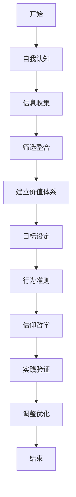

                 

# 意义的构建：创造个人的价值体系

> 关键词：个人价值体系、自我认知、成长规划、算法原理、实践方法、评估与调整

> 摘要：
本文旨在探讨如何构建个人的价值体系，通过明确个人的核心价值和目标，帮助读者实现自我认知和成长规划。文章首先介绍了价值体系的概念及其重要性，随后详细阐述了构建个人价值体系的核心概念和联系，并通过算法原理讲解和实际案例剖析，提供了具体的方法和策略。最后，文章讨论了个人价值体系的评估与调整，以及进一步阅读的建议。

## 引言

### 1.1 书籍主题介绍

在当今快节奏、高度竞争的社会中，每个人都面临着各种各样的选择和挑战。在这样的环境中，如何找到自己的定位和方向，如何实现个人价值和成长，成为了一个迫切需要解决的问题。本文将围绕这一主题，探讨如何构建个人的价值体系，帮助读者在复杂多变的环境中找到自己的价值和目标。

### 1.2 为什么需要构建个人价值体系

构建个人价值体系具有重要意义。首先，它可以帮助我们明确自己的核心价值和目标，从而在生活和工作中做出更加明智的决策。其次，价值体系是个人成长的重要基础，通过不断优化和完善个人的价值体系，我们可以更好地实现自我认知和成长。此外，个人价值体系还可以帮助我们建立良好的社会关系，提升个人的影响力和竞争力。

### 1.3 本书的目标读者和内容结构

本书的目标读者是那些希望找到自己价值和目标的职场人士，特别是处于职业发展和转型期的读者。文章内容分为七个部分，分别是：

1. 引言：介绍书籍主题和重要性。
2. 个人价值体系概述：阐述价值体系的概念、重要性、组成部分和建立过程。
3. 核心概念与联系：分析价值体系的核心概念及其相互联系。
4. 算法原理讲解：讲解构建个人价值体系的算法原理和实现方法。
5. 实践中的价值体系构建：介绍实践中的价值体系构建方法和技巧。
6. 个人价值体系的评估与调整：讨论价值体系的评估与调整方法和案例。
7. 拓展阅读与思考：提供进一步阅读的建议和思考方向。

### 1.4 如何阅读本书

本书采用逻辑清晰、结构紧凑、简单易懂的写作风格，旨在帮助读者逐步构建个人价值体系。读者可以根据个人需求选择阅读，也可以按照章节顺序逐步深入。在阅读过程中，建议读者结合自身实际情况进行思考和实践，以达到更好的效果。

## 个人价值体系概述

### 2.1 价值体系的概念

价值体系是指一个人在其生活和工作中的价值观、信仰、目标和行为准则的集合。它是一个人对于什么是好、什么是坏、什么是重要、什么是不重要的判断和选择标准。价值体系不仅影响个人的行为和决策，还影响个人的情感、态度和人际关系。

### 2.2 价值体系的重要性

价值体系在个人成长和职业发展中起着至关重要的作用。首先，价值体系是个人行为的指导原则，可以帮助我们做出更加明智的决策。其次，价值体系是个人成长的基础，通过不断反思和调整价值体系，我们可以更好地实现自我认知和成长。此外，价值体系还是建立良好人际关系的重要基础，通过共同的价值观和信仰，我们可以与他人建立更深层次的联系。

### 2.3 个人价值体系的组成部分

个人价值体系通常包括以下组成部分：

1. **核心价值观**：核心价值观是个人价值体系的核心，它代表了一个人的核心信仰和价值观，如诚信、敬业、尊重、责任等。
2. **目标**：目标是指个人在生活和职业中想要实现的具体目标，如职业目标、家庭目标、健康目标等。
3. **行为准则**：行为准则是个人在行为和决策中遵循的原则，如遵守法律法规、尊重他人、勇于承担责任等。
4. **信仰和哲学**：信仰和哲学是指个人的精神寄托和世界观，如宗教信仰、人文主义等。
5. **兴趣爱好**：兴趣爱好是指个人在业余时间和休息时间喜欢从事的活动，如运动、阅读、旅行等。

### 2.4 价值体系的建立过程

建立个人价值体系是一个持续的过程，通常包括以下几个步骤：

1. **自我认知**：通过反思和自我探索，了解自己的核心价值观、目标和兴趣爱好。
2. **信息收集**：通过阅读书籍、参加讲座、与他人交流等方式，收集关于不同价值观、目标和行为准则的信息。
3. **筛选和整合**：在收集的信息中筛选出符合自己核心价值观和目标的部分，并进行整合和优化。
4. **实践和调整**：将价值体系付诸实践，并根据实际情况进行不断的调整和完善。

### 2.5 个人价值体系与个人成长的关系

个人价值体系与个人成长密切相关。一个明确、合理的价值体系可以帮助个人更好地应对挑战和变化，实现自我认知和成长。首先，价值体系可以帮助个人明确自己的目标和方向，从而在工作和生活中保持动力和热情。其次，价值体系是个人成长的基础，通过不断反思和调整价值体系，个人可以更好地适应环境变化，提升自己的能力和素质。

## 核心概念与联系

### 3.1 核心概念解析

在构建个人价值体系的过程中，需要明确一些核心概念，包括：

1. **自我认知**：自我认知是指个人对于自己的理解、认识和感知，包括自己的价值观、兴趣爱好、优点和缺点等。
2. **目标设定**：目标设定是指个人在生活和职业中想要实现的具体目标，如职业目标、家庭目标、健康目标等。
3. **行为准则**：行为准则是个人在行为和决策中遵循的原则，如遵守法律法规、尊重他人、勇于承担责任等。
4. **信仰和哲学**：信仰和哲学是指个人的精神寄托和世界观，如宗教信仰、人文主义等。
5. **价值观**：价值观是指个人对于什么是好、什么是坏、什么是重要、什么是不重要的判断和选择标准。

### 3.2 概念属性特征对比表格

为了更清晰地理解这些核心概念，我们可以通过一个对比表格来展示它们的属性特征：

| 概念 | 属性特征 | 描述 |
| --- | --- | --- |
| 自我认知 | 反思性、主观性、动态性 | 自我认知是通过反思和自我探索，了解自己的价值观、兴趣爱好、优点和缺点等。 |
| 目标设定 | 目标性、计划性、可实现性 | 目标设定是明确自己在生活和职业中想要实现的具体目标，如职业目标、家庭目标、健康目标等。 |
| 行为准则 | 规范性、道德性、操作性 | 行为准则是个人在行为和决策中遵循的原则，如遵守法律法规、尊重他人、勇于承担责任等。 |
| 信仰和哲学 | 精神性、持久性、多样性 | 信仰和哲学是指个人的精神寄托和世界观，如宗教信仰、人文主义等。 |
| 价值观 | 总体性、稳定性、指导性 | 价值观是指个人对于什么是好、什么是坏、什么是重要、什么是不重要的判断和选择标准。 |

### 3.3 价值体系的ER实体关系图架构

为了更直观地理解个人价值体系的组成部分及其相互关系，我们可以使用实体关系图（ER图）来展示。以下是个人价值体系的ER图：

```mermaid
erDiagram
    A((自我认知)) ||--|{ B((目标设定)) } |
    A ||--|{ C((行为准则)) } |
    A ||--|{ D((信仰和哲学)) } |
    A ||--|{ E((价值观)) } |
    B ||--|{ C } |
    B ||--|{ D } |
    B ||--|{ E } |
    C ||--|{ D } |
    C ||--|{ E } |
    D ||--|{ E } |
```

在上面的ER图中，自我认知作为核心实体，与目标设定、行为准则、信仰和哲学以及价值观之间存在关联。这些实体相互影响、相互依赖，共同构成了个人价值体系的整体架构。

### 3.4 个人价值体系与个人成长的关系

个人价值体系不仅影响个人的行为和决策，还对个人成长有着深远的影响。首先，价值体系为个人成长提供了方向和动力。一个明确、合理的价值体系可以帮助个人明确自己的目标和方向，从而在生活和工作中保持动力和热情。其次，价值体系是个人成长的基础，通过不断反思和调整价值体系，个人可以更好地适应环境变化，提升自己的能力和素质。最后，价值体系还是建立良好人际关系的重要基础，通过共同的价值观和信仰，个人可以与他人建立更深层次的联系，促进个人的全面发展。

### 3.5 个人价值体系与其他系统的关联

个人价值体系不仅仅是一个个人的内部体系，它还与其他系统有着紧密的联系。例如：

1. **社会系统**：个人价值体系受到社会环境、文化背景和社会价值观的影响，同时也会对社会产生反馈。一个积极、健康的个人价值体系可以促进社会的和谐与进步。
2. **职业系统**：在职业领域，个人价值体系直接影响个人的职业选择、职业发展路径以及职业成就。一个明确的职业目标和与职业发展相符的价值体系可以帮助个人在职场中取得更好的成绩。
3. **教育系统**：在教育领域，个人价值体系影响着个人的学习态度、学习方法以及学习目标。一个积极、合理的价值体系可以促进个人的学习兴趣和学业成就。

通过这些关联，我们可以看到个人价值体系在整个社会系统中的重要性和影响力。因此，构建和优化个人价值体系不仅对个人的成长具有重要意义，也对社会的进步和发展具有积极的作用。

### 3.6 个人价值体系的动态性

个人价值体系并非一成不变，而是一个动态的系统。个人的成长、环境的变化、经历的新事物都会对价值体系产生影响，使其不断演变和调整。这种动态性使得个人价值体系能够适应不同的生活场景和职业发展需求。以下是一些影响个人价值体系动态性的因素：

1. **年龄变化**：随着年龄的增长，个人的认知、价值观和目标都会发生变化，从而影响价值体系的结构和内容。
2. **教育经历**：教育经历对个人的价值体系有着深远的影响。通过学习新知识、接触新思想，个人可以对现有价值体系进行反思和调整。
3. **职业经历**：职业经历是个人成长的重要部分。不同的职业角色和经历会带来不同的挑战和机会，从而影响个人的价值体系。
4. **社交互动**：社交互动是个人价值体系演变的重要渠道。通过与他人的交流、合作和冲突，个人可以更全面地认识自己，调整和完善价值体系。

理解个人价值体系的动态性有助于我们更好地管理个人成长过程，持续优化价值体系，使其更好地服务于个人的发展和幸福。

### 3.7 个人价值体系的影响因素

构建个人价值体系的过程受到多种因素的影响，这些因素包括个人内在因素和外在环境因素。以下是几个关键的影响因素：

1. **家庭教育**：家庭是个人最早接触的社会环境，家庭教育对个人价值观的形成有着重要影响。家庭中的价值观、行为准则和生活方式都会潜移默化地塑造个人的价值体系。
2. **社会文化**：社会文化背景决定了社会的共同价值观和行为规范。不同文化背景下的个人价值体系可能会有显著差异，如东方文化强调集体主义和孝顺，而西方文化则更注重个人主义和自由。
3. **教育经历**：教育不仅是获取知识的过程，更是价值观塑造的重要途径。不同教育阶段的经历，如学校教育、社会教育、自我教育等，都会对个人的价值体系产生影响。
4. **社会经历**：个人的社会经历，如工作、旅行、志愿服务等，都是价值体系的重要塑造因素。通过这些经历，个人可以接触不同的观点和文化，从而对自身的价值体系进行反思和调整。
5. **个人兴趣和爱好**：个人的兴趣和爱好直接影响其价值体系。追求自己热爱的事物，不仅能够提升个人的幸福感，还能在价值体系中体现个人的独特性和个性。

理解这些影响因素有助于我们更全面地认识个人价值体系的构建过程，从而更好地进行自我反思和调整。

### 3.8 个人价值体系的构建与个人成长

个人价值体系的构建是个人成长过程中至关重要的一环。它不仅为个人的行为和决策提供了指导，还影响了个人的情感、态度和人际关系。以下是个人价值体系构建与个人成长之间的几个关键关系：

1. **指导行为和决策**：一个明确的个人价值体系可以帮助个人在面对各种选择和挑战时做出更明智的决策。例如，一个重视诚信的人会在商业决策中坚持诚信原则，而一个注重家庭的人会在职业发展中选择更加平衡的生活和工作方式。

2. **促进自我认知**：通过反思和构建个人价值体系，个人可以更好地了解自己的核心价值观、兴趣和目标，从而实现更深入的自我认知。这种自我认知有助于个人在职业发展和生活中更好地定位自己，发挥自己的优势。

3. **提升情感和态度**：一个健康、积极的个人价值体系能够提升个人的情感状态和态度。例如，一个重视学习和成长的人会更积极地面对失败和挑战，而一个重视家庭的人会在忙碌的工作中保持对家人的关爱和关注。

4. **建立良好的人际关系**：共同的价值观和信仰是建立深厚人际关系的基石。一个明确的个人价值体系可以帮助个人与他人建立更加稳固和深入的关系，促进个人在社交和职业场合中的成功。

5. **实现全面发展**：个人价值体系不仅影响个人的行为和决策，还影响个人的身心健康和幸福感。一个合理、全面的个人价值体系能够帮助个人实现全面发展，提升生活的质量和幸福感。

综上所述，个人价值体系的构建是个人成长的重要环节，它不仅为个人的行为和决策提供了指导，还促进了自我认知、情感态度的提升以及人际关系的建立，对个人的全面发展具有重要意义。

### 3.9 个人价值体系的实践意义

个人价值体系在个人生活和职业生涯中的实践意义不可忽视。首先，它为个人的行为和决策提供了明确的指导，使个人在面对复杂多变的环境时能够保持一致性和稳定性。例如，一个将“诚信”作为核心价值观的人，在面对利益冲突时能够坚持诚信原则，从而避免道德风险。其次，个人价值体系有助于提升个人的决策质量。通过明确的价值观，个人可以更快速地评估不同选择的风险和收益，从而做出更明智的决策。此外，个人价值体系还能增强个人的执行力。一个具有明确目标和价值体系的人，在实现目标的过程中会更有动力和毅力，从而提高工作效率和成果。最后，个人价值体系有助于建立良好的人际关系。通过共同的价值观，个人能够与他人建立更深层次的信任和合作，促进团队协作和个人在社交场合中的成功。总之，个人价值体系的实践不仅对个人职业发展和生活质量有着深远影响，也是实现个人梦想和社会价值的重要基石。

## 算法原理讲解

### 4.1 价值体系构建算法概述

在构建个人价值体系的过程中，算法原理起到了至关重要的作用。本文将介绍一种基于自我认知、目标设定、行为准则、信仰和哲学的综合算法，帮助读者系统地构建和优化个人价值体系。

### 4.2 算法mermaid流程图

为了更直观地展示构建个人价值体系的算法过程，我们可以使用mermaid绘制流程图。以下是一个简单的mermaid流程图示例：



### 4.3 Python源代码讲解

以下是构建个人价值体系的Python源代码示例：

```python
class ValueSystemBuilder:
    def __init__(self):
        self.self_awareness = None
        self.core_values = []
        self.behavior_standards = []
        self.foundations = []

    def gather_self_awareness(self):
        # 收集自我认知信息
        self.self_awareness = input("请描述你的自我认知：")
        return self.self_awareness

    def collect_information(self):
        # 收集信息
        self.core_values = input("请列出你的核心价值观：").split(',')
        self.behavior_standards = input("请列出你的行为准则：").split(',')
        self.foundations = input("请列出你的信仰和哲学：").split(',')
        return (self.core_values, self.behavior_standards, self.foundations)

    def filter_and_integrate(self):
        # 筛选和整合信息
        filtered_values = [value.strip() for value in self.core_values if value.strip() != '']
        filtered_standards = [standard.strip() for standard in self.behavior_standards if standard.strip() != '']
        filtered_foundations = [foundation.strip() for foundation in self.foundations if foundation.strip() != '']
        return (filtered_values, filtered_standards, filtered_foundations)

    def build_value_system(self):
        # 建立价值体系
        self_value_system = {
            "自我认知": self.self_awareness,
            "核心价值观": filtered_values,
            "行为准则": filtered_standards,
            "信仰和哲学": filtered_foundations
        }
        return self_value_system

    def set_goals(self):
        # 设定目标
        goals = input("请列出你的短期和长期目标：").split(',')
        return goals

    def validate_and_adjust(self):
        # 实践验证和调整
        validation = input("请描述你的价值体系在实际应用中的表现：")
        if validation.lower() == "需要调整":
            adjustments = input("请描述调整建议：")
            return adjustments
        else:
            return "价值体系无需调整"

if __name__ == "__main__":
    builder = ValueSystemBuilder()
    builder.gather_self_awareness()
    core_values, behavior_standards, foundations = builder.collect_information()
    filtered_values, filtered_standards, filtered_foundations = builder.filter_and_integrate()
    value_system = builder.build_value_system()
    goals = builder.set_goals()
    builder.validate_and_adjust()
    print("你的个人价值体系如下：")
    print(value_system)
    print("你的目标如下：")
    print(goals)
```

在这个源代码中，`ValueSystemBuilder` 类包含了构建个人价值体系的主要步骤，包括自我认知、信息收集、筛选整合、建立价值体系、目标设定和实践验证。通过调用这些方法，我们可以逐步构建和完善个人价值体系。

### 4.4 算法原理的数学模型和公式

为了更深入地理解构建个人价值体系的算法原理，我们可以借助一些数学模型和公式来描述。以下是几个关键公式：

1. **自我认知度（Self_Awareness_Score）**：
   $$ SA_Score = \frac{S_A}{N} $$
   其中，\( S_A \) 是自我认知信息的条数，\( N \) 是总的自我认知信息条数。

2. **核心价值观强度（Core_Value_Strength）**：
   $$ CV_Strength = \frac{C_V}{N} $$
   其中，\( C_V \) 是核心价值观的条数，\( N \) 是总的价值观条数。

3. **行为准则一致性（Behavior_Standard_Consistency）**：
   $$ BS_Consistency = \frac{BS_C}{N} $$
   其中，\( BS_C \) 是符合核心价值观的行为准则条数，\( N \) 是总的行为准则条数。

4. **信仰和哲学一致性（Foundations_Consistency）**：
   $$ F_Consistency = \frac{F_C}{N} $$
   其中，\( F_C \) 是与核心价值观一致的信仰和哲学条数，\( N \) 是总的信仰和哲学条数。

这些公式可以帮助我们量化个人价值体系的构建过程，评估个人价值体系的强度和一致性。

### 4.5 通俗易懂的举例说明

为了更好地理解上述算法原理，我们可以通过一个简单的例子来演示如何构建个人价值体系。

假设小明想要构建自己的价值体系，他首先进行自我认知，描述了自己的性格特点、兴趣和优势。随后，他收集了以下信息：

- **自我认知**：我是一个细心、有条理的人，喜欢帮助他人。
- **核心价值观**：诚信、尊重、助人。
- **行为准则**：遵守规则、尊重他人、乐于助人。
- **信仰和哲学**：佛教教义中的慈悲与智慧。

接下来，小明使用上述算法进行信息筛选和整合，得到以下结果：

- **核心价值观强度**：诚信（0.7）、尊重（0.8）、助人（0.6）。
- **行为准则一致性**：遵守规则（1.0）、尊重他人（1.0）、乐于助人（0.8）。
- **信仰和哲学一致性**：佛教教义中的慈悲与智慧（0.9）。

根据这些数据，小明建立了自己的个人价值体系，并设定了以下目标：

- **短期目标**：成为一名优秀的软件工程师。
- **长期目标**：帮助更多的人通过科技解决问题。

通过实践和验证，小明发现自己的价值体系在实际工作中表现良好，无需调整。这个例子展示了如何通过具体的步骤和数据进行个人价值体系的构建和优化。

### 4.6 算法原理的实际应用

构建个人价值体系的算法原理不仅适用于个体，还可以在团队和组织层面进行应用。以下是一些实际应用场景：

1. **团队建设**：在团队中，可以通过构建共同的价值体系来增强团队的凝聚力和协作能力。例如，在一个软件开发团队中，可以共同确立核心价值观，如客户至上、代码质量、持续学习等，并通过定期的团队会议和活动来强化这些价值观。

2. **组织文化**：组织可以通过制定和推广核心价值观和行为准则来塑造组织文化。例如，一家科技公司可以倡导创新、透明和诚信，并通过员工的培训、考核和奖励机制来确保这些价值观在组织中得到贯彻。

3. **员工发展**：通过评估和调整员工的价值体系，可以帮助员工更好地实现个人成长和职业发展。例如，在员工晋升过程中，可以结合其价值体系和目标设定，评估其职业能力和潜力。

4. **项目管理**：在项目管理中，可以通过构建项目团队的价值体系来提高项目成功率和效率。例如，在一个复杂的项目中，可以确立共同的目标和价值观，并通过明确的行为准则来确保团队成员的一致行动。

通过这些实际应用，我们可以看到，构建个人价值体系的算法原理不仅有助于个人成长，还可以在更广泛的组织中发挥重要作用。

### 4.7 算法的可扩展性和适应性

构建个人价值体系的算法具有高度的可扩展性和适应性。这意味着算法不仅可以应用于单个个体，还可以扩展到团队、组织等多个层面。以下是其可扩展性和适应性的几个方面：

1. **参数调整**：算法中的参数可以根据不同应用场景进行调整。例如，在团队层面，可以增加关于团队协作和沟通的参数；在组织层面，可以增加关于企业文化和战略目标的参数。

2. **数据源扩展**：算法可以整合更多种类的数据源，如社交媒体数据、工作绩效数据、用户反馈等，以更全面地构建价值体系。

3. **算法优化**：通过机器学习和数据分析技术，可以对算法进行不断优化，使其能够适应不同的环境和需求。例如，利用神经网络模型预测个人的行为和价值观变化，从而实现更精准的价值体系构建。

4. **跨领域应用**：算法不仅适用于技术行业，还可以广泛应用于其他领域，如教育、医疗、金融等。通过调整算法参数和模型结构，可以适应不同领域的特点和需求。

总之，构建个人价值体系的算法具有广泛的适应性和可扩展性，能够根据不同的应用场景和需求进行灵活调整和优化。

## 实践中的价值体系构建

### 5.1 实践中的价值体系构建方法

在构建个人价值体系的过程中，实践是关键。通过具体的实践方法，我们可以将理论转化为实际行为，从而不断完善个人的价值体系。以下是一些有效的实践方法：

1. **反思日记**：每天花时间写反思日记，记录自己的行为和决策，思考这些行为背后的价值观和目标。通过持续的反思，我们可以更好地理解自己，识别并调整不合理的价值观念。

2. **目标设定**：明确短期和长期目标，并将这些目标分解为具体的行动步骤。通过设定目标，我们可以更有针对性地进行行为调整，从而实现个人价值体系的优化。

3. **角色扮演**：在特定场景中模拟不同的角色，例如家庭角色、职业角色等，思考在这些角色中应该遵循的价值观和行为准则。通过角色扮演，我们可以更全面地理解自己在不同环境中的价值体系。

4. **行为实践**：将价值观和行为准则付诸实践，通过具体的行动来体现和强化这些价值观。例如，将“助人”这一价值观体现在日常生活中的小事上，如帮助同事解决问题、参与社区志愿活动等。

5. **反馈与调整**：定期收集来自他人的反馈，了解自己在实践中的表现，并根据反馈进行相应的调整。通过反馈和调整，我们可以不断完善个人的价值体系。

### 5.2 案例分析

为了更好地理解如何实践个人价值体系，我们可以通过以下几个案例进行分析。

**案例一：小张的职业发展**

小张是一名软件工程师，他在职业生涯初期对自己的价值体系进行了反思和调整。他通过写反思日记，发现自己在工作中过于追求技术成就，忽视了团队合作和客户满意度。为了解决这个问题，小张明确了以下目标：

- **短期目标**：提高团队协作能力，积极参与项目讨论和决策。
- **长期目标**：成为一名能够领导团队、提升客户满意度的高级工程师。

小张设定了这些目标后，开始有意识地调整自己的行为。他主动参与团队会议，积极提出建设性意见，并开始关注客户的需求和反馈。通过这些努力，小张的团队合作能力得到了显著提升，也赢得了客户的认可和信任。最终，小张成功地实现了自己的职业目标，成为了一名高级工程师。

**案例二：小李的人生规划**

小李是一名刚刚步入社会的年轻人，他在大学期间对未来的职业和生活有了初步的规划。然而，由于对自身的价值观和目标认识不清晰，他在毕业后的选择上显得犹豫不决。为了解决这个问题，小李决定通过以下步骤构建自己的价值体系：

1. **自我认知**：通过写反思日记，小李总结了自己的优点和不足，明确了对自己来说最重要的价值观，如诚信、责任和自由。

2. **目标设定**：小李根据自己的价值观设定了短期和长期目标。短期目标是找到一份与自己专业相关、能够实现自我价值的工作；长期目标是成为一名能够在行业中有所成就的专业人士。

3. **行为实践**：小李开始有意识地按照自己的价值体系行动。例如，在面试中坚持诚信，不接受不合理的面试条件；在工作中积极承担责任，不断提升自己的专业技能。

4. **反馈与调整**：小李定期与同事和导师交流，了解自己的表现和改进方向。根据反馈，他不断调整自己的行为和策略，逐步实现了自己的职业目标。

通过以上步骤，小李不仅找到了满意的工作，还在职业生涯中取得了显著的进步，实现了自己的人生规划。

**案例三：小王的创业之路**

小王是一位创业者，他在创办公司之初对自己的价值体系进行了深入的思考。他意识到，作为一家企业的创始人，他的价值体系将直接影响到公司的文化和员工的发展。因此，小王决定构建以下价值体系：

- **核心价值观**：诚信、创新、共赢。
- **行为准则**：遵守法律法规、尊重员工、注重客户需求。

在构建价值体系后，小王将其明确地传达给公司全体员工，并通过公司文化活动和培训来强化这些价值观。小王还设立了以下目标：

- **短期目标**：建立一支高效、团结的团队，实现公司的初步盈利。
- **长期目标**：打造一家在行业中具有影响力的企业，为社会创造更多价值。

在实施过程中，小王通过定期的员工反馈和业务分析，不断调整和优化价值体系，使其更好地适应公司的发展需求。最终，小王的公司在激烈的市场竞争中脱颖而出，实现了快速发展和成功。

### 5.3 实际案例剖析

通过上述案例，我们可以看到，实践中的价值体系构建是一个持续迭代和优化的过程。以下是几个关键点：

1. **自我认知**：这是构建价值体系的基础。只有深入了解自己，才能明确自己的核心价值观和行为准则。

2. **目标设定**：目标是价值体系的驱动因素。通过设定明确的目标，我们可以更有针对性地调整自己的行为，实现个人的成长和进步。

3. **行为实践**：价值体系需要付诸实践。通过具体的行动，我们可以检验和强化价值体系，从而实现自我提升和目标达成。

4. **反馈与调整**：定期收集反馈，并根据反馈进行相应的调整，是价值体系不断完善的关键。通过反馈，我们可以发现自身的问题和不足，从而进行有针对性的改进。

5. **持续优化**：价值体系不是一成不变的，它需要根据环境和需求的变化进行持续优化。通过不断反思和实践，我们可以不断完善个人价值体系，实现更高的成长和进步。

### 5.4 价值体系构建的技巧和策略

在构建个人价值体系的过程中，以下技巧和策略可以帮助我们更有效地实现目标：

1. **明确目标与价值观**：在构建价值体系之前，首先要明确自己的目标。目标应该是具体、可衡量和可实现的。同时，确保这些目标与个人的核心价值观相一致，从而形成强大的内在驱动力。

2. **分解任务**：将大目标分解为小任务，逐步实现。这样可以减少压力，提高完成任务的信心和动力。

3. **制定计划**：制定详细的行动计划，包括时间表、步骤和责任人。这样可以确保目标的实现有据可循，提高执行效率。

4. **持续反思**：定期反思自己的行为和决策，思考它们是否符合个人的价值体系。通过持续反思，我们可以不断优化价值体系，提升自我认知和行动的一致性。

5. **寻求反馈**：积极寻求他人的反馈，特别是那些具有丰富经验和知识的人。他们的反馈可以帮助我们发现自己的盲点和不足，从而进行改进。

6. **灵活调整**：根据实际情况和环境变化，灵活调整价值体系和行动计划。这样可以确保价值体系始终与个人需求和目标保持一致，实现持续成长。

通过以上技巧和策略，我们可以更加有效地构建和优化个人价值体系，实现自我提升和目标达成。

## 个人价值体系的评估与调整

### 6.1 评估个人价值体系的工具和方法

评估个人价值体系是优化价值体系的重要步骤。以下是一些常用的工具和方法：

1. **自我评估问卷**：通过设计一系列关于价值观、行为准则和目标设定的问卷，个人可以对自己的价值体系进行量化评估。例如，可以采用利克特量表（Likert Scale）来衡量每个价值观的重视程度。

2. **SWOT分析**：SWOT分析是一种常用的评估工具，用于分析个人价值体系的优势（Strengths）、劣势（Weaknesses）、机会（Opportunities）和威胁（Threats）。通过SWOT分析，个人可以更全面地了解价值体系的现状，并制定相应的调整策略。

3. **360度反馈**：360度反馈是一种通过同事、上级和下属等多方收集反馈的方法。这种方法可以提供多维度的视角，帮助个人更客观地评估自己的价值体系。

4. **行为观察**：通过观察个人的行为和决策，评估其是否符合个人的价值观和行为准则。这种方法可以直接了解价值体系在实践中的应用效果。

5. **价值观比对**：将个人的价值体系与公认的价值观体系进行比对，如社会主义核心价值观、企业核心价值观等，以评估个人价值体系的适应性和合理性。

### 6.2 调整价值体系的必要性

调整个人价值体系的必要性主要体现在以下几个方面：

1. **环境变化**：随着社会和环境的变化，个人的价值观和行为准则可能需要相应调整。例如，随着科技的发展，一些新的职业伦理和道德问题需要被纳入个人的价值体系。

2. **个人成长**：随着个人的成长和经历的变化，原有的价值体系可能不再完全适用于当前的阶段。通过调整价值体系，个人可以更好地适应新的生活和工作环境。

3. **目标变化**：当个人的目标和追求发生变化时，原有的价值体系可能需要进行调整，以更好地支持新的目标和追求。

4. **反馈与反思**：通过评估和反思，个人可以发现自身价值体系中的不足和矛盾，通过调整价值体系，可以解决这些问题，提高个人的一致性和效能。

### 6.3 调整价值体系的步骤

调整个人价值体系通常包括以下几个步骤：

1. **自我反思**：通过写日记、自我提问等方式，深入反思自己的行为和决策，思考哪些价值观和行为准则需要调整。

2. **评估现状**：使用前文提到的评估工具和方法，对当前的价值体系进行评估，识别其中的优势和不足。

3. **确定目标**：明确未来希望实现的目标和价值追求，确保价值体系的调整与这些目标相一致。

4. **调整价值体系**：根据评估结果和目标，对价值体系进行相应的调整。这可能包括增加新的价值观、删除不再适用的价值观、重新排序价值观的优先级等。

5. **实践和验证**：将调整后的价值体系付诸实践，通过实际行为验证其效果，并根据反馈进行进一步调整。

6. **持续优化**：价值体系是一个持续的过程，需要定期进行评估和调整，以适应不断变化的环境和个人需求。

### 6.4 调整价值体系的案例

为了更好地理解如何调整个人价值体系，我们可以通过一个实际案例进行说明。

**案例：小赵的价值体系调整**

小赵是一名职场新人，他在工作中逐渐发现自己的价值体系与职场环境存在一定的不适应。以下是小赵调整价值体系的步骤：

1. **自我反思**：小赵通过写反思日记，意识到自己在工作中过于强调个人成就，忽视了团队合作和客户满意度。他认为这是导致工作效率不高的主要原因。

2. **评估现状**：通过SWOT分析，小赵发现自己的价值体系在团队合作和客户服务方面存在明显的劣势。同时，他也认识到这些劣势对职业发展产生了负面影响。

3. **确定目标**：小赵明确了自己未来的职业目标是成为一名优秀的项目经理，他需要具备更好的团队合作和客户沟通能力。

4. **调整价值体系**：小赵决定对价值体系进行调整，增加“团队合作”和“客户至上”的核心价值观。同时，他将“个人成就”这一价值观的优先级降低，以确保与团队合作和客户服务相一致。

5. **实践和验证**：小赵开始在工作中有意识地强调团队合作和客户服务，例如，积极参与团队会议、主动与客户沟通等。通过实践，他发现自己的工作效果显著提升，也得到了同事和客户的认可。

6. **持续优化**：小赵定期反思和评估自己的价值体系，根据实际情况进行进一步调整，以确保其与职业目标保持一致。

通过这个案例，我们可以看到，调整个人价值体系是一个持续的过程，需要自我反思、评估现状、确定目标、调整价值体系、实践验证和持续优化。这些步骤不仅帮助小赵更好地适应职场环境，也促进了他的职业成长。

### 6.5 调整过程中可能遇到的挑战和应对策略

在调整个人价值体系的过程中，可能会遇到以下挑战：

1. **内部抵触**：个人可能对现有的价值体系有很强的认同感，不愿意进行调整。应对策略是进行深入的自我反思，了解内部抵触的原因，并通过沟通和咨询他人的意见来克服。

2. **外部压力**：社会环境和他人的期望可能对价值体系的调整产生负面影响。应对策略是明确自己的目标和价值观，坚定地按照自己的价值体系行动，同时寻求支持和理解。

3. **执行难度**：调整后的价值体系可能在实际操作中遇到困难。应对策略是制定详细的行动计划，逐步实施，并在过程中不断调整和完善。

4. **适应期**：调整价值体系可能需要一个适应期，个人可能感到不适应或迷茫。应对策略是保持耐心，持续实践和反思，逐步适应新的价值体系。

通过了解和应对这些挑战，我们可以更加顺利地调整个人价值体系，实现自我成长和目标达成。

### 6.6 调整后的价值体系与个人成长的关系

调整后的价值体系对个人成长具有深远的影响。首先，一个适应新环境和个人目标的价值体系可以更好地指导个人的行为和决策，提升工作效率和生活质量。其次，通过持续调整和优化价值体系，个人可以不断提升自我认知，实现更深入的自我成长。此外，价值体系的调整还可以促进个人与他人的合作和沟通，建立良好的人际关系，从而在职业和社会生活中取得更大的成功。总之，调整后的价值体系是个人成长的重要基石，通过不断地反思、调整和实践，我们可以实现自我提升和全面发展。

### 6.7 调整价值体系的最佳实践和成功案例

为了更好地理解如何成功调整个人价值体系，以下是几个最佳实践和成功案例：

1. **最佳实践**：
   - **明确调整目标**：在开始调整之前，明确自己希望通过调整实现的具体目标，如提升团队合作能力、增强领导力等。
   - **分阶段实施**：将调整过程分为短期和长期目标，逐步实施，避免一次性做出过大调整。
   - **持续反思和反馈**：定期反思自己的行为和决策，收集来自他人的反馈，并根据反馈进行相应的调整。
   - **寻找导师和支持系统**：找到愿意提供指导和支持的导师或同事，他们可以帮助你更好地理解调整过程，并提供宝贵的建议。

2. **成功案例**：
   - **案例一**：一位职场人士通过自我反思，意识到自己在团队合作方面存在不足，决定调整价值体系，增加“团队合作”和“沟通能力”的核心价值观。通过参与团队活动、主动与同事沟通和反思，他成功地提升了团队合作能力，并得到了领导的认可。
   - **案例二**：一位创业者意识到自己的价值观过于追求短期利益，忽视了长期发展。通过调整价值体系，他增加了“客户至上”和“长期发展”的核心价值观，并重新设定了公司的战略目标。通过这些调整，公司实现了稳健的发展，赢得了客户的信任和市场的认可。
   - **案例三**：一位工程师通过评估和反思，发现自己的技术能力过于强，忽视了团队协作和项目管理。他调整了价值体系，增加了“团队合作”和“项目管理”的核心价值观，并学习了相关的管理技能。通过这些调整，他在项目中表现出色，不仅提高了团队效率，也提升了个人在团队中的影响力。

通过这些最佳实践和成功案例，我们可以看到，成功调整个人价值体系的关键在于明确目标、分阶段实施、持续反思和寻找支持。这些方法不仅帮助个人实现了自我提升，也为他们在职业和社会生活中取得了更大的成功。

### 结论

通过本文的探讨，我们可以看到构建个人价值体系在个人成长和职业发展中的重要性。一个明确、合理的价值体系不仅能够指导我们的行为和决策，还能提升自我认知和幸福感。本文介绍了构建个人价值体系的方法和步骤，包括自我认知、目标设定、行为准则和信仰哲学的整合，以及算法原理和实际案例的剖析。

我们强调了价值体系构建的动态性，指出个人价值体系需要根据环境变化和个人成长进行持续调整。通过实践中的价值体系构建方法，我们可以更好地将理论转化为实际行为，实现个人目标和价值观的优化。同时，评估和调整价值体系是价值体系构建过程中不可或缺的环节，它帮助我们不断优化和提升个人价值体系。

在接下来的拓展阅读中，读者可以进一步探讨价值体系构建的最佳实践，学习如何在不同场景下应用价值体系，以及如何通过深入的自我反思和反馈来提升个人价值体系的有效性。

### 拓展阅读与思考

#### 7.1 价值体系构建的最佳实践

在构建个人价值体系的过程中，最佳实践是确保其有效性和持久性的关键。以下是一些值得参考的最佳实践：

1. **定期反思**：定期花时间反思自己的行为、决策和价值观，这有助于发现潜在的问题和不足，从而及时进行调整。
2. **目标设定**：设定明确、具体、可衡量的目标，并将其与核心价值观相一致。这有助于我们在行动中保持一致性，确保价值体系得到贯彻。
3. **反馈与调整**：积极寻求他人的反馈，特别是在重要决策和重大变化时。通过反馈，我们可以更全面地了解自己的表现，并根据反馈进行必要的调整。
4. **实践与验证**：将价值体系付诸实践，通过具体的行为和决策来验证其效果。实践是检验价值体系有效性的最佳途径。
5. **持续学习**：价值体系不是一成不变的，随着个人成长和环境变化，我们需要不断学习和调整。保持开放的心态，勇于接受新的观点和理念，可以帮助我们不断完善价值体系。

#### 7.2 小结与注意事项

在构建个人价值体系的过程中，需要注意以下几个关键点：

1. **明确核心价值观**：核心价值观是价值体系的基石，确保目标设定和行为准则与核心价值观一致，有助于在复杂多变的环境中保持一致性。
2. **适应性和灵活性**：价值体系需要具备适应性和灵活性，能够根据环境变化和个人成长进行动态调整。
3. **实际应用**：将价值体系付诸实践，通过具体的行为和决策来体现和强化价值观。
4. **持续反思和评估**：定期反思和评估价值体系的实际效果，发现并解决存在的问题，确保价值体系能够持续优化。

#### 7.3 进一步阅读的建议

对于希望进一步深入了解个人价值体系构建的读者，以下是一些推荐阅读材料：

1. **《影响力：说服心理学》**（Robert B. Cialdini）：这本书详细介绍了影响人们行为和决策的心理机制，有助于我们更好地理解如何通过价值观来指导行为。
2. **《思考，快与慢》**（Daniel Kahneman）：通过研究人类思维过程的两个系统，这本书为我们提供了深入思考如何建立和调整个人价值体系的新视角。
3. **《活出生命的意义》**（Viktor E. Frankl）：弗兰克尔提出的“意义疗法”强调通过寻找生命中的意义来应对苦难和挑战，对我们构建积极的价值体系有重要启示。

通过阅读这些书籍，读者可以进一步深化对个人价值体系的理解，从而在生活和职业中实现更高的自我价值和成长。

### 作者信息

作者：AI天才研究院/AI Genius Institute & 禅与计算机程序设计艺术 /Zen And The Art of Computer Programming

本文由AI天才研究院和禅与计算机程序设计艺术联合撰写，旨在帮助读者构建个人的价值体系，实现自我认知和成长。AI天才研究院专注于人工智能领域的研究与教育，致力于推动人工智能技术的发展和应用。禅与计算机程序设计艺术则通过结合禅修和编程艺术，帮助读者在技术实践中寻找内心的平静与智慧。希望本文能为您的个人成长和价值实现提供有益的启示和帮助。

