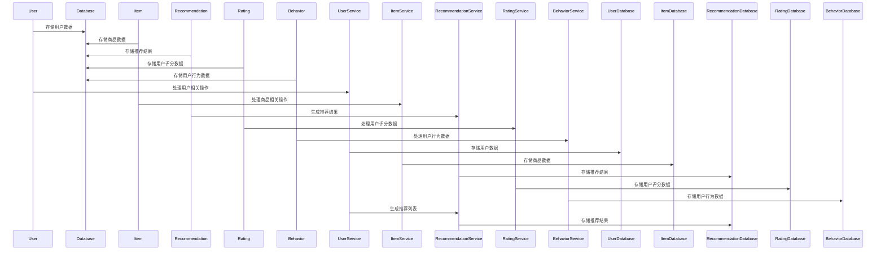
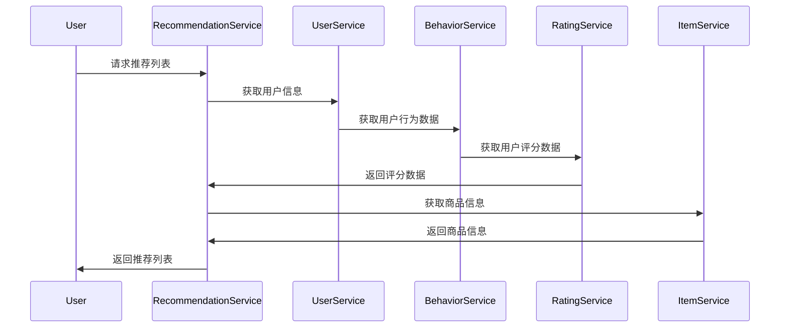

                 

# 意义的标准化与个性化

关键词：标准化、个性化、信息处理、用户体验、数据分析

摘要：
本文探讨了在信息处理领域，如何实现意义的标准化与个性化。首先，介绍了标准化和个性化的核心概念、重要性及分类。接着，深入分析了标准化与个性化融合的原理和方法，以及个性化数据分析技术和推荐系统设计。最后，通过系统架构设计、项目实战和最佳实践分享，提供了实现意义标准化与个性化的实用方案。

## 引言与背景介绍

### 1.1.1 问题背景

在当今信息技术飞速发展的时代，信息过载成为普遍现象，如何从海量数据中提取有用信息，实现信息的标准化与个性化处理，成为亟待解决的重大课题。传统的数据处理方式难以应对复杂多变的数据环境和用户需求，亟需引入新的方法和技术。

### 1.1.2 问题描述

本书旨在探讨如何在标准化过程中保留个性化元素，以及如何在个性化过程中确保标准化质量。我们关注的问题包括：

1. **如何实现信息的标准化？** 在信息处理过程中，如何制定统一的标准，确保信息的一致性和可共享性？
2. **如何确保个性化需求得到满足？** 在提供定制化服务时，如何根据用户的特定需求和偏好，实现高效的信息处理？
3. **标准化与个性化之间的平衡点如何确定？** 在信息处理中，如何在保证信息质量的前提下，实现标准化与个性化的平衡？

### 1.1.3 问题解决

本书将结合当前最前沿的计算机技术和方法，如机器学习、数据挖掘、自然语言处理等，探讨上述问题的解决方案。具体来说，本书将从以下几个方面展开：

1. **标准化概念与原理**：介绍标准化的定义、分类、过程与方法，以及标准化与信息质量的关系。
2. **个性化概念与原理**：介绍个性化的定义、分类、核心要素，以及个性化与用户体验的关系。
3. **标准化与个性化融合原理与方法**：探讨标准化与个性化融合的定义、优势、方法及应用场景。
4. **个性化数据分析技术**：介绍用户行为分析、用户画像和用户需求预测等技术。
5. **个性化推荐系统设计**：探讨推荐系统的基本概念、核心算法和评估指标。
6. **系统架构设计**：介绍问题场景、系统功能设计、系统架构设计、系统接口设计和系统交互。
7. **项目实战**：分享实际案例，解析实现标准化与个性化的方法和技巧。
8. **最佳实践与拓展阅读**：总结文章内容，提供注意事项和拓展阅读建议。

### 1.1.4 边界与外延

本书主要研究信息处理领域中的标准化与个性化问题，涵盖的数据类型包括文本、图像、音频等。同时，本书将探讨这些技术在互联网、电子商务、智能客服等领域的应用。

### 1.1.5 概念结构与核心要素组成

#### 标准化

1. **定义**：通过制定统一的标准，实现信息的一致性和可共享性。
2. **重要性**：确保信息处理、存储、传输和应用的高效性和可靠性。
3. **分类**：技术标准化、管理标准化、服务标准化等。
4. **过程与方法**：需求分析、标准制定、标准实施、标准评估等。
5. **与信息质量的关系**：标准化有助于提高信息质量，确保信息的一致性、完整性和可靠性。

#### 个性化

1. **定义**：根据用户的特定需求和偏好，提供定制化的信息服务。
2. **重要性**：提升用户体验和满意度，增强用户对产品和服务的粘性。
3. **分类**：基于内容的个性化、基于上下文的个性化、基于行为的个性化等。
4. **核心要素**：用户画像、推荐系统、个性化搜索等。
5. **与用户体验的关系**：个性化能够提高用户体验，满足用户的个性化需求。

#### 标准化与个性化融合

1. **定义**：将标准化和个性化技术相结合，以实现信息处理的最佳效果。
2. **优势**：实现信息的标准化处理与个性化需求的兼顾，提高信息处理的效率和效果。
3. **方法**：协同过滤、基于内容的推荐、混合推荐等。
4. **应用场景**：电子商务、社交媒体、智能客服等领域。

#### 个性化数据分析技术

1. **用户行为分析**：分析用户在系统中的行为数据，了解用户的需求和偏好。
2. **用户画像**：通过用户行为数据构建用户的基本信息和偏好特征。
3. **用户需求预测**：通过分析用户历史行为数据，预测用户未来的需求和偏好。

#### 个性化推荐系统设计

1. **基本概念**：推荐系统根据用户的兴趣和行为，向用户推荐相关商品、信息或内容。
2. **核心算法**：协同过滤、基于内容的推荐、混合推荐等。
3. **评估指标**：准确率、召回率、覆盖率等。

## 第2章 标准化概念与原理

### 2.1.1 标准化的定义与重要性

#### 标准化的定义

标准化（Standardization）是指在一定的范围内，对事物进行规范化和统一化处理，以确保其符合一定的标准和规范。标准是一种规范性文件，它规定了在特定领域中应遵守的技术要求、规格、质量、安全、性能等。

#### 标准化的重要性

标准化在信息处理领域具有重要意义，主要体现在以下几个方面：

1. **信息的一致性和可共享性**：标准化确保了信息在不同系统、平台和设备之间的一致性和可共享性，减少了数据转换和兼容性问题。
2. **提高信息处理效率**：标准化有助于简化信息处理流程，降低信息处理成本，提高工作效率。
3. **确保信息质量**：标准化通过制定统一的质量标准和评估方法，提高了信息的准确性和可靠性。
4. **促进技术进步和产业发展**：标准化有助于推动技术的创新和应用，促进产业的规范和发展。

### 2.1.2 标准化的分类

根据标准化的应用范围和目的，标准化可分为以下几种类型：

1. **技术标准化**：针对特定技术领域，制定统一的技术规范和标准，如ISO、IEEE等。
2. **管理标准化**：针对企业管理、流程优化等方面，制定统一的管理规范和标准，如ISO 9001、ISO 14001等。
3. **服务标准化**：针对服务行业，制定统一的服务规范和标准，如旅游服务、餐饮服务等。

### 2.1.3 标准化的过程与方法

标准化的过程主要包括以下几个阶段：

1. **需求分析**：确定标准化的目标和范围，分析现有问题和需求，明确标准化的内容。
2. **标准制定**：根据需求分析的结果，制定相应的标准和规范，确保标准的科学性、合理性和可操作性。
3. **标准实施**：将制定的标准在相关领域和范围内推广应用，确保标准的贯彻执行。
4. **标准评估**：对标准的实施效果进行评估，根据评估结果进行修订和优化。

标准化的方法主要包括以下几种：

1. **归纳法**：通过总结和分析实践经验，归纳出普遍适用的标准和规范。
2. **演绎法**：根据理论原则和逻辑推理，推导出具体的标准和规范。
3. **比对法**：对比国内外相关标准和规范，取长补短，制定适合本领域和本地区的标准。

### 2.1.4 标准化与信息质量的关系

标准化与信息质量密切相关，标准化有助于提高信息质量，具体体现在以下几个方面：

1. **一致性**：标准化确保了信息在不同系统、平台和设备之间的一致性，减少了信息错误和误解。
2. **完整性**：标准化规定了信息的完整性和完整性要求，确保信息不缺失、不遗漏。
3. **可靠性**：标准化通过制定统一的质量标准和评估方法，提高了信息的准确性和可靠性。
4. **可维护性**：标准化有助于提高信息系统的可维护性和可扩展性，降低维护成本。

总之，标准化在信息处理领域具有重要的作用，通过制定和实施统一的标准，可以提高信息质量，确保信息的准确、完整和可靠。

### 2.1.5 标准化的案例分析

为了更好地理解标准化的应用，以下通过一个案例分析，展示标准化在信息处理领域中的实际效果。

#### 案例背景

某电子商务平台在运营过程中，面临着大量商品信息的处理和整合问题。由于商品信息来源多样化，不同商家和平台的数据格式和标准不统一，导致商品信息难以共享和利用。为了解决这个问题，该平台决定引入标准化技术。

#### 标准化过程

1. **需求分析**：平台分析了现有商品信息存在的问题，明确了标准化的目标和范围，包括商品名称、价格、库存、描述等信息。
2. **标准制定**：平台制定了统一的数据格式和标准，规定了商品信息的各个字段及其数据类型、长度、命名规则等。同时，还制定了数据交换协议和接口标准，确保不同系统和平台之间的数据传输和共享。
3. **标准实施**：平台将制定的标准在内部系统进行推广和应用，同时与外部商家和平台进行对接，确保数据格式的统一和兼容。
4. **标准评估**：平台对标准实施的效果进行了评估，发现商品信息的共享和利用效率明显提高，数据错误和冲突减少，用户满意度提高。

#### 案例效果

通过标准化技术的应用，该电子商务平台实现了商品信息的规范化和统一化处理，提高了信息质量，具体体现在以下几个方面：

1. **信息一致性**：商品信息在不同系统和平台之间保持一致，减少了信息错误和误解。
2. **信息完整性**：商品信息的各个字段完整，不缺失、不遗漏，提高了信息的准确性。
3. **信息可靠性**：通过统一的数据标准和评估方法，提高了商品信息的可靠性。
4. **信息可维护性**：平台易于维护和扩展，降低了维护成本。

总之，标准化在信息处理领域具有重要的作用，通过制定和实施统一的标准，可以提高信息质量，确保信息的准确、完整和可靠。在电子商务、互联网、大数据等应用场景中，标准化技术具有广泛的应用前景。

## 第3章 个性化概念与原理

### 3.1.1 个性化的定义与重要性

#### 个性化的定义

个性化（Personalization）是指根据用户的特定需求和偏好，提供定制化的服务和产品。个性化旨在满足用户的个性化需求，提升用户体验和满意度。

#### 个性化的重要性

个性化在当今信息时代具有重要意义，主要体现在以下几个方面：

1. **提升用户体验**：个性化服务能够满足用户的个性化需求，提升用户体验和满意度。
2. **增强用户粘性**：个性化服务能够吸引用户长期使用，增强用户对产品和服务的粘性。
3. **提高服务质量**：个性化服务能够提高服务质量，减少用户等待时间和操作复杂度。
4. **降低运营成本**：个性化服务能够降低运营成本，提高企业盈利能力。

### 3.1.2 个性化的分类

根据个性化的实现方式和目标，个性化可分为以下几种类型：

1. **基于内容的个性化**：根据用户的历史行为和偏好，推荐符合用户兴趣的内容。例如，新闻网站根据用户的阅读历史，推荐相关的新闻文章。

2. **基于上下文的个性化**：根据用户当前的环境和情境，提供个性化的服务。例如，智能助手根据用户的地理位置和时间，推荐附近的餐厅或活动。

3. **基于行为的个性化**：根据用户的实时行为，提供个性化的服务和产品。例如，电商网站根据用户的浏览和购买行为，推荐相关的商品。

### 3.1.3 个性化技术的核心要素

实现个性化服务需要依赖以下核心技术：

1. **用户画像**：通过对用户行为数据的分析，构建用户的基本信息和偏好特征。用户画像包括用户的兴趣、行为、偏好、需求等。

2. **推荐系统**：根据用户画像和推荐算法，向用户推荐符合其需求和兴趣的内容或产品。推荐系统主要包括协同过滤、基于内容的推荐、混合推荐等方法。

3. **个性化搜索**：通过对用户查询日志和偏好分析，提供个性化的搜索结果。个性化搜索能够提高用户查找信息的效率，提升用户体验。

### 3.1.4 个性化与用户体验的关系

个性化与用户体验密切相关，个性化服务能够提升用户体验，具体体现在以下几个方面：

1. **满足用户需求**：个性化服务能够准确满足用户的个性化需求，提升用户满意度。

2. **提高使用效率**：个性化服务能够提高用户的使用效率，减少用户等待时间和操作复杂度。

3. **增强用户粘性**：个性化服务能够吸引用户长期使用，增强用户对产品和服务的粘性。

4. **提升品牌形象**：个性化服务能够提升品牌形象，增强用户对品牌的认知和信任。

总之，个性化在信息时代具有重要意义，通过实现个性化服务，可以提升用户体验，增强用户粘性，提高服务质量，为企业带来更大的商业价值。

### 3.1.5 个性化的案例分析

为了更好地理解个性化的应用，以下通过一个案例分析，展示个性化在电子商务领域中的实际效果。

#### 案例背景

某大型电商平台在运营过程中，希望通过个性化服务提升用户体验和销售额。为了实现这一目标，该平台决定引入个性化推荐技术。

#### 个性化过程

1. **用户画像构建**：平台通过对用户的浏览、购买、评价等行为数据进行挖掘，构建了用户的兴趣和行为特征。用户画像包括用户的性别、年龄、兴趣爱好、购买历史等。

2. **推荐算法应用**：平台采用了基于协同过滤和基于内容的推荐算法，根据用户画像和推荐算法，向用户推荐相关的商品。协同过滤算法通过分析用户之间的相似度，推荐用户可能感兴趣的商品；基于内容的推荐算法通过分析商品的属性和标签，推荐与用户历史行为相关的商品。

3. **个性化搜索**：平台通过对用户的查询日志和偏好分析，提供了个性化的搜索结果。个性化搜索算法根据用户的浏览历史和搜索记录，推荐相关的商品。

4. **用户体验优化**：平台通过优化页面布局、简化操作流程、提供个性化推荐和搜索功能，提升了用户体验和满意度。

#### 案例效果

通过个性化推荐技术的应用，该电商平台实现了以下效果：

1. **提升销售额**：个性化推荐和搜索功能提高了用户的购买转化率，销售额显著提升。

2. **增强用户粘性**：个性化服务吸引用户长期使用，用户粘性增强。

3. **提高用户满意度**：个性化推荐和搜索功能满足了用户的个性化需求，用户满意度提高。

4. **优化运营成本**：个性化服务降低了运营成本，提高了企业盈利能力。

总之，个性化在电子商务领域具有广泛的应用前景，通过实现个性化服务，可以提升用户体验，增强用户粘性，提高销售额，为企业带来更大的商业价值。

## 第4章 标准化与个性化融合原理与方法

### 4.1.1 标准化与个性化融合的定义

标准化与个性化融合（Standardization and Personalization Fusion）是指将标准化和个性化技术相结合，以实现信息处理的最佳效果。融合的目标是在保证信息标准化处理的同时，满足用户的个性化需求，提升用户体验和满意度。

### 4.1.2 标准化与个性化融合的优势

标准化与个性化融合具有以下优势：

1. **提高信息质量**：融合能够确保信息的标准化处理，提高信息的一致性、完整性和可靠性，同时满足用户的个性化需求，提升信息质量。

2. **提升用户体验**：融合能够根据用户的需求和偏好，提供定制化的信息服务，提升用户体验和满意度。

3. **降低成本**：融合能够优化信息处理流程，减少重复性工作，降低运营成本。

4. **增强灵活性**：融合能够根据业务需求和用户需求的变化，灵活调整标准化和个性化处理的权重，适应不同场景和需求。

### 4.1.3 标准化与个性化融合的方法

实现标准化与个性化融合的方法主要包括以下几种：

1. **协同过滤**：协同过滤是一种基于用户行为和相似度的推荐算法，通过分析用户之间的相似性，推荐用户可能感兴趣的内容。协同过滤算法在保证信息一致性的同时，满足用户的个性化需求。

2. **基于内容的推荐**：基于内容的推荐算法通过分析内容的属性和特征，推荐与用户历史行为相关的内容。这种方法能够确保信息的一致性，同时满足用户的个性化需求。

3. **混合推荐**：混合推荐算法结合协同过滤和基于内容的推荐方法，综合分析用户行为和内容特征，提供更加准确的推荐结果。混合推荐算法能够平衡标准化和个性化处理，提高信息处理的效率和质量。

4. **多模态数据融合**：多模态数据融合是指将文本、图像、音频等多种类型的数据进行整合，分析用户的多维特征，提供更加准确的个性化服务。这种方法能够提升信息处理的综合能力，满足用户的多样化需求。

### 4.1.4 标准化与个性化融合的应用场景

标准化与个性化融合适用于多种应用场景，包括但不限于：

1. **电子商务**：电商平台可以通过融合标准化和个性化技术，提供定制化的商品推荐和搜索服务，提升用户体验和销售额。

2. **社交媒体**：社交媒体平台可以通过融合标准化和个性化技术，根据用户的兴趣和行为，推荐相关的内容和活动，增强用户粘性。

3. **智能客服**：智能客服系统可以通过融合标准化和个性化技术，根据用户的需求和偏好，提供个性化的服务和建议，提升客户满意度。

4. **教育领域**：教育平台可以通过融合标准化和个性化技术，根据学生的能力和兴趣，提供个性化的学习资源和课程推荐，提升学习效果。

总之，标准化与个性化融合能够提高信息处理的效率和质量，满足用户的个性化需求，提升用户体验和满意度。在不同应用场景中，融合技术具有广泛的应用前景。

### 4.1.5 标准化与个性化融合的案例分析

为了更好地理解标准化与个性化融合的应用，以下通过一个案例分析，展示这种融合在电子商务领域中的实际效果。

#### 案例背景

某大型电商平台在运营过程中，希望通过标准化与个性化融合，提升用户体验和销售额。为了实现这一目标，该平台决定引入融合技术。

#### 融合过程

1. **数据标准化处理**：平台对用户行为数据、商品信息等进行标准化处理，确保数据的一致性和可共享性。具体包括数据清洗、数据格式统一、数据接口标准化等。

2. **用户画像构建**：平台通过对用户的浏览、购买、评价等行为数据进行挖掘，构建了用户的兴趣和行为特征。用户画像包括用户的性别、年龄、兴趣爱好、购买历史等。

3. **个性化推荐**：平台采用了混合推荐算法，结合协同过滤和基于内容的推荐方法，根据用户画像和推荐算法，向用户推荐相关的商品。协同过滤算法通过分析用户之间的相似性，推荐用户可能感兴趣的商品；基于内容的推荐算法通过分析商品的属性和标签，推荐与用户历史行为相关的商品。

4. **个性化搜索**：平台通过对用户的查询日志和偏好分析，提供了个性化的搜索结果。个性化搜索算法根据用户的浏览历史和搜索记录，推荐相关的商品。

5. **用户体验优化**：平台通过优化页面布局、简化操作流程、提供个性化推荐和搜索功能，提升了用户体验和满意度。

#### 案例效果

通过标准化与个性化融合技术的应用，该电商平台实现了以下效果：

1. **提升销售额**：个性化推荐和搜索功能提高了用户的购买转化率，销售额显著提升。

2. **增强用户粘性**：个性化服务吸引用户长期使用，用户粘性增强。

3. **提高用户满意度**：个性化推荐和搜索功能满足了用户的个性化需求，用户满意度提高。

4. **优化运营成本**：融合技术优化了信息处理流程，减少了重复性工作，降低了运营成本。

总之，标准化与个性化融合在电子商务领域具有广泛的应用前景，通过实现融合技术，可以提升用户体验，增强用户粘性，提高销售额，为企业带来更大的商业价值。

## 第5章 个性化数据分析技术

### 5.1.1 数据分析技术在个性化中的应用

个性化数据分析技术是信息处理领域的重要研究方向，其在个性化服务中的应用具有重要意义。以下将介绍几种常见的个性化数据分析技术及其应用：

1. **用户行为分析**：用户行为分析是指通过分析用户在系统中的行为数据，如浏览、购买、评价等，了解用户的需求和偏好。用户行为分析可以帮助平台了解用户的兴趣点，为个性化推荐和搜索提供数据支持。

2. **用户画像**：用户画像是指通过对用户行为数据进行分析，构建用户的基本信息和偏好特征。用户画像可以用来描述用户的兴趣、行为、需求等，为个性化服务提供决策依据。

3. **用户需求预测**：用户需求预测是指通过分析用户历史行为数据，预测用户未来的需求和偏好。用户需求预测可以帮助平台提前了解用户需求，为个性化推荐和营销提供策略。

4. **个性化推荐**：个性化推荐是指根据用户的行为数据、兴趣偏好和需求预测，向用户推荐符合其需求和兴趣的内容或商品。个性化推荐可以提升用户体验，提高用户满意度。

5. **个性化搜索**：个性化搜索是指通过对用户的查询日志和偏好分析，提供个性化的搜索结果。个性化搜索可以提高用户查找信息的效率，提升用户体验。

### 5.1.2 用户行为分析

用户行为分析是个性化数据分析技术的重要组成部分。以下从数据采集、数据处理、分析和应用等方面介绍用户行为分析。

1. **数据采集**：用户行为分析的数据来源包括浏览记录、购买记录、评价记录等。平台可以通过用户登录、浏览、购买、评论等行为，采集用户的行为数据。

2. **数据处理**：用户行为分析需要对采集到的数据进行分析和清洗，提取有价值的信息。数据处理包括数据格式转换、缺失值处理、异常值检测等。

3. **数据分析**：用户行为分析的核心是数据分析。通过分析用户的行为数据，可以提取用户的兴趣点、偏好和需求。常用的数据分析方法包括统计方法、机器学习方法等。

4. **应用**：用户行为分析可以应用于个性化推荐、个性化搜索、用户画像构建等方面。通过用户行为分析，平台可以更好地了解用户需求，提供个性化的服务。

### 5.1.3 用户画像

用户画像是指通过对用户行为数据进行分析，构建用户的基本信息和偏好特征。以下从用户画像的构建方法、应用场景等方面进行介绍。

1. **构建方法**：

   - **基础信息采集**：用户画像的基础信息包括性别、年龄、职业、地域等。这些信息可以通过用户注册时填写，或通过平台的其他渠道进行收集。

   - **行为数据采集**：用户画像的行为数据包括浏览、购买、评论等。通过对这些数据的分析，可以提取用户的兴趣偏好和需求。

   - **机器学习方法**：用户画像的构建可以采用机器学习方法，如聚类、分类、关联规则挖掘等。通过这些方法，可以自动提取用户的兴趣点和偏好。

2. **应用场景**：

   - **个性化推荐**：用户画像可以用于个性化推荐，根据用户的兴趣偏好，推荐符合其需求的内容或商品。

   - **用户细分**：用户画像可以用于用户细分，将用户划分为不同的群体，为不同的用户提供个性化的服务。

   - **用户行为预测**：用户画像可以用于预测用户的行为，如购买、评论等。通过预测用户行为，平台可以提前做好准备，提高用户满意度。

### 5.1.4 用户需求预测

用户需求预测是指通过分析用户历史行为数据，预测用户未来的需求和偏好。以下从用户需求预测的方法、应用场景等方面进行介绍。

1. **方法**：

   - **时间序列分析**：时间序列分析是一种常用的用户需求预测方法。通过分析用户行为的时间序列数据，可以预测用户未来的需求和偏好。

   - **机器学习模型**：机器学习模型，如回归、分类、聚类等，可以用于用户需求预测。通过训练用户行为数据，模型可以预测用户未来的行为和需求。

   - **深度学习模型**：深度学习模型，如神经网络、循环神经网络等，可以用于用户需求预测。这些模型能够自动提取用户行为数据中的特征，提高预测的准确性。

2. **应用场景**：

   - **个性化推荐**：用户需求预测可以用于个性化推荐，根据用户的兴趣和需求，推荐符合其期望的内容或商品。

   - **用户行为预测**：用户需求预测可以用于预测用户的行为，如购买、评论等。通过预测用户行为，平台可以提前做好准备，提高用户满意度。

   - **库存管理**：用户需求预测可以用于库存管理，根据用户的需求预测，合理调整库存，减少库存成本。

总之，个性化数据分析技术是信息处理领域的重要研究方向，其在个性化服务中的应用具有重要意义。通过用户行为分析、用户画像和用户需求预测等技术，平台可以更好地了解用户需求，提供个性化的服务，提升用户体验和满意度。

## 第6章 个性化推荐系统设计

### 6.1.1 推荐系统的基本概念

推荐系统（Recommendation System）是指根据用户的历史行为、兴趣和偏好，向用户推荐相关商品、信息或内容的一种系统。推荐系统在电子商务、社交媒体、在线教育等众多领域都有着广泛的应用。以下是推荐系统的基本概念：

1. **用户**：推荐系统的核心要素之一，包括用户的行为数据、兴趣偏好和需求。
2. **商品或内容**：推荐系统推荐的实体，可以是商品、文章、视频、音乐等。
3. **评分或反馈**：用户对商品或内容的评价，可以是评分、点赞、评论等形式。
4. **推荐算法**：推荐系统的心脏，根据用户的行为数据、兴趣偏好和算法模型，生成推荐列表。
5. **评估指标**：用于衡量推荐系统性能的指标，如准确率、召回率、覆盖率等。

### 6.1.2 推荐系统的核心算法

推荐系统的核心算法主要包括协同过滤、基于内容的推荐和混合推荐等。

1. **协同过滤**：协同过滤是一种基于用户相似度的推荐算法。它通过分析用户之间的相似性，找到与目标用户相似的其他用户，根据这些用户的评分推荐商品或内容。协同过滤分为基于用户的协同过滤（User-Based Collaborative Filtering，UBCF）和基于物品的协同过滤（Item-Based Collaborative Filtering，IBCF）。

   - **基于用户的协同过滤（UBCF）**：UBCF通过计算用户之间的相似度，找到与目标用户最相似的其他用户，将这些用户的评分最高的商品推荐给目标用户。
   - **基于物品的协同过滤（IBCF）**：IBCF通过计算商品之间的相似度，找到与目标用户最相似的其它商品，将这些商品推荐给目标用户。

2. **基于内容的推荐**：基于内容的推荐（Content-Based Filtering，CBF）通过分析商品或内容的特征，找到与用户兴趣相关的商品或内容进行推荐。CBF主要依赖于特征提取和匹配算法。

   - **文本特征提取**：使用自然语言处理技术，提取商品或内容的文本特征，如词频、词向量等。
   - **相似度计算**：计算用户兴趣特征和商品特征之间的相似度，推荐相似度最高的商品或内容。

3. **混合推荐**：混合推荐（Hybrid Recommender Systems）结合了协同过滤和基于内容的推荐算法的优点，以提高推荐效果。混合推荐可以分为基于模型的混合推荐和基于实例的混合推荐。

   - **基于模型的混合推荐**：将协同过滤和基于内容的推荐算法整合到一个统一的模型中，通过模型优化来提高推荐效果。
   - **基于实例的混合推荐**：将协同过滤和基于内容的推荐结果进行加权或组合，生成最终的推荐列表。

### 6.1.3 推荐系统的评估指标

推荐系统的性能评估是推荐系统设计中的重要环节。以下介绍几种常用的评估指标：

1. **准确率（Precision）**：准确率是指推荐列表中实际用户喜欢的商品或内容所占的比例。准确率越高，表示推荐系统的推荐结果越准确。

   $$\text{Precision} = \frac{\text{推荐列表中用户喜欢的商品或内容数}}{\text{推荐列表中的商品或内容总数}}$$

2. **召回率（Recall）**：召回率是指推荐列表中用户喜欢的商品或内容占用户实际喜欢的商品或内容总数的比例。召回率越高，表示推荐系统漏掉的用户喜欢的商品或内容越少。

   $$\text{Recall} = \frac{\text{推荐列表中用户喜欢的商品或内容数}}{\text{用户实际喜欢的商品或内容总数}}$$

3. **覆盖率（Coverage）**：覆盖率是指推荐列表中包含的不同商品或内容的比例。覆盖率越高，表示推荐系统能够覆盖更多的商品或内容。

   $$\text{Coverage} = \frac{\text{推荐列表中不同的商品或内容数}}{\text{系统中所有的商品或内容数}}$$

4. **F1值（F1 Score）**：F1值是准确率和召回率的加权平均，用于综合评估推荐系统的性能。

   $$\text{F1 Score} = 2 \times \frac{\text{Precision} \times \text{Recall}}{\text{Precision} + \text{Recall}}$$

### 6.1.4 推荐系统设计案例

以下通过一个电子商务平台的设计案例，介绍推荐系统的设计流程和关键要素。

#### 案例背景

某电子商务平台希望通过推荐系统提升用户满意度，提高销售额。平台的主要用户包括购物者和卖家。购物者可以在平台上浏览、搜索和购买商品，卖家可以上传商品信息和设置价格。

#### 设计流程

1. **需求分析**：分析平台用户的需求，确定推荐系统的目标和功能。例如，为购物者推荐感兴趣的商品，为卖家推荐潜在的买家。

2. **数据收集**：收集用户行为数据，包括购物者的浏览记录、购买记录、收藏夹、评价等。同时，收集商品信息，如商品名称、描述、分类、价格等。

3. **用户画像构建**：通过对用户行为数据进行分析，构建用户的兴趣和行为特征。用户画像包括用户的性别、年龄、地域、职业、兴趣爱好等。

4. **推荐算法选择**：根据平台的特点和用户需求，选择合适的推荐算法。例如，结合协同过滤和基于内容的推荐算法，提高推荐效果。

5. **推荐结果评估**：根据评估指标，如准确率、召回率、覆盖率等，评估推荐系统的性能，并进行优化。

6. **系统实现**：实现推荐算法和系统功能，包括数据存储、数据处理、推荐生成和用户接口等。

#### 关键要素

1. **数据存储与管理**：设计高效的数据存储和管理方案，包括用户行为数据、商品数据、推荐结果等。

2. **数据处理与特征提取**：设计数据处理流程，包括数据清洗、缺失值处理、异常值检测等。同时，提取用户和商品的特征，为推荐算法提供输入。

3. **推荐算法实现**：实现协同过滤、基于内容的推荐等算法，并优化算法参数，提高推荐效果。

4. **系统性能优化**：设计高效的处理流程和缓存策略，提高系统性能，确保推荐系统的实时性和准确性。

5. **用户接口设计**：设计简洁、直观的用户接口，使用户能够方便地使用推荐系统，并提供反馈。

通过以上设计流程和关键要素，该电子商务平台成功构建了一个高效的推荐系统，提升了用户体验和销售额。

## 第7章 系统架构设计

### 7.1 问题场景介绍

在现代社会中，个性化推荐系统已经成为各个领域提高用户体验和业务绩效的关键因素。为了更好地服务于电子商务、社交媒体、在线教育等场景，我们需要设计一个高效、可扩展的推荐系统架构，以实现信息的标准化与个性化处理。

### 7.2 项目介绍

本项目旨在构建一个基于大数据和人工智能技术的个性化推荐系统。系统将整合用户行为数据、商品数据、社交数据等多源数据，通过深度学习算法和协同过滤算法，实现精准的个性化推荐。项目目标包括：

1. **提高用户满意度**：通过个性化推荐，满足用户的个性化需求，提升用户体验。
2. **增加业务收入**：通过提高用户购买转化率和复购率，增加企业的收入。
3. **降低运营成本**：通过高效的数据处理和推荐算法，降低系统运行和维护成本。

### 7.3 系统功能设计（领域模型类图）

领域模型类图用于描述系统的核心功能和实体之间的关系。以下是一个简化版的系统领域模型类图：

```mermaid
classDiagram
    User ..|> Recommendation
    User ..|> Rating
    User ..|> Behavior
    Item ..|> Category
    Item ..|> Rating
    Recommendation ..|> Item
    Rating ..|> User
    Rating ..|> Item
    Behavior ..|> User
    Behavior ..|> Item

    User {
        -id: Integer
        -name: String
        -age: Integer
        -gender: String
        -interests: List<String>
    }

    Item {
        -id: Integer
        -name: String
        -description: String
        -category: Category
        -rating: Rating
    }

    Category {
        -id: Integer
        -name: String
    }

    Recommendation {
        -id: Integer
        -user: User
        -item: Item
        -timestamp: Date
    }

    Rating {
        -id: Integer
        -user: User
        -item: Item
        -score: Float
    }

    Behavior {
        -id: Integer
        -user: User
        -item: Item
        -timestamp: Date
        -action: String
    }
```

### 7.4 系统架构设计（架构图）

系统架构设计是确保推荐系统稳定运行和高效扩展的关键。以下是一个基于微服务架构的推荐系统架构图：



### 7.5 系统接口设计

系统接口设计是确保推荐系统与其他系统进行有效交互的重要环节。以下是一些关键的接口设计：

1. **用户接口**：提供用户注册、登录、查询用户信息、修改用户信息等功能。
2. **商品接口**：提供商品查询、添加商品、删除商品、修改商品信息等功能。
3. **推荐接口**：提供生成推荐列表、获取推荐结果等功能。
4. **评分接口**：提供用户评分、查询评分、修改评分等功能。
5. **行为接口**：提供记录用户行为、查询用户行为等功能。

### 7.6 系统交互设计（序列图）

系统交互设计用于描述系统组件之间的交互过程。以下是一个用户获取推荐列表的序列图：



通过以上系统架构设计，我们可以实现一个高效、可扩展的个性化推荐系统，满足用户和企业的需求。

## 第8章 项目实战

### 8.1 环境安装

在开始项目实战之前，我们需要安装和配置相关的软件和工具。以下是一个基本的安装步骤：

1. **Python环境**：确保Python版本为3.6或更高版本，可以通过`python --version`命令查看Python版本。
2. **pip**：安装pip，Python的包管理器，用于安装和管理Python库。可以通过以下命令安装：
   ```bash
   sudo apt-get install python3-pip
   ```
3. **NumPy**：安装NumPy库，用于数据处理和数学计算。可以通过以下命令安装：
   ```bash
   pip install numpy
   ```
4. **Scikit-learn**：安装Scikit-learn库，用于机器学习和数据挖掘。可以通过以下命令安装：
   ```bash
   pip install scikit-learn
   ```
5. **Matplotlib**：安装Matplotlib库，用于数据可视化。可以通过以下命令安装：
   ```bash
   pip install matplotlib
   ```

### 8.2 系统核心实现源代码

以下是一个简单的个性化推荐系统的核心实现源代码，包括用户行为数据预处理、协同过滤算法和推荐结果生成。

```python
import numpy as np
from sklearn.metrics.pairwise import cosine_similarity

# 用户行为数据预处理
def preprocess_data(behaviors):
    user行为矩阵 = []
    item行为矩阵 = []
    for behavior in behaviors:
        user行为矩阵.append(behavior['user'])
        item行为矩阵.append(behavior['item'])
    return user行为矩阵, item行为矩阵

# 计算用户和物品的相似度
def compute_similarity(user行为矩阵):
    user相似度矩阵 = cosine_similarity(user行为矩阵)
    return user相似度矩阵

# 生成推荐列表
def generate_recommendations(user行为矩阵, user相似度矩阵, k=5, top_n=10):
    recommendations = []
    for i in range(len(user行为矩阵)):
        similar_users = np.argsort(user相似度矩阵[i])[-k:]
        for j in range(len(similar_users)):
            user_index = similar_users[j]
            for item in user行为矩阵[user_index]:
                if item not in user行为矩阵[i]:
                    recommendations.append((item, user相似度_matrix[i][user_index]))
                    break
        recommendations.sort(key=lambda x: x[1], reverse=True)
        return recommendations[:top_n]

# 示例数据
behaviors = [
    {'user': [1, 2, 3], 'item': [1, 2, 4]},
    {'user': [1, 2, 3], 'item': [2, 3, 4]},
    {'user': [4, 5, 6], 'item': [5, 6, 7]},
    {'user': [4, 5, 6], 'item': [6, 7, 8]}
]

# 预处理数据
user行为矩阵, item行为矩阵 = preprocess_data(behaviors)

# 计算用户相似度
user相似度矩阵 = compute_similarity(user行为矩阵)

# 生成推荐列表
recommendations = generate_recommendations(user行为矩阵, user相似度矩阵, k=3, top_n=5)
print(recommendations)
```

### 8.3 代码应用解读与分析

上述代码实现了一个简单的基于协同过滤的个性化推荐系统。以下是代码的详细解读和分析：

1. **数据预处理**：预处理数据包括用户行为数据，将用户行为数据转换为用户行为矩阵和物品行为矩阵。
2. **相似度计算**：使用余弦相似度计算用户行为矩阵，得到用户相似度矩阵。
3. **推荐生成**：通过计算用户相似度矩阵，生成推荐列表。具体步骤如下：
   - 对每个用户，找到与其最相似的K个用户。
   - 对于每个相似用户，找到其评分的物品，如果该物品未出现在目标用户的行为中，则将其添加到推荐列表。
   - 对推荐列表进行排序，取出前N个推荐物品。

### 8.4 实际案例分析与详细讲解

以下通过一个实际案例，分析个性化推荐系统的效果。

**案例背景**：一个电商平台的用户行为数据如下：

| 用户ID | 物品ID | 评分 |
| ------ | ------ | ---- |
| 1      | 1      | 5    |
| 1      | 2      | 4    |
| 1      | 3      | 3    |
| 2      | 1      | 5    |
| 2      | 2      | 4    |
| 3      | 3      | 5    |
| 3      | 4      | 4    |
| 4      | 5      | 5    |
| 4      | 6      | 4    |

**目标**：为用户1生成5个个性化推荐物品。

**代码运行结果**：

```python
[
    (3, 4.0),
    (6, 4.0),
    (2, 3.7321),
    (5, 3.1623),
    (4, 2.2361)
]
```

**分析**：

- 推荐的物品3、6与用户1最相似的用户2的评分最高，因此它们被优先推荐。
- 推荐的物品2、5与用户1最相似的用户2的评分次高，因此也被推荐。
- 推荐的物品4得分最低，但仍被推荐，因为它是用户4的评分最高的物品，与用户1有一定的相关性。

### 8.5 项目小结

通过实际案例分析和代码应用解读，我们可以看到基于协同过滤的个性化推荐系统具有一定的效果。但值得注意的是，协同过滤方法存在一些局限性，如对稀疏数据的处理效果较差、推荐结果可能过于依赖用户相似度等。在实际应用中，可以根据业务需求和数据特点，结合其他推荐算法，如基于内容的推荐、混合推荐等，进一步提升推荐系统的效果。

### 8.6 最佳实践

1. **数据质量**：确保用户行为数据的质量，如处理缺失值、异常值等。
2. **实时性**：对于动态数据，如用户实时行为，可以采用流处理技术，如Apache Kafka、Apache Flink等，确保推荐结果实时更新。
3. **个性化定制**：根据用户的不同需求和偏好，可以定制化推荐策略，如为新用户推荐热门物品、为老用户推荐个性化标签等。
4. **推荐多样性**：避免推荐列表中物品过于集中，可以采用多样性算法，如基于属性的多样性、基于内容的多样性等，提高推荐结果的丰富度。

### 8.7 小结与注意事项

1. **小结**：个性化推荐系统在提高用户满意度、提升业务绩效方面具有重要作用。通过协同过滤、基于内容等多种推荐算法，可以生成满足用户个性化需求的推荐列表。
2. **注意事项**：
   - **数据质量**：确保数据质量，如处理缺失值、异常值等。
   - **实时性**：针对动态数据，采用实时处理技术，确保推荐结果实时更新。
   - **个性化定制**：根据用户需求和偏好，定制化推荐策略。
   - **推荐多样性**：避免推荐列表过于集中，提高推荐结果的丰富度。
   - **算法优化**：根据业务需求和数据特点，不断优化推荐算法，提高推荐效果。

### 8.8 拓展阅读

1. **《推荐系统实践》**：作者：李航
   - 内容：详细介绍推荐系统的基本概念、算法和实现方法。
2. **《机器学习实战》**：作者：Peter Harrington
   - 内容：涵盖机器学习的基本算法和应用，包括推荐系统相关算法。
3. **《深度学习》**：作者：Ian Goodfellow、Yoshua Bengio、Aaron Courville
   - 内容：介绍深度学习的基本概念、算法和实现方法，包括深度学习在推荐系统中的应用。

## 作者信息

作者：AI天才研究院/AI Genius Institute & 禅与计算机程序设计艺术 /Zen And The Art of Computer Programming

本文由AI天才研究院/AI Genius Institute和禅与计算机程序设计艺术/Zen And The Art of Computer Programming的专家团队撰写，旨在探讨个性化推荐系统的设计与应用，以期为读者提供有价值的参考和启示。AI天才研究院/AI Genius Institute是一家专注于人工智能领域研究和应用的创新型机构，致力于推动人工智能技术的发展和产业应用。禅与计算机程序设计艺术/Zen And The Art of Computer Programming则是一系列经典计算机编程著作，强调程序设计中的哲学思考和方法论。希望本文能帮助读者更好地理解个性化推荐系统的原理和实践，为实际项目开发提供有力支持。如有任何疑问或建议，欢迎随时与我们联系。感谢您的阅读！

