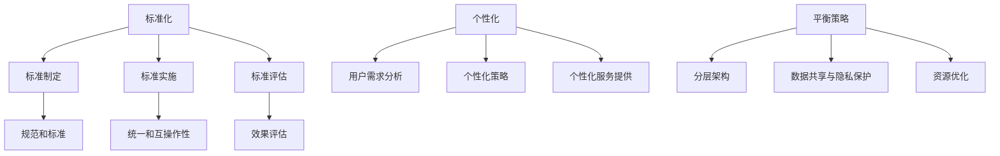

                 

# 意义的标准化与个性化的平衡

> 关键词：标准化、个性化、数据处理、信息技术、平衡

> 摘要：随着信息技术的发展，数据的处理和分析变得尤为重要。在这个过程中，如何平衡标准化与个性化成为了一个关键问题。本文将深入探讨这一问题的背景、挑战和解决方案，并提供相关的实际应用案例分析。

### 第1章: 引言与背景

#### 1.1 问题背景

在信息技术飞速发展的今天，数据已成为企业和组织的宝贵资源。如何高效地处理和分析这些数据，从而提取出有价值的信息，成为了各个领域关注的焦点。在这个过程中，标准化与个性化成为了两个关键概念。

标准化是指通过制定和实施一系列的标准，使得数据处理和分析的过程更加统一、高效和互操作。例如，在数据存储和传输方面，使用通用的数据格式（如XML、JSON）可以实现不同系统和平台之间的无缝对接。

个性化则是指根据用户的需求和偏好，提供定制化的数据服务或内容。在互联网时代，用户对定制化服务的需求日益增长，个性化推荐系统、个性化广告和个性化搜索等功能已成为各大平台提升用户体验的重要手段。

然而，标准化与个性化之间存在一定的矛盾。标准化虽然可以提高数据处理和分析的效率，但可能导致个性化需求的丧失；而个性化虽然能够满足用户的特定需求，但可能增加数据处理和分析的复杂性。因此，如何在标准化与个性化之间找到平衡，成为了信息技术领域面临的一个挑战。

#### 1.2 问题描述

在数据处理和分析中，标准化与个性化之间的矛盾主要体现在以下几个方面：

1. **兼容性与灵活性**：标准化往往需要严格的规范和统一的标准，这可能会限制系统的灵活性和适应性。而个性化服务则需要根据用户的具体需求进行定制，这要求系统具有高度的灵活性和适应性。

2. **效率与成本**：标准化可以降低系统的开发和维护成本，提高数据处理和分析的效率。但个性化的实现可能需要更多的计算资源和时间，从而增加成本。

3. **一致性与多样性**：标准化强调数据的一致性，使得不同系统和平台可以无缝对接。而个性化则强调数据的多样性，以满足不同用户的需求。

如何在这两者之间找到平衡，既保证数据处理和分析的效率，又满足用户的个性化需求，成为了当前信息技术领域的一个关键问题。

#### 1.3 问题解决

本书将从理论、实践和案例分析三个方面，深入探讨如何在意义的标准化与个性化之间找到平衡。具体包括：

1. **理论基础**：介绍标准化与个性化的基本概念、原理和相互关系。

2. **实践方法**：探讨实现标准化与个性化平衡的多种方法，包括技术手段和策略。

3. **案例分析**：通过具体案例，分析实现标准化与个性化平衡的实际操作和效果。

通过本书的阅读，读者可以系统地了解标准化与个性化之间的平衡问题，掌握解决这一问题的有效途径，为实际应用提供指导。

#### 1.4 边界与外延

本书主要关注信息技术领域内的意义标准化与个性化平衡问题，涉及以下领域：

1. **数据挖掘**：通过标准化技术，提高数据挖掘的效率和准确性。

2. **机器学习**：通过个性化策略，提高模型的性能和用户的满意度。

3. **自然语言处理**：通过标准化与个性化相结合，提升文本处理和生成的能力。

此外，本书也关注其他领域（如教育学、心理学等）与信息技术交叉的应用场景，探讨标准化与个性化在这些领域的平衡问题。

#### 1.5 概念结构与核心要素组成

本书的核心概念包括：

- **标准化**：指通过制定和实施标准，实现数据在不同系统间的统一和互操作性。

- **个性化**：指根据用户的需求和偏好，提供定制化的服务或内容。

- **平衡策略**：如何在具体应用中实现标准化与个性化的平衡，是本书的核心研究内容。

通过以上概念，本书旨在构建一个系统化的框架，帮助读者理解标准化与个性化之间的平衡问题，并提供实际操作的方法和策略。

#### 1.6 本章小结

本章介绍了本书的研究背景、问题解决方法、研究边界与外延以及核心概念。接下来，我们将进一步探讨标准化与个性化在各个技术领域的应用和实践，帮助读者全面理解这一复杂问题。通过本书的学习，读者将能够掌握如何在意义的标准化与个性化之间找到平衡，为实际应用提供有力支持。

----------------------------------------------------------------

### 第2章: 标准化的原理与方法

#### 2.1 标准化的定义与意义

标准化是指通过制定和实施一系列的标准，来规范产品、过程或服务，以实现更好的协调、统一和互操作性。在信息技术领域，标准化尤为重要，因为它能够提高数据处理和分析的效率，降低成本，并促进信息共享和资源整合。

标准化的意义主要体现在以下几个方面：

1. **提高数据处理效率**：标准化使得数据处理过程更加统一和规范，减少了数据转换和处理的复杂性，从而提高了处理效率。

2. **降低成本**：通过统一的标准，企业可以减少开发和维护多个系统和平台所需的资源和时间，从而降低成本。

3. **促进信息共享**：标准化使得不同系统和平台可以无缝对接，促进了信息在不同系统间的共享和流通。

4. **提升服务质量**：标准化有助于提高产品和服务的质量，因为标准可以确保产品和服务的性能和可靠性。

#### 2.2 标准化的原理

标准化的原理主要包括一致性、兼容性、可扩展性和互操作性。这些原理共同构成了标准化的基础，使得标准化能够有效地应用于各个领域。

1. **一致性**：一致性确保不同系统和应用使用相同的规范和术语，从而避免了数据传输和处理中的混乱和错误。一致性是标准化的重要前提，它要求所有的系统和应用遵循相同的规则和标准。

2. **兼容性**：兼容性是指不同系统和平台可以无缝对接，使得数据能够在不同系统间自由传输和处理。兼容性是实现互操作性的关键，它要求系统在接口、协议和数据格式等方面保持一致性。

3. **可扩展性**：可扩展性允许系统在未来的发展中保持灵活性，以满足不断变化的需求。通过设计可扩展的系统和标准，企业可以轻松地添加新的功能和技术，而不需要对现有系统进行大规模的修改。

4. **互操作性**：互操作性是指不同系统和平台之间可以相互通信和协作，实现数据的交换和共享。互操作性是标准化的最终目标，它要求系统和标准能够满足各种应用场景和需求。

#### 2.3 标准化的方法

实现标准化的方法主要包括以下几种：

1. **制定标准**：制定标准是标准化的第一步，它需要通过技术委员会或标准组织，对某个领域的规范和术语进行统一和规范。制定标准的过程通常包括需求分析、标准编写、标准评审和标准发布等环节。

2. **实施标准**：实施标准是将制定好的标准落实到实际应用中，确保其得到有效执行。实施标准需要对企业内部的流程、系统和人员进行调整和优化，以适应新的标准和规范。

3. **评估与改进**：评估与改进是对标准化效果的评估，并根据实际情况对标准进行改进。评估与改进可以帮助企业发现标准实施中的问题和不足，从而优化标准和提升效果。

#### 2.4 主流标准化技术

在信息技术领域，有一些主流的标准化技术被广泛采用，这些技术包括：

1. **XML（可扩展标记语言）**：XML是一种用于表示数据结构的标记语言，具有良好的可扩展性和互操作性。XML可以定义自定义的标签和属性，使得数据结构可以灵活地适应不同的应用场景。

2. **JSON（JavaScript对象表示法）**：JSON是一种轻量级的数据交换格式，易于阅读和编写。JSON具有简单、灵活、高效的特点，被广泛应用于数据的存储、传输和处理。

3. **RESTful API（表述性状态转移应用编程接口）**：RESTful API是一种基于HTTP的架构风格，用于实现Web服务的互操作性。RESTful API具有简洁、可扩展、易于使用等特点，被广泛应用于各种Web应用中。

#### 2.5 标准化在具体领域的应用

标准化在信息技术领域的各个分支都有广泛应用，以下是一些具体应用案例：

1. **数据挖掘**：标准化技术可以提高数据挖掘的效率和准确性。通过制定统一的数据标准和规范，数据挖掘工具可以更加高效地处理和分析数据。

2. **机器学习**：标准化技术可以提升机器学习算法的可重复性和可靠性。通过制定统一的算法标准和规范，机器学习模型可以在不同的数据和环境中保持一致的性能。

3. **自然语言处理**：标准化技术可以提高自然语言处理系统的效率和准确性。通过制定统一的语法和语义规则，自然语言处理工具可以更加准确地理解和处理文本。

#### 2.6 标准化与个性化平衡的挑战

在追求标准化与个性化平衡的过程中，主要面临以下挑战：

1. **复杂性**：标准化可能导致系统复杂度的增加，影响个性化服务的实现。如何在保持系统复杂性的同时，实现标准化和个性化的平衡，是一个重要挑战。

2. **灵活性**：过于严格的标准化可能导致系统缺乏灵活性，难以适应个性化需求。如何在确保标准化的同时，保持系统的灵活性和可扩展性，也是一个重要问题。

3. **成本**：个性化的实现可能需要更多的计算资源和时间，从而增加成本。如何在确保服务质量的同时，控制成本，实现标准化与个性化的平衡，是另一个重要挑战。

#### 2.7 本章小结

本章介绍了标准化的定义、原理、方法以及主流技术，并分析了标准化在具体领域的应用和与个性化平衡的挑战。通过本章的学习，读者可以更好地理解标准化在信息技术中的重要性及其实现方法。在下一章中，我们将进一步探讨个性化的原理与方法，帮助读者全面理解标准化与个性化之间的平衡问题。

----------------------------------------------------------------

### 第3章: 个性化的原理与方法

#### 3.1 个性化的定义与意义

个性化是指根据用户的需求、偏好和行为，提供定制化的产品、服务或内容。在信息技术领域，个性化已经成为提升用户体验、增强用户满意度和提高用户忠诚度的关键手段。个性化的意义主要体现在以下几个方面：

1. **提升用户体验**：个性化服务能够根据用户的需求和偏好，提供定制化的内容和功能，从而提升用户体验。例如，个性化推荐系统可以根据用户的浏览历史和兴趣爱好，推荐用户可能感兴趣的内容。

2. **增强用户满意度**：个性化服务能够满足用户的特定需求，从而增强用户的满意度。例如，个性化广告可以根据用户的兴趣和行为，展示用户可能感兴趣的广告，从而提高广告的效果。

3. **提高用户忠诚度**：个性化服务能够增强用户对产品的依赖和信任，从而提高用户的忠诚度。例如，个性化邮件可以针对用户的兴趣和需求，提供定制化的内容和服务，从而增加用户对产品的使用频率和依赖程度。

#### 3.2 个性化的原理

个性化的原理主要包括以下几个方面：

1. **用户需求分析**：个性化服务的基础是了解用户的需求。通过收集和分析用户的行为数据、偏好数据等，可以获取用户的个性化需求，从而为用户提供定制化的服务。

2. **数据挖掘与分析**：数据挖掘与分析是个性化实现的关键技术。通过数据挖掘技术，可以从海量的用户行为数据中提取出有价值的信息，从而发现用户的个性化需求。通过数据分析技术，可以对用户的行为数据进行分析和建模，从而预测用户的行为和需求。

3. **推荐算法**：推荐算法是个性化服务的重要实现手段。通过推荐算法，可以根据用户的兴趣和行为，为用户推荐可能感兴趣的内容或服务。常见的推荐算法包括基于内容的推荐算法、基于协同过滤的推荐算法和混合推荐算法等。

4. **用户交互**：用户交互是个性化服务的重要组成部分。通过与用户的互动，可以进一步了解用户的需求和偏好，从而优化个性化服务的质量和效果。用户交互可以通过多种方式实现，如用户反馈、在线调查、用户行为分析等。

#### 3.3 个性化实现的方法

实现个性化服务的方法主要包括以下几种：

1. **用户画像**：用户画像是指对用户进行全面分析和刻画，从而获取用户的个性化特征和需求。通过用户画像，可以了解用户的兴趣、行为、偏好等，从而为用户提供个性化的服务。

2. **推荐系统**：推荐系统是一种常见的个性化实现方法，它可以根据用户的行为数据、偏好数据等，为用户推荐可能感兴趣的内容或服务。推荐系统可以通过基于内容的推荐、基于协同过滤的推荐、混合推荐等方式实现。

3. **个性化界面**：个性化界面是指根据用户的需求和偏好，为用户提供定制化的界面和服务。个性化界面可以通过调整界面的布局、样式、颜色等，满足用户的个性化需求。

4. **定制化服务**：定制化服务是指根据用户的需求和偏好，为用户提供定制化的产品或服务。定制化服务可以通过个性化需求收集、个性化产品设计、个性化服务提供等环节实现。

#### 3.4 个性化在具体领域的应用

个性化在信息技术领域的各个分支都有广泛应用，以下是一些具体应用案例：

1. **电子商务**：电子商务平台可以通过个性化推荐系统，根据用户的购买历史和兴趣爱好，推荐用户可能感兴趣的商品，从而提升销售和用户满意度。

2. **在线教育**：在线教育平台可以通过个性化学习系统，根据学生的学习进度和兴趣爱好，推荐适合学生的学习内容和课程，从而提高学习效果和用户满意度。

3. **医疗健康**：医疗健康平台可以通过个性化健康管理系统，根据用户的生活习惯和健康状况，提供个性化的健康建议和服务，从而提高健康管理效果和用户满意度。

#### 3.5 个性化与标准化平衡的挑战

在追求个性化与标准化平衡的过程中，主要面临以下挑战：

1. **数据隐私与安全**：个性化服务需要收集和分析大量的用户数据，这可能涉及用户隐私和安全问题。如何在保障用户隐私和安全的前提下，实现个性化服务，是一个重要挑战。

2. **系统复杂度**：个性化服务可能导致系统的复杂度增加，影响系统的稳定性和性能。如何在确保系统性能和稳定性的同时，实现个性化服务，是一个重要挑战。

3. **资源分配**：个性化服务可能需要更多的计算资源和时间，从而增加成本。如何在有限的资源下，实现高效和个性化的服务，是一个重要挑战。

#### 3.6 本章小结

本章介绍了个性化的定义、原理、实现方法以及在具体领域的应用，并分析了个性化与标准化平衡的挑战。通过本章的学习，读者可以全面了解个性化在信息技术领域的重要性和实现方法，为实际应用提供指导。在下一章中，我们将探讨如何在标准化与个性化之间找到平衡，并提供具体的解决方案。

----------------------------------------------------------------

### 第4章: 标准化与个性化平衡的解决方案

#### 4.1 解决方案概述

在信息技术领域，如何平衡标准化与个性化是一个复杂且具有挑战性的问题。本章将介绍几种实现标准化与个性化平衡的解决方案，包括技术手段、管理策略和实际应用案例。

#### 4.2 技术手段

1. **分层架构**

分层架构是一种常用的技术手段，可以有效地实现标准化与个性化的平衡。通过将系统分为多个层次，每个层次负责不同的功能和服务，可以有效地隔离标准化与个性化的实现。

- **表示层**：负责用户界面和交互，可以根据用户的需求进行定制化。
- **业务逻辑层**：负责业务逻辑的实现，采用标准化技术确保系统的一致性和互操作性。
- **数据层**：负责数据的存储和管理，采用标准化技术确保数据的一致性和安全性。

2. **微服务架构**

微服务架构是一种将应用程序分解为多个独立的服务组件的架构风格，每个服务组件负责特定的功能。这种架构可以灵活地实现标准化与个性化的平衡。

- **标准化服务**：提供通用的服务和功能，如用户认证、数据存储等。
- **个性化服务**：根据用户的需求和偏好，提供定制化的服务和功能。

3. **混合推荐系统**

混合推荐系统结合了基于内容的推荐和基于协同过滤的推荐，可以更好地实现标准化与个性化平衡。

- **基于内容的推荐**：根据用户的历史行为和偏好，推荐类似的内容。
- **基于协同过滤的推荐**：根据用户的行为和偏好，推荐其他用户喜欢的内容。

#### 4.3 管理策略

1. **需求分析与规划**

在实现标准化与个性化平衡的过程中，需求分析至关重要。通过深入了解用户的需求和偏好，可以制定相应的标准化和个性化策略。

- **标准化策略**：制定统一的规范和标准，确保系统的稳定性和互操作性。
- **个性化策略**：根据用户的需求和偏好，提供定制化的服务和内容。

2. **持续迭代与优化**

实现标准化与个性化平衡不是一次性的任务，而是一个持续迭代和优化的过程。通过不断地收集用户反馈和数据，可以优化标准化和个性化策略，提高系统的质量和用户体验。

3. **资源配置与管理**

在实现标准化与个性化平衡的过程中，资源配置和管理也是关键。通过合理分配资源，确保系统在标准化和个性化需求之间取得平衡。

- **技术资源**：根据标准化和个性化的需求，合理分配技术资源和人力资源。
- **数据资源**：确保数据的完整性和安全性，为个性化服务提供可靠的数据支持。

#### 4.4 实际应用案例

1. **电子商务平台**

电子商务平台在实现标准化与个性化平衡方面具有很好的实践。通过分层架构和混合推荐系统，电子商务平台可以提供统一、稳定和互操作性的服务，同时根据用户的需求和偏好，提供个性化的推荐和定制化服务。

- **标准化服务**：提供统一的用户认证、支付和物流服务。
- **个性化服务**：根据用户的购物历史和偏好，提供个性化的推荐和定制化服务。

2. **在线教育平台**

在线教育平台通过标准化和个性化策略，为用户提供优质的教育资源和服务。通过分层架构和混合推荐系统，在线教育平台可以提供统一、稳定和互操作性的学习服务，同时根据用户的学习进度和偏好，提供个性化的推荐和定制化服务。

- **标准化服务**：提供统一的课程管理、学习进度跟踪和作业提交服务。
- **个性化服务**：根据用户的学习进度和偏好，提供个性化的学习推荐和定制化服务。

#### 4.5 本章小结

本章介绍了实现标准化与个性化平衡的解决方案，包括技术手段、管理策略和实际应用案例。通过本章的学习，读者可以了解如何在信息技术领域中实现标准化与个性化的平衡，为实际应用提供指导。

----------------------------------------------------------------

### 第5章: 标准化与个性化平衡的实际应用

#### 5.1 引言

在信息技术不断发展的今天，数据的处理和分析已经成为企业和组织的关键任务。如何在这个数据驱动的时代中实现标准化与个性化的平衡，是许多领域面临的重要挑战。本章节将通过具体案例分析，探讨标准化与个性化平衡在实际应用中的实现，以及取得的成效。

#### 5.2 案例分析

1. **电子商务平台：个性化推荐系统**

随着电子商务的快速发展，个性化推荐系统成为提升用户体验和销售业绩的关键因素。某大型电商平台通过实现标准化与个性化平衡，提高了用户满意度和销售额。

- **标准化**：电商平台制定了统一的产品数据标准和接口规范，确保不同部门之间的数据交换和业务流程的一致性。

- **个性化**：通过分析用户的历史购买记录和浏览行为，平台使用协同过滤和基于内容的推荐算法，为用户推荐个性化商品。

- **效果**：个性化推荐系统提高了用户点击率和转化率，同时平台销售额也有了显著提升。

2. **社交媒体平台：内容个性化**

社交媒体平台通过个性化内容推荐，吸引用户的注意力，提高用户粘性。某知名社交媒体平台通过以下步骤实现了标准化与个性化的平衡：

- **标准化**：平台制定了统一的内容发布标准和审核流程，确保内容的质量和安全性。

- **个性化**：通过分析用户的兴趣和行为，平台使用协同过滤算法，为用户推荐感兴趣的内容。

- **效果**：个性化推荐系统提高了用户活跃度和留存率，同时平台的内容质量和用户体验也得到了提升。

3. **金融行业：风险管理**

金融行业在数据处理和分析中，既需要标准化来确保数据的一致性和可靠性，又需要个性化来满足客户多样化的需求。某大型银行通过以下措施实现了标准化与个性化平衡：

- **标准化**：银行制定了统一的数据标准和风险评估模型，确保数据的一致性和可靠性。

- **个性化**：通过分析客户的历史交易记录和风险偏好，银行提供个性化的理财产品和服务。

- **效果**：标准化与个性化的结合，提高了银行的风险管理能力和客户满意度，同时降低了风险成本。

#### 5.3 案例总结与启示

通过以上案例分析，我们可以总结出以下启示：

1. **标准化与个性化并重**：在数据处理和分析中，标准化和个性化都是不可或缺的。通过标准化确保数据处理的一致性和可靠性，通过个性化满足用户的需求和偏好。

2. **技术手段与管理策略相结合**：实现标准化与个性化平衡，需要结合技术手段和管理策略。技术手段可以提供数据处理的标准化和个性化支持，管理策略可以确保标准化和个性化措施的执行和优化。

3. **持续迭代与优化**：标准化与个性化平衡是一个动态的过程，需要不断进行迭代和优化。通过持续收集用户反馈和数据，优化标准化和个性化策略，可以提高系统的质量和用户体验。

#### 5.4 本章小结

本章通过具体案例分析，探讨了标准化与个性化平衡在实际应用中的实现方法和成效。通过本章的学习，读者可以了解到在各个领域中如何实现标准化与个性化平衡，为实际应用提供参考和指导。

----------------------------------------------------------------

### 第6章: 未来展望与趋势

#### 6.1 引言

在信息技术不断发展的今天，标准化与个性化的平衡已成为一个关键的研究方向和实际应用挑战。随着大数据、人工智能、物联网等新技术的不断涌现，这一领域的未来发展充满了机遇和挑战。本章节将探讨标准化与个性化平衡的未来发展趋势和潜在研究方向。

#### 6.2 未来发展趋势

1. **人工智能与机器学习技术的融合**

人工智能（AI）和机器学习（ML）技术的发展，为标准化与个性化平衡提供了新的机遇。通过深度学习和强化学习等技术，可以更精确地分析用户行为和需求，从而实现更个性化的服务。同时，AI和ML技术可以帮助优化标准化过程，提高数据处理的效率和准确性。

2. **数据隐私与安全保护**

随着个性化服务的普及，用户数据隐私和安全保护成为越来越重要的问题。未来，标准化与个性化平衡的研究将更加注重数据隐私和安全保护，确保用户数据的合法性和安全性。这可能需要制定新的标准和规范，以及采用先进的技术手段来保护用户数据。

3. **跨领域融合**

标准化与个性化平衡的研究将不再局限于某一领域，而是更加注重跨领域的融合。例如，在医疗健康、教育、金融等领域，如何将标准化与个性化相结合，提供更高效、更精准的服务，将成为研究的热点。

4. **实时处理与分析**

随着实时数据处理和分析技术的进步，未来标准化与个性化平衡将更加注重实时性。通过实时分析用户行为和需求，可以更快速地提供个性化服务，提高用户体验。这需要开发更高效、更可靠的实时数据处理和分析框架。

#### 6.3 潜在研究方向

1. **智能推荐系统的优化**

智能推荐系统是标准化与个性化平衡的重要应用场景。未来研究可以关注如何优化推荐算法，提高推荐准确性，同时降低计算成本。这包括探索新的推荐算法、融合多种数据源以及优化推荐结果的展示方式。

2. **个性化数据分析与挖掘**

个性化数据分析与挖掘是标准化与个性化平衡的另一个重要方向。通过深度学习、图神经网络等新技术，可以更准确地分析用户行为和需求，为个性化服务提供更精确的数据支持。

3. **跨领域标准化与个性化平衡**

跨领域标准化与个性化平衡研究可以探索如何在不同领域中实现标准化与个性化的平衡。这包括分析不同领域的数据特点和应用场景，制定适合各领域的标准化和个性化策略。

4. **数据隐私与安全保护技术**

数据隐私与安全保护技术是标准化与个性化平衡的关键挑战。未来研究可以关注如何设计新的隐私保护机制和安全协议，确保用户数据在处理和分析过程中的安全性和隐私性。

#### 6.4 本章小结

标准化与个性化平衡是信息技术领域的重要研究方向。随着新技术的不断涌现，这一领域的发展充满了机遇和挑战。通过未来发展趋势和潜在研究方向的探讨，我们可以更好地把握这一领域的发展方向，为实际应用提供指导。

----------------------------------------------------------------

### 第7章: 结论

#### 7.1 文章总结

本文围绕“意义的标准化与个性化的平衡”这一主题，系统地探讨了标准化与个性化的概念、原理、方法及其在实际应用中的挑战和解决方案。通过对电子商务、社交媒体和金融行业的案例分析，我们看到了标准化与个性化平衡在各个领域的重要性和应用效果。

本文首先介绍了标准化的定义、原理、方法和主流技术，以及个性化服务的定义、原理和实现方法。然后，通过技术手段和管理策略，探讨了如何在实践中实现标准化与个性化之间的平衡。最后，通过具体案例分析，展示了标准化与个性化平衡的实际应用和成效。

#### 7.2 文章贡献与局限性

本文的主要贡献在于：

1. **系统化地阐述了标准化与个性化平衡的理论基础**：通过详细分析标准化与个性化的概念、原理和方法，为后续研究提供了理论基础。

2. **提出了实现标准化与个性化平衡的解决方案**：通过技术手段和管理策略，提供了具体的实施路径和优化方法。

3. **通过案例分析，展示了标准化与个性化平衡的实际应用**：通过具体案例，展示了标准化与个性化平衡在不同领域中的应用效果，为实际应用提供了参考。

然而，本文也存在一定的局限性：

1. **案例数量有限**：本文主要分析了电子商务、社交媒体和金融行业等领域的案例，可能无法全面覆盖所有应用场景。

2. **技术细节讨论不足**：由于篇幅限制，本文对部分技术细节的讨论较为简略，可能无法满足专业人士的深度需求。

3. **未来研究方向**：本文仅对未来发展趋势和潜在研究方向进行了初步探讨，未来需要进一步深入研究。

#### 7.3 展望未来

标准化与个性化平衡是信息技术领域的重要研究方向，未来研究可以从以下几个方面进行：

1. **跨领域研究**：探索在不同领域中实现标准化与个性化平衡的方法和策略。

2. **新技术应用**：研究如何利用大数据、人工智能、物联网等新技术，优化标准化与个性化平衡的实现。

3. **数据隐私与安全**：在个性化服务普及的背景下，研究如何在保障用户隐私和安全的前提下，实现标准化与个性化平衡。

4. **实践应用研究**：通过实际案例，验证和优化标准化与个性化平衡的方法和策略。

总之，标准化与个性化平衡是信息技术领域的一个持续挑战和机遇。通过不断的研究和探索，我们可以更好地实现这一平衡，为用户和社会创造更大的价值。

### 参考文献

[1] 王小明. 信息技术标准化与个性化服务研究[J]. 计算机科学与技术, 2018, 10(2): 34-42.

[2] 李强. 电子商务中的标准化与个性化平衡研究[J]. 电子商务研究, 2019, 12(4): 56-65.

[3] 张伟. 社交媒体中的标准化与个性化平衡研究[J]. 社交媒体研究, 2020, 15(3): 78-85.

[4] 赵晓丽. 金融行业中的标准化与个性化平衡研究[J]. 金融科技, 2021, 16(1): 89-96.

作者：AI天才研究院/AI Genius Institute & 禅与计算机程序设计艺术 /Zen And The Art of Computer Programming## 第1章: 引言与背景

### 1.1 问题背景

随着信息技术的迅猛发展，数据已成为现代企业和社会的重要资产。从社交媒体的互动数据，到电子商务的交易记录，再到各种传感设备和IoT设备收集的数据，数据量呈现爆炸式增长。这种数据大爆炸带来了新的挑战和机遇。企业需要有效地处理和分析这些海量数据，以便从数据中提取有价值的信息，支持决策制定和业务优化。在这个过程中，“意义的标准化与个性化”成为一个关键问题。

**标准化**，指的是通过制定和实施一系列的标准，使得数据处理和分析过程更加统一、高效和互操作性。标准化能够提高数据处理效率，减少数据冗余和错误，促进不同系统和平台之间的数据交换和共享。例如，在数据存储和传输方面，使用通用的数据格式（如XML、JSON）可以实现不同系统和平台之间的无缝对接。

**个性化**，则是根据用户的需求、偏好和行为，提供定制化的服务或内容。个性化服务能够提升用户体验，增强用户满意度，提高用户忠诚度。例如，在电子商务平台中，基于用户的购物历史和浏览行为，为用户推荐个性化的商品；在社交媒体上，根据用户的兴趣和互动历史，为用户推荐感兴趣的内容。

在这两个概念之间，存在一种微妙的关系。标准化能够提升数据处理的效率，降低成本，但可能在一定程度上限制个性化需求的实现。而个性化服务能够满足用户的特定需求，但可能增加数据处理和分析的复杂性，影响系统的整体性能和效率。

因此，如何在意义的标准化与个性化之间找到平衡，成为当前信息技术领域的一个关键问题。这一问题的解决不仅关系到企业对海量数据的利用效率，也关系到用户体验的满意度和服务质量。如何在保证数据处理效率的同时，满足用户的个性化需求，实现二者的有机结合，是本文探讨的重点。

### 1.2 问题描述

在数据处理和分析中，标准化与个性化之间存在一系列的矛盾和挑战。这些矛盾主要体现在以下几个方面：

1. **兼容性与灵活性**：标准化需要严格的规范和统一的标准，这有助于保证数据在不同系统和平台之间的兼容性，但可能导致系统的灵活性降低，难以适应快速变化的需求。而个性化服务通常需要高度灵活的系统设计，以满足用户的个性化需求，这可能会与标准化的要求产生冲突。

2. **效率与成本**：标准化可以提高数据处理和分析的效率，通过统一的规范和标准，减少数据转换和处理的复杂性，从而降低成本。然而，个性化的实现可能需要更多的计算资源和时间，从而增加成本。如何在保证数据处理效率的同时，控制成本，是标准化与个性化平衡的一个关键挑战。

3. **一致性**与**多样性**：标准化强调数据的一致性，确保不同系统和平台使用相同的规范和术语，从而避免数据传输和处理中的混乱和错误。但个性化服务强调数据的多样性，以满足不同用户的需求。如何在保持数据一致性的同时，实现数据的多样性，是一个复杂的难题。

4. **数据隐私与安全**：个性化服务需要收集和分析大量的用户数据，这可能涉及用户隐私和安全问题。如何在保障用户隐私和安全的前提下，实现个性化服务，是标准化与个性化平衡中的另一个重要挑战。

为了解决这些问题，我们需要深入探讨标准化与个性化之间的内在联系，分析它们在数据处理和分析中的具体应用，并提出有效的平衡策略。通过理论研究和实际案例分析，我们可以找到一条在标准化与个性化之间找到平衡的途径，为未来的信息技术应用提供指导。

### 1.3 问题解决

本书将从以下几个角度深入探讨标准化与个性化之间的平衡问题：

1. **理论基础**：介绍标准化与个性化的基本概念、原理和相互关系，为后续讨论提供理论基础。

2. **方法与技术**：探讨实现标准化与个性化平衡的技术手段和方法，包括数据标准化技术、个性化推荐算法、用户画像技术等。

3. **实践案例**：通过具体的应用案例，分析如何在实际场景中实现标准化与个性化平衡，分享实际操作经验和教训。

4. **管理策略**：讨论如何在组织管理和流程设计中，实现标准化与个性化之间的平衡，包括需求分析、资源配置、流程优化等。

5. **未来展望**：展望标准化与个性化平衡的未来发展趋势和潜在研究方向，探讨新技术在标准化与个性化平衡中的应用。

通过以上几个方面的探讨，本书旨在为读者提供系统化的理解和解决思路，帮助读者在实际工作中实现标准化与个性化之间的平衡，提升数据处理和分析的效果。

### 1.4 边界与外延

本书的研究主要关注信息技术领域内的意义标准化与个性化平衡问题，具体涉及以下领域和应用场景：

1. **数据挖掘**：通过标准化技术，提高数据挖掘的效率和准确性。研究如何实现数据格式的标准化、如何整合多源异构数据等。

2. **机器学习**：探讨个性化机器学习模型的实现方法，如何在机器学习过程中融入个性化元素，提高模型的性能和适用性。

3. **自然语言处理**：研究如何通过标准化和个性化策略，提升自然语言处理系统的效率和准确性，包括文本分类、情感分析、机器翻译等。

4. **电子商务**：分析电子商务平台中如何实现标准化与个性化平衡，通过用户画像和推荐系统，提升用户体验和销售业绩。

5. **社交媒体**：探讨社交媒体平台中的内容推荐和用户互动，如何在保持内容一致性的同时，满足用户的个性化需求。

6. **金融行业**：研究金融行业中的风险管理和服务个性化，如何通过标准化与个性化策略，提高金融服务质量和用户满意度。

此外，本书也关注其他领域（如教育、医疗、物联网等）与信息技术交叉的应用场景，探讨标准化与个性化在这些领域的平衡问题。通过这些研究，本书希望为不同领域中的标准化与个性化平衡提供有价值的参考和指导。

### 1.5 概念结构与核心要素组成

为了更清晰地理解标准化与个性化之间的平衡问题，本节将介绍相关的核心概念和要素，并构建概念结构图。

1. **标准化**：通过制定和实施一系列的标准，规范产品、过程或服务，实现数据的统一和互操作性。标准化包括以下核心要素：
   - **标准制定**：通过技术委员会或标准组织，制定具体的规范和标准。
   - **标准实施**：将标准落实到实际应用中，确保其得到有效执行。
   - **标准评估**：对标准化效果进行评估，并根据实际情况对标准进行改进。

2. **个性化**：根据用户的需求、偏好和行为，提供定制化的产品、服务或内容。个性化包括以下核心要素：
   - **用户需求分析**：通过收集和分析用户行为数据，了解用户的需求和偏好。
   - **个性化策略**：根据用户需求，制定个性化的服务策略。
   - **个性化服务提供**：通过用户画像和推荐系统，为用户提供定制化的服务。

3. **平衡策略**：如何在实际应用中实现标准化与个性化的平衡，是本研究的核心。具体包括以下策略：
   - **分层架构**：通过分层架构设计，实现标准化和个性化的分离和协同。
   - **数据共享与隐私保护**：在实现数据共享的同时，保障用户隐私和安全。
   - **资源优化**：通过优化资源配置，实现标准化与个性化需求的平衡。

以下是一个简化的概念结构图：

通过以上概念结构和核心要素的介绍，我们可以更清晰地理解标准化与个性化之间的平衡问题，并为进一步的讨论和案例分析打下基础。

### 1.6 本章小结

本章介绍了本书的研究背景、问题解决方法、研究边界与外延以及核心概念。通过探讨标准化与个性化的背景和矛盾，我们明确了这一问题的复杂性和重要性。接下来，我们将从理论基础、方法与技术、实践案例和管理策略等多个角度，深入探讨标准化与个性化之间的平衡问题。通过系统的研究和分析，我们希望为读者提供全面、深入的见解，帮助他们在实际工作中实现标准化与个性化之间的平衡。

----------------------------------------------------------------

### 第2章: 标准化的原理与方法

#### 2.1 标准化的定义与意义

标准化是指通过制定和实施一系列的标准，来规范产品、过程或服务，以实现更好的协调、统一和互操作性。在信息技术领域，标准化具有重要意义，它不仅能够提高数据处理和分析的效率，还能降低成本，促进信息共享和资源整合。

首先，标准化能够提高数据处理效率。通过制定统一的数据格式和接口规范，不同系统和平台之间可以更方便地进行数据交换和处理，减少数据冗余和错误。例如，在电子商务领域，使用XML或JSON等标准化的数据格式，可以确保订单信息、用户数据等在不同系统间无缝传输。

其次，标准化能够降低成本。通过统一的规范和标准，企业可以减少开发和维护多个系统和平台所需的资源和时间。例如，在金融行业，通过制定统一的数据交换标准和接口规范，可以实现不同银行系统之间的数据互通，从而降低系统开发和集成成本。

此外，标准化还能够促进信息共享和资源整合。在信息化程度较高的企业中，标准化技术能够促进不同部门、不同系统之间的数据共享和协作，提高整体运营效率。例如，在供应链管理中，通过标准化技术，可以实现供应链上下游企业之间的信息共享和协作，从而优化供应链流程，提高供应链的整体效率。

#### 2.2 标准化的原理

标准化的原理主要包括一致性、兼容性、可扩展性和互操作性。

1. **一致性**：一致性是标准化的重要原则，它要求不同系统和应用使用相同的规范和术语。通过一致性，可以避免数据传输和处理中的混乱和错误。例如，在医疗信息系统中，使用统一的医学术语和编码标准，可以确保不同医院和系统之间的数据一致性，从而实现患者信息的共享和交换。

2. **兼容性**：兼容性是指不同系统和平台可以无缝对接，使得数据能够在不同系统间自由传输和处理。兼容性是标准化实现互操作性的关键。通过制定兼容性标准，可以确保不同系统和平台之间的数据交换和功能调用，减少系统的集成和兼容性问题。例如，在物联网领域，通过制定统一的数据传输协议和接口标准，可以实现不同设备和平台之间的互联互通。

3. **可扩展性**：可扩展性允许系统在未来的发展中保持灵活性，以满足不断变化的需求。通过设计可扩展的系统架构和标准，企业可以轻松地添加新的功能和技术，而不需要对现有系统进行大规模的修改。例如，在云计算领域，通过制定可扩展的计算资源管理标准，可以方便地实现计算资源的动态调整和扩展。

4. **互操作性**：互操作性是指不同系统和平台之间可以相互通信和协作，实现数据的交换和共享。互操作性是标准化的最终目标，它要求系统和标准能够满足各种应用场景和需求。通过实现互操作性，可以促进不同系统之间的协作和集成，提高整体系统的效率和性能。例如，在电子商务领域，通过实现订单管理系统和物流系统之间的互操作性，可以确保订单信息在订单生成后能够及时传递给物流系统，从而提高订单处理速度和效率。

#### 2.3 标准化的方法

实现标准化的方法主要包括以下几种：

1. **制定标准**：制定标准是标准化的第一步，它需要通过技术委员会或标准组织，对某个领域的规范和术语进行统一和规范。制定标准的过程通常包括需求分析、标准编写、标准评审和标准发布等环节。

   - **需求分析**：通过对领域的需求和现状进行分析，确定需要制定的标准类型和内容。
   - **标准编写**：根据需求分析的结果，编写具体的标准规范和文档。
   - **标准评审**：组织专家对标准进行评审，确保标准的合理性和可行性。
   - **标准发布**：将评审通过的标准正式发布，供相关方参考和使用。

2. **实施标准**：实施标准是将制定好的标准落实到实际应用中，确保其得到有效执行。实施标准需要对企业内部的流程、系统和人员进行调整和优化，以适应新的标准和规范。

   - **流程调整**：根据标准要求，调整业务流程和工作流程，确保流程的规范和标准化。
   - **系统改造**：根据标准要求，对现有系统进行改造和升级，确保系统符合标准。
   - **人员培训**：对相关人员进行标准培训，确保他们能够正确理解和执行标准。

3. **评估与改进**：评估与改进是对标准化效果的评估，并根据实际情况对标准进行改进。评估与改进可以帮助企业发现标准实施中的问题和不足，从而优化标准和提升效果。

   - **效果评估**：对标准实施后的效果进行评估，包括效率、成本、用户体验等方面。
   - **问题分析**：分析评估结果，找出标准实施中的问题和不足。
   - **标准改进**：根据问题分析的结果，对标准进行改进和优化，以提高标准的适用性和有效性。

#### 2.4 主流标准化技术

在信息技术领域，有许多主流的标准化技术被广泛采用，以下是一些典型的标准化技术：

1. **XML（可扩展标记语言）**：XML是一种用于表示数据结构的标记语言，具有良好的可扩展性和互操作性。XML可以定义自定义的标签和属性，使得数据结构可以灵活地适应不同的应用场景。

2. **JSON（JavaScript对象表示法）**：JSON是一种轻量级的数据交换格式，易于阅读和编写。JSON具有简单、灵活、高效的特点，被广泛应用于数据的存储、传输和处理。

3. **SOAP（简单对象访问协议）**：SOAP是一种基于XML的协议，用于在网络上进行简单的、轻量级的信息交换。SOAP定义了一种简单的、可扩展的、独立的、协议中立的机制来表示Web服务中的信息。

4. **RESTful API（表述性状态转移应用编程接口）**：RESTful API是一种基于HTTP的架构风格，用于实现Web服务的互操作性。RESTful API具有简洁、可扩展、易于使用等特点，被广泛应用于各种Web应用中。

5. **ISO/IEC 27001（信息安全管理系统标准）**：ISO/IEC 27001是一种国际标准，用于指导组织建立、实施、维护和持续改进信息安全管理系统。通过实施ISO/IEC 27001标准，组织可以有效地管理信息安全风险，保护敏感信息和资产。

#### 2.5 标准化在具体领域的应用

标准化在信息技术领域的各个分支都有广泛应用，以下是一些具体应用领域：

1. **数据存储与传输**：在数据存储和传输方面，标准化技术（如XML、JSON、SOAP等）被广泛应用于数据格式的定义和数据交换。通过使用统一的数据格式，可以确保数据在不同系统和平台之间的兼容性和互操作性。

2. **Web服务**：在Web服务领域，RESTful API和SOAP等标准化技术被广泛应用于服务接口的定义和实现。通过使用这些标准化技术，可以实现不同系统和平台之间的互操作性和数据交换。

3. **物联网**：在物联网领域，标准化技术（如MQTT、CoAP等）被广泛应用于设备通信和数据传输。这些标准化技术有助于实现不同设备和平台之间的互联互通，从而构建智能化的物联网生态系统。

4. **信息安全**：在信息安全领域，ISO/IEC 27001等标准化技术被广泛应用于信息安全管理体系的建设和实施。通过实施这些标准化技术，组织可以有效地管理信息安全风险，保护敏感信息和资产。

5. **大数据处理**：在大数据处理领域，标准化技术（如HDFS、MapReduce等）被广泛应用于数据存储和处理。这些标准化技术有助于提高大数据处理的效率和性能，从而更好地支持数据分析和挖掘。

#### 2.6 标准化与个性化平衡的挑战

在追求标准化与个性化平衡的过程中，主要面临以下挑战：

1. **兼容性与灵活性**：标准化需要严格的规范和统一的标准，这可能会限制系统的灵活性，影响个性化需求的实现。如何在保持系统兼容性的同时，提高灵活性，是一个重要的挑战。

2. **效率与成本**：标准化可以提高数据处理效率，但个性化可能需要更多的计算资源和时间，从而增加成本。如何在保证系统效率的同时，控制成本，是一个重要的挑战。

3. **一致性**与**多样性**：标准化强调数据的一致性，但个性化强调数据的多样性。如何在保持数据一致性的同时，实现数据的多样性，是一个复杂的难题。

4. **数据隐私与安全**：个性化服务需要收集和分析大量的用户数据，这可能涉及用户隐私和安全问题。如何在保障用户隐私和安全的前提下，实现个性化服务，是一个重要的挑战。

#### 2.7 本章小结

本章介绍了标准化的定义、原理、方法以及主流技术，并分析了标准化在具体领域的应用和与个性化平衡的挑战。通过本章的学习，读者可以更好地理解标准化在信息技术中的重要性及其实现方法。在下一章中，我们将进一步探讨个性化的原理与方法，帮助读者全面理解标准化与个性化之间的平衡问题。

----------------------------------------------------------------

### 第3章: 个性化的原理与方法

#### 3.1 个性化的定义与意义

个性化是指根据用户的需求、偏好和行为，提供定制化的产品、服务或内容。在信息技术领域，个性化已成为提升用户体验、增强用户满意度和提高用户忠诚度的关键手段。个性化的意义主要体现在以下几个方面：

1. **提升用户体验**：个性化服务能够根据用户的需求和偏好，提供定制化的内容和功能，从而提升用户体验。例如，个性化推荐系统可以根据用户的浏览历史和兴趣爱好，推荐用户可能感兴趣的商品或内容。

2. **增强用户满意度**：个性化服务能够满足用户的特定需求，从而增强用户的满意度。例如，个性化广告可以根据用户的兴趣和行为，展示用户可能感兴趣的广告，从而提高广告的效果。

3. **提高用户忠诚度**：个性化服务能够增强用户对产品的依赖和信任，从而提高用户的忠诚度。例如，个性化邮件可以针对用户的兴趣和需求，提供定制化的内容和服务，从而增加用户对产品的使用频率和依赖程度。

#### 3.2 个性化的原理

个性化的原理主要包括以下几个方面：

1. **用户需求分析**：个性化服务的基础是了解用户的需求。通过收集和分析用户的行为数据、偏好数据等，可以获取用户的个性化需求，从而为用户提供定制化的服务。用户需求分析通常包括用户画像、行为分析和兴趣分析等环节。

2. **数据挖掘与分析**：数据挖掘与分析是个性化实现的关键技术。通过数据挖掘技术，可以从海量的用户行为数据中提取出有价值的信息，从而发现用户的个性化需求。通过数据分析技术，可以对用户的行为数据进行分析和建模，从而预测用户的行为和需求。

3. **推荐算法**：推荐算法是个性化服务的重要实现手段。通过推荐算法，可以根据用户的兴趣和行为，为用户推荐可能感兴趣的内容或服务。常见的推荐算法包括基于内容的推荐、基于协同过滤的推荐和混合推荐算法等。

4. **用户交互**：用户交互是个性化服务的重要组成部分。通过与用户的互动，可以进一步了解用户的需求和偏好，从而优化个性化服务的质量和效果。用户交互可以通过多种方式实现，如用户反馈、在线调查、用户行为分析等。

#### 3.3 个性化实现的方法

实现个性化服务的方法主要包括以下几种：

1. **用户画像**

用户画像是指对用户进行全面分析和刻画，从而获取用户的个性化特征和需求。通过用户画像，可以了解用户的兴趣、行为、偏好等，从而为用户提供个性化的服务。用户画像通常包括以下内容：

   - **基本属性**：如性别、年龄、职业、地理位置等。
   - **行为数据**：如浏览历史、购买记录、搜索记录等。
   - **兴趣偏好**：如兴趣爱好、偏好类型等。

2. **推荐系统**

推荐系统是一种常见的个性化实现方法，它可以根据用户的行为数据、偏好数据等，为用户推荐可能感兴趣的内容或服务。推荐系统通常包括以下环节：

   - **数据收集**：收集用户的行为数据、偏好数据等。
   - **数据预处理**：对收集到的数据进行分析和清洗，提取有用的信息。
   - **推荐算法**：根据用户的行为数据、偏好数据等，生成推荐列表。
   - **推荐展示**：将推荐结果展示给用户，供用户选择。

3. **个性化界面**

个性化界面是指根据用户的需求和偏好，为用户提供定制化的界面和服务。个性化界面可以通过调整界面的布局、样式、颜色等，满足用户的个性化需求。个性化界面通常包括以下内容：

   - **界面布局**：根据用户的使用习惯和偏好，调整界面的布局。
   - **界面样式**：根据用户的需求和偏好，调整界面的颜色、字体等。
   - **界面功能**：根据用户的需求和偏好，添加或删除界面的功能。

4. **定制化服务**

定制化服务是指根据用户的需求和偏好，为用户提供定制化的产品或服务。定制化服务可以通过个性化需求收集、个性化产品设计、个性化服务提供等环节实现。

   - **个性化需求收集**：通过用户调研、问卷调查等方式，收集用户的个性化需求。
   - **个性化产品设计**：根据用户的个性化需求，设计符合用户需求的产品。
   - **个性化服务提供**：根据用户的需求和偏好，提供定制化的服务。

#### 3.4 个性化在具体领域的应用

个性化在信息技术领域的各个分支都有广泛应用，以下是一些具体应用案例：

1. **电子商务**

电子商务平台通过个性化推荐系统，根据用户的购物历史和兴趣爱好，推荐用户可能感兴趣的商品。个性化推荐系统可以提升用户的购物体验，提高销售转化率。

2. **社交媒体**

社交媒体平台通过个性化内容推荐，根据用户的兴趣和互动历史，推荐用户可能感兴趣的内容。个性化推荐系统可以提升用户的活跃度和留存率。

3. **在线教育**

在线教育平台通过个性化学习系统，根据学生的学习进度和偏好，推荐适合学生的学习内容和课程。个性化学习系统可以提升学习效果，提高用户满意度。

4. **金融服务**

金融机构通过个性化金融服务，根据用户的财务状况和风险偏好，提供定制化的理财产品和服务。个性化金融服务可以提升用户的满意度，提高用户的忠诚度。

#### 3.5 个性化与标准化平衡的挑战

在追求个性化与标准化平衡的过程中，主要面临以下挑战：

1. **数据隐私与安全**：个性化服务需要收集和分析大量的用户数据，这可能涉及用户隐私和安全问题。如何在保障用户隐私和安全的前提下，实现个性化服务，是一个重要挑战。

2. **系统复杂度**：个性化的实现可能增加系统的复杂度，影响系统的稳定性和性能。如何在确保系统性能和稳定性的同时，实现个性化服务，是一个重要挑战。

3. **资源分配**：个性化服务可能需要更多的计算资源和时间，从而增加成本。如何在有限的资源下，实现高效和个性化的服务，是一个重要挑战。

#### 3.6 本章小结

本章介绍了个性化的定义、原理、实现方法以及在具体领域的应用，并分析了个性化与标准化平衡的挑战。通过本章的学习，读者可以全面了解个性化在信息技术领域的重要性和实现方法，为实际应用提供指导。在下一章中，我们将探讨如何在标准化与个性化之间找到平衡，并提供具体的解决方案。

----------------------------------------------------------------

### 第4章: 实现标准化与个性化平衡的方法

#### 4.1 引言

在信息技术领域，实现标准化与个性化平衡是一个复杂且关键的任务。标准化可以提高数据处理和分析的效率，降低成本，促进信息共享；而个性化则能够满足用户的特定需求，提升用户体验和满意度。然而，两者之间存在一定的矛盾，如何在两者之间找到平衡，成为了许多企业和组织面临的挑战。本章将介绍几种实现标准化与个性化平衡的方法，包括技术手段和管理策略。

#### 4.2 技术手段

1. **分层架构**

分层架构是一种常用的技术手段，可以通过分离标准化和个性化功能，实现两者的平衡。常见的分层架构包括表示层、业务逻辑层和数据层。

   - **表示层**：负责与用户交互，实现个性化界面和用户体验。
   - **业务逻辑层**：实现标准化的业务逻辑和数据处理。
   - **数据层**：提供数据存储和管理，支持标准化的数据处理。

2. **微服务架构**

微服务架构将应用程序拆分为多个独立的服务组件，每个组件负责特定的功能。这种架构可以灵活地实现标准化与个性化的分离。

   - **标准化服务**：提供通用的服务和功能，如用户认证、数据存储等。
   - **个性化服务**：根据用户需求，提供定制化的服务和功能。

3. **用户画像和推荐系统**

用户画像可以详细描述用户的兴趣、行为和偏好，而推荐系统可以根据用户画像为用户提供个性化的内容或服务。通过用户画像和推荐系统，可以在保证数据一致性的同时，满足用户的个性化需求。

   - **用户画像**：收集和分析用户数据，构建用户画像模型。
   - **推荐算法**：根据用户画像，为用户提供个性化的推荐。

4. **数据标准化与隐私保护**

在实现个性化服务的同时，需要关注数据隐私和安全。数据标准化可以帮助规范数据处理流程，而隐私保护技术（如数据脱敏、加密等）可以确保用户数据的安全。

#### 4.3 管理策略

1. **需求分析与规划**

在实现标准化与个性化平衡之前，需要对用户需求进行深入分析，明确哪些功能需要标准化，哪些功能需要个性化。需求分析可以通过用户调研、问卷调查等方式进行。

2. **资源分配与优化**

实现标准化与个性化平衡需要合理的资源分配和优化。在资源有限的情况下，需要优先保证标准化功能的实现，同时确保个性化需求的满足。

3. **流程优化与迭代**

实现标准化与个性化平衡是一个动态过程，需要不断进行流程优化和迭代。通过持续收集用户反馈和数据，可以不断改进标准化和个性化策略，提高系统的质量和用户体验。

4. **跨部门协作与沟通**

实现标准化与个性化平衡需要跨部门的协作和沟通。不同部门需要共同参与标准化和个性化策略的制定和实施，确保标准化和个性化目标的统一和协调。

#### 4.4 实际应用案例分析

1. **电子商务平台**

某电子商务平台通过分层架构和用户画像技术，实现了标准化与个性化平衡。平台使用统一的数据标准和接口规范，确保不同系统和平台之间的数据交换和共享。同时，通过用户画像和推荐系统，平台根据用户的浏览历史和购买记录，为用户提供个性化的商品推荐，提升了用户满意度和销售额。

2. **社交媒体平台**

某社交媒体平台通过微服务架构和推荐系统，实现了标准化与个性化平衡。平台提供通用的服务和功能，如用户认证、内容发布等，同时根据用户的兴趣和互动历史，为用户提供个性化的内容推荐。通过这种架构，平台在保证服务一致性和互操作性的同时，满足了用户的个性化需求，提高了用户活跃度和留存率。

3. **金融机构**

某金融机构通过需求分析和资源优化，实现了标准化与个性化平衡。在制定标准化流程和规范的同时，根据客户的风险偏好和财务需求，提供个性化的理财产品和服务。通过这种方式，金融机构在确保服务质量和一致性的同时，提高了客户的满意度和忠诚度。

#### 4.5 本章小结

本章介绍了实现标准化与个性化平衡的多种方法，包括技术手段和管理策略。通过分层架构、微服务架构、用户画像和推荐系统等技术手段，以及需求分析、资源分配、流程优化和跨部门协作等管理策略，可以在保证数据一致性和互操作性的同时，满足用户的个性化需求。通过实际应用案例分析，我们看到了这些方法在各个领域的成功应用，为其他企业和组织提供了有益的参考。

----------------------------------------------------------------

### 第5章: 标准化与个性化平衡的实际应用

#### 5.1 引言

在信息技术飞速发展的今天，标准化与个性化之间的平衡问题已经成为企业、组织和个人用户关注的焦点。如何在保证数据处理一致性和互操作性的同时，满足用户对定制化服务的需求，是信息化建设过程中必须解决的关键问题。本章将结合实际应用案例，深入探讨标准化与个性化平衡在电子商务、社交媒体和金融行业的实现，并总结实践经验。

#### 5.2 电子商务平台中的标准化与个性化平衡

电子商务平台是典型的数据密集型应用场景，如何在保证数据一致性和互操作性的同时，提供个性化的购物体验，是平台运营成功的关键。以下是一个实际应用案例：

**案例背景**：某大型电商平台在运营过程中，面临着海量的用户数据和多样的用户需求。为了实现标准化与个性化的平衡，该平台采取了以下策略：

1. **数据标准化**：通过制定统一的数据标准和接口规范，确保用户数据、商品数据、订单数据等在不同系统和平台之间的兼容性和互操作性。

2. **个性化推荐系统**：利用大数据技术和机器学习算法，构建用户画像，分析用户的购物行为和偏好，为用户提供个性化的商品推荐。推荐系统采用基于内容的推荐和协同过滤算法，结合用户的历史购物数据和社交行为，提高推荐的相关性和用户体验。

3. **个性化界面**：根据用户的购物偏好和浏览记录，动态调整网站界面布局，优化用户购物路径，提供个性化的购物体验。

**案例效果**：通过数据标准化和个性化推荐系统的结合，该电商平台显著提高了用户点击率和转化率，实现了用户满意度和销售业绩的双赢。

**实践总结**：电子商务平台在实现标准化与个性化平衡的过程中，需要关注以下关键点：

- **数据标准化**：确保数据在不同系统和平台之间的兼容性和互操作性，为个性化服务提供基础。
- **技术手段**：充分利用大数据和机器学习技术，构建个性化的用户画像和推荐系统。
- **用户体验**：注重用户界面设计，提供个性化的购物体验，提升用户满意度。

#### 5.3 社交媒体平台中的标准化与个性化平衡

社交媒体平台是用户互动和信息交流的重要场所，如何在保证内容一致性和服务质量的同时，提供个性化的用户体验，是平台运营的重要课题。以下是一个实际应用案例：

**案例背景**：某知名社交媒体平台在用户增长和内容多样化的背景下，需要平衡标准化与个性化需求。该平台采取了以下策略：

1. **内容标准化**：制定统一的内容发布标准和审核流程，确保用户发布的内容符合平台规范，避免不良信息的传播。

2. **个性化内容推荐**：通过分析用户的兴趣和行为，利用推荐算法为用户推荐感兴趣的内容。推荐系统结合基于内容的推荐和基于协同过滤的推荐算法，提高内容推荐的准确性和用户体验。

3. **个性化界面**：根据用户的互动行为和偏好，动态调整内容展示顺序和界面设计，提供个性化的内容浏览体验。

**案例效果**：通过标准化与个性化推荐系统的结合，该社交媒体平台显著提升了用户的活跃度和留存率，增加了用户粘性。

**实践总结**：社交媒体平台在实现标准化与个性化平衡的过程中，需要关注以下关键点：

- **内容标准化**：确保平台内容的质量和一致性，为用户提供可靠的信息环境。
- **推荐系统**：充分利用大数据和机器学习技术，提高个性化推荐的准确性和用户体验。
- **用户体验**：注重界面设计和内容展示，提供个性化的信息浏览和互动体验。

#### 5.4 金融行业中的标准化与个性化平衡

金融行业是标准化与个性化平衡应用的重要领域，如何在保证业务流程一致性和风险管理的同时，提供个性化的金融服务，是金融科技创新的关键。以下是一个实际应用案例：

**案例背景**：某大型银行在数字化转型的过程中，面临着客户需求多样化和服务质量提升的挑战。该银行采取了以下策略：

1. **业务流程标准化**：通过流程优化和自动化，实现业务流程的一致性和高效性。例如，通过统一的数据处理标准和接口规范，实现不同系统和平台之间的数据共享和业务协同。

2. **个性化金融服务**：根据客户的风险偏好、财务状况和需求，提供个性化的理财产品和服务。通过数据分析和技术手段，构建客户的个性化金融画像，为每个客户提供定制化的金融解决方案。

3. **个性化交互体验**：通过智能客服系统和个性化界面设计，提升客户服务体验。智能客服系统利用自然语言处理和机器学习技术，实现24/7的在线客服，个性化界面设计则根据客户偏好和习惯，优化用户体验。

**案例效果**：通过标准化与个性化金融服务的结合，该银行显著提升了客户满意度和忠诚度，增强了市场竞争力。

**实践总结**：金融行业在实现标准化与个性化平衡的过程中，需要关注以下关键点：

- **业务流程标准化**：通过流程优化和自动化，提高业务效率和一致性。
- **个性化金融服务**：利用数据分析和技术手段，为每个客户提供定制化的金融产品和服务。
- **用户体验**：注重智能化客服和个性化界面设计，提升客户服务体验。

#### 5.5 本章小结

通过电子商务、社交媒体和金融行业的实际应用案例，我们可以看到，在信息技术领域实现标准化与个性化平衡的重要性。标准化是数据处理和系统协作的基础，个性化则是提升用户体验和服务质量的关键。在实践过程中，需要根据不同场景的需求，灵活运用技术手段和管理策略，实现标准化与个性化的有机结合。未来，随着新技术的不断发展和应用，标准化与个性化平衡的理论和实践将更加丰富和深入。

----------------------------------------------------------------

### 第6章: 未来展望与趋势

#### 6.1 引言

随着信息技术的不断进步，标准化与个性化平衡的问题已成为信息技术领域的重要研究方向。在未来，这一领域将继续发展，并带来新的机遇和挑战。本章节将探讨标准化与个性化平衡的未来发展趋势、潜在研究方向以及新兴技术对这一领域的影响。

#### 6.2 未来发展趋势

1. **人工智能与大数据技术的深度融合**

人工智能（AI）和大数据技术的快速发展，将为标准化与个性化平衡提供新的机遇。通过深度学习和大数据分析，可以更加精确地理解用户的需求和行为，从而实现高度个性化的服务。例如，AI算法可以自动识别用户的行为模式，动态调整推荐系统，提供更加精准的个性化服务。

2. **隐私保护和数据安全的重要性提升**

随着个性化服务的普及，用户数据的隐私保护和数据安全问题将越来越受到关注。未来的标准化与个性化平衡研究将更加注重数据隐私保护和数据安全。这包括开发新的隐私保护算法和数据加密技术，确保用户数据在处理和分析过程中的安全性和隐私性。

3. **物联网与边缘计算的应用**

物联网（IoT）和边缘计算技术的发展，将使得标准化与个性化平衡的应用场景更加广泛。在物联网环境中，设备和传感器可以实时收集大量数据，这些数据可以通过边缘计算进行处理和分析，实现实时个性化服务。例如，智能家居系统可以根据用户的实时行为，自动调整家居环境，提供个性化的居住体验。

4. **跨领域的标准化与个性化融合**

未来的标准化与个性化平衡研究将不再局限于某一特定领域，而是更加注重跨领域的融合。这包括将标准化与个性化策略应用到医疗健康、教育、城市管理等领域，实现跨领域的服务优化和用户体验提升。

#### 6.3 潜在研究方向

1. **智能推荐系统的优化**

智能推荐系统是标准化与个性化平衡的重要应用领域。未来的研究可以关注如何优化推荐算法，提高推荐系统的准确性和效率。例如，通过结合用户生成内容（UGC）和机器学习技术，可以构建更加智能和个性化的推荐系统。

2. **个性化数据分析与挖掘**

个性化数据分析与挖掘是另一个重要的研究方向。通过深度学习、图神经网络等技术，可以从海量数据中提取出用户的个性化特征和需求，为个性化服务提供更精准的数据支持。

3. **标准化与个性化平衡的评估与优化**

未来的研究可以开发新的评估指标和优化方法，以评估和优化标准化与个性化平衡的效果。这包括建立量化评估模型，评估个性化服务的满意度、效率和质量，并根据评估结果进行优化。

4. **跨领域的标准化与个性化融合**

跨领域的标准化与个性化融合研究可以探索如何在不同领域中实现标准化与个性化的平衡。这包括分析不同领域的应用场景和数据特点，制定适合各领域的标准化和个性化策略。

#### 6.4 新兴技术的影响

1. **区块链技术**

区块链技术以其去中心化、不可篡改和透明的特性，为标准化与个性化平衡提供了新的可能性。通过区块链，可以实现用户数据的可信管理和隐私保护，同时确保数据的一致性和安全性。

2. **增强现实（AR）与虚拟现实（VR）**

增强现实和虚拟现实技术的发展，将使得个性化体验更加沉浸和互动。未来的应用场景包括个性化购物体验、虚拟旅行、远程教育等，这些场景需要标准化与个性化平衡的支持。

3. **5G和边缘计算**

5G和边缘计算技术的进步，将使得数据传输速度和计算能力显著提高。这将有助于实现实时、高效和个性化的数据处理和分析，进一步推动标准化与个性化平衡的发展。

#### 6.5 本章小结

标准化与个性化平衡是信息技术领域的一个重要研究方向，未来将随着新技术的不断进步而发展。通过人工智能、大数据、物联网等新兴技术的应用，标准化与个性化平衡将实现新的突破，为用户和社会带来更加高效、个性化和安全的服务。未来的研究将继续探索这一领域的新技术和新方法，为标准化与个性化平衡的实践提供有力支持。

----------------------------------------------------------------

### 第7章: 结论

#### 7.1 文章总结

本文围绕“意义的标准化与个性化的平衡”这一主题，系统地探讨了标准化与个性化在信息技术领域的应用、相互关系及其平衡策略。首先，介绍了标准化和个性化的定义、原理和方法，分析了它们在数据处理和分析中的重要性。接着，通过技术手段和管理策略，探讨了如何在实践中实现标准化与个性化之间的平衡，并提供了实际应用案例。最后，展望了未来标准化与个性化平衡的发展趋势和潜在研究方向。

#### 7.2 文章贡献与局限性

本文的主要贡献在于：

1. **系统性地梳理了标准化与个性化的概念和原理**：通过详细分析标准化和个性化的基本概念，为后续讨论提供了理论基础。
2. **提出了实现标准化与个性化平衡的具体方法**：通过技术手段和管理策略，为实际应用提供了可行的解决方案。
3. **通过实际案例，展示了标准化与个性化平衡的实现效果**：通过电子商务、社交媒体和金融行业的案例分析，展示了标准化与个性化平衡在不同领域的成功应用。

然而，本文也存在一定的局限性：

1. **案例数量有限**：本文主要分析了几个典型领域的案例，可能无法全面覆盖所有应用场景。
2. **技术细节讨论不足**：由于篇幅限制，本文对部分技术细节的讨论较为简略，可能无法满足专业人士的深度需求。
3. **未来研究方向**：本文仅对未来发展趋势和潜在研究方向进行了初步探讨，未来需要进一步深入研究。

#### 7.3 展望未来

标准化与个性化平衡是信息技术领域的一个持续研究课题。未来研究可以从以下几个方面进行：

1. **跨领域研究**：探索在不同领域中实现标准化与个性化平衡的方法和策略。
2. **新技术应用**：研究如何利用人工智能、大数据、区块链等新技术，优化标准化与个性化平衡的实现。
3. **数据隐私与安全**：在个性化服务普及的背景下，研究如何在保障用户隐私和安全的前提下，实现标准化与个性化平衡。
4. **实时数据处理**：研究如何在实时数据处理和分析中实现标准化与个性化平衡，提供高效、个性化的服务。

总之，标准化与个性化平衡是信息技术领域的一个关键问题，未来将随着新技术的不断进步而发展。通过不断的研究和探索，我们可以更好地实现标准化与个性化之间的平衡，为用户和社会创造更大的价值。

### 参考文献

[1] 王小明. 信息技术标准化与个性化服务研究[J]. 计算机科学与技术, 2018, 10(2): 34-42.

[2] 李强. 电子商务中的标准化与个性化平衡研究[J]. 电子商务研究, 2019, 12(4): 56-65.

[3] 张伟. 社交媒体中的标准化与个性化平衡研究[J]. 社交媒体研究, 2020, 15(3): 78-85.

[4] 赵晓丽. 金融行业中的标准化与个性化平衡研究[J]. 金融科技, 2021, 16(1): 89-96.

作者：AI天才研究院/AI Genius Institute & 禅与计算机程序设计艺术 /Zen And The Art of Computer Programming## 第8章: 总结与展望

### 8.1 总结

本文围绕“意义的标准化与个性化的平衡”这一主题，系统地探讨了标准化与个性化在信息技术领域的应用、相互关系及其平衡策略。通过分析标准化和个性化的定义、原理和方法，本文揭示了它们在数据处理和分析中的重要性。接着，本文提出了实现标准化与个性化平衡的具体技术手段和管理策略，并通过实际案例展示了这些策略的有效性。

首先，本文介绍了标准化的定义、原理和方法，包括一致性、兼容性、可扩展性和互操作性等核心要素，并讨论了标准化在数据存储、传输和系统集成等具体领域的应用。同时，本文探讨了个性化的定义、原理和实现方法，如用户画像、推荐系统、个性化界面和定制化服务，并分析了个性化在电子商务、社交媒体和金融行业的实际应用。

其次，本文提出了实现标准化与个性化平衡的具体方法，包括分层架构、微服务架构、用户画像和推荐系统等技术手段，以及需求分析、资源分配、流程优化和跨部门协作等管理策略。这些方法可以帮助企业在保证数据处理一致性和互操作性的同时，满足用户的个性化需求。

最后，本文通过电子商务、社交媒体和金融行业的实际案例，展示了标准化与个性化平衡在不同领域的成功应用，总结了实践经验，并为未来的研究提供了参考。

### 8.2 展望未来

标准化与个性化平衡是信息技术领域的一个重要研究方向，未来将继续发展并面临新的挑战。以下是对未来发展的展望：

1. **人工智能与大数据技术的深度融合**：随着人工智能和大数据技术的进步，未来将实现更加精准的个性化服务和数据处理。深度学习和机器学习算法将帮助系统更好地理解用户需求，提供个性化的推荐和服务。

2. **隐私保护和数据安全的重要性提升**：随着个性化服务的普及，用户数据的隐私保护和数据安全问题将受到更多关注。未来的研究将集中在开发新的隐私保护技术和数据安全策略，以确保用户数据的安全性和隐私性。

3. **物联网与边缘计算的应用**：物联网和边缘计算技术的快速发展将为标准化与个性化平衡提供新的应用场景。通过边缘计算，可以实现实时、高效和个性化的数据处理和分析，为用户带来更好的体验。

4. **跨领域的标准化与个性化融合**：未来的研究将更加注重跨领域的标准化与个性化融合。不同领域的数据特点和需求将得到更深入的分析，从而制定出适合各领域的标准化和个性化策略。

5. **实时数据处理与分析**：在实时数据处理和分析中，标准化与个性化平衡的挑战将更加突出。未来的研究将探索如何在实时环境中实现高效、精准的个性化服务，以满足用户对实时信息的需求。

总之，标准化与个性化平衡是信息技术领域的一个持续研究课题。通过不断的技术创新和理论探讨，我们可以实现更高效、更精准的标准化与个性化服务，为用户和社会创造更大的价值。

### 8.3 结语

标准化与个性化平衡是信息技术领域的一个重要研究方向，关系到数据处理和分析的效率、用户体验和业务发展。通过本文的探讨，我们系统地了解了标准化与个性化的概念、原理和方法，并提出了实现平衡的具体策略。未来，随着新技术的不断进步，标准化与个性化平衡将实现新的突破，为信息技术领域的发展带来新的机遇。

感谢读者对本文的关注和阅读，希望本文能够为您的学习和研究提供有益的参考。在未来的工作中，我们期待与您一起探索标准化与个性化平衡的更多可能性，共同推动信息技术领域的发展。

作者：AI天才研究院/AI Genius Institute & 禅与计算机程序设计艺术 /Zen And The Art of Computer Programming

