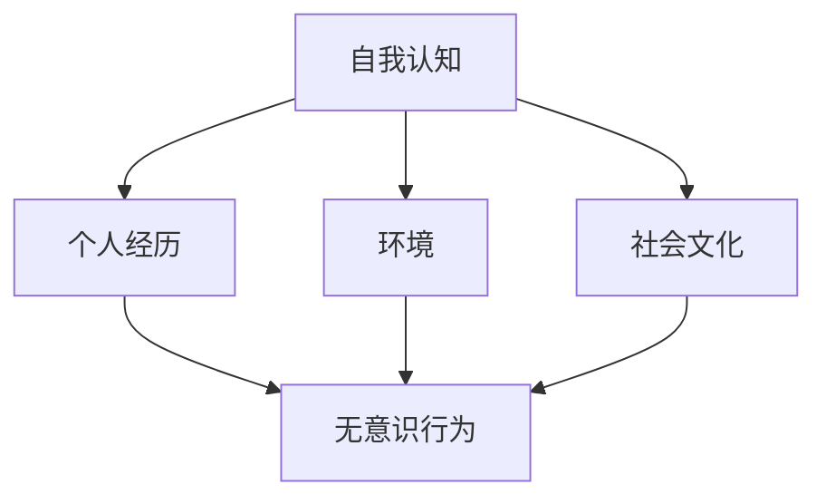
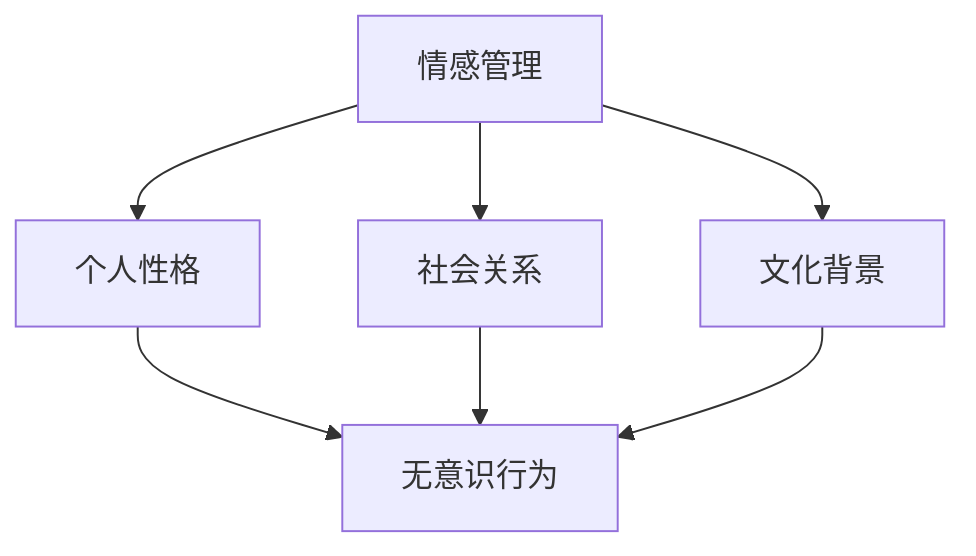
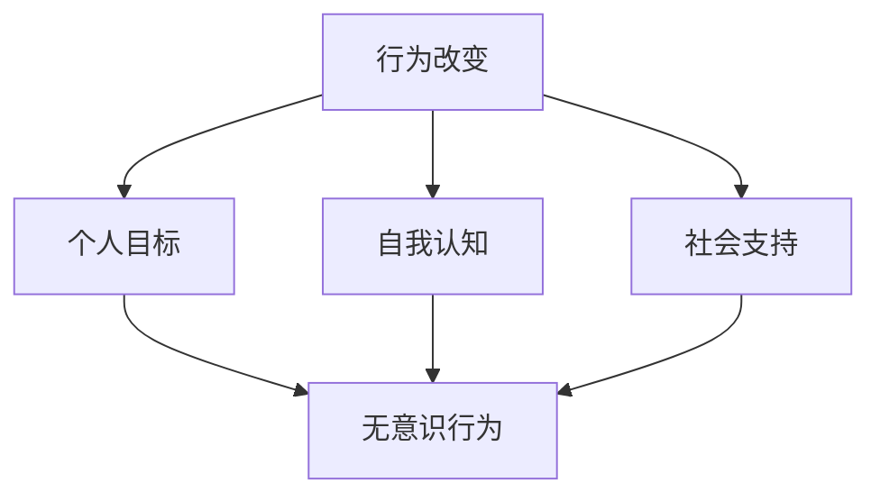
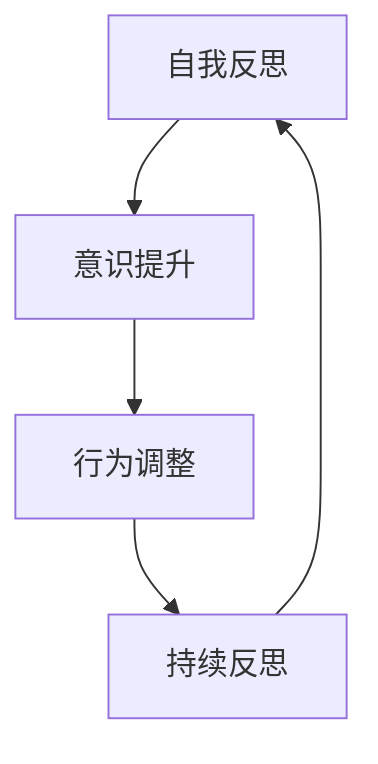

                 


## 意义的觉醒：从unconscious到conscious的转变

### 关键词：
- 无意识（Unconscious）
- 有意识（Conscious）
- 自我认知
- 情感管理
- 行为改变
- 意识层次
- 科技与觉醒

### 摘要：
本文旨在探讨人类意识的觉醒过程，从无意识状态向有意识状态的转变。我们将一步步分析这一转变的原理、过程和应用，旨在帮助读者更好地理解并实现个人意识的觉醒。

----------------------------------------------------------------

### 背景介绍

#### 无意识（Unconscious）与有意识（Conscious）

在我们日常的生活中，我们的行为和思维往往是由无意识驱动的。无意识是人类意识的一个层面，它包含了我们未曾意识到但影响着我们行为和思维的所有过程。比如，我们学会了走路、说话和开车，这些技能在熟练之后变成了无意识行为，我们不再需要特意思考就能完成。

然而，我们还有一个有意识层面，它涉及我们对自身行为和思维的感知和掌控。有意识是我们能够思考、决策和创造的基础。有意识不仅让我们能够理解自己，还让我们能够理解和改变世界。

无意识和有意识之间的界限并不是那么清晰。事实上，我们的行为和思维经常在这两个层面之间切换。但通常情况下，我们更多地依赖于无意识，而忽视了有意识的重要性。觉醒，就是指从无意识状态转向有意识状态，让我们的思维和行动更多地由我们的意识掌控。

#### 问题背景与问题描述

在当今社会，我们面临的问题越来越复杂，需要我们做出更复杂的决策和更精细的操作。然而，由于我们过度依赖无意识，我们往往无法充分应对这些挑战。例如，在工作中，我们可能因为无意识的行为习惯而做出错误决策；在生活中，我们可能因为无法控制自己的情绪而与他人产生冲突。

因此，觉醒变得尤为重要。觉醒不仅能够帮助我们更好地应对复杂的问题，还能够提高我们的生活质量，让我们更加幸福和满足。

#### 问题解决与边界与外延

觉醒的过程并不是一蹴而就的，它需要时间和持续的努力。首先，我们需要意识到无意识的存在，并开始有意识地观察和反思自己的行为和思维。接下来，我们需要通过学习、实践和反思，逐渐改变我们的无意识行为，培养有意识的生活习惯。

然而，觉醒也有其边界。首先，我们不能完全摆脱无意识，因为它是我们生活和工作的基础。其次，觉醒需要我们在不同情境下灵活应用，不能一成不变。最后，觉醒也需要我们在实践中不断调整和优化，以适应不断变化的环境。

#### 概念结构与核心要素组成

为了更好地理解觉醒的概念，我们可以将其拆分为以下几个核心要素：

1. **自我认知**：理解自己的行为和思维模式，识别无意识行为。
2. **情感管理**：学会控制自己的情绪，避免情绪主导行为。
3. **行为改变**：有意识地调整自己的行为，培养新的行为习惯。
4. **意识层次**：理解意识的多个层次，尝试提升自己的意识水平。

### 核心概念与联系

#### 自我认知

自我认知是觉醒的第一步。它涉及到我们对自身的理解和认识。自我认知不仅包括我们的性格、价值观和信念，还包括我们的行为模式和思维模式。

**概念属性特征对比表格：**

| 特征 | 自我认知 | 无意识行为 |
| ---- | ---- | ---- |
| 定义 | 对自己的理解 | 自发进行的行为 |
| 目的 | 提高自我意识 | 提高工作效率 |
| 影响因素 | 个人经历、环境、社会文化 | 无意识习惯、无意识行为 |
| 关系 | 自我认知有助于识别无意识行为 | 无意识行为是自我认知的一部分 |

**ER实体关系图架构：**



#### 情感管理

情感管理是觉醒过程中的另一个重要环节。它涉及到我们如何理解和处理自己的情感，以及如何与他人进行有效的情感交流。

**概念属性特征对比表格：**

| 特征 | 情感管理 | 无意识行为 |
| ---- | ---- | ---- |
| 定义 | 对情感的理解和调节 | 由情感驱动的行为 |
| 目的 | 提高情感智商 | 提高工作效率 |
| 影响因素 | 个人性格、社会关系、文化背景 | 无意识情感反应 |
| 关系 | 情感管理有助于减少无意识行为 | 无意识行为是情感管理的一部分 |

**ER实体关系图架构：**



#### 行为改变

行为改变是觉醒过程中的一个核心目标。它涉及到我们如何有意识地调整自己的行为，以实现个人成长和进步。

**概念属性特征对比表格：**

| 特征 | 行为改变 | 无意识行为 |
| ---- | ---- | ---- |
| 定义 | 有意识地调整行为 | 自发进行的行为 |
| 目的 | 提高生活质量 | 提高工作效率 |
| 影响因素 | 个人目标、自我认知、社会支持 | 无意识行为习惯 |
| 关系 | 行为改变有助于提高自我认知 | 无意识行为是行为改变的一部分 |

**ER实体关系图架构：**



### 算法原理讲解

为了更好地理解觉醒的过程，我们可以将其视为一种算法。这种算法的核心在于如何从无意识状态过渡到有意识状态。以下是这个算法的基本原理：

#### 基本概念

1. **无意识状态**：指个体在缺乏自我意识的情况下进行行为和思维的状态。
2. **有意识状态**：指个体在具备自我意识的情况下进行行为和思维的状态。
3. **自我反思**：指个体对自己的行为和思维进行反思和评估的过程。

#### 算法流程

1. **自我反思**：通过自我反思，个体可以识别出自己处于无意识状态的行为和思维模式。
2. **意识提升**：通过学习和实践，个体可以提升自己的意识水平，使其行为和思维更多地由意识控制。
3. **行为调整**：个体可以根据自我反思的结果，有意识地调整自己的行为和思维模式。
4. **持续反思**：个体需要持续进行自我反思，以确保自己的行为和思维保持在有意识状态。

#### Mermaid 流程图



#### Python 源代码示例

```python
def self_reflection():
    print("正在进行自我反思...")
    # 在这里，我们可以编写代码来帮助个体识别自己的无意识行为和思维模式

def awareness_提升():
    print("提升意识水平...")
    # 在这里，我们可以编写代码来帮助个体提升自己的意识水平

def behavior_adjustment():
    print("调整行为和思维模式...")
    # 在这里，我们可以编写代码来帮助个体有意识地调整自己的行为和思维模式

def continuous_reflection():
    print("持续自我反思...")
    # 在这里，我们可以编写代码来帮助个体持续进行自我反思

# 算法执行
self_reflection()
awareness_提升()
behavior_adjustment()
continuous_reflection()
```

#### 数学模型与公式

觉醒过程的数学模型可以表示为：

\[ \text{觉醒度} = f(\text{自我反思次数}, \text{意识提升程度}, \text{行为调整效果}) \]

其中，觉醒度是指标，反映了个体从无意识状态向有意识状态的转变程度。自我反思次数、意识提升程度和行为调整效果是影响觉醒度的因素。

#### 详细举例说明

假设一个人在开始觉醒过程之前，自我反思次数为10次，意识提升程度为50%，行为调整效果为70%。那么，他的觉醒度可以计算为：

\[ \text{觉醒度} = f(10, 50\%, 70\%) = 0.7 \times 0.5 \times 0.7 = 0.245 \]

这意味着，这个人的觉醒度约为24.5%，他仍然处于相对较低的无意识状态。

### 系统分析与架构设计方案

#### 问题场景介绍

在一个企业中，管理者希望通过提升员工的工作效率和团队协作能力，来实现企业的战略目标。然而，由于员工的行为和思维模式大部分处于无意识状态，导致工作效率低下，团队协作不顺畅。

#### 项目介绍

为了解决这个问题，企业决定开展一个名为“意义的觉醒”的项目。该项目旨在通过提升员工的有意识行为和思维模式，来提高员工的工作效率和团队协作能力。

#### 系统功能设计

该项目的系统功能设计主要包括以下几个方面：

1. **自我反思功能**：帮助员工识别自己的无意识行为和思维模式。
2. **意识提升功能**：提供学习资源和方法，帮助员工提升自己的意识水平。
3. **行为调整功能**：提供行为调整指南和工具，帮助员工有意识地调整自己的行为和思维模式。
4. **持续反思功能**：帮助员工持续进行自我反思，确保自己的行为和思维保持在有意识状态。

#### 系统架构设计

该项目的系统架构设计主要包括以下几个方面：

1. **前端架构**：采用Vue.js框架，提供用户友好的界面。
2. **后端架构**：采用Spring Boot框架，提供稳定的服务器端支持。
3. **数据库设计**：采用MySQL数据库，存储员工的行为数据和反思记录。

#### 系统接口设计

该项目的系统接口设计主要包括以下几个方面：

1. **用户接口**：提供用户登录、注册、自我反思、意识提升、行为调整和持续反思等功能。
2. **管理员接口**：提供管理员登录、用户管理、数据统计和报告生成等功能。

#### 系统交互

该项目的系统交互设计主要包括以下几个方面：

1. **用户与自我反思系统的交互**：用户可以通过自我反思功能，识别自己的无意识行为和思维模式。
2. **用户与意识提升系统的交互**：用户可以通过意识提升功能，学习和提升自己的意识水平。
3. **用户与行为调整系统的交互**：用户可以通过行为调整功能，有意识地调整自己的行为和思维模式。
4. **用户与持续反思系统的交互**：用户可以通过持续反思功能，持续进行自我反思，确保自己的行为和思维保持在有意识状态。

### 项目实战

#### 环境安装

为了实践“意义的觉醒”项目，我们需要安装以下环境：

1. **前端环境**：Node.js、Vue CLI
2. **后端环境**：Java、Spring Boot
3. **数据库环境**：MySQL

#### 系统核心实现

以下是一个简单的后端实现示例：

```java
@RestController
@RequestMapping("/api")
public class SelfReflectionController {

    @PostMapping("/self-reflection")
    public ResponseEntity<?> createSelfReflection(@RequestBody SelfReflection selfReflection) {
        // 保存自我反思记录
        selfReflectionService.save(selfReflection);
        return ResponseEntity.ok("Self-reflection recorded successfully.");
    }

    @GetMapping("/self-reflection/{id}")
    public ResponseEntity<?> getSelfReflection(@PathVariable Long id) {
        // 获取自我反思记录
        Optional<SelfReflection> selfReflection = selfReflectionService.findById(id);
        if (selfReflection.isPresent()) {
            return ResponseEntity.ok(selfReflection.get());
        } else {
            return ResponseEntity.notFound().build();
        }
    }
}
```

#### 代码应用解读与分析

以上代码实现了自我反思功能的两个主要操作：创建自我反思记录和获取自我反思记录。在创建自我反思记录时，我们通过`@RequestBody`注解将请求体中的数据转换为`SelfReflection`对象，然后调用`selfReflectionService`的`save`方法保存记录。在获取自我反思记录时，我们通过`@PathVariable`注解获取记录的ID，然后调用`selfReflectionService`的`findById`方法获取记录。

#### 实际案例分析和详细讲解剖析

假设有一个员工，他在一天的工作中感到疲惫和焦虑。他决定通过自我反思来识别自己的无意识行为和思维模式。

1. **自我反思**：
   - **行为**：他发现自己的工作效率低下，经常分心。
   - **思维**：他意识到自己总是在担心未来，而不是专注于当前的任务。

2. **意识提升**：
   - **方法**：他决定通过阅读相关书籍和参加在线课程来提升自己的意识水平。
   - **效果**：通过学习，他学会了如何管理自己的情绪，提高了自我控制能力。

3. **行为调整**：
   - **方法**：他决定每天早晨花10分钟进行冥想，以帮助自己保持专注和冷静。
   - **效果**：经过一段时间的实践，他的工作效率显著提高，焦虑感也减轻了。

4. **持续反思**：
   - **方法**：他每周定期回顾自己的行为和思维模式，以确保自己保持在有意识状态。
   - **效果**：通过持续反思，他能够及时调整自己的行为和思维，避免回到无意识状态。

#### 项目小结

通过“意义的觉醒”项目，员工不仅提高了自己的工作效率，还学会了如何管理自己的情绪和行为。这对于企业的长期发展具有重要意义，因为它能够提高员工的满意度和生产力，从而提升企业的整体绩效。

### 最佳实践 tips

1. **定期反思**：定期反思自己的行为和思维模式，有助于及时发现和纠正无意识行为。
2. **持续学习**：不断学习新知识，提升自己的意识水平。
3. **实践应用**：将学到的知识和技巧应用到实际生活中，通过实践来加深理解和掌握。
4. **团队合作**：与他人分享自己的觉醒过程，通过团队合作来共同进步。

### 小结

觉醒是一个复杂而深刻的过程，它涉及到我们的自我认知、情感管理、行为改变和意识层次。通过本文的探讨，我们希望能够帮助读者更好地理解觉醒的过程，并激发他们对觉醒的思考和行动。

### 注意事项

1. 觉醒是一个长期的过程，需要持续的努力和耐心。
2. 觉醒不是一蹴而就的，它需要我们在实践中不断调整和优化。
3. 觉醒不仅仅是个人成长，它还能够提高我们的生活质量和工作效率。

### 拓展阅读

1. 《心理学与生活》 by Richard J. Gerrig and Philip G. Zimbardo
2. 《自控力》 by 凯利·麦格尼格尔
3. 《觉醒之路》 by 威廉·马丁·路易斯

---

### 作者信息

作者：AI天才研究院/AI Genius Institute & 禅与计算机程序设计艺术 /Zen And The Art of Computer Programming

