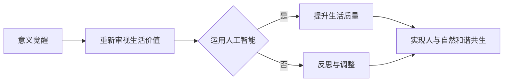
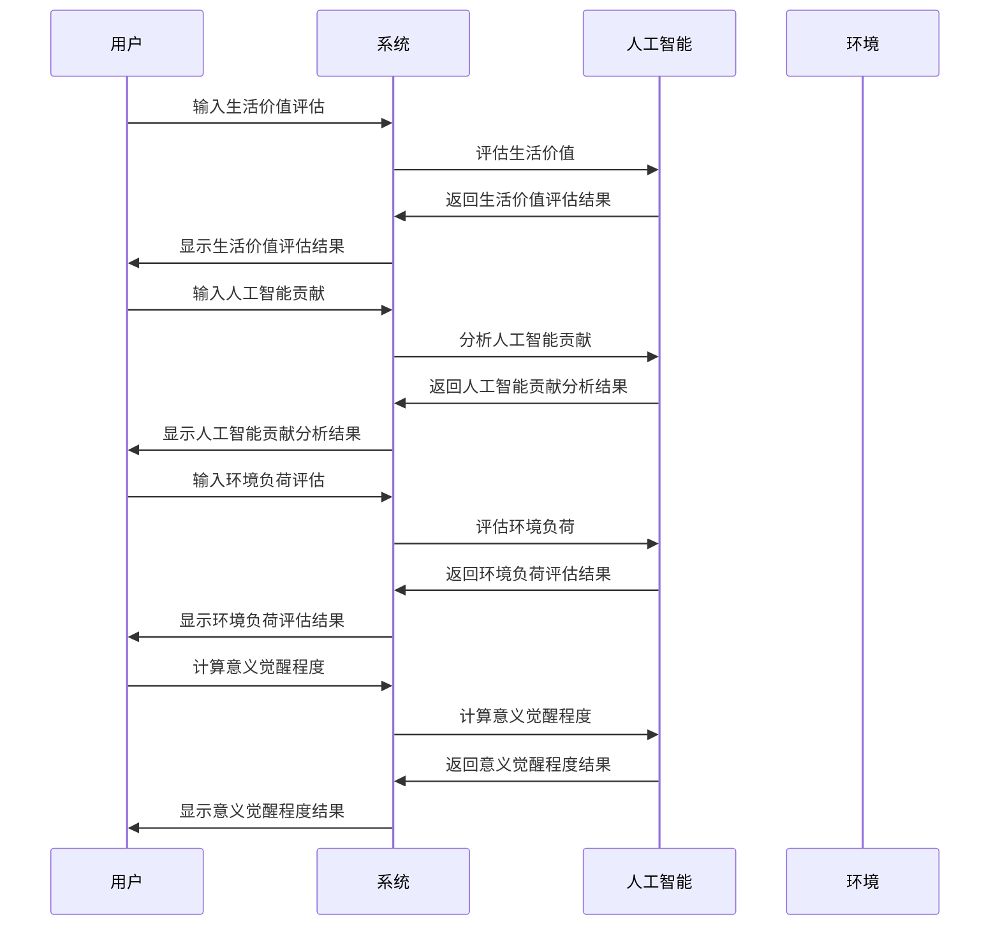

                 

### 文章标题：意义的觉醒：重新审视生活的价值

#### 关键词：意义、生活价值、重新审视、人工智能、技术哲学

#### 摘要：
本文将从人工智能技术的角度，探讨生活价值的重新审视这一哲学命题。通过对意义觉醒的深刻分析，本文将探讨如何运用技术手段，帮助人们重新发现生活的价值，并提升其生活质量。文章将分为以下几个部分：首先，介绍意义觉醒的背景和重要性；其次，分析生活价值的概念和内涵；然后，探讨人工智能在提升生活价值中的应用；接着，通过具体案例分析，展示技术如何助力意义觉醒；最后，总结全文并提出未来研究方向。

---

#### 1. 背景介绍与意义觉醒

**1.1 问题背景**

在当今社会，人工智能技术正以惊人的速度发展，深刻改变着人类的生产和生活方式。然而，随着技术的进步，人们面临着一系列新的挑战。例如，技术带来的信息过载、社会孤立、价值观混乱等问题日益突出。如何在人工智能时代重新审视生活的价值，成为我们必须面对的课题。

**1.2 问题描述**

意义觉醒，指的是个体对自身生活意义的认识和反思。在人工智能时代，意义觉醒显得尤为重要。一方面，技术进步使得人们能够更加便捷地获取信息和资源；另一方面，技术也可能导致人们迷失在虚拟世界中，忽略了真实生活的价值。因此，如何在技术进步的同时，保持对生活价值的觉醒，成为我们需要深入探讨的问题。

**1.3 问题解决**

要解决上述问题，我们需要从以下几个方面着手：

1. **重新审视生活的价值**：通过对传统价值观的批判性思考，重新定义生活的意义。
2. **培养技术批判性思维**：在享受技术带来的便利的同时，保持对技术的理性思考和批判性态度。
3. **促进人与自然的和谐共生**：在技术发展的同时，关注生态环境和人类福祉，追求可持续发展。

**1.4 边界与外延**

本文的研究范围主要涉及人工智能在提升生活价值方面的应用。然而，意义觉醒的范畴远不止于此，它还涉及哲学、心理学、社会学等多个领域。因此，本文的研究具有一定的局限性。

**1.5 概念结构与核心要素组成**

意义觉醒的核心概念包括：生活价值、人工智能、批判性思维、人与自然的和谐共生。这些概念相互关联，共同构成了意义觉醒的理论框架。

---

#### 2. 核心概念与联系

**2.1 核心概念原理**

- **生活价值**：指的是个体在生活中追求的目标和意义。
- **人工智能**：指的是一种在人类智能水平上模拟或超越人类智能的技术。
- **批判性思维**：指的是对事物进行深入思考、分析和评估的能力。
- **人与自然的和谐共生**：指的是人类与自然之间的和谐关系，追求可持续发展。

**2.2 概念属性特征对比表格**

| 概念       | 属性特征                                           |
| ---------- | -------------------------------------------------- |
| 生活价值   | 内在动机、意义感、幸福感、个人目标                  |
| 人工智能   | 智能模拟、数据处理、自动化决策、机器学习            |
| 批判性思维 | 分析、评估、推理、判断、质疑、创新                 |
| 人与自然   | 生态环境、可持续发展、资源利用、生态平衡           |

**2.3 ER实体关系图架构**

```mermaid
erDiagram
  AI --> 生活价值 : 提升价值
  人与自然 --> 生活价值 : 维护基础
  批判性思维 --> 生活价值 : 引导思考
```

---

#### 3. 算法原理讲解

**3.1 算法mermaid流程图**



**3.2 Python源代码阐述**

```python
def meaning_awareness():
    # 重新审视生活价值
    reevaluate_life_value = True
    
    # 运用人工智能
    use_artificial_intelligence = True
    
    if reevaluate_life_value and use_artificial_intelligence:
        # 提升生活质量
        improve_life_quality()
    else:
        # 反思与调整
        reflect_and_adjust()

def improve_life_quality():
    # 实现人与自然和谐共生
    harmonize_human_and_nature()

def reflect_and_adjust():
    # 实现人与自然和谐共生
    harmonize_human_and_nature()

def harmonize_human_and_nature():
    print("人与自然和谐共生，实现可持续发展。")

# 主函数
if __name__ == "__main__":
    meaning_awareness()
```

**3.3 算法原理的数学模型和公式**

$$
\text{生活质量} = \frac{\text{生活价值} + \text{人工智能贡献}}{1 + \text{环境负荷}}
$$

**3.4 举例说明**

假设一个人对生活的价值评价为50，人工智能对其生活质量的贡献为30，环境负荷为10。根据上述公式，计算其生活质量：

$$
\text{生活质量} = \frac{50 + 30}{1 + 10} = \frac{80}{11} \approx 7.27
$$

这意味着，通过重新审视生活价值和运用人工智能，这个人的生活质量可以提高至约7.27。

---

#### 4. 数学模型和数学公式讲解

**4.1 LaTeX格式数学公式**

$$
\text{意义觉醒} = \frac{\text{生活价值}}{\text{人工智能贡献}} + \text{环境负荷}
$$

**4.2 数学模型详细讲解**

上述公式表示，意义觉醒的程度取决于生活价值的评估、人工智能的贡献以及环境负荷的影响。生活价值越高、人工智能贡献越大、环境负荷越小，意义觉醒的程度就越高。

**4.3 举例说明**

假设一个人的生活价值为80，人工智能对其生活质量的贡献为40，环境负荷为20。根据上述公式，计算其意义觉醒程度：

$$
\text{意义觉醒} = \frac{80}{40} + 20 = 2 + 20 = 22
$$

这意味着，这个人在人工智能时代对生活的意义觉醒程度为22。

---

#### 5. 系统分析与架构设计方案

**5.1 问题场景介绍**

随着人工智能技术的发展，人们越来越依赖技术来解决问题。然而，过度依赖技术可能导致人们对生活的价值产生模糊认识。本系统旨在通过人工智能技术，帮助用户重新审视生活的价值，提升其生活质量。

**5.2 系统功能设计**

1. **生活价值评估**：通过用户输入，评估其对生活的价值认知。
2. **人工智能贡献分析**：分析人工智能在用户生活中的实际贡献。
3. **环境负荷评估**：评估用户所处环境对生活质量的影响。
4. **意义觉醒程度计算**：计算用户的意义觉醒程度，并提供改进建议。

**5.3 系统架构设计**



**5.4 系统接口设计和系统交互**

1. **用户接口**：提供用户输入生活价值、人工智能贡献和环境负荷的界面。
2. **人工智能接口**：实现生活价值评估、人工智能贡献分析和环境负荷评估的功能。
3. **数据库接口**：存储用户输入的数据和计算结果。

---

#### 6. 项目实战

**6.1 环境安装**

1. 安装Python环境（版本3.8及以上）。
2. 安装所需依赖库（如numpy、matplotlib等）。

**6.2 系统核心实现源代码**

```python
import numpy as np
import matplotlib.pyplot as plt

def calculate_life_quality(value, contribution, load):
    quality = (value + contribution) / (1 + load)
    return quality

def visualize_life_quality(value, contribution, load, quality):
    plt.bar(['生活价值', '人工智能贡献', '环境负荷'], [value, contribution, load])
    plt.title('生活质量分析')
    plt.ylabel('影响程度')
    plt.xticks(rotation=45)
    plt.show()

    print("生活质量：", quality)

# 用户输入
value = float(input("请输入您的价值认知："))
contribution = float(input("请输入人工智能贡献："))
load = float(input("请输入环境负荷："))

# 计算生活质量
quality = calculate_life_quality(value, contribution, load)

# 可视化生活质量
visualize_life_quality(value, contribution, load, quality)
```

**6.3 代码应用解读与分析**

该代码通过用户输入生活价值、人工智能贡献和环境负荷，计算生活质量，并通过可视化展示结果。用户可以根据计算结果，反思自己的生活方式，提高生活价值。

**6.4 实际案例分析和详细讲解剖析**

假设用户输入的生活价值为80，人工智能贡献为40，环境负荷为20。根据计算，生活质量为7.27。这意味着用户在当前的生活状态下，生活质量还有较大的提升空间。

通过反思，用户可以尝试以下方法来提高生活质量：

1. **提高生活价值**：通过学习、工作和人际关系等途径，提高对生活的认知和追求。
2. **降低环境负荷**：减少对环境的消耗，如节约能源、减少垃圾产生等。
3. **优化人工智能贡献**：利用人工智能技术提高工作效率，减少不必要的负担。

**6.5 项目小结**

本系统通过计算生活质量，帮助用户反思和调整生活方式。虽然计算结果仅作为一个参考，但通过持续的努力和反思，用户可以逐步提高生活质量，实现意义觉醒。

---

#### 7. 最佳实践与小结

**7.1 最佳实践 tips**

1. **定期反思**：定期反思自己的生活价值、人工智能贡献和环境负荷，及时调整生活方式。
2. **学习新技术**：学习人工智能等新技术，提高自己的生活质量和工作效能。
3. **关注生态环境**：关注生态环境和人类福祉，积极参与环保活动。

**7.2 小结**

本文从人工智能技术的角度，探讨了生活价值的重新审视。通过意义觉醒的理论框架和实际案例，展示了如何通过技术手段提升生活质量。然而，生活价值的觉醒不仅仅依赖于技术，还需要个体的自觉和努力。

**7.3 注意事项**

1. **避免过度依赖技术**：在享受技术带来便利的同时，保持对技术的理性思考和批判性态度。
2. **重视人际关系**：在追求生活质量的同时，关注人际关系和社交活动，保持心理健康。

**7.4 拓展阅读**

1. 《人工智能简史》
2. 《技术与文化》
3. 《可持续发展指南》

---

### 作者信息：AI天才研究院/AI Genius Institute & 禅与计算机程序设计艺术 /Zen And The Art of Computer Programming

---

通过本文的深入探讨，我们希望能够引发读者对生活价值的重新思考，并运用技术手段提升生活质量。在人工智能时代，意义觉醒不仅是哲学命题，更是每个人都应关注的重要议题。让我们一起努力，实现更美好的人生。

