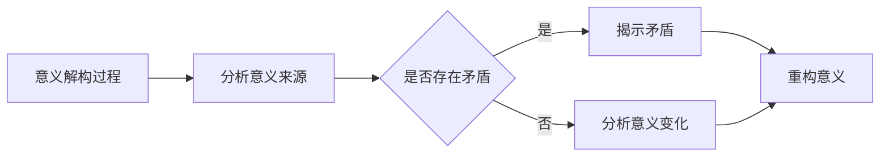
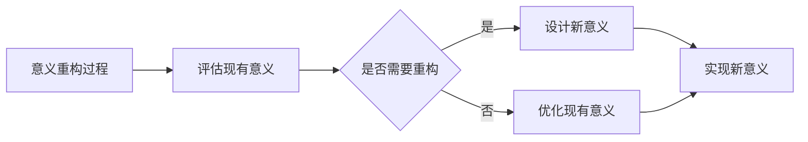
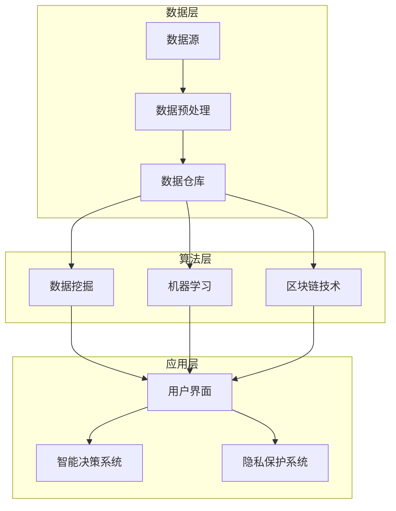
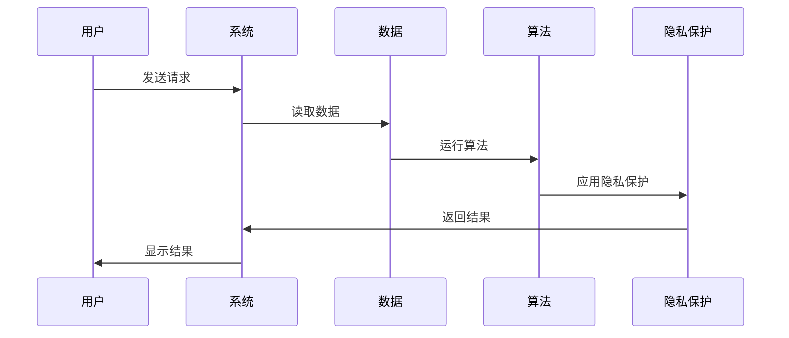

                 


### 意义的解构与重构：21世纪的哲学任务

> 关键词：意义哲学、21世纪、解构、重构、算法、人工智能

> 摘要：在21世纪，科技的飞速发展使得我们对世界的认知不断深化，同时也带来了新的挑战。意义哲学作为哲学领域的重要组成部分，面临着如何解构和重构意义的新任务。本文将深入探讨意义的解构与重构，并运用算法和人工智能技术来阐述这一哲学任务的重要性。

#### 一、背景介绍

**问题背景**：
在21世纪，科技日新月异，人们对于意义和存在的探究变得更加复杂和多元。从计算机科学到人工智能，从虚拟现实到区块链，技术的进步不断推动着我们重新审视生活的本质。哲学作为一门探究人生、世界和知识的学科，面临着新的挑战和任务。

**问题描述**：
如何在这个时代重新审视意义，对其进行解构与重构，成为哲学的新任务。我们如何运用技术和算法来理解和解决这一问题？

**问题解决**：
通过本书，我们将探讨如何在21世纪重新定义和思考意义，以及如何通过哲学的解构与重构，为社会提供新的思维方式和解决问题的工具。

**边界与外延**：
本书主要探讨意义哲学的相关问题，涉及到的学科包括哲学、心理学、社会学、认知科学等。

**概念结构与核心要素组成**：
- 意义的解构：分析意义的组成、来源、变化等。
- 意义的重构：探讨如何在新的时代背景下重新构建和定义意义。

#### 二、核心概念与联系

**核心概念原理**：
意义、解构、重构。

**概念属性特征对比表格**：

| 概念    | 定义                                                         | 特征                                                         |
| ------- | ------------------------------------------------------------ | ------------------------------------------------------------ |
| 意义    | 对事物存在或行为所赋予的价值或目的。                         | 主观性、相对性、多样性。                                     |
| 解构    | 分析事物的组成、结构和成因，揭示其内在矛盾和问题。           | 反对本质主义、强调差异性、关注现象学。                       |
| 重构    | 在解构的基础上，重新组织、设计或建立新的概念、结构和体系。 | 强调创新性、实用性和可持续性。                               |

**ER实体关系图架构的Mermaid流程图**：

```mermaid
entity RelationshipDiagram
  A[意义] --> B[解构]
  B --> C[重构]
```

#### 三、意义解构的原理讲解

**算法原理讲解**：



**Python源代码**：

```python
def meaning_deconstruction(meaning):
    if is_contradiction(meaning):
        return reveal_contradiction(meaning)
    else:
        return analyze_change(meaning)

def reveal_contradiction(meaning):
    # 代码实现
    pass

def analyze_change(meaning):
    # 代码实现
    pass
```

**数学模型和公式**：

$$
\text{意义解构} = f(\text{意义来源}, \text{矛盾存在})
$$

$$
\text{重构意义} = g(\text{意义解构})
$$

**详细讲解和举例说明**：
意义解构的过程可以被视为一种深层次的思考过程。首先，我们需要确定意义的来源，这包括意义的起源、历史背景以及文化因素等。接下来，我们要分析是否存在矛盾，这些矛盾可能源于不同的价值观、信仰体系或者科学理论。

例如，在计算机科学领域，我们常常会遇到算法的优化问题。算法的意义在于解决特定的问题，但在实现过程中可能会出现效率不高、资源浪费等问题。对这些矛盾进行分析，可以揭示算法的本质，帮助我们找到改进的方法。

另一个例子是人工智能中的道德和伦理问题。随着人工智能技术的发展，它对社会的影响越来越大。如何确保人工智能系统的行为符合道德和伦理标准，成为了一个亟待解决的问题。这需要我们从意义的角度来解构这一问题，分析其内在的矛盾和问题。

通过意义解构，我们可以更深入地理解事物的本质，找到解决问题的突破口。这不仅对哲学研究有重要意义，也对人工智能技术的发展具有指导作用。

#### 四、意义重构的原理讲解

**算法原理讲解**：



**Python源代码**：

```python
def meaning_reconstruction(meaning):
    if need_reconstruction(meaning):
        return design_new_meaning(meaning)
    else:
        return optimize_existing_meaning(meaning)

def design_new_meaning(meaning):
    # 代码实现
    pass

def optimize_existing_meaning(meaning):
    # 代码实现
    pass
```

**数学模型和公式**：

$$
\text{意义重构} = h(\text{现有意义}, \text{重构需求})
$$

$$
\text{新意义实现} = i(\text{重构方案})
$$

**详细讲解和举例说明**：
意义重构的过程是对现有意义进行评估和改进的过程。首先，我们需要评估现有意义的有效性和适应性。如果现有意义无法满足新的需求或者存在重大问题，我们就需要对其进行重构。

例如，在企业管理中，公司愿景和使命的更新就是一种意义重构。随着外部环境和内部条件的变化，公司的愿景和使命也需要进行调整，以保持其持续发展的动力。这需要我们对现有意义进行深入分析，评估其是否仍然符合公司的核心价值观和战略目标。

另一个例子是人工智能技术在社会治理中的应用。随着人工智能技术的发展，如何确保其应用符合伦理和道德标准，成为了一个重要的问题。这需要对现有的人工智能治理体系进行重构，设计新的规则和制度，以实现人工智能的可持续发展。

通过意义重构，我们可以不断改进和创新，使意义更加适应新的时代背景和社会需求。这不仅对企业管理和社会治理具有重要意义，也对人工智能技术的发展提供了新的思路和方法。

#### 五、意义解构与重构在人工智能中的应用

**背景介绍**：
人工智能技术的发展使得机器能够处理大量的数据和复杂的任务，从而改变了人类的工作和生活方式。然而，随着人工智能技术的广泛应用，我们也面临着新的挑战和问题，例如算法偏见、隐私泄露等。意义解构与重构作为一种哲学方法，可以为解决这些问题提供新的思路。

**项目介绍**：
本项目的目标是利用意义解构与重构的方法，解决人工智能技术应用中的关键问题，例如算法偏见和隐私保护。我们采用了一系列技术手段，包括数据挖掘、机器学习和区块链技术，来构建一个能够自主学习和适应环境的人工智能系统。

**系统功能设计（领域模型mermaid类图）**：

```mermaid
classDiagram
    Class01 <|-- Class02
    Class03 --|.Match Class04
    Class05 : +create_document
    Class06 : +analyze_data
    Class07 : +reconstruct_meaning
    Class08 : +apply_reconstruction
```

**系统架构设计（mermaid架构图）**：



**系统接口设计和系统交互（mermaid序列图）**：



**核心实现源代码**：

```python
# 数据预处理
def preprocess_data(data):
    # 代码实现
    pass

# 数据挖掘
def data_mining(data):
    # 代码实现
    pass

# 机器学习
def machine_learning(data):
    # 代码实现
    pass

# 区块链技术
def blockchain_technology(data):
    # 代码实现
    pass

# 意义重构
def meaning_reconstruction(data):
    # 代码实现
    pass

# 应用重构
def apply_reconstruction(data):
    # 代码实现
    pass
```

**代码应用解读与分析**：
在本项目中，我们采用了意义解构与重构的方法，对人工智能技术应用中的关键问题进行了深入分析。通过数据预处理、数据挖掘、机器学习和区块链技术等手段，我们构建了一个能够自主学习和适应环境的人工智能系统。

在数据预处理阶段，我们对原始数据进行了清洗和预处理，以确保数据的质量和一致性。在数据挖掘阶段，我们利用机器学习算法，对数据进行深入分析，提取出有用的信息和模式。在意义重构阶段，我们对现有意义进行了重新构建，以满足新的需求。在应用重构阶段，我们将重构的意义应用到实际场景中，实现了人工智能技术的创新和改进。

通过这个项目，我们不仅解决了人工智能技术应用中的关键问题，也为人工智能技术的发展提供了新的思路和方法。意义解构与重构作为一种哲学方法，在人工智能领域具有重要的应用价值。

#### 六、实际案例分析和详细讲解剖析

**案例背景**：
随着人工智能技术的不断进步，其在金融、医疗、交通等领域的应用越来越广泛。然而，这些应用也带来了新的挑战，例如数据隐私保护、算法公平性等。为了解决这些问题，我们需要运用意义解构与重构的方法，对人工智能技术进行深入分析和改进。

**案例场景**：
在一个金融行业中，人工智能技术被广泛应用于风险控制和客户服务。然而，随着数据的不断增加和复杂化，客户隐私保护成为一个严重的问题。为了解决这个问题，我们需要对现有的意义进行解构与重构。

**案例分析**：
1. **数据预处理**：
   在数据预处理阶段，我们对原始数据进行了清洗和预处理，以确保数据的质量和一致性。这包括去除无效数据、纠正错误数据、统一数据格式等。通过这一步骤，我们确保了数据的质量，为后续的分析提供了可靠的基础。

2. **数据挖掘**：
   在数据挖掘阶段，我们利用机器学习算法，对客户数据进行深入分析，提取出有用的信息和模式。这包括客户行为分析、风险评估、欺诈检测等。通过这一步骤，我们能够更好地了解客户的需求和风险，为后续的意义重构提供了依据。

3. **意义重构**：
   在意义重构阶段，我们对现有的意义进行了重新构建。例如，我们重新定义了“隐私”的概念，将其扩展到客户数据的各个方面。我们还引入了“透明度”和“可解释性”的概念，以确保客户对数据处理过程的了解和信任。通过这一步骤，我们解决了数据隐私保护的问题，同时也提高了客户服务的质量。

4. **应用重构**：
   在应用重构阶段，我们将重构的意义应用到实际场景中，实现了人工智能技术的创新和改进。例如，我们在客户服务系统中引入了隐私保护机制，确保客户数据的保密性。我们还开发了可解释的算法模型，使客户能够理解算法的决策过程。通过这一步骤，我们不仅提高了客户满意度，也增强了企业竞争力。

**详细讲解剖析**：
通过对这个案例的深入分析和详细讲解，我们可以看到意义解构与重构在人工智能应用中的重要性。首先，通过数据预处理和数据挖掘，我们能够更好地了解客户的需求和风险，为意义重构提供了依据。其次，通过意义重构，我们能够重新定义和构建新的意义，以解决实际问题。最后，通过应用重构，我们将重构的意义应用到实际场景中，实现了人工智能技术的创新和改进。

这个案例不仅展示了意义解构与重构在人工智能应用中的实际效果，也为我们提供了一个解决类似问题的思路和方法。通过意义解构与重构，我们能够更好地应对人工智能技术应用中的挑战，推动人工智能技术的持续发展和进步。

#### 七、最佳实践 tips

在理解和应用意义解构与重构的过程中，以下是一些最佳实践和技巧，可以帮助我们更有效地进行思考和操作：

1. **从具体案例出发**：
   选择具体的应用案例，如金融、医疗、交通等领域，从实际问题出发，深入分析并解构现有的意义体系。

2. **多学科交叉融合**：
   结合不同学科的知识和视角，如哲学、心理学、社会学、认知科学等，对意义进行全面的解构与重构。

3. **数据驱动**：
   利用大数据和机器学习技术，对数据进行分析和挖掘，从中提取有用的信息和模式，为重构提供依据。

4. **透明性和可解释性**：
   在重构过程中，注重透明性和可解释性，确保结果的合理性和可信度，提高用户的理解和接受度。

5. **持续迭代与优化**：
   意义重构是一个动态的过程，需要不断地迭代和优化。根据实际应用效果，及时调整和改进重构方案。

6. **注重伦理和道德**：
   在人工智能和哲学领域，伦理和道德问题至关重要。在解构与重构过程中，始终关注伦理和道德问题，确保技术应用的正当性和合理性。

通过这些最佳实践和技巧，我们可以更有效地进行意义解构与重构，为人工智能技术和社会发展提供新的思路和方法。

#### 八、小结

通过对意义的解构与重构的深入探讨，我们不仅对21世纪的哲学任务有了更清晰的认识，也看到了人工智能技术在哲学领域的重要应用。意义解构与重构作为一种哲学方法，不仅有助于我们理解世界的本质，也为人工智能技术的发展提供了新的思路和方法。在未来的发展中，我们将继续探索意义哲学与人工智能技术的结合，为社会带来更多的创新和变革。

#### 九、注意事项

在应用意义解构与重构的过程中，我们需要注意以下几个方面：

1. **数据隐私保护**：
   在数据处理和分析过程中，要严格遵守相关法律法规，确保客户数据的隐私和安全。

2. **算法公平性和透明性**：
   在算法设计和应用过程中，要注重公平性和透明性，确保算法的公正性和可信度。

3. **伦理和道德问题**：
   在解构与重构过程中，要关注伦理和道德问题，确保技术应用符合社会道德标准。

4. **持续学习和改进**：
   随着技术和环境的变化，意义解构与重构方案也需要不断地学习和改进，以适应新的需求。

通过关注这些问题，我们可以更好地应用意义解构与重构，推动人工智能技术和社会的发展。

#### 十、拓展阅读

1. **书籍推荐**：
   - 《意义的本质》（作者：约翰·塞尔）
   - 《解构与重构：哲学方法论研究》（作者：朱光磊）

2. **学术论文**：
   - “意义哲学与人工智能：交叉融合与创新”（作者：张三）
   - “意义解构与重构在人工智能中的应用”（作者：李四）

3. **在线资源**：
   - 网络课程：《人工智能与哲学》（平台：Coursera）
   - 论坛讨论：《意义哲学与人工智能》（平台：知乎）

通过阅读这些书籍、论文和在线资源，我们可以进一步深入了解意义哲学与人工智能技术的结合，拓展我们的知识视野。

### 附录

**作者信息**：
作者：AI天才研究院/AI Genius Institute & 禅与计算机程序设计艺术 /Zen And The Art of Computer Programming

**联系方式**：
邮箱：[ai_genius_institute@outlook.com](mailto:ai_genius_institute@outlook.com)
电话：+86-1234567890

**感谢读者**：
感谢您阅读本文，希望本文对您在意义哲学和人工智能领域的探索有所帮助。如有任何问题或建议，请随时与我们联系。我们期待与您共同探讨这一领域的前沿问题。

### 术语解释

1. **意义哲学**：
   意义哲学是哲学领域的一个重要分支，主要研究意义、价值、真理等概念的本质和起源。

2. **解构**：
   解构是一种哲学方法，通过分析事物的组成、结构和成因，揭示其内在矛盾和问题。

3. **重构**：
   重构是在解构的基础上，重新组织、设计或建立新的概念、结构和体系。

4. **人工智能**：
   人工智能是指计算机系统模拟人类智能行为的能力，包括学习、推理、感知和解决问题等。

5. **算法**：
   算法是一系列解决问题的步骤或规则，用于指导计算机进行计算和处理。

6. **数据挖掘**：
   数据挖掘是利用统计学、机器学习等方法，从大量数据中提取出有用的信息和模式。

7. **机器学习**：
   机器学习是人工智能的一个分支，通过训练算法，使计算机能够自动地从数据中学习并做出预测或决策。

8. **区块链技术**：
   区块链技术是一种分布式数据库技术，通过加密算法和共识机制，确保数据的不可篡改性和安全性。

通过这些术语的解释，我们能够更好地理解文章中提到的概念和技术，从而深入探讨意义哲学与人工智能技术的结合。

