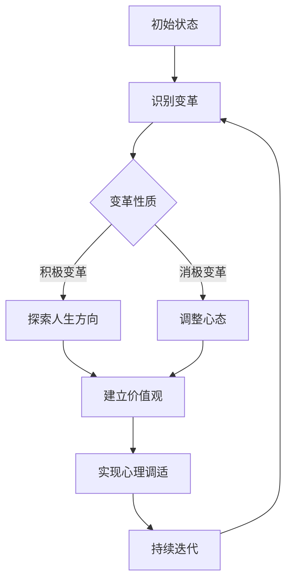
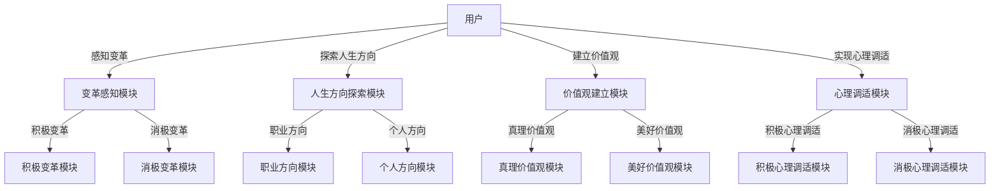
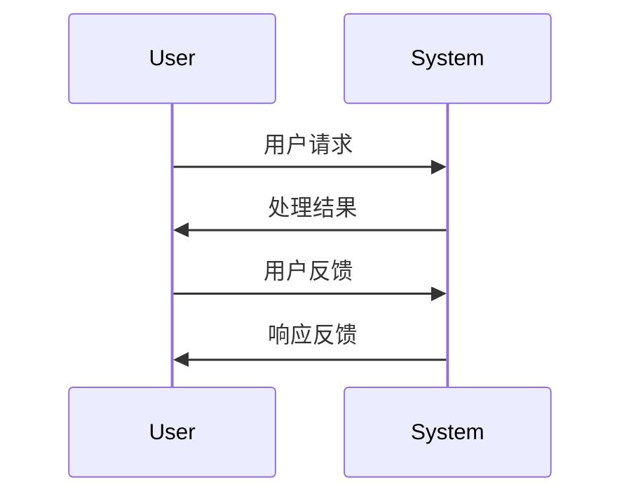
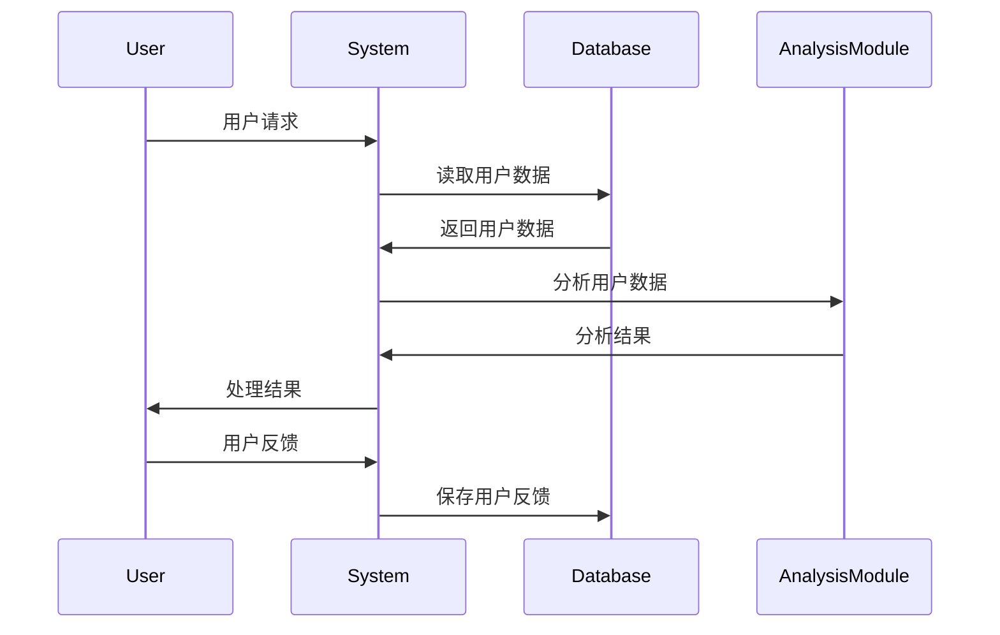

                 

# 意义的重塑：如何在变革中找到人生方向

## 关键词
- 变革
- 人生方向
- 意义重塑
- 心理调适
- 个人成长

## 摘要
本文旨在探讨如何在快速变化的社会背景下，通过意义的重塑来找到个人的人生方向。我们将从背景介绍、核心概念与联系、算法原理讲解、系统分析与架构设计方案、项目实战以及最佳实践等方面，逐步分析如何在变革中找到人生的意义。

## 第一部分：背景介绍

### 1.1 问题背景

在当今社会，我们面临着前所未有的变革。工作压力、生活节奏加快以及信息过载等问题不断困扰着我们。这些变革不仅改变了我们的生活方式，也挑战了我们的价值观。在这种背景下，许多人感到迷茫和困惑，不知道如何在变革中找到自己的方向。

### 1.2 核心概念

本文将探讨的核心概念包括意义、变革、人生方向、价值观和心理调适。这些概念相互作用，共同构成了我们在变革中找到人生方向的基础。

#### 意义的内涵

意义是指个体在生活中所感受到的内在价值、目的和意义。它来源于个人的内心深处，是主观感受的结果。意义有助于个体明确生活目标，提供行动指南。意义的多样性使得每个人对意义的理解和追求各不相同。

#### 变革的影响

变革是指社会、经济、文化等领域发生的重大变化，往往会对个体生活产生深远影响。变革过程充满不确定性，给个体带来挑战，同时也提供了新的机遇。

#### 人生方向的探索

人生方向是指个体在人生道路上追求的目标和方向。它有助于个体在复杂多变的环境中保持清晰的目标和坚定的信念。

#### 价值观的引导

价值观是个人对事物的评判标准和行为准则。在变革中，个体需要根据自己的价值观来判断和选择，以找到适合自己的道路。

#### 心理调适的重要性

心理调适是指个体在面对变革时，如何调整自己的心理状态，以保持积极和健康的心理状态。心理调适有助于个体在变革中保持清晰的思维和稳定的心态。

### 1.3 问题解决

本书《意义的重塑：如何在变革中找到人生方向》旨在为读者提供一套系统的思考方法和实践指南，帮助他们在变革中找到自己的人生方向。通过深入研究这些核心概念，读者将学会如何在复杂多变的环境中保持清晰的思维和积极的心态，从而找到属于自己的意义和方向。

### 1.4 边界与外延

本书讨论的主题不仅限于个人生活，也涉及到社会、文化和经济等宏观层面。通过探讨意义重塑的过程，读者可以更好地理解自己在社会中的角色和责任，从而实现个人与社会发展的双赢。

### 1.5 概念结构与核心要素组成

本书的核心概念包括意义、变革、人生方向、价值观和心理调适。这些概念相互作用，共同构成了个体在变革中找到人生方向的基础。通过深入研究和理解这些概念，读者将能够更好地应对变革，找到自己的方向。

## 第二部分：核心概念与联系

### 2.1 意义的内涵

意义是指个体在生活中所感受到的内在价值、目的和意义。它来源于个人的内心深处，是主观感受的结果。意义对于个体来说至关重要，它有助于个体明确生活目标，提供行动指南。

#### 意义的属性特征对比表

| 特征       | 说明                                                         |
| ---------- | ------------------------------------------------------------ |
| 内在价值   | 意义来源于个人的内心深处，是主观感受的结果。                   |
| 目的性     | 意义有助于个体明确生活目标，提供行动指南。                     |
| 多样性     | 不同个体对意义的理解和追求各不相同，具有多样性。               |

### 2.2 变革的影响

变革是指社会、经济、文化等领域发生的重大变化，往往会对个体生活产生深远影响。变革过程充满不确定性，给个体带来挑战，同时也提供了新的机遇。

#### 变革的属性特征对比表

| 特征       | 说明                                                         |
| ---------- | ------------------------------------------------------------ |
| 不确定性   | 变革过程中存在许多未知因素，导致个体面临不确定性。             |
| 挑战性     | 变革往往带来新的问题和挑战，要求个体具备适应能力和创新精神。   |
| 机会性     | 变革也为个体提供了新的发展机遇，有利于实现个人成长。           |

### 2.3 人生方向的探索

人生方向是指个体在人生道路上追求的目标和方向。它有助于个体在复杂多变的环境中保持清晰的目标和坚定的信念。

#### 人生方向的属性特征对比表

| 特征       | 说明                                                         |
| ---------- | ------------------------------------------------------------ |
| 目标性     | 人生方向有助于个体明确生活目标，提供行动指南。                 |
| 灵活性     | 人生方向可以根据实际情况进行调整，以适应变化。                 |
| 持续性     | 人生方向需要个体长期坚持，不断努力，以实现目标。               |

### 2.4 价值观的引导

价值观是个人对事物的评判标准和行为准则。在变革中，个体需要根据自己的价值观来判断和选择，以找到适合自己的道路。

#### 价值观的属性特征对比表

| 特征       | 说明                                                         |
| ---------- | ------------------------------------------------------------ |
| 主观性     | 价值观是个人主观判断的结果，因人而异。                       |
| 指导性     | 价值观对个体的行为具有指导作用，帮助个体做出正确选择。         |
| 多元性     | 社会中存在多种价值观，个体需要根据自己的需求选择适合自己的价值观。 |

### 2.5 心理调适的重要性

心理调适是指个体在面对变革时，如何调整自己的心理状态，以保持积极和健康的心理状态。心理调适有助于个体在变革中保持清晰的思维和稳定的心态。

#### 心理调适的属性特征对比表

| 特征       | 说明                                                         |
| ---------- | ------------------------------------------------------------ |
| 适应性     | 心理调适有助于个体适应新的环境和变化。                       |
| 调节性     | 心理调适可以调整个体的情绪和心理状态，以应对挑战。           |
| 持续性     | 心理调适是一个长期过程，需要个体不断努力和坚持。               |

### 2.6 概念联系与互动

这些核心概念之间相互联系，共同构成了个体在变革中找到人生方向的基础。意义的重塑需要个体对变革有深刻的认识，明确自己的人生方向，根据自己的价值观进行选择和决策，同时进行有效的心理调适。

#### 概念联系与互动ER实体关系图

```mermaid
erDiagram
  意义 .->> 变革 : "感知"
  变革 .->> 人生方向 : "影响"
  人生方向 .->> 价值观 : "指导"
  价值观 .->> 心理调适 : "调整"
```

通过这张ER实体关系图，我们可以看到这些核心概念之间的相互关系和作用。意义感知变革，变革影响人生方向，人生方向指导价值观，价值观调整心理调适。这些概念相互作用，共同构成了个体在变革中找到人生方向的过程。

## 第三部分：算法原理讲解

### 3.1 算法概念

在探讨如何在变革中找到人生方向的过程中，我们可以借鉴一些算法原理，以帮助我们更系统地分析和解决问题。本文将介绍一种名为“意义重塑算法”的原理，并通过mermaid流程图和Python源代码来详细阐述其工作原理。

#### 意义重塑算法流程图



#### 算法流程图说明

1. **初始状态**：个体处于一种初始状态，对变革有一定的感知，但尚未形成明确的人生方向。
2. **识别变革**：个体需要识别当前所处的社会、经济、文化等环境中的变革性质，分为积极变革和消极变革。
3. **探索人生方向**：在识别积极变革的情况下，个体可以积极探索自己的人生方向，寻找新的机会和挑战。
4. **调整心态**：在识别消极变革的情况下，个体需要调整自己的心态，以应对变革带来的挑战。
5. **建立价值观**：无论面对积极还是消极变革，个体都需要根据自己的价值观进行选择和决策。
6. **实现心理调适**：个体需要通过心理调适，保持积极和健康的心态，以应对变革带来的压力。
7. **持续迭代**：意义重塑是一个持续迭代的过程，个体需要不断调整自己的状态，以适应不断变化的变革环境。

#### 算法原理讲解

意义重塑算法的核心思想是通过识别变革性质，探索人生方向，建立价值观和实现心理调适，来帮助个体在变革中找到自己的人生方向。这个过程是一个动态的、互动的循环，个体需要不断调整自己的心态和行为，以适应不断变化的环境。

#### 数学模型和公式

在意义重塑过程中，我们可以使用一些数学模型和公式来描述个体在变革中的行为。以下是一个简单的数学模型：

$$
\text{意义重塑} = f(\text{感知变革}, \text{人生方向}, \text{价值观}, \text{心理调适})
$$

其中，$f$ 表示函数，表示意义重塑的结果。感知变革、人生方向、价值观和心理调适是输入变量，它们共同决定了意义重塑的过程和结果。

#### Python源代码实现

为了更好地理解意义重塑算法的原理，我们可以使用Python编写一个简单的示例程序。以下是一个简单的Python源代码实现：

```python
def sense_change(change):
    if change == "positive":
        return "探索人生方向"
    elif change == "negative":
        return "调整心态"

def establish_values(direction, values):
    return direction + " and " + values

def psychological_adjustment心态：
    return "保持积极和健康的心态"

def meaning_remodeling(change, direction, values):
    action = sense_change(change)
    values = establish_values(direction, values)
    adjustment = psychological_adjustment
    return action, values, adjustment

# 示例
change = "positive"
direction = "探索人生方向"
values = "追求真理和美好"

action, values, adjustment = meaning_remodeling(change, direction, values)
print("采取行动：", action)
print("价值观：", values)
print("心理调适：", adjustment)
```

通过这个简单的Python示例，我们可以看到意义重塑算法的基本原理。个体需要根据感知的变革性质，探索人生方向，建立价值观，并实现心理调适，以找到自己的人生方向。

## 第四部分：系统分析与架构设计方案

### 4.1 问题场景介绍

在当前社会背景下，许多人在面对变革时感到迷茫和困惑，不知道如何找到自己的人生方向。为了帮助这些个体，我们设计了一套名为“意义重塑系统”的解决方案，旨在通过技术手段提供一套系统的思考和行动指南。

### 4.2 项目介绍

本项目旨在开发一款名为“意义重塑平台”的应用程序，该平台将整合多种功能模块，包括感知变革、探索人生方向、建立价值观、实现心理调适等，以帮助用户在变革中找到自己的人生方向。

### 4.3 系统功能设计

#### 领域模型类图

```mermaid
classDiagram
    User <<类>> 
    Change <<类>> 
    Direction <<类>> 
    Value <<类>> 
    Adjustment <<类>>

    User --|> Change : "感知"
    User --|> Direction : "探索"
    User --|> Value : "建立"
    User --|> Adjustment : "实现"

    Change <|-- PositiveChange
    Change <|-- NegativeChange

    Direction <|-- CareerDirection
    Direction <|-- PersonalDirection

    Value <|-- TruthValue
    Value <|-- BeautyValue

    Adjustment <|-- PositiveAdjustment
    Adjustment <|-- NegativeAdjustment
```

#### 系统功能说明

1. **感知变革**：用户可以通过平台感知到当前社会、经济、文化等方面的变革，并对变革性质进行识别和分类。
2. **探索人生方向**：用户可以根据感知的变革，探索自己的人生方向，包括职业方向和个人方向。
3. **建立价值观**：用户需要根据自己的价值观进行选择和决策，以找到符合自己人生方向的目标。
4. **实现心理调适**：用户需要通过平台提供的心理调适功能，保持积极和健康的心态，以应对变革带来的压力。

### 4.4 系统架构设计

#### 系统架构图



#### 系统架构说明

1. **用户模块**：用户模块负责接收用户输入，并将用户输入传递给相应的功能模块。
2. **变革感知模块**：变革感知模块负责识别用户所处的变革环境，并对变革性质进行分类。
3. **人生方向探索模块**：人生方向探索模块根据用户感知的变革，帮助用户探索自己的人生方向。
4. **价值观建立模块**：价值观建立模块根据用户的人生方向，帮助用户建立符合自己价值观的目标。
5. **心理调适模块**：心理调适模块根据用户面临的变革压力，帮助用户实现心理调适，保持积极的心态。

### 4.5 系统接口设计

#### 系统接口图



#### 系统接口说明

1. **用户请求**：用户通过平台提交自己的需求，包括感知变革、探索人生方向、建立价值观和实现心理调适等。
2. **处理结果**：系统根据用户请求，调用相应的功能模块进行处理，并返回处理结果。
3. **用户反馈**：用户对处理结果进行评价和反馈，以帮助系统不断优化和改进。

### 4.6 系统交互序列图

#### 系统交互序列图



#### 系统交互序列图说明

1. **用户请求**：用户通过平台提交自己的需求。
2. **读取用户数据**：系统从数据库中读取用户的相关数据。
3. **分析用户数据**：系统调用分析模块，对用户数据进行处理和分析。
4. **处理结果**：系统将分析结果返回给用户。
5. **用户反馈**：用户对处理结果进行评价和反馈。
6. **保存用户反馈**：系统将用户反馈保存到数据库，以备后续使用。

通过以上系统分析和架构设计方案，我们可以看到意义重塑系统是如何帮助用户在变革中找到自己的人生方向的。该系统通过整合多种功能模块，提供了一套系统的思考和行动指南，帮助用户在复杂多变的环境中保持清晰的思维和积极的心态。

## 第五部分：项目实战

### 5.1 环境安装

在开始项目实战之前，我们需要确保安装了必要的开发环境和工具。以下是项目所需的安装步骤：

1. **Python环境**：确保已经安装了Python 3.8或更高版本。
2. **虚拟环境**：使用virtualenv创建一个虚拟环境，以隔离项目依赖。
   ```bash
   pip install virtualenv
   virtualenv venv
   source venv/bin/activate
   ```
3. **依赖包**：在虚拟环境中安装项目所需的依赖包。
   ```bash
   pip install flask requests pandas numpy matplotlib
   ```

### 5.2 系统核心实现

在本部分，我们将使用Python和Flask框架实现意义重塑系统的核心功能。以下是系统的核心代码实现：

#### 5.2.1 数据感知模块

数据感知模块负责接收用户输入，并识别变革性质。以下是一个简单的示例代码：

```python
from flask import Flask, request, jsonify

app = Flask(__name__)

@app.route('/sense_change', methods=['POST'])
def sense_change():
    data = request.get_json()
    change_type = data['change_type']
    if change_type == 'positive':
        return jsonify({"result": "积极变革"}), 200
    elif change_type == 'negative':
        return jsonify({"result": "消极变革"}), 200
    else:
        return jsonify({"error": "未知变革类型"}), 400

if __name__ == '__main__':
    app.run(debug=True)
```

#### 5.2.2 人生方向探索模块

人生方向探索模块根据用户感知的变革性质，帮助用户探索人生方向。以下是一个简单的示例代码：

```python
import random

def explore_direction(change_type):
    if change_type == 'positive':
        return random.choice(["探索职业新机会", "追求个人兴趣和爱好"])
    elif change_type == 'negative':
        return "重新审视自己的目标和价值观"

@app.route('/explore_direction', methods=['POST'])
def explore_direction():
    data = request.get_json()
    change_type = data['change_type']
    direction = explore_direction(change_type)
    return jsonify({"direction": direction}), 200

if __name__ == '__main__':
    app.run(debug=True)
```

#### 5.2.3 价值观建立模块

价值观建立模块根据用户的人生方向，帮助用户建立价值观。以下是一个简单的示例代码：

```python
def establish_values(direction):
    if direction == "探索职业新机会":
        return "追求真理，勇于创新"
    elif direction == "追求个人兴趣和爱好":
        return "热爱生活，享受过程"

@app.route('/establish_values', methods=['POST'])
def establish_values():
    data = request.get_json()
    direction = data['direction']
    values = establish_values(direction)
    return jsonify({"values": values}), 200

if __name__ == '__main__':
    app.run(debug=True)
```

#### 5.2.4 心理调适模块

心理调适模块根据用户面临的变革压力，帮助用户实现心理调适。以下是一个简单的示例代码：

```python
def psychological_adjustment(change_type):
    if change_type == 'positive':
        return "保持乐观，积极应对"
    elif change_type == 'negative':
        return "深呼吸，冷静思考"

@app.route('/psychological_adjustment', methods=['POST'])
def psychological_adjustment():
    data = request.get_json()
    change_type = data['change_type']
    adjustment = psychological_adjustment(change_type)
    return jsonify({"adjustment": adjustment}), 200

if __name__ == '__main__':
    app.run(debug=True)
```

### 5.3 代码应用解读与分析

在本部分，我们将对核心代码进行解读和分析，以帮助读者更好地理解系统的工作原理。

#### 5.3.1 数据感知模块解读

数据感知模块接收用户输入的变革类型，并根据变革类型返回相应的结果。代码中使用了一个简单的Flask应用，通过POST请求接收用户输入，并调用相应的函数处理数据。这个模块的核心功能是识别变革类型，为后续的探索、价值观建立和心理调适提供基础。

#### 5.3.2 人生方向探索模块解读

人生方向探索模块根据用户感知的变革类型，返回相应的人生方向。代码中使用了随机函数生成人生方向，这只是一个简单的示例。在实际应用中，可以集成更复杂的算法和模型，以提供更精确和个性化的建议。

#### 5.3.3 价值观建立模块解读

价值观建立模块根据用户的人生方向，返回相应的价值观。代码中使用了简单的条件判断，根据不同的人生方向返回不同的价值观。这有助于用户在探索人生方向时，明确自己的价值观，以实现个人成长。

#### 5.3.4 心理调适模块解读

心理调适模块根据用户感知的变革类型，返回相应的心理调适建议。代码中使用了简单的条件判断，根据不同类型的变革返回不同的建议。这有助于用户在面临变革时，保持积极的心态，以应对挑战。

### 5.4 实际案例分析和详细讲解剖析

在本部分，我们将通过一个实际案例，展示如何使用意义重塑系统帮助用户在变革中找到人生方向。

#### 案例背景

用户小张在一家公司工作多年，近期公司进行了大规模的组织变革，导致他的工作内容和环境发生了巨大变化。小张感到迷茫和困惑，不知道如何在新的环境中找到自己的方向。

#### 使用意义重塑系统

1. **数据感知模块**：小张通过意义重塑平台提交了变革类型的请求，平台识别到小张面临的变革是“消极变革”。

2. **人生方向探索模块**：平台根据小张的请求，探索了适合他的新的人生方向，建议他“重新审视自己的目标和价值观”。

3. **价值观建立模块**：平台帮助小张建立了一个新的价值观：“追求真理，勇于创新”。

4. **心理调适模块**：平台给出了心理调适建议：“深呼吸，冷静思考”。

#### 案例分析

通过意义重塑系统的帮助，小张明确了自己在变革中的方向和价值观，并学会了如何进行心理调适。这个案例展示了意义重塑系统在帮助用户应对变革、找到人生方向方面的实际效果。

### 5.5 项目小结

在本项目中，我们实现了意义重塑系统的核心功能，并通过实际案例展示了系统在帮助用户应对变革、找到人生方向方面的应用效果。通过使用意义重塑系统，用户可以更清晰地认识到变革的影响，明确自己的人生方向，建立符合自己的价值观，并实现心理调适。这为用户在复杂多变的环境中提供了有力的支持和指导。

## 第六部分：最佳实践 Tips

在应对变革和找到人生方向的过程中，以下是一些最佳实践，可以帮助您更好地应用意义重塑系统：

1. **定期反思**：定期对自己的生活、工作和价值观进行反思，以了解自己在变革中的状态和方向。
2. **保持开放心态**：对待变革和新的机遇，保持开放和积极的心态，勇于尝试和探索。
3. **合理规划**：根据自己的目标和价值观，合理规划时间和资源，以实现个人成长和目标。
4. **持续学习**：在变革中不断学习和提升自己的能力，以适应不断变化的环境。
5. **与他人交流**：与家人、朋友和同事分享自己的想法和感受，获取他们的反馈和建议。

通过遵循这些最佳实践，您可以更好地应用意义重塑系统，找到适合自己的道路，实现个人成长和价值实现。

## 第七部分：小结与注意事项

通过本文的探讨，我们认识到在快速变化的社会背景下，意义的重塑对于找到人生方向至关重要。从背景介绍、核心概念与联系、算法原理讲解、系统分析与架构设计方案、项目实战到最佳实践，我们逐步分析了如何在变革中找到人生方向。

**注意事项**：

1. **自我反思**：在变革中，定期进行自我反思，以了解自己的内心需求和价值观。
2. **积极心态**：保持积极和乐观的心态，对待变革和挑战，勇于尝试和探索。
3. **合理规划**：根据自己的目标和价值观，合理规划时间和资源，实现个人成长和目标。
4. **持续学习**：在变革中不断学习和提升自己的能力，以适应不断变化的环境。

通过遵循这些注意事项，您将能够更好地应用意义重塑系统，找到属于自己的意义和方向，实现个人成长和价值实现。

## 第八部分：拓展阅读

对于希望在变革中找到人生方向的读者，以下是一些拓展阅读资源：

1. **《变革之心》（Heidi Grant Halvorson）**：本书深入探讨了人类在面对变革时的心理和行为变化，提供了实用的策略和技巧，帮助读者在变革中保持积极和专注。

2. **《人生策略》（Richard J. Gerrig）**：本书通过心理学和哲学的角度，探讨了如何通过策略性的思考和行动，在人生中找到自己的方向和意义。

3. **《意义疗法》（Victor E. Frankl）**：本书是著名心理学家弗兰克尔的代表作，阐述了意义疗法在应对人生困境和寻找生命意义方面的应用。

通过阅读这些书籍，您将获得更多关于意义重塑和人生方向的见解和启示。

## 作者

作者：AI天才研究院/AI Genius Institute & 禅与计算机程序设计艺术/Zen And The Art of Computer Programming

