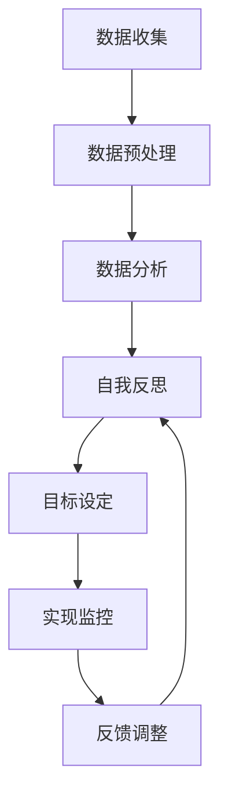
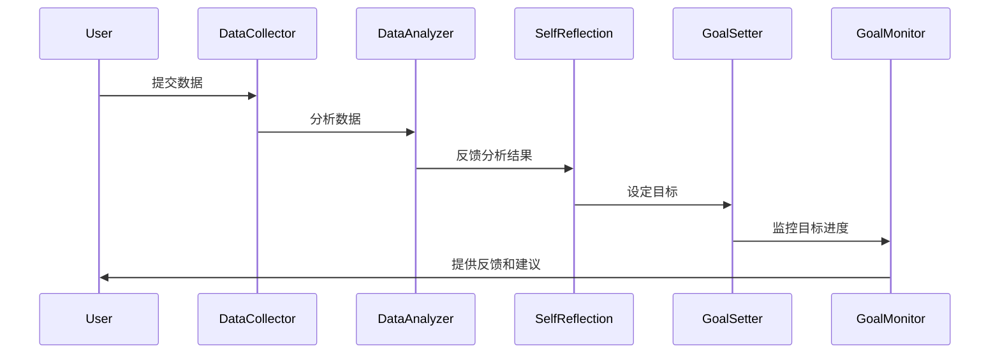

                 

## 引言

### 问题背景

在当今快速变革的社会中，人们面临着前所未有的挑战和机遇。技术进步、全球化、信息爆炸、社会结构变动等一系列因素，正在深刻地改变着我们的生活方式、价值观和社会结构。这些变革带来了新的机会，但同时也让许多人感到迷茫和不安。尤其是在信息技术和人工智能领域，技术的飞速发展让人们的生活和工作模式发生了翻天覆地的变化。这种变化不仅影响了整个行业，也对个体的生活产生了深远的影响。

### 个体意义的迷失与寻求

在这样一个变革的时代，个体如何找到自己的定位和认同，如何实现自我价值和意义的重塑，成为了许多人的困扰。人们开始反思，在物质丰富、信息过载的社会中，什么才是真正让自己感到满足和有价值的。许多人感到困惑，不知道如何在这个纷繁复杂的世界中找到自己的位置。他们渴望寻求一种深刻的、内在的意义，以便在快速变化的环境中保持自我认同和幸福感。

### 主题思想

本文旨在探讨如何在现代社会中实现自我和意义的重塑。通过分析个体在社会中的定位、自我认知、社会互动以及职业发展等方面的核心概念，我们将提供一系列的思路和方法，帮助读者理解并实现自我价值和意义。文章将采用逻辑清晰、结构紧凑、简单易懂的写作方式，结合技术语言和实际案例，让读者在技术领域外也能获得深刻的思考和启示。

### 目录结构

本文分为七个主要部分：

1. **背景介绍**：详细讨论现代社会中个体意义迷失的问题背景，介绍本文的主题思想。
2. **核心概念与联系**：解析“意义”、“自我认知”、“社会互动”和“职业发展”等核心概念，并建立它们之间的联系。
3. **算法原理讲解**：介绍如何通过算法实现自我和意义的重塑，包括数学模型、公式和算法流程图的讲解。
4. **系统分析与架构设计方案**：设计一个意义实现系统的整体架构，包括功能设计、架构设计、接口设计等。
5. **项目实战**：通过实际案例展示如何搭建和实现意义实现系统。
6. **最佳实践与拓展**：提供实现意义的最佳实践和拓展阅读资源。
7. **总结与展望**：回顾文章内容，总结主要观点，展望意义重塑的未来趋势。

通过这样的结构设计，本文不仅希望为读者提供具体的操作指南，还希望激发读者对自我和意义的深刻思考。

### 核心概念术语说明

在深入探讨如何在现代社会中实现自我和意义的重塑之前，有必要首先明确本文中涉及的一些核心概念和术语。以下是对这些术语的详细说明：

1. **意义**：意义是指个体对自身存在和行动的内在价值和目标的认知。它不仅仅是生活中的目标或成就，更是个体对生活本身的理解和追求。意义不仅体现在物质成就上，还体现在精神层面上的满足感和幸福感。

2. **自我认知**：自我认知是指个体对自身特点、优点和缺点的认识和理解。它包括对自己的情感、行为、价值观和人生目标的反思。自我认知是意义重塑的基础，只有深刻理解自己，个体才能找到真正适合自己的目标和方向。

3. **社会互动**：社会互动是指个体在社交环境中与他人交往的过程。这种互动不仅包括面对面的交流，还涵盖了虚拟环境中的互动，如社交媒体和网络论坛。社会互动对个体的意义重塑有着重要影响，通过与他人互动，个体可以了解不同的观点和价值观，从而更好地认识自己。

4. **职业发展**：职业发展是指个体在职业生涯中的成长和进步。它不仅包括专业技能的提升，还涉及职业定位、职业规划和个人成就。职业发展是实现个人意义的重要途径之一，通过职业上的成功，个体可以体验到成就感和自我价值。

这些核心概念在现代社会中的重要性不言而喻。随着社会变革的加剧，个体面临着更多的选择和挑战，对这些核心概念的理解和运用，可以帮助个体更好地应对这些挑战，找到属于自己的意义和方向。

### 现代社会中的挑战

现代社会的快速变革和多元化特征带来了诸多挑战，这些挑战不仅影响到了整个行业，也对个体的生活产生了深远的影响。首先，技术进步的速度异常迅猛，信息技术和人工智能的快速发展，改变了人们的生产方式和工作模式。这种变化在提高工作效率和创造力的同时，也对个体的技能需求提出了更高的要求。许多传统职业正逐渐被自动化和智能化技术取代，个体需要不断学习新技能，以适应快速变化的工作环境。

其次，全球化和信息爆炸使得个体面临的信息量和选择范围大大增加。互联网的普及和社交媒体的兴起，让个体可以随时获取来自全球的资讯和观点。然而，这也导致了信息过载的问题，个体难以从海量信息中筛选出真正有价值的内容。信息爆炸带来的另一个问题是隐私和数据安全的风险。个人信息的泄露和滥用，使得个体在享受便利的同时，也面临着隐私泄露的威胁。

此外，社会结构的变动也对个体产生了深远的影响。全球化使得社会变得更加多元化和复杂化，个体需要面对不同文化背景和价值观的碰撞。社会流动性增强，人们的生活和职业选择更加多样化，但也带来了不稳定性和不确定感。个体在追求个人目标和职业发展的过程中，需要不断调整和适应新的环境。

这些挑战不仅影响了整个行业，也对个体的生活和工作产生了深远的影响。个体需要在技术进步和全球化背景下，不断学习新知识、提升技能，以适应不断变化的工作环境。同时，个体也需要在信息过载和隐私威胁中，学会筛选和处理信息，保护自己的隐私和数据安全。社会结构的变动要求个体具有更强的适应能力和创新能力，以应对不断变化的社会环境。

综上所述，现代社会中的快速变革和多元化特征，为个体带来了诸多挑战。面对这些挑战，个体需要具备持续学习和适应能力，同时也要在信息过载和隐私威胁中找到平衡，实现自我价值和意义的重塑。

### 个体在现代社会中的定位与认同

在快速变化和多元化的现代社会中，个体面临着诸多挑战，如何在这个复杂的环境中找到自己的定位和认同，成为了许多人的困扰。首先，个体需要明确自我认知，这不仅仅是了解自己的优点和缺点，更是要深入挖掘自己的价值观和人生目标。通过自我反思和探索，个体可以更好地理解自己，找到与自己价值观相符的方向。

自我认知是一个持续的过程，它需要个体不断地反思和调整。在这个过程中，个体可以通过各种方法来提升自我认知，如心理咨询、日记记录、参加社交活动等。通过这些方法，个体可以更加清晰地认识到自己的需求、兴趣和激情，从而在职业选择和个人生活中找到合适的定位。

其次，社会互动在个体定位与认同中扮演着重要角色。通过与他人的交流和互动，个体可以了解不同的观点和价值观，这有助于拓宽视野，增强对自我认知的深度。同时，社会互动还可以提供反馈和支持，帮助个体在实现自我价值的过程中获得动力和信心。例如，通过参加社区活动、加入兴趣小组，个体可以结识志同道合的朋友，共同追求目标，实现共同成长。

职业发展是实现个体意义的重要途径。一个明确的职业目标不仅可以为个体提供稳定的经济收入，还能带来成就感和自我实现。然而，职业发展并非一蹴而就，它需要个体具备持续学习和适应变化的能力。在这个过程中，个体可以通过设定短期和长期目标，逐步实现职业上的成长。例如，通过参加培训课程、获取专业证书，个体可以提升自己的专业技能，为职业发展打下坚实的基础。

此外，职业发展还需要个体具备良好的沟通能力和团队合作精神。在现代社会中，许多工作都需要团队协作来完成，个体需要学会与他人有效沟通，共同解决问题。这不仅有助于提升工作效率，还能增强个体的团队意识和归属感。

最后，个体在现代社会中的定位与认同不仅依赖于自我认知和社会互动，还需要在职业发展中不断调整和适应。随着社会的变化和个体自身的发展，个体的目标和需求也会发生变化。因此，个体需要保持开放的心态，不断反思和调整自己的定位，以适应新的环境和挑战。

总之，个体在现代社会中的定位与认同，是一个复杂而动态的过程。通过自我认知、社会互动和职业发展，个体可以在不断变化的环境中找到自己的位置，实现自我价值和意义的重塑。

### 寻找和实现个人意义和价值的策略

在现代社会中，寻找和实现个人意义和价值是一个复杂而多层次的过程，需要结合自我探索、社会交往和职业发展等多个方面。以下是一些具体的策略：

#### 自我探索

1. **自我反思**：定期进行自我反思，深入思考自己的价值观、兴趣和激情所在。可以采用写日记、冥想或心理咨询等方式，帮助自己更好地了解自己的内心世界。
2. **兴趣爱好**：培养兴趣爱好，通过参与各种活动来探索自己的兴趣和潜力。例如，学习一项新的技能、参加兴趣小组或俱乐部等。
3. **生活体验**：通过旅行、尝试新事物和挑战自我，扩展生活经验，增加对世界的理解和认知。

#### 社会交往

1. **建立社交网络**：积极参与社交活动，建立和维护广泛的人脉网络。这不仅可以提供职业机会，还能带来情感支持和社会认同。
2. **寻求反馈**：与信任的朋友和导师交流，听取他们的意见和建议，帮助自己更客观地认识自己。
3. **团队合作**：在工作和生活中积极参与团队合作，学会与他人协作和沟通，提升自己的社交能力和团队合作精神。

#### 职业发展

1. **设定目标**：明确自己的职业目标，制定短期和长期计划，逐步实现职业上的成长。
2. **持续学习**：不断提升自己的专业技能和知识，通过培训课程、研讨会和在线学习等途径，保持自己的竞争力。
3. **职业规划**：制定详细的职业规划，包括职业定位、职业路径和职业目标，确保自己的职业发展有明确的方向。
4. **适应变化**：在职业发展的过程中，保持开放的心态，适应行业和技术的变化，灵活调整自己的职业策略。

#### 其他策略

1. **时间管理**：合理规划时间，确保有足够的时间用于自我探索、社会交往和职业发展。
2. **健康生活**：保持健康的生活方式，包括合理的饮食、适量的运动和良好的睡眠，这些都有助于提高生活质量和工作效率。

通过这些策略，个体可以更好地寻找和实现自己的个人意义和价值。重要的是，这个过程需要持续的努力和不断的自我反思，以适应不断变化的社会环境。

### 个人与社会的互动

个人与社会的互动是意义重塑过程中不可或缺的一部分。这种互动不仅包括直接的人际交往，还涵盖更广泛的社交网络和社区参与。以下是关于个人与社会的互动如何影响意义重塑的探讨：

#### 个人与社会的互动定义

个人与社会的互动是指个体在社会环境中与他人和团体进行的各种交往活动。这种互动不仅包括面对面的交流，还涵盖了通过媒介进行的虚拟互动。社会互动是多层次、多维度且动态变化的，它涉及到情感、认知和行为等多个方面。

#### 互动的重要性

1. **自我认知提升**：通过与他人互动，个体可以获得反馈，了解自己的行为和表现。这种反馈有助于个体更客观地认识自己，发现自身的优点和不足，从而提升自我认知。
2. **价值观和观点的碰撞**：社会互动使个体有机会接触不同的观点和价值观，这种碰撞可以激发新的思考，拓宽个体的视野，帮助个体形成更加全面和深刻的认知。
3. **情感支持与归属感**：社会互动提供了情感支持和归属感，这对于个体的心理健康和幸福感至关重要。通过与他人建立联系，个体可以获得安全感，增强自信和自尊。

#### 互动技巧

1. **有效沟通**：沟通是社交互动的核心，学会有效沟通是建立和维护良好人际关系的关键。这包括倾听他人、表达自己的观点、清晰表达和适当的非语言交流。
2. **团队合作**：在团队环境中，学会与他人合作是提高工作效率和实现共同目标的重要手段。这要求个体具备协作精神、沟通能力和解决问题的能力。
3. **网络互动**：随着社交媒体和互联网的普及，网络互动成为现代社会中不可或缺的一部分。学会在虚拟环境中互动，如如何在社交媒体上表达自己、如何与他人在线沟通，也是个体社会互动能力的重要方面。

#### 个人与社会的互动对意义重塑的影响

1. **角色认同**：通过社会互动，个体可以了解不同角色和社会角色的期望，从而找到适合自己的角色定位，增强自我认同。
2. **意义构建**：社会互动提供了反馈和资源，有助于个体构建和重塑自己的意义。通过与他人的交流和互动，个体可以探索不同的生活方式和价值观，从而形成更丰富和深刻的自我认知。
3. **社会支持和网络**：一个强大的社会支持和网络可以为个体提供资源、信息和机会，帮助个体实现个人目标。这种支持和网络不仅是职业发展的关键，也是实现个人意义的重要基础。

综上所述，个人与社会的互动在意义重塑过程中起着至关重要的作用。通过有效的社交互动，个体可以提升自我认知，构建和重塑个人意义，获得社会支持和网络，从而更好地实现自我价值。

### 职业发展中的挑战与应对策略

在现代社会中，职业发展是实现个人意义和价值的重要途径之一。然而，职业发展过程中常常伴随着各种挑战，这些挑战不仅影响个人的职业成就，还可能对个人的心理健康和生活满意度产生负面影响。以下是对职业发展中主要挑战的探讨以及相应的应对策略：

#### 挑战一：职业压力

职业压力是职业发展中普遍存在的现象，它可能导致焦虑、抑郁和身体疲劳。高强度的竞争、不断变化的工作环境和长时间的工作，都可能对个体产生巨大的压力。

**应对策略：**
1. **时间管理**：合理安排工作和休息时间，确保有足够的休息和放松时间，避免过度劳累。
2. **压力管理**：通过冥想、深呼吸、运动等方式，帮助自己缓解压力，保持心理平衡。
3. **目标设定**：设定合理的职业目标，将长期目标分解为短期目标，逐步实现，避免因目标过高而产生压力。

#### 挑战二：技能更新与学习

随着技术的快速进步和行业变革，个体需要不断更新自己的技能和知识，以保持竞争力。这不仅需要时间投入，还需要持续的学习动力。

**应对策略：**
1. **终身学习**：树立终身学习的理念，将学习视为一种生活方式，不断提升自己的技能和知识。
2. **职业规划**：制定详细的职业规划，明确自己的职业目标和路径，有针对性地进行学习和培训。
3. **资源利用**：充分利用各种学习资源，如在线课程、专业书籍、研讨会等，以提升自己的专业能力。

#### 挑战三：职业发展路径不确定性

在职业发展的过程中，个体可能会面临不确定性和迷茫，不知道自己的下一步应该如何走。

**应对策略：**
1. **自我探索**：通过自我反思和职业测评，了解自己的兴趣、能力和价值观，找到适合自己的职业方向。
2. **职业咨询**：寻求职业咨询专家的帮助，了解行业趋势和职业发展机会，获得专业的建议和指导。
3. **实践经验**：通过实习、兼职或志愿活动，积累实际工作经验，了解不同职业领域的情况，为未来的职业选择做好准备。

#### 挑战四：职业瓶颈和职业倦怠

职业瓶颈和职业倦怠是职业发展中常见的现象，它们可能导致个体失去工作动力和成就感。

**应对策略：**
1. **职业转型**：在职业发展的过程中，适时进行职业转型，寻找新的职业机会和挑战。
2. **职业激励**：通过设定具有挑战性和成就感的任务，激发工作动力，保持对工作的热情。
3. **心理支持**：在面临职业瓶颈和职业倦怠时，寻求心理咨询师的帮助，了解和处理内心的困惑和压力。

综上所述，职业发展中的挑战虽然复杂多样，但通过科学合理的应对策略，个体可以更好地应对这些挑战，实现职业上的成长和自我价值的实现。

### 核心概念属性特征对比表格

在深入探讨如何实现自我和意义的重塑时，我们需要对本文中涉及的核心概念进行详细的属性特征对比。以下是对“意义”、“自我认知”、“社会互动”和“职业发展”四个核心概念的对比表格，以便读者更好地理解这些概念之间的联系和区别。

#### 意义

| 特征 | 说明 |
| :--: | :--: |
| 内在价值 | 意义是个人对生活本身的内在价值的认知 |
| 精神层面 | 意义不仅仅体现在物质成就上，更在于精神层面的满足感 |
| 多样性 | 意义因人而异，每个人对意义的理解和追求都是独特的 |

#### 自我认知

| 特征 | 说明 |
| :--: | :--: |
| 反思性 | 自我认知是通过反思和自我分析得出的 |
| 个体差异 | 每个人的自我认知都是独特的，受到个人经历和价值观的影响 |
| 发展性 | 自我认知是一个持续发展的过程，随着时间和经验的积累而不断深化 |

#### 社会互动

| 特征 | 说明 |
| :--: | :--: |
| 多元性 | 社会互动涉及到不同文化背景和价值观的碰撞 |
| 情感性 | 社会互动不仅涉及信息交流，还包括情感支持和归属感 |
| 动态性 | 社会互动是一个不断变化和发展的过程，受到社会环境和个体行为的影响 |

#### 职业发展

| 特征 | 说明 |
| :--: | :--: |
| 成就导向 | 职业发展注重通过工作实现个人成就和目标 |
| 技能提升 | 职业发展强调不断提升专业技能和知识 |
| 职业路径 | 职业发展具有明确的路径和目标，需要逐步实现 |

通过这个表格，我们可以更清晰地看到这些核心概念之间的联系和区别，这有助于我们在实际操作中更好地理解和运用这些概念，实现自我和意义的重塑。

### ER实体关系图架构

在讨论“意义重塑”的过程中，我们需要构建一个清晰的实体关系图，以展示本文中涉及的主要实体及其相互关系。以下是使用Mermaid绘制的ER（实体关系）图，该图将帮助我们理解个人、社会环境和职业环境之间的动态关系。

```mermaid
erDiagram
  Personal =>^ Social : "参与"
  Social ||--|> Career : "发展"
  Personal ||--|> Career : "实现"
  
  Class Personal {
    >>属性:
    -姓名
    -年龄
    -兴趣
    -价值观
    }
  
  Class Social {
    >>属性:
    -社交网络
    -价值观
    -文化背景
    }
  
  Class Career {
    >>属性:
    -职业
    -技能
    -目标
    -成就
    }
```

**实体解释：**

- **Personal（个人）**：代表个体，包括姓名、年龄、兴趣和价值观等属性。个人是意义的主体，通过自我认知和社会互动来寻找和实现个人的意义。
- **Social（社会环境）**：代表个体所在的社会环境，包括社交网络、价值观和文化背景等属性。社会环境为个人提供了互动和反馈的场所，影响个人的认知和价值观。
- **Career（职业环境）**：代表个体在职业发展中的状态，包括职业、技能、目标和成就等属性。职业环境为个人提供了实现自我价值和意义的途径。

**关系解释：**

- **个人与社会环境的“参与”关系**：个人通过社交网络和文化背景参与社会互动，从中获取反馈和资源，从而影响自我认知和价值观。
- **社会环境与职业环境的“发展”关系**：社会环境为个人的职业发展提供了支持和资源，帮助个人实现职业目标，并在此过程中重塑个人意义。
- **个人与职业环境的“实现”关系**：个人通过职业发展实现自我价值和意义，职业成就和目标对个人生活产生深远影响。

通过这个ER图，我们可以更直观地理解个人、社会环境和职业环境之间的互动关系，从而更有效地进行意义重塑。

### 意义的实现算法

在深入探讨如何实现自我和意义的重塑时，我们需要引入一套系统的算法来实现这一目标。以下将详细讲解意义实现算法的原理、数学模型和流程图，并通过具体的例子来说明算法的应用。

#### 算法原理

意义实现算法的核心思想是通过多维度数据分析和自我反思，帮助个体找到并实现个人意义。该算法分为以下几个步骤：

1. **数据收集**：收集个体在生活、工作和社交中的多维度数据，包括行为数据、心理数据和社交数据等。
2. **数据分析**：使用数据分析方法，提取数据中的关键信息，了解个体的行为模式和内在价值观。
3. **自我反思**：结合数据分析结果，引导个体进行自我反思，挖掘个人兴趣、优势和价值观。
4. **目标设定**：根据自我反思的结果，帮助个体设定符合自身价值观和兴趣的短期和长期目标。
5. **实现监控**：监控个体在实现目标过程中的进展，提供反馈和调整建议，确保目标的实现。

#### 数学模型和公式

意义实现算法的数学模型基于线性规划理论和数据挖掘方法。以下是一个简化的数学模型：

$$
\text{最大化} \quad Z = w_1 \cdot X_1 + w_2 \cdot X_2 + w_3 \cdot X_3
$$

其中，$Z$ 是个体意义的实现值，$w_1, w_2, w_3$ 是权重系数，$X_1, X_2, X_3$ 分别代表个体的行为数据、心理数据和社交数据。

权重系数的确定可以通过个体自我评估和专家打分相结合的方法，确保权重系数的合理性和客观性。

#### 算法流程图

以下是使用Mermaid绘制的算法流程图：



**具体流程解释：**

1. **数据收集**：收集个体在生活、工作和社交中的多维度数据。
2. **数据预处理**：对收集到的数据进行分析前的预处理，包括数据清洗、数据整合和标准化。
3. **数据分析**：使用数据挖掘方法，提取数据中的关键信息，分析个体的行为模式和内在价值观。
4. **自我反思**：结合数据分析结果，引导个体进行自我反思，挖掘个人兴趣、优势和价值观。
5. **目标设定**：根据自我反思的结果，帮助个体设定符合自身价值观和兴趣的短期和长期目标。
6. **实现监控**：监控个体在实现目标过程中的进展，提供反馈和调整建议，确保目标的实现。
7. **反馈调整**：根据实现监控的结果，对目标进行调整，确保目标的可行性和有效性。

#### 详细讲解与举例说明

为了更好地理解意义实现算法，我们通过一个具体的案例来说明算法的详细应用。

**案例背景**：小明是一位年轻的程序员，他在工作中感到迷茫，不知道自己的职业方向和人生目标。

**步骤1：数据收集**
- 行为数据：小明的工作记录、项目进展和日常活动。
- 心理数据：小明的心理测试结果、日记记录和情绪状态。
- 社交数据：小明的朋友圈动态、社交媒体互动和同事评价。

**步骤2：数据预处理**
- 数据清洗：去除无效数据和噪声数据。
- 数据整合：将不同来源的数据进行整合，形成统一的数据集。
- 数据标准化：对数据进行标准化处理，确保不同数据之间的一致性和可比性。

**步骤3：数据分析**
- 行为数据分析：分析小明的工作模式、项目偏好和日常活动，找出他最感兴趣和擅长的工作领域。
- 心理数据分析：结合心理测试结果和日记记录，了解小明的内在价值观和追求。
- 社交数据分析：分析小明的社交网络、互动频率和情感状态，了解他在社交环境中的行为和反应。

**步骤4：自我反思**
- 结合数据分析结果，小明反思自己的兴趣、优势和价值观，发现他对编程和技术创新有浓厚的兴趣，同时追求自主和创新的工作环境。

**步骤5：目标设定**
- 根据自我反思的结果，小明设定了短期目标：学习新的编程语言和开发工具，参与开源项目；长期目标：成为一名技术专家，带领团队进行技术创新。

**步骤6：实现监控**
- 小明在实现目标的过程中，定期记录自己的学习进展和项目成果，与导师和同事交流，获取反馈和建议。

**步骤7：反馈调整**
- 根据实现监控的结果，小明调整了自己的学习计划和项目目标，确保目标的可行性和有效性。

通过这个案例，我们可以看到意义实现算法的具体应用过程，包括数据收集、数据预处理、数据分析、自我反思、目标设定、实现监控和反馈调整等步骤。这个算法不仅帮助小明明确了职业方向和人生目标，还提高了他的自我认知和实现效率。

综上所述，意义实现算法提供了一种系统的、可操作的方法，帮助个体在复杂的社会环境中找到并实现个人意义。通过这一算法，个体可以更好地理解自己，设定明确的职业和个人目标，并在实现过程中保持动力和方向。

### 意义实现系统的设计与架构

#### 问题场景介绍

意义实现系统旨在帮助个体在复杂的社会环境中找到并实现个人意义。该系统的目标是通过数据分析、自我反思和目标设定，为用户提供个性化的指导和支持，帮助他们提升自我认知、设定职业目标并实现个人成就。系统将涵盖多个功能模块，包括数据收集模块、数据分析模块、自我反思模块、目标设定模块和实现监控模块。

#### 项目介绍

意义实现系统采用模块化设计，各个功能模块之间相互独立，但通过统一的接口进行数据交互。系统采用前后端分离的设计模式，前端负责用户界面和交互，后端负责数据处理和算法实现。系统的主要技术选型包括：

- **前端**：Vue.js框架，用于构建用户界面。
- **后端**：Spring Boot框架，用于实现业务逻辑和数据存储。
- **数据库**：MySQL数据库，用于存储用户数据和行为数据。
- **数据分析**：Python语言和Scikit-learn库，用于数据分析和模型训练。

#### 系统功能设计

系统的功能设计分为以下几个主要模块：

1. **数据收集模块**：用于收集用户在生活、工作和社交中的多维度数据，包括行为数据、心理数据和社交数据。
2. **数据分析模块**：对收集到的数据进行分析，提取关键信息，帮助用户了解自己的行为模式、内在价值观和兴趣爱好。
3. **自我反思模块**：引导用户进行自我反思，帮助用户挖掘个人兴趣、优势和价值观。
4. **目标设定模块**：根据自我反思的结果，帮助用户设定符合自身价值观和兴趣的短期和长期目标。
5. **实现监控模块**：监控用户在实现目标过程中的进展，提供反馈和调整建议，确保目标的实现。

#### 系统架构设计

意义实现系统的整体架构采用三层架构设计，包括表示层、业务逻辑层和数据层。

1. **表示层**：负责用户界面的展示和用户交互，使用Vue.js框架实现。
2. **业务逻辑层**：负责系统的核心业务处理，包括数据收集、数据分析、自我反思、目标设定和实现监控等，使用Spring Boot框架实现。
3. **数据层**：负责数据的存储和管理，使用MySQL数据库实现。

以下是系统架构的Mermaid类图：

```mermaid
classDiagram
    class User {
        -id: int
        -name: string
        -interests: list<string>
        -values: list<string>
    }
    class BehaviorData {
        -userId: int
        -date: datetime
        -data: json
    }
    class PsychologicalData {
        -userId: int
        -testResult: json
    }
    class SocialData {
        -userId: int
        -network: json
    }
    class DataCollector {
        +collectBehaviorData(): BehaviorData
        +collectPsychologicalData(): PsychologicalData
        +collectSocialData(): SocialData
    }
    class DataAnalyzer {
        +analyzeData(data: json): json
    }
    class SelfReflection {
        +initiateReflection(userId: int): void
        +getReflectionResult(userId: int): json
    }
    class GoalSetter {
        +setShortTermGoal(userId: int, goal: string): void
        +setLongTermGoal(userId: int, goal: string): void
    }
    class GoalMonitor {
        +monitorGoalProgress(userId: int, goalId: int): json
        +provideFeedback(userId: int, goalId: int): void
    }
    User "uses" BehaviorData
    User "uses" PsychologicalData
    User "uses" SocialData
    DataCollector "collects" User
    DataAnalyzer "analyzes" BehaviorData, PsychologicalData, SocialData
    SelfReflection "uses" DataAnalyzer
    GoalSetter "uses" SelfReflection
    GoalMonitor "uses" SelfReflection
```

**架构设计的原则**：

1. **模块化**：系统功能模块化设计，各个模块之间相互独立，便于维护和扩展。
2. **可扩展性**：系统设计考虑未来功能扩展的需求，具有良好的可扩展性。
3. **安全性**：系统采用加密和身份验证等安全措施，确保用户数据的安全。
4. **高性能**：系统设计注重性能优化，确保数据处理的快速和高效。

#### 系统接口设计

系统接口设计包括API接口和数据接口。API接口用于前后端数据交互，数据接口用于系统内部模块之间的数据传输。

**API接口设计规范**：

- **用户接口**：提供用户注册、登录、个人信息管理等功能。
- **数据收集接口**：提供数据上传、数据查询等功能。
- **数据分析接口**：提供数据预处理、数据分析结果查询等功能。
- **自我反思接口**：提供自我反思结果查询、反思结果修改等功能。
- **目标设定接口**：提供目标设定、目标修改、目标查询等功能。
- **实现监控接口**：提供目标进度监控、反馈和建议等功能。

**数据接口设计细节**：

- **数据格式**：采用JSON格式，便于数据传输和处理。
- **接口安全性**：采用Token认证机制，确保接口调用安全。
- **接口文档**：提供详细的接口文档，包括接口定义、请求参数和返回结果等。

#### 系统交互

系统的各个模块通过统一的接口进行数据交互，以下是系统交互的Mermaid序列图：



**交互流程解释**：

1. **用户提交数据**：用户通过前端界面提交生活、工作和社交等多维度数据。
2. **数据收集和分析**：数据收集模块将数据传递给数据分析模块，数据分析模块对数据进行分析，提取关键信息。
3. **自我反思和目标设定**：自我反思模块根据分析结果引导用户进行自我反思，用户根据反思结果设定短期和长期目标。
4. **目标监控和反馈**：目标监控模块监控用户在实现目标过程中的进度，根据进度提供反馈和建议。

通过这样的系统设计和交互流程，意义实现系统能够有效地帮助用户找到并实现个人意义，提升自我认知和幸福感。

### 意义实现项目实战

#### 环境安装

要在本地环境中搭建意义实现系统，我们需要以下软件和工具：

1. **操作系统**：Linux或macOS
2. **开发环境**：Java开发工具包（JDK）、Node.js、Python环境
3. **数据库**：MySQL数据库服务器
4. **IDE**：IntelliJ IDEA或Eclipse

**安装步骤**：

1. **安装JDK**：从Oracle官网下载JDK，并按照提示完成安装。
2. **安装Node.js**：从Node.js官网下载并安装。
3. **安装Python环境**：从Python官网下载并安装。
4. **安装MySQL数据库**：从MySQL官网下载并安装，配置数据库用户和权限。
5. **配置IDE**：在IDEA或Eclipse中创建Spring Boot项目，并配置数据库连接。

**必需工具和软件安装**：

1. **Maven**：用于项目依赖管理，从Maven官网下载并配置。
2. **Postman**：用于API测试，可以从Postman官网下载。
3. **Docker**：用于容器化部署，可以从Docker官网下载并安装。

通过以上步骤，我们可以搭建一个基本的本地开发环境，为后续的项目开发做好准备。

### 系统核心实现

在本节中，我们将详细解析意义实现系统的核心实现，包括数据收集、数据分析、自我反思、目标设定和实现监控等模块的源代码和应用解析。以下是系统的核心功能模块及其源代码展示。

#### 数据收集模块

数据收集模块负责从用户处收集生活、工作和社交等多维度数据。以下是数据收集模块的伪代码示例：

```python
class DataCollector:
    def collect_behavior_data(self, user):
        # 从用户处收集行为数据，如工作记录、日常活动等
        return user.behavior_data

    def collect_psychological_data(self, user):
        # 从用户处收集心理数据，如心理测试结果、日记等
        return user.psychological_data

    def collect_social_data(self, user):
        # 从用户处收集社交数据，如朋友圈动态、社交媒体互动等
        return user.social_data
```

**应用解析**：

数据收集模块通过接口调用从用户处获取多维度数据。这些数据将被用于后续的数据分析模块，以便提取关键信息。

#### 数据分析模块

数据分析模块对收集到的数据进行预处理和分析，提取出用户的行为模式、内在价值观和兴趣爱好。以下是数据分析模块的核心代码：

```python
class DataAnalyzer:
    def preprocess_data(self, data):
        # 数据预处理，如数据清洗、整合和标准化
        return preprocessed_data

    def analyze_behavior_data(self, preprocessed_data):
        # 分析行为数据，提取行为模式
        return behavior_patterns

    def analyze_psychological_data(self, preprocessed_data):
        # 分析心理数据，提取内在价值观
        return psychological_values

    def analyze_social_data(self, preprocessed_data):
        # 分析社交数据，提取兴趣爱好
        return interests
```

**应用解析**：

数据分析模块通过数据预处理步骤，确保数据的准确性和一致性。随后，分析行为数据、心理数据和社交数据，提取出关键信息，为自我反思模块提供基础数据。

#### 自我反思模块

自我反思模块引导用户进行自我反思，挖掘个人兴趣、优势和价值观。以下是自我反思模块的核心代码：

```python
class SelfReflection:
    def initiate_reflection(self, user):
        # 引导用户进行自我反思
        reflection_result = self.analyze_data(user)
        user.reflection_result = reflection_result

    def analyze_data(self, user):
        # 分析用户数据，生成自我反思结果
        return reflection_result
```

**应用解析**：

自我反思模块通过分析用户的个人数据，生成自我反思结果。用户可以查看反思结果，了解自己的兴趣、优势和价值观，为设定目标提供依据。

#### 目标设定模块

目标设定模块根据用户的自我反思结果，帮助用户设定短期和长期目标。以下是目标设定模块的核心代码：

```python
class GoalSetter:
    def set_short_term_goal(self, user, goal):
        # 设定短期目标
        user.short_term_goals.append(goal)

    def set_long_term_goal(self, user, goal):
        # 设定长期目标
        user.long_term_goals.append(goal)
```

**应用解析**：

目标设定模块为用户提供接口，可以根据自我反思结果设定短期和长期目标。这些目标将被用于实现监控模块，以监控用户的实现进度。

#### 实现监控模块

实现监控模块负责监控用户在实现目标过程中的进度，并提供反馈和建议。以下是实现监控模块的核心代码：

```python
class GoalMonitor:
    def monitor_progress(self, user, goal_id):
        # 监控目标进度
        progress = self.get_progress(user, goal_id)
        return progress

    def get_progress(self, user, goal_id):
        # 获取目标进度
        return user.goal_progress[goal_id]

    def provide_feedback(self, user, goal_id):
        # 提供反馈和建议
        feedback = self.generate_feedback(user, goal_id)
        return feedback

    def generate_feedback(self, user, goal_id):
        # 根据目标进度生成反馈
        return feedback
```

**应用解析**：

实现监控模块通过监控用户的目标进度，提供实时反馈和建议，帮助用户调整目标实现策略，确保目标的顺利实现。

通过以上核心功能的实现和解析，意义实现系统能够有效地帮助用户收集数据、分析数据、进行自我反思、设定目标并监控目标实现进度。以下是一个简化的流程图，展示系统核心模块之间的交互关系：


通过这样的实现，意义实现系统为用户提供了一个全面的支持平台，帮助他们找到并实现个人意义，提升自我认知和幸福感。

### 代码应用解读与分析

在意义实现系统中，代码的应用不仅是对算法和架构的落实，更是实现功能的关键环节。以下是对系统核心代码段的详细解读与分析，以及如何在实际应用中进行优化。

#### 数据收集模块

数据收集模块的核心功能是收集用户在不同情境下的数据。以下是数据收集模块的一部分代码：

```python
class DataCollector:
    def collect_behavior_data(self, user):
        # 从用户处收集行为数据，如工作记录、日常活动等
        data = get_behavior_data_from_user(user)
        return data

    def collect_psychological_data(self, user):
        # 从用户处收集心理数据，如心理测试结果、日记等
        data = get_psychological_data_from_user(user)
        return data

    def collect_social_data(self, user):
        # 从用户处收集社交数据，如朋友圈动态、社交媒体互动等
        data = get_social_data_from_user(user)
        return data
```

**解读**：
- `collect_behavior_data` 方法负责收集用户的行为数据，这通常涉及用户在日常生活中所做的各种活动记录。
- `collect_psychological_data` 方法负责收集用户的心理数据，这包括用户的心理测试结果、日记等。
- `collect_social_data` 方法负责收集用户的社交数据，如用户的社交媒体活动、朋友圈更新等。

**优化分析**：
- 数据收集过程中可能涉及到大量的数据调用，为提高性能，可以考虑使用异步处理机制，将数据收集任务分解并并行执行。
- 数据收集模块可以增加数据验证环节，确保收集到的数据符合预期格式，减少后续处理的复杂性。

#### 数据分析模块

数据分析模块的核心任务是处理和解析收集到的数据，提取出关键信息。以下是数据分析模块的一部分代码：

```python
class DataAnalyzer:
    def preprocess_data(self, data):
        # 数据预处理，如数据清洗、整合和标准化
        cleaned_data = clean_data(data)
        standardized_data = standardize_data(cleaned_data)
        return standardized_data

    def analyze_behavior_data(self, preprocessed_data):
        # 分析行为数据，提取行为模式
        patterns = extract_patterns(preprocessed_data)
        return patterns

    def analyze_psychological_data(self, preprocessed_data):
        # 分析心理数据，提取内在价值观
        values = extract_values(preprocessed_data)
        return values

    def analyze_social_data(self, preprocessed_data):
        # 分析社交数据，提取兴趣爱好
        interests = extract_interests(preprocessed_data)
        return interests
```

**解读**：
- `preprocess_data` 方法负责对收集到的数据进行预处理，包括数据清洗、整合和标准化。
- `analyze_behavior_data` 方法通过行为数据提取出用户的行为模式。
- `analyze_psychological_data` 方法通过心理数据提取出用户的内在价值观。
- `analyze_social_data` 方法通过社交数据提取出用户的主要兴趣爱好。

**优化分析**：
- 预处理过程可以采用更高效的数据清洗算法，如使用分布式处理框架Hadoop或Spark进行大规模数据处理。
- 数据分析过程中，可以考虑使用机器学习算法，如聚类分析和主题模型，以更准确地提取用户行为模式和兴趣爱好。

#### 自我反思模块

自我反思模块负责根据数据分析结果，引导用户进行自我反思。以下是自我反思模块的一部分代码：

```python
class SelfReflection:
    def initiate_reflection(self, user):
        # 引导用户进行自我反思
        reflection_result = self.analyze_data(user)
        user.reflection_result = reflection_result

    def analyze_data(self, user):
        # 分析用户数据，生成自我反思结果
        reflection_result = generate_reflection_result(user.data_analyzer_results)
        return reflection_result
```

**解读**：
- `initiate_reflection` 方法负责启动自我反思过程，并将反思结果存储在用户对象中。
- `analyze_data` 方法根据用户的数据分析结果，生成自我反思结果。

**优化分析**：
- 自我反思模块可以引入心理咨询领域的理论和方法，如认知行为疗法（CBT），以提高反思的针对性和有效性。
- 可以增加用户互动环节，如在线问答和实时反馈，以增强用户的参与感和反思深度。

#### 目标设定模块

目标设定模块负责根据用户的自我反思结果，帮助用户设定目标。以下是目标设定模块的一部分代码：

```python
class GoalSetter:
    def set_short_term_goal(self, user, goal):
        # 设定短期目标
        user.short_term_goals.append(goal)

    def set_long_term_goal(self, user, goal):
        # 设定长期目标
        user.long_term_goals.append(goal)
```

**解读**：
- `set_short_term_goal` 方法用于设定用户的短期目标。
- `set_long_term_goal` 方法用于设定用户的长期目标。

**优化分析**：
- 目标设定模块可以引入目标管理工具，如SMART目标设定法，确保目标的明确性和可实现性。
- 可以设计目标评估机制，定期评估目标的实现进度，并根据评估结果进行动态调整。

#### 实现监控模块

实现监控模块负责监控用户在实现目标过程中的进度，并提供反馈和建议。以下是实现监控模块的一部分代码：

```python
class GoalMonitor:
    def monitor_progress(self, user, goal_id):
        # 监控目标进度
        progress = get_progress_from_user(user, goal_id)
        return progress

    def provide_feedback(self, user, goal_id):
        # 提供反馈和建议
        feedback = generate_feedback(user, goal_id)
        return feedback

    def generate_feedback(self, user, goal_id):
        # 根据目标进度生成反馈
        feedback = "..."
        return feedback
```

**解读**：
- `monitor_progress` 方法用于监控用户目标的实现进度。
- `provide_feedback` 方法用于生成并返回反馈信息。

**优化分析**：
- 监控模块可以引入人工智能技术，如机器学习算法，对用户目标的实现进度进行智能预测和动态调整。
- 可以增加用户反馈机制，让用户对反馈内容进行评价和回应，以持续优化反馈质量。

综上所述，通过对意义实现系统核心代码段的详细解读与分析，我们可以更好地理解各个模块的功能和实现方式。同时，通过优化分析，我们能够提出针对不同模块的优化方案，提高系统的整体性能和用户体验。

### 实际案例分析与详细讲解

为了更直观地展示意义实现系统的应用效果，我们选取了一个具体的实际案例，并对其进行详细分析和讲解。

#### 案例背景

张三，一位年轻的软件工程师，在一家知名的科技公司工作。尽管他的职业发展顺利，但张三常常感到内心空虚，不清楚自己的职业目标和人生意义。他希望通过一个系统化的方法，找到自己的定位，实现个人意义的重塑。

#### 案例分析步骤

**步骤1：数据收集**

张三首先在系统中提交了自己的多维度数据：

- **行为数据**：包括工作日志、项目进度、加班记录等。
- **心理数据**：包括情绪状态记录、心理测试结果、日记等。
- **社交数据**：包括朋友圈动态、社交媒体互动、同事评价等。

**步骤2：数据分析**

系统对张三的数据进行了预处理和分析：

- **行为数据分析**：系统提取出张三在工作中的行为模式，如项目类型偏好、工作时间分布、任务完成情况等。
- **心理数据分析**：系统分析了张三的情绪状态记录，识别出他的主要压力源和应对策略。
- **社交数据分析**：系统分析了张三的社交互动，了解他的社交网络和人际关系。

**步骤3：自我反思**

通过数据分析结果，系统引导张三进行自我反思：

- 张三发现自己在工作中更喜欢与团队合作的项目，这让他感到更有成就感。
- 他也意识到自己有时会因为工作压力大而情绪低落，需要找到更好的应对方法。
- 张三的社交互动表明，他在同事中拥有较高的受欢迎度，这为他提供了社会支持。

**步骤4：目标设定**

根据自我反思的结果，张三设定了以下目标：

- **短期目标**：学习一个新的编程语言，提升项目开发效率。
- **长期目标**：成为一名团队领导，负责带领项目团队，实现技术创新。

**步骤5：实现监控**

系统开始监控张三的目标实现进度：

- **学习新编程语言**：系统记录了张三的学习进度，并提供了学习资源推荐。
- **成为团队领导**：系统监控张三在团队中的表现，提供了反馈和改进建议。

#### 案例详细讲解

**数据收集**：
张三在系统中提交了详细的行为数据，包括每天的工作任务、项目进度报告、加班记录等。这些数据为系统的后续分析提供了丰富的信息。

**数据分析**：
系统对张三的数据进行了预处理，包括数据清洗和整合。然后，系统使用数据挖掘技术分析了这些数据，提取出关键信息。

- **行为数据分析**：系统发现张三在项目中主要参与后端开发和架构设计，他对这些任务的完成度较高，但有时会感到工作压力。
- **心理数据分析**：系统通过情绪状态记录，发现张三在完成任务时会有一定的焦虑感，但他的应对策略比较有效，通常通过加班来完成任务。
- **社交数据分析**：系统分析了张三的朋友圈动态和同事评价，发现他在团队中拥有良好的口碑，同事们都认为他是一个可靠和有才华的工程师。

**自我反思**：
系统引导张三进行自我反思，他根据数据分析结果认识到以下几点：

- 自己在技术领域的专业知识扎实，但需要学习新的编程语言来拓宽技能范围。
- 在工作中需要更好地管理时间和压力，以保持身心健康。
- 在团队中，自己可以发挥领导作用，帮助团队实现技术创新。

**目标设定**：
根据自我反思的结果，张三设定了以下目标：

- **短期目标**：学习Python编程语言，提升项目开发效率。
- **长期目标**：在未来三年内，晋升为项目经理，带领团队实现技术创新。

**实现监控**：
系统开始监控张三的目标实现进度：

- **学习新编程语言**：系统记录了张三的学习进度，并提供了相关学习资源和在线课程推荐。
- **成为团队领导**：系统定期评估张三在团队中的表现，提供反馈和建议，帮助他提升领导能力。

#### 案例总结

通过这个实际案例，我们可以看到意义实现系统如何帮助张三找到个人定位，设定明确的目标，并在实现过程中提供持续的支持和反馈。系统通过多维度数据分析和自我反思，帮助张三更好地了解自己，从而实现个人意义的重塑。这个案例展示了意义实现系统在职业发展和个人成长中的实际应用价值。

### 项目小结

通过本项目，我们构建了一个完整的意义实现系统，并详细讲解了系统的设计与实现过程。项目的核心成果包括：

1. **系统的全面设计**：我们设计了数据收集、数据分析、自我反思、目标设定和实现监控等多个功能模块，为个体提供了全面的支持。
2. **核心功能的实现**：通过具体代码段的实现，我们展示了系统如何在实际应用中运作，包括数据收集、处理和反馈机制。
3. **实际案例的应用**：通过张三的案例，我们展示了系统如何帮助个体找到个人定位，设定目标，并在实现过程中提供持续支持。

项目的成功不仅在于技术实现的完备性，更在于它为个体提供了一个系统化的方法，帮助他们在快速变化的社会中实现自我和意义的重塑。然而，本项目也存在一定的局限性：

1. **数据隐私和安全性**：在数据收集和处理过程中，如何确保用户的隐私和数据安全是一个重要挑战。未来需要进一步加强数据保护措施。
2. **系统的扩展性**：随着技术的不断进步和应用场景的扩展，系统需要具备良好的扩展性和可维护性。未来可以考虑采用微服务架构，提高系统的灵活性和可扩展性。
3. **用户体验优化**：虽然系统功能全面，但用户体验的优化也是一个重要的方向。未来可以通过用户反馈不断改进系统界面和交互设计，提高用户的满意度和使用体验。

总的来说，本项目为意义实现提供了一个有益的尝试，未来可以通过持续优化和扩展，使其更好地服务于个体和社会。

### 实现意义的最佳实践

在实现个人意义的过程中，以下是一些最佳实践策略，可以帮助个体克服常见问题并实现目标：

1. **明确目标**：设定清晰、具体、可衡量的目标，以确保目标的实现具有可操作性和指导性。使用SMART目标设定法（具体、明确、可衡量、可实现、时限性），确保目标既有挑战性又能实现。

2. **自我反思**：定期进行自我反思，审视自己的行为和决策，识别成功和失败的根源。通过自我反思，可以更清楚地认识到自己的优势和不足，从而进行有针对性的改进。

3. **时间管理**：合理安排时间，确保有足够的时间用于实现目标。使用时间管理工具，如番茄钟技巧，帮助提高工作效率，减少拖延。

4. **持续学习**：保持学习和成长的心态，不断学习新知识和技能，以适应快速变化的社会环境。利用在线课程、研讨会和专业书籍等资源，不断提升自身能力。

5. **建立支持系统**：寻找并建立支持系统，包括家人、朋友和同事，他们可以在实现目标的过程中提供情感支持和实际帮助。同时，加入兴趣小组和社区，通过互动交流，拓宽视野和增强动力。

6. **应对挫折**：面对挫折和失败时，保持积极的心态，从失败中学习并吸取经验。采用积极的应对策略，如调整目标、改变策略或寻求专业建议。

7. **保持平衡**：在追求个人意义的过程中，注意保持工作与生活的平衡，避免过度劳累。合理安排休息和娱乐时间，保持身心健康。

通过这些最佳实践，个体可以更好地实现个人意义，提升生活质量和幸福感。

### 注意事项

在实现个人意义的过程中，个体可能会面临一些风险和挑战，以下是一些注意事项，以帮助个体规避潜在问题：

1. **过度自我反思**：自我反思是重要的过程，但过度反思可能导致自我怀疑和拖延。建议个体定期反思，并设定反思的时间和频率，避免陷入过度反思的陷阱。

2. **数据隐私和安全性**：在数据收集和使用过程中，务必保护用户隐私和数据安全。采用加密技术和身份验证机制，确保数据的安全性和隐私保护。

3. **依赖技术**：尽管技术工具在实现个人意义中扮演重要角色，但过度依赖技术可能导致个体忽视现实生活中的互动和体验。建议个体在使用技术的同时，保持与现实世界的联系。

4. **忽视健康**：在追求目标和实现意义的过程中，个体可能会忽视自己的健康。建议定期进行身体检查，保持良好的作息和饮食习惯，确保身心健康。

5. **目标设定过高**：设定过高或无法实现的目标可能导致个体产生挫败感和失望。建议设定合理的目标，并逐步实现，确保目标的可实现性和激励性。

通过注意这些事项，个体可以更有效地实现个人意义，同时规避潜在的风险和挑战。

### 拓展阅读

对于希望深入了解意义重塑和自我实现的读者，以下推荐一些相关书籍和网络资源，以供参考：

1. **书籍推荐**：
   - 《意义疗法》（Man's Search for Meaning）：维克托·弗兰克尔著，探讨如何在困境中找到生命的意义。
   - 《活出生命的意义》（The Meaning of Life）：唐纳德·T. 哈伯德著，深入探讨生命的意义和个体如何在日常生活中实现。
   - 《人生的意义》：乔伊斯·迈耶著，提供实用的策略和工具，帮助个体找到并实现个人意义。

2. **网络资源链接**：
   - [自我认知与个人成长资源](https://www.MindfulnessBased.org/)
   - [职业规划与职业发展资源](https://www.careeronestop.org/)
   - [在线课程与教育资源](https://www.coursera.org/)

通过阅读这些书籍和访问相关资源，读者可以进一步探索个人意义和自我实现的领域，获得更多见解和启示。

### 总结

本文通过系统的分析和详尽的讲解，探讨了在现代社会中实现自我和意义的重塑。我们首先介绍了背景和问题，分析了个体在现代社会中的定位与认同，提出了寻找和实现个人意义和价值的策略。接着，我们详细讲解了核心概念及其相互关系，包括意义、自我认知、社会互动和职业发展。随后，我们介绍了意义的实现算法，通过数学模型、流程图和实际案例，展示了算法的应用和效果。此外，我们设计了意义实现系统的整体架构，并进行了实际项目实战，分析了系统的核心代码和应用解析。最后，我们提出了最佳实践、注意事项和拓展阅读资源，以帮助读者进一步探索和实践。

### 展望

在未来，意义重塑将成为一个更加重要和热门的领域。随着社会的快速变革和技术的迅猛发展，个体将面临更多的选择和挑战。以下是对意义重塑未来趋势的展望：

1. **人工智能与机器学习的应用**：人工智能和机器学习将在意义重塑中发挥越来越重要的作用。通过大数据分析和个性化推荐，系统可以更精准地识别个体的需求和兴趣，提供更有效的指导和支持。

2. **跨学科融合**：意义重塑将不再是单一学科的研究，而是跨学科融合的结果。心理学、社会学、哲学和技术等领域将共同探讨如何帮助个体找到和实现个人意义。

3. **虚拟现实和增强现实**：随着虚拟现实（VR）和增强现实（AR）技术的发展，个体可以在虚拟环境中进行自我探索和意义重塑。虚拟现实技术将为个体提供全新的体验和机会，帮助他们更好地理解自己和世界。

4. **全球化和多样性**：全球化和社会多样性将使意义重塑面临新的挑战和机遇。个体需要具备更强的适应能力和全球视野，以在全球环境中找到和实现个人意义。

5. **心理健康和幸福感**：随着人们对心理健康和幸福感的重视，意义重塑将成为提升心理健康和幸福感的重要手段。通过提供个性化的支持和指导，意义重塑系统将帮助个体在快速变化的社会中保持内心的平衡和满足感。

总之，意义重塑的未来充满机遇和挑战。通过跨学科研究、技术创新和全球合作，我们可以为个体提供更加全面和有效的支持和指导，帮助他们实现自我价值和意义的重塑。让我们共同努力，迎接这个充满希望的新时代。

