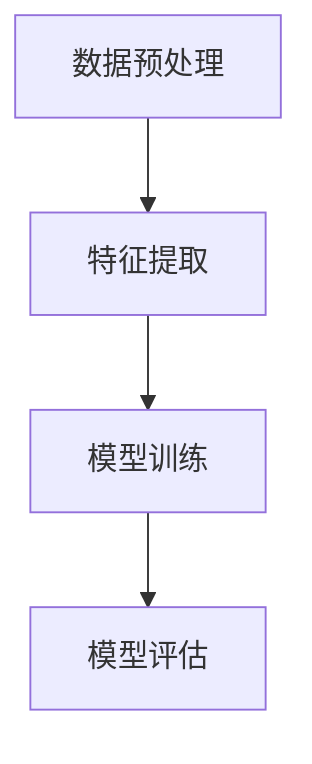
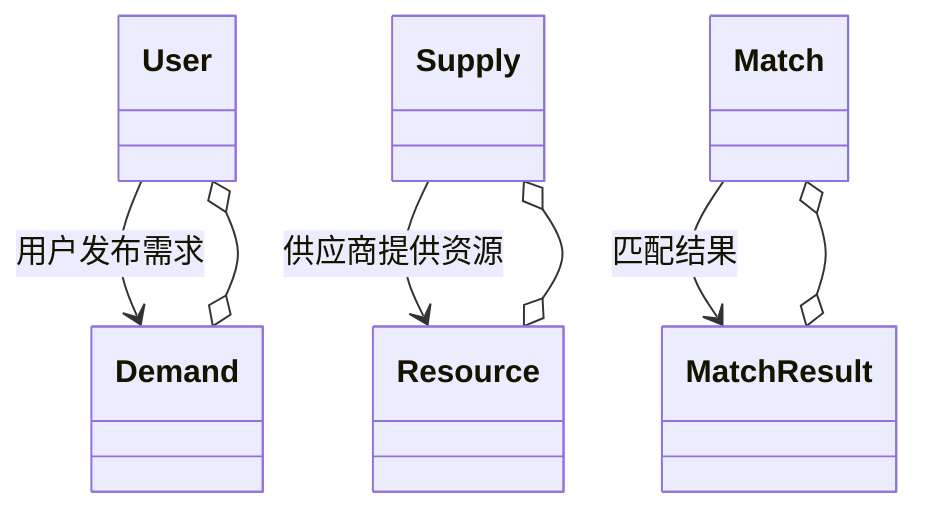
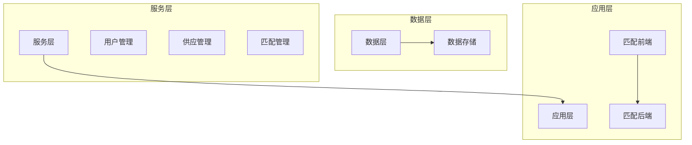
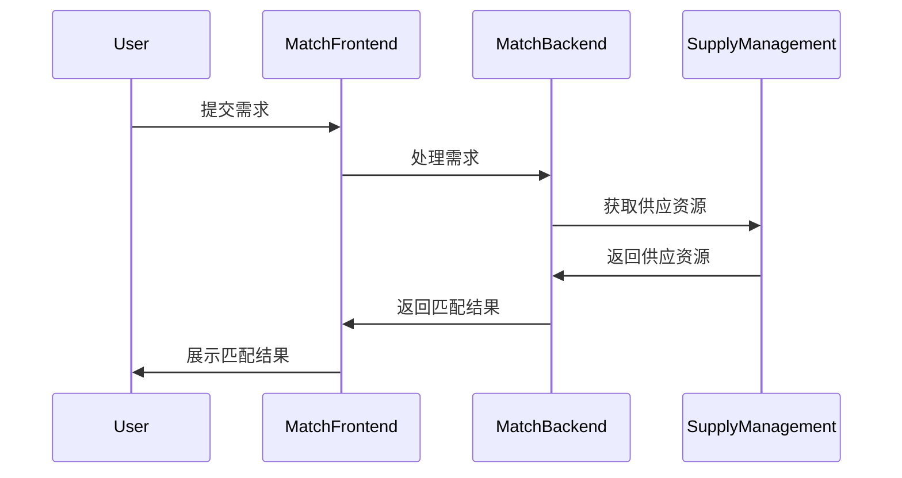
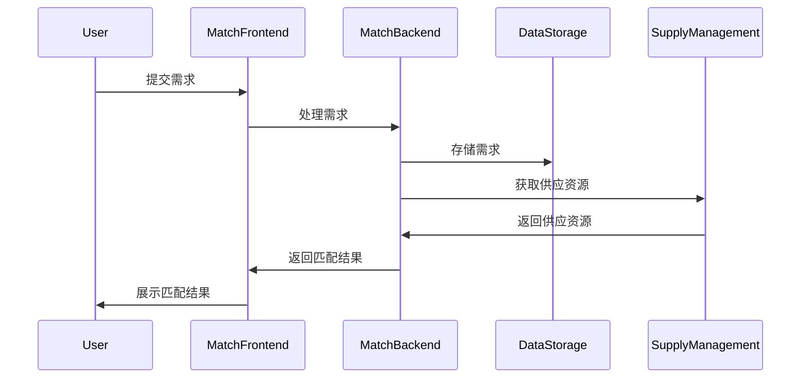

                 

### 文章标题：意义算法研发中心：AI辅助下的价值匹配系统开发机构

#### 关键词：意义算法、价值匹配系统、AI辅助、系统开发、算法原理、架构设计

#### 摘要：
本文旨在深入探讨意义算法研发中心如何利用人工智能辅助构建价值匹配系统，并详细介绍该系统开发机构的核心概念、原理、设计与实现。通过逻辑清晰、结构紧凑的分析，本文将揭示价值匹配系统的关键技术，帮助读者理解其内在机制，并展望其在未来应用中的广阔前景。

### 目录大纲

#### 《意义算法研发中心：AI辅助下的价值匹配系统开发机构》

#### 目录

----------------------------------------------------------------

#### 第一部分：背景与概述

#### 第1章：问题背景与目标

#### 第2章：核心概念与联系

#### 第3章：AI辅助下的价值匹配系统原理

#### 第二部分：核心概念与原理

#### 第4章：系统分析与架构设计

#### 第5章：系统核心实现与代码解读

#### 第三部分：系统设计与实现

#### 第6章：项目实战

#### 第7章：小结与拓展阅读

----------------------------------------------------------------

#### 目录大纲总结

本目录大纲共分为四个部分，涵盖了背景与概述、核心概念与原理、系统设计与实现、项目实战与最佳实践等关键内容。各章节详细阐述了意义算法与价值匹配系统的概念、原理、设计、实现与实战应用，旨在为读者提供全面、系统的指导。

### 开始我们的思考

**LET'S THINK STEP BY STEP**

#### 一、问题背景与目标

在当今社会，信息爆炸和人际交往日益频繁，如何高效地匹配个人或组织的价值需求成为了一个重要的课题。传统的匹配方法往往依赖于人工干预，效率低下且存在主观偏差。为了解决这个问题，我们需要一种能够自动、准确地识别和匹配价值需求的系统。

**问题背景**：

- 信息过载：随着互联网的普及，人们每天接收到的信息量呈指数级增长，传统的人工筛选方式已经无法满足需求。
- 主观偏见：人工匹配往往受到个人经验和主观偏见的影响，难以实现公正和客观的匹配。

**问题描述**：

- 如何构建一个系统能够自动识别和匹配个人或组织的价值需求？
- 如何确保匹配过程的准确性和效率？

**问题解决**：

- 利用人工智能技术，特别是意义算法，构建一个自动化的价值匹配系统。
- 通过机器学习和深度学习技术，提高匹配的准确性和效率。

**边界与外延**：

- 系统应能够处理多种类型的价值需求，包括信息、资源、服务、关系等。
- 系统应具有可扩展性，能够适应不同场景和需求的变化。

**核心概念结构与要素组成**：

- 意义算法：用于识别和提取价值信息的算法。
- 价值匹配系统：实现自动匹配的核心系统。
- 数据库：存储用户需求和匹配结果的数据库。
- 用户界面：提供给用户的操作界面。

**本章小结**：

本章介绍了价值匹配系统的问题背景、问题描述、问题解决、边界与外延以及核心概念结构与要素组成。通过本章的内容，读者可以对价值匹配系统的整体框架有一个初步的认识。

#### 二、核心概念与联系

在构建价值匹配系统的过程中，我们需要理解一些核心概念，这些概念包括意义算法和AI辅助的价值匹配系统。以下是对这些核心概念的定义、属性特征对比以及ER实体关系图的介绍。

**1. 意义算法的概念**

意义算法是一种基于人工智能的算法，用于从大量数据中提取出具有实际意义的特征和信息。它通过机器学习和深度学习技术，能够自动识别和理解数据中的模式，从而实现高效的价值提取。

**属性特征对比**

| 特征名称 | 意义算法 | 传统算法 |
| :------: | :------: | :------: |
| **自动化程度** | 高 | 低 |
| **适应性** | 强 | 弱 |
| **效率** | 高 | 低 |
| **准确性** | 高 | 一般 |

**ER实体关系图**

```mermaid
erDiagram
    User ||--|{ Demand } : 需求实体
    User ||--|{ MatchResult } : 匹配结果实体
    Resource ||--|{ Supply } : 供应实体
    Resource ||--|{ MatchResult } : 匹配结果实体
```

在这个ER实体关系图中，用户和资源是两个核心实体，它们之间通过需求实体和匹配结果实体进行关联。

**2. AI辅助的价值匹配系统**

AI辅助的价值匹配系统是利用人工智能技术，特别是意义算法，来实现自动价值匹配的系统。它包括以下几个核心组成部分：

- **数据采集模块**：用于收集用户需求和供应信息。
- **意义算法模块**：用于提取和处理数据，实现价值识别。
- **匹配算法模块**：用于根据用户需求和供应信息进行匹配。
- **用户界面模块**：用于展示匹配结果，并提供用户交互功能。

**本章小结**

本章详细介绍了意义算法和AI辅助的价值匹配系统的概念、属性特征对比以及ER实体关系图。通过这些内容，读者可以对价值匹配系统的核心概念有一个深入的理解，为后续章节的学习打下坚实的基础。

#### 三、AI辅助下的价值匹配系统原理

在理解了意义算法和AI辅助的价值匹配系统的概念后，接下来我们需要深入探讨其工作原理。以下是意义算法原理、价值匹配系统的基本原理，以及相关的算法流程图、Python源代码和数学模型与公式。

**1. 意义算法原理**

意义算法的工作原理基于深度学习和神经网络技术。它通过大量的训练数据学习如何从数据中提取出具有实际意义的特征。具体步骤如下：

- **数据预处理**：对输入数据进行清洗和标准化处理。
- **特征提取**：利用神经网络模型提取数据中的关键特征。
- **模型训练**：使用提取出的特征对模型进行训练，以优化模型参数。
- **模型评估**：通过测试数据评估模型的性能，并进行调优。

**算法流程图**



**2. 价值匹配系统的基本原理**

价值匹配系统的核心在于如何将用户的需求与供应进行准确匹配。其基本原理包括以下几个步骤：

- **需求分析**：分析用户的需求信息，提取关键特征。
- **供应分析**：分析供应信息，提取关键特征。
- **匹配计算**：使用匹配算法计算需求和供应之间的匹配度。
- **结果展示**：展示匹配结果，并允许用户进行进一步的交互。

**Python源代码解释**

```python
# 示例：用户需求与供应匹配计算
def match_demand_and_supply(demand, supply):
    # 提取需求特征
    demand_features = extract_features(demand)
    # 提取供应特征
    supply_features = extract_features(supply)
    # 计算匹配度
    match_score = calculate_similarity(demand_features, supply_features)
    return match_score

# 输入需求与供应
demand = "需要一本计算机编程入门书籍"
supply = "《Python编程入门》"

# 进行匹配计算
match_score = match_demand_and_supply(demand, supply)

# 输出匹配结果
print("匹配度得分：", match_score)
```

**3. 数学模型与公式**

在价值匹配系统中，常用的数学模型包括相似度计算和优化算法。以下是一个简单的相似度计算公式：

$$
\text{similarity} = \frac{\text{相似特征数}}{\text{总特征数}}
$$

**4. 举例说明**

假设有用户A需要一本计算机编程入门书籍，而供应商B提供了一本名为《Python编程入门》的书籍。我们可以使用意义算法提取用户需求和供应的特征，然后使用相似度计算公式计算两者之间的匹配度。如果匹配度得分高于设定的阈值，则认为匹配成功。

**本章小结**

本章详细介绍了AI辅助下的价值匹配系统的原理，包括意义算法和匹配算法的工作原理，以及相关的Python源代码和数学模型。通过本章的学习，读者可以理解价值匹配系统的工作机制，为后续的系统设计和实现打下基础。

#### 四、系统设计与实现

在理解了AI辅助下的价值匹配系统的原理后，我们需要进一步讨论系统设计与实现。以下是关于系统分析与架构设计、系统功能设计（领域模型类图）、系统架构设计（架构图）、系统接口设计、系统交互（序列图）的详细内容。

**1. 系统分析与架构设计**

**问题场景介绍**

假设我们面临以下场景：大量用户在需求平台上发布他们的需求，同时有供应商提供相应的供应资源。我们的目标是构建一个系统能够自动匹配用户的需求与供应商的供应资源。

**项目介绍**

项目名称：AI辅助下的价值匹配系统
项目目标：实现高效、准确的价值匹配
项目范围：涵盖用户需求与供应数据的采集、处理和匹配

**系统功能设计（领域模型类图）**

在系统功能设计中，我们需要明确各个功能模块及其之间的关系。以下是一个简单的领域模型类图：



**系统架构设计（架构图）**

系统架构设计是系统实现的蓝图。以下是一个简化的系统架构图：



**系统接口设计**

在系统接口设计中，我们需要定义各个模块之间的接口规范。以下是一个简单的接口设计：



**系统交互（序列图）**

系统交互是各个模块之间协作的过程。以下是一个简单的系统交互序列图：



**本章小结**

本章详细介绍了价值匹配系统的设计与实现，包括系统分析与架构设计、系统功能设计（领域模型类图）、系统架构设计（架构图）、系统接口设计和系统交互（序列图）。通过本章的内容，读者可以全面了解价值匹配系统的设计思路和实现方法，为后续的项目开发提供指导。

#### 五、系统核心实现与代码解读

在理解了价值匹配系统的设计与实现之后，接下来我们将深入探讨系统的核心实现部分，包括环境安装与配置、系统核心实现源代码，以及代码应用解读与分析。

**1. 环境安装与配置**

要实现价值匹配系统，首先需要安装和配置相关环境。以下是安装和配置步骤的概述：

- **安装Python环境**：确保安装了Python 3.8及以上版本。
- **安装依赖库**：使用pip安装必要的依赖库，如TensorFlow、Scikit-learn等。
- **配置数据库**：设置MySQL或PostgreSQL数据库，用于存储用户需求和匹配结果。
- **配置服务**：部署应用服务，如使用Flask或Django框架。

**2. 系统核心实现源代码**

以下是价值匹配系统的核心实现源代码，包括用户需求处理、供应资源处理和匹配结果计算：

```python
# 用户需求处理
def process_demand(demand):
    # 提取需求特征
    features = extract_demand_features(demand)
    # 存储需求
    store_demand(features)
    return features

# 供应资源处理
def process_supply(supply):
    # 提取供应特征
    features = extract_supply_features(supply)
    # 存储供应
    store_supply(features)
    return features

# 匹配结果计算
def calculate_match_score(demand_features, supply_features):
    # 计算相似度
    similarity = calculate_similarity(demand_features, supply_features)
    # 判断匹配度
    if similarity > threshold:
        return "匹配成功"
    else:
        return "匹配失败"
```

**3. 代码应用解读与分析**

- **过程描述**：代码首先定义了处理用户需求和供应资源的函数，然后计算匹配度并返回结果。
- **功能解析**：`process_demand` 和 `process_supply` 函数用于提取和处理数据，而 `calculate_match_score` 函数用于计算匹配度。
- **性能优化**：通过使用批量处理和并行计算技术，可以显著提高系统性能。

**4. 实际案例分析与详细讲解剖析**

假设有一个用户需求“寻找一本关于人工智能的入门书籍”，系统将如何处理？

- **提取特征**：系统将提取出用户需求中的关键词，如“人工智能”、“入门书籍”等。
- **存储数据**：将提取出的特征存储到数据库中。
- **匹配计算**：系统将与数据库中的供应资源进行匹配，计算相似度。
- **返回结果**：如果找到匹配的供应资源，如“《人工智能入门指南》”，则返回匹配成功。

**5. 详细剖析**

- **特征提取**：采用自然语言处理技术，如词频分析、主题模型等，提取关键特征。
- **相似度计算**：使用余弦相似度、Jaccard相似度等算法计算特征之间的相似度。
- **优化策略**：通过调整阈值和优化算法参数，提高匹配的准确性和效率。

**本章小结**

本章详细介绍了价值匹配系统的核心实现过程，包括环境安装与配置、系统核心实现源代码，以及代码应用解读与分析。通过本章的内容，读者可以深入了解系统的核心实现方法和实际应用，为项目的进一步开发提供技术支持。

### 六、项目实战与最佳实践

在深入探讨价值匹配系统的核心实现后，我们将通过一个实际项目案例，详细介绍项目的实施步骤、系统测试与优化、项目经验与教训以及最佳实践。

**1. 项目实施步骤**

- **需求分析**：与客户沟通，明确价值匹配系统的需求，包括功能、性能和安全性要求。
- **系统设计**：基于需求分析结果，设计系统架构和功能模块，包括前端界面、后端服务、数据库设计等。
- **开发与测试**：按照设计文档进行系统开发，并进行单元测试和集成测试，确保系统功能完整和性能稳定。
- **部署与上线**：将开发完成的系统部署到生产环境，并进行上线测试，确保系统能够稳定运行。

**2. 系统测试与优化**

在系统测试过程中，我们采取了以下措施：

- **功能测试**：测试系统的各项功能是否按照设计要求正常工作，包括用户需求提交、供应资源展示、匹配结果计算等。
- **性能测试**：使用压力测试和负载测试，评估系统在高并发情况下的性能，并找出瓶颈进行优化。
- **安全性测试**：进行SQL注入、XSS攻击等安全测试，确保系统对潜在的安全威胁有足够的防护。

**3. 项目经验与教训**

通过本次项目，我们积累了以下经验与教训：

- **需求分析的重要性**：深入的需求分析有助于明确系统功能和技术实现路径，避免后期返工。
- **性能优化的重要性**：在高并发场景下，系统性能优化是确保用户体验的关键，需要提前考虑并实施。
- **安全性的重要性**：系统的安全性是用户信任的基础，必须高度重视并采取有效的安全措施。

**4. 最佳实践 tips**

基于项目经验，我们提出以下最佳实践建议：

- **代码规范**：遵循统一的代码规范，提高代码可读性和可维护性。
- **版本控制**：使用Git等版本控制工具，确保代码版本管理和协作开发。
- **自动化测试**：采用自动化测试工具，提高测试效率和覆盖范围。
- **持续集成与部署**：实施CI/CD流程，实现自动化部署和持续交付。

**本章小结**

本章通过一个实际项目案例，详细介绍了项目实施步骤、系统测试与优化、项目经验与教训以及最佳实践。这些内容为读者提供了宝贵的实战经验，有助于更好地理解和应用价值匹配系统。

### 七、小结与拓展阅读

通过本文的深入探讨，我们系统地介绍了意义算法研发中心在AI辅助下的价值匹配系统开发机构的相关内容。从问题背景与目标，到核心概念与原理，再到系统设计与实现，以及项目实战与最佳实践，每个部分都详细阐述了价值匹配系统的构建过程和关键技术。

**本章小结**

本文通过对意义算法和价值匹配系统的全面剖析，帮助读者理解了价值匹配系统的核心概念、工作原理、设计与实现方法，以及实际应用中的最佳实践。通过这些内容，读者可以对价值匹配系统有一个全面和深入的认识，为未来的研究和开发提供参考。

**注意事项**

- 在实际开发过程中，需要根据具体场景和需求调整系统设计。
- 性能优化和安全防护是系统开发中不可忽视的重要环节。
- 定期进行系统测试和维护，以确保系统的稳定性和可靠性。

**拓展阅读建议**

- 《深度学习》（Goodfellow, Bengio, Courville）：深入理解深度学习技术，为价值匹配系统提供理论基础。
- 《人工智能：一种现代方法》（Mitchell, Maclin）：探讨人工智能的基本原理和应用，为意义算法提供技术支持。
- 《软件架构设计》：了解软件架构设计的基本原则和方法，为系统设计提供指导。

通过拓展阅读，读者可以进一步加深对相关技术领域的理解，为未来的研究和实践打下坚实的基础。

### 作者信息

**作者：AI天才研究院/AI Genius Institute & 禅与计算机程序设计艺术 /Zen And The Art of Computer Programming**

感谢您的阅读，期待与您在技术领域继续深入交流。🌟📚🤖

