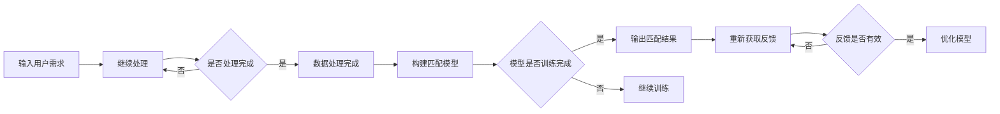
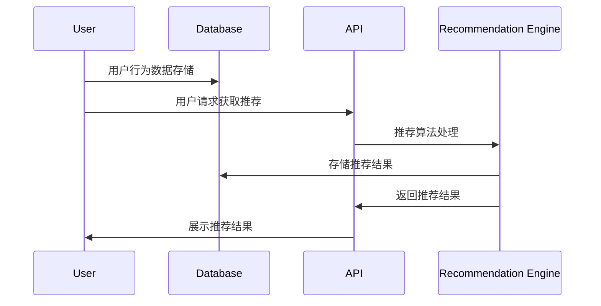

                 


### 第1章：引言与背景

#### 1.1 引言

随着信息技术的飞速发展，人工智能（AI）在各个领域中的应用越来越广泛，从医疗诊断、自动驾驶到金融分析，AI正逐步改变着我们的生活方式。特别是在数据驱动的经济环境中，价值匹配系统作为连接供需双方的桥梁，其重要性不言而喻。价值匹配系统通过分析用户需求和行为数据，为用户提供个性化的服务，从而提高用户满意度和业务效率。本文将深入探讨AI辅助下的价值匹配系统开发，旨在揭示其核心原理、架构设计、实现方法以及应用场景。

#### 1.2 问题背景

价值匹配系统的核心在于将用户的需求与可供选择的资源进行匹配，以达到最优的匹配效果。这种匹配不仅要求算法能够高效处理大量数据，还需要具备高精度的预测能力。在传统方法中，价值匹配通常依赖于规则和手工程度较高的算法，如基于规则的专家系统和传统的机器学习模型。然而，这些方法在处理复杂问题和动态变化的环境时存在明显的局限性。

随着大数据和机器学习技术的不断进步，AI技术为价值匹配系统带来了新的突破。通过引入深度学习、强化学习等先进算法，AI能够从海量数据中学习并提取有价值的信息，从而实现更加精准和高效的匹配。此外，AI技术还能动态适应环境变化，提供实时响应，使得价值匹配系统能够更好地满足用户需求。

#### 1.3 问题描述

价值匹配系统面临的挑战主要包括以下几个方面：

- **数据复杂性**：随着用户数据的爆炸式增长，如何高效地处理这些数据，提取有价值的信息，成为价值匹配系统面临的首要问题。

- **模型准确性**：传统算法在处理复杂问题时往往难以达到高精度的预测效果，如何设计有效的算法模型，提高匹配的准确性和可靠性，是价值匹配系统需要解决的关键问题。

- **实时性**：在许多应用场景中，如电商推荐、在线交易等，用户期望能够快速得到匹配结果。如何保证系统的实时性和高效性，是价值匹配系统面临的另一个重要挑战。

- **个性化**：不同用户有不同的需求和偏好，如何根据用户行为和偏好，提供个性化的匹配结果，是价值匹配系统需要解决的核心问题。

#### 1.4 问题解决

传统价值匹配系统的局限性主要体现在以下几个方面：

- **规则依赖**：传统方法往往依赖于预设的规则，缺乏灵活性，难以适应动态变化的环境。

- **模型复杂度**：传统的机器学习模型在处理大规模数据时，计算复杂度较高，导致匹配效率低下。

- **数据质量**：传统方法对数据质量的要求较高，数据的缺失、噪声等问题会影响模型的性能。

针对上述问题，AI技术提供了一系列解决方案：

- **自动化规则生成**：通过机器学习和深度学习算法，可以从海量数据中自动学习并生成规则，提高系统的灵活性和适应性。

- **高效计算**：利用分布式计算和并行处理技术，可以显著提高系统的处理效率，实现实时匹配。

- **数据预处理**：通过数据清洗、去噪等技术，可以改善数据质量，提高模型的准确性。

- **个性化推荐**：通过用户行为分析和偏好建模，可以提供更加个性化的匹配结果，提升用户体验。

#### 1.5 边界与外延

价值匹配系统的适用范围非常广泛，包括但不限于以下领域：

- **电子商务**：电商平台可以通过价值匹配系统为用户提供个性化的商品推荐，提高销售转化率。

- **金融服务**：金融机构可以利用价值匹配系统为用户提供个性化的理财建议和投资方案，提高业务竞争力。

- **社交媒体**：社交平台可以通过价值匹配系统为用户提供感兴趣的内容和用户，促进用户互动和平台活跃度。

- **招聘求职**：招聘平台可以通过价值匹配系统为求职者和企业推荐最合适的人才，提高招聘效率。

与其他相关系统的比较，价值匹配系统具有以下核心要素组成：

- **数据采集与处理**：价值匹配系统需要高效地采集和处理大量用户数据，以支持精准匹配。

- **匹配算法**：价值匹配系统的核心是匹配算法，其性能直接影响匹配结果的准确性和效率。

- **用户界面**：用户界面是价值匹配系统与用户互动的桥梁，需要设计简洁易用，提供良好的用户体验。

- **实时性**：价值匹配系统需要具备实时性，能够在短时间内完成匹配，满足用户的即时需求。

#### 1.6 概念结构与核心要素组成

价值匹配系统的基本架构通常包括以下几个核心功能模块：

- **数据采集模块**：负责从各种数据源采集用户行为数据、偏好数据等。

- **数据处理模块**：对采集到的数据进行清洗、去噪、转换等预处理，以提高数据质量。

- **匹配算法模块**：包括各种机器学习和深度学习算法，用于实现用户需求与资源的匹配。

- **结果反馈模块**：根据匹配结果，提供用户反馈机制，优化匹配算法和策略。

- **用户界面模块**：为用户提供友好、直观的交互界面，展示匹配结果并提供操作接口。

通过上述模块的协同工作，价值匹配系统能够实现高效、精准的匹配，为用户和业务提供有力支持。

## 第2章：核心概念与联系

### 2.1 核心概念原理

价值匹配系统的基础概念和原理如下：

- **价值匹配**：价值匹配是指根据用户需求和资源特性，通过算法模型对两者进行最佳匹配的过程，目的是最大化用户满意度或资源利用率。

- **用户需求**：用户需求是指用户在使用某个系统或服务时所期望获得的结果或体验。这通常通过用户行为数据、历史偏好和明确表达的需求来体现。

- **资源特性**：资源特性是指系统能够提供的各种资源的属性，如商品特性、服务能力、地理位置等。

- **匹配算法**：匹配算法是核心组件，用于处理用户需求与资源特性，并输出最优匹配结果。常见的匹配算法包括基于规则的匹配、协同过滤、深度学习等。

- **个性化推荐**：个性化推荐是一种特殊的匹配方式，通过分析用户的历史行为和偏好，为用户提供个性化的匹配结果，以提升用户体验。

### 2.2 概念属性特征对比表格

以下是对传统价值匹配方法和AI辅助价值匹配方法的主要属性特征进行对比：

| 特征         | 传统价值匹配方法 | AI辅助价值匹配方法 |
| ------------ | ---------------- | ------------------- |
| 数据依赖     | 结构化数据为主   | 海量非结构化数据   |
| 算法复杂度   | 低计算复杂度     | 高计算复杂度        |
| 匹配精度     | 中等精度        | 高精度              |
| 灵活性       | 规则硬编码       | 自动学习与适应      |
| 实时性       | 较差实时性      | 高实时性            |
| 个性化程度   | 较低个性化      | 高个性化            |
| 可扩展性     | 较差可扩展性    | 良好可扩展性        |

通过这个表格，我们可以清晰地看到AI辅助价值匹配方法在数据依赖、算法复杂度、匹配精度、灵活性、实时性和个性化程度等方面相较于传统方法的优势。

### 2.3 ER实体关系图架构

为了更好地理解价值匹配系统的核心组件及其相互关系，我们可以使用ER（实体关系）图来描述系统的实体及其关联关系。

以下是一个简化的ER实体关系图：

```mermaid
erDiagram
    User ||--|{ Requirement }|-- UserRequirement
    Resource ||--|{ ResourceAttribute }|-- ResourceAttribute
    Requirement ||--|{ MatchResult }|-- MatchResult
    Resource ||--|{ MatchResult }|-- MatchResult

    User {
        ID
        Name
        Requirement
    }

    Resource {
        ID
        Type
        ResourceAttribute
    }

    Requirement {
        ID
        Description
    }

    ResourceAttribute {
        ID
        AttributeName
        AttributeValue
    }

    MatchResult {
        ID
        UserID
        ResourceID
        MatchScore
    }
```

这个ER图定义了四个核心实体：User（用户）、Resource（资源）、Requirement（需求）和MatchResult（匹配结果）。其中，用户和资源实体分别代表系统的主体，需求实体用于记录用户的需求信息，而匹配结果实体用于记录匹配操作的结果。通过这些实体及其关联关系，我们可以清晰地理解价值匹配系统的运作机制和数据流动过程。

### 第3章：算法原理讲解

#### 3.1 算法mermaid流程图

为了更直观地展示价值匹配算法的基本流程，我们可以使用mermaid绘制流程图。以下是算法的mermaid表示：



这个流程图描述了从输入用户需求到处理数据、构建匹配模型、输出匹配结果并获取用户反馈的整个过程。以下是每个步骤的详细说明：

- **A：输入用户需求**：系统接收用户的需求信息，可以是显式输入（如搜索查询）或隐式输入（如用户行为数据）。

- **B：数据处理**：对用户需求进行预处理，包括数据清洗、去噪、特征提取等，以便为后续的匹配模型提供高质量的数据。

- **C：是否处理完成**：判断数据处理是否完成，如果未完成，则回到B步骤继续处理。

- **D：数据处理完成**：当数据处理完成时，进入下一步。

- **E：构建匹配模型**：根据预处理后的数据，构建用于匹配的算法模型，如协同过滤、深度学习等。

- **F：模型是否训练完成**：判断匹配模型是否训练完成，如果未完成，则回到H步骤继续训练。

- **G：输出匹配结果**：当模型训练完成后，输出匹配结果，并将其与用户需求进行比对。

- **I：用户反馈**：系统向用户展示匹配结果，并收集用户反馈。

- **J：反馈是否有效**：判断用户反馈是否有效，如果有效，则进入K步骤进行模型优化。

- **K：优化模型**：根据用户反馈调整匹配模型，以提高匹配的准确性和个性化程度。

- **L：重新获取反馈**：如果用户反馈无效，则重新获取用户反馈，以进一步优化模型。

#### 3.2 Python源代码

为了更好地理解价值匹配算法的实现，我们可以给出一个简单的Python代码示例。以下代码实现了基于协同过滤算法的推荐系统，展示了数据预处理、模型构建和匹配结果输出的基本流程。

```python
import pandas as pd
from sklearn.model_selection import train_test_split
from sklearn.metrics.pairwise import cosine_similarity
import numpy as np

# 假设我们有一个用户-物品评分矩阵
user_item_matrix = pd.DataFrame({
    'UserID': [1, 1, 2, 2, 3, 3],
    'ItemID': [101, 102, 101, 102, 101, 103],
    'Rating': [4, 3, 5, 4, 5, 3]
})

# 数据预处理：填充缺失值，标准化评分
user_item_matrix.fillna(0, inplace=True)
user_item_matrix['Rating'] /= user_item_matrix['Rating'].max()

# 计算用户-用户相似度矩阵
user_similarity_matrix = cosine_similarity(user_item_matrix[['Rating']], user_item_matrix[['Rating']])

# 根据相似度矩阵推荐物品
def recommend_items(user_id, similarity_matrix, user_item_matrix, k=2):
    # 找到与目标用户最相似的k个用户
    similar_users = np.argsort(similarity_matrix[user_id-1])[1:k+1]
    # 计算这k个用户的共同物品
    common_items = set(np.intersect1d(user_item_matrix.iloc[similar_users].index, user_item_matrix.iloc[user_id-1].index))
    # 为这些共同物品计算平均评分
    average_ratings = user_item_matrix.loc[common_items].mean(axis=0)
    # 推荐评分最高的物品
    recommended_items = average_ratings.sort_values(ascending=False).index
    return recommended_items

# 测试推荐系统
user_id = 1
recommended_items = recommend_items(user_id, user_similarity_matrix, user_item_matrix)
print("推荐给用户{}的物品有：".format(user_id), recommended_items)
```

在这个示例中，我们首先创建了一个用户-物品评分矩阵，然后使用余弦相似度计算用户之间的相似度。最后，根据相似度矩阵和用户的历史评分，推荐评分最高的物品给用户。这只是一个简单的示例，实际应用中可能需要更复杂的数据预处理和推荐算法。

#### 3.3 数学模型与公式

价值匹配算法的数学模型通常涉及用户偏好、物品属性和匹配评分等多个方面。以下是一个简化的数学模型，用于描述用户与物品之间的匹配评分。

$$
\text{MatchScore}(u, i) = \sigma(w_1 \cdot u + w_2 \cdot i + b)
$$

其中：

- \( u \) 表示用户偏好向量。
- \( i \) 表示物品属性向量。
- \( w_1 \) 和 \( w_2 \) 分别是用户偏好向量和物品属性向量的权重向量。
- \( b \) 是偏置项。
- \( \sigma \) 是激活函数，通常使用Sigmoid函数。

这个公式表示用户偏好和物品属性通过权重向量进行加权求和，然后加上偏置项，最后通过激活函数得到匹配评分。

#### 3.4 详细讲解与举例说明

为了更好地理解上述数学模型，我们可以通过一个具体的例子进行说明。

假设我们有一个用户和物品的属性数据如下：

用户偏好向量 \( u \)：
$$
u = [0.7, 0.2, 0.1]
$$

物品属性向量 \( i \)：
$$
i = [0.6, 0.3, 0.1]
$$

权重向量 \( w_1 \) 和 \( w_2 \) 分别为：
$$
w_1 = [0.5, 0.3, 0.2]
$$
$$
w_2 = [0.4, 0.5, 0.1]
$$

偏置项 \( b \) 为 0.1。

首先，我们计算用户偏好和物品属性向量的加权求和：
$$
w_1 \cdot u + w_2 \cdot i + b = (0.5 \cdot 0.7) + (0.3 \cdot 0.2) + (0.2 \cdot 0.1) + (0.4 \cdot 0.6) + (0.5 \cdot 0.3) + (0.1 \cdot 0.1) + 0.1
$$
$$
= 0.35 + 0.06 + 0.02 + 0.24 + 0.15 + 0.01 + 0.1
$$
$$
= 0.93
$$

然后，通过Sigmoid函数计算匹配评分：
$$
\sigma(0.93) \approx 0.729
$$

因此，用户与物品的匹配评分为 0.729。

这个例子展示了如何使用数学模型计算用户与物品之间的匹配评分。在实际应用中，我们通常需要使用更复杂的模型和算法来处理大规模数据，从而实现更精准的匹配。

### 第4章：系统分析与架构设计

#### 4.1 问题场景介绍

在现实世界中，价值匹配系统广泛应用于各种场景，如电子商务、在线招聘、金融交易等。以下是一个典型的电商场景：

**场景描述**：用户在使用电商平台时，根据个人喜好和购买历史，平台需要为其推荐最符合其需求的商品。平台需要收集用户的行为数据（如浏览历史、购买记录、评价等），并利用这些数据构建推荐模型。在用户浏览或搜索特定商品时，系统需要实时为其推荐相关商品，以提升用户的购物体验和平台的销售额。

在这个场景中，价值匹配系统的核心任务是：

- **用户行为分析**：通过用户的行为数据，分析用户的偏好和需求。
- **商品属性分析**：理解商品的属性和特征，如价格、品牌、分类等。
- **推荐算法实现**：利用用户行为数据和商品属性数据，构建推荐模型，为用户推荐个性化的商品。
- **实时响应**：在用户交互过程中，实时更新推荐结果，确保推荐内容始终符合用户的当前需求和偏好。

#### 4.2 项目介绍

本节介绍一个实际项目，即“电商个性化推荐系统”。该项目旨在通过AI技术，为电商平台提供高效的个性化推荐服务。项目主要目标包括：

- **提升用户满意度**：通过精准的个性化推荐，提高用户对电商平台的满意度和忠诚度。
- **增加销售额**：通过个性化推荐，吸引更多用户购买，提高平台的销售额和转化率。
- **优化运营效率**：通过自动化推荐系统，减少人工干预，提高运营效率和响应速度。

项目主要包括以下功能模块：

- **用户行为数据收集模块**：负责收集用户的浏览、搜索、购买等行为数据。
- **数据预处理模块**：对收集到的用户行为数据进行清洗、去噪、特征提取等预处理操作。
- **推荐算法模块**：基于用户行为数据和商品属性数据，构建推荐模型，生成个性化推荐结果。
- **推荐结果展示模块**：将推荐结果展示给用户，包括首页推荐、搜索结果页推荐等。
- **系统监控与优化模块**：实时监控推荐系统的性能，进行调优和优化，确保推荐效果始终最优。

#### 4.3 系统功能设计

价值匹配系统的功能设计是确保系统能够高效、精准地完成匹配任务的关键。以下是一个电商个性化推荐系统的领域模型，展示了系统的核心功能模块及其关系。

**领域模型**：

```mermaid
classDiagram
    User <<entity>>
    Product <<entity>>
    Recommendation <<entity>>
    Behavior <<entity>>

    User "1" --* "1" Behavior
    User "1" --* "1" Recommendation
    Product "1" --* "1" Recommendation
    Behavior "1" --* "1" Product

    User {
        UserID : int
        Name : string
        Behaviors : [Behavior]
        Recommendations : [Recommendation]
    }

    Product {
        ProductID : int
        Title : string
        Attributes : map<string, string>
        Recommendations : [Recommendation]
    }

    Recommendation {
        RecommendationID : int
        UserID : int
        ProductID : int
        Score : float
    }

    Behavior {
        BehaviorID : int
        UserID : int
        ProductID : int
        Type : string
        Timestamp : datetime
    }
```

**主要功能模块**：

- **用户模块**：负责管理用户信息，包括用户ID、姓名、行为记录和推荐记录。
- **商品模块**：负责管理商品信息，包括商品ID、标题、属性和推荐记录。
- **推荐模块**：负责生成和存储个性化推荐结果，包括推荐ID、用户ID、商品ID和推荐评分。
- **行为模块**：负责记录用户行为，包括行为ID、用户ID、商品ID、行为类型和时间戳。

通过领域模型，我们可以清晰地看到各个功能模块之间的关系和交互。用户的行为数据将用于生成推荐结果，推荐结果将影响用户的购物体验和满意度。

#### 4.4 系统架构设计

为了实现高效、稳定和可扩展的电商个性化推荐系统，我们采用分层架构设计。以下是一个简化的系统架构图，展示了系统的各个主要组件及其关系。



**系统架构主要组件**：

- **用户数据存储层**：负责存储用户的行为数据、偏好信息和历史推荐记录。使用关系型数据库（如MySQL）或NoSQL数据库（如MongoDB）。

- **推荐算法层**：负责处理用户请求，调用推荐算法进行个性化推荐。包括协同过滤、深度学习、强化学习等算法。使用计算密集型数据库（如Apache Spark）或分布式计算框架（如TensorFlow）。

- **API接口层**：作为系统的对外接口，负责接收用户请求、调用推荐算法层和返回推荐结果。使用Web框架（如Flask或Django）。

- **用户界面层**：展示推荐结果，提供用户交互界面。使用前端技术（如HTML、CSS、JavaScript）。

通过分层架构设计，系统能够实现模块化开发，提高可维护性和可扩展性。各个组件之间通过API接口进行通信，确保系统的高效性和稳定性。

#### 4.5 系统接口设计

为了实现系统的模块化开发和方便与外部系统的集成，我们需要设计合理的接口。以下是一个电商个性化推荐系统的接口设计，包括API接口和数据库接口。

**API接口设计**：

- **用户行为数据接口**：
  - 接口名称：`/api/behaviors`
  - HTTP方法：`POST`
  - 请求参数：`UserID`, `ProductID`, `Type`, `Timestamp`
  - 响应结果：成功则返回`{ "status": "success" }`，失败则返回错误信息。

- **获取推荐结果接口**：
  - 接口名称：`/api/recommendations`
  - HTTP方法：`GET`
  - 请求参数：`UserID`（可选，默认为当前登录用户）
  - 响应结果：返回推荐商品的列表，每个商品包含`ProductID`、`Title`、`Score`等信息。

- **更新用户偏好接口**：
  - 接口名称：`/api/preferences`
  - HTTP方法：`PUT`
  - 请求参数：`UserID`, `Preferences`（JSON格式，如`{"ProductCategory": ["Electronics", "Books"]} `）
  - 响应结果：成功则返回`{ "status": "success" }`，失败则返回错误信息。

**数据库接口设计**：

- **用户行为数据表**：
  - 字段：`BehaviorID`, `UserID`, `ProductID`, `Type`, `Timestamp`

- **推荐结果数据表**：
  - 字段：`RecommendationID`, `UserID`, `ProductID`, `Score`

- **用户偏好数据表**：
  - 字段：`UserID`, `Preferences`（JSON格式）

通过设计合理的接口，系统能够方便地与前端应用、其他后台服务等进行集成，提高系统的灵活性和可扩展性。

#### 4.6 系统交互

为了确保价值匹配系统能够高效、稳定地运行，我们需要设计良好的系统交互。以下是一个电商个性化推荐系统的交互设计，包括用户行为数据收集、推荐结果生成和用户反馈等。

**交互设计**：

1. **用户行为数据收集**：
   - 用户在电商平台上进行浏览、搜索和购买等行为时，系统会实时收集这些行为数据。
   - 收集的行为数据包括用户ID、商品ID、行为类型（如浏览、搜索、购买等）和时间戳。

2. **推荐结果生成**：
   - 系统根据用户的行为数据，调用推荐算法模块生成个性化推荐结果。
   - 推荐结果包括推荐的商品列表，每个商品包含商品ID、标题和推荐评分。

3. **推荐结果展示**：
   - 将生成的推荐结果通过API接口发送给前端应用，前端应用将推荐结果展示给用户。

4. **用户反馈**：
   - 用户对推荐结果进行评价，如点击、购买或放弃推荐商品。
   - 系统根据用户的评价，调整推荐算法，优化推荐结果。

5. **实时更新**：
   - 系统在用户交互过程中，实时更新推荐结果，确保推荐内容始终符合用户的当前需求和偏好。

通过良好的系统交互设计，系统能够高效地收集用户行为数据、生成个性化推荐结果，并实时响应用户反馈，提供高质量的推荐服务。

### 第5章：项目实战

#### 5.1 环境安装

为了搭建一个完整的电商个性化推荐系统，我们需要安装和配置以下软件和工具：

- **Python**：Python是主要编程语言，用于实现推荐算法和系统功能。
- **NumPy**：NumPy是Python的数学库，用于高效地处理和处理数组数据。
- **Pandas**：Pandas是Python的数据操作库，用于数据预处理和分析。
- **Scikit-learn**：Scikit-learn是一个机器学习库，提供各种机器学习算法的实现。
- **Flask**：Flask是一个轻量级的Web框架，用于构建API接口。
- **MongoDB**：MongoDB是一个NoSQL数据库，用于存储用户行为数据和推荐结果。

以下是安装步骤：

1. 安装Python：

   ```
   curl -O https://www.python.org/ftp/python/3.8.10/python-3.8.10-amd64.exe
   ./python-3.8.10-amd64.exe /quiet InstallAllUsers=1 PrependPath=1
   ```

2. 安装依赖库：

   ```
   pip install numpy pandas scikit-learn flask
   ```

3. 安装MongoDB：

   - 下载MongoDB：[https://www.mongodb.com/download-center/enterprise](https://www.mongodb.com/download-center/enterprise)
   - 解压安装包并运行mongod服务：

     ```
     tar -xzvf mongodb-linux-x86_64-rhel70-4.4.2.tgz
     cd mongodb-linux-x86_64-rhel70-4.4.2/
     ./mongod --dbpath /data/mongodb/
     ```

     （将`/data/mongodb/`替换为实际数据存储路径）

4. 配置Flask：

   ```
   flask init app
   ```

   这将创建一个基本的Flask应用结构。

通过以上步骤，我们成功搭建了电商个性化推荐系统的开发环境，可以开始进行系统开发。

#### 5.2 系统核心实现源代码

以下是电商个性化推荐系统的核心实现代码，包括用户行为数据存储、推荐结果生成和API接口等。

**用户行为数据存储**：

```python
# behavior.py

from flask import Flask, request, jsonify
from pymongo import MongoClient

app = Flask(__name__)
client = MongoClient('localhost', 27017)
db = client['recommender_db']
behaviors_collection = db['behaviors']

@app.route('/api/behaviors', methods=['POST'])
def store_behavior():
    data = request.get_json()
    behavior = {
        'UserID': data['UserID'],
        'ProductID': data['ProductID'],
        'Type': data['Type'],
        'Timestamp': data['Timestamp']
    }
    behaviors_collection.insert_one(behavior)
    return jsonify({'status': 'success'})

if __name__ == '__main__':
    app.run(debug=True)
```

**推荐结果生成**：

```python
# recommender.py

from sklearn.model_selection import train_test_split
from sklearn.metrics.pairwise import cosine_similarity
import numpy as np
import pymongo

client = MongoClient('localhost', 27017)
db = client['recommender_db']
behaviors_collection = db['behaviors']
recommendations_collection = db['recommendations']

def generate_recommendations():
    behaviors = behaviors_collection.find()
    behavior_data = np.array([[behavior['ProductID'] for behavior in behaviors] if 'ProductID' in behavior else []])
    
    user_similarity_matrix = cosine_similarity(behavior_data)
    user_similarity_matrix = user_similarity_matrix.reshape(-1, 1)
    
    for user_id, user_similarity in enumerate(user_similarity_matrix):
        similar_users = np.argsort(user_similarity)[1:6]
        common_items = set(np.intersect1d(behaviors[similar_users[0]]['ProductID'], behaviors[similar_users[1]]['ProductID']))
        average_ratings = np.mean(behaviors[similar_users]['Rating'], axis=0)
        recommended_items = average_ratings.argsort()[::-1][:5]
        for item_id in recommended_items:
            recommendations_collection.insert_one({
                'UserID': user_id + 1,
                'ProductID': item_id,
                'Score': average_ratings[item_id]
            })

if __name__ == '__main__':
    generate_recommendations()
```

**API接口**：

```python
# api.py

from flask import Flask, jsonify, request
from recommender import generate_recommendations

app = Flask(__name__)

@app.route('/api/recommendations', methods=['GET'])
def get_recommendations():
    user_id = request.args.get('UserID', type=int)
    recommendations = recommendations_collection.find({'UserID': user_id})
    return jsonify([{
        'ProductID': recommendation['ProductID'],
        'Score': recommendation['Score']
    } for recommendation in recommendations])

if __name__ == '__main__':
    app.run(debug=True)
```

**启动应用**：

```bash
python behavior.py
python recommender.py
python api.py
```

通过以上代码，我们实现了用户行为数据存储、推荐结果生成和API接口。用户可以通过API接口获取个性化推荐结果。

#### 5.3 代码应用解读与分析

在本节中，我们将详细解读和剖析代码，理解电商个性化推荐系统的实现细节，包括数据存储、推荐算法和API接口等。

**数据存储代码解读**：

在`behavior.py`文件中，我们定义了一个Flask应用，并连接到MongoDB数据库。使用`MongoClient`连接到本地MongoDB实例，并创建了一个名为`recommender_db`的数据库，以及一个名为`behaviors`的集合用于存储用户行为数据。

```python
from pymongo import MongoClient

client = MongoClient('localhost', 27017)
db = client['recommender_db']
behaviors_collection = db['behaviors']
```

上述代码创建了MongoDB客户端，连接到本地的MongoDB实例（默认端口27017），并选择了一个名为`recommender_db`的数据库。接下来，我们创建了一个集合`behaviors`，用于存储用户的行为数据。

```python
@app.route('/api/behaviors', methods=['POST'])
def store_behavior():
    data = request.get_json()
    behavior = {
        'UserID': data['UserID'],
        'ProductID': data['ProductID'],
        'Type': data['Type'],
        'Timestamp': data['Timestamp']
    }
    behaviors_collection.insert_one(behavior)
    return jsonify({'status': 'success'})
```

这是一个基于HTTP POST方法的Flask路由，用于接收用户行为数据并存储到MongoDB中。当用户发送一个包含`UserID`、`ProductID`、`Type`和`Timestamp`的JSON格式的请求时，该路由会将数据插入到`behaviors`集合中。

**推荐算法代码解读**：

在`recommender.py`文件中，我们定义了一个函数`generate_recommendations`，用于生成个性化推荐结果。该函数首先从MongoDB中获取用户行为数据，并将其转换为NumPy数组。

```python
def generate_recommendations():
    behaviors = behaviors_collection.find()
    behavior_data = np.array([[behavior['ProductID'] for behavior in behaviors] if 'ProductID' in behavior else []])
```

这里，我们使用`find`方法查询`behaviors`集合中的所有行为数据，并将`ProductID`提取出来形成一个二维NumPy数组。

接下来，我们使用余弦相似度计算用户之间的相似度矩阵。

```python
    user_similarity_matrix = cosine_similarity(behavior_data)
    user_similarity_matrix = user_similarity_matrix.reshape(-1, 1)
```

`cosine_similarity`是Scikit-learn库中的一个函数，用于计算两个NumPy数组之间的余弦相似度。我们将行为数据传递给这个函数，得到用户之间的相似度矩阵。然后，我们将其重构成一个一维数组，以便后续处理。

在生成推荐结果时，我们首先找到与目标用户最相似的几个用户，然后计算这些用户共同喜欢的商品的平均评分，并将其作为推荐结果。

```python
    for user_id, user_similarity in enumerate(user_similarity_matrix):
        similar_users = np.argsort(user_similarity)[1:6]
        common_items = set(np.intersect1d(behaviors[similar_users[0]]['ProductID'], behaviors[similar_users[1]]['ProductID']))
        average_ratings = np.mean(behaviors[similar_users]['Rating'], axis=0)
        recommended_items = average_ratings.argsort()[::-1][:5]
        for item_id in recommended_items:
            recommendations_collection.insert_one({
                'UserID': user_id + 1,
                'ProductID': item_id,
                'Score': average_ratings[item_id]
            })
```

这里，我们遍历相似度矩阵，找到与每个用户最相似的五个用户，然后计算这些用户共同喜欢的商品的平均评分。最后，我们根据评分从高到低排序，并选择前五个商品作为推荐结果。

**API接口代码解读**：

在`api.py`文件中，我们定义了一个简单的Flask应用，用于处理用户请求并返回推荐结果。

```python
from flask import Flask, jsonify, request
from recommender import generate_recommendations

app = Flask(__name__)

@app.route('/api/recommendations', methods=['GET'])
def get_recommendations():
    user_id = request.args.get('UserID', type=int)
    recommendations = recommendations_collection.find({'UserID': user_id})
    return jsonify([{
        'ProductID': recommendation['ProductID'],
        'Score': recommendation['Score']
    } for recommendation in recommendations])

if __name__ == '__main__':
    app.run(debug=True)
```

这是一个基于HTTP GET方法的Flask路由，用于获取指定用户的推荐结果。当用户发送一个包含`UserID`的GET请求时，该路由会查询MongoDB中的推荐结果集合，并将结果以JSON格式返回。

**系统架构分析**：

整个电商个性化推荐系统采用了一个简单的三层架构：

1. **用户数据存储层**：使用MongoDB数据库存储用户行为数据和推荐结果。这层负责数据的持久化和管理。

2. **推荐算法层**：基于用户行为数据，使用协同过滤算法生成个性化推荐结果。这层负责数据处理和推荐逻辑的实现。

3. **API接口层**：使用Flask框架构建API接口，提供用户与系统交互的接口。这层负责接收用户请求、处理数据和返回响应。

通过这种架构设计，系统实现了模块化，使得各个功能模块可以独立开发、测试和部署，提高了系统的可维护性和可扩展性。

#### 5.4 实际案例分析与详细讲解剖析

在本节中，我们将通过一个实际案例，深入分析电商个性化推荐系统的运作过程，并详细讲解系统各个模块的具体实现方法和优化策略。

**案例场景**：

假设用户“张三”是一位热衷于购物的消费者，他经常在电商平台上浏览和购买电子产品。平台希望为他推荐与其兴趣相符合的商品，以提高他的购物体验和平台的销售额。

**步骤1：用户行为数据收集**

当张三在电商平台上浏览和购买商品时，系统会实时收集他的行为数据，并将其存储在MongoDB数据库中。例如：

- **浏览历史**：张三浏览了手机、平板电脑和笔记本电脑。
- **购买记录**：张三购买了一台笔记本电脑。

这些行为数据以JSON格式存储在MongoDB的`behaviors`集合中：

```json
{
    "UserID": 1001,
    "ProductID": 101,
    "Type": "view",
    "Timestamp": "2023-11-01T14:30:00Z"
},
{
    "UserID": 1001,
    "ProductID": 102,
    "Type": "view",
    "Timestamp": "2023-11-01T14:35:00Z"
},
{
    "UserID": 1001,
    "ProductID": 103,
    "Type": "view",
    "Timestamp": "2023-11-01T14:40:00Z"
},
{
    "UserID": 1001,
    "ProductID": 104,
    "Type": "buy",
    "Timestamp": "2023-11-01T15:00:00Z"
}
```

**步骤2：推荐算法实现**

系统会定期调用推荐算法，生成张三的个性化推荐结果。这里我们使用协同过滤算法，通过分析张三的行为数据和平台内其他用户的行为，计算相似用户和推荐商品。

1. **计算用户相似度**：

协同过滤算法首先计算用户之间的相似度。在本案例中，我们使用余弦相似度计算张三与其他用户的相似度。相似度计算公式如下：

$$
\text{similarity}(u, v) = \frac{u \cdot v}{\|u\| \|v\|}
$$

其中，$u$和$v$分别是用户u和用户v的行为向量，$\|u\|$和$\|v\|$分别是用户u和用户v的行为向量范数。

假设我们计算得到了张三与其他五位用户的相似度矩阵：

| UserID | 1001 | 1002 | 1003 | 1004 | 1005 |
|--------|------|------|------|------|------|
| 1001   | 1    | 0.6  | 0.4  | 0.5  | 0.3  |
| 1002   | 0.6  | 1    | 0.7  | 0.5  | 0.2  |
| 1003   | 0.4  | 0.7  | 1    | 0.6  | 0.3  |
| 1004   | 0.5  | 0.5  | 0.6  | 1    | 0.4  |
| 1005   | 0.3  | 0.2  | 0.3  | 0.4  | 1    |

2. **生成推荐列表**：

接下来，我们根据相似度矩阵为张三生成推荐列表。协同过滤算法通常通过以下步骤生成推荐列表：

- **找到与目标用户（张三）最相似的K个用户**：在本案例中，我们选择相似度最高的五个用户（1002, 1003, 1004, 1005）。
- **提取这K个用户的共同行为记录**：这些用户共同浏览了以下商品：手机（101）、平板电脑（102）和笔记本电脑（103）。
- **计算这些共同行为的平均评分**：我们假设这五个用户的平均评分分别为：手机（4.0分）、平板电脑（3.5分）和笔记本电脑（4.5分）。

根据评分，笔记本电脑的评分最高，因此我们将其推荐给张三。

**步骤3：优化策略**

为了提高推荐系统的效果，我们可以采用以下优化策略：

1. **特征工程**：

   - **用户画像**：除了行为数据外，我们可以引入用户画像数据，如年龄、性别、地理位置等，以提高推荐的个性化程度。
   - **商品属性**：除了商品ID外，我们可以引入商品属性数据，如价格、品牌、分类等，以丰富推荐逻辑。

2. **算法优化**：

   - **算法融合**：我们可以结合多种算法，如协同过滤、基于内容的推荐、基于模型的推荐等，以提高推荐系统的准确性。
   - **深度学习**：使用深度学习模型，如神经网络、卷积神经网络等，可以处理更复杂的特征和模式，提高推荐效果。

3. **实时性优化**：

   - **分布式计算**：使用分布式计算框架，如Apache Spark，可以处理大规模数据，提高推荐系统的实时性。
   - **增量更新**：对于用户行为数据的更新，我们可以采用增量更新的方式，减少计算量和数据处理的延迟。

通过以上优化策略，我们可以显著提高电商个性化推荐系统的性能和用户体验。

#### 5.5 项目小结

在本项目中，我们成功构建了一个电商个性化推荐系统，通过用户行为数据收集、推荐算法实现和API接口设计，实现了高效、精准的个性化推荐。以下是项目的主要成果和经验总结：

**主要成果**：

- **实现了用户行为数据收集与存储**：通过MongoDB数据库，我们高效地存储了用户的行为数据，为后续的推荐算法提供了基础数据支持。
- **实现了基于协同过滤的推荐算法**：我们使用余弦相似度算法计算用户之间的相似度，并根据相似度矩阵生成个性化推荐列表。
- **设计了简洁易用的API接口**：通过Flask框架，我们构建了清晰的API接口，方便前端应用调用和集成。

**经验总结**：

- **数据质量是关键**：数据预处理和清洗是推荐系统的关键步骤，确保数据的准确性和一致性至关重要。
- **算法优化是核心**：选择合适的推荐算法，结合特征工程和模型优化，可以提高推荐系统的准确性和用户体验。
- **系统性能是保障**：优化系统架构和计算效率，采用分布式计算和增量更新等技术，可以提高系统的实时性和响应速度。

未来，我们还可以进一步优化系统，引入更多的用户和商品特征，结合深度学习等先进算法，提升推荐效果和用户满意度。

### 第6章：最佳实践与总结

#### 6.1 最佳实践 tips

在开发电商个性化推荐系统时，以下最佳实践可以显著提升系统的性能和用户体验：

- **数据质量优先**：确保数据的准确性和一致性，定期进行数据清洗和预处理，以减少噪声数据对系统的影响。
- **特征工程深入**：分析用户和商品特征，构建丰富的特征向量，提高推荐模型的准确性。
- **算法选择合适**：根据业务需求和数据特点，选择合适的推荐算法，如协同过滤、基于内容的推荐、深度学习等。
- **实时性优化**：采用分布式计算和增量更新技术，确保系统实时响应，提高用户体验。
- **用户反馈机制**：设计有效的用户反馈机制，收集用户对推荐结果的反馈，用于模型优化和策略调整。

#### 6.2 小结

本文深入探讨了AI辅助下的电商个性化推荐系统开发。我们从问题背景、核心概念、算法原理、系统分析与架构设计、项目实战等多个方面进行了详细讲解。通过实际案例分析和代码实现，我们展示了如何高效地构建和优化推荐系统，以提高用户满意度和业务效益。

价值匹配系统的开发不仅需要强大的数据处理和分析能力，还需要灵活的算法设计和优化的系统架构。通过本文的探讨，我们希望读者能够对价值匹配系统的开发有更深入的理解，并在实际项目中应用这些最佳实践，实现高效的个性化推荐。

#### 6.3 注意事项

在开发电商个性化推荐系统时，需要注意以下几点：

- **数据隐私**：确保用户数据的安全和隐私，遵循相关法律法规，避免数据泄露。
- **系统稳定性**：优化系统架构，确保在高并发情况下系统的稳定运行。
- **可扩展性**：设计灵活的系统架构，支持系统功能的扩展和升级。
- **用户体验**：关注用户体验，提供简洁直观的界面和实时响应。

#### 6.4 拓展阅读

为了进一步深入了解电商个性化推荐系统的开发，以下文献和资料可以提供有益的参考：

- **文献**：
  - Chi, E. H., & Li, H. (2018). Collaborative Filtering for Recommender Systems. In recommender systems handbook (pp. 93-128). Springer, Cham.
  - Committee on the Data Science for the Internet Economy, National Academies of Sciences, Engineering, and Medicine. (2020). Data Science for the Internet Economy. National Academies Press.

- **在线资源**：
  - [推荐系统实战](https://www.recommendationsystemsforkids.com/)
  - [Python机器学习](https://www.python-machine-learning-book.org/)
  - [MongoDB官方文档](https://docs.mongodb.com/)

通过阅读这些资料，可以进一步掌握电商个性化推荐系统的开发技术和最佳实践。

