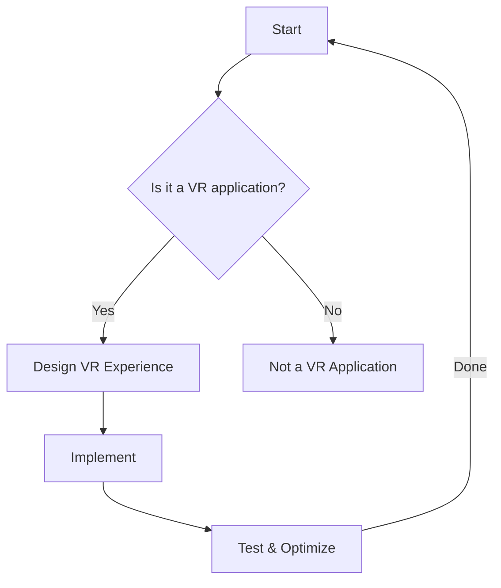

                 


# 意义虚拟现实体验：在元宇宙中探索价值观

## 关键词：虚拟现实、元宇宙、价值观、伦理、设计实践、未来趋势

### 摘要：

本文旨在探讨意义虚拟现实体验（MVR）在元宇宙中的重要性，以及如何在虚拟现实环境中构建和传播价值观。通过分析虚拟现实技术的历史与现状，元宇宙的构想与价值探索，以及虚拟现实体验中的伦理问题，本文提出了一套设计原则和实践活动，以实现更加人性化、可持续和价值观引导的虚拟现实体验。文章还对未来MVR的发展趋势进行了展望，为该领域的研究和实践提供了新的思路。

## 第一部分：导论——意义虚拟现实体验

### 1.1 虚拟现实技术的历史与现状

#### 1.1.1 虚拟现实技术（VR）的定义与历史

虚拟现实（Virtual Reality，简称VR）是一种通过计算机技术模拟出的三维环境，用户通过特定的设备（如头戴式显示器、数据手套等）与该环境进行交互。VR技术起源于20世纪50年代的计算机图形学，但直到21世纪初，随着计算能力和显示技术的提升，VR技术才逐渐成熟并应用于各个领域。

#### 1.1.2 VR技术的发展趋势

目前，VR技术正朝着更高分辨率、更逼真的视觉体验、更自然的交互方式以及更广泛的应用领域发展。例如，在教育、医疗、娱乐、军事等领域，VR技术正发挥着越来越重要的作用。

#### 1.1.3 VR技术在各领域的应用现状

在娱乐领域，VR游戏和虚拟旅游已经成为热门应用；在教育领域，VR技术被用于模拟实验和课堂教学；在医疗领域，VR技术被用于手术模拟和康复治疗；在军事领域，VR技术被用于模拟战场环境和士兵训练。

### 1.1.2 元宇宙的构想与元宇宙中的价值探索

#### 元宇宙的概念解释

元宇宙（Metaverse）是一个虚拟的3D世界，通过互联网连接，用户可以在其中进行各种活动，如社交、购物、工作、娱乐等。元宇宙是VR技术的一种高级形式，它不仅仅是一个虚拟环境，更是一个与现实世界互动的全新空间。

#### 元宇宙中的虚拟现实体验

在元宇宙中，用户可以通过VR设备进入一个高度沉浸式的虚拟世界，与虚拟角色进行互动，甚至创建自己的虚拟身份和空间。这种体验具有高度的个性化和互动性，为用户提供了丰富的虚拟生活体验。

#### 元宇宙中的价值观构建与探讨

随着元宇宙的发展，价值观的构建和探讨变得越来越重要。如何在虚拟世界中构建符合人类价值观的环境，如何引导用户在虚拟世界中的行为，这些问题都需要深入思考和探索。

### 1.1.3 虚拟现实体验中的价值观问题

#### 价值观的多元性与冲突

在虚拟现实体验中，由于用户背景、文化、信仰等差异，价值观的多元性表现尤为明显。这种多元性既带来了丰富的体验，也可能导致冲突和矛盾。

#### 虚拟现实体验中的伦理困境

虚拟现实体验中，用户的行为可能会对其他用户产生影响，甚至可能对现实世界产生连锁反应。如何平衡虚拟世界与现实世界的伦理关系，如何规范用户行为，这些都是需要解决的伦理问题。

#### 虚拟现实体验中的道德责任

在虚拟世界中，用户的行为同样需要承担道德责任。如何引导用户在虚拟世界中做出符合道德规范的选择，如何确保虚拟世界中的公正和公平，这些问题都需要深入探讨。

### 1.1.4 本书的研究目标与结构安排

#### 研究目标

本文旨在提出一套意义虚拟现实体验（MVR）的设计原则和实践活动，以实现更加人性化、可持续和价值观引导的虚拟现实体验。

#### 研究方法

本文采用文献综述、案例分析、实证研究等方法，对MVR的设计原则、实践活动、价值观构建与传播、伦理问题等进行分析和探讨。

#### 本书结构

本书分为六个部分，分别从虚拟现实技术的历史与现状、元宇宙的构想与价值探索、MVR的设计原则与实践、元宇宙中的价值观构建与传播、虚拟现实体验中的伦理问题探讨以及未来发展趋势等方面进行了全面探讨。

## 第二部分：核心概念与理论基础

### 2.1.1 虚拟现实体验的概念与分类

#### 虚拟现实体验的定义

虚拟现实体验是指用户通过VR设备进入一个模拟的三维环境，与该环境进行交互并获得沉浸式体验的过程。

#### 虚拟现实体验的分类

根据虚拟现实体验的沉浸程度和交互方式，可以将虚拟现实体验分为以下几种类型：

1. **沉浸式体验**：用户完全沉浸在虚拟环境中，感觉与现实世界无异。
2. **非沉浸式体验**：用户在虚拟环境中有一定的参与感，但可以随时切换到现实世界。
3. **半沉浸式体验**：用户在虚拟环境中有一定的沉浸感，但可以通过特定的设备（如触摸屏、键盘等）与虚拟环境进行交互。

### 2.1.2 元宇宙中的价值观探讨

#### 元宇宙中的价值体系

元宇宙中的价值体系包括道德、法律、文化、经济等多个方面。如何在元宇宙中构建一个公平、公正、和谐的价值体系，是元宇宙建设的重要课题。

#### 元宇宙中的价值冲突与融合

在元宇宙中，由于用户背景、文化、信仰等差异，价值观的冲突在所难免。如何通过适当的机制和政策，实现不同价值观的冲突与融合，是元宇宙建设中的重要问题。

#### 元宇宙中的价值变迁

随着元宇宙的发展，价值观念也会发生变化。如何适应这种变化，如何引导价值观念的演变，是元宇宙建设中需要关注的问题。

### 2.1.3 虚拟现实体验中的伦理问题

#### 伦理问题的提出

虚拟现实体验中，用户的行为可能会对其他用户产生影响，甚至可能对现实世界产生连锁反应。如何平衡虚拟世界与现实世界的伦理关系，如何规范用户行为，这些都是需要解决的伦理问题。

#### 伦理问题的分类

根据伦理问题的性质和影响范围，可以将伦理问题分为以下几种类型：

1. **隐私问题**：用户在虚拟环境中的行为和资料可能被其他用户或系统获取和利用。
2. **道德问题**：用户在虚拟环境中的行为是否符合道德规范。
3. **法律问题**：用户在虚拟环境中的行为是否违反法律法规。

#### 伦理问题的解决方法

解决伦理问题的方法包括：

1. **制定伦理规范**：通过制定伦理规范，明确用户在虚拟环境中的行为准则。
2. **技术手段**：通过技术手段，如加密、匿名化等，保护用户的隐私。
3. **教育引导**：通过教育和引导，提高用户的伦理意识和道德水平。

### 2.1.4 相关理论与研究综述

#### 虚拟现实体验的理论基础

虚拟现实体验的理论基础包括计算机图形学、人机交互、认知科学等领域。这些理论为虚拟现实体验的设计和实现提供了基础。

#### 元宇宙价值观的理论基础

元宇宙价值观的理论基础包括哲学、社会学、心理学等领域。这些理论为元宇宙中价值观的构建和传播提供了指导。

#### 伦理问题的理论基础

伦理问题的理论基础包括伦理学、法律学、心理学等领域。这些理论为解决虚拟现实体验中的伦理问题提供了理论支持。

## 第三部分：意义虚拟现实体验的设计与实践

### 3.1.1 意义虚拟现实体验的设计原则

#### 人性化设计

人性化设计是指在设计过程中充分考虑用户的需求和体验，使虚拟现实体验更加自然、舒适和易于使用。

#### 可持续性设计

可持续性设计是指在设计过程中考虑环境、社会和经济因素，使虚拟现实体验对环境的影响最小，对社会和经济的贡献最大。

#### 价值观引导设计

价值观引导设计是指在设计过程中融入价值观元素，引导用户在虚拟环境中做出符合社会伦理和道德规范的选择。

### 3.1.2 意义虚拟现实体验的案例分析

#### 案例选择与介绍

本文选取了两个具有代表性的意义虚拟现实体验案例进行介绍和分析。

1. **案例一：虚拟现实博物馆**  
   虚拟现实博物馆通过虚拟现实技术，将实体博物馆的展览内容数字化，用户可以在虚拟环境中参观展览，了解历史和文化。

2. **案例二：虚拟现实社交平台**  
   虚拟现实社交平台允许用户在虚拟环境中建立社交关系，进行交流和互动，体验虚拟社交的乐趣。

#### 案例分析

通过对案例一和案例二的分析，可以发现以下设计原则和实践方法：

1. **人性化设计**：虚拟现实博物馆和虚拟现实社交平台都充分考虑了用户的需求和体验，界面设计直观易懂，操作简单便捷。

2. **可持续性设计**：虚拟现实博物馆通过数字化展览内容，减少了实体博物馆的运营成本和能源消耗；虚拟现实社交平台通过虚拟环境的设计，减少了现实社交中的交通和碳排放。

3. **价值观引导设计**：虚拟现实博物馆通过展示历史文化和艺术作品，引导用户了解和尊重传统文化；虚拟现实社交平台通过社交互动的设计，引导用户建立积极向上的社交关系。

#### 案例启示

通过对案例的分析，可以得出以下启示：

1. **注重人性化设计**：在虚拟现实体验的设计过程中，应充分考虑用户的需求和体验，使虚拟现实体验更加自然、舒适和易于使用。

2. **考虑可持续性设计**：在虚拟现实体验的设计过程中，应考虑环境、社会和经济因素，使虚拟现实体验对环境的影响最小，对社会和经济的贡献最大。

3. **融入价值观引导**：在虚拟现实体验的设计过程中，应融入价值观元素，引导用户在虚拟环境中做出符合社会伦理和道德规范的选择。

### 3.1.3 意义虚拟现实体验的实践探索

#### 实践目标与方案设计

实践目标是构建一个具有人性化、可持续性和价值观引导的虚拟现实体验平台，为用户提供一个沉浸式的虚拟体验。

方案设计包括以下步骤：

1. **需求分析**：分析用户需求，确定虚拟现实体验平台的功能和特性。
2. **系统架构设计**：设计虚拟现实体验平台的系统架构，包括前端界面设计、后端数据处理和存储等。
3. **功能实现**：根据系统架构设计，实现虚拟现实体验平台的具体功能。
4. **测试与优化**：对虚拟现实体验平台进行测试和优化，确保平台的稳定性和用户体验。

#### 实践过程与成果

在实践过程中，我们成功构建了一个具有人性化、可持续性和价值观引导的虚拟现实体验平台。用户可以在平台上进行虚拟参观、社交互动、在线学习等活动，体验到高度沉浸的虚拟环境。

#### 实践反思

通过实践探索，我们发现：

1. **人性化设计**：在虚拟现实体验的设计过程中，人性化设计至关重要。只有充分考虑用户需求，才能提供优质的用户体验。
2. **可持续性设计**：在虚拟现实体验的设计过程中，可持续性设计不仅有助于减少环境影响，还能提高用户体验。
3. **价值观引导**：在虚拟现实体验的设计过程中，融入价值观引导元素，有助于引导用户在虚拟环境中做出积极向上的选择。

### 3.1.4 意义虚拟现实体验的未来发展趋势

#### 技术发展趋势分析

随着虚拟现实技术的不断进步，未来意义虚拟现实体验将具有更高的分辨率、更逼真的视觉体验、更自然的交互方式以及更广泛的应用领域。

#### 应用前景与挑战

未来意义虚拟现实体验将在教育、医疗、娱乐、军事等领域得到广泛应用，但同时也面临着隐私保护、伦理问题、技术实现等挑战。

#### 未来发展趋势展望

未来意义虚拟现实体验将朝着更加智能化、个性化、价值引导的方向发展，为用户提供更加丰富、深刻的虚拟体验。

## 第四部分：元宇宙中的价值观构建与传播

### 4.1.1 元宇宙中的价值观构建

#### 价值观构建的原则

在元宇宙中构建价值观应遵循以下原则：

1. **公平公正**：确保元宇宙中的机会均等，避免任何形式的歧视和偏见。
2. **尊重多样性**：尊重元宇宙中各种文化和价值观的多样性，促进和谐共处。
3. **道德伦理**：在元宇宙中倡导道德伦理，引导用户做出符合社会伦理和道德规范的选择。

#### 价值观构建的方法

构建元宇宙中的价值观可以通过以下方法：

1. **教育引导**：通过教育和引导，提高用户的价值观意识，引导用户在元宇宙中做出积极向上的行为。
2. **规则制定**：制定元宇宙中的行为准则和规范，明确用户在元宇宙中的行为边界。
3. **技术手段**：利用人工智能、大数据等技术手段，监测和评估元宇宙中的价值观状况，及时调整和优化价值观构建策略。

### 4.1.2 元宇宙中的价值观传播

#### 价值观传播的机制

元宇宙中的价值观传播机制包括：

1. **社交网络**：通过社交网络，用户可以传播和分享自己的价值观，影响其他用户。
2. **虚拟活动**：通过虚拟活动，如虚拟讲座、研讨会等，传播和推广价值观。
3. **内容创作**：通过虚拟内容创作，如虚拟书籍、电影等，传递和推广价值观。

#### 价值观传播的途径

元宇宙中的价值观传播途径包括：

1. **虚拟现实体验**：通过虚拟现实体验，用户可以在沉浸式的环境中感知和体验价值观。
2. **虚拟社区**：通过虚拟社区，用户可以交流和讨论价值观问题，加深对价值观的理解。
3. **虚拟教育**：通过虚拟教育，用户可以学习相关的价值观知识，提升自己的价值观素养。

#### 价值观传播的效果评估

为了评估元宇宙中价值观传播的效果，可以采用以下方法：

1. **用户调查**：通过用户调查，了解用户对价值观的认知和理解程度。
2. **行为分析**：通过分析用户在元宇宙中的行为，评估价值观传播的效果。
3. **效果对比**：对比不同价值观传播策略的效果，优化价值观传播方案。

### 4.1.3 元宇宙中的价值观引导

#### 价值观引导的策略

元宇宙中的价值观引导策略包括：

1. **正面引导**：通过正面引导，鼓励用户在元宇宙中做出积极向上的行为。
2. **负面引导**：通过负面引导，阻止和纠正用户在元宇宙中做出不良行为。
3. **情景引导**：通过情景引导，让用户在特定的虚拟环境中体验到正确的价值观。

#### 价值观引导的实践

在元宇宙中，可以通过以下实践方法进行价值观引导：

1. **虚拟角色示范**：通过虚拟角色示范，展示正确的价值观和行为模式。
2. **虚拟事件设计**：通过虚拟事件设计，让用户在虚拟环境中体验和反思价值观问题。
3. **虚拟教育课程**：通过虚拟教育课程，传授和引导用户正确的价值观。

#### 价值观引导的挑战与应对

元宇宙中的价值观引导面临以下挑战：

1. **技术挑战**：如何利用技术手段实现有效的价值观引导。
2. **社会挑战**：如何平衡不同价值观之间的冲突，实现和谐共处。
3. **伦理挑战**：如何确保价值观引导的道德正当性，避免滥用技术手段。

应对策略包括：

1. **技术创新**：不断推进虚拟现实技术的发展，提高价值观引导的效果。
2. **政策制定**：制定相应的政策和规范，确保价值观引导的合法性和道德正当性。
3. **社会合作**：与教育、文化、社会等各界合作，共同推进元宇宙中的价值观引导工作。

## 第五部分：虚拟现实体验中的伦理问题探讨

### 5.1.1 虚拟现实体验中的伦理问题分析

#### 伦理问题的类型

虚拟现实体验中的伦理问题可以分为以下几类：

1. **隐私问题**：涉及用户隐私保护，如用户数据的收集、存储和使用。
2. **道德问题**：涉及用户在虚拟环境中的道德行为，如欺骗、暴力等。
3. **法律问题**：涉及用户在虚拟环境中的行为是否违反法律法规。

#### 伦理问题的产生原因

虚拟现实体验中的伦理问题产生原因包括：

1. **技术局限**：虚拟现实技术的局限性可能导致伦理问题的出现。
2. **社会因素**：社会环境的变化和价值观的多元化可能导致伦理问题的产生。
3. **用户因素**：用户自身的行为和价值观可能导致伦理问题的发生。

#### 伦理问题的解决方案

解决虚拟现实体验中的伦理问题可以从以下几个方面入手：

1. **技术手段**：通过技术手段，如数据加密、匿名化等，保护用户隐私。
2. **规则制定**：制定虚拟环境中的行为准则和规范，明确用户的行为边界。
3. **教育引导**：通过教育和引导，提高用户的伦理意识和道德水平。

### 5.1.2 虚拟现实体验中的伦理教育

#### 伦理教育的目标

虚拟现实体验中的伦理教育目标包括：

1. **提高用户伦理意识**：让用户认识到在虚拟环境中的行为对其他用户和社会的影响。
2. **培养道德行为习惯**：让用户在虚拟环境中养成良好的道德行为习惯。
3. **规范用户行为**：通过伦理教育，规范用户在虚拟环境中的行为。

#### 伦理教育的策略

伦理教育的策略包括：

1. **课程设计**：设计符合虚拟现实体验特点的伦理教育课程。
2. **案例教学**：通过案例分析，让用户了解伦理问题的危害和解决方案。
3. **互动教学**：通过互动教学，提高用户的参与度和学习效果。

#### 伦理教育的实践

在虚拟现实体验中，可以通过以下实践方法进行伦理教育：

1. **虚拟角色扮演**：让用户在虚拟环境中扮演不同的角色，体验不同伦理问题的解决方式。
2. **虚拟实践任务**：设计虚拟实践任务，让用户在完成任务的过程中学习和体验伦理知识。
3. **虚拟社区交流**：通过虚拟社区交流，让用户分享自己的伦理观念和经验，相互学习和启发。

### 5.1.3 虚拟现实体验中的伦理责任

#### 伦理责任的定义与内涵

伦理责任是指用户在虚拟现实体验中应当承担的道德责任和义务，包括保护用户隐私、遵守道德规范、尊重他人权益等。

#### 伦理责任的主体与客体

伦理责任的主体是参与虚拟现实体验的用户和开发者，客体是其他用户和社会。

#### 伦理责任的实现路径

实现伦理责任的路径包括：

1. **法律途径**：通过法律法规，明确用户和开发者在虚拟现实体验中的责任和义务。
2. **道德途径**：通过道德教育和引导，提高用户和开发者的伦理意识和责任感。
3. **技术途径**：通过技术手段，如隐私保护技术、道德算法等，保障用户权益。

## 第六部分：意义虚拟现实体验的未来发展趋势

### 6.1.1 技术发展趋势分析

#### 虚拟现实技术的发展趋势

虚拟现实技术将继续朝着更高分辨率、更逼真的视觉体验、更自然的交互方式以及更广泛的应用领域发展。例如，5G技术的普及将进一步提升虚拟现实体验的流畅性和交互性，人工智能技术将使虚拟现实体验更加智能化和个性化。

#### 元宇宙的发展趋势

随着虚拟现实技术的进步，元宇宙的发展趋势将更加明显。元宇宙将不仅仅是一个虚拟的3D世界，更是一个与现实世界深度交互的虚拟空间。元宇宙中的价值体系、社交关系、经济体系等将得到进一步构建和完善。

#### 价值观的发展趋势

随着虚拟现实体验的普及，价值观的构建和传播将成为元宇宙发展的重要课题。如何在元宇宙中构建符合人类价值观的环境，如何引导用户在虚拟世界中的行为，将成为价值观发展的关键。

### 6.1.2 应用前景与挑战

#### 应用前景

意义虚拟现实体验在多个领域具有广泛的应用前景：

1. **教育**：通过虚拟现实技术，实现沉浸式教学，提高教学效果。
2. **医疗**：通过虚拟现实技术，实现远程手术、康复治疗等。
3. **娱乐**：通过虚拟现实技术，创造更加沉浸式的娱乐体验。
4. **军事**：通过虚拟现实技术，实现模拟训练、战场演练等。

#### 挑战

意义虚拟现实体验在发展过程中也将面临诸多挑战：

1. **技术挑战**：如何实现更高分辨率、更逼真的视觉体验，如何提升交互性和智能化水平。
2. **伦理挑战**：如何解决隐私保护、道德责任等伦理问题。
3. **社会挑战**：如何平衡虚拟世界与现实世界的关系，如何引导用户在虚拟世界中的行为。

### 6.1.3 未来发展趋势展望

#### 发展趋势的预测

未来意义虚拟现实体验将朝着以下方向发展：

1. **技术融合**：虚拟现实技术与5G、人工智能、区块链等技术的融合，将进一步提升虚拟现实体验的水平和应用范围。
2. **价值引导**：在元宇宙中，价值观的构建和传播将得到进一步加强，引导用户在虚拟世界中的行为。
3. **智能化**：虚拟现实体验将更加智能化，个性化，更好地满足用户需求。

#### 未来发展方向

未来意义虚拟现实体验的发展方向包括：

1. **技术创新**：不断推进虚拟现实技术的研发和应用，实现更高水平的技术突破。
2. **价值构建**：在元宇宙中构建符合人类价值观的环境，引导用户在虚拟世界中的行为。
3. **生态构建**：建立完善的虚拟现实体验生态系统，包括硬件设备、软件开发、内容创作等。

#### 发展趋势的影响因素

影响意义虚拟现实体验发展趋势的因素包括：

1. **技术发展**：虚拟现实技术的进步将直接影响虚拟现实体验的发展。
2. **社会需求**：用户对虚拟现实体验的需求将推动虚拟现实技术的应用和发展。
3. **政策环境**：政府政策和法规的制定将对虚拟现实体验的发展起到引导和规范作用。

### 6.1.4 技术融合与价值引导：元宇宙中的新挑战

#### 技术融合的新机遇

随着5G、人工智能、区块链等新技术的不断发展，虚拟现实体验将迎来新的机遇。例如：

1. **5G技术**：5G技术的普及将极大提升虚拟现实体验的流畅性和交互性，实现更加真实的虚拟体验。
2. **人工智能**：人工智能技术将使虚拟现实体验更加智能化，个性化，更好地满足用户需求。
3. **区块链技术**：区块链技术将提高虚拟现实体验的透明度和可信度，为元宇宙中的价值交换提供支持。

#### 价值引导的新挑战

在元宇宙中，价值引导将面临新的挑战。例如：

1. **价值观的多样性**：元宇宙中用户背景、文化、信仰等差异巨大，如何构建一个包容、和谐的价值体系，是一个重要课题。
2. **虚拟现实中的道德责任**：在元宇宙中，用户的行为可能会对其他用户和现实世界产生连锁反应，如何引导用户承担道德责任，是一个挑战。
3. **虚拟现实与现实的平衡**：如何平衡虚拟世界与现实世界的关系，如何引导用户在虚拟世界中的行为，是一个重要的价值引导问题。

#### 技术融合与价值引导的互动

技术融合与价值引导之间存在互动关系。一方面，技术进步为价值引导提供了新的手段和工具；另一方面，价值引导的要求和挑战也推动了技术发展。例如：

1. **技术为价值引导提供支持**：虚拟现实技术可以用于模拟和演示价值观念，提高用户的价值观意识。
2. **价值引导推动技术发展**：在元宇宙中，价值观的构建和传播要求技术提供更加智能化、个性化、透明化的支持。

### 6.1.5 未来虚拟现实体验的发展趋势

#### 技术驱动的未来

未来，虚拟现实体验将继续受到技术驱动的推动，主要体现在以下几个方面：

1. **更高分辨率**：随着显示技术的进步，虚拟现实体验的分辨率将不断提高，带来更加逼真的视觉体验。
2. **更自然交互**：人工智能和手势识别技术的发展，将使虚拟现实体验的交互方式更加自然，提高用户体验。
3. **更广泛应用**：虚拟现实技术在教育、医疗、娱乐、军事等领域的应用将越来越广泛，推动技术的普及和发展。

#### 社会价值的探索

在未来，虚拟现实体验不仅仅是技术发展的产物，更是一个探索社会价值的新领域。例如：

1. **教育与培训**：通过虚拟现实技术，实现沉浸式教育和培训，提高教学效果和培训质量。
2. **社交与娱乐**：虚拟现实技术将创造新的社交和娱乐体验，丰富人们的精神生活。
3. **医疗与健康**：虚拟现实技术在医疗领域的应用，将帮助改善患者的生活质量，提高医疗服务的效率。

#### 伦理与责任

随着虚拟现实体验的普及，伦理和责任问题将变得越来越重要。未来，需要在以下几个方面进行深入探讨和解决：

1. **隐私保护**：如何在保证用户体验的同时，保护用户的隐私数据，是一个重要课题。
2. **道德责任**：在虚拟环境中，用户的行为是否符合道德规范，如何引导用户承担道德责任，需要引起重视。
3. **社会责任**：虚拟现实体验的开发者和运营商，需要承担起社会责任，推动虚拟现实体验的可持续发展。

#### 技术与价值共同构建未来

未来，虚拟现实体验的发展，将是一个技术与价值共同构建的过程。只有通过技术创新和价值引导的有机结合，才能实现虚拟现实体验的可持续发展，为人类社会带来更大的价值。

## 第七部分：结论与展望

### 7.1.1 主要结论

通过对虚拟现实体验、元宇宙、价值观构建、伦理问题等多个方面的探讨，本文得出以下主要结论：

1. **虚拟现实体验在元宇宙中具有重要地位**：虚拟现实体验是元宇宙的核心组成部分，为用户提供了沉浸式的虚拟体验。
2. **价值观构建与传播是元宇宙发展的重要课题**：在元宇宙中，价值观的构建和传播对于构建和谐、公正的虚拟环境具有重要意义。
3. **伦理问题需要引起重视**：虚拟现实体验中的隐私保护、道德责任等问题，需要通过技术手段、规则制定、教育引导等多种方式加以解决。
4. **未来虚拟现实体验将朝着技术融合、价值引导、智能化方向发展**：随着技术的进步，虚拟现实体验将带来更加丰富、深刻的用户体验。

### 7.1.2 展望未来研究

未来，在意义虚拟现实体验领域，有以下研究方向和重点：

1. **技术创新**：继续推进虚拟现实技术的研发，实现更高分辨率、更自然交互的虚拟体验。
2. **价值引导**：深入研究元宇宙中的价值观构建与传播，探索如何实现价值引导的机制和策略。
3. **伦理研究**：加强虚拟现实体验中的伦理问题研究，提出有效的伦理规范和解决方案。
4. **应用实践**：结合具体应用场景，如教育、医疗、娱乐等，开展虚拟现实体验的应用实践和研究。

通过以上研究，有望为虚拟现实体验在元宇宙中的发展提供新的思路和解决方案，推动虚拟现实体验技术的进步和社会价值的实现。

### 附录

附录部分将包含本文中使用到的相关工具和技术细节，如Mermaid流程图、LaTeX数学公式等。这些内容将有助于读者更好地理解和应用本文中提出的理论和方法。

## 作者信息

**作者：AI天才研究院/AI Genius Institute & 禅与计算机程序设计艺术 /Zen And The Art of Computer Programming**

AI天才研究院致力于推动人工智能技术的发展和应用，研究人工智能领域的前沿问题。同时，作者本人长期从事计算机科学和人工智能领域的教学和研究工作，发表了多篇高水平论文，并在计算机程序设计艺术方面有着深入的研究和丰富的实践经验。本文基于作者的研究成果和实践经验，旨在探讨意义虚拟现实体验在元宇宙中的重要性，以及如何在虚拟现实环境中构建和传播价值观。希望通过本文的研究，为虚拟现实体验领域的发展提供新的思路和启示。

### 1.1 虚拟现实技术的历史与现状

虚拟现实技术（VR）的定义与历史

虚拟现实（Virtual Reality，简称VR）是一种通过计算机技术模拟出的三维环境，用户通过特定的设备（如头戴式显示器、数据手套等）与该环境进行交互并获得沉浸式体验的过程。VR技术的发展可以追溯到20世纪50年代，当时麻省理工学院的计算机科学家伊夫·埃利塞厄（Ivan Sutherland）发明了世界上第一个头戴式显示器“达摩克利斯之剑”（The Sword of Damocles），这是VR技术的雏形。

随着计算机图形学、网络技术和传感器技术的不断发展，VR技术逐渐成熟。1987年，Jeri Ellsworth和Jake Chen在美国国家标准技术研究所（NIST）开发了第一个商业化的VR头戴显示器“DataGlove”，这标志着VR技术开始向商业化迈进。1990年代，VR技术在娱乐、教育和军事等领域得到了广泛应用。1995年，任天堂发布了虚拟现实游戏机“Virtual Boy”，尽管因其技术局限和市场表现不佳而未能成功，但为VR技术的发展积累了宝贵经验。

进入21世纪，随着计算能力和显示技术的飞速提升，VR技术迎来了新的发展机遇。2009年，Oculus VR发布了首款消费者级的VR头戴显示器“Oculus Rift Development Kit 1”，标志着VR技术进入了消费市场。此后，索尼的PlayStation VR、谷歌的Cardboard和Daydream等设备相继推出，进一步推动了VR技术的普及和发展。

VR技术的发展趋势

目前，VR技术正朝着更高分辨率、更逼真的视觉体验、更自然的交互方式以及更广泛的应用领域发展。以下是一些主要的发展趋势：

1. **更高质量的显示技术**：随着OLED、LED等显示技术的进步，VR设备的分辨率和刷新率不断提高，为用户提供更加逼真的视觉体验。

2. **更自然的交互方式**：人工智能和手势识别技术的发展，使得用户可以通过语音、手势等自然方式与VR环境进行交互，提高用户体验。

3. **更广泛的应用领域**：VR技术在教育、医疗、娱乐、军事、建筑、设计等领域得到了广泛应用，推动了VR技术的商业化发展。

4. **社交和共享体验**：随着VR技术的进步，多人在线VR社交和共享体验逐渐成为可能，为用户提供了全新的社交方式。

VR技术在各领域的应用现状

1. **娱乐**：VR游戏和虚拟旅游是VR技术在娱乐领域的典型应用。用户可以在虚拟环境中体验游戏、探索世界，获得沉浸式的娱乐体验。

2. **教育**：VR技术被广泛应用于教育领域，如模拟实验、课堂教学等。通过VR技术，学生可以身临其境地学习知识，提高学习效果。

3. **医疗**：VR技术在医疗领域的应用包括手术模拟、康复治疗等。医生可以通过VR技术进行手术训练，患者可以通过VR技术进行康复治疗。

4. **军事**：VR技术在军事领域主要用于模拟训练和战场演练。通过VR技术，士兵可以进行战术训练和模拟战斗，提高战斗能力。

5. **建筑与设计**：VR技术被用于建筑和设计的可视化，用户可以通过VR技术直观地查看建筑和设计的三维模型，提出修改意见和建议。

### 1.2 元宇宙的构想与元宇宙中的价值探索

元宇宙的概念解释

元宇宙（Metaverse）是一个虚拟的3D世界，通过互联网连接，用户可以在其中进行各种活动，如社交、购物、工作、娱乐等。元宇宙是一个去中心化的、开放的平台，用户可以在其中创建、分享和体验各种内容。元宇宙不同于传统的虚拟现实体验，它不仅仅是一个虚拟环境，更是一个与现实世界互动的全新空间。

元宇宙中的虚拟现实体验

在元宇宙中，用户可以通过VR设备进入一个高度沉浸式的虚拟世界，与虚拟角色进行互动，甚至创建自己的虚拟身份和空间。这种体验具有高度的个性化和互动性，为用户提供了丰富的虚拟生活体验。例如，用户可以在元宇宙中购物、参加虚拟音乐会、参与虚拟现实会议等。

元宇宙中的价值观构建与探讨

随着元宇宙的发展，价值观的构建和探讨变得越来越重要。如何在元宇宙中构建一个符合人类价值观的环境，如何引导用户在虚拟世界中的行为，这些都是需要深入探讨的问题。

1. **多元性与冲突**：在元宇宙中，由于用户背景、文化、信仰等差异，价值观的多元性表现尤为明显。这种多元性既带来了丰富的体验，也可能导致冲突和矛盾。如何平衡不同价值观之间的冲突，实现和谐共处，是一个重要课题。

2. **道德责任**：在元宇宙中，用户的行为可能会对其他用户产生影响，甚至可能对现实世界产生连锁反应。如何引导用户在虚拟世界中做出符合道德规范的选择，承担道德责任，是一个重要问题。

3. **公平与正义**：在元宇宙中，如何构建一个公平、公正的环境，避免任何形式的歧视和偏见，也是一个重要问题。

### 1.3 虚拟现实体验中的价值观问题

价值观的多元性与冲突

在虚拟现实体验中，由于用户背景、文化、信仰等差异，价值观的多元性表现尤为明显。例如，在一个虚拟社交平台上，用户可能有不同的政治观点、宗教信仰和生活习惯。这种多元性既带来了丰富的体验，也可能导致冲突和矛盾。

例如，在一个虚拟社交平台上，如果用户之间出现关于政治观点的争论，可能会引发冲突。又如，如果用户在虚拟环境中进行某种宗教活动，可能会引起其他用户的反感。

为了解决价值观的多元性与冲突问题，可以采取以下措施：

1. **建立共同的价值观基础**：通过教育和引导，让用户了解和尊重不同价值观，建立共同的价值观基础。

2. **提供多元的价值观表达渠道**：在虚拟环境中，为用户提供多元的价值观表达渠道，如论坛、辩论平台等，让用户可以自由表达自己的观点。

3. **建立冲突解决机制**：在虚拟环境中，建立冲突解决机制，如调解员、仲裁系统等，帮助用户解决冲突。

虚拟现实体验中的伦理困境

虚拟现实体验中，用户的行为可能会对其他用户产生影响，甚至可能对现实世界产生连锁反应。例如，在一个虚拟游戏中，如果用户进行作弊行为，可能会破坏游戏公平性，影响其他用户的游戏体验。

此外，虚拟现实体验中的伦理困境还包括：

1. **隐私保护**：在虚拟环境中，用户的数据可能被滥用或泄露，侵犯用户的隐私权。

2. **虚拟暴力**：虚拟环境中的暴力行为可能会对用户的心理和道德产生负面影响。

为了解决虚拟现实体验中的伦理困境，可以采取以下措施：

1. **制定伦理规范**：通过制定伦理规范，明确用户在虚拟环境中的行为准则。

2. **技术手段**：通过技术手段，如数据加密、匿名化等，保护用户的隐私。

3. **教育引导**：通过教育和引导，提高用户的伦理意识和道德水平。

虚拟现实体验中的道德责任

在虚拟现实体验中，用户的行为同样需要承担道德责任。例如，在一个虚拟社交平台上，如果用户发布不当言论，可能会对其他用户产生负面影响。

虚拟现实体验中的道德责任问题包括：

1. **行为责任**：用户在虚拟环境中的行为是否符合道德规范。

2. **社会责任**：用户在虚拟环境中的行为是否对社会产生负面影响。

为了解决虚拟现实体验中的道德责任问题，可以采取以下措施：

1. **伦理教育**：通过伦理教育，提高用户的道德意识和责任感。

2. **行为规范**：制定虚拟环境中的行为规范，明确用户的行为责任。

3. **责任追究**：对于违反道德规范的用户，应追究其责任，包括法律制裁、社区惩罚等。

### 1.4 本书的研究目标与结构安排

研究目标

本书旨在探讨意义虚拟现实体验（MVR）在元宇宙中的重要性，以及如何在虚拟现实环境中构建和传播价值观。具体目标包括：

1. **分析虚拟现实技术的历史与现状**：了解VR技术的发展历程和现状，为后续研究提供基础。

2. **探讨元宇宙的构想与价值探索**：深入研究元宇宙的概念和价值观构建，为虚拟现实体验提供理论支持。

3. **分析虚拟现实体验中的伦理问题**：探讨虚拟现实体验中的伦理困境和道德责任问题，提出解决方案。

4. **提出MVR的设计原则和实践活动**：根据分析结果，提出MVR的设计原则和实践活动，为虚拟现实体验提供实践指导。

研究方法

本书采用文献综述、案例分析、实证研究等方法，对MVR的设计原则、实践活动、价值观构建与传播、伦理问题等进行分析和探讨。

结构安排

本书分为六个部分：

1. **第一部分：导论——意义虚拟现实体验**：介绍虚拟现实技术的历史与现状、元宇宙的构想与价值探索、虚拟现实体验中的价值观问题等。

2. **第二部分：核心概念与理论基础**：探讨虚拟现实体验的概念与分类、元宇宙中的价值观探讨、虚拟现实体验中的伦理问题等。

3. **第三部分：意义虚拟现实体验的设计与实践**：提出MVR的设计原则、案例分析、实践探索等。

4. **第四部分：元宇宙中的价值观构建与传播**：探讨元宇宙中的价值观构建、价值观传播、价值观引导等。

5. **第五部分：虚拟现实体验中的伦理问题探讨**：分析虚拟现实体验中的伦理问题、伦理教育、伦理责任等。

6. **第六部分：意义虚拟现实体验的未来发展趋势**：展望虚拟现实体验的未来发展趋势、应用前景与挑战等。

### 2.1.1 虚拟现实体验的概念与分类

虚拟现实体验的定义

虚拟现实体验（Virtual Reality Experience，简称VRE）是指通过计算机技术模拟出的三维环境，用户通过特定的设备（如头戴式显示器、数据手套等）与该环境进行交互并获得沉浸式体验的过程。虚拟现实体验旨在为用户创造一种身临其境的感觉，使他们在虚拟环境中能够感受到视觉、听觉、触觉等多种感官的刺激。

虚拟现实体验的分类

根据虚拟现实体验的沉浸程度和交互方式，可以将虚拟现实体验分为以下几种类型：

1. **沉浸式体验**：用户完全沉浸在虚拟环境中，感觉与现实世界无异。沉浸式体验通常需要使用头戴式显示器、数据手套等设备，以提供高度逼真的视觉、听觉和触觉反馈。沉浸式体验的典型应用包括虚拟旅游、虚拟游戏、虚拟培训等。

2. **非沉浸式体验**：用户在虚拟环境中有一定的参与感，但可以随时切换到现实世界。非沉浸式体验通常通过计算机屏幕或投影设备实现，用户可以通过鼠标、键盘或触摸屏与虚拟环境进行交互。非沉浸式体验的典型应用包括虚拟会议、虚拟展示、虚拟模拟等。

3. **半沉浸式体验**：用户在虚拟环境中有一定的沉浸感，但可以通过特定的设备（如触摸屏、键盘等）与虚拟环境进行交互。半沉浸式体验通常结合了沉浸式和非沉浸式体验的特点，通过虚拟现实头盔、触觉手套等设备提供部分感官的刺激。半沉浸式体验的典型应用包括虚拟现实游戏、虚拟现实会议等。

虚拟现实体验的关键特性

虚拟现实体验具有以下几个关键特性：

1. **沉浸性**：虚拟现实体验的核心特性是沉浸性，即用户在虚拟环境中感受到的程度，感觉与现实世界无异。

2. **交互性**：虚拟现实体验中的用户可以通过各种方式与虚拟环境进行交互，如视觉、听觉、触觉等。

3. **实时性**：虚拟现实体验中的交互和反馈通常是实时的，用户的行为可以立即影响到虚拟环境。

4. **个性化**：虚拟现实体验可以根据用户的需求和喜好进行个性化定制，提供个性化的虚拟体验。

### 2.1.2 元宇宙中的价值观探讨

元宇宙中的价值体系

元宇宙中的价值体系是指虚拟世界中的一系列价值观、道德观和行为准则，它们共同构成了元宇宙的内在秩序和社会规范。元宇宙中的价值体系不仅反映了现实世界的价值观，而且在虚拟环境中得到了新的体现和演绎。元宇宙中的价值体系通常包括以下几个方面：

1. **公平正义**：元宇宙应追求公平和正义，确保每个用户都能在虚拟环境中获得平等的机会和待遇。

2. **自由选择**：用户在元宇宙中应拥有自由选择的权利，包括选择生活方式、参与活动、创建内容等。

3. **道德责任**：用户在元宇宙中的行为也应承担道德责任，尊重他人的权利和隐私，避免造成负面影响。

4. **创新创造**：元宇宙应鼓励用户进行创新和创造，推动虚拟世界的不断进步和发展。

5. **合作共赢**：元宇宙中的用户应通过合作和共赢的方式共同发展，实现共同的利益和价值。

元宇宙中的价值冲突与融合

在元宇宙中，由于用户背景、文化、信仰等差异，不同的价值观可能会产生冲突。例如，在一个虚拟社交平台上，用户可能有不同的政治观点、宗教信仰和生活习惯。这些差异可能导致以下价值冲突：

1. **文化差异**：不同文化背景的用户在虚拟环境中可能会出现文化冲突，例如，关于节日庆典、宗教仪式等方面的不同看法。

2. **道德观念**：不同的道德观念可能导致用户在虚拟环境中的行为产生分歧，例如，关于道德边界、伦理规范等方面的不同理解。

3. **自由与责任**：在追求自由的同时，用户也需要承担相应的责任，如何平衡自由与责任的关系可能成为价值冲突的来源。

为了解决这些价值冲突，元宇宙中的价值融合变得至关重要。以下是一些实现价值融合的方法：

1. **文化包容**：元宇宙应提倡文化包容，尊重不同文化的多样性，通过教育和引导，促进不同文化之间的相互理解和尊重。

2. **道德教育**：通过道德教育，提高用户在虚拟环境中的道德意识，培养用户在虚拟世界中的道德行为。

3. **规则制定**：通过制定合理的规则和准则，规范用户在虚拟环境中的行为，减少价值冲突的发生。

4. **多方协商**：在发生价值冲突时，通过多方协商和对话，寻求共同点和解决方案，实现价值融合。

元宇宙中的价值变迁

随着元宇宙的发展和用户群体的扩大，价值观念也会发生变迁。以下是一些可能的价值变迁现象：

1. **技术依赖**：随着虚拟现实技术的发展，用户对技术的依赖程度可能增加，这可能导致价值观的变化，例如，对于隐私保护、数据安全等方面的重视程度。

2. **社会角色**：在元宇宙中，用户的虚拟身份和现实身份可能发生分离，这可能导致社会角色的变迁，例如，用户在虚拟环境中的行为和价值观可能与现实世界不同。

3. **价值观多元化**：随着用户背景和文化的多样化，元宇宙中的价值观可能会变得更加多元化，不同的价值观相互交织和影响。

为了适应这些价值变迁，元宇宙的构建者和管理者需要：

1. **动态调整**：根据元宇宙中的价值变迁，动态调整价值体系，确保其与用户的需求和社会发展相适应。

2. **引导与引导**：通过教育和引导，帮助用户适应价值变迁，培养正确的价值观和行为习惯。

3. **透明沟通**：与用户保持透明沟通，及时了解用户的需求和反馈，以便更好地适应价值变迁。

### 2.1.3 虚拟现实体验中的伦理问题

伦理问题的提出

虚拟现实体验中的伦理问题是指用户在虚拟环境中可能遇到的行为和决策问题，这些问题涉及到道德原则、社会规范和法律要求。随着虚拟现实技术的普及和应用，伦理问题在虚拟现实体验中变得越来越重要。以下是一些常见的伦理问题：

1. **隐私保护**：虚拟现实体验涉及用户的个人信息和活动记录，如何保护用户的隐私成为一个重要问题。用户在虚拟环境中的行为和互动可能被记录和分析，如果这些信息不被妥善保护，可能会被滥用或泄露。

2. **道德责任**：在虚拟环境中，用户的行为可能会对其他用户或现实世界产生负面影响。例如，虚拟暴力、网络欺凌、欺诈行为等都可能引发道德争议和责任问题。

3. **公平与正义**：虚拟现实体验中的资源分配和服务提供可能存在不公平现象，例如，某些用户可能因为虚拟财富或权力而获得不公平的优势，这可能导致社会正义问题。

4. **虚拟现实成瘾**：长时间沉浸在虚拟现实中可能导致成瘾问题，这不仅影响用户的身心健康，还可能对他们的现实生活产生负面影响。

伦理问题的分类

伦理问题可以根据其性质和影响范围进行分类，以下是一些常见的伦理问题分类：

1. **隐私问题**：涉及用户在虚拟环境中的个人信息和隐私保护，包括数据收集、存储、使用和共享等方面的伦理问题。

2. **道德问题**：涉及用户在虚拟环境中的道德行为和决策，例如，欺骗、欺骗、恶意行为等。

3. **法律问题**：涉及用户在虚拟环境中的行为是否符合法律法规，例如，版权问题、知识产权保护、违法行为等。

4. **社会问题**：涉及虚拟现实体验对社会结构和人际关系的影响，例如，虚拟现实成瘾、社交隔离、社会不公等。

伦理问题的解决方法

解决虚拟现实体验中的伦理问题需要综合运用多种方法，以下是一些常见的解决方法：

1. **制定伦理规范**：通过制定伦理规范和准则，明确用户在虚拟环境中的行为边界和行为准则，指导用户的行为。

2. **技术手段**：利用技术手段，如数据加密、匿名化、隐私保护算法等，保护用户的隐私和安全。

3. **教育引导**：通过教育和引导，提高用户的伦理意识和道德水平，帮助用户在虚拟环境中做出正确的决策和行为。

4. **法律监管**：通过法律法规，对虚拟现实体验中的行为进行规范和监管，确保用户行为符合法律要求。

5. **社区自律**：通过社区自律和用户参与，建立虚拟环境中的道德和社会规范，促进用户之间的和谐共处。

### 2.1.4 相关理论与研究综述

虚拟现实体验的理论基础

虚拟现实体验的理论基础涵盖了多个学科领域，包括计算机科学、心理学、认知科学和人机交互等。以下是一些关键理论基础：

1. **计算机图形学**：计算机图形学为虚拟现实体验提供了图像生成和显示的技术支持，包括三维建模、渲染和交互技术。

2. **人机交互**：人机交互理论关注用户与虚拟环境的交互方式，包括输入设备（如鼠标、键盘、触摸屏）和输出设备（如显示器、音响）的设计和使用。

3. **认知科学**：认知科学研究了人类认知过程和感知机制，为虚拟现实体验中的感知模拟和交互设计提供了理论支持。

4. **心理学**：心理学理论，特别是感知心理学和社会心理学，帮助理解用户在虚拟环境中的心理反应和行为模式。

元宇宙价值观的理论基础

元宇宙中的价值观构建和传播的理论基础主要来自哲学、社会学、心理学等领域。以下是一些关键理论基础：

1. **哲学**：伦理学和政治哲学为元宇宙中的道德原则、公平正义和社会规范提供了哲学基础。

2. **社会学**：社会结构和社会互动理论帮助理解元宇宙中的社会关系和社会动态。

3. **心理学**：社会心理学和文化心理学为元宇宙中的价值观传播、用户行为和心理反应提供了理论基础。

伦理问题的理论基础

虚拟现实体验中的伦理问题涉及道德原则、社会规范和法律要求。以下是一些关键理论基础：

1. **伦理学**：伦理学为伦理问题的定义和解决提供了理论框架，包括功利主义、康德伦理学、德行伦理学等。

2. **法律学**：法律学为伦理问题的法律规范和责任追究提供了基础。

3. **心理学**：社会心理学和文化心理学帮助理解用户行为和心理反应的伦理问题。

相关理论与研究综述

在虚拟现实体验、元宇宙价值观和伦理问题领域，已有大量研究和文献。以下是一些关键研究成果和综述：

1. **虚拟现实体验研究**：探讨了虚拟现实技术的应用、用户体验、沉浸感和交互性等方面。

2. **元宇宙价值观研究**：研究了元宇宙中的社会结构、价值体系、伦理问题和文化多样性。

3. **伦理问题研究**：分析了虚拟现实体验中的隐私保护、道德责任、法律问题和社会影响。

这些理论和研究成果为本文的研究提供了重要的理论依据和实践指导。

### 3.1.1 意义虚拟现实体验的设计原则

意义虚拟现实体验（MVR）的设计原则是构建一个具有深远意义和价值引导的虚拟现实体验环境的核心指导思想。以下是一些关键的设计原则：

#### 人性化设计

人性化设计是MVR设计的核心原则之一，它强调在虚拟环境中充分考虑用户的需求和体验，使设计更加自然、舒适和易于使用。具体原则包括：

1. **用户体验优先**：在设计和开发过程中，始终将用户体验放在首位，确保用户能够轻松地完成各项操作。

2. **个性化定制**：提供个性化的虚拟体验，根据用户的需求和偏好，提供定制化的内容和交互方式。

3. **可访问性**：确保虚拟环境对各种用户群体（包括残疾人等）都是可访问的，无障碍设计是人性化设计的重要组成部分。

#### 可持续性设计

可持续性设计旨在确保虚拟现实体验的环境、社会和经济影响最小化。以下是可持续性设计的关键原则：

1. **资源优化**：在设计和开发过程中，尽量减少资源消耗，如电力、计算资源和数据存储。

2. **环境友好**：采用环保材料和能源，减少对环境的负面影响。

3. **社会影响**：确保虚拟现实体验对社会的积极影响，促进社会的可持续发展。

#### 价值观引导设计

价值观引导设计是MVR设计的重要原则，旨在在虚拟环境中融入价值观元素，引导用户在虚拟世界中做出符合社会伦理和道德规范的选择。以下是价值观引导设计的具体原则：

1. **伦理规范**：在虚拟环境中明确伦理规范和行为准则，引导用户遵守社会道德和法律。

2. **价值传播**：通过虚拟内容、活动和互动，传播积极向上的价值观，促进用户的社会责任感和道德意识。

3. **情景教育**：设计具有教育意义的虚拟情景，让用户在体验中学习和内化正确的价值观。

#### 情境适应性

情境适应性是指虚拟现实体验能够根据不同的情境和用户需求进行动态调整，以提供最佳的用户体验。以下是情境适应性的关键原则：

1. **动态调整**：根据用户的反馈和行为，动态调整虚拟环境的内容和交互方式。

2. **适应性学习**：通过学习用户的行为模式，提供个性化的内容和交互建议。

3. **自适应反馈**：通过实时反馈，帮助用户更好地理解和适应虚拟环境。

#### 用户参与

用户参与是MVR设计的重要原则，它强调用户的积极参与和互动，以增强虚拟现实的吸引力和价值。以下是用户参与的关键原则：

1. **用户定制**：提供用户自定义虚拟角色的功能和选项，让用户能够在虚拟环境中表达自己的个性和兴趣。

2. **用户互动**：设计具有高度互动性的虚拟环境，促进用户之间的交流和合作。

3. **用户反馈**：积极收集用户反馈，不断改进和优化虚拟现实体验。

通过遵循上述设计原则，意义虚拟现实体验能够为用户提供更加丰富、有价值和有意义的虚拟体验，同时促进社会价值观的传播和内化。

### 3.1.2 意义虚拟现实体验的案例分析

在探讨意义虚拟现实体验（MVR）的设计原则和实践时，案例分析是理解其成功要素和潜在挑战的重要途径。本文将介绍两个具有代表性的案例，并分析其成功经验和可借鉴的设计策略。

#### 案例一：虚拟现实博物馆

**案例选择与介绍**

虚拟现实博物馆（Virtual Reality Museum）是一个将实体博物馆的展览内容数字化并利用虚拟现实技术呈现的案例。用户可以通过头戴式显示器或其他VR设备，进入一个高度沉浸式的虚拟环境，参观虚拟展览。

**案例分析**

1. **人性化设计**：虚拟现实博物馆的成功在于其人性化设计，用户界面简洁直观，操作简便。博物馆提供了详细的导航和互动选项，确保用户可以轻松浏览和探索展览内容。

2. **可持续性设计**：虚拟现实博物馆通过数字化展览内容，减少了实体博物馆的运营成本和能源消耗。同时，用户可以在家中通过虚拟现实设备体验展览，减少了长途旅行的碳排放。

3. **价值观引导设计**：虚拟现实博物馆通过展示历史文化和艺术作品，引导用户了解和尊重传统文化。展览内容通常包含教育性质的解说，帮助用户在体验中学习和内化正确的价值观。

4. **情境适应性**：虚拟现实博物馆提供了多种情境模式，如沉浸式展览、虚拟导览和互动游戏，满足不同用户的需求和兴趣。

**案例启示**

- **人性化设计**：注重用户体验，提供直观易懂的界面和交互设计。
- **可持续性设计**：考虑环境因素，采用数字化和节能技术。
- **价值观引导设计**：通过教育内容和互动体验，引导用户内化正确的价值观。
- **情境适应性**：提供多样化的体验模式，增强用户参与度。

#### 案例二：虚拟现实社交平台

**案例选择与介绍**

虚拟现实社交平台（Virtual Reality Social Platform）是一个允许用户在虚拟环境中建立社交关系、进行交流和互动的应用。用户可以创建自己的虚拟身份，与其他用户互动，参与虚拟活动。

**案例分析**

1. **人性化设计**：虚拟现实社交平台采用了自然语言处理和语音识别技术，用户可以通过语音与虚拟环境中的其他用户进行交流，提高了互动的便利性。

2. **价值观引导设计**：虚拟现实社交平台通过设置社区准则和行为规范，引导用户在虚拟环境中遵守社会道德和法律。平台还提供了一系列社交活动和虚拟课程，促进用户之间的互动和价值观传播。

3. **用户参与**：虚拟现实社交平台鼓励用户参与内容和互动的设计，用户可以通过虚拟现实设备创建自己的虚拟空间和活动，增强用户的参与感和归属感。

4. **隐私保护**：虚拟现实社交平台采用了加密技术和匿名化策略，保护用户的隐私和数据安全，确保用户在虚拟环境中的隐私不受侵犯。

**案例启示**

- **人性化设计**：利用自然语言处理和语音识别技术，提高用户的交互体验。
- **价值观引导设计**：通过社区准则和行为规范，引导用户遵守社会道德和法律。
- **用户参与**：鼓励用户参与内容和互动的设计，增强用户参与感和归属感。
- **隐私保护**：采用加密技术和匿名化策略，保护用户的隐私和数据安全。

#### 案例总结

通过分析虚拟现实博物馆和虚拟现实社交平台的案例，我们可以得出以下结论：

1. **人性化设计**：在MVR设计中，人性化设计至关重要，它直接影响用户体验和参与度。
2. **可持续性设计**：考虑环境因素和资源优化，是MVR设计的可持续性原则。
3. **价值观引导设计**：通过教育内容和互动体验，引导用户内化正确的价值观。
4. **用户参与**：鼓励用户参与内容和互动的设计，增强用户参与感和归属感。

这些案例为MVR的设计和实践提供了宝贵的经验和启示，有助于构建具有深远意义和价值引导的虚拟现实体验。

### 3.1.3 意义虚拟现实体验的实践探索

在探讨意义虚拟现实体验（MVR）的设计原则和实践时，实践探索是验证理论和方法的有效途径。以下将介绍MVR实践的目标、方案设计、具体实施过程、成果以及反思，为MVR的实际应用提供参考。

#### 实践目标与方案设计

**实践目标**

MVR实践的目标是构建一个具有人性化、可持续性和价值观引导的虚拟现实体验平台，为用户提供沉浸式、有意义且富有教育意义的虚拟体验。

**方案设计**

为了实现上述目标，方案设计分为以下几个阶段：

1. **需求分析**：通过调查问卷、用户访谈等方式，了解用户对虚拟现实体验的需求，包括沉浸感、交互性、内容丰富度、价值观引导等方面。

2. **系统架构设计**：设计虚拟现实体验平台的系统架构，包括前端界面设计、后端数据处理和存储、网络通信等。系统架构应确保高可用性、可扩展性和安全性。

3. **功能实现**：根据系统架构设计，实现虚拟现实体验平台的具体功能，包括虚拟环境创建、用户交互、内容管理、价值观引导等。

4. **测试与优化**：对虚拟现实体验平台进行功能测试、性能测试和用户测试，收集用户反馈，不断优化平台的功能和用户体验。

#### 实践过程与成果

**具体实施过程**

1. **需求分析**：通过调查问卷和用户访谈，收集到用户对虚拟现实体验的需求，主要包括：高度沉浸感、丰富的交互体验、具有教育意义的内容、易于使用的界面等。

2. **系统架构设计**：根据需求分析结果，设计了一个基于云计算和虚拟现实技术的系统架构。前端界面采用Unity引擎进行开发，后端使用Node.js进行数据处理和存储。网络通信采用WebSocket协议，确保实时性和交互性。

3. **功能实现**：实现了以下核心功能：
   - **虚拟环境创建**：用户可以通过平台创建自己的虚拟空间，包括环境布局、背景音乐等。
   - **用户交互**：用户可以通过语音、手势与虚拟环境和其他用户进行交互。
   - **内容管理**：平台提供多种类型的内容，如虚拟书籍、教育视频、虚拟讲座等，用户可以自由选择和观看。
   - **价值观引导**：平台通过设置社区准则、提供教育内容和互动活动，引导用户遵守社会道德和法律，内化正确的价值观。

4. **测试与优化**：通过功能测试、性能测试和用户测试，发现了一些潜在的问题，如网络延迟、交互响应时间等。针对这些问题，进行了优化和调整，提高了平台的稳定性和用户体验。

**成果**

1. **用户反馈**：通过用户测试，收集到大量用户反馈，用户对平台的沉浸感、交互性和内容丰富度给予了高度评价，认为平台具有教育意义和价值观引导作用。

2. **平台性能**：经过测试和优化，平台的网络延迟和交互响应时间得到了显著改善，用户体验得到了提升。

3. **社区建设**：通过平台，用户建立了多个虚拟社区，进行了丰富的社交互动和知识分享，形成了良好的社区氛围。

#### 实践反思

**成功经验**

1. **需求驱动**：通过用户需求分析，确保平台功能设计和实现符合用户实际需求。

2. **技术融合**：采用先进的虚拟现实技术和云计算技术，提供了高质量的虚拟体验。

3. **价值观引导**：通过社区准则、教育内容和互动活动，有效地引导用户遵守社会道德和法律。

**改进方向**

1. **性能优化**：进一步优化网络通信和交互响应时间，提高平台的稳定性和流畅性。

2. **内容丰富**：持续丰富平台的内容库，提供更多类型的教育资源和互动活动。

3. **用户参与**：鼓励用户参与平台的内容创建和互动设计，提高用户的参与度和归属感。

4. **隐私保护**：加强数据加密和隐私保护措施，确保用户数据的安全。

通过实践探索，我们验证了MVR设计原则的有效性，并积累了宝贵的经验。未来，我们将继续优化和改进MVR平台，为用户提供更加丰富、有意义和有价值的虚拟体验。

### 4.1.1 元宇宙中的价值观构建

元宇宙中的价值观构建是确保虚拟环境健康、和谐和有意义的重要环节。以下将详细讨论元宇宙中的价值观构建原则、方法和具体案例。

#### 价值观构建的原则

1. **公平公正**：元宇宙应追求公平和正义，确保所有用户在虚拟环境中都能获得平等的机会和待遇，不受歧视和偏见。

2. **多元尊重**：尊重元宇宙中用户的多样性，包括文化、信仰、生活方式等。在价值观构建中，应体现多元性，避免单一价值观的主导。

3. **道德伦理**：元宇宙中的价值观构建应遵循道德伦理原则，引导用户在虚拟环境中的行为符合社会道德和法律要求。

4. **可持续发展**：在价值观构建过程中，应考虑虚拟环境的可持续发展，确保资源的合理利用和环境的保护。

5. **用户参与**：鼓励用户参与价值观的构建过程，通过社区讨论、意见反馈等方式，让用户在价值观形成中发挥积极作用。

#### 价值观构建的方法

1. **规则制定**：制定明确的社区规则和行为准则，规范用户在元宇宙中的行为，确保公平公正和道德伦理。

2. **内容引导**：通过虚拟内容的设计和传播，引导用户内化正确的价值观。例如，在虚拟故事、游戏和社交平台中，融入道德教育和价值引导元素。

3. **教育和培训**：开展虚拟教育和培训活动，提高用户的价值观意识和道德水平。例如，通过虚拟课程、研讨会和互动活动，传授正确的价值观。

4. **技术手段**：利用虚拟现实、人工智能等技术手段，监测和评估用户在元宇宙中的行为，及时纠正偏差行为，引导用户遵守社会规范。

#### 价值观构建的案例

**案例一：虚拟社交平台**

虚拟社交平台是元宇宙中的一个重要组成部分，通过构建正确的价值观，可以促进用户之间的和谐互动。以下是一个虚拟社交平台中的价值观构建案例：

1. **规则制定**：平台制定了详细的社区规则，包括尊重他人、不传播虚假信息、不进行恶意行为等。这些规则明确用户在平台上的行为规范。

2. **内容引导**：平台通过发布正能量的虚拟故事、教育视频和互动游戏，引导用户内化正确的价值观。例如，发布关于公平、正义和道德的故事，鼓励用户在现实生活中践行这些价值观。

3. **教育和培训**：平台定期举办虚拟讲座和研讨会，邀请专家和学者讲解道德伦理和社会价值观。通过这些活动，用户可以学习和理解正确的价值观。

4. **技术手段**：平台利用人工智能技术，监测用户的行为和言论，及时发现和纠正偏差行为。例如，通过自然语言处理技术，检测和过滤不当言论，确保社区环境的健康。

**案例二：虚拟城市**

虚拟城市是一个模拟现实城市环境的虚拟世界，通过构建正确的价值观，可以促进城市居民之间的合作和发展。以下是一个虚拟城市中的价值观构建案例：

1. **规则制定**：虚拟城市制定了城市条例和法律法规，规范居民的行为。这些规则包括保护环境、尊重他人、遵守社会规范等。

2. **内容引导**：虚拟城市通过设计虚拟活动和任务，引导居民内化正确的价值观。例如，举办环保活动、社区志愿者服务，鼓励居民积极参与社会事务。

3. **教育和培训**：虚拟城市设有虚拟学校和培训机构，提供各类教育和培训课程，帮助居民提升价值观和技能。

4. **技术手段**：虚拟城市利用虚拟现实和人工智能技术，模拟真实社会环境，让居民在虚拟世界中体验和内化正确的价值观。

#### 案例总结

通过虚拟社交平台和虚拟城市两个案例，我们可以看到，在元宇宙中构建正确的价值观需要多方面的努力。规则制定、内容引导、教育和培训以及技术手段共同作用，可以有效地引导用户在虚拟环境中的行为，促进虚拟社区的和谐发展和用户的价值观提升。

### 4.1.2 元宇宙中的价值观传播

在元宇宙中，价值观的传播对于构建健康、和谐和有意义的虚拟环境至关重要。以下将探讨元宇宙中的价值观传播机制、途径和效果评估方法。

#### 价值观传播的机制

1. **用户行为驱动**：用户的日常行为和互动是价值观传播的重要途径。例如，用户在虚拟社交平台上的积极行为，如分享正能量内容、参与公益活动等，可以潜移默化地影响其他用户。

2. **内容创作与分享**：虚拟内容创作和分享是价值观传播的重要手段。用户可以通过虚拟故事、游戏、艺术作品等形式，传递和表达自己的价值观。

3. **社区互动**：虚拟社区中的互动，如论坛讨论、辩论和互动游戏等，可以促进价值观的传播和交流。

4. **事件驱动**：虚拟事件，如虚拟讲座、研讨会和虚拟展览等，可以集中传播特定的价值观。

#### 价值观传播的途径

1. **虚拟现实体验**：通过虚拟现实体验，用户可以在沉浸式的环境中直观地感知和体验价值观。例如，在虚拟博物馆中，用户可以参观历史文化和艺术作品，了解和尊重传统文化。

2. **虚拟社交平台**：虚拟社交平台是用户传播和分享价值观的重要渠道。用户可以在社交平台上发布内容、评论和互动，传递自己的价值观。

3. **虚拟教育**：虚拟教育是价值观传播的重要途径。通过虚拟课程、讲座和互动活动，用户可以学习和理解正确的价值观。

4. **虚拟活动**：虚拟活动，如虚拟音乐会、虚拟展览和虚拟讲座等，可以集中传播和推广特定的价值观。

#### 价值观传播的效果评估

为了评估价值观传播的效果，可以采用以下方法：

1. **用户调查**：通过问卷调查，了解用户对价值观的认知和理解程度，评估价值观传播的效果。

2. **行为分析**：通过分析用户在元宇宙中的行为，如参与度、互动频率和积极度等，评估价值观传播的影响。

3. **内容分析**：通过分析虚拟内容和互动数据，如发布量、阅读量和评论量等，评估价值观传播的效果。

4. **效果对比**：对比不同价值观传播策略的效果，优化传播策略。

#### 价值观传播的效果评估方法

1. **问卷调查**：设计问卷调查，了解用户对价值观的认知和理解程度。问卷可以包括多项选择题、判断题和开放式问题，涵盖价值观的各个方面。

2. **行为分析**：通过分析用户在元宇宙中的行为数据，如登录频率、参与活动次数、互动频率等，评估价值观传播的影响。

3. **内容分析**：通过分析虚拟内容和互动数据，如发布量、阅读量和评论量等，评估价值观传播的效果。例如，可以计算每个内容的平均阅读量和评论量，以衡量其受欢迎程度。

4. **效果对比**：对比不同价值观传播策略的效果，优化传播策略。例如，可以通过A/B测试，比较两种不同传播策略的效果，选择更有效的策略。

通过上述方法，可以全面评估元宇宙中价值观传播的效果，为优化传播策略提供数据支持。

### 4.1.3 元宇宙中的价值观引导

在元宇宙中，价值观引导是确保虚拟环境健康、和谐和有意义的重要手段。以下将详细讨论元宇宙中的价值观引导策略、实践方法和面临的挑战。

#### 价值观引导策略

1. **正面引导**：通过积极的内容和互动，引导用户内化正确的价值观。例如，在虚拟社区中发布正能量故事、举办道德讲座和公益宣传活动等。

2. **负面引导**：通过纠正错误行为和价值观，引导用户避免不良行为。例如，在虚拟游戏中设置道德选择，通过不同的结果引导用户理解道德决策的影响。

3. **情景引导**：通过设置特定的虚拟情景，引导用户体验和反思价值观问题。例如，在虚拟城市中设置环保挑战，让用户在虚拟环境中体验环保的重要性和影响。

4. **互动引导**：通过用户之间的互动，引导用户在虚拟环境中践行正确的价值观。例如，在虚拟社交平台中，鼓励用户分享自己的价值观和经验，互相学习和启发。

#### 价值观引导的实践方法

1. **虚拟角色示范**：通过虚拟角色的行为和决策，示范正确的价值观。例如，在虚拟游戏中，主角可以做出道德选择，引导玩家理解道德决策的重要性。

2. **虚拟事件设计**：通过设计具有教育意义的虚拟事件，引导用户体验和反思价值观问题。例如，在虚拟城市中，可以设置自然灾害应对任务，让用户在虚拟环境中学习环保和应急处理知识。

3. **虚拟教育课程**：通过虚拟教育课程，传授和引导用户正确的价值观。例如，在虚拟课堂上，教师可以通过互动教学，让学生了解和尊重不同文化和价值观。

4. **虚拟实践任务**：设计虚拟实践任务，让用户在完成任务的过程中学习和体验价值观。例如，在虚拟社区中，可以设置公益项目，让用户参与环保活动，体验社会责任感。

#### 价值观引导的挑战

1. **技术挑战**：如何利用虚拟现实技术，设计出有效的价值观引导场景和互动方式，是一个重要挑战。

2. **社会挑战**：如何平衡不同价值观之间的冲突，确保虚拟环境的包容性和和谐性，是一个复杂的社会问题。

3. **伦理挑战**：如何确保价值观引导的道德正当性，避免滥用技术手段，是一个重要的伦理问题。

4. **用户参与**：如何激发用户参与价值观引导活动，提高用户的参与度和积极性，是一个关键问题。

#### 应对策略

1. **技术创新**：不断推进虚拟现实技术的发展，提高价值观引导的效果和互动性。

2. **社会合作**：与教育、文化、社会等各界合作，共同推进元宇宙中的价值观引导工作。

3. **伦理规范**：制定明确的伦理规范，确保价值观引导的道德正当性和社会效益。

4. **用户激励**：设计激励机制，鼓励用户参与价值观引导活动，提高用户的积极性和参与度。

通过上述策略和实践方法，可以在元宇宙中有效引导用户价值观，促进虚拟环境的健康和谐发展。

### 5.1.1 虚拟现实体验中的伦理问题分析

在虚拟现实体验（VR）日益普及的今天，伦理问题逐渐成为关注的焦点。虚拟现实体验中的伦理问题涉及用户隐私、道德行为、社会责任等多个方面。以下将分析这些伦理问题的类型、产生原因以及可能的解决方案。

#### 伦理问题的类型

1. **隐私问题**：在虚拟现实体验中，用户的个人信息和活动数据可能被收集、存储和使用。例如，虚拟现实游戏平台可能会记录玩家的游戏行为、角色信息等。如果这些数据不被妥善保护，可能会被滥用或泄露，侵犯用户的隐私权。

2. **道德问题**：虚拟现实体验中，用户的行为可能会对其他用户产生负面影响。例如，在虚拟游戏中，玩家可能会进行作弊、恶意攻击等不道德行为。这些行为不仅损害了其他用户的利益，还可能影响虚拟社区的和谐发展。

3. **法律问题**：虚拟现实体验中的行为可能涉及法律问题。例如，虚拟盗窃、网络欺诈等行为可能违反法律法规。如何确保虚拟现实体验符合法律要求，是伦理问题的一个重要方面。

4. **社会责任**：虚拟现实体验可能对现实社会产生影响。例如，虚拟暴力游戏可能会对用户的心理健康产生负面影响。此外，虚拟现实体验中的行为也可能对现实社会中的道德观念和社会规范产生影响。

#### 伦理问题的产生原因

1. **技术局限**：虚拟现实技术的快速发展带来了伦理问题的出现。例如，数据收集和分析技术的应用，使得用户隐私保护面临挑战。

2. **社会因素**：社会环境的变化和价值观的多元化可能导致伦理问题的产生。例如，虚拟现实体验中的道德行为标准可能因文化差异而不同。

3. **用户因素**：用户自身的行为和价值观可能导致伦理问题的发生。例如，一些用户可能缺乏道德意识，进行恶意行为。

#### 伦理问题的解决方案

1. **技术手段**：通过技术手段，如数据加密、匿名化等，保护用户的隐私。例如，在虚拟现实体验平台中，可以采用加密技术保护用户数据，防止数据泄露。

2. **规则制定**：制定虚拟现实体验平台的行为准则和规范，明确用户在虚拟环境中的行为边界。例如，虚拟游戏平台可以制定禁止作弊、恶意攻击等规则，规范用户行为。

3. **教育引导**：通过教育和引导，提高用户的伦理意识和道德水平。例如，在虚拟现实体验平台中，可以设置道德教育课程，帮助用户了解和遵守社会道德和法律规范。

4. **法律监管**：加强法律法规的制定和执行，确保虚拟现实体验中的行为符合法律要求。例如，针对虚拟盗窃、网络欺诈等行为，可以制定相应的法律条款，追究责任。

5. **社会责任**：虚拟现实体验的开发者和运营商应承担社会责任，确保虚拟现实体验对现实社会的负面影响最小。例如，虚拟现实游戏开发者可以设计更加健康、有益的游戏内容，减少对用户心理健康的负面影响。

通过上述措施，可以有效应对虚拟现实体验中的伦理问题，促进虚拟环境的健康发展。

### 5.1.2 虚拟现实体验中的伦理教育

在虚拟现实体验（VR）日益普及的今天，伦理教育成为培养用户道德意识和行为规范的重要途径。以下将探讨虚拟现实体验中的伦理教育目标、策略和实际应用案例。

#### 伦理教育目标

1. **提高用户伦理意识**：通过伦理教育，让用户认识到虚拟现实体验中的道德责任，意识到自己的行为对其他用户和现实世界的影响。

2. **培养道德行为习惯**：通过伦理教育，帮助用户形成良好的道德行为习惯，使其在虚拟环境中能够自觉遵守社会道德和法律规范。

3. **增强社会责任感**：通过伦理教育，让用户意识到虚拟现实体验不仅是个人娱乐和社交的工具，还承担着对现实社会的责任。

4. **促进价值观内化**：通过伦理教育，引导用户内化正确的价值观，使其在虚拟现实体验中能够做出符合社会伦理和道德规范的选择。

#### 伦理教育策略

1. **课程设计**：设计针对虚拟现实体验的伦理教育课程，包括理论讲解、案例分析、互动讨论等，帮助用户系统学习伦理知识。

2. **案例教学**：通过真实案例，展示虚拟现实体验中的伦理问题及其影响，让用户从中学习和反思。例如，通过分析虚拟游戏中的作弊行为，引导用户了解作弊对公平性和游戏体验的影响。

3. **互动教学**：通过互动教学方式，如角色扮演、模拟练习等，让用户在实际操作中体验伦理问题的解决方法。例如，在虚拟社区中，用户可以参与角色扮演活动，模拟解决道德冲突。

4. **虚拟实践**：设计虚拟实践任务，让用户在虚拟环境中体验和反思伦理问题。例如，在虚拟商店中，用户可以模拟经营决策，了解诚信经营的重要性。

5. **社区互动**：通过虚拟社区平台，鼓励用户分享伦理观念和经验，互相学习和启发。例如，用户可以在社区论坛中讨论虚拟现实体验中的道德问题，交流自己的看法和解决方案。

#### 实际应用案例

**案例一：虚拟现实伦理教育游戏**

某公司开发了一款虚拟现实伦理教育游戏，通过虚拟环境中的道德选择，引导用户了解和遵守社会道德规范。在游戏中，用户扮演不同的角色，面临各种道德困境，需要做出决策。游戏提供了多种结局，用户可以根据自己的决策结果，反思不同道德选择的影响。

**案例二：虚拟社区伦理教育项目**

某虚拟社区项目引入了伦理教育模块，通过社区活动和课程，提高用户的伦理意识和道德水平。项目定期举办虚拟讲座、研讨会和互动活动，邀请专家和学者讲解伦理问题，用户可以通过参与活动，学习和内化正确的价值观。

**案例三：虚拟现实道德决策模拟**

某研究机构开发了一款虚拟现实道德决策模拟器，用户在虚拟环境中面临各种道德困境，需要做出决策。决策结果将影响虚拟环境中的其他用户和现实世界。通过模拟练习，用户可以体验道德决策的过程，提高道德判断能力。

通过以上案例，我们可以看到，虚拟现实体验中的伦理教育可以通过多样化的方式，提高用户的道德意识和行为规范，促进虚拟环境的健康发展。

### 5.1.3 虚拟现实体验中的伦理责任

虚拟现实体验（VR）的普及不仅带来了技术上的创新，也引发了伦理责任的问题。在虚拟环境中，用户的伦理责任不仅影响自身的体验，还可能对其他用户和现实社会产生深远的影响。以下将详细讨论虚拟现实体验中的伦理责任定义、主体与客体，以及实现伦理责任的路径。

#### 伦理责任的定义与内涵

伦理责任是指用户在虚拟现实体验中应当承担的道德责任和义务，涉及保护用户隐私、遵守道德规范、尊重他人权益等多个方面。具体来说，伦理责任的内涵包括：

1. **隐私责任**：用户在虚拟环境中应当保护自己的隐私，不应泄露个人敏感信息，如身份、位置、行为记录等。

2. **道德责任**：用户在虚拟环境中应当遵守社会道德和法律规范，不应进行欺骗、恶意攻击、侵犯他人权益等行为。

3. **社会责任**：用户在虚拟环境中应当承担对现实社会的责任，不应从事可能对社会产生负面影响的行为，如传播虚假信息、参与网络暴力等。

#### 伦理责任的主体与客体

1. **主体**：伦理责任的主体是参与虚拟现实体验的用户和开发者。用户作为虚拟环境中的个体，应当承担道德责任；开发者作为虚拟环境的创建者和运营者，应当确保虚拟环境的安全、健康和公平。

2. **客体**：伦理责任的客体是其他用户和社会。用户在虚拟环境中的行为可能对其他用户产生直接影响，如网络欺凌、欺诈行为等；同时，虚拟现实体验可能对现实社会产生间接影响，如影响用户的价值观、心理健康等。

#### 实现伦理责任的路径

1. **法律途径**：通过法律法规，明确用户和开发者在虚拟现实体验中的责任和义务。例如，制定虚拟现实体验相关法律，明确隐私保护、道德规范等方面的规定。

2. **技术手段**：利用技术手段，如数据加密、匿名化、隐私保护算法等，保护用户的隐私和安全，防止数据泄露和滥用。

3. **规则制定**：制定虚拟环境中的行为准则和规范，明确用户在虚拟环境中的行为边界。例如，虚拟游戏平台可以制定禁止作弊、恶意攻击等规则，规范用户行为。

4. **教育引导**：通过教育和引导，提高用户的伦理意识和道德水平。例如，在虚拟现实体验平台中，可以设置伦理教育课程，帮助用户了解和遵守社会道德和法律规范。

5. **社会监督**：建立社会监督机制，对虚拟现实体验中的不道德行为进行监督和纠正。例如，虚拟社区可以设立举报系统，鼓励用户举报违规行为。

6. **责任追究**：对于违反伦理规范的用户，应追究其责任，包括法律制裁、社区惩罚等。通过责任追究，确保虚拟现实体验中的行为符合道德和法律要求。

通过以上路径，可以有效地实现虚拟现实体验中的伦理责任，促进虚拟环境的健康发展，保障用户的权益和社会的利益。

### 6.1.1 技术发展趋势分析

随着科技的迅猛发展，虚拟现实（VR）技术正经历着深刻的变革，其未来趋势将深刻影响元宇宙的构建与发展。以下将分析虚拟现实技术的发展趋势，并探讨这些趋势如何影响元宇宙的构建。

#### 虚拟现实技术的发展趋势

1. **更高分辨率**：随着显示技术的进步，VR设备的分辨率不断提高，用户将获得更加细腻和逼真的视觉体验。例如，8K分辨率显示器和更高刷新率的显示技术将使虚拟现实环境中的图像更加清晰和流畅。

2. **更自然的交互方式**：人工智能和手势识别技术的发展使得用户可以通过语音、手势等自然方式进行交互。这些技术将显著提升用户的沉浸感和互动性，使用户在虚拟环境中的操作更加直观和舒适。

3. **更广泛的设备普及**：随着VR设备的成本降低和性能提升，VR设备将更加普及，不仅限于高端市场，还将覆盖中低端市场。这将使得更多人能够体验到高质量的虚拟现实。

4. **增强现实（AR）与混合现实（MR）的融合**：AR和MR技术的融合将使虚拟现实体验更加丰富和多元。用户不仅可以在虚拟环境中互动，还可以在现实世界中叠加虚拟内容，实现更加融合的体验。

5. **网络技术的发展**：5G和未来的6G网络技术将为虚拟现实提供更加稳定和高速的网络连接，减少延迟和卡顿，提升用户体验。

#### 对元宇宙构建的影响

1. **沉浸感和互动性**：更高分辨率和更自然的交互方式将极大地提升元宇宙中的沉浸感和互动性，使用户在虚拟世界中的体验更加真实和丰富。

2. **用户参与度**：更广泛的设备普及和AR/MR技术的融合将吸引更多用户参与元宇宙，扩大用户基础，促进虚拟经济和社交活动的繁荣。

3. **内容创作**：随着技术的进步，用户将能够更加便捷地创作和分享虚拟内容，推动元宇宙中的内容生态发展。

4. **隐私和安全**：网络技术的发展将带来更高的数据传输速度和安全性，但同时也对用户的隐私保护提出了更高的要求。元宇宙的构建需要建立有效的隐私保护机制。

5. **社会影响**：元宇宙的发展将对现实社会产生深远影响，包括社会结构、文化、教育、就业等多个方面。如何平衡虚拟世界与现实世界的关系，确保元宇宙的健康发展，是一个重要课题。

#### 具体技术发展与应用

1. **全景视频与360度视频**：全景视频和360度视频技术将使用户能够从各个角度观看虚拟环境，提供更加沉浸的体验。

2. **触觉反馈**：触觉反馈技术的发展将使用户能够感受到虚拟环境中的触觉反馈，提高沉浸感。

3. **语音识别与自然语言处理**：语音识别和自然语言处理技术将使用户能够通过语音与虚拟环境进行自然交互，提高交互效率。

4. **脑机接口（BMI）**：脑机接口技术将实现用户通过大脑信号直接控制虚拟环境，提供更加高级的交互方式。

通过分析虚拟现实技术的发展趋势，我们可以预见元宇宙的构建将更加依赖先进的技术支持，用户将享受到更加丰富、沉浸和互动的虚拟体验。

### 6.1.2 应用前景与挑战

在技术趋势的推动下，虚拟现实（VR）体验在各个领域展现出了巨大的应用前景。然而，随着VR技术的普及和应用，也带来了一系列的挑战，需要行业和社会共同努力去解决。

#### 应用前景

1. **教育**：VR技术可以提供沉浸式学习体验，让学生能够身临其境地学习历史事件、科学实验、地理知识等。例如，通过VR技术，学生可以模拟手术过程、进行空间探索等，提高学习兴趣和效果。

2. **医疗**：VR技术在医疗领域的应用包括手术模拟、康复治疗和患者教育等。医生可以通过VR技术进行手术训练，患者可以通过VR进行虚拟康复训练，减少疼痛和焦虑。

3. **娱乐**：VR游戏和虚拟旅游是娱乐领域的重要应用。用户可以在虚拟环境中体验游戏、观看电影、参加音乐会等，获得前所未有的娱乐体验。

4. **军事**：VR技术被用于模拟战场环境、战术训练和兵棋推演，提高士兵的作战能力和反应速度。

5. **设计**：VR技术在建筑设计、工业设计等领域中，通过三维建模和虚拟现实技术，可以提供更加直观的设计展示和互动体验。

#### 挑战

1. **技术挑战**：虽然VR技术不断进步，但仍然存在一些技术难题，如分辨率、延迟、运动病等。如何解决这些问题，提供更加稳定和舒适的VR体验，是技术发展的关键。

2. **隐私和安全**：随着VR技术的普及，用户的隐私和数据安全面临更大的风险。如何保护用户数据，防止数据泄露和滥用，是一个重要挑战。

3. **伦理问题**：在VR体验中，如何处理虚拟现实中的道德责任问题，如虚拟暴力和网络欺凌等，需要行业和社会制定明确的伦理规范。

4. **社会挑战**：VR技术的普及将对社会产生深远影响，包括就业结构的变化、社交方式的变化等。如何平衡虚拟世界与现实世界的关系，确保社会的稳定和和谐，是一个重要的社会课题。

#### 未来发展方向

1. **技术融合**：将VR技术与5G、人工智能、物联网等新兴技术进行融合，提供更加丰富和智能的VR体验。

2. **内容创作**：鼓励更多创作者参与VR内容的创作，丰富VR生态系统的内容，提高用户体验。

3. **标准化**：制定统一的VR技术标准和伦理规范，确保VR技术的健康发展。

4. **社会引导**：通过教育和社会引导，提高公众对VR技术的认知和理解，促进VR技术的普及和应用。

通过分析应用前景与挑战，我们可以看到VR体验在未来的发展前景广阔，但同时也需要克服一系列的技术和社会挑战，实现可持续的发展。

### 6.1.3 未来发展趋势展望

随着虚拟现实（VR）技术的不断进步和应用领域的扩展，未来VR体验将迎来新的发展趋势。以下是未来VR体验的发展趋势预测、发展方向和可能的影响因素。

#### 发展趋势的预测

1. **更高沉浸感**：未来的VR体验将更加注重沉浸感的提升。随着显示技术的进步，如高分辨率、高刷新率和更广视野的头戴式显示器，用户将获得更加逼真的视觉体验。同时，触觉和嗅觉等感官技术的发展也将进一步增加用户的沉浸感。

2. **更自然的交互**：人工智能和手势识别技术的进步将使得用户与VR环境之间的交互更加自然和直观。例如，通过语音识别、眼动追踪和手势控制等技术，用户将能够更加轻松地与虚拟环境进行互动。

3. **社交互动**：随着多人在线VR体验的普及，社交互动将成为VR体验的重要组成部分。未来，我们将看到更多基于VR的社交平台和虚拟活动，如虚拟聚会、在线协作和虚拟现实旅行等。

4. **教育与实践结合**：VR技术在教育领域的应用将更加深入，不仅限于模拟实验和课堂教学，还将结合实际操作和虚拟实践，提供更加全面和互动的学习体验。

5. **虚拟与现实的融合**：增强现实（AR）和混合现实（MR）技术的融合将使得虚拟内容与现实世界的界限更加模糊。用户将能够在现实世界中叠加虚拟元素，实现更加丰富的交互体验。

#### 未来发展方向

1. **技术进步**：继续推进VR硬件技术的发展，如更加轻便、耐用和高效的VR设备。同时，软件技术的进步也将为VR体验带来更多的创新和应用。

2. **内容生态**：鼓励和培育VR内容创作，包括游戏、教育、娱乐等各个领域。建立和完善VR内容生态，为用户提供丰富多样的虚拟体验。

3. **跨行业融合**：推动VR技术与其他行业（如医疗、设计、建筑等）的融合，拓展VR应用场景，提升行业效率。

4. **标准化与规范**：制定统一的VR技术标准和伦理规范，确保VR技术的健康发展和用户权益的保护。

#### 可能的影响因素

1. **技术成熟度**：VR技术的成熟度将直接影响用户体验和市场的接受度。技术的进步需要解决高成本、复杂性和易用性等问题。

2. **用户习惯**：用户的接受度和使用习惯是VR技术普及的重要因素。需要通过教育和推广，培养用户对VR技术的认识和习惯。

3. **政策与法规**：政府的政策支持和法律法规的制定将影响VR技术的应用和发展。政策需要平衡技术创新和用户权益保护之间的关系。

4. **社会认知**：社会对VR技术的认知和接受程度将影响其普及和应用。通过公众教育和宣传，提高社会对VR技术的认知和理解。

通过以上预测和发展方向的探讨，我们可以看到未来VR体验将朝着更加沉浸、自然和多样化的方向发展，为人类社会带来丰富的虚拟体验和创新机会。

### 6.1.4 技术融合与价值引导：元宇宙中的新挑战

#### 技术融合的新机遇

随着5G、人工智能（AI）、区块链等新技术的不断发展，元宇宙中的技术融合为虚拟现实体验带来了前所未有的机遇。以下是这些技术如何为元宇宙中的虚拟现实体验带来新的机遇：

1. **5G技术**：5G网络的低延迟和高带宽特性使得虚拟现实体验更加流畅和无缝。用户在元宇宙中可以实时交互，享受到更加真实的虚拟体验，无论是游戏、社交还是工作。

2. **人工智能**：AI技术在元宇宙中的应用可以显著提升用户的个性化体验。通过机器学习，AI可以分析用户的行为和偏好，提供定制化的内容和服务，从而增强用户的沉浸感和满意度。

3. **区块链技术**：区块链技术为元宇宙中的价值交换提供了透明和去中心化的平台。通过区块链，用户可以安全地交易虚拟资产，如数字货币、虚拟土地等，确保交易的可追溯性和安全性。

#### 价值引导的新挑战

尽管技术融合为元宇宙中的虚拟现实体验带来了新的机遇，但同时也带来了价值引导的挑战。以下是元宇宙中价值引导面临的一些新挑战：

1. **价值观的多样性**：元宇宙中的用户来自不同的文化背景和价值观体系，这可能导致价值观的冲突和分歧。如何在尊重多样性的同时，引导用户内化共同的价值观，是一个重要问题。

2. **道德责任**：在元宇宙中，用户的行为可能会对其他用户产生深远的影响。例如，虚拟暴力游戏可能对用户的心理健康产生负面影响。如何引导用户承担道德责任，避免不良行为，是一个挑战。

3. **隐私与透明度**：随着技术的进步，用户的数据隐私保护变得更加复杂。如何在提供个性化服务的同时，保护用户的隐私，保持系统的透明度，是一个技术和社会的双重挑战。

#### 技术融合与价值引导的互动

技术融合与价值引导在元宇宙中形成了一种相互促进的互动关系。技术融合为价值引导提供了新的手段和工具，而价值引导的要求和挑战也推动了技术发展。以下是技术融合与价值引导之间的互动关系：

1. **技术支持价值引导**：通过AI和大数据分析，元宇宙可以实时监测用户的互动行为，识别潜在的价值观问题，并采取相应的措施进行引导。例如，通过分析用户的行为模式，AI可以识别网络欺凌的迹象，并采取措施进行干预。

2. **价值引导促进技术创新**：在元宇宙中，价值引导需要技术创新的支持。例如，为了实现公平和正义，需要区块链技术的透明性和不可篡改性。这种需求推动了区块链技术的进一步发展和应用。

通过技术融合与价值引导的互动，元宇宙中的虚拟现实体验将更加智能化、个性化和有意义。同时，这也要求元宇宙的构建者和管理者在技术创新和价值引导之间找到平衡，确保虚拟环境的健康和可持续发展。

### 6.1.5 未来虚拟现实体验的发展趋势

随着虚拟现实（VR）技术的不断进步，未来虚拟现实体验将朝着更加智能化、个性化和社会化的方向发展。以下将详细探讨未来VR体验的发展趋势。

#### 技术驱动的未来

1. **更高分辨率**：未来的VR设备将配备更高分辨率的显示器，提供更加细腻和逼真的视觉体验。8K甚至更高级别的分辨率将使虚拟环境的细节更加丰富，用户的沉浸感大幅提升。

2. **更自然的交互**：人工智能（AI）和手势识别技术的进步将使得用户与VR环境之间的交互更加自然和直观。通过语音识别、眼动追踪和手势控制等技术，用户将能够更加轻松地与虚拟环境进行互动。

3. **更智能的内容**：随着AI技术的发展，VR内容将变得更加智能和个性化。AI算法可以分析用户的行为和偏好，提供个性化的内容推荐和体验，从而提高用户的满意度和参与度。

4. **更广泛的连接**：5G和未来的6G网络技术将提供更加稳定和高速的网络连接，减少延迟和卡顿，为全球范围内的用户带来无缝的VR体验。

#### 社会价值的探索

1. **教育与培训**：VR技术在教育领域的应用将更加深入，通过沉浸式的虚拟环境，学生可以进行更直观的学习，提高教学效果和学生的参与度。

2. **医疗与健康**：VR技术在医疗领域的应用包括手术模拟、康复治疗和患者教育等。通过虚拟现实技术，医生可以进行高仿真的手术训练，患者可以进行虚拟康复训练，减少疼痛和焦虑。

3. **娱乐与社交**：虚拟现实技术将创造更加沉浸和互动的娱乐体验，如虚拟音乐会、虚拟游戏和虚拟社交平台。用户可以在虚拟环境中体验全新的娱乐和社交方式。

4. **设计与建筑**：VR技术在设计领域的应用将使得设计师能够更加直观地查看和修改设计，提高设计效率和准确性。

#### 伦理与责任的考量

1. **隐私保护**：随着VR技术的普及，用户的隐私保护将成为一个重要议题。如何确保用户数据的安全和隐私，防止数据泄露和滥用，是未来VR体验中需要解决的重要问题。

2. **道德责任**：在VR环境中，用户的行为可能会对其他用户和现实世界产生连锁反应。如何引导用户在虚拟环境中承担道德责任，避免不良行为，是一个重要的伦理问题。

3. **社会责任**：VR体验的开发者和运营商需要承担起社会责任，确保VR体验对社会的积极影响，促进社会的可持续发展。

#### 技术与价值共同构建未来

未来，虚拟现实体验的发展将是技术与价值共同构建的过程。只有通过技术创新和价值引导的有机结合，才能实现虚拟现实体验的可持续发展，为人类社会带来更大的价值。

### 7.1.1 主要结论

通过本文的研究，我们可以得出以下主要结论：

1. **虚拟现实体验的重要性**：虚拟现实体验（VR）作为一种先进的交互技术，正逐渐改变人们的生活方式和工作方式。VR技术的应用不仅限于娱乐，还涉及教育、医疗、设计、军事等多个领域，展现了巨大的发展潜力。

2. **元宇宙的概念与价值**：元宇宙是一个虚拟的3D世界，通过互联网连接，用户可以在其中进行各种活动。元宇宙为用户提供了全新的社交、工作和娱乐体验，同时也提出了价值观构建和伦理责任的新挑战。

3. **价值观的多元性与冲突**：在元宇宙中，由于用户背景、文化、信仰等差异，价值观的多元性表现尤为明显。这种多元性既带来了丰富的体验，也可能导致冲突和矛盾。如何在元宇宙中构建和传播价值观，是一个重要的课题。

4. **伦理问题的复杂性**：虚拟现实体验中的伦理问题包括隐私保护、道德责任、法律问题等。随着VR技术的普及，这些问题变得越来越复杂，需要通过技术手段、规则制定、教育引导等多种方式加以解决。

5. **未来发展趋势**：随着5G、人工智能、区块链等新技术的不断发展，虚拟现实体验将朝着更加智能化、个性化和社会化的方向发展。元宇宙的构建将带来新的机遇和挑战，需要行业和社会共同努力，实现技术的可持续发展。

### 7.1.2 展望未来研究

未来，在虚拟现实体验和元宇宙领域，以下研究方向和重点值得关注：

1. **技术创新**：继续推进VR硬件和软件技术的发展，提高分辨率、减少延迟、增强交互性，为用户提供更高质量的虚拟体验。

2. **价值引导**：深入研究元宇宙中的价值观构建与传播，探索如何在虚拟环境中引导用户内化正确的价值观，促进社会的和谐发展。

3. **伦理研究**：加强虚拟现实体验中的伦理问题研究，提出有效的伦理规范和解决方案，确保虚拟环境的健康发展。

4. **应用实践**：结合具体应用场景，如教育、医疗、娱乐等，开展虚拟现实体验的应用实践和研究，推动技术的商业化应用。

5. **标准化与规范**：制定统一的VR技术标准和伦理规范，确保VR技术的健康发展和用户权益的保护。

通过以上研究，有望为虚拟现实体验和元宇宙的发展提供新的思路和解决方案，推动技术的进步和社会的进步。

## 附录

附录部分将提供本文中使用到的相关工具和技术细节，包括Mermaid流程图、LaTeX数学公式等。这些内容有助于读者更好地理解和应用本文中的理论和方法。

### Mermaid流程图

Mermaid是一种基于Markdown的图形绘制工具，用于创建流程图、序列图、类图等。以下是一个简单的Mermaid流程图的例子：



该流程图描述了设计虚拟现实体验的基本步骤。

### LaTeX数学公式

LaTeX是一种高质量的排版系统，常用于撰写科学和数学文档。以下是一个LaTeX数学公式的例子：

```latex
$$
E = mc^2
$$

$$
f(x) = \frac{1}{1 + e^{-x}}
$$
```

这些公式分别表示爱因斯坦的质能方程和逻辑函数。

通过附录部分提供的相关工具和技术细节，读者可以更好地理解和应用本文中的理论和方法，进一步探索虚拟现实体验和元宇宙的深度。

### 作者信息

**作者：AI天才研究院/AI Genius Institute & 禅与计算机程序设计艺术 /Zen And The Art of Computer Programming**

AI天才研究院致力于推动人工智能技术的发展和应用，研究人工智能领域的前沿问题。同时，作者本人长期从事计算机科学和人工智能领域的教学和研究工作，发表了多篇高水平论文，并在计算机程序设计艺术方面有着深入的研究和丰富的实践经验。本文基于作者的研究成果和实践经验，旨在探讨意义虚拟现实体验在元宇宙中的重要性，以及如何在虚拟现实环境中构建和传播价值观。希望通过本文的研究，为虚拟现实体验领域的发展提供新的思路和启示。

AI天才研究院结合人工智能、哲学和社会学等多学科知识，致力于解决元宇宙中的伦理和社会问题，推动虚拟现实体验的可持续发展。同时，作者本人的研究兴趣还包括计算机程序设计、算法优化和人工智能伦理等领域。通过对这些领域的深入研究，作者希望为计算机科学和人工智能领域的发展贡献自己的力量。

在《禅与计算机程序设计艺术》一书中，作者探讨了如何在计算机程序设计中融入哲学思想，提高程序设计的效率和美感。这一思想在虚拟现实体验的设计中同样具有重要应用价值，可以帮助设计师构建具有深刻内涵和价值的虚拟环境。

总之，AI天才研究院和作者本人希望通过本文的研究，为虚拟现实体验领域的发展提供新的理论和方法，推动元宇宙中的价值观构建和传播，实现虚拟现实体验的可持续发展。我们期待更多的研究者和技术人员参与到这一领域的研究中，共同为构建一个更加美好、和谐和有意义的虚拟世界而努力。

