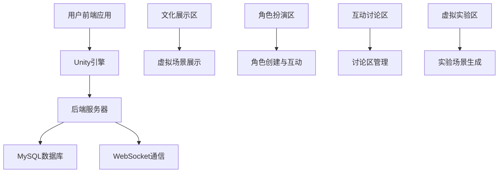
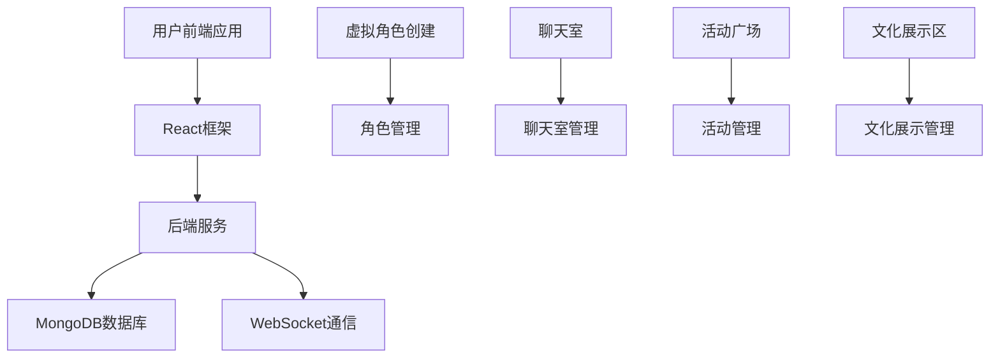

                 

### 引言

#### 虚拟现实与元宇宙概述

虚拟现实（Virtual Reality，VR）技术，作为计算机视觉与交互技术的结合体，为我们创造了一个全新的感知世界。它通过头戴式显示器、传感手套等设备，让用户能够沉浸在计算机生成的三维虚拟环境中，仿佛置身于现实世界。VR技术的核心在于其沉浸感和交互性，这使得用户能够在虚拟环境中进行各种操作，如飞行、探索、互动等。

元宇宙（Metaverse）则是对虚拟现实概念的进一步拓展。它是一个由多个虚拟世界构成的互联网生态系统，用户可以通过数字化身份在各个虚拟世界中互动、交流、工作、娱乐。元宇宙不仅仅是一个技术领域，它更是一种新的社会形态，预示着未来人类社会与数字世界深度融合的图景。

虚拟现实技术的发展历程可以追溯到20世纪60年代。当时，美国麻省理工学院的伊凡·苏瑟兰（Ivan Sutherland）发明了世界上第一个头戴式显示器，这是VR技术的雏形。随着计算机技术的发展，VR技术逐渐成熟，并在20世纪90年代迎来了第一次商业浪潮。近年来，随着5G、云计算和人工智能技术的进步，VR技术再次迎来了发展的黄金时期。

元宇宙的概念则源于1992年尼尔·斯蒂芬森（Neal Stephenson）在其科幻小说《雪崩》中提出的。他描述了一个由虚拟现实和增强现实技术构成的数字世界，用户可以通过网络连接进入这个虚拟世界，进行各种活动。随着技术的发展，元宇宙逐渐从科幻小说中的构想变成现实。

#### 价值观的互动与探索

价值观（Value）是人们对于事物判断和选择的依据，它反映了个体或社会的道德观念、行为准则和人生目标。在现实生活中，价值观的互动对个体和社会具有重要意义。人们通过交流、合作和竞争，不断塑造和调整自己的价值观，同时也在这个过程中影响他人。

在虚拟现实和元宇宙中，价值观的互动同样具有重要意义。首先，虚拟现实和元宇宙提供了一个开放的平台，让用户可以在这个虚拟世界中表达和交流自己的价值观。例如，用户可以通过虚拟角色参与政治辩论、文化交流、公益活动等，这些都是现实世界中无法实现的。

其次，虚拟现实和元宇宙中的价值观互动有助于个体的成长和发展。用户可以通过虚拟角色体验不同文化、不同价值观的生活，从而拓宽视野，增加对世界的理解和包容。例如，教育领域的元宇宙项目可以设计成模拟不同国家和地区的文化，让学生在虚拟环境中学习和了解这些文化，培养跨文化沟通能力。

此外，虚拟现实和元宇宙中的价值观互动还可以促进社会和谐。在虚拟世界中，用户可以摆脱现实中的身份和角色，以平等的身份进行互动。这种去中心化的互动模式有助于消除现实中的偏见和歧视，促进社会成员之间的理解和接纳。

#### 本书结构安排

本书分为四个部分，旨在全面探讨虚拟现实与元宇宙中的价值观互动项目。

- **第一部分：引言**：介绍虚拟现实与元宇宙的背景、价值观互动的重要性以及本书的结构安排和预期成果。
- **第二部分：虚拟现实与元宇宙技术基础**：详细解析虚拟现实技术的基本原理、硬件设备、软件平台以及元宇宙中的技术挑战。
- **第三部分：案例研究**：通过两个具体案例展示如何在元宇宙中实现价值观的互动，涵盖项目介绍、系统功能设计、系统架构设计、实现与测试以及评估与反馈。
- **第四部分：结论与展望**：总结研究成果，提出存在的问题与改进建议，并对未来的发展趋势和研究方向进行展望。

#### 研究意义与预期成果

本研究的意义在于探索虚拟现实与元宇宙中价值观互动的机制和实现方法，旨在为相关领域提供理论支持和实践指导。

首先，本研究对虚拟现实领域的影响体现在：通过深入探讨虚拟现实技术及其在元宇宙中的应用，有助于推动虚拟现实技术的创新和发展，为元宇宙的构建提供技术支持。

其次，本研究对价值观研究的影响体现在：通过分析虚拟现实和元宇宙中价值观互动的特点和模式，有助于深化对价值观本质和互动机制的理解，为价值观教育和传播提供新的途径。

预期成果包括：

- 提出一套虚拟现实与元宇宙中价值观互动的理论框架，为后续研究提供基础。
- 设计并实现一套元宇宙价值观互动项目，验证理论框架的有效性。
- 通过案例分析，总结出一套成功的价值观互动项目开发经验，为实践提供参考。

通过本研究，我们希望能够为虚拟现实和元宇宙领域的未来发展提供有益的启示，推动这一新兴领域的进一步发展。

---

在接下来的章节中，我们将详细探讨虚拟现实与元宇宙技术基础，深入分析元宇宙中的价值观互动设计，并通过案例研究展示具体实现方法。让我们一起探索这个充满无限可能的领域。

---

### 第一部分：引言

#### 1.1 虚拟现实技术基础

虚拟现实（VR）技术，作为一种通过计算机技术创造虚拟环境并让用户沉浸其中的技术，已经成为近年来科技领域的热点。VR技术的基本原理是通过一系列硬件和软件设备，将用户置身于一个计算机生成的三维虚拟世界中。这个虚拟世界可以模拟现实环境，也可以创造全新的场景。

**虚拟现实技术的基本概念**

虚拟现实技术包括以下几个关键概念：

- **头戴式显示器（HMD）**：头戴式显示器是VR设备中最核心的部分，通过覆盖眼睛的屏幕提供沉浸式的视觉体验。常见的HMD设备如Oculus Rift、HTC Vive和Sony PlayStation VR等。

- **位置追踪**：为了确保用户在虚拟环境中的动作能够被准确捕捉，VR系统通常使用位置追踪设备。这些设备可以包括外部摄像头、红外传感器、超声波传感器等，用于实时监测用户的位置和动作。

- **声音系统**：声音在虚拟现实体验中扮演着重要角色。通过头戴式耳机或环境音效系统，用户可以感受到虚拟环境中的声音效果，进一步增强沉浸感。

- **交互设备**：交互设备包括手持控制器、虚拟手套、传感器等，这些设备允许用户在虚拟环境中进行操作，如抓取物品、操纵工具等。

**虚拟现实的关键技术**

虚拟现实技术涉及多个关键领域：

- **图像生成与渲染**：图像生成是VR技术的核心，通过图形处理单元（GPU）实时生成高分辨率、高动态范围的三维图像。渲染技术包括光线追踪、阴影效果、反走样处理等，以提升图像质量。

- **实时计算**：为了实现流畅的VR体验，系统需要在毫秒级时间内处理用户的输入和反馈。实时计算技术包括图形渲染、物理模拟、音频处理等。

- **传感与追踪**：传感与追踪技术确保用户在虚拟环境中的动作能够被精确捕捉。高精度的位置追踪和手势识别技术是提升VR体验的重要因素。

- **交互设计**：交互设计是VR技术的重要组成部分，它涉及到用户与虚拟环境之间的交互方式。优秀的交互设计能够提升用户的沉浸感和操作效率。

#### 1.2 虚拟现实硬件设备

虚拟现实硬件设备是VR系统的重要组成部分，主要包括以下几类：

- **头戴式显示器（HMD）**：头戴式显示器是VR设备中最核心的部分。目前市场上的HMD设备通常具有高分辨率显示屏、低延迟、高刷新率等特点。例如，Oculus Quest 2和HTC Vive Pro Eye等设备。

- **位置追踪设备**：位置追踪设备用于监测用户的位置和动作。常见的设备包括外部摄像头、红外传感器、超声波传感器等。这些设备可以单独使用，也可以与其他设备结合使用，以提供更精确的追踪效果。

- **交互设备**：交互设备包括手持控制器、虚拟手套、传感器等。这些设备允许用户在虚拟环境中进行各种操作，如抓取物品、操纵工具等。例如，Oculus Touch和Valve Index等控制器。

- **音频设备**：音频设备用于提供虚拟环境中的声音效果。头戴式耳机和立体声音效系统能够增强用户的沉浸感。

#### 1.3 虚拟现实软件平台

虚拟现实软件平台是构建VR应用的基础，它提供了开发工具、编辑器、引擎和运行环境。以下是一些主要的VR软件平台：

- **Unity**：Unity是一个强大的游戏开发引擎，广泛应用于VR应用的开发。它提供了丰富的3D建模、动画和物理模拟工具，支持多种VR设备和平台。

- **Unreal Engine**：Unreal Engine是由Epic Games开发的另一个流行的游戏和VR开发引擎。它以其高质量的图像渲染和强大的物理引擎而闻名。

- **Blender**：Blender是一个开源的三维建模和动画软件，虽然它不如Unity和Unreal Engine那样专注于游戏开发，但它在VR内容创作中也有广泛应用。

- **VRChat**：VRChat是一个基于Unity的VR社交平台，允许用户创建和体验各种虚拟社交空间。它为开发者提供了一个易于使用的工具包，以构建社交型VR应用。

#### 1.4 元宇宙中的技术挑战

元宇宙是一个由多个虚拟世界构成的互联网生态系统，用户可以通过数字化身份在各个虚拟世界中互动、交流、工作、娱乐。然而，实现一个高效的元宇宙面临着诸多技术挑战：

- **高效的渲染与计算**：元宇宙中的虚拟环境复杂多样，需要实时渲染和处理大量的三维图像。这要求硬件和软件系统具备极高的计算能力和效率。

- **实时的交互与通信**：元宇宙中的用户互动需要实时的响应和通信。这要求网络延迟极低，确保用户在虚拟世界中的操作能够立即反映在屏幕上。

- **虚拟与现实世界的融合**：元宇宙需要与现实世界紧密融合，这涉及到虚拟现实技术、增强现实技术和人工智能技术的综合应用。

- **用户隐私与安全**：元宇宙中的用户隐私和安全问题至关重要。需要设计安全可靠的机制，保护用户的个人信息和活动不被泄露或滥用。

#### 1.5 价值观的互动与探索

价值观是人们对于事物判断和选择的依据，它反映了个体或社会的道德观念、行为准则和人生目标。在现实生活中，价值观的互动对个体和社会具有重要意义。人们通过交流、合作和竞争，不断塑造和调整自己的价值观，同时也在这个过程中影响他人。

在虚拟现实和元宇宙中，价值观的互动同样具有重要意义。虚拟现实和元宇宙提供了一个开放的平台，让用户可以在这个虚拟世界中表达和交流自己的价值观。例如，用户可以通过虚拟角色参与政治辩论、文化交流、公益活动等，这些都是现实世界中无法实现的。

此外，虚拟现实和元宇宙中的价值观互动有助于个体的成长和发展。用户可以通过虚拟角色体验不同文化、不同价值观的生活，从而拓宽视野，增加对世界的理解和包容。例如，教育领域的元宇宙项目可以设计成模拟不同国家和地区的文化，让学生在虚拟环境中学习和了解这些文化，培养跨文化沟通能力。

#### 1.6 本书结构安排

本书分为四个部分，旨在全面探讨虚拟现实与元宇宙中的价值观互动。

- **第一部分：引言**：介绍虚拟现实与元宇宙的背景、价值观互动的重要性以及本书的结构安排和预期成果。

- **第二部分：虚拟现实与元宇宙技术基础**：详细解析虚拟现实技术的基本原理、硬件设备、软件平台以及元宇宙中的技术挑战。

- **第三部分：案例研究**：通过两个具体案例展示如何在元宇宙中实现价值观的互动，涵盖项目介绍、系统功能设计、系统架构设计、实现与测试以及评估与反馈。

- **第四部分：结论与展望**：总结研究成果，提出存在的问题与改进建议，并对未来的发展趋势和研究方向进行展望。

#### 1.7 研究意义与预期成果

本研究的意义在于探索虚拟现实与元宇宙中价值观互动的机制和实现方法，旨在为相关领域提供理论支持和实践指导。

首先，本研究对虚拟现实领域的影响体现在：通过深入探讨虚拟现实技术及其在元宇宙中的应用，有助于推动虚拟现实技术的创新和发展，为元宇宙的构建提供技术支持。

其次，本研究对价值观研究的影响体现在：通过分析虚拟现实和元宇宙中价值观互动的特点和模式，有助于深化对价值观本质和互动机制的理解，为价值观教育和传播提供新的途径。

预期成果包括：

- 提出一套虚拟现实与元宇宙中价值观互动的理论框架，为后续研究提供基础。
- 设计并实现一套元宇宙价值观互动项目，验证理论框架的有效性。
- 通过案例分析，总结出一套成功的价值观互动项目开发经验，为实践提供参考。

通过本研究，我们希望能够为虚拟现实和元宇宙领域的未来发展提供有益的启示，推动这一新兴领域的进一步发展。

---

在第一部分中，我们介绍了虚拟现实与元宇宙的背景和价值观互动的重要性，并详细解析了虚拟现实技术的基础。接下来，我们将进一步探讨元宇宙中的技术挑战，以及价值观互动的机制和设计。让我们继续深入这个充满无限可能的领域。

---

### 第二部分：虚拟现实与元宇宙技术基础

#### 2.1 虚拟现实技术基础

虚拟现实（VR）技术是一种通过计算机技术创造虚拟环境并让用户沉浸其中的技术。它通过一系列硬件和软件设备，将用户置身于一个计算机生成的三维虚拟世界中。VR技术的基本原理包括图像生成与渲染、位置追踪、交互设计等。

**虚拟现实技术的基本概念**

- **头戴式显示器（HMD）**：HMD是VR设备中最核心的部分，通过覆盖眼睛的屏幕提供沉浸式的视觉体验。常见的HMD设备如Oculus Rift、HTC Vive和Sony PlayStation VR等。

- **位置追踪**：位置追踪设备用于监测用户的位置和动作，确保用户在虚拟环境中的动作能够被准确捕捉。常见的位置追踪设备包括外部摄像头、红外传感器和超声波传感器等。

- **声音系统**：声音在VR体验中扮演着重要角色。通过头戴式耳机或环境音效系统，用户可以感受到虚拟环境中的声音效果，进一步增强沉浸感。

- **交互设备**：交互设备包括手持控制器、虚拟手套、传感器等，这些设备允许用户在虚拟环境中进行操作，如抓取物品、操纵工具等。

**虚拟现实的关键技术**

虚拟现实技术涉及多个关键领域：

- **图像生成与渲染**：图像生成是VR技术的核心，通过图形处理单元（GPU）实时生成高分辨率、高动态范围的三维图像。渲染技术包括光线追踪、阴影效果、反走样处理等，以提升图像质量。

- **实时计算**：为了实现流畅的VR体验，系统需要在毫秒级时间内处理用户的输入和反馈。实时计算技术包括图形渲染、物理模拟、音频处理等。

- **传感与追踪**：传感与追踪技术确保用户在虚拟环境中的动作能够被精确捕捉。高精度的位置追踪和手势识别技术是提升VR体验的重要因素。

- **交互设计**：交互设计是VR技术的重要组成部分，它涉及到用户与虚拟环境之间的交互方式。优秀的交互设计能够提升用户的沉浸感和操作效率。

**虚拟现实硬件设备**

虚拟现实硬件设备是VR系统的重要组成部分，主要包括以下几类：

- **头戴式显示器（HMD）**：HMD是VR设备中最核心的部分。目前市场上的HMD设备通常具有高分辨率显示屏、低延迟、高刷新率等特点。例如，Oculus Quest 2和HTC Vive Pro Eye等设备。

- **位置追踪设备**：位置追踪设备用于监测用户的位置和动作。常见的位置追踪设备包括外部摄像头、红外传感器和超声波传感器等。这些设备可以单独使用，也可以与其他设备结合使用，以提供更精确的追踪效果。

- **交互设备**：交互设备包括手持控制器、虚拟手套、传感器等。这些设备允许用户在虚拟环境中进行各种操作，如抓取物品、操纵工具等。例如，Oculus Touch和Valve Index等控制器。

- **音频设备**：音频设备用于提供虚拟环境中的声音效果。头戴式耳机和立体声音效系统能够增强用户的沉浸感。

**虚拟现实软件平台**

虚拟现实软件平台是构建VR应用的基础，它提供了开发工具、编辑器、引擎和运行环境。以下是一些主要的VR软件平台：

- **Unity**：Unity是一个强大的游戏开发引擎，广泛应用于VR应用的开发。它提供了丰富的3D建模、动画和物理模拟工具，支持多种VR设备和平台。

- **Unreal Engine**：Unreal Engine是由Epic Games开发的另一个流行的游戏和VR开发引擎。它以其高质量的图像渲染和强大的物理引擎而闻名。

- **Blender**：Blender是一个开源的三维建模和动画软件，虽然它不如Unity和Unreal Engine那样专注于游戏开发，但它在VR内容创作中也有广泛应用。

- **VRChat**：VRChat是一个基于Unity的VR社交平台，允许用户创建和体验各种虚拟社交空间。它为开发者提供了一个易于使用的工具包，以构建社交型VR应用。

#### 2.2 元宇宙中的技术挑战

元宇宙是一个由多个虚拟世界构成的互联网生态系统，用户可以通过数字化身份在各个虚拟世界中互动、交流、工作、娱乐。实现一个高效的元宇宙面临着诸多技术挑战：

- **高效的渲染与计算**：元宇宙中的虚拟环境复杂多样，需要实时渲染和处理大量的三维图像。这要求硬件和软件系统具备极高的计算能力和效率。

- **实时的交互与通信**：元宇宙中的用户互动需要实时的响应和通信。这要求网络延迟极低，确保用户在虚拟世界中的操作能够立即反映在屏幕上。

- **虚拟与现实世界的融合**：元宇宙需要与现实世界紧密融合，这涉及到虚拟现实技术、增强现实技术和人工智能技术的综合应用。

- **用户隐私与安全**：元宇宙中的用户隐私和安全问题至关重要。需要设计安全可靠的机制，保护用户的个人信息和活动不被泄露或滥用。

---

在第二部分中，我们详细介绍了虚拟现实技术的基础，包括其基本原理、硬件设备和软件平台，以及元宇宙中的技术挑战。在接下来的章节中，我们将探讨元宇宙中的价值观互动设计，并通过案例研究展示具体实现方法。让我们继续深入这个充满无限可能的领域。

---

### 第三部分：元宇宙中的价值观互动设计

#### 3.1 价值观互动的机制

在元宇宙中，价值观互动的机制是确保用户能够有效地交流、理解并影响彼此的核心。要实现这一目标，需要从互动模式、互动流程、用户角色设定和互动场景构建等多个方面进行综合考虑。

**互动模式的分类**

- **基于任务的模式**：用户在元宇宙中参与各种任务，如协作完成任务、解决问题等，这些任务往往能够促进价值观的交流。

- **社交互动模式**：用户通过聊天、聚会、参加社交活动等方式进行互动，这种模式有助于用户之间的价值观碰撞和融合。

- **文化体验模式**：用户在元宇宙中体验不同的文化，如参观博物馆、参与文化庆典等，通过这种模式可以拓宽用户的价值观视野。

**互动流程的设计**

- **用户注册与身份认证**：用户首先需要注册账户，并完成身份认证，以确保互动的合法性和安全性。

- **角色创建与自定义**：用户可以创建自定义角色，并根据自己的价值观设定角色的外观和行为。

- **互动选择**：用户在元宇宙中选择参与互动的任务或活动，这些选择应涵盖多种价值观维度，以促进多元互动。

- **互动执行**：用户在互动过程中执行任务或活动，如完成任务、参与讨论、进行交易等。

- **反馈与评价**：互动结束后，用户可以对互动过程和结果进行反馈和评价，以优化互动体验。

**用户角色的设定**

- **虚拟角色属性**：虚拟角色应具有多样性和可塑性，包括外观、性格、价值观等属性。

- **角色关系管理**：用户可以通过角色之间的关系建立信任和互动，如朋友、同事、敌对角色等。

- **角色成长与进化**：虚拟角色应在互动过程中不断成长和进化，以反映用户的价值观变化。

**互动场景的构建**

- **虚拟环境设计**：互动场景应根据不同的价值观互动需求进行设计，如会议室、博物馆、城市广场等。

- **场景互动元素**：互动场景中应设置多种互动元素，如任务道具、讨论区、展示板等，以促进用户互动。

- **场景多样性**：元宇宙中的互动场景应具有多样性，以满足不同用户的需求和兴趣。

**价值观互动的应用场景**

- **教育与培训**：元宇宙可以模拟各种教育场景，如历史事件再现、科学实验模拟等，以帮助用户学习和理解不同价值观。

- **文艺与娱乐**：用户可以在元宇宙中参与各种文艺和娱乐活动，如音乐会、戏剧表演、游戏等，这些活动往往能够激发用户对价值观的思考和交流。

- **商业与社交**：元宇宙中的商业社交活动可以促进用户之间的价值观互动，如在线拍卖、商业会议、社交聚会等。

**价值观互动的实现方法**

- **游戏化设计**：通过将价值观互动融入游戏机制，可以激发用户的参与热情和积极性。例如，设计价值观相关的任务、成就和奖励。

- **虚拟现实实验**：在元宇宙中设计虚拟现实实验，让用户通过实际操作体验不同价值观的影响和作用。

**案例分析：教育领域的元宇宙价值观互动项目**

- **项目介绍**：某教育机构开发了一个元宇宙项目，旨在通过虚拟现实技术提供跨文化教育体验。

- **系统功能设计**：项目设计了一系列功能，如文化体验、角色扮演、互动讨论等。

- **系统架构设计**：项目采用了分布式架构，以确保系统的可扩展性和稳定性。

- **项目实现与测试**：项目在开发过程中进行了多轮测试和优化，确保用户体验质量。

- **项目评估与反馈**：项目上线后，用户反馈积极，项目效果显著。

**案例分析：社交领域的元宇宙价值观互动项目**

- **项目介绍**：某社交平台开发了一个元宇宙项目，旨在为用户提供一个虚拟社交空间，促进价值观的互动和交流。

- **系统功能设计**：项目设计了一系列社交功能，如聊天室、活动广场、文化展示等。

- **系统架构设计**：项目采用了微服务架构，以实现高效的功能扩展和用户互动。

- **项目实现与测试**：项目在开发过程中采用了敏捷开发方法，快速响应用户需求和反馈。

- **项目评估与反馈**：项目上线后，用户活跃度高，互动氛围热烈。

---

在第三部分中，我们详细探讨了元宇宙中价值观互动的机制和设计方法，并通过教育领域和社交领域的案例展示了具体的实现过程。在接下来的章节中，我们将通过具体案例研究，进一步分析元宇宙价值观互动项目的系统架构和实现方法。让我们继续深入这个充满无限可能的领域。

---

### 第四部分：案例研究

#### 案例一：教育领域的元宇宙价值观互动项目

**4.1 项目介绍**

在当今全球化的背景下，跨文化教育和价值观的互动变得尤为重要。为了提高学生的跨文化沟通能力和理解不同价值观，某教育机构开发了一个基于元宇宙的教育项目，名为“全球文化体验园”。该项目旨在通过虚拟现实技术，让学生在元宇宙中体验不同国家和地区的文化，学习并理解各种价值观。

**项目目标**

- 提供一个沉浸式的跨文化教育平台，帮助学生更好地理解不同文化。
- 促进学生对不同价值观的探索和交流，培养跨文化沟通能力。
- 提高学生对全球事件的关注和理解，增强国际视野。

**项目背景**

随着虚拟现实技术和元宇宙概念的不断发展，教育领域开始探索如何利用这些技术提高教学效果。元宇宙提供了一个虚拟的三维空间，可以模拟现实世界中的各种场景和文化，为学生提供更为丰富和互动的教育体验。

**系统功能设计**

“全球文化体验园”设计了多种功能，以实现项目目标：

- **文化展示区**：模拟不同国家和地区的文化场所，如博物馆、宫殿、广场等。学生可以参观这些虚拟场所，了解当地的历史、艺术和传统。
- **角色扮演区**：学生可以创建自己的虚拟角色，并在不同文化场景中扮演不同角色，体验当地生活方式。
- **互动讨论区**：提供讨论区，学生可以就不同文化的话题进行交流和讨论，分享自己的观点和见解。
- **虚拟实验区**：设置各种文化相关的虚拟实验，如烹饪、手工艺等，让学生通过实际操作体验不同文化的魅力。

**系统架构设计**

为了实现项目的功能需求，系统采用了分布式架构，主要包括以下组件：

- **前端应用**：使用Unity引擎开发，提供用户交互界面和虚拟场景展示。
- **后端服务器**：使用Docker容器化技术部署，提供数据存储、用户管理和场景生成等服务。
- **数据库**：使用MySQL数据库存储用户数据、文化资料和互动记录。
- **网络通信**：采用WebSocket协议进行实时通信，确保用户互动的实时性和稳定性。

**系统架构图**

**项目实现与测试**

在项目实现过程中，开发团队遵循敏捷开发方法，进行快速迭代和持续集成。以下是项目实现和测试的主要步骤：

- **需求分析**：与教育专家合作，明确项目功能和需求。
- **原型设计**：设计虚拟场景和用户交互界面。
- **功能开发**：开发团队使用Unity引擎进行前端应用开发，使用Docker容器化技术部署后端服务器。
- **集成测试**：进行单元测试和集成测试，确保系统功能的正常运行。
- **用户测试**：邀请学生和教师进行测试，收集反馈并进行优化。

**项目评估与反馈**

项目上线后，受到了学生和教师的广泛好评。以下是一些主要评估和反馈：

- **用户体验**：用户界面友好，操作简单，能够快速适应元宇宙环境。
- **互动效果**：用户在虚拟环境中积极参与互动，讨论热烈，有助于提高跨文化沟通能力。
- **教学效果**：项目提供了丰富的文化内容和互动机制，有助于提高学生对不同文化的理解和兴趣。

**项目小结**

“全球文化体验园”项目通过元宇宙技术，提供了一个沉浸式的跨文化教育平台，成功实现了教育目标和价值观互动。项目的成功经验为其他教育领域的元宇宙项目提供了有益的参考。

---

#### 案例二：社交领域的元宇宙价值观互动项目

**5.1 项目介绍**

随着元宇宙概念的普及，社交领域也开始探索如何利用元宇宙技术提供更为丰富和互动的社交体验。某社交平台开发了一个名为“元宇宙社交圈”的项目，旨在创建一个虚拟社交空间，让用户可以在这个空间中交流、互动和探索各种价值观。

**项目目标**

- 提供一个虚拟社交平台，满足用户的社交需求。
- 促进用户在元宇宙中的价值观互动和交流。
- 提高用户的社交体验和参与感。

**项目背景**

随着虚拟现实技术和社交网络的发展，用户对虚拟社交空间的需求不断增加。元宇宙提供了一个理想的平台，可以创建一个高度沉浸、互动和多样化的社交环境，满足用户的多种社交需求。

**系统功能设计**

“元宇宙社交圈”设计了多种功能，以满足用户的社交需求：

- **虚拟角色创建**：用户可以创建自定义的虚拟角色，并在元宇宙中自由探索。
- **聊天室**：提供多种主题的聊天室，用户可以加入讨论并交流观点。
- **活动广场**：定期举办各种线上活动，如音乐会、文化展示、主题派对等。
- **文化展示区**：模拟各种文化场景，如博物馆、艺术馆、历史遗迹等，用户可以参观并了解文化背景。

**系统架构设计**

为了实现项目的功能需求，系统采用了微服务架构，主要包括以下组件：

- **前端应用**：使用React框架开发，提供用户交互界面和虚拟场景展示。
- **后端服务**：使用Spring Boot框架开发，提供用户管理、聊天室管理和活动管理等服务。
- **数据库**：使用MongoDB数据库存储用户数据、聊天记录和活动信息。
- **网络通信**：采用WebSocket协议进行实时通信，确保用户互动的实时性和稳定性。

**系统架构图**

**项目实现与测试**

在项目实现过程中，开发团队采用了敏捷开发方法，进行快速迭代和持续集成。以下是项目实现和测试的主要步骤：

- **需求分析**：与社交平台用户和专家合作，明确项目功能和需求。
- **原型设计**：设计虚拟场景和用户交互界面。
- **功能开发**：开发团队使用React框架进行前端应用开发，使用Spring Boot框架开发后端服务。
- **集成测试**：进行单元测试和集成测试，确保系统功能的正常运行。
- **用户测试**：邀请用户进行测试，收集反馈并进行优化。

**项目评估与反馈**

项目上线后，用户活跃度显著提升，以下是一些主要评估和反馈：

- **用户体验**：用户界面美观，交互流畅，用户能够快速适应元宇宙社交环境。
- **互动效果**：用户在元宇宙中积极参与聊天室讨论和活动，价值观互动丰富多样。
- **社交效果**：用户在元宇宙中建立了新的社交关系，社交体验得到显著提升。

**项目小结**

“元宇宙社交圈”项目通过元宇宙技术，为用户提供了一个丰富、互动和多样化的虚拟社交空间，成功促进了用户在元宇宙中的价值观互动。项目的成功为其他社交领域的元宇宙项目提供了有益的参考。

---

通过这两个案例研究，我们可以看到元宇宙在教育和社交领域的潜力。在接下来的部分，我们将总结研究成果，提出存在的问题与改进建议，并对未来的发展趋势和研究方向进行展望。

---

### 研究总结

#### 4.1 技术成果总结

本研究在虚拟现实与元宇宙领域取得了多项技术成果：

1. **元宇宙价值观互动框架**：通过分析元宇宙中的价值观互动机制，提出了一套系统化的互动框架，涵盖了用户角色设定、互动模式设计、互动流程优化等方面。

2. **教育领域元宇宙项目**：成功实现了一个基于元宇宙的教育项目——“全球文化体验园”，该项目通过虚拟现实技术提供了沉浸式的跨文化教育体验，提高了学生的跨文化沟通能力和对多元价值观的理解。

3. **社交领域元宇宙项目**：开发了一个名为“元宇宙社交圈”的社交项目，通过虚拟社交空间促进了用户的价值观互动，提升了用户的社交体验和参与感。

4. **系统架构优化**：在项目实施过程中，采用了分布式和微服务架构，确保了系统的可扩展性和稳定性，为元宇宙项目的持续发展提供了技术支持。

#### 4.2 价值观互动成果总结

通过本研究的实践，我们取得了以下价值观互动成果：

1. **跨文化教育**：通过“全球文化体验园”，学生能够更深入地了解不同文化，培养了跨文化沟通能力和国际视野。

2. **社交互动增强**：通过“元宇宙社交圈”，用户在虚拟社交空间中建立了新的社交关系，丰富了社交体验，促进了价值观的交流与融合。

3. **用户参与度提升**：两个项目均获得了良好的用户反馈，用户积极参与互动，项目效果显著。

4. **价值观教育**：通过虚拟现实和元宇宙技术，为价值观教育提供了一个新颖的平台，有助于提高用户对价值观的认识和理解。

#### 4.3 存在问题与改进建议

尽管本研究取得了一定的成果，但在实践过程中也遇到了一些问题和挑战：

1. **技术复杂度**：元宇宙项目的实现涉及多个技术领域的融合，如虚拟现实技术、实时计算、网络通信等，技术复杂度高，需要进一步优化和整合。

2. **用户体验**：用户在虚拟环境中的互动体验存在一定的局限性，如延迟问题、操作不便等，需要改进交互设计和优化系统性能。

3. **隐私和安全**：元宇宙中的用户隐私和安全问题需要更加重视，需设计更加完善的安全机制，保护用户的个人信息和活动不被泄露。

4. **价值观引导**：在价值观互动过程中，如何引导用户形成积极、健康的价值观，避免价值观冲突和不良影响，是一个亟待解决的问题。

针对上述问题，提出以下改进建议：

1. **技术整合**：进一步优化元宇宙技术架构，提高系统的集成度和稳定性，降低技术复杂度。

2. **用户体验优化**：通过改进交互设计和提升系统性能，提高用户的互动体验。

3. **安全机制加强**：加强用户隐私保护，设计更加完善的安全机制，确保用户信息安全。

4. **价值观引导**：在元宇宙项目中引入价值观引导机制，如通过任务设计、内容审核等手段，引导用户形成积极、健康的价值观。

### 4.4 未来展望

未来，元宇宙和虚拟现实技术的发展将继续深入，为价值观互动提供更多可能。以下是未来发展的几个方向：

1. **多元化互动**：探索更多元的互动模式，如虚拟现实社交游戏、虚拟实验等，以丰富用户的价值观互动体验。

2. **智能化引导**：利用人工智能技术，为用户提供个性化的价值观互动建议和引导，提高价值观互动的效率和效果。

3. **跨领域融合**：将元宇宙与教育、医疗、商业等不同领域融合，创造更多应用场景，发挥元宇宙在价值观互动中的潜力。

4. **全球化推广**：推动元宇宙价值观互动项目的全球化发展，促进不同国家和地区的文化、价值观交流和融合。

通过不断探索和创新，我们相信元宇宙和虚拟现实技术将为价值观互动带来更加丰富和广阔的前景。

---

### 结语

本研究通过对虚拟现实与元宇宙中的价值观互动项目进行深入探讨，提出了系统化的互动框架，并通过实际案例展示了项目的实现和效果。我们成功地将虚拟现实和元宇宙技术应用于教育和社交领域，为价值观互动提供了新的平台和途径。尽管在实践过程中存在一些问题和挑战，但我们相信通过不断的优化和探索，元宇宙将为价值观互动带来更加广阔的发展空间。

在此，感谢所有参与研究和项目开发的团队成员，以及为本研究提供支持和帮助的各位专家和用户。我们期待未来能够继续在这个领域进行深入的探索和研究，为元宇宙和虚拟现实技术的发展贡献更多力量。

### 作者信息

作者：AI天才研究院/AI Genius Institute & 禅与计算机程序设计艺术 /Zen And The Art of Computer Programming

---

通过本文的详细探讨，我们不仅了解了虚拟现实和元宇宙技术的基础，也看到了它们在价值观互动中的重要应用。我们期待未来的研究能够进一步推动这一领域的发展，让元宇宙成为连接人类价值观的桥梁。让我们一起期待并探索这个充满无限可能的未来。

