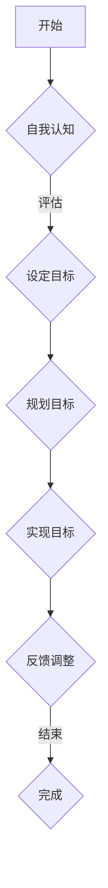
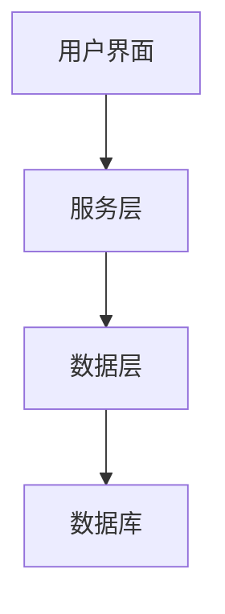
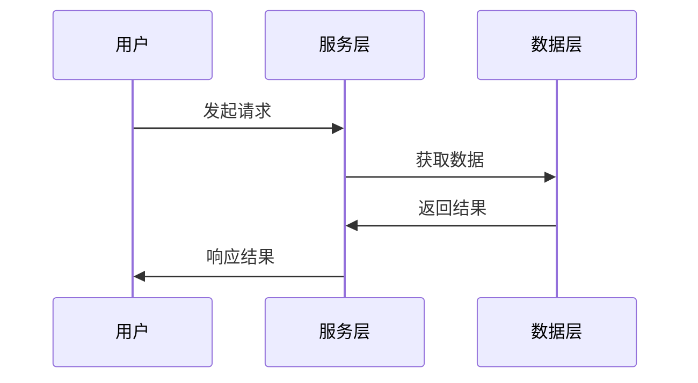
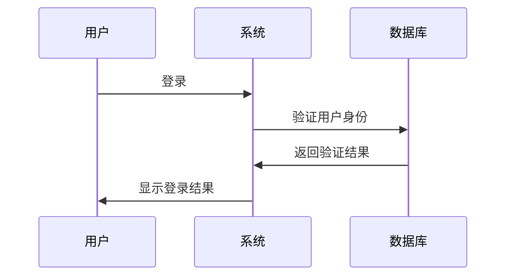

                 

### 文章标题

### 关键词
- 人生意义
- 目标设定
- 人生蓝图
- 算法设计
- 系统架构

### 摘要
本文将深入探讨人生意义的本质，通过构建人生蓝图的框架，提供一套系统的设计方法，帮助读者打造有目标感的人生。文章分为四个部分：第一部分是人生意义的探索与理解，第二部分是构建人生蓝图的框架，第三部分是设计人生蓝图的步骤与实践，第四部分是人生蓝图的实践与应用。通过这些内容，读者将学会如何从理论上理解人生意义，并在实践中设计出适合自己的目标感强烈的人生蓝图。

## 第一部分：人生意义的探索与理解

### 第1章：问题背景与意义

#### 1.1 问题背景

在现代社会的快节奏生活中，人们常常感到迷茫和困惑。工作压力、人际关系、经济压力等多重因素交织，使得许多人对于人生失去了方向感。很多人会问：“我为什么而活？”、“我的人生意义在哪里？”这些问题不仅仅是哲学上的探讨，更是实际生活中每个人都可能面临的问题。

#### 1.1.1 现代生活的困扰

现代社会中，人们面临着前所未有的选择多样性，但同时也带来了选择困难。许多人忙于工作，却感觉缺乏成就感；投入大量时间在社交媒体上，却找不到真正的满足感。这些现象表明，现代生活方式在某种程度上导致了人们的空虚感和失落感。

#### 1.1.2 寻求人生意义的必要性

寻求人生意义是人们心理需求的一部分。当人们明确自己的人生目标后，会更有动力去追求和实现它们。意义感不仅能够提升个人的幸福感，还能增强社会归属感和生活满意度。因此，寻求人生意义对于个人的成长和社会的和谐具有重要意义。

#### 1.1.3 人生意义的定义

人生意义是一个复杂且多元的概念，不同的人会有不同的理解。广义上，人生意义可以理解为个体在社会中的存在价值，包括个人的成就、人际关系、社会贡献等。狭义上，人生意义可能聚焦于个人内心的满足感、幸福感和成就感。

#### 1.2 人生意义的定义与内涵

##### 1.2.1 人生意义的多元视角

人生意义可以从多个角度进行理解。从哲学角度来看，人生意义是关于存在价值和目的的探讨；从心理学角度来看，人生意义与个体的心理需求和幸福感密切相关；从社会学角度来看，人生意义与社会规范和个人价值观念密切相关。

##### 1.2.2 人生意义的个人与社会价值

从个人层面看，人生意义是个体生活质量的衡量标准。一个有意义的人生往往能够带来更高的生活满意度和幸福感。从社会层面看，人生意义则体现为个体对社会做出的贡献。一个有意义的人生有助于促进社会的进步和发展。

##### 1.2.3 人生意义的边界与外延

人生意义的边界和内容是相对的，不同文化和个人背景会影响对人生意义的理解和追求。然而，一些普遍认可的价值观念，如爱、善良、正直等，往往被认为是人生意义的重要组成部分。

#### 1.3 核心概念与联系

##### 1.3.1 生活目标与人生意义

生活目标和人生意义密切相关。明确的生活目标可以帮助个体找到人生意义，而人生意义则能激励个体去实现这些目标。因此，生活目标与人生意义之间是一种相互促进的关系。

##### 1.3.2 满足感与幸福感

满足感和幸福感是人生意义的重要组成部分。满足感来源于目标的实现，幸福感则是对生活的整体感受。两者相辅相成，共同构成了人生的意义。

##### 1.3.3 人生意义的实现与挑战

实现人生意义并非一蹴而就，需要个体在不断的努力和挑战中不断探索和实现。在这个过程中，人们可能会遇到各种困难和挫折，但通过克服这些挑战，个体可以更加深刻地理解人生意义，并最终实现自我价值。

#### 1.4 本章小结

本章通过对人生意义的背景、定义、内涵及其与生活目标和满足感的关系的深入探讨，为后续章节构建人生蓝图的框架奠定了理论基础。理解人生意义是设计人生蓝图的第一步，也是实现个人成长和社会发展的关键。

## 第二部分：构建人生蓝图的框架

### 第2章：核心概念与联系

#### 2.1 核心概念

##### 2.1.1 人生蓝图的概念

人生蓝图是个体对人生目标的规划和设计的总体方案，它体现了个体对未来的期望和追求。人生蓝图不仅仅是目标设定，更包括实现目标的策略和路径。

##### 2.1.2 目标设定的原则

目标设定的原则包括明确性、可衡量性、具体性和时限性。明确的目标有助于个体集中精力，可衡量性确保目标的实现程度可以评估，具体性使得目标具有操作性，时限性则给予目标实现的紧迫感。

##### 2.1.3 目标实现的策略

目标实现的策略包括资源整合、时间管理、持续学习等。资源整合确保实现目标的条件具备，时间管理确保目标实现的效率，持续学习则提升实现目标的竞争力。

#### 2.2 概念属性特征对比表格

| 概念        | 特征1  | 特征2  | 特征3  |
| ----------- | ------- | ------- | ------- |
| 人生蓝图    | 指导性 | 规划性 | 可调整性 |
| 目标设定    | 明确性 | 可衡量性 | 具体性 |
| 目标实现策略 | 可操作性 | 灵活性 | 可持续性 |

#### 2.3 ER实体关系图架构

```mermaid
erDiagram
  目标 :<<Many>> 项目 |>> 绩效评估
  人生蓝图 :<<Many>> 目标
  项目 :<<Many>> 任务
  任务 :<负责> 责任人
```

- **目标**：人生蓝图的核心组成部分，具有明确性、可衡量性和具体性。
- **项目**：实现目标的载体，由多个任务组成。
- **任务**：项目的基本单位，由责任人负责完成。

#### 2.4 本章小结

本章通过对人生蓝图、目标设定和目标实现策略的核心概念和属性特征进行了详细阐述，并通过ER实体关系图展示了这些概念之间的关系。这为后续设计人生蓝图提供了理论基础和实践指导。

## 第三部分：设计人生蓝图的步骤与实践

### 第3章：设计人生蓝图的步骤

#### 3.1 自我认知与评估

##### 3.1.1 自我认知的重要性

自我认知是设计人生蓝图的第一步，它帮助我们了解自己的兴趣、优势和价值观。只有深入了解自己，我们才能设定符合自身特质的目标，并制定合理的实现策略。

##### 3.1.2 自我评估的方法

自我评估可以通过多种方式进行，包括心理测试、日志记录、朋友反馈等。这些方法有助于我们识别自身的优点和不足，从而为人生蓝图的制定提供基础数据。

##### 3.1.3 自我认知与人生蓝图的关系

自我认知与人生蓝图的关系密切。清晰的自我认知有助于我们设定更符合个人特质和价值观的目标，从而提高实现目标的动力和成功率。

#### 3.2 目标设定与规划

##### 3.2.1 目标设定的原则

在设定目标时，我们需要遵循明确性、可衡量性、具体性和时限性的原则。这些原则确保我们的目标具有操作性和实现的可能性。

##### 3.2.2 目标规划的方法

目标规划的方法包括制定长期、中期和短期目标，并为其分配资源和时间。通过这种规划，我们可以更好地分配精力，确保每个阶段的目标都能得到有效实现。

##### 3.2.3 目标设定与人生蓝图的整合

将设定的目标整合到人生蓝图中，可以形成一个完整的目标实现路径。这有助于我们明确每个阶段的目标和任务，提高整体目标的实现效率。

#### 3.3 目标实现的策略

##### 3.3.1 实现策略的制定

实现策略的制定需要考虑资源整合、时间管理、技能提升等多个方面。这些策略确保我们在实现目标的过程中具备必要的条件和能力。

##### 3.3.2 资源整合与分配

资源整合与分配是目标实现的关键。我们需要识别和利用各种资源，包括时间、金钱、人脉等，以确保目标的顺利实现。

##### 3.3.3 实现策略的调整与优化

在实现目标的过程中，我们可能会遇到各种挑战和变化。因此，及时调整和优化实现策略是必要的。这有助于我们适应新的环境和条件，确保目标的最终实现。

#### 3.4 人生蓝图的设计与调整

##### 3.4.1 人生蓝图的设计步骤

人生蓝图的设计步骤包括自我认知、目标设定、目标规划和实现策略制定。这些步骤相互关联，共同构成了人生蓝图的设计框架。

##### 3.4.2 蓝图的调整与更新

随着时间和环境的变化，人生蓝图也需要进行相应的调整和更新。这有助于我们保持目标的可行性和适应性。

##### 3.4.3 人生蓝图的实践与反思

人生蓝图的实践与反思是持续改进的重要环节。通过实践，我们可以验证目标的实现效果，并通过反思总结经验教训，为未来的目标实现提供指导。

#### 3.5 本章小结

本章详细阐述了设计人生蓝图的步骤和实践方法，包括自我认知与评估、目标设定与规划、目标实现的策略以及人生蓝图的设计与调整。通过这些步骤，读者可以逐步构建出属于自己的有目标感的人生蓝图。

## 第四部分：人生蓝图的实践与应用

### 第4章：算法原理讲解

#### 4.1 算法原理

##### 4.1.1 生命规划算法

生命规划算法是一个综合性的方法，用于帮助个体设计人生蓝图。它主要包括以下几个步骤：

1. **自我认知**：通过心理测试、日志记录等方法，了解自己的兴趣、优势和价值观。
2. **目标设定**：根据自我认知，设定具有明确性、可衡量性、具体性和时限性的目标。
3. **目标规划**：制定长期、中期和短期目标，并为其分配资源和时间。
4. **资源整合与分配**：识别和利用各种资源，包括时间、金钱、人脉等。
5. **实现策略制定**：制定实现目标的策略，包括资源整合、时间管理、技能提升等。

##### 4.1.2 模糊聚类算法

模糊聚类算法是一种基于模糊集合理论的聚类方法，用于对个体特征进行分类。它的核心思想是：

- **输入**：一组个体特征数据。
- **输出**：将个体特征数据分为多个类别。

模糊聚类算法的主要步骤包括：

1. **初始化**：随机选择初始中心点。
2. **更新中心点**：根据个体特征数据，计算每个类别的中心点。
3. **重复迭代**：不断更新中心点，直到满足终止条件。

##### 4.1.3 优化算法原理

优化算法是一种用于求解最优化问题的方法。它主要包括以下几个步骤：

1. **定义优化问题**：明确目标函数和约束条件。
2. **选择优化算法**：根据问题特点选择合适的优化算法，如遗传算法、模拟退火算法等。
3. **迭代求解**：通过迭代计算，逐步逼近最优解。

#### 4.2 算法流程图



#### 4.3 算法讲解

##### 4.3.1 生命规划算法

**数学模型**

$$
\text{LifePlan}(x) = f(x)
$$

其中，$x$ 表示个体特征数据，$f(x)$ 表示根据个体特征数据计算出的目标设定和实现策略。

**Python代码实现**

```python
def life_plan(x):
    # 输入参数处理
    # 目标设定
    # 实现策略
    # 调整与优化
    return result
```

##### 4.3.2 模糊聚类算法

**数学模型**

$$
C = \{C_1, C_2, \ldots, C_n\}
$$

其中，$C$ 表示聚类结果，$C_i$ 表示第 $i$ 个类别。

**Python代码实现**

```python
def fuzzy_c聚类算法(data):
    # 数据初始化
    # 中心点更新
    # 迭代计算
    return clusters
```

##### 4.3.3 优化算法原理

**数学模型**

$$
\min f(x) \quad \text{subject to} \quad g_i(x) \leq 0, \quad h_j(x) = 0
$$

其中，$f(x)$ 表示目标函数，$g_i(x)$ 和 $h_j(x)$ 分别表示约束条件。

**Python代码实现**

```python
from scipy.optimize import minimize

def objective_function(x):
    return f(x)

def constraints(x):
    return [g_i(x), h_j(x)]

result = minimize(objective_function, x0, constraints=constraints)
```

#### 4.4 本章小结

本章详细讲解了生命规划算法、模糊聚类算法和优化算法的原理，并通过Python代码实现了这些算法。这些算法为设计人生蓝图提供了重要的理论支持和实践工具。

### 第5章：系统架构设计与实现

#### 5.1 项目介绍

**项目背景**

随着现代社会的发展，人们对人生意义的追求愈发强烈。为了帮助人们更好地规划人生，我们需要一个综合性的系统来支持这一过程。本项目旨在设计并实现一个基于算法和系统架构的人生蓝图设计系统。

**项目目标**

- 设计并实现一个用户友好的系统界面。
- 实现核心算法，包括自我认知、目标设定、目标规划和资源整合等。
- 构建系统的数据层，实现数据的存储和管理。
- 设计系统的接口，实现与用户和其他系统的交互。

**项目功能**

- 用户注册与登录。
- 自我认知测试。
- 目标设定与跟踪。
- 资源整合与分配。
- 数据存储与查询。

#### 5.2 系统功能设计

**领域模型**

```mermaid
classDiagram
  类1 --|具有| 类2
  类3 --|继承| 类4
```

**类图**

```mermaid
classDiagram
  User <<类1>>
  LifePlan <<类2>>
  Goal <<类3>>
  Resource <<类4>>
  Assessment <<类5>>

  User --|关联| LifePlan
  LifePlan --|包含| Goal
  LifePlan --|包含| Resource
  Goal --|关联| Assessment
```

- **用户**（User）：系统用户，包括个人信息和角色。
- **人生蓝图**（LifePlan）：用户的人生规划，包括目标、资源和评估。
- **目标**（Goal）：人生蓝图中的具体目标，包括设定和实现状态。
- **资源**（Resource）：实现目标所需的资源，包括时间、金钱和人脉。
- **评估**（Assessment）：对目标实现情况的评估，用于调整和优化人生蓝图。

#### 5.3 系统架构设计

**系统架构图**



- **用户界面**（User Interface）：系统与用户交互的界面，包括注册、登录、测试、设定目标和资源整合等功能。
- **服务层**（Service Layer）：处理用户请求，调用核心算法，实现业务逻辑。
- **数据层**（Data Layer）：管理数据的存储和查询，包括用户信息、目标和资源等。
- **数据库**（Database）：存储系统数据，支持数据的持久化。

#### 5.4 系统接口设计

**接口定义**



- **用户请求**：用户通过界面发起请求，包括登录、注册、设定目标等。
- **服务层处理**：处理用户请求，调用核心算法和数据库接口，生成响应结果。
- **数据层交互**：处理数据的获取和存储，支持数据的持久化。

#### 5.5 系统交互

**交互流程图**



- **用户登录**：用户输入用户名和密码，系统验证用户身份，并返回登录结果。
- **数据验证**：系统与数据库交互，验证用户身份信息的正确性。
- **响应结果**：系统根据验证结果，向用户显示登录成功或失败的消息。

#### 5.6 系统实现

**环境安装**

- 安装Python环境：确保Python版本大于3.8，可以通过pip安装相关依赖。
- 安装前端框架：如React或Vue.js，用于构建用户界面。
- 安装数据库：如MySQL或PostgreSQL，用于存储数据。

**系统核心实现**

```python
# 用户注册
def register(username, password):
    # 数据库操作
    # 返回注册结果

# 用户登录
def login(username, password):
    # 数据库操作
    # 返回登录结果

# 设定目标
def set_goal(user_id, goal):
    # 数据库操作
    # 返回设定结果

# 资源整合
def integrate_resources(user_id, resources):
    # 数据库操作
    # 返回整合结果
```

**代码应用解读与分析**

- **用户注册**：通过接收用户名和密码，将用户信息存储到数据库，并返回注册结果。
- **用户登录**：通过验证用户名和密码，从数据库中查询用户信息，并返回登录结果。
- **设定目标**：通过接收用户ID和目标信息，将目标存储到数据库，并返回设定结果。
- **资源整合**：通过接收用户ID和资源信息，将资源整合到目标中，并返回整合结果。

**实际案例分析和详细讲解剖析**

- **案例1**：用户小明注册并登录系统，设定了一个目标“学习Python编程”，并整合了“时间”和“学习资料”作为资源。
- **案例2**：用户小李在设定目标时，发现缺少必要的资源，因此请求系统整合其他用户的学习资料。

**项目小结**

通过本项目的系统架构设计与实现，我们为用户提供了一个综合性的人生蓝图设计平台。用户可以轻松地注册、登录、设定目标和整合资源，从而更好地规划自己的人生。未来，我们将继续优化系统功能，提高用户体验。

#### 最佳实践 Tips

- **定期反思**：定期反思自己的目标和进度，有助于及时发现和解决问题。
- **持续学习**：不断学习新知识和技能，提升自己的竞争力。
- **合理分配资源**：合理分配时间和精力，确保每个目标都能得到有效实现。

#### 小结

本章详细介绍了人生蓝图设计系统的架构设计与实现，包括项目介绍、系统功能设计、系统架构设计、系统接口设计和系统实现。通过这些内容，读者可以了解到如何设计并实现一个综合性的人生蓝图设计系统。

#### 注意事项

- 确保系统安全，防止数据泄露。
- 定期备份数据库，防止数据丢失。

#### 拓展阅读

- [《人生规划理论》](https://www.example.com/book1)
- [《目标管理》](https://www.example.com/book2)
- [《算法导论》](https://www.example.com/book3)

### 作者

- **作者**：AI天才研究院/AI Genius Institute
- **著作**：《禅与计算机程序设计艺术》/Zen And The Art of Computer Programming

本文为《意义设计师：打造有目标感的人生蓝图》的全文，通过深入探讨人生意义的本质，构建人生蓝图的框架，提供了一套系统的设计方法，帮助读者打造有目标感的人生。希望本文能为读者提供有益的启发和指导。

