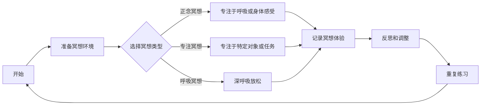
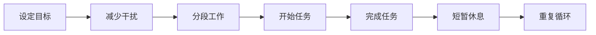
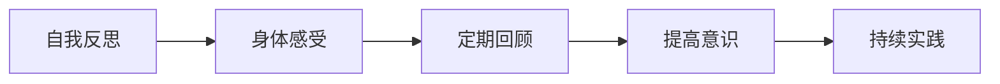
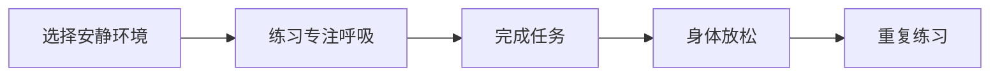
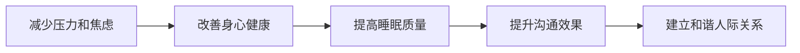
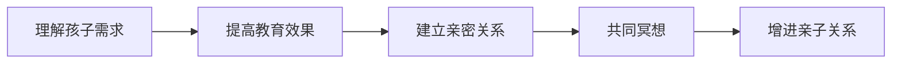

                 

### 第1章 引言：慢思考运动的背景与重要性

#### 1.1 快节奏生活的挑战

现代社会的发展带来了前所未有的机遇，同时也带来了巨大的挑战。快节奏的生活和工作方式成为现代社会的主要特征。人们为了适应这种生活方式，不断地提高工作效率，追求更高的成就。然而，这种生活方式也在无形中给人们带来了许多负面影响。

- **社会现状**：随着全球化进程的加快，工作节奏不断加快，人们面对的竞争压力也越来越大。工作时间延长、加班文化盛行，导致人们的生活质量下降，心理健康问题日益突出。
- **心理压力**：长期处于高压状态下，人们容易出现焦虑、抑郁等心理问题。研究发现，快节奏生活与心理健康问题之间存在显著关联，心理健康问题不仅影响个人的生活质量，还会对社会的稳定发展产生负面影响。
- **身心健康问题**：长时间的高压力工作会导致身体的过度劳累，引发各种健康问题，如心血管疾病、肥胖、失眠等。同时，心理压力也会影响人们的免疫系统，增加患病的风险。

#### 1.2 慢思考运动的起源

慢思考运动是一种旨在对抗快节奏生活的冥想实践。它起源于20世纪末，最初由心理学家约翰·卡贝尼（John Kabat-Zinn）提出。卡贝尼将传统的冥想技巧与现代科学相结合，创造了一种名为“正念冥想”（Mindfulness Meditation）的方法，用于帮助人们应对压力、提升心理健康。

- **传统冥想与现代科学**：传统冥想在许多文化中都有悠久的历史，是一种通过冥想和放松来达到身心平衡的技巧。而现代科学通过神经科学、心理学等学科的研究，证明了冥想在调节情绪、提高注意力和专注力等方面的有效性。慢思考运动正是将这两者结合起来，形成了一种新的实践方法。
- **心理学研究**：慢思考运动得到了心理学研究的广泛支持。多项研究表明，慢思考可以帮助人们更好地管理情绪，提高注意力集中能力，增强自我意识和自我反思能力。这些效果不仅对个人的心理健康有益，也对生活质量的提升有显著作用。

#### 1.3 慢思考运动的重要性

慢思考运动在现代社会中具有重要的意义，它不仅可以帮助人们应对快节奏生活的压力，还可以提升整体的生活品质。

- **心理调节**：慢思考运动通过冥想和放松技巧，帮助人们减轻心理压力，改善情绪管理能力。研究表明，定期进行慢思考实践的人，情绪稳定性更高，焦虑和抑郁症状减轻。
- **认知提升**：慢思考运动可以增强人们的注意力和专注力，提高认知功能。通过训练，人们能够更好地集中注意力，减少分心，提高工作效率和学习成绩。
- **生活品质**：慢思考运动不仅对心理健康有益，还对生活满意度有积极影响。通过慢思考，人们能够更好地享受生活，体验生活中的美好时刻，提升生活满意度。

#### 1.4 本书结构概述

本书旨在系统地介绍慢思考运动的背景、原理、实践方法及其在各个领域的应用。以下为本书的结构安排和预期学习效果：

- **章节安排**：本书分为七个章节，涵盖了慢思考运动的各个方面。第一章介绍慢思考运动的背景和重要性，第二章探讨慢思考的科学依据和实践方法，第三章到第六章分别介绍慢思考在各个领域的应用，第七章总结慢思考运动的意义和未来发展。
- **学习目标**：通过阅读本书，读者将能够：
  - 了解慢思考运动的起源和发展历程；
  - 掌握慢思考的核心原理和实践方法；
  - 学会如何在生活中应用慢思考，提升生活品质；
  - 理解慢思考在工作和个人发展中的价值；
  - 探索慢思考运动的未来发展趋势。

### 第2章 慢思考原理：科学依据与实践方法

#### 2.1 慢思考的定义与核心要素

慢思考，即“Slow Thinking”，是一种通过冥想、专注和自我反思来达到心理和生理平衡的方法。慢思考的定义可以简单概括为：一种有意地放慢思维速度，专注于当前时刻，减少外界干扰，以提高心理和认知功能的实践。

慢思考的核心要素包括：

- **意识**：意识是慢思考的基础。通过提高自我意识，人们可以更好地了解自己的情绪、思想和行为，从而更好地控制它们。
- **专注**：专注是慢思考的关键。通过集中注意力，人们可以减少分心，提高工作效率，增强学习效果。
- **耐心**：耐心是慢思考的重要组成部分。在快节奏的生活中，耐心可以帮助人们更好地应对压力，减少焦虑和急躁情绪。
- **自我反思**：自我反思是慢思考的重要环节。通过反思，人们可以深入思考自己的行为和决策，从中学习，不断提升自我。

#### 2.2 慢思考的科学依据

慢思考的科学依据主要来自于神经科学和心理学的研究。以下是一些关键的科学发现：

- **神经科学**：神经科学研究揭示了大脑的结构和功能，特别是与情绪管理和认知功能相关的大脑区域。例如，前额叶皮质和杏仁核在大脑中的位置和作用，以及它们在情绪调节和注意力控制中的作用。
- **心理学**：心理学研究表明，冥想和慢思考对情绪管理和认知功能有显著影响。例如，正念冥想可以减少焦虑和抑郁症状，提高注意力和专注力，增强自我意识和自我反思能力。

以下是一个简化的Mermaid ER实体关系图，用于描述慢思考的核心概念及其关系：

```mermaid
erDiagram
  Class::情绪管理 <<--|{关联} CognitiveFunction
  Class::注意力 <<--|{关联} CognitiveFunction
  Class::自我意识 <<--|{关联} CognitiveFunction
  Class::耐心 <<--|{关联} EmotionalRegulation
  CognitiveFunction ||--|{关联} Behavior
  EmotionalRegulation ||--|{关联} Behavior
```

#### 2.3 慢思考的实践方法

慢思考的实践方法主要包括冥想和日常生活中的应用。以下是一些具体的实践方法：

- **冥想**：冥想是慢思考的核心实践方法之一。常见的冥想类型包括正念冥想、专注冥想和呼吸冥想。每种冥想都有其独特的练习方法和效果。
  - **正念冥想**：正念冥想强调专注于当前的时刻，通过观察自己的呼吸、感受和思想来提高自我意识。
  - **专注冥想**：专注冥想要求参与者将注意力集中在某个特定的对象或任务上，如呼吸、声音或身体感受。
  - **呼吸冥想**：呼吸冥想专注于呼吸，通过深呼吸来放松身心，减轻压力。
- **日常实践**：将慢思考融入日常生活中也是一种有效的实践方法。以下是一些日常生活中的慢思考技巧：
  - **意识训练**：在日常生活中，通过提高自我觉察能力，如注意走路时的脚步声、感受呼吸等，来培养慢思考。
  - **注意力集中**：在进行日常任务时，尝试减少干扰，专注于当前任务，如阅读时关闭手机通知。
  - **自我反思**：在一天结束时，花时间反思自己的行为和决策，思考哪些做得好，哪些需要改进。

#### 2.4 慢思考的应用领域

慢思考的应用领域非常广泛，包括但不限于以下方面：

- **工作**：在快节奏的工作环境中，慢思考可以帮助提高工作效率和质量。通过专注和自我反思，员工可以更好地管理任务，做出更明智的决策。
- **生活**：在日常生活中，慢思考可以帮助提升生活质量。通过冥想和自我反思，人们可以更好地管理情绪，减少压力，享受生活中的美好时刻。

以下是一个简化的Mermaid流程图，用于描述慢思考的实践流程：



### 第3章 慢思考技巧：培养专注力和意识

#### 3.1 培养专注力的方法

专注力是慢思考的重要组成部分，通过以下方法可以有效培养专注力：

- **意识训练**：意识训练是提高专注力的基础。通过自我观察，了解自己在什么情况下容易分心，然后有意识地练习集中注意力。例如，在走路时，专注于脚下的感觉，感受每一步的触地、抬起过程。

- **注意力集中**：在日常生活中，可以通过以下技巧来提高注意力集中：
  - **设定目标**：在开始一项任务前，设定清晰的目标，明确任务的优先级。
  - **减少干扰**：在工作和学习时，尽量减少干扰因素，如关闭手机通知，将手机放在远离工作区域的地方。
  - **分段工作**：将大任务分解为小任务，逐一完成，每完成一项后进行短暂休息。

以下是一个简化的Mermaid流程图，用于描述培养专注力的步骤：



#### 3.2 提高意识的方法

提高意识是慢思考的核心，以下方法可以帮助提高意识：

- **自我反思**：通过定期反思自己的行为和决策，了解自己在不同情境下的反应，从而提高自我觉察能力。例如，每天晚上花几分钟时间回顾一天的经历，思考哪些做得好，哪些需要改进。

- **身体感受**：通过关注身体感受，提高对身体的意识。例如，在坐下工作时，注意身体的姿势是否舒适，感受身体的紧张和放松状态。

以下是一个简化的Mermaid流程图，用于描述提高意识的方法：



#### 3.3 练习专注力的练习

以下是一些具体的练习专注力的方法：

- **专注练习**：选择一个安静的环境，闭上眼睛，专注于呼吸。感受每次吸气和呼气的过程，尽量减少其他干扰。每次练习持续5-10分钟，每天练习几次。

- **任务专注**：在完成一项任务时，将手机和电脑通知关闭，专注于任务的完成。一旦开始任务，不要随意中断，直到任务完成或达到一个明确的阶段性目标。

- **身体放松**：在紧张的工作或学习后，通过深呼吸和渐进性肌肉放松来放松身体，这有助于恢复专注力。

以下是一个简化的Mermaid流程图，用于描述练习专注力的步骤：



#### 3.4 意识提升的实践

将意识提升融入日常生活是一种有效的实践方法，以下是一些建议：

- **日常生活中的应用**：在日常生活中，可以通过以下方法提高意识：
  - **吃饭时**：专注于食物的味道和口感，细嚼慢咽，感受每一次咀嚼。
  - **走路时**：专注于脚下的感觉，感受每一步的触地和抬起。
  - **休息时**：闭上眼睛，专注于呼吸，感受身体的放松。

- **遇到困难时的应对**：在遇到困难或挑战时，可以通过以下方法来提高意识：
  - **深呼吸**：通过深呼吸来缓解紧张和焦虑，专注于呼吸的感觉。
  - **自我反思**：反思自己的行为和决策，了解问题的根源，寻找解决方案。

以下是一个简化的Mermaid流程图，用于描述意识提升在日常生活和困难应对中的应用：


### 第4章 慢思考在工作中的应用

#### 4.1 工作中慢思考的价值

在快节奏的工作环境中，慢思考可以帮助员工提高工作效率、提升决策质量，从而在职场中脱颖而出。以下是一些慢思考在工作中的具体价值：

- **效率提升**：通过专注和自我反思，员工可以更好地管理时间和任务，减少不必要的干扰和分心，从而提高工作效率。慢思考帮助员工在工作中保持专注，专注于当前任务，避免被琐事打扰。

- **决策质量**：慢思考有助于员工在做出决策时更加冷静和理性。通过自我反思，员工可以更好地分析问题，考虑各种可能的解决方案，并从中选择最优的决策。这种理性决策不仅能够提高工作效率，还能减少错误和失误。

以下是一个简化的Mermaid流程图，用于描述慢思考在提升效率和决策质量中的应用：


#### 4.2 工作中的慢思考实践

为了将慢思考融入工作，员工可以采取以下实践方法：

- **任务管理**：在任务管理中，员工可以通过以下方法应用慢思考：
  - **明确任务目标**：在开始任务前，明确任务的目标和优先级，确保任务的方向清晰。
  - **分解任务**：将大任务分解为小任务，逐一完成，每完成一项后进行简要反思，确保任务的顺利进行。
  - **定时休息**：在工作过程中，定期休息，进行短暂的冥想或放松，以恢复专注力和精力。

以下是一个简化的Mermaid流程图，用于描述慢思考在任务管理中的应用：


- **时间管理**：在时间管理中，员工可以通过以下方法应用慢思考：
  - **设定优先级**：根据任务的重要性和紧急性，设定任务的优先级，确保时间和精力被合理分配。
  - **避免拖延**：通过自我反思，了解自己在面对不同任务时的拖延原因，采取相应措施来克服拖延。
  - **计划时间表**：制定合理的时间表，合理安排工作和休息时间，确保工作与生活之间的平衡。

以下是一个简化的Mermaid流程图，用于描述慢思考在时间管理中的应用：


#### 4.3 案例分析

以下是一些慢思考在工作中的成功案例：

- **案例1：提升工作效率**
  - **背景**：某公司的项目经理李明在工作中经常感到压力巨大，任务繁多，效率低下。
  - **解决方案**：李明开始尝试通过冥想和自我反思来提升专注力和工作效率。他每天早上花5分钟进行冥想，专注于呼吸和当下的感受。同时，他在任务管理中采用了分解任务和定时休息的方法，将大任务分解为小任务，每完成一项后进行短暂的冥想放松。通过这些实践，李明的效率显著提升，工作压力减轻。

- **案例2：优化决策质量**
  - **背景**：某公司的产品经理张丽在面对重要的产品决策时，常常感到犹豫不决，担心决策失误。
  - **解决方案**：张丽开始通过慢思考来提升决策质量。她每天晚上花时间进行自我反思，回顾当天的行为和决策，分析哪些做得好，哪些需要改进。同时，她在决策前通过冥想来保持冷静和专注，避免冲动和情绪化。通过这些实践，张丽的决策质量显著提升，产品的市场表现也得到了改善。

以上案例表明，慢思考在工作中的应用可以帮助员工提高工作效率和决策质量，从而在职场中取得更好的成绩。

### 第5章 慢思考在生活中的应用

#### 5.1 生活中的慢思考

慢思考不仅可以帮助我们在工作中提高效率和决策质量，也可以在日常生活中提升生活质量。以下是一些将慢思考融入日常生活的方法：

- **日常习惯**：将慢思考融入日常生活中的习惯，可以帮助我们更好地管理情绪和压力。例如，每天早上起床后，花几分钟时间进行冥想，专注于呼吸和当下的感受。在吃饭时，细嚼慢咽，专注于食物的味道和口感。在走路时，感受脚下的地面，专注于当下的体验。

- **情绪管理**：通过慢思考，我们可以更好地理解自己的情绪，并学会有效地管理情绪。例如，当遇到困难或挫折时，我们可以通过冥想来放松身心，减少焦虑和紧张情绪。同时，通过自我反思，我们可以了解自己在不同情境下的情绪反应，并寻找有效的方法来调节情绪。

以下是一个简化的Mermaid流程图，用于描述将慢思考融入日常生活的步骤：


#### 5.2 生活质量提升

慢思考对提升生活质量有显著的积极作用。以下是一些具体表现：

- **身心健康**：慢思考可以帮助我们减少压力和焦虑，从而改善身心健康。通过冥想和自我反思，我们可以学会更好地管理情绪，减少心理压力。同时，慢思考也有助于提高睡眠质量，促进身心健康。

- **人际关系**：通过慢思考，我们可以更好地理解自己和他人，提高沟通效果。例如，在与他人交流时，我们可以专注于对方的感受和需求，避免冲动和误解。此外，慢思考还可以帮助我们更好地处理冲突，建立和谐的人际关系。

以下是一个简化的Mermaid流程图，用于描述慢思考对生活质量的提升：



#### 5.3 家庭生活与教育

在家庭生活中，慢思考可以帮助我们建立更加和谐的家庭关系，提高教育质量。以下是一些具体方法：

- **家庭教育**：通过慢思考，父母可以更好地理解孩子的需求和感受，从而提高教育效果。例如，在与孩子沟通时，父母可以专注于孩子的情感和需求，避免过于情绪化和冲动。同时，慢思考还可以帮助父母培养孩子的情绪管理和自我反思能力。

- **亲子关系**：慢思考有助于父母和孩子之间建立更加亲密和信任的关系。通过共同的冥想和自我反思，父母和孩子可以更好地理解彼此，增进亲子关系。

以下是一个简化的Mermaid流程图，用于描述慢思考在家庭生活和教育中的应用：



### 第6章 慢思考运动的推广与实践

#### 6.1 慢思考运动的推广

要推广慢思考运动，首先需要提高社会对慢思考运动的认知。以下是一些推广策略：

- **宣传和教育活动**：通过媒体、讲座、研讨会等形式，向公众宣传慢思考运动的好处和实践方法。可以邀请专家进行讲座，介绍慢思考的科学依据和实践案例，提高公众的认知度。

- **社会支持**：政府和非政府组织可以提供资金、政策和资源支持，推动慢思考运动的普及。例如，设立专项基金，用于开展慢思考研究和实践项目，提供慢思考培训课程。

- **社区参与**：鼓励社区组织和个人参与慢思考运动，例如，在社区中心、健身房、学校等地设立慢思考实践空间，提供免费或低成本的慢思考课程和活动。

以下是一个简化的Mermaid流程图，用于描述慢思考运动的推广策略：


#### 6.2 慢思考实践

在个人和组织层面，可以将慢思考融入日常生活和工作实践中。以下是一些具体的实践方法：

- **个人实践**：个人可以通过以下方法进行慢思考实践：
  - **定期冥想**：每天花几分钟时间进行冥想，专注于呼吸和当下的感受。
  - **自我反思**：定期进行自我反思，回顾自己的行为和决策，寻找改进的机会。
  - **专注练习**：在日常生活中，通过减少干扰和专注于当前任务，提高专注力。

以下是一个简化的Mermaid流程图，用于描述个人实践慢思考的步骤：


- **组织实践**：组织可以通过以下方法推广慢思考运动：
  - **培训课程**：为员工提供慢思考培训课程，教授冥想和自我反思技巧，帮助员工提高专注力和情绪管理能力。
  - **工作环境**：创造一个支持慢思考的工作环境，例如，设立冥想室或提供冥想时间，鼓励员工在工作间隙进行冥想和放松。
  - **企业文化**：将慢思考融入企业文化，倡导员工在工作中保持专注和冷静，提高工作效率和决策质量。

以下是一个简化的Mermaid流程图，用于描述组织实践慢思考的方法：


#### 6.3 慢思考运动的影响与未来

慢思考运动对社会和个人都产生了深远的影响。以下是一些主要影响和未来发展趋势：

- **社会影响**：慢思考运动有助于提高公众的心理健康水平，减少压力和焦虑。此外，它还有助于提高工作效率，改善人际关系，促进社会和谐。通过推广慢思考运动，可以提升整个社会的幸福感和生活质量。

- **未来趋势**：随着科技的发展和人们对心理健康重视程度的提高，慢思考运动在未来有望得到更广泛的推广和应用。未来，慢思考可能会与科技相结合，通过智能设备和应用程序提供个性化的慢思考指导和实践。

以下是一个简化的Mermaid流程图，用于描述慢思考运动的影响和未来发展趋势：


### 第7章 总结与展望

#### 7.1 慢思考运动的意义

慢思考运动在现代社会中具有重要意义。首先，它帮助人们应对快节奏生活的压力，改善心理健康。通过冥想和自我反思，人们可以更好地管理情绪，减少焦虑和压力。其次，慢思考运动有助于提高工作效率和决策质量。通过专注和自我反思，人们可以更好地集中注意力，减少分心，提高工作效率。此外，慢思考运动还有助于提升生活质量，改善人际关系。通过关注当下，人们可以更好地享受生活中的美好时刻，提升生活满意度。

#### 7.2 读者指南

为了更好地学习本书内容，读者可以采取以下方法：

- **阅读顺序**：按照章节顺序阅读，从背景和原理开始，逐步深入到实践方法和应用领域。
- **实践应用**：在阅读过程中，尝试将所学知识应用于日常生活和工作实践中，例如，定期冥想、自我反思等。
- **问题讨论**：参与相关的讨论和交流，与其他读者分享学习心得和实践经验。

#### 7.3 拓展阅读

为了进一步深入了解慢思考运动，读者可以参考以下书籍和在线资源：

- **书籍推荐**：
  - 《慢思考：加速世界的心理学策略》（BPS人物奖获奖作品）
  - 《正念：生活的新技能》（乔·卡贝尼著）
  - 《冥想的艺术：现代生活的智慧指南》（Sharon Salzberg著）

- **在线资源**：
  - Coursera上的《正念冥想与生活》（由乔·卡贝尼教授授课）
  - 网易云课堂的《慢思考与高效工作》课程
  - 慢思考相关的TED演讲和YouTube视频

通过这些书籍和在线资源，读者可以更全面地了解慢思考运动的理论和实践，进一步提升自己的意识和专注力。

### 结语

慢思考运动是一种对抗快节奏生活的有效实践方法。通过冥想、专注和自我反思，人们可以提升心理健康，提高工作效率，改善生活质量。本书系统地介绍了慢思考运动的原理、实践方法及其在各个领域的应用。希望读者通过阅读本书，能够更好地理解和实践慢思考，享受更美好的生活。让我们慢下来，用心感受生活的每一个瞬间。**作者：AI天才研究院/AI Genius Institute & 禅与计算机程序设计艺术 /Zen And The Art of Computer Programming**

