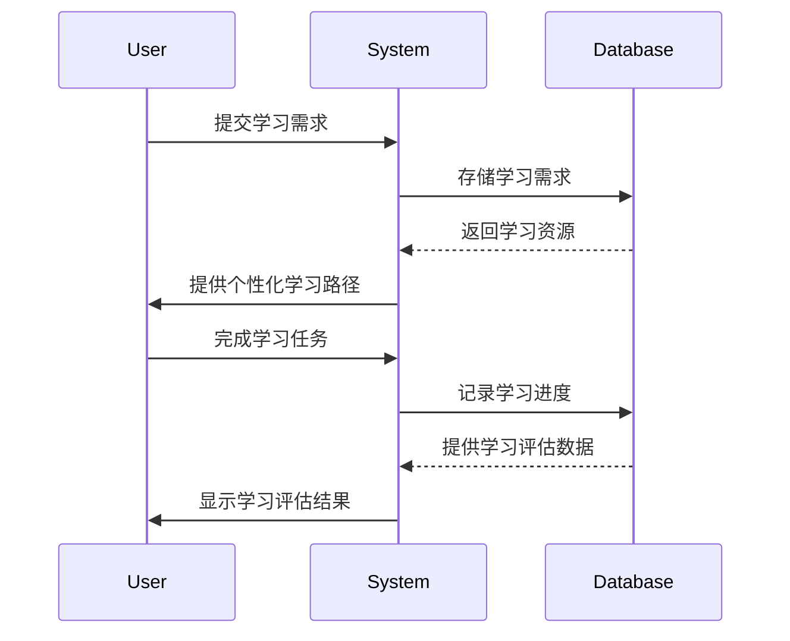
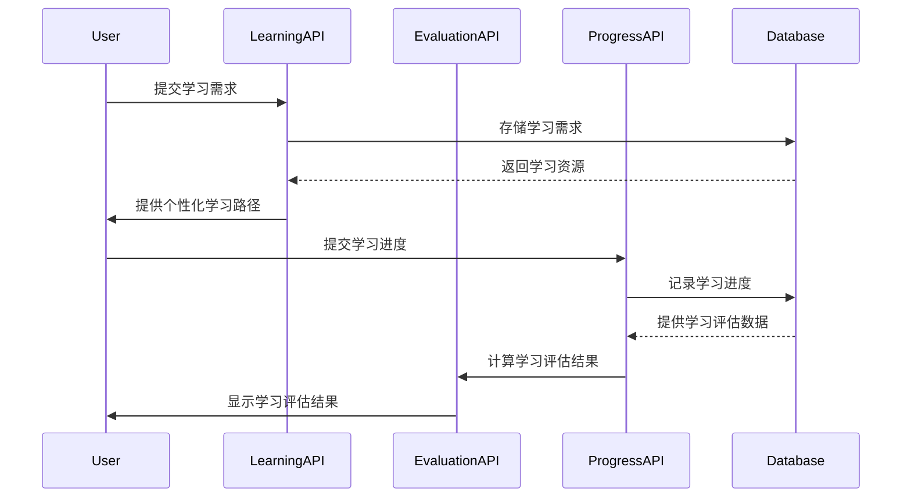

                 

### 慢思考运动：对抗快节奏生活的精神实践

> 关键词：慢思考、快节奏生活、精神实践、心理健康、决策优化、深度工作、生活方式变革

在当今这个信息爆炸、竞争激烈的时代，快节奏的生活已经成为许多人的日常。从早晨闹钟响起到深夜才关灯，我们似乎总是在追赶时间，生怕稍不留神就会被淘汰。然而，这样的生活方式不仅对我们的身体健康造成了影响，还极大地损害了我们的心理健康。慢思考运动（Slow Thinking Movement）应运而生，它提倡通过精神实践来对抗快节奏生活的压力，让我们重新找回生活的平衡和意义。

本文将深入探讨慢思考运动的背景、核心概念、实践技巧以及其在各个领域的应用，旨在为广大读者提供一套切实可行的方法，帮助大家应对快节奏生活的挑战。我们将会一步步分析慢思考的原理和实践方法，并通过案例分享和最佳实践，帮助读者在实际生活中更好地应用慢思考，从而实现心理健康和生活的平衡。

## 1.1 问题背景

### 1.1.1 快节奏生活的挑战

在快节奏的生活中，人们面临着诸多挑战。首先，时间管理成为了一大难题。许多人每天都在为完成各种任务而疲于奔命，常常感到时间不够用，导致工作、生活和休息之间的平衡难以维持。其次，快节奏生活带来的压力不容忽视。随着工作节奏的加快，人们在工作中承受的压力也日益增加，长期处于高压状态会导致身心健康问题。此外，快节奏生活还可能导致人际关系的疏离。由于时间紧张，人们往往没有足够的时间与家人和朋友相处，导致感情疏远。

### 1.1.2 慢思考的重要性

慢思考（Slow Thinking）作为一种应对快节奏生活的精神实践，越来越受到关注。慢思考并不是简单地放慢生活节奏，而是一种深层次的思维方式和行为习惯。它强调在决策、工作和日常生活中，我们应该更加理性、全面地思考问题，而不是被短期利益和情绪所驱使。慢思考的重要性体现在以下几个方面：

1. **提高决策质量**：慢思考可以帮助我们更好地评估各种选择，避免因冲动或情绪化而做出错误的决策。通过深度思考，我们可以更加清晰地看到问题的各个方面，从而做出更加明智的选择。

2. **减轻压力**：快节奏生活带来的压力是许多心理问题的根源。慢思考可以帮助我们放慢节奏，减少焦虑和紧张感，从而改善心理健康。

3. **提升工作效率**：慢思考并不是拖延的代名词，相反，它可以帮助我们更加高效地完成任务。通过深度工作法，我们可以在有限的时间内完成更多高质量的工作。

4. **改善人际关系**：慢思考有助于我们更好地理解和沟通他人，从而改善人际关系。在处理冲突和沟通问题时，慢思考可以帮助我们更加冷静和理智，避免情绪化的冲突。

## 1.2 核心概念

### 1.2.1 慢思考的定义

慢思考，顾名思义，是一种相对较慢的思考过程。它不仅仅是指速度上的减慢，更是一种深度和广度的扩展。慢思考强调在思考过程中要深入挖掘问题的本质，全面考虑各种因素，避免被表面现象或短期利益所迷惑。慢思考的核心目标是通过提高思维的质量，帮助我们做出更加明智的决策和行动。

### 1.2.2 慢思考与传统思考方式的对比

传统思考方式通常是一种快速的、直觉性的反应。在面对问题时，人们往往会迅速做出判断，而很少深入思考。这种方式虽然在某些情况下是有效的，但往往容易导致错误的决策和行动。相比之下，慢思考更加强调理性分析、深度挖掘和全面考虑。它要求我们在面对问题时，不仅要看到问题的表面，还要深入思考其背后的原因和可能的后果。

### 1.2.3 慢思考的优势

1. **提高决策质量**：慢思考可以帮助我们更加全面地评估各种选择，从而避免因冲动或情绪化而做出错误的决策。

2. **减轻压力**：慢思考可以帮助我们放慢节奏，减少焦虑和紧张感，从而改善心理健康。

3. **提升工作效率**：通过深度工作法，我们可以在有限的时间内完成更多高质量的工作。

4. **改善人际关系**：慢思考有助于我们更好地理解和沟通他人，从而改善人际关系。

## 1.3 慢思考运动的起源与发展

### 1.3.1 慢思考运动的起源

慢思考运动的起源可以追溯到20世纪末期。随着信息技术和全球化进程的加速，人们的生活节奏越来越快，心理健康问题也日益突出。一些心理学家开始倡导通过慢思考来缓解压力和提高生活质量。这一理念逐渐得到了广泛认同，并开始在全球范围内推广。

### 1.3.2 慢思考运动的发展历程

在过去的几十年中，慢思考运动经历了多个发展阶段。最初，它主要是一种心理健康实践的倡导。随着研究的深入，人们开始认识到慢思考在决策、工作、教育和人际关系等多个领域的广泛应用。如今，慢思考已经成为一种全球性的生活方式运动，吸引了越来越多的人参与。

### 1.3.3 慢思考运动的主要理念

慢思考运动的主要理念可以概括为以下几点：

1. **重视深度工作**：鼓励人们在工作中投入更多的时间和精力，深入思考问题，从而提高工作效率和质量。

2. **提倡慢生活方式**：倡导人们在日常生活中放慢节奏，享受生活的每一个细节，从而减轻压力，提高生活质量。

3. **强调心理健康**：认识到心理健康在现代社会中的重要性，倡导通过慢思考来改善心理健康。

4. **推动社会变革**：通过推广慢思考，希望引起社会各界对快节奏生活的反思，推动社会变革，实现更加平衡和健康的生活方式。

## 1.4 慢思考运动的应用领域

### 1.4.1 工作与职业

在职场中，慢思考运动提倡通过深度工作法来提高工作效率。深度工作法要求人们在工作时专注投入，避免分心和干扰，从而在有限的时间内完成更多高质量的工作。这种工作方法不仅能够提高个人的职业素养，还能够为企业创造更大的价值。

### 1.4.2 教育与学习

在教育领域，慢思考运动强调培养学生的深度思考和批判性思维能力。通过引导学生深入探究问题的本质，教育者可以帮助学生建立更加扎实和全面的知识体系。此外，慢思考运动还提倡终身学习，鼓励人们在各个年龄段持续学习新知识，提升自己的能力。

### 1.4.3 个人生活与心理健康

在个人生活中，慢思考运动提倡通过冥想、深度阅读、户外活动等方式来放慢节奏，减轻压力，提高生活质量。通过慢思考，人们可以更加全面地了解自己的内心需求，建立更加健康和稳定的人际关系。此外，慢思考运动还强调心理健康的重要性，倡导通过心理辅导和咨询来改善心理健康。

## 1.5 本章小结

本章主要介绍了慢思考运动的背景、核心概念、起源和发展，以及其在工作、教育和个人生活等领域的应用。通过慢思考，我们可以提高决策质量，减轻压力，提升工作效率，改善人际关系，从而实现心理健康和生活的平衡。在接下来的章节中，我们将进一步探讨慢思考的基本技巧和实践方法，帮助读者更好地理解和应用慢思考，以应对快节奏生活的挑战。## 2.1 深度工作法

### 2.1.1 什么是深度工作法

深度工作法（Deep Work）是一种提升工作效率和创造力的方法，它强调在无干扰的状态下，全身心投入工作，以达到最佳的工作效果。深度工作法不仅关注工作的时间和数量，更注重工作的质量和深度。通过深度工作，人们可以在有限的时间内完成更多高质量的任务，从而提升个人和团队的绩效。

### 2.1.2 实践深度工作法的步骤

要实践深度工作法，可以遵循以下步骤：

1. **选择合适的工作环境**：一个安静、无干扰的环境有助于深度工作的开展。可以选择图书馆、安静的咖啡馆或家中专门的工作区域。

2. **设定专注时间**：根据个人的生物钟和工作任务，设定每天或每周的专注时间。例如，每天早晨9点到中午12点，或每周的周一和周三下午进行深度工作。

3. **使用专注工具**：利用专注工具如番茄钟（Pomodoro Technique），将工作时间分为25分钟专注期和5分钟休息期。通过这种方式，可以提高专注力，防止疲劳。

4. **减少干扰**：在深度工作期间，尽量减少干扰。可以关闭手机通知、邮件提醒等，确保工作环境的纯净。

5. **设定明确的目标**：在开始深度工作之前，设定明确的工作目标。这有助于提高工作的目的性和效率。

6. **定期评估和调整**：定期评估深度工作的效果，并根据评估结果进行调整。例如，如果发现某个时间段工作效率较低，可以尝试调整专注时间或工作环境。

### 2.1.3 深度工作法的益处

1. **提升专注力**：深度工作法有助于提高专注力，减少分心，从而在有限的时间内完成更多任务。

2. **增强创造力**：在无干扰的环境中，人们更容易进入心流状态（Flow），从而激发创造力和创新能力。

3. **提高工作效率**：通过减少干扰和明确目标，深度工作法有助于提高工作效率，缩短完成任务所需的时间。

4. **提升工作质量**：深度工作法强调工作的质量和深度，从而确保任务的高质量完成。

### 2.1.4 深度工作法案例分析

以一位程序员为例，他通过实践深度工作法，将每天的工作时间从4小时提升到8小时，且工作质量显著提高。具体做法如下：

1. **选择最佳工作时间段**：该程序员发现自己在早晨的注意力最为集中，因此将深度工作安排在早晨的9点到12点。

2. **使用番茄钟**：他将每个专注期设定为25分钟，每完成一个专注期后休息5分钟。

3. **减少干扰**：他关闭了手机通知，并告诉团队成员在这段时间内不要打扰他。

4. **设定明确的目标**：每个深度工作时段开始前，他都会列出当天需要完成的任务，并设定优先级。

5. **定期评估**：每周他都会评估深度工作的效果，并根据反馈调整工作计划。

通过实践深度工作法，该程序员不仅显著提升了工作效率，还改善了工作质量，得到了领导和同事的认可。

### 2.1.5 深度工作法常见问题与解决策略

1. **问题：难以长时间保持专注**
   - 解决策略：尝试逐渐增加专注时间，每周增加5分钟的专注时长，直到找到适合自己的专注时长。

2. **问题：容易受到外部干扰**
   - 解决策略：选择一个安静的环境，关闭手机通知，并告知同事和家人在特定时间内不要打扰。

3. **问题：缺乏动力**
   - 解决策略：设定明确的目标和奖励机制，如完成任务后奖励自己一段时间的休息或享受喜欢的活动。

4. **问题：工作完成后感觉疲惫**
   - 解决策略：确保在深度工作前有足够的休息，并在工作期间适当休息，避免过度疲劳。

通过解决这些问题，可以更好地实践深度工作法，提高工作效率和质量。

### 2.1.6 本章小结

深度工作法是一种提升工作效率和创造力的有效方法。通过选择合适的工作环境、设定专注时间、减少干扰、设定明确的目标和定期评估，人们可以在快节奏的生活中找到一片宁静的天地，从而提高工作和生活质量。在接下来的章节中，我们将继续探讨慢思考的其他实践方法，帮助读者在日常生活中更好地应用慢思考，实现心理健康和生活的平衡。## 2.2 冥想练习

### 2.2.1 冥想的原理

冥想（Meditation）是一种通过专注和放松来提高心理和生理健康的实践。它的原理主要基于以下几点：

1. **专注力训练**：冥想要求人们将注意力集中在某一对象上，如呼吸、声音或视觉图像。通过反复练习，可以增强专注力，减少分心。

2. **放松身心**：冥想过程中，身体逐渐放松，压力水平降低。这有助于减轻焦虑、压力和抑郁症状，提高心理健康。

3. **意识扩展**：冥想可以拓展人们的意识范围，帮助人们更好地了解自己的内心世界，提升自我意识和自我接纳。

4. **调节情绪**：冥想能够调节大脑中的情绪调节区域，如前额叶皮层和杏仁核，从而改善情绪状态。

### 2.2.2 初学者的冥想练习

对于初学者来说，以下是一套简单的冥想练习：

1. **选择一个安静的环境**：找一个没有干扰的地方，可以是在家中的卧室、书房，或室外的公园。

2. **准备冥想姿势**：可以选择坐姿、躺姿或半躺姿，确保身体舒适，脊柱保持直立。

3. **专注呼吸**：闭上眼睛，将注意力集中在呼吸上。感受每次吸气时腹部微微膨胀，每次呼气时腹部轻轻收缩。

4. **保持专注**：在呼吸过程中，如果注意力开始分散，轻轻地将注意力拉回到呼吸上。每次分心后，重新开始专注呼吸。

5. **设定冥想时长**：初学者可以从5分钟开始，逐渐增加时长，每周至少进行3-5次。

### 2.2.3 冥想的日常应用

1. **早晨冥想**：在早晨起床后进行冥想，有助于启动新的一天，提升精神状态。

2. **工作间隙冥想**：在工作中的休息时间进行短时间的冥想，有助于放松身心，提高工作效率。

3. **睡前冥想**：在睡前进行冥想，有助于放松身心，改善睡眠质量。

### 2.2.4 冥想的技巧和要点

1. **保持耐心**：冥想是一项长期练习，需要耐心和持续的实践。不要期望立即看到显著的效果，重要的是持续练习。

2. **避免过度用力**：冥想时应避免过度用力或紧张，保持身体和思维的放松。

3. **专注与接纳**：在冥想过程中，不要试图改变任何感受或情绪，而是接纳当下的状态。

4. **避免中途放弃**：如果在中途感到疲惫或分心，可以稍微休息，然后重新开始冥想。

### 2.2.5 冥想的应用场景和案例

1. **压力管理**：通过冥想，可以有效地减轻工作和生活中的压力。例如，一位经常感到压力的程序员，通过每天早晨的冥想，显著改善了心理状态，提高了工作效率。

2. **焦虑缓解**：冥想有助于缓解焦虑和紧张情绪。一位患有焦虑症的职场人士，通过定期的冥想练习，逐渐减轻了焦虑症状，提升了生活质量。

3. **情绪调节**：冥想可以调节情绪，帮助人们更好地应对生活中的挑战。例如，一位经常情绪波动的家长，通过每日的冥想练习，学会了更好地控制自己的情绪，改善了家庭关系。

### 2.2.6 本章小结

冥想作为一种简单而有效的心理实践，可以帮助我们在快节奏的生活中找到一片宁静的天地。通过专注力训练、放松身心、意识扩展和情绪调节，冥想不仅有助于提升心理健康，还能够提高我们的生活质量。在接下来的章节中，我们将继续探讨慢思考的其他实践方法，帮助读者在日常生活中更好地应用慢思考，实现心理健康和生活的平衡。## 2.3 决策慢思考

### 2.3.1 决策慢思考的重要性

在快节奏的生活中，决策往往需要在短时间内做出，这可能导致我们容易受到情绪和压力的影响，从而做出不够明智的选择。决策慢思考（Deliberative Decision-Making）则强调在决策过程中放慢节奏，通过全面分析和理性评估来提高决策质量。决策慢思考的重要性体现在以下几个方面：

1. **减少错误决策**：通过深度分析和理性评估，决策慢思考可以减少因冲动或情绪化而做出的错误决策。

2. **提高决策质量**：慢思考可以帮助我们全面考虑各种选择，评估其长期影响，从而做出更加明智的决策。

3. **增强决策自信**：通过慢思考，我们可以更加自信地面对决策结果，因为决策过程是基于充分分析和理性评估的。

4. **提升整体效能**：慢思考可以帮助我们避免因错误决策带来的损失，从而提高整体工作和生活质量。

### 2.3.2 决策慢思考的实践方法

要实践决策慢思考，可以遵循以下步骤：

1. **明确决策目标**：在开始决策之前，明确决策的目标和期望结果。这有助于确保决策过程的针对性和有效性。

2. **收集信息**：全面收集与决策相关的信息，包括正反两方面的数据和分析。确保信息的准确性和完整性。

3. **评估选项**：对收集到的信息进行分析，评估每个选项的优缺点、可能的风险和收益。可以使用评分表或决策矩阵来帮助评估。

4. **咨询他人**：在决策过程中，可以征求家人、朋友或专业人士的意见，以获得不同的视角和见解。

5. **设定决策时间**：为决策过程设定一个合理的时间，避免因时间压力而做出仓促的决定。

6. **反复审查**：在决策完成后，对决策进行反复审查，确保决策的合理性和可行性。

### 2.3.3 决策慢思考案例分析

以下是一个具体的决策慢思考案例：

**案例背景**：一家小型科技公司的CEO需要在年底前决定是否扩大产品线。

**决策慢思考过程**：

1. **明确决策目标**：CEO的目标是确保公司的长期发展，同时保持盈利能力。

2. **收集信息**：
   - 市场调研报告显示，目标市场对该产品的需求增长迅速。
   - 销售团队反馈，现有产品的用户对扩展产品线持积极态度。
   - 成本分析显示，扩展产品线需要的资金投入较大。

3. **评估选项**：
   - 选项A：扩大产品线，可能带来更高的市场份额和收入，但需要大量资金。
   - 选项B：维持现有产品线，风险较低，但可能错失市场份额增长机会。

4. **咨询他人**：CEO与销售经理、财务总监和研发团队进行了深入讨论，收集了他们的意见和建议。

5. **设定决策时间**：CEO决定在两周内做出最终决策，以便有足够时间进行充分的分析和评估。

6. **反复审查**：在决策过程中，CEO不断审查和分析信息，最终确定了选项A，并制定了详细的执行计划。

通过决策慢思考，CEO做出了明智的决策，确保了公司的长期发展。

### 2.3.4 决策慢思考与情绪管理

1. **避免情绪化决策**：情绪可能会影响决策的客观性和理性。通过决策慢思考，可以减少情绪化决策，提高决策质量。

2. **情绪调节技巧**：在决策过程中，可以运用冥想等情绪调节技巧，保持冷静和理智，从而做出更加明智的决策。

3. **情绪释放**：在决策完成后，可以通过适当的情绪释放方法，如运动、社交等，缓解因决策带来的压力和焦虑。

### 2.3.5 本章小结

决策慢思考是一种提高决策质量和情绪管理的重要方法。通过明确决策目标、收集信息、评估选项、咨询他人、设定决策时间和反复审查，我们可以减少错误决策，提高决策质量和自信。在实际应用中，决策慢思考可以帮助我们更好地应对生活中的各种挑战，实现长期目标和心理健康。在接下来的章节中，我们将继续探讨慢生活方式的概念和实践方法，帮助读者在日常生活中更好地应用慢思考，实现心理健康和生活的平衡。## 2.4 慢生活方式

### 2.4.1 慢生活的理念

慢生活方式（Slow Living）是一种追求生活质量和幸福感的理念。它强调放慢节奏，享受生活的每一个细节，而不是盲目地追求速度和效率。慢生活的核心在于重新定义“成功”和“幸福”，认为生活的质量比单纯的物质追求更为重要。慢生活的理念可以从以下几个方面来理解：

1. **平衡工作与生活**：慢生活提倡在工作与生活之间找到平衡，避免因工作压力而忽视家庭和个人生活。

2. **注重心理健康**：慢生活关注心理健康，通过冥想、深度阅读、户外活动等方式，减轻压力，提升幸福感。

3. **享受当下**：慢生活鼓励人们活在当下，专注于当前的体验，而不是被未来的担忧或过去的遗憾所困扰。

4. **尊重自然**：慢生活强调与自然的和谐共处，提倡低碳、环保的生活方式。

### 2.4.2 实现慢生活的策略

要实现慢生活，可以采取以下策略：

1. **制定时间表**：合理安排时间，确保工作、家庭和个人生活的平衡。使用日程表或时间管理工具，避免日程过于紧凑。

2. **减少社交媒体使用**：过度使用社交媒体会导致时间浪费和心理压力。适当减少社交媒体的使用时间，专注于有意义的活动。

3. **练习冥想**：通过冥想和呼吸练习，放松身心，减轻焦虑和压力。冥想可以每天进行，每次10-15分钟。

4. **重视家庭和朋友**：与家人和朋友共度时光，加强人际关系。可以安排定期的家庭聚会或朋友聚餐。

5. **户外活动**：利用周末或假期进行户外活动，如徒步、骑行、野餐等。与自然接触有助于放松心情，提升幸福感。

6. **减少物质消费**：减少不必要的物质消费，关注自己的需求和价值观。通过购买可持续产品，减少对环境的负面影响。

### 2.4.3 慢生活的影响

1. **提高幸福感**：慢生活通过减少压力和焦虑，提升心理健康，从而提高幸福感。

2. **增强人际关系**：慢生活强调与家人和朋友共度时光，有助于加强人际关系，提升生活质量。

3. **提升工作效率**：通过合理安排时间，减少因过度工作导致的疲劳，从而提高工作效率。

4. **促进可持续发展**：慢生活提倡低碳、环保的生活方式，有助于促进可持续发展。

### 2.4.4 慢生活的实践案例

以一位城市白领为例，他通过实践慢生活，显著提升了生活质量和幸福感。具体实践方法如下：

1. **制定时间表**：每天制定详细的时间表，确保工作、家庭和个人时间的平衡。

2. **减少社交媒体使用**：每天设定固定的社交媒体使用时间，其余时间专注于工作或家庭。

3. **练习冥想**：每天早晨和晚上各进行15分钟的冥想，帮助放松身心。

4. **重视家庭和朋友**：每周安排时间与家人和朋友聚餐，加强人际关系。

5. **户外活动**：周末参加户外徒步活动，享受与自然接触的时光。

6. **减少物质消费**：通过购买可持续产品和二手物品，减少对环境的负面影响。

通过实践慢生活，该白领不仅减轻了工作压力，还提升了生活质量，实现了心理健康和生活的平衡。

### 2.4.5 本章小结

慢生活方式是一种追求生活质量和幸福感的理念，通过放慢节奏、减少压力、注重心理健康和增强人际关系，有助于提高生活质量。实现慢生活可以采取制定时间表、减少社交媒体使用、练习冥想、重视家庭和朋友、户外活动和减少物质消费等策略。在快节奏的生活中，实践慢生活有助于我们找到生活的平衡，实现心理健康和幸福感。在接下来的章节中，我们将继续探讨慢思考在日常生活中的具体应用，帮助读者更好地实践慢思考，提升生活质量。## 2.5 慢思考在日常生活中的应用

### 2.5.1 工作中的慢思考应用

在职场中，慢思考的应用可以帮助我们提高工作效率、质量和决策水平。以下是一些具体的方法：

1. **项目规划**：在开始一个新项目时，通过慢思考制定详细的规划，明确项目的目标、任务和时间表。这样可以避免项目过程中因目标不明确或计划不周导致的时间浪费。

2. **决策制定**：在面对复杂决策时，运用慢思考来收集信息、分析选项、评估风险和收益。这样可以减少冲动决策，提高决策质量。

3. **时间管理**：使用慢思考来合理安排工作时间，确保在有限的时间内完成更多高质量的任务。例如，通过设定专注时段和休息时间，实现高效工作。

4. **团队合作**：在团队合作中，通过慢思考来理解团队成员的立场和需求，提高沟通效果和协作效率。

### 2.5.2 学习中的慢思考应用

在学习过程中，慢思考的应用可以帮助我们提高学习效果、理解和记忆知识。

1. **深度阅读**：通过慢思考来深入理解阅读材料，不仅关注文字内容，还要思考作者的意图和观点。这样可以提高阅读效果，加深对知识的理解。

2. **复习与总结**：在复习课程内容时，使用慢思考来回顾和总结知识点，构建知识框架。这有助于巩固记忆，提高学习效果。

3. **批判性思维**：在学习和研究过程中，通过慢思考来培养批判性思维能力，对所学知识进行质疑和验证，从而形成更加独立和全面的见解。

### 2.5.3 个人生活中的慢思考应用

在个人生活中，慢思考的应用可以帮助我们提高生活质量、减少压力和提升幸福感。

1. **时间管理**：通过慢思考来合理安排个人时间，确保工作、休息和娱乐之间的平衡。这样可以减少时间压力，提升生活质量。

2. **情绪管理**：在面对压力和挑战时，通过慢思考来调节情绪，避免情绪化反应。例如，通过冥想、呼吸练习等方法，保持冷静和理智。

3. **人际关系**：通过慢思考来理解他人，提高沟通效果，建立良好的人际关系。这有助于减少冲突，提升幸福感。

4. **健康维护**：通过慢思考来关注自己的身体状况，合理安排饮食和锻炼，保持健康的生活习惯。

### 2.5.4 实际案例和效果分析

以下是一个实际案例，展示了慢思考在个人生活中的应用效果：

**案例背景**：一位工作繁忙的白领，由于长时间的工作压力，导致身心健康问题。他决定通过慢思考来改善生活质量。

**慢思考应用**：

1. **时间管理**：他通过制定时间表，合理安排工作时间，确保有足够的休息时间。例如，每天晚上设定固定的休息时间，避免工作过度。

2. **情绪管理**：他通过冥想和呼吸练习来调节情绪，减少焦虑和压力。每天早晨和晚上各进行10分钟的冥想，帮助身心放松。

3. **健康维护**：他通过合理安排饮食和锻炼，保持健康的生活方式。每周安排三次健身课程，并保持每天饮水量。

**效果分析**：

通过慢思考的应用，这位白领显著改善了生活质量。他的工作效率提高了，身心状态得到了改善，家庭关系也更加和谐。此外，他还学会了更好地管理时间和情绪，减少了工作压力，提升了幸福感。

### 2.5.5 本章小结

慢思考在日常生活中的应用可以帮助我们提高工作效率、学习效果和生活质量。通过在工作和学习中运用慢思考，我们可以做出更明智的决策，提高工作质量；通过在个人生活中运用慢思考，我们可以更好地管理时间和情绪，提升生活质量。在实际应用中，通过具体的方法和策略，我们可以逐步实现慢思考，从而找到生活的平衡，提升幸福感。在接下来的章节中，我们将进一步探讨慢思考与心理健康的关系，以及慢思考在心理治疗中的应用。## 3.1 慢思考与心理健康的关系

### 3.1.1 慢思考对心理健康的积极影响

慢思考（Slow Thinking）作为一种深层次的思维方式，对心理健康具有显著的积极影响。以下是其对心理健康的具体积极影响：

1. **减轻压力**：快节奏的生活常常伴随着高压环境，而慢思考通过放慢思维过程，减少焦虑和紧张感，有助于减轻压力。研究表明，通过冥想和深度工作等慢思考实践，可以显著降低应激激素（如皮质醇）的水平，从而改善心理健康。

2. **提高情绪调节能力**：慢思考有助于人们更好地理解和控制自己的情绪。通过深度分析和理性评估，人们可以更清晰地认识到自己的情绪波动，并采取有效的调节策略。例如，通过冥想，个体能够学会在面对负面情绪时保持冷静，从而减少情绪波动。

3. **提升自我意识**：慢思考鼓励个体对自身的行为和思维过程进行深入反思，从而提高自我意识。这种自我反思有助于个体认识到自己的优点和不足，促进个人成长和发展。例如，在决策过程中，通过慢思考，个体可以更加清楚地认识到自己的价值观和目标，从而做出更加符合自身利益的决策。

4. **增强心理韧性**：心理韧性是指个体在面对压力和挑战时能够适应和恢复的能力。慢思考通过提高个体的自我调节能力和认知灵活性，有助于增强心理韧性。例如，在经历挫折或失败时，通过慢思考，个体能够更加理性地分析问题，找到解决问题的方法，从而更快地恢复。

### 3.1.2 慢思考与心理问题的关系

虽然慢思考对心理健康有积极影响，但个体在快节奏生活中可能会面临各种心理问题，如焦虑、抑郁和压力过大等。慢思考在这些心理问题的治疗和预防中扮演着重要角色：

1. **焦虑缓解**：焦虑是一种常见的心理问题，表现为过度担忧和紧张。慢思考通过减少外部干扰和深度分析，有助于缓解焦虑症状。例如，通过冥想，个体可以学会将注意力集中在当下，减少对未来的过度担忧。

2. **抑郁预防**：抑郁是一种严重的心理问题，表现为持续的低落情绪和兴趣丧失。慢思考通过提高个体的自我意识和情绪调节能力，有助于预防抑郁的发生。例如，通过深度反思，个体可以更好地理解自己的情绪波动，从而采取有效的调节策略。

3. **压力管理**：在快节奏的生活中，压力过大是普遍存在的问题。慢思考通过放慢思维节奏和深度分析，有助于个体更好地应对压力。例如，通过深度工作，个体可以在有限的时间内完成更多高质量的任务，从而减少工作压力。

### 3.1.3 慢思考对心理健康的影响机制

慢思考对心理健康的影响主要通过以下机制实现：

1. **神经可塑性**：冥想和深度工作等慢思考实践可以促进大脑神经可塑性，即大脑结构和功能的适应性改变。研究表明，通过冥想，大脑中的海马体和前额叶皮层等区域会发生变化，从而提高情绪调节能力和认知功能。

2. **认知资源管理**：慢思考通过优化认知资源的管理，减少心理负荷。例如，通过深度工作，个体可以更有效地分配注意力和认知资源，避免分心和过度疲劳。

3. **情绪调节**：慢思考通过提高个体的情绪调节能力，减少负面情绪的影响。例如，通过冥想，个体可以学会在面对压力时保持冷静，从而减少情绪波动。

4. **自我意识**：慢思考通过提高个体的自我意识，帮助个体更好地理解和管理自己的情绪和行为。例如，通过深度反思，个体可以更清楚地认识到自己的情绪波动，从而采取有效的调节策略。

### 3.1.4 慢思考实践对心理健康的效果评估

研究表明，慢思考实践对心理健康有显著的积极效果。以下是一些具体的研究发现：

1. **焦虑和抑郁症状缓解**：多项研究表明，通过冥想和深度工作等慢思考实践，焦虑和抑郁症状可以得到显著缓解。例如，一项关于冥想的研究发现，参与者经过8周冥想训练后，焦虑和抑郁症状显著减轻。

2. **认知功能提升**：慢思考实践有助于提高个体的认知功能，如注意力、记忆力和执行功能。一项关于深度工作的研究发现，参与者经过4周的深度工作训练后，注意力集中时间和任务完成质量显著提高。

3. **情绪调节能力增强**：慢思考实践可以提高个体的情绪调节能力，减少负面情绪的影响。例如，一项关于冥想的研究发现，参与者经过8周冥想训练后，情绪调节能力显著提升。

4. **心理健康指标改善**：慢思考实践可以改善多个心理健康指标，如生活满意度、心理韧性等。一项关于慢生活的研究发现，参与者在实施慢生活策略后，生活满意度和心理韧性显著提高。

总之，慢思考作为一种精神实践，对心理健康有显著的积极影响。通过实践慢思考，个体可以减轻压力、提高情绪调节能力、增强心理韧性和提升认知功能，从而实现更好的心理健康和生活质量。在接下来的章节中，我们将进一步探讨慢思考在心理治疗中的应用，以及如何通过慢思考改善心理健康。## 3.2 常见心理问题与慢思考

### 3.2.1 压力管理

在现代社会中，压力已经成为影响人们心理健康的主要问题之一。慢思考通过一系列的方法，可以有效帮助人们管理压力。

1. **压力来源**：压力主要来源于工作、生活事件以及个人对事件的反应。工作压力可能来自高强度的工作要求、紧迫的截止日期、同事间的竞争等；生活事件如家庭矛盾、经济困难、健康问题等也会导致压力。

2. **慢思考在压力管理中的应用**：
   - **深度工作法**：通过深度工作法，人们可以在有限的时间内集中精力完成工作任务，从而减少因长时间工作而产生的压力。
   - **时间管理**：通过合理安排时间，将工作和休息时间分开，避免长时间的工作导致的压力累积。
   - **情绪调节**：通过冥想和呼吸练习，人们可以在高压环境下保持冷静，减少因情绪失控导致的压力。

3. **案例分享**：
   - **案例1**：一位公司经理由于工作繁忙，经常感到压力巨大。通过学习深度工作法和时间管理技巧，他显著减少了工作压力，工作效率也有所提升。
   - **案例2**：一名学生因考试压力过大，导致情绪不稳定。通过定期冥想和深呼吸练习，他的情绪得到了有效调节，考试表现也有所改善。

### 3.2.2 焦虑缓解

焦虑是另一种常见的心理问题，慢思考提供了一系列策略来缓解焦虑。

1. **焦虑来源**：焦虑可能源于对未来的担忧、对失败的恐惧、对社交场合的紧张等。工作、学习和生活中的不确定性和挑战常常是焦虑的主要来源。

2. **慢思考在焦虑缓解中的应用**：
   - **认知重构**：通过慢思考，个体可以识别和挑战消极的思维模式，如“灾难化思维”和“以偏概全”。通过理性分析，个体可以更加客观地看待问题，从而减轻焦虑。
   - **放松训练**：通过冥想、深呼吸和渐进性肌肉放松等放松技巧，个体可以在紧张的环境下放松身心，减轻焦虑症状。
   - **正念练习**：通过正念冥想，个体可以学会专注于当下，减少对未来的过度担忧，从而缓解焦虑。

3. **案例分享**：
   - **案例1**：一名职场人士由于对工作的不确定性感到焦虑。通过参加冥想课程，他学会了正念和放松技巧，焦虑症状显著减轻。
   - **案例2**：一名学生由于即将到来的考试感到极度焦虑。通过定期进行深呼吸练习和认知重构，他的焦虑水平得到了有效控制。

### 3.2.3 抑郁预防

抑郁症是一种严重的心理疾病，慢思考可以作为一种预防策略，帮助个体避免抑郁的发生。

1. **抑郁来源**：抑郁可能源于长期的负面情绪、社会孤立、慢性压力、生物因素等。抑郁的症状包括持续的情绪低落、兴趣丧失、精力下降等。

2. **慢思考在抑郁预防中的应用**：
   - **积极心理训练**：通过积极的思考和行动，个体可以增强心理韧性，减少抑郁的风险。例如，通过设定小目标并逐步实现，个体可以提升自信心和成就感。
   - **社交支持**：通过慢思考，个体可以认识到社交支持的重要性，积极寻求和维持与家人、朋友的关系，从而减少社交孤立的风险。
   - **情绪调节**：通过冥想和正念练习，个体可以学会更好地调节情绪，减少负面情绪对心理健康的影响。

3. **案例分享**：
   - **案例1**：一名长期工作压力大的职场人士，通过定期进行冥想和与朋友交流，显著改善了情绪状态，减少了抑郁的风险。
   - **案例2**：一名曾经历失恋的年轻人，通过积极的心理训练和与心理咨询师交流，成功预防了抑郁的发生。

总之，慢思考在应对压力、焦虑和抑郁等常见心理问题中发挥着重要作用。通过认知重构、放松训练、正念练习和积极心理训练，个体可以有效地管理压力、缓解焦虑和预防抑郁，从而提高心理健康水平。在接下来的章节中，我们将探讨慢思考在心理治疗中的应用，进一步揭示慢思考在改善心理健康方面的潜力。## 3.3 慢思考在心理治疗中的应用

### 3.3.1 慢思考作为心理治疗方法

慢思考（Slow Thinking）作为一种心理治疗方法，已经在多个领域显示出其独特的优势和潜力。它通过减缓思维速度，提高认知深度，帮助患者更好地理解自己的情感和行为，从而改善心理健康。以下是慢思考在心理治疗中的主要应用：

1. **认知行为疗法（CBT）**：认知行为疗法是一种广泛接受的心理治疗方法，强调通过改变思维和行为来改善情感状态。慢思考在这一疗法中起到关键作用，帮助患者放慢思维过程，深入分析自己的认知错误和情绪反应，从而更有效地纠正负面思维模式。

2. **情绪调节**：慢思考通过提高患者的自我意识，帮助他们在情绪波动时保持冷静和理智。通过冥想和正念练习，患者可以学会观察自己的情绪，而不是被情绪所控制。这种方法有助于减少焦虑、抑郁等情绪问题。

3. **压力管理**：慢思考通过减少分心和焦虑，提高个体的专注力和情绪稳定性，从而帮助患者更好地应对生活中的压力源。例如，通过深度工作法，患者可以在有限的时间内集中精力完成任务，减少因长时间工作导致的压力积累。

4. **决策支持**：慢思考有助于患者在面对复杂决策时保持理性，避免因冲动或情绪化而做出错误决策。通过详细分析和评估各个选项，患者可以做出更加明智的决策，从而改善生活质量。

### 3.3.2 慢思考在心理治疗中的具体应用

1. **认知行为疗法中的慢思考**：
   - **认知重构**：在认知行为疗法中，患者需要识别和挑战自己的消极思维模式。慢思考帮助患者更深入地分析这些思维模式，找出其不合理之处，从而进行有效重构。
   - **情境演练**：通过慢思考，患者可以更详细地思考和模拟不同情境下的反应，从而提高应对实际情境的能力。

2. **情绪调节技术**：
   - **冥想**：冥想是慢思考的一种重要形式，通过冥想，患者可以学会专注于当下，减少对过去和未来的过度担忧，从而减轻焦虑和抑郁。
   - **正念练习**：正念练习帮助患者培养对当前情绪和感受的觉察，而不是被情绪所驱使。这种方法有助于患者更好地理解和接纳自己的情绪，减少情绪波动。

3. **压力管理策略**：
   - **深度工作**：通过深度工作法，患者可以在有限的时间内集中精力完成重要任务，从而减少因长时间工作导致的压力。
   - **时间管理**：慢思考帮助患者合理安排时间，确保工作、休息和娱乐之间的平衡，从而减轻时间压力。

### 3.3.3 案例分析：慢思考在心理治疗中的成功应用

以下是一个具体的案例分析，展示了慢思考在心理治疗中的成功应用：

**案例背景**：一位中年女性因长期工作压力和人际关系问题，感到极度焦虑和抑郁。她在心理治疗中采用了慢思考的方法。

**治疗过程**：
1. **认知重构**：治疗师帮助患者识别和挑战其消极思维模式，如“我不够好”和“别人总是对我的期望过高”。通过慢思考，患者逐步认识到这些思维的错误之处，并开始用更积极的思维方式替换它们。

2. **情境演练**：患者和治疗师一起进行情境演练，帮助患者在面对现实挑战时保持冷静和理智。通过慢思考，患者学会了在面对负面情境时，如何合理地分析和应对。

3. **冥想练习**：患者每天进行冥想和深呼吸练习，以减轻焦虑和抑郁。通过慢思考，患者学会了如何专注于当下，减少对过去和未来的过度担忧。

4. **压力管理**：治疗师指导患者使用深度工作法和时间管理技巧，帮助患者合理安排工作和休息时间，减少因长时间工作导致的压力。

**治疗效果**：
经过一段时间的慢思考训练，患者显著改善了焦虑和抑郁症状。她的情绪稳定性得到了提高，能够更好地应对工作压力和人际关系问题。此外，她的自我意识和自我接纳能力也得到了提升，生活质量显著改善。

### 3.3.4 慢思考在心理治疗中的优势

1. **个性化**：慢思考方法可以根据患者的具体情况和需求进行定制，使其更具有针对性。

2. **易于实施**：慢思考实践，如冥想、正念练习和深度工作，相对简单易行，患者可以在日常生活中轻松实践。

3. **长期效果**：慢思考实践有助于培养患者的长期心理韧性，提高其应对未来挑战的能力。

4. **兼容性**：慢思考可以与其他心理治疗方法（如认知行为疗法、正念疗法等）相结合，增强治疗效果。

总之，慢思考在心理治疗中具有显著的优势和潜力。通过减缓思维速度，提高认知深度，慢思考帮助患者更好地理解自己的情感和行为，从而改善心理健康。在接下来的章节中，我们将探讨慢思考在人际关系和团队合作中的应用，进一步揭示其在提升社交和职业成功方面的潜力。## 3.4 慢思考与人际关系

### 3.4.1 慢思考如何改善人际关系

在现代社会，人际关系对于我们的心理健康和生活质量至关重要。然而，快节奏的生活和高压环境常常导致我们难以有效地沟通和建立深层次的人际关系。慢思考（Slow Thinking）提供了一种有效的方法，帮助我们改善人际关系。以下是慢思考如何改善人际关系的几个方面：

1. **提升沟通效果**：慢思考可以帮助我们更加深入地理解和表达自己的情感和想法。通过放慢思维过程，我们可以更加准确地捕捉和传达信息，从而避免误解和冲突。

2. **增强同理心**：慢思考鼓励我们站在他人的角度思考问题，培养同理心。通过深入分析他人的需求和感受，我们可以更好地理解和支持他人，从而建立更加和谐的人际关系。

3. **减少冲突**：在处理冲突时，慢思考可以帮助我们保持冷静和理智，避免因情绪化而加剧矛盾。通过深度思考和理性分析，我们可以找到更加建设性的解决方案，从而减少冲突。

4. **增强合作能力**：慢思考有助于我们更好地理解团队成员的立场和需求，提高团队合作效率。通过深入分析问题和共同探讨解决方案，我们可以找到最佳的合作方式，从而实现共同目标。

### 3.4.2 慢思考在沟通中的应用

在沟通中，慢思考可以发挥重要作用，帮助我们更加高效地表达和倾听。以下是一些具体的方法：

1. **深度倾听**：慢思考鼓励我们放慢倾听速度，全神贯注地听取对方的观点和感受。通过深度倾听，我们可以更好地理解对方，减少误解和沟通障碍。

2. **明确表达**：在表达自己的观点时，慢思考可以帮助我们更加清晰地组织语言，避免模糊或不准确的表述。通过深思熟虑，我们可以确保自己的观点得到准确传达。

3. **非语言沟通**：慢思考还可以帮助我们更好地理解和使用非语言沟通，如肢体语言、面部表情和语调。通过观察和理解这些非语言信号，我们可以更全面地了解对方的情感和意图。

### 3.4.3 慢思考与团队合作

在团队合作中，慢思考同样发挥着重要作用。以下是一些具体的方法：

1. **共同目标设定**：通过慢思考，团队成员可以共同探讨和明确团队目标。这有助于确保每个成员都理解并认同目标，从而提高团队协作效率。

2. **问题解决**：在遇到问题时，慢思考可以帮助团队成员深入分析问题的根本原因，找到最佳解决方案。通过深度思考和集体讨论，团队可以找到更加全面和有效的解决方案。

3. **角色分配**：慢思考可以帮助团队成员更好地了解彼此的技能和兴趣，从而合理分配角色和任务。这有助于确保每个成员都能在团队中发挥最大的潜力。

4. **反馈与改进**：通过慢思考，团队成员可以更加理性地给予和接受反馈。这有助于团队不断改进和优化工作方式，提高整体绩效。

### 3.4.4 案例分析：慢思考在团队合作中的应用

以下是一个具体的案例分析，展示了慢思考在团队合作中的应用：

**案例背景**：一家初创公司的团队成员由于工作压力大和沟通不畅，导致项目进展缓慢，内部矛盾增加。

**解决过程**：
1. **共同目标设定**：团队领导通过慢思考，组织了一次深入的讨论，帮助团队成员明确项目的目标和期望。这有助于统一团队成员的方向和努力。

2. **问题解决**：在遇到技术难题时，团队成员通过慢思考，深入分析了问题的各个方面，找到了最佳解决方案。他们还共同探讨了如何优化工作流程，提高工作效率。

3. **角色分配**：通过慢思考和自我评估，团队成员重新分配了角色和任务，确保每个人都能在自己的领域发挥最大潜力。

4. **反馈与改进**：团队建立了定期的反馈机制，通过慢思考，团队成员可以理性地给予和接受反馈。这有助于团队不断改进和优化工作方式，提高了整体绩效。

**效果分析**：
通过慢思考的应用，该团队的项目进展得到了显著改善，内部矛盾减少，团队成员的满意度和工作效率也有所提升。这表明，慢思考在团队合作中具有巨大的潜力，可以帮助团队更好地实现共同目标。

### 3.4.5 本章小结

慢思考在人际关系和团队合作中发挥着重要作用。通过提升沟通效果、增强同理心、减少冲突和增强合作能力，慢思考可以帮助我们建立更加和谐的人际关系。在沟通中，慢思考帮助我们更加高效地表达和倾听；在团队合作中，慢思考帮助我们共同设定目标、解决问题、合理分配角色和持续改进。通过具体案例的分析，我们可以看到慢思考在提升团队绩效和改善人际关系中的巨大潜力。在接下来的章节中，我们将继续探讨慢思考在教育中的应用，以及如何通过慢思考培养儿童的思考能力和心理健康。## 4.1 慢思考在儿童教育中的应用

### 4.1.1 儿童慢思考的重要性

在当今这个信息爆炸和快节奏的社会中，儿童的教育方式正在经历深刻的变革。传统的填鸭式教育已经无法满足新时代的需求，而慢思考（Slow Thinking）作为一种深层次的思维方式和教育理念，逐渐受到重视。儿童慢思考的重要性体现在以下几个方面：

1. **培养深度思考能力**：慢思考鼓励儿童在学习和探索过程中深入挖掘问题的本质，从而培养深度思考能力。这种能力不仅有助于他们在学术上取得更好的成绩，还能为将来的职业生涯和终身学习奠定基础。

2. **提升创造力**：慢思考通过放慢思维节奏，减少分心和干扰，帮助儿童更加专注地思考和创造。这有助于培养儿童的创新能力，使他们能够在未来的竞争中脱颖而出。

3. **促进心理健康**：快节奏的生活和高压环境对儿童的心理健康构成了威胁。慢思考通过减少压力和焦虑，有助于改善儿童的心理健康，使他们能够更加平衡地发展。

4. **培养终身学习习惯**：慢思考鼓励儿童在学习和探索过程中保持耐心和持久性，从而培养终身学习的习惯。这种习惯有助于他们在未来面对各种挑战时保持积极的心态和解决问题的能力。

### 4.1.2 如何培养儿童的慢思考能力

要培养儿童的慢思考能力，可以采取以下策略：

1. **创造一个安全的学习环境**：儿童需要一个安全、舒适的学习环境，才能放心地探索和思考。家长和老师应该鼓励儿童提出问题，并尊重他们的好奇心。

2. **提供适当的挑战**：慢思考需要通过适当的挑战来激发。家长和老师可以设计一些适合儿童年龄和认知水平的问题和任务，鼓励他们思考解决方案。

3. **培养专注力**：专注力是慢思考的基础。家长和老师可以通过定时阅读、冥想和专注游戏等方式，培养儿童的专注力。

4. **鼓励深度阅读**：深度阅读有助于儿童培养深度思考能力。家长和老师可以鼓励儿童阅读经典文学作品和科普书籍，培养他们的阅读兴趣和思考习惯。

5. **提供多样的学习体验**：通过多样化的学习体验，如实验、讨论、户外活动等，儿童可以更加全面地理解和应用知识，从而提升慢思考能力。

### 4.1.3 慢思考教育案例分享

以下是一个具体的慢思考教育案例，展示了如何在实际教学中培养儿童的慢思考能力：

**案例背景**：某小学的一年级课堂，老师发现学生们的思维过于表面，难以深入理解课程内容。

**解决过程**：
1. **创造安全的学习环境**：老师通过营造一个开放和包容的课堂氛围，鼓励学生们自由地提问和表达自己的观点。

2. **提供适当的挑战**：老师设计了一些开放性问题，如“为什么树叶是绿色的？”和“为什么天空是蓝色的？”这些问题鼓励学生思考问题的本质，而不是仅仅记住答案。

3. **培养专注力**：老师通过定时阅读和冥想练习，帮助学生们培养专注力。例如，每天早晨进行5分钟的冥想，让学生们专注于呼吸和当下。

4. **鼓励深度阅读**：老师推荐了一些适合一年级学生的经典文学作品，如《小王子》和《安徒生童话》，鼓励学生们阅读并思考书中的故事和寓意。

5. **提供多样的学习体验**：老师组织了一次户外科学实验，让学生们通过观察和实验，了解植物的生长过程。这次实验不仅丰富了学生的知识，还激发了他们的好奇心和探索精神。

**效果分析**：
通过慢思考教育策略的实施，学生们在课堂上的表现显著改善。他们变得更加积极和专注，能够深入理解课程内容，提出更多有深度的问题。此外，他们的创造力和表达能力也得到了提升，课堂氛围更加活跃和和谐。

### 4.1.4 本章小结

慢思考在儿童教育中的应用具有重要意义。通过培养深度思考能力、提升创造力、促进心理健康和培养终身学习习惯，慢思考有助于儿童在快节奏的社会中保持平衡和竞争力。通过创造安全的学习环境、提供适当的挑战、培养专注力、鼓励深度阅读和提供多样的学习体验，我们可以有效地培养儿童的慢思考能力。在实际教学中，通过具体的案例和实践，我们可以看到慢思考对儿童教育的积极影响。在接下来的章节中，我们将探讨成人教育中的慢思考实践，以及如何通过慢思考实现终身学习。## 4.2 成人教育中的慢思考实践

### 4.2.1 成人教育中慢思考的重要性

成人教育在个人成长和职业发展过程中扮演着重要角色。然而，由于工作和生活压力，成人往往难以投入足够的时间和精力来学习新知识和技能。慢思考（Slow Thinking）作为一种深层次的思维方式和教育理念，为成人教育提供了新的视角和策略。成人教育中慢思考的重要性体现在以下几个方面：

1. **提高学习效率**：慢思考强调深入理解和消化知识，而不是简单记忆。这种思维方式有助于成人更好地吸收和运用新知识，从而提高学习效率。

2. **促进深度学习**：成人教育中的慢思考鼓励学员在学习和探索过程中深入挖掘问题的本质，培养深度学习习惯。深度学习不仅有助于提升学术水平，还能为职业发展提供有力支持。

3. **增强心理韧性**：快节奏的生活和高压环境常常导致成人心理压力增大。慢思考通过放慢学习节奏，帮助成人减轻心理压力，提高心理韧性。

4. **培养终身学习习惯**：慢思考鼓励成人将学习视为一种生活方式，而不是一项任务。通过持续学习和实践，成人可以不断提升自己的知识和技能，实现终身学习。

### 4.2.2 成人如何培养慢思考能力

为了在成人教育中培养慢思考能力，可以采取以下策略：

1. **设定明确的学习目标**：成人学员可以通过设定明确的学习目标，确保学习的针对性和有效性。例如，制定短期和长期的学习计划，明确每个阶段的目标和任务。

2. **合理安排学习时间**：成人学员需要合理安排工作和学习时间，确保有足够的时间进行深入学习。可以采用时间管理工具，如日程表和时间追踪应用程序，帮助管理学习时间。

3. **深度阅读**：通过深度阅读，成人学员可以更好地理解和消化知识。选择适合自己水平和兴趣的书籍，通过笔记和总结来巩固学习成果。

4. **积极参与讨论和反思**：成人学员可以通过参与讨论和反思，提升自己的思考深度。例如，参加学习小组或读书会，与他人分享学习心得和观点，从而促进深度思考。

5. **实践和应用**：将所学知识应用到实际工作和生活中，通过实践和应用，巩固学习成果，提高慢思考能力。

### 4.2.3 成人教育慢思考案例

以下是一个具体的成人教育慢思考案例，展示了如何在实践中培养慢思考能力：

**案例背景**：一名职场人士希望通过在线课程提升自己的专业技能。

**解决过程**：
1. **设定明确的学习目标**：学员明确了自己的学习目标，包括提升数据分析技能和项目管理能力。通过设定短期和长期目标，学员能够有针对性地选择课程和学习内容。

2. **合理安排学习时间**：学员制定了一份详细的学习计划，确保每天有固定的学习时间。例如，每天晚上7点到9点用于学习新课程，每周进行一次项目实战练习。

3. **深度阅读**：学员选择了几本有关数据分析和项目管理的经典书籍，通过深度阅读和笔记，系统地学习了相关知识。

4. **积极参与讨论和反思**：学员加入了在线学习小组，与其他学员分享学习心得和观点。通过讨论和反思，学员不仅加深了对知识的理解，还激发了新的思考角度。

5. **实践和应用**：学员将所学知识应用到实际工作中，如改进数据分析报告和项目管理流程。通过实践和应用，学员不仅巩固了学习成果，还提高了工作效率和项目质量。

**效果分析**：
通过慢思考教育策略的实施，学员在专业技能和思考能力上取得了显著提升。他的数据分析报告更加精准和全面，项目管理流程更加高效和透明。此外，学员的思考深度和逻辑能力也得到了提高，为未来的职业发展奠定了坚实基础。

### 4.2.4 本章小结

成人教育中的慢思考实践对于提高学习效率、促进深度学习、增强心理韧性和培养终身学习习惯具有重要意义。通过设定明确的学习目标、合理安排学习时间、深度阅读、积极参与讨论和反思以及实践和应用，成人学员可以有效地培养慢思考能力，提升个人综合素质。在实际案例中，我们可以看到慢思考对成人教育的积极影响。在接下来的章节中，我们将探讨慢思考与终身学习的关系，以及如何实现终身学习的慢思考。## 4.3 慢思考与终身学习

### 4.3.1 终身学习的慢思考理念

在知识爆炸和技术迅速发展的今天，终身学习已经成为个人成长和职业发展的必要条件。然而，传统的学习模式往往注重短期成果，容易导致学习的盲目性和浅尝辄止。慢思考（Slow Thinking）作为一种深层次的思维方式和教育理念，为终身学习提供了新的视角和方法。

终身学习的慢思考理念强调以下几点：

1. **深度学习**：慢思考鼓励人们深入探究问题的本质，而不仅仅是掌握表面的知识。通过深度学习，个体可以建立更加扎实和全面的知识体系，提高学习效果。

2. **持续反思**：慢思考强调在学习过程中持续反思和评估，以检验学习成果和调整学习策略。这种反思有助于个体不断优化学习方法，提高学习效率。

3. **整合应用**：慢思考鼓励将所学知识应用到实际生活和工作中，通过实践和反馈，加深对知识的理解和掌握。这种整合应用有助于知识的内化和迁移，提高知识的实用价值。

4. **平衡发展**：慢思考倡导在学习和工作、生活之间找到平衡，避免因过度学习而忽视其他重要方面。这种平衡有助于个体实现全面发展和长期成长。

### 4.3.2 如何实现终身学习的慢思考

要实现终身学习的慢思考，可以采取以下策略：

1. **设定长期学习目标**：个体可以通过设定长期学习目标，确保学习的连续性和系统性。长期目标的设定有助于个体明确学习方向，避免盲目学习。

2. **合理安排学习时间**：个体需要合理安排工作和学习时间，确保有足够的时间进行深入学习和实践。例如，每天设定固定的学习时间段，避免因工作繁忙而忽视学习。

3. **深度阅读和思考**：个体可以通过深度阅读和思考，系统地学习新知识。选择适合自己水平和兴趣的书籍和资料，通过笔记和总结来巩固学习成果。

4. **持续实践和应用**：个体需要将所学知识应用到实际生活和工作中，通过实践和反馈，加深对知识的理解和掌握。例如，参与实际项目或实践活动，将理论知识转化为实际能力。

5. **建立学习社区**：个体可以加入学习社区，与他人分享学习心得和观点，促进深度思考和知识交流。通过学习社区的互动，个体可以不断拓展视野，提高学习效果。

6. **定期反思和调整**：个体需要定期反思和评估学习效果，根据评估结果调整学习策略。例如，每年进行一次学习总结，分析学习成果和不足，制定新的学习计划。

### 4.3.3 终身学习慢思考实例

以下是一个具体的终身学习慢思考实例，展示了如何在实践中实现终身学习：

**案例背景**：一位职场人士希望通过在线课程和阅读来提升自己的职业素养。

**解决过程**：
1. **设定长期学习目标**：学员明确了自己的长期学习目标，包括提升数据分析技能、掌握项目管理知识和扩展商业视野。

2. **合理安排学习时间**：学员制定了一份详细的学习计划，每天晚上安排2小时进行学习，每周安排一次项目实战练习。

3. **深度阅读和思考**：学员选择了几本有关数据分析、项目管理和商业思维的经典书籍，通过深度阅读和笔记，系统地学习了相关知识。

4. **持续实践和应用**：学员在实际工作中将所学知识应用到数据分析报告和项目管理流程中，通过实践和反馈，加深对知识的理解和掌握。

5. **建立学习社区**：学员加入了相关的在线学习社区，与其他学员分享学习心得和观点，通过互动和交流，不断拓展视野。

6. **定期反思和调整**：学员每年进行一次学习总结，分析学习成果和不足，并根据评估结果调整学习策略。

**效果分析**：
通过慢思考的终身学习策略，学员在职业素养和技能水平上取得了显著提升。他的数据分析报告更加精准和全面，项目管理流程更加高效和透明。此外，学员的思考深度和逻辑能力也得到了提高，为未来的职业发展奠定了坚实基础。

### 4.3.4 本章小结

慢思考为终身学习提供了新的理念和方法，通过深度学习、持续反思、实践应用和建立学习社区，个体可以实现持续成长和长期发展。在终身学习过程中，设定长期学习目标、合理安排学习时间、深度阅读和思考、持续实践和应用以及定期反思和调整是关键策略。在实际案例中，我们可以看到慢思考在终身学习中的积极影响，帮助个体实现知识体系的构建和职业能力的提升。在接下来的章节中，我们将探讨如何通过系统分析和架构设计，将慢思考理念应用于实际项目中。## 4.4 教育体系的慢思考重构

### 4.4.1 问题场景介绍

随着社会的发展和科技的进步，现代教育体系面临着诸多挑战。这些问题主要集中在以下几个方面：

1. **课程设置过于理论化**：传统教育体系往往过于注重理论知识的传授，而忽视了实践能力的培养。这种课程设置容易导致学生毕业后难以迅速适应职场需求。

2. **教学方式单一**：传统的教学模式多以教师为中心，学生被动接受知识，缺乏主动探索和思考的机会。这种方式不利于培养学生的创新能力和批判性思维。

3. **评价体系不合理**：传统的考试评价体系过于强调分数和成绩，容易导致学生过度关注考试结果，而忽视了实际能力和素质的培养。

4. **教育资源分配不均**：城乡、地区之间的教育资源分配存在明显不均衡，导致一些学生在教育起点上就处于劣势。

### 4.4.2 项目介绍

为了解决上述问题，我们提出一个名为“慢思考教育重构”的项目。该项目的目标是重构现代教育体系，通过引入慢思考理念，培养具有深度思考能力和创新精神的未来人才。

### 4.4.3 系统功能设计（领域模型）

在“慢思考教育重构”项目中，我们首先定义了系统的核心功能，包括以下几个方面：

1. **个性化学习路径**：根据学生的兴趣和需求，提供个性化的学习路径，鼓励学生自主探索和学习。

2. **深度学习支持**：提供丰富的学习资源和工具，支持学生进行深度学习和思考。

3. **实践与反思**：鼓励学生将所学知识应用到实际项目中，通过实践和反思，巩固学习成果。

4. **综合评价体系**：建立综合评价体系，不仅关注学生的学术成绩，还重视学生的综合素质和创新能力。

5. **教育资源均衡分配**：通过线上和线下资源的整合，实现教育资源的均衡分配，缩小城乡和地区差距。

以下是领域模型的Mermaid类图表示：

```mermaid
classDiagram
    Class01 <|-- Class02
    Class03 <|-- Class04
    Class05 <|-- Class06
    Class01{"个性化学习路径"}
    Class02{"深度学习支持"}
    Class03{"实践与反思"}
    Class04{"综合评价体系"}
    Class05{"教育资源均衡分配"}
```

### 4.4.4 系统架构设计

在系统架构设计方面，我们采用分层架构，以实现模块化和可扩展性。以下是系统架构的Mermaid架构图表示：



### 4.4.5 系统接口设计和系统交互

在系统接口设计方面，我们定义了以下核心接口：

1. **学习需求接口**：用于接收用户的学习需求，并提供相应的学习资源。

2. **学习进度接口**：用于记录用户的学习进度，并提供学习评估数据。

3. **学习评估接口**：用于提供学习评估结果，帮助用户了解自己的学习效果。

以下是系统接口的Mermaid序列图表示：



### 4.4.6 本章小结

通过系统分析和架构设计，我们可以将慢思考理念应用于教育体系重构，实现个性化学习、深度学习、实践与反思以及综合评价。通过定义系统功能、设计系统架构和接口，我们为教育体系提供了可行的解决方案。在实际实施中，通过持续优化和改进，我们可以不断提升教育质量，培养具有深度思考能力和创新精神的未来人才。## 5. 总结与未来展望

### 5.1 慢思考运动的意义

慢思考运动是一种深刻的精神实践，旨在帮助我们在快节奏的生活中找到平衡，提高心理健康和生活质量。通过慢思考，我们不仅能够提升决策质量、减轻压力，还能够增强心理韧性和创新能力。慢思考运动的意义在于：

1. **提升个体幸福感**：慢思考帮助我们更好地管理时间和情绪，减少焦虑和压力，从而提升幸福感。

2. **优化决策过程**：慢思考通过深度分析和理性评估，帮助我们做出更加明智的决策，避免因冲动和情绪化导致的错误。

3. **促进终身学习**：慢思考鼓励我们持续学习和反思，培养深度思考能力和创新精神，适应快速变化的社会环境。

4. **改善人际关系**：慢思考提高我们的沟通能力和同理心，帮助我们建立和谐的人际关系，增强团队合作效果。

### 5.2 慢思考实践的最佳实践

在实践慢思考时，以下是一些最佳实践方法：

1. **设定明确目标**：在学习和工作中，设定清晰的目标和计划，有助于提高效率和成果。

2. **深度阅读**：选择高质量的书籍和资料，通过深度阅读和思考，提高知识吸收和运用能力。

3. **定期反思**：定期回顾和总结自己的学习和工作，识别不足并调整策略，持续优化实践效果。

4. **实践与应用**：将所学知识应用到实际生活和工作中，通过实践和反馈，加深对知识的理解和掌握。

5. **建立学习社区**：与他人分享学习心得和观点，通过交流和互动，拓展视野，提升思考深度。

### 5.3 未来展望

慢思考运动作为一种新兴的精神实践，未来还有很大的发展空间。以下是一些可能的未来方向：

1. **科学研究**：进一步研究慢思考对心理、生理和行为的影响，为慢思考的理论和实践提供更加坚实的科学依据。

2. **教育整合**：将慢思考理念整合到教育体系中，培养具有深度思考能力和创新精神的未来人才。

3. **技术应用**：开发和应用慢思考相关的技术和工具，如专注应用、情绪监控设备等，提高慢思考的实践效果。

4. **社会推广**：通过媒体、教育和公共活动，推广慢思考理念，提高公众对慢思考的认识和实践意识。

### 5.4 本章小结

慢思考运动作为一种深刻的精神实践，对个体的心理健康和生活质量具有显著影响。通过设定明确目标、深度阅读、定期反思、实践与应用和建立学习社区等最佳实践方法，我们可以有效地应用慢思考，提升生活质量。未来，慢思考运动将继续在科学研究、教育整合、技术应用和社会推广等方面发展，为构建更加平衡和谐的社会贡献力量。作者：AI天才研究院/AI Genius Institute & 禅与计算机程序设计艺术 /Zen And The Art of Computer Programming。

