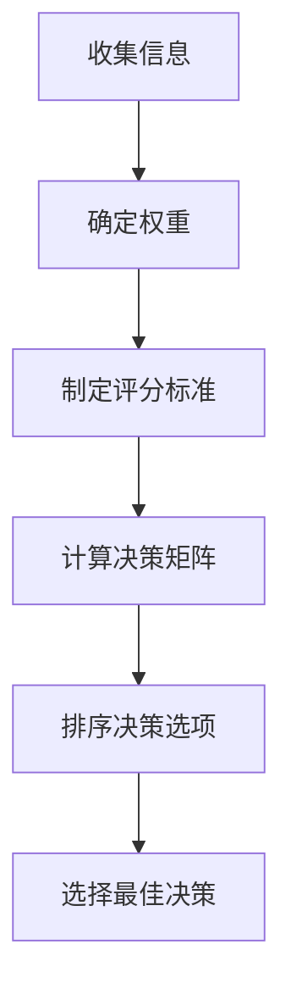
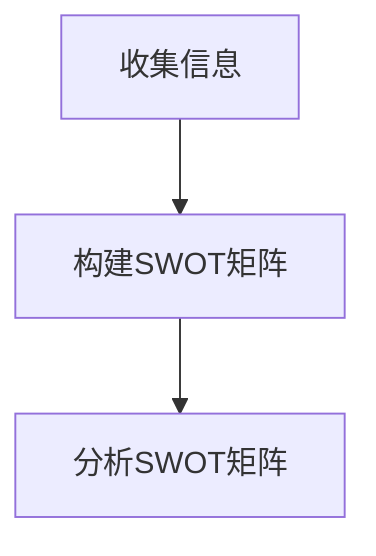

                 

# 慢思考运动：对抗快餐式决策的潮流

> 关键词：慢思考、快餐式决策、决策质量、心理压力、创新思维

> 摘要：随着信息时代的到来，决策过程变得更加复杂和迅速，快餐式决策现象愈发普遍。然而，这种快速决策方式往往忽视了思考的深度和广度，导致决策质量下降。慢思考运动应运而生，提倡人们放慢决策速度，通过深度思考和理性分析来提升决策质量。本文将探讨决策快餐化的现象和危害，慢思考运动的意义，以及如何在实际生活中应用慢思考方法。

**第1章 引言**

## 1.1 问题背景

### 1.1.1 决策的快餐化现象

随着互联网和智能设备的普及，人们面临的信息量剧增，这使得决策过程变得更加复杂和迅速。在这样的环境下，决策者往往倾向于快速做出判断，以应对日益增多的挑战。然而，这种快餐式决策方式往往忽视了思考的深度和广度，导致决策质量下降。

**核心概念与联系**

**快餐式决策：** 快餐式决策是指决策者在面临问题时，为了迅速做出决策，往往不进行深入分析和思考，而依赖于直觉、经验或参考他人的意见。这种方式虽然能快速做出决策，但往往缺乏足够的理性分析和深度思考，可能导致决策质量不高。

**慢思考：** 慢思考则是指决策者在面临问题时，通过深度思考和理性分析来做出决策。这种方式能更好地理解问题的本质，从而提高决策质量。慢思考强调深度思考、理性分析和逻辑推理，有助于避免决策过程中的盲目性和主观性。

**表格：快餐式决策与慢思考的比较**

| 比较项目 | 快餐式决策 | 慢思考 |
| --- | --- | --- |
| 决策速度 | 快速 | 缓慢 |
| 决策质量 | 一般 | 高 |
| 思考深度 | 浅 | 深 |
| 依赖直觉 | 高 | 低 |
| 依赖理性 | 低 | 高 |
| 创新能力 | 较弱 | 较强 |

**ER实体关系图架构**

```mermaid
erDiagram
  User ||--|{ Decision }: Decision_Maker
  Decision ||--|{ Fast_Decision }: Decision_Type
  Decision ||--|{ Slow_Decision }: Decision_Type
```

### 1.1.2 快餐式决策的危害

快餐式决策可能导致以下几个问题：

1. **决策质量不高：** 快餐式决策缺乏深入分析，容易导致错误的决策。长期下去，会影响个人的判断力和决策能力。

2. **压力增加：** 快速做出决策需要耗费大量心理资源，长期以往可能导致压力增加，甚至引发心理问题。

3. **创新能力下降：** 快餐式决策往往抑制了深思熟虑的决策过程，可能抑制创新思维的发展。

**核心概念与联系**

**决策质量：** 决策质量是指决策结果的合理性和有效性。快餐式决策由于缺乏深入分析，容易导致错误的决策，从而影响决策质量。

**心理压力：** 心理压力是指个体在面对决策任务时产生的心理负担。快餐式决策需要快速做出判断，可能导致心理压力增加。

**创新能力：** 创新能力是指个体在面对问题时，能够提出新颖、有效的解决方案的能力。快餐式决策往往抑制了深思熟虑的决策过程，可能抑制创新思维的发展。

**表格：快餐式决策的危害**

| 危害 | 描述 |
| --- | --- |
| 决策质量不高 | 缺乏深入分析，容易导致错误的决策 |
| 压力增加 | 快速做出决策需要耗费大量心理资源 |
| 创新能力下降 | 抑制深思熟虑的决策过程，可能抑制创新思维的发展 |

### 1.1.3 慢思考运动的意义

慢思考运动旨在提倡人们放慢决策速度，通过深度思考和理性分析来提升决策质量。慢思考运动的意义在于：

1. **提升决策质量：** 通过深度思考和理性分析，可以提高决策的准确性和可靠性。

2. **减轻心理压力：** 放慢决策速度，可以减轻决策过程中的心理负担。

3. **培养创新思维：** 深思熟虑的决策过程有助于激发创新思维，推动个人和组织的创新发展。

**核心概念与联系**

**决策质量：** 决策质量是指决策结果的合理性和有效性。慢思考运动通过提倡深度思考和理性分析，有助于提升决策质量。

**心理压力：** 心理压力是指个体在面对决策任务时产生的心理负担。慢思考运动通过减轻决策过程中的心理负担，有助于减轻心理压力。

**创新思维：** 创新思维是指个体在面对问题时，能够提出新颖、有效的解决方案的能力。慢思考运动通过培养深思熟虑的决策过程，有助于培养创新思维。

**表格：慢思考运动的意义**

| 意义 | 描述 |
| --- | --- |
| 提升决策质量 | 通过深度思考和理性分析，可以提高决策的准确性和可靠性 |
| 减轻心理压力 | 放慢决策速度，可以减轻决策过程中的心理负担 |
| 培养创新思维 | 深思熟虑的决策过程有助于激发创新思维，推动个人和组织的创新发展 |

## 1.2 书籍结构

本书将分为以下几个部分：

- **第1章：引言**，介绍决策快餐化的现象和慢思考运动的意义。
- **第2章：慢思考的基本原理**，介绍慢思考的核心概念和理论依据。
- **第3章：慢思考的应用场景**，分析慢思考在生活和工作中的应用。
- **第4章：慢思考的工具和方法**，介绍一些实用的慢思考工具和方法。
- **第5章：慢思考与快速决策的平衡**，探讨如何在快速决策和慢思考之间找到平衡。
- **第6章：慢思考的实践**，通过案例分析和实战分享，展示慢思考的实际应用。
- **第7章：慢思考的未来**，探讨慢思考运动的发展趋势和潜在影响。

## 1.3 本章小结

通过本章的介绍，我们了解了决策快餐化的现象及其危害，以及慢思考运动的意义和本书的结构。慢思考运动为我们提供了一种提升决策质量和减轻心理压力的有效途径，值得我们在生活和工作中有意识地实践和推广。

## 第2章 慢思考的基本原理

### 2.1 慢思考的定义

慢思考（Slow Thinking）是指在面对决策问题时，通过深度、系统和理性的分析过程，对信息进行充分的理解、评估和整合，从而做出更加准确、合理和可靠的决策。慢思考强调决策者在面对复杂、不确定和多变的情境时，能够保持冷静、审慎和客观，避免盲目跟从直觉和情绪，而是通过逻辑推理和系统分析来引导决策。

### 2.2 慢思考的理论依据

慢思考的理论基础主要来自于认知心理学、决策理论和行为经济学等领域的研究成果。以下是一些重要的理论依据：

1. **双过程理论（Dual-Process Theory）**

   双过程理论认为，人的思维和决策过程可以分为直觉思维和理性思维两种。直觉思维是一种快速、自动和经验驱动的过程，而理性思维是一种缓慢、有意识和分析驱动的过程。慢思考强调理性思维在决策过程中的重要性。

   **ER实体关系图架构**

   ```mermaid
   graph TB
     A[直觉思维] --> B[快速反应]
     A --> C[理性思维]
     B --> D[决策]
     C --> D
   ```

2. **启发式和偏见（Heuristics and Biases）**

   启发式是指人们在决策过程中使用的简化和规则，以减少认知负担。然而，这些启发式可能导致各种认知偏见，如确认偏见、锚定效应、代表性启发等。慢思考通过提高认知意识和理性分析能力，有助于减少这些偏见的影响。

   **表格：常见的认知偏见**

   | 名称 | 描述 |
   | --- | --- |
   | 确认偏见 | 优先考虑与已有信念一致的信息，忽视与之相矛盾的信息 |
   | 锚定效应 | 过分依赖最初接收到的信息，导致后续决策受其影响 |
   | 代表性启发 | 将某个现象与一个典型例子相比较，导致错误的概率估计 |

3. **前额叶功能（Prefrontal Cortex Function）**

   前额叶是大脑中负责执行功能、决策和社交行为的重要区域。研究表明，前额叶功能的发挥对慢思考至关重要。慢思考需要前额叶的参与，通过抑制冲动和情绪，促进理性分析和决策。

   **ER实体关系图架构**

   ```mermaid
   graph TB
     A[前额叶功能] --> B[决策]
     A --> C[情绪控制]
     A --> D[认知控制]
   ```

### 2.3 慢思考的优势

慢思考具有以下优势：

1. **提高决策质量：** 通过深度思考和理性分析，慢思考有助于更好地理解问题的本质，从而做出更加准确和可靠的决策。

2. **减少错误决策：** 慢思考能够识别和减少因直觉和情绪驱动的错误决策，降低决策风险。

3. **减轻心理压力：** 慢思考有助于决策者保持冷静和客观，减少因快速决策带来的心理负担。

4. **培养理性思维：** 慢思考能够提高个体的认知意识和理性分析能力，有助于培养批判性思维和创造力。

### 2.4 慢思考的实践方法

1. **分阶段决策：** 将决策过程分为多个阶段，每个阶段进行深入分析和评估，以确保决策的全面性和准确性。

2. **信息收集与分析：** 在决策过程中，充分收集相关信息，并对信息进行分类、筛选和整合，以便更好地理解问题。

3. **设定决策标准：** 明确决策的目标和标准，确保决策过程有据可依，避免主观偏见和情绪干扰。

4. **反思与调整：** 决策后进行反思和调整，总结经验教训，以提高未来的决策质量。

### 2.5 本章小结

本章介绍了慢思考的定义、理论依据、优势和实践方法。慢思考是一种通过深度思考和理性分析来提升决策质量的思维方式。通过了解和掌握慢思考的基本原理和实践方法，我们可以在生活和工作中更好地应对复杂的决策挑战，提高决策质量和心理素质。

## 第3章 慢思考的应用场景

### 3.1 工作决策

在职场中，决策往往涉及到资源的分配、项目规划、人员调配等多个方面。快餐式决策可能导致资源浪费、项目失败和团队士气低落。而慢思考则能够帮助决策者在面对复杂问题时，通过深度分析和理性评估，做出更加准确和有效的决策。

**案例分析：**

某互联网公司计划推出一款新产品的市场推广活动。在快餐式决策的情况下，公司可能会立即投入大量资金和资源进行推广，但由于缺乏深入的市场调研和风险评估，可能导致推广效果不佳，甚至亏损。而在采用慢思考的方法时，公司会：

1. **收集信息：** 充分收集市场数据、用户反馈、竞争对手分析等信息。
2. **分析评估：** 对收集到的信息进行分类、筛选和整合，评估推广活动的可行性和潜在风险。
3. **制定策略：** 根据评估结果，制定详细的推广计划和预算，并设定明确的决策标准。
4. **执行与调整：** 在推广活动过程中，持续监控效果，并根据实际情况进行调整。

**核心概念与联系**

**市场调研：** 市场调研是指通过收集和分析市场数据，了解市场需求、竞争状况和消费者行为等，以便制定更加科学的决策。

**风险评估：** 风险评估是指对决策可能带来的风险进行识别、评估和管理，以降低决策风险。

**决策标准：** 决策标准是指决策过程中所依据的目标、准则和衡量指标，以确保决策的合理性和有效性。

**表格：快餐式决策与慢思考在职场决策中的应用对比**

| 应用场景 | 快餐式决策 | 慢思考 |
| --- | --- | --- |
| 市场调研 | 缺乏充分的市场调研，依赖直觉和经验 | 充分进行市场调研，分析市场需求和竞争状况 |
| 风险评估 | 忽视风险评估，盲目投入资源 | 识别潜在风险，进行风险评估和管理 |
| 决策标准 | 缺乏明确的决策标准，主观性强 | 设定明确的决策标准，确保决策的合理性和有效性 |

### 3.2 日常生活决策

在日常生活中，决策也涉及到许多方面，如购物、理财、出行等。快餐式决策可能导致不必要的花费、财务风险和出行不便。而慢思考则能够帮助个体在面对日常决策时，更加理性地分析问题，做出更加明智的选择。

**案例分析：**

某人在购物时，看到一款新款手机打折促销，出于冲动立即购买。但购买后不久，发现该款手机存在一些功能上的不足，使用体验不佳。而在采用慢思考的方法时，该人会：

1. **需求分析：** 分析自己的手机使用需求，确定是否需要购买新款手机。
2. **市场调研：** 了解新款手机的功能、性能、价格等信息，与其他品牌和型号进行比较。
3. **预算规划：** 根据自身预算，制定购买计划，避免冲动消费。
4. **购买决策：** 在充分了解产品信息和预算规划后，做出明智的购买决策。

**核心概念与联系**

**需求分析：** 需求分析是指对个体的需求进行识别和评估，以便更好地满足需求。

**市场调研：** 市场调研是指通过收集和分析市场数据，了解市场需求、竞争状况和消费者行为等，以便制定更加科学的决策。

**预算规划：** 预算规划是指根据个人或家庭的经济状况，制定合理的支出计划和预算。

**表格：快餐式决策与慢思考在日常生活决策中的应用对比**

| 应用场景 | 快餐式决策 | 慢思考 |
| --- | --- | --- |
| 需求分析 | 缺乏需求分析，依赖直觉和冲动 | 进行需求分析，明确购买需求 |
| 市场调研 | 缺乏市场调研，依赖广告宣传 | 进行市场调研，了解产品信息 |
| 预算规划 | 缺乏预算规划，导致财务风险 | 制定预算规划，避免冲动消费 |

### 3.3 教育决策

在教育决策中，如选课、专业选择、职业规划等，快餐式决策可能导致不合适的教育路径，影响个人的发展和成长。而慢思考则能够帮助个体在面对教育决策时，更加理性地分析问题，做出更加明智的选择。

**案例分析：**

某学生在选择大学专业时，受到同学和家人的影响，选择了热门但并不适合自己的专业。而在采用慢思考的方法时，该人会：

1. **兴趣评估：** 评估自己的兴趣爱好，确定适合自己的专业方向。
2. **职业规划：** 了解不同专业的就业前景和职业发展路径，进行职业规划。
3. **选课规划：** 根据职业规划和学科要求，制定合理的选课计划。
4. **持续反思：** 在学习过程中，持续反思和调整，确保教育决策的科学性和有效性。

**核心概念与联系**

**兴趣评估：** 兴趣评估是指对个体的兴趣爱好进行识别和评估，以便选择适合自己的专业方向。

**职业规划：** 职业规划是指根据个人特点和职业目标，制定职业发展路径和行动计划。

**选课规划：** 选课规划是指根据专业要求和学科要求，制定合理的选课计划。

**表格：快餐式决策与慢思考在教育决策中的应用对比**

| 应用场景 | 快餐式决策 | 慢思考 |
| --- | --- | --- |
| 兴趣评估 | 缺乏兴趣评估，依赖他人意见 | 进行兴趣评估，选择适合自己的专业方向 |
| 职业规划 | 缺乏职业规划，依赖热门专业 | 制定职业规划，了解就业前景和职业发展路径 |
| 选课规划 | 缺乏选课规划，随意选择课程 | 根据职业规划和学科要求，制定合理的选课计划 |

### 3.4 个人成长决策

在个人成长过程中，如学习新技能、拓展人际关系、规划未来等，快餐式决策可能导致目标不明确、执行力不足和成长速度缓慢。而慢思考则能够帮助个体在面对个人成长决策时，更加理性地分析问题，做出更加明智的选择。

**案例分析：**

某人在学习新技能时，看到某个热门技能的课程宣传，立即报名学习。但学习一段时间后，发现该技能并不符合自己的兴趣和职业规划，导致学习动力不足。而在采用慢思考的方法时，该人会：

1. **目标评估：** 评估自己的学习目标，确定是否需要学习新技能。
2. **技能评估：** 了解新技能的相关知识和应用领域，评估是否适合自己的兴趣和职业规划。
3. **学习规划：** 根据目标和技能评估结果，制定合理的学习计划。
4. **持续反思：** 在学习过程中，持续反思和调整，确保学习目标的科学性和有效性。

**核心概念与联系**

**目标评估：** 目标评估是指对个人的学习目标进行识别和评估，以便制定科学的学习计划。

**技能评估：** 技能评估是指对新的技能进行识别和评估，以便确定是否适合自己的兴趣和职业规划。

**学习规划：** 学习规划是指根据学习目标和技能评估结果，制定合理的学习计划。

**表格：快餐式决策与慢思考在个人成长决策中的应用对比**

| 应用场景 | 快餐式决策 | 慢思考 |
| --- | --- | --- |
| 目标评估 | 缺乏目标评估，盲目学习 | 进行目标评估，明确学习目标 |
| 技能评估 | 缺乏技能评估，依赖广告宣传 | 进行技能评估，了解技能相关知识和应用领域 |
| 学习规划 | 缺乏学习规划，随意学习 | 制定学习规划，确保学习目标的科学性和有效性 |

### 3.5 本章小结

本章通过分析工作决策、日常生活决策、教育决策和个人成长决策等场景，展示了慢思考在决策过程中的应用。快餐式决策往往导致决策质量不高、心理压力增加和创新能力下降，而慢思考则能够帮助决策者通过深度思考和理性分析，提升决策质量、减轻心理压力和培养创新思维。在实际应用中，决策者应根据不同场景的特点，灵活运用慢思考方法，提高决策的科学性和有效性。

## 第4章 慢思考的工具和方法

### 4.1 决策矩阵法

决策矩阵法是一种基于逻辑和数学原理的决策工具，适用于处理复杂的多因素决策问题。通过构建决策矩阵，决策者可以系统地分析各个因素之间的相互关系和权重，从而做出更加准确和合理的决策。

**算法原理讲解**

1. **定义决策矩阵**

   决策矩阵是一个二维表格，其中行表示决策选项，列表示决策因素。每个单元格表示某个决策选项在某个决策因素上的得分。

2. **构建决策矩阵**

   - 收集信息：收集与决策相关的各种信息，包括决策选项和决策因素。
   - 确定权重：为每个决策因素分配权重，表示其对决策结果的重要性。
   - 制定评分标准：为每个决策因素制定评分标准，以便对决策选项进行评估。

3. **计算决策矩阵**

   - 根据评分标准和权重，为每个决策选项计算总分。
   - 根据总分对决策选项进行排序，选择得分最高的选项作为最佳决策。

**Python源代码**

```python
import pandas as pd

# 构建决策矩阵
options = ['选项1', '选项2', '选项3']
factors = ['因素1', '因素2', '因素3']
weights = [0.3, 0.2, 0.5]
scores = [
    [3, 2, 4],  # 选项1得分
    [2, 3, 3],  # 选项2得分
    [4, 1, 2]   # 选项3得分
]

# 计算总分
matrix = pd.DataFrame(scores, index=options, columns=factors)
total_scores = matrix * weights
best_option = total_scores.idxmax()

print(f"最佳决策选项：{best_option}")
```

**Mermaid流程图**



**通俗易懂地举例说明**

假设某公司在选择新办公楼时，需要考虑以下三个因素：地理位置（因素1）、租金（因素2）和面积（因素3）。公司为每个因素分配权重，分别为0.3、0.2和0.5。然后，公司根据评分标准，为每个候选办公楼在三个因素上打分，如下表所示：

| 办公楼 | 地理位置 | 租金 | 面积 |
| --- | --- | --- | --- |
| 选项1 | 3 | 2 | 4 |
| 选项2 | 2 | 3 | 3 |
| 选项3 | 4 | 1 | 2 |

根据决策矩阵法，公司可以计算出每个候选办公楼的得分：

- 选项1：3 * 0.3 + 2 * 0.2 + 4 * 0.5 = 3.3
- 选项2：2 * 0.3 + 3 * 0.2 + 3 * 0.5 = 2.7
- 选项3：4 * 0.3 + 1 * 0.2 + 2 * 0.5 = 2.2

根据得分，公司可以选择得分最高的选项1作为最佳决策。

**核心概念与联系**

**决策矩阵：** 决策矩阵是一个用于分析决策选项和决策因素的表格，可以帮助决策者系统地评估各个决策选项的优劣。

**权重：** 权重表示决策因素对决策结果的重要性，通常用数值表示。

**评分标准：** 评分标准用于对决策选项进行评估，以便计算得分。

**表格：决策矩阵法的关键概念**

| 关键概念 | 描述 |
| --- | --- |
| 决策矩阵 | 用于分析决策选项和决策因素的表格 |
| 权重 | 表示决策因素对决策结果的重要性 |
| 评分标准 | 用于对决策选项进行评估的准则 |

### 4.2 SWOT分析法

SWOT分析法是一种常用的战略规划工具，用于评估企业的优势（Strengths）、劣势（Weaknesses）、机会（Opportunities）和威胁（Threats）。通过SWOT分析，企业可以全面了解自身的内外部环境，从而制定更加科学和有效的战略规划。

**算法原理讲解**

1. **收集信息**

   - 优势：分析企业在资源、能力、品牌、市场等方面的优势。
   - 劣势：分析企业在管理、运营、产品、市场等方面的劣势。
   - 机会：分析外部环境中可能对企业有利的因素，如市场趋势、政策变化、技术发展等。
   - 威胁：分析外部环境中可能对企业造成不利影响的因素，如竞争加剧、法规变化、市场波动等。

2. **构建SWOT矩阵**

   - 将优势、劣势、机会和威胁分别列出，并对其进行分类和总结。

3. **分析SWOT矩阵**

   - 分析优势与劣势的匹配度，确定企业内部资源与外部环境的适应性。
   - 分析机会与威胁的关系，制定相应的应对策略。

**Python源代码**

```python
import pandas as pd

# 构建SWOT矩阵
swot = {
    '优势': ['品牌优势', '技术创新', '市场拓展'],
    '劣势': ['管理不善', '运营效率低', '产品线单一'],
    '机会': ['政策扶持', '市场需求增长', '技术进步'],
    '威胁': ['竞争对手', '法规变化', '市场波动']
}

# 创建DataFrame
df = pd.DataFrame(swot)

print(df)
```

**Mermaid流程图**



**通俗易懂地举例说明**

假设某企业进行SWOT分析，结果如下：

| SWOT | 描述 |
| --- | --- |
| 优势 | 品牌优势、技术创新、市场拓展 |
| 劣势 | 管理不善、运营效率低、产品线单一 |
| 机会 | 政策扶持、市场需求增长、技术进步 |
| 威胁 | 竞争对手、法规变化、市场波动 |

通过分析SWOT矩阵，企业可以发现：

- 优势与机会：技术创新和市场拓展是企业的主要优势，与政策扶持和市场需求增长形成良好的匹配。
- 劣势与威胁：管理不善和运营效率低是企业的主要劣势，需要加强管理提升运营效率，以应对竞争对手和法规变化的挑战。

**核心概念与联系**

**SWOT分析：** SWOT分析是一种用于评估企业优势、劣势、机会和威胁的工具，有助于企业制定科学和有效的战略规划。

**优势：** 企业在资源、能力、品牌、市场等方面的优势。

**劣势：** 企业在管理、运营、产品、市场等方面的劣势。

**机会：** 外部环境中可能对企业有利的因素。

**威胁：** 外部环境中可能对企业造成不利影响的因素。

**表格：SWOT分析的核心概念**

| 关键概念 | 描述 |
| --- | --- |
| SWOT分析 | 评估企业优势、劣势、机会和威胁的工具 |
| 优势 | 企业在资源、能力、品牌、市场等方面的优势 |
| 劣势 | 企业在管理、运营、产品、市场等方面的劣势 |
| 机会 | 外部环境中可能对企业有利的因素 |
| 威胁 | 外部环境中可能对企业造成不利影响的因素 |

### 4.3本章小结

本章介绍了决策矩阵法和SWOT分析法两种慢思考工具。决策矩阵法通过构建决策矩阵和计算总分，帮助决策者系统地分析决策选项和决策因素，从而做出更加准确和合理的决策。SWOT分析法则通过评估企业的优势、劣势、机会和威胁，帮助决策者全面了解企业的内外部环境，制定科学和有效的战略规划。这些工具和方法在决策过程中具有重要作用，可以帮助决策者提升决策质量和科学性。

## 第5章 慢思考与快速决策的平衡

### 5.1 快速决策的优势与劣势

**优势**

1. **迅速响应：** 快速决策有助于及时应对突发事件和变化，保持竞争优势。
2. **降低成本：** 快速决策可以节省时间和资源，降低决策过程中的沟通和协调成本。
3. **提高效率：** 快速决策能够提高决策者的工作效率，减少等待和拖延的时间。

**劣势**

1. **决策质量不高：** 快速决策往往缺乏深入分析和思考，容易导致错误的决策。
2. **心理压力增加：** 快速决策需要决策者迅速做出判断，可能导致心理压力增加，影响决策者的身心健康。
3. **抑制创新思维：** 快速决策可能抑制深思熟虑的决策过程，导致决策者过于依赖直觉和经验，难以激发创新思维。

### 5.2 慢思考的优势与劣势

**优势**

1. **提高决策质量：** 慢思考通过深度思考和理性分析，有助于更好地理解问题的本质，从而做出更加准确和可靠的决策。
2. **减轻心理压力：** 慢思考有助于决策者保持冷静和客观，减少因快速决策带来的心理负担。
3. **培养创新思维：** 慢思考能够激发决策者的思维深度和广度，有助于培养创新思维，推动个人和组织的创新发展。

**劣势**

1. **决策速度较慢：** 慢思考需要更多的时间和精力，可能导致决策速度较慢，影响决策者的工作效率。
2. **资源消耗较大：** 慢思考需要决策者投入更多的认知资源和精力，可能导致资源消耗较大。
3. **可能陷入分析瘫痪：** 在面对复杂问题时，慢思考可能导致决策者陷入分析瘫痪，难以做出决策。

### 5.3 快速决策与慢思考的平衡

为了在快速决策和慢思考之间找到平衡，决策者可以采取以下策略：

1. **分阶段决策：** 将决策过程分为快速决策和慢思考两个阶段。对于简单、常规和紧急的问题，可以采用快速决策；对于复杂、重要和长期的问题，可以采用慢思考。

2. **设定决策时间：** 为每个决策设定具体的时间限制，鼓励决策者在限定时间内进行深度思考和理性分析，避免过度拖延。

3. **灵活调整策略：** 根据问题的复杂性和紧急程度，灵活调整决策策略。在紧急情况下，可以适当采用快速决策；在复杂和重要问题上，可以适当延长决策时间，采用慢思考。

4. **培养决策能力：** 通过学习和实践，提高决策者的认知能力和思维能力，使他们能够更有效地进行快速决策和慢思考。

5. **利用工具和方法：** 运用决策矩阵法、SWOT分析法等工具和方法，帮助决策者更科学地进行决策，提高决策质量和效率。

### 5.4 本章小结

快速决策和慢思考各有优势和劣势，决策者在实际决策过程中需要根据问题的复杂性和紧急程度，灵活调整决策策略。通过分阶段决策、设定决策时间、灵活调整策略、培养决策能力和利用工具方法，决策者可以在快速决策和慢思考之间找到平衡，提高决策质量和效率，实现个人和组织的可持续发展。

## 第6章 慢思考的实践

### 6.1 案例分析

**案例背景**

某科技公司计划开发一款新的智能办公系统，以提高企业内部的办公效率和协作能力。然而，由于项目复杂性和时间紧迫，项目团队在决策过程中面临着快速决策和慢思考之间的矛盾。

**慢思考实践步骤**

1. **明确目标和需求**

   项目团队首先明确了开发智能办公系统的目标和需求，包括提高办公效率、改善协作体验、降低运营成本等。这一步骤确保了团队在决策过程中有明确的方向和依据。

2. **充分收集信息**

   项目团队通过市场调研、用户访谈和竞品分析，收集了大量的信息，包括用户需求、技术趋势、市场环境等。这些信息为后续的决策提供了重要的参考。

3. **评估风险和机会**

   项目团队对项目的风险和机会进行了详细评估，包括技术实现的可行性、市场接受度、竞争对手情况等。通过评估，团队明确了项目的潜在风险和机会，为决策提供了更加全面的视角。

4. **构建决策矩阵**

   项目团队采用决策矩阵法，将不同的决策选项（如技术方案、合作伙伴、资金分配等）和决策因素（如技术成熟度、成本、市场前景等）进行了系统分析。通过决策矩阵，团队能够更清晰地了解各个决策选项的优劣，从而做出更加科学的决策。

5. **制定详细计划**

   在综合考虑各项因素后，项目团队制定了详细的开发计划，包括项目进度、资源分配、风险评估和应对措施等。这一计划为项目的顺利推进提供了明确的指导。

6. **执行与监控**

   项目团队在执行过程中，持续监控项目进度和效果，根据实际情况进行调整和优化。通过慢思考的方法，团队能够在复杂的环境中保持冷静和理性，及时应对各种挑战。

**案例成果**

通过慢思考的实践，项目团队成功开发了智能办公系统，并在市场上取得了良好的反响。系统的推出不仅提高了企业内部的办公效率和协作能力，还为企业节省了大量的运营成本。此外，项目的成功也增强了团队对慢思考方法的信心和认可，为后续项目的决策提供了宝贵的经验。

### 6.2 实战分享

**实战步骤**

1. **确立目标和需求**

   在实际工作中，确立目标和需求是慢思考实践的第一步。通过明确项目目标，团队可以确保在决策过程中有明确的方向和依据，避免盲目行动。

2. **收集信息和数据**

   收集信息和数据是慢思考的重要环节。通过市场调研、用户访谈、竞品分析等方式，团队可以全面了解项目的外部环境和内部资源，为决策提供依据。

3. **评估风险和机会**

   在决策过程中，评估风险和机会是至关重要的一环。通过详细的风险评估和机会分析，团队可以更好地预测项目可能面临的挑战和机遇，为决策提供参考。

4. **运用决策工具**

   决策工具如决策矩阵法、SWOT分析法等可以帮助团队更科学地进行决策。通过运用这些工具，团队可以更加系统地分析决策选项和决策因素，提高决策质量。

5. **制定详细计划**

   在综合考虑各项因素后，制定详细计划是确保项目顺利推进的关键。详细计划应包括项目进度、资源分配、风险评估和应对措施等，以确保项目目标实现。

6. **执行与监控**

   在执行过程中，持续监控项目进度和效果，根据实际情况进行调整和优化。通过慢思考的方法，团队能够在复杂的环境中保持冷静和理性，及时应对各种挑战。

**实战成果**

通过慢思考的实践，项目团队在多个领域取得了显著的成果。例如，在产品开发过程中，团队通过深度思考和理性分析，成功解决了多个技术难题，提高了产品的质量和用户体验。在市场营销中，团队通过慢思考的方法，制定了科学的市场策略，取得了良好的市场反响和销售业绩。这些成果不仅提升了团队的工作效率和创新能力，也为企业的可持续发展奠定了坚实的基础。

### 6.3 实际案例分析和详细讲解剖析

**案例背景**

某电子商务公司在拓展国际市场时，面临着多个市场选择。为了确保决策的科学性，公司决定采用慢思考方法进行市场选择。

**分析步骤**

1. **确立目标和需求**

   公司明确目标是在国际市场中找到具有较高增长潜力的市场，以便实现长期可持续发展。

2. **收集信息和数据**

   公司通过市场调研、数据分析等方式，收集了包括市场规模、增长速度、竞争态势、法律法规等方面的信息。

3. **评估风险和机会**

   公司对各个市场进行了风险评估和机会分析，包括政治风险、经济风险、市场风险等。通过对比不同市场的优势和劣势，公司明确了各个市场的潜在机会和风险。

4. **构建决策矩阵**

   公司采用决策矩阵法，将不同的市场选项和决策因素（如市场规模、增长速度、竞争态势等）进行了系统分析。通过决策矩阵，公司能够更清晰地了解各个市场的优劣，从而做出更加科学的决策。

5. **制定详细计划**

   在综合考虑各项因素后，公司制定了详细的市场拓展计划，包括市场进入策略、产品定位、营销策略等。这一计划为公司的市场拓展提供了明确的指导。

6. **执行与监控**

   公司在市场拓展过程中，持续监控市场动态和执行效果，根据实际情况进行调整和优化。通过慢思考的方法，公司能够更好地应对市场变化，确保市场拓展目标的实现。

**分析结果**

通过慢思考的实践，公司最终选择了具有较高增长潜力的市场，并在该市场中取得了良好的业绩。市场拓展的成功不仅提升了公司的国际影响力，也为公司带来了可观的收益。此外，公司通过慢思考的方法，积累了宝贵的市场拓展经验，为后续的市场决策提供了有力的支持。

### 6.4 项目小结

通过以上案例和实践，我们可以看到慢思考方法在决策过程中的重要作用。慢思考不仅有助于提高决策质量，减轻心理压力，还能够培养创新思维，为个人和组织的可持续发展提供有力支持。在实际应用中，决策者应根据问题的复杂性和紧急程度，灵活运用慢思考方法，实现快速决策与慢思考的平衡。通过不断实践和优化，我们可以更好地发挥慢思考的优势，提高决策的科学性和有效性。

## 第7章 慢思考的未来

### 7.1 慢思考的发展趋势

随着社会的发展和科技的进步，决策过程变得更加复杂和快速，快餐式决策现象愈发普遍。然而，这种快速决策方式往往忽视了思考的深度和广度，导致决策质量下降。因此，慢思考作为一种应对复杂决策的有效途径，正逐渐受到越来越多人的关注和重视。

1. **人工智能与慢思考的结合：** 人工智能技术的发展为慢思考提供了新的工具和方法。通过利用大数据、机器学习和自然语言处理等技术，人工智能可以辅助决策者进行信息收集、分析评估和决策预测，从而提高决策的准确性和效率。

2. **慢思考在教育领域的应用：** 教育领域的改革正在推动慢思考方法的普及。越来越多的学校和教育机构开始注重培养学生的批判性思维、深度思考和创新能力，通过引入慢思考教育方法和工具，提高学生的综合素质和决策能力。

3. **慢思考在工作环境中的应用：** 在工作环境中，越来越多的企业和组织认识到慢思考的重要性。通过引入慢思考方法和工具，企业可以提高决策质量，降低决策风险，提高员工的工作满意度和创新能力。

4. **慢思考在社会治理中的应用：** 社会治理过程中，决策的复杂性和重要性日益增加。通过运用慢思考方法，政府和社会组织可以更科学、合理地进行决策，提高社会治理的效率和公信力。

### 7.2 慢思考的潜在影响

慢思考作为一种思维方式和方法，将对个人、组织和社会产生深远的影响。

1. **提高决策质量：** 慢思考通过深度思考和理性分析，有助于决策者更好地理解问题的本质，从而做出更加准确和可靠的决策。

2. **减轻心理压力：** 慢思考有助于决策者在面对复杂和不确定的问题时，保持冷静和客观，减少决策过程中的心理压力和焦虑。

3. **培养创新思维：** 慢思考强调深度思考和系统分析，有助于激发决策者的创新思维，提高解决问题的能力和创造力。

4. **提升社会效率：** 通过运用慢思考方法，个人和组织可以更科学、合理地进行决策，降低决策风险，提高社会运行效率和资源配置效率。

5. **促进可持续发展：** 慢思考方法有助于决策者在面对长期和复杂的问题时，考虑更多的因素和可能性，从而制定更加可持续和科学的决策，促进个人和组织的可持续发展。

### 7.3 慢思考的未来展望

随着社会的发展和科技的进步，慢思考将迎来更广阔的应用前景和发展空间。

1. **跨学科研究：** 慢思考将与其他学科（如心理学、经济学、管理学等）进行更深入的交叉研究，形成一套完整的理论体系和实践方法。

2. **个性化决策支持：** 利用人工智能和大数据技术，慢思考将实现个性化决策支持，为不同个体和群体提供更加精准和有效的决策建议。

3. **教育培训：** 慢思考将成为教育培训的重要内容，通过系统的课程和训练，提高个体的决策能力和创新能力。

4. **社会治理创新：** 在社会治理领域，慢思考将推动治理方式的创新，提高决策的科学性、透明度和公信力。

5. **全球合作与发展：** 在全球范围内，慢思考将成为国际合作和发展的新动力，通过共享经验和资源，推动全球决策水平和治理能力的提升。

总之，慢思考作为一种重要的思维方式和决策方法，将在未来的发展中发挥越来越重要的作用，为个人、组织和社会的可持续发展提供有力支持。

## 本章小结

本章介绍了慢思考的发展趋势、潜在影响和未来展望。随着社会和科技的进步，慢思考作为一种应对复杂决策的有效途径，将得到更广泛的关注和应用。通过深入研究和实践，慢思考有望在提高决策质量、减轻心理压力、培养创新思维、提升社会效率和促进可持续发展等方面发挥重要作用。未来，慢思考将与其他学科和领域进行更深入的交叉研究，推动决策水平和治理能力的提升，为个人、组织和社会的可持续发展提供有力支持。

## 作者信息

**作者：** AI天才研究院/AI Genius Institute & 禅与计算机程序设计艺术 /Zen And The Art of Computer Programming

