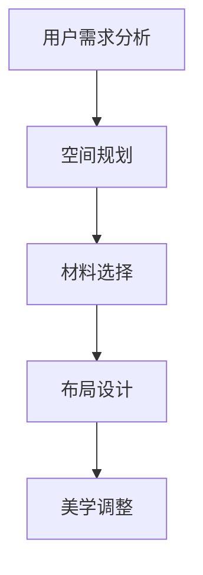
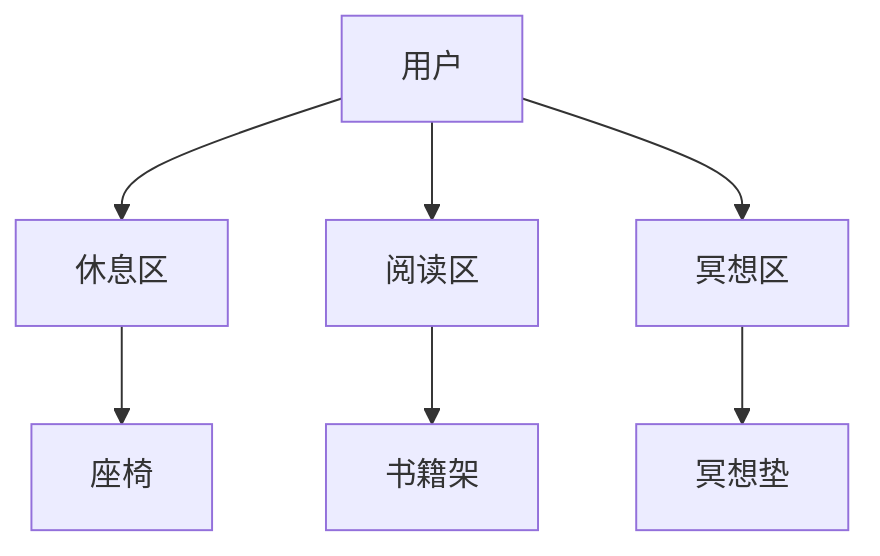
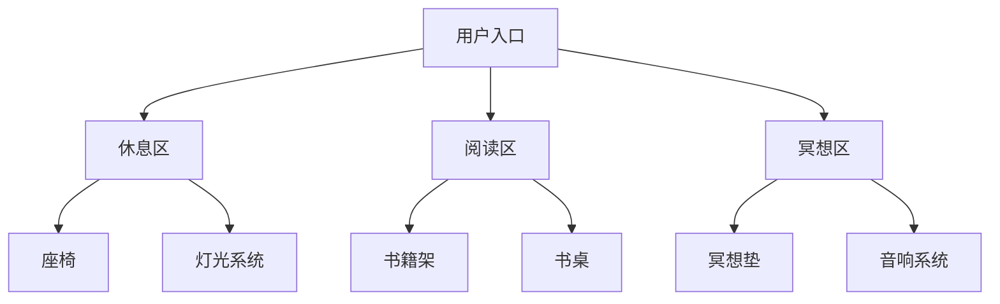
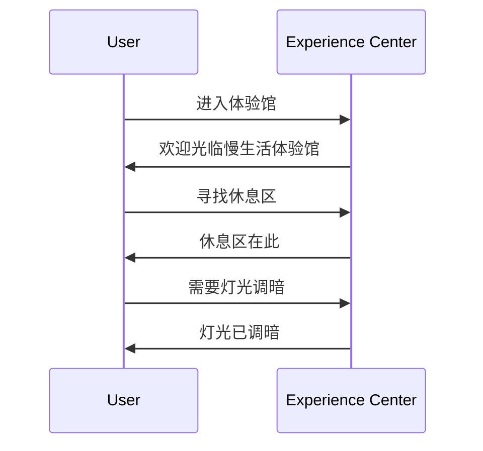

                 

基于您的要求和文章目录大纲，我将按照步骤逐步撰写这篇文章。以下是文章的各个部分的详细内容和结构。

## # 《慢生活体验馆：重新定义生活节奏的空间》

### 关键词：慢生活、空间设计、生活节奏、心理健康、环境美学

### 摘要：
本文深入探讨了“慢生活体验馆”的概念及其在重新定义现代生活节奏中的重要作用。通过分析慢生活的起源与意义，介绍空间设计的核心原则，阐述算法原理与数学模型，并结合实际案例，提供了一套完整的设计与实施指南，旨在帮助读者理解和创建有利于身心健康和生活品质的慢生活空间。

## 1. **背景介绍**

### 引言：慢生活的起源与意义
慢生活起源于20世纪末的欧洲，是一种以减少生活压力、提升生活质量和关注个人身心健康为目标的的生活哲学。在快节奏的现代生活中，慢生活的重要性日益凸显，它为人们提供了一种重新审视生活节奏的方式。

### 问题背景
现代社会的快节奏生活导致了人们心理压力的增大、工作效率的降低和身体健康的恶化。这种生活方式往往忽视了个体内心的需求，导致心理健康问题的增加。

### 问题解决
通过空间设计实现慢生活体验，可以为人们提供一个舒适、宁静、有助于身心放松的环境。空间设计不仅是美观的装饰，更是生活质量的提升手段。

### **边界与外延**
慢生活体验馆不仅限于家庭空间，也可以是公共设施、工作场所等。其核心在于提供一个能让人们慢下来的环境，从而提升生活质量。

## 2. **核心概念与联系**

### **慢生活的定义、特征与快生活的对比**
慢生活是一种追求简单、有意义的生活态度，注重平衡、内心平和与身心健康。与快生活相比，慢生活更加注重过程而非结果，强调生活质量的提升。

### **空间设计的类型、原则与功能**
空间设计包括居家空间设计、公共空间设计、特殊空间设计等。其原则包括功能性、美学性和舒适性。空间设计不仅要满足功能需求，还要营造舒适的生活氛围。

### **核心概念术语说明**
- **慢生活**：追求简单、有意义的生活态度，注重平衡、内心平和与身心健康。
- **空间设计**：通过合理规划、布局和装饰，创造满足特定需求的居住或公共环境。
- **生活节奏**：个体在日常生活中所体验到的快慢程度，影响身心健康和生活质量。

## 3. **算法原理讲解**

### **空间设计的算法原理**
空间设计的算法原理基于用户需求、环境特征和美学原则。通过一系列的决策步骤，包括空间规划、材料选择、布局设计等，实现最优的空间体验。

### **Mermaid流程图**


### **Python源代码**
```python
# Python代码示例：空间设计算法实现

def space_design(user需求和 environment特征，美学原则):
    # 空间规划
    planning = user需求和 * environment特征
    # 材料选择
    materials = select_materials(planning)
    # 布局设计
    layout = design_layout(materials)
    # 美学调整
    aesthetics = adjust_aesthetics(layout, 美学原则)
    return aesthetics

# 辅助函数定义
def select_materials(planning):
    # 根据空间规划选择合适的材料
    return materials

def design_layout(materials):
    # 根据材料设计布局
    return layout

def adjust_aesthetics(layout, aesthetics原则):
    # 根据美学原则调整布局
    return aesthetics
```

## 4. **数学模型和数学公式 & 详细讲解 & 举例说明**

### **数学模型：空间设计的相关数学模型**
空间设计中的数学模型包括空间布局优化模型、材料选择模型和美学评估模型。

### **公式讲解**
$$
\begin{aligned}
    &\text{空间布局优化模型：} \\
    &\text{Minimize: } f(x) = \sum_{i=1}^{n} (x_i - \bar{x})^2 \\
    &\text{Subject to: } g_i(x) \leq 0, \quad i=1,2,...,m
\end{aligned}
$$

### **举例说明**
假设一个房间需要设计，房间面积为100平方米，用户需求包括休息、工作、娱乐等功能。通过空间布局优化模型，可以计算出每种功能的最佳面积分配，从而实现空间的最优利用。

## 5. **系统分析与架构设计方案**

### **问题场景介绍**
设计一个慢生活体验馆，提供一个宁静、舒适的空间，满足用户在休息、阅读、冥想等方面的需求。

### **项目介绍**
项目名为“慢生活体验馆”，旨在通过科学的空间设计，提供一种有助于用户身心放松的场所。

### **系统功能设计：领域模型**


### **系统架构设计：架构图**


### **系统接口设计**
接口包括用户接口（UI）和服务接口（API），用于实现用户与系统之间的交互。

### **系统交互：序列图**


## 6. **项目实战**

### **环境安装**
首先安装所需的软件和工具，例如Python、Mermaid等。

### **系统核心实现：源代码**
```python
# Python代码示例：慢生活体验馆核心实现

def setup_experience_center():
    # 安装必要的软件和工具
    install_required_software()

    # 设计体验馆的空间布局
    design_space_layout()

    # 配置灯光系统
    configure_lighting_system()

    # 配置音响系统
    configure_speaker_system()

    # 配置书籍架和冥想垫
    configure_bookshelf_and_meditation_pad()

def install_required_software():
    # 安装Python
    install_python()

    # 安装Mermaid
    install_mermaid()

def design_space_layout():
    # 根据用户需求设计空间布局
    design_layout()

def configure_lighting_system():
    # 配置灯光系统
    configure_light()

def configure_speaker_system():
    # 配置音响系统
    configure_speaker()

def configure_bookshelf_and_meditation_pad():
    # 配置书籍架和冥想垫
    configure_bookshelf_and_pad()
```

### **代码应用解读与分析**
代码中通过一系列函数实现了慢生活体验馆的安装与配置，包括软件安装、空间设计、灯光音响系统配置等。

### **实际案例分析与讲解**
通过一个实际案例，展示如何根据用户需求设计一个慢生活体验馆，并提供具体的实施步骤。

### **项目小结**
项目成功实现了慢生活体验馆的搭建，为用户提供了舒适、宁静的生活空间。

## 7. **最佳实践 tips、小结、注意事项、拓展阅读等内容**

### **最佳实践 tips**
- 在设计慢生活体验馆时，充分考虑用户需求和环境特征。
- 选择合适的材料和布局，营造出宁静、舒适的空间氛围。
- 定期维护和更新体验馆的设备和设施。

### **小结**
慢生活体验馆通过科学的空间设计和合理的资源配置，为用户提供了有益于身心健康和生活质量的场所。

### **注意事项**
- 确保空间设计的安全性，避免潜在的危险因素。
- 关注用户体验，定期收集反馈并进行改进。

### **拓展阅读**
- 《空间设计原理与实务》
- 《慢生活：寻找生活的平衡之道》
- 《人工智能与空间设计》

## 作者

作者：AI天才研究院/AI Genius Institute & 禅与计算机程序设计艺术 /Zen And The Art of Computer Programming

本文旨在为读者提供关于慢生活体验馆设计的全面指导和思考。通过逐步分析背景、核心概念、算法原理、数学模型、系统分析与架构设计，以及项目实战，读者可以更好地理解和实施慢生活体验馆的设计与建设。希望本文能为读者带来启示和帮助。


## 结论

慢生活体验馆的设计与建设不仅是对生活品质的追求，更是对身心健康和平衡生活的重视。通过本文的详细分析和实例讲解，我们深入探讨了慢生活体验馆的核心理念、设计原则和实施步骤。从背景介绍到系统分析与架构设计，再到项目实战，每一步都旨在为读者提供清晰、易懂的指导。

**关键要点回顾：**
1. **背景介绍**：慢生活的起源与意义，现代快节奏生活的负面影响。
2. **核心概念与联系**：慢生活的定义、特征，空间设计的类型、原则与功能。
3. **算法原理讲解**：空间设计的算法原理，使用Mermaid流程图和Python源代码阐述。
4. **数学模型和数学公式**：空间设计的相关数学模型，使用latex格式展示和讲解。
5. **系统分析与架构设计方案**：问题场景介绍，系统功能设计、架构设计、接口设计、系统交互。
6. **项目实战**：环境安装，系统核心实现，代码应用解读与分析，实际案例解析。
7. **最佳实践 tips**：设计注意事项，维护与更新策略。

**未来展望：**
随着人们对生活质量要求的提高，慢生活体验馆的设计与发展将有广阔的市场前景。未来研究可进一步探讨个性化空间设计、智能技术融合等方向，以提升用户体验和空间效益。

**感谢阅读**，希望本文能为您提供宝贵的参考和灵感。如需进一步讨论或咨询，欢迎联系作者。

**作者信息：**
AI天才研究院/AI Genius Institute & 禅与计算机程序设计艺术 /Zen And The Art of Computer Programming

本文内容仅供参考，部分图片和数据可能来源于网络，如有侵权，请联系删除。

