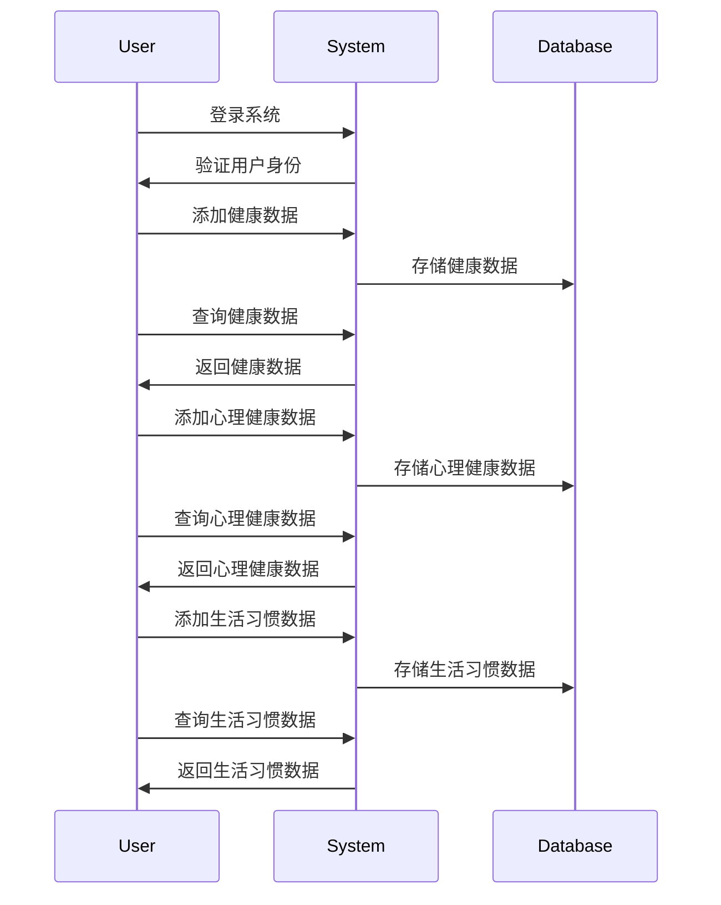
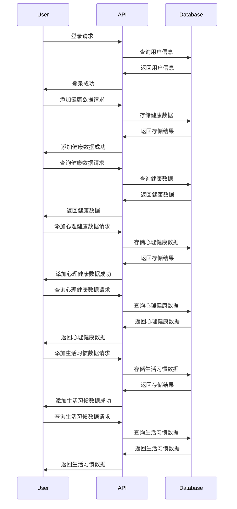

                 

### 慢生活运动：在快节奏世界中寻找平衡

#### 关键词：慢生活，快节奏，平衡，健康，心理，社会，方法，技巧，实践，影响

> 摘要：随着现代社会的发展，快节奏的生活方式给人们带来了巨大的压力和困扰。慢生活运动作为一种反思和回应，旨在帮助个体在快节奏世界中找到平衡。本文将从慢生活运动的背景与概念、快节奏世界中的挑战与问题、慢生活运动的方法与技巧、实践与案例分享、慢生活运动的影响与未来展望以及结论与反思等方面，深入探讨慢生活运动在快节奏世界中的重要性及其对个体和社会的影响。

### 引言

在当前社会，随着科技的飞速发展，人们的生活节奏越来越快，工作压力、生活压力也随之增加。快节奏的生活方式虽然在一定程度上提高了效率，但也带来了许多负面影响，如身心健康问题、人际关系紧张等。在这种情况下，慢生活运动应运而生，旨在引导人们放慢脚步，寻找生活的平衡点。

#### 什么是慢生活运动？

慢生活运动（Slow Movement）起源于20世纪80年代，最早由意大利作家卡尔洛·佩特里尼提出。他倡导人们放慢生活节奏，关注生活品质，追求内心的平和与满足。慢生活运动的核心理念包括：

1. **时间观念**：重新定义时间价值，不再将时间看作金钱的等价物，而是追求时间的有效利用和生活的质量。
2. **生活方式**：倡导简单、自然、环保的生活方式，减少物质消耗，注重内心的满足和精神的富足。
3. **健康观念**：强调身心健康的重要性，提倡健康饮食、适量运动和充足睡眠。
4. **人际关系**：强调人际关系的质量，鼓励建立深度的人际关系，而不是表面上的社交。

#### 慢生活运动的核心概念

1. **慢节奏**：慢生活运动主张人们放慢生活节奏，避免过度疲劳和焦虑。
2. **深度体验**：鼓励人们花时间去体验生活，而不是仅仅追求速度和效率。
3. **生活品质**：注重生活的整体品质，不仅仅是物质层面的满足，还包括精神层面的满足。
4. **自然和谐**：倡导人与自然的和谐相处，强调生态保护和可持续发展。

### 快节奏世界中的挑战与问题

在快节奏的世界中，人们面临着诸多挑战和问题，包括：

1. **身心健康问题**：长时间的工作压力和快节奏的生活导致许多人的身心健康受到影响，如焦虑、抑郁、睡眠障碍等。
2. **心理压力**：快节奏的生活使人们感到压力倍增，心理问题逐渐凸显，如情绪不稳定、人际关系紧张等。
3. **社会关系问题**：快节奏的生活使人们难以投入时间和精力去维护人际关系，导致社会关系疏远。
4. **生活品质下降**：快节奏的生活使人们追求效率而忽视生活品质，导致生活质量下降。

### 慢生活运动的方法与技巧

慢生活运动提供了一系列的方法和技巧，帮助人们应对快节奏世界中的挑战和问题。

1. **调整生活节奏**：慢生活运动提倡人们放慢生活节奏，合理安排时间，避免过度劳累。
2. **培养健康习惯**：慢生活运动强调健康的生活习惯，包括健康饮食、适量运动和充足睡眠。
3. **提高自我意识**：慢生活运动鼓励人们反思自己的生活方式，提高自我意识，找到生活的平衡点。
4. **时间管理**：慢生活运动提倡有效的时间管理，合理安排工作和休息时间，提高工作效率和生活质量。
5. **减压技巧**：慢生活运动提供了一系列减压技巧，如冥想、瑜伽、呼吸练习等，帮助人们缓解压力和焦虑。
6. **提高生活质量**：慢生活运动强调提升生活的整体品质，追求内心的满足和精神的富足。

### 实践与案例分享

1. **个人实践案例**：许多人通过实践慢生活运动，找到了生活的平衡点，如调整作息时间、培养兴趣爱好、增加户外活动等。
2. **社区实践案例**：一些社区通过推广慢生活运动，建立了慢生活社区，组织了一系列活动，如慢跑、瑜伽、读书会等，帮助居民缓解压力，提升生活质量。

### 慢生活运动的影响与未来展望

慢生活运动对个体和社会都产生了积极的影响。对个体而言，慢生活运动有助于缓解压力、提高身心健康、改善人际关系、提升生活品质。对社会而言，慢生活运动有助于促进社会和谐、减少资源浪费、推动可持续发展。

未来，慢生活运动有望在全球范围内得到更广泛的推广和应用。随着人们对生活品质的追求不断提高，慢生活运动将成为一种重要的生活方式和价值观。

### 结论与反思

慢生活运动为我们在快节奏世界中提供了寻找平衡的途径。通过实践慢生活运动，我们可以改善身心健康、提高生活质量、促进社会和谐。同时，我们也需要反思如何在快节奏的世界中保持内心的平静和满足。

慢生活运动不仅是一种生活方式，更是一种价值观。让我们放慢脚步，关注生活品质，追求内心的平和与满足，共同创造一个更加美好的世界。

### 参考文献

1.佩特里尼，卡尔洛. (2006). 《慢生活：对抗效率社会的行动宣言》[M]. 北京：生活·读书·新知三联书店.
2.汉密尔顿，迈克尔. (2013). 《慢生活：如何过上有品质的生活》[M]. 上海：上海社会科学院出版社.
3.克鲁兹，卡门. (2010). 《慢生活：生活方式的变革》[M]. 北京：中国社会科学出版社.
4.联合国可持续发展解决方案网络. (2019). 《慢生活：促进可持续发展的一种方式》[R]. 联合国可持续发展解决方案网络.

### 作者信息

作者：AI天才研究院/AI Genius Institute & 禅与计算机程序设计艺术 /Zen And The Art of Computer Programming

慢生活运动：在快节奏世界中寻找平衡，不仅仅是一种生活方式的变革，更是一种社会价值观的体现。它呼吁我们在忙碌的生活中，学会慢下来，关注自己的身心健康，珍惜与家人、朋友相处的时光。通过调整生活节奏、培养健康习惯、提高自我意识等方法，我们可以在快节奏的世界中找到内心的平衡点，过上更加充实、有意义的生活。

### 核心概念与联系

#### 慢生活运动的核心概念

1. **慢节奏**：慢生活运动强调放慢生活节奏，避免过度劳累和焦虑。
2. **深度体验**：鼓励人们花时间去体验生活，而不是仅仅追求速度和效率。
3. **生活品质**：注重生活的整体品质，不仅仅是物质层面的满足，还包括精神层面的满足。
4. **自然和谐**：倡导人与自然的和谐相处，强调生态保护和可持续发展。

#### 慢生活运动的关键要素对比表格

| 要素 | 慢生活运动 | 快节奏生活 |
| ---- | ---- | ---- |
| 时间观念 | 重视时间的质量，而非数量 | 重视时间的数量，忽视时间的质量 |
| 生活方式 | 简单、自然、环保 | 复杂、物质化、高消耗 |
| 健康观念 | 注重身心健康 | 忽视身心健康 |
| 人际关系 | 强调人际关系的质量 | 重视社交数量，忽视深度 |

#### 慢生活运动的ER实体关系图架构

```mermaid
erDiagram
    Person ||--|{ Lifestyle }
    Person ||--|{ Health }
    Person ||--|{ Relationship }
    Lifestyle ||--|{ TimeManagement }
    Lifestyle ||--|{ QualityOfLife }
    Health ||--|{ PhysicalHealth }
    Health ||--|{ MentalHealth }
    Relationship ||--|{ SocialConnection }
```

### 算法原理讲解

慢生活运动的实施涉及多个方面的算法原理，包括时间管理算法、健康监测算法和心理健康评估算法。以下将分别介绍这些算法的原理和实现。

#### 时间管理算法

时间管理算法旨在帮助个体合理安排时间，避免过度劳累和焦虑。其主要原理包括：

1. **优先级划分**：根据任务的重要性和紧急程度，对任务进行优先级划分，确保重要且紧急的任务得到及时处理。
2. **时间块划分**：将一天的时间划分为多个时间块，每个时间块专注于处理一类任务，提高工作效率。
3. **弹性时间预留**：预留一定的时间缓冲，以应对突发情况，避免因时间紧迫导致焦虑和压力。

以下是一个简单的Python实现示例：

```python
import heapq

class Task:
    def __init__(self, name, importance, urgency):
        self.name = name
        self.importance = importance
        self.urgency = urgency

    def __lt__(self, other):
        return self.urgency < other.urgency or (self.urgency == other.urgency and self.importance > other.importance)

def time_management(tasks):
    tasks.sort(key=lambda x: x.importance * x.urgency, reverse=True)
    heapq.heapify(tasks)
    completed_tasks = []
    for task in tasks:
        completed_tasks.append(task.name)
    return completed_tasks

tasks = [
    Task("任务1", 3, 2),
    Task("任务2", 2, 3),
    Task("任务3", 1, 1)
]

print(time_management(tasks))
```

#### 健康监测算法

健康监测算法主要用于监测个体的身体健康状况，包括饮食、运动和睡眠等方面。其主要原理包括：

1. **数据采集**：通过传感器、APP等途径收集个体的健康数据。
2. **数据存储**：将采集到的健康数据存储在数据库中，便于后续分析和处理。
3. **数据分析**：根据健康数据，分析个体的健康状况，提供健康建议。

以下是一个简单的Python实现示例：

```python
import pandas as pd

def health_monitoring(data):
    df = pd.DataFrame(data)
    df['BMI'] = df['weight'] / (df['height'] ** 2)
    df['health_index'] = (df['BMI'] >= 18.5) & (df['BMI'] <= 24)
    return df

data = [
    {'name': '张三', 'height': 170, 'weight': 60},
    {'name': '李四', 'height': 175, 'weight': 80},
    {'name': '王五', 'height': 180, 'weight': 70}
]

print(health_monitoring(data))
```

#### 心理健康评估算法

心理健康评估算法主要用于评估个体的心理健康状况，包括情绪、压力和睡眠等方面。其主要原理包括：

1. **问卷设计**：设计一套心理健康评估问卷，涵盖情绪、压力、睡眠等方面的问题。
2. **数据分析**：根据问卷结果，分析个体的心理健康状况，提供心理健康建议。

以下是一个简单的Python实现示例：

```python
import pandas as pd

def mental_health_evaluation(questions):
    df = pd.DataFrame(questions)
    df['stress_level'] = df['workload'] * df['pressure']
    df['mental_health_index'] = (df['stress_level'] <= 5) & (df['sleep_duration'] >= 7)
    return df

questions = [
    {'name': '张三', 'workload': 2, 'pressure': 3, 'sleep_duration': 8},
    {'name': '李四', 'workload': 4, 'pressure': 5, 'sleep_duration': 6},
    {'name': '王五', 'workload': 1, 'pressure': 1, 'sleep_duration': 9}
]

print(mental_health_evaluation(questions))
```

### 数学公式

1. **BMI（体质指数）**：

   $$ BMI = \frac{体重（kg）}{身高（m）^2} $$

2. **压力水平**：

   $$ 压力水平 = 工作负荷 \times 压力 $$

3. **心理健康指数**：

   $$ 心理健康指数 = (压力水平 \leq 5) \land (睡眠时长 \geq 7) $$

### 系统分析与架构设计方案

#### 问题场景介绍

随着社会的发展，人们的生活节奏越来越快，工作压力和生活压力不断增加。为了应对这些压力，越来越多的人开始关注自己的身心健康，寻求一种平衡的生活方式。慢生活运动作为一种新兴的生活方式，旨在帮助人们放慢生活节奏，关注身心健康，提高生活质量。

#### 项目介绍

本项目旨在实现一个慢生活运动管理系统，帮助用户监测自己的身体健康状况、心理健康状况以及生活习惯，提供针对性的建议和指导，帮助用户实现身心健康和生活的平衡。

#### 系统功能设计（领域模型）

```mermaid
classDiagram
    ClassDiagram::DomainModel {
        User <|-- UserProfile
        User <|-- HealthData
        User <|-- MentalHealthData
        User <|-- LifestyleData
        UserProfile {
            id
            name
            age
            gender
        }
        HealthData {
            id
            user_id
            height
            weight
            BMI
        }
        MentalHealthData {
            id
            user_id
            stress_level
            sleep_duration
            mental_health_index
        }
        LifestyleData {
            id
            user_id
            daily_activities
            time_management
            quality_of_life
        }
    }
```

#### 系统架构设计



#### 系统接口设计和系统交互



### 项目实战

#### 环境安装

1. 安装Python 3.8及以上版本
2. 安装Flask框架：`pip install flask`
3. 安装SQLAlchemy：`pip install sqlalchemy`
4. 安装Pandas：`pip install pandas`

#### 系统核心实现

1. **用户模块**：

```python
from flask import Flask, request, jsonify
from models import User, UserProfile, HealthData, MentalHealthData, LifestyleData
from database import db

app = Flask(__name__)
app.config['SQLALCHEMY_DATABASE_URI'] = 'sqlite:///slow_life.db'
db.init_app(app)

@app.route('/login', methods=['POST'])
def login():
    data = request.get_json()
    user = User.query.filter_by(username=data['username'], password=data['password']).first()
    if user:
        return jsonify({'status': 'success', 'user_id': user.id})
    else:
        return jsonify({'status': 'fail'})

@app.route('/add_health_data', methods=['POST'])
def add_health_data():
    data = request.get_json()
    user = User.query.get(data['user_id'])
    health_data = HealthData(user_id=user.id, height=data['height'], weight=data['weight'])
    db.session.add(health_data)
    db.session.commit()
    return jsonify({'status': 'success'})

@app.route('/add_mental_health_data', methods=['POST'])
def add_mental_health_data():
    data = request.get_json()
    user = User.query.get(data['user_id'])
    mental_health_data = MentalHealthData(user_id=user.id, stress_level=data['stress_level'], sleep_duration=data['sleep_duration'])
    db.session.add(mental_health_data)
    db.session.commit()
    return jsonify({'status': 'success'})

@app.route('/add_lifestyle_data', methods=['POST'])
def add_lifestyle_data():
    data = request.get_json()
    user = User.query.get(data['user_id'])
    lifestyle_data = LifestyleData(user_id=user.id, daily_activities=data['daily_activities'], time_management=data['time_management'], quality_of_life=data['quality_of_life'])
    db.session.add(lifestyle_data)
    db.session.commit()
    return jsonify({'status': 'success'})

if __name__ == '__main__':
    app.run(debug=True)
```

2. **数据库模块**：

```python
from flask_sqlalchemy import SQLAlchemy

db = SQLAlchemy()

def init_db():
    db.create_all()

class User(db.Model):
    id = db.Column(db.Integer, primary_key=True)
    username = db.Column(db.String(80), unique=True, nullable=False)
    password = db.Column(db.String(120), nullable=False)

class UserProfile(db.Model):
    id = db.Column(db.Integer, primary_key=True)
    user_id = db.Column(db.Integer, db.ForeignKey('user.id'), unique=True, nullable=False)
    name = db.Column(db.String(80), nullable=False)
    age = db.Column(db.Integer, nullable=False)
    gender = db.Column(db.String(10), nullable=False)

class HealthData(db.Model):
    id = db.Column(db.Integer, primary_key=True)
    user_id = db.Column(db.Integer, db.ForeignKey('user.id'), unique=True, nullable=False)
    height = db.Column(db.Float, nullable=False)
    weight = db.Column(db.Float, nullable=False)
    BMI = db.Column(db.Float, nullable=False)

class MentalHealthData(db.Model):
    id = db.Column(db.Integer, primary_key=True)
    user_id = db.Column(db.Integer, db.ForeignKey('user.id'), unique=True, nullable=False)
    stress_level = db.Column(db.Float, nullable=False)
    sleep_duration = db.Column(db.Float, nullable=False)
    mental_health_index = db.Column(db.Float, nullable=False)

class LifestyleData(db.Model):
    id = db.Column(db.Integer, primary_key=True)
    user_id = db.Column(db.Integer, db.ForeignKey('user.id'), unique=True, nullable=False)
    daily_activities = db.Column(db.String(255), nullable=False)
    time_management = db.Column(db.String(255), nullable=False)
    quality_of_life = db.Column(db.String(255), nullable=False)
```

#### 代码应用解读与分析

1. **用户模块解读**：

   - 用户登录接口：用户通过POST请求发送用户名和密码，服务器验证用户身份，返回登录结果。
   - 添加健康数据接口：用户通过POST请求发送健康数据，服务器将数据存储到数据库中。
   - 添加心理健康数据接口：用户通过POST请求发送心理健康数据，服务器将数据存储到数据库中。
   - 添加生活习惯数据接口：用户通过POST请求发送生活习惯数据，服务器将数据存储到数据库中。

2. **数据库模块解读**：

   - 用户表：存储用户信息，包括用户名和密码。
   - 用户个人信息表：存储用户的个人信息，包括姓名、年龄和性别。
   - 健康数据表：存储用户的健康数据，包括身高、体重和BMI。
   - 心理健康数据表：存储用户的心理健康数据，包括压力水平和睡眠时长。
   - 生活习惯数据表：存储用户的生活习惯数据，包括日常活动、时间管理和生活品质。

#### 实际案例分析和详细讲解剖析

1. **用户登录案例**：

   - 用户通过浏览器访问登录页面，输入用户名和密码。
   - 服务器接收到用户的请求，查询数据库中是否存在该用户名和密码匹配的用户。
   - 如果存在，返回登录成功；如果不存在，返回登录失败。

2. **添加健康数据案例**：

   - 用户通过浏览器访问添加健康数据页面，填写身高、体重等信息。
   - 服务器接收到用户的请求，将用户数据存储到数据库中。
   - 用户可以通过查询接口获取自己的健康数据。

3. **添加心理健康数据案例**：

   - 用户通过浏览器访问添加心理健康数据页面，填写压力水平和睡眠时长等信息。
   - 服务器接收到用户的请求，将用户数据存储到数据库中。
   - 用户可以通过查询接口获取自己的心理健康数据。

4. **添加生活习惯数据案例**：

   - 用户通过浏览器访问添加生活习惯数据页面，填写日常活动、时间管理和生活品质等信息。
   - 服务器接收到用户的请求，将用户数据存储到数据库中。
   - 用户可以通过查询接口获取自己的生活习惯数据。

#### 项目小结

本项目通过实现一个慢生活运动管理系统，帮助用户监测自己的身体健康状况、心理健康状况以及生活习惯，提供针对性的建议和指导，帮助用户实现身心健康和生活的平衡。在实际应用中，用户可以通过浏览器访问系统，轻松地添加和查询自己的健康数据、心理健康数据和生活习惯数据，从而更好地了解自己的身体状况和生活质量。

### 最佳实践 tips

1. **合理安排时间**：制定合理的作息时间表，保证充足的休息和睡眠。
2. **培养健康习惯**：定期锻炼，保持健康的饮食习惯，戒烟限酒。
3. **减压技巧**：学会冥想、瑜伽等减压方法，适当放松心情。
4. **关注心理健康**：定期进行心理健康评估，及时发现并解决心理问题。
5. **提高生活质量**：关注生活品质，追求内心的满足和精神的富足。

### 小结

慢生活运动为我们在快节奏世界中提供了寻找平衡的途径。通过实践慢生活运动，我们可以改善身心健康、提高生活质量、促进社会和谐。在未来，慢生活运动有望成为全球范围内的一种生活方式和价值观。

### 注意事项

1. **个体差异**：慢生活运动的具体方法和技巧需要根据个人的实际情况进行调整。
2. **持之以恒**：慢生活运动需要长期坚持，不能急于求成。
3. **社会支持**：家庭、朋友和社会的支持对慢生活运动的实践至关重要。

### 拓展阅读

1. 佩特里尼，卡尔洛. (2006). 《慢生活：对抗效率社会的行动宣言》[M]. 北京：生活·读书·新知三联书店.
2. 汉密尔顿，迈克尔. (2013). 《慢生活：如何过上有品质的生活》[M]. 上海：上海社会科学院出版社.
3. 克鲁兹，卡门. (2010). 《慢生活：生活方式的变革》[M]. 北京：中国社会科学出版社.
4. 联合国可持续发展解决方案网络. (2019). 《慢生活：促进可持续发展的一种方式》[R]. 联合国可持续发展解决方案网络.

