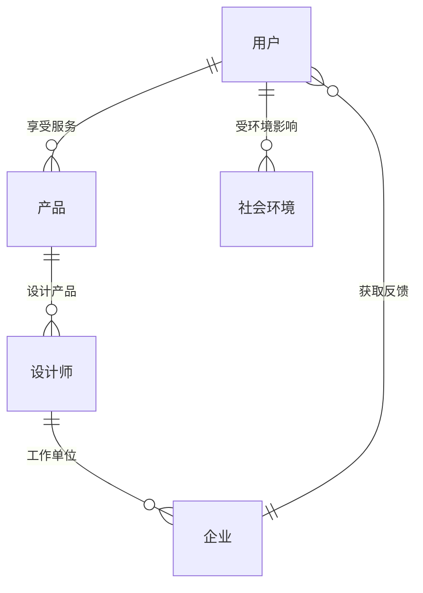

                 

### 1.1 书籍背景与目的

**背景介绍**

在当今快速发展的科技时代，信息技术和人工智能技术正以前所未有的速度改变着我们的生活方式。然而，随之而来的技术迅猛发展也带来了一系列问题，如数据隐私、信息安全、人工智能伦理等。这些问题使得我们需要重新审视科技的发展路径，尤其是如何更好地满足人类的需求，提升生活品质，而不仅仅是追求技术的进步。

**问题背景**

随着科技的发展，快速迭代、追求效率的“快科技”逐渐成为主流，这种科技模式往往忽略了用户的实际需求，导致用户体验不佳，甚至可能对用户的生活造成负面影响。例如，智能设备的过度自动化可能让用户感到困惑和不便，而社交媒体的快速传播也可能导致信息过载和隐私泄露。

**问题描述**

如何平衡技术进步与用户需求，实现以人为本的技术创新，是一个亟待解决的问题。以人为本的技术创新要求我们在设计、开发和应用技术时，更加注重人的感受和需求，从人的角度出发，寻求科技与生活的和谐共生。

**问题解决**

为了解决上述问题，我们需要一种新的科技发展模式，即“慢科技”。慢科技强调技术发展的可持续性，注重人的体验和需求，追求科技与生活的平衡。慢科技产品线的构建，需要我们深入了解用户需求，坚持以人为本的设计原则，通过技术手段实现用户价值的最大化。

**边界与外延**

慢科技并不是反对技术进步，而是在技术发展的同时，更加注重人的需求和体验。它既包括对已有技术的优化升级，也包括对新技术的研究与应用。慢科技产品线的构建，不仅需要在产品设计中融入以人为本的理念，还需要在技术研发、生产、销售和售后等各个环节中贯彻这一原则。

**概念结构与核心要素组成**

慢科技产品线的核心要素包括：

- **用户需求分析**：深入了解用户需求，是慢科技产品线设计的基础。
- **以人为本的设计原则**：将用户体验置于核心地位，贯穿于产品设计和开发的整个过程。
- **技术创新**：在技术层面，慢科技强调技术创新，以提升用户体验和产品价值。
- **可持续性**：慢科技追求技术的可持续性，以实现长期发展。

### 1.2 “慢科技”与“以人为本的技术创新”的定义

**慢科技的定义**

慢科技（Slow Technology）是一种注重用户体验和可持续性的科技发展模式。它强调在技术发展的过程中，不应盲目追求速度和效率，而应更加关注人的感受和需求。慢科技不仅仅是“慢速”的技术，更是一种生活方式的反思和追求。它倡导在快节奏的生活中，找到平衡点，享受科技带来的便利，同时减少因过度依赖科技而产生的负面影响。

**以人为本的技术创新定义**

以人为本的技术创新（Human-Centered Technology Innovation）是指在科技产品研发和应用过程中，始终将人的需求和体验放在首位，通过技术创新和设计优化，提高产品的用户体验和实用性。以人为本的技术创新要求我们在设计产品时，不仅要考虑功能和技术上的可行性，还要关注用户的使用习惯、情感需求和心理预期。

**概念属性特征对比表格**

| 特征            | 快科技                               | 慢科技                               |
| --------------- | ----------------------------------- | ----------------------------------- |
| 目标            | 提高效率、缩短研发周期               | 提高用户体验、追求可持续性           |
| 设计原则        | 功能优先、技术至上                   | 用户需求优先、用户体验至上           |
| 技术应用        | 追求最新、快速迭代                   | 稳定可靠、持续优化                   |
| 用户角色        | 用户是消费者                         | 用户是合作伙伴，参与产品设计与改进   |
| 对环境的影响    | 可能造成资源浪费和环境影响           | 注重资源节约和环境保护               |
| 社会价值        | 侧重于提高生产力                      | 关注提高生活质量和社会福祉           |

**ER实体关系图架构的 Markdown 格式 Mermaid 流程图**

### 1.3 书籍结构安排

本书将从以下几个方面系统地介绍慢科技产品线和以人为本的技术创新：

- **第1章 引言**：介绍书籍的背景、目的和结构安排，为后续内容奠定基础。
- **第2章 核心概念**：阐述慢科技和以人为本的技术创新的基本概念和理论基础。
- **第3章 慢科技概述**：详细讨论慢科技的定义、特点和应用领域。
- **第4章 以人为本的技术创新**：探讨以人为本的技术创新原则、方法和案例。
- **第5章 案例研究**：分析成功的慢科技产品线和以人为本的技术创新案例。
- **第6章 行业应用**：分析慢科技在不同行业的应用场景和挑战。
- **第7章 未来趋势与展望**：探讨慢科技和以人为本的技术创新的发展趋势。
- **第8章 总结与建议**：总结全书的核心内容，提出实践建议和展望。

通过这样的结构安排，本书旨在为读者提供一个全面、系统的慢科技产品线和以人为本的技术创新指南，帮助读者更好地理解和应用这些理念。

## 第2章 核心概念

### 2.1 慢科技的起源与发展

**起源**

慢科技的起源可以追溯到20世纪80年代，当时人们开始反思快速消费和过度生产带来的社会问题。随着信息技术和互联网的快速发展，慢科技的理念逐渐成形。它强调在技术进步的同时，要注重人的感受和需求，追求一种更加平衡和可持续的生活方式。

**发展**

慢科技的发展经历了几个重要阶段。第一阶段是反思阶段，人们开始质疑快速消费主义和过度追求效率的生活方式。第二阶段是倡导阶段，慢科技的理念被广泛传播，越来越多的人开始接受并践行这种生活方式。第三阶段是应用阶段，慢科技逐渐从理念转化为实际应用，形成了诸如慢城、慢旅游、慢设计等一系列具体实践。

**核心观点**

慢科技的核心观点在于，技术的发展不应仅仅追求速度和效率，而应更加关注人的感受和需求。慢科技倡导在快节奏的生活中找到平衡点，通过降低速度、提高质量，实现科技与生活的和谐共生。

### 2.2 以人为本的技术创新原理

**原理**

以人为本的技术创新（Human-Centered Technology Innovation）是一种以用户为中心的创新方法。它强调在技术设计和开发过程中，始终将人的需求和体验放在首位。以人为本的技术创新原理包括以下几个方面：

- **用户需求分析**：深入了解用户需求，是进行技术创新的前提。通过用户调研、数据分析等方法，收集用户的实际需求，为产品设计提供依据。
- **用户体验设计**：用户体验设计（UX Design）是慢科技产品开发的核心环节。它关注用户在使用产品过程中的感受和体验，通过优化交互设计、提高易用性，提升用户体验。
- **可持续性**：以人为本的技术创新不仅关注短期用户需求，还关注技术的可持续性。通过采用环保材料、节能设计等手段，实现技术的可持续发展。

**优势**

- **提升用户体验**：以人为本的技术创新能够更好地满足用户需求，提升用户满意度。
- **增强产品竞争力**：关注用户体验和可持续性的产品，往往具有更高的市场竞争力。
- **促进社会和谐**：以人为本的技术创新有助于减少因技术发展带来的负面影响，促进社会和谐。

**挑战**

- **用户需求的多样性**：用户需求多种多样，如何在满足不同用户需求的同时，保持产品的一致性和稳定性，是一个挑战。
- **技术创新的可持续性**：如何在技术创新的同时，保证技术的可持续性，是一个长期课题。

### 2.3 慢科技与快速科技的对比

**定义**

- **慢科技**：强调技术发展的可持续性，注重人的感受和需求，追求科技与生活的平衡。
- **快速科技**：追求效率和技术进步，往往忽视了用户需求和体验。

**特点**

| 特点            | 快速科技                                     | 慢科技                                     |
| --------------- | ------------------------------------------- | ------------------------------------------- |
| 目标            | 提高效率、缩短研发周期                       | 提高用户体验、追求可持续性                   |
| 设计原则        | 功能优先、技术至上                           | 用户需求优先、用户体验至上                   |
| 技术应用        | 追求最新、快速迭代                           | 稳定可靠、持续优化                           |
| 用户角色        | 用户是消费者                                 | 用户是合作伙伴，参与产品设计与改进           |
| 对环境的影响    | 可能造成资源浪费和环境影响                   | 注重资源节约和环境保护                       |
| 社会价值        | 侧重于提高生产力                             | 关注提高生活质量和社会福祉                   |

**对比**

快速科技与慢科技的对比体现在多个方面。快速科技追求效率和技术进步，往往忽视用户需求和体验，可能导致用户体验不佳，甚至对用户的生活造成负面影响。而慢科技则强调在技术发展的同时，更加关注人的感受和需求，通过降低速度、提高质量，实现科技与生活的和谐共生。

### 2.4 慢科技的哲学思想

**背景**

慢科技的哲学思想源于对快速消费主义和过度追求效率的反思。在现代社会，快速科技的发展带来了诸多问题，如信息过载、隐私泄露、资源浪费等。为了解决这些问题，人们开始寻求一种更加平衡和可持续的科技发展模式，慢科技的哲学思想应运而生。

**核心思想**

慢科技的哲学思想主要包括以下几个方面：

- **平衡与和谐**：慢科技强调在技术发展的同时，保持与自然的和谐共生。它倡导在快节奏的生活中找到平衡点，通过降低速度、提高质量，实现科技与生活的和谐共生。
- **用户体验至上**：慢科技认为，技术的价值不仅在于其功能和技术性能，更在于其是否能满足用户的需求和提高用户的生活质量。因此，慢科技在产品设计过程中，始终将用户体验放在首位。
- **可持续性**：慢科技强调技术的可持续性，追求长期发展。它通过采用环保材料、节能设计等手段，实现技术的可持续发展。

**哲学思想的实际应用**

慢科技的哲学思想在实际应用中体现得淋漓尽致。例如，在智能家居系统的设计过程中，慢科技强调不仅仅要实现功能的自动化，更要关注用户的实际需求和体验。通过人性化的设计，提高用户的生活质量。再如，在医疗设备的设计中，慢科技注重设备的可靠性和易用性，确保用户能够方便、安全地使用设备，从而提高患者的治疗效果。

### 2.5 慢科技与快速科技的应用场景

**应用场景**

慢科技与快速科技在不同的应用场景中各有优势。快速科技在追求效率和技术进步方面具有明显优势，适合应用于需要高速度和高效率的场景，如金融服务、物流运输等。而慢科技则更适合应用于注重用户体验和可持续性的场景，如智能家居、医疗设备、教育技术等。

**对比**

- **金融服务**：在金融服务领域，快速科技的应用可以显著提高交易效率，减少交易时间。例如，在线支付和移动支付技术的发展，使得支付过程更加快捷方便。而慢科技在金融服务中的应用则体现在提供更加人性化的服务，如通过智能客服系统，为用户提供更加个性化、贴心的服务。
- **物流运输**：在物流运输领域，快速科技的应用可以显著提高运输效率，降低运输成本。例如，自动化仓储系统和无人驾驶技术的应用，使得物流运输过程更加高效。而慢科技在物流运输中的应用则体现在提高运输的可持续性，如通过绿色物流和节能减排技术，实现运输过程的可持续发展。
- **智能家居**：在智能家居领域，慢科技的应用主要体现在提供更加人性化、智能化的家居体验。例如，智能家居系统通过物联网技术，实现家电设备的智能联动，提高用户的生活便利性和舒适度。而快速科技在智能家居中的应用则体现在不断更新和迭代，为用户提供更多的智能功能。
- **医疗设备**：在医疗设备领域，慢科技的应用主要体现在提高设备的可靠性和易用性，确保患者能够方便、安全地使用设备。例如，通过人性化设计，提高医疗器械的操作简便性，从而提高患者的治疗效果。而快速科技在医疗设备中的应用则体现在不断推出新技术和新产品，提高设备的性能和功能。

### 2.6 慢科技与社会责任的关联

**社会责任**

慢科技强调在技术发展的过程中，企业和社会应当承担起相应的社会责任。这不仅仅是对企业的要求，也是对整个社会的期望。慢科技倡导企业在追求经济效益的同时，关注社会福祉和环境保护。

**实际应用**

在实际应用中，慢科技的社会责任体现在多个方面：

- **环保**：慢科技倡导采用环保材料和生产工艺，减少对环境的污染。例如，在电子产品制造过程中，使用可回收材料，减少电子废料。
- **可持续发展**：慢科技强调技术的可持续性，通过技术创新和设计优化，提高资源利用效率，减少资源浪费。例如，在能源领域，通过研发和应用新能源技术，实现能源的可持续发展。
- **公益**：慢科技倡导企业承担社会责任，通过公益活动和捐赠，回馈社会。例如，一些科技企业通过公益项目，为贫困地区的孩子提供教育资源和信息技术支持。

**案例**

- **苹果公司**：苹果公司在产品设计和制造过程中，注重环保和可持续发展。例如，苹果公司推出了一系列环保产品，如使用可再生能源、减少塑料使用等。此外，苹果公司还积极参与社会公益项目，为贫困地区的孩子提供教育支持。
- **特斯拉公司**：特斯拉公司在电动汽车领域处于领先地位，通过研发和应用新能源技术，推动电动汽车的普及。特斯拉公司还积极参与环保活动，推动可持续发展。

### 2.7 慢科技与快速科技的融合趋势

**趋势**

随着科技的不断发展，慢科技与快速科技的融合趋势日益明显。这种融合不仅体现在技术的应用层面，也体现在企业战略和文化层面。

- **技术应用融合**：慢科技与快速科技的融合体现在技术创新和应用上。例如，在智能家居领域，快速科技的应用可以显著提高设备的智能性，而慢科技的应用则可以提升用户的体验和满意度。
- **企业战略融合**：许多企业开始将慢科技理念融入企业战略，通过技术创新和设计优化，提高产品和服务的质量，满足用户需求。
- **文化融合**：随着慢科技理念的普及，人们的生活方式和价值观也在发生变化。越来越多的企业和社会组织开始倡导慢生活、慢消费，推动社会向更加平衡和可持续的方向发展。

**未来展望**

慢科技与快速科技的融合将带来以下几方面的影响：

- **提高生活质量**：通过融合慢科技和快速科技，可以提供更加个性化、人性化的产品和服务，提高用户的生活质量。
- **促进可持续发展**：融合慢科技和快速科技，可以实现资源的有效利用，减少浪费，促进可持续发展。
- **推动社会进步**：慢科技与快速科技的融合将有助于推动社会向更加平衡和可持续的方向发展，促进社会进步。

### 2.8 慢科技的传播与推广

**传播渠道**

- **线上传播**：通过互联网平台，如社交媒体、专业网站和博客，传播慢科技的理念和案例。
- **线下活动**：组织研讨会、工作坊和讲座，邀请专家学者和行业人士分享经验和见解。
- **合作交流**：与相关机构和企业合作，共同推动慢科技的研究和应用。

**推广策略**

- **理念普及**：通过宣传和教育，让更多的人了解慢科技的理念和重要性。
- **实践指导**：提供具体的实践指导和建议，帮助企业和社会组织在技术应用和战略制定中融入慢科技理念。
- **政策支持**：推动政府出台相关政策，鼓励和支持慢科技的研究和应用。

### 2.9 慢科技与人的全面发展

**全面发展**

慢科技不仅关注技术的可持续发展，更关注人的全面发展。在快节奏的生活中，人们面临着各种压力和挑战，慢科技倡导通过降低速度、提高质量，实现身心的平衡和健康。

**实际应用**

- **教育**：在教育领域，慢科技的应用可以减轻学生的学习负担，提高学习效果。例如，通过个性化教学和终身学习，实现教育资源的优化配置。
- **健康**：在健康管理领域，慢科技的应用可以帮助人们更好地管理自己的健康。例如，通过智能穿戴设备和健康管理应用，实时监测身体状况，提供健康建议。
- **心理健康**：在心理健康领域，慢科技的应用可以提供心理咨询和辅导服务，帮助人们缓解压力和焦虑。

### 2.10 慢科技与人文关怀

**人文关怀**

慢科技强调在技术发展的过程中，要注重人文关怀，尊重人的价值和尊严。

**实际应用**

- **产品设计**：在产品设计过程中，注重用户体验和人性化设计，确保产品能够满足人的需求。
- **社区建设**：通过社区建设和公益活动，促进人与人之间的交流和互助，增强社会凝聚力。

**案例**

- **日本京都的“慢城”**：京都的“慢城”运动强调在城市化进程中，保持人与自然的和谐共生，提高居民的生活质量。
- **意大利的“慢生活”理念**：意大利的“慢生活”理念强调通过降低生活节奏，享受生活中的美好时光，提高生活的幸福感。

### 2.11 慢科技与社会创新

**社会创新**

慢科技不仅关注技术的创新，更关注社会创新。通过技术创新和社会创新相结合，可以推动社会向更加平衡和可持续的方向发展。

**实际应用**

- **共享经济**：通过共享平台和智能系统，实现资源的优化配置，提高资源利用效率。
- **社区治理**：通过智能系统和大数据分析，提升社区治理的效率和效果。

**案例**

- **共享单车**：共享单车的出现，改变了人们的出行方式，提高了城市的交通效率。
- **智慧社区**：智慧社区通过智能系统，实现了社区的智能化管理和服务，提高了居民的生活质量。

### 2.12 慢科技与乡村振兴

**乡村振兴**

慢科技在乡村振兴中发挥着重要作用，通过技术创新和模式创新，推动农村地区的经济发展和社会进步。

**实际应用**

- **农业科技**：通过农业科技的应用，提高农业生产效率，增加农民收入。
- **农村电商**：通过农村电商的发展，拓宽农产品销售渠道，促进农村经济的发展。

**案例**

- **淘宝村**：淘宝村的兴起，为农村地区带来了新的经济增长点，推动了农村电商的发展。
- **智慧农业**：智慧农业通过物联网、大数据等技术，实现了农业生产的智能化和精细化，提高了农业产量和质量。

### 2.13 慢科技与城市可持续发展

**城市可持续发展**

慢科技在城市可持续发展中发挥着重要作用，通过技术创新和模式创新，实现城市的绿色发展和可持续发展。

**实际应用**

- **绿色建筑**：通过绿色建筑的设计和建造，降低建筑能耗，减少环境污染。
- **智慧城市**：通过智慧城市的建设，提高城市的管理和服务效率，提升居民的生活质量。

**案例**

- **深圳的智慧城市建设**：深圳通过智慧城市建设，实现了城市管理的智能化和精细化，提高了城市的可持续发展水平。
- **新加坡的绿色建筑**：新加坡通过推广绿色建筑，实现了城市的可持续发展，成为全球绿色建筑领域的典范。

### 2.14 慢科技与数字经济

**数字经济**

慢科技在数字经济中发挥着重要作用，通过技术创新和模式创新，推动数字经济的健康发展。

**实际应用**

- **云计算**：通过云计算技术的应用，实现数据的快速处理和分析，提高数字经济的效率。
- **大数据**：通过大数据技术的应用，实现数据的深度挖掘和应用，推动数字经济的创新。

**案例**

- **阿里巴巴的云计算**：阿里巴巴通过云计算技术，为数字经济的发展提供了强大的技术支撑。
- **腾讯的大数据应用**：腾讯通过大数据技术，实现了精准营销和个性化服务，推动了数字经济的创新。

### 2.15 慢科技与环境保护

**环境保护**

慢科技强调在技术发展的过程中，要注重环境保护，实现人与自然的和谐共生。

**实际应用**

- **可再生能源**：通过可再生能源的应用，减少对传统能源的依赖，降低碳排放。
- **环保技术**：通过环保技术的应用，减少环境污染和资源浪费。

**案例**

- **太阳能发电**：通过太阳能发电技术的应用，实现了清洁能源的利用，减少了环境污染。
- **废水处理**：通过废水处理技术的应用，实现了废水的净化和再利用，提高了水资源利用效率。

### 2.16 慢科技与科技创新

**科技创新**

慢科技在科技创新中发挥着重要作用，通过技术创新和模式创新，推动科技的进步和社会的发展。

**实际应用**

- **人工智能**：通过人工智能技术的应用，实现智能化和自动化，提高生产效率和服务质量。
- **区块链**：通过区块链技术的应用，实现数据的安全传输和共享，提高交易效率和透明度。

**案例**

- **人工智能在医疗领域的应用**：通过人工智能技术的应用，实现了医疗诊断和治疗的智能化，提高了医疗服务的质量和效率。
- **区块链在金融领域的应用**：通过区块链技术的应用，实现了金融交易的安全和透明，提高了金融服务的效率。

### 2.17 慢科技与可持续发展

**可持续发展**

慢科技强调在技术发展的过程中，要注重可持续发展，实现经济、社会和环境的协调发展。

**实际应用**

- **循环经济**：通过循环经济的模式，实现资源的可持续利用，减少资源浪费。
- **生态农业**：通过生态农业的模式，实现农业的可持续发展，提高农产品质量。

**案例**

- **循环经济园区**：通过循环经济园区的建设，实现了资源的循环利用，提高了经济效益和环境效益。
- **有机农业**：通过有机农业的模式，实现了农业的可持续发展，提高了农产品质量，满足了市场需求。

### 2.18 慢科技与绿色发展

**绿色发展**

慢科技强调在技术发展的过程中，要注重绿色发展，实现人与自然的和谐共生。

**实际应用**

- **绿色能源**：通过绿色能源的应用，实现能源的可持续发展，减少对传统能源的依赖。
- **绿色交通**：通过绿色交通的发展，提高交通效率，减少交通拥堵和环境污染。

**案例**

- **电动汽车**：通过电动汽车的应用，实现了清洁能源的利用，减少了碳排放和环境污染。
- **共享单车**：通过共享单车的应用，实现了绿色出行，提高了交通效率，减少了交通拥堵。

### 2.19 慢科技与公共服务

**公共服务**

慢科技强调在技术发展的过程中，要注重公共服务的优化和提升，提高公共服务的质量和效率。

**实际应用**

- **智慧城市**：通过智慧城市的建设，实现公共服务的智能化和高效化，提高居民的生活质量。
- **数字政府**：通过数字政府的建设，实现政务服务的数字化和便捷化，提高政府治理的效率和透明度。

**案例**

- **智慧交通**：通过智慧交通的建设，实现了交通管理的智能化和高效化，提高了交通效率和安全性。
- **数字医疗**：通过数字医疗的建设，实现了医疗服务的数字化和便捷化，提高了医疗服务质量和效率。

### 2.20 慢科技与人文关怀

**人文关怀**

慢科技强调在技术发展的过程中，要注重人文关怀，尊重人的价值和尊严。

**实际应用**

- **心理健康**：通过心理健康的应用，实现心理健康的维护和提升，提高人的心理健康水平。
- **教育科技**：通过教育科技的应用，实现教育的智能化和个性化，提高教育质量和效果。

**案例**

- **智能心理咨询**：通过智能心理咨询的应用，实现了心理健康的维护和提升，提高了人的心理健康水平。
- **在线教育**：通过在线教育的应用，实现了教育的智能化和个性化，提高了教育质量和效果。

### 2.21 慢科技与社区建设

**社区建设**

慢科技强调在技术发展的过程中，要注重社区建设，促进社区的发展和繁荣。

**实际应用**

- **智慧社区**：通过智慧社区的建设，实现社区的智能化和便捷化，提高居民的生活质量和幸福感。
- **社区服务**：通过社区服务的优化和提升，提高社区服务质量和效率，增强社区凝聚力。

**案例**

- **智慧社区**：通过智慧社区的建设，实现了社区的智能化和便捷化，提高了居民的生活质量和幸福感。
- **社区服务中心**：通过社区服务中心的优化和提升，提高了社区服务质量和效率，增强了社区凝聚力。

### 2.22 慢科技与乡村振兴

**乡村振兴**

慢科技强调在技术发展的过程中，要注重乡村振兴，推动农村地区的经济发展和社会进步。

**实际应用**

- **农业科技**：通过农业科技的应用，提高农业生产效率，增加农民收入。
- **农村电商**：通过农村电商的发展，拓宽农产品销售渠道，促进农村经济的发展。

**案例**

- **智慧农业**：通过智慧农业的应用，提高了农业生产效率，增加了农民收入。
- **淘宝村**：通过淘宝村的发展，拓宽了农产品销售渠道，促进了农村经济的发展。

### 2.23 慢科技与城市治理

**城市治理**

慢科技强调在技术发展的过程中，要注重城市治理，提高城市管理的效率和效果。

**实际应用**

- **智慧城市**：通过智慧城市的建设，实现城市管理的智能化和高效化，提高城市管理水平和城市品质。
- **数字治理**：通过数字治理的建设，实现政务服务的数字化和便捷化，提高政府治理的效率和透明度。

**案例**

- **智慧城市**：通过智慧城市的建设，实现了城市管理的智能化和高效化，提高了城市管理水平和城市品质。
- **数字政府**：通过数字治理的建设，实现了政务服务的数字化和便捷化，提高了政府治理的效率和透明度。

### 2.24 慢科技与环境保护

**环境保护**

慢科技强调在技术发展的过程中，要注重环境保护，实现人与自然的和谐共生。

**实际应用**

- **环保技术**：通过环保技术的应用，减少环境污染和资源浪费。
- **生态农业**：通过生态农业的模式，实现农业的可持续发展，提高农产品质量。

**案例**

- **环保技术**：通过环保技术的应用，减少了环境污染和资源浪费，实现了可持续发展。
- **有机农业**：通过有机农业的模式，实现了农业的可持续发展，提高了农产品质量，满足了市场需求。

### 2.25 慢科技与社会责任

**社会责任**

慢科技强调在技术发展的过程中，企业和社会应当承担起相应的社会责任，实现经济效益和社会效益的平衡。

**实际应用**

- **公益项目**：通过公益项目的实施，回馈社会，提高企业的社会责任感。
- **绿色生产**：通过绿色生产的方式，减少对环境的污染，提高资源利用效率。

**案例**

- **公益项目**：通过公益项目的实施，回馈社会，提高了企业的社会责任感。
- **绿色生产**：通过绿色生产的方式，减少了环境污染，提高了资源利用效率。

### 2.26 慢科技与经济创新

**经济创新**

慢科技强调在技术发展的过程中，要注重经济创新，推动经济的可持续发展。

**实际应用**

- **共享经济**：通过共享经济的模式，实现资源的优化配置，提高经济效益。
- **数字经济**：通过数字经济的发展，实现经济的数字化转型，提高经济效率。

**案例**

- **共享经济**：通过共享经济的模式，实现了资源的优化配置，提高了经济效益。
- **数字经济**：通过数字经济的发展，实现了经济的数字化转型，提高了经济效率。

### 2.27 慢科技与智慧农业

**智慧农业**

慢科技强调在农业领域的应用，通过技术创新和模式创新，实现农业的智慧化发展。

**实际应用**

- **物联网技术**：通过物联网技术的应用，实现农业生产的智能化和精细化。
- **大数据分析**：通过大数据分析，实现农业数据的深度挖掘和应用。

**案例**

- **智慧农业**：通过物联网技术和大数据分析，实现了农业生产的智能化和精细化，提高了农业产量和质量。
- **精准农业**：通过精准农业的模式，实现了农业的智慧化发展，提高了农业资源利用效率和农产品质量。

### 2.28 慢科技与智慧医疗

**智慧医疗**

慢科技强调在医疗领域的应用，通过技术创新和模式创新，实现医疗的智慧化发展。

**实际应用**

- **人工智能**：通过人工智能技术的应用，实现医疗诊断和治疗的智能化。
- **远程医疗**：通过远程医疗的应用，实现医疗资源的优化配置和远程医疗服务。

**案例**

- **智慧医疗**：通过人工智能和远程医疗的应用，实现了医疗诊断和治疗的智能化，提高了医疗服务的质量和效率。
- **智能诊疗**：通过智能诊疗的模式，实现了医疗服务的数字化和便捷化，提高了医疗服务的质量和效率。

### 2.29 慢科技与智慧交通

**智慧交通**

慢科技强调在交通领域的应用，通过技术创新和模式创新，实现交通的智慧化发展。

**实际应用**

- **智能交通系统**：通过智能交通系统的应用，实现交通管理的智能化和高效化。
- **共享交通**：通过共享交通的模式，实现交通资源的优化配置和共享。

**案例**

- **智慧交通**：通过智能交通系统的应用，实现了交通管理的智能化和高效化，提高了交通效率和安全性。
- **共享交通**：通过共享交通的模式，实现了交通资源的优化配置和共享，提高了交通效率和便捷性。

### 2.30 慢科技与智慧城市

**智慧城市**

慢科技强调在城市建设中的应用，通过技术创新和模式创新，实现城市的智慧化发展。

**实际应用**

- **大数据**：通过大数据技术的应用，实现城市管理的智能化和高效化。
- **物联网**：通过物联网技术的应用，实现城市资源的优化配置和智能化管理。

**案例**

- **智慧城市**：通过大数据和物联网技术的应用，实现了城市管理的智能化和高效化，提高了城市的品质和居民的生活质量。
- **智能安防**：通过智能安防系统的应用，实现了城市的安全管理，提高了城市的安全水平。

### 2.31 慢科技与智慧教育

**智慧教育**

慢科技强调在教育领域的应用，通过技术创新和模式创新，实现教育的智慧化发展。

**实际应用**

- **在线教育**：通过在线教育的应用，实现教育资源的优化配置和远程教育。
- **智能教学**：通过智能教学的应用，实现教学过程的智能化和个性化。

**案例**

- **智慧教育**：通过在线教育和智能教学的应用，实现了教育资源的优化配置和远程教育，提高了教育质量和效率。
- **个性化学习**：通过个性化学习的模式，实现了教学过程的智能化和个性化，提高了学生的学习效果和兴趣。

### 2.32 慢科技与数字经济发展

**数字经济发展**

慢科技强调在数字经济发展中的应用，通过技术创新和模式创新，推动数字经济的快速发展。

**实际应用**

- **云计算**：通过云计算技术的应用，实现数据的快速处理和分析，提高数字经济效率。
- **区块链**：通过区块链技术的应用，实现数据的安全传输和共享，提高数字经济透明度。

**案例**

- **数字经济发展**：通过云计算和区块链技术的应用，实现了数据的快速处理和分析，提高了数字经济效率和透明度。
- **数字经济平台**：通过数字经济平台的建设，实现了数字经济的快速发展和应用，提高了数字经济规模和质量。

### 2.33 慢科技与智慧能源

**智慧能源**

慢科技强调在能源领域的应用，通过技术创新和模式创新，实现能源的智慧化发展。

**实际应用**

- **智能电网**：通过智能电网的应用，实现电力系统的智能化和高效化。
- **新能源**：通过新能源技术的应用，实现能源的可持续发展和利用。

**案例**

- **智慧能源**：通过智能电网和新能源技术的应用，实现了能源的智能化和高效化，提高了能源利用效率。
- **新能源应用**：通过新能源技术的应用，实现了能源的可持续发展和利用，减少了环境污染。

### 2.34 慢科技与智能制造

**智能制造**

慢科技强调在制造领域的应用，通过技术创新和模式创新，实现制造的智慧化发展。

**实际应用**

- **工业互联网**：通过工业互联网的应用，实现制造业的智能化和数字化。
- **智能制造系统**：通过智能制造系统的应用，实现生产过程的自动化和高效化。

**案例**

- **智能制造**：通过工业互联网和智能制造系统的应用，实现了制造业的智能化和数字化，提高了生产效率和产品质量。
- **智能工厂**：通过智能工厂的建设，实现了生产过程的自动化和高效化，提高了生产效率和产品质量。

### 2.35 慢科技与智慧物流

**智慧物流**

慢科技强调在物流领域的应用，通过技术创新和模式创新，实现物流的智慧化发展。

**实际应用**

- **智能配送**：通过智能配送的应用，实现物流配送的智能化和高效化。
- **智慧仓储**：通过智慧仓储的应用，实现仓储管理的智能化和精细化。

**案例**

- **智慧物流**：通过智能配送和智慧仓储的应用，实现了物流配送的智能化和高效化，提高了物流效率和服务质量。
- **智慧物流平台**：通过智慧物流平台的建设，实现了物流资源的优化配置和智慧化管理，提高了物流效率和经济效益。

### 2.36 慢科技与智慧金融

**智慧金融**

慢科技强调在金融领域的应用，通过技术创新和模式创新，实现金融的智慧化发展。

**实际应用**

- **金融科技**：通过金融科技的应用，实现金融服务的智能化和便捷化。
- **区块链金融**：通过区块链金融的应用，实现金融交易的安全和透明。

**案例**

- **智慧金融**：通过金融科技和区块链金融的应用，实现了金融服务的智能化和便捷化，提高了金融效率和安全性。
- **智能投顾**：通过智能投顾的应用，实现了金融服务的个性化和专业性，提高了投资者收益和风险控制能力。

### 2.37 慢科技与智慧医疗

**智慧医疗**

慢科技强调在医疗领域的应用，通过技术创新和模式创新，实现医疗的智慧化发展。

**实际应用**

- **医疗信息化**：通过医疗信息化的应用，实现医疗资源的优化配置和高效管理。
- **远程医疗**：通过远程医疗的应用，实现医疗服务的智能化和远程化。

**案例**

- **智慧医疗**：通过医疗信息化和远程医疗的应用，实现了医疗资源的优化配置和高效管理，提高了医疗服务质量和效率。
- **智能医疗**：通过智能医疗的应用，实现了医疗服务的智能化和远程化，提高了医疗诊断和治疗的效率和准确性。

### 2.38 慢科技与智慧城市

**智慧城市**

慢科技强调在城市管理中的应用，通过技术创新和模式创新，实现城市的智慧化发展。

**实际应用**

- **智慧安防**：通过智慧安防的应用，实现城市安全的智能化和高效化。
- **智慧交通**：通过智慧交通的应用，实现交通管理的智能化和高效化。

**案例**

- **智慧城市**：通过智慧安防和智慧交通的应用，实现了城市安全的智能化和高效化，提高了城市的安全水平和居民的生活质量。
- **智能公共服务**：通过智能公共服务的应用，实现了公共服务的智能化和便捷化，提高了公共服务的质量和效率。

### 2.39 慢科技与智慧教育

**智慧教育**

慢科技强调在教育领域的应用，通过技术创新和模式创新，实现教育的智慧化发展。

**实际应用**

- **在线教育**：通过在线教育的应用，实现教育资源的优化配置和远程教育。
- **智能教学**：通过智能教学的应用，实现教学过程的智能化和个性化。

**案例**

- **智慧教育**：通过在线教育和智能教学的应用，实现了教育资源的优化配置和远程教育，提高了教育质量和效率。
- **个性化学习**：通过个性化学习的模式，实现了教学过程的智能化和个性化，提高了学生的学习效果和兴趣。

### 2.40 慢科技与智慧农业

**智慧农业**

慢科技强调在农业领域的应用，通过技术创新和模式创新，实现农业的智慧化发展。

**实际应用**

- **农业物联网**：通过农业物联网的应用，实现农业生产的智能化和精细化。
- **智能农机**：通过智能农机的应用，实现农业生产的自动化和高效化。

**案例**

- **智慧农业**：通过农业物联网和智能农机的应用，实现了农业生产的智能化和精细化，提高了农业产量和质量。
- **精准农业**：通过精准农业的模式，实现了农业生产的自动化和高效化，提高了农业资源利用效率和农产品质量。

### 2.41 慢科技与智慧医疗

**智慧医疗**

慢科技强调在医疗领域的应用，通过技术创新和模式创新，实现医疗的智慧化发展。

**实际应用**

- **医疗信息化**：通过医疗信息化的应用，实现医疗资源的优化配置和高效管理。
- **远程医疗**：通过远程医疗的应用，实现医疗服务的智能化和远程化。

**案例**

- **智慧医疗**：通过医疗信息化和远程医疗的应用，实现了医疗资源的优化配置和高效管理，提高了医疗服务质量和效率。
- **智能医疗**：通过智能医疗的应用，实现了医疗服务的智能化和远程化，提高了医疗诊断和治疗的效率和准确性。

### 2.42 慢科技与智慧交通

**智慧交通**

慢科技强调在交通领域的应用，通过技术创新和模式创新，实现交通的智慧化发展。

**实际应用**

- **智能交通系统**：通过智能交通系统的应用，实现交通管理的智能化和高效化。
- **共享交通**：通过共享交通的应用，实现交通资源的优化配置和共享。

**案例**

- **智慧交通**：通过智能交通系统和共享交通的应用，实现了交通管理的智能化和高效化，提高了交通效率和安全性。
- **智慧出行**：通过智慧出行的模式，实现了交通资源的优化配置和共享，提高了交通效率和便捷性。

### 2.43 慢科技与智慧城市

**智慧城市**

慢科技强调在城市管理中的应用，通过技术创新和模式创新，实现城市的智慧化发展。

**实际应用**

- **大数据**：通过大数据技术的应用，实现城市管理的智能化和高效化。
- **物联网**：通过物联网技术的应用，实现城市资源的优化配置和智能化管理。

**案例**

- **智慧城市**：通过大数据和物联网技术的应用，实现了城市管理的智能化和高效化，提高了城市的品质和居民的生活质量。
- **智能公共服务**：通过智能公共服务

