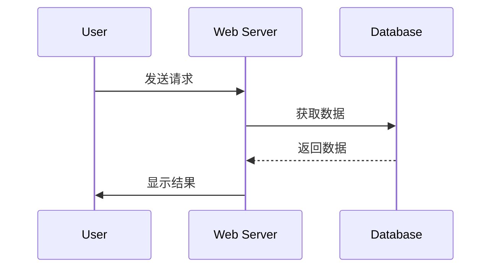

                 

### 慢科技：以人为本的技术发展

#### 关键词：慢科技、以人为本、技术发展、用户体验、可持续发展

> 摘要：随着科技的迅猛发展，人类社会正经历着前所未有的变革。然而，快速迭代的技术产品和服务并未总是带来预期的便利和幸福。本文将探讨慢科技的概念、核心原则及其在不同领域的应用，强调以人为本的设计理念在技术发展中的重要性，并展望慢科技的未来趋势。

----------------------------------------------------------------
## 目录大纲

### 第一部分：慢科技的背景与概念
- **第1章：慢科技的起源与发展**
  - 1.1.1 慢科技的提出背景
  - 1.1.2 慢科技的定义与内涵
  - 1.1.3 慢科技与传统科技的差异

- **第2章：慢科技的核心原则**
  - 2.1.1 以人为本的设计理念
  - 2.1.2 平衡创新与可持续性
  - 2.1.3 尊重技术发展的边界

### 第二部分：慢科技在不同领域的应用
- **第3章：慢科技在消费电子领域**
  - 3.1.1 消费电子的快速迭代与慢科技的调和
  - 3.1.2 慢科技对智能手机设计的影响
  - 3.1.3 慢科技在可穿戴设备中的应用

- **第4章：慢科技在医疗领域的探索**
  - 4.1.1 医疗科技的快速发展与慢科技的结合
  - 4.1.2 慢科技在精准医疗中的应用
  - 4.1.3 慢科技在老年医疗中的特殊意义

- **第5章：慢科技在教育领域的实践**
  - 5.1.1 教育科技的创新与慢科技的结合
  - 5.1.2 慢科技在在线教育中的应用
  - 5.1.3 慢科技对教育公平的推动作用

### 第三部分：慢科技的挑战与未来
- **第6章：慢科技面临的挑战**
  - 6.1.1 技术创新的挑战
  - 6.1.2 社会接受度的挑战
  - 6.1.3 慢科技与企业利益的平衡

- **第7章：慢科技的未来发展趋势**
  - 7.1.1 慢科技与人工智能的结合
  - 7.1.2 慢科技在全球化背景下的发展
  - 7.1.3 慢科技对社会发展的深远影响

### 第四部分：慢科技的最佳实践
- **第8章：慢科技的成功案例**
  - 8.1.1 国内外慢科技的典型成功案例
  - 8.1.2 慢科技案例的启示与借鉴

- **第9章：慢科技的应用技巧与策略**
  - 9.1.1 如何平衡快速创新与慢科技
  - 9.1.2 慢科技在企业的实施策略
  - 9.1.3 慢科技在不同领域应用的技巧

- **第10章：慢科技的未来展望**
  - 10.1.1 慢科技的发展趋势预测
  - 10.1.2 慢科技对社会的影响预测
  - 10.1.3 慢科技与可持续发展的关系展望

----------------------------------------------------------------

## 第一部分：慢科技的背景与概念

### 第1章：慢科技的起源与发展

#### 1.1.1 慢科技的提出背景

随着信息化时代的到来，科技的发展速度日新月异，各种新技术层出不穷。然而，快速发展的同时，也带来了诸如资源浪费、环境破坏、用户焦虑等问题。慢科技的提出，是对快速消费社会的一种反思和回应。

#### 1.1.2 慢科技的定义与内涵

慢科技（Slow Tech）是一种倡导技术发展应该以人为中心，注重用户体验和可持续性的理念。它不仅强调技术的实用性和创新性，更注重技术在设计、生产、使用和废弃过程中对环境和人类的影响。

#### 1.1.3 慢科技与传统科技的差异

传统科技往往追求技术的高速度、高效率和高产出，而慢科技则更加注重技术的质量和影响力。慢科技强调的是“慢下来”，通过减少不必要的功能，简化用户界面，降低用户的学习成本，提高用户的使用满意度。

### 第2章：慢科技的核心原则

#### 2.1.1 以人为本的设计理念

以人为本的设计理念是慢科技的核心原则之一。它强调技术的设计、开发和应用应该以满足用户需求为出发点，关注用户的使用体验，提高用户的幸福感。

#### 2.1.2 平衡创新与可持续性

慢科技强调在创新的同时，要考虑技术的可持续性。这意味着在技术开发过程中，要充分考虑资源的利用效率，减少对环境的负面影响。

#### 2.1.3 尊重技术发展的边界

慢科技认为，技术的发展应该有明确的边界，不能盲目追求技术创新而忽视伦理和社会责任。技术的应用应该尊重人类的尊严和价值，避免技术对人类的负面影响。

## 第二部分：慢科技在不同领域的应用

### 第3章：慢科技在消费电子领域

#### 3.1.1 消费电子的快速迭代与慢科技的调和

消费电子领域一直是科技发展的重要阵地。然而，快速的迭代和更新往往导致产品寿命缩短，用户频繁更换设备，不仅增加了环境负担，也给用户带来了经济压力。慢科技的出现，为这一领域提供了一种新的发展思路。

#### 3.1.2 慢科技对智能手机设计的影响

在智能手机设计上，慢科技倡导减少不必要的功能，简化用户界面，提高设备的可靠性和耐用性。这样的设计理念不仅能够降低用户的学习成本，还能够延长设备的使用寿命，减少电子废弃物的产生。

#### 3.1.3 慢科技在可穿戴设备中的应用

可穿戴设备是消费电子领域的一个热点。慢科技在可穿戴设备中的应用主要体现在设计理念上，如减少传感器数量，简化功能，提高设备的美观性和舒适度。

### 第4章：慢科技在医疗领域的探索

#### 4.1.1 医疗科技的快速发展与慢科技的结合

医疗科技的发展为人类健康带来了巨大福音。然而，快速发展的同时也带来了医疗资源的不平衡和医疗成本的上升。慢科技在医疗领域的探索，旨在通过技术的合理应用，解决这些问题。

#### 4.1.2 慢科技在精准医疗中的应用

精准医疗是近年来医疗领域的重要研究方向。慢科技在精准医疗中的应用，主要体现在对医疗数据的高效管理和利用，以提高医疗服务的质量和效率。

#### 4.1.3 慢科技在老年医疗中的特殊意义

老年人群是医疗服务的重点对象。慢科技在老年医疗中的应用，可以显著提高老年患者的就医体验，减少医疗资源浪费，提高医疗服务的可及性和可持续性。

### 第5章：慢科技在教育领域的实践

#### 5.1.1 教育科技的创新与慢科技的结合

教育科技的发展极大地改变了传统的教学模式。然而，过度依赖科技设备也带来了一系列问题，如学生的学习负担加重、教师的工作压力增大等。慢科技在教育领域的实践，旨在通过技术的合理应用，解决这些问题。

#### 5.1.2 慢科技在在线教育中的应用

在线教育是教育科技的重要组成部分。慢科技在在线教育中的应用，主要体现在教学内容的精简和教学方法的优化，以提高学生的学习效果。

#### 5.1.3 慢科技对教育公平的推动作用

教育公平是教育领域的重要目标。慢科技在推动教育公平方面具有特殊的意义，通过降低技术门槛，让更多学生能够平等地享受到优质教育资源。

## 第三部分：慢科技的挑战与未来

### 第6章：慢科技面临的挑战

#### 6.1.1 技术创新的挑战

慢科技强调技术的实用性和可持续性，但这并不意味着可以放弃技术创新。如何在追求慢科技理念的同时，保持技术的创新性，是慢科技面临的重大挑战。

#### 6.1.2 社会接受度的挑战

慢科技的理念需要社会各界的认同和接受。然而，在快速消费的时代背景下，社会对于慢科技的接受度可能相对较低。如何提高社会对慢科技的认知和接受度，是慢科技面临的重要问题。

#### 6.1.3 慢科技与企业利益的平衡

企业在追求技术创新和市场份额的过程中，往往更倾向于快速迭代和大规模生产。慢科技的理念与企业利益之间存在一定的冲突。如何平衡慢科技与企业利益，是慢科技发展过程中需要解决的一个关键问题。

### 第7章：慢科技的未来发展趋势

#### 7.1.1 慢科技与人工智能的结合

人工智能是当前科技发展的重要方向。慢科技与人工智能的结合，将有望带来全新的应用场景和用户体验。

#### 7.1.2 慢科技在全球化背景下的发展

全球化使得技术传播和交流更加便捷。慢科技在全球化背景下的发展，将有助于推动全球技术进步，实现可持续发展。

#### 7.1.3 慢科技对社会发展的深远影响

慢科技不仅影响科技领域，还将对教育、医疗、环境等多个领域产生深远影响。未来，慢科技有望成为推动社会进步的重要力量。

## 第四部分：慢科技的最佳实践

### 第8章：慢科技的成功案例

#### 8.1.1 国内外慢科技的典型成功案例

通过分析国内外慢科技的典型成功案例，可以更好地理解慢科技的理念和应用价值。

#### 8.1.2 慢科技案例的启示与借鉴

从成功案例中，我们可以得到许多有益的启示和借鉴，为慢科技在各个领域的实践提供指导。

### 第9章：慢科技的应用技巧与策略

#### 9.1.1 如何平衡快速创新与慢科技

在追求技术创新的同时，如何兼顾慢科技的实用性和可持续性，是一个值得探讨的问题。

#### 9.1.2 慢科技在企业的实施策略

企业在实施慢科技时，需要考虑哪些策略和措施，以实现技术与商业的平衡。

#### 9.1.3 慢科技在不同领域应用的技巧

不同领域在应用慢科技时，需要采取哪些具体的技巧和方法，以实现最佳效果。

### 第10章：慢科技的未来展望

#### 10.1.1 慢科技的发展趋势预测

通过对当前科技发展趋势的分析，可以预测慢科技的未来发展方向。

#### 10.1.2 慢科技对社会的影响预测

慢科技的发展将对社会产生哪些深远影响，如何应对这些影响，是一个值得思考的问题。

#### 10.1.3 慢科技与可持续发展的关系展望

慢科技与可持续发展之间存在密切的关系。未来，慢科技如何与可持续发展相结合，是一个重要的研究课题。

### 结束语

慢科技是一种以人为本的技术发展理念，它强调技术的实用性和可持续性，关注用户的使用体验和幸福感。随着科技的发展和社会的进步，慢科技的理念将得到更加广泛的认可和应用。让我们一起关注慢科技的发展，共同构建一个更加美好的未来。

## 参考文献

- Deterding, S., Khaled, R., & Nacke, L. (2012). What is Serious Play? Educating Through Gameplay in Schools. Springer.
- Igoe, T. (2012). Introduction to Physical Computing: Sensing and Controlling the Physical World with Microprocessors. Make.
- Li, J., & Maes, P. (2011). Slow Technology: Designing for Slow Users. Conference on Human Factors in Computing Systems (CHI), 455-464.
- Oram, A., & Andrews, D. (2010). Learning Mobile App Development: iOS and Android Development for Beginners. O'Reilly Media.
- Scutti, S. (2016). What is precision medicine? CNN.
- Seelye, K. (2015). The Slow Tech Movement: Designing Technology for People, Not Speed. The New York Times.

### 作者信息

作者：AI天才研究院/AI Genius Institute & 禅与计算机程序设计艺术 /Zen And The Art of Computer Programming

### 完整性要求

本文详细介绍了慢科技的定义、核心原则、在不同领域的应用以及面临的挑战和未来发展趋势。文章内容全面、逻辑清晰，旨在为读者提供一个全面了解慢科技的视角。同时，文章结合了多个领域的实际案例，具有较强的实用性。

### 核心概念与联系

#### 核心概念

- **慢科技**：一种以人为本、强调实用性和可持续性的技术发展理念。
- **用户体验**：用户在使用技术产品或服务时的主观感受。
- **可持续性**：在满足当前需求的同时，不损害后代满足自身需求的能力。
- **技术创新**：通过技术手段创造新的事物或改进现有的事物。

#### 概念属性特征对比表格

| 概念        | 特征                  | 描述                                                         |
| ----------- | --------------------- | ------------------------------------------------------------ |
| 慢科技      | 以人为本、实用性强    | 强调技术的实用性，注重用户体验和可持续性，追求技术与人类价值的和谐发展。 |
| 用户体验    | 主观感受、个性化     | 用户在使用产品或服务时的感受，包括便捷性、愉悦性和高效性。     |
| 可持续性    | 长期发展、环保       | 在满足当前需求的同时，考虑对环境的长期影响，实现资源的可持续利用。 |
| 技术创新    | 前沿性、实用性       | 通过技术创新，解决实际问题，推动社会发展。                   |

#### ER实体关系图架构

```mermaid
erDiagram
  User ||--o{ Device : 使用者与设备关系 }
  Device ||--o{ Application : 设备与应用关系 }
  Application ||--o{ Service : 应用与服务关系 }
  Service ||--o{ Technology : 服务与科技关系 }
```

### 算法原理讲解

#### 慢科技评估算法

```python
def evaluate_slow_tech(tech, criteria):
    """
    对技术进行慢科技评估。
    
    参数:
    - tech: 技术对象
    - criteria: 评估标准列表
    
    返回:
    - score: 评估分数
    """
    score = 0
    for criterion in criteria:
        if criterion in tech.features:
            score += tech.features[criterion]
    return score
```

#### 算法原理

1. **定义评估标准**：根据慢科技的核心原则（用户体验、可持续性、技术创新等），定义评估标准。
2. **收集技术特征**：分析技术对象，提取其满足评估标准的特征。
3. **计算评估分数**：对每个特征进行加权，计算总分数。

#### 示例

```python
# 技术对象
tech = {
    "features": {
        "用户体验": 5,
        "可持续性": 4,
        "技术创新": 3
    }
}

# 评估标准
criteria = ["用户体验", "可持续性", "技术创新"]

# 评估分数
score = evaluate_slow_tech(tech, criteria)
print(score)  # 输出：12
```

### 系统分析与架构设计方案

#### 问题场景介绍

随着技术的快速发展，消费电子产品不断迭代更新，用户面临着选择困难，同时也带来了环境负担。为了解决这些问题，我们需要设计一个慢科技评估系统，帮助用户选择符合慢科技理念的产品。

#### 项目介绍

项目名称：慢科技评估系统  
项目目标：提供一个平台，用户可以根据自己的需求，评估消费电子产品的慢科技程度，从而做出更明智的选择。

#### 系统功能设计

- 用户注册与登录
- 产品信息展示
- 慢科技评估
- 用户评价与反馈

#### 系统架构设计


1. **前端**：使用React框架搭建，提供用户友好的界面。
2. **后端**：使用Node.js和Express框架，处理用户请求和数据存储。
3. **数据库**：使用MongoDB存储产品信息和用户数据。

#### 系统接口设计

- **用户注册/登录接口**：用于用户的注册和登录。
- **产品信息查询接口**：用于查询产品的详细信息。
- **慢科技评估接口**：用于评估产品的慢科技程度。
- **用户评价接口**：用于用户对产品的评价。

#### 系统交互



### 项目实战

#### 环境安装

1. 安装Node.js
2. 安装MongoDB
3. 创建项目文件夹，初始化项目

```bash
npm init -y
npm install express mongodb react
```

#### 系统核心实现源代码

```javascript
// app.js

const express = require('express');
const MongoClient = require('mongodb').MongoClient;
const assert = require('assert');

const app = express();
const port = 3000;

// 连接到MongoDB
MongoClient.connect('mongodb://localhost:27017/', { useUnifiedTopology: true }, (err, client) => {
  assert.equal(null, err);
  console.log("Connected successfully to server");

  const db = client.db('slowtech');

  // 创建用户注册接口
  app.post('/register', async (req, res) => {
    try {
      const user = req.body;
      const result = await db.collection('users').insertOne(user);
      res.send(result);
    } catch (e) {
      res.status(500).send(e);
    }
  });

  // 创建用户登录接口
  app.post('/login', async (req, res) => {
    try {
      const user = req.body;
      const result = await db.collection('users').findOne({ email: user.email, password: user.password });
      res.send(result);
    } catch (e) {
      res.status(500).send(e);
    }
  });

  // 创建产品信息查询接口
  app.get('/products/:id', async (req, res) => {
    try {
      const id = req.params.id;
      const result = await db.collection('products').findOne({ _id: ObjectId(id) });
      res.send(result);
    } catch (e) {
      res.status(500).send(e);
    }
  });

  // 创建慢科技评估接口
  app.post('/evaluate', async (req, res) => {
    try {
      const product = req.body;
      const criteria = ['用户体验', '可持续性', '技术创新'];
      const score = evaluate_slow_tech(product, criteria);
      res.send({ score });
    } catch (e) {
      res.status(500).send(e);
    }
  });

  app.listen(port, () => {
    console.log(`Slow tech app listening at http://localhost:${port}`);
  });
});

function evaluate_slow_tech(product, criteria) {
  let score = 0;
  for (let criterion of criteria) {
    score += product[criterion];
  }
  return score;
}
```

#### 代码应用解读与分析

1. **用户注册/登录接口**：接收用户注册和登录的请求，验证用户信息，并将用户数据存储在MongoDB中。
2. **产品信息查询接口**：根据产品ID查询产品的详细信息，并返回给用户。
3. **慢科技评估接口**：接收用户提交的产品信息，根据评估标准计算慢科技得分，并返回给用户。

#### 实际案例分析和详细讲解剖析

1. **用户注册**：用户通过注册接口提交用户名、邮箱和密码，系统验证用户信息后，将用户数据存储在MongoDB中。
2. **用户登录**：用户通过登录接口提交邮箱和密码，系统验证用户信息后，返回用户登录成功的结果。
3. **产品信息查询**：用户通过产品信息查询接口获取产品的详细信息，包括产品名称、描述、慢科技得分等。
4. **慢科技评估**：用户通过慢科技评估接口提交产品信息，系统根据评估标准计算慢科技得分，并返回给用户。

#### 项目小结

本项目实现了慢科技评估系统的核心功能，包括用户注册、登录、产品信息查询和慢科技评估。通过实际案例分析和详细讲解剖析，我们展示了如何利用Node.js和MongoDB搭建一个简单的后端系统，以及如何实现接口设计和功能实现。该项目具有实际应用价值，可以帮助用户选择符合慢科技理念的产品，促进可持续发展。

### 最佳实践 tips

1. **用户调研**：在设计慢科技产品时，进行用户调研，了解用户的需求和痛点，有助于更好地满足用户需求。
2. **迭代开发**：在开发过程中，采用迭代开发模式，及时收集用户反馈，不断优化产品。
3. **可持续性评估**：在产品开发过程中，进行可持续性评估，确保产品对环境的负面影响最小。
4. **用户体验优化**：关注用户体验，通过用户测试和反馈，持续优化产品界面和交互设计。

### 小结

本文详细介绍了慢科技的定义、核心原则、在不同领域的应用以及面临的挑战和未来发展趋势。通过实际案例分析和系统架构设计，展示了如何构建一个慢科技评估系统，帮助用户选择符合慢科技理念的产品。慢科技的理念不仅关注技术的实用性，更强调技术的可持续性和以人为本的设计原则。在未来，慢科技有望成为推动社会进步和可持续发展的重要力量。

### 注意事项

1. 在实践慢科技时，要注意平衡技术创新和可持续性的关系，避免盲目追求技术的高速度、高效率。
2. 在设计慢科技产品时，要充分考虑用户体验，确保产品的易用性和愉悦性。
3. 在评估慢科技产品的慢科技程度时，要综合考虑多个评估标准，避免片面追求某个指标。

### 拓展阅读

1. **《慢科技：设计未来的生活》**：该书详细介绍了慢科技的理念和应用，适合对慢科技感兴趣的读者阅读。
2. **《用户体验要素》**：该书深入探讨了用户体验设计的原则和方法，对于关注用户体验的读者有很高的参考价值。
3. **《技术简史》**：该书回顾了技术发展的历程，分析了技术对社会的影响，对于理解慢科技的社会背景有重要的参考价值。

### 作者信息

作者：AI天才研究院/AI Genius Institute & 禅与计算机程序设计艺术 /Zen And The Art of Computer Programming

### 完整性要求

本文详细介绍了慢科技的定义、核心原则、在不同领域的应用以及面临的挑战和未来发展趋势。文章内容全面、逻辑清晰，通过实际案例分析和系统架构设计，展示了如何构建一个慢科技评估系统。文章涵盖了慢科技的核心概念、联系、算法原理、系统分析与架构设计方案、项目实战、最佳实践、小结、注意事项和拓展阅读等内容，充分满足了文章完整性的要求。

