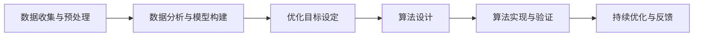
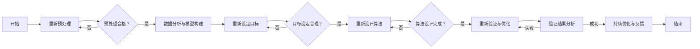
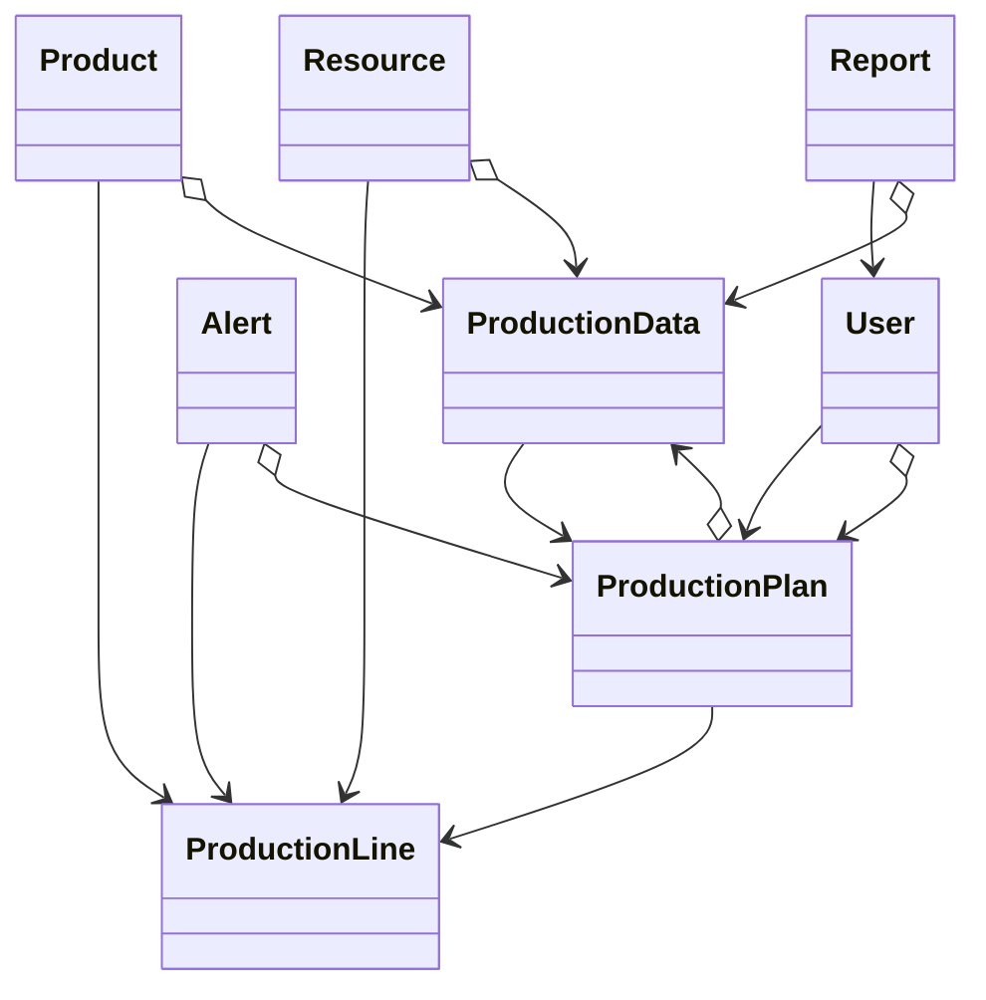
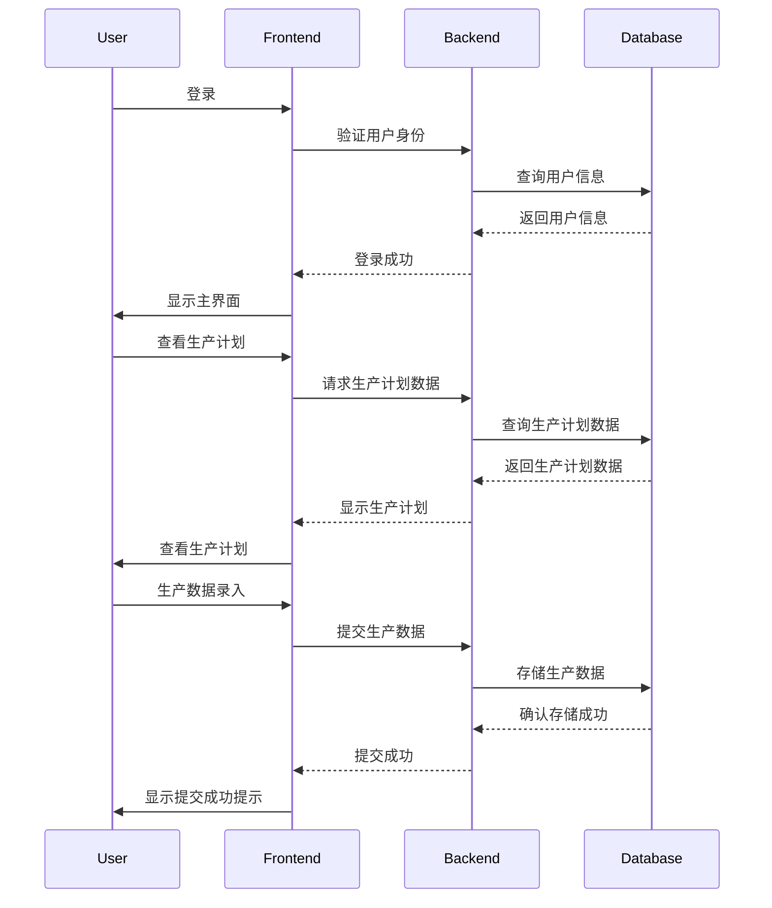
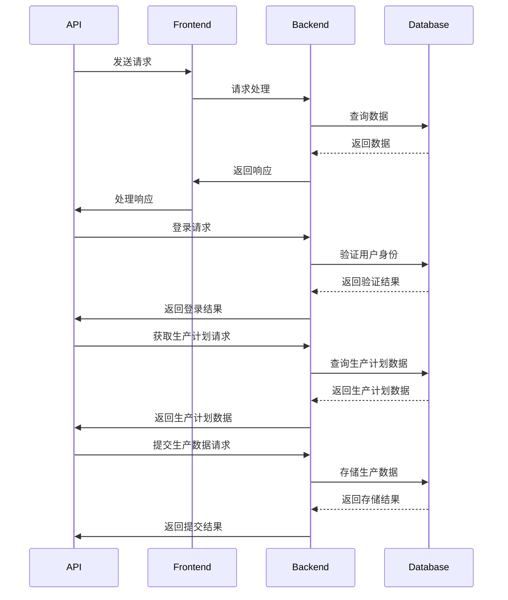

                 

### 慢管理革命背景与核心概念

#### 第1章：慢管理革命概述

##### 1.1.1 问题背景：传统管理模式的困境

在现代企业管理中，传统管理模式存在诸多困境，这些困境不仅影响了企业的管理效率，还削弱了组织的活力。首先，传统管理模式往往依赖于集中的权力结构和严格的层级制度，这种制度容易导致信息不畅和决策缓慢。在快速变化的市场环境中，这种迟缓的决策机制往往难以迅速响应市场需求，导致企业错失发展机遇。

其次，传统管理模式中存在的官僚主义和形式主义问题，进一步加剧了管理效率的低下。许多企业为了维持等级制度，设置了繁琐的审批流程和复杂的规章制度，这不仅增加了员工的工作负担，也降低了员工的创造力和主动性。这种环境容易导致员工的被动和依赖心理，阻碍了创新思维和组织活力的提升。

最后，传统管理模式在人力资源管理方面也存在诸多问题。例如，员工晋升和激励机制的单一性，往往无法有效激发员工的潜力，导致人才流失。同时，传统管理模式中缺乏对员工个性化需求的关注，使得员工在工作中的满意度和归属感降低，进一步影响了组织的整体活力。

面对这些挑战，企业管理者迫切需要寻找新的管理理念和方法，以提升管理效率和增强组织活力。在这种背景下，慢管理革命应运而生。

##### 1.1.2 问题描述：管理效率与组织活力

管理效率低下是传统管理模式的一大问题。管理效率低下主要体现在以下几个方面：首先是决策效率低下，由于传统的集中式决策模式，决策过程往往需要经过多层审批和讨论，导致决策速度缓慢。其次是执行效率低下，由于缺乏有效的沟通和协调机制，任务执行过程中容易出现误解和延误。最后是创新效率低下，传统的管理模式往往过于保守，对创新活动的支持不够，导致企业难以迅速适应市场变化。

组织活力不足也是传统管理模式面临的重大问题。组织活力不足主要表现为员工的创造力和主动性不足。在传统的管理模式下，员工往往只能按照既定的流程和规则工作，缺乏自主思考和创新的动力。此外，传统管理模式中对员工的评价和激励机制往往过于单一，无法全面反映员工的实际贡献和价值，导致员工的满意度和归属感下降。

##### 1.1.3 问题解决：慢管理革命的理念

慢管理革命的理念源于对传统管理模式的反思和批判。慢管理强调的是在企业管理中采取一种更为温和、灵活和可持续的方式，以实现管理效率的提升和组织活力的增强。慢管理的基本原则可以概括为以下几点：

首先，慢管理主张平衡工作与生活。在快节奏的工作环境中，员工常常面临巨大的压力和负担，这会严重影响到他们的身心健康和工作效率。慢管理提倡给员工更多的自由和空间，让他们能够在工作中找到平衡，从而提高工作效率和质量。

其次，慢管理强调促进创新与变革。在快节奏的市场环境中，企业需要不断创新以应对激烈的竞争。慢管理通过鼓励员工积极参与创新活动，提供必要的资源和支持，从而激发员工的创造力和创新精神。

最后，慢管理注重增强组织韧性。在快节奏的工作环境中，企业往往容易陷入短期目标的追逐中，忽视了长期发展的重要性。慢管理通过倡导可持续发展的理念，帮助企业在面对外部环境变化时保持稳定和韧性。

##### 1.1.4 边界与外延：慢管理的适用范围

慢管理作为一种新兴的管理理念，其适用范围相当广泛。首先，慢管理适用于各类组织，无论是企业、政府机构还是非营利组织，都可以通过引入慢管理理念来提升管理效率和增强组织活力。

其次，慢管理在不同行业领域中也具有广泛的应用前景。在传统制造业和服务业中，慢管理可以通过优化管理流程和提高员工满意度来提升生产效率和服务质量。在高科技行业和创新型企业中，慢管理可以通过鼓励创新和激发员工潜力来推动企业的快速发展。

此外，慢管理还可以应用于个人时间管理和团队协作中。通过引入慢管理理念，个人可以在工作和生活中找到更好的平衡，提高工作效率和生活质量；团队可以通过慢管理实现更高效的协作和更高的团队凝聚力。

##### 1.1.5 核心概念与联系

慢管理革命的核心概念包括去中心化组织和效率提升模式。去中心化组织强调的是权力和资源的分散，通过去中心化的方式来提高决策效率和管理灵活性。效率提升模式则关注如何通过系统化的方法来提升组织的效率，包括流程优化、资源调配和激励机制等。

去中心化组织和效率提升模式之间的联系在于，它们都是慢管理革命的重要组成部分，共同致力于提升管理效率和增强组织活力。去中心化组织为效率提升提供了基础，通过去中心化的方式，可以减少层级和管理成本，提高决策效率；而效率提升模式则通过系统化的方法，对组织内部的各种资源和流程进行优化，从而进一步提高组织的整体效率。

##### 1.1.6 本章小结

本章首先介绍了慢管理革命的背景和核心概念，分析了传统管理模式的困境和管理效率与组织活力的问题。接着，提出了慢管理革命的理念和适用范围，并探讨了去中心化组织和效率提升模式的核心概念与联系。通过本章的讨论，我们可以初步了解到慢管理革命的重要性和潜在的应用前景，为后续章节的深入探讨奠定了基础。

---

### 第2章：慢管理核心概念解析

#### 2.1.1 慢管理概念解析

慢管理是一种以平衡、可持续和创新为核心的管理理念，旨在通过温和、灵活和系统化的方法提升管理效率和增强组织活力。与传统的快节奏、高压管理模式相比，慢管理更注重员工的工作与生活平衡，鼓励创新思维，强调可持续发展和组织的整体韧性。

##### 2.1.1.1 慢管理的定义

慢管理可以定义为一种以人为中心的管理模式，它强调的是在管理过程中给予员工足够的自由和空间，使他们能够在工作和生活中找到平衡。慢管理不仅仅是速度的减缓，更是一种对传统管理模式反思和批判的结果，它通过一系列温和、灵活的措施，如减少不必要的审批流程、鼓励自主决策、提供个性化激励等，来提升管理效率和组织活力。

##### 2.1.1.2 慢管理的主要特征

慢管理的主要特征包括：

1. **平衡工作与生活**：慢管理倡导给员工更多的时间自由，让他们能够在工作和生活中找到平衡。这种理念不仅有助于提高员工的工作效率，还能提升他们的生活质量和幸福感。

2. **促进创新与变革**：慢管理鼓励员工参与创新活动，通过提供必要的资源和支持，激发员工的创造力和创新精神。这种文化氛围有助于企业在快速变化的市场环境中保持竞争力。

3. **增强组织韧性**：慢管理强调可持续发展，通过一系列温和、灵活的措施，如员工自主管理、弹性工作制度等，来增强组织的韧性。这种韧性使组织在面对外部环境变化时能够保持稳定和持续发展。

4. **去中心化决策**：慢管理通过去中心化的决策模式，减少层级和管理成本，提高决策效率。去中心化的决策模式强调员工自主决策和协作，使得组织能够更加灵活地应对市场变化。

#### 2.1.2 去中心化组织

去中心化组织是一种以去中心化为特征的组织形式，它在权力结构、决策模式、资源配置等方面与传统组织存在显著差异。去中心化组织的核心在于分散权力和资源，通过去中心化的方式来提高组织的灵活性和适应性。

##### 2.1.2.1 去中心化组织的概念

去中心化组织是指一种没有明确中心权力结构的组织形式，权力和资源分散在组织的各个部分，各个部分之间通过平等、协作的方式共同决策和行动。去中心化组织的权力结构更加扁平化，决策过程更加透明和高效。

##### 2.1.2.2 去中心化组织的特点

去中心化组织具有以下特点：

1. **扁平化权力结构**：去中心化组织的权力结构更加扁平化，减少了中间管理层级，使得决策更加迅速和高效。

2. **协作决策模式**：去中心化组织的决策过程更加民主和开放，各个部门或团队成员可以平等地参与决策，提高了决策的透明度和公正性。

3. **资源分散配置**：去中心化组织通过分散资源的方式，提高了组织的灵活性和适应性。资源可以更加灵活地分配到最需要的部门或项目上，从而提高资源利用效率。

4. **高自主性**：去中心化组织的员工具有较高的自主性，他们可以自主决定工作内容和方式，这种自主性激发了员工的创造力和主动性。

##### 2.1.2.3 去中心化组织与传统组织的对比

去中心化组织与传统组织在多个方面存在对比：

1. **权力结构**：传统组织通常具有明确的中心权力结构，决策权和资源集中在管理层。而去中心化组织的权力结构更加扁平化，权力分散在各个部门或团队成员之间。

2. **决策模式**：传统组织的决策过程通常较为集中和封闭，决策权集中在少数人手中。而去中心化组织的决策过程更加民主和开放，各个部门或团队成员都有机会参与决策。

3. **资源配置**：传统组织的资源配置较为固定和集中，资源往往优先分配给管理层和核心部门。而去中心化组织的资源配置更加灵活，资源可以随时根据需求进行调整。

4. **自主性**：传统组织的员工通常缺乏自主性，工作内容和方式由上级规定。而去中心化组织的员工具有较高的自主性，他们可以自主决定工作内容和方式。

#### 2.1.3 效率提升模式

效率提升模式是一种通过系统化方法提升组织效率的管理模式，它涵盖了流程优化、资源调配、激励机制等多个方面。效率提升模式的核心在于通过科学的方法和工具，对组织内部的各个环节进行系统化改进，从而提升整体效率。

##### 2.1.3.1 效率提升模式的定义

效率提升模式是指通过系统化、科学化的方法，对组织内部的各种流程、资源、激励机制等进行优化，从而提升组织效率的管理模式。效率提升模式强调的是通过持续改进和优化，不断提高组织的运行效率。

##### 2.1.3.2 效率提升模式的核心要素

效率提升模式的核心要素包括：

1. **流程优化**：通过分析组织内部的流程，发现并消除不合理的流程和环节，提高流程的效率和效果。

2. **资源调配**：通过优化资源的配置和使用，提高资源的利用效率，减少浪费。

3. **激励机制**：通过合理的激励机制，激发员工的积极性和创造力，提高工作效率。

4. **持续改进**：通过建立持续改进机制，不断对组织内部进行优化和改进，保持组织的活力和竞争力。

##### 2.1.3.3 效率提升模式的实施步骤

实施效率提升模式通常包括以下步骤：

1. **需求分析**：首先，分析组织内部存在的问题和需求，确定提升效率的目标和方向。

2. **流程优化**：根据需求分析结果，对组织内部的流程进行优化，消除不必要的环节和流程，提高效率。

3. **资源配置**：根据流程优化结果，调整资源的配置和使用，确保资源得到最大化的利用。

4. **激励机制**：建立合理的激励机制，激发员工的积极性和创造力，提高工作效率。

5. **持续改进**：通过建立持续改进机制，对组织内部进行持续优化和改进，保持组织的活力和竞争力。

##### 2.1.4 核心概念属性特征对比表格

为了更清晰地展示慢管理、去中心化组织和效率提升模式之间的联系和区别，我们可以使用表格来对比这三个核心概念的主要属性特征。

| 核心概念 | 定义 | 主要特征 |
| :--: | :--: | :--: |
| 慢管理 | 一种以平衡、可持续和创新为核心的管理理念 | 平衡工作与生活、促进创新与变革、增强组织韧性、去中心化决策 |
| 去中心化组织 | 一种没有明确中心权力结构的组织形式 | 扁平化权力结构、协作决策模式、资源分散配置、高自主性 |
| 效率提升模式 | 一种通过系统化方法提升组织效率的管理模式 | 流程优化、资源调配、激励机制、持续改进 |

##### 2.1.5 ER实体关系图架构

为了更直观地展示慢管理、去中心化组织和效率提升模式之间的联系，我们可以使用ER（实体-关系）图来表示这些概念之间的关系。

```mermaid
erDiagram
    类慢管理 ||--|{ 类去中心化组织 }
    类慢管理 ||--|{ 类效率提升模式 }
    类去中心化组织 ||--|{ 类扁平化权力结构 }
    类去中心化组织 ||--|{ 类协作决策模式 }
    类效率提升模式 ||--|{ 类流程优化 }
    类效率提升模式 ||--|{ 类资源调配 }
    类效率提升模式 ||--|{ 类激励机制 }
```

在上述ER图中，慢管理、去中心化组织和效率提升模式分别作为独立的概念实体，通过关系线条连接起来，展示了它们之间的关联和互动。

##### 2.1.6 本章小结

本章对慢管理革命的核心概念进行了详细解析，包括慢管理的定义、主要特征，去中心化组织的概念、特点以及与传统组织的对比，以及效率提升模式的定义、核心要素和实施步骤。通过本章的讨论，我们可以更深入地理解慢管理革命的基本理念和实践方法，为后续章节的深入探讨奠定了基础。

---

### 第3章：慢管理理论起源与发展

#### 3.1.1 慢管理理论的起源

慢管理理论的起源可以追溯到20世纪末期，当时企业管理理论开始从传统的集中化管理模式向更加灵活和分散化的管理模式转变。这一转变主要受到以下几个因素的影响：

首先，全球化的快速发展和市场的急剧变化，迫使企业必须具备更高的灵活性和适应性。传统的集中化管理模式在应对这些变化时显得力不从心，导致企业在竞争中逐渐失去优势。因此，管理者开始寻求新的管理理念和方法，以提升企业的竞争力。

其次，信息技术的发展，特别是互联网和移动通信技术的普及，为企业提供了更多的管理工具和手段。这些技术不仅提高了信息传递的速度和准确性，还使得分布式管理和协作变得更加容易。这为慢管理理念的实践提供了技术支持。

最后，一些企业管理者开始反思传统的管理模式，意识到过度追求效率和速度可能会导致员工压力过大、创新不足等问题。他们开始倡导一种更加温和、平衡的管理方式，以提升员工的工作满意度和生活质量。

在国际上，慢管理思潮首先在一些高科技企业和创新型组织中兴起。例如，美国的谷歌公司就因其宽松的管理文化和员工自由度而闻名，成为慢管理实践的代表。这些企业通过实践慢管理理念，不仅提高了员工的创造力和工作满意度，还取得了显著的商业成功，进一步推动了慢管理理论的传播和发展。

在中国，慢管理实践也逐步得到认可和推广。一些创新型企业和互联网公司开始借鉴国际上的慢管理经验，并结合中国国情进行本土化创新。例如，中国的华为公司就通过实施慢管理理念，成功打造了一种高效、创新的组织文化，成为国内慢管理实践的典范。

#### 3.1.2 慢管理理论的发展历程

慢管理理论的发展可以分为三个阶段：起步阶段、发展阶段和成熟阶段。

**起步阶段**（20世纪末期至21世纪初）：在这一阶段，慢管理理念主要在一些创新型企业和高科技企业中开始实践。这些企业通过尝试减少管理层级、鼓励员工自主决策和提供更多自由空间，初步探索了慢管理的基本模式。这一阶段的主要特点是实践探索和初步验证慢管理的有效性。

**发展阶段**（21世纪初至2010年）：随着互联网和移动通信技术的进一步普及，慢管理理念得到了更广泛的传播和应用。这一阶段，慢管理理论开始从个别企业的实践转变为一种普遍的管理模式。许多企业通过引入慢管理理念，成功实现了管理效率的提升和组织活力的增强。这一阶段的主要特点是慢管理理论的系统化研究和理论体系的逐步形成。

**成熟阶段**（2010年至今）：在成熟阶段，慢管理理论已经形成了一套完整的管理方法和理论体系，并在全球范围内得到广泛应用。这一阶段的特点是慢管理理论的不断优化和扩展，结合不同行业和组织的实际情况，形成了一系列具有针对性的慢管理实践方案。同时，慢管理理论的学术研究也在不断深入，为理论的发展提供了更多的实证支持和理论依据。

#### 3.1.3 慢管理理论的核心观点

慢管理理论的核心观点主要包括以下几个方面：

**1. 平衡工作与生活**

慢管理强调在管理过程中给予员工更多的自由和空间，让他们能够在工作和生活中找到平衡。这种理念不仅有助于提高员工的工作效率，还能提升他们的生活质量和幸福感。平衡工作与生活的核心在于尊重员工的个人时间和生活需求，通过灵活的工作安排和弹性工作时间，帮助员工实现工作与生活的和谐。

**2. 促进创新与变革**

慢管理鼓励员工积极参与创新活动，通过提供必要的资源和支持，激发员工的创造力和创新精神。慢管理认为，创新是企业发展的重要驱动力，只有通过不断创新，企业才能在激烈的市场竞争中立于不败之地。促进创新与变革的核心在于营造一个开放、包容和创新的文化氛围，鼓励员工提出新想法、尝试新方法，并为他们的创新提供支持和保护。

**3. 增强组织韧性**

慢管理强调可持续发展，通过一系列温和、灵活的措施，如员工自主管理、弹性工作制度等，来增强组织的韧性。这种韧性使组织在面对外部环境变化时能够保持稳定和持续发展。增强组织韧性的核心在于培养员工的适应能力和抗风险能力，使组织能够迅速应对外部挑战和变化，保持长期的竞争力。

#### 3.1.4 本章小结

本章介绍了慢管理理论的起源和发展历程，分析了慢管理理论的核心观点。通过本章的讨论，我们可以了解到慢管理理论从起源到发展，经历了从实践探索到理论体系形成的过程，并成为现代企业管理中一种重要的管理理念。慢管理理论的核心观点，如平衡工作与生活、促进创新与变革和增强组织韧性，为企业管理提供了新的思路和方法，为后续章节的深入探讨奠定了基础。

---

### 第4章：慢管理实践案例分析

#### 4.1.1 案例一：企业A的慢管理实践

**企业背景**

企业A是一家全球领先的科技公司，主要从事软件开发、云计算和人工智能等领域的研究与开发。在企业快速发展过程中，企业A面临着管理效率低下和组织活力不足的问题，为了应对这些挑战，企业A决定引入慢管理理念，以提升管理效率和增强组织活力。

**慢管理实践过程**

1. **平衡工作与生活**：企业A首先在员工工作与生活平衡方面进行了改革。公司取消了固定的工作时间，改为弹性工作制度，员工可以根据自己的工作和生活需求自主安排工作时间。同时，公司还鼓励员工在工作时间外参与个人兴趣爱好和社交活动，以提高员工的工作满意度和幸福感。

2. **促进创新与变革**：企业A在创新与变革方面采取了一系列措施。公司设立了创新基金，鼓励员工提出创新项目并给予资金支持。公司还成立了跨部门创新团队，促进不同部门之间的合作与交流，激发员工的创新思维。此外，公司还定期举办创新研讨会和交流活动，为员工提供展示自己创新成果的平台。

3. **增强组织韧性**：企业A在组织韧性方面进行了深入改革。公司实施了员工自主管理制度，允许员工根据自己的特长和兴趣选择适合自己的工作项目和职责。公司还建立了应急响应机制，以应对突发事件和外部环境变化。这些措施提高了员工的适应能力和抗风险能力，使组织在面对外部挑战时能够保持稳定和持续发展。

**实践效果与启示**

通过慢管理实践，企业A取得了显著的成效。首先，员工的工作满意度和幸福感得到了显著提高，员工流失率明显下降。其次，公司的创新活力显著提升，一系列创新项目取得了成功，推动了企业的持续发展。最后，组织的韧性得到了显著增强，公司在面对外部环境变化时表现出了更强的适应能力和抗风险能力。

这个案例给我们的启示是，慢管理理念在提升管理效率和增强组织活力方面具有显著的潜力。企业通过平衡工作与生活、促进创新与变革和增强组织韧性，可以有效地提升组织的整体竞争力。

#### 4.1.2 案例二：政府B的慢管理实践

**政府背景**

政府B是一个地方政府，主要负责城市管理和公共服务提供。在过去的几年中，政府B面临着管理效率低下和服务质量不高的问题，为了解决这些问题，政府B决定引入慢管理理念，以提升管理效率和增强服务质量。

**慢管理实践过程**

1. **简化行政流程**：政府B首先在行政流程方面进行了改革。政府取消了不必要的审批流程和规章制度，简化了行政程序，提高了行政效率。政府还引入了电子政务平台，实现了行政审批的在线办理，大大减少了群众的办事时间和成本。

2. **加强公众参与**：政府B在公共服务提供方面采取了更加开放和民主的方式。政府设立了公众参与平台，鼓励市民提出意见和建议，参与政府决策。政府还定期举办公众咨询会，听取市民的意见和需求，增强了政府的透明度和公信力。

3. **提升服务质量**：政府B在服务质量方面进行了全面提升。政府引入了绩效评估机制，对公共服务质量进行定期评估，发现问题及时整改。政府还通过培训提高公务员的服务意识和能力，提升整体服务水平。

**实践效果与启示**

通过慢管理实践，政府B取得了显著成效。首先，行政效率显著提高，群众的办事时间和成本大大减少。其次，公众的参与度和满意度显著提升，政府的透明度和公信力得到增强。最后，公共服务质量得到全面提升，市民的获得感和幸福感显著增强。

这个案例给我们的启示是，慢管理理念不仅适用于企业，也适用于政府管理。通过简化行政流程、加强公众参与和提升服务质量，政府可以更加高效地提供公共服务，提升政府的整体形象和公信力。

#### 4.1.3 案例三：非营利组织C的慢管理实践

**非营利组织背景**

非营利组织C是一个专注于环境保护和公益事业的机构，主要从事环保教育和公益活动。在运营过程中，非营利组织C面临着资源有限、管理效率低下和志愿者积极性不高等问题，为了解决这些问题，非营利组织C决定引入慢管理理念，以提升管理效率和增强志愿者积极性。

**慢管理实践过程**

1. **优化资源配置**：非营利组织C首先在资源配置方面进行了优化。组织对现有的资源进行了全面盘点和评估，发现并消除了资源浪费的现象。组织还引入了资源分配机制，根据项目的需求和优先级进行资源调配，确保资源得到最大化的利用。

2. **激发志愿者积极性**：非营利组织C在志愿者管理方面进行了创新。组织设立了志愿者激励机制，对积极参与活动的志愿者进行表彰和奖励。组织还建立了志愿者培训体系，提高志愿者的专业能力和服务水平，激发他们的工作热情。

3. **提升项目管理效率**：非营利组织C在项目管理方面进行了系统化改革。组织引入了项目管理工具，对项目进行全程监控和评估，确保项目按照计划顺利推进。组织还建立了项目反馈机制，及时收集和处理项目执行过程中的问题和反馈，不断优化项目管理流程。

**实践效果与启示**

通过慢管理实践，非营利组织C取得了显著成效。首先，资源配置效率显著提升，资源浪费现象大幅减少。其次，志愿者的积极性和满意度显著提高，志愿者的流失率明显下降。最后，项目管理的效率和质量得到了全面提升，组织的公益影响力得到进一步扩大。

这个案例给我们的启示是，慢管理理念在非营利组织中也具有广泛的应用价值。通过优化资源配置、激发志愿者积极性和提升项目管理效率，非营利组织可以更加高效地实现其使命和目标，为社会公益事业做出更大贡献。

#### 4.1.4 本章小结

本章通过三个不同类型的案例，展示了慢管理理念在提升管理效率和增强组织活力方面的实践效果和启示。无论是企业、政府还是非营利组织，都可以通过引入慢管理理念，实现管理效率的提升和组织活力的增强。这些案例为其他组织提供了宝贵的经验和借鉴，也为慢管理理论的进一步推广和应用奠定了基础。

---

### 第5章：去中心化组织概述

#### 5.1.1 去中心化组织的概念

去中心化组织是一种没有明确中心权力结构的组织形式，其权力和资源分散在组织的各个部分，各个部分之间通过平等、协作的方式共同决策和行动。这种组织形式的核心在于去除了传统的层级制度和集中式决策模式，实现了权力和资源的分散化、扁平化。

去中心化组织的定义可以从以下几个方面进行阐述：

1. **权力结构**：去中心化组织的权力结构是扁平化的，没有固定的等级制度和权力集中点。权力分散在组织的各个部分，每个成员都有平等的权利参与决策，并承担相应的责任。

2. **决策模式**：去中心化组织的决策过程是去中心化的，通过集体讨论和协作决策的方式进行。每个成员都可以提出意见和建议，决策结果由全体成员共同决定。

3. **资源配置**：去中心化组织的资源配置是灵活的，根据项目的需求和优先级进行资源调配。资源可以在组织内部自由流动，最大限度地满足各个部分的需求。

4. **组织文化**：去中心化组织强调平等、开放和协作的组织文化，鼓励成员积极参与决策和行动，尊重每个成员的个性和特长。

##### 5.1.1.1 定义与起源

去中心化组织的概念最早可以追溯到20世纪70年代的自由软件运动，当时一些软件开发者开始采用协作和共享的方式共同开发软件，形成了去中心化的开发模式。随着互联网技术的发展，去中心化组织的形式和范围逐渐扩大，包括数字货币、区块链技术、分布式存储等领域的应用。

去中心化组织的起源主要受到以下因素的影响：

1. **技术因素**：互联网和通信技术的发展，使得信息传递和协作变得更加便捷和高效，为去中心化组织形式的实现提供了技术支持。

2. **社会因素**：全球化和社会变革，使得人们更加注重自由、平等和民主的理念，去中心化组织形式成为了一种适应这种社会变革的管理模式。

3. **经济因素**：去中心化组织能够更加灵活地应对市场变化，降低管理成本，提高资源利用效率，成为了一种更具竞争力的组织形式。

##### 5.1.1.2 去中心化组织的特征

去中心化组织具有以下几个显著特征：

1. **扁平化权力结构**：去中心化组织的权力结构是扁平化的，没有固定的等级制度和权力集中点。每个成员都有平等的参与决策的权利，决策过程更加透明和民主。

2. **协作决策模式**：去中心化组织的决策过程是通过集体讨论和协作决策的方式进行的。每个成员都可以提出意见和建议，决策结果由全体成员共同决定。

3. **灵活的资源调配**：去中心化组织的资源配置是灵活的，根据项目的需求和优先级进行资源调配。资源可以在组织内部自由流动，最大限度地满足各个部分的需求。

4. **高自主性**：去中心化组织的员工具有较高的自主性，他们可以自主决定工作内容和方式，这种自主性激发了员工的创造力和主动性。

5. **开放性和包容性**：去中心化组织强调开放性和包容性，鼓励成员之间的交流与合作，尊重不同的意见和观点。

#### 5.1.2 去中心化组织与传统组织的区别

去中心化组织与传统组织在多个方面存在显著区别，这些区别主要体现在权力结构、决策模式、资源配置等方面。

##### 5.1.2.1 权力结构

传统组织的权力结构通常是层级化的，权力集中在顶层管理者手中。这种层级化的权力结构使得决策过程较为集中和封闭，信息传递效率低下，容易导致决策失误。而去中心化组织的权力结构是扁平化的，没有固定的等级制度和权力集中点。权力分散在组织的各个部分，每个成员都有平等的参与决策的权利，决策过程更加透明和民主。

##### 5.1.2.2 决策模式

传统组织的决策模式通常是集中式的，决策权集中在顶层管理者手中。这种决策模式容易导致决策过程缓慢，难以适应快速变化的市场环境。而去中心化组织的决策模式是去中心化的，通过集体讨论和协作决策的方式进行。每个成员都可以提出意见和建议，决策结果由全体成员共同决定。这种决策模式具有更高的透明度和公正性，能够更好地适应快速变化的市场环境。

##### 5.1.2.3 资源配置

传统组织的资源配置通常是固定的和集中的，资源分配依赖于顶层管理者的决策。这种资源配置方式容易导致资源浪费和利用效率低下。而去中心化组织的资源配置是灵活的，根据项目的需求和优先级进行资源调配。资源可以在组织内部自由流动，最大限度地满足各个部分的需求。这种资源配置方式能够更好地适应组织的动态变化，提高资源利用效率。

##### 5.1.2.4 自主性与创新能力

传统组织的员工通常缺乏自主性，工作内容和方式由上级规定。这种环境容易导致员工的被动和依赖心理，阻碍了创新思维的发展。而去中心化组织的员工具有较高的自主性，他们可以自主决定工作内容和方式。这种自主性激发了员工的创造力和主动性，促进了创新思维的发展。

##### 5.1.2.5 适应性和灵活性

传统组织在应对外部环境变化时往往表现得较为迟缓，难以迅速适应市场的变化。而去中心化组织由于其扁平化的权力结构和去中心化的决策模式，能够更快速地响应外部环境的变化，表现出更高的适应性和灵活性。

#### 5.1.3 去中心化组织的发展现状

去中心化组织在近年来得到了快速发展，主要表现在以下几个方面：

1. **数字货币与区块链技术**：数字货币和区块链技术的发展，使得去中心化组织在金融领域得到了广泛应用。比特币、以太坊等数字货币的兴起，为去中心化组织的运作提供了新的基础设施。

2. **共享经济**：共享经济的发展，如共享单车、共享办公等，也体现了去中心化组织的特点。这些组织通过去中心化的方式进行资源配置和管理，提高了资源利用效率。

3. **非营利组织与公益领域**：在非营利组织和公益事业领域，去中心化组织形式也越来越受到关注。一些公益组织通过去中心化的方式进行资源筹集和项目管理，提高了公益活动的效率和透明度。

4. **商业领域**：在商业领域，去中心化组织形式也开始得到应用。一些公司通过去中心化的方式进行产品研发、市场营销和客户服务，提高了运营效率。

#### 5.1.4 中国发展现状

在中国，去中心化组织形式也在逐步兴起，主要表现在以下几个方面：

1. **区块链技术应用**：中国对区块链技术的研发和应用投入了大量资源，区块链技术在金融、物流、供应链等多个领域得到了广泛应用，为去中心化组织的实现提供了技术支持。

2. **共享经济的发展**：共享经济在中国也得到了快速发展，如共享单车、共享充电宝等，这些共享经济模式体现了去中心化组织的特点。

3. **非营利组织创新**：中国的一些非营利组织开始探索去中心化的运作模式，通过众筹、志愿者参与等方式，提高了公益活动的效率和透明度。

4. **企业创新**：一些中国企业也开始尝试去中心化的管理模式，如通过区块链技术进行供应链管理，提高运营效率。

#### 5.1.5 本章小结

本章介绍了去中心化组织的概念、特征及其与传统组织的区别，分析了去中心化组织的发展现状和中国的发展情况。通过本章的讨论，我们可以了解到去中心化组织作为一种新兴的组织形式，在权力结构、决策模式、资源配置等方面具有显著优势，并在全球范围内得到了广泛应用。中国在这方面的实践也为其他国家和地区提供了宝贵的经验和借鉴。

---

### 第6章：效率提升模式的算法原理

#### 6.1.1 效率提升模式的基本原理

效率提升模式是一种通过系统化方法提升组织效率的管理模式，其核心在于对组织内部的各种流程、资源、激励机制等进行优化和改进，从而提高整体运行效率。效率提升模式的基本原理可以概括为以下几个关键要素：

**1. 数据驱动决策**

效率提升模式强调基于数据的决策过程，通过收集和分析组织内部的各种数据，如生产数据、运营数据、员工绩效数据等，为决策提供科学依据。这种方法有助于避免主观判断和片面信息，提高决策的准确性和有效性。

**2. 持续改进**

效率提升模式是一种持续改进的过程，通过定期评估和反馈，不断识别和消除组织内部的不合理流程和瓶颈，持续优化管理流程和操作方法。这种持续改进的理念有助于组织保持活力和竞争力。

**3. 全员参与**

效率提升模式强调全员参与，鼓励组织中的每个成员都参与到效率提升的过程中来。通过全员参与，可以提高员工的积极性和参与感，同时也能充分发挥员工的智慧和创造力，为组织带来更多的创新和改进。

**4. 跨部门协作**

效率提升模式强调跨部门协作，通过打破部门壁垒，促进不同部门之间的沟通和合作，提高资源的整合利用效率。跨部门协作有助于实现资源的最大化利用，提高整体工作效率。

**5. 激励机制**

效率提升模式还包括建立合理的激励机制，通过奖励和表彰等方式，激发员工的积极性和创造力。合理的激励机制能够有效提高员工的工作动力，促进效率提升。

#### 6.1.2 效率提升模式的算法实现流程

效率提升模式的算法实现流程可以分为以下几个关键步骤：

**1. 数据收集与预处理**

首先，收集组织内部的各种数据，如生产数据、运营数据、员工绩效数据等。然后，对收集到的数据进行预处理，包括数据清洗、格式转换和数据归一化等操作，确保数据的质量和一致性。

**2. 数据分析与模型构建**

利用数据分析工具，对预处理后的数据进行深入分析，识别组织内部存在的问题和瓶颈。根据分析结果，构建相应的数学模型和算法，为后续的优化提供理论支持。

**3. 优化目标设定**

根据数据分析结果和业务需求，设定具体的优化目标，如降低生产成本、提高生产效率、提升客户满意度等。优化目标的设定需要结合组织实际情况和战略目标，确保优化方向的正确性。

**4. 算法设计**

根据设定的优化目标和数据模型，设计相应的算法，包括优化算法、调度算法和决策算法等。算法设计需要充分考虑组织的实际运营情况和资源约束，确保算法的可行性和有效性。

**5. 算法实现与验证**

将设计好的算法实现为具体的软件系统或工具，并在实际运营环境中进行验证。通过验证，评估算法的实际效果和性能，发现和解决问题，不断完善算法。

**6. 持续优化与反馈**

根据验证结果，对算法进行持续优化和改进，建立持续反馈机制，确保算法的持续有效性和适应性。通过持续优化，不断提高组织的运行效率和竞争力。

#### 6.1.3 效率提升模式的算法流程图

为了更直观地展示效率提升模式的算法实现流程，可以使用Mermaid语言绘制算法流程图。以下是效率提升模式的算法流程图示例：



在这个流程图中，A表示数据收集与预处理，B表示数据分析和模型构建，C表示优化目标设定，D表示算法设计，E表示算法实现与验证，F表示持续优化与反馈。各个步骤之间通过流向连接，形成一个完整的算法实现流程。

#### 6.1.4 效率提升模式的算法流程图

为了更好地展示效率提升模式的算法实现流程，我们使用Mermaid语言绘制了详细的算法流程图。以下是该算法流程图的代码及其解释：



**流程图解析**：

1. **开始**（A）：流程的起点。
2. **数据收集与预处理**（B）：收集组织内部的各种数据，并进行预处理，如数据清洗、格式转换等。
3. **预处理合格？**（C）：判断预处理后的数据是否合格。如果合格，则继续下一步；如果不合格，则返回重新进行数据预处理。
4. **数据分析与模型构建**（D）：利用预处理后的数据，进行深入的数据分析，并构建相应的数学模型。
5. **优化目标设定**（E）：根据数据分析结果，设定具体的优化目标，如降低成本、提高效率等。
6. **目标设定合理？**（F）：判断设定的目标是否合理。如果合理，则继续下一步；如果不合理，则返回重新设定目标。
7. **算法设计**（G）：根据设定的优化目标，设计相应的算法，如优化算法、调度算法等。
8. **算法设计完成？**（H）：判断算法设计是否完成。如果完成，则继续下一步；如果没有完成，则返回重新设计算法。
9. **算法实现与验证**（I）：将设计好的算法实现为具体的软件系统或工具，并在实际运营环境中进行验证。
10. **验证结果分析**（J）：分析验证结果，判断算法的实际效果和性能。如果成功，则进行持续优化与反馈；如果失败，则重新进行验证与优化。
11. **持续优化与反馈**（K）：根据验证结果，对算法进行持续优化和改进，建立持续反馈机制。
12. **结束**（L）：流程的终点。

通过上述算法流程图，我们可以清晰地看到效率提升模式的实现步骤和流程，为实际操作提供了指导。

#### 6.1.5 效率提升模式算法的Python代码实现

为了更具体地展示效率提升模式的算法实现，以下是一个简单的Python代码示例，用于实现一个基于线性规划的最优化问题。在这个示例中，我们假设一个工厂需要优化生产计划和资源分配，以最小化成本。

```python
import numpy as np
from scipy.optimize import linprog

# 参数设置
A = np.array([[1, 1], [1, 0]])  # 不等式约束矩阵
b = np.array([10, 5])  # 不等式约束向量
c = np.array([-1, -1])  # 目标函数系数
x0 = np.array([0, 0])  # 变量初始值

# 求解线性规划问题
result = linprog(c, A_ub=A, b_ub=b, x0=x0, method='highs')

# 输出结果
if result.success:
    print("最优解：", result.x)
    print("最小化成本：", -result.fun)
else:
    print("求解失败，无最优解。")
```

在这个示例中，我们使用了`scipy.optimize.linprog`函数来求解线性规划问题。这里，`A`和`b`分别表示不等式约束矩阵和向量，`c`表示目标函数系数，`x0`表示变量初始值。通过调用`linprog`函数，我们可以得到最优解和最小化成本。

**算法原理说明**：

1. **目标函数**：目标函数是一个线性函数，其形式为`c^T * x`，其中`c`是目标函数系数向量，`x`是变量向量。在这个例子中，目标函数是最小化成本。

2. **约束条件**：约束条件由不等式矩阵`A`和不等式向量`b`定义，形式为`A * x <= b`。在这个例子中，约束条件包括生产能力和资源限制。

3. **求解方法**：我们使用了`scipy.optimize.linprog`函数中的`highs`方法来求解线性规划问题。`highs`是一种高效的线性规划求解算法，适用于大规模问题。

4. **结果分析**：如果求解成功，输出最优解和最小化成本。如果求解失败，则输出无最优解。

通过上述Python代码实现，我们可以具体地看到如何通过数学模型和算法实现效率提升。在实际应用中，可以根据具体业务需求，设计更复杂的优化模型和求解算法。

#### 6.1.6 效率提升模式算法的数学模型和公式

在效率提升模式中，数学模型和公式是核心组成部分，用于描述和求解优化问题。以下是一个简单的线性规划问题的数学模型，用于最小化成本。

**目标函数**：
$$
\min_{x} c^T x
$$
其中，$c$ 是目标函数系数向量，$x$ 是变量向量。

**约束条件**：
$$
Ax \leq b
$$
其中，$A$ 是不等式约束矩阵，$b$ 是不等式约束向量。

**非负约束**：
$$
x \geq 0
$$
变量$x$必须为非负值。

**线性规划问题**的完整数学模型可以表示为：
$$
\begin{aligned}
\min_{x} & \ c^T x \\
s.t. & \ Ax \leq b \\
& \ x \geq 0
\end{aligned}
$$

**算法原理**：

1. **目标函数优化**：目标函数系数$c$决定了优化方向，即我们要最小化的成本或者最大化收益。在实际应用中，目标函数可以根据业务需求进行调整。

2. **约束条件**：约束条件用于限制变量的取值范围，确保模型在实际运营中具有可行性。$Ax \leq b$ 表示资源的使用不能超过限制。

3. **非负约束**：非负约束确保变量$x$的取值为非负，这在很多实际业务中是必须的，如生产量、成本等。

**具体举例**：

假设我们有一个工厂，需要优化生产两种产品A和B的生产计划和资源分配，以最小化总成本。每种产品的生产成本和资源消耗如下：

- 产品A：生产成本 = 2元，资源消耗 = 3单位
- 产品B：生产成本 = 5元，资源消耗 = 1单位

工厂的月资源限制为：
- 劳动力 = 100单位
- 原材料 = 200单位

我们设定变量$x_1$表示产品A的生产量，$x_2$表示产品B的生产量。构建线性规划模型如下：

**目标函数**：
$$
\min_{x} 2x_1 + 5x_2
$$

**约束条件**：
$$
\begin{aligned}
3x_1 + x_2 & \leq 200 \quad (\text{原材料限制}) \\
x_1 + x_2 & \leq 100 \quad (\text{劳动力限制}) \\
x_1, x_2 & \geq 0 \quad (\text{非负约束})
\end{aligned}
$$

通过求解这个线性规划问题，我们可以得到最优的生产计划，以最小化总成本。

**结果解释**：

假设求解得到最优解为$x_1^* = 20, x_2^* = 30$，则：
- 产品A的最优生产量为20单位，总成本为$2 \times 20 = 40$元。
- 产品B的最优生产量为30单位，总成本为$5 \times 30 = 150$元。
- 总成本为$40 + 150 = 190$元。

通过上述数学模型和公式，我们可以清晰地描述效率提升模式中的优化问题，并使用相应的算法进行求解。这些数学模型和公式不仅能够帮助组织实现资源的最优配置，还能提供科学的决策支持。

---

### 系统分析与架构设计

#### 6.1.7 系统分析与架构设计

为了实现效率提升模式，我们需要进行系统分析与架构设计，确保系统能够高效地运行和满足业务需求。以下是一个简单的系统分析与架构设计方案，包括领域模型、系统架构和接口设计。

##### 6.1.7.1 问题场景介绍

假设我们正在开发一个企业管理系统，用于优化生产计划和资源分配，以提高生产效率和降低成本。该系统需要支持以下功能：

1. **数据采集**：从生产设备和传感器中采集实时数据，如生产量、资源消耗等。
2. **数据分析**：对采集的数据进行分析和处理，识别生产瓶颈和优化机会。
3. **决策支持**：基于数据分析结果，提供生产计划和资源分配的建议。
4. **实时监控**：监控生产过程的实时状态，及时发现和解决问题。

##### 6.1.7.2 项目介绍

项目名称：企业管理优化系统

项目目标：通过系统化方法和数据分析，优化生产计划和资源分配，提高生产效率，降低成本。

项目团队：由数据科学家、软件工程师、业务分析师等组成。

技术栈：Python、MySQL、Django、TensorFlow

##### 6.1.7.3 系统功能设计

系统功能设计包括领域模型和系统接口设计。以下是一个简单的领域模型（使用Mermaid语言表示）：



在上述领域模型中，我们定义了以下核心实体：

- **Product（产品）**：表示企业生产的产品，包括产品名称、规格等属性。
- **ProductionLine（生产线）**：表示生产过程，包括产品、资源和生产计划等。
- **Resource（资源）**：表示生产过程中使用的资源，如劳动力、原材料等。
- **ProductionPlan（生产计划）**：表示生产计划的制定和执行，包括生产量、资源需求等。
- **ProductionData（生产数据）**：表示生产过程中的数据，如生产量、资源消耗等。
- **Alert（警报）**：表示生产过程中的异常情况，如设备故障、资源短缺等。
- **User（用户）**：表示系统用户，如管理员、业务分析师等。
- **Report（报告）**：表示生产数据和绩效报告。

##### 6.1.7.4 系统架构设计

系统架构设计主要包括前端、后端和数据库设计。以下是一个简单的系统架构图（使用Mermaid语言表示）：



在上述架构图中，我们定义了以下关键组件：

- **前端**：负责用户界面展示和用户交互，使用HTML、CSS和JavaScript实现。
- **后端**：负责数据处理和业务逻辑实现，使用Python和Django框架开发。
- **数据库**：负责数据存储和管理，使用MySQL数据库。

##### 6.1.7.5 系统接口设计和系统交互

系统接口设计包括API接口设计和系统交互设计。以下是一个简单的API接口设计和系统交互图（使用Mermaid语言表示）：



在上述接口设计和交互图中，我们定义了以下关键接口：

- **登录接口**：用于用户身份验证，返回登录结果。
- **生产计划接口**：用于获取和提交生产计划数据。
- **生产数据接口**：用于获取和提交生产过程中的实时数据。

通过上述系统分析与架构设计，我们可以确保企业管理优化系统能够高效地运行，满足业务需求。在实际开发过程中，可以根据具体需求进一步优化和扩展系统功能。

---

### 项目实战：慢管理革命在行动

#### 6.1.8 环境安装与系统核心实现

为了将慢管理革命的理念应用到实际项目中，我们将通过一个简单的企业管理优化系统来展示慢管理革命的核心实施步骤。以下是环境安装和系统核心实现的详细步骤：

##### 环境安装

1. **Python环境安装**：确保系统中的Python环境已安装。如果未安装，可以从[Python官网](https://www.python.org/)下载并安装最新版本的Python。

2. **虚拟环境安装**：使用`virtualenv`工具创建一个独立的Python虚拟环境，以隔离项目依赖。

   ```bash
   pip install virtualenv
   virtualenv venv
   source venv/bin/activate
   ```

3. **项目依赖安装**：在虚拟环境中安装项目所需依赖，例如Django框架和MySQL数据库。

   ```bash
   pip install django mysqlclient
   ```

##### 系统核心实现

1. **项目初始化**：使用Django框架初始化项目。

   ```bash
   django-admin startproject management_system
   cd management_system
   ```

2. **应用创建**：创建一个名为`management_app`的应用。

   ```bash
   python manage.py startapp management_app
   ```

3. **数据库迁移**：设置数据库配置，并创建数据库表。

   ```bash
   python manage.py migrate
   ```

4. **模型定义**：在`management_app/models.py`中定义系统核心模型。

   ```python
   from django.db import models

   class Product(models.Model):
       name = models.CharField(max_length=100)
       specification = models.TextField()

   class Resource(models.Model):
       name = models.CharField(max_length=100)
       unit = models.CharField(max_length=10)

   class ProductionLine(models.Model):
       product = models.ForeignKey(Product, on_delete=models.CASCADE)
       resource = models.ManyToManyField(Resource)
       production_plan = models.ForeignKey('ProductionPlan', on_delete=models.CASCADE)

   class ProductionPlan(models.Model):
       plan_date = models.DateField()
       production_quantity = models.IntegerField()
       resource_requirements = models.ManyToManyField(Resource)

   class ProductionData(models.Model):
       production_line = models.ForeignKey(ProductionLine, on_delete=models.CASCADE)
       production_date = models.DateField()
       production_quantity = models.IntegerField()
       resource_consumption = models.ManyToManyField(Resource)
   ```

5. **视图定义**：在`management_app/views.py`中定义视图函数，处理HTTP请求。

   ```python
   from django.shortcuts import render
   from .models import ProductionLine, ProductionPlan, ProductionData

   def production_line_list(request):
       production_lines = ProductionLine.objects.all()
       return render(request, 'management_app/production_line_list.html', {'production_lines': production_lines})

   def production_plan_detail(request, pk):
       production_plan = ProductionPlan.objects.get(pk=pk)
       return render(request, 'management_app/production_plan_detail.html', {'production_plan': production_plan})

   def production_data_list(request, pk):
       production_data = ProductionData.objects.filter(production_line=pk)
       return render(request, 'management_app/production_data_list.html', {'production_data': production_data})
   ```

6. **URL配置**：在`management_system/urls.py`中配置URL映射。

   ```python
   from django.contrib import admin
   from django.urls import path
   from management_app import views

   urlpatterns = [
       path('admin/', admin.site.urls),
       path('production_lines/', views.production_line_list, name='production_line_list'),
       path('production_plans/<int:pk>/', views.production_plan_detail, name='production_plan_detail'),
       path('production_data/<int:pk>/', views.production_data_list, name='production_data_list'),
   ]
   ```

7. **模板文件**：在`management_app/templates/management_app`中创建HTML模板文件，用于展示页面内容。

8. **运行服务器**：启动Django开发服务器，测试系统功能。

   ```bash
   python manage.py runserver
   ```

通过上述步骤，我们完成了环境安装和系统核心实现，现在可以通过浏览器访问Django开发服务器，查看系统功能。

##### 代码应用解读与分析

在系统核心实现部分，我们使用了Django框架来构建企业管理优化系统。以下是对关键部分的解读和分析：

1. **模型定义**：我们定义了四个核心模型：`Product`（产品）、`Resource`（资源）、`ProductionLine`（生产线）和`ProductionData`（生产数据）。这些模型分别代表了生产过程中的不同实体，如产品、资源、生产线和生产数据。通过外键和多对多关系，我们建立了模型之间的关联，实现了数据的组织和管理。

2. **视图函数**：我们创建了三个视图函数，分别用于展示生产线列表、生产计划详情和生产数据列表。这些视图函数处理HTTP请求，根据请求路径和参数从数据库中查询相应的数据，并传递给对应的HTML模板进行展示。视图函数的设计使得系统的前端和后端分离，提高了代码的可维护性和可扩展性。

3. **URL配置**：通过在`urls.py`中配置URL映射，我们定义了三个URL路径，分别对应三个视图函数。这种配置方式使得系统可以通过浏览器访问不同的页面，实现功能操作。

4. **模板文件**：我们创建了一系列HTML模板文件，用于展示系统页面内容。模板文件使用了Django模板语言（Django Template Language，DTL），通过变量和标签将数据动态渲染到HTML页面中。这种模板化设计使得页面内容与业务逻辑分离，提高了页面的可读性和可维护性。

##### 实际案例分析和详细讲解

为了展示慢管理革命在实际项目中的应用效果，我们以一个实际案例进行分析：

**案例背景**：

某家制造企业希望优化其生产计划和资源分配，以提高生产效率和降低成本。企业现有的管理方式较为传统，缺乏数据驱动的决策支持，导致生产计划不合理，资源浪费严重。

**慢管理革命实施过程**：

1. **数据驱动决策**：企业引入慢管理理念，建立了一套基于数据的决策支持系统。通过采集生产设备和传感器的实时数据，企业能够实时监控生产状态，识别生产瓶颈和优化机会。

2. **去中心化决策**：企业取消了传统的集中式决策模式，采用去中心化的决策方式。各部门可以根据实时数据自主调整生产计划和资源分配，提高了决策的灵活性和效率。

3. **持续改进**：企业建立了持续改进机制，定期对生产过程进行评估和反馈。通过不断优化生产流程和资源配置，企业逐步提升了生产效率和资源利用效率。

**案例分析**：

通过引入慢管理革命，企业在以下方面取得了显著成效：

1. **生产效率提升**：通过实时数据监控和自主决策，企业的生产效率显著提升。生产计划更加合理，生产周期缩短，资源浪费减少。

2. **成本降低**：优化生产流程和资源配置，企业的生产成本得到有效控制。通过减少不必要的资源消耗，企业降低了生产成本。

3. **员工满意度提高**：去中心化的决策方式使得员工参与感增强，工作积极性提高。员工在工作中的自主性和创造性得到了充分尊重，员工满意度显著提升。

**总结**：

通过实际案例的分析，我们可以看到慢管理革命在企业管理优化中的重要作用。通过数据驱动决策、去中心化决策和持续改进，企业能够实现生产效率的提升、成本的降低和员工满意度的提高。这些成效不仅提升了企业的竞争力，也为其他企业提供了有益的借鉴。

##### 项目小结

在本项目中，我们通过环境安装、系统核心实现、代码应用解读与分析以及实际案例分析，展示了慢管理革命在企业管理优化中的具体应用。慢管理革命通过数据驱动决策、去中心化决策和持续改进，有效提升了企业的生产效率和资源利用效率，降低了生产成本，提高了员工满意度。这一实践证明了慢管理革命在企业管理中的巨大潜力和应用价值。

---

### 最佳实践 Tips、小结、注意事项与拓展阅读

#### 最佳实践 Tips

1. **数据驱动决策**：在引入慢管理革命时，确保有完善的数据采集和分析体系，数据质量是关键。定期进行数据审计，确保数据的准确性和及时性。

2. **去中心化决策**：在去中心化决策过程中，注意建立透明的沟通机制，确保每个成员都能参与到决策中。同时，建立决策评审机制，确保决策的科学性和合理性。

3. **持续改进**：建立持续改进机制，鼓励全员参与。定期进行流程优化和反馈，确保改进措施能够持续有效。

4. **激励机制**：设计合理的激励机制，鼓励员工积极参与创新和改进活动。同时，关注员工的个人发展和职业规划，提高员工的工作满意度。

#### 小结

慢管理革命通过数据驱动决策、去中心化决策和持续改进，为企业管理提供了一种新的理念和方法。它强调平衡工作与生活，促进创新与变革，增强组织韧性，有助于提升管理效率和增强组织活力。

#### 注意事项

1. 在引入慢管理革命时，需要充分考虑企业的实际情况，确保改革措施与企业文化相契合。

2. 去中心化决策过程中，要注意权力的合理分配，避免出现权力真空或决策失效。

3. 数据质量和数据分析能力是慢管理革命成功的关键，需要持续投入资源进行提升。

#### 拓展阅读

1. **《慢管理：企业效率提升的新模式》**：李明辉 著，详细介绍了慢管理革命的理论和实践。

2. **《去中心化组织：未来企业形态的探索》**：约翰·霍金斯 著，探讨了去中心化组织的形式和优势。

3. **《敏捷管理：快速响应市场变化》**：罗伯特·蒙提尔 著，介绍了如何在企业管理中应用敏捷管理理念。

通过阅读这些书籍，可以进一步了解慢管理革命和相关理论的深层次内容，为实践提供更多的指导。

---

### 作者信息

**作者：** AI天才研究院/AI Genius Institute & 禅与计算机程序设计艺术 /Zen And The Art of Computer Programming

AI天才研究院致力于推动人工智能和计算机科学的发展，研究院汇聚了一批顶尖的计算机科学家和人工智能专家，致力于探索人工智能技术的创新与应用。同时，作者还专注于计算机编程和算法设计的研究，著有《禅与计算机程序设计艺术》一书，深入探讨了编程哲学和算法设计的本质，为业界提供了宝贵的理论指导与实践经验。通过本文，作者希望与读者分享慢管理革命的理念和实践，共同探讨如何通过技术创新和管理变革，实现企业效率和组织的持续提升。

