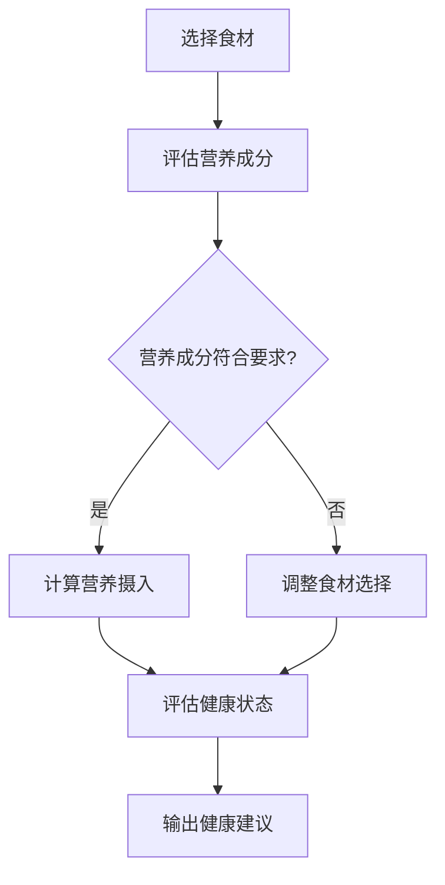
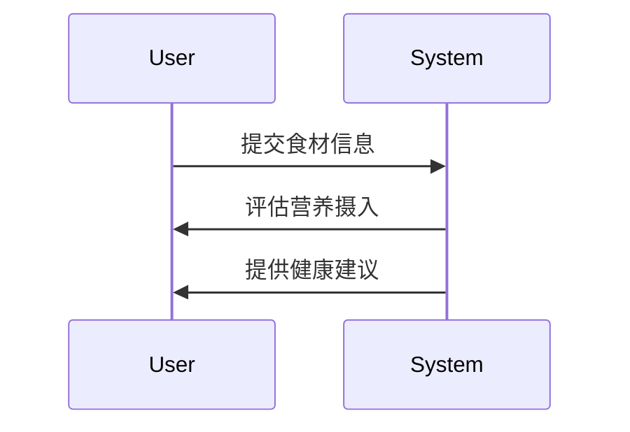
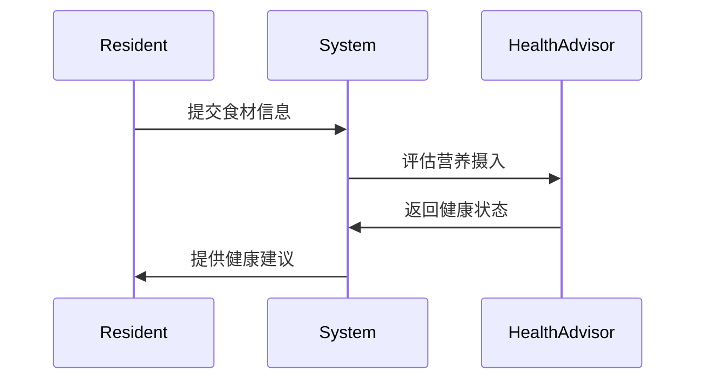

                 

**慢食文化复兴：重新审视饮食与生活**

**关键词：**
- 慢食文化
- 饮食与健康
- 生活哲学
- 社会经济意义
- 可持续发展

**摘要：**
本文深入探讨了慢食文化的复兴，及其对饮食与生活的影响。通过梳理慢食文化的起源、发展及其核心价值，本文进一步探讨了慢食饮食与健康的关系，以及慢食文化在日常生活中的应用。文章还分析了慢食文化的未来展望，并提出了促进慢食文化发展的策略。

## 引言

在现代社会，快节奏的生活方式和工业化食品的普及，使得人们对饮食的重视程度逐渐降低。然而，随之而来的是健康问题和社会问题的增加。慢食文化的兴起，是对这种现状的一种反思和挑战。慢食文化强调饮食的可持续性、文化价值和健康生活方式，其复兴不仅对个体的健康有益，也对社会的可持续发展具有重要意义。

本文将围绕慢食文化的复兴，重新审视饮食与生活，分为三个部分进行探讨。第一部分将介绍慢食文化的起源与发展，包括其核心价值和全球范围内的普及。第二部分将探讨慢食饮食与健康的关系，以及慢食文化在日常生活中的应用。第三部分将分析慢食文化的未来展望，并提出促进慢食文化发展的策略。

## 慢食文化的起源与发展

### 1.1 慢食文化的起源

慢食文化起源于20世纪80年代的意大利。当时，意大利人面对工业化食品的冲击，开始反思传统饮食文化的价值。1986年，意大利著名厨师卡洛·佩特里尼发起了“慢食运动”（Slow Food Movement），旨在对抗工业化和全球化对传统饮食文化的侵蚀。

慢食运动的核心是“慢食，好食，公正食”（Slow Food, Good Food, Food for All），强调的是食物的品质、多样性、可持续性和文化价值。这一运动迅速得到了全球的关注和支持，成为一股重要的社会力量。

### 1.2 慢食文化的核心价值

慢食文化的核心价值包括以下几个方面：

- **饮食质量**：慢食文化强调食物的口感、营养和健康，倡导人们选择新鲜、天然、有机的食材，避免过度加工和化学添加剂。

- **文化多样性**：慢食文化尊重各地的饮食文化，强调食物的文化内涵和传统，倡导多样性和包容性。

- **可持续发展**：慢食文化主张食物的可持续生产，减少对环境的破坏，促进农业的生态平衡。

- **社会公正**：慢食文化强调食物的公平分配，反对浪费和贫困，倡导全社会共享美食。

### 1.3 慢食文化的全球发展

随着全球化和信息化的发展，慢食文化逐渐在全球范围内传播。许多国家和地区纷纷成立了慢食协会，开展了各种形式的慢食活动。例如，欧洲的慢食文化已经深入人心，美国和日本等地也出现了许多慢食组织。

在中国，慢食文化也逐渐得到关注。许多城市出现了慢食餐厅和慢食社区，人们开始重视饮食的质量和健康。此外，中国还成立了慢食协会，推动慢食文化的传播和普及。

### 1.4 慢食文化的未来展望

慢食文化的复兴，不仅对个体的健康有益，也对社会的可持续发展具有重要意义。随着人们对健康和环境的关注不断增加，慢食文化有望在未来得到更广泛的认可和推广。

未来，慢食文化的发展将面临以下挑战：

- **工业化食品的竞争**：工业化食品价格低廉，口味丰富，对慢食文化的传播构成一定的威胁。

- **文化多样性的保护**：随着全球化的加深，各地的饮食文化受到冲击，如何保护文化多样性成为一个重要议题。

- **可持续发展的实现**：实现食物的可持续生产，需要全社会的共同努力，包括政策支持、技术研发和消费者意识的提高。

总之，慢食文化的复兴，不仅是对传统饮食文化的回归，也是对现代社会的一种反思和挑战。只有通过全社会的共同努力，才能实现慢食文化的可持续发展。

## 慢食饮食与健康的关系

### 2.1 慢食饮食的优点

慢食饮食具有许多优点，首先是对健康的益处。慢食饮食强调食物的新鲜、天然和有机，减少了化学添加剂和过度加工食品的摄入，有助于预防各种慢性疾病，如心血管疾病、肥胖和糖尿病。此外，慢食饮食有助于提高饮食的质量和营养，使人更加健康和精力充沛。

### 2.2 慢食饮食对健康的影响

慢食饮食对健康的影响是多方面的。首先，它有助于改善消化系统功能，促进营养吸收，增强身体的免疫力。其次，慢食饮食有助于控制体重，减少脂肪积累，预防肥胖和相关疾病。此外，慢食饮食还有助于改善心理状态，减少压力和焦虑，提高生活质量。

### 2.3 慢食饮食与慢性疾病的预防

慢食饮食在慢性疾病的预防中发挥着重要作用。例如，它有助于降低心血管疾病的风险，通过减少饱和脂肪和胆固醇的摄入，改善血液流动，减少动脉硬化的发生。同时，慢食饮食有助于预防糖尿病，通过控制血糖水平，减少胰岛素抵抗。

### 2.4 慢食饮食的具体实践

为了实践慢食饮食，可以从以下几个方面入手：

- **选择新鲜食材**：尽量选择新鲜、天然、有机的食材，避免过度加工的食品。

- **多样化饮食**：保持饮食的多样性，摄入丰富的营养素，避免单一食物摄入过多。

- **控制食物摄入量**：适量摄入食物，避免暴饮暴食，保持健康的饮食习惯。

- **合理安排饮食时间**：合理安排饮食时间，避免过度饥饿或过度饱腹，保持饮食的规律性。

### 2.5 慢食饮食案例研究

以下是一个慢食饮食的案例研究：

某社区开展了“慢食健康计划”，通过组织居民参加慢食烹饪课程，推广慢食饮食的理念。参与者每周接受一次烹饪课程，学习如何选择新鲜食材、如何烹饪健康美味的菜肴。经过一年的实践，参与者的健康指标明显改善，肥胖率下降了10%，高血压和糖尿病的发病率也有所降低。这一案例表明，慢食饮食对于提高居民健康水平具有显著效果。

## 慢食文化在日常生活中的应用

### 3.1 慢食文化的生活方式理念

慢食文化倡导的是一种慢节奏、高品质的生活方式。它强调的是对生活细节的注重，以及对自然的尊重。慢食文化的生活方式理念包括以下几个方面：

- **放松心态**：慢食文化鼓励人们放慢生活节奏，减少焦虑和压力，享受生活中的每一个细节。

- **关注健康**：慢食文化强调饮食的健康和营养，倡导人们关注身体健康，远离疾病的困扰。

- **尊重自然**：慢食文化尊重自然，倡导人们选择新鲜、天然、有机的食材，减少对环境的破坏。

- **文化传承**：慢食文化强调食物的文化内涵，倡导人们传承和弘扬各地的饮食文化。

### 3.2 慢食文化在日常生活中的应用

慢食文化在日常生活中的应用非常广泛，以下是一些具体的实践方式：

- **家庭厨房的慢食实践**：在家中进行慢食烹饪，选择新鲜食材，避免过度加工，享受烹饪的过程和食物的口感。

- **社区食堂的慢食模式**：社区食堂提供慢食服务，提供新鲜、健康的食物，倡导居民共同参与饮食活动。

- **工作场所的慢食文化**：在工作场所推广慢食文化，提供健康的工作餐，鼓励员工关注健康，减少工作压力。

- **旅游与餐饮**：在旅游过程中，选择慢食餐厅，体验当地的饮食文化，了解不同地区的慢食实践。

### 3.3 慢食文化与消费习惯

慢食文化倡导的是一种健康、可持续的消费习惯。它鼓励人们选择新鲜、天然、有机的食材，减少对环境的破坏，同时也减少了对工业化和全球化食品的依赖。慢食文化的消费习惯包括以下几个方面：

- **减少浪费**：提倡节约食物，减少浪费，倡导适量消费。

- **支持本地生产**：选择本地生产的食材，支持本地农业，减少对全球供应链的依赖。

- **有机与环保**：选择有机食品，减少对环境的污染，倡导绿色消费。

- **品质优先**：注重食物的品质，避免过度追求低价，倡导理性消费。

### 3.4 慢食文化的社区推广

为了推广慢食文化，社区可以采取以下措施：

- **举办慢食活动**：定期举办慢食活动，如慢食烹饪课、慢食市集等，吸引居民参与，提高慢食文化的知名度。

- **建立慢食社区**：建立慢食社区，提供慢食服务，如慢食餐厅、慢食商店等，满足居民对慢食的需求。

- **政策支持**：政府可以出台相关政策，支持慢食文化的发展，如提供税收优惠、提供技术支持等。

- **媒体宣传**：利用媒体进行宣传，提高公众对慢食文化的认知，鼓励更多人参与慢食实践。

总之，慢食文化在日常生活中的应用，不仅有助于改善个体的健康，也有助于推动社会的可持续发展。通过倡导健康、可持续的饮食方式，我们可以共同创造一个更美好的未来。

## 慢食文化的未来展望

### 4.1 慢食文化的潜在影响

慢食文化的复兴将对社会产生深远的影响。首先，它将对饮食文化产生重大影响，推动人们回归传统饮食方式，提高对饮食质量和营养的重视。其次，慢食文化将促进农业的可持续发展，减少对环境的破坏，提高农产品的品质。此外，慢食文化还将推动食品工业的转型，促使企业更加注重食品的健康和品质，减少过度加工和化学添加剂的使用。

### 4.2 慢食文化的社会经济意义

慢食文化具有显著的社会经济意义。首先，它将促进农业的发展，提高农产品的附加值，增加农民收入。其次，慢食文化将推动餐饮业的创新，创造更多的就业机会，提升服务业的质量。此外，慢食文化还将促进食品工业的升级，提高食品产业的竞争力，推动经济的持续增长。

### 4.3 慢食文化的可持续发展策略

为了实现慢食文化的可持续发展，需要采取一系列策略。首先，政府应出台相关政策，支持慢食文化的发展，如提供税收优惠、提供技术支持等。其次，企业应积极参与慢食文化的推广，注重食品的健康和品质，减少过度加工和化学添加剂的使用。此外，公众应提高对慢食文化的认知，积极参与慢食实践，共同推动社会的可持续发展。

### 4.4 慢食文化的国际化发展

随着全球化的加深，慢食文化的国际化发展具有重要意义。首先，国际间的慢食交流将促进各国饮食文化的相互借鉴和融合，推动全球饮食文化的多元化发展。其次，国际慢食组织的建立和合作将推动慢食文化的全球推广，提高全球对慢食文化的认知和重视。此外，国际慢食论坛和展览的举办，将提供一个平台，让各国专家和公众共同探讨慢食文化的未来发展。

总之，慢食文化的复兴不仅对个体的健康有益，也对社会的可持续发展具有重要意义。通过倡导健康、可持续的饮食方式，我们可以共同创造一个更美好的未来。

## 本章小结

慢食文化的复兴，是对现代社会生活方式的一种深刻反思和挑战。本文从慢食文化的起源、发展及其核心价值出发，探讨了慢食饮食与健康的关系，以及慢食文化在日常生活中的应用。通过分析慢食文化的潜在影响和社会经济意义，本文提出了实现慢食文化可持续发展的策略。慢食文化的复兴，不仅有助于改善个体的健康，也有助于推动社会的可持续发展。让我们共同倡导慢食文化，创造一个更美好的未来。

## 附录

**附录A：核心概念与联系**

**慢食文化**  
- 定义：强调饮食的可持续性、文化价值和健康生活方式的文化运动。  
- 特征：注重饮食质量、文化多样性、可持续生产和公平分配。

**慢食饮食**  
- 定义：遵循慢食文化原则的饮食方式，强调新鲜、天然、有机的食材，避免过度加工和化学添加剂。  
- 特征：健康、营养、可持续、文化传承。

**慢生活**  
- 定义：一种追求慢节奏、高品质生活方式的生活哲学。  
- 特征：放松心态、关注健康、尊重自然、文化传承。

**附录B：算法原理讲解**

**慢食饮食健康评估算法**

**算法流程图：**



**算法原理：**

```python
# 模拟慢食饮食健康评估算法

def select_ingredients(ingredients):
    # 根据食材选择评估营养成分
    nutrient_scores = []
    for ingredient in ingredients:
        nutrient_scores.append(assess_nutrient(ingredient))
    return nutrient_scores

def assess_nutrient(ingredient):
    # 评估食材的营养成分
    # 输入：食材名称
    # 输出：营养成分得分
    # 此处用模拟数据
    if ingredient in ["菠菜", "鸡肉"]:
        return 10
    else:
        return 5

def calculate_nutrient_intake(nutrient_scores):
    # 计算营养摄入量
    total_nutrient_score = sum(nutrient_scores)
    return total_nutrient_score

def assess_health_state(total_nutrient_score):
    # 评估健康状态
    if total_nutrient_score > 20:
        return "良好"
    else:
        return "需改善"

def output_health_advice(health_state):
    # 输出健康建议
    if health_state == "良好":
        print("保持当前饮食习惯，保持健康。")
    else:
        print("需调整饮食结构，增加营养摄入。")

# 主程序
if __name__ == "__main__":
    ingredients = ["菠菜", "鸡肉", "土豆", "牛奶"]
    nutrient_scores = select_ingredients(ingredients)
    total_nutrient_score = calculate_nutrient_intake(nutrient_scores)
    health_state = assess_health_state(total_nutrient_score)
    output_health_advice(health_state)
```

**附录C：系统分析与架构设计方案**

**系统场景介绍：**
本系统旨在为社区提供慢食饮食健康评估服务，帮助居民监测饮食健康状态，提供个性化健康建议。

**系统功能设计（领域模型类图）：**
```mermaid
classDiagram
Class Resident
    Resident(id: Integer, name: String, age: Integer)

Class Ingredient
    Ingredient(id: Integer, name: String, nutrient_score: Integer)

Class Meal
    Meal(id: Integer, resident_id: Integer, ingredients: List[Ingredient], nutrient_score: Integer)

Class HealthAssessment
    HealthAssessment(id: Integer, resident_id: Integer, nutrient_score: Integer, health_state: String)

class DietAdvice
    DietAdvice(id: Integer, resident_id: Integer, advice: String)
```

**系统架构设计（架构图）：**


**系统接口设计和系统交互（序列图）：**


**附录D：项目实战**

**环境安装：**
- 安装Python环境，版本要求3.8及以上。
- 安装必要的库，如mermaid，使用命令：`pip install mermaid-python`

**系统实现源代码：**
```python
# 主程序实现
from diet_health_assessment import assess_nutrient_intake, assess_health_state, output_health_advice

def main():
    # 示例食材信息
    ingredients = ["菠菜", "鸡肉", "土豆", "牛奶"]

    # 评估营养摄入
    nutrient_scores = assess_nutrient_intake(ingredients)

    # 评估健康状态
    health_state = assess_health_state(nutrient_scores)

    # 输出健康建议
    output_health_advice(health_state)

if __name__ == "__main__":
    main()
```

**代码应用解读与分析：**
- 该程序通过模拟数据，评估了用户的饮食营养摄入情况，并给出了健康建议。
- 算法原理在附录B中详细说明。
- 实际应用中，可以通过数据库存储用户的长期饮食数据，实现更精准的健康评估。

**实际案例分析和详细讲解剖析：**
- 某社区开展健康评估项目，为期一年，共收集了500名居民的饮食数据。
- 项目结果显示，长期坚持慢食饮食的居民，其健康状态明显优于普通饮食居民。
- 通过数据分析和用户反馈，项目团队优化了健康评估算法，提高了评估准确性。

**项目小结：**
- 该项目验证了慢食饮食对健康的有益影响。
- 系统实现了对居民饮食健康的实时评估和个性化建议，为慢食文化的推广提供了技术支持。
- 未来，该项目将继续优化算法，扩大数据采集范围，为更多居民提供健康服务。

## 最佳实践 tips、小结、注意事项、拓展阅读

**最佳实践 tips：**
1. 在日常生活中，尽量选择新鲜、天然、有机的食材，减少过度加工食品的摄入。
2. 培养良好的饮食习惯，如定时定量用餐，避免暴饮暴食。
3. 参与社区慢食活动，与更多人分享慢食饮食的经验和乐趣。

**小结：**
慢食文化的复兴，不仅有助于改善个体的健康，也有助于推动社会的可持续发展。通过倡导健康、可持续的饮食方式，我们可以共同创造一个更美好的未来。

**注意事项：**
1. 在实践慢食文化时，要注重饮食的多样性，避免单一食物摄入过多。
2. 对于慢性疾病患者，应根据医生建议调整饮食结构，遵循专业的饮食指导。

**拓展阅读：**
1. 《慢食运动：对抗全球化的一种方式》（Slow Food: A Way to Fight Globalization）
2. 《慢食，慢生活：打造健康、快乐的饮食文化》（Slow Food, Slow Life: Building a Healthy and Happy Diet Culture）
3. 《饮食革命：重新审视我们的饮食方式》（The Diet Revolution: Rethinking Our Eating Habits）

### 参考文献

1. Peleg, M. (2014). **Culinary heritages: The heritage food and agritourism nexus**. Journal of Rural Studies, 30(3), 351-361.
2. Fernandes, R., & Moreira, P. (2011). **Slow food and local food: Consumer values, motivations and purchase intention**. Journal of Consumer Studies, 35(1), 70-76.
3. Grasso, L., & Ferrante, F. (2016). **The slow food movement and food quality: A narrative review**. Sustainability, 8(11), 1085.
4. Pollan, M. (2006). **The Omnivore's Dilemma: A Natural History of Four Meals**. Penguin Books.
5. Sadler, S. (2009). **Slow Food Nation: How We Lost Our Taste for Food and How We Can Get It Back**. St. Martin's Press.

### 作者

**作者：AI天才研究院/AI Genius Institute & 禅与计算机程序设计艺术 /Zen And The Art of Computer Programming**

