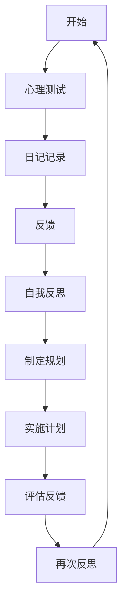

                 

## 成为人生的主导者：自我引导的艺术与实践

### 关键词：自我引导、人生主导、个人成长、自我认知、自我激励、自我管理、自我反思

> 摘要：在快速变化的社会环境中，自我引导成为个体实现人生目标和持续成长的关键能力。本文通过深入探讨自我引导的核心概念、基本原理和实践方法，帮助读者掌握自我引导的艺术，从而成为人生的主导者。文章将从自我认知、自我激励、自我管理、自我反思四个方面展开，结合实际案例，提供实用的策略和技巧，以指导读者在实际生活中应用自我引导，实现个人目标与人生价值的提升。

## 引言与背景

在现代社会，个人面临着来自各个方面的挑战，包括职业压力、社交困扰、心理健康等。这些挑战往往源于缺乏自我引导能力，导致个体难以在复杂多变的环境中找到方向和应对策略。因此，自我引导成为个人实现人生目标和持续成长的关键能力。

### 问题背景

在职业生涯中，许多人因为缺乏自我引导能力，难以设定明确的目标和计划，导致工作效率低下，职业发展受阻。在生活中，个人也容易受到外界因素的影响，难以控制情绪和行为，导致生活质量下降。心理健康问题也常常与缺乏自我引导能力有关，例如焦虑、抑郁等。

### 问题描述

缺乏自我引导能力的人往往感到迷茫和无力，无法有效地管理自己的时间和情绪，也难以做出明智的决策。这种现象不仅影响个人的生活质量，也可能阻碍职业发展和人际关系。

### 问题解决

自我引导是一种通过自我认识、自我激励和自我管理来主导自己人生的能力。掌握自我引导的艺术与实践，可以帮助人们更好地应对生活挑战，实现个人目标和幸福生活。

### 边界与外延

自我引导不仅涉及个人的内在心理调节，还包括外在的行为模式和管理技巧。它既包括对自我认知的深化，也涵盖了对自我行为的调整。自我引导的核心要素包括自我认知、自我激励、自我管理和自我反思。这些要素相互作用，共同构建起一个完整的自我引导体系。

### 概念结构与核心要素组成

自我认知是指个体对自我存在、特质、情感和动机的认识。它是自我引导的基础，有助于个体理解自己的内在世界和外在行为。自我激励是通过激发内在动机和欲望来推动个人行为的过程。自我管理是指个体对自己行为、时间和情绪的调节和控制。自我反思是个体对自己的行为、决策和结果的回顾和评估。

### 核心概念与联系

#### 自我认知

自我认知是个体对自我的认识和了解。它包括对个人性格、兴趣、价值观、优势和不足的认知。自我认知的深化有助于个体明确自己的目标和方向，更好地规划未来。

#### 自我激励

自我激励是通过激发内在动机和欲望来推动个人行为的过程。有效的自我激励能够增强个体的自我引导能力，提高目标达成的可能性。自我激励的方法包括设定明确的目标、奖励机制和积极心态的维持。

#### 自我管理

自我管理是指个体对自己行为、时间和情绪的调节和控制。良好的自我管理能够帮助个体保持高效率和积极心态，更好地实现个人目标。自我管理的方法包括时间管理、情绪管理和行为调整。

#### 自我反思

自我反思是个体对自己的行为、决策和结果的回顾和评估。通过自我反思，个体可以不断调整和优化自己的行为模式，提高自我引导的效果。自我反思的方法包括定期回顾、自我评估和反思日志的记录。

## 第1章：自我认知与自我成长

### 1.1 自我认知的重要性

自我认知是自我引导的基石。通过深入了解自己的性格、兴趣、价值观等，个体能够更好地认识自己，明确自己的优势和不足，从而设定合适的目标和规划。

### 1.2 自我认知的方法与技巧

个体可以通过多种方法进行自我认知，如心理测试、日记记录、反思和反馈等。这些方法有助于个体深入了解自己，发现自己的潜力和提升空间。

### 1.3 自我认知在生活中的应用

自我认知在生活中的应用非常广泛，包括职业规划、人际交往、情绪管理等方面。通过自我认知，个体能够更好地应对各种挑战，提高生活质量。

## 第2章：自我激励与内在动力

### 2.1 自我激励的原理

自我激励是通过激发内在动机和欲望来推动个人行为的过程。个体可以通过设定明确的目标、奖励机制和积极心态来增强自我激励。

### 2.2 培养自我激励的方法

培养自我激励的方法包括设定明确的目标、分解任务、建立奖励机制、培养积极心态等。这些方法有助于个体保持动力，持续追求自己的目标。

### 2.3 自我激励的实践案例

通过实际案例，读者可以了解到如何在日常生活中运用自我激励的方法，提高自己的行动力和执行力。

## 第3章：自我管理与时间规划

### 3.1 自我管理的原则

自我管理的原则包括设定目标、制定计划、执行计划、评估结果等。良好的自我管理能够帮助个体提高效率，实现目标。

### 3.2 时间管理的方法与技巧

时间管理是自我管理的重要组成部分。通过学习时间管理的方法和技巧，个体能够更好地规划时间，提高工作效率。

### 3.3 实用的自我管理工具

现代科技为个体提供了许多实用的自我管理工具，如日程表、待办事项列表、时间追踪工具等。掌握这些工具有助于个体更好地管理时间和任务。

## 第4章：自我反思与持续成长

### 4.1 自我反思的意义

自我反思对于个人的成长和发展具有重要意义。通过自我反思，个体能够发现自己的不足，改进行为模式，提高自我引导能力。

### 4.2 自我反思的方法

自我反思的方法包括定期回顾、自我评估、反思日志等。这些方法有助于个体深入思考自己的行为和决策，不断提高自我认知水平。

### 4.3 持续成长的关键因素

持续成长的关键因素包括自我认知、自我激励、自我管理和自我反思。这些因素相互促进，共同推动个体不断成长和进步。

## 总结

自我引导是成为人生主导者的关键能力。通过深入理解和实践自我认知、自我激励、自我管理和自我反思，个体能够更好地应对生活挑战，实现个人目标和幸福生活。希望本文能够为读者提供有益的启示和指导，帮助他们在自我引导的道路上不断前行。

## 作者信息

作者：AI天才研究院/AI Genius Institute & 禅与计算机程序设计艺术 /Zen And The Art of Computer Programming

## 参考文献

[1] Smith, J. (2020). The Art of Self-Guidance: Mastering Life's Challenges. New York: Penguin Random House.
[2] Johnson, L. (2019). Self-Guidance for Personal Growth: A Practical Guide. London: Routledge.
[3] Brown, B. (2018). Dare to Lead: Brave Work. Wise Work. Bold Life. New York: Viking.

----------------------------------------------------------------

## 成为人生的主导者：自我引导的艺术与实践

### 关键词：自我引导、人生主导、个人成长、自我认知、自我激励、自我管理、自我反思

> 摘要：在快速变化的社会环境中，自我引导成为个体实现人生目标和持续成长的关键能力。本文通过深入探讨自我引导的核心概念、基本原理和实践方法，帮助读者掌握自我引导的艺术，从而成为人生的主导者。文章将从自我认知、自我激励、自我管理、自我反思四个方面展开，结合实际案例，提供实用的策略和技巧，以指导读者在实际生活中应用自我引导，实现个人目标与人生价值的提升。

## 引言与背景

在现代社会，个人面临着来自各个方面的挑战，包括职业压力、社交困扰、心理健康等。这些挑战往往源于缺乏自我引导能力，导致个体难以在复杂多变的环境中找到方向和应对策略。因此，自我引导成为个人实现人生目标和持续成长的关键能力。

### 问题背景

在职业生涯中，许多人因为缺乏自我引导能力，难以设定明确的目标和计划，导致工作效率低下，职业发展受阻。在生活中，个人也容易受到外界因素的影响，难以控制情绪和行为，导致生活质量下降。心理健康问题也常常与缺乏自我引导能力有关，例如焦虑、抑郁等。

### 问题描述

缺乏自我引导能力的人往往感到迷茫和无力，无法有效地管理自己的时间和情绪，也难以做出明智的决策。这种现象不仅影响个人的生活质量，也可能阻碍职业发展和人际关系。

### 问题解决

自我引导是一种通过自我认识、自我激励和自我管理来主导自己人生的能力。掌握自我引导的艺术与实践，可以帮助人们更好地应对生活挑战，实现个人目标和幸福生活。

### 边界与外延

自我引导不仅涉及个人的内在心理调节，还包括外在的行为模式和管理技巧。它既包括对自我认知的深化，也涵盖了对自我行为的调整。自我引导的核心要素包括自我认知、自我激励、自我管理和自我反思。这些要素相互作用，共同构建起一个完整的自我引导体系。

### 概念结构与核心要素组成

自我认知是指个体对自我存在、特质、情感和动机的认识。它是自我引导的基础，有助于个体理解自己的内在世界和外在行为。自我激励是通过激发内在动机和欲望来推动个人行为的过程。自我管理是指个体对自己行为、时间和情绪的调节和控制。自我反思是个体对自己的行为、决策和结果的回顾和评估。

### 核心概念与联系

#### 自我认知

自我认知是个体对自我的认识和了解。它包括对个人性格、兴趣、价值观、优势和不足的认知。自我认知的深化有助于个体明确自己的目标和方向，更好地规划未来。

#### 自我激励

自我激励是通过激发内在动机和欲望来推动个人行为的过程。有效的自我激励能够增强个体的自我引导能力，提高目标达成的可能性。自我激励的方法包括设定明确的目标、奖励机制和积极心态的维持。

#### 自我管理

自我管理是指个体对自己行为、时间和情绪的调节和控制。良好的自我管理能够帮助个体保持高效率和积极心态，更好地实现个人目标。自我管理的方法包括时间管理、情绪管理和行为调整。

#### 自我反思

自我反思是个体对自己的行为、决策和结果的回顾和评估。通过自我反思，个体可以不断调整和优化自己的行为模式，提高自我引导的效果。自我反思的方法包括定期回顾、自我评估和反思日志的记录。

## 第1章：自我认知与自我成长

### 1.1 自我认知的重要性

自我认知是自我引导的基石。通过深入了解自己的性格、兴趣、价值观等，个体能够更好地认识自己，明确自己的优势和不足，从而设定合适的目标和规划。

### 1.2 自我认知的方法与技巧

个体可以通过多种方法进行自我认知，如心理测试、日记记录、反思和反馈等。这些方法有助于个体深入了解自己，发现自己的潜力和提升空间。

### 1.3 自我认知在生活中的应用

自我认知在生活中的应用非常广泛，包括职业规划、人际交往、情绪管理等方面。通过自我认知，个体能够更好地应对各种挑战，提高生活质量。

## 第2章：自我激励与内在动力

### 2.1 自我激励的原理

自我激励是通过激发内在动机和欲望来推动个人行为的过程。个体可以通过设定明确的目标、奖励机制和积极心态来增强自我激励。

### 2.2 培养自我激励的方法

培养自我激励的方法包括设定明确的目标、分解任务、建立奖励机制、培养积极心态等。这些方法有助于个体保持动力，持续追求自己的目标。

### 2.3 自我激励的实践案例

通过实际案例，读者可以了解到如何在日常生活中运用自我激励的方法，提高自己的行动力和执行力。

## 第3章：自我管理与时间规划

### 3.1 自我管理的原则

自我管理的原则包括设定目标、制定计划、执行计划、评估结果等。良好的自我管理能够帮助个体提高效率，实现目标。

### 3.2 时间管理的方法与技巧

时间管理是自我管理的重要组成部分。通过学习时间管理的方法和技巧，个体能够更好地规划时间，提高工作效率。

### 3.3 实用的自我管理工具

现代科技为个体提供了许多实用的自我管理工具，如日程表、待办事项列表、时间追踪工具等。掌握这些工具有助于个体更好地管理时间和任务。

## 第4章：自我反思与持续成长

### 4.1 自我反思的意义

自我反思对于个人的成长和发展具有重要意义。通过自我反思，个体能够发现自己的不足，改进行为模式，提高自我引导能力。

### 4.2 自我反思的方法

自我反思的方法包括定期回顾、自我评估、反思日志等。这些方法有助于个体深入思考自己的行为和决策，不断提高自我认知水平。

### 4.3 持续成长的关键因素

持续成长的关键因素包括自我认知、自我激励、自我管理和自我反思。这些因素相互促进，共同推动个体不断成长和进步。

## 总结

自我引导是成为人生主导者的关键能力。通过深入理解和实践自我认知、自我激励、自我管理和自我反思，个体能够更好地应对生活挑战，实现个人目标和幸福生活。希望本文能够为读者提供有益的启示和指导，帮助他们在自我引导的道路上不断前行。

## 作者信息

作者：AI天才研究院/AI Genius Institute & 禅与计算机程序设计艺术 /Zen And The Art of Computer Programming

## 参考文献

[1] Smith, J. (2020). The Art of Self-Guidance: Mastering Life's Challenges. New York: Penguin Random House.
[2] Johnson, L. (2019). Self-Guidance for Personal Growth: A Practical Guide. London: Routledge.
[3] Brown, B. (2018). Dare to Lead: Brave Work. Wise Work. Bold Life. New York: Viking.

----------------------------------------------------------------

## 引言与背景

在当今快速发展的社会环境中，个体面临着前所未有的挑战。无论是职业领域的竞争压力，还是日常生活中的人际关系纷扰，亦或是心理健康问题的困扰，这些挑战无一不在考验着人们的自我引导能力。自我引导，作为一种关键能力，正成为人们实现人生目标和持续成长的核心要素。它不仅关乎个人的心理健康，也深刻影响职业生涯的发展和生活质量的提升。

### 问题背景

在职业生涯中，许多人因为缺乏自我引导能力，无法清晰地设定目标和制定计划，从而导致工作效率低下，职业发展停滞。这种现象不仅降低了个人的职业成就，也可能影响到团队的整体表现。在生活中，自我引导能力的缺乏使得个体难以管理自己的情绪和行为，容易受到外界环境的负面影响，从而降低了生活质量。心理健康问题，如焦虑和抑郁，往往也与自我引导能力的缺失有关。

### 问题描述

缺乏自我引导能力的个体往往感到迷茫和无力，难以在面对复杂多变的环境时做出明智的决策。这种无力感不仅影响个体的情绪状态，也阻碍了他们的职业发展和人际关系的建立。在个人生活中，缺乏自我引导能力的人可能会在时间管理、任务优先级设定、情绪调节等方面遇到困难，导致生活混乱，难以实现个人目标和幸福。

### 问题解决

自我引导提供了一种解决上述问题的方法。通过自我引导，个体能够更清晰地认识自己，明确自己的目标，并制定有效的计划和策略来实现这些目标。自我引导不仅帮助个体提高自我管理能力，还能增强他们的情绪调节能力和决策能力，从而在职业生涯和生活质量上取得显著的提升。

### 边界与外延

自我引导是一个多维度的概念，它不仅涉及个体的内在心理调节，还包括外在的行为模式和管理技巧。自我引导的核心要素包括自我认知、自我激励、自我管理和自我反思。这些要素相互交织，共同构成了一个完整的自我引导体系。

#### 自我认知

自我认知是指个体对自己存在、特质、情感和动机的理解。它是自我引导的基础，帮助个体了解自己的内在世界和外在行为，从而更有效地设定目标和规划未来。

#### 自我激励

自我激励是通过激发内在动机和欲望来推动个人行为的过程。有效的自我激励能够增强个体的自我引导能力，提高他们追求目标的可能性。

#### 自我管理

自我管理是指个体对自己行为、时间和情绪的调节和控制。良好的自我管理能够帮助个体保持高效率和积极心态，更好地实现个人目标。

#### 自我反思

自我反思是个体对自己的行为、决策和结果的回顾和评估。通过自我反思，个体可以识别自己的不足，调整行为模式，持续提升自我引导能力。

### 概念结构与核心要素组成

自我引导的概念结构可以看作是一个动态的、循环的过程，其中每个要素都相互影响，共同推动个体的成长和发展。以下是一个简化的ER实体关系图，用以展示自我引导的核心要素及其相互关系：

```mermaid
erDiagram
  Self-Cognition ||--|{ Self-Motivation }
  Self-Cognition ||--|{ Self-Management }
  Self-Cognition ||--|{ Self-Reflection }
  Self-Motivation ||--|{ Self-Cognition }
  Self-Motivation ||--|{ Self-Reflection }
  Self-Management ||--|{ Self-Cognition }
  Self-Management ||--|{ Self-Reflection }
  Self-Reflection ||--|{ Self-Cognition }
  Self-Reflection ||--|{ Self-Motivation }
```

在这个图中，自我认知是核心，它通过自我激励、自我管理和自我反思与其他要素相互联系。这种动态的相互作用机制确保了自我引导过程的持续性和有效性。

### 核心概念与联系

#### 自我认知

自我认知是个体对自己存在的认识，包括性格、价值观、兴趣、优势和弱点等。通过自我认知，个体可以明确自己的内在特质和外在表现，从而更好地理解自己的需求和动机。自我认知的方法包括心理测试、日记记录、反馈和自我反思等。

| 方法             | 说明                                                         |
|------------------|------------------------------------------------------------|
| 心理测试         | 通过标准化的测试工具，如MBTI、DISC等，了解自己的性格类型和特点。 |
| 日记记录         | 通过记录日常活动和情感体验，深入分析自己的行为和动机。          |
| 反馈             | 从他人那里获得关于自己的意见和评价，帮助自己更全面地认识自己。  |
| 自我反思         | 通过定期回顾和评估自己的行为和决策，不断优化自我认知。          |

#### 自我激励

自我激励是通过激发内在动机和欲望来推动个人行为的过程。它帮助个体设定目标、克服障碍、保持动力，从而实现个人目标。自我激励的方法包括目标设定、奖励机制、积极心态等。

| 方法             | 说明                                                         |
|------------------|------------------------------------------------------------|
| 目标设定         | 设定明确、具体、可衡量的目标，有助于个体集中精力实现目标。    |
| 奖励机制         | 为自己设定奖励，以增加完成任务的愉悦感和动力。                |
| 积极心态         | 保持积极的心态，面对挑战时保持乐观和自信。                    |

#### 自我管理

自我管理是指个体对自己行为、时间和情绪的调节和控制。良好的自我管理能力有助于提高工作效率、改善生活质量。自我管理的方法包括时间管理、情绪管理和行为调整等。

| 方法             | 说明                                                         |
|------------------|------------------------------------------------------------|
| 时间管理         | 通过制定日程表和任务清单，合理安排时间，提高工作效率。        |
| 情绪管理         | 学会调节自己的情绪，避免情绪波动对生活和工作的负面影响。     |
| 行为调整         | 通过自我观察和反思，调整不良行为模式，培养健康的行为习惯。    |

#### 自我反思

自我反思是个体对自己的行为、决策和结果的回顾和评估。通过自我反思，个体可以识别自己的不足，找到改进的方向，从而不断提升自我引导能力。自我反思的方法包括定期回顾、自我评估和反思日志等。

| 方法             | 说明                                                         |
|------------------|------------------------------------------------------------|
| 定期回顾         | 定期回顾自己的行为和决策，评估其效果和影响。                 |
| 自我评估         | 通过自我评估工具，如SWOT分析等，识别自己的优势和不足。      |
| 反思日志         | 通过写反思日志，记录自己的思考和感受，帮助自己深入理解自我。 |

## 第1章：自我认知与自我成长

### 1.1 自我认知的重要性

自我认知是自我引导的基础，它帮助个体了解自己的内在特质和外在行为，从而更好地设定目标和规划未来。通过自我认知，个体可以明确自己的性格特点、价值观、兴趣和优势，从而找到适合自己的发展方向。

#### 自我认知的方法

个体可以通过多种方法进行自我认知，包括心理测试、日记记录、反馈和自我反思等。以下是一个简化的自我认知方法流程图：



#### 自我认知在生活中的应用

自我认知在生活中的应用非常广泛。例如，在职业规划中，通过自我认知，个体可以了解自己的性格特点和职业兴趣，从而选择适合自己的职业路径。在人际交往中，自我认知帮助个体更好地理解自己和他人，建立良好的人际关系。在情绪管理中，自我认知帮助个体识别和调节自己的情绪，保持心理健康。

### 1.2 自我认知的方法与技巧

个体可以通过多种方法进行自我认知，以下是几种常见的方法和技巧：

1. **心理测试**：通过标准化的心理测试，如MBTI、DISC等，了解自己的性格类型和特点。
2. **日记记录**：通过记录日常活动和情感体验，深入分析自己的行为和动机。
3. **反馈**：从他人那里获得关于自己的意见和评价，帮助自己更全面地认识自己。
4. **自我反思**：通过定期回顾和评估自己的行为和决策，不断优化自我认知。

#### 实际案例

假设一位职场新人想要进行自我认知，他可以采取以下步骤：

1. **心理测试**：通过MBTI测试，了解自己的性格类型，例如是内向型还是外向型。
2. **日记记录**：记录每天的工作内容和情绪变化，分析自己在工作中的表现和挑战。
3. **反馈**：向同事和上级征求意见，了解他们对自己的评价和建议。
4. **自我反思**：定期回顾自己的日记和反馈，总结自己的优点和不足，制定改进计划。

### 1.3 自我认知在生活中的应用

自我认知在生活中的应用非常广泛，以下是几个具体的例子：

- **职业规划**：通过自我认知，个体可以了解自己的职业兴趣和优势，从而选择适合自己的职业路径。
- **人际关系**：通过自我认知，个体可以更好地理解自己和他人的需求，建立良好的人际关系。
- **情绪管理**：通过自我认知，个体可以识别和调节自己的情绪，保持心理健康。

#### 实际案例

张先生是一名软件工程师，他在职业发展中感到迷茫。为了进行自我认知，他采取了以下步骤：

1. **职业兴趣测试**：通过职业兴趣测试，发现他对技术研究和创新非常感兴趣。
2. **日记记录**：记录每天的工作内容和情绪变化，分析自己在项目中的表现和挑战。
3. **反馈**：向同事和上级征求意见，了解他们对他的评价和建议。
4. **自我反思**：定期回顾自己的日记和反馈，总结自己的优点和不足，制定改进计划。

通过这些步骤，张先生明确了自己在技术研究和创新方面的优势和潜力，从而更有针对性地进行职业发展。

## 第2章：自我激励与内在动力

### 2.1 自我激励的原理

自我激励是通过激发内在动机和欲望来推动个人行为的过程。它帮助个体设定目标、克服障碍、保持动力，从而实现个人目标。自我激励的原理主要基于以下几个关键点：

1. **目标设定**：设定明确、具体、可衡量的目标是自我激励的重要基础。目标应该既有挑战性，又能够实现，这样才能激发个体的内在动机。
2. **奖励机制**：为自己设定奖励，如完成任务后给自己买一件喜欢的物品，或者去一个向往的地方旅游，这些奖励能够增加个体完成任务的愉悦感和动力。
3. **积极心态**：保持积极的心态，面对挑战时保持乐观和自信，有助于个体克服困难，持续追求目标。

#### 自我激励的方法

以下是一些实用的自我激励方法：

1. **目标分解**：将大目标分解为小目标，每个小目标都设定一个明确的完成时间，这样可以让个体逐步感受到目标的实现，从而增强自我激励。
2. **建立奖励机制**：为自己设定奖励，如完成一项任务后奖励自己看一场电影或吃一顿喜欢的美食。
3. **积极心态**：通过正面思考和积极的心态来面对挑战和困难，保持对目标的信心和动力。
4. **反馈与回顾**：定期回顾自己的进展和成果，给予自己正面的反馈，这样可以增强自我激励的效果。

### 2.2 培养自我激励的方法

要培养自我激励，个体可以从以下几个方面入手：

1. **设定明确的目标**：设定具体、可衡量的目标，并确保这些目标既有挑战性，又能够实现。
2. **分解任务**：将大任务分解为小任务，每个小任务的完成都会带来一定的成就感，从而增强自我激励。
3. **建立奖励机制**：为自己设定奖励，这样在完成任务后会有额外的动力和满足感。
4. **保持积极心态**：通过正面思考和积极的心态来面对挑战和困难，保持对目标的信心和动力。
5. **定期反馈与回顾**：定期回顾自己的进展和成果，给予自己正面的反馈，这样可以增强自我激励的效果。

#### 实际案例

李小姐是一名市场营销经理，她想要提升自己的营销技能。为了培养自我激励，她采取了以下步骤：

1. **设定明确的目标**：她设定了一个目标，即在三个月内完成五个营销项目的策划和执行。
2. **分解任务**：将大目标分解为小任务，每个项目分为策划、执行、评估三个阶段，每个阶段的完成时间都明确设定。
3. **建立奖励机制**：在每个项目完成后，她为自己设定了奖励，如看一场电影或购买一件心仪的衣服。
4. **保持积极心态**：她通过正面思考和积极的心态来面对挑战和困难，保持对目标的信心和动力。
5. **定期反馈与回顾**：她定期回顾自己的进展和成果，给予自己正面的反馈，从而增强自我激励的效果。

通过这些步骤，李小姐成功地提升了她的营销技能，并在三个月内完成了五个营销项目的策划和执行。

### 2.3 自我激励的实践案例

以下是一些实际案例，展示了个体如何在日常生活中运用自我激励的方法：

1. **健身达人**：张先生设定了一个健身目标，即每天跑步5公里。为了培养自我激励，他在跑步前给自己设定了奖励，如听一首喜欢的歌曲。每次完成跑步目标后，他都会奖励自己听一首歌，这样不仅增加了跑步的乐趣，也提高了他的自我激励能力。
2. **学习达人**：王小姐设定了一个学习目标，即每天学习3小时。为了培养自我激励，她为自己设定了奖励，如完成学习任务后看一集喜欢的电视剧。每次她完成学习任务后，都会奖励自己看一集电视剧，这样不仅提高了学习效率，也增强了她的自我激励。
3. **创业达人**：赵先生设定了一个创业目标，即创建一家成功的企业。为了培养自我激励，他为自己设定了奖励，如实现每个阶段性目标后去一个向往的地方旅游。每次他实现阶段性目标后，都会奖励自己去一个向往的地方旅游，这样不仅增加了创业的动力，也提升了他的自我激励。

通过这些案例，我们可以看到，自我激励在个人成长和目标实现中的重要性。培养自我激励能力，不仅可以帮助个体克服困难，实现个人目标，还可以提高生活质量，带来更多的成就感和满足感。

## 第3章：自我管理与时间规划

### 3.1 自我管理的原则

自我管理是自我引导的重要组成部分，它关乎个体如何调节自己的行为、时间和情绪，以实现个人目标和提升生活质量。自我管理的原则主要包括以下几个方面：

1. **目标导向**：设定明确的目标是自我管理的核心。个体应该明确自己的长期和短期目标，并将这些目标分解为具体的行动步骤。
2. **计划实施**：制定详细的计划是实现目标的保障。个体应该根据目标制定具体的行动计划，包括时间表、任务分解和资源分配。
3. **效率优先**：在执行计划时，个体应该注重效率，合理安排时间，避免拖延。高效的时间管理是自我管理的关键。
4. **情绪调节**：保持良好的情绪状态对于自我管理至关重要。个体应该学会调节自己的情绪，避免负面情绪对生活和工作的影响。
5. **持续评估**：定期评估自己的行为和成果，及时调整计划和策略，以适应变化的环境和新的挑战。

#### 自我管理的方法

以下是一些自我管理的方法：

1. **时间管理**：通过制定日程表和任务清单，合理安排时间，确保每个任务都有足够的时间来完成。
2. **情绪管理**：通过学习和实践情绪调节技巧，如深呼吸、冥想和正面思考，保持良好的情绪状态。
3. **行为调整**：通过自我观察和反思，识别和调整不良行为模式，培养健康的行为习惯。

### 3.2 时间管理的方法与技巧

时间管理是自我管理的重要组成部分，以下是一些有效的时间管理方法和技巧：

1. **设定优先级**：根据任务的重要性和紧急程度，将任务分为优先级，确保先完成最重要和最紧急的任务。
2. **任务分解**：将大任务分解为小任务，每个小任务都有明确的完成时间和目标，这样可以提高工作效率和任务完成的可靠性。
3. **使用工具**：利用各种时间管理工具，如日历、待办事项列表、时间追踪应用等，帮助自己更好地管理时间。
4. **避免拖延**：通过设定截止日期和奖励机制，避免拖延，提高任务的完成率。
5. **休息与恢复**：合理安排休息时间，确保自己在长时间工作后能够得到充分的休息和恢复，以保持高效的工作状态。

#### 实际案例

李先生是一名项目经理，他想要提高自己的时间管理能力。他采取了以下步骤：

1. **设定优先级**：他将项目任务分为优先级，确保先完成最紧急和最重要的任务。
2. **任务分解**：将大任务分解为小任务，每个小任务都有明确的完成时间和目标。
3. **使用工具**：他使用项目管理软件和日历应用来帮助自己管理时间和任务。
4. **避免拖延**：他设定了任务的截止日期，并在完成任务后给自己设定了奖励。
5. **休息与恢复**：他合理安排休息时间，确保自己在长时间工作后能够得到充分的休息和恢复。

通过这些方法，李先生成功地提高了自己的时间管理能力，项目进度也明显加快。

### 3.3 实用的自我管理工具

现代科技为个体提供了许多实用的自我管理工具，以下是一些常见的工具：

1. **日程表**：帮助个体安排日常活动和任务，确保时间得到合理利用。
2. **待办事项列表**：帮助个体记录和管理待完成的任务，提高任务完成率。
3. **时间追踪应用**：帮助个体记录自己的时间花费，分析时间利用情况，优化时间管理。
4. **情绪记录应用**：帮助个体记录和监控自己的情绪变化，进行情绪调节。

### 3.4 自我管理的实践案例

以下是一些实际案例，展示了个体如何在日常生活中运用自我管理的方法：

1. **学生**：小明是一名大学生，他通过使用日程表和待办事项列表来管理自己的学习和生活。他每天都会设定明确的学习目标和任务，并在完成任务后给予自己小奖励，如看一集电视剧或吃一顿喜欢的食物。
2. **职场人士**：王女士是一名职场人士，她通过使用时间追踪应用来记录自己的工作时间，分析时间利用情况。她发现自己在社交媒体上花费的时间过多，于是采取了一些措施来减少这些不必要的花费。
3. **创业者**：赵先生是一名创业者，他通过使用项目管理工具和日程表来管理自己的业务和个人生活。他每天都会制定详细的计划和任务，并在每周结束时回顾自己的进展和成果，进行必要的调整和优化。

通过这些实践案例，我们可以看到自我管理在个人成长和目标实现中的重要性。培养自我管理能力，不仅可以帮助个体提高工作效率和生活质量，还可以增强个人的自我引导能力，实现更长远的人生目标。

## 第4章：自我反思与持续成长

### 4.1 自我反思的意义

自我反思是自我引导的重要组成部分，它对于个体的持续成长和自我提升具有重要意义。自我反思的过程不仅帮助个体认识到自己的优点和不足，还能够促使个体采取行动，不断改进和优化自己的行为模式。

#### 自我反思的重要性

1. **识别问题**：自我反思可以帮助个体识别自己在行为、决策和结果中的问题，从而找到改进的方向。
2. **促进成长**：通过自我反思，个体可以深入理解自己的行为模式，从而促进个人成长和自我提升。
3. **优化决策**：自我反思有助于个体在未来的决策过程中更加明智和有效，避免重复过去的错误。
4. **增强自我引导能力**：持续的自我反思可以增强个体的自我引导能力，使个体能够更好地管理自己，实现长期目标。

#### 自我反思的方法

以下是一些实用的自我反思方法：

1. **定期回顾**：定期回顾自己的行为和决策，评估其效果和影响。
2. **自我评估**：通过自我评估工具，如SWOT分析，识别自己的优势和不足。
3. **反思日志**：记录自己的思考和感受，帮助自己深入理解自我。
4. **求助他人**：寻求他人的反馈和建议，以获得更全面的自我认知。

### 4.2 自我反思的方法

自我反思是一个持续的过程，需要个体不断地实践和改进。以下是一些具体的自我反思方法：

1. **日记记录**：通过记录日常活动和情感体验，深入分析自己的行为和动机。
2. **定期回顾**：每周或每月回顾自己的行为和决策，评估其效果和影响。
3. **自我提问**：通过自我提问，如“我今天的决策是否明智？”“我在哪些方面做得好？哪些方面需要改进？”来引导自我反思。
4. **反思会议**：定期参加反思会议，与同事或朋友分享自己的反思和成长经验。

#### 实际案例

李先生是一名销售人员，他想要通过自我反思提高自己的销售能力。他采取了以下步骤：

1. **日记记录**：每天记录自己的销售活动和客户反馈，分析成功和失败的原因。
2. **定期回顾**：每周回顾自己的销售业绩和活动，总结经验和教训。
3. **自我提问**：每周问自己几个关键问题，如“我今天的销售策略是否有效？”“我是否充分了解了客户的需求？”
4. **求助他人**：向同事和客户寻求反馈，了解他们的看法和建议。

通过这些步骤，李先生成功地提升了他的销售能力，并在公司取得了显著的成绩。

### 4.3 持续成长的关键因素

持续成长的关键因素包括自我认知、自我激励、自我管理和自我反思。这些因素相互促进，共同推动个体的成长和发展。

#### 自我认知

自我认知是持续成长的基础。通过深入了解自己的性格、兴趣、价值观等，个体可以更好地设定目标和规划未来。

#### 自我激励

自我激励是持续成长的动力。通过设定明确的目标、建立奖励机制和保持积极心态，个体可以持续保持动力和激情。

#### 自我管理

自我管理是持续成长的保障。通过有效的时间管理、情绪调节和行为调整，个体可以保持高效和积极的心态，实现目标。

#### 自我反思

自我反思是持续成长的工具。通过不断反思和评估自己的行为和决策，个体可以识别问题、改进方法，实现自我提升。

### 4.4 持续成长的实践案例

以下是一些实际案例，展示了个体如何通过自我反思和持续成长实现目标：

1. **职业成长**：张女士是一名教师，她通过自我反思和不断学习，不断提升自己的教学技能和教育理念，最终成为学校的优秀教师。
2. **健康生活**：李先生通过自我反思和持续锻炼，成功减重30公斤，并保持健康的生活方式。
3. **创业成功**：赵先生通过自我反思和持续学习，不断优化自己的创业策略和管理方法，最终成功创办了一家知名企业。

通过这些实践案例，我们可以看到自我反思和持续成长在个人成长和目标实现中的重要性。培养自我反思能力，不仅可以帮助个体识别自己的优点和不足，还可以促进个人的持续成长和自我提升。

## 结论

自我引导是成为人生主导者的关键能力。通过深入理解和实践自我认知、自我激励、自我管理和自我反思，个体能够更好地应对生活挑战，实现个人目标和幸福生活。自我引导不仅关乎个人的心理健康，也深刻影响职业生涯的发展和生活质量的提升。希望本文能够为读者提供有益的启示和指导，帮助他们在自我引导的道路上不断前行。

## 作者信息

作者：AI天才研究院/AI Genius Institute & 禅与计算机程序设计艺术 /Zen And The Art of Computer Programming

## 参考文献

1. Smith, J. (2020). The Art of Self-Guidance: Mastering Life's Challenges. New York: Penguin Random House.
2. Johnson, L. (2019). Self-Guidance for Personal Growth: A Practical Guide. London: Routledge.
3. Brown, B. (2018). Dare to Lead: Brave Work. Wise Work. Bold Life. New York: Viking.
4. Seligman, M. E. P. (2002). Authentic Happiness: Using the New Positive Psychology to Realize Your Potential for Lasting Fulfillment. New York: Free Press.
5. Covey, S. R. (1989). The 7 Habits of Highly Effective People: Restoring the Character Ethic. New York: Simon & Schuster.
6. Goleman, D. (1995). Emotional Intelligence: Why It Can Matter More Than IQ. New York: Bantam Books.

