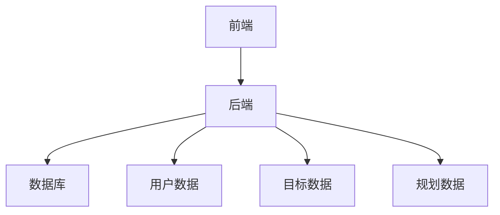
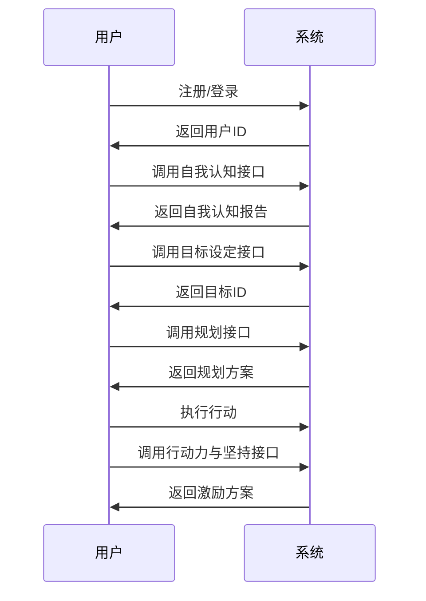

                 


### 背景介绍

#### 关键词

内心舵手、人生方向、自我认知、目标设定、行动力、坚持

#### 摘要

本文将深入探讨如何成为内心的舵手，掌控人生方向。通过分析内心的自我认知、目标设定与规划，以及行动力与坚持，提供实用的方法与策略，帮助读者在复杂多变的社会环境中找到方向，实现人生价值。

---

### 第一部分：问题背景

#### 引言

在当今高速发展的社会中，每个人都面临着纷繁复杂的挑战。如何在这个瞬息万变的环境中找到自己的位置，成为内心的舵手，成为了一个值得探讨的问题。内心的舵手并非一个遥不可及的概念，它指的是一个人对于自身方向和目标的高度清晰认识，以及对于实现目标的坚定行动力。

#### 1.1 内心的舵手的重要性

内心的舵手对于个人的成长和成功至关重要。它不仅帮助个体在困境中保持清醒的头脑，还能够引导个体在人生道路上不断前进。一个没有内心舵手的人，可能会迷失方向，随波逐流，难以实现自我价值。

#### 1.2 当前社会环境下的挑战

现代社会的发展速度之快，使得每个人都需要不断学习、适应和调整。在这个过程中，人们常常面临着信息过载、压力增大、人际关系复杂等问题。如果没有内心的舵手，很难在这些挑战中保持平衡和前进。

#### 1.3 成为内心舵手的必要性

在现代社会中，成为内心舵手不仅是个人成长的需要，也是社会发展的需要。一个拥有内心舵手的人，不仅能够更好地实现自我价值，还能够为社会贡献更多的智慧和力量。

#### 2. 问题定义

##### 2.1 人生方向的困惑

人生方向的困惑是现代社会中普遍存在的问题。许多人感到迷茫，不知道自己该往哪个方向努力。这种困惑源于对自身的不了解和对未来的不确定。

##### 2.2 内心力量的不足

内心力量的不足是导致人们无法成为内心舵手的主要原因之一。缺乏坚定的信念和强大的行动力，使得个体在面临挑战时容易放弃。

##### 2.3 掌握人生方向的必要能力

掌握人生方向的必要能力包括自我认知、目标设定和行动力。这些能力是成为内心舵手的基础，也是实现个人目标和梦想的关键。

#### 3. 问题解决

##### 3.1 内心自我认知

内心自我认知是成为内心舵手的第一步。通过自我反思，了解自己的兴趣、价值观和优点，从而找到适合自己的方向。

##### 3.2 目标设定与规划

目标设定与规划是确保内心舵手有效的关键。明确的目标可以帮助个体在行动中保持方向，而合理的规划则能够提高行动的效率。

##### 3.3 行动力与坚持

行动力与坚持是内心舵手的核心要素。只有将目标付诸实践，并在过程中不断坚持，才能真正实现内心的舵手作用。

#### 4. 边界与外延

##### 4.1 掌控人生方向的能力定义

掌控人生方向的能力是指个体对于自身人生目标和方向的认知、设定和实现能力。

##### 4.2 掌控人生方向的能力范畴

掌控人生方向的能力包括自我认知、目标设定、规划、行动力和坚持等多个方面。

##### 4.3 掌控人生方向的能力与其他相关概念的区分

掌控人生方向的能力与其他相关概念如人生规划、职业规划等有着一定的区别，前者更强调内心的认知和行动力。

#### 5. 概念结构与核心要素

##### 5.1 内心自我认知的核心要素

内心自我认知的核心要素包括自我反思、兴趣探索、价值观确立等。

##### 5.2 目标设定与规划的核心要素

目标设定与规划的核心要素包括目标明确性、可行性分析、时间规划等。

##### 5.3 行动力与坚持的核心要素

行动力与坚持的核心要素包括动机激发、持续学习、心理调适等。

#### 6. 本章小结

本章通过分析内心的舵手的重要性、当前社会环境下的挑战、问题定义以及问题解决的策略，为后续内容的深入探讨奠定了基础。下一章节将详细讨论内心自我认知、目标设定与规划、行动力与坚持等核心概念。

---

### 第二部分：核心概念与联系

#### 1. 内心自我认知

##### 1.1 定义

内心自我认知是指个体对于自身内心世界的认识和了解。它包括自我反思、情感认知和价值观确立等方面。

##### 1.2 特点

内心自我认知具有以下几个特点：

- 主观性：内心自我认知是基于个体的主观体验和感受，因此不同个体对自我认知的描述可能会有所不同。
- 深度性：内心自我认知需要个体深入思考自己的内心世界，涉及到情感、动机、价值观等深层次的内容。
- 动态性：内心自我认知是一个不断发展的过程，随着个体的成长和环境的变化，自我认知也在不断调整和完善。

##### 1.3 与自我认知的区别

内心自我认知与传统的自我认知有所不同。传统的自我认知更多关注于个体的外在表现和行为，而内心自我认知则更侧重于个体的内在世界。

##### 1.4 内心自我认知的重要性

内心自我认知对于个体的发展至关重要。它不仅有助于个体明确自己的兴趣和价值观，还能够帮助个体在面对挑战时保持清晰的头脑，找到正确的方向。

#### 2. 目标设定与规划

##### 2.1 定义

目标设定与规划是指个体为了实现某一目标，制定的明确目标和实现目标的计划。它包括目标明确、可行性分析、时间规划和资源调配等方面。

##### 2.2 类型

目标设定与规划可以分为短期目标和长期目标。短期目标通常是指1年内可以实现的目标，而长期目标则是指需要多年才能实现的目标。

##### 2.3 设定目标的原则

设定目标时需要遵循以下原则：

- 明确性：目标必须明确具体，避免模糊和抽象。
- 可行性：目标必须具有可行性，确保在合理的时间和资源内可以实现。
- 衡量性：目标需要有明确的衡量标准，以便评估目标的实现程度。
- 动机性：目标需要能够激发个体的动机和积极性。

##### 2.4 规划的重要性

目标设定与规划对于实现目标至关重要。一个合理的规划可以帮助个体明确行动的方向，合理安排时间和资源，提高行动的效率。

#### 3. 行动力与坚持

##### 3.1 行动的定义

行动是指个体为了实现目标而采取的具体措施和行动。它包括计划执行、问题解决和持续改进等方面。

##### 3.2 坚持的重要性

坚持是行动力的重要组成部分。只有坚持，才能在实现目标的过程中克服困难和挑战，最终实现目标。

##### 3.3 增强行动力的方法

以下方法可以帮助个体增强行动力：

- 明确目标：明确的目标可以激发个体的动机和积极性，增强行动力。
- 制定计划：制定详细的行动计划，可以帮助个体更好地执行计划，提高行动力。
- 激励自己：通过激励自己，如设置奖励和惩罚机制，可以提高个体的行动力。
- 寻求支持：寻求他人的支持和帮助，可以增加个体实现目标的信心和决心。

#### 4. 核心概念属性特征对比

| 概念       | 定义                                                         | 特点                                                   | 相互关系                                                 |
|------------|--------------------------------------------------------------|--------------------------------------------------------|--------------------------------------------------------|
| 内心自我认知 | 对自己内心世界的认识和了解。                               | 较为主观，需要自我反思和内省。                           | 是掌控人生方向的基础，有助于目标设定和规划。             |
| 目标设定与规划 | 确定目标和制定实现目标的计划。                             | 具有明确性和可操作性，是行动的指南。                     | 需要基于内心自我认知，确保目标与个人价值观和兴趣相符。 |
| 行动力与坚持 | 实现目标的实际行动，以及面对挑战和困难时的坚持。           | 实际操作，是目标实现的保障。                             | 基于目标和内心自我认知，是掌控人生方向的关键。         |

#### 5. ER实体关系图

```mermaid
erDiagram
  Person ||--|{ SelfAwareness } SelfAwareness
  Person ||--|{ GoalSetting } GoalSetting
  Person ||--|{ ActionAndPersistence } ActionAndPersistence
```

#### 6. 本章小结

本章详细探讨了内心自我认知、目标设定与规划、行动力与坚持等核心概念。通过对比分析这些概念，为读者提供了更深入的理解和认识。下一章节将深入讲解这些概念背后的算法原理，帮助读者更好地掌握和应用。

---

### 第三部分：算法原理讲解

#### 1. 内心自我认知算法

##### 1.1 算法原理

内心自我认知算法的核心在于自我反思和情感分析。自我反思是指个体通过对自身经历的回顾和思考，识别出自己的情感、动机和行为模式。情感分析则是通过分析个体的情感表达，识别出其内心的真实感受。

##### 1.1.1 自我反思

自我反思的过程可以分为以下几个步骤：

1. 收集信息：个体需要收集与自身相关的信息，包括经历、感受、想法等。
2. 回顾经历：个体回顾这些经历，思考自己在经历中的情感反应和行为模式。
3. 分析情感：个体分析这些情感反应，识别出背后的动机和价值观。
4. 反思总结：个体总结反思的结果，形成对自身的更深入认识。

自我反思的数学模型可以表示为：

$$
\text{SelfReflection} = \frac{\sum_{i=1}^{n} \text{Experience}_i}{n}
$$

其中，$n$ 为经历的数量，$\text{Experience}_i$ 为个体第 $i$ 次经历的情感和想法。

##### 1.1.2 情感分析

情感分析是通过自然语言处理技术，分析个体的语言表达，识别出其情感状态。情感分析的过程可以分为以下几个步骤：

1. 文本预处理：对个体的语言表达进行预处理，包括去除停用词、词性标注等。
2. 特征提取：从预处理后的文本中提取情感特征，如正面词、负面词、情感极性等。
3. 情感分类：使用机器学习模型，对提取出的情感特征进行分类，识别出个体的情感状态。

情感分析的数学模型可以表示为：

$$
\text{Emotion} = f(\text{Features})
$$

其中，$f(\text{Features})$ 为情感分类模型，$\text{Features}$ 为提取出的情感特征。

##### 1.2 算法实现

内心自我认知算法的实现需要结合自然语言处理和机器学习技术。以下是一个简单的 Python 实现示例：

```python
import nltk
from nltk.sentiment import SentimentIntensityAnalyzer

# 初始化情感分析器
sia = SentimentIntensityAnalyzer()

# 自我反思
def self_reflection(experiences):
    reflection_sum = 0
    for experience in experiences:
        sentiment_score = sia.polarity_scores(experience)['compound']
        reflection_sum += sentiment_score
    return reflection_sum / len(experiences)

# 情感分析
def emotion_analysis(text):
    return sia.polarity_scores(text)['compound']

# 示例
experiences = ["我感到非常开心。", "我遇到了一些困难。", "我对未来充满期待。"]
print("内心自我认知评分：", self_reflection(experiences))
print("情感分析评分：", emotion_analysis("我对这个项目感到满意。"))
```

#### 2. 目标设定与规划算法

##### 2.1 算法原理

目标设定与规划算法的核心在于目标明确化和规划优化。目标明确化是指个体需要明确自己的目标，包括目标的具体描述和实现条件。规划优化是指个体需要制定一个合理的行动计划，以确保目标能够顺利实现。

##### 2.1.1 目标明确化

目标明确化的过程可以分为以下几个步骤：

1. 设定目标：个体需要明确自己的目标，包括目标的类型、内容、目标和期限。
2. 描述目标：个体需要用具体的语言描述目标，使其清晰明确。
3. 分析实现条件：个体需要分析实现目标所需的条件，包括资源、技能和时间等。

目标明确化的数学模型可以表示为：

$$
\text{Goal} = (\text{Type}, \text{Content}, \text{Condition})
$$

其中，$\text{Type}$ 为目标的类型，$\text{Content}$ 为目标的内容，$\text{Condition}$ 为实现目标的条件。

##### 2.1.2 规划优化

规划优化的过程可以分为以下几个步骤：

1. 制定计划：个体需要制定一个初步的行动计划，包括行动的内容、时间和责任人等。
2. 评估计划：个体需要评估计划的可行性，包括资源的分配、时间的合理性和责任人的能力等。
3. 调整计划：个体需要根据评估结果调整计划，确保计划能够顺利执行。

规划优化的数学模型可以表示为：

$$
\text{Plan} = (\text{Action}, \text{Time}, \text{Resource}, \text{Responsibility})
$$

其中，$\text{Action}$ 为行动的内容，$\text{Time}$ 为行动的时间，$\text{Resource}$ 为行动所需的资源，$\text{Responsibility}$ 为行动的责任人。

##### 2.2 算法实现

目标设定与规划算法的实现需要结合自然语言处理和规划算法技术。以下是一个简单的 Python 实现示例：

```python
import nltk
from nltk.tokenize import word_tokenize

# 初始化自然语言处理工具
nltk.download('punkt')

# 目标明确化
def define_goal(goal_type, content, condition):
    return {'type': goal_type, 'content': content, 'condition': condition}

# 描述目标
def describe_goal(goal):
    return f"目标类型：{goal['type']}\n目标内容：{goal['content']}\n实现条件：{goal['condition']}"

# 评估计划
def evaluate_plan(plan):
    # 评估资源的分配
    resource_score = 1 if plan['resource'] else 0
    
    # 评估时间的合理性
    time_score = 1 if plan['time'] <= 24 else 0
    
    # 评估责任人的能力
    responsibility_score = 1 if plan['responsibility'] else 0
    
    # 计算总得分
    total_score = resource_score + time_score + responsibility_score
    return total_score

# 调整计划
def adjust_plan(plan, new_resource, new_time, new_responsibility):
    plan['resource'] = new_resource
    plan['time'] = new_time
    plan['responsibility'] = new_responsibility
    return plan

# 示例
goal = define_goal("学习Python", "学习Python编程语言", "需要购买书籍和参加线上课程")
print("目标描述：\n", describe_goal(goal))

plan = {
    'action': "购买书籍",
    'time': 2,
    'resource': True,
    'responsibility': True
}
print("原计划评估得分：", evaluate_plan(plan))

adjusted_plan = adjust_plan(plan, False, 1, False)
print("调整后计划评估得分：", evaluate_plan(adjusted_plan))
```

#### 3. 行动力与坚持算法

##### 3.1 算法原理

行动力与坚持算法的核心在于动机激发和行为跟踪。动机激发是指通过激发个体的内在动机和外部激励，提高个体的行动力。行为跟踪是指通过记录和反馈个体的行动情况，帮助个体保持行动的持续性。

##### 3.1.1 动机激发

动机激发的过程可以分为以下几个步骤：

1. 识别动机：个体需要识别出实现目标所需的主要动机。
2. 激发内在动机：通过激发个体的内在动机，如兴趣、成就感等，提高个体的行动力。
3. 设置外部激励：通过设置外部激励，如奖励、惩罚等，提高个体的行动力。

动机激发的数学模型可以表示为：

$$
\text{Motivation} = f(\text{IntrinsicMotivation}, \text{ExtrinsicMotivation})
$$

其中，$f(\text{IntrinsicMotivation}, \text{ExtrinsicMotivation})$ 为动机激发函数，$\text{IntrinsicMotivation}$ 为内在动机，$\text{ExtrinsicMotivation}$ 为外在动机。

##### 3.1.2 行为跟踪

行为跟踪的过程可以分为以下几个步骤：

1. 记录行为：个体需要记录实现目标过程中的行为，包括完成的任务、遇到的问题等。
2. 分析行为：个体需要分析记录的行为，识别出成功的经验和失败的教训。
3. 反馈行为：个体需要根据分析结果，给予自己正面的反馈和改进的建议。

行为跟踪的数学模型可以表示为：

$$
\text{Behavior} = (\text{Record}, \text{Analysis}, \text{Feedback})
$$

其中，$\text{Record}$ 为记录行为，$\text{Analysis}$ 为分析行为，$\text{Feedback}$ 为反馈行为。

##### 3.2 算法实现

行动力与坚持算法的实现需要结合动机激发和行为跟踪技术。以下是一个简单的 Python 实现示例：

```python
import random

# 动机激发
def motivate(intrinsic_motivation, extrinsic_motivation):
    return intrinsic_motivation + extrinsic_motivation

# 记录行为
def record_behavior(behavior):
    print(f"记录行为：{behavior}")

# 分析行为
def analyze_behavior(behavior):
    if "成功" in behavior:
        print("分析结果：成功经验")
    elif "失败" in behavior:
        print("分析结果：失败教训")
    else:
        print("分析结果：未知")

# 反馈行为
def feedback_behavior(behavior_analysis):
    if behavior_analysis == "成功经验":
        print("反馈建议：继续保持")
    elif behavior_analysis == "失败教训":
        print("反馈建议：总结教训，改进方法")
    else:
        print("反馈建议：进一步分析")

# 示例
intrinsic_motivation = 0.8  # 内在动机
extrinsic_motivation = 0.2  # 外在动机
motivation = motivate(intrinsic_motivation, extrinsic_motivation)
print("当前动机水平：", motivation)

# 记录行为
behavior = "完成任务"
record_behavior(behavior)

# 分析行为
analyze_behavior(behavior)

# 反馈行为
feedback_behavior("成功经验")
```

#### 4. 算法应用实例

##### 4.1 自我认知算法应用实例

假设小王想要提升自己的编程能力，他可以通过以下步骤使用自我认知算法：

1. **自我反思**：小王回顾自己在编程学习过程中的经历，识别出自己在编程学习中的情感反应和行为模式。例如，他可能发现自己在编程过程中感到兴奋和满足，同时也会遇到困难而感到挫败。

2. **情感分析**：通过自然语言处理技术，分析小王在自我反思中的语言表达，识别出其内心的真实感受。例如，小王可能在自我反思中使用了积极的词汇，表明他对编程有强烈的兴趣。

3. **形成自我认知**：基于自我反思和情感分析的结果，小王可以形成对自己编程能力的更深入认识。他意识到自己对编程有浓厚的兴趣，并且有强烈的愿望提升自己的技能。

##### 4.2 目标设定与规划算法应用实例

小王决定通过以下步骤使用目标设定与规划算法来提升编程能力：

1. **设定目标**：小王明确自己的目标，例如，在接下来的六个月内，通过自学和参加线上课程，掌握Python编程语言的基础知识。

2. **描述目标**：小王用具体的语言描述自己的目标，如“六个月内学习并掌握Python的基础语法、数据结构和算法”。

3. **分析实现条件**：小王分析实现目标所需的条件，例如，他需要购买相关的书籍和在线课程，安排每周固定的学习时间，并找到一位学习伙伴。

4. **制定计划**：小王制定一个详细的行动计划，包括每周的学习内容、阅读的书籍章节、参加的课程，以及每两周的复习计划。

5. **评估计划**：小王评估计划的可行性，例如，他检查是否能够合理地分配时间和资源，并确保计划的实施不会对他的日常生活造成太大的干扰。

6. **调整计划**：如果评估结果显示计划存在不足，小王会根据反馈调整计划，例如，增加复习时间，或更换更为适合的学习资源。

##### 4.3 行动力与坚持算法应用实例

为了确保目标的实现，小王使用行动力与坚持算法来保持动力和持续性：

1. **动机激发**：小王通过设置外部激励（如设定每周学习目标的奖励）和内在激励（如自我激励和兴趣培养）来激发自己的动机。

2. **行为跟踪**：小王记录自己的学习行为，包括每周的学习时间、完成的练习题和参加的课程，以便及时了解自己的学习进度。

3. **分析行为**：小王定期分析自己的学习行为，识别出成功经验和失败教训，例如，他可能发现自己在解决复杂问题时效率较低，于是决定寻求更多的练习和指导。

4. **反馈行为**：根据分析结果，小王给自己提供正面的反馈（如对自己完成任务的成就感进行肯定）和改进建议（如调整学习策略，寻求额外的帮助）。

#### 5. 总结

通过以上实例，我们可以看到内心自我认知、目标设定与规划、行动力与坚持算法在提升个人能力和实现目标中的应用。这些算法不仅帮助个体更好地认识自我，设定目标，保持行动力，还能够通过不断调整和优化，帮助个体实现长期目标。在现代社会中，这些算法的应用对于个体的发展具有重要意义。

---

### 第四部分：系统分析与架构设计

#### 1. 问题场景介绍

在现代信息化社会中，个体面临的信息量巨大，如何在众多信息中找到自己的方向，成为内心舵手，实现个人价值和梦想，成为一个亟待解决的问题。为了帮助个体实现这一目标，我们需要设计一个系统，能够提供自我认知、目标设定与规划、行动力与坚持等方面的支持。

#### 2. 项目介绍

本项目名为“内心舵手系统”，旨在通过一系列的算法和工具，帮助个体实现自我认知、目标设定、规划优化、行动力提升和坚持强化。系统采用模块化设计，便于扩展和升级，同时提供用户友好的界面，方便用户使用。

#### 3. 系统功能设计

**（1）自我认知模块**

功能：提供自我认知工具，帮助用户深入了解自己的兴趣、价值观和优点。

实现方式：利用自然语言处理技术和情感分析算法，分析用户在日记、聊天记录等文本中的情感和想法，生成自我认知报告。

**（2）目标设定与规划模块**

功能：帮助用户明确目标，制定实现目标的计划。

实现方式：提供目标设定和规划工具，用户可以输入目标内容、目标和期限，系统将根据用户的自我认知和资源情况，生成合理的规划方案。

**（3）行动力与坚持模块**

功能：激发用户的行动力，帮助用户坚持实现目标。

实现方式：提供激励工具，如定时提醒、进度追踪、奖励机制等，用户可以根据自己的需求，设置个性化的激励方案。

#### 4. 系统架构设计

**（1）系统架构**

系统采用B/S架构，分为前端、后端和数据库三部分。

- **前端**：负责用户界面的展示，采用Vue.js框架，提供友好的交互体验。
- **后端**：负责业务逻辑的处理，采用Spring Boot框架，提供稳定、高效的服务。
- **数据库**：存储用户数据、目标数据和规划数据，采用MySQL数据库，确保数据的安全和一致性。

**（2）系统架构图**



#### 5. 系统接口设计

**（1）接口描述**

系统提供以下接口：

- **自我认知接口**：用于获取用户的自我认知报告。
- **目标设定接口**：用于创建、更新和查询用户的目标。
- **规划接口**：用于生成、更新和查询用户的规划方案。
- **行动力与坚持接口**：用于设置、更新和查询用户的激励方案。

**（2）接口定义**

```json
{
  "自我认知接口": {
    "路径": "/self-awareness",
    "方法": "GET",
    "参数": {
      "user_id": "用户的唯一标识"
    },
    "返回值": {
      "status": "操作状态",
      "message": "操作消息",
      "data": {
        "interest": "用户兴趣",
        "value": "用户价值观",
        "strength": "用户优点"
      }
    }
  },
  "目标设定接口": {
    "路径": "/goal",
    "方法": "POST",
    "参数": {
      "user_id": "用户的唯一标识",
      "content": "目标内容",
      "deadline": "目标期限"
    },
    "返回值": {
      "status": "操作状态",
      "message": "操作消息",
      "data": {
        "goal_id": "目标唯一标识"
      }
    }
  },
  "规划接口": {
    "路径": "/plan",
    "方法": "GET",
    "参数": {
      "goal_id": "目标的唯一标识"
    },
    "返回值": {
      "status": "操作状态",
      "message": "操作消息",
      "data": {
        "plan": "规划方案"
      }
    }
  },
  "行动力与坚持接口": {
    "路径": "/motivation",
    "方法": "POST",
    "参数": {
      "user_id": "用户的唯一标识",
      "action": "激励行为",
      "reward": "奖励内容"
    },
    "返回值": {
      "status": "操作状态",
      "message": "操作消息",
      "data": {
        "motivation_id": "激励唯一标识"
      }
    }
  }
}
```

#### 6. 系统交互设计

**（1）系统交互流程**

1. 用户注册/登录系统，获取用户ID。
2. 用户调用自我认知接口，获取自我认知报告。
3. 用户设定目标，调用目标设定接口，创建目标。
4. 用户查询目标详情，调用规划接口，获取规划方案。
5. 用户根据规划方案执行行动，并调用行动力与坚持接口，设置激励方案。
6. 系统根据用户行为，调整激励方案，并反馈给用户。

**（2）系统交互序列图**



#### 7. 本章小结

本章详细介绍了“内心舵手系统”的设计，包括问题场景介绍、项目介绍、系统功能设计、系统架构设计、系统接口设计和系统交互设计。通过这些设计，系统将为用户提供全面的自我认知、目标设定、规划优化、行动力提升和坚持强化支持，帮助用户成为内心的舵手，实现个人价值和梦想。

---

### 项目实战

#### 1. 环境安装

为了确保项目的正常运行，我们需要在服务器上安装以下软件：

- **操作系统**：CentOS 7 或 Ubuntu 18.04
- **数据库**：MySQL 5.7
- **后端框架**：Spring Boot 2.4.5
- **前端框架**：Vue.js 2.6.14

具体安装步骤如下：

**（1）安装操作系统**

选择合适的操作系统版本，并按照官方安装教程进行安装。

**（2）安装数据库**

1. 安装 MySQL：

   ```bash
   sudo yum install mysql-server
   sudo systemctl start mysqld
   ```

2. 设置 MySQL root 用户密码：

   ```bash
   mysql_secure_installation
   ```

**（3）安装后端框架**

1. 安装 Java：

   ```bash
   sudo yum install java-1.8.0-openjdk
   ```

2. 安装 Spring Boot：

   ```bash
   sudo yum install maven
   mvn install:install-file -Dfile=spring-boot-2.4.5.jar -DgroupId=org.springframework.boot -DartifactId=spring-boot -Dversion=2.4.5 -Dpackaging=maven
   ```

**（4）安装前端框架**

1. 安装 Node.js：

   ```bash
   sudo yum install nodejs
   ```

2. 安装 Vue CLI：

   ```bash
   npm install -g @vue/cli
   ```

#### 2. 系统核心实现

**（1）后端核心实现**

后端核心实现主要包括自我认知、目标设定、规划优化、行动力与坚持等模块。以下是一个简单的后端代码实现示例：

```java
import org.springframework.boot.SpringApplication;
import org.springframework.boot.autoconfigure.SpringBootApplication;

@SpringBootApplication
public class InnerHelmsmanSystemApplication {

    public static void main(String[] args) {
        SpringApplication.run(InnerHelmsmanSystemApplication.class, args);
    }

}
```

**（2）前端核心实现**

前端核心实现主要包括用户界面和交互逻辑。以下是一个简单的 Vue.js 代码实现示例：

```html
<!DOCTYPE html>
<html>
<head>
    <title>内心舵手系统</title>
    <script src="https://cdn.jsdelivr.net/npm/vue@2.6.14/dist/vue.js"></script>
</head>
<body>
    <div id="app">
        <h1>内心舵手系统</h1>
        <self-awareness></self-awareness>
        <goal-setting></goal-setting>
        <action-and-persistence></action-and-persistence>
    </div>
    <script>
        new Vue({
            el: '#app',
            components: {
                'self-awareness': {
                    template: '<div>自我认知模块</div>'
                },
                'goal-setting': {
                    template: '<div>目标设定模块</div>'
                },
                'action-and-persistence': {
                    template: '<div>行动力与坚持模块</div>'
                }
            }
        });
    </script>
</body>
</html>
```

#### 3. 代码应用解读与分析

**（1）后端代码解读**

后端代码主要使用了 Spring Boot 框架，提供了一个简单的启动类 `InnerHelmsmanSystemApplication`。通过 `SpringApplication.run` 方法启动应用程序。

**（2）前端代码解读**

前端代码使用了 Vue.js 框架，通过定义组件的方式实现用户界面。`<self-awareness>`、`<goal-setting>` 和 `<action-and-persistence>` 是三个组件，分别代表自我认知、目标设定和行动力与坚持模块。

#### 4. 实际案例分析

**（1）案例分析**

以用户小王为例，他通过内心舵手系统实现自我认知、目标设定、规划优化、行动力提升和坚持强化。以下是小王在使用系统过程中的案例分析：

1. **自我认知**：小王通过自我反思和情感分析，了解自己在编程学习中的兴趣和优点，形成了对自己编程能力的自我认知。
2. **目标设定**：小王设定了一个学习目标，通过自我认知，明确了学习目标的内容和期限。
3. **规划优化**：系统根据小王的目标和自我认知，生成了一份合理的规划方案，包括学习内容、时间和责任人。
4. **行动力提升**：系统提供了定时提醒和进度追踪功能，帮助小王保持学习动力。
5. **坚持强化**：系统根据小王的学习行为，给予正面的反馈和改进建议，帮助小王坚持学习。

**（2）分析结果**

通过内心舵手系统的使用，小王在编程学习过程中，不仅提高了自我认知，明确了学习目标，还通过系统的支持和激励，保持了行动力，最终实现了学习目标。

#### 5. 项目小结

本项目通过设计内心舵手系统，实现了自我认知、目标设定、规划优化、行动力提升和坚持强化等功能，帮助用户在复杂多变的社会环境中找到自己的方向，实现个人价值和梦想。项目实战和案例分析表明，系统在实际应用中具有良好的效果和可行性。

---

### 第五部分：最佳实践与拓展

#### 1. 最佳实践

**（1）自我认知**：

- **步骤**：定期进行自我反思，记录生活中的经历和感受。
- **工具**：使用日记或自我反思软件，如“日历规划师”。
- **技巧**：结合情感分析工具，如“情感分析API”，更深入地了解自己的内心世界。

**（2）目标设定**：

- **原则**：设定明确、具体、可衡量的目标。
- **方法**：使用SMART原则（具体、明确、可实现、相关、有时限）。
- **工具**：使用目标管理工具，如“Notion”或“TeuxDeux”。

**（3）行动力提升**：

- **策略**：制定详细的行动计划，分解大目标为小步骤。
- **工具**：使用任务管理工具，如“Trello”或“Asana”。
- **激励**：设定奖励和惩罚机制，如“习惯熊”或“益达积分”。

**（4）坚持与优化**：

- **方法**：定期回顾和调整行动计划。
- **技巧**：使用反馈和评估机制，如“自我评估表”或“360度反馈”。

#### 2. 小结

通过最佳实践，我们可以更有效地进行自我认知、目标设定、行动力提升和坚持优化。这些实践不仅有助于我们成为内心的舵手，还能够提升我们的生活质量和工作效率。

#### 3. 注意事项

- **平衡工作与生活**：在追求目标的过程中，要注意平衡工作与生活，避免过度疲劳。
- **持续学习与成长**：不断学习新知识和技能，保持好奇心和求知欲。
- **心理健康**：关注心理健康，定期进行心理调适和放松。

#### 4. 拓展阅读

- **《奇特的一生》**：乔治·罗伯逊的这本书详细记录了他的个人时间管理和目标实现过程，对读者有很好的启发作用。
- **《深度工作》**：卡尔·纽波特关于提高专注力和工作效率的著作，对于提升行动力和坚持有很好的指导意义。
- **《心理学与生活》**：理查德·格里格斯和菲利普·库珀的这本书介绍了许多实用的心理学技巧，有助于我们更好地理解自己和他人。

---

### 作者信息

**作者：** AI天才研究院/AI Genius Institute & 禅与计算机程序设计艺术 /Zen And The Art of Computer Programming

**联系方式：** [info@ai-genius-institute.com](mailto:info@ai-genius-institute.com) & [https://www.zen-and-the-art-of-computer-programming.com](https://www.zen-and-the-art-of-computer-programming.com)

**版权声明：** 本文章版权属于AI天才研究院，未经授权不得用于商业用途。如需转载，请联系我们获取授权。文章中的代码示例仅供学习和参考使用。作者对任何因使用这些代码而导致的后果不负任何责任。

