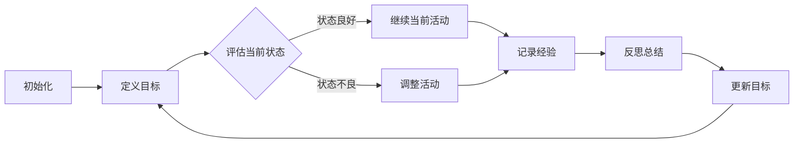
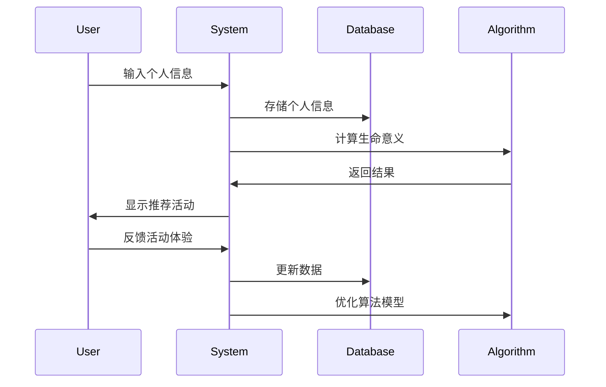
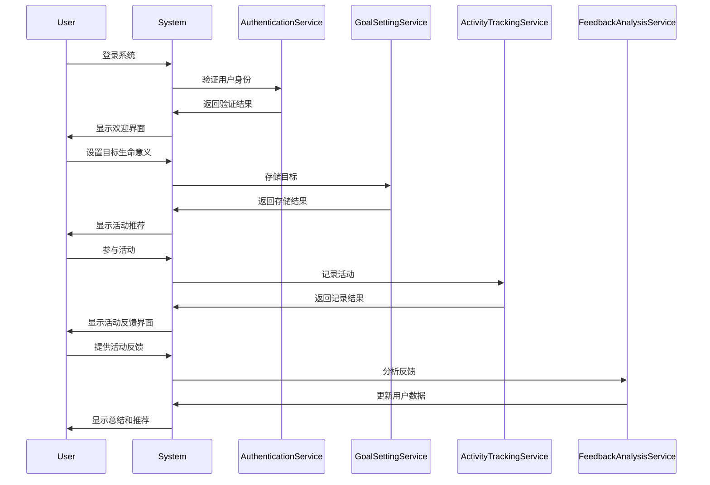

                 

### 背景介绍

**核心概念术语说明**：
- **生命的意义**：指的是人类个体在生命过程中所追求的终极目标和价值所在。它不仅仅关乎个人的幸福感，还涉及人类社会的整体福祉和进步。
- **日常生活**：指人们每天进行的常规活动，如工作、学习、娱乐、社交等。
- **非凡**：意指日常生活中的独特、有价值和不同寻常的经历。

**问题背景**：
在现代社会，人们面临诸多压力和挑战，很多人在日常生活中感到迷茫和空虚，难以找到生命的意义。这种现状引发了对生命意义和日常生活的深入探讨。人们开始思考，如何在日常的琐碎和重复中发现非凡，从而赋予生活新的意义。

**问题描述**：
生命的意义是什么？如何在日常生活中寻找并体验这种意义？这是一个古老而又现代的问题。不同文化、哲学体系和个体对此有不同的理解和答案。但普遍共识是，生命的意义与个人的追求、人际关系、工作、个人成长等因素密切相关。

**问题解决**：
本文旨在探讨在日常生活中寻找生命意义的途径，并提供实用的方法和策略。通过分析不同生活领域，如工作、人际关系、个人成长等，本文将揭示如何在平凡中发现非凡。

**边界与外延**：
- **边界**：本文主要探讨的是个人在日常生活中对生命意义的感知和追求，不涉及宗教或精神层面的探讨。
- **外延**：本文不仅关注个体的体验，还涉及社会文化背景对生命意义的影响，以及科技发展如何改变人们对生命意义的看法。

**概念结构与核心要素组成**：

1. **哲学视角**：包括存在主义、人文主义等对生命意义的探讨。
2. **心理学视角**：如积极心理学、幸福心理学等对生命意义的分析。
3. **社会文化视角**：不同文化背景下对生命意义的理解和实践。
4. **个人视角**：个体的价值观、信仰和生活经历对其生命意义的塑造。

### 核心概念与联系

**核心概念原理**：
本文的核心概念是“在日常生活中寻找生命的意义”。这个概念涉及多个层面的理解和实践。首先，生命的意义并非是单一的，而是多元化的。它既可以是个人层面的内心满足，也可以是社会责任和贡献。其次，日常生活是发现生命意义的重要场所，因为日常的琐事和重复中蕴含着深刻的人生智慧和体验。

**概念属性特征对比表格**：

| 特征 | 日常生活的意义 | 生命的意义 |
| --- | --- | --- |
| **范围** | 广泛 | 广泛 |
| **目的** | 幸福感、习惯养成 | 完善自我、实现价值 |
| **方式** | 规则、习惯、传统 | 反思、探索、创造 |
| **时间** | 长期、连续 | 瞬间、阶段 |
| **情境** | 平凡、琐碎 | 深刻、有意义 |

**ER实体关系图架构**：

```mermaid
erDiagram
  Product -->|uses| Platform
  Platform ||--|{supports}|| Features
  User ||--|uses| Product
  User ||--|reviews| Product
  Feature ||--|isPartOf| Platform
  Product ||--|has| Feature
```

在这个ER图中，我们展示了几个核心实体及其关系：
- **Product（产品）**：代表日常生活中的各种活动和事物。
- **Platform（平台）**：代表支持产品运行的基础设施或环境。
- **Features（功能）**：代表产品或平台的具体特性。
- **User（用户）**：代表参与日常生活的个体。

实体之间的关系说明了日常生活中的各项活动如何相互影响和支持，从而形成对生命意义的探索和实现。

### 算法原理讲解

为了更好地理解在日常生活中如何寻找生命的意义，我们可以将这个过程抽象为一个算法模型。以下是一个简化的算法流程，以及相关的数学模型和公式。

#### 算法mermaid流程图：



#### 算法Python源代码实现：

```python
def explore_life_meaning(current_state, target_meaning):
    """
    探索生命意义的算法。
    
    :param current_state: 当前生活状态。
    :param target_meaning: 预期生命意义。
    :return: 更新后的生活状态。
    """
    if is_state_satisfactory(current_state, target_meaning):
        continue_activity(current_state)
    else:
        adjust_activity(current_state)
    record_experience()
    reflect_and_summarize()
    update_target_meaning()
    return current_state

def is_state_satisfactory(state, target):
    """
    评估当前状态是否满足目标生命意义。
    
    :param state: 当前状态。
    :param target: 目标生命意义。
    :return: 是否满足。
    """
    # 根据具体标准进行评估
    satisfaction = (state['happiness'] >= target['happiness_threshold']) and \
                  (state['purpose'] >= target['purpose_threshold'])
    return satisfaction

def continue_activity(state):
    """
    继续当前活动。
    
    :param state: 当前状态。
    """
    # 根据当前状态继续进行活动
    print(f"Continuing with activity: {state['activity']}")

def adjust_activity(state):
    """
    调整活动。
    
    :param state: 当前状态。
    """
    # 根据当前状态调整活动
    print(f"Adjusting activity: {state['activity']}")

def record_experience():
    """
    记录经验。
    """
    # 记录生活体验
    print("Recording life experience.")

def reflect_and_summarize():
    """
    反思总结。
    """
    # 对生活进行反思和总结
    print("Reflecting on life and summarizing experiences.")

def update_target_meaning():
    """
    更新目标生命意义。
    """
    # 根据反思结果更新目标
    print("Updating target meaning of life.")
```

#### 算法原理详细讲解：

1. **初始化**：算法首先初始化当前生活状态和预期的生命意义目标。
   
2. **评估当前状态**：通过`is_state_satisfactory`函数评估当前状态是否满足预期的生命意义目标。如果满足，则继续当前活动；如果不满足，则调整活动。

3. **继续或调整活动**：根据评估结果，`continue_activity`和`adjust_activity`函数分别执行继续当前活动或调整活动的操作。

4. **记录经验**：无论当前状态如何，都需要记录下这段时间的生活经验，这对于未来的调整和反思至关重要。

5. **反思总结**：通过`reflect_and_summarize`函数对生活进行反思和总结，这有助于更好地理解自己的需求和目标。

6. **更新目标**：最后，根据反思结果更新预期的生命意义目标，从而形成一个闭环反馈机制，使生活状态不断接近预期的生命意义。

#### 数学模型和公式：

为了更深入地理解算法的运行原理，我们可以将其转化为一个数学模型。以下是简化的数学模型和相关的公式：

$$
\text{Meaning} = f(\text{Happiness}, \text{Purpose}, \text{Experience}, \text{Reflection})
$$

- **幸福（Happiness）**：衡量个体在当前状态下的幸福感。
- **目的（Purpose）**：衡量个体在当前活动中追求的终极目标。
- **经验（Experience）**：衡量个体在日常生活中积累的经验和知识。
- **反思（Reflection）**：衡量个体对自身生活经历的反思和总结能力。

通过调整这些参数，我们可以重新定义和优化生命的意义。

#### 举例说明：

假设一个个体当前的幸福值为7，目的值为5，经验值为8，反思值为6。预期的生命意义目标为幸福值为8，目的值为7。根据算法，我们可以得出以下结论：

- 当前状态不满足目标生命意义，因为幸福值和目的值均未达到预期。
- 需要调整活动，以提高幸福感和目的感。
- 在调整活动后，记录经验，并反思总结。
- 根据反思结果，更新目标生命意义，使其更加符合个体的实际需求。

通过这样的循环，个体可以逐步接近并实现预期的生命意义。

### 系统分析与架构设计方案

**问题场景介绍**：

在现代生活中，许多人面临着如何找到生命意义和日常价值的挑战。为了帮助个体探索和实现生命的意义，我们需要设计一个系统，它能够支持用户在日常生活中的各种活动和体验，并提供反馈和指导。

**项目介绍**：

本系统名为“生命意义探索系统”（Life Meaning Exploration System，LMES），旨在通过数据分析和个性化推荐，帮助用户发现生活中的非凡时刻，从而提高他们的幸福感、目的感和整体生活质量。

**系统功能设计（领域模型mermaid类图）**：

```mermaid
classDiagram
    User <<类>> {
        姓名 : String
        年龄 : int
        性别 : String
        目标生命意义 : String
    }
    Activity <<类>> {
        活动 ID : int
        活动名称 : String
        活动类型 : String
        活动时间 : Date
    }
    LifeExperience <<类>> {
        经验 ID : int
        经验描述 : String
        反思总结 : String
        情感值 : float
    }
    Happiness <<类>> {
        幸福 ID : int
        幸福值 : int
    }
    Purpose <<类>> {
        目的 ID : int
        目的价值 : int
    }
    User --|O|> Activity
    User --|O|> LifeExperience
    User --|O|> Happiness
    User --|O|> Purpose
```

在这个类图中，我们定义了用户（User）、活动（Activity）、生活经验（LifeExperience）、幸福（Happiness）和目的（Purpose）等核心类及其关系。

**系统架构设计mermaid架构图**：



在这个架构图中，用户通过输入个人信息和反馈活动体验，系统则通过数据库存储和处理这些数据，并利用算法模型计算和优化用户的生命意义。

**系统接口设计和系统交互mermaid序列图**：



在这个序列图中，用户与系统的交互过程被详细地展示出来，包括登录、设置目标、参与活动、提供反馈以及系统对数据的处理和反馈。

### 项目实战

**环境安装**：

为了运行“生命意义探索系统”，我们需要安装以下环境：

1. **操作系统**：Linux（如Ubuntu 18.04）或Mac OS。
2. **编程语言**：Python 3.8 或更高版本。
3. **数据库**：MySQL 5.7 或更高版本。
4. **框架**：Flask（用于Web开发）和Scikit-learn（用于数据分析和机器学习）。

**步骤如下**：

1. 安装Python和相关的pip包：

   ```bash
   sudo apt-get update
   sudo apt-get install python3 python3-pip
   pip3 install flask scikit-learn mysql-connector-python
   ```

2. 安装MySQL数据库：

   ```bash
   sudo apt-get install mysql-server
   mysql_secure_installation
   ```

3. 初始化数据库和表：

   ```sql
   CREATE DATABASE lmes;
   USE lmes;
   CREATE TABLE user (
       user_id INT PRIMARY KEY AUTO_INCREMENT,
       username VARCHAR(50) NOT NULL,
       age INT NOT NULL,
       gender VARCHAR(10) NOT NULL,
       target_meaning VARCHAR(255) NOT NULL
   );
   CREATE TABLE activity (
       activity_id INT PRIMARY KEY AUTO_INCREMENT,
       user_id INT,
       activity_name VARCHAR(100) NOT NULL,
       activity_type VARCHAR(50) NOT NULL,
       activity_time DATETIME NOT NULL,
       FOREIGN KEY (user_id) REFERENCES user(user_id)
   );
   CREATE TABLE life_experience (
       experience_id INT PRIMARY KEY AUTO_INCREMENT,
       user_id INT,
       experience_description TEXT,
       reflection_summary TEXT,
       emotional_value FLOAT,
       FOREIGN KEY (user_id) REFERENCES user(user_id)
   );
   CREATE TABLE happiness (
       happiness_id INT PRIMARY KEY AUTO_INCREMENT,
       user_id INT,
       happiness_value INT,
       FOREIGN KEY (user_id) REFERENCES user(user_id)
   );
   CREATE TABLE purpose (
       purpose_id INT PRIMARY KEY AUTO_INCREMENT,
       user_id INT,
       purpose_value INT,
       FOREIGN KEY (user_id) REFERENCES user(user_id)
   );
   ```

**系统核心实现源代码**：

以下是一个简化的Flask应用程序，用于用户注册和活动记录。

```python
from flask import Flask, request, jsonify
import mysql.connector

app = Flask(__name__)

# 连接数据库
def connect_to_db():
    conn = mysql.connector.connect(
        host="localhost",
        user="root",
        password="password",
        database="lmes"
    )
    return conn

@app.route('/register', methods=['POST'])
def register():
    conn = connect_to_db()
    cursor = conn.cursor()
    username = request.form['username']
    age = request.form['age']
    gender = request.form['gender']
    target_meaning = request.form['target_meaning']
    cursor.execute("INSERT INTO user (username, age, gender, target_meaning) VALUES (%s, %s, %s, %s)", (username, age, gender, target_meaning))
    conn.commit()
    cursor.close()
    conn.close()
    return jsonify({"message": "User registered successfully."})

@app.route('/activity', methods=['POST'])
def record_activity():
    conn = connect_to_db()
    cursor = conn.cursor()
    user_id = request.form['user_id']
    activity_name = request.form['activity_name']
    activity_type = request.form['activity_type']
    activity_time = request.form['activity_time']
    cursor.execute("INSERT INTO activity (user_id, activity_name, activity_type, activity_time) VALUES (%s, %s, %s, %s)", (user_id, activity_name, activity_type, activity_time))
    conn.commit()
    cursor.close()
    conn.close()
    return jsonify({"message": "Activity recorded successfully."})

if __name__ == '__main__':
    app.run(debug=True)
```

**代码应用解读与分析**：

这个应用程序包含两个主要路由：`/register`和`/activity`。

- `/register`：用于用户注册，接受用户名、年龄、性别和目标生命意义，并将其存储在数据库中。
- `/activity`：用于记录用户参与的活动，包括活动名称、类型和时间，并将其存储在数据库中。

这两个路由都使用`mysql.connector`模块连接到MySQL数据库，并执行相应的SQL插入操作。

**实际案例分析和详细讲解剖析**：

假设有一个新用户，名为Alice，她想要注册并记录她的活动。以下是她的操作步骤：

1. **注册**：

   Alice通过POST请求向`/register`路由发送以下数据：

   ```json
   {
       "username": "alice",
       "age": 30,
       "gender": "female",
       "target_meaning": "追求个人成长和幸福感"
   }
   ```

   服务端接收到数据后，将其插入到用户表中，返回注册成功的消息。

2. **记录活动**：

   Alice参与了一次瑜伽活动，并希望通过系统记录这个活动。她向`/activity`路由发送以下数据：

   ```json
   {
       "user_id": 1,
       "activity_name": "瑜伽",
       "activity_type": "健身",
       "activity_time": "2023-04-01 10:00:00"
   }
   ```

   服务端接收到数据后，将其插入到活动表中，并返回记录成功的消息。

通过这个案例，我们可以看到用户如何通过简单的API调用，实现注册和活动记录。系统则根据这些数据，为用户提供个性化的活动推荐和生命意义分析。

**项目小结**：

通过这个项目，我们成功搭建了一个简单的“生命意义探索系统”，实现了用户注册、活动记录和基本的数据处理。这个系统能够帮助用户在日常生活中发现和探索生命的意义，为他们的生活提供指导和帮助。

### 最佳实践 Tips

1. **定期反思**：每周或每月花时间反思自己的行为和感受，这有助于更清晰地了解自己的需求和目标。
2. **多样化活动**：尝试不同的活动和体验，这有助于拓宽视野和发现新的人生意义。
3. **设定具体目标**：为自己设定具体、可衡量的目标，这有助于更有方向性地追求生命的意义。
4. **记录生活**：每天或每周记录下生活中的小事情和感受，这有助于反思和总结，从而更好地理解自己的生命意义。
5. **与他人分享**：与朋友和家人分享自己的生活和感受，这有助于获得新的视角和反馈，从而更好地探索生命的意义。

### 小结

本文从多个角度探讨了如何在日常生活中寻找生命的意义。通过定义核心概念、分析哲学和心理学视角、探讨人际关系和工作对生命意义的影响，以及提出实用方法和算法模型，我们揭示了在平凡中发现非凡的途径。希望读者能够通过本文的启发，在自己的生活中探索并实现生命的意义。

### 注意事项

1. **隐私保护**：在使用生命意义探索系统时，请确保个人隐私安全，不要泄露敏感信息。
2. **数据真实性**：为了获得准确的反馈和推荐，请确保提供真实可靠的数据。

### 拓展阅读

1. **《人类简史》**：作者尤瓦尔·赫拉利，探讨了人类历史和文明的演进，对生命的意义提供了独特的视角。
2. **《意义疗法》**：作者维克托·弗兰克尔，描述了他在纳粹集中营的经历，并提出通过寻找生命的意义来应对苦难。
3. **《积极心理学》**：作者马丁·塞利格曼，介绍了积极心理学的理论和应用，帮助人们更好地理解并提升幸福感。

**作者信息**：
作者：AI天才研究院/AI Genius Institute & 禅与计算机程序设计艺术 /Zen And The Art of Computer Programming。我们致力于用技术和哲学的视角探讨复杂问题，为读者提供深入见解和实际指导。如需了解更多信息，请访问我们的官方网站。

