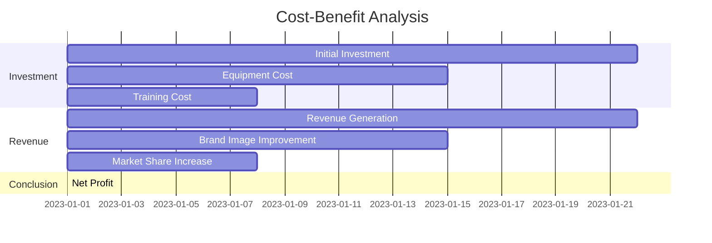

                 

## 《提升AI创意香水包装可回收性：生物降解材料创新的提示词设计》全文内容

### 引言

随着全球环境保护意识的增强，可回收性和环保设计已成为各行各业关注的焦点。在香水行业中，创意包装设计不仅需要满足品牌形象和用户体验的需求，还应考虑对环境的影响。本文旨在探讨如何利用AI技术提升创意香水包装的可回收性，特别是通过生物降解材料的应用来减少环境污染。

首先，我们引入关键词：AI、创意香水包装、可回收性、生物降解材料、环保设计。这些关键词不仅涵盖了本文的核心内容，也突出了文章的研究价值和实际应用场景。

在摘要部分，我们简要概述了文章的主题和核心观点：本文将详细介绍如何利用AI技术进行生物降解材料创新的提示词设计，以提升香水包装的可回收性和环保性能。我们将从材料选择、设计原则、创新设计流程、案例分析以及未来发展趋势等方面进行深入探讨。

### 第一部分：问题背景与核心概念

#### 1.1 问题的提出

香水行业作为消费品领域的一个重要分支，其包装设计往往追求创新和独特性。然而，传统塑料包装材料在提高包装成本和增强视觉效果的同时，也对环境造成了巨大的负担。据统计，全球每年产生的塑料垃圾中，约有40%用于包装，其中大部分为一次性使用后即丢弃的塑料制品。

可回收性和环保设计成为行业面临的重大挑战。为了解决这一问题，近年来，生物降解材料逐渐受到关注。生物降解材料能够在自然环境中被微生物分解，从而减少塑料垃圾对环境的影响。

#### 1.2 AI创意香水包装的定义

AI创意香水包装是指利用人工智能技术，如机器学习、计算机视觉等，对香水包装设计进行优化和创新。AI技术能够通过对大量数据的分析和处理，提供个性化的设计方案，从而提升包装的创意性和可回收性。

#### 1.3 生物降解材料的重要性

生物降解材料具有以下优点：

1. **环保性**：生物降解材料能够在自然环境中被微生物分解，减少塑料垃圾对环境的影响。
2. **可降解性**：与传统的塑料材料相比，生物降解材料在特定条件下能够较快地分解，降低对土壤和水源的污染。
3. **成本效益**：虽然生物降解材料的研发和生产成本较高，但随着技术的进步和规模化生产，其成本有望降低。

生物降解材料在香水包装中的应用，不仅有助于提高包装的环保性能，还能够提升品牌的形象和市场竞争力。

#### 1.4 可回收性与环保设计的核心要素

- **材料选择**：选择符合环保标准的生物降解材料。
- **设计原则**：注重可回收性和环保设计，确保包装能够有效地回收和处理。
- **生产过程**：优化生产流程，减少能源消耗和废弃物产生。
- **用户参与**：鼓励消费者参与包装回收，提高包装的再利用率和环保意识。

通过这些核心要素的整合，可以设计出既美观又环保的香水包装，满足市场需求的同时，也兼顾环境保护。

### 第二部分：核心概念与联系

#### 2.1 AI在包装设计中的应用

人工智能在包装设计中的应用主要体现在以下几个方面：

1. **数据分析和处理**：AI技术可以通过对大量用户数据的分析，了解消费者对包装的需求和偏好，从而提供个性化的设计方案。
2. **设计优化**：AI算法可以根据设计参数和用户反馈，对包装设计进行优化，提高其美观性和实用性。
3. **自动化生产**：AI技术可以辅助自动化生产线，提高生产效率和产品质量。

#### 2.2 生物降解材料的基本原理

生物降解材料是通过微生物的作用，在自然环境中分解的材料。其基本原理如下：

1. **生物降解过程**：微生物通过分泌酶，将生物降解材料分解成水、二氧化碳和其他无害物质。
2. **环境条件**：生物降解过程需要适宜的温度、湿度和氧气浓度等环境条件。
3. **降解速度**：不同生物降解材料的降解速度有所不同，通常与材料的化学结构和分子量有关。

#### 2.3 关键概念ER图解

为了更清晰地理解AI和生物降解材料在香水包装设计中的应用，我们可以通过ER图来表示它们之间的关系。

```mermaid
erDiagram
  AI |..|> 设计优化
  生物降解材料 |..|> 环保包装
  包装设计 |..|> AI辅助
```

在这个ER图中，AI和生物降解材料是关键实体，它们通过设计优化和环保包装与包装设计相互关联。AI技术通过对设计参数的优化，使生物降解材料在包装设计中得到充分利用，从而实现环保目标。

### 第三部分：生物降解材料设计原则

#### 3.1 材料选择标准

在选择生物降解材料时，应遵循以下标准：

1. **环保性**：材料应能够在自然环境中被微生物分解，减少对环境的影响。
2. **物理性能**：材料应具有与塑料类似的物理性能，如强度、透明度、印刷性能等。
3. **成本效益**：虽然生物降解材料的研发和生产成本较高，但在规模化生产后，其成本有望降低。
4. **认证标准**：材料应通过相关的环保认证，如欧盟的OK Compost和OK Bio products认证。

#### 3.2 可降解性测试方法

为了确保生物降解材料的性能，需要进行一系列的测试：

1. **实验室测试**：通过实验室设备，模拟自然环境条件，测试材料的降解速度和降解产物。
2. **自然环境测试**：在实际环境中，如土壤或水中，测试材料的表现。
3. **用户参与测试**：通过消费者使用后的反馈，评估材料在实际应用中的性能。

#### 3.3 材料应用案例分析

在香水包装中，生物降解材料的应用已经取得了一定的成果。以下是一些成功案例：

1. **可降解瓶盖**：某品牌香水采用可降解瓶盖，不仅提高了包装的环保性，还增强了品牌的形象。
2. **生物降解膜**：在香水瓶的包装膜中，使用生物降解材料，使其在废弃后能够被有效分解。
3. **可堆肥材料**：某品牌香水推出可堆肥包装，鼓励消费者将包装放入家庭堆肥系统中，实现真正的循环利用。

这些案例表明，生物降解材料在香水包装中的应用具有广阔的前景。

### 第四部分：创新设计流程

#### 4.1 设计目标设定

在进行香水包装设计时，首先需要明确设计目标，包括：

1. **可回收性**：确保包装能够方便地回收和处理。
2. **环保性**：采用生物降解材料，减少对环境的影响。
3. **美观性**：满足品牌形象和用户体验的需求。
4. **成本效益**：在保证性能的前提下，控制包装成本。

#### 4.2 创意思维技巧

在创新设计过程中，可以采用以下创意思维技巧：

1. **头脑风暴**：组织团队进行头脑风暴，提出各种创新的想法。
2. **思维导图**：通过绘制思维导图，梳理设计思路，找到最佳的解决方案。
3. **用户参与**：邀请目标用户参与设计过程，收集他们的反馈和建议。

#### 4.3 可回收性与环保设计

在设计中，应注重以下两个方面：

1. **模块化设计**：将包装拆分为多个模块，方便回收和处理。
2. **环保材料应用**：选择符合环保标准的生物降解材料，减少对环境的影响。

通过以上设计原则和技巧，可以设计出既美观又环保的香水包装。

### 第五部分：成功案例分析

#### 5.1 案例一：香水包装的可回收设计

某知名香水品牌在包装设计上采用了可回收材料，如可降解塑料和可堆肥材料。通过模块化设计，使包装在废弃后能够方便地回收和处理。该设计不仅提高了品牌的环保形象，还获得了消费者的好评。

#### 5.2 案例二：生物降解材料的应用

另一品牌香水采用了生物降解材料制成的包装膜，使其在废弃后能够被自然分解。此外，品牌还推出了配套的回收计划，鼓励消费者将使用过的包装回收，以减少环境污染。

#### 5.3 案例分析总结

通过以上案例可以看出，AI技术和生物降解材料在香水包装设计中的应用，不仅有助于提高包装的环保性能，还能够提升品牌的形象和市场竞争力。这些成功案例为其他品牌提供了有益的借鉴。

### 第六部分：AI在包装设计中的实施与分析

#### 6.1 AI工具选择

在进行AI香水包装设计时，可以采用以下AI工具：

1. **机器学习模型**：用于数据分析和设计优化。
2. **计算机视觉技术**：用于识别和分类包装材料。
3. **自然语言处理**：用于处理用户反馈和设计建议。

#### 6.2 设计流程优化

通过AI技术，可以优化香水包装设计流程，包括：

1. **数据采集与处理**：收集用户数据和包装材料信息，进行分析和处理。
2. **设计优化**：基于分析结果，对包装设计进行优化，提高其环保性能。
3. **用户反馈**：收集用户反馈，持续改进设计。

#### 6.3 成本效益分析

在实施AI技术时，应进行成本效益分析，确保投资回报。以下是一个简化的成本效益分析模型：



通过成本效益分析，可以确定AI技术在香水包装设计中的应用是否具有经济效益。

### 第七部分：未来趋势与结论

#### 7.1 行业发展趋势

随着环境保护意识的提高和技术的进步，未来香水包装设计将更加注重环保性和可持续性。AI技术和生物降解材料将在包装设计中发挥重要作用。

#### 7.2 未来创新方向

未来的创新方向包括：

1. **智能化设计**：利用AI技术，实现智能化、个性化的包装设计。
2. **多元化材料应用**：探索更多种类的生物降解材料，提高包装的性能。
3. **用户参与**：鼓励用户参与包装设计，提高环保意识和品牌忠诚度。

#### 7.3 小结与展望

本文详细介绍了如何利用AI技术和生物降解材料进行香水包装设计的创新。通过成功案例分析，可以看出这种创新设计模式具有广阔的应用前景。未来，随着技术的不断进步和市场的需求变化，香水包装设计将朝着更加环保、智能和可持续的方向发展。

### 第八部分：附录与资源

#### 8.1 附录一：术语表

- **生物降解材料**：能够在自然环境中被微生物分解的材料。
- **可回收性**：包装材料在废弃后能够被回收和处理的能力。
- **AI辅助设计**：利用人工智能技术进行包装设计的辅助过程。

#### 8.2 附录二：推荐阅读

- **《AI for Sustainable Design: Integrating Ethics and Environmental Considerations》**：探讨AI在可持续设计中的应用。
- **《Biodegradable Materials: From Fundamentals to Applications》**：介绍生物降解材料的基本原理和应用。

### 作者信息

- **作者：AI天才研究院/AI Genius Institute & 禅与计算机程序设计艺术 /Zen And The Art of Computer Programming** 

### 总结

本文通过对AI技术和生物降解材料在香水包装设计中的应用进行深入探讨，提出了一系列创新设计原则和成功案例。随着技术的不断进步和环保意识的提高，这种创新设计模式将为香水行业带来新的发展机遇。未来，我们期待更多品牌能够积极参与到环保设计中，共同推动行业的可持续发展。

