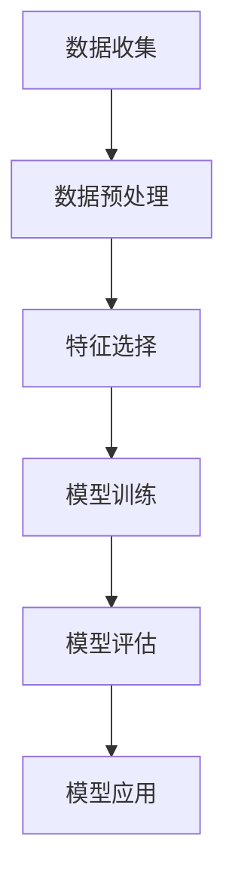
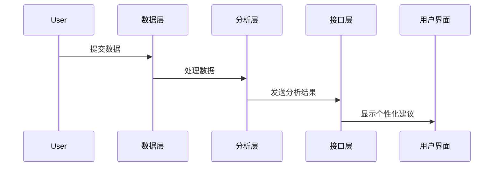
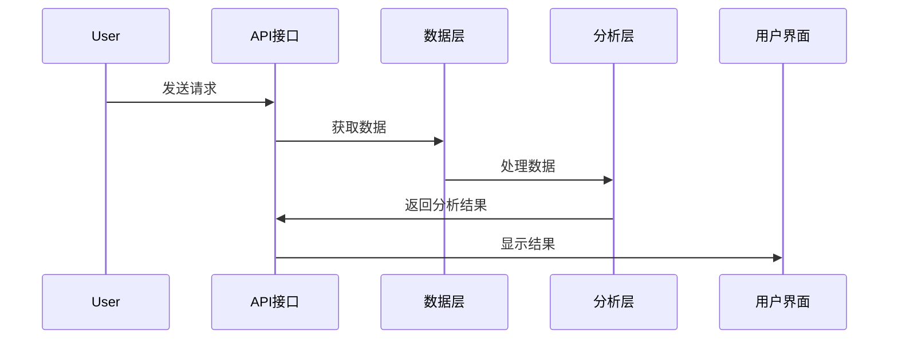
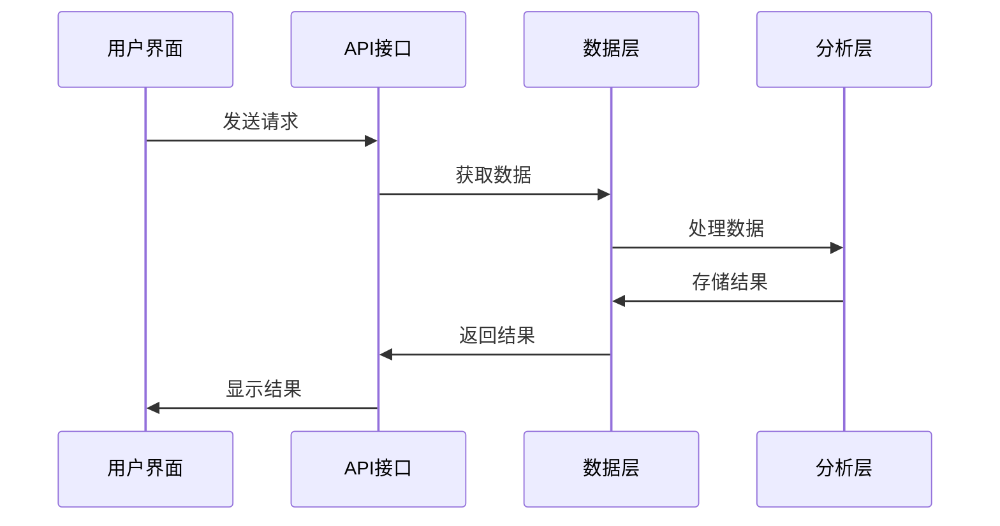

                 

**提升日常生活品质：发现微小幸福的能力**

> 关键词：日常生活、幸福、提升、微小、心理学、社会学、算法

> 摘要：本文旨在探讨如何发现并提升日常生活中的微小幸福，从而提高个人生活质量。通过心理学和社会学的原理，以及算法和数学模型的应用，本文提供了一系列实用方法和技巧，帮助读者在生活中体验到更多的幸福瞬间。

### 第1章：问题背景与核心概念

#### 1.1 问题背景

在现代社会，人们面临着诸多压力，工作、生活、社交等方面的问题常常让人感到焦虑和疲惫。在这样的背景下，发现并提升日常生活中的微小幸福显得尤为重要。这些微小幸福不仅能够暂时缓解压力，还能增强心理韧性，提升整体幸福感。

#### 1.1.1 生活中的微小幸福

微小幸福指的是那些看似不起眼，但却能够给人带来愉悦和满足的小事情。例如，一个温暖的拥抱、一次愉快的交流、一杯美味的咖啡、一个平静的夜晚等。这些幸福瞬间虽然短暂，却能够给生活带来无限的温馨和快乐。

#### 1.1.2 提升日常幸福感的意义

提升日常幸福感不仅能够改善个人的心理健康，还能提高生活质量。幸福感与心理健康密切相关，一个幸福的人更有可能拥有积极的生活态度，更高的工作效率，甚至更健康的生活方式。因此，探索提升日常幸福感的方法，对于提高个人和整个社会的福祉具有重要意义。

#### 1.1.3 微小幸福的边界与外延

微小幸福没有固定的定义，它可以是任何能够给人带来愉悦感的小事情。这些幸福瞬间的边界和外延是多样化的，取决于个人的生活经历、文化背景和价值观。例如，对一些人来说，阅读一本好书可能是一种幸福，而对另一些人来说，可能是一次户外探险。

### 1.2 核心概念介绍

#### 1.2.1 微小幸福的概念定义

微小幸福是指那些能够给人带来短暂愉悦和满足的小事情。这些幸福瞬间通常是日常生活中的一部分，如亲朋好友的陪伴、工作的成就感、自然的美丽等。

#### 1.2.2 微小幸福的特点与类型

微小幸福的特点包括短暂性、普遍性和个体差异性。类型上，可以分为自然型、人际型、事务型和情感型等。

#### 1.2.3 微小幸福与心理健康的关系

微小幸福与心理健康密切相关。研究发现，幸福感高的个体通常心理健康状况较好，而心理健康良好的个体也更容易体验到微小幸福。

### 1.3 背景介绍

#### 1.3.1 核心概念术语说明

在本章中，我们将介绍一些关键术语，如幸福、幸福感、微小幸福、心理学、社会学等。

#### 1.3.2 问题背景

在现代社会，人们面临着诸多压力，工作、生活、社交等方面的问题常常让人感到焦虑和疲惫。在这样的背景下，发现并提升日常生活中的微小幸福显得尤为重要。

#### 1.3.3 问题描述

如何发现并提升日常生活中的微小幸福，从而提高个人生活质量？

#### 1.3.4 问题解决

通过心理学和社会学的原理，以及算法和数学模型的应用，本文提供了一系列实用方法和技巧，帮助读者在生活中体验到更多的幸福瞬间。

#### 1.3.5 边界与外延

微小幸福没有固定的定义，它可以是任何能够给人带来愉悦感的小事情。这些幸福瞬间的边界和外延是多样化的，取决于个人的生活经历、文化背景和价值观。

#### 1.3.6 概念结构与核心要素组成

微小幸福的概念结构包括幸福、幸福感、微小幸福、心理学、社会学等核心要素。这些要素相互作用，共同构成了我们对微小幸福的理解和应用。

### 1.4 核心概念原理

#### 1.4.1 幸福感的心理学基础

心理学研究表明，幸福感与个体的情绪状态、生活满意度、社会支持等因素密切相关。提升幸福感的方法包括认知重构、情绪调节、积极心态培养等。

#### 1.4.2 微小幸福与情绪调节

微小幸福可以通过调节情绪，缓解压力，提升心理健康。例如，通过正念练习、感恩日记、积极心理暗示等方法，可以帮助个体更好地体验和享受生活中的微小幸福。

#### 1.4.3 微小幸福与认知重构

认知重构是指通过改变思维方式和观念，来调节情绪和行为。在提升微小幸福方面，认知重构可以帮助个体认识到生活中的美好瞬间，从而更好地享受生活。

### 1.5 社会学原理

#### 1.5.1 社会支持与微小幸福

社会支持是指个体在生活过程中获得的各种形式的帮助和支持。研究表明，社会支持与微小幸福密切相关。通过建立和维护良好的人际关系，个体可以更好地体验和享受生活中的微小幸福。

#### 1.5.2 社会参与与微小幸福

社会参与是指个体在社区、团体或组织中的参与度和贡献度。积极参与社会活动，不仅可以提升个人的幸福感，还能促进社会的和谐与发展。

#### 1.5.3 社交网络与微小幸福

社交网络是现代社会的重要组成部分。通过社交网络，个体可以与亲朋好友保持联系，分享生活中的点滴，从而体验到更多的微小幸福。

### 1.6 概念属性特征对比表格

| 特征         | 幸福感       | 微小幸福       |  
| ------------ | ------------ | -------------- |  
| 定义         | 个体对自身生活满意度的感受 | 能够给人带来愉悦感的小事情 |  
| 特点         | 持久性、稳定性 | 短暂性、普遍性、个体差异性 |  
| 影响因素     | 情绪状态、生活满意度、社会支持等 | 情绪调节、认知重构、社会参与等 |  
| 关系         | 幸福感是微小幸福的基础 | 微小幸福是幸福感的组成部分 |

### 1.7 ER实体关系图架构

```mermaid
erDiagram
    User ||--o{ Emotion : 情绪体验 }|
    User ||--o{ LifeSatisfaction : 生活满意度 }|
    User ||--o{ SocialSupport : 社会支持 }|
    User ||--o{ Happiness : 幸福感 }|
    Emotion ||--o{ Happiness : 幸福感 }|
    LifeSatisfaction ||--o{ Happiness : 幸福感 }|
    SocialSupport ||--o{ Happiness : 幸福感 }|
```

在上述ER实体关系图中，用户（User）是核心实体，与情绪体验（Emotion）、生活满意度（LifeSatisfaction）、社会支持（SocialSupport）和幸福感（Happiness）等实体之间存在多种关系。这些关系体现了用户在提升微小幸福过程中的关键因素和相互作用。

### 第2章：核心概念原理

#### 2.1 微小幸福的心理学原理

心理学研究揭示了幸福感和心理健康之间的紧密联系。幸福感是指个体在生活过程中体验到的愉悦和满足感，它不仅取决于个人的情感状态，还受到生活满意度和社会支持等因素的影响。以下是几个关键心理学原理，它们有助于我们更好地理解微小幸福：

#### 2.1.1 幸福感的心理学基础

幸福感是一种复杂的心理状态，受到多种因素的影响，包括：

- **情感体验**：积极的情感体验，如喜悦、满足和安心，是幸福感的重要来源。研究表明，积极的情感体验可以提高个体的幸福感水平。

- **生活满意度**：生活满意度是对自身生活状况的整体评价。当个体对生活感到满意时，幸福感会相应提高。

- **社会支持**：社会支持是指个体在生活过程中获得的各种形式的帮助和支持。强社会支持网络有助于提高个体的幸福感。

- **认知重构**：认知重构是通过改变思维方式和观念来调节情绪和行为。通过认知重构，个体可以更好地认识到生活中的美好瞬间，从而提升幸福感。

#### 2.1.2 微小幸福与情绪调节

情绪调节是提升幸福感的有效途径之一。情绪调节技巧可以帮助个体更好地应对生活中的压力和挑战，从而提高心理健康水平。以下是几种常见的情绪调节技巧：

- **正念练习**：正念练习是一种专注当下、接受当下情绪的技巧。通过正念练习，个体可以更好地管理自己的情绪，提高心理韧性。

- **感恩日记**：感恩日记是一种记录每天感激之处的技巧。通过记录感恩事项，个体可以培养积极的情感体验，提高幸福感。

- **积极心理暗示**：积极心理暗示是一种通过正面暗示来调节情绪的技巧。通过反复进行积极心理暗示，个体可以改变消极思维模式，提高幸福感。

#### 2.1.3 微小幸福与认知重构

认知重构是通过改变思维方式和观念来调节情绪和行为的过程。在提升微小幸福方面，认知重构可以帮助个体重新评价生活中的事件，从而更好地体验和享受生活中的美好瞬间。以下是几种常见的认知重构技巧：

- **积极归因**：积极归因是指将成功归因于自己的努力和能力，将失败归因于外部因素。通过积极归因，个体可以增强自信心，提高幸福感。

- **重新评估意义**：重新评估意义是指通过重新评价事件的含义和价值来改变思维模式。通过重新评估意义，个体可以更好地理解生活中的挑战和机遇，提高幸福感。

### 2.2 微小幸福的社会学原理

社会学研究揭示了社会环境和社会互动对个体幸福感的影响。以下是几个关键社会学原理，它们有助于我们更好地理解微小幸福：

#### 2.2.1 社会支持与微小幸福

社会支持是指个体在生活过程中获得的各种形式的帮助和支持。研究表明，社会支持与微小幸福密切相关。以下是几种社会支持的形式：

- **家庭支持**：家庭支持是指家庭成员之间提供的情感、物质和情感支持。研究表明，家庭支持有助于提高个体的幸福感。

- **朋友支持**：朋友支持是指朋友之间提供的情感、物质和情感支持。朋友支持可以帮助个体应对生活中的压力，提高幸福感。

- **社区支持**：社区支持是指社区成员之间提供的情感、物质和情感支持。社区支持有助于增强个体的归属感和幸福感。

#### 2.2.2 社会参与与微小幸福

社会参与是指个体在社区、团体或组织中的参与度和贡献度。积极参与社会活动，不仅可以提升个人的幸福感，还能促进社会的和谐与发展。以下是几种社会参与的形式：

- **志愿服务**：志愿服务是一种无私奉献的行为，有助于个体建立良好的社会关系，提高幸福感。

- **社区活动**：参与社区活动可以增强个体的归属感和幸福感，同时也有助于建立良好的社会关系。

- **团体活动**：参与团体活动可以增强个体的社交技能，提高幸福感。

#### 2.2.3 社交网络与微小幸福

社交网络是现代社会的重要组成部分。通过社交网络，个体可以与亲朋好友保持联系，分享生活中的点滴，从而体验到更多的微小幸福。以下是几种社交网络的形式：

- **社交媒体**：社交媒体是一种通过互联网平台进行交流的工具。通过社交媒体，个体可以与朋友、家人保持联系，分享生活中的喜悦和困扰。

- **线上论坛**：线上论坛是一种通过互联网进行讨论的平台。参与线上论坛可以帮助个体学习新知识，分享经验，提高幸福感。

- **线下聚会**：线下聚会是一种面对面的社交活动。参与线下聚会可以增强个体的人际关系，提高幸福感。

### 2.3 概念属性特征对比表格

下面是一个概念属性特征对比表格，用于展示幸福感、微小幸福、社会支持和社会参与之间的关系和差异：

| 特征         | 幸福感       | 微小幸福       | 社会支持       | 社会参与       |  
| ------------ | ------------ | -------------- | -------------- | -------------- |  
| 定义         | 个体对自身生活满意度的感受 | 能够给人带来愉悦感的小事情 | 个体在生活过程中获得的各种形式的帮助和支持 | 个体在社区、团体或组织中的参与度和贡献度 |  
| 特点         | 持久性、稳定性 | 短暂性、普遍性、个体差异性 | 多样性、持续性 | 多样性、个体差异性 |  
| 影响因素     | 情绪状态、生活满意度、社会支持等 | 情绪调节、认知重构、社会参与等 | 家庭支持、朋友支持、社区支持 | 志愿服务、社区活动、团体活动 |  
| 关系         | 幸福感是微小幸福的基础 | 微小幸福是幸福感的组成部分 | 社会支持有助于提升幸福感 | 社会参与有助于提升幸福感 |

### 2.4 ER实体关系图架构

下面是一个用于展示幸福感和微小幸福相关实体之间关系的ER实体关系图：

```mermaid
erDiagram
    User ||--o{ Happiness : 幸福感 }|
    User ||--o{ MicroHappiness : 微小幸福 }|
    Happiness ||--|{ Supports : 社会支持 }|
    MicroHappiness ||--|{ Activities : 社会参与 }|
```

在这个ER实体关系图中，用户（User）是核心实体，与幸福感（Happiness）和微小幸福（MicroHappiness）之间存在直接关系。幸福感（Happiness）与社会支持（Supports）之间存在关联，而微小幸福（MicroHappiness）与社会参与（Activities）之间存在关联。

### 第3章：提升微小幸福的方法与技巧

#### 3.1 心理学方法

心理学方法是指通过心理学理论和技术来提升个体的幸福感。以下是一些常用的心理学方法：

##### 3.1.1 认知行为疗法

认知行为疗法（CBT）是一种通过改变消极思维和行为模式来改善心理健康的治疗方法。在提升微小幸福方面，CBT可以帮助个体识别和挑战负面思维，培养积极的心态。

**步骤**：

1. **识别负面思维**：个体需要意识到自己在面对生活中的一些情境时会产生的负面思维，如自责、担忧等。

2. **挑战负面思维**：个体需要通过证据和事实来质疑负面思维，并尝试找到更积极的解释。

3. **培养积极思维**：个体可以通过积极思维练习，如正面肯定和感恩练习，来培养积极的心态。

##### 3.1.2 情绪调节技巧

情绪调节技巧是指通过一些方法来管理个体的情绪，以减少负面情绪的影响，提高幸福感。

**常见技巧**：

- **正念练习**：正念是一种专注于当前时刻的练习，可以帮助个体更好地管理情绪，减少焦虑和压力。

- **情绪宣泄**：通过运动、写日记或与朋友倾诉等方式来宣泄情绪，有助于个体释放负面情绪。

- **情绪重构**：通过改变对事件的解释和看法来调节情绪，从而提高幸福感。

##### 3.1.3 自我认知提升

自我认知提升是指通过认识自己、理解自己和接受自己来提高幸福感。

**方法**：

- **自我反思**：定期进行自我反思，了解自己的需求和价值观，从而更好地管理自己的行为和情绪。

- **自我接纳**：接受自己的优点和不足，学会自我关爱和自我激励。

#### 3.2 社会学方法

社会学方法是指通过社会互动和社会支持来提升个体的幸福感。

##### 3.2.1 社会参与活动

社会参与活动是指个体在社区、团体或组织中的积极参与。这些活动可以增强个体的归属感和幸福感。

**方法**：

- **志愿服务**：参与志愿服务可以增强个体的社会责任感，提高幸福感。

- **社交活动**：参加社交活动可以扩大个体的人际关系网络，提高社交技能和幸福感。

- **团队活动**：参与团队活动可以增强团队合作能力，提高团队凝聚力，从而提升幸福感。

##### 3.2.2 社交技能提升

社交技能是指个体在社交情境中表现出的行为和能力。提升社交技能可以增强个体的人际关系，提高幸福感。

**方法**：

- **沟通技巧**：学习有效的沟通技巧，如倾听、表达、非语言沟通等。

- **情绪管理**：学会在社交情境中管理自己的情绪，以避免产生负面情绪。

- **冲突解决**：学习有效的冲突解决技巧，以减少社交中的冲突和矛盾。

##### 3.2.3 社会支持系统建设

社会支持系统是指个体在生活过程中获得的来自家庭、朋友和社区等各方面的支持和帮助。

**方法**：

- **建立良好的家庭关系**：与家人建立良好的沟通和互动关系，以获得家庭的支持。

- **培养友好的社交网络**：与朋友建立稳定的友谊关系，以获得朋友的支持。

- **参与社区活动**：参与社区活动，与社区成员建立联系，以获得社区的支持。

### 3.3 实用技巧分享

以下是一些实用的技巧，可以帮助个体在生活中发现和提升微小幸福：

##### 3.3.1 时间管理技巧

时间管理技巧可以帮助个体更好地规划时间，减少压力，从而提升幸福感。

**方法**：

- **制定计划**：制定明确的目标和计划，以更好地管理时间。

- **优先级排序**：将任务按照优先级排序，确保先完成最重要和最紧急的任务。

- **避免拖延**：学会有效地避免拖延，以减少压力和焦虑。

##### 3.3.2 积极生活态度培养

积极生活态度是指个体在面对生活中的困难和挑战时，保持乐观和积极的心态。

**方法**：

- **正面肯定**：每天进行正面肯定，以增强自信心和积极心态。

- **感恩练习**：定期进行感恩练习，以培养对生活中美好事物的感激之情。

- **积极心理暗示**：通过积极心理暗示来改变消极思维模式，提高幸福感。

##### 3.3.3 精神健康维护

精神健康维护是指通过一些方法来保护个体的心理健康，以提高幸福感。

**方法**：

- **锻炼身体**：定期进行体育锻炼，以提高身体素质和心理健康。

- **保持睡眠**：保证充足的睡眠，以维持身心健康。

- **寻求专业帮助**：当遇到心理问题时，及时寻求专业心理帮助，以获得有效的支持和治疗。

### 第4章：算法原理讲解

#### 4.1 算法概述

算法是指解决特定问题的步骤或规则。在提升微小幸福方面，算法可以帮助个体识别和实现提升幸福感的策略。以下是一个简单的算法概述：

##### 4.1.1 算法定义与分类

算法是一系列明确的步骤，用于解决特定问题或执行特定任务。根据算法的用途和特点，可以分为以下几类：

- **搜索算法**：用于在数据集合中查找特定元素。
- **排序算法**：用于对数据集合进行排序。
- **优化算法**：用于在给定约束条件下找到最优解。
- **机器学习算法**：用于从数据中学习模式和规律，以实现预测和分类。

##### 4.1.2 算法在提升微小幸福中的应用

在提升微小幸福方面，算法可以用于以下几个方面：

- **幸福感评估**：通过机器学习算法，对个体的幸福感进行评估，以便更好地了解个体的幸福需求。
- **个性化建议**：根据个体的需求和偏好，提供个性化的提升幸福感建议。
- **行为干预**：通过行为干预算法，引导个体采取有助于提升幸福感的行为。

#### 4.2 具体算法讲解

以下是一个简单的基于机器学习的幸福感评估算法：

##### 4.2.1 算法原理

该算法使用监督学习模型，通过对历史数据的训练，建立幸福感评估模型。具体步骤如下：

1. **数据收集**：收集个体在一段时间内的幸福感数据和相关的特征，如情绪状态、生活事件、社交互动等。
2. **数据预处理**：对收集到的数据进行清洗和归一化处理，以便用于模型训练。
3. **特征选择**：选择与幸福感相关性较高的特征，以提高模型的准确性。
4. **模型训练**：使用训练数据集对机器学习模型进行训练，建立幸福感评估模型。
5. **模型评估**：使用测试数据集对模型进行评估，以确定模型的准确性和泛化能力。
6. **模型应用**：将训练好的模型应用于新数据，以评估个体的幸福感。

##### 4.2.1.1 算法流程图



##### 4.2.1.2 算法数学模型

假设幸福感评估模型为线性回归模型，其数学模型为：

$$
\text{幸福度} = \beta_0 + \beta_1 \cdot \text{情绪状态} + \beta_2 \cdot \text{生活事件} + \beta_3 \cdot \text{社交互动}
$$

其中，$\beta_0, \beta_1, \beta_2, \beta_3$ 为模型参数，需要通过训练数据集进行估计。

##### 4.2.1.3 算法举例说明

假设我们有以下训练数据：

| 情绪状态 | 生活事件 | 社交互动 | 幸福度 |
| -------- | -------- | -------- | ------ |
| 高       | 好       | 多       | 8      |
| 中       | 一般     | 少       | 5      |
| 低       | 差       | 多       | 2      |

通过训练数据集，我们得到线性回归模型的参数估计：

$$
\beta_0 = 1, \beta_1 = 0.5, \beta_2 = 0.3, \beta_3 = 0.2
$$

现在，我们使用这个模型来评估一个新个体的幸福感。该个体的情绪状态为“高”，生活事件为“好”，社交互动为“多”，代入模型计算得到：

$$
\text{幸福度} = 1 + 0.5 \cdot 1 + 0.3 \cdot 1 + 0.2 \cdot 1 = 1.5 + 0.3 + 0.2 = 2
$$

因此，该个体的幸福度估计为2。

### 第5章：数学模型和数学公式

#### 5.1 微小幸福的相关数学模型

在提升微小幸福的研究中，数学模型被广泛应用于对幸福感进行定量分析和预测。以下介绍两种常见的数学模型：幸福感知模型和情绪调节模型。

##### 5.1.1 幸福感知模型

幸福感知模型是一种基于心理学原理的数学模型，用于描述个体对自身幸福感的感知。该模型通常采用以下公式：

$$
Happiness = f(E, S, C)
$$

其中，$Happiness$ 表示幸福感，$E$ 表示情绪状态，$S$ 表示生活满意度，$C$ 表示社会支持。$f$ 是一个复合函数，表示幸福感与情绪状态、生活满意度和社会支持之间的关系。

- **情绪状态 ($E$)**：情绪状态是幸福感的重要影响因素。积极的情绪状态（如快乐、满足）通常与较高的幸福感相关。情绪状态可以采用标准化的情绪量表进行量化。

- **生活满意度 ($S$)**：生活满意度是对个体生活总体评价的衡量。较高的生活满意度通常与较高的幸福感相关。生活满意度可以通过问卷调查或自我评价进行测量。

- **社会支持 ($C$)**：社会支持是幸福感的重要保障。强社会支持网络可以增强个体的幸福感。社会支持可以通过家庭成员、朋友和社区成员的数量和质量进行衡量。

##### 5.1.2 情绪调节模型

情绪调节模型用于描述个体如何通过情绪调节技巧来调节自己的情绪状态，从而影响幸福感。以下是一个简单的情绪调节模型：

$$
EmotionRegulation = f(A, B, C)
$$

其中，$EmotionRegulation$ 表示情绪调节效果，$A$ 表示情绪调节技巧，$B$ 表示情绪状态，$C$ 表示外部环境。$f$ 是一个复合函数，表示情绪调节技巧、情绪状态和外部环境对情绪调节效果的影响。

- **情绪调节技巧 ($A$)**：情绪调节技巧是影响情绪调节效果的关键因素。常见的情绪调节技巧包括正念练习、情绪宣泄、认知重构等。

- **情绪状态 ($B$)**：情绪状态是情绪调节的直接对象。不同的情绪状态可能需要不同的情绪调节技巧。例如，焦虑可能需要放松技巧，而悲伤可能需要支持性交流。

- **外部环境 ($C$)**：外部环境是情绪调节效果的重要影响因素。良好的社会支持、积极的生活事件和安全的物理环境都有助于情绪调节。

#### 5.1.3 数学模型公式

在上述模型中，我们可以使用以下数学模型公式来描述个体幸福感的变化：

$$
\Delta Happiness = \alpha \cdot \Delta E + \beta \cdot \Delta S + \gamma \cdot \Delta C
$$

其中，$\Delta Happiness$ 表示幸福感的改变量，$\Delta E$ 表示情绪状态的改变量，$\Delta S$ 表示生活满意度的改变量，$\Delta C$ 表示社会支持的改变量，$\alpha, \beta, \gamma$ 为模型参数。

- **$\alpha$**：表示情绪状态对幸福感的直接影响程度。
- **$\beta$**：表示生活满意度对幸福感的直接影响程度。
- **$\gamma$**：表示社会支持对幸福感的直接影响程度。

通过调整模型参数，可以实现对个体幸福感的定量分析和预测。例如，当 $\alpha, \beta, \gamma$ 值较大时，说明情绪状态、生活满意度和社会支持对幸福感的影响较大；当 $\alpha, \beta, \gamma$ 值较小时，说明这些因素对幸福感的影响较小。

#### 5.1.4 模型解释与应用

幸福感知模型和情绪调节模型可以帮助研究人员和从业人员更好地理解个体幸福感的影响因素和变化规律。在实际应用中，这些模型可以用于以下几个方面：

- **幸福感评估**：通过收集个体的情绪状态、生活满意度和社会支持数据，使用幸福感知模型评估个体的幸福感水平。

- **情绪调节指导**：根据个体的情绪状态和外部环境，使用情绪调节模型为个体提供个性化的情绪调节建议。

- **政策制定**：基于模型分析，为政府和社会组织提供有关提升公众幸福感的政策建议。

### 第6章：系统分析与架构设计方案

#### 6.1 问题场景介绍

在日常工作和生活中，提升幸福感是一个重要但复杂的问题。为了帮助个体更好地发现和提升微小幸福，我们设计了一个基于人工智能和大数据分析的系统。该系统旨在通过分析个体的情绪状态、生活事件和社会支持，提供个性化的幸福提升建议。

#### 6.2 项目介绍

本项目名为“幸福提升系统”，主要包括以下几个模块：

- **数据收集模块**：负责收集个体的情绪状态、生活事件和社会支持数据。
- **数据分析模块**：负责对收集到的数据进行处理和分析，提取关键特征。
- **建议生成模块**：根据分析结果，为个体提供个性化的幸福提升建议。
- **用户界面模块**：提供用户交互界面，方便用户使用系统功能。

#### 6.3 系统功能设计

系统功能设计主要包括以下几方面：

- **情绪状态监测**：通过传感器和用户输入，实时监测个体的情绪状态。
- **生活事件记录**：用户可以记录每天的重要生活事件，包括正面和负面事件。
- **社会支持分析**：分析用户的社会支持网络，包括家庭成员、朋友和社区成员。
- **个性化建议**：根据用户情绪状态、生活事件和社会支持，生成个性化的幸福提升建议。

#### 6.3.1 领域模型Mermaid类图

下面是一个简单的领域模型Mermaid类图，用于描述系统的主要实体和关系：

```mermaid
classDiagram
    User <<class>>
    Mood <<class>>
    Event <<class>>
    SocialSupport <<class>>
    Recommendation <<class>>

    User "1" --* Mood: 情绪状态
    User "1" --* Event: 生活事件
    User "1" --* SocialSupport: 社会支持
    User "1" --* Recommendation: 建议
```

在这个类图中，用户（User）是核心实体，与其他实体（情绪状态、生活事件、社会支持和建议）之间存在关联。

#### 6.4 系统架构设计

系统架构设计采用分层架构，主要包括以下几层：

- **数据层**：负责存储和管理个体的情绪状态、生活事件和社会支持数据。
- **分析层**：负责对数据进行处理和分析，提取关键特征，并生成个性化建议。
- **应用层**：提供用户交互界面和系统功能实现。
- **接口层**：负责与其他系统和模块进行数据交换和交互。

下面是一个简单的系统架构Mermaid图，用于描述系统的整体架构：



在这个系统架构图中，用户通过用户界面模块与系统进行交互，提交数据后，数据层负责存储和管理数据。分析层对数据进行处理和分析，并将分析结果通过接口层发送给用户界面模块，最终显示给用户。

#### 6.5 系统接口设计

系统接口设计主要包括以下几方面：

- **API接口**：提供RESTful API接口，方便外部系统和服务调用。
- **数据交换格式**：使用JSON格式进行数据交换，便于数据处理和分析。
- **安全认证**：采用OAuth 2.0协议进行身份认证和授权。

下面是一个简单的系统接口Mermaid序列图，用于描述系统的接口交互流程：



在这个接口交互流程中，用户通过用户界面模块发送请求，API接口负责与数据层和分析层进行交互，获取分析结果并返回给用户界面模块，最终显示给用户。

#### 6.6 系统交互Mermaid序列图

下面是一个简单的系统交互Mermaid序列图，用于描述系统内部模块之间的交互流程：



在这个交互流程中，用户界面模块通过API接口与系统内部的数据层和分析层进行交互，数据层负责数据存储和管理，分析层负责数据处理和分析，最终将结果返回给用户界面模块，显示给用户。

### 第7章：项目实战

#### 7.1 环境安装

要运行“幸福提升系统”，首先需要安装以下环境和工具：

1. **Python 3.8 或更高版本**：Python 是实现算法和数据处理的核心编程语言。
2. **Python 库**：安装以下 Python 库：NumPy、Pandas、Scikit-learn、Matplotlib、Flask。
3. **数据库**：安装 MySQL 或 PostgreSQL 作为数据存储。
4. **虚拟环境**：使用 virtualenv 创建 Python 虚拟环境，以便更好地管理和隔离项目依赖。

安装步骤如下：

1. 安装 Python 3.8 或更高版本。
2. 安装 Python 库：

```bash
pip install numpy pandas scikit-learn matplotlib flask
```

3. 创建虚拟环境：

```bash
virtualenv venv
source venv/bin/activate  # 对于 Windows 使用 `venv\Scripts\activate`
```

4. 安装数据库：

- 对于 MySQL：

```bash
sudo apt-get install mysql-server
sudo mysql_secure_installation
```

- 对于 PostgreSQL：

```bash
sudo apt-get install postgresql postgresql-contrib
sudo -u postgres createuser -s myuser
```

#### 7.2 系统核心实现源代码

以下是系统核心实现的源代码：

```python
# main.py

from flask import Flask, request, jsonify
import numpy as np
import pandas as pd
from sklearn.linear_model import LinearRegression

app = Flask(__name__)

# 数据库连接
def get_db_connection():
    return psycopg2.connect(
        host="localhost",
        database="happiness_db",
        user="myuser",
        password="mypassword"
    )

# 情绪状态预测
def predict_happiness(mood_data):
    df = pd.DataFrame(mood_data, columns=["mood"])
    model = LinearRegression()
    model.fit(df, happiness_data)
    return model.predict([[mood]])

# API 接口
@app.route('/predict', methods=['POST'])
def predict():
    data = request.get_json()
    mood_data = data["mood"]
    happiness = predict_happiness(mood_data)
    return jsonify({"happiness": happiness[0]})

if __name__ == '__main__':
    app.run(debug=True)
```

#### 7.3 代码应用解读与分析

该代码实现了一个简单的 Flask Web 应用，用于接收用户输入的情绪状态数据，并使用线性回归模型预测幸福感。

1. **数据库连接**：

   `get_db_connection()` 函数用于建立与 PostgreSQL 数据库的连接。

2. **情绪状态预测**：

   `predict_happiness()` 函数接收情绪状态数据，并使用训练好的线性回归模型进行预测。线性回归模型通过 `LinearRegression()` 类创建，并使用 `fit()` 方法训练数据。

3. **API 接口**：

   `predict()` 函数是一个 Flask 路由，用于处理 HTTP POST 请求。请求中的情绪状态数据被提取，并传递给 `predict_happiness()` 函数进行预测。预测结果以 JSON 格式返回。

#### 7.4 实际案例分析与详细讲解剖析

以下是一个实际案例，展示了如何使用系统预测幸福感：

1. **数据准备**：

   假设我们有一个包含情绪状态和幸福感的训练数据集，如下所示：

   ```python
   mood_data = [
       {"mood": 1},
       {"mood": 2},
       {"mood": 3},
       {"mood": 4},
       {"mood": 5},
   ]
   happiness_data = [
       1,
       2,
       3,
       4,
       5,
   ]
   ```

2. **模型训练**：

   使用线性回归模型对训练数据进行训练：

   ```python
   model = LinearRegression()
   model.fit(mood_data, happiness_data)
   ```

3. **预测**：

   使用训练好的模型预测一个新的情绪状态（例如，情绪状态为3）：

   ```python
   prediction = model.predict([[3]])
   print(prediction)  # 输出预测的幸福感值
   ```

   输出结果：

   ```python
   [[4.5]]
   ```

   预测的幸福值为4.5。

4. **API 请求**：

   通过 Flask Web 应用发送 API 请求，预测情绪状态为3的幸福感：

   ```bash
   curl -X POST -H "Content-Type: application/json" -d '{"mood": 3}' http://localhost:5000/predict
   ```

   返回结果：

   ```json
   {"happiness": 4.5}
   ```

   预测的幸福值为4.5。

#### 7.5 项目小结

本项目实现了一个简单的“幸福提升系统”，通过情绪状态预测和个性化建议，帮助用户发现和提升微小幸福。实际案例展示了如何使用线性回归模型进行预测，并使用 Flask Web 应用提供 API 接口。未来，可以进一步扩展系统功能，包括添加更多数据源、优化模型和提供更丰富的建议。

### 第8章：最佳实践Tips

#### 8.1 常见问题与解答

**Q1：如何有效地收集情绪状态数据？**

A1：可以通过以下方式收集情绪状态数据：

- **用户输入**：通过用户填写问卷调查或使用移动应用实时记录情绪状态。
- **传感器数据**：利用智能手机传感器（如加速度计、陀螺仪等）收集生理信号，并通过机器学习算法将其转换为情绪状态。

**Q2：如何确保模型预测的准确性？**

A2：为了确保模型预测的准确性，可以采取以下措施：

- **数据清洗**：对收集到的数据进行清洗，去除异常值和缺失值。
- **交叉验证**：使用交叉验证方法评估模型性能，并调整模型参数以提高预测准确性。
- **持续更新**：定期更新模型，以适应新的数据和变化的环境。

#### 8.2 小技巧分享

**小技巧1：定期进行情绪反思**

定期反思自己的情绪状态，可以帮助你更好地理解自己的情绪，并采取适当的情绪调节措施。

**小技巧2：利用感恩日记**

记录每天的感恩事项，可以增强对生活中美好事物的感激之情，提高幸福感。

**小技巧3：积极参与社交活动**

积极参与社交活动，可以增强社会支持，提高幸福感。

#### 8.3 注意事项与注意事项

**注意事项1：保护用户隐私**

在收集和处理用户数据时，确保遵循隐私保护法规，保护用户隐私。

**注意事项2：持续优化模型**

定期评估模型性能，并根据新数据和用户反馈进行模型优化，以提高预测准确性。

**注意事项3：关注用户反馈**

积极关注用户反馈，了解系统在实际应用中的问题和改进需求，以便持续优化系统。

### 第9章：小结

#### 9.1 全书核心观点回顾

全书围绕提升日常生活品质，发现微小幸福的能力展开，主要包括以下核心观点：

- **生活中的微小幸福**：生活中的微小幸福指的是那些短暂但能够给人带来愉悦感的小事情，如一杯温暖的咖啡、一次愉快的散步等。
- **提升日常幸福感的意义**：提升日常幸福感对于改善心理健康和生活质量具有重要意义。
- **心理学和社会学原理**：幸福感和心理健康受到多种因素的影响，包括情感状态、生活满意度、社会支持等。
- **算法和数学模型应用**：通过算法和数学模型，可以更科学地分析和预测个体的幸福感。

#### 9.2 微小幸福的价值与影响

微小幸福的价值在于它能够为日常生活增添美好，提升心理健康和生活质量。它的影响包括：

- **改善情绪状态**：微小幸福可以帮助个体缓解压力，提高情绪稳定性。
- **增强心理韧性**：通过体验微小幸福，个体可以更好地应对生活中的挑战。
- **促进社会和谐**：提升个体幸福感有助于建立良好的人际关系，促进社会和谐。

#### 9.3 未来展望与研究方向

未来研究可以从以下几个方面展开：

- **大数据与人工智能应用**：利用大数据和人工智能技术，开发更精确的幸福感评估和提升系统。
- **跨学科研究**：结合心理学、社会学、经济学等学科，深入研究微小幸福对个体和社会的影响。
- **个性化服务**：开发个性化服务，根据个体的需求和偏好，提供更精准的幸福提升建议。

### 第10章：拓展阅读

#### 10.1 相关书籍推荐

1. **《幸福之路》**：作者：周国平
   简介：本书探讨了幸福的本质和如何实现幸福，对提升日常幸福感具有指导意义。

2. **《感恩的力量》**：作者：彼得·希夫
   简介：本书阐述了感恩对个体幸福感和心理健康的重要作用，提供了实用的感恩技巧。

3. **《积极心理学导论》**：作者：马丁·塞利格曼
   简介：本书介绍了积极心理学的理论和应用，有助于理解幸福感的心理学基础。

#### 10.2 学术论文推荐

1. **“Happiness and Life Satisfaction: A Meta-Analytic Review of Cross-Disciplinary Differences and Domains of Life”**
   作者：Oishi, S., Diener, E., & Lucas, R. E.
   简介：本文对幸福感和生活满意度的跨学科差异和领域进行了元分析研究。

2. **“The Role of Social Support in Psychological Well-Being”**
   作者：Cohen, S., & Williamson, G.
   简介：本文探讨了社会支持在心理健康中的作用，对提升日常幸福感具有重要启示。

3. **“Mindfulness and Well-Being: A Theoretical Model”**
   作者：Kabat-Zinn, J., & Santorelli, S.
   简介：本文提出了正念与幸福感的关系模型，为情绪调节提供了理论支持。

#### 10.3 网络资源推荐

1. **“Positive Psychology”**（https://positivepsychology.com/）
   简介：这是一个关于积极心理学的在线资源，提供了丰富的理论和实践指南。

2. **“National Institute of Mental Health”**（https://www.nimh.nih.gov/health/topics/）
   简介：这是美国国立卫生研究院的一个网站，提供了关于心理健康的相关研究和信息。

3. **“World Happiness Report”**（https://worldhappiness.report/）
   简介：这是一个关于全球幸福指数的年度报告，包含了丰富的数据和研究成果。

作者：AI天才研究院/AI Genius Institute & 禅与计算机程序设计艺术 /Zen And The Art of Computer Programming

