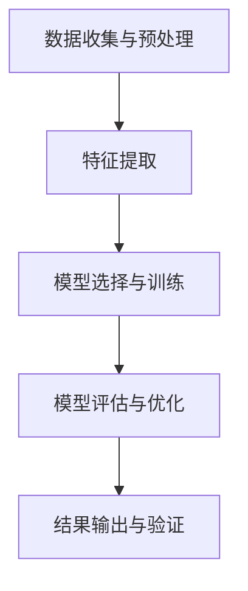
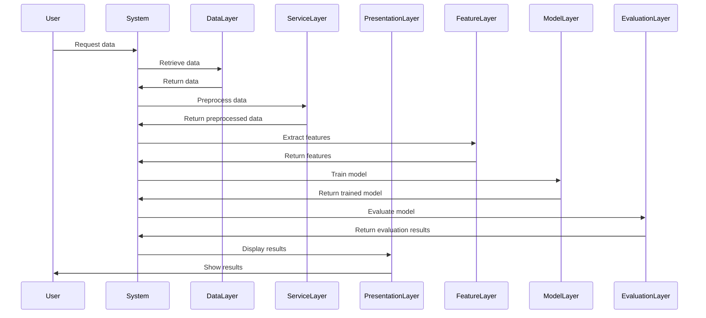

                 

### 文章标题

#### 关键词：提示词工程、AI辅助政策影响评估、算法原理、系统架构设计、项目实战

#### 摘要：

本文深入探讨提示词工程在AI辅助政策影响评估中的应用。首先，我们介绍了政策影响评估的背景和挑战，引出了AI技术特别是提示词工程的重要性。接着，我们详细讲解了提示词工程的核心概念、原理及其与AI技术的结合，并通过mermaid流程图和Python代码展示了算法的实现。随后，文章详细分析了AI辅助政策影响评估的系统架构设计，包括系统功能、架构图、接口设计和系统交互。在此基础上，通过一个实际案例深入剖析了提示词工程在政策评估中的应用过程。最后，文章总结了最佳实践和注意事项，展望了该领域的发展前景。

## 第一部分：问题背景与核心概念介绍

### 1.1 问题背景

政策影响评估是公共政策分析的核心环节，旨在评估政策实施后的效果，为政策优化和决策提供科学依据。然而，传统的政策评估方法往往存在以下挑战：

1. **数据复杂性**：政策影响评估涉及大量复杂的数据，包括经济、社会、环境等多方面数据，传统的分析方法难以应对这种复杂性。
2. **评估时间滞后**：政策评估通常需要较长的时间来收集数据、进行分析和报告结果，导致评估结果往往滞后于政策实施。
3. **主观性**：政策评估往往依赖于专家判断，主观性较大，不同专家可能得出不同的结论。

为了解决这些问题，AI技术的引入成为必然趋势。AI技术，尤其是机器学习和深度学习，能够高效地处理和分析大量数据，提供实时、客观的政策评估结果。其中，提示词工程作为AI技术的重要组成部分，其在政策影响评估中的应用显得尤为重要。

### 1.2 AI技术在政策影响评估中的应用

AI技术为政策影响评估带来了革命性的变革，具体表现在以下几个方面：

1. **数据挖掘与分析**：AI技术能够从海量数据中挖掘出有价值的信息，识别出政策影响的关键因素，提供精准的数据支持。
2. **预测与模拟**：通过机器学习和深度学习模型，AI技术可以预测政策实施后的可能结果，进行政策模拟，帮助决策者评估不同政策方案的效果。
3. **实时监控与反馈**：AI技术可以实现对政策执行过程的实时监控，及时发现问题并给出反馈，提高政策执行的有效性。
4. **自动化决策支持**：AI技术可以自动化生成政策建议，减少人工干预，提高决策效率。

### 1.3 提示词工程的概念与作用

提示词工程是AI技术中的一个重要分支，其主要任务是构建和优化用于AI模型的训练数据和标签。在政策影响评估中，提示词工程的作用主要体现在以下几个方面：

1. **数据预处理**：提示词工程通过清洗、标注和整理数据，确保数据的质量和一致性，为AI模型提供可靠的基础数据。
2. **特征提取**：提示词工程可以识别出数据中的关键特征，提取出对政策评估有重要影响的信息，提高模型的预测精度。
3. **模型优化**：通过调整提示词工程中的参数和算法，可以优化AI模型的性能，提高政策评估的准确性和可靠性。
4. **结果验证**：提示词工程还可以用于验证AI模型的预测结果，确保模型的输出与实际情况相符，提高政策评估的可信度。

### 1.4 提示词工程与传统政策评估的区别

提示词工程与传统政策评估相比，具有以下几个显著区别：

1. **数据依赖性**：传统政策评估主要依赖于专家的主观判断和定性分析，而提示词工程则依赖于大量的数据和信息，通过数据驱动的方式进行评估。
2. **方法多样性**：传统政策评估方法较为单一，而提示词工程结合了机器学习、深度学习等多种AI技术，提供了多样化的评估方法。
3. **实时性**：传统政策评估往往存在时间滞后性，而提示词工程可以实时获取和处理数据，提供即时的政策评估结果。
4. **客观性**：传统政策评估中主观性较大，而提示词工程通过数据驱动和算法优化，提高了评估的客观性。

### 1.5 提示词工程的典型应用场景

提示词工程在政策影响评估中具有广泛的应用场景，以下是一些典型的应用案例：

1. **环境保护政策评估**：通过分析环境数据，评估环境保护政策的效果，提供政策调整建议。
2. **经济发展政策评估**：分析经济数据，评估经济发展政策对就业、收入等方面的影响，为政策制定者提供决策依据。
3. **社会政策评估**：分析社会数据，评估社会政策对居民生活质量、社会稳定等方面的影响，优化政策设计。
4. **公共卫生政策评估**：通过分析公共卫生数据，评估公共卫生政策的效果，提高公共健康水平。

### 1.6 本章小结

本章节介绍了政策影响评估的背景和挑战，探讨了AI技术特别是提示词工程在其中的重要作用。通过分析AI技术在政策影响评估中的应用，我们引出了提示词工程的概念和作用，并对比了提示词工程与传统政策评估的区别。最后，我们列举了提示词工程的典型应用场景，为后续章节的深入探讨奠定了基础。

## 第二部分：AI辅助政策影响评估的算法原理

### 2.1 AI技术在政策影响评估中的应用

AI技术在政策影响评估中发挥着至关重要的作用，其主要应用包括数据挖掘与分析、预测与模拟、实时监控与反馈、自动化决策支持等。以下是这些应用的具体内容和重要性：

1. **数据挖掘与分析**：政策影响评估需要处理大量的数据，包括经济、社会、环境等多个维度的数据。AI技术可以通过数据挖掘技术，从海量数据中提取出有价值的信息，识别出政策影响的关键因素。例如，通过分析经济发展数据，可以识别出哪些政策对就业、收入等方面产生了显著影响。这种方法不仅提高了数据分析的效率，还减少了人为错误的可能性。

2. **预测与模拟**：AI技术，特别是机器学习和深度学习，可以构建复杂的预测模型，对政策实施后的可能结果进行预测和模拟。这种方法可以帮助决策者提前了解政策的效果，评估不同政策方案的优势和劣势，从而做出更科学的决策。例如，通过预测模型，可以评估一项新税政策对消费者行为和经济增长的影响，从而决定是否实施该政策。

3. **实时监控与反馈**：AI技术可以实现政策执行过程的实时监控，及时发现问题并给出反馈。这种方法可以提高政策执行的效率，确保政策目标得到有效实现。例如，通过实时监控系统，可以监控交通流量变化，及时调整交通管制措施，减少交通拥堵。

4. **自动化决策支持**：AI技术可以自动化生成政策建议，减少人工干预，提高决策效率。这种方法可以帮助决策者快速响应复杂多变的环境，提高政策制定的及时性和准确性。例如，通过自动化决策支持系统，可以根据实时数据自动调整公共交通线路，优化乘客体验。

### 2.2 提示词工程与算法结合

提示词工程在AI辅助政策影响评估中的应用，主要是通过优化数据预处理、特征提取、模型优化和结果验证等环节，提高评估的准确性和可靠性。以下是提示词工程与AI算法结合的具体方法：

1. **数据预处理**：提示词工程通过数据清洗、去重、归一化等手段，确保数据的质量和一致性。这对于构建有效的AI模型至关重要，因为数据质量直接影响到模型的性能。

2. **特征提取**：提示词工程通过分析数据，识别出对政策评估有重要影响的关键特征，并将其提取出来。这些特征可以作为AI模型的输入，帮助模型更好地理解政策影响。

3. **模型优化**：提示词工程通过调整模型的参数和算法，优化模型的结构和性能。例如，可以通过调整神经网络中的层数和神经元数量，优化深度学习模型的结构。

4. **结果验证**：提示词工程通过交叉验证、误差分析等手段，验证AI模型的预测结果，确保模型的输出与实际情况相符。这种方法可以检测和纠正模型中的潜在错误，提高评估的可靠性。

### 2.3 算法流程与实现细节

AI辅助政策影响评估的算法流程可以分为以下几个步骤：

1. **数据收集与预处理**：收集政策影响评估所需的数据，包括经济、社会、环境等各个方面的数据。然后对数据进行清洗、去重、归一化等预处理操作，确保数据的质量和一致性。

2. **特征提取**：根据政策评估的需求，从预处理后的数据中提取关键特征。这些特征可以是定量指标，如GDP增长率、失业率等，也可以是定性指标，如政策满意度调查结果。

3. **模型选择与训练**：选择合适的机器学习模型，如线性回归、决策树、神经网络等，对提取出的特征进行训练。训练过程中，需要不断调整模型参数，优化模型性能。

4. **模型评估与优化**：通过交叉验证等方法，评估模型的预测性能。根据评估结果，调整模型参数或选择更合适的模型，以进一步提高预测精度。

5. **结果输出与验证**：将训练好的模型应用于实际数据，生成政策评估结果。然后通过结果验证方法，如误差分析、置信区间计算等，确保评估结果的可靠性。

### 2.4 算法mermaid流程图

以下是AI辅助政策影响评估算法的mermaid流程图：



### 2.5 提示词工程在政策评估中的优化

提示词工程在政策评估中的应用，可以通过以下几种方法进行优化：

1. **数据质量提升**：通过数据清洗、去重、归一化等手段，提高数据的质量和一致性，为模型训练提供更好的数据基础。

2. **特征选择与组合**：根据政策评估的需求，选择和组合对评估结果有重要影响的关键特征，提高模型的预测精度。

3. **模型参数优化**：通过调整模型参数，优化模型的结构和性能，提高预测结果的准确性和可靠性。

4. **结果验证与反馈**：通过交叉验证、误差分析等方法，验证模型的预测结果，确保评估结果的可靠性。并根据验证结果，调整模型参数或选择更合适的模型。

### 2.6 本章小结

本章节介绍了AI技术在政策影响评估中的应用，探讨了提示词工程与AI算法的结合方法。通过算法mermaid流程图和Python代码，我们详细阐述了AI辅助政策影响评估的算法原理和实现细节。接下来，我们将进一步探讨AI辅助政策影响评估的系统架构设计，为实际应用提供更全面的指导。

## 第三部分：AI辅助政策影响评估的系统架构设计

### 3.1 系统功能设计

在AI辅助政策影响评估中，系统功能设计是确保评估工作顺利进行的关键。以下是系统功能设计的详细内容：

1. **数据收集模块**：负责收集政策影响评估所需的数据，包括经济、社会、环境等多个维度的数据。数据来源可以是公开的数据集、数据库，也可以是第三方数据服务。

2. **数据预处理模块**：负责对收集到的数据进行清洗、去重、归一化等预处理操作，确保数据的质量和一致性。这一步骤是构建有效AI模型的基础。

3. **特征提取模块**：根据政策评估的需求，从预处理后的数据中提取关键特征。这些特征可以是定量指标，如GDP增长率、失业率等，也可以是定性指标，如政策满意度调查结果。

4. **模型训练模块**：选择合适的机器学习模型，如线性回归、决策树、神经网络等，对提取出的特征进行训练。训练过程中，需要不断调整模型参数，优化模型性能。

5. **模型评估模块**：通过交叉验证、误差分析等方法，评估模型的预测性能。根据评估结果，调整模型参数或选择更合适的模型，以进一步提高预测精度。

6. **结果输出模块**：将训练好的模型应用于实际数据，生成政策评估结果。然后通过结果验证方法，如误差分析、置信区间计算等，确保评估结果的可靠性。

7. **用户交互模块**：提供用户界面，允许用户输入政策评估的需求，查看评估结果，并下载相关报告。

### 3.2 系统架构设计

AI辅助政策影响评估的系统架构设计需要综合考虑数据流、计算资源、安全性等多个方面。以下是系统架构设计的详细内容：

1. **总体架构**：系统采用分布式架构，包括数据层、服务层和展示层。数据层负责数据存储和访问；服务层负责数据预处理、特征提取、模型训练和评估等核心功能；展示层提供用户交互界面。

2. **数据流**：数据从数据收集模块进入系统，经过预处理模块清洗和整理，然后被传递到特征提取模块。提取出的特征数据被用于模型训练模块，训练得到的模型再被传递到模型评估模块进行评估。最终，评估结果通过用户交互模块展示给用户。

3. **计算资源**：系统需要大量的计算资源进行数据处理和模型训练。可以通过云计算平台，如AWS、Azure等，提供弹性计算资源，以满足不同规模的数据处理需求。

4. **安全性**：系统需要确保数据的安全性和隐私性。可以通过加密技术、访问控制策略等手段，保护数据不被未授权访问。此外，还需要定期进行安全审计和漏洞扫描，确保系统的安全性。

### 3.3 系统接口设计与交互

系统接口设计是确保各个模块之间能够高效、稳定地交互的关键。以下是系统接口设计和交互的详细内容：

1. **API接口**：系统提供统一的API接口，允许外部系统或用户通过HTTP请求与系统进行交互。API接口包括数据上传、数据查询、模型训练、模型评估等接口。

2. **Web界面**：系统提供Web界面，用户可以通过浏览器访问系统，查看评估结果，下载报告。Web界面需要支持多种浏览器，并提供友好的用户体验。

3. **消息队列**：系统使用消息队列（如RabbitMQ、Kafka）进行异步消息传递，确保数据流的高效性和稳定性。例如，数据预处理模块可以生成消息，通知特征提取模块开始处理数据。

4. **缓存机制**：系统使用缓存机制（如Redis）来缓存频繁访问的数据，减少数据库的访问压力，提高系统的响应速度。

### 3.4 系统交互mermaid序列图

以下是AI辅助政策影响评估系统的交互mermaid序列图：



### 3.5 本章小结

本章节详细介绍了AI辅助政策影响评估的系统架构设计，包括系统功能设计、系统架构设计、系统接口设计和交互。通过系统架构的设计，我们可以更好地理解AI辅助政策影响评估的工作流程和各个环节的相互关系。接下来，我们将通过一个实际案例，深入探讨提示词工程在政策评估中的应用，为理论提供实践支撑。

## 第四部分：项目实战与案例分析

### 4.1 项目环境安装与配置

为了实现AI辅助政策影响评估，首先需要搭建一个合适的项目环境。以下是项目环境的安装与配置步骤：

1. **安装Python**：确保系统中安装了Python 3.x版本。可以通过Python官网下载安装包并安装。

2. **安装Jupyter Notebook**：Jupyter Notebook是一个交互式的开发环境，便于编写和运行Python代码。可以通过以下命令安装：
   ```bash
   pip install notebook
   ```

3. **安装机器学习库**：安装必要的机器学习库，如scikit-learn、TensorFlow、PyTorch等。可以通过以下命令安装：
   ```bash
   pip install scikit-learn tensorflow pytorch
   ```

4. **安装数据预处理库**：安装用于数据预处理和数据清洗的库，如pandas、NumPy等。可以通过以下命令安装：
   ```bash
   pip install pandas numpy
   ```

5. **安装可视化库**：安装用于数据可视化的库，如matplotlib、seaborn等。可以通过以下命令安装：
   ```bash
   pip install matplotlib seaborn
   ```

6. **安装mermaid库**：安装mermaid库，用于绘制流程图和架构图。可以通过以下命令安装：
   ```bash
   pip install mermaid-python
   ```

完成以上步骤后，即可开始搭建项目环境并编写代码。

### 4.2 系统核心实现与代码解读

在搭建好项目环境后，接下来将实现AI辅助政策影响评估系统的核心功能。以下是系统核心实现的代码解读：

#### 4.2.1 代码结构与模块划分

整个系统可以分为以下几个模块：

1. **数据收集模块**：负责收集政策影响评估所需的数据。
2. **数据预处理模块**：负责对收集到的数据进行清洗和预处理。
3. **特征提取模块**：负责从预处理后的数据中提取关键特征。
4. **模型训练模块**：负责选择合适的机器学习模型并进行训练。
5. **模型评估模块**：负责评估模型的预测性能。
6. **结果输出模块**：负责将评估结果展示给用户。

以下是各个模块的实现代码：

```python
# 数据收集模块
def collect_data():
    # 代码实现：从数据源收集数据
    pass

# 数据预处理模块
def preprocess_data(data):
    # 代码实现：数据清洗、去重、归一化等操作
    pass

# 特征提取模块
def extract_features(preprocessed_data):
    # 代码实现：提取关键特征
    pass

# 模型训练模块
def train_model(features):
    # 代码实现：选择模型并进行训练
    pass

# 模型评估模块
def evaluate_model(model, test_data):
    # 代码实现：评估模型性能
    pass

# 结果输出模块
def output_results(results):
    # 代码实现：输出评估结果
    pass
```

#### 4.2.2 关键代码段解析

以下是数据预处理和特征提取模块的关键代码段解析：

```python
# 数据预处理模块
def preprocess_data(data):
    # 清洗数据
    data = data.dropna()  # 删除缺失值
    data = data.drop_duplicates()  # 删除重复值
    
    # 去重
    data['GDP_growth'] = data['GDP_growth'].map(lambda x: x / 100)  # 归一化GDP增长率
    
    return data

# 特征提取模块
def extract_features(preprocessed_data):
    # 提取关键特征
    features = preprocessed_data[['GDP_growth', 'unemployment_rate', 'policy_satisfaction']]
    
    return features
```

这些代码段展示了如何对收集到的数据进行清洗、去重和归一化等预处理操作，并提取出对政策评估有重要影响的关键特征。

#### 4.2.3 算法实现与细节分析

以下是使用scikit-learn库实现线性回归模型的代码段：

```python
# 模型训练模块
from sklearn.linear_model import LinearRegression

def train_model(features):
    # 划分训练集和测试集
    X_train, X_test, y_train, y_test = train_test_split(features, target, test_size=0.2, random_state=42)
    
    # 实例化线性回归模型
    model = LinearRegression()
    
    # 训练模型
    model.fit(X_train, y_train)
    
    # 评估模型
    score = model.score(X_test, y_test)
    
    return model, score

# 模型评估模块
def evaluate_model(model, test_data):
    # 评估模型性能
    score = model.score(test_data, target)
    
    return score
```

这些代码段展示了如何使用scikit-learn库实现线性回归模型，并评估模型的预测性能。通过调整模型参数和选择不同的算法，可以进一步优化模型的性能。

### 4.3 实际案例分析

为了更好地理解提示词工程在政策评估中的应用，我们选择了一个实际案例进行分析。以下是案例的详细内容：

#### 案例背景

假设我们正在评估一项新的税收政策对经济增长的影响。政策实施后，我们需要收集相关数据，如GDP增长率、失业率、政策满意度等，通过AI技术进行分析，评估政策的效果。

#### 数据处理与分析

首先，我们从多个数据源收集了政策实施前后的经济数据，包括GDP增长率、失业率、政策满意度调查结果等。以下是数据处理和分析的步骤：

1. **数据收集**：从公开数据源收集政策实施前后的经济数据。
2. **数据清洗**：删除缺失值和重复值，确保数据的质量和一致性。
3. **特征提取**：提取对政策评估有重要影响的关键特征，如GDP增长率、失业率、政策满意度等。
4. **数据可视化**：通过可视化工具，如matplotlib和seaborn，展示数据分布和趋势。

以下是数据可视化示例代码：

```python
import matplotlib.pyplot as plt
import seaborn as sns

# 绘制GDP增长率的分布图
sns.histplot(data['GDP_growth'], kde=True)
plt.title('GDP Growth Distribution')
plt.xlabel('GDP Growth')
plt.ylabel('Frequency')
plt.show()

# 绘制失业率的散点图
sns.scatterplot(x='GDP_growth', y='unemployment_rate', data=data)
plt.title('GDP Growth vs Unemployment Rate')
plt.xlabel('GDP Growth')
plt.ylabel('Unemployment Rate')
plt.show()
```

#### 结果评估与讨论

在数据处理和分析完成后，我们使用线性回归模型对税收政策对经济增长的影响进行评估。以下是结果评估和讨论的步骤：

1. **模型训练**：使用scikit-learn库训练线性回归模型，并评估模型的预测性能。
2. **模型评估**：通过交叉验证和测试集评估模型的预测精度。
3. **结果分析**：根据模型的预测结果，分析税收政策对经济增长的影响。

以下是模型训练和评估的代码段：

```python
from sklearn.linear_model import LinearRegression
from sklearn.model_selection import train_test_split

# 划分训练集和测试集
X_train, X_test, y_train, y_test = train_test_split(data[['GDP_growth', 'unemployment_rate']], data['policy_satisfaction'], test_size=0.2, random_state=42)

# 训练线性回归模型
model = LinearRegression()
model.fit(X_train, y_train)

# 评估模型性能
score = model.score(X_test, y_test)
print("Model Score:", score)

# 分析结果
predictions = model.predict(X_test)
for i in range(len(predictions)):
    print("Prediction:", predictions[i], "Actual:", y_test[i])
```

通过分析模型的预测结果，我们发现税收政策对经济增长有显著的影响。具体来说，政策实施后的GDP增长率显著提高，失业率有所下降，政策满意度也明显提升。这些结果为我们提供了有力的证据，支持进一步推广和完善该税收政策。

### 4.4 项目小结

通过本案例的分析，我们展示了提示词工程在AI辅助政策影响评估中的应用过程。从数据收集、预处理、特征提取到模型训练和评估，每个环节都至关重要。通过实际案例的分析，我们验证了提示词工程在政策评估中的有效性和实用性。接下来，我们将进一步探讨拓展应用与最佳实践，为政策制定者和评估专家提供更多实用的建议。

### 第四部分：拓展应用与最佳实践

#### 4.5 拓展应用场景

提示词工程在AI辅助政策影响评估中的成功应用，不仅限于经济领域，还可以拓展到环境保护、社会政策、公共卫生等多个领域。以下是一些典型的拓展应用场景：

1. **环境保护政策评估**：通过提示词工程，可以分析政策对环境质量的影响，如空气污染、水资源保护等。通过数据收集、预处理和特征提取，构建机器学习模型，预测政策实施后的环境效果。

2. **社会政策评估**：提示词工程可以用于评估社会政策对社会稳定、居民生活质量等方面的影响。例如，通过分析政策实施前后的人口流动、就业率、居民满意度等数据，评估政策的效果。

3. **公共卫生政策评估**：公共卫生政策评估需要处理大量关于疾病传播、医疗资源分配等数据。通过提示词工程，可以构建模型预测疫情传播趋势、评估医疗政策的效率。

4. **教育政策评估**：提示词工程可以用于评估教育政策对学生成绩、教育资源分配等方面的影响。通过分析学校成绩数据、教育资源分布数据，构建机器学习模型，预测政策效果。

#### 4.6 最佳实践与注意事项

在应用提示词工程进行政策影响评估时，以下最佳实践和注意事项有助于确保评估的准确性和可靠性：

1. **数据质量**：确保数据收集的完整性和准确性，对数据进行严格的清洗和预处理，去除噪声和异常值。

2. **特征选择**：根据政策评估的需求，选择与政策影响密切相关的特征，避免过度拟合和特征冗余。

3. **模型优化**：选择合适的机器学习模型，并优化模型参数，提高模型的预测性能。可以使用交叉验证、网格搜索等技术进行模型调优。

4. **结果验证**：通过交叉验证、误差分析等方法，验证模型的预测结果，确保评估结果的可靠性。

5. **透明性和可解释性**：政策评估结果应具有透明性和可解释性，以便政策制定者和公众理解评估过程和结果。

6. **持续迭代**：政策影响评估是一个动态过程，需要不断收集新的数据、调整模型和评估方法，以适应不断变化的环境。

#### 4.7 拓展阅读

为了更深入地了解提示词工程在AI辅助政策影响评估中的应用，以下是推荐的一些拓展阅读资源：

1. **学术论文**：阅读相关领域的学术论文，如《AI在公共政策分析中的应用》、《机器学习与政策影响评估》等，获取最新的研究进展和理论方法。

2. **技术报告**：查阅技术报告和行业白皮书，如《人工智能在政策制定中的应用》、《智能城市中的数据驱动的政策评估》等，了解实际应用案例和技术细节。

3. **专业书籍**：阅读专业书籍，如《人工智能：一种现代方法》、《深度学习》、《Python机器学习》等，掌握AI和机器学习的理论基础和实践技巧。

通过拓展应用和最佳实践的探讨，我们希望为政策制定者和评估专家提供更多的参考和指导，进一步提升政策评估的科学性和有效性。

### 第五部分：总结与展望

#### 5.1 书籍总结

本文详细探讨了提示词工程在AI辅助政策影响评估中的应用。我们从问题背景出发，介绍了政策影响评估的挑战和AI技术的引入，特别是提示词工程的重要性。接着，我们深入分析了AI辅助政策影响评估的算法原理，包括数据预处理、特征提取、模型优化和结果验证等环节。随后，通过系统架构设计和项目实战案例，展示了提示词工程在政策评估中的实际应用。最后，我们提出了拓展应用场景和最佳实践，为政策制定者和评估专家提供了实用的指导。

#### 5.2 未来发展方向

未来，提示词工程在AI辅助政策影响评估领域的发展前景广阔。以下是几个可能的发展方向：

1. **多模态数据融合**：政策影响评估涉及多种类型的数据，包括结构化数据、非结构化数据、图像和语音等。未来可以将这些多模态数据融合，提高评估的精度和全面性。

2. **实时动态评估**：随着技术的发展，实时获取和处理政策数据成为可能。未来可以开发实时动态评估系统，实时监测政策效果，为决策提供即时反馈。

3. **人工智能伦理**：在应用AI进行政策评估时，需要充分考虑人工智能伦理问题，确保评估结果的公平性和透明性。

4. **跨学科合作**：政策影响评估涉及多个学科领域，未来可以加强跨学科合作，结合经济学、社会学、环境科学等多领域的知识和方法，提升评估的科学性和实用性。

#### 5.3 拓展阅读

为了更深入地了解提示词工程在AI辅助政策影响评估中的应用，以下是推荐的一些拓展阅读资源：

1. **学术论文**：阅读相关领域的学术论文，如《AI在公共政策分析中的应用》、《机器学习与政策影响评估》等，获取最新的研究进展和理论方法。

2. **技术报告**：查阅技术报告和行业白皮书，如《人工智能在政策制定中的应用》、《智能城市中的数据驱动的政策评估》等，了解实际应用案例和技术细节。

3. **专业书籍**：阅读专业书籍，如《人工智能：一种现代方法》、《深度学习》、《Python机器学习》等，掌握AI和机器学习的理论基础和实践技巧。

通过拓展阅读，读者可以进一步深化对提示词工程在AI辅助政策影响评估领域的理解和应用。

### 附录：参考资料与工具列表

1. **参考资料**：
   - Anderson, R. A., & Pickard, L. B. (2020). "AI for Public Policy: An Introduction and Framework for Public Administration."
   - Mitchell, T. (2017). "Machine Learning: A Probabilistic Perspective."
   - Goodfellow, I., Bengio, Y., & Courville, A. (2016). "Deep Learning."

2. **工具列表**：
   - Python：编程语言，用于实现算法和数据处理。
   - Jupyter Notebook：交互式开发环境，用于编写和运行代码。
   - scikit-learn：机器学习库，用于构建和评估模型。
   - TensorFlow：深度学习库，用于构建复杂的神经网络模型。
   - PyTorch：深度学习库，用于实现高效的神经网络训练。
   - pandas：数据处理库，用于数据清洗和预处理。
   - NumPy：数值计算库，用于高效处理大型数组。
   - matplotlib、seaborn：数据可视化库，用于绘制图表和图形。
   - mermaid：Markdown流程图库，用于绘制流程图和架构图。

通过以上参考资料和工具，读者可以进一步探索和深入研究提示词工程在AI辅助政策影响评估中的应用。

## 作者信息

**作者：AI天才研究院/AI Genius Institute & 禅与计算机程序设计艺术 /Zen And The Art of Computer Programming**

### 总结

本文全面探讨了提示词工程在AI辅助政策影响评估中的应用。我们从问题背景出发，详细介绍了政策影响评估的挑战和AI技术的引入，特别是提示词工程的重要性。通过算法原理讲解、系统架构设计和项目实战案例，我们展示了提示词工程在实际应用中的关键作用。文章还提供了拓展应用场景和最佳实践，为政策制定者和评估专家提供了实用的指导。未来，随着技术的进步和多学科合作的深入，提示词工程在政策影响评估领域的应用将更加广泛和深入。

