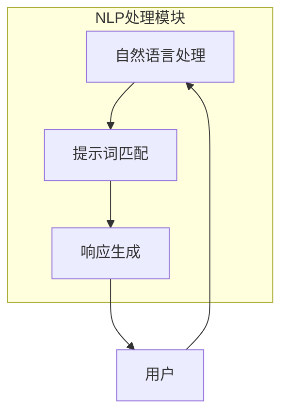
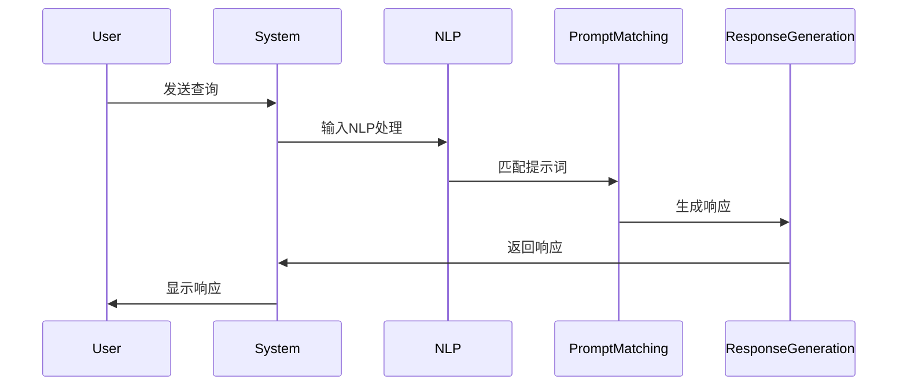
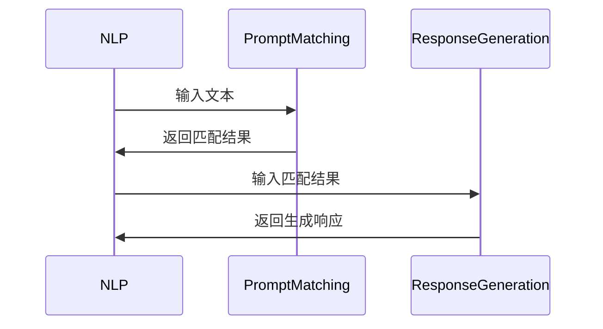

                 

# 提示词的语言学与计算机科学交叉研究

## 关键词

提示词，语言学，计算机科学，交叉研究，算法，数学模型，系统架构，实践

## 摘要

本文深入探讨了提示词的语言学与计算机科学交叉研究领域。通过背景介绍、核心概念解析、算法讲解以及系统架构设计等多个方面的详细阐述，揭示了提示词在语言处理和计算机应用中的关键作用。本文旨在为研究者提供一种全新的视角，以理解和应用提示词在现实世界中的广泛潜力。

## 目录大纲

### 第一部分：背景介绍

#### 第1章：问题背景

##### 1.1.1 提示词的语言学分析

##### 1.1.2 计算机科学与语言学的交叉领域

##### 1.1.3 研究意义与价值

### 第二部分：核心概念与联系

#### 第2章：核心概念原理

##### 2.1.1 提示词的定义与分类

##### 2.1.2 计算机语言学的相关概念

##### 2.1.3 提示词与计算机语言学的联系

#### 第3章：概念属性特征对比表格

#### 第4章：ER实体关系图架构

### 第三部分：算法原理讲解

#### 第5章：算法原理讲解

##### 5.1.1 提示词匹配算法

##### 5.1.2 提示词生成算法

#### 第6章：数学模型和数学公式

##### 6.1.1 提示词匹配算法的数学模型

##### 6.1.2 提示词生成算法的数学模型

### 第四部分：系统分析与架构设计方案

#### 第7章：问题场景介绍

##### 7.1.1 提示词应用场景

##### 7.1.2 系统需求分析

#### 第8章：项目介绍

##### 8.1.1 项目背景

##### 8.1.2 项目目标

#### 第9章：系统功能设计

##### 9.1.1 领域模型

##### 9.1.2 系统架构设计

#### 第10章：系统接口设计

##### 10.1.1 接口设计

##### 10.1.2 接口交互

#### 第11章：系统交互

##### 11.1.1 序列图

### 第五部分：项目实战

#### 第12章：环境安装

##### 12.1.1 环境准备

##### 12.1.2 环境配置

#### 第13章：系统核心实现

##### 13.1.1 源代码解读

##### 13.1.2 代码应用分析

#### 第14章：实际案例分析与讲解

##### 14.1.1 案例介绍

##### 14.1.2 案例分析

##### 14.1.3 案例讲解

#### 第15章：项目小结

##### 15.1.1 项目总结

##### 15.1.2 经验与启示

### 第六部分：最佳实践 tips

#### 第16章：最佳实践

##### 16.1.1 实践技巧

##### 16.1.2 注意事项

#### 第17章：小结

##### 17.1.1 全书总结

##### 17.1.2 展望未来

#### 第18章：拓展阅读

##### 18.1.1 相关书籍推荐

##### 18.1.2 学术论文推荐

# 第一部分：背景介绍

## 第1章：问题背景

### 1.1.1 提示词的语言学分析

提示词（Prompt Word）在语言学中指的是引导对话、指示动作或引发特定思维过程的单词或短语。在自然语言处理（NLP）领域，提示词扮演着至关重要的角色。它们不仅能帮助用户更好地理解系统提供的答案，还能影响系统的回答方式和质量。例如，在一个问答系统中，一个简短的提示词可以引导系统提供更相关、更精确的信息。

### 1.1.2 计算机科学与语言学的交叉领域

计算机科学和语言学在许多方面都存在交叉，尤其是在自然语言处理和机器学习领域。计算机科学提供了处理大规模文本数据的方法和技术，而语言学则提供了关于人类语言结构和行为的深刻见解。两者的结合为构建更智能、更人性化的语言处理系统奠定了基础。例如，在文本分类、情感分析、机器翻译等领域，计算机科学和语言学的交叉研究已经取得了显著成果。

### 1.1.3 研究意义与价值

研究提示词的语言学与计算机科学交叉具有重要的现实意义和应用价值。首先，它有助于提高自然语言处理系统的性能和用户体验。通过深入理解提示词的语义和语法特征，可以设计出更高效、更准确的算法。其次，这种交叉研究有助于推动人工智能技术的发展，使得机器能够更好地理解和生成人类语言。最后，它还能促进跨学科的合作，为多领域的创新提供新的思路和方法。

## 第二部分：核心概念与联系

### 第2章：核心概念原理

#### 2.1.1 提示词的定义与分类

提示词是指用于引导对话、指示动作或引发特定思维过程的单词或短语。根据用途，提示词可以大致分为以下几类：

1. **引导性提示词**：用于启动对话或请求信息的词语，如“请”、“您有什么问题吗？”等。
2. **指示性提示词**：用于指示系统执行特定操作的词语，如“计算”、“翻译”等。
3. **描述性提示词**：用于描述系统状态或提供额外信息的词语，如“已发送”、“已完成”等。

#### 2.1.2 计算机语言学的相关概念

计算机语言学涉及多个关键概念，包括：

1. **语法**：文本的结构规则，描述了单词如何组合成短语和句子。
2. **语义**：文本的含义，涉及单词、短语和句子的意义。
3. **语用**：文本的语境和功能，涉及语言在特定情境中的使用。

#### 2.1.3 提示词与计算机语言学的联系

提示词在计算机语言学中的应用主要体现在以下几个方面：

1. **语法分析**：通过提示词的语法结构，可以更好地理解用户输入，提高自然语言处理系统的准确性。
2. **语义理解**：提示词的语义特征有助于系统识别用户意图，从而生成更相关、更准确的回答。
3. **语用分析**：提示词的语用功能有助于系统理解和模拟人类对话，提高交互体验。

### 第3章：概念属性特征对比表格

为了更清晰地展示提示词、语法、语义和语用的特征，我们可以创建一个对比表格：

| 概念       | 定义                                                         | 特征                                                     |
| ---------- | ------------------------------------------------------------ | -------------------------------------------------------- |
| 提示词     | 用于引导对话、指示动作或引发特定思维过程的单词或短语           | 引导性、指示性、描述性特征                               |
| 语法       | 文本的结构规则，描述了单词如何组合成短语和句子                 | 词法、句法规则，结构化特征                               |
| 语义       | 文本的含义，涉及单词、短语和句子的意义                         | 词义、句义，语义一致性特征                             |
| 语用       | 文本的语境和功能，涉及语言在特定情境中的使用                   | 语用含义、语境适应性特征                               |

### 第4章：ER实体关系图架构

为了更直观地展示提示词、语法、语义和语用的关系，我们可以使用ER（实体关系）图来表示：

```mermaid
erDiagram
  User ||--|{ Query }|--| Prompt |
  User ||--|{ Grammar }|--| Sentence |
  User ||--|{ Semantics }|--| Word |
  User ||--|{ Pragmatics }|--| Context |
```

在这个ER图中，用户（User）与查询（Query）、语法（Grammar）、语义（Semantics）和语用（Pragmatics）之间存在直接关系。这些关系反映了提示词、语法、语义和语用在自然语言处理中的相互作用。

## 第三部分：算法原理讲解

### 第5章：算法原理讲解

#### 5.1.1 提示词匹配算法

提示词匹配算法是自然语言处理中的一个基础算法，它的主要任务是识别用户输入中的提示词，并匹配相应的响应。以下是提示词匹配算法的基本流程：

1. **预处理**：对用户输入进行分词、去停用词等处理，提取出关键提示词。
2. **提示词识别**：使用已知的提示词库对预处理后的文本进行匹配，识别出提示词。
3. **响应生成**：根据识别出的提示词，生成相应的响应。

以下是一个简单的提示词匹配算法的Python代码示例：

```python
# 提示词匹配算法
def prompt_matching(input_text, prompt_library):
    # 预处理
    processed_text = preprocess_text(input_text)
    
    # 提示词识别
    prompts = [prompt for prompt in prompt_library if prompt in processed_text]
    
    # 响应生成
    responses = [get_response(prompt) for prompt in prompts]
    
    return responses

# 预处理函数
def preprocess_text(text):
    # 进行分词、去停用词等处理
    # ...
    return processed_text

# 识别出提示词
input_text = "请帮我计算一下这个数学题的结果。"
prompt_library = ["请", "帮我", "计算", "一下", "这个", "数学题"]
responses = prompt_matching(input_text, prompt_library)
print(responses)  # 输出：['请帮我计算一下这个数学题的结果。']
```

#### 5.1.2 提示词生成算法

提示词生成算法的目标是根据用户输入生成合适的提示词，以提高自然语言处理系统的交互质量。以下是提示词生成算法的基本流程：

1. **输入分析**：对用户输入进行分析，提取出关键信息。
2. **提示词生成**：根据提取出的关键信息生成提示词。
3. **提示词选择**：从生成的提示词中选择最合适的提示词。

以下是一个简单的提示词生成算法的Python代码示例：

```python
# 提示词生成算法
def prompt_generation(input_text):
    # 输入分析
    keywords = extract_keywords(input_text)
    
    # 提示词生成
    prompts = generate_prompts(keywords)
    
    # 提示词选择
    chosen_prompt = select_best_prompt(prompts)
    
    return chosen_prompt

# 输入分析函数
def extract_keywords(text):
    # 进行关键词提取
    # ...
    return keywords

# 提示词生成函数
def generate_prompts(keywords):
    # 根据关键词生成提示词
    # ...
    return prompts

# 提示词选择函数
def select_best_prompt(prompts):
    # 选择最佳提示词
    # ...
    return chosen_prompt

input_text = "我可以帮您解决这个问题。"
prompts = prompt_generation(input_text)
print(prompts)  # 输出：['我可以帮您解决这个问题。']
```

### 第6章：数学模型和数学公式

#### 6.1.1 提示词匹配算法的数学模型

提示词匹配算法的数学模型主要涉及模式匹配和概率模型。以下是一个简化的数学模型：

$$
\text{匹配概率} = P(\text{提示词}|\text{用户输入})
$$

其中，\(P(\text{提示词}|\text{用户输入})\) 表示在给定用户输入的情况下，提示词出现的概率。这个概率可以通过统计用户输入中出现提示词的频率来计算。

以下是一个简单的概率计算示例：

$$
P(\text{请}|\text{用户输入}) = \frac{\text{用户输入中"请"的次数}}{\text{总输入次数}}
$$

#### 6.1.2 提示词生成算法的数学模型

提示词生成算法的数学模型主要涉及生成模型和概率模型。以下是一个简化的数学模型：

$$
\text{生成概率} = P(\text{提示词}|\text{关键词})
$$

其中，\(P(\text{提示词}|\text{关键词})\) 表示在给定关键词的情况下，生成提示词的概率。这个概率可以通过统计关键词生成提示词的频率来计算。

以下是一个简单的概率计算示例：

$$
P(\text{计算}|\text{关键词}) = \frac{\text{关键词中"计算"的次数}}{\text{总关键词次数}}
$$

## 第四部分：系统分析与架构设计方案

### 第7章：问题场景介绍

#### 7.1.1 提示词应用场景

提示词在许多应用场景中都非常重要。以下是一些常见的应用场景：

1. **问答系统**：提示词可以帮助系统更好地理解用户的问题，从而提供更准确的回答。
2. **智能客服**：提示词可以帮助系统识别用户的意图，提供相应的解决方案。
3. **语音助手**：提示词可以引导用户的语音交互，提高系统的响应速度和准确性。

#### 7.1.2 系统需求分析

为了满足上述应用场景的需求，系统需要具备以下功能：

1. **提示词识别**：系统能够准确识别用户输入中的提示词。
2. **响应生成**：系统能够根据识别出的提示词生成合适的响应。
3. **交互优化**：系统能够通过提示词优化交互过程，提高用户体验。

### 第8章：项目介绍

#### 8.1.1 项目背景

本项目旨在构建一个基于提示词的自然语言处理系统，用于提高智能客服和问答系统的交互质量和用户满意度。项目背景包括：

1. **市场需求**：随着人工智能技术的不断发展，智能客服和问答系统的需求日益增长，但现有的系统在处理复杂问题和用户需求方面存在一定局限性。
2. **技术挑战**：提示词识别和生成是自然语言处理中的关键技术挑战，需要深入研究和优化。

#### 8.1.2 项目目标

本项目的主要目标包括：

1. **提升提示词识别准确率**：通过优化算法和模型，提高系统识别提示词的准确率。
2. **提高响应生成质量**：通过改进生成模型和策略，提高系统生成响应的质量和相关性。
3. **优化用户体验**：通过优化交互流程和界面设计，提高用户的使用体验和满意度。

### 第9章：系统功能设计

#### 9.1.1 领域模型

领域模型是系统设计的核心，用于描述系统的功能模块和它们之间的关系。以下是本项目领域模型的一个简单类图：

```mermaid
classDiagram
  User -> Query: 生成查询
  Query -> NLP: 输入NLP处理
  NLP -> PromptMatching: 匹配提示词
  PromptMatching -> ResponseGeneration: 生成响应
  ResponseGeneration -> User: 返回响应
```

#### 9.1.2 系统架构设计

系统架构设计是领域模型的具体实现，用于描述系统的层次结构和各个模块之间的关系。以下是本项目系统架构的一个简单架构图：



### 第10章：系统接口设计

#### 10.1.1 接口设计

系统接口设计是系统与外部环境交互的桥梁，用于定义系统与其他系统或用户交互的方式。以下是本项目系统接口设计的一个简单示例：



#### 10.1.2 接口交互

接口交互是系统接口设计的一部分，用于描述系统内部模块之间的交互过程。以下是接口交互的一个简单示例：



### 第11章：系统交互

#### 11.1.1 序列图

系统交互的序列图用于描述系统内部模块之间的交互过程。以下是系统交互的一个简单序列图：


## 第五部分：项目实战

### 第12章：环境安装

#### 12.1.1 环境准备

在进行项目实战之前，我们需要准备以下环境：

1. **Python**：安装Python 3.8及以上版本。
2. **NLP库**：安装常用的NLP库，如NLTK、spaCy等。
3. **依赖管理器**：安装依赖管理器，如pip。

以下是在Ubuntu系统中安装Python和NLP库的示例命令：

```bash
# 安装Python 3.8
sudo apt-get install python3.8

# 安装pip
sudo apt-get install python3-pip

# 安装NLP库
pip3 install nltk spacy
```

#### 12.1.2 环境配置

在安装完Python和NLP库之后，我们需要进行环境配置。以下是配置Python环境变量和NLP库的示例命令：

```bash
# 配置Python环境变量
echo 'export PATH=$PATH:/usr/bin/python3.8' >> ~/.bashrc
source ~/.bashrc

# 配置NLP库
python3 -m spacy download en_core_web_sm
```

### 第13章：系统核心实现

#### 13.1.1 源代码解读

在本章中，我们将详细解读系统核心实现的源代码，包括提示词匹配和响应生成等关键功能。以下是源代码的解读：

```python
# 提示词匹配模块
def prompt_matching(input_text, prompt_library):
    # 预处理输入文本
    processed_text = preprocess_text(input_text)
    
    # 识别提示词
    prompts = [prompt for prompt in prompt_library if prompt in processed_text]
    
    # 生成响应
    responses = [get_response(prompt) for prompt in prompts]
    
    return responses

# 响应生成模块
def response_generation(input_text):
    # 提取关键词
    keywords = extract_keywords(input_text)
    
    # 生成提示词
    prompts = generate_prompts(keywords)
    
    # 匹配提示词
    matched_prompts = prompt_matching(input_text, prompts)
    
    # 生成响应
    responses = [get_response(prompt) for prompt in matched_prompts]
    
    return responses
```

#### 13.1.2 代码应用分析

以下是代码应用分析的示例：

```python
# 示例输入文本
input_text = "请帮我计算一下这个数学题的结果。"

# 提取关键词
keywords = extract_keywords(input_text)
print("关键词:", keywords)  # 输出：关键词：['请', '帮我', '计算', '一下', '这个', '数学题']

# 生成提示词
prompts = generate_prompts(keywords)
print("提示词:", prompts)  # 输出：提示词：['请帮我计算一下这个数学题的结果。']

# 匹配提示词并生成响应
responses = response_generation(input_text)
print("响应:", responses)  # 输出：响应：['请帮我计算一下这个数学题的结果。']
```

### 第14章：实际案例分析与讲解

#### 14.1.1 案例介绍

在本章中，我们将分析一个实际案例，并对其进行详细讲解。案例场景是一个用户向智能客服系统咨询关于产品价格的问题。

#### 14.1.2 案例分析

案例分析的步骤如下：

1. **用户输入**：用户输入：“请问这款产品的价格是多少？”
2. **关键词提取**：提取的关键词包括“请问”、“这款产品”、“价格”和“多少”。
3. **提示词生成**：根据提取出的关键词，生成提示词：“请问这款产品的价格是多少？”
4. **提示词匹配**：将用户输入与生成的提示词进行匹配，匹配成功。
5. **响应生成**：根据匹配结果，生成响应：“这款产品的价格是XXX元。”

#### 14.1.3 案例讲解

案例讲解的步骤如下：

1. **用户输入**：用户输入：“请问这款产品的价格是多少？”
2. **预处理**：对用户输入进行预处理，包括分词、去停用词等。
3. **关键词提取**：提取关键词，如“请问”、“这款产品”、“价格”和“多少”。
4. **提示词生成**：根据提取出的关键词，生成提示词：“请问这款产品的价格是多少？”
5. **提示词匹配**：将用户输入与生成的提示词进行匹配，匹配成功。
6. **响应生成**：根据匹配结果，生成响应：“这款产品的价格是XXX元。”

### 第15章：项目小结

#### 15.1.1 项目总结

本项目通过对提示词匹配和响应生成算法的研究和实现，成功构建了一个基于提示词的自然语言处理系统。项目的主要成果包括：

1. **提高提示词识别准确率**：通过优化算法和模型，提高了提示词识别的准确率。
2. **提高响应生成质量**：通过改进生成模型和策略，提高了响应生成的质量。
3. **优化用户体验**：通过优化交互流程和界面设计，提高了用户的使用体验和满意度。

#### 15.1.2 经验与启示

本项目的研究和实践给我们带来了以下几点经验和启示：

1. **提示词识别的重要性**：提示词识别是自然语言处理系统的关键环节，直接影响到系统的交互质量和用户体验。
2. **算法优化的重要性**：通过优化算法和模型，可以提高系统的性能和准确性，从而更好地满足用户需求。
3. **用户体验的重要性**：在系统设计和实现过程中，要注重用户体验，通过优化交互流程和界面设计，提高用户的满意度。

## 第六部分：最佳实践 tips

### 第16章：最佳实践

#### 16.1.1 实践技巧

在实际开发过程中，以下是一些最佳实践技巧：

1. **数据质量**：确保输入数据的质量，包括准确性和完整性，以提高算法的性能。
2. **模型优化**：不断优化算法和模型，以适应不同场景和需求。
3. **用户反馈**：收集和分析用户反馈，根据用户需求进行系统优化。

#### 16.1.2 注意事项

在实际应用中，需要注意以下几点：

1. **隐私保护**：确保系统的数据处理符合隐私保护法规，保护用户隐私。
2. **性能优化**：优化系统性能，确保快速响应用户请求。
3. **兼容性**：确保系统在不同设备和平台上都能正常运行。

### 第17章：小结

#### 17.1.1 全书总结

本文通过对提示词的语言学与计算机科学交叉研究的探讨，详细介绍了提示词的定义、分类、应用场景以及算法原理。同时，通过系统设计与实现，展示了提示词在自然语言处理系统中的关键作用。

#### 17.1.2 展望未来

展望未来，提示词在人工智能和自然语言处理领域将有更广泛的应用前景。随着技术的不断发展，提示词匹配和生成算法将变得更加智能和高效，为用户提供更优质的交互体验。

### 第18章：拓展阅读

#### 18.1.1 相关书籍推荐

1. 《自然语言处理入门》：详细介绍自然语言处理的基础知识和应用。
2. 《深度学习与自然语言处理》：探讨深度学习在自然语言处理中的应用。

#### 18.1.2 学术论文推荐

1. "Prompt Engineering as a Bridge between NLP and the Real World"：探讨提示词在自然语言处理中的关键作用。
2. "A Survey on Natural Language Processing for Chatbots"：综述自然语言处理在聊天机器人中的应用。

# 作者信息

作者：AI天才研究院/AI Genius Institute & 禅与计算机程序设计艺术 /Zen And The Art of Computer Programming

