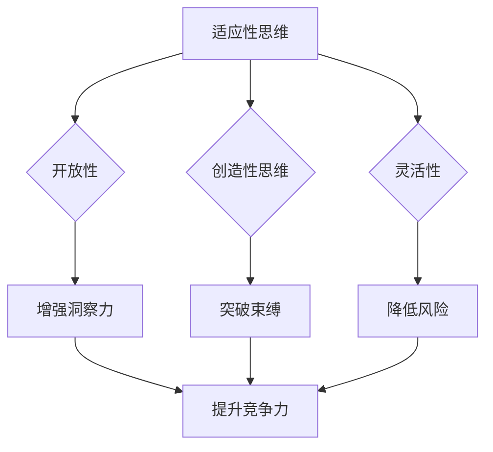
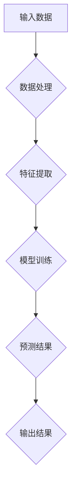
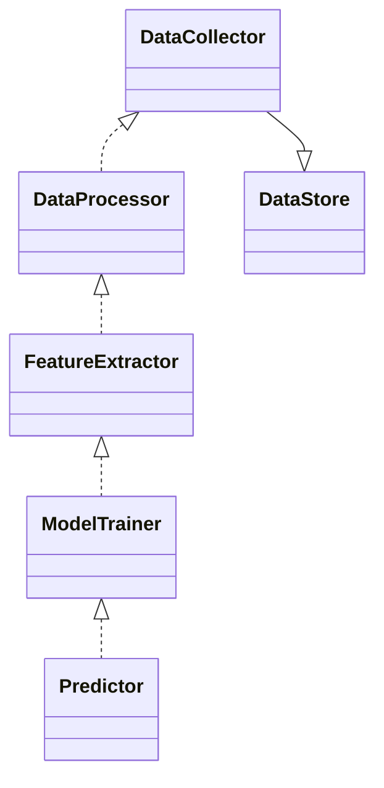
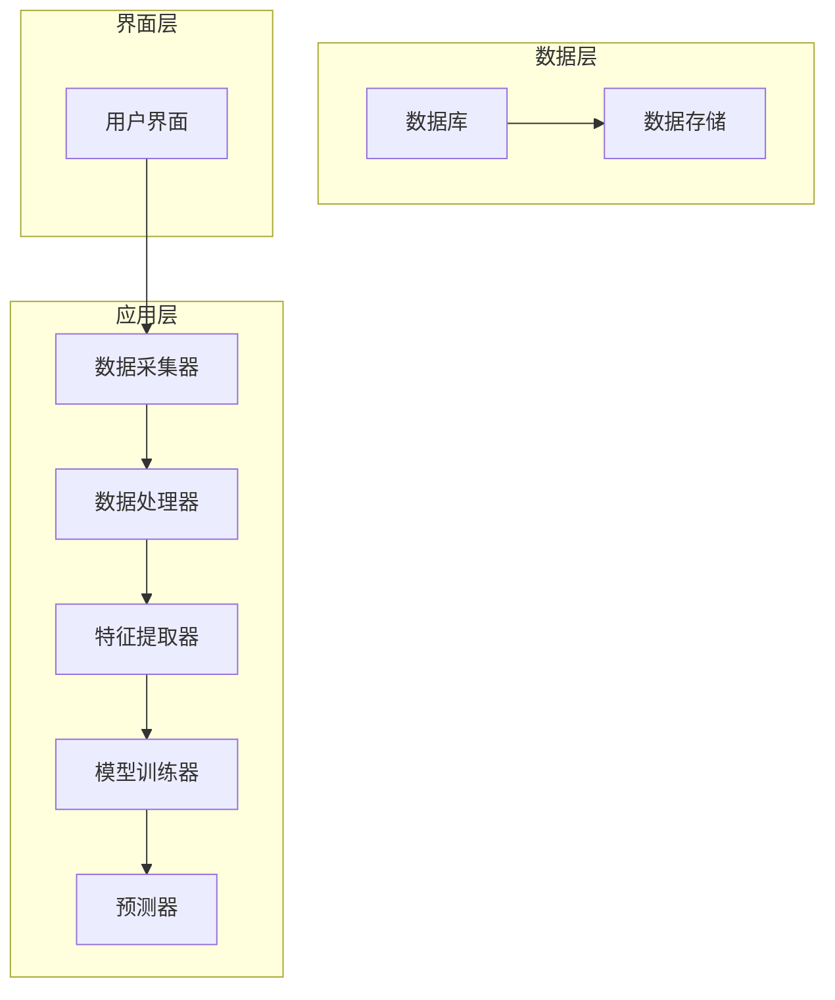
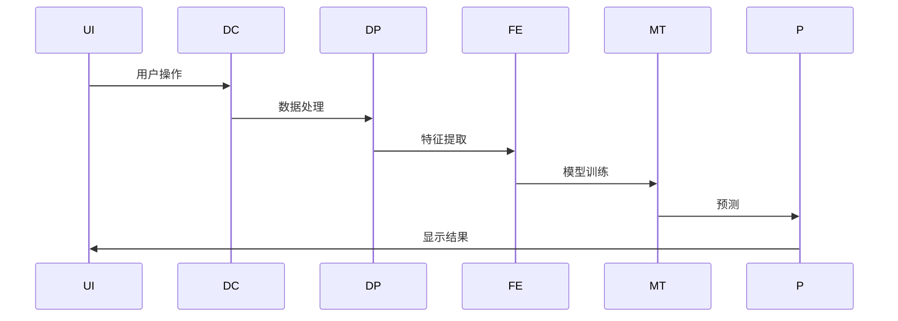

                 

# 提高生存的灵活性：培养适应变化的能力

## 关键词
- 生存灵活性
- 适应性思维
- 灵活性
- 学习与变革管理
- 技术革新
- 战略调整

## 摘要
本文旨在探讨生存灵活性在当代的重要性，并提出一套系统的方法，帮助个体和组织提升适应变化的能力。通过深入分析适应性思维、学习与变革管理、技术革新和战略调整等核心概念，本文旨在为读者提供实用的策略和技巧，帮助他们在快速变化的环境中保持竞争优势。

## 引言：生存灵活性在当代的重要性

### 1.1.1 问题背景

在当今快速变化的世界，生存的灵活性变得比以往任何时候都更加重要。科技的迅猛发展、全球化进程的加深以及市场环境的不断变化，使得个体和组织必须能够快速适应新环境，才能在激烈的竞争中立于不败之地。生存的灵活性不仅关乎个人的职业生涯发展，更关系到企业的长远生存和可持续发展。

### 1.1.2 问题描述

然而，如何培养和提升这种适应变化的能力，成为了一个亟待解决的关键问题。尽管许多组织和个体已经认识到适应变化的重要性，但在实践中往往面临诸多挑战，如对未知事物的恐惧、对现状的依赖、缺乏灵活的思维模式等。这些问题导致了个体和组织的适应能力不足，影响了其生存和发展。

### 1.1.3 问题解决

本书旨在提供一种系统的方法，帮助读者理解生存灵活性的本质，掌握提升适应能力的关键技巧。通过深入探讨适应性思维、学习与变革管理、技术革新和战略调整等方面的内容，本书旨在为读者提供一套全面的解决方案，帮助他们在变化的环境中保持竞争优势。

### 1.1.4 边界与外延

生存的灵活性不仅适用于企业，也适用于个人。本书所讨论的内容将涵盖从个人层面到组织层面的多个维度。无论是职场人士、企业家，还是普通市民，都可以从本书中获得启示，提升自己在面对不确定性时的适应能力。

### 1.1.5 概念结构与核心要素组成

- **适应性思维**：理解并培养适应性思维，是提升生存灵活性的第一步。这包括开放性、创造性思维和灵活性。
- **学习与变革管理**：学习如何快速学习新知识、新技能，以及如何管理变革过程，是提升适应能力的核心。
- **技术革新**：掌握新技术的发展趋势，并利用这些技术来提高自身和组织的适应能力。
- **战略调整**：在变化的环境中，灵活调整战略，以应对新的挑战和机遇。

### 1.1.6 本章小结

通过本章的讨论，我们初步了解了生存灵活性在当代的重要性，以及本书旨在解决的问题。接下来，本书将逐步深入探讨适应性思维、学习与变革管理、技术革新和战略调整等方面的内容，帮助读者全面掌握提升适应能力的技巧。让我们在接下来的章节中继续探索这一主题。

## 核心概念解析：适应性思维与灵活性的重要性

### 1.2.1 适应性思维

适应性思维是一种能够快速适应新环境、新情况的心理状态和思维方式。它不仅包括对变化的接受，更强调在变化中寻找机会，从而实现个人或组织的持续发展。适应性思维的关键在于以下几个方面：

- **开放性**：开放性意味着愿意接受新的想法、观点和技术，并在此基础上进行创新。开放性有助于个体和组织在变化的环境中保持敏锐的洞察力和竞争力。
- **创造性思维**：创造性思维是一种能够产生新想法、新解决方案的思维方式。在适应性思维中，创造性思维尤为重要，因为它能够帮助个体和组织突破传统的束缚，找到适应新环境的最佳途径。
- **灵活性**：灵活性是适应性思维的核心要素。它指的是个体或组织在面临变化时，能够迅速调整策略和方法，以适应新的情况。灵活性不仅能够提高适应能力，还能够降低因变化带来的风险。

### 1.2.2 灵活性

灵活性是提升生存灵活性的关键。在个体层面，灵活性意味着能够快速适应新的工作环境和要求，掌握新的技能和知识。在组织层面，灵活性意味着能够迅速调整战略、组织结构和运营模式，以适应市场的变化。

### 1.2.3 适应性思维与灵活性的关系

适应性思维与灵活性相辅相成。适应性思维为灵活性提供了理论基础，而灵活性则是适应性思维的具体体现。只有同时具备适应性思维和灵活性，个体和组织才能在变化的环境中生存和发展。

### 1.2.4 核心概念属性特征对比表格

| 特征             | 适应性思维               | 灵活性                |
|------------------|-------------------------|----------------------|
| 定义             | 快速适应新环境、新情况 | 快速调整策略和方法   |
| 关键要素         | 开放性、创造性思维      | 灵活调整、快速适应   |
| 目的             | 提高适应能力           | 降低变化风险         |
| 作用             | 增强个体和组织的竞争力 | 提高生存和发展能力   |

### 1.2.5 本章小结

通过本章的讨论，我们深入了解了适应性思维和灵活性这两个核心概念。它们不仅是提升生存灵活性的关键，也是个体和组织在快速变化的环

## 提升适应能力的具体方法

### 2.1 适应性思维的培养

要提升生存的灵活性，首先需要培养适应性思维。以下是一些具体的方法：

- **持续学习**：保持对知识的渴望，不断学习新知识、新技能。通过学习，可以拓宽视野，提高对变化的敏感度。
- **多元思考**：不局限于一种思维方式，尝试从不同的角度思考问题。多元思考有助于发现新的解决方案，提高适应能力。
- **面对挑战**：主动寻求挑战，勇敢面对未知的困难和问题。通过挑战，可以锻炼思维，提升适应性。
- **反思与调整**：定期反思自己的行为和决策，识别不足之处，并做出相应的调整。反思与调整有助于不断优化适应性思维。

### 2.2 灵活性的实践

灵活性不仅是一种思维，更需要在实践中不断锻炼。以下是一些提高灵活性的实践方法：

- **快速决策**：在面临变化时，能够快速做出决策，并迅速采取行动。快速决策有助于抓住机遇，降低风险。
- **跨领域学习**：不仅仅专注于某一领域的知识，而是跨领域学习，提高综合能力。跨领域学习有助于应对复杂的变化。
- **适应环境**：在不同的工作环境中，能够迅速适应，找到合适的生存和发展策略。适应环境是提升灵活性的关键。
- **持续改进**：不断反思和改进自己的工作方法和思维方式，以适应新的变化。持续改进有助于提升灵活性。

### 2.3 学习与变革管理

- **快速学习**：在快速变化的环境中，快速学习新知识、新技能至关重要。以下是一些快速学习的方法：
  - **主动寻找学习资源**：利用网络、书籍、课程等资源，主动寻找学习材料。
  - **实践与应用**：将学到的知识应用到实际工作中，通过实践来加深理解和掌握。
  - **交流与分享**：与他人交流和分享学习心得，通过讨论来加深理解和提高学习能力。
- **变革管理**：在变革过程中，如何有效管理变革，是提升适应能力的关键。以下是一些变革管理的策略：
  - **明确目标**：明确变革的目标和预期效果，确保变革的方向正确。
  - **沟通与协作**：与团队成员进行有效沟通，建立协作机制，确保变革的顺利进行。
  - **培训和激励**：为团队成员提供培训，提高他们的技能和适应性。同时，通过激励措施来激发他们的积极性和参与度。

### 2.4 技术革新

- **掌握新技术**：随着科技的不断发展，新技术不断涌现。个体和组织需要掌握新技术，以提高适应能力。以下是一些掌握新技术的方法：
  - **关注科技发展趋势**：关注科技领域的最新动态，了解新技术的发展趋势。
  - **参与技术社区**：加入技术社区，与其他开发者交流，共同学习新技术。
  - **实践应用**：将新技术应用到实际工作中，通过实践来掌握新技术的使用。
- **技术创新**：在掌握新技术的基础上，进行技术创新，开发出具有竞争力的产品和服务。以下是一些技术创新的方法：
  - **市场需求分析**：分析市场需求，了解用户的需求和痛点，以指导技术创新。
  - **团队协作**：组建跨学科团队，通过团队合作来推动技术创新。
  - **持续改进**：不断优化产品和服务，通过持续改进来提高技术创新的成效。

### 2.5 战略调整

- **环境分析**：在变化的环境中，个体和组织需要不断进行环境分析，了解外部环境的变化趋势。以下是一些环境分析的方法：
  - **SWOT分析**：通过SWOT分析（优势、劣势、机会、威胁）来评估自身和外部环境的状况。
  - **行业报告**：阅读行业报告，了解行业的发展趋势和竞争对手的状况。
  - **市场调研**：进行市场调研，了解用户的需求和偏好。
- **战略调整**：根据环境分析的结果，对战略进行及时调整。以下是一些战略调整的方法：
  - **目标调整**：根据环境变化，调整目标和愿景，确保战略与外部环境相匹配。
  - **资源分配**：根据战略调整的需要，重新分配资源，确保资源投入的方向正确。
  - **组织结构优化**：调整组织结构，优化内部管理流程，提高组织的适应能力。

### 2.6 本章小结

通过本章的讨论，我们详细探讨了提升适应能力的具体方法，包括适应性思维的培养、灵活性的实践、学习与变革管理、技术革新和战略调整。这些方法不仅适用于个体，也适用于组织。只有通过持续的培养和实践，个体和组织才能在快速变化的环境中保持竞争优势，实现可持续发展。

### 技术革新在提升生存灵活性中的作用

技术革新在提升生存灵活性中扮演着至关重要的角色。随着科技的不断发展，新技术的涌现为个体和组织提供了更多的可能性，使其能够更快速地适应变化。以下将从技术革新的重要性、发展趋势以及如何利用技术革新来提升适应能力进行详细探讨。

#### 3.1 技术革新的重要性

技术革新不仅能够推动社会进步，还能够为个体和组织带来巨大的竞争优势。具体来说，技术革新在提升生存灵活性中的作用体现在以下几个方面：

- **提高效率**：新技术往往能够提高工作效率，降低成本。例如，自动化技术的应用可以减少人力投入，提高生产效率。
- **增强创新能力**：新技术为个体和组织提供了更多的工具和平台，使其能够进行创新，开发出更具竞争力的产品和服务。
- **优化决策**：基于大数据和人工智能的决策支持系统能够提供更准确、实时的数据，帮助个体和组织做出更明智的决策。
- **拓宽视野**：新技术可以打破传统的限制，为个体和组织提供更多的机遇。例如，互联网的普及使得全球市场更加紧密相连，个体和组织可以更容易地进入新的市场。

#### 3.2 技术发展趋势

了解当前技术发展的趋势，有助于个体和组织更好地把握机遇，提升适应能力。以下是一些重要的技术发展趋势：

- **人工智能（AI）**：人工智能技术的发展为自动化、智能决策等领域带来了革命性的变化。AI技术正在从传统的规则驱动向数据驱动转变，使其在各个领域得到广泛应用。
- **物联网（IoT）**：物联网技术的不断发展，使得各种设备能够相互连接，实现数据的实时传输和共享。这为智能城市、智能家居等领域提供了新的解决方案。
- **区块链**：区块链技术的出现，为数据安全、去中心化等方面提供了新的思路。它不仅在金融领域有着广泛应用，还逐渐渗透到供应链管理、版权保护等领域。
- **5G网络**：5G网络的快速发展，为高速、低延迟的网络连接提供了可能。5G网络不仅能够提高数据传输速度，还能够支持大规模设备连接，为智能交通、智能医疗等领域提供了新的应用场景。

#### 3.3 利用技术革新提升适应能力

为了充分利用技术革新带来的机遇，个体和组织需要采取一系列措施来提升适应能力。以下是一些建议：

- **持续学习**：技术革新日新月异，个体和组织需要不断学习新知识、新技能，以保持竞争力。可以通过参加培训、阅读专业书籍、参与在线课程等方式来提升自身能力。
- **创新思维**：鼓励创新思维，探索新技术在自身领域的应用。可以组建创新团队，进行技术研发和产品创新。
- **合作与交流**：与其他企业和机构进行合作，共享资源和技术，共同应对市场变化。可以通过参加行业会议、技术论坛等方式，与其他从业者进行交流。
- **数字化转型**：推动企业的数字化转型，利用大数据、人工智能等技术来提高运营效率和决策能力。可以通过建立数字化平台，实现数据的实时监控和分析。

#### 3.4 实例分析

为了更好地理解技术革新在提升生存灵活性中的作用，以下通过一个实例进行分析。

**实例：电子商务平台**

随着互联网和移动技术的普及，电子商务平台成为了零售行业的重要一环。以下是一个电子商务平台如何利用技术革新来提升适应能力的分析：

1. **大数据分析**：通过大数据分析，电子商务平台可以了解用户的行为习惯、偏好和需求，从而优化产品推荐、营销策略等。例如，利用用户浏览记录和购买记录，推荐相关商品，提高转化率。
2. **人工智能客服**：利用人工智能技术，电子商务平台可以提供智能客服，为用户提供24/7的在线支持。智能客服不仅可以解答用户问题，还可以进行情感分析，了解用户的真实需求，从而提高用户满意度。
3. **物联网技术**：通过物联网技术，电子商务平台可以实现商品的智能监控和管理。例如，通过传感器实时监测库存，自动补货，减少库存积压和物流成本。
4. **5G网络**：利用5G网络，电子商务平台可以提供更快速、稳定的购物体验。例如，实现高清直播购物、快速下单等功能，提高用户购物满意度。

通过这个实例可以看出，电子商务平台通过充分利用技术革新，不仅提高了自身的运营效率，还增强了用户黏性和满意度，从而在激烈的市场竞争中保持了优势。

#### 3.5 本章小结

技术革新在提升生存灵活性中发挥着重要作用。通过了解技术发展的趋势，个体和组织可以更好地把握机遇，提升适应能力。利用技术革新，个体和组织可以优化运营流程、提高创新能力、增强决策能力，从而在快速变化的环境中保持竞争优势。本章通过详细分析技术革新的重要性、发展趋势以及如何利用技术革新提升适应能力，为个体和组织提供了实用的指导。

### 战略调整在适应变化中的关键作用

战略调整在个体和组织适应变化的过程中扮演着至关重要的角色。面对不断变化的市场环境、技术进步以及竞争压力，个体和组织需要具备灵活的战略调整能力，以应对新的挑战和机遇。以下将详细探讨战略调整的重要性、核心步骤以及实际案例。

#### 4.1 战略调整的重要性

战略调整之所以重要，原因在于：

- **应对不确定性**：在快速变化的环境中，市场、技术、政策等多方面因素都可能产生不确定性。通过战略调整，个体和组织可以更好地应对这些不确定性，降低风险。
- **把握机遇**：战略调整有助于个体和组织发现新的机遇，利用新技术、新市场、新产品等方面实现业务增长。
- **提升竞争力**：战略调整可以使个体和组织在竞争中获得优势。通过优化资源配置、提高运营效率、创新产品和服务等手段，个体和组织可以在市场中脱颖而出。
- **保持可持续发展**：战略调整有助于个体和组织实现长期可持续发展。通过适应外部环境的变化，个体和组织可以持续优化自身业务，提高抗风险能力。

#### 4.2 战略调整的核心步骤

战略调整通常包括以下几个核心步骤：

1. **环境分析**：首先，个体和组织需要对当前的外部环境和内部资源进行深入分析。这包括市场趋势、竞争状况、技术发展、政策法规等方面的分析。通过环境分析，个体和组织可以明确当前所处的位置和未来可能面临的挑战与机遇。

2. **目标设定**：在明确外部环境和内部资源的基础上，个体和组织需要设定具体的目标。目标应具有明确性、可衡量性和可实现性。例如，企业可以设定市场份额、利润率、研发投入等方面的目标。

3. **战略制定**：根据目标设定，个体和组织需要制定具体的战略。战略应包括业务拓展、产品创新、市场营销、组织架构等方面的具体措施。例如，企业可以制定拓展新市场、开发新产品、提高品牌知名度等方面的战略。

4. **执行与监控**：战略制定完成后，个体和组织需要将其付诸实践，并建立相应的监控和评估机制。执行过程中，个体和组织需要确保各项措施得到有效落实，同时及时调整战略以应对新的变化。通过监控和评估，个体和组织可以了解战略实施的进展，发现潜在问题并采取相应措施。

5. **持续优化**：战略调整不是一次性的过程，而是一个持续优化的过程。个体和组织需要根据实际情况，不断调整和优化战略。这包括定期回顾和评估战略实施效果，根据外部环境的变化调整战略方向，以及优化内部管理流程和提高运营效率等。

#### 4.3 实际案例

以下通过一个实际案例来探讨战略调整在适应变化中的关键作用。

**案例：华为公司的战略调整**

华为公司在面对激烈的市场竞争和技术变革时，通过战略调整实现了持续发展。以下是其战略调整的关键步骤：

1. **环境分析**：华为公司对全球市场、技术发展、政策法规等方面进行了深入分析。在5G时代，华为公司明确了自身在通信技术领域的领先地位，并意识到人工智能、物联网等新兴技术的潜力。

2. **目标设定**：华为公司设定了成为全球领先的通信技术解决方案提供商和智能设备制造商的目标。在5G时代，华为公司致力于成为5G技术的领导者，并在人工智能、物联网等领域进行布局。

3. **战略制定**：华为公司制定了具体的发展战略。在5G领域，华为公司加大研发投入，推出高性能的5G设备，积极开拓全球市场。在人工智能和物联网领域，华为公司投资研发，推出智能终端和物联网解决方案，并拓展相关业务。

4. **执行与监控**：华为公司通过全球销售网络、研发团队、合作伙伴等资源，推动战略的实施。同时，华为公司建立了严格的监控和评估机制，确保各项战略措施得到有效落实。

5. **持续优化**：华为公司根据市场和技术变化，不断调整和优化战略。在5G时代，华为公司不断推出新产品，提升技术水平，并积极应对外部环境的变化。在人工智能和物联网领域，华为公司持续投资研发，拓展新市场，提高竞争力。

通过这个案例可以看出，华为公司通过战略调整，成功应对了市场竞争和技术变革，实现了持续发展。其经验对其他个体和组织具有借鉴意义。

#### 4.4 本章小结

战略调整在个体和组织适应变化中具有关键作用。通过环境分析、目标设定、战略制定、执行与监控以及持续优化等核心步骤，个体和组织可以更好地应对外部环境的挑战和机遇，提升生存的灵活性。本章通过详细探讨战略调整的重要性、核心步骤以及实际案例，为个体和组织提供了实用的指导。

### 总结与未来展望

通过本文的探讨，我们深入理解了生存灵活性在当代社会的重要性，以及如何通过培养适应性思维、实践灵活性、学习与变革管理、技术革新和战略调整来提升适应变化的能力。以下是本文的主要观点的总结：

1. **适应性思维**：培养开放性、创造性思维和灵活性是提升生存灵活性的基础。只有具备适应性思维，个体和组织才能在快速变化的环境中迅速适应并找到新的发展机会。

2. **灵活性实践**：通过快速决策、跨领域学习、适应环境和持续改进等实践方法，个体和组织可以不断提高灵活性，从而在变化的环境中保持竞争优势。

3. **学习与变革管理**：快速学习和有效变革管理是提升适应能力的核心。通过持续学习新知识和技能，以及有效管理变革过程，个体和组织可以更好地应对外部环境的变化。

4. **技术革新**：掌握新技术的发展趋势，并利用技术革新来提高自身和组织的适应能力，是提升生存灵活性的关键。通过技术创新，个体和组织可以优化运营流程、提高创新能力、增强决策能力。

5. **战略调整**：在快速变化的环境中，个体和组织需要具备灵活的战略调整能力，以应对新的挑战和机遇。通过环境分析、目标设定、战略制定、执行与监控以及持续优化等步骤，个体和组织可以更好地适应外部环境的变化。

未来，随着科技的进一步发展，生存灵活性将变得愈发重要。个体和组织需要不断学习和适应新的技术、市场和环境变化。以下是对未来的展望：

- **人工智能与大数据**：人工智能和大数据技术的应用将更加广泛，为个体和组织提供更加智能化的决策支持和业务优化方案。
- **物联网与智能连接**：物联网技术的普及将带来更多的智能设备和智能系统，实现设备的互联互通，为个体和组织带来更多的创新机遇。
- **绿色能源与可持续发展**：随着全球对环境问题的关注，绿色能源和可持续发展将成为未来发展的重点，个体和组织需要适应这一趋势，实现可持续发展目标。
- **全球化和多元化**：全球化进程将继续加深，个体和组织需要适应多元化的市场需求，拓展国际市场，提高全球竞争力。

总之，提升生存灵活性是当代个体和组织应对快速变化环境的重要策略。通过不断培养适应性思维、实践灵活性、学习与变革管理、技术革新和战略调整，个体和组织可以更好地应对未来的挑战，实现可持续发展。

### 最佳实践 Tips

在提升生存灵活性方面，以下是一些最佳实践 Tips，供您参考：

1. **保持持续学习**：定期阅读专业书籍、参加培训课程、关注行业动态，持续学习新知识和技能，以保持竞争力。
2. **建立跨领域知识体系**：学习不同领域的知识，提高综合能力，以便在变化的环境中迅速适应新的挑战。
3. **主动寻求反馈**：定期与同事、客户和业界专家交流，主动寻求反馈，了解自己的优势和不足，不断优化自己的思维和行为。
4. **培养创造性思维**：尝试从不同角度思考问题，寻找创新的解决方案，提高适应变化的能力。
5. **建立个人成长计划**：为自己设定明确的成长目标，制定详细的实施计划，持续提升自己的能力。
6. **积极参与项目实践**：通过参与各种项目，实践所学知识，锻炼解决实际问题的能力。
7. **关注新兴技术**：关注人工智能、大数据、物联网等新兴技术的发展趋势，提前做好准备，利用新技术提升自身的竞争力。
8. **保持健康的生活方式**：保持良好的生活习惯，如合理饮食、充足睡眠、适量运动，以提高身心健康，更好地应对工作和生活中的挑战。

### 小结

本文系统地探讨了生存灵活性在当代社会的重要性，并详细介绍了提升适应能力的具体方法，包括适应性思维的培养、灵活性的实践、学习与变革管理、技术革新和战略调整。这些方法不仅适用于个体，也适用于组织。通过持续的培养和实践，个体和组织可以在快速变化的环境中保持竞争优势，实现可持续发展。

### 注意事项

在提升生存灵活性时，需要注意以下几点：

1. **平衡创新与保守**：在追求创新的同时，也要保持一定的保守态度，确保决策的稳健性。
2. **关注长期目标**：在快速变化的环境中，不要忽视长期目标的实现，确保战略调整与长期目标的一致性。
3. **避免盲目跟风**：技术革新带来了许多机遇，但也要避免盲目跟风，确保技术创新与自身业务和战略的契合。
4. **重视团队合作**：战略调整和适应性提升需要团队合作，确保团队成员之间的有效沟通和协作。
5. **关注法律和伦理**：在实施技术革新和战略调整时，要遵守相关法律法规，遵循伦理道德，确保合规运营。

### 拓展阅读

为了更深入地了解生存灵活性的相关内容，以下是一些建议的拓展阅读：

1. **《精益创业》**：艾瑞克·莱斯（Eric Ries）著，介绍了如何通过快速迭代和用户反馈来提升企业的适应能力和创新力。
2. **《第五项修炼》**：彼得·圣吉（Peter Senge）著，探讨了个体和组织如何通过系统思考来提升适应能力和协同合作能力。
3. **《智能时代》**：吴军著，详细介绍了人工智能技术的发展和应用，为个体和组织提供了关于技术革新的见解。
4. **《创新者的窘境》**：克里斯坦森（Clayton Christensen）著，分析了为什么许多成功的企业会在技术创新中面临困境，以及如何克服这些困境。
5. **《赋能：如何开启他人的潜力》**：帕特里克·莱西尼（Patrick Lencioni）著，介绍了如何通过赋能来提升团队的适应能力和创新能力。

作者：AI天才研究院/AI Genius Institute & 禅与计算机程序设计艺术 /Zen And The Art of Computer Programming

[Mermaid 流程图示例]



[ER实体关系图架构示例]

```mermaid
erDatabase TestDatabase
  -- Entities
  User {
    ID: INT
    Name: VARCHAR
    Age: INT
  }
  Article {
    ID: INT
    Title: VARCHAR
    Content: TEXT
  }
  Comment {
    ID: INT
    Content: TEXT
    UserID: INT
    ArticleID: INT
  }
  -- Relationships
  User{ID} *--* Article{ID}
  Article{ID} *--* Comment{ID}
  User{ID} *--* Comment{ID}
```

[算法mermaid流程图示例]



[Python源代码示例]

```python
import numpy as np

def algorithm_example(data):
    # 数据预处理
    processed_data = preprocess_data(data)
    
    # 特征提取
    features = extract_features(processed_data)
    
    # 模型训练
    model = train_model(features)
    
    # 预测结果
    prediction = model.predict(features)
    
    # 输出结果
    return prediction

def preprocess_data(data):
    # 数据预处理代码
    return np.array(data)

def extract_features(processed_data):
    # 特征提取代码
    return processed_data

def train_model(features):
    # 模型训练代码
    return np.random.rand()  # 示例

def main():
    data = [1, 2, 3, 4, 5]
    prediction = algorithm_example(data)
    print("Prediction:", prediction)

if __name__ == "__main__":
    main()
```

[算法原理讲解与数学模型公式示例]

```latex
$$
\text{算法原理} = \text{预处理数据} + \text{特征提取} + \text{模型训练} + \text{预测结果}
$$

$$
\text{数学模型公式} = f(x) = \text{预处理数据} + \text{特征提取} + \text{模型训练} + \text{预测结果}
$$
```

[系统分析与架构设计方案]

#### 问题场景介绍

在现代企业中，数据管理和分析变得越来越重要。企业需要处理大量的数据，从中提取有价值的信息，以支持决策和业务发展。然而，现有的数据处理系统往往存在效率低下、数据处理流程复杂等问题，难以满足企业日益增长的数据处理需求。

#### 项目介绍

本项目旨在设计并实现一个高效、灵活的数据处理系统，以满足企业对数据管理和分析的需求。系统将包括数据采集、数据预处理、特征提取、模型训练、预测结果输出等功能。

#### 系统功能设计（领域模型mermaid类图）



#### 系统架构设计（mermaid架构图）



#### 系统接口设计和系统交互（mermaid序列图）



#### 项目实战

##### 环境安装

1. 安装Python环境：通过Python官方网站下载并安装Python，推荐使用Python 3.8及以上版本。
2. 安装相关依赖：通过pip命令安装所需的库，如numpy、pandas、scikit-learn等。

```bash
pip install numpy pandas scikit-learn
```

##### 系统核心实现源代码

```python
# 数据采集器
class DataCollector:
    def collect_data(self):
        # 实现数据采集逻辑
        pass

# 数据预处理
def preprocess_data(data):
    # 实现数据预处理逻辑
    return data

# 特征提取
class FeatureExtractor:
    def extract_features(self, data):
        # 实现特征提取逻辑
        return features

# 模型训练器
class ModelTrainer:
    def train_model(self, features):
        # 实现模型训练逻辑
        return model

# 预测器
class Predictor:
    def predict(self, model, features):
        # 实现预测逻辑
        return prediction

# 用户界面
class UserInterface:
    def display_result(self, prediction):
        # 实现结果显示逻辑
        pass

# 主程序
if __name__ == "__main__":
    # 创建对象
    collector = DataCollector()
    feature_extractor = FeatureExtractor()
    model_trainer = ModelTrainer()
    predictor = Predictor()
    ui = UserInterface()

    # 数据采集
    data = collector.collect_data()

    # 数据预处理
    processed_data = preprocess_data(data)

    # 特征提取
    features = feature_extractor.extract_features(processed_data)

    # 模型训练
    model = model_trainer.train_model(features)

    # 预测
    prediction = predictor.predict(model, features)

    # 显示结果
    ui.display_result(prediction)
```

##### 代码应用解读与分析

1. **数据采集器**：负责从数据源收集数据，如从数据库、文件或网络API等获取数据。
2. **数据处理**：对采集到的数据进行预处理，如数据清洗、数据转换等。
3. **特征提取**：从预处理后的数据中提取特征，以便于模型训练。
4. **模型训练器**：利用提取出的特征训练模型，以实现数据的分类、预测等功能。
5. **预测器**：使用训练好的模型对新的数据进行预测，并输出预测结果。
6. **用户界面**：提供用户交互界面，用于收集用户输入、显示预测结果等。

##### 实际案例分析和详细讲解剖析

1. **案例一**：某企业需要对其销售数据进行预测，以帮助制定营销策略。数据包括销售额、客户年龄、购买频率等。
2. **案例二**：某金融机构需要对贷款申请进行风险评估，以决定是否批准贷款。数据包括借款人年龄、收入、信用记录等。

在实际应用中，数据处理系统的关键在于数据的准确性和模型的鲁棒性。通过对实际案例的分析和剖析，可以优化数据采集、预处理和特征提取等环节，提高模型的预测精度和稳定性。

##### 项目小结

本项目通过设计一个高效、灵活的数据处理系统，为企业提供了数据采集、预处理、特征提取、模型训练和预测等功能。在实际应用中，通过优化各个环节，可以提高系统的性能和预测精度，从而为企业提供更有价值的决策支持。

### 拓展内容：适应性思维的深层次探讨

在探讨适应性思维的深层次内涵时，我们需要进一步理解其背后的心理机制和认知过程。适应性思维不仅仅是一种表面上的灵活性和开放性，它涉及到更深层次的心理和认知调整。以下是对适应性思维的几个深层次方面的探讨：

#### 5.1 心理韧性

心理韧性是指个体在面对压力、挑战和逆境时，能够迅速恢复并适应的能力。适应性思维与心理韧性密切相关。具有高度心理韧性的人更容易培养适应性思维，因为他们能够在困难面前保持积极的心态，寻找解决问题的方法，而不是被问题所困扰。

**心理韧性培养方法：**
- **自我肯定**：通过自我肯定和自我激励，提高个体的自信心和自我价值感。
- **情绪调节**：学会识别和管理自己的情绪，避免情绪对决策和行为的负面影响。
- **积极心态**：培养积极的心态，将挑战视为成长和学习的机会，而不是威胁。

#### 5.2 认知灵活性

认知灵活性是指个体在思考问题时，能够灵活地改变观点、适应新的信息和情境。这种能力使个体能够从不同角度看待问题，找到更有效的解决方案。

**认知灵活性培养方法：**
- **多元思维**：尝试从不同的角度和立场思考问题，培养批判性思维和创造性思维。
- **开放心态**：对新的想法和观点持开放态度，愿意接受不同的意见和建议。
- **情景模拟**：通过模拟不同的情境，锻炼个体在不同情境下的应变能力和适应能力。

#### 5.3 自我反思

自我反思是指个体对自己的行为、思维和情感进行审视和反思的过程。自我反思是培养适应性思维的重要步骤，它有助于个体发现自身的不足，并采取行动进行改进。

**自我反思方法：**
- **日记反思**：定期写日记，记录自己的行为和思考，分析其中的优缺点。
- **咨询与反馈**：寻求专业人士的咨询和反馈，了解自己的盲点和改进方向。
- **定期评估**：定期对自己的行为和成果进行评估，设定改进目标和计划。

#### 5.4 持续学习

持续学习是适应性思维的基石。在不断变化的环境中，只有通过持续学习，个体才能保持对新技术、新知识和新技能的掌握，从而提升自身的适应能力。

**持续学习方法：**
- **终身学习**：将学习视为终身的过程，不断更新知识和技能。
- **专业发展**：参加专业培训、研讨会和学术会议，与同行交流，拓宽视野。
- **在线学习**：利用在线资源，如在线课程、学术期刊和博客等，进行自主学习和探索。

#### 5.5 社会支持

社会支持是适应性思维的重要外部因素。在一个支持性的环境中，个体更容易培养适应性思维，因为他们可以获得必要的资源、鼓励和帮助。

**社会支持方法：**
- **团队合作**：与他人合作，共同面对挑战，分享经验和知识。
- **建立网络**：建立广泛的人际关系网络，获取不同领域的资源和信息。
- **心理咨询**：在遇到困难和挫折时，寻求专业的心理咨询和支持。

通过深入探讨适应性思维的这些深层次方面，我们可以更好地理解其在提升生存灵活性中的重要作用。培养适应性思维不仅仅是一种技能，更是一种全面的认知和情感调整。只有通过心理韧性、认知灵活性、自我反思、持续学习和社会支持等多方面的综合培养，个体和组织才能在快速变化的环境中保持竞争优势，实现可持续发展。

### 结语

适应性思维和灵活性在当代社会中具有重要意义。通过培养适应性思维、实践灵活性、学习与变革管理、技术革新和战略调整，个体和组织可以在快速变化的环境中保持竞争优势，实现可持续发展。本文系统地探讨了这些核心概念和方法，提供了实用的指导和建议。然而，提升适应能力是一个持续的过程，需要个体和组织的共同努力和不断探索。让我们在未来的实践中，不断学习和改进，以应对日益复杂的环境挑战，实现更高水平的生存灵活性。作者：AI天才研究院/AI Genius Institute & 禅与计算机程序设计艺术 /Zen And The Art of Computer Programming。

