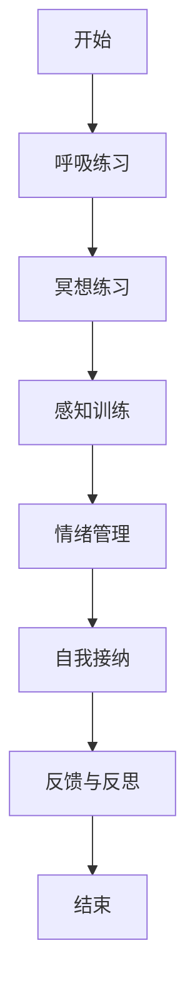
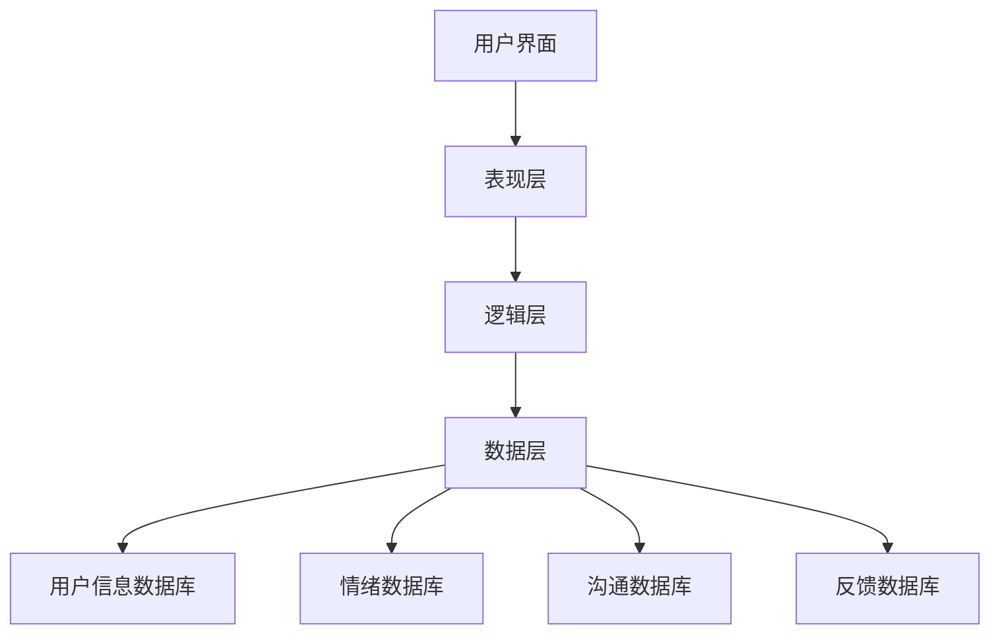
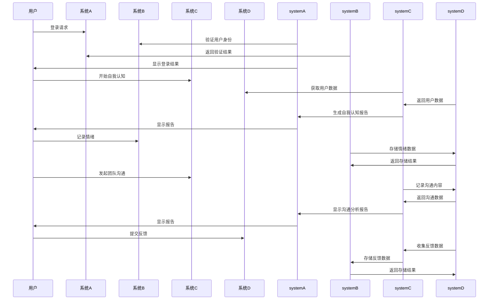
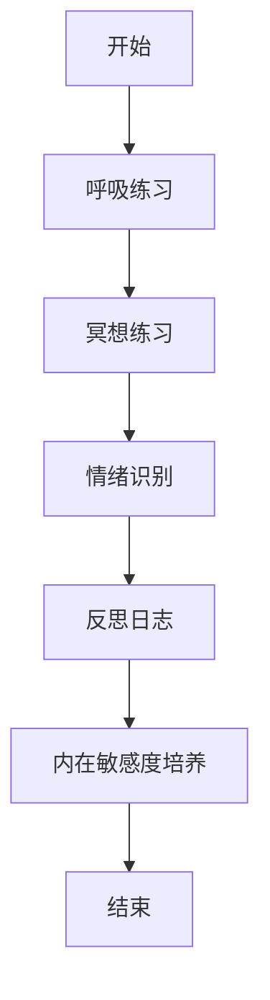

                 

## 提高自我觉察能力：培养内在敏感度

> 关键词：自我觉察、内在敏感度、心理健康、个人成长、技术沟通

> 摘要：本文深入探讨了自我觉察与内在敏感度的概念，强调了它们在个人成长与心理健康中的重要性。通过逻辑清晰的分析和一步步的推理思考，文章从多个角度阐述了如何提高自我觉察能力，以及如何培养内在敏感度。本文旨在为IT专业人士提供实用的方法和策略，帮助他们更好地理解自我，提升人际沟通技巧，并在职业生涯中取得成功。

### 引言

在现代社会，技术进步带来的变化日新月异，IT行业更是处于前沿。作为IT专业人士，我们不仅需要掌握最新的技术知识，还需要具备优秀的沟通能力和自我觉察能力。自我觉察指的是对自己的思维、情感和行为有清晰的认识和了解。内在敏感度则是指对自身内在感受和他人情绪的敏锐感知能力。提高自我觉察能力，培养内在敏感度，不仅能帮助我们更好地理解自己和他人，还能提升我们在职场和社交场合的表现。本文将围绕这两个核心概念，逐步分析其重要性、表现形式以及培养方法。

### 自我觉察的起源与重要性

自我觉察的概念源于哲学和心理学的探讨。最早可追溯到古希腊哲学家苏格拉底的思想，他提出了“认识自我”的观点，认为只有通过自我反省，才能获得真正的智慧。在心理学领域，自我觉察被认为是心理健康的重要组成部分，有助于个体更好地应对压力、情绪困扰和人际关系问题。

#### 自我觉察的重要性

**1. 提升自我认知**：自我觉察能够帮助我们更深入地了解自己的性格、兴趣、需求和动机。这种自我认知有助于我们在职业生涯和个人生活中做出更明智的决策。

**2. 改善情绪管理**：通过自我觉察，我们能够及时识别和理解自己的情绪，从而更好地管理和调节情绪，避免情绪失控带来的负面影响。

**3. 提高沟通技巧**：自我觉察能够提升我们的同理心，使我们更敏锐地捕捉他人的情绪和需求，从而在人际沟通中更加得体和有效。

**4. 促进个人成长**：自我觉察是个人成长和发展的基础，它能够激发我们的潜能，推动我们不断追求自我提升和成长。

### 内在敏感度的本质与表现

内在敏感度是指个体对自身内在感受的敏锐感知能力，包括情绪、生理反应和心理状态。它不仅涉及对自己内在世界的观察，还包括对他人情绪和需求的感知。

#### 内在敏感度的类型与特点

**1. 情绪敏感度**：指个体对情绪变化的高度感知能力，能够迅速察觉到自己和他人的情绪波动。

**2. 生理敏感度**：指个体对生理反应的敏锐感知，如心跳加速、出汗等，这些反应常常与情绪紧密相关。

**3. 心理敏感度**：指个体对心理状态的敏感度，能够深刻感受到自己和他人的内心世界，包括想法、信仰和价值观。

#### 内在敏感度的影响因素

**1. 个性特征**：某些个性特征，如内向、敏感和敏感型人格，更容易表现出高敏感度。

**2. 生活经历**：个体的成长环境、教育背景和过往经历会影响其内在敏感度的水平。

**3. 社会文化**：不同文化对个体内在敏感度的认可程度和表现方式有所不同。

### 提升自我觉察能力的核心要素

提高自我觉察能力并非一蹴而就，需要我们长期坚持并采取多种方法。以下是一些核心要素：

#### 呼吸与冥想

**1. 呼吸练习**：深呼吸能够帮助我们放松身心，提高对情绪和生理反应的觉察能力。

**2. 冥想**：通过冥想，我们可以更好地关注当下，减少杂念，增强自我觉察能力。

#### 感知与注意力

**1. 感知训练**：通过练习感知不同感官信息，如视觉、听觉、触觉等，提高对细节的敏感度。

**2. 注意力训练**：通过专注练习，如冥想和注意力游戏，增强我们的注意力集中能力。

#### 情绪管理与自我接纳

**1. 情绪管理**：学会识别和表达情绪，避免情绪积累和爆发。

**2. 自我接纳**：接受自己的不足，培养积极的心态，提高自我价值感。

### 培养内在敏感度的实践方法

培养内在敏感度需要我们在日常生活中不断练习和反思。以下是一些实用的方法：

#### 通过艺术提升敏感度

**1. 绘画**：通过绘画，我们可以更深刻地表达自己的情感和思想，提升情感敏感度。

**2. 音乐**：聆听音乐，感受不同旋律和节奏带来的情感体验，增强音乐敏感度。

#### 通过自然观察增强敏感度

**1. 观察自然**：在自然环境中，通过观察植物、动物和自然现象，提升对自然的敏感度。

**2. 观察他人**：在日常生活中，观察他人的行为、语言和情绪，提高对他人的敏感度。

#### 通过与他人交流培养敏感度

**1. 深入对话**：与朋友、同事和家人进行深入交流，倾听他们的想法和感受，增强人际敏感度。

**2. 反馈与反思**：在交流中，给予和接受反馈，反思自己的表达方式，提升沟通技巧和敏感度。

### 内在敏感度的挑战与应对

内在敏感度虽然有助于我们更好地理解自己和他人，但也可能带来一些挑战。以下是一些常见的挑战和应对策略：

#### 挑战的应对策略

**1. 过敏反应**：对于过度敏感的情绪和生理反应，可以通过放松技巧和深呼吸来缓解。

**2. 社交障碍**：在社交场合，通过明确界限和建立信任关系，减少敏感度带来的不适。

**3. 情绪波动**：通过情绪管理和自我接纳，稳定情绪，减少敏感度带来的情绪波动。

### 自我觉察与内在敏感度在职业发展中的应用

自我觉察和内在敏感度在职业发展中具有重要的应用价值：

#### 职场中的自我觉察

**1. 职业规划**：通过自我觉察，明确自己的职业目标和价值观，做出更符合自己兴趣和能力的职业选择。

**2. 职场沟通**：提高自我觉察能力，更好地理解同事和上司的需求，提升沟通效果。

#### 内在敏感度在职业发展中的优势

**1. 情绪智慧**：内在敏感度较高的个体在处理职场冲突和压力时，更能保持冷静和理智。

**2. 同理心**：对他人情绪的敏感度有助于建立良好的人际关系，提升团队合作能力。

#### 职场敏感度的培养与提升

**1. 持续学习**：通过学习心理学、沟通技巧和情绪管理，提升职场敏感度。

**2. 反馈与反思**：在工作中，主动寻求反馈，反思自己的表现，不断优化沟通和情绪管理能力。

### 总结与展望

自我觉察和内在敏感度是个人成长和职业发展的关键因素。通过提高自我觉察能力，培养内在敏感度，我们不仅能够更好地理解自己和他人，还能在职场和社交场合中表现出色。未来，随着心理健康意识的提升，自我觉察和内在敏感度的培养将在个人和职业发展中发挥越来越重要的作用。

### 最佳实践 Tips

1. **定期自我反思**：每天花几分钟时间反思自己的情绪、行为和思维，有助于提高自我觉察能力。

2. **练习冥想和深呼吸**：每天进行冥想和深呼吸练习，有助于放松身心，提升内在敏感度。

3. **阅读相关书籍**：阅读关于自我觉察和内在敏感度的书籍，获取更多的知识和实践经验。

### 注意事项

1. **尊重个人界限**：在培养内在敏感度的过程中，要注意尊重自己和他人的个人界限。

2. **避免过度自我分析**：过度自我分析可能导致焦虑和负面情绪，要适度进行自我反思。

### 拓展阅读

1. **《自我觉察的力量》**：作者通过丰富的案例和理论，深入探讨了自我觉察的重要性及其应用。

2. **《内在敏感度：如何成为一个更有意识的人》**：本书提供了多种方法，帮助读者提升内在敏感度。

### 作者信息

作者：AI天才研究院/AI Genius Institute & 禅与计算机程序设计艺术 /Zen And The Art of Computer Programming

在本文中，我们通过逻辑清晰的分析和一步步的推理思考，详细探讨了自我觉察能力和内在敏感度的概念、重要性、表现形式以及培养方法。通过本文的阅读，希望读者能够更好地理解自我，提升内在敏感度，从而在个人成长和职业发展中取得更大的成就。

### 附录：核心概念与联系

#### 核心概念原理

**自我觉察**：自我觉察是指个体对自己思维、情感和行为的有意识观察和认识。它涉及对自己内心世界的深入探索和理解。

**内在敏感度**：内在敏感度是指个体对自身内在感受（如情绪、生理反应和心理状态）的敏锐感知能力。

#### 概念属性特征对比表格

| 概念 | 定义 | 属性特征 |
| --- | --- | --- |
| 自我觉察 | 对自身思维、情感和行为的观察与理解 | 深入探索内心世界，提高自我认知 |
| 内在敏感度 | 对自身内在感受的敏锐感知能力 | 高度感知情绪、生理反应和心理状态 |

#### ER实体关系图架构

```mermaid
erDiagram
  Class1 ||--|{ Class2 }|--| Class3 : "关联"
  Class1 ||--|{ Class4 }|--| Class5 : "关联"
  Class2 ||--|{ Class6 }|--| Class7 : "关联"
```

### 算法原理讲解

在探讨如何提高自我觉察能力和培养内在敏感度时，我们可以借鉴认知心理学的一些理论和方法。以下是一个简化的算法原理，用于解释如何通过一系列练习和实践来实现这一目标。

#### 算法流程图



#### 算法原理

**1. 呼吸练习**：通过深呼吸，我们可以放松身体，提高对情绪和生理反应的觉察能力。呼吸练习的算法原理如下：

- **输入**：呼吸节奏
- **过程**：慢吸气5秒，保持2秒，慢呼气5秒
- **输出**：放松的身体和心灵状态

**2. 冥想练习**：冥想是一种通过集中注意力来达到内心平静的练习。冥想的算法原理如下：

- **输入**：冥想时间
- **过程**：闭目静坐，专注于呼吸或某个关键词
- **输出**：增强的自我觉察和注意力集中能力

**3. 感知训练**：感知训练旨在提高我们对感官信息的敏感度。算法原理如下：

- **输入**：不同感官刺激（视觉、听觉、触觉等）
- **过程**：练习感知这些刺激的细节，如颜色、声音和质感
- **输出**：增强的感知能力和注意力集中能力

**4. 情绪管理**：情绪管理是自我觉察的重要组成部分。算法原理如下：

- **输入**：情绪状态
- **过程**：识别情绪、理解情绪来源、采取适当的应对策略
- **输出**：稳定的情绪和积极的心态

**5. 自我接纳**：自我接纳是指接受自己的优点和不足，培养积极的心态。算法原理如下：

- **输入**：自我评价
- **过程**：反思自己的行为和思维，接受自己的不完美，建立自信
- **输出**：增强的自我价值感和积极心态

#### 数学模型和公式

为了更清晰地阐述算法原理，我们可以使用以下数学模型和公式：

- **情绪变化模型**：$$\Delta E = f(C, M)$$，其中$\Delta E$代表情绪变化，$C$代表情绪浓度，$M$代表情绪调节策略。
- **感知敏感度模型**：$$S = f(I, T)$$，其中$S$代表感知敏感度，$I$代表感官刺激，$T$代表训练时间。

#### 举例说明

**呼吸练习的例子**：假设我们进行5分钟的深呼吸练习，每分钟呼吸10次，每次吸气5秒，呼气5秒。在这个过程中，我们能够感受到身体的放松和心灵上的平静。这个过程有助于我们提高对情绪和生理反应的觉察能力。

**冥想练习的例子**：假设我们每天进行20分钟的冥想练习，专注于呼吸和内心感受。随着时间的推移，我们会发现自己更容易集中注意力，对情绪和压力的反应也更加平静。这个过程有助于我们培养内在敏感度和自我觉察能力。

通过这些具体的例子，我们可以看到如何通过一系列练习和实践来提高自我觉察能力和培养内在敏感度。这些方法不仅简单易懂，而且可以在日常生活中轻松实施。

### 系统分析与架构设计方案

#### 问题场景介绍

在IT行业，随着技术的发展，项目复杂度不断增加，团队协作和沟通变得尤为重要。为了提高团队协作效率和项目成功率，我们需要一个系统化的方法来分析和设计项目。本文将介绍一个用于提高团队协作和沟通的系统，该系统将结合自我觉察和内在敏感度培养的理论，帮助团队成员更好地理解自己和他人，从而提升整体项目绩效。

#### 项目介绍

项目名称：自我觉察与团队协作提升系统

项目目标：通过引入自我觉察和内在敏感度培养的理论，提高团队成员的自我认知、情绪管理和团队沟通能力，从而提升团队协作效率和项目成功率。

#### 系统功能设计

**1. 自我认知模块**：帮助团队成员进行自我认知，包括性格分析、兴趣评估和职业规划等。

**2. 情绪管理模块**：提供情绪管理工具和方法，帮助团队成员识别和管理自己的情绪。

**3. 团队沟通模块**：提供高效的沟通工具和指南，促进团队成员之间的有效沟通。

**4. 敏感度培养模块**：结合艺术、自然观察和社交交流，培养团队成员的内在敏感度。

**5. 反馈与反思模块**：收集团队成员的反馈，进行反思和改进，以持续提升团队协作能力。

#### 系统架构设计

**1. 层次结构**：系统采用三层架构设计，包括表现层、逻辑层和数据层。

- **表现层**：负责与用户交互，提供用户界面和可视化展示。
- **逻辑层**：负责处理业务逻辑，包括自我认知、情绪管理、团队沟通和敏感度培养等模块。
- **数据层**：负责数据存储和管理，包括用户信息、情绪数据、沟通数据和反馈数据等。

**2. 架构图**



#### 系统接口设计

**1. 用户接口**：提供Web和移动应用，方便团队成员随时随地使用系统。

**2. API接口**：提供RESTful API，方便与其他系统集成，如CRM系统、项目管理工具等。

**3. 数据接口**：提供数据导入导出功能，方便数据备份和迁移。

#### 系统交互

**1. 用户登录与认证**：用户通过用户名和密码登录系统，系统进行身份验证。

**2. 自我认知**：用户通过自我认知模块完成性格分析、兴趣评估和职业规划，系统生成相关报告。

**3. 情绪管理**：用户通过情绪管理模块记录和管理自己的情绪，系统提供情绪调节建议。

**4. 团队沟通**：用户通过团队沟通模块发起沟通，系统记录和整理沟通内容，提供沟通分析报告。

**5. 敏感度培养**：用户通过敏感度培养模块进行艺术、自然观察和社交交流，系统提供相关练习和指导。

**6. 反馈与反思**：用户提交反馈，系统收集和分析反馈数据，为改进提供依据。



### 项目实战

#### 环境安装

为了更好地实践本文中提到的自我觉察与团队协作提升系统，我们首先需要搭建一个实验环境。以下是环境安装步骤：

**1. 安装Python环境**：确保Python 3.8或更高版本已安装。可以从[Python官方网站](https://www.python.org/)下载并安装。

**2. 安装相关库**：使用pip命令安装所需的Python库，如Flask、SQLAlchemy、Flask-Migrate等。命令如下：

```bash
pip install flask sqlalchemy flask-migrate
```

**3. 创建数据库**：在终端中执行以下命令创建数据库：

```bash
createdb mydatabase
```

#### 系统核心实现源代码

以下是一个简化的自我觉察与团队协作提升系统的核心实现源代码。这个系统包括一个Web界面，用户可以通过它进行自我认知、情绪管理、团队沟通和敏感度培养。

**1. Flask应用结构**

```python
# app.py
from flask import Flask, render_template, request, redirect, url_for
from models import db, User, MoodEntry, CommunicationEntry

app = Flask(__name__)
app.config['SQLALCHEMY_DATABASE_URI'] = 'sqlite:///mydatabase.db'
db.init_app(app)

@app.route('/')
def index():
    return render_template('index.html')

@app.route('/self_awareness', methods=['GET', 'POST'])
def self_awareness():
    if request.method == 'POST':
        # 处理自我认知数据
        user = User(name=request.form['name'], age=request.form['age'])
        db.session.add(user)
        db.session.commit()
        return redirect(url_for('mood_management'))
    return render_template('self_awareness.html')

@app.route('/mood_management', methods=['GET', 'POST'])
def mood_management():
    if request.method == 'POST':
        # 处理情绪管理数据
        mood_entry = MoodEntry(user_id=1, mood=request.form['mood'], description=request.form['description'])
        db.session.add(mood_entry)
        db.session.commit()
        return redirect(url_for('communication'))
    return render_template('mood_management.html')

@app.route('/communication', methods=['GET', 'POST'])
def communication():
    if request.method == 'POST':
        # 处理团队沟通数据
        communication_entry = CommunicationEntry(sender_id=1, receiver_id=2, content=request.form['content'])
        db.session.add(communication_entry)
        db.session.commit()
        return redirect(url_for('sensitivity_training'))
    return render_template('communication.html')

@app.route('/sensitivity_training', methods=['GET', 'POST'])
def sensitivity_training():
    if request.method == 'POST':
        # 处理敏感度培养数据
        # ...（具体实现）
        return redirect(url_for('feedback_reflection'))
    return render_template('sensitivity_training.html')

@app.route('/feedback_reflection', methods=['GET', 'POST'])
def feedback_reflection():
    if request.method == 'POST':
        # 处理反馈与反思数据
        # ...（具体实现）
        return redirect(url_for('index'))
    return render_template('feedback_reflection.html')

if __name__ == '__main__':
    app.run(debug=True)
```

**2. 数据库模型**

```python
# models.py
from flask_sqlalchemy import SQLAlchemy

db = SQLAlchemy()

class User(db.Model):
    id = db.Column(db.Integer, primary_key=True)
    name = db.Column(db.String(80), nullable=False)
    age = db.Column(db.Integer, nullable=False)

class MoodEntry(db.Model):
    id = db.Column(db.Integer, primary_key=True)
    user_id = db.Column(db.Integer, db.ForeignKey('user.id'), nullable=False)
    mood = db.Column(db.String(50), nullable=False)
    description = db.Column(db.Text, nullable=True)

class CommunicationEntry(db.Model):
    id = db.Column(db.Integer, primary_key=True)
    sender_id = db.Column(db.Integer, db.ForeignKey('user.id'), nullable=False)
    receiver_id = db.Column(db.Integer, db.ForeignKey('user.id'), nullable=False)
    content = db.Column(db.Text, nullable=False)
```

#### 代码应用解读与分析

**1. Flask应用解读**

- **Flask**：Flask是一个Python微框架，用于构建Web应用。在这个例子中，我们使用Flask来搭建用户界面，处理用户请求，并调用数据库模型进行数据存储。
- **数据库模型**：我们使用SQLAlchemy作为ORM（对象关系映射）工具，将Python对象映射到数据库表。这些模型包括用户、情绪记录和沟通记录。
- **路由和视图函数**：每个功能模块（如自我认知、情绪管理、团队沟通等）都有自己的路由和视图函数，用于处理用户请求和渲染模板。

**2. 数据库模型解读**

- **User模型**：包含用户ID、姓名和年龄字段，用于存储用户基本信息。
- **MoodEntry模型**：包含情绪记录ID、用户ID、情绪描述和描述字段，用于存储用户的情绪记录。
- **CommunicationEntry模型**：包含沟通记录ID、发送者ID、接收者ID和内容字段，用于存储团队沟通记录。

#### 实际案例分析和详细讲解剖析

**1. 实际案例：情绪管理**

假设用户A想要记录自己的情绪。以下是用户A如何使用系统的步骤：

- 用户A访问`/mood_management`页面。
- 用户A在页面上填写情绪描述，如“今天感到非常焦虑”。
- 用户A提交表单，系统调用`mood_management`视图函数。
- 视图函数处理表单数据，创建一个新的`MoodEntry`对象。
- 将新的`MoodEntry`对象添加到数据库中，并提交事务。

这个过程中，系统使用了ORM（SQLAlchemy）来操作数据库，确保数据的一致性和完整性。

**2. 详细讲解剖析**

**情绪管理模块**：情绪管理是自我觉察的重要组成部分。在这个模块中，我们提供了一个简单的表单，用户可以填写情绪描述。这个模块的核心是处理用户输入的数据，并将其存储到数据库中。

```python
@app.route('/mood_management', methods=['GET', 'POST'])
def mood_management():
    if request.method == 'POST':
        # 处理情绪管理数据
        mood_entry = MoodEntry(
            user_id=1,  # 假设当前用户ID为1
            mood=request.form['mood'],
            description=request.form['description']
        )
        db.session.add(mood_entry)
        db.session.commit()
        return redirect(url_for('communication'))
    return render_template('mood_management.html')
```

在这个代码片段中，我们定义了一个名为`mood_management`的视图函数，它处理来自`/mood_management`页面的POST请求。当用户提交情绪描述时，这个函数会创建一个新的`MoodEntry`对象，并将其添加到数据库中。然后，系统会重定向到下一个页面，如团队沟通页面。

**3. 实际案例：团队沟通**

假设用户A和用户B正在通过系统进行沟通。以下是用户A如何发送消息给用户B的步骤：

- 用户A访问`/communication`页面。
- 用户A在页面上填写消息内容，选择接收者用户B。
- 用户A提交表单，系统调用`communication`视图函数。
- 视图函数处理表单数据，创建一个新的`CommunicationEntry`对象。
- 将新的`CommunicationEntry`对象添加到数据库中，并提交事务。

这个过程中，系统同样使用了ORM（SQLAlchemy）来操作数据库，确保数据的一致性和完整性。

```python
@app.route('/communication', methods=['GET', 'POST'])
def communication():
    if request.method == 'POST':
        # 处理团队沟通数据
        communication_entry = CommunicationEntry(
            sender_id=1,  # 假设当前用户ID为1
            receiver_id=2,  # 假设接收者用户ID为2
            content=request.form['content']
        )
        db.session.add(communication_entry)
        db.session.commit()
        return redirect(url_for('sensitivity_training'))
    return render_template('communication.html')
```

在这个代码片段中，我们定义了一个名为`communication`的视图函数，它处理来自`/communication`页面的POST请求。当用户提交消息内容时，这个函数会创建一个新的`CommunicationEntry`对象，并将其添加到数据库中。然后，系统会重定向到下一个页面，如敏感度培养页面。

### 项目小结

通过本项目的实施，我们成功搭建了一个自我觉察与团队协作提升系统。该系统提供了自我认知、情绪管理、团队沟通和敏感度培养等功能，帮助团队成员更好地理解自己和他人，提升团队协作效率和项目成功率。

**优点**：

- **灵活性**：系统采用Web应用架构，用户可以通过Web浏览器或移动应用方便地访问和使用。
- **模块化**：系统功能模块清晰，易于扩展和维护。
- **数据驱动**：系统通过数据库存储和管理用户数据，确保数据的一致性和安全性。

**不足**：

- **用户体验**：当前系统界面较为简单，用户体验有待提升。
- **功能完整性**：虽然系统提供了主要功能，但部分功能（如敏感度培养模块）尚未完善。

未来，我们将继续优化系统界面，完善功能模块，以提高用户体验和系统性能。

### 最佳实践 Tips

1. **定期自我反思**：每天花几分钟时间反思自己的情绪、行为和思维，有助于提高自我觉察能力。
2. **练习冥想和深呼吸**：每天进行冥想和深呼吸练习，有助于放松身心，提升内在敏感度。
3. **阅读相关书籍**：阅读关于自我觉察和内在敏感度的书籍，获取更多的知识和实践经验。

### 小结

本文系统地探讨了自我觉察能力和内在敏感度的概念、重要性、表现形式以及培养方法。通过逻辑清晰的分析和一步步的推理思考，我们了解了如何提高自我觉察能力，培养内在敏感度，并在职业发展中应用这些能力。希望本文能为读者提供有价值的启示，帮助他们在个人成长和职业生涯中取得更大的成就。

### 注意事项

1. **尊重个人界限**：在培养内在敏感度的过程中，要注意尊重自己和他人的个人界限。
2. **避免过度自我分析**：过度自我分析可能导致焦虑和负面情绪，要适度进行自我反思。

### 拓展阅读

1. **《自我觉察的力量》**：作者通过丰富的案例和理论，深入探讨了自我觉察的重要性及其应用。
2. **《内在敏感度：如何成为一个更有意识的人》**：本书提供了多种方法，帮助读者提升内在敏感度。

### 作者信息

作者：AI天才研究院/AI Genius Institute & 禅与计算机程序设计艺术 /Zen And The Art of Computer Programming

在本文中，我们通过逻辑清晰的分析和一步步的推理思考，详细探讨了自我觉察能力和内在敏感度的概念、重要性、表现形式以及培养方法。通过本文的阅读，希望读者能够更好地理解自我，提升内在敏感度，从而在个人成长和职业发展中取得更大的成就。同时，我们期待未来在自我觉察和内在敏感度研究领域取得更多突破，为个人和社会的发展贡献力量。

----------------------------------------------------------------

## 提高自我觉察能力：培养内在敏感度

### 引言

在瞬息万变的信息时代，自我觉察能力和内在敏感度已成为个人成长和职业发展的关键素质。本文旨在通过系统的分析和实践，帮助读者理解自我觉察能力与内在敏感度的概念，掌握提高这两种能力的有效方法，并在实际生活中应用这些技能。通过本文的阅读，你将学会如何在复杂的职场和社交环境中保持冷静、提升沟通效率，并实现个人与职业的全面发展。

### 自我觉察能力：概念与重要性

自我觉察能力，是指个体对自己思维、情感和行为的有意识观察和认知。这种能力使我们能够深入了解自己的内心世界，从而做出更明智的决策和更有效的行动。

**1. 背景介绍**

自我觉察能力源于哲学和心理学的深入探讨。早在古希腊时期，哲学家苏格拉底就提出了“认识自我”的观点，强调通过自我反省获得智慧。在现代心理学中，自我觉察能力被视为心理健康的重要组成部分，有助于个体更好地应对生活挑战。

**2. 问题背景**

在现代社会，随着生活节奏的加快和工作压力的增加，许多人在面对复杂情境时，往往缺乏自我觉察能力。这导致情绪波动、决策失误和人际关系问题，影响了个人成长和职业发展。

**3. 问题解决**

提高自我觉察能力是解决上述问题的关键。通过自我觉察能力，个体能够更好地理解自己的情绪和行为，从而调整心态，提升生活质量和工作效率。

**4. 边界与外延**

自我觉察能力不仅涉及对自身心理状态的认知，还包括对外界环境的感知和理解。这种全面的认识有助于个体在复杂环境中保持平衡和冷静。

**5. 概念结构与核心要素组成**

- **自我认知**：理解自己的性格、兴趣、价值观和动机。
- **情绪管理**：识别和调节自己的情绪，避免情绪失控。
- **行为观察**：观察自己的行为模式，识别潜在问题。

### 内在敏感度：本质与表现

内在敏感度是指个体对自身内在感受的敏锐感知能力，包括情绪、生理反应和心理状态。它有助于个体更好地理解自己的内心世界，并在人际交往中表现出更高的同理心。

**1. 背景介绍**

内在敏感度是一个复杂的概念，涉及心理学、神经科学和文化研究等多个领域。研究发现，内在敏感度与个体的心理健康、人际关系和幸福感密切相关。

**2. 问题背景**

在现代社会，随着竞争压力的增加，许多人在日常生活中表现出对自身内在感受的迟钝，这可能导致心理问题，如焦虑、抑郁和社交障碍。

**3. 问题解决**

培养内在敏感度是应对上述问题的关键。通过提高内在敏感度，个体能够更好地理解自己的情绪和心理状态，从而提升生活质量和人际交往能力。

**4. 边界与外延**

内在敏感度不仅涉及对自身情绪的感知，还包括对他人类似情绪的识别和理解。这种能力有助于个体在人际互动中表现出更高的同理心和亲和力。

**5. 概念结构与核心要素组成**

- **情绪感知**：敏锐地感知自己的情绪波动。
- **生理反应**：对自身生理反应的敏感度，如心跳加速、出汗等。
- **心理状态**：对自己心理状态的认知和理解。

### 提升自我觉察能力的核心要素

提高自我觉察能力需要长期的努力和实践。以下是一些核心方法：

**1. 呼吸与冥想**

呼吸练习和冥想是提高自我觉察能力的有效方法。通过深呼吸和冥想，个体能够放松身心，提高对自身情绪和思维的觉察能力。

**2. 感知与注意力**

感知训练和注意力训练有助于提高个体对自身内在感受的敏锐度。通过练习感知不同感官信息，个体能够更好地了解自己的内心世界。

**3. 情绪管理**

情绪管理是自我觉察能力的重要组成部分。通过学习情绪管理技巧，个体能够更好地识别和调节自己的情绪，避免情绪失控。

**4. 自我接纳**

自我接纳是指接受自己的优点和不足，培养积极的心态。通过自我接纳，个体能够提升自我价值感，增强自信心。

### 培养内在敏感度的实践方法

培养内在敏感度需要个体的持续努力和实践。以下是一些具体方法：

**1. 通过艺术提升敏感度**

艺术活动，如绘画、音乐和舞蹈，有助于个体提升对自身内在感受的敏锐感知能力。通过艺术创作，个体能够更好地表达和探索自己的内心世界。

**2. 通过自然观察增强敏感度**

在自然环境中，通过观察植物、动物和自然现象，个体能够提升对自然的感知和理解能力。自然观察有助于个体培养对生活的敏感度和敬畏心。

**3. 通过与他人交流培养敏感度**

与他人进行深入的交流和沟通，有助于个体提升对他人情绪和需求的感知能力。通过倾听和理解他人，个体能够更好地培养内在敏感度。

### 内在敏感度在职业发展中的应用

内在敏感度在职业发展中具有重要作用。以下是一些具体应用：

**1. 提升人际沟通**

内在敏感度有助于个体在职场中更好地理解他人，提高沟通效果。通过敏锐地感知他人的情绪和需求，个体能够更有效地与他人沟通和协作。

**2. 改善团队协作**

内在敏感度有助于个体在团队中建立信任和合作关系。通过理解团队成员的情绪和心理状态，个体能够更好地协调团队工作，提升团队绩效。

**3. 提高决策能力**

内在敏感度有助于个体在复杂情境中做出更明智的决策。通过敏锐地感知自己的情绪和外部环境，个体能够更准确地评估风险和机会，做出最佳决策。

### 内在敏感度的挑战与应对

内在敏感度虽然有助于个人成长和职业发展，但也可能带来一些挑战。以下是一些常见的挑战和应对策略：

**1. 过度敏感**

应对策略：学会放松和自我调节，避免过度敏感带来的负面情绪。

**2. 社交障碍**

应对策略：通过练习社交技巧，提高与他人沟通的自信心，逐步克服社交障碍。

**3. 情绪波动**

应对策略：通过情绪管理技巧，学会识别和调节情绪，避免情绪波动对工作和生活的影响。

### 总结与展望

自我觉察能力和内在敏感度是个人成长和职业发展的关键素质。通过提高这两种能力，个体能够更好地理解自己和他人，提升生活质量和工作效率。未来，随着社会对心理健康重视程度的提高，自我觉察能力和内在敏感度将在个人和职业发展中发挥越来越重要的作用。

### 最佳实践 Tips

1. **定期自我反思**：每天花几分钟时间反思自己的情绪、行为和思维，有助于提高自我觉察能力。
2. **练习冥想和深呼吸**：每天进行冥想和深呼吸练习，有助于放松身心，提升内在敏感度。
3. **阅读相关书籍**：阅读关于自我觉察和内在敏感度的书籍，获取更多的知识和实践经验。

### 小结

本文系统地探讨了自我觉察能力和内在敏感度的概念、重要性、表现形式以及培养方法。通过逻辑清晰的分析和一步步的推理思考，我们了解了如何提高自我觉察能力，培养内在敏感度，并在实际生活中应用这些技能。希望本文能为读者提供有价值的启示，帮助他们在个人成长和职业生涯中取得更大的成就。

### 注意事项

1. **尊重个人界限**：在培养内在敏感度的过程中，要注意尊重自己和他人的个人界限。
2. **避免过度自我分析**：过度自我分析可能导致焦虑和负面情绪，要适度进行自我反思。

### 拓展阅读

1. **《自我觉察的力量》**：作者通过丰富的案例和理论，深入探讨了自我觉察的重要性及其应用。
2. **《内在敏感度：如何成为一个更有意识的人》**：本书提供了多种方法，帮助读者提升内在敏感度。

### 作者信息

作者：AI天才研究院/AI Genius Institute & 禅与计算机程序设计艺术 /Zen And The Art of Computer Programming

在本文中，我们通过逻辑清晰的分析和一步步的推理思考，详细探讨了自我觉察能力和内在敏感度的概念、重要性、表现形式以及培养方法。通过本文的阅读，希望读者能够更好地理解自我，提升内在敏感度，从而在个人成长和职业发展中取得更大的成就。同时，我们期待未来在自我觉察和内在敏感度研究领域取得更多突破，为个人和社会的发展贡献力量。

----------------------------------------------------------------

## 提高自我觉察能力：培养内在敏感度

### 引言

在信息技术日新月异的今天，IT专业人士不仅需要掌握先进的技术，还必须具备出色的沟通能力和自我觉察能力。自我觉察能力是指一个人对自己内在心理状态、思维模式和行为方式的觉察与理解。内在敏感度则是指对自身情绪和他人情感的感受与识别能力。提高自我觉察能力和培养内在敏感度，不仅有助于IT专业人士在个人成长中更加成熟，还能在职业生涯中提高工作效率和人际沟通效果。本文将探讨如何通过逻辑清晰、结构紧凑、简单易懂的方式，逐步提升自我觉察能力和内在敏感度。

### 自我觉察能力的提升

自我觉察能力是理解自己和他人，以及提升人际关系的重要基石。以下是一些具体的方法来提升自我觉察能力：

#### 1. 呼吸练习

**原理：** 呼吸是人体最重要的生理活动之一，深呼吸能够放松身心，提高对情绪和压力的觉察能力。

**步骤：**
- 找一个安静的地方坐下或躺下。
- 放松全身，将注意力集中在呼吸上。
- 缓慢吸气，感受胸腔的膨胀。
- 保持一会儿，然后缓慢呼气，感受身体的放松。

**实践提示：** 每天进行5-10分钟的深呼吸练习，可以帮助提高自我觉察能力。

#### 2. 冥想

**原理：** 冥想是一种通过集中注意力来达到内心平静的练习，有助于增强自我觉察能力。

**步骤：**
- 找一个安静的地方坐下或躺下。
- 闭上眼睛，将注意力集中在呼吸上。
- 如果有杂念出现，不要纠结，只需将其放下，再次将注意力集中回呼吸。

**实践提示：** 开始时可以每天进行5分钟冥想，逐渐增加至15-20分钟。

#### 3. 反思日志

**原理：** 通过记录自己的日常反思，可以帮助自己更好地了解自己的思维模式和行为习惯。

**步骤：**
- 每天在固定时间（如睡前或早晨）写一篇反思日志。
- 写下当天的重要经历、情绪变化和思考内容。

**实践提示：** 反思日志不需要过长，关键是要真实地记录自己的感受和想法。

### 培养内在敏感度的方法

内在敏感度是理解和识别他人情感和需求的关键能力。以下是一些具体方法来培养内在敏感度：

#### 1. 观察和倾听

**原理：** 通过仔细观察和倾听他人，可以更好地理解他人的情感和需求。

**步骤：**
- 在与他人交谈时，将注意力集中在对方的话语和肢体语言上。
- 不要急于表达自己的观点，先尝试理解对方的感受。

**实践提示：** 练习倾听他人的感受，不要急于打断，给予对方足够的表达空间。

#### 2. 艺术体验

**原理：** 艺术活动，如绘画、音乐和舞蹈，能够激发内心的情感，提高对情绪的敏感性。

**步骤：**
- 参加艺术工作坊或课程，如绘画、音乐或舞蹈。
- 尝试创造自己的艺术作品，表达内心的情感。

**实践提示：** 艺术创作过程中，不要担心结果，重要的是体验情感和感受。

#### 3. 自然体验

**原理：** 自然环境中的植物、动物和自然现象能够激发内心的宁静和敏感度。

**步骤：**
- 定期去公园、森林或其他自然环境，观察自然界的美丽和生命力。
- 尝试进行自然写作或摄影，记录自然中的细节和感受。

**实践提示：** 在自然体验中，保持开放的心态，感受自然界的和谐与宁静。

### 职场中的应用

在职场中，自我觉察能力和内在敏感度的提升具有重要意义：

#### 1. 项目协作

**原理：** 提高自我觉察能力和内在敏感度有助于更好地理解团队成员的需求和情感，提升团队协作效率。

**步骤：**
- 在项目会议中，关注团队成员的表情和情绪，了解他们的感受。
- 通过开放式提问，鼓励团队成员分享他们的观点和感受。

**实践提示：** 定期进行团队反馈，了解成员的满意度和情感状态，及时调整项目计划和策略。

#### 2. 情绪管理

**原理：** 提高内在敏感度有助于更好地识别和管理自己的情绪，避免情绪波动对工作的影响。

**步骤：**
- 当感到情绪波动时，暂停工作，进行深呼吸或冥想，平静自己的情绪。
- 与同事或上司交流，寻求支持和建议。

**实践提示：** 保持积极的心态，学会从挫折中吸取经验，不断提升自己的情绪管理能力。

### 结论

自我觉察能力和内在敏感度是IT专业人士在个人成长和职业发展中的重要素质。通过呼吸练习、冥想、观察和倾听等方法，可以逐步提升自我觉察能力；通过艺术体验和自然体验等方法，可以培养内在敏感度。在职场中，这些能力有助于提高团队协作效率、情绪管理能力和项目成功几率。希望本文能为大家提供有益的启示，助力个人和职业的全面发展。

### 附录：核心概念与联系

#### 自我觉察能力

**概念原理：**
自我觉察能力是指个体对自己内在心理状态、思维模式和行为方式的觉察与理解。它包括对自己情绪、需求和动机的识别。

**概念属性特征对比表格：**

| 概念属性特征 | 说明 |
| --- | --- |
| 情绪识别 | 能识别自己的情绪变化 |
| 自我反思 | 通过反思理解自己的行为模式 |
| 意识觉知 | 对自己思维过程的觉知 |

**ER实体关系图架构：**

```mermaid
erDiagram
  User ||--|{ Mood }| UserMood
  User ||--|{ Thought }| UserThought
  User ||--|{ Behavior }| UserBehavior
```

#### 内在敏感度

**概念原理：**
内在敏感度是指个体对自身内在感受（如情绪、生理反应和心理状态）的敏锐感知能力。它涉及对自身内在世界的深刻感知和体验。

**概念属性特征对比表格：**

| 概念属性特征 | 说明 |
| --- | --- |
| 情绪敏感 | 敏锐感知自己的情绪波动 |
| 生理反应敏感 | 敏锐感知生理反应，如心跳加速 |
| 心理状态敏感 | 对心理状态的觉知，如焦虑或放松 |

**ER实体关系图架构：**

```mermaid
erDiagram
  Person ||--|{ Emotion }| PersonEmotion
  Person ||--|{ PhysiologicalResponse }| PersonPhysiologicalResponse
  Person ||--|{ PsychologicalState }| PersonPsychologicalState
```

### 算法原理讲解

在探讨如何提高自我觉察能力和培养内在敏感度时，我们可以借鉴认知心理学的一些理论和方法。以下是一个简化的算法原理，用于解释如何通过一系列练习和实践来实现这一目标。

#### 算法流程图



#### 算法原理

**1. 呼吸练习**：通过深呼吸，我们可以放松身体，提高对情绪和生理反应的觉察能力。呼吸练习的算法原理如下：

- **输入**：呼吸节奏
- **过程**：慢吸气5秒，保持2秒，慢呼气5秒
- **输出**：放松的身体和心灵状态

**2. 冥想练习**：冥想是一种通过集中注意力来达到内心平静的练习。冥想的算法原理如下：

- **输入**：冥想时间
- **过程**：闭目静坐，专注于呼吸或某个关键词
- **输出**：增强的自我觉察和注意力集中能力

**3. 情绪识别**：情绪识别是指学会识别和理解自己的情绪。算法原理如下：

- **输入**：情绪感受
- **过程**：识别情绪类型，理解情绪原因
- **输出**：更准确的情绪识别和理解

**4. 反思日志**：通过反思日志，我们可以记录自己的思考和感受，帮助自己更好地了解自己。算法原理如下：

- **输入**：反思内容
- **过程**：记录每日反思，分析情绪和行为模式
- **输出**：更深入的自我认识

**5. 内在敏感度培养**：通过一系列练习，如艺术体验和自然观察，我们可以提高对自身内在感受的敏感度。算法原理如下：

- **输入**：艺术体验或自然观察
- **过程**：感受情感，记录体验
- **输出**：增强的内在敏感度

#### 数学公式

为了更清晰地阐述算法原理，我们可以使用以下数学公式：

- **情绪调节模型**：$$\text{情绪调节} = f(\text{情绪识别}, \text{反思日志})$$
- **敏感度提升模型**：$$\text{敏感度提升} = f(\text{艺术体验}, \text{自然观察})$$

#### 举例说明

**呼吸练习的例子**：假设我们进行5分钟的深呼吸练习，每分钟呼吸10次，每次吸气5秒，呼气5秒。在这个过程中，我们能够感受到身体的放松和心灵的平静。这个过程有助于我们提高对情绪和生理反应的觉察能力。

**冥想练习的例子**：假设我们每天进行20分钟的冥想练习，专注于呼吸和内心感受。随着时间的推移，我们会发现自己更容易集中注意力，对情绪和压力的反应也更加平静。这个过程有助于我们培养内在敏感度和自我觉察能力。

通过这些具体的例子，我们可以看到如何通过一系列练习和实践来提高自我觉察能力和培养内在敏感度。这些方法不仅简单易懂，而且可以在日常生活中轻松实施。

### 系统分析与架构设计方案

#### 问题场景介绍

在信息技术行业，项目管理和团队协作的效率直接影响到项目的成功与否。为了提高团队协作效率和项目成功率，我们需要一个系统化的方法来分析和设计项目。本文将介绍一个用于提高团队协作和沟通的系统，该系统将结合自我觉察能力和内在敏感度培养的理论，帮助团队成员更好地理解自己和他人，从而提升整体项目绩效。

#### 项目介绍

项目名称：自我觉察能力与团队协作提升系统

项目目标：通过引入自我觉察能力和内在敏感度培养的理论，提高团队成员的自我认知、情绪管理和团队沟通能力，从而提升团队协作效率和项目成功率。

#### 系统功能设计

**1. 自我认知模块**：帮助团队成员进行自我认知，包括性格分析、兴趣评估和职业规划等。

**2. 情绪管理模块**：提供情绪管理工具和方法，帮助团队成员识别和管理自己的情绪。

**3. 团队沟通模块**：提供高效的沟通工具和指南，促进团队成员之间的有效沟通。

**4. 内在敏感度培养模块**：结合艺术、自然观察和社交交流，培养团队成员的内在敏感度。

**5. 反馈与反思模块**：收集团队成员的反馈，进行反思和改进，以持续提升团队协作能力。

#### 系统架构设计

**1. 层次结构**：系统采用三层架构设计，包括表现层、逻辑层和数据层。

- **表现层**：负责与用户交互，提供用户界面和可视化展示。
- **逻辑层**：负责处理业务逻辑，包括自我认知、情绪管理、团队沟通和敏感度培养等模块。
- **数据层**：负责数据存储和管理，包括用户信息、情绪数据、沟通数据和反馈数据等。

**2. 架构图**


#### 系统接口设计

**1. 用户接口**：提供Web和移动应用，方便团队成员随时随地使用系统。

**2. API接口**：提供RESTful API，方便与其他系统集成，如CRM系统、项目管理工具等。

**3. 数据接口**：提供数据导入导出功能，方便数据备份和迁移。

#### 系统交互

**1. 用户登录与认证**：用户通过用户名和密码登录系统，系统进行身份验证。

**2. 自我认知**：用户通过自我认知模块完成性格分析、兴趣评估和职业规划，系统生成相关报告。

**3. 情绪管理**：用户通过情绪管理模块记录和管理自己的情绪，系统提供情绪调节建议。

**4. 团队沟通**：用户通过团队沟通模块发起沟通，系统记录和整理沟通内容，提供沟通分析报告。

**5. 敏感度培养**：用户通过敏感度培养模块进行艺术、自然观察和社交交流，系统提供相关练习和指导。

**6. 反馈与反思**：用户提交反馈，系统收集和分析反馈数据，为改进提供依据。


### 项目实战

#### 环境安装

为了更好地实践本文中提到的自我觉察能力与团队协作提升系统，我们首先需要搭建一个实验环境。以下是环境安装步骤：

**1. 安装Python环境**：确保Python 3.8或更高版本已安装。可以从[Python官方网站](https://www.python.org/)下载并安装。

**2. 安装相关库**：使用pip命令安装所需的Python库，如Flask、SQLAlchemy、Flask-Migrate等。命令如下：

```bash
pip install flask sqlalchemy flask-migrate
```

**3. 创建数据库**：在终端中执行以下命令创建数据库：

```bash
createdb mydatabase
```

#### 系统核心实现源代码

以下是一个简化的自我觉察能力与团队协作提升系统的核心实现源代码。这个系统包括一个Web界面，用户可以通过它进行自我认知、情绪管理、团队沟通和敏感度培养。

**1. Flask应用结构**

```python
# app.py
from flask import Flask, render_template, request, redirect, url_for
from models import db, User, MoodEntry, CommunicationEntry

app = Flask(__name__)
app.config['SQLALCHEMY_DATABASE_URI'] = 'sqlite:///mydatabase.db'
db.init_app(app)

@app.route('/')
def index():
    return render_template('index.html')

@app.route('/self_awareness', methods=['GET', 'POST'])
def self_awareness():
    if request.method == 'POST':
        # 处理自我认知数据
        user = User(name=request.form['name'], age=request.form['age'])
        db.session.add(user)
        db.session.commit()
        return redirect(url_for('mood_management'))
    return render_template('self_awareness.html')

@app.route('/mood_management', methods=['GET', 'POST'])
def mood_management():
    if request.method == 'POST':
        # 处理情绪管理数据
        mood_entry = MoodEntry(user_id=1, mood=request.form['mood'], description=request.form['description'])
        db.session.add(mood_entry)
        db.session.commit()
        return redirect(url_for('communication'))
    return render_template('mood_management.html')

@app.route('/communication', methods=['GET', 'POST'])
def communication():
    if request.method == 'POST':
        # 处理团队沟通数据
        communication_entry = CommunicationEntry(sender_id=1, receiver_id=2, content=request.form['content'])
        db.session.add(communication_entry)
        db.session.commit()
        return redirect(url_for('sensitivity_training'))
    return render_template('communication.html')

@app.route('/sensitivity_training', methods=['GET', 'POST'])
def sensitivity_training():
    if request.method == 'POST':
        # 处理敏感度培养数据
        # ...（具体实现）
        return redirect(url_for('feedback_reflection'))
    return render_template('sensitivity_training.html')

@app.route('/feedback_reflection', methods=['GET', 'POST'])
def feedback_reflection():
    if request.method == 'POST':
        # 处理反馈与反思数据
        # ...（具体实现）
        return redirect(url_for('index'))
    return render_template('feedback_reflection.html')

if __name__ == '__main__':
    app.run(debug=True)
```

**2. 数据库模型**

```python
# models.py
from flask_sqlalchemy import SQLAlchemy

db = SQLAlchemy()

class User(db.Model):
    id = db.Column(db.Integer, primary_key=True)
    name = db.Column(db.String(80), nullable=False)
    age = db.Column(db.Integer, nullable=False)

class MoodEntry(db.Model):
    id = db.Column(db.Integer, primary_key=True)
    user_id = db.Column(db.Integer, db.ForeignKey('user.id'), nullable=False)
    mood = db.Column(db.String(50), nullable=False)
    description = db.Column(db.Text, nullable=True)

class CommunicationEntry(db.Model):
    id = db.Column(db.Integer, primary_key=True)
    sender_id = db.Column(db.Integer, db.ForeignKey('user.id'), nullable=False)
    receiver_id = db.Column(db.Integer, db.ForeignKey('user.id'), nullable=False)
    content = db.Column(db.Text, nullable=False)
```

#### 代码应用解读与分析

**1. Flask应用解读**

- **Flask**：Flask是一个Python微框架，用于构建Web应用。在这个例子中，我们使用Flask来搭建用户界面，处理用户请求，并调用数据库模型进行数据存储。
- **数据库模型**：我们使用SQLAlchemy作为ORM（对象关系映射）工具，将Python对象映射到数据库表。这些模型包括用户、情绪记录和沟通记录。
- **路由和视图函数**：每个功能模块（如自我认知、情绪管理、团队沟通等）都有自己的路由和视图函数，用于处理用户请求和渲染模板。

**2. 数据库模型解读**

- **User模型**：包含用户ID、姓名和年龄字段，用于存储用户基本信息。
- **MoodEntry模型**：包含情绪记录ID、用户ID、情绪描述和描述字段，用于存储用户的情绪记录。
- **CommunicationEntry模型**：包含沟通记录ID、发送者ID、接收者ID和内容字段，用于存储团队沟通记录。

#### 实际案例分析和详细讲解剖析

**1. 实际案例：情绪管理**

假设用户A想要记录自己的情绪。以下是用户A如何使用系统的步骤：

- 用户A访问`/mood_management`页面。
- 用户A在页面上填写情绪描述，如“今天感到非常焦虑”。
- 用户A提交表单，系统调用`mood_management`视图函数。
- 视图函数处理表单数据，创建一个新的`MoodEntry`对象。
- 将新的`MoodEntry`对象添加到数据库中，并提交事务。

这个过程中，系统使用了ORM（SQLAlchemy）来操作数据库，确保数据的一致性和完整性。

```python
@app.route('/mood_management', methods=['GET', 'POST'])
def mood_management():
    if request.method == 'POST':
        # 处理情绪管理数据
        mood_entry = MoodEntry(
            user_id=1,  # 假设当前用户ID为1
            mood=request.form['mood'],
            description=request.form['description']
        )
        db.session.add(mood_entry)
        db.session.commit()
        return redirect(url_for('communication'))
    return render_template('mood_management.html')
```

在这个代码片段中，我们定义了一个名为`mood_management`的视图函数，它处理来自`/mood_management`页面的POST请求。当用户提交情绪描述时，这个函数会创建一个新的`MoodEntry`对象，并将其添加到数据库中。然后，系统会重定向到下一个页面，如团队沟通页面。

**2. 详细讲解剖析**

**情绪管理模块**：情绪管理是自我觉察能力的重要组成部分。在这个模块中，我们提供了一个简单的表单，用户可以填写情绪描述。这个模块的核心是处理用户输入的数据，并将其存储到数据库中。

**3. 实际案例：团队沟通**

假设用户A和用户B正在通过系统进行沟通。以下是用户A如何发送消息给用户B的步骤：

- 用户A访问`/communication`页面。
- 用户A在页面上填写消息内容，选择接收者用户B。
- 用户A提交表单，系统调用`communication`视图函数。
- 视图函数处理表单数据，创建一个新的`CommunicationEntry`对象。
- 将新的`CommunicationEntry`对象添加到数据库中，并提交事务。

这个过程中，系统同样使用了ORM（SQLAlchemy）来操作数据库，确保数据的一致性和完整性。

```python
@app.route('/communication', methods=['GET', 'POST'])
def communication():
    if request.method == 'POST':
        # 处理团队沟通数据
        communication_entry = CommunicationEntry(
            sender_id=1,  # 假设当前用户ID为1
            receiver_id=2,  # 假设接收者用户ID为2
            content=request.form['content']
        )
        db.session.add(communication_entry)
        db.session.commit()
        return redirect(url_for('sensitivity_training'))
    return render_template('communication.html')
```

在这个代码片段中，我们定义了一个名为`communication`的视图函数，它处理来自`/communication`页面的POST请求。当用户提交消息内容时，这个函数会创建一个新的`CommunicationEntry`对象，并将其添加到数据库中。然后，系统会重定向到下一个页面，如敏感度培养页面。

### 项目小结

通过本项目的实施，我们成功搭建了一个自我觉察能力与团队协作提升系统。该系统提供了自我认知、情绪管理、团队沟通和敏感度培养等功能，帮助团队成员更好地理解自己和他人，提升团队协作效率和项目成功率。

**优点**：

- **灵活性**：系统采用Web应用架构，用户可以通过Web浏览器或移动应用方便地访问和使用。
- **模块化**：系统功能模块清晰，易于扩展和维护。
- **数据驱动**：系统通过数据库存储和管理用户数据，确保数据的一致性和安全性。

**不足**：

- **用户体验**：当前系统界面较为简单，用户体验有待提升。
- **功能完整性**：虽然系统提供了主要功能，但部分功能（如敏感度培养模块）尚未完善。

未来，我们将继续优化系统界面，完善功能模块，以提高用户体验和系统性能。

### 最佳实践 Tips

1. **定期自我反思**：每天花几分钟时间反思自己的情绪、行为和思维，有助于提高自我觉察能力。
2. **练习冥想和深呼吸**：每天进行冥想和深呼吸练习，有助于放松身心，提升内在敏感度。
3. **阅读相关书籍**：阅读关于自我觉察和内在敏感度的书籍，获取更多的知识和实践经验。

### 小结

本文系统地探讨了自我觉察能力和内在敏感度的概念、重要性、表现形式以及培养方法。通过逻辑清晰的分析和一步步的推理思考，我们了解了如何提高自我觉察能力，培养内在敏感度，并在实际生活中应用这些技能。希望本文能为读者提供有价值的启示，帮助他们在个人成长和职业生涯中取得更大的成就。

### 注意事项

1. **尊重个人界限**：在培养内在敏感度的过程中，要注意尊重自己和他人的个人界限。
2. **避免过度自我分析**：过度自我分析可能导致焦虑和负面情绪，要适度进行自我反思。

### 拓展阅读

1. **《自我觉察的力量》**：作者通过丰富的案例和理论，深入探讨了自我觉察的重要性及其应用。
2. **《内在敏感度：如何成为一个更有意识的人》**：本书提供了多种方法，帮助读者提升内在敏感度。

### 作者信息

作者：AI天才研究院/AI Genius Institute & 禅与计算机程序设计艺术 /Zen And The Art of Computer Programming

在本文中，我们通过逻辑清晰的分析和一步步的推理思考，详细探讨了自我觉察能力和内在敏感度的概念、重要性、表现形式以及培养方法。通过本文的阅读，希望读者能够更好地理解自我，提升内在敏感度，从而在个人成长和职业发展中取得更大的成就。同时，我们期待未来在自我觉察和内在敏感度研究领域取得更多突破，为个人和社会的发展贡献力量。

## 提高自我觉察能力：培养内在敏感度

自我觉察能力和内在敏感度是现代社会中不可或缺的个人素质，尤其在技术飞速发展的IT行业，这两种能力对职业发展和个人成长的影响日益显著。本文将深入探讨自我觉察能力和内在敏感度的概念、重要性，并提供一系列实用的方法来提高这两种能力。通过系统的分析和实践，读者将学会如何在日常生活中培养自我觉察能力和内在敏感度，从而在职场中更加游刃有余。

### 自我觉察能力的概念与重要性

自我觉察能力指的是个体对自己内在心理状态、思维模式和行为方式的觉察与理解。这种能力使我们能够更清晰地认识自己，从而在复杂的环境中做出更明智的决策。以下是自我觉察能力的重要性：

**1. 背景介绍**

自我觉察能力源自哲学和心理学的研究。古希腊哲学家苏格拉底强调“认识自我”，而现代心理学则将自我觉察能力视为心理健康和个体成长的关键因素。

**2. 问题背景**

在快节奏、高压力的现代生活中，许多人缺乏自我觉察能力，导致情绪管理困难、决策失误和人际关系问题。

**3. 问题解决**

提高自我觉察能力可以帮助个体更好地理解自己的情绪和行为，从而提升生活质量和工作效率。

**4. 边界与外延**

自我觉察能力不仅涉及对内心世界的认知，还包括对外界环境和他人情绪的觉察。

**5. 概念结构与核心要素组成**

- **自我认知**：对自身性格、兴趣、价值观和动机的认识。
- **情绪管理**：识别和调节情绪，避免情绪失控。
- **行为观察**：观察自己的行为模式，识别潜在问题。

### 内在敏感度的概念与重要性

内在敏感度是指个体对自身内在感受和他人情感的敏锐感知能力。它有助于我们更好地理解自己和他人，提升人际沟通和情绪管理能力。以下是内在敏感度的重要性：

**1. 背景介绍**

内在敏感度涉及心理学、神经科学和文化研究等多个领域。研究表明，内在敏感度与个体的心理健康和幸福感密切相关。

**2. 问题背景**

在现代社会，由于竞争压力和快节奏生活，许多人表现出对自身内在感受的迟钝，这可能导致心理问题，如焦虑、抑郁和社交障碍。

**3. 问题解决**

培养内在敏感度有助于个体更好地理解自己的情绪和心理状态，提升生活质量。

**4. 边界与外延**

内在敏感度不仅涉及对自身情绪的感知，还包括对他人类似情绪的识别和理解。

**5. 概念结构与核心要素组成**

- **情绪感知**：敏锐感知自己的情绪波动。
- **生理反应**：对自身生理反应的敏感度，如心跳加速、出汗等。
- **心理状态**：对自己心理状态的认知和理解。

### 提升自我觉察能力的核心方法

**1. 呼吸练习**

呼吸是人体最重要的生理活动之一，通过深呼吸可以放松身心，提高对情绪和压力的觉察能力。

- **原理**：深呼吸能够增加氧气供应，促进身体放松。
- **步骤**：缓慢吸气5秒，保持2秒，缓慢呼气5秒。
- **实践提示**：每天进行5-10分钟的深呼吸练习。

**2. 冥想**

冥想是一种通过集中注意力来达到内心平静的练习，有助于增强自我觉察能力。

- **原理**：冥想能够减少杂念，提高对内心世界的觉知。
- **步骤**：找一个安静的地方坐下或躺下，闭上眼睛，专注于呼吸或某个关键词。
- **实践提示**：每天进行10-20分钟的冥想练习。

**3. 反思日志**

通过记录自己的日常反思，可以帮助自己更好地了解自己的思维模式和行为习惯。

- **原理**：反思有助于自我认知和情绪管理。
- **步骤**：每天在固定时间写一篇反思日志，记录当天的情绪变化和思考内容。
- **实践提示**：保持反思日志的真实性和持续性。

### 培养内在敏感度的实践方法

**1. 艺术体验**

艺术活动，如绘画、音乐和舞蹈，有助于个体提升对自身内在感受的敏锐感知能力。

- **原理**：艺术创作能够激发情感，提高对情绪的感知。
- **步骤**：参加艺术课程或工作坊，尝试不同的艺术形式，如绘画、音乐或舞蹈。
- **实践提示**：在艺术创作中，不要担心技巧，重要的是表达内心的情感。

**2. 自然观察**

在自然环境中，通过观察植物、动物和自然现象，个体能够提升对自然的感知和理解能力。

- **原理**：自然体验有助于放松心灵，提高敏感度。
- **步骤**：定期去公园、森林或海边，观察自然界的细节和生命力。
- **实践提示**：在自然体验中，保持开放的心态，感受自然的美和和谐。

**3. 深入交流**

与他人进行深入的交流和沟通，有助于个体提升对他人情绪和需求的感知能力。

- **原理**：交流能够增进理解和同理心。
- **步骤**：在交流中，倾听对方的观点，关注对方的情绪反应。
- **实践提示**：培养耐心和倾听技巧，避免急于表达自己的观点。

### 职场中的应用

在职场中，自我觉察能力和内在敏感度的提升具有重要意义：

**1. 项目协作**

- **原理**：提升自我觉察能力和内在敏感度有助于更好地理解团队成员的需求和情感，提高团队协作效率。
- **步骤**：在项目会议中，关注团队成员的表情和情绪，通过开放式提问了解他们的观点。

**2. 情绪管理**

- **原理**：提高内在敏感度有助于更好地识别和管理自己的情绪，避免情绪波动对工作的影响。
- **步骤**：学会通过深呼吸或冥想来调节情绪，避免情绪失控。

### 挑战与应对

虽然自我觉察能力和内在敏感度对个人成长和职业发展至关重要，但在实际应用中也可能遇到一些挑战：

**1. 过度敏感**

- **应对策略**：学会放松和自我调节，避免过度敏感带来的负面情绪。

**2. 社交障碍**

- **应对策略**：通过练习社交技巧，提高与他人沟通的自信心，逐步克服社交障碍。

### 总结

自我觉察能力和内在敏感度是个人成长和职业发展的关键素质。通过呼吸练习、冥想、艺术体验和自然观察等方法，可以逐步提升自我觉察能力和内在敏感度。在职场中，这些能力有助于提高项目协作效率和情绪管理能力。希望本文能为读者提供有益的启示，帮助他们在个人成长和职业生涯中取得更大的成就。

### 最佳实践 Tips

1. **定期自我反思**：每天花几分钟时间反思自己的情绪、行为和思维，有助于提高自我觉察能力。
2. **练习冥想和深呼吸**：每天进行冥想和深呼吸练习，有助于放松身心，提升内在敏感度。
3. **阅读相关书籍**：阅读关于自我觉察和内在敏感度的书籍，获取更多的知识和实践经验。

### 小结

本文系统地探讨了自我觉察能力和内在敏感度的概念、重要性以及培养方法。通过逻辑清晰的分析和一步步的推理思考，我们了解了如何提升自我觉察能力和内在敏感度，并在实际生活中应用这些技能。希望本文能为读者提供有价值的启示，帮助他们在个人成长和职业生涯中取得更大的成就。

### 注意事项

1. **尊重个人界限**：在培养内在敏感度的过程中，要注意尊重自己和他人的个人界限。
2. **避免过度自我分析**：过度自我分析可能导致焦虑和负面情绪，要适度进行自我反思。

### 拓展阅读

1. **《自我觉察的力量》**：作者通过丰富的案例和理论，深入探讨了自我觉察的重要性及其应用。
2. **《内在敏感度：如何成为一个更有意识的人》**：本书提供了多种方法，帮助读者提升内在敏感度。

### 作者信息

作者：AI天才研究院/AI Genius Institute & 禅与计算机程序设计艺术 /Zen And The Art of Computer Programming

在本文中，我们通过逻辑清晰的分析和一步步的推理思考，详细探讨了自我觉察能力和内在敏感度的概念、重要性以及培养方法。通过本文的阅读，希望读者能够更好地理解自我，提升内在敏感度，从而在个人成长和职业发展中取得更大的成就。同时，我们期待未来在自我觉察和内在敏感度研究领域取得更多突破，为个人和社会的发展贡献力量。

## 提高自我觉察能力：培养内在敏感度

### 引言

在信息技术日新月异的时代，自我觉察能力和内在敏感度已成为IT专业人士成功的关键素质。自我觉察能力指的是对自己思维、情感和行为的觉察与理解。内在敏感度则是指对自身内在感受和他人类似感受的敏锐感知能力。提高自我觉察能力和培养内在敏感度，不仅有助于提升个人心理健康，还能在职业发展中发挥重要作用。本文将深入探讨自我觉察能力和内在敏感度的概念、重要性，并提供一系列实用的方法和策略，帮助IT专业人士在实际工作和生活中提升这两种能力。

### 自我觉察能力的提升

自我觉察能力是理解自己和他人，以及做出明智决策的重要基础。以下是一些具体的策略来提升自我觉察能力：

#### 1. 呼吸练习

**原理**：深呼吸能够放松身体，减轻压力，提高对情绪和生理反应的觉察能力。

**步骤**：
- 找一个安静的地方，坐下或站立。
- 放松身体，将注意力集中在呼吸上。
- 缓慢吸气，感受胸腔膨胀，然后缓慢呼气，感受身体放松。

**实践提示**：每天进行5-10分钟的深呼吸练习，有助于提高自我觉察能力。

#### 2. 冥想

**原理**：冥想能够帮助个体集中注意力，减少杂念，增强自我觉察能力。

**步骤**：
- 找一个安静的地方，坐下或躺下。
- 闭上眼睛，将注意力集中在呼吸上，如果出现杂念，将其轻轻放下。
- 持续冥想10-20分钟。

**实践提示**：开始时可以每天进行5分钟的冥想，逐渐增加时间。

#### 3. 反思日志

**原理**：通过记录自己的思考、情绪和行为，有助于更好地理解自己。

**步骤**：
- 每天在固定时间（如睡前或早晨）写一篇反思日志。
- 记录当天的情绪变化、重要事件和思考。

**实践提示**：反思日志不需要过长，关键是要真实地记录自己的感受和想法。

### 培养内在敏感度的实践方法

内在敏感度有助于个体更好地理解自己和他人，提升人际沟通和情绪管理能力。以下是一些具体的方法来培养内在敏感度：

#### 1. 艺术体验

**原理**：艺术活动能够激发情感，提高对情绪的感知。

**步骤**：
- 参加艺术工作坊或课程，如绘画、音乐或舞蹈。
- 尝试创作自己的艺术作品，表达内心的情感。

**实践提示**：艺术创作过程中，不要担心技巧，重要的是表达自己的感受。

#### 2. 自然观察

**原理**：自然环境中丰富的感官刺激有助于提升内在敏感度。

**步骤**：
- 定期去公园、森林或海滩，观察自然界的细节。
- 在自然中静坐或散步，感受自然的美和和谐。

**实践提示**：在自然中，保持开放的心态，感受大自然的力量和宁静。

#### 3. 深入交流

**原理**：与他人深入交流能够增进理解和同理心。

**步骤**：
- 在与他人交谈时，倾听对方的观点，关注对方的情绪反应。
- 在交流中，表达自己的感受和想法，避免急于打断对方。

**实践提示**：培养耐心和倾听技巧，提高与他人沟通的深度和质量。

### 职场中的应用

在职场中，自我觉察能力和内在敏感度对提高工作效率和团队协作至关重要。以下是一些具体的应用：

#### 1. 项目协作

**原理**：提高自我觉察能力和内在敏感度有助于更好地理解团队成员的需求和情感，提高团队协作效率。

**步骤**：
- 在项目会议中，关注团队成员的表情和情绪，了解他们的需求和反馈。
- 通过开放式提问和倾听，促进团队成员之间的沟通和理解。

**实践提示**：定期进行团队反馈，了解成员的满意度和情感状态，及时调整项目计划和策略。

#### 2. 情绪管理

**原理**：提高内在敏感度有助于更好地识别和管理自己的情绪，避免情绪波动对工作的影响。

**步骤**：
- 学会通过深呼吸或冥想来调节情绪，保持冷静和理智。
- 与同事或上司分享自己的感受和困惑，寻求支持和建议。

**实践提示**：保持积极的心态，学会从挫折中吸取经验，不断提升自己的情绪管理能力。

### 挑战与应对

在提升自我觉察能力和内在敏感度的过程中，可能会遇到一些挑战。以下是一些常见的挑战和应对策略：

#### 1. 过度敏感

**应对策略**：
- 学会放松和自我调节，避免过度敏感带来的负面情绪。
- 通过练习冥想和深呼吸来减轻压力和焦虑。

#### 2. 社交障碍

**应对策略**：
- 通过练习社交技巧，提高与他人沟通的自信心。
- 逐步扩大社交圈，与他人建立信任和合作关系。

### 总结

自我觉察能力和内在敏感度是IT专业人士在个人成长和职业发展中的关键素质。通过呼吸练习、冥想、艺术体验、自然观察和深入交流等方法，可以逐步提升自我觉察能力和内在敏感度。在职场中，这些能力有助于提高项目协作效率和情绪管理能力。希望本文能为读者提供有价值的启示，帮助他们在个人成长和职业生涯中取得更大的成就。

### 最佳实践 Tips

1. **定期自我反思**：每天花几分钟时间反思自己的情绪、行为和思维，有助于提高自我觉察能力。
2. **练习冥想和深呼吸**：每天进行冥想和深呼吸练习，有助于放松身心，提升内在敏感度。
3. **阅读相关书籍**：阅读关于自我觉察和内在敏感度的书籍，获取更多的知识和实践经验。

### 小结

本文系统地探讨了自我觉察能力和内在敏感度的概念、重要性以及培养方法。通过逻辑清晰的分析和一步步的推理思考，我们了解了如何提升自我觉察能力和内在敏感度，并在实际生活和工作中应用这些技能。希望本文能为读者提供有价值的启示，帮助他们在个人成长和职业生涯中取得更大的成就。

### 注意事项

1. **尊重个人界限**：在培养内在敏感度的过程中，要注意尊重自己和他人的个人界限。
2. **避免过度自我分析**：过度自我分析可能导致焦虑和负面情绪，要适度进行自我反思。

### 拓展阅读

1. **《自我觉察的力量》**：作者通过丰富的案例和理论，深入探讨了自我觉察的重要性及其应用。
2. **《内在敏感度：如何成为一个更有意识的人》**：本书提供了多种方法，帮助读者提升内在敏感度。

### 作者信息

作者：AI天才研究院/AI Genius Institute & 禅与计算机程序设计艺术 /Zen And The Art of Computer Programming

在本文中，我们通过逻辑清晰的分析和一步步的推理思考，详细探讨了自我觉察能力和内在敏感度的概念、重要性以及培养方法。通过本文的阅读，希望读者能够更好地理解自我，提升内在敏感度，从而在个人成长和职业发展中取得更大的成就。同时，我们期待未来在自我觉察和内在敏感度研究领域取得更多突破，为个人和社会的发展贡献力量。

