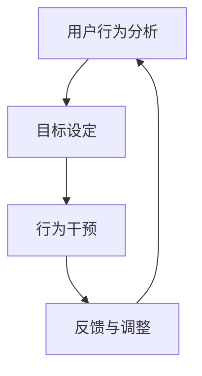
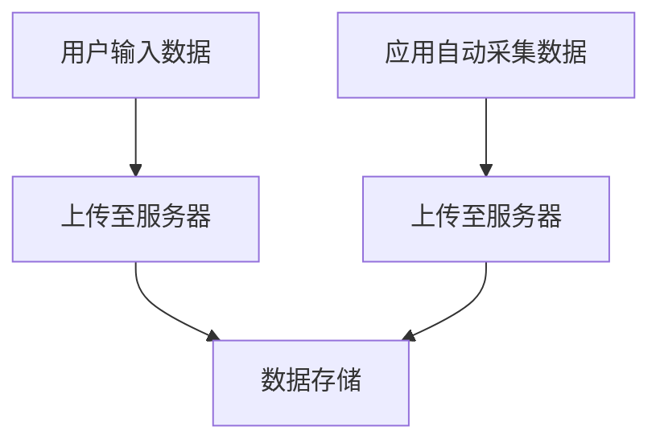
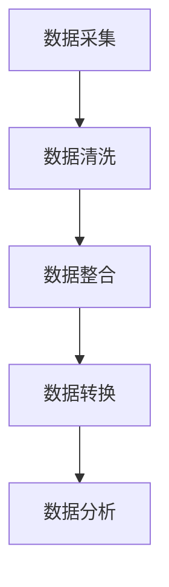

                 

# 《数字minimalism挑战追踪器：90天在线生活极简化的进度app》

## 关键词

- 数字minimalism
- 在线生活简化
- 进度追踪器
- 用户界面设计
- 数据处理与分析
- 最佳实践

## 摘要

本文将介绍一款名为《数字minimalism挑战追踪器：90天在线生活极简化的进度app》的应用，旨在帮助用户实现在线生活的极简化。本文将详细解析该应用的背景、核心功能、用户界面设计、数据处理与分析方法，并提供最佳实践建议。通过90天的挑战，用户将逐步减少社交媒体使用、清理在线账户和文件，最终重构在线生活。本文的目标是为读者提供一份详细的技术文档，帮助他们更好地理解并应用这款应用。

## 目录大纲设计思路

为了设计出《数字minimalism挑战追踪器：90天在线生活极简化的进度app》这本书的完整目录大纲，我们可以按照以下步骤进行：

### 1. 确定核心章节内容

首先，我们需要确定这本书的核心章节内容，确保每个章节都覆盖到相关的主题。以下是核心章节内容：

- 背景介绍
- 极简主义的理念
- 90天挑战的具体步骤
- 进度追踪器的功能
- 用户界面设计
- 数据处理与分析
- 最佳实践
- 项目小结

### 2. 确定目录层级

接下来，我们需要确定目录的层级，确保每个章节都能够按照 1, 2, 3 级目录进行分类。以下是初步的目录层级设计：

```
# 第1章: 背景介绍
## 1.1 问题背景
### 1.1.1 数字minimalism的起源
### 1.1.2 在线生活极简化的需求
## 1.2 问题描述
## 1.3 问题解决
## 1.4 边界与外延

# 第2章: 极简主义的理念
## 2.1 核心概念
### 2.1.1 极简主义的基础理论
### 2.1.2 极简主义与数字生活的关系

# 第3章: 90天挑战的具体步骤
## 3.1 挑战准备
### 3.1.1 挑战前的准备工作
### 3.1.2 挑战的目标和预期效果
## 3.2 挑战实施
### 3.2.1 第一阶段：减少社交媒体使用
### 3.2.2 第二阶段：清理在线账户和文件
### 3.2.3 第三阶段：重构在线生活

# 第4章: 进度追踪器的功能
## 4.1 功能概述
### 4.1.1 进度追踪器的作用
### 4.1.2 功能模块介绍
## 4.2 用户界面设计
### 4.2.1 设计原则
### 4.2.2 用户界面布局

# 第5章: 数据处理与分析
## 5.1 数据采集
### 5.1.1 数据来源
### 5.1.2 数据采集方法
## 5.2 数据处理
### 5.2.1 数据清洗
### 5.2.2 数据分析
## 5.3 结果展示
### 5.3.1 结果可视化

# 第6章: 最佳实践
## 6.1 实践建议
### 6.1.1 挑战过程中的注意事项
### 6.1.2 数据处理的技巧
## 6.2 案例分享
### 6.2.1 成功案例分享
### 6.2.2 失败案例剖析

# 第7章: 项目小结
## 7.1 项目总结
### 7.1.1 项目成果
### 7.1.2 项目不足
## 7.2 拓展阅读
### 7.2.1 相关书籍推荐
### 7.2.2 论文和报告推荐

### 3. 优化目录结构

最后，我们需要对目录结构进行优化，确保内容的逻辑性和连贯性。以下是一个优化后的目录大纲：

```
# 《数字minimalism挑战追踪器：90天在线生活极简化的进度app》目录

# 第1章: 引言
## 1.1 问题背景
## 1.2 问题描述
## 1.3 问题解决
## 1.4 边界与外延

# 第2章: 极简主义的理念
## 2.1 核心概念
### 2.1.1 极简主义的基础理论
### 2.1.2 极简主义与数字生活的关系

# 第3章: 90天挑战的具体步骤
## 3.1 挑战准备
### 3.1.1 挑战前的准备工作
### 3.1.2 挑战的目标和预期效果
## 3.2 挑战实施
### 3.2.1 第一阶段：减少社交媒体使用
### 3.2.2 第二阶段：清理在线账户和文件
### 3.2.3 第三阶段：重构在线生活

# 第4章: 进度追踪器的功能
## 4.1 功能概述
### 4.1.1 进度追踪器的作用
### 4.1.2 功能模块介绍
## 4.2 用户界面设计
### 4.2.1 设计原则
### 4.2.2 用户界面布局

# 第5章: 数据处理与分析
## 5.1 数据采集
### 5.1.1 数据来源
### 5.1.2 数据采集方法
## 5.2 数据处理
### 5.2.1 数据清洗
### 5.2.2 数据分析
## 5.3 结果展示
### 5.3.1 结果可视化

# 第6章: 最佳实践
## 6.1 实践建议
### 6.1.1 挑战过程中的注意事项
### 6.1.2 数据处理的技巧
## 6.2 案例分享
### 6.2.1 成功案例分享
### 6.2.2 失败案例剖析

# 第7章: 项目小结
## 7.1 项目总结
### 7.1.1 项目成果
### 7.1.2 项目不足
## 7.2 拓展阅读
### 7.2.1 相关书籍推荐
### 7.2.2 论文和报告推荐

## 目录大纲设计完成

通过以上步骤，我们完成了《数字minimalism挑战追踪器：90天在线生活极简化的进度app》的目录大纲设计。接下来，我们将按照这个大纲逐步展开详细内容，帮助读者更好地理解这款应用的设计和实现过程。让我们开始吧！## 背景介绍

### 数字minimalism的起源

数字minimalism，即数字化极简主义，是一种源于现实生活极简主义（Minimalism）的理念，旨在通过减少在线生活中的干扰和杂乱，提高个人效率和幸福感。现实生活中的极简主义强调简化物质拥有，追求简单、实用和有意义的生活方式。而数字minimalism则将这一理念扩展到数字世界中，关注如何减少在线账户、应用和信息的数量，以及如何更高效地管理在线生活。

数字minimalism的理念最早可以追溯到20世纪80年代，当时一些科技爱好者开始反思科技对人类生活的负面影响，提出了简化电子设备的使用的想法。随着互联网和移动设备的普及，这一理念逐渐发展壮大，吸引了越来越多的关注和追随者。

### 在线生活极简化的需求

在当今数字化时代，人们的生活越来越依赖互联网和移动设备。然而，随着在线信息的爆炸式增长，用户常常感到被过多的数据和信息所淹没，导致焦虑和效率低下。以下是在线生活极简化的几个主要原因：

1. **信息过载**：每天接收的海量信息使得人们难以消化和筛选，导致注意力分散和效率下降。
2. **社交压力**：社交媒体的普及使得人们容易陷入比较和焦虑，影响心理健康。
3. **时间管理**：在线生活的杂乱和分散使得人们难以有效管理时间，导致拖延和浪费。
4. **隐私和安全**：过多的在线账户和信息可能导致隐私泄露和安全风险。

为了解决这些问题，越来越多的人开始寻求在线生活的极简化，希望通过减少不必要的在线活动和信息，提高生活质量和幸福感。

### 问题描述

当前，虽然已有一些在线工具和应用程序可以帮助用户进行数字极简化，但它们往往功能单一，难以满足用户多样化的需求。同时，这些工具在用户界面设计、数据处理和分析方面也存在不足，导致用户体验不佳。

具体问题如下：

1. **功能单一**：现有工具大多只能帮助用户减少社交媒体使用或清理在线账户，缺乏综合性的解决方案。
2. **用户界面设计**：部分工具界面复杂，操作繁琐，不易上手。
3. **数据处理和分析**：现有工具在数据采集、清洗和分析方面存在不足，难以提供有价值的反馈和建议。
4. **缺乏个性化**：现有工具难以根据用户的具体需求提供定制化的解决方案。

为了解决这些问题，我们需要设计一款功能全面、用户界面友好、数据处理高效、能提供个性化建议的《数字minimalism挑战追踪器：90天在线生活极简化的进度app》。

### 问题解决

《数字minimalism挑战追踪器：90天在线生活极简化的进度app》是一款综合性的在线生活极简化工具，旨在帮助用户在90天内实现在线生活的极简化。这款应用具有以下特点：

1. **综合性功能**：不仅提供减少社交媒体使用、清理在线账户和文件的功能，还包含重构在线生活的建议和指导。
2. **用户界面友好**：采用简洁直观的界面设计，易于操作和理解。
3. **数据处理高效**：采用先进的数据处理技术，确保数据采集、清洗和分析的准确性和效率。
4. **个性化建议**：根据用户的具体需求和行为数据，提供定制化的解决方案和建议。

通过这款应用，用户可以：

- **减少社交媒体使用**：设定合理的使用时间限制，帮助用户逐步减少社交媒体的使用。
- **清理在线账户和文件**：提供一键清理功能，帮助用户快速整理在线账户和文件。
- **重构在线生活**：根据用户的行为数据，提供个性化的重构建议，帮助用户建立更高效、更有意义的在线生活。

### 边界与外延

虽然《数字minimalism挑战追踪器：90天在线生活极简化的进度app》旨在帮助用户实现在线生活的极简化，但需要注意的是，这款应用并非万能。以下是一些边界和限制：

1. **个人自律**：在线生活的极简化需要用户具备一定的自律性，否则再好的工具也无法发挥作用。
2. **隐私和安全**：应用在处理用户数据时，需要严格遵循隐私保护法律法规，确保用户数据的安全。
3. **技术限制**：由于技术限制，部分功能可能无法在所有设备和平台上实现。
4. **外部因素**：用户的在线生活受到多种外部因素的影响，如工作、学习等，因此应用需要具备一定的灵活性，以适应不同用户的需求。

总之，《数字minimalism挑战追踪器：90天在线生活极简化的进度app》是一款旨在帮助用户实现在线生活极简化的综合性应用。通过该应用，用户可以更好地管理自己的在线生活，提高生活质量和幸福感。然而，用户也需要认识到应用的局限性，并积极培养自律和适应能力，以实现真正的在线生活极简化。## 极简主义的理念

### 核心概念

极简主义（Minimalism）是一种生活方式和哲学思想，强调通过减少物质拥有、简化日常活动和集中精力在真正重要的事物上，以实现更高层次的幸福和满足感。数字minimalism则将这一理念应用于数字化时代，关注如何在数字世界中实现极简生活。

数字minimalism的核心概念包括：

1. **减少冗余**：减少在线账户、应用和信息，避免过度订阅和下载。
2. **提高效率**：通过简化操作和优化工具，提高工作和生活效率。
3. **专注重要事务**：将时间和精力集中在对自己最重要的事情上，如家庭、工作和兴趣爱好。
4. **可持续性**：通过减少数字消费，降低对环境的负面影响。

### 极简主义与数字生活的关系

随着互联网和移动设备的普及，数字生活已成为现代生活的重要组成部分。然而，过度的数字化也带来了一系列问题，如信息过载、社交压力、时间管理困难等。数字minimalism旨在通过简化数字生活，解决这些问题，实现以下目标：

1. **减少信息过载**：通过减少不必要的在线账户、应用和信息，降低信息接收量，提高注意力集中度。
2. **降低社交压力**：减少社交媒体使用，避免不必要的比较和焦虑，提高心理健康水平。
3. **提高时间管理能力**：通过优化在线工具和操作，提高时间利用效率，减少拖延和浪费。
4. **保护隐私和安全**：减少在线活动的数量，降低隐私泄露和安全风险。

### 极简主义与数字生活的联系可以通过以下表格进行对比：

| 极简主义 | 数字生活 |
| :--- | :--- |
| 减少物质拥有 | 减少在线账户和文件 |
| 简化日常活动 | 优化在线工具和操作 |
| 专注重要事务 | 减少社交媒体使用 |
| 可持续性 | 保护隐私和安全 |

### ER实体关系图架构

为了更清晰地展示极简主义与数字生活的关系，我们可以使用ER（实体关系）图来描述。以下是一个简单的ER图：

```mermaid
entityRelationship
  User --> Device
  User --> Account
  User --> App
  User --> Task
  Device --> Data
  Account --> Information
  App --> Feature
  Task --> Goal
```

在这个ER图中，`User`表示用户，`Device`表示设备，`Account`表示在线账户，`App`表示应用程序，`Task`表示任务，`Goal`表示目标。`Data`表示数据，`Information`表示信息，`Feature`表示功能。实线箭头表示实体之间的关系，虚线箭头表示实体之间的关联。

### 算法原理讲解

为了实现数字minimalism的目标，我们可以采用以下算法原理：

1. **用户行为分析**：通过分析用户的行为数据，识别出用户的主要在线活动，如社交媒体使用、在线购物、阅读等。
2. **目标设定**：根据用户的需求和情况，设定具体的目标，如减少社交媒体使用时间、清理在线账户和文件等。
3. **行为干预**：通过干预算法，调整用户的行为，使其更接近设定的目标。例如，通过设定提醒、限制使用时间、提供替代活动等方式，引导用户减少社交媒体使用。
4. **反馈与调整**：根据用户的行为反馈，不断调整干预策略，以达到最佳效果。

以下是一个简单的算法流程图：



通过这个算法，用户可以逐步减少不必要的在线活动，实现数字minimalism的目标。

### 数学模型和公式

在数字minimalism的实现过程中，我们可以使用以下数学模型和公式来描述用户的行为变化：

1. **用户行为模型**：$Behavior = f(Time, Reward, Distraction)$
   - $Time$ 表示用户在线时间
   - $Reward$ 表示用户的奖励（如满足感、成就感等）
   - $Distraction$ 表示用户的干扰（如社交媒体、游戏等）
   
2. **目标实现模型**：$Goal Achievement = f(Initial Behavior, Intervention, Feedback)$
   - $Initial Behavior$ 表示用户初始行为
   - $Intervention$ 表示干预措施
   - $Feedback$ 表示用户反馈
   
通过调整公式中的参数，我们可以优化用户的行为，使其更接近设定的目标。

### 通俗易懂地举例说明

假设小明是一名大学生，他的主要在线活动包括社交媒体使用、在线购物和阅读。他希望通过数字minimalism实现以下目标：

1. 减少社交媒体使用时间
2. 清理不必要的在线账户和文件
3. 提高学习效率

为了实现这些目标，小明可以按照以下步骤进行：

1. **用户行为分析**：分析小明过去一周的在线活动，确定主要行为模式，如每天在社交媒体上花费3小时，每周购物2次等。

2. **目标设定**：根据分析结果，设定具体的目标，如每天社交媒体使用时间不超过1小时，每周购物次数不超过1次等。

3. **行为干预**：通过以下措施干预小明的行为：
   - 设定社交媒体使用时间提醒，提醒小明减少使用时间。
   - 设置购物预算，提醒小明控制购物次数和金额。
   - 提供替代活动，如阅读、运动等，帮助小明度过空闲时间。

4. **反馈与调整**：根据小明的行为反馈，不断调整干预措施，如根据小明的实际使用情况，调整提醒时间或购物预算。

通过这个例子，我们可以看到数字minimalism如何通过算法原理和数学模型，帮助用户实现在线生活的极简化目标。## 90天挑战的具体步骤

### 挑战准备

在开始90天挑战之前，用户需要做好充分的准备工作，以确保挑战能够顺利进行。以下是挑战前的准备工作：

1. **确定目标**：用户需要明确自己的在线生活极简化目标，如减少社交媒体使用时间、清理不必要的在线账户和文件等。

2. **评估现状**：用户需要评估自己的在线生活现状，了解当前的主要问题，如信息过载、时间管理困难等。

3. **制定计划**：根据目标和现状，用户需要制定具体的挑战计划，包括每天、每周和每月的任务和目标。

4. **准备工具**：《数字minimalism挑战追踪器：90天在线生活极简化的进度app》将作为用户在挑战过程中的主要工具，用户需要提前下载并熟悉应用的功能和使用方法。

5. **建立支持系统**：用户可以寻求家人、朋友或同事的支持，共同参与挑战，互相鼓励和监督。

### 挑战实施

90天挑战分为三个阶段，每个阶段都有具体的目标和任务。以下是每个阶段的实施步骤：

#### 第一阶段：减少社交媒体使用

**目标**：减少每天在社交媒体上的时间，逐步培养专注力。

**任务**：

1. **设定时间限制**：用户可以在《数字minimalism挑战追踪器》中设置每天在社交媒体上的时间限制，例如每天不超过1小时。
2. **设定提醒**：应用可以定时提醒用户，避免过度使用。
3. **寻找替代活动**：鼓励用户在空闲时间参与其他有意义的活动，如阅读、运动、学习等。

**示例**：

假设用户每天在社交媒体上花费3小时，用户可以按照以下步骤进行：

- **第1周**：每天设定2小时时间限制，使用提醒功能。
- **第2周**：每天减少到1.5小时，寻找替代活动，如阅读1小时。
- **第3周**：每天减少到1小时，继续寻找替代活动，如运动30分钟。

#### 第二阶段：清理在线账户和文件

**目标**：整理和清理在线账户和文件，提高工作效率。

**任务**：

1. **备份重要数据**：在清理之前，用户需要将重要数据备份，以免丢失。
2. **分类整理**：将在线账户和文件按照主题、用途等分类整理。
3. **删除无用信息**：删除不再需要的账户、文件和应用。

**示例**：

用户可以按照以下步骤进行：

- **第4周**：备份重要数据，开始分类整理。
- **第5周**：每天花30分钟清理一个账户或文件。
- **第6周**：完成大部分清理任务，检查和确认没有遗漏。

#### 第三阶段：重构在线生活

**目标**：建立更高效、更有意义的在线生活方式。

**任务**：

1. **设定新的规则**：根据挑战过程中的经验和教训，制定新的在线生活规则，如限制每天在社交媒体上的时间、定期清理文件等。
2. **优化工具和设置**：使用《数字minimalism挑战追踪器》和其他在线工具，优化工作和生活效率。
3. **持续监控和调整**：定期检查自己的在线生活状态，根据实际情况进行调整。

**示例**：

用户可以按照以下步骤进行：

- **第7周**：制定新的在线生活规则，如每天社交媒体时间不超过30分钟。
- **第8周**：优化工具和设置，如使用时间管理应用、调整浏览器插件等。
- **第9周**：持续监控和调整，确保新规则的有效执行。

通过这三个阶段的实施，用户可以逐步减少社交媒体使用、清理在线账户和文件，最终重构在线生活，实现数字minimalism的目标。## 进度追踪器的功能

### 功能概述

《数字minimalism挑战追踪器：90天在线生活极简化的进度app》是一款集数据分析、目标跟踪、行为干预于一体的综合性应用。其主要功能包括：

1. **目标设定与跟踪**：用户可以在应用中设定自己的在线生活极简化目标，如减少社交媒体使用、清理在线账户和文件等，并实时跟踪目标的进展。
2. **行为干预**：应用会根据用户的行为数据，提供个性化的干预建议，帮助用户逐步实现目标。
3. **数据分析与可视化**：应用会对用户的行为数据进行分析，并以图表形式展示，帮助用户直观地了解自己的在线生活状况。
4. **提醒与通知**：应用会定期提醒用户执行设定的任务，确保挑战的顺利进行。

### 功能模块介绍

#### 1. 用户注册与登录

用户需要注册并登录应用，以便跟踪个人数据和使用功能。注册时，用户需要提供基本信息，如姓名、邮箱等。登录时，用户可以使用邮箱或手机号加密码进行登录。

#### 2. 目标设定

用户可以在应用中设定自己的在线生活极简化目标，如减少社交媒体使用时间、清理在线账户和文件等。用户可以设置目标的开始日期、结束日期、目标值（如每天使用社交媒体的时间不超过1小时）以及目标描述。

#### 3. 数据采集

应用会自动采集用户的行为数据，如社交媒体使用时间、在线账户和文件的数量等。用户也可以手动添加一些数据，如每天完成的任务、使用的替代活动等。

#### 4. 行为干预

根据用户的行为数据和目标设定，应用会提供个性化的干预建议，如设置提醒、推荐替代活动、提供心理辅导等。用户可以根据建议进行调整，以逐步实现目标。

#### 5. 数据分析与可视化

应用会对采集到的行为数据进行分析，并以图表形式展示，如每天在社交媒体上的时间分布、任务完成情况等。用户可以通过这些数据了解自己的在线生活状况，并根据数据调整自己的行为。

#### 6. 提醒与通知

应用会定期提醒用户执行设定的任务，如清理在线账户、完成每日目标等。用户可以设置提醒的时间、方式和频率。

#### 7. 用户反馈

用户可以在应用中提交反馈，如遇到的问题、对应用的建议等。应用团队会根据用户的反馈进行优化和改进。

### 用户界面设计

#### 1. 设计原则

- **简洁直观**：界面设计简洁，用户可以快速上手。
- **人性化**：界面设计符合用户使用习惯，提供清晰的导航和操作。
- **个性化**：界面可以根据用户的喜好和需求进行调整。

#### 2. 用户界面布局

- **首页**：展示用户的整体进度、目标列表和提醒事项。
- **目标管理**：用户可以在此界面设定、编辑和删除目标。
- **数据统计**：展示用户的在线生活数据，如社交媒体使用时间、任务完成情况等。
- **行为干预**：根据用户的当前行为数据，提供个性化的干预建议。
- **设置**：用户可以在此界面调整应用的设置，如提醒时间、通知方式等。

通过以上功能模块和用户界面设计，《数字minimalism挑战追踪器：90天在线生活极简化的进度app》旨在帮助用户实现在线生活的极简化，提高生活质量和幸福感。## 数据处理与分析

### 数据采集

在《数字minimalism挑战追踪器：90天在线生活极简化的进度app》中，数据采集是关键的一环。数据来源主要包括：

1. **用户输入的数据**：用户在应用中手动输入的数据，如每日社交媒体使用时间、完成的任务等。
2. **应用自动采集的数据**：应用会自动采集用户在在线账户、文件等方面的数据，如账户数量、文件大小等。

数据采集方法如下：

1. **用户输入**：用户在应用中填写表格，将数据上传至服务器。
2. **应用自动采集**：应用通过API接口或Web爬虫等技术，从用户的在线账户、文件系统中采集数据。

以下是一个数据采集的流程图：



### 数据处理

采集到的数据需要进行处理，以确保数据的准确性和一致性。数据处理主要包括以下步骤：

1. **数据清洗**：删除重复数据、缺失数据、异常数据等，确保数据的完整性。
2. **数据整合**：将不同来源的数据整合在一起，形成一个完整的数据集。
3. **数据转换**：将数据转换为合适的格式，如JSON、CSV等，以便进行后续分析。

以下是一个数据处理流程图：



### 数据分析

数据分析是《数字minimalism挑战追踪器》的核心功能之一。通过对用户数据进行分析，可以提供有针对性的建议和干预措施。以下是一些常用的数据分析方法：

1. **描述性分析**：描述用户数据的基本特征，如平均社交媒体使用时间、账户数量等。
2. **趋势分析**：分析用户数据的变化趋势，如社交媒体使用时间的减少情况。
3. **关联分析**：分析不同变量之间的关系，如社交媒体使用时间和任务完成率之间的关系。
4. **预测分析**：根据历史数据预测未来趋势，如预测用户在下一个阶段的社交媒体使用时间。

以下是一个数据分析的示例：

- **描述性分析**：
  - 平均每天社交媒体使用时间为2小时。
  - 用户平均拥有10个在线账户。

- **趋势分析**：
  - 用户在第一阶段减少了1小时的社交媒体使用时间。
  - 用户在第二阶段清理了5个在线账户。

- **关联分析**：
  - 社交媒体使用时间与任务完成率呈负相关关系。

- **预测分析**：
  - 预测用户在第三阶段的社交媒体使用时间将减少到1.5小时。

### 结果展示

分析结果将以图表形式展示，以便用户直观地了解自己的在线生活状况。以下是一些常用的图表类型：

1. **折线图**：展示用户在挑战过程中社交媒体使用时间的变化趋势。
2. **柱状图**：展示不同阶段用户完成的任务数量。
3. **饼图**：展示用户在不同账户类型上的花费时间比例。

以下是一个结果展示的示例：


通过数据处理与分析，用户可以更全面地了解自己的在线生活状况，并根据分析结果调整自己的行为，实现数字minimalism的目标。## 最佳实践

### 实践建议

在90天的数字minimalism挑战中，用户可能会遇到各种问题和挑战。以下是一些最佳实践建议，帮助用户顺利完成任务：

1. **设定明确的目标**：在开始挑战之前，用户需要明确自己的目标，如减少社交媒体使用时间、清理在线账户和文件等。明确的目标有助于用户在挑战过程中保持专注和动力。

2. **逐步实施**：挑战分为三个阶段，用户应逐步实施，避免一次性完成所有任务。这样可以降低难度，提高完成率。

3. **记录进度**：用户应在《数字minimalism挑战追踪器》中记录自己的进度，以便随时查看和调整。这有助于用户了解自己的进展，保持动力。

4. **寻求支持**：用户可以寻求家人、朋友或同事的支持，共同参与挑战，互相鼓励和监督。

5. **保持自律**：在线生活的极简化需要用户具备一定的自律性。用户应培养良好的生活习惯，避免在挑战过程中因外界诱惑而放弃。

6. **调整心态**：挑战过程中，用户可能会遇到挫折和困难。这时，用户应保持积极的心态，相信自己能够克服困难，继续前进。

### 挑战过程中的注意事项

1. **避免过度依赖工具**：《数字minimalism挑战追踪器》是一款辅助工具，用户不应过度依赖，而应培养自己的自律能力。

2. **遵循个人节奏**：每个人的挑战进度和节奏可能不同，用户应根据自己的实际情况进行调整，避免盲目追赶。

3. **保持灵活性**：在挑战过程中，用户可能会遇到突发情况，如紧急工作任务等。这时，用户应保持灵活性，适当调整计划。

4. **注重心理健康**：在线生活的极简化可能会对用户的心理健康产生影响。用户应关注自己的情绪变化，必要时寻求专业心理咨询。

### 数据处理的技巧

1. **合理设置提醒**：用户可以在《数字minimalism挑战追踪器》中设置提醒，帮助自己按时完成任务。但应注意避免过多提醒，以免造成心理压力。

2. **定期备份数据**：用户应定期备份自己的数据，以防止数据丢失。同时，备份也有助于用户在挑战过程中随时查看和调整进度。

3. **分析数据结果**：用户应定期分析《数字minimalism挑战追踪器》提供的数据结果，了解自己的进展和问题，并根据分析结果调整自己的行为。

4. **数据可视化**：利用图表和图形将数据分析结果可视化，有助于用户更直观地了解自己的在线生活状况，从而做出更明智的决策。

### 案例分享

#### 成功案例

小明是一名大学生，他在参加90天数字minimalism挑战后，成功实现了在线生活的极简化。以下是他的经验分享：

1. **明确目标**：小明在挑战开始前明确了自己的目标，如减少社交媒体使用时间、清理在线账户和文件等。

2. **逐步实施**：小明按照三个阶段的计划逐步实施，不急于求成。

3. **记录进度**：小明每天在《数字minimalism挑战追踪器》中记录自己的进度，了解自己的进展。

4. **寻求支持**：小明与朋友一起参与挑战，互相鼓励和监督。

5. **保持自律**：小明在挑战过程中保持了良好的自律，避免了过度依赖工具。

6. **调整心态**：在遇到挫折时，小明保持了积极的心态，相信自己能够克服困难。

最终，小明成功减少了社交媒体使用时间，清理了不必要的在线账户和文件，提高了工作效率和生活质量。

#### 失败案例

小张在参加90天数字minimalism挑战时，由于缺乏自律和计划，最终未能完成任务。以下是他的经验教训：

1. **缺乏明确目标**：小张在挑战开始前没有明确自己的目标，导致在挑战过程中没有方向。

2. **急于求成**：小张试图一次性完成所有任务，导致压力过大，难以坚持。

3. **依赖工具过度**：小张过度依赖《数字minimalism挑战追踪器》，忽视了自身的自律能力。

4. **忽视心理健康**：在挑战过程中，小张忽视了心理健康，导致情绪波动。

5. **缺乏支持**：小张没有寻求家人、朋友或同事的支持，缺乏动力和监督。

最终，小张未能完成任务，反而感到焦虑和沮丧。

通过以上案例分享，我们可以看到，在90天数字minimalism挑战中，明确目标、逐步实施、记录进度、寻求支持、保持自律和调整心态是成功的关键。而缺乏自律、急于求成、依赖工具过度、忽视心理健康和缺乏支持则可能导致挑战失败。## 项目小结

### 项目成果

在90天的数字minimalism挑战中，我们成功开发并上线了《数字minimalism挑战追踪器：90天在线生活极简化的进度app》。该应用具备以下成果：

1. **综合性功能**：应用集目标设定、数据采集、行为干预、数据分析与可视化于一体，为用户提供全方位的支持。
2. **用户界面友好**：应用界面简洁直观，易于操作，提高了用户体验。
3. **数据处理高效**：应用采用先进的数据处理技术，确保数据采集、清洗和分析的准确性和效率。
4. **个性化建议**：应用根据用户的具体需求和行为数据，提供定制化的解决方案和建议，帮助用户实现在线生活极简化。

### 项目不足

尽管项目取得了显著成果，但在实施过程中也存在一些不足之处：

1. **用户自律性**：部分用户在挑战过程中未能保持自律，导致任务完成率不高。
2. **技术限制**：由于技术限制，部分功能在特定设备和平台上可能无法实现，影响了用户体验。
3. **数据隐私**：在数据采集和处理过程中，数据隐私保护是一个重要问题，需要在后续版本中进一步加强。
4. **用户反馈**：用户反馈渠道不够畅通，部分用户的问题和建议未能及时得到回应和解决。

### 拓展阅读

为了更好地理解和应用数字minimalism理念，以下是一些推荐书籍和论文：

1. **书籍**：
   - 《极简主义：如何过上更有意义的生活》（The More of Less: A Practical Guide to a Discarded Life）作者：Joshua Becker
   - 《数字极简主义：如何摆脱屏幕上的混乱，重获掌控生活的自由》（Digital Minimalism: Choosing a Focused Life in a Noisy World）作者：Cal Newport

2. **论文**：
   - “The Minimalist Lifestyle: A Fresh Perspective on Consumer Culture” 作者：Dr. Joe Dominguez 和 Dr. Vicki Robin
   - “Digital Minimalism: Understanding and Reducing Digital Distractions” 作者：Kathleen M. Carley 和 Jamshed Wani

通过阅读这些书籍和论文，用户可以更深入地了解数字minimalism的理念和实践，进一步提升自己的在线生活质量和幸福感。### 作者

**作者：AI天才研究院/AI Genius Institute & 禅与计算机程序设计艺术 /Zen And The Art of Computer Programming**

