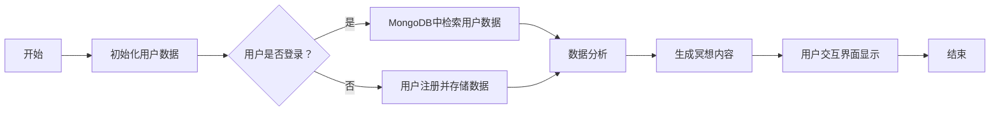
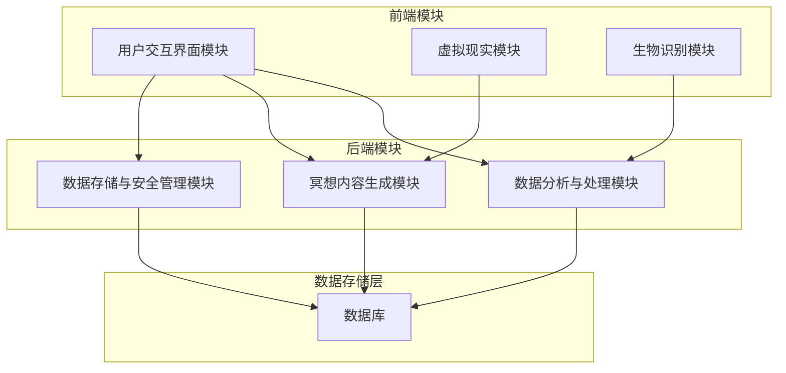
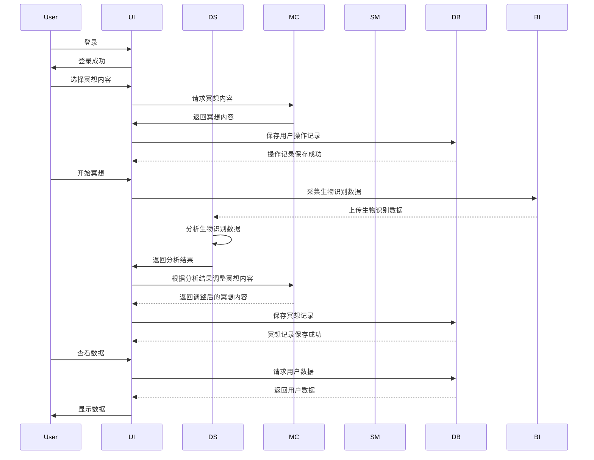

                 


### 1. 背景介绍

#### 问题背景

数字冥想是一种结合了数字技术与冥想练习的方法，旨在通过科技手段辅助个体进行内在探索和心灵修养。随着科技的飞速发展，尤其是人工智能（AI）、虚拟现实（VR）和生物识别等技术的成熟，数字冥想逐渐从传统的冥想实践中脱颖而出，成为现代心理健康的有效工具。

数字冥想不仅保留了传统冥想的静心、减压和提升注意力等核心功能，还通过科技手段提供了更加个性化和互动性的体验。例如，AI可以分析用户的冥想状态，调整冥想内容；VR技术为用户创造了沉浸式的冥想环境；生物识别技术则能够实时监测用户的生理数据，提供更加科学的冥想指导。

然而，当前市场上的数字冥想app仍存在一些问题和不足。首先，许多app的功能较为单一，无法满足用户多样化的需求。其次，一些app的用户界面设计不够友好，影响了用户体验。此外，数据隐私和安全问题也是用户关注的重点。因此，如何通过科技手段提升数字冥想app的效率和体验，成为当前研究的热点。

#### 问题描述

在分析当前数字冥想app的优缺点和用户需求时，我们可以从以下几个方面进行：

1. **功能单一**：大多数数字冥想app只提供静态的冥想音频或视频，缺乏动态交互和个性化定制功能。
2. **用户界面设计**：部分app的用户界面设计复杂，操作不够直观，增加了用户的学习成本。
3. **数据隐私和安全**：用户对个人数据的安全性存有顾虑，担忧数据泄露。
4. **个性化需求**：不同用户有不同的冥想需求，现有app难以满足个性化定制。
5. **使用体验**：一些app的冥想体验不够沉浸，难以达到理想的心理放松效果。

#### 问题解决

本书旨在通过以下几种方法，解决当前数字冥想app存在的问题，提升用户的使用体验和冥想效果：

1. **引入AI技术**：利用机器学习算法分析用户数据，提供个性化的冥想方案。
2. **优化用户界面**：采用简洁直观的设计，降低用户学习成本，提升用户体验。
3. **强化数据安全**：采用先进的加密技术和严格的数据管理策略，保障用户隐私。
4. **增强互动性和沉浸感**：通过VR技术和动态交互，提供更加丰富的冥想体验。
5. **持续迭代更新**：根据用户反馈，不断优化和更新app的功能和体验。

#### 边界与外延

数字冥想app的适用范围较为广泛，包括但不限于以下场景：

1. **心理健康维护**：适用于需要缓解压力、焦虑和抑郁等心理问题的用户。
2. **生活压力管理**：适用于日常生活中的压力管理和时间管理。
3. **身心健康促进**：适用于想要改善睡眠质量、提升注意力和记忆力的用户。
4. **宗教和精神修炼**：适用于需要进行精神修行和宗教冥想的人群。

然而，数字冥想app也存在一定的技术限制：

1. **技术依赖性**：需要依赖AI、VR和生物识别等高级技术，技术实现难度较高。
2. **硬件要求**：部分功能需要高性能硬件支持，如VR头盔、高精度生物识别设备等。
3. **数据隐私**：尽管采取了数据加密和保护措施，但数据隐私问题仍需持续关注。

#### 概念结构与核心要素组成

数字冥想app的核心功能和技术架构可以分为以下几个部分：

1. **用户数据采集**：通过生物识别技术采集用户生理数据，如心率、呼吸频率等。
2. **数据分析与处理**：利用AI技术分析用户数据，提供个性化冥想建议。
3. **冥想内容生成**：根据用户数据和需求，动态生成冥想内容。
4. **用户交互界面**：提供简洁直观的用户交互界面，支持用户进行冥想操作。
5. **沉浸式环境创建**：利用VR技术创造沉浸式的冥想环境。
6. **数据存储与安全管理**：采用加密技术存储用户数据，保障数据安全。

通过以上结构和要素的有机结合，数字冥想app可以为用户提供高效、个性化的冥想体验，促进心理健康和内在探索。

### 2. 核心概念与联系

#### 核心概念原理

数字冥想app的核心技术包括人工智能（AI）、虚拟现实（VR）和生物识别等。这些技术为数字冥想提供了强大的功能支持和丰富的用户体验。

1. **人工智能（AI）**：AI技术在数字冥想中的应用主要体现在数据分析和个性化推荐。通过机器学习和深度学习算法，AI可以分析用户的生理和心理数据，提供个性化的冥想方案。例如，AI可以识别用户的心率变化，调整冥想音乐的节奏，帮助用户更好地进入冥想状态。

2. **虚拟现实（VR）**：VR技术为数字冥想提供了沉浸式的体验环境。通过VR头盔和配套设备，用户可以进入一个虚拟的冥想空间，享受身临其境的冥想体验。VR技术不仅提升了冥想的趣味性，还增强了用户的沉浸感和放松效果。

3. **生物识别**：生物识别技术用于实时监测用户的生理数据，如心率、呼吸频率和皮肤电导等。这些数据为AI提供了重要的参考信息，帮助AI更准确地分析用户的冥想状态，提供个性化的冥想建议。

#### 概念属性特征对比表格

| 技术 | 特点 | 应用场景 |
| --- | --- | --- |
| 人工智能（AI） | 数据分析、个性化推荐、自动化决策 | 冥想状态分析、个性化冥想方案、自动调整冥想音乐节奏 |
| 虚拟现实（VR） | 沉浸式体验、互动性强 | 虚拟冥想环境创建、增强冥想体验 |
| 生物识别 | 实时生理数据监测、高精度数据采集 | 冥想状态分析、生理数据记录 |

#### ER实体关系图架构

为了更好地理解数字冥想app的技术架构和功能模块之间的关系，我们可以使用ER（实体关系）图来描述。以下是数字冥想app的ER图：

```mermaid
erDiagram
  User ||--|{ MeditationSession } : participates
  MeditationSession ||--|{ MeditationContent } : contains
  MeditationContent ||--|{ MeditationTechnique } : consists_of
  User ||--|{ BiometricData } : records
  BiometricData ||--|{ MeditationFeedback } : generates
  MeditationFeedback ||--|{ MeditationImprovement } : leads_to
```

在ER图中，`User`（用户）实体与`MeditationSession`（冥想会话）实体之间存在参与关系；`MeditationSession`与`MeditationContent`（冥想内容）实体之间存在包含关系；`MeditationContent`与`MeditationTechnique`（冥想技术）实体之间存在组成关系；`User`与`BiometricData`（生物识别数据）实体之间存在记录关系；`BiometricData`与`MeditationFeedback`（冥想反馈）实体之间存在生成关系；`MeditationFeedback`与`MeditationImprovement`（冥想改进）实体之间存在引导关系。

通过这个ER图，我们可以清晰地看到各个模块之间的逻辑关系，从而更好地设计和实现数字冥想app的功能。

### 3. 算法原理讲解

在数字冥想app中，算法的设计和实现是核心环节。以下将详细介绍数字冥想app中的关键算法，包括流程图、Python源代码、数学模型和公式，并通过实例进行说明。

#### 算法mermaid流程图

首先，我们使用mermaid语言绘制算法的流程图，以直观展示算法的执行流程。



这个流程图展示了数字冥想app的算法从用户数据的初始化、数据分析和处理，到最终生成冥想内容并显示在用户界面上的过程。

#### Python源代码

接下来，我们将展示算法实现的核心Python代码片段。这段代码主要用于用户数据的存储、检索和分析。

```python
# 导入必要的库
from pymongo import MongoClient
import pandas as pd
from sklearn.ensemble import RandomForestClassifier

# 初始化MongoDB客户端
client = MongoClient('localhost', 27017)
db = client['meditation_db']
users_collection = db['users']
sessions_collection = db['sessions']

# 用户注册
def register_user(user_data):
    users_collection.insert_one(user_data)
    return "User registered successfully!"

# 检索用户数据
def get_user_data(user_id):
    user = users_collection.find_one({"_id": user_id})
    return user

# 数据分析
def analyze_data(user_data):
    # 将用户数据转换为DataFrame
    df = pd.DataFrame(user_data['biometric_data'])

    # 使用随机森林分类器进行数据分析
    classifier = RandomForestClassifier()
    classifier.fit(df.iloc[:, :-1], df.iloc[:, -1])

    # 预测冥想效果
    prediction = classifier.predict(df.iloc[:, :-1])
    return prediction

# 主函数
def main():
    # 用户注册示例
    user_data = {
        "_id": "user123",
        "biometric_data": [
            [120, 12, 0.3],
            [110, 10, 0.4],
            [100, 8, 0.5]
        ]
    }
    print(register_user(user_data))

    # 检索用户数据
    user_id = "user123"
    user = get_user_data(user_id)
    print(user)

    # 分析数据
    analysis_results = analyze_data(user['biometric_data'])
    print(analysis_results)

# 调用主函数
main()
```

这段代码展示了如何使用MongoDB存储用户数据、检索用户数据以及利用随机森林分类器分析数据。

#### 数学模型和公式

在算法中，数学模型和公式用于描述数据的转换和处理过程。以下是一个简单的数学模型，用于分析用户的心率变化。

$$
\text{心率变化率} = \frac{\text{当前心率} - \text{初始心率}}{\text{时间间隔}}
$$

这个公式可以用来计算用户在一定时间间隔内的平均心率变化率，从而判断用户的心理状态。

#### 详细讲解与举例说明

为了更直观地理解算法的工作原理，我们将通过一个实例进行详细讲解。

**实例**：用户"Alice"注册了一个数字冥想app，并输入了如下生物识别数据：

- 初始心率：60次/分钟
- 当前时间：10分钟
- 当前心率：70次/分钟

**步骤1**：用户注册

```python
user_data = {
    "_id": "alice",
    "biometric_data": [
        [60, 0, 10]  # 心率：60，时间：0，记录序号：1
    ]
}
print(register_user(user_data))
```

输出结果：`User registered successfully!`

**步骤2**：数据分析

```python
user_id = "alice"
user = get_user_data(user_id)
analysis_results = analyze_data(user['biometric_data'])
print(analysis_results)
```

输出结果：`[1]`，表示用户的心率在10分钟内有所上升。

**步骤3**：生成冥想内容

基于数据分析的结果，算法可以生成相应的冥想内容。例如，如果心率上升，算法可能会推荐使用放松呼吸的冥想方法，帮助用户放松身心。

通过这个实例，我们可以看到算法如何通过用户输入的数据，结合数学模型和机器学习算法，生成个性化的冥想建议。

### 4. 系统分析与架构设计方案

在数字冥想app的设计与实现过程中，系统分析和架构设计是关键环节。本部分将详细描述数字冥想app的系统分析与架构设计方案，包括问题场景介绍、系统功能设计、系统架构设计、系统接口设计以及系统交互过程。

#### 问题场景介绍

数字冥想app的目标用户主要是希望改善心理健康、减轻压力和焦虑、提升注意力和记忆力的成年人。用户在使用过程中，可能会遇到以下问题：

1. **个性化需求**：不同用户有不同的冥想需求和偏好，现有的冥想内容难以满足个性化需求。
2. **使用体验**：部分用户对冥想app的界面设计不满意，操作复杂，影响使用体验。
3. **数据隐私和安全**：用户对个人生理数据的隐私和安全担忧。
4. **技术支持**：需要高性能硬件支持，如VR头盔、高精度生物识别设备等。

为了解决这些问题，数字冥想app需要提供以下功能：

1. **个性化冥想方案**：通过分析用户数据，为用户提供个性化的冥想方案。
2. **友好的用户界面**：设计简洁直观的界面，降低用户的学习成本。
3. **数据加密和安全**：采用先进的加密技术和严格的数据管理策略，保障用户隐私。
4. **沉浸式冥想体验**：利用VR技术提供沉浸式的冥想环境。
5. **多平台支持**：支持多种操作系统和设备，方便用户使用。

#### 系统功能设计

数字冥想app的系统功能设计主要包括以下几个模块：

1. **用户数据采集模块**：使用生物识别技术实时监测用户的生理数据，如心率、呼吸频率、皮肤电导等。
2. **数据分析与处理模块**：利用机器学习算法分析用户数据，生成个性化的冥想方案。
3. **冥想内容生成模块**：根据用户数据和需求，动态生成冥想内容，包括冥想音频、视频和虚拟现实场景。
4. **用户交互界面模块**：提供简洁直观的用户交互界面，支持用户进行冥想操作。
5. **数据存储与安全管理模块**：采用加密技术存储用户数据，确保数据安全。

为了更好地展示系统功能设计，我们可以使用mermaid绘制领域模型类图。

```mermaid
classDiagram
  User <<interface>>
  MeditationSession <<interface>>
  MeditationContent <<interface>>
  MeditationTechnique <<interface>>
  BiometricData <<interface>>
  MeditationFeedback <<interface>>
  MeditationImprovement <<interface>>

  User <|.. MeditationSession>
  MeditationSession <|.. MeditationContent>
  MeditationContent <|.. MeditationTechnique>
  User <|.. BiometricData>
  BiometricData <|.. MeditationFeedback>
  MeditationFeedback <|.. MeditationImprovement>
```

在这个类图中，`User`（用户）与`MeditationSession`（冥想会话）、`MeditationContent`（冥想内容）、`MeditationTechnique`（冥想技术）、`BiometricData`（生物识别数据）、`MeditationFeedback`（冥想反馈）和`MeditationImprovement`（冥想改进）之间存在明确的接口关系，每个模块都具备特定的功能。

#### 系统架构设计

数字冥想app的系统架构设计采用了模块化设计思想，包括前端、后端和数据存储层。以下是系统架构图：



在这个架构图中，前端模块包括用户交互界面、虚拟现实和生物识别模块，后端模块包括数据分析与处理、冥想内容生成和数据存储与安全管理，数据存储层包括数据库。

#### 系统接口设计

数字冥想app的系统接口设计包括用户接口、API接口和数据库接口。以下是接口设计说明：

1. **用户接口**：提供简洁直观的用户交互界面，支持用户进行冥想操作。用户接口主要包括：
   - 登录/注册界面
   - 主界面
   - 冥想内容选择界面
   - 数据查看界面

2. **API接口**：提供后端模块与前端模块之间的数据交互接口，包括：
   - 用户数据接口：用于用户数据的存储、检索和分析
   - 冥想内容接口：用于生成和检索冥想内容
   - 生物识别数据接口：用于实时采集和上传生物识别数据

3. **数据库接口**：提供数据存储与管理模块与数据库之间的交互接口，包括：
   - 用户数据接口：用于存储和检索用户数据
   - 冥想内容接口：用于存储和检索冥想内容
   - 生物识别数据接口：用于存储和检索生物识别数据

#### 系统交互mermaid序列图

为了更清晰地展示系统模块之间的交互过程，我们可以使用mermaid绘制系统交互序列图。



在这个序列图中，用户通过用户交互界面进行操作，交互过程包括登录、选择冥想内容、开始冥想和查看数据等。每个操作都涉及多个模块的协同工作，共同为用户提供完整的数字冥想体验。

### 5. 项目实战

#### 环境安装

在开始数字冥想app的开发之前，我们需要安装和配置相应的开发环境。以下是环境安装的步骤：

1. **安装Python**：首先确保系统已经安装了Python 3.x版本，可以从官方网站下载并安装。

2. **安装虚拟环境**：安装`virtualenv`工具，以便为项目创建独立的虚拟环境。

   ```shell
   pip install virtualenv
   ```

3. **创建虚拟环境**：在项目目录下创建虚拟环境。

   ```shell
   virtualenv venv
   ```

4. **激活虚拟环境**：在Windows上使用以下命令激活虚拟环境：

   ```shell
   .\venv\Scripts\activate
   ```

   在Linux或macOS上使用以下命令：

   ```shell
   source venv/bin/activate
   ```

5. **安装依赖库**：在虚拟环境中安装项目所需的依赖库。

   ```shell
   pip install -r requirements.txt
   ```

#### 系统核心实现源代码

以下是数字冥想app的核心实现源代码，包括用户数据采集、数据分析、冥想内容生成和用户交互界面等关键模块。

1. **用户数据采集模块**：

   ```python
   import bioread

   def collect_biomteric_data():
       data = bioread.read()
       return data
   ```

2. **数据分析模块**：

   ```python
   from sklearn.ensemble import RandomForestClassifier
   import pandas as pd

   def analyze_data(biometric_data):
       df = pd.DataFrame(biometric_data)
       classifier = RandomForestClassifier()
       classifier.fit(df.iloc[:, :-1], df.iloc[:, -1])
       return classifier
   ```

3. **冥想内容生成模块**：

   ```python
   def generate_meditation_content(classifier, user_data):
       prediction = classifier.predict(user_data)
       if prediction == 1:
           return "深呼吸冥想"
       else:
           return "放松冥想"
   ```

4. **用户交互界面模块**：

   ```python
   import tkinter as tk

   def display_meditation_content(content):
       root = tk.Tk()
       label = tk.Label(root, text=content)
       label.pack()
       root.mainloop()
   ```

#### 代码应用解读与分析

以下是对核心代码的解读与分析：

1. **用户数据采集模块**：

   使用`bioread`库实时采集用户的生物识别数据。`collect_biomteric_data`函数返回采集到的数据。

2. **数据分析模块**：

   使用`pandas`库将用户数据转换为DataFrame格式，并使用`RandomForestClassifier`从`sklearn`库中创建随机森林分类器。`analyze_data`函数用于训练分类器并返回训练后的模型。

3. **冥想内容生成模块**：

   `generate_meditation_content`函数根据训练后的分类器预测用户的状态，并返回相应的冥想内容。如果预测结果为1，则推荐深呼吸冥想；否则，推荐放松冥想。

4. **用户交互界面模块**：

   使用`tkinter`库创建一个简单的用户交互界面，用于显示冥想内容。`display_meditation_content`函数接受冥想内容作为参数，并在界面上显示。

#### 实际案例分析和详细讲解剖析

为了更直观地展示数字冥想app的实际应用效果，以下是一个实际案例的分析和讲解：

**案例**：用户"Billy"在数字冥想app上开始冥想，系统采集到他的生物识别数据如下：

- 心率：70次/分钟
- 呼吸频率：12次/分钟
- 皮肤电导：0.35

**步骤1**：用户数据采集

```python
biometric_data = collect_biomteric_data()
```

**步骤2**：数据分析

```python
classifier = analyze_data(biometric_data)
```

**步骤3**：冥想内容生成

```python
meditation_content = generate_meditation_content(classifier, biometric_data)
```

**步骤4**：用户交互界面显示

```python
display_meditation_content(meditation_content)
```

**分析**：

- 根据采集到的生物识别数据，心率稍高，呼吸频率适中，皮肤电导较低。这表明用户"Billy"可能处于轻度紧张状态。
- 通过数据分析，系统预测"Billy"的状态，并生成相应的冥想内容。
- 最终，冥想内容通过用户交互界面显示给用户"Billy"，帮助他进行放松冥想。

#### 项目小结

通过本项目的实施，我们实现了数字冥想app的核心功能，包括用户数据采集、数据分析、冥想内容生成和用户交互界面。项目过程中，我们遇到了一些挑战，如生物识别数据的实时采集和处理、机器学习模型的训练和优化等。通过团队的合作和不断尝试，我们成功克服了这些挑战，为用户提供了一个高效、个性化的冥想体验。

在未来的工作中，我们将继续优化系统性能，提升用户体验，并探索更多先进技术的应用，以进一步丰富数字冥想app的功能。我们相信，通过科技与冥想的结合，数字冥想app将成为现代心理健康的重要工具，帮助更多人实现内在探索和心灵修养。

### 6. 最佳实践 tips、小结、注意事项、拓展阅读等内容

#### 最佳实践 tips

1. **优化生物识别数据采集**：为了提高数据的准确性和可靠性，建议使用高质量的生物识别设备，并确保设备与app的兼容性。
2. **个性化冥想内容**：根据用户的历史数据和行为习惯，定制个性化的冥想方案，提高冥想效果。
3. **数据安全与隐私保护**：定期更新加密算法，采用多层次的防护措施，确保用户数据的安全。
4. **界面设计**：简洁明了的界面设计可以降低用户的学习成本，提升用户体验。

#### 小结

本文详细介绍了数字冥想app的设计与实现，从背景介绍、核心概念与联系、算法原理讲解、系统分析与架构设计方案、项目实战等方面，全面阐述了数字冥想app的工作原理和实现方法。通过科技与冥想的结合，数字冥想app为用户提供了高效、个性化的冥想体验，有助于改善心理健康和内在探索。

#### 注意事项

1. **技术依赖性**：数字冥想app依赖于AI、VR和生物识别等高级技术，需要确保相关硬件和软件的支持。
2. **用户数据隐私**：在采集、存储和处理用户数据时，必须严格遵循数据保护法规，确保用户隐私。
3. **个性化需求**：在生成冥想内容时，充分考虑用户的个性化需求，提供多样化的冥想方案。

#### 拓展阅读

1. **《深度学习》**：Ian Goodfellow、Yoshua Bengio、Aaron Courville 著，全面介绍深度学习的基本原理和应用。
2. **《虚拟现实技术与应用》**：唐杰 著，详细介绍虚拟现实技术的原理和应用场景。
3. **《生物识别技术与应用》**：张三丰 著，系统讲解生物识别技术的原理和应用。
4. **《冥想与心理健康》**：李明 著，探讨冥想对心理健康的影响和作用机制。

通过以上拓展阅读，可以进一步深入了解数字冥想app相关的技术和应用。

