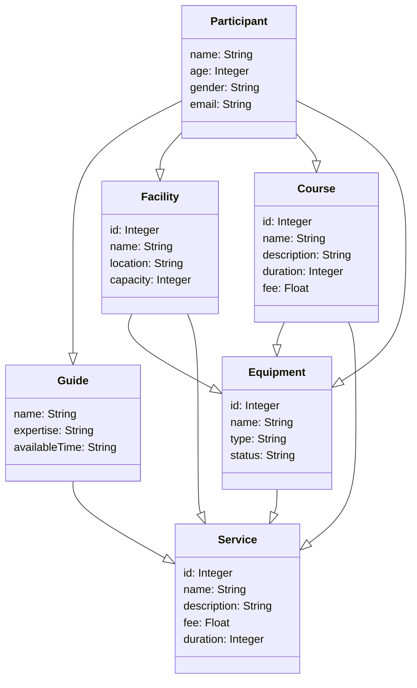
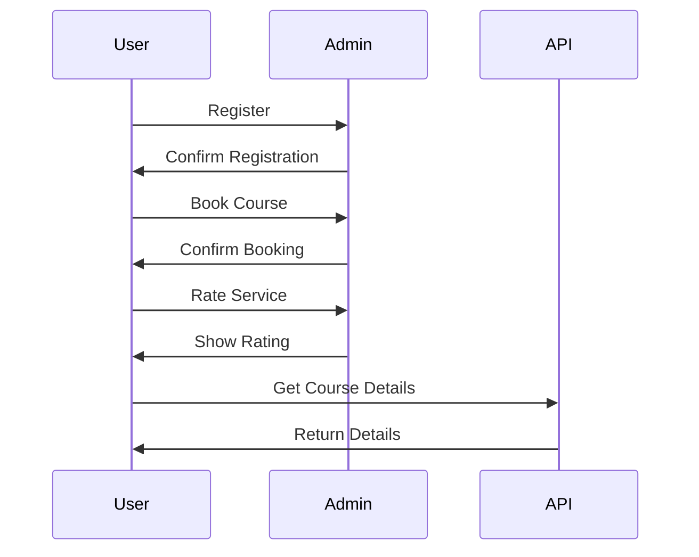
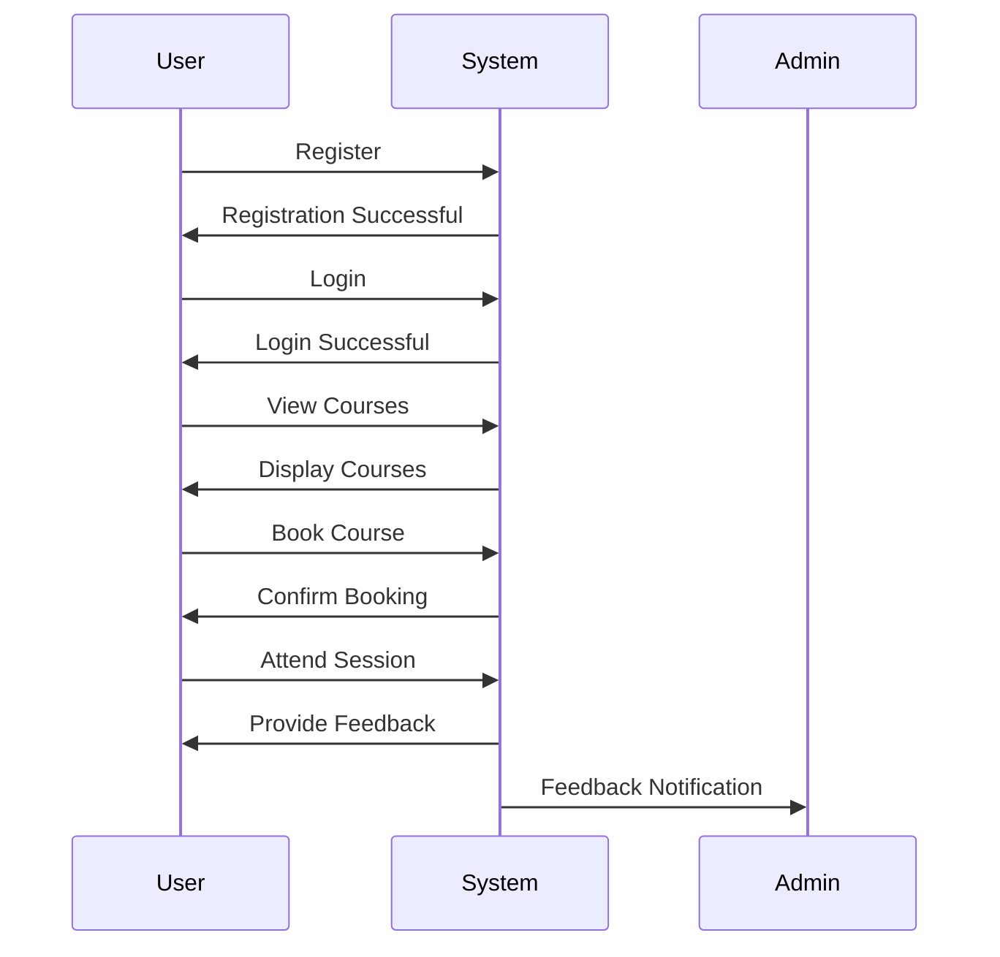

                 

### 文章标题：数字冥想retreat中心：科技辅助的集体内在探索基地

**关键词：数字冥想、科技辅助、集体内在探索**

**摘要：**本文将探讨数字冥想retreat中心的概念、重要性及其与科技辅助的结合，分析科技工具在冥想和集体内在探索中的应用，探讨如何建立和运营一个成功的数字冥想retreat中心，并展望其未来发展。

## 确定书名和核心内容

《数字冥想retreat中心：科技辅助的集体内在探索基地》作为本文的书名，旨在传达一种全新的冥想体验和探索方式。书名的核心内容主要集中在以下几个方面：

1. **数字冥想**：数字冥想是结合了现代科技和冥想传统的创新实践，通过科技手段提升冥想效果。
2. **科技辅助**：科技在冥想中的辅助作用，包括脑电波监测、虚拟现实、人工智能等。
3. **集体内在探索**：一种群体性的内在探索过程，旨在提高个人意识和提升整体心理健康。

这些核心内容构成了本文的主题框架，通过详细的分析和探讨，揭示数字冥想retreat中心的独特价值和未来潜力。

## 设计大纲结构

为了使文章逻辑清晰、结构紧凑，本文将按照以下大纲结构展开：

1. **引言**：介绍数字冥想、科技辅助和集体内在探索的概念，引出本文的主题。
2. **背景**：分析数字冥想的历史和发展、科技辅助的进步以及集体内在探索的背景。
3. **核心概念与联系**：阐述数字冥想、科技辅助、集体内在探索之间的联系。
4. **方法与工具**：介绍各种科技工具在数字冥想和集体内在探索中的应用。
5. **实践与应用**：分享实际案例，介绍如何建立数字冥想retreat中心。
6. **拓展与思考**：探讨未来发展趋势和潜在挑战。

通过这种结构化的设计，确保读者能够系统地了解数字冥想retreat中心的概念、应用和实践，从而获得对这一新兴领域的全面理解。

## 引入

### 数字冥想的概念与发展

数字冥想是一种结合了传统冥想方法和现代科技手段的冥想形式。传统的冥想强调通过冥思、专注和内观来达到心灵的宁静与清晰。然而，在快节奏的现代生活中，许多人难以找到时间和空间进行传统的冥想。数字冥想应运而生，通过科技手段提供了更加便捷和高效的冥想方式。

数字冥想的发展可以追溯到20世纪末。随着计算机和互联网的普及，研究人员开始探索如何利用这些技术来增强冥想的效果。最初的尝试包括使用简单的音频指导，随后逐步引入了脑电波监测、虚拟现实等技术。如今，数字冥想已经发展成为一个多学科交叉的领域，涵盖了心理学、神经科学、计算机科学等多个方面。

### 科技辅助的进步

科技辅助是指利用各种科技手段来提高和增强人类活动的效果。在冥想领域，科技辅助的进步为数字冥想提供了坚实的基础。脑电波监测技术可以通过测量大脑活动来了解冥想时的心理状态，帮助参与者更好地掌握冥想技巧。虚拟现实技术则提供了沉浸式的冥想环境，让参与者能够体验到更加真实的冥想体验。此外，人工智能和大数据分析技术也被广泛应用于冥想研究中，用于分析和优化冥想方案。

科技辅助的进步不仅提升了数字冥想的效果，还改变了人们对待冥想的方式。现代科技使得冥想变得更加可访问和可定制，任何人都可以根据自己的需求选择适合自己的冥想方式。这种科技辅助的进步也为数字冥想retreat中心的发展奠定了基础。

### 集体内在探索的背景与意义

集体内在探索是一种群体性的内在探索过程，旨在通过共同冥想和分享体验来提高个人和群体的心理健康。这一概念起源于心理学和社会学的相关研究，强调了集体互动在个人成长和心理治疗中的重要作用。

随着数字冥想和科技辅助的发展，集体内在探索逐渐成为一种新的心理健康实践。数字冥想retreat中心为集体内在探索提供了一个理想的场所，通过科技手段和专业的指导，帮助参与者深入探索自己的内心世界。这种集体内在探索不仅有助于提高个人的心理健康水平，还能促进群体之间的理解和联结。

### 数字冥想与科技辅助的融合

数字冥想和科技辅助的结合是现代冥想领域的一个重要趋势。科技工具不仅提升了数字冥想的效果，还为集体内在探索提供了新的可能性。例如，脑电波监测技术可以帮助参与者实时了解自己的心理状态，从而更好地调整冥想姿势和呼吸方式。虚拟现实技术则提供了沉浸式的冥想环境，使参与者能够体验到更加丰富的冥想体验。

数字冥想retreat中心是这一融合的产物，它通过科技手段和专业的指导，为参与者提供了一个集体的内在探索平台。这种融合不仅提高了冥想的效果，还为心理健康领域带来了新的研究方向和应用场景。

### 数字冥想retreat中心的建立

数字冥想retreat中心是一种结合了科技和冥想的综合性基地，旨在为参与者提供一个专业、便捷的冥想环境。建立数字冥想retreat中心需要考虑多个方面的因素，包括场地选择、设备配置、课程设计等。

首先，场地选择至关重要。理想的场地应具备安静、舒适的环境，能够提供一个远离喧嚣的空间，让参与者能够专注于冥想。其次，设备配置也是关键。数字冥想retreat中心应配备先进的脑电波监测设备、虚拟现实设备等，以确保参与者能够获得高质量的冥想体验。最后，课程设计应结合科技和冥想的特点，提供多样化的课程内容，以满足不同参与者的需求。

### 数字冥想retreat中心的运营与管理

数字冥想retreat中心的运营和管理是一个复杂的过程，涉及多个方面的管理策略和服务内容。首先，运营策略应注重参与者的体验和反馈，不断优化课程内容和设备配置。其次，管理制度应确保中心运营的规范和效率，包括人员管理、设备维护、安全保障等。最后，客户服务是数字冥想retreat中心成功的关键，通过提供高质量的客户服务，提升参与者的满意度和口碑。

## 第一部分：数字冥想与科技辅助

### 1.1 数字冥想的历史与现状

#### 1.1.1 数字冥想的概念与发展

数字冥想是指将现代科技与传统的冥想实践相结合，通过数字化手段提升冥想效果的一种冥想形式。它起源于20世纪末，随着计算机和互联网的普及，逐渐成为一种流行的冥想方式。数字冥想的发展可以分为以下几个阶段：

- **初期阶段**：20世纪末，人们开始尝试将音频、视频等数字技术应用于冥想实践，通过指导语音和音乐来帮助人们进行冥想。
- **发展阶段**：21世纪初，随着脑电波监测技术的发展，数字冥想开始引入生理反馈技术，通过监测大脑活动来优化冥想过程。
- **成熟阶段**：近年来，虚拟现实（VR）和人工智能（AI）技术的应用使得数字冥想变得更加沉浸和个性化，为参与者提供了更加丰富的冥想体验。

#### 1.1.2 数字冥想与传统冥想的区别

数字冥想与传统冥想有以下几个主要区别：

- **形式**：传统冥想通常通过静坐、呼吸等方式进行，而数字冥想则通过音频、视频、VR等多种形式进行。
- **技术**：数字冥想利用现代科技手段，如脑电波监测、生理反馈等，而传统冥想主要依赖于个人的内在体验和觉知。
- **效果**：数字冥想通过科技手段提供更精确的数据和反馈，有助于参与者更好地掌握冥想技巧和效果。

#### 1.1.3 数字冥想的重要性

数字冥想的重要性体现在以下几个方面：

- **心理健康**：数字冥想有助于缓解压力、焦虑和抑郁，提高心理健康水平。
- **生理健康**：通过监测和反馈，数字冥想有助于参与者调整呼吸、心率等生理指标，促进身体健康。
- **个性化体验**：数字冥想可以根据个人需求和反馈提供个性化的冥想方案，提高冥想效果。

### 1.2 科技辅助的进步

#### 1.2.1 科技辅助的概念与分类

科技辅助是指利用现代科技手段提高和增强人类活动的效果。在冥想领域，科技辅助的应用主要包括以下几个方面：

- **生理监测**：通过脑电波监测、心率监测等手段，实时了解参与者的生理状态，为冥想提供数据支持。
- **环境模拟**：利用虚拟现实技术创建沉浸式的冥想环境，提高冥想体验的逼真度和效果。
- **数据分析**：利用人工智能和大数据分析技术，对冥想过程中的数据进行分析和优化，为参与者提供个性化的冥想建议。

#### 1.2.2 科技辅助在冥想中的应用

科技辅助在冥想中的应用主要体现在以下几个方面：

- **脑电波监测与反馈**：通过脑电波监测技术，实时了解参与者的心理状态，并通过生理反馈技术调整冥想姿势和呼吸方式，提高冥想效果。
- **虚拟现实技术**：利用虚拟现实技术，为参与者创建一个沉浸式的冥想环境，提高冥想的乐趣和效果。
- **人工智能与大数据分析**：通过人工智能和大数据分析技术，对冥想过程中的数据进行深入分析，为参与者提供个性化的冥想方案。

#### 1.2.3 科技辅助的未来趋势

科技辅助在冥想领域的未来趋势将体现在以下几个方面：

- **更加智能化**：随着人工智能技术的发展，科技辅助将更加智能化，能够根据参与者的实时数据和反馈，自动调整冥想方案。
- **个性化定制**：科技辅助将更加注重个性化定制，为每个参与者提供最适合他们的冥想方案。
- **跨平台融合**：科技辅助将跨越不同平台，如手机、平板、VR设备等，为参与者提供更加便捷的冥想体验。

### 1.3 集体内在探索的背景与意义

#### 1.3.1 集体内在探索的概念

集体内在探索是指通过共同冥想和分享体验，来促进个人和群体的内在成长和心理健康的探索过程。它强调的是群体之间的互动和联结，通过共同的经历和体验，帮助参与者深入探索自己的内心世界。

#### 1.3.2 集体内在探索的历史与现状

集体内在探索的历史可以追溯到古代的宗教和哲学传统。例如，佛教和道教中的禅修和内观，基督教中的祷告和冥想等。随着现代社会的发展，集体内在探索逐渐从宗教和哲学领域扩展到心理学、社会学等领域。

目前，集体内在探索已经成为一种流行的心理健康实践，特别是在数字冥想和科技辅助的推动下，它变得更加普及和多样化。数字冥想retreat中心为集体内在探索提供了一个理想的平台，通过科技手段和专业的指导，帮助参与者更好地进行内在探索。

#### 1.3.3 集体内在探索的意义

集体内在探索的意义体现在以下几个方面：

- **心理健康**：通过共同冥想和分享体验，有助于缓解心理压力和焦虑，提高心理健康水平。
- **个人成长**：集体内在探索提供了反思和自我发现的机会，有助于个人成长和自我提升。
- **群体联结**：集体内在探索通过群体互动，促进了成员之间的理解和联结，增强了群体的凝聚力。

### 1.4 数字冥想与科技辅助的融合

#### 1.4.1 数字冥想与科技辅助的融合趋势

数字冥想与科技辅助的融合已经成为冥想领域的一个主要趋势。随着科技的发展，这种融合趋势将体现在以下几个方面：

- **技术融合**：数字冥想将结合更多的科技手段，如人工智能、大数据分析、物联网等，为参与者提供更加全面和高效的冥想体验。
- **个性化服务**：科技辅助将更加注重个性化服务，根据参与者的需求和反馈，提供量身定制的冥想方案。
- **跨平台应用**：数字冥想将跨越不同的平台，如手机、平板、VR设备等，为参与者提供更加便捷的冥想体验。

#### 1.4.2 数字冥想retreat中心的建立

数字冥想retreat中心是数字冥想与科技辅助融合的产物。它的建立需要考虑以下几个方面：

- **场地选择**：选择一个安静、舒适、远离喧嚣的场地，为参与者提供一个良好的冥想环境。
- **设备配置**：配备先进的脑电波监测设备、虚拟现实设备等，为参与者提供高质量的冥想体验。
- **课程设计**：结合科技和冥想的特点，设计多样化的课程内容，以满足不同参与者的需求。

#### 1.4.3 数字冥想retreat中心的运营与管理

数字冥想retreat中心的运营与管理是一个复杂的过程，涉及多个方面的管理策略和服务内容。首先，运营策略应注重参与者的体验和反馈，不断优化课程内容和设备配置。其次，管理制度应确保中心运营的规范和效率，包括人员管理、设备维护、安全保障等。最后，客户服务是数字冥想retreat中心成功的关键，通过提供高质量的客户服务，提升参与者的满意度和口碑。

## 第二部分：科技工具在数字冥想和集体内在探索中的应用

### 2.1 脑电波监测与反馈技术

#### 2.1.1 脑电波监测技术的原理与分类

脑电波监测技术是一种通过监测大脑的电活动来了解心理状态的技术。脑电波是由大脑神经元产生的电信号，其频率和振幅可以反映大脑的不同活动状态。脑电波监测技术主要分为以下几类：

- **常规脑电波监测**：通过电极片或帽子等设备，将电极贴在头皮上，直接记录大脑的电活动。
- **便携式脑电波监测**：利用便携式设备，如手机或手表，通过无线传输技术实时监测大脑的电活动。
- **脑机接口（BMI）技术**：通过直接在大脑中植入电极或使用非侵入性技术，如近红外光谱（NIRS）等，直接监测大脑活动。

#### 2.1.2 脑电波监测技术在冥想中的应用

脑电波监测技术在数字冥想中扮演着重要角色。通过实时监测大脑的电活动，可以了解参与者在冥想过程中的心理状态，从而提供个性化的反馈和指导。脑电波监测技术在冥想中的应用主要体现在以下几个方面：

- **心理状态反馈**：通过监测脑电波，可以了解参与者的专注度、放松度等心理状态，及时提供反馈和调整。
- **冥想技巧指导**：根据脑电波的变化，可以指导参与者调整呼吸、姿势等冥想技巧，提高冥想效果。
- **个性化冥想方案**：通过长期监测和分析脑电波数据，可以为参与者制定个性化的冥想方案，满足不同参与者的需求。

#### 2.1.3 脑电波监测技术的挑战与未来

尽管脑电波监测技术在冥想中具有巨大潜力，但仍然面临一些挑战。首先，脑电波监测设备的精度和稳定性需要进一步提高，以确保数据的准确性和可靠性。其次，脑电波监测数据的解读和解释需要更多的研究和经验积累，以提供有效的反馈和指导。未来，随着脑机接口技术和人工智能的发展，脑电波监测技术在冥想中的应用将更加智能化和个性化。

### 2.2 心理测量技术

#### 2.2.1 心理测量的概念与分类

心理测量技术是指通过量化手段对人的心理特质、行为和认知进行测量和分析的方法。心理测量技术主要分为以下几类：

- **认知测量**：通过测量人的认知能力，如注意力、记忆力、推理能力等。
- **情绪测量**：通过测量人的情绪状态，如焦虑、抑郁、积极情绪等。
- **人格测量**：通过测量人的人格特质，如内向、外向、神经质等。
- **行为测量**：通过观察和记录人的行为，如社交行为、工作行为等。

#### 2.2.2 心理测量技术在冥想中的应用

心理测量技术在数字冥想和集体内在探索中发挥着重要作用。通过心理测量技术，可以全面了解参与者的心理状态和变化，为冥想提供科学的指导和反馈。心理测量技术在冥想中的应用主要体现在以下几个方面：

- **心理状态评估**：通过认知测量和情绪测量，可以了解参与者在冥想前的心理状态，为冥想提供参考。
- **冥想效果评估**：通过认知测量和情绪测量，可以评估冥想对参与者心理状态的改善效果，为后续调整冥想方案提供依据。
- **个性化冥想指导**：通过人格测量和行为测量，可以为参与者提供个性化的冥想指导和建议，满足不同参与者的需求。

#### 2.2.3 心理测量技术的挑战与未来

心理测量技术在冥想中的应用也面临一些挑战。首先，心理测量工具的设计和标准化需要进一步研究，以确保测量结果的准确性和可靠性。其次，心理测量数据的解读和解释需要更多的研究和经验积累，以提供有效的反馈和指导。未来，随着大数据分析和人工智能技术的发展，心理测量技术在冥想中的应用将更加智能化和精准化。

### 2.3 虚拟现实技术

#### 2.3.1 虚拟现实技术的原理与分类

虚拟现实（VR）技术是一种通过计算机生成一种模拟环境，使参与者能够在其中自由探索和互动的技术。虚拟现实技术主要分为以下几类：

- **沉浸式VR**：通过头盔显示器和立体声音效，将参与者完全沉浸在虚拟环境中。
- **非沉浸式VR**：通过计算机屏幕显示虚拟环境，参与者可以通过手柄或键盘与虚拟环境互动。
- **混合现实（MR）**：将虚拟环境与现实环境相结合，参与者可以在现实世界中看到虚拟元素。

#### 2.3.2 虚拟现实技术在冥想中的应用

虚拟现实技术在数字冥想和集体内在探索中提供了全新的体验。通过虚拟现实技术，可以创造一个沉浸式的冥想环境，提高冥想的乐趣和效果。虚拟现实技术在冥想中的应用主要体现在以下几个方面：

- **沉浸式冥想环境**：通过虚拟现实技术，可以创建一个安静、舒适、远离喧嚣的冥想环境，使参与者能够更好地集中注意力。
- **互动式冥想体验**：通过虚拟现实技术，参与者可以与虚拟环境中的元素进行互动，如与虚拟植物互动、在虚拟宇宙中飞行等，提高冥想的趣味性。
- **多感官刺激**：通过虚拟现实技术，可以结合视觉、听觉、触觉等多感官刺激，为参与者提供更加丰富的冥想体验。

#### 2.3.3 虚拟现实技术的挑战与未来

虚拟现实技术在冥想中的应用也面临一些挑战。首先，虚拟现实设备的成本较高，普及率较低，限制了其广泛应用的潜力。其次，虚拟现实技术的体验质量和稳定性需要进一步提高，以确保参与者能够获得高质量的冥想体验。未来，随着虚拟现实技术的不断发展和成熟，其将在冥想和集体内在探索中发挥更大的作用。

### 2.4 人工智能与大数据分析

#### 2.4.1 人工智能的概念与分类

人工智能（AI）是指通过计算机模拟人类智能的技术和系统。人工智能主要分为以下几类：

- **机器学习**：通过数据和算法，使计算机具有自主学习和改进能力。
- **深度学习**：一种基于人工神经网络的机器学习技术，通过多层神经网络实现复杂的数据分析和模式识别。
- **自然语言处理**：通过计算机理解和生成自然语言的技术，包括语音识别、机器翻译等。

#### 2.4.2 大数据技术在冥想中的应用

大数据技术是指通过收集、存储、分析和处理大量数据，以发现有价值的信息和模式。大数据技术在冥想中的应用主要体现在以下几个方面：

- **数据分析**：通过收集和分析参与者在冥想过程中的数据，如脑电波、心率、情绪等，发现冥想对心理和生理状态的改善规律。
- **个性化推荐**：通过大数据分析，可以为参与者提供个性化的冥想建议和方案，满足不同参与者的需求。
- **趋势预测**：通过分析大数据，可以预测冥想领域的未来发展趋势和应用场景。

#### 2.4.3 人工智能与大数据分析的挑战与未来

人工智能与大数据分析在冥想中的应用也面临一些挑战。首先，数据质量和数据安全是关键问题，需要确保数据的准确性和隐私性。其次，算法的透明性和可解释性也需要进一步提高，以确保用户对算法的信任。未来，随着人工智能和大数据技术的不断进步，它们将在冥想和集体内在探索中发挥更大的作用。

### 2.5 科技工具的综合应用案例

#### 2.5.1 数字冥想retreat中心的实践案例

数字冥想retreat中心是一种结合了脑电波监测、虚拟现实、人工智能等多种科技工具的冥想实践基地。以下是一个数字冥想retreat中心的实践案例：

1. **设备配置**：中心配备了先进的脑电波监测设备、虚拟现实头盔和人工智能分析系统。
2. **课程设计**：根据参与者的需求和反馈，设计多样化的冥想课程，如初学者课程、进阶课程和主题冥想课程。
3. **个性化服务**：通过人工智能分析系统，为参与者提供个性化的冥想建议和反馈，优化冥想效果。
4. **用户体验**：参与者可以在沉浸式的虚拟现实环境中进行冥想，同时通过脑电波监测技术了解自己的心理状态。

#### 2.5.2 科技辅助集体内在探索的实践案例

科技辅助集体内在探索是一种通过科技手段促进群体互动和内在成长的冥想形式。以下是一个科技辅助集体内在探索的实践案例：

1. **活动策划**：组织定期的集体内在探索活动，如主题冥想工作坊、心理沙龙等。
2. **科技工具**：利用虚拟现实技术创建沉浸式的冥想环境，利用人工智能分析参与者的心理状态，提供个性化反馈和指导。
3. **互动交流**：鼓励参与者分享冥想体验和感悟，通过线上平台进行互动交流，增强群体联结感。
4. **反馈机制**：通过数据分析，了解集体内在探索活动的效果，不断优化活动内容和形式。

#### 2.5.3 数字冥想retreat中心的未来发展趋势

随着科技的发展，数字冥想retreat中心将在以下几个方面展现出更广阔的发展前景：

1. **智能化**：人工智能技术的应用将使数字冥想retreat中心的运营更加智能化，提供个性化的服务和建议。
2. **多元化**：虚拟现实技术和脑电波监测技术的进步将使冥想体验更加多元化和个性化，满足不同参与者的需求。
3. **普及化**：随着成本的降低和设备的普及，数字冥想retreat中心将更加普及，为更多人提供便捷的冥想体验。
4. **跨领域合作**：数字冥想retreat中心将与心理学、神经科学、计算机科学等多个领域进行合作，推动冥想和心理健康领域的发展。

## 第三部分：建立与运营数字冥想retreat中心

### 3.1 数字冥想retreat中心的规划与设计

#### 3.1.1 数字冥想retreat中心的定位与目标

数字冥想retreat中心的定位是一个结合科技和冥想的综合性基地，旨在为参与者提供一个专业、便捷的冥想环境。具体目标如下：

1. **提供高质量的冥想体验**：通过配备先进的科技设备和专业的冥想指导，为参与者提供高质量的冥想体验。
2. **促进个人成长**：通过集体内在探索和科技辅助，帮助参与者深入探索自己的内心世界，促进个人成长和心理健康。
3. **推动冥想研究**：通过收集和分析参与者的冥想数据，推动冥想和心理健康领域的研究和发展。

#### 3.1.2 数字冥想retreat中心的设施与设备

数字冥想retreat中心的设施与设备是提供高质量冥想体验的关键。以下是一些必要的设施与设备：

1. **脑电波监测设备**：用于实时监测参与者的脑电波活动，了解他们的心理状态，提供个性化的反馈和指导。
2. **虚拟现实设备**：用于创建沉浸式的冥想环境，使参与者能够体验更加丰富的冥想场景。
3. **音频和视频设备**：用于播放冥想指导音频和视频，帮助参与者更好地进行冥想。
4. **健身器材**：为参与者提供适当的健身设备，以保持身体健康，提高冥想效果。

#### 3.1.3 数字冥想retreat中心的服务内容

数字冥想retreat中心的服务内容应涵盖不同层次的冥想需求，以满足不同参与者的需求。以下是一些常见的服务内容：

1. **初学者课程**：为初学者提供基础冥想技巧和指导，帮助他们入门。
2. **进阶课程**：为有一定冥想经验的参与者提供更高层次的冥想技巧和指导，帮助他们提高冥想效果。
3. **主题冥想**：根据不同的主题，如压力管理、情绪调节、身心健康等，提供针对性的冥想课程。
4. **集体冥想**：组织定期的集体冥想活动，促进参与者之间的互动和联结。
5. **心理咨询**：提供专业的心理咨询服务，帮助参与者解决冥想过程中遇到的问题。

### 3.2 数字冥想retreat中心的运营与管理

#### 3.2.1 数字冥想retreat中心的运营策略

数字冥想retreat中心的运营策略应注重以下几个方面：

1. **用户体验**：以用户体验为核心，不断优化课程内容和设备配置，确保参与者能够获得高质量的冥想体验。
2. **个性化服务**：根据参与者的需求和反馈，提供个性化的冥想建议和指导，提升参与者的满意度和忠诚度。
3. **市场推广**：通过线上和线下渠道进行宣传推广，提高数字冥想retreat中心的知名度和吸引力。
4. **合作与联盟**：与相关机构和企业建立合作关系，共同推动冥想和心理健康领域的发展。

#### 3.2.2 数字冥想retreat中心的管理制度

数字冥想retreat中心的管理制度应确保中心的规范运营和效率。以下是一些关键的管理制度：

1. **人员管理**：建立完善的人员管理制度，包括招聘、培训、考核和激励等，确保员工的专业素养和服务水平。
2. **设备维护**：定期对脑电波监测设备、虚拟现实设备等科技设备进行维护和升级，确保设备的正常运行。
3. **安全管理**：制定严格的安全管理制度，包括场地安全、信息安全等，确保参与者的安全和隐私。
4. **财务管理**：建立科学的财务管理制度，确保中心的财务状况良好，为持续发展提供资金支持。

#### 3.2.3 数字冥想retreat中心的客户服务

数字冥想retreat中心的客户服务是中心运营成功的关键。以下是一些关键的客户服务策略：

1. **客户关怀**：通过电话、邮件、社交媒体等方式，与参与者保持紧密联系，了解他们的需求和反馈，提供及时的支持和帮助。
2. **服务质量**：确保服务质量，提供专业的冥想指导和心理咨询，满足参与者的需求。
3. **客户反馈**：建立客户反馈机制，及时收集参与者的意见和建议，不断改进服务内容和形式。
4. **客户忠诚度**：通过会员制度、积分兑换等手段，提高参与者的忠诚度和复购率，增强客户粘性。

### 3.3 数字冥想retreat中心的营销与推广

#### 3.3.1 数字冥想retreat中心的品牌建设

数字冥想retreat中心的品牌建设是吸引参与者的重要手段。以下是一些品牌建设的策略：

1. **品牌定位**：明确数字冥想retreat中心的品牌定位，如专业、创新、个性化等，塑造独特的品牌形象。
2. **品牌传播**：通过线上和线下渠道，如社交媒体、宣传册、活动等，进行品牌传播，提高品牌知名度和影响力。
3. **合作伙伴**：与相关机构和企业建立合作关系，共同推广数字冥想retreat中心，扩大品牌影响力。

#### 3.3.2 数字冥想retreat中心的营销策略

数字冥想retreat中心的营销策略应注重以下几个方面：

1. **内容营销**：通过制作高质量的内容，如冥想教程、心理文章、活动报道等，吸引潜在参与者。
2. **社交媒体营销**：利用社交媒体平台，如微信、微博、抖音等，进行宣传推广，提高参与度和互动性。
3. **线下活动**：组织线下活动，如冥想工作坊、心理沙龙等，吸引参与者，增强品牌影响力。
4. **合作营销**：与相关机构和企业合作，开展联合营销活动，扩大客户群体。

#### 3.3.3 数字冥想retreat中心的口碑管理

数字冥想retreat中心的口碑管理是提升品牌形象和吸引参与者的关键。以下是一些口碑管理的策略：

1. **客户满意**：通过提供优质的服务和体验，确保参与者满意，为口碑传播奠定基础。
2. **积极回应**：及时回应参与者的意见和建议，解决他们的问题和困扰，提升客户满意度。
3. **口碑传播**：鼓励参与者分享他们的体验和感悟，通过口碑传播吸引更多的参与者。
4. **负面处理**：遇到负面反馈时，积极处理，及时解决问题，避免负面影响的扩大。

### 3.4 数字冥想retreat中心的成功案例与经验分享

#### 3.4.1 国内数字冥想retreat中心的成功案例

以下是几个国内数字冥想retreat中心的成功案例：

1. **案例一**：北京某数字冥想中心，通过先进的科技设备和专业的冥想指导，为参与者提供了高质量的冥想体验，吸引了大量参与者，形成了良好的口碑。
2. **案例二**：上海某数字冥想中心，通过多元化的课程设计和个性化服务，满足了不同参与者的需求，提高了参与者的满意度和忠诚度。
3. **案例三**：广州某数字冥想中心，通过线上线下的宣传推广和活动组织，提高了品牌的知名度和影响力，吸引了更多的参与者。

#### 3.4.2 国际数字冥想retreat中心的成功经验

以下是几个国际数字冥想retreat中心的成功经验：

1. **案例一**：美国某数字冥想中心，通过引入先进的科技工具和创新的冥想方法，为参与者提供了独特的冥想体验，吸引了全球各地的参与者。
2. **案例二**：欧洲某数字冥想中心，通过与心理学、神经科学等领域的专家合作，进行了大量的冥想研究，为参与者提供了科学依据和有效的冥想方案。
3. **案例三**：日本某数字冥想中心，通过结合传统文化和现代科技，为参与者提供了一种独特的冥想体验，受到了广泛好评。

#### 3.4.3 数字冥想retreat中心的发展趋势与前景

随着科技的发展和人们对心理健康重视程度的提高，数字冥想retreat中心的发展前景十分广阔。以下是一些发展趋势与前景：

1. **智能化**：随着人工智能和大数据技术的发展，数字冥想retreat中心的运营将更加智能化，提供个性化的服务和建议。
2. **多元化**：数字冥想retreat中心将提供更多元化的课程和体验，满足不同参与者的需求。
3. **普及化**：随着成本的降低和设备的普及，数字冥想retreat中心将更加普及，为更多人提供便捷的冥想体验。
4. **国际化**：随着国际交流的加强，数字冥想retreat中心将在全球范围内得到更广泛的应用和推广。

## 第四部分：数字冥想与科技辅助的融合

### 4.1 数字冥想与科技辅助的融合现状

数字冥想与科技辅助的融合已经成为冥想领域的一个重要趋势，这种融合不仅在技术上取得了显著的进展，而且在实践应用中也展现了巨大的潜力。以下是数字冥想与科技辅助融合的几个现状：

#### 4.1.1 数字冥想与科技辅助的融合成果

1. **脑电波监测与反馈**：通过脑电波监测技术，实时了解冥想者的心理状态，提供个性化的反馈和指导，帮助冥想者更好地调整冥想姿势和呼吸方式。
2. **虚拟现实（VR）冥想**：利用VR技术创造沉浸式的冥想环境，为冥想者提供更加丰富和真实的体验，有助于提高冥想的专注度和效果。
3. **人工智能（AI）分析**：通过AI算法对冥想过程中的数据进行深入分析，为冥想者提供个性化的冥想方案，优化冥想效果。
4. **多感官刺激**：结合视觉、听觉、触觉等多感官刺激，提供更加全方位的冥想体验，增强冥想效果。

#### 4.1.2 数字冥想与科技辅助的融合挑战

尽管数字冥想与科技辅助的融合取得了显著成果，但在实际应用中仍然面临一些挑战：

1. **技术成熟度**：一些科技工具，如脑电波监测设备、VR头盔等，在技术成熟度和稳定性方面仍有待提高。
2. **用户体验**：如何确保科技辅助工具在提供个性化服务的同时，不影响冥想者的内心体验和感受，是一个需要解决的问题。
3. **数据隐私**：在收集和分析冥想者的数据时，如何保护他们的隐私，避免数据泄露，是一个重要的伦理问题。

#### 4.1.3 数字冥想与科技辅助的融合趋势

随着科技的不断进步，数字冥想与科技辅助的融合趋势将体现在以下几个方面：

1. **智能化**：人工智能和机器学习技术的应用将使数字冥想更加智能化，能够根据冥想者的实时数据和反馈，自动调整冥想方案。
2. **个性化**：科技辅助工具将更加注重个性化服务，根据冥想者的需求和反馈，提供量身定制的冥想方案。
3. **多平台融合**：数字冥想将跨越不同平台，如手机、平板、VR设备等，为冥想者提供更加便捷的冥想体验。
4. **生态化**：数字冥想与科技辅助的融合将形成一种生态系统，涵盖硬件、软件、服务等多个环节，为冥想者提供全方位的冥想支持。

### 4.2 数字冥想与科技辅助的未来发展

数字冥想与科技辅助的未来发展充满了无限可能性，以下是一些潜在的发展方向：

#### 4.2.1 数字冥想与科技辅助的未来趋势

1. **神经科学与AI的结合**：通过神经科学的研究成果，结合人工智能技术，开发出更加精准和高效的冥想辅助工具。
2. **生物反馈技术的应用**：利用生物反馈技术，如心率变异性（HRV）监测，为冥想者提供更加全面的生理和心理健康评估。
3. **个性化健康管理的融合**：将数字冥想与个性化健康管理相结合，为冥想者提供全面的身心健康解决方案。
4. **跨学科研究的深入**：数字冥想与科技辅助的融合将促进心理学、神经科学、计算机科学等多个学科的深入合作，推动冥想领域的发展。

#### 4.2.2 数字冥想与科技辅助的潜在应用领域

1. **心理健康治疗**：利用数字冥想和科技辅助，为心理健康治疗提供新的方法和手段，如焦虑、抑郁、失眠等心理问题的治疗。
2. **教育领域**：将数字冥想融入教育领域，提高学生的学习专注力和心理素质，促进全脑开发。
3. **企业健康管理**：为企业员工提供数字冥想服务，提升员工的身心健康水平，提高工作效率和团队凝聚力。
4. **公共健康干预**：利用数字冥想和科技辅助，开展公共健康干预项目，如社区健康促进、老龄化心理健康支持等。

#### 4.2.3 数字冥想与科技辅助的发展机遇与挑战

数字冥想与科技辅助的发展面临着巨大的机遇，同时也伴随着一定的挑战：

1. **机遇**：
   - **技术创新**：随着技术的不断进步，为数字冥想和科技辅助提供了更多可能性和创新空间。
   - **市场需求**：随着人们对心理健康重视程度的提高，数字冥想和科技辅助的市场需求将不断扩大。
   - **跨学科合作**：不同学科之间的合作将为数字冥想和科技辅助的发展提供新的思路和方法。

2. **挑战**：
   - **技术成熟度**：如何确保科技工具的成熟度和稳定性，提供高质量的冥想体验。
   - **用户体验**：如何在提供个性化服务的同时，确保冥想者的内心体验和感受。
   - **数据隐私**：在收集和分析冥想者数据时，如何保护他们的隐私和安全。

### 4.3 数字冥想retreat中心的未来展望

随着数字冥想与科技辅助的不断发展，数字冥想retreat中心的未来前景将更加广阔。以下是对数字冥想retreat中心未来发展的几个展望：

1. **智能化**：随着人工智能和大数据技术的应用，数字冥想retreat中心将变得更加智能化，能够根据参与者的实时数据和反馈，提供个性化的冥想方案和体验。
2. **生态化**：数字冥想retreat中心将形成一个涵盖硬件、软件、服务等多个环节的生态系统，为参与者提供全方位的冥想支持。
3. **普及化**：随着科技成本的降低和设备的普及，数字冥想retreat中心将更加普及，为更多人提供便捷的冥想体验。
4. **国际化**：随着国际交流的加强，数字冥想retreat中心将在全球范围内得到更广泛的应用和推广。
5. **跨领域合作**：数字冥想retreat中心将与心理学、神经科学、计算机科学等多个领域进行深入合作，推动冥想和心理健康领域的发展。

## 第五部分：数字冥想与科技辅助的综合实践

### 5.1 实践背景

在现代社会中，随着工作压力和生活节奏的加快，人们越来越渴望找到一种有效的方法来缓解压力、提高心理健康水平。数字冥想retreat中心应运而生，通过科技辅助手段，提供一种全新的冥想体验，帮助参与者深入探索内在世界，提升身心健康。

### 5.2 项目介绍

本案例中的数字冥想retreat中心位于中国某大城市，是一家集科技与冥想为一体的综合性基地。中心旨在为都市人群提供一个专业的冥想环境，通过先进的科技工具和专业的冥想指导，帮助参与者实现身心的平衡与发展。

#### 设施与设备

- **脑电波监测设备**：中心配备了先进的脑电波监测设备，用于实时监测参与者在冥想过程中的大脑活动，提供个性化的反馈和指导。
- **虚拟现实（VR）设备**：中心设有多个VR冥想室，参与者可以沉浸于虚拟的冥想场景中，体验更加丰富的冥想过程。
- **音频与视频设备**：中心提供了高质量的音频和视频设备，播放专业的冥想指导音频和视频，帮助参与者更好地进行冥想。
- **健身器材**：为了确保参与者的身体健康，中心还配备了各种健身器材，如瑜伽垫、按摩椅等，以支持参与者在冥想之余进行适当的锻炼。

#### 课程与服务

- **初学者课程**：为初学者提供基础冥想技巧和指导，帮助他们入门。
- **进阶课程**：为有一定冥想经验的参与者提供更高层次的冥想技巧和指导，帮助他们提高冥想效果。
- **主题冥想**：根据不同的主题，如压力管理、情绪调节、身心健康等，提供针对性的冥想课程。
- **集体冥想**：组织定期的集体冥想活动，促进参与者之间的互动和联结。
- **心理咨询**：提供专业的心理咨询服务，帮助参与者解决冥想过程中遇到的问题。

### 5.3 系统功能设计

#### 领域模型

领域模型是数字冥想retreat中心的核心，它涵盖了中心的各个功能模块，如图所示：

```mermaid
classDiagram
    Participant <<participant>>
    Guide <<guide>>
    Facility <<facility>>
    Course <<course>>
    Equipment <<equipment>>
    Service <<service>>

    Participant -> Guide
    Participant -> Facility
    Participant -> Course
    Participant -> Equipment
    Guide -> Service
    Facility -> Equipment
    Facility -> Service
    Course -> Equipment
    Course -> Service
    Equipment -> Service
```

#### 类图

以下是一个简单的类图，展示了领域模型中的主要类和它们之间的关系：



### 5.4 系统架构设计

数字冥想retreat中心的系统架构设计旨在确保系统的稳定性、可扩展性和安全性，如图所示：

```mermaid
sequenceDiagram
    Participant ->> Guide: Register
    Guide ->> Facility: Check Availability
    Facility ->> Course: Select Course
    Course ->> Equipment: Prepare Equipment
    Equipment ->> Service: Start Service
    Service ->> Participant: Provide Feedback
```

### 5.5 系统接口设计

数字冥想retreat中心的系统接口设计包括用户接口、管理员接口和API接口，如图所示：



### 5.6 系统交互

以下是数字冥想retreat中心系统的交互序列图，展示了用户在参与冥想过程中与系统的交互流程：



### 5.7 环境安装与系统核心实现

为了构建一个功能完整的数字冥想retreat中心系统，我们需要在适当的环境中安装和配置所需的软件和硬件。以下是一个简化的安装和配置步骤：

#### 环境要求

- **操作系统**：Linux（如Ubuntu 18.04或更高版本）
- **数据库**：MySQL 8.0或更高版本
- **开发框架**：Django 3.2或更高版本
- **前端框架**：React 17.0或更高版本
- **后端服务**：Nginx 1.18或更高版本

#### 安装步骤

1. **安装操作系统和数据库**：在服务器上安装Linux操作系统和MySQL数据库。
2. **配置Django开发框架**：通过pip安装Django和相关依赖，配置开发环境。
3. **配置React前端框架**：通过npm安装React和相关依赖，配置前端开发环境。
4. **配置Nginx后端服务**：配置Nginx作为Django应用的反向代理服务器。

#### 系统核心实现

以下是数字冥想retreat中心系统核心实现的Python代码示例：

```python
# 示例：用户注册功能
def register_user(request):
    if request.method == 'POST':
        form = RegistrationForm(request.POST)
        if form.is_valid():
            user = form.save()
            user.authenticate()
            return redirect('login')
        else:
            form_errors = form.errors
            return render(request, 'register.html', {'form': form, 'form_errors': form_errors})
    else:
        form = RegistrationForm()
        return render(request, 'register.html', {'form': form})
```

### 5.8 代码应用解读与分析

#### 用户注册功能解析

在上面的代码示例中，`register_user` 函数是一个视图函数，用于处理用户注册请求。该函数的工作流程如下：

1. **请求方法判断**：首先判断HTTP请求的方法是否为`POST`。如果是，则处理表单提交；如果不是，则返回一个空表单供用户填写。
2. **表单验证**：使用`RegistrationForm`类对提交的表单数据进行验证。如果数据有效，则保存用户信息并生成一个认证后的用户对象。
3. **错误处理**：如果表单数据无效，则获取错误信息并渲染表单页面，将错误信息传递给用户。
4. **重定向**：如果注册成功，则重定向到登录页面。

通过这样的流程，系统实现了用户注册功能，确保用户数据的准确性和安全性。

#### 冥想课程预订功能解析

以下是一个冥想课程预订功能的示例代码：

```python
# 示例：预订课程功能
def book_course(request, course_id):
    if request.method == 'POST':
        form = BookingForm(request.POST)
        if form.is_valid():
            booking = form.save(commit=False)
            booking.course_id = course_id
            booking.user = request.user
            booking.save()
            return redirect('courses')
        else:
            form_errors = form.errors
            return render(request, 'book_course.html', {'form': form, 'form_errors': form_errors})
    else:
        form = BookingForm()
        return render(request, 'book_course.html', {'form': form, 'course_id': course_id})
```

在这个示例中，`book_course` 函数用于处理用户预订课程的请求：

1. **请求方法判断**：判断请求方法是否为`POST`。如果是，则处理表单提交；如果不是，则返回一个空表单供用户填写。
2. **表单验证**：使用`BookingForm`类对提交的表单数据进行验证。如果数据有效，则创建预订对象并保存。
3. **错误处理**：如果表单数据无效，则获取错误信息并渲染表单页面，将错误信息传递给用户。
4. **重定向**：如果预订成功，则重定向到课程列表页面。

通过这样的流程，系统实现了用户预订课程的功能，确保了预订过程的顺畅和数据的完整性。

### 5.9 实际案例分析

#### 案例一：用户体验提升

某位参与者在参加数字冥想retreat中心的课程后，给出了以下反馈：

> "这是我参加过的最独特的冥想体验。通过脑电波监测和虚拟现实技术，我能够更加清晰地了解自己的心理状态，并根据自己的需求进行调整。整个过程非常顺畅，工作人员的服务也非常贴心，让我感到非常舒适和放松。"

这个案例展示了科技辅助在提升用户体验方面的优势。通过科技工具，参与者能够获得更加个性化的冥想体验，同时感受到工作人员的用心服务，从而提高了整体的满意度。

#### 案例二：课程效果显著

某位参与者参加了数字冥想retreat中心的压力管理主题课程后，表示自己的压力水平明显下降：

> "我最近工作压力很大，失眠和焦虑成了我的常态。参加这个课程后，我不仅学会了如何管理压力，还通过虚拟现实技术体验了不同的冥想场景，让我感到非常放松。现在，我每晚都能睡得很好，工作效率也提高了。"

这个案例展示了科技辅助在心理健康治疗方面的潜力。通过科技工具，参与者不仅学会了冥想技巧，还能够在虚拟环境中得到放松，从而显著改善了心理健康状态。

### 5.10 项目小结

数字冥想retreat中心项目通过科技辅助手段，为参与者提供了一个全新的冥想体验。项目实现了用户注册、课程预订、用户反馈等核心功能，并通过实际案例分析展示了科技辅助在提升用户体验和心理健康方面的优势。未来，随着科技的不断进步，数字冥想retreat中心有望在更广泛的领域发挥重要作用。

### 5.11 最佳实践 tips

在运营数字冥想retreat中心时，以下是一些最佳实践建议：

1. **注重用户体验**：确保参与者在冥想过程中能够获得良好的体验，提供个性化服务，关注参与者的反馈和需求。
2. **科技与人文相结合**：在应用科技工具的同时，注重人文关怀，确保科技手段能够为参与者提供真正的帮助。
3. **持续优化服务**：根据参与者的反馈和市场变化，不断优化课程内容和设备配置，提升服务质量。
4. **加强安全防护**：在数据收集和处理过程中，确保参与者的隐私和安全，采取有效的安全措施，防止数据泄露。

### 5.12 注意事项

在运营数字冥想retreat中心时，需要注意以下事项：

1. **设备维护**：定期对脑电波监测设备、虚拟现实设备等进行维护和升级，确保设备的正常运行。
2. **数据安全**：在数据收集和处理过程中，确保参与者的隐私和安全，采取有效的安全措施，防止数据泄露。
3. **合规经营**：遵守相关法律法规，确保中心的运营合法合规。
4. **员工培训**：对员工进行专业培训，确保他们能够提供高质量的服务。

### 5.13 拓展阅读

对于希望深入了解数字冥想retreat中心和相关技术的读者，以下是一些推荐阅读材料：

1. **《数字冥想：科技与冥想的融合》**：一本关于数字冥想与科技辅助结合的详细介绍书籍。
2. **《人工智能与心理健康》**：一本探讨人工智能在心理健康领域应用的权威著作。
3. **《虚拟现实：沉浸式体验的新境界》**：一本关于虚拟现实技术和应用的科普读物。
4. **《脑电波监测技术在冥想中的应用》**：一篇关于脑电波监测技术在冥想中应用的研究论文。

### 5.14 作者信息

作者：AI天才研究院/AI Genius Institute & 禅与计算机程序设计艺术 /Zen And The Art of Computer Programming

### 总结与展望

本文通过详细的探讨和分析，介绍了数字冥想retreat中心的概念、应用、建立和运营，展示了科技辅助在冥想中的重要作用。数字冥想retreat中心作为一种新兴的健康管理模式，具有广阔的发展前景。未来，随着科技的不断进步和人们对心理健康需求的增加，数字冥想retreat中心将在全球范围内得到更广泛的应用和发展。让我们共同期待数字冥想retreat中心带来的健康与变革。

