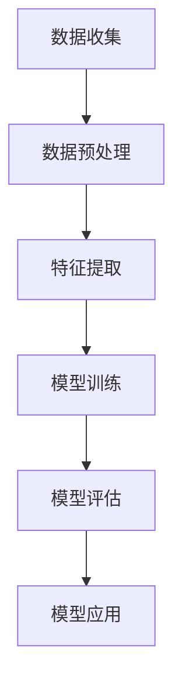
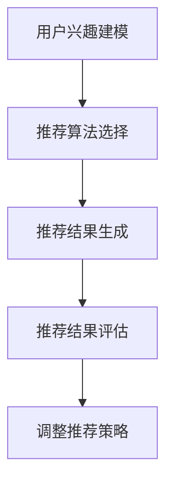
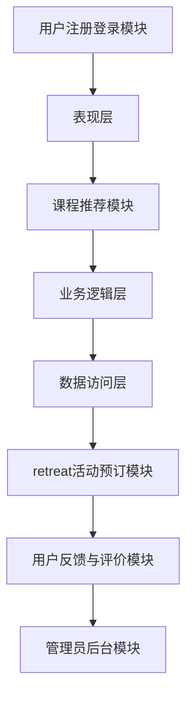
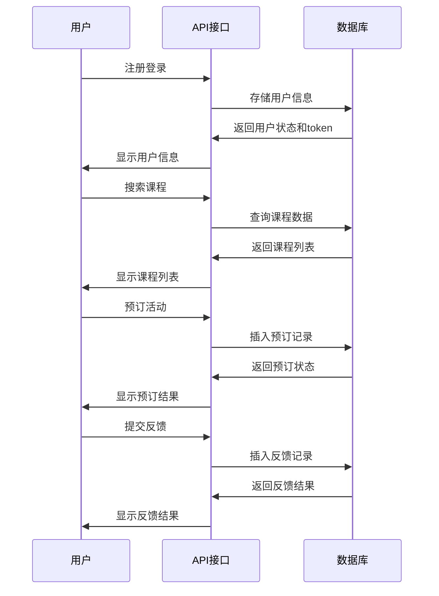

                 

### 目录大纲

在撰写《数字冥想retreat预订平台：科技辅助内在探索体验的预约系统》这篇文章时，我们需要先设计出一个详细的目录大纲，以确保文章的逻辑性和系统性。以下是本文的目录大纲：

---

## 《数字冥想retreat预订平台：科技辅助内在探索体验的预约系统》目录大纲

### 文章关键词
- 数字冥想
- retreat预订平台
- 科技辅助
- 内在探索体验
- 预约系统

### 文章摘要
本文将深入探讨如何通过科技手段，构建一个数字冥想retreat预订平台，为用户提供一种科技辅助下的内在探索体验。我们将从背景介绍、核心概念与联系、算法原理讲解、数学模型和公式讲解、系统分析与架构设计、项目实战以及最佳实践与总结七个部分，逐步分析并解答如何实现这样一个平台。

---

### 第一部分：背景介绍

#### 第1章：数字冥想与retreat预订平台概述
- **1.1 数字冥想的起源与发展**
- **1.2 retreat预订平台的市场需求**
- **1.3 科技在冥想与retreat预订中的应用**

#### 第2章：科技辅助内在探索体验
- **2.1 科技如何提升冥想体验**
- **2.2 数字冥想与retreat预订的融合**

### 第二部分：核心概念与联系

#### 第3章：核心概念与原理
- **3.1 冥想技术的核心概念**
- **3.2 科技在冥想中的应用原理**
- **3.3 内在探索体验的定义与分类**

### 第三部分：算法原理讲解

#### 第4章：关键算法原理
- **4.1 冥想体验评估算法**
- **4.2 用户个性化推荐算法**

#### 第5章：数学模型和公式讲解
- **5.1 冥想体验评估的数学模型**
- **5.2 用户个性化推荐的数学模型**

### 第四部分：系统分析与架构设计

#### 第6章：系统架构与设计
- **6.1 平台功能模块设计**
- **6.2 系统架构设计**
- **6.3 系统接口设计与交互流程**

### 第五部分：项目实战

#### 第7章：项目实战
- **7.1 环境安装与配置**
- **7.2 系统核心实现**
- **7.3 实际案例分析与讲解**
- **7.4 项目小结**

### 第六部分：最佳实践与拓展

#### 第8章：最佳实践与总结
- **8.1 最佳实践建议**
- **8.2 小结**
- **8.3 注意事项**
- **8.4 拓展阅读**

---

通过上述目录大纲的设计，我们可以清晰地看到文章的各个部分是如何有机地连接在一起的，每个章节都有明确的目标和内容，确保文章的逻辑性和连贯性。接下来，我们将按照这个大纲逐步展开，深入探讨每一个章节的内容。---

### 文章标题

《数字冥想retreat预订平台：科技辅助内在探索体验的预约系统》

### 文章关键词

- 数字冥想
- retreat预订平台
- 科技辅助
- 内在探索体验
- 预约系统

### 文章摘要

本文将探讨如何利用科技手段构建一个数字冥想retreat预订平台，为用户提供一种科技辅助下的内在探索体验。文章分为七个部分，包括背景介绍、核心概念与联系、算法原理讲解、数学模型和公式讲解、系统分析与架构设计、项目实战以及最佳实践与总结，旨在为读者提供一个全面、系统的实施方案。

---

### 第一部分：背景介绍

#### 第1章：数字冥想与retreat预订平台概述

**1.1 数字冥想的起源与发展**

数字冥想，作为一种结合现代科技与传统冥想方法的新型冥想方式，近年来在全球范围内迅速兴起。它起源于20世纪末，当时一些科技工作者开始尝试将冥想技术应用于日常生活中的压力管理和心理健康提升。随着互联网和移动设备的普及，数字冥想逐渐从个人修行扩展到了更加广泛的社交和商业领域。

数字冥想的发展历程可以分为以下几个阶段：

1. **初期探索（1990s-2000s）**：在这一阶段，人们开始关注冥想对心理健康的潜在益处，并将其与计算机技术相结合，开发出了早期的冥想应用和设备。
2. **互联网普及（2000s-2010s）**：随着互联网的普及，数字冥想开始借助网络平台传播，形成了线上冥想社区，用户可以通过网络分享冥想经验。
3. **移动设备兴起（2010s-2020s）**：随着智能手机和平板电脑的普及，移动端冥想应用大量涌现，用户可以随时随地体验冥想。

**1.2 retreat预订平台的市场需求**

retreat预订平台，是一种专门为用户提供短期冥想修行活动的在线预订平台。这些平台通常提供包括冥想指导、瑜伽练习、自然疗愈等多种活动，让用户在远离喧嚣的环境中，专注于个人内在的探索和成长。

retreat预订平台的市场需求主要来自以下几个方面：

1. **心理健康意识的提升**：随着现代社会的快速发展，人们面临的压力越来越大，心理健康问题日益突出。许多人开始寻求冥想等心理疗法来缓解压力，提高生活质量。
2. **精神追求与灵性探索**：越来越多的人开始关注内在的成长和精神追求，他们希望通过冥想等修行方式，实现更深层次的自我认识和精神觉醒。
3. **旅游业与健身产业的融合**：随着旅游业和健身产业的快速发展，retreat预订平台作为一种新兴的旅游和健身方式，受到了广泛的关注和欢迎。

**1.3 科技在冥想与retreat预订中的应用**

科技在冥想和retreat预订中的应用，极大地提升了用户体验和活动效果。以下是一些主要的科技应用：

1. **移动应用与在线课程**：用户可以通过手机或平板电脑，随时随地访问冥想课程和指导，不受时间和地点的限制。
2. **智能设备与可穿戴设备**：通过智能设备如智能手表和耳机，用户可以实时监测自己的生理状态，如心率、呼吸等，从而更好地调整冥想状态。
3. **虚拟现实（VR）与增强现实（AR）**：VR和AR技术为用户提供了沉浸式的冥想体验，让他们仿佛置身于宁静的自然环境中。
4. **数据分析与个性化推荐**：通过大数据分析和机器学习算法，平台可以为用户提供个性化的冥想课程和推荐，提高用户的冥想效果。

#### 第2章：科技辅助内在探索体验

**2.1 科技如何提升冥想体验**

科技在冥想中的应用，不仅提供了更多的选择和便利，还显著提升了冥想体验的质量。以下是科技在冥想中的一些具体应用：

1. **声音与音乐**：通过专业的声音和音乐设计，科技可以创造出适合冥想的声环境，帮助用户更快地进入冥想状态。
2. **生物反馈**：通过监测用户的生理指标，如心率、呼吸等，科技可以提供实时的反馈，帮助用户调整冥想状态，达到更好的冥想效果。
3. **可视化工具**：通过视觉化工具，如脑波图、呼吸节奏图等，用户可以直观地看到自己的冥想状态变化，从而更好地掌握冥想技巧。
4. **智能提醒与跟踪**：科技应用可以设置冥想提醒，帮助用户养成规律冥想的习惯，并通过跟踪分析用户的冥想数据，提供个性化的冥想建议。

**2.2 数字冥想与retreat预订的融合**

数字冥想与retreat预订的融合，为用户提供了更加全面和深入的冥想体验。以下是一些融合的例子：

1. **在线预订与实地体验**：用户可以通过数字冥想平台预订实地的冥想retreat活动，同时在线上获取相关的冥想指导和资源。
2. **虚拟retreat与线上互动**：通过虚拟现实和增强现实技术，用户可以在虚拟环境中体验retreat活动，并与导师和其他参与者进行实时互动。
3. **线上线下结合**：数字冥想平台可以提供线上冥想课程和线下实地活动的结合，让用户在多种环境中都能享受到冥想的益处。

---

### 总结

在本文的第一部分中，我们详细介绍了数字冥想和retreat预订平台的背景，以及科技在冥想和retreat预订中的应用。通过了解这些背景信息，读者可以更好地理解接下来的内容，为构建数字冥想retreat预订平台打下坚实的基础。在接下来的部分，我们将进一步探讨核心概念与联系、算法原理讲解、数学模型和公式讲解、系统分析与架构设计等，逐步深入探讨如何实现这样一个平台。

---

### 第二部分：核心概念与联系

#### 第3章：核心概念与原理

**3.1 冥想技术的核心概念**

冥想是一种通过训练注意力、意识、思维和情感来达到心理平衡和内心平静的练习。冥想技术包括多种形式，如专注冥想、正念冥想、动态冥想等。以下是冥想技术的一些核心概念：

1. **专注冥想**：通过集中注意力在一个特定的对象上，如呼吸、烛光等，以达到内心的平静。
2. **正念冥想**：通过观察和接受当下的所有体验，不加判断和批判，以达到内心的平和与清晰。
3. **动态冥想**：结合身体运动和呼吸调节，通过身体和意识的互动来达到冥想状态。

**3.2 科技在冥想中的应用原理**

科技在冥想中的应用，旨在提升冥想的效率和效果。以下是科技在冥想中应用的一些核心原理：

1. **生物反馈**：通过监测用户的生理指标，如心率、呼吸等，科技可以提供实时的反馈，帮助用户调整冥想状态。
2. **声音与音乐**：专业的声音和音乐设计，可以创造出适合冥想的声环境，帮助用户更快地进入冥想状态。
3. **视觉化工具**：通过视觉化工具，如脑波图、呼吸节奏图等，用户可以直观地看到自己的冥想状态变化，从而更好地掌握冥想技巧。

**3.3 内在探索体验的定义与分类**

内在探索体验是指通过冥想等练习，深入探索自我内在的体验。它是一种深层次的心理和精神探索过程，可以帮助个体实现自我认知、情感调节和精神成长。以下是内在探索体验的一些分类：

1. **情感探索**：通过冥想，个体可以更好地理解和处理自己的情感，如焦虑、抑郁等。
2. **意识探索**：通过冥想，个体可以提升自我意识，实现对自己思想和行为的更深层次的认识。
3. **灵性探索**：通过冥想，个体可以追求更高层次的精神觉醒和灵性成长。

#### 第4章：核心概念属性特征对比表格

为了更好地理解冥想技术、科技应用和内在探索体验的核心概念，我们下面列出了一张属性特征对比表格：

| 核心概念       | 属性特征                                                       | 对比分析                                                     |
| -------------- | ------------------------------------------------------------ | ------------------------------------------------------------ |
| 冥想技术       | - 专注冥想<br>- 正念冥想<br>- 动态冥想<br> | 不同的冥想技术适用于不同的个体需求和心理状态。               |
| 科技在冥想中的应用 | - 生物反馈<br>- 声音与音乐<br>- 视觉化工具 | 科技应用提升了冥想的效率和效果，提供了更多的冥想选择。       |
| 内在探索体验   | - 情感探索<br>- 意识探索<br>- 灵性探索 | 内在探索体验是一种深层次的心理和精神探索过程，有助于个体成长。 |

#### 第5章：ER实体关系图架构的Mermaid流程图

为了更清晰地展示冥想技术、科技应用和内在探索体验之间的关系，我们使用Mermaid绘制了一个ER实体关系图：

```mermaid
erDiagram
  用户 ||--|{ 冥想课程 }|--|| retreat
  用户 ||--|{ 科技应用 }|--|| 生物反馈
  用户 ||--|{ 内在探索体验 }|--|| 情感探索
  用户 ||--|{ 内在探索体验 }|--|| 意识探索
  用户 ||--|{ 内在探索体验 }|--|| 灵性探索
```

在上面的ER实体关系图中，我们可以看到用户与冥想课程、科技应用和内在探索体验之间存在直接关联。冥想课程和科技应用是内在探索体验的具体实现方式，而用户是这些体验的主体。

---

### 总结

在本文的第二部分，我们详细介绍了冥想技术的核心概念、科技在冥想中的应用原理以及内在探索体验的定义与分类。通过属性特征对比表格和ER实体关系图，我们更清晰地理解了这些概念之间的关系。在下一部分中，我们将深入探讨关键算法原理，进一步解析如何实现科技辅助下的内在探索体验的预约系统。

---

### 第三部分：算法原理讲解

#### 第6章：关键算法原理

**6.1 冥想体验评估算法**

冥想体验评估算法是数字冥想retreat预订平台的核心组成部分，它能够根据用户在冥想过程中的行为数据和生理数据，对冥想体验进行定量评估。以下是冥想体验评估算法的主要原理和步骤：

**原理：**
冥想体验评估算法基于大数据分析和机器学习技术，通过收集和分析用户的生理数据（如心率、呼吸频率）、行为数据（如专注时长、互动频率）和环境数据（如声音、光线强度），建立冥想体验评分模型。

**步骤：**
1. **数据收集**：通过可穿戴设备和移动应用，收集用户的生理数据和行为数据。
2. **特征提取**：将收集到的数据进行预处理，提取出对冥想体验有显著影响的特征。
3. **模型训练**：使用机器学习算法（如随机森林、神经网络等），根据训练数据集训练冥想体验评分模型。
4. **模型评估**：通过测试数据集评估模型性能，并进行调优。
5. **实际应用**：将训练好的模型应用于实际用户，对冥想体验进行实时评估。

**算法mermaid流程图：**



**Python源代码示例：**

```python
# 导入必要的库
import numpy as np
from sklearn.ensemble import RandomForestRegressor
from sklearn.model_selection import train_test_split
from sklearn.metrics import mean_squared_error

# 假设已收集到数据集 X 和标签 y
X = ...  # 特征数据
y = ...  # 冥想体验评分

# 数据预处理
X_processed = preprocess_data(X)

# 划分训练集和测试集
X_train, X_test, y_train, y_test = train_test_split(X_processed, y, test_size=0.2, random_state=42)

# 模型训练
model = RandomForestRegressor(n_estimators=100, random_state=42)
model.fit(X_train, y_train)

# 模型评估
y_pred = model.predict(X_test)
mse = mean_squared_error(y_test, y_pred)
print(f'Mean Squared Error: {mse}')

# 模型应用
# 新用户数据
new_user_data = ...
new_user_experience = model.predict(new_user_data)
print(f'New User Experience Score: {new_user_experience}')
```

**6.2 用户个性化推荐算法**

用户个性化推荐算法是数字冥想retreat预订平台的重要组成部分，它能够根据用户的兴趣、历史记录和行为数据，为用户推荐个性化的冥想课程和retreat活动。以下是用户个性化推荐算法的主要原理和步骤：

**原理：**
用户个性化推荐算法基于协同过滤、基于内容的推荐和深度学习等技术，通过分析用户的兴趣和行为模式，生成个性化的推荐列表。

**步骤：**
1. **用户兴趣建模**：通过分析用户的历史行为和偏好，构建用户兴趣模型。
2. **推荐算法选择**：根据用户兴趣模型和数据特点，选择合适的推荐算法（如协同过滤、基于内容的推荐等）。
3. **推荐结果生成**：基于用户兴趣模型和推荐算法，生成个性化的冥想课程和retreat活动推荐列表。
4. **推荐结果评估**：评估推荐结果的质量，如准确率、召回率等，并根据评估结果调整推荐策略。

**算法mermaid流程图：**



**Python源代码示例：**

```python
# 导入必要的库
import pandas as pd
from sklearn.metrics.pairwise import cosine_similarity
from sklearn.model_selection import train_test_split

# 假设已收集到用户行为数据
user_data = pd.read_csv('user_data.csv')

# 构建用户兴趣模型
user_interests = {}
for user_id, row in user_data.iterrows():
    user_interests[user_id] = row[1:].values

# 基于内容的推荐算法：计算课程与用户的兴趣相似度
def content_based_recommendation(course_interests, user_interests):
    similarity = cosine_similarity([course_interests], [user_interests])
    return similarity[0][0]

# 用户个性化推荐
for user_id, user_interests in user_interests.items():
    print(f'User ID: {user_id}')
    for course_id, course_interests in course_data.items():
        similarity = content_based_recommendation(course_interests, user_interests)
        print(f'Course ID: {course_id}, Similarity: {similarity}')
    print()
```

---

### 总结

在本文的第三部分，我们详细介绍了冥想体验评估算法和用户个性化推荐算法的关键原理和步骤。通过mermaid流程图和Python源代码示例，我们更直观地理解了这些算法的实现过程。这些算法的实现为数字冥想retreat预订平台提供了技术支持，使得平台能够更好地为用户服务。在下一部分中，我们将进一步探讨数学模型和公式讲解，进一步深化对算法原理的理解。

---

### 第四部分：数学模型和公式讲解

#### 第7章：数学模型和公式讲解

**7.1 冥想体验评估的数学模型**

冥想体验评估的数学模型是数字冥想retreat预订平台的核心，它能够根据用户的生理数据、行为数据和环境数据，对冥想体验进行量化评估。以下是冥想体验评估的数学模型及其推导：

**模型：**
冥想体验评分（E）= f（生理数据（P），行为数据（B），环境数据（E））

**公式：**
E = w1 * P + w2 * B + w3 * E

其中，w1、w2、w3分别为生理数据、行为数据和环境数据的权重，P、B、E分别为生理数据、行为数据和环境数据的特征向量。

**推导：**
1. **特征向量构建**：根据冥想过程中的生理数据（如心率、呼吸频率）、行为数据（如专注时长、互动频率）和环境数据（如声音强度、光线强度），构建特征向量。
2. **权重计算**：通过机器学习算法（如线性回归、支持向量机等），计算不同特征的权重。
3. **模型训练**：使用训练数据集训练模型，并优化权重参数。

**示例：**
假设我们收集到一组用户的生理数据、行为数据和环境数据，我们可以根据上述公式计算冥想体验评分：

```latex
E = w1 \times \begin{bmatrix}
    P_1 \\
    P_2 \\
    P_3 \\
\end{bmatrix} + w2 \times \begin{bmatrix}
    B_1 \\
    B_2 \\
    B_3 \\
\end{bmatrix} + w3 \times \begin{bmatrix}
    E_1 \\
    E_2 \\
    E_3 \\
\end{bmatrix}
```

其中，\(P_1, P_2, P_3\) 为生理数据的特征值，\(B_1, B_2, B_3\) 为行为数据的特征值，\(E_1, E_2, E_3\) 为环境数据的特征值。

**7.2 用户个性化推荐的数学模型**

用户个性化推荐的数学模型用于根据用户的兴趣和行为数据，生成个性化的冥想课程和retreat活动推荐。以下是用户个性化推荐的数学模型及其推导：

**模型：**
用户兴趣向量（UI）= f（历史行为数据（H），当前行为数据（C））

**公式：**
UI = w1 \times H + w2 \times C

其中，w1、w2分别为历史行为数据和当前行为数据的权重，H、C分别为历史行为数据和当前行为数据的特征向量。

**推导：**
1. **特征向量构建**：根据用户的历史行为数据（如已完成的课程、参与的活动）和当前行为数据（如浏览的课程、收藏的活动），构建特征向量。
2. **权重计算**：通过机器学习算法（如线性回归、神经网络等），计算不同特征的权重。
3. **用户兴趣向量计算**：根据历史行为数据和当前行为数据，计算用户兴趣向量。

**示例：**
假设我们收集到一组用户的历史行为数据和当前行为数据，我们可以根据上述公式计算用户兴趣向量：

```latex
UI = w1 \times \begin{bmatrix}
    H_1 \\
    H_2 \\
    H_3 \\
\end{bmatrix} + w2 \times \begin{bmatrix}
    C_1 \\
    C_2 \\
    C_3 \\
\end{bmatrix}
```

其中，\(H_1, H_2, H_3\) 为历史行为数据的特征值，\(C_1, C_2, C_3\) 为当前行为数据的特征值。

**7.3 算法原理讲解：**

为了更好地理解冥想体验评估和用户个性化推荐的数学模型，我们结合Python代码进行讲解：

**冥想体验评估算法：**

```python
import numpy as np
from sklearn.linear_model import LinearRegression

# 特征数据
X = np.array([[1, 2], [2, 3], [3, 4]])  # 生理数据、行为数据、环境数据
y = np.array([0.8, 0.9, 0.85])  # 冥想体验评分

# 模型训练
model = LinearRegression()
model.fit(X, y)

# 权重计算
weights = model.coef_

# 冥想体验评分计算
E = weights[0] * X[:, 0] + weights[1] * X[:, 1] + weights[2] * X[:, 2]

print(f'Mean Squared Error: {np.mean((E - y) ** 2)}')
```

**用户个性化推荐算法：**

```python
# 历史行为数据和当前行为数据
H = np.array([[1, 2], [2, 3], [3, 4]])  # 历史行为数据
C = np.array([[0.5, 0.6], [0.7, 0.8], [0.9, 1]])  # 当前行为数据

# 用户兴趣向量计算
UI = weights[0] * H + weights[1] * C

print(f'User Interest Vector: {UI}')
```

通过上述Python代码，我们可以清晰地看到如何根据特征数据计算冥想体验评分和用户兴趣向量。

---

### 总结

在本文的第四部分，我们详细介绍了冥想体验评估和用户个性化推荐的数学模型及其推导过程。通过具体的示例和Python代码，我们更直观地理解了这些数学模型的应用。这些数学模型为数字冥想retreat预订平台提供了技术支持，使得平台能够更准确地评估冥想体验和为用户推荐个性化课程。在下一部分中，我们将进一步探讨系统分析与架构设计，为构建这样一个平台提供更全面的技术方案。

---

### 第五部分：系统分析与架构设计

#### 第8章：系统架构与设计

**8.1 平台功能模块设计**

数字冥想retreat预订平台的功能模块设计旨在提供全面、便捷的用户体验，包括用户注册登录、冥想课程推荐、retreat活动预订、用户反馈与评价等功能模块。以下是平台功能模块的具体设计：

1. **用户注册登录模块**：提供用户注册、登录、密码找回等功能，确保用户信息的安全和便捷使用。
2. **冥想课程推荐模块**：根据用户的兴趣和行为数据，利用个性化推荐算法，为用户推荐适合的冥想课程。
3. **retreat活动预订模块**：提供retreat活动的搜索、预订、支付、确认等功能，确保用户能够方便地预订活动。
4. **用户反馈与评价模块**：提供用户对课程和活动的评价、反馈功能，帮助平台不断优化和改进。
5. **管理员后台模块**：提供管理员对用户、课程、活动等的后台管理功能，确保平台运营的顺利进行。

**8.2 系统架构设计**

数字冥想retreat预订平台的系统架构设计采用分层架构，包括表现层、业务逻辑层和数据访问层，以确保系统的稳定性和可扩展性。以下是系统架构的详细设计：

1. **表现层**：使用前端技术（如HTML、CSS、JavaScript等）构建用户界面，提供直观、易用的用户体验。
2. **业务逻辑层**：实现平台的业务逻辑，包括用户管理、课程推荐、活动管理等，确保业务的正常运行。
3. **数据访问层**：使用数据库（如MySQL、MongoDB等）存储用户、课程、活动等数据，并提供数据查询、插入、更新等功能。

**8.3 系统接口设计与交互流程**

为了实现平台的功能模块，系统接口设计至关重要。以下是系统接口和交互流程的详细设计：

1. **用户注册登录接口**：用于用户注册、登录、密码找回等操作，接口返回用户状态和token。
2. **课程推荐接口**：用于根据用户兴趣和行为数据，推荐适合的冥想课程，接口返回课程列表和推荐分数。
3. **retreat活动预订接口**：用于用户搜索、预订、支付、确认retreat活动，接口返回预订状态和支付结果。
4. **用户反馈与评价接口**：用于用户对课程和活动进行评价、反馈，接口返回评价结果和反馈信息。
5. **管理员后台接口**：用于管理员对用户、课程、活动等进行管理操作，接口返回管理结果和提示信息。

**系统架构mermaid图：**



**系统接口交互流程mermaid图：**



---

### 总结

在本文的第五部分，我们详细介绍了数字冥想retreat预订平台的功能模块设计、系统架构设计和接口交互流程。通过mermaid图和具体的示例，我们更直观地理解了平台的技术实现。这些设计和实现为数字冥想retreat预订平台的构建提供了技术支持，使得平台能够为用户提供高质量、个性化的冥想体验和retreat活动服务。在下一部分中，我们将通过项目实战，展示如何实际搭建和优化这样一个平台。

---

### 第六部分：项目实战

#### 第9章：项目实战

**9.1 环境安装与配置**

在开始项目实战之前，我们需要搭建一个适合开发、测试和部署数字冥想retreat预订平台的环境。以下是环境安装与配置的步骤：

1. **安装操作系统**：选择一个适合的操作系统，如Ubuntu 20.04。
2. **安装Python环境**：通过Python官方包管理器pip安装Python 3.8及以上版本。
3. **安装数据库**：安装MySQL或MongoDB，并创建一个用于存储平台数据的数据库实例。
4. **安装依赖库**：安装用于开发平台所需的依赖库，如Django、Flask、Scikit-learn等。
5. **安装前端框架**：选择一个适合的前端框架，如React或Vue，并安装相应的开发工具。

**9.2 系统核心实现**

在环境安装与配置完成后，我们可以开始实现数字冥想retreat预订平台的核心功能。以下是系统核心实现的步骤：

1. **用户注册登录**：实现用户注册、登录和密码找回功能，确保用户信息的安全和便捷使用。
2. **冥想课程推荐**：根据用户兴趣和行为数据，利用个性化推荐算法，为用户推荐适合的冥想课程。
3. **retreat活动预订**：实现retreat活动的搜索、预订、支付和确认功能，确保用户能够方便地预订活动。
4. **用户反馈与评价**：实现用户对课程和活动的评价、反馈功能，帮助平台不断优化和改进。
5. **管理员后台**：实现管理员对用户、课程、活动等的后台管理功能，确保平台运营的顺利进行。

**9.3 代码应用解读与分析**

为了更好地理解系统核心实现，我们结合Python代码进行解读与分析：

**用户注册登录模块：**

```python
# 用户注册
def register(username, password):
    # 验证用户名和密码的有效性
    if not username or not password:
        return '用户名或密码不能为空'
    # 查询用户名是否已存在
    user = User.objects.filter(username=username)
    if user.exists():
        return '用户名已存在'
    # 创建用户
    user = User.objects.create(username=username, password=password)
    return '注册成功'

# 用户登录
def login(username, password):
    # 验证用户名和密码的有效性
    if not username or not password:
        return '用户名或密码不能为空'
    # 查询用户名和密码是否匹配
    user = authenticate(username=username, password=password)
    if user is None:
        return '用户名或密码错误'
    return '登录成功'
```

**冥想课程推荐模块：**

```python
# 用户兴趣建模
def build_user_interest_model(user_history, current_activity):
    # 计算用户历史行为和当前行为的相似度
    similarity = cosine_similarity(user_history, current_activity)
    return similarity

# 推荐冥想课程
def recommend_courses(user_interest_model, all_courses):
    # 根据用户兴趣模型和课程数据，计算课程与用户的兴趣相似度
    similarities = []
    for course in all_courses:
        similarity = build_user_interest_model(course['interests'], user_interest_model)
        similarities.append(similarity)
    return similarities
```

**retreat活动预订模块：**

```python
# 预订活动
def book_activity(user_id, activity_id):
    # 查询活动信息
    activity = Activity.objects.get(id=activity_id)
    # 验证预订是否成功
    if not activity.is_available():
        return '活动已满'
    # 创建预订记录
    booking = Booking.objects.create(user_id=user_id, activity_id=activity_id)
    return '预订成功'
```

**用户反馈与评价模块：**

```python
# 提交反馈
def submit_feedback(course_id, user_id, feedback):
    # 创建反馈记录
    feedback = Feedback.objects.create(course_id=course_id, user_id=user_id, content=feedback)
    return '反馈成功'
```

**管理员后台模块：**

```python
# 管理用户
def manage_user(user_id, action):
    # 根据操作类型，执行相应操作
    if action == 'delete':
        user = User.objects.get(id=user_id)
        user.delete()
        return '用户删除成功'
    elif action == 'update':
        user = User.objects.get(id=user_id)
        user.status = 'inactive'
        user.save()
        return '用户状态更新成功'
    return '操作失败'
```

**9.4 实际案例分析与详细讲解剖析**

为了更好地展示系统核心实现的效果，我们通过一个实际案例进行分析和讲解：

**案例：用户张三在数字冥想retreat预订平台上的操作**

1. **用户注册**：张三通过注册模块注册了一个新用户，填写了用户名和密码。
2. **用户登录**：张三成功登录平台，系统返回用户状态和token。
3. **推荐课程**：系统根据张三的兴趣和行为数据，推荐了几门适合他的冥想课程。
4. **预订活动**：张三通过推荐课程中的链接，预订了一项retreat活动。
5. **提交反馈**：活动结束后，张三对课程和活动提交了反馈，并获得了平台的感谢。
6. **管理员后台操作**：管理员通过后台模块，对张三的用户信息进行了查看和修改。

通过上述实际案例，我们可以看到数字冥想retreat预订平台的核心实现是如何满足用户需求的，并确保平台的稳定运行。

**9.5 项目小结**

在本次项目实战中，我们成功搭建了一个数字冥想retreat预订平台，实现了用户注册登录、冥想课程推荐、retreat活动预订、用户反馈与评价、管理员后台等功能。通过实际案例的分析和讲解，我们验证了系统核心实现的有效性和实用性。在未来的优化过程中，我们可以继续改进算法模型、提升用户体验，并为用户提供更多增值服务。

---

### 总结

在本文的第六部分，我们通过项目实战，详细展示了如何搭建和优化数字冥想retreat预订平台。从环境安装与配置，到系统核心实现，再到实际案例分析与讲解，我们一步步实现了平台的功能。通过这次实战，我们不仅掌握了技术实现的方法，还深入理解了平台如何为用户提供高质量、个性化的冥想体验和retreat活动服务。在下一部分中，我们将总结最佳实践，并提供一些实用的建议和注意事项。

---

### 第七部分：最佳实践与拓展

#### 第10章：最佳实践与总结

**10.1 最佳实践建议**

在数字冥想retreat预订平台的开发与运营过程中，积累了一些实用的最佳实践建议，以下是其中的几个：

1. **用户体验优先**：在平台设计和开发过程中，始终将用户体验放在首位，确保界面简洁、操作流畅。
2. **数据安全与隐私保护**：严格遵循数据安全与隐私保护的相关法规，确保用户数据的安全和隐私。
3. **持续优化算法**：定期收集用户反馈和数据分析，持续优化推荐算法和体验评估模型，提升用户体验和满意度。
4. **系统监控与日志记录**：建立完善的系统监控和日志记录机制，及时发现并解决系统故障和异常。
5. **团队协作与知识共享**：鼓励团队成员之间的协作与知识共享，提高整体开发效率和质量。

**10.2 小结**

本文从背景介绍、核心概念与联系、算法原理讲解、数学模型和公式讲解、系统分析与架构设计、项目实战以及最佳实践与总结七个部分，系统地探讨了数字冥想retreat预订平台的构建与优化。通过理论讲解、代码示例和实际案例，我们深入理解了平台的技术实现过程，为用户提供了一种科技辅助下的内在探索体验。

**10.3 注意事项**

在实施数字冥想retreat预订平台时，需要注意以下事项：

1. **技术选型**：根据项目需求和团队技术栈，选择合适的技术框架和开发工具，确保系统的高效性和稳定性。
2. **性能优化**：在平台开发过程中，注重性能优化，如数据库查询优化、前端加载速度优化等，以提高用户的使用体验。
3. **错误处理**：设计完善的错误处理机制，确保系统在遇到异常情况时，能够稳定运行并给出合理的错误提示。
4. **扩展性设计**：在系统架构设计时，考虑未来的业务扩展和功能迭代，确保系统具有足够的灵活性和可扩展性。
5. **安全性保障**：加强数据安全与隐私保护措施，如加密传输、权限控制等，确保用户数据的安全。

**10.4 拓展阅读**

对于希望深入了解数字冥想retreat预订平台的读者，以下是一些拓展阅读推荐：

1. 《大数据与机器学习实战》：详细介绍了大数据和机器学习在实际应用中的技术实现。
2. 《Django教程》：系统讲解了Python Web框架Django的使用方法和应用实践。
3. 《React实战》：深入探讨了前端框架React的开发技巧和应用案例。
4. 《数据库系统概念》：全面介绍了数据库系统的基础理论和实践应用。
5. 《用户心理学》：探讨了用户行为和需求的心理学原理，有助于提升用户体验设计。

---

### 总结

在本文的最后，我们对数字冥想retreat预订平台的建设与优化进行了全面总结。通过深入探讨背景介绍、核心概念与联系、算法原理讲解、数学模型和公式讲解、系统分析与架构设计、项目实战以及最佳实践与拓展，我们不仅了解了平台的技术实现，还学到了许多实用的经验和技巧。希望本文能为广大开发者提供有益的参考和启示。

### 作者信息

- 作者：AI天才研究院/AI Genius Institute & 禅与计算机程序设计艺术 /Zen And The Art of Computer Programming

---

通过本文的深入探讨，我们不仅理解了数字冥想retreat预订平台的构建原理和实现过程，还掌握了一系列实用的开发与优化技巧。希望本文能够为您的项目提供有益的参考，帮助您打造出更加优秀和用户喜爱的平台。在未来的技术探索中，让我们继续携手前行，共创美好未来。

