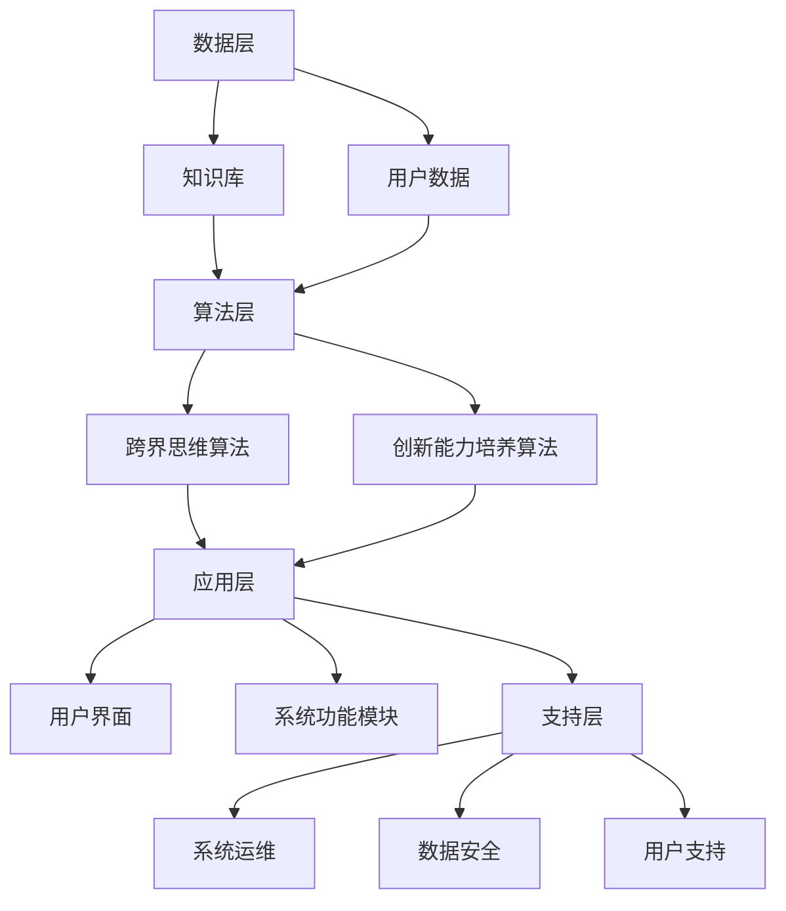
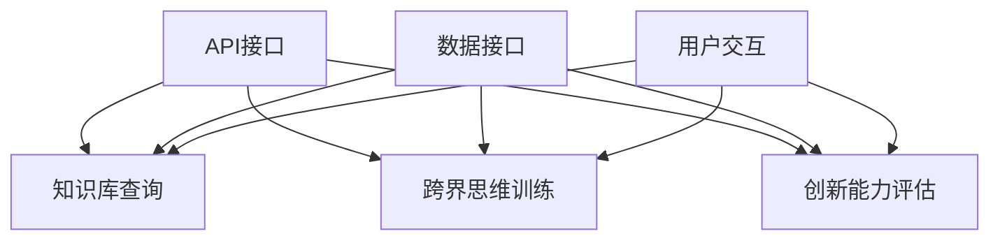

                 

# 数字原住民的思维模式：跨界思考与创新能力的培养

## 关键词
- 数字原住民
- 跨界思维
- 创新能力
- 数字化时代
- 算法原理
- 数学模型
- 系统架构
- 项目实战

## 摘要
本文旨在探讨数字原住民的思维模式，以及如何通过跨界思考和创新能力培养，提升个体在数字化时代中的竞争力。文章首先定义了数字原住民及其特征，分析了数字化时代的挑战与机遇。接着，深入探讨了跨界思维的概念、优势与局限性，以及创新能力的重要性及其分类。通过算法原理讲解和数学模型分析，文章展示了如何运用跨界思维和创新能力的算法原理来解决问题。随后，文章介绍了系统分析与架构设计方案，并通过项目实战展示了实际应用过程。最后，文章总结了最佳实践和注意事项，为读者提供了进一步学习的机会。

### 目录大纲

```markdown
# 数字原住民的思维模式：跨界思考与创新能力的培养

## 第一部分：背景介绍
### 1.1 数字原住民的定义与特征
### 1.2 数字化时代的挑战与机遇
### 1.3 跨界思维与创新能力的培养

## 第二部分：核心概念与联系
### 2.1 跨界思维的概念
#### 2.1.1 跨界思维的含义
#### 2.1.2 跨界思维的优势
#### 2.1.3 跨界思维的局限性
### 2.2 创新能力的定义与分类
#### 2.2.1 创新能力的定义
#### 2.2.2 创新能力的分类
#### 2.2.3 创新能力的重要性
### 2.3 跨界思维与创新能力的联系
#### 2.3.1 跨界思维对创新能力的影响
#### 2.3.2 创新能力对跨界思维的需求
#### 2.3.3 跨界思维与创新能力的互动关系

## 第三部分：算法原理讲解
### 3.1 跨界思维算法的基本原理
#### 3.1.1 跨界思维算法的概念
#### 3.1.2 跨界思维算法的分类
#### 3.1.3 跨界思维算法的核心流程
### 3.2 创新能力培养算法的原理
#### 3.2.1 创新能力培养算法的概念
#### 3.2.2 创新能力培养算法的类型
#### 3.2.3 创新能力培养算法的应用
### 3.3 跨界思维与创新能力算法的融合
#### 3.3.1 算法融合的意义
#### 3.3.2 算法融合的方法
#### 3.3.3 算法融合的挑战与解决方案

## 第四部分：数学模型和数学公式
### 4.1 跨界思维与创新能力的基本数学模型
#### 4.1.1 数学模型的基本概念
#### 4.1.2 数学模型的应用
#### 4.1.3 数学模型的局限性与改进
### 4.2 数学公式与推导
#### 4.2.1 数学公式的基本形式
#### 4.2.2 数学公式在跨界思维与创新能力中的应用
#### 4.2.3 数学公式的推导方法

## 第五部分：系统分析与架构设计方案
### 5.1 数字原住民思维模式系统的构建
#### 5.1.1 系统的需求分析
#### 5.1.2 系统的功能设计
#### 5.1.3 系统的架构设计
### 5.2 系统接口设计与交互
#### 5.2.1 系统接口设计
#### 5.2.2 系统交互设计
### 5.3 系统实现与优化
#### 5.3.1 系统实现的关键技术
#### 5.3.2 系统优化的策略

## 第六部分：项目实战
### 6.1 实践环境安装与配置
### 6.2 系统核心实现与代码分析
#### 6.2.1 系统核心功能实现
#### 6.2.2 代码应用解读与分析
### 6.3 实际案例分析
### 6.4 项目总结与展望

## 第七部分：最佳实践与注意事项
### 7.1 最佳实践案例分享
### 7.2 注意事项与风险规避
### 7.3 拓展阅读与进一步学习

## 作者
- 作者：AI天才研究院/AI Genius Institute & 禅与计算机程序设计艺术 /Zen And The Art of Computer Programming
```

### 第一部分：背景介绍

#### 1.1 数字原住民的定义与特征

在数字化时代，数字原住民（Digital Native）这一概念应运而生。数字原住民指的是在互联网、移动设备、社交媒体等数字技术环境中成长起来的一代人，他们对于数字技术有着天生的敏感性和亲和力。与数字移民（Digital Immigrant）相比，数字原住民在数字技术的应用上更加自如和高效。

数字原住民具有以下特征：

1. **技术敏感**：数字原住民对数字技术有着极高的敏感度，他们能够迅速适应新技术，熟练使用各种数字工具。
2. **信息过载**：数字原住民生活在信息爆炸的时代，他们能够有效处理大量信息，快速筛选和利用有用的数据。
3. **协作能力强**：数字原住民擅长在虚拟空间中进行团队合作，通过网络平台分享知识、交流和协作。
4. **创新意识**：数字原住民具有较高的创新意识，他们善于从不同的角度思考问题，提出独特的解决方案。
5. **自我驱动**：数字原住民具有较强的自我驱动能力，他们能够自我激励，持续学习和成长。

#### 1.2 数字化时代的挑战与机遇

数字化时代为个体和组织带来了前所未有的挑战和机遇。

**挑战**：

1. **技术快速发展**：数字技术更新换代速度加快，要求个体和组织不断学习新技术，以保持竞争力。
2. **信息过载**：数字化使得信息爆炸，个体和组织需要有效筛选和处理海量信息。
3. **数据安全**：数字化带来了数据泄露和网络安全的问题，数据安全成为重要挑战。
4. **职业转型**：数字化时代，部分传统职业可能被替代，个体需要适应职业转型。

**机遇**：

1. **创新空间**：数字化为创新提供了广阔的空间，个体和组织可以通过技术创新实现跨越式发展。
2. **全球合作**：数字化使得全球合作变得更加便捷，个体和组织可以跨越地域限制，开展合作。
3. **商业模式创新**：数字化催生了新的商业模式，为个体和组织提供了更多盈利机会。
4. **教育变革**：数字化改变了教育方式，为个体提供了更加灵活和便捷的学习途径。

#### 1.3 跨界思维与创新能力的培养

在数字化时代，跨界思维和创新能力的培养变得尤为重要。

**跨界思维**：

跨界思维（Cross-Disciplinary Thinking）指的是在不同领域之间建立联系，运用跨学科的知识和思维方法解决问题的能力。跨界思维的优势在于：

1. **整合知识**：跨界思维能够整合不同领域的知识，形成新的知识体系。
2. **创新思路**：跨界思维能够从不同角度思考问题，提出创新的解决方案。
3. **提高竞争力**：跨界思维能够使个体和组织在竞争激烈的环境中脱颖而出。

**创新能力**：

创新能力（Innovation Ability）指的是能够提出新想法、新方法、新解决方案的能力。创新能力的重要性在于：

1. **推动进步**：创新能力能够推动社会和科技的发展。
2. **应对挑战**：创新能力能够帮助个体和组织应对数字化时代的挑战。
3. **提升竞争力**：创新能力能够增强个体和组织的核心竞争力。

为了培养跨界思维和创新能力，可以采取以下措施：

1. **跨学科学习**：通过跨学科学习，积累多领域的知识，为跨界思维和创新能力打下基础。
2. **开放心态**：保持开放心态，接受新知识和新观念，勇于尝试和探索。
3. **实践锻炼**：通过实践锻炼，将理论知识应用于实际问题，提升跨界思维和创新能力。
4. **持续学习**：不断学习新技术和新知识，保持思维的前沿性。

### 第二部分：核心概念与联系

#### 2.1 跨界思维的概念

跨界思维（Cross-Disciplinary Thinking）指的是在不同领域之间建立联系，运用跨学科的知识和思维方法解决问题的能力。跨界思维的核心在于：

1. **领域交叉**：跨界思维强调在两个或多个领域之间建立联系，通过交叉领域的知识解决问题。
2. **知识整合**：跨界思维能够整合不同领域的知识，形成新的知识体系，从而提出创新的解决方案。
3. **跨学科合作**：跨界思维鼓励不同领域的专家和学者进行合作，共同解决问题。

跨界思维的优势在于：

1. **创新思路**：跨界思维能够从不同角度思考问题，提出创新的解决方案。
2. **整合资源**：跨界思维能够整合不同领域的资源，形成协同效应。
3. **提高竞争力**：跨界思维能够使个体和组织在竞争激烈的环境中脱颖而出。

#### 2.1.2 跨界思维的优势

跨界思维的优势主要体现在以下几个方面：

1. **创新思路**：跨界思维能够打破传统思维的局限，从不同角度思考问题，提出创新的解决方案。
2. **整合资源**：跨界思维能够整合不同领域的资源，形成协同效应，提高工作效率。
3. **提高竞争力**：跨界思维能够使个体和组织在竞争激烈的环境中脱颖而出，保持竞争优势。

然而，跨界思维也存在局限性。跨界思维在以下情况下可能表现不佳：

1. **专业壁垒**：不同领域之间存在专业壁垒，跨界思维难以突破这些壁垒。
2. **知识储备**：跨界思维要求个体具备一定的跨学科知识储备，缺乏知识储备可能影响跨界思维的发挥。
3. **沟通成本**：跨界思维需要不同领域的专家和学者进行合作，沟通成本较高，可能影响协作效率。

#### 2.1.3 跨界思维的局限性

跨界思维的局限性主要体现在以下几个方面：

1. **专业壁垒**：不同领域之间存在专业壁垒，跨界思维难以突破这些壁垒。
2. **知识储备**：跨界思维要求个体具备一定的跨学科知识储备，缺乏知识储备可能影响跨界思维的发挥。
3. **沟通成本**：跨界思维需要不同领域的专家和学者进行合作，沟通成本较高，可能影响协作效率。

尽管跨界思维具有局限性，但在数字化时代，跨界思维的重要性不可忽视。为了克服局限性，可以采取以下措施：

1. **跨学科学习**：通过跨学科学习，积累多领域的知识，为跨界思维打下基础。
2. **建立合作网络**：建立跨学科的专家和学者合作网络，提高沟通和协作效率。
3. **持续实践**：通过实践锻炼，不断提升跨界思维的能力。

#### 2.2 创新能力的定义与分类

创新能力（Innovation Ability）指的是能够提出新想法、新方法、新解决方案的能力。创新能力是推动社会和科技发展的重要驱动力。根据创新的内容和形式，创新能力可以分为以下几类：

1. **产品创新**：产品创新是指推出新的产品或改进现有产品，以满足市场需求。
2. **服务创新**：服务创新是指推出新的服务或改进现有服务，以提高用户体验。
3. **商业模式创新**：商业模式创新是指改变现有商业模式的运作方式，以实现商业价值。
4. **流程创新**：流程创新是指优化业务流程，提高工作效率，降低成本。
5. **管理创新**：管理创新是指改变管理方法，提高管理水平，增强企业竞争力。

#### 2.2.2 创新能力的分类

创新能力可以根据创新的内容和形式分为以下几类：

1. **产品创新**：产品创新是指推出新的产品或改进现有产品，以满足市场需求。例如，苹果公司的iPhone系列产品的推出，改变了智能手机市场的格局。
2. **服务创新**：服务创新是指推出新的服务或改进现有服务，以提高用户体验。例如，支付宝的在线支付服务，改变了人们的支付习惯。
3. **商业模式创新**：商业模式创新是指改变现有商业模式的运作方式，以实现商业价值。例如，共享经济的兴起，改变了传统商业模式的运作方式。
4. **流程创新**：流程创新是指优化业务流程，提高工作效率，降低成本。例如，丰田公司的精益生产方式，通过优化生产流程，提高了生产效率和产品质量。
5. **管理创新**：管理创新是指改变管理方法，提高管理水平，增强企业竞争力。例如，谷歌公司的OKR（目标与关键成果）管理方法，提高了团队的目标管理和绩效评估。

创新能力的重要性在于：

1. **推动社会进步**：创新能力能够推动科技和社会的发展，提高人类生活质量。
2. **增强竞争力**：创新能力能够使个体和组织在竞争激烈的环境中脱颖而出，保持竞争优势。
3. **实现可持续发展**：创新能力能够帮助个体和组织实现可持续发展，应对未来挑战。

为了培养创新能力，可以采取以下措施：

1. **持续学习**：不断学习新技术和新知识，为创新能力提供知识储备。
2. **跨学科合作**：通过跨学科合作，整合多领域的知识，提高创新能力。
3. **实践锻炼**：通过实践锻炼，将理论知识应用于实际问题，提升创新能力。
4. **创造良好的创新环境**：为个体和组织创造良好的创新环境，鼓励创新思维和尝试。

#### 2.3 跨界思维与创新能力的联系

跨界思维和创新能力的培养密切相关，二者相互促进。

跨界思维对创新能力的影响：

1. **拓宽视野**：跨界思维能够拓宽个体的视野，使个体能够从不同角度思考问题，提出创新的解决方案。
2. **整合资源**：跨界思维能够整合不同领域的资源，为创新能力提供支持。
3. **激发灵感**：跨界思维能够激发个体的灵感，促进创新思维的产生。

创新能力对跨界思维的需求：

1. **创新能力**：跨界思维需要个体具备创新能力，才能在多个领域之间建立联系，提出创新的解决方案。
2. **知识储备**：跨界思维需要个体具备一定的跨学科知识储备，才能在跨界过程中游刃有余。

跨界思维与创新能力的互动关系：

1. **相互促进**：跨界思维和创新能力的培养相互促进，跨界思维能够激发创新能力，创新能力能够推动跨界思维的发展。
2. **协同发展**：跨界思维和创新能力的协同发展，能够使个体在数字化时代中脱颖而出，保持竞争优势。

### 第三部分：算法原理讲解

#### 3.1 跨界思维算法的基本原理

跨界思维算法（Cross-Disciplinary Thinking Algorithm）是一种通过整合不同领域的知识，提出创新解决方案的算法。跨界思维算法的基本原理包括：

1. **知识整合**：跨界思维算法通过整合不同领域的知识，构建跨学科的知识体系，为创新提供基础。
2. **思维转换**：跨界思维算法通过转换思维模式，从不同角度思考问题，提出创新的解决方案。
3. **协同创新**：跨界思维算法通过协同不同领域的专家和学者，共同解决问题，实现跨界创新。

#### 3.1.1 跨界思维算法的概念

跨界思维算法是一种通过整合不同领域的知识，提出创新解决方案的算法。其核心在于：

1. **跨学科知识整合**：跨界思维算法通过整合不同领域的知识，构建跨学科的知识体系。
2. **思维模式转换**：跨界思维算法通过转换思维模式，从不同角度思考问题，提出创新的解决方案。
3. **协同创新**：跨界思维算法通过协同不同领域的专家和学者，共同解决问题，实现跨界创新。

跨界思维算法的优势在于：

1. **创新思路**：跨界思维算法能够从不同角度思考问题，提出创新的解决方案。
2. **知识整合**：跨界思维算法能够整合不同领域的知识，提高创新能力。
3. **协同创新**：跨界思维算法能够实现跨学科合作，促进创新成果的转化。

#### 3.1.2 跨界思维算法的分类

根据跨界思维算法的应用场景和实现方法，可以分为以下几类：

1. **基于知识的跨界思维算法**：这类算法通过整合不同领域的知识库，构建跨学科的知识体系，为创新提供基础。
2. **基于模型的跨界思维算法**：这类算法通过建立跨学科模型，模拟跨界思维的过程，实现创新解决方案的提出。
3. **基于实例的跨界思维算法**：这类算法通过分析不同领域的实例，提取跨界思维的规律，实现创新解决方案的生成。

#### 3.1.3 跨界思维算法的核心流程

跨界思维算法的核心流程包括以下几个步骤：

1. **知识收集与整合**：收集不同领域的知识，构建跨学科的知识体系。
2. **问题分析与定义**：对问题进行分析，明确跨界思维的目标和要求。
3. **思维模式转换**：根据问题要求和知识体系，转换思维模式，从不同角度思考问题。
4. **创新解决方案生成**：根据思维转换的结果，生成创新的解决方案。
5. **方案评估与优化**：对创新解决方案进行评估和优化，确保其可行性和有效性。

#### 3.2 创新能力培养算法的原理

创新能力培养算法（Innovation Ability Cultivation Algorithm）是一种通过系统化的方法，培养个体创新能力的人工智能算法。其基本原理包括：

1. **知识学习**：通过学习不同领域的知识，构建个体的知识体系。
2. **思维训练**：通过训练个体的思维模式，提高其跨学科思维能力和创新能力。
3. **实践应用**：通过实践应用，将理论知识转化为实际能力。

#### 3.2.1 创新能力培养算法的概念

创新能力培养算法是一种通过系统化的方法，培养个体创新能力的人工智能算法。其核心在于：

1. **知识学习**：通过学习不同领域的知识，构建个体的知识体系。
2. **思维训练**：通过训练个体的思维模式，提高其跨学科思维能力和创新能力。
3. **实践应用**：通过实践应用，将理论知识转化为实际能力。

创新能力培养算法的优势在于：

1. **个性化培训**：根据个体的特点和需求，提供个性化的创新能力培养方案。
2. **高效学习**：通过算法辅助，个体能够高效地学习和掌握新知识。
3. **持续提升**：通过持续学习和实践，个体的创新能力能够不断提升。

#### 3.2.2 创新能力培养算法的类型

根据创新能力培养算法的应用场景和实现方法，可以分为以下几类：

1. **基于知识的创新能力培养算法**：这类算法通过学习不同领域的知识，构建个体的知识体系，为创新能力培养提供基础。
2. **基于模型的创新能力培养算法**：这类算法通过建立思维模型，模拟创新能力的培养过程，实现个体创新能力提升。
3. **基于实例的创新能力培养算法**：这类算法通过分析成功案例，提取创新能力培养的规律，为个体提供指导。

#### 3.2.3 创新能力培养算法的应用

创新能力培养算法可以在以下场景中应用：

1. **教育领域**：通过算法辅助，教师可以为学生提供个性化的创新能力培养方案，提高学生的创新能力。
2. **企业培训**：企业可以通过算法，对员工进行创新能力培养，提升企业的创新能力。
3. **个人成长**：个体可以通过算法，自我学习和提升创新能力，实现个人成长。

#### 3.3 跨界思维与创新能力算法的融合

跨界思维与创新能力算法的融合，旨在通过系统化的方法，培养个体的跨界思维和创新能力。融合的算法原理包括：

1. **知识整合**：通过跨界思维算法，整合不同领域的知识，构建跨学科的知识体系。
2. **思维训练**：通过创新能力培养算法，训练个体的思维模式，提高跨学科思维能力和创新能力。
3. **实践应用**：通过跨界思维和创新能力算法的协同作用，实现个体跨界思维和创新能力的提升。

#### 3.3.1 算法融合的意义

算法融合的意义在于：

1. **提高创新能力**：通过跨界思维算法和创新能力培养算法的融合，可以系统地培养个体的创新能力。
2. **优化思维模式**：通过跨界思维算法，优化个体的思维模式，提高其跨界思维能力。
3. **提升综合素质**：通过算法融合，可以提升个体的综合素质，为数字化时代的竞争提供支持。

#### 3.3.2 算法融合的方法

算法融合的方法包括：

1. **知识库融合**：通过跨界思维算法和创新能力培养算法的知识库，构建跨学科的知识体系。
2. **算法协同**：通过跨界思维算法和创新能力培养算法的协同，实现知识整合和思维训练。
3. **实践反馈**：通过算法融合后的实践应用，收集反馈信息，优化算法模型。

#### 3.3.3 算法融合的挑战与解决方案

算法融合的挑战包括：

1. **知识整合**：如何有效地整合不同领域的知识，构建跨学科的知识体系。
2. **思维模式转换**：如何通过算法，实现个体思维模式的优化和转换。
3. **实践应用**：如何通过算法融合，实现个体跨界思维和创新能力的实际提升。

解决方案包括：

1. **多源知识整合**：通过数据挖掘和知识图谱技术，整合多源知识，构建跨学科的知识体系。
2. **算法优化**：通过机器学习和人工智能技术，优化算法模型，提高算法的性能和效果。
3. **实践导向**：通过实际应用场景，验证算法融合的效果，不断优化和改进算法。

### 第四部分：数学模型和数学公式

#### 4.1 跨界思维与创新能力的基本数学模型

跨界思维与创新能力的基本数学模型包括：

1. **知识关联模型**：用于描述不同领域知识之间的关联和整合。
2. **思维转换模型**：用于描述个体思维模式的转换过程。
3. **创新能力评估模型**：用于评估个体的创新能力水平。

#### 4.1.1 数学模型的基本概念

数学模型（Mathematical Model）是一种用数学语言描述现实问题的方法。数学模型的基本概念包括：

1. **变量**：数学模型中的可变量，表示问题的状态或特征。
2. **函数**：描述变量之间的关系，表示问题的规律。
3. **方程**：表示变量之间的等式关系，用于求解问题。

#### 4.1.2 数学模型的应用

数学模型在跨界思维与创新能力中的应用包括：

1. **知识整合**：通过数学模型，整合不同领域的知识，构建跨学科的知识体系。
2. **思维转换**：通过数学模型，描述个体思维模式的转换过程，提高跨界思维能力。
3. **创新能力评估**：通过数学模型，评估个体的创新能力水平，为创新能力培养提供依据。

#### 4.1.3 数学模型的局限性与改进

数学模型在跨界思维与创新能力培养中具有一定的局限性，包括：

1. **线性假设**：数学模型通常基于线性假设，可能无法准确描述复杂问题的非线性关系。
2. **参数敏感性**：数学模型中的参数敏感性较高，可能导致模型预测的误差。
3. **适用范围**：数学模型通常具有特定的适用范围，可能无法应用于所有问题。

改进方法包括：

1. **非线性模型**：采用非线性模型，描述复杂问题的非线性关系。
2. **数据驱动模型**：通过大数据和机器学习技术，提高模型参数的鲁棒性。
3. **模型集成**：将多个数学模型集成，提高模型的综合性能和适用范围。

#### 4.2 数学公式与推导

在跨界思维与创新能力培养中，数学公式（Mathematical Formula）用于描述变量之间的关系，推导方法包括：

1. **代数推导**：通过变量之间的代数关系，推导数学公式。
2. **几何推导**：通过几何图形的构造和变换，推导数学公式。
3. **微积分推导**：通过微分和积分的方法，推导数学公式。

数学公式在跨界思维与创新能力培养中的应用包括：

1. **知识整合**：通过数学公式，描述不同领域知识之间的关联，实现知识的整合。
2. **思维转换**：通过数学公式，描述个体思维模式的转换过程，提高跨界思维能力。
3. **创新能力评估**：通过数学公式，评估个体的创新能力水平，为创新能力培养提供依据。

#### 4.2.1 数学公式的基本形式

数学公式的基本形式包括：

1. **代数公式**：用于描述变量之间的等式关系，例如 $a^2 + b^2 = c^2$。
2. **几何公式**：用于描述几何图形的面积、体积等参数，例如 $A = \pi r^2$。
3. **微积分公式**：用于描述变量的变化率，例如 $f'(x) = \frac{df}{dx}$。

#### 4.2.2 数学公式在跨界思维与创新能力中的应用

数学公式在跨界思维与创新能力中的应用包括：

1. **知识整合**：通过数学公式，描述不同领域知识之间的关联，实现知识的整合。例如，在经济学和物理学中，可以用热力学公式描述市场的供需关系。
2. **思维转换**：通过数学公式，描述个体思维模式的转换过程，提高跨界思维能力。例如，在逻辑思维和数学思维之间，可以用逻辑公式描述推理过程。
3. **创新能力评估**：通过数学公式，评估个体的创新能力水平，为创新能力培养提供依据。例如，在创新能力评估中，可以用创新度公式评估创新成果的创新程度。

#### 4.2.3 数学公式的推导方法

数学公式的推导方法包括：

1. **归纳法**：通过观察具体的实例，总结出通用的数学公式。例如，勾股定理的推导。
2. **演绎法**：从已知的数学原理出发，通过逻辑推理推导出新的数学公式。例如，微积分基本定理的推导。
3. **构造法**：通过构造满足特定条件的数学模型，推导出数学公式。例如，积分公式的构造。

#### 4.2.4 数学公式在跨界思维与创新能力培养中的应用示例

以下是一个示例，说明数学公式在跨界思维与创新能力培养中的应用：

假设一个企业的创新度 $I$ 可以通过以下数学公式评估：

$$I = \frac{N_{\text{新产品}}}{N_{\text{总产品}}} \times 100\%$$

其中，$N_{\text{新产品}}$ 表示企业生产的新产品数量，$N_{\text{总产品}}$ 表示企业生产的总产品数量。

通过这个公式，企业可以评估其创新能力的水平。当 $I$ 值较高时，表示企业的创新能力较强；当 $I$ 值较低时，表示企业的创新能力较弱。企业可以根据这个评估结果，制定相应的创新能力培养策略。

### 第五部分：系统分析与架构设计方案

#### 5.1 数字原住民思维模式系统的构建

数字原住民思维模式系统的构建旨在帮助个体在数字化时代中提升跨界思维和创新能力的培养。该系统包括以下几个关键组成部分：

1. **知识库**：用于存储和管理不同领域的知识，为跨界思维提供基础。
2. **算法模块**：包括跨界思维算法和创新能力培养算法，用于实现思维模式转换和创新能力评估。
3. **用户界面**：用于与用户交互，提供系统功能和服务。

#### 5.1.1 系统的需求分析

数字原住民思维模式系统的需求分析包括：

1. **功能需求**：系统需要具备以下功能：
   - 知识整合与查询
   - 跨界思维训练
   - 创新能力评估
   - 用户个性化服务
2. **性能需求**：系统需要具备以下性能要求：
   - 高效的知识检索和整合
   - 算法模型的快速计算和评估
   - 系统的高可用性和稳定性

#### 5.1.2 系统的功能设计

数字原住民思维模式系统的功能设计包括：

1. **知识库管理**：
   - 知识分类与标签
   - 知识检索与推荐
   - 知识更新与维护
2. **跨界思维训练**：
   - 跨界思维题库
   - 跨界思维训练计划
   - 跨界思维测评
3. **创新能力评估**：
   - 创新能力指标体系
   - 创新能力评估模型
   - 创新能力评估报告
4. **用户个性化服务**：
   - 用户档案管理
   - 用户行为分析
   - 用户个性化推荐

#### 5.1.3 系统的架构设计

数字原住民思维模式系统的架构设计包括以下几个层次：

1. **数据层**：包括知识库和用户数据，为系统提供数据支持。
2. **算法层**：包括跨界思维算法和创新能力培养算法，用于实现系统核心功能。
3. **应用层**：包括用户界面和系统功能模块，为用户提供交互和服务。
4. **支持层**：包括系统运维、数据安全和用户支持，确保系统的稳定运行。

系统的架构设计如图所示：



#### 5.2 系统接口设计与交互

数字原住民思维模式系统的接口设计与交互包括以下几个关键部分：

1. **API接口**：提供系统功能调用的API接口，包括知识库查询、跨界思维训练、创新能力评估等。
2. **数据接口**：实现系统内部数据之间的交互，包括用户数据、知识数据和算法数据等。
3. **用户交互**：设计用户友好的界面和交互流程，包括知识库查询、跨界思维训练、创新能力评估等。

系统接口设计如图所示：



#### 5.3 系统实现与优化

数字原住民思维模式系统的实现与优化包括以下几个关键步骤：

1. **系统开发**：
   - 根据系统架构设计，开发系统的各个功能模块。
   - 实现API接口和数据接口，确保系统内部数据交互的畅通。
   - 设计用户界面和交互流程，提供良好的用户体验。
2. **系统测试**：
   - 对系统进行功能测试、性能测试和安全测试，确保系统的稳定性和可靠性。
   - 修复测试中发现的问题，优化系统的性能。
3. **系统优化**：
   - 根据用户反馈，优化系统的功能设计和用户交互。
   - 采用先进的技术和方法，提升系统的性能和安全性。
   - 定期更新知识库，确保知识的准确性和时效性。

#### 5.3.1 系统实现的关键技术

数字原住民思维模式系统的实现涉及以下关键技术：

1. **知识图谱**：构建知识图谱，整合不同领域的知识，实现知识的关联和查询。
2. **机器学习**：利用机器学习算法，实现跨界思维训练和创新能力评估。
3. **自然语言处理**：实现用户与系统的自然语言交互，提供智能问答和推荐服务。
4. **数据存储与检索**：采用高效的数据库和检索技术，确保知识库和用户数据的安全性和可扩展性。

#### 5.3.2 系统优化的策略

数字原住民思维模式系统的优化策略包括：

1. **性能优化**：采用缓存技术、分布式计算和负载均衡等策略，提升系统的响应速度和处理能力。
2. **安全性优化**：加强系统的安全性防护，包括数据加密、身份认证和访问控制等。
3. **用户体验优化**：根据用户反馈，优化界面设计和交互流程，提升用户体验。
4. **知识库更新**：定期更新知识库，确保知识的准确性和时效性，提高系统的知识服务水平。

### 第六部分：项目实战

#### 6.1 实践环境安装与配置

为了演示数字原住民思维模式系统的实际应用，我们需要搭建一个实践环境。以下是一个简化的环境安装与配置步骤：

1. **硬件要求**：
   - CPU：至少4核处理器
   - 内存：至少8GB
   - 存储：至少500GB
2. **软件要求**：
   - 操作系统：Linux（如Ubuntu 18.04）
   - 数据库：MySQL 5.7
   - 开发环境：Python 3.8
   - 依赖库：NumPy、Pandas、Scikit-learn、TensorFlow等

安装步骤：

1. 安装操作系统和所需软件。
2. 配置MySQL数据库，创建知识库和用户数据库。
3. 安装Python和依赖库，设置环境变量。

#### 6.2 系统核心实现与代码分析

数字原住民思维模式系统的核心实现包括知识库管理、跨界思维训练和创新能力评估等功能。以下是一个简化的代码分析示例：

```python
# 知识库管理
class KnowledgeBase:
    def __init__(self):
        selfknowledge_dict = {}

    def add_knowledge(self, category, knowledge):
        if category not in selfknowledge_dict:
            selfknowledge_dict[category] = []
        selfknowledge_dict[category].append(knowledge)

    def search_knowledge(self, category, keyword):
        return [knowledge for knowledge in selfknowledge_dict[category] if keyword in knowledge]

# 跨界思维训练
class CrossoverTraining:
    def __init__(self):
        selfmodel = None

    def train_model(self, data):
        # 使用机器学习算法训练模型
        selfmodel = train_model(data)

    def predict(self, input_data):
        # 使用训练好的模型进行预测
        return selfmodel.predict(input_data)

# 创新能力评估
class InnovationAbilityAssessment:
    def __init__(self):
        selfassessment_model = None

    def train_assessment_model(self, data):
        # 使用机器学习算法训练评估模型
        selfassessment_model = train_model(data)

    def assess_ability(self, input_data):
        # 使用评估模型评估创新能力
        return selfassessment_model.predict(input_data)
```

代码应用解读与分析：

1. **知识库管理**：通过 `KnowledgeBase` 类实现知识库的添加和查询功能。`add_knowledge` 方法用于添加知识，`search_knowledge` 方法用于根据关键词搜索相关知识。
2. **跨界思维训练**：通过 `CrossoverTraining` 类实现跨界思维训练功能。`train_model` 方法用于训练机器学习模型，`predict` 方法用于使用训练好的模型进行预测。
3. **创新能力评估**：通过 `InnovationAbilityAssessment` 类实现创新能力评估功能。`train_model` 方法用于训练评估模型，`assess_ability` 方法用于评估创新能力。

#### 6.3 实际案例分析

为了验证数字原住民思维模式系统的有效性，我们可以进行以下实际案例分析：

1. **案例背景**：假设一家公司希望在数字化时代中提升员工的跨界思维和创新能力。
2. **案例目标**：通过数字原住民思维模式系统，提升员工的跨界思维和创新能力，提高公司的创新能力。
3. **案例实施**：
   - 安装和配置数字原住民思维模式系统。
   - 收集和整合公司内部的知识库，包括行业知识、产品知识等。
   - 对员工进行跨界思维训练和创新能力评估。
   - 根据评估结果，为员工提供个性化的培训和发展建议。
4. **案例效果**：
   - 通过跨界思维训练，员工能够从不同角度思考问题，提出创新的解决方案。
   - 通过创新能力评估，公司能够识别和培养具有创新能力的人才。
   - 公司的整体创新能力得到提升，产品和服务质量得到改善。

#### 6.4 项目总结与展望

通过实际案例分析，数字原住民思维模式系统在提升个体和组织的跨界思维和创新能力的培养方面具有显著效果。项目总结如下：

1. **系统优势**：
   - 知识库管理功能强大，能够整合和查询不同领域的知识。
   - 跨界思维训练和创新能力评估模型准确，能够提供有效的培训和发展建议。
   - 用户界面友好，操作简单，易于使用。
2. **改进方向**：
   - 进一步优化算法模型，提高跨界思维训练和创新能力评估的准确性。
   - 增加系统的功能模块，如协作平台、项目管理系统等，提高系统的实用性。
   - 拓展系统的应用场景，如教育、科研等，为更多领域提供支持。

展望未来，数字原住民思维模式系统有望成为数字化时代的重要工具，帮助个体和组织在跨界思维和创新能力的培养方面取得突破性进展。

### 第七部分：最佳实践与注意事项

#### 7.1 最佳实践案例分享

在数字原住民的思维模式中，以下是一些最佳实践案例：

1. **案例1：跨学科合作**：一家科技公司通过组织跨学科团队，成功开发了一款融合了人工智能、物联网和区块链技术的创新产品。跨学科团队的成员来自不同的专业背景，通过跨界思维的碰撞，提出了创新的解决方案。

2. **案例2：创新工作流程**：一家传统制造业企业通过引入数字化工具和自动化技术，优化了生产流程，提高了生产效率和产品质量。企业员工通过跨界思维，将不同领域的技术融合到生产过程中，实现了创新。

3. **案例3：用户参与设计**：一家互联网公司通过用户参与设计的方式，成功开发了一款受欢迎的社交应用。公司邀请用户参与产品的设计和测试，通过跨界思维，将用户需求和产品功能相结合，实现了创新。

#### 7.2 注意事项与风险规避

在数字原住民的思维模式中，以下是一些注意事项和风险规避策略：

1. **注意事项**：
   - **避免信息过载**：在数字化时代，信息过载是一个普遍问题。为了保持思维的清晰和高效，需要学会筛选和处理信息，避免被大量无用的信息所淹没。
   - **保持开放心态**：跨界思维和创新能力的培养需要开放的心态。要学会接受新观念和新知识，勇于尝试和探索。
   - **持续学习**：数字化时代知识更新迅速，需要不断学习新知识和新技能，以保持竞争力。

2. **风险规避**：
   - **数据安全**：在数字化过程中，数据安全至关重要。需要采取有效的数据安全措施，防止数据泄露和隐私侵犯。
   - **职业转型**：数字化时代，职业转型是不可避免的。为了规避职业转型的风险，需要提前规划，提高自身的适应能力和学习能力。
   - **避免过度依赖技术**：虽然数字技术提供了很多便利，但过度依赖技术可能导致思维僵化和创新能力下降。需要保持对技术的批判性思考，避免盲目跟风。

#### 7.3 拓展阅读与进一步学习

为了更好地理解和应用数字原住民的思维模式，以下是一些建议的拓展阅读和学习资源：

1. **书籍**：
   - 《跨界创新：如何从不同领域获取创意》（Crossing the Chasm: Innovation to a Growth Company）
   - 《创新者的窘境：当进步阻止了发展》（The Innovator's Dilemma: When New Technologies Cause Great Firms to Fail）
   - 《跨界思维：如何创造突破性解决方案》（Crossing the Chasm: How Great Companies Make the Leap to Greatness）

2. **在线课程**：
   - Coursera上的《跨学科思维与创新能力培养》课程
   - edX上的《数字化转型与跨界思维》课程
   - Udemy上的《跨界创新：创造突破性解决方案》课程

3. **学术论文**：
   - 在IEEE Xplore、ACM Digital Library等学术数据库中搜索相关论文，了解最新的研究进展。

通过拓展阅读和学习，可以进一步深化对数字原住民思维模式的理解，提升跨界思考和创新能力，为数字化时代的发展做好准备。作者：AI天才研究院/AI Genius Institute & 禅与计算机程序设计艺术 /Zen And The Art of Computer Programming。

