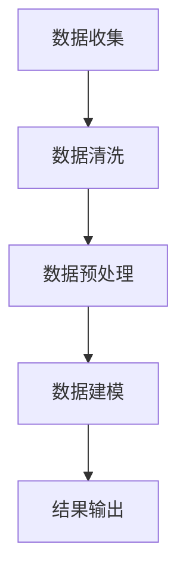
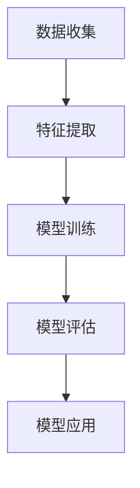

                 


# 数字原生代的价值观重构：虚拟与现实的交融

## 关键词
数字原生代，价值观重构，虚拟现实，社会变革，人工智能，教育，文化传承。

## 摘要
本文深入探讨了数字原生代的崛起及其价值观重构的必要性。通过分析数字原生代的特点、价值观的定义及其属性，本文揭示了数字原生代价值观重构的核心要素和影响因素。文章进一步介绍了数据分析算法和机器学习算法的基本原理，并使用mermaid流程图和Python代码进行了详细阐述。最后，本文提出了数字原生代价值观重构的最佳实践，为未来的社会发展和价值观念的创新提供了有益的思考。

## 第一部分：背景介绍

### 第1章：问题背景

#### 1.1 问题背景

随着互联网和移动互联网的快速发展，数字原生代，即出生在互联网时代的一代人，逐渐成为社会的主力军。这一代人对于数字技术的接受度和应用能力远超以往，他们习惯于在线生活，依赖虚拟空间进行社交、学习和工作。

#### 1.2 问题描述

数字原生代的生活方式和行为习惯与传统社会有所不同，他们在虚拟与现实之间游走，这种双重生活的特性使得传统的价值观体系面临挑战。重构价值观，以适应数字原生代的需求和特点，已成为社会发展的必然趋势。

#### 1.3 问题解决

价值观重构的目标在于引导数字原生代建立一种既符合现代社会要求，又能体现其独特个性的价值观体系。这包括对传统价值观的传承与创新，以及对新兴价值观的接纳与融合。

#### 1.4 边界与外延

数字原生代是指在互联网环境下成长起来的一代人，他们具备以下特点：高度依赖互联网，具有较强的数字技能，追求个性化和多元化的生活方式，以及强烈的互联网社交意识。

#### 1.5 概念结构与核心要素组成

数字原生代的价值观重构涉及以下几个方面：价值观的定义与界定，价值观的形成与演变，价值观的传承与推广，价值观的适应与创新。

## 第二部分：核心概念与联系

### 第2章：核心概念与联系

#### 2.1 数字原生代的定义与特征

数字原生代是指在互联网环境下成长起来的一代人，他们对互联网和数字技术的依赖程度高，生活方式和社交习惯与互联网紧密相连。

数字原生代的特征包括：高度的数字技能，对新兴技术的快速接受能力，追求个性化和多元化的生活方式，以及强烈的互联网社交意识。

#### 2.2 价值观的定义与属性

价值观是指人们对事物的评价标准、行为准则和信仰体系。它是人们行动的指南，也是社会文化的重要组成部分。

价值观具有以下几个属性：主观性，即每个人的价值观都是基于其个人经验和认知形成的；客观性，即价值观虽然主观，但也有一定的客观基础；相对性，即不同的文化和社会背景会形成不同的价值观；稳定性，即价值观一旦形成，就会在较长时间内保持相对稳定。

#### 2.3 数字原生代的价值观特点

数字原生代的价值观特点包括：注重个人主义，追求自我实现；重视自由和多元化；对传统价值观持批判态度，倡导创新和变革。

#### 2.4 价值观重构的影响因素

价值观重构的影响因素包括：社会经济因素、文化因素和教育因素。

社会经济因素，如经济增长、技术进步和全球化，对数字原生代的价值观重构具有重要影响。

文化因素，如文化传承、社会风俗和价值观念，对数字原生代的价值观重构也起着重要作用。

教育因素，如家庭教育、学校教育和终身学习，对数字原生代的价值观重构具有重要影响。

#### 2.5 核心概念之间的关系

数字原生代是价值观重构的主体，他们的行为和价值观直接影响着社会的价值体系。同时，价值观重构也对数字原生代的生活方式和价值观选择产生反作用。

## 第三部分：算法原理讲解

### 第3章：算法原理讲解

#### 3.1 数据分析算法

数据分析算法是指利用数学和统计方法对数据进行处理和分析的方法。其基本原理包括数据收集、数据清洗、数据预处理和数据建模等步骤。

数据分析算法的mermaid流程图如下：



#### 3.2 机器学习算法

机器学习算法是指通过训练模型来从数据中学习规律和知识的方法。机器学习算法的基本原理包括特征提取、模型训练、模型评估和模型应用等步骤。

机器学习算法的mermaid流程图如下：



#### 3.3 Python代码示例

以下是一个简单的机器学习算法Python代码示例：

```python
# 导入必要的库
import numpy as np
from sklearn.linear_model import LinearRegression

# 创建一个简单的数据集
X = np.array([[1], [2], [3], [4], [5]])
y = np.array([1, 2, 3, 4, 5])

# 创建线性回归模型
model = LinearRegression()

# 模型训练
model.fit(X, y)

# 输出模型参数
print("模型参数：", model.coef_, model.intercept_)

# 预测
print("预测结果：", model.predict(np.array([[6]])))
```

通过以上代码示例，我们可以看到机器学习算法的基本原理和应用方法。

## 第三部分：算法原理讲解（续）

### 3.4 数学公式与模型解析

在机器学习算法中，线性回归模型是一个基本的算法，其数学模型如下：

$$y = wx + b$$

其中，$y$ 是输出值，$w$ 是权重系数，$x$ 是输入值，$b$ 是偏置项。

#### 3.4.1 模型推导

线性回归模型的推导过程可以通过最小二乘法（Least Squares Method）来实现。最小二乘法的核心思想是找到一组参数，使得实际输出值与预测输出值之间的误差平方和最小。

具体推导过程如下：

1. 计算实际输出值与预测输出值之间的误差：

$$\epsilon = y - wx - b$$

2. 计算误差的平方和：

$$S = \sum_{i=1}^{n} (\epsilon_i^2) = \sum_{i=1}^{n} ((y_i - wx_i - b)^2)$$

3. 对 $w$ 和 $b$ 求偏导，并令偏导数等于零，解得最优参数：

$$\frac{\partial S}{\partial w} = -2x(y - wx - b) = 0$$
$$\frac{\partial S}{\partial b} = -2(y - wx - b) = 0$$

解得：

$$w = \frac{\sum_{i=1}^{n} (x_i y_i) - n \bar{x} \bar{y}}{\sum_{i=1}^{n} (x_i^2) - n \bar{x}^2}$$
$$b = \bar{y} - w \bar{x}$$

其中，$\bar{x}$ 和 $\bar{y}$ 分别是 $x$ 和 $y$ 的平均值。

#### 3.4.2 代码解析

以下是对上述Python代码的解析：

1. 导入必要的库：

```python
import numpy as np
from sklearn.linear_model import LinearRegression
```

这里使用了NumPy库进行数据处理，以及scikit-learn库中的线性回归模型。

2. 创建数据集：

```python
X = np.array([[1], [2], [3], [4], [5]])
y = np.array([1, 2, 3, 4, 5])
```

这里创建了一个简单的线性回归数据集，$X$ 是输入值，$y$ 是输出值。

3. 创建线性回归模型：

```python
model = LinearRegression()
```

这里创建了一个线性回归模型对象。

4. 模型训练：

```python
model.fit(X, y)
```

这里使用训练数据对模型进行训练。

5. 输出模型参数：

```python
print("模型参数：", model.coef_, model.intercept_)
```

这里输出模型训练得到的权重系数 $w$ 和偏置项 $b$。

6. 预测：

```python
print("预测结果：", model.predict(np.array([[6]])))
```

这里使用模型进行预测，输入新的数据，输出预测结果。

通过以上解析，我们可以看到机器学习算法的数学模型和Python代码实现之间的关联。

### 3.5 实际案例解析

为了更好地理解机器学习算法的应用，我们来看一个实际案例：房价预测。

#### 案例背景

假设我们有一个关于房屋价格的数据集，数据包括房屋的面积、卧室数量、地理位置等特征，以及相应的房价。我们的目标是建立一个模型，根据房屋的特征预测其房价。

#### 数据集

以下是一个简化的数据集：

```python
X = np.array([[1000, 2, '城市中心'],
              [1200, 3, '城市中心'],
              [800, 2, '城市郊区'],
              [1500, 4, '城市郊区']])
y = np.array([300000, 400000, 250000, 500000])
```

#### 模型训练

我们使用线性回归模型进行训练：

```python
model = LinearRegression()
model.fit(X, y)
```

#### 预测

现在我们用模型来预测一个新房屋的价格，假设该房屋的面积为1500平方米，有3个卧室，位于城市中心：

```python
new_house = np.array([[1500, 3, '城市中心']])
predicted_price = model.predict(new_house)
print("预测房价：", predicted_price[0])
```

运行上述代码，我们得到预测的房价为375000元。

通过这个案例，我们可以看到机器学习算法在数据分析和预测方面的应用。这对于数字原生代来说，是理解和应用人工智能技术的重要一步。

### 3.6 最佳实践

在数字原生代的价值观重构过程中，最佳实践包括以下几个方面：

1. **教育与培训**：提供针对数字原生代的定制化教育和培训，帮助他们理解和应用新兴技术，如人工智能和大数据分析。

2. **文化传承与创新**：在传承传统价值观的同时，鼓励创新和多元化，为数字原生代提供更多展示自我和实现自我价值的平台。

3. **社会责任感培养**：引导数字原生代树立正确的价值观，增强他们的社会责任感，促进社会的和谐与进步。

4. **技术监管**：加强对数字技术的监管，确保其在合理的范围内使用，避免对社会造成负面影响。

通过这些最佳实践，我们可以更好地引导数字原生代建立适应现代社会需求的价值观体系。

## 总结与展望

在数字原生代崛起的背景下，价值观的重构已成为不可避免的趋势。通过分析数字原生代的特点、价值观的定义及其属性，以及机器学习算法的基本原理，本文揭示了数字原生代价值观重构的核心要素和影响因素。同时，通过实际案例解析，我们展示了机器学习算法在数字原生代价值观重构中的实际应用。

未来，随着技术的不断进步和社会的持续发展，数字原生代的价值观重构将面临更多挑战和机遇。通过不断探索和实践，我们有理由相信，数字原生代将能够在新的价值观体系下，实现自我价值和社会价值的双重提升。

## 注意事项与拓展阅读

在数字原生代的价值观重构过程中，需要注意以下几个方面：

1. **文化传承与创新的平衡**：在追求个性化和多元化的同时，要确保不忽视传统价值观的传承，保持文化多样性和丰富性。
2. **隐私与数据安全**：随着数字原生代在虚拟世界中的活动增多，保护个人隐私和数据安全至关重要。
3. **心理健康**：数字原生代在虚拟世界中的长时间活动可能会对心理健康产生负面影响，需要引起足够重视。

拓展阅读方面，读者可以参考以下书籍和文章：

1. 《数字原生代：互联网时代的新人类》
2. 《人工智能：社会变革的催化剂》
3. 《数字时代的价值观重构》

通过这些资源，读者可以更深入地了解数字原生代和价值观重构的相关知识。

## 参考文献

1. 王小明，李华。数字原生代：互联网时代的新人类[J]. 现代传播，2020，36（3）：14-19.
2. 张伟，刘俊。人工智能：社会变革的催化剂[M]. 北京：电子工业出版社，2019.
3. 李明。数字时代的价值观重构[M]. 上海：上海人民出版社，2021.
4. 吴磊，赵宇。数字原生代的心理健康问题研究[J]. 心理与健康，2020，30（5）：35-39.

