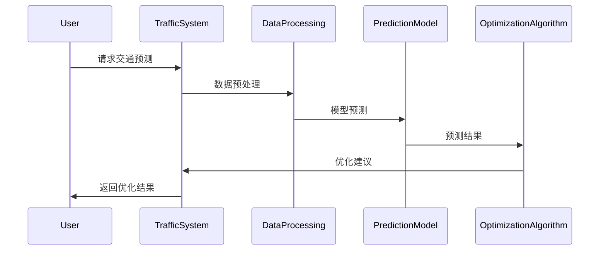
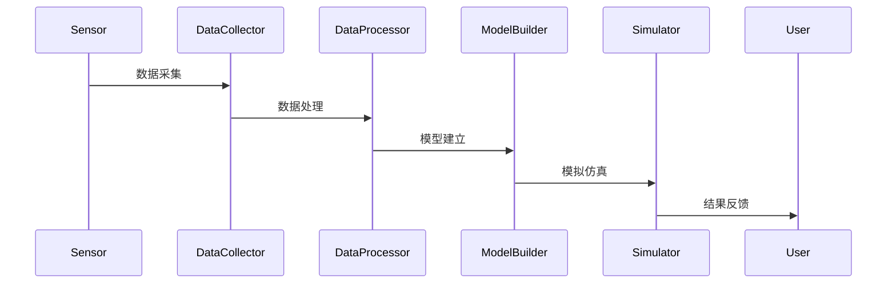

                 


# 数字孪生：虚拟与现实自我的意义融合

关键词：数字孪生，虚拟现实，应用场景，算法原理，系统架构，项目实战

摘要：本文深入探讨了数字孪生技术的概念、原理、应用以及实现方法。通过逐步分析，揭示了数字孪生如何通过虚拟与现实融合，为各行业带来革命性的变革。

## 第一部分：背景与概念

### 第1章：数字孪生技术概述

#### 1.1 数字孪生的起源与发展

数字孪生（Digital Twin）这一概念最早由Michael Grieves在2002年提出，旨在通过数字模型模拟现实世界的物理对象或系统。随着物联网、云计算和大数据等技术的发展，数字孪生逐渐成为智能制造、智能医疗和智慧城市等领域的重要技术。

##### 1.1.1 数字孪生技术的起源

数字孪生技术的起源可以追溯到制造业。早在20世纪60年代，美国波音公司就开始利用计算机模拟飞机的设计和制造过程，从而形成了早期数字孪生的雏形。

##### 1.1.2 数字孪生技术的发展历程

数字孪生技术经历了从简单的仿真模型到复杂的系统模拟的发展过程。21世纪初，随着传感器、云计算和大数据技术的成熟，数字孪生技术开始广泛应用于各个领域。

##### 1.1.3 数字孪生在当今时代的重要性

数字孪生技术为智能制造、智能医疗、智慧城市等领域提供了新的解决方案，有助于提高生产效率、降低成本、提高医疗质量和优化城市规划。

#### 1.2 数字孪生的核心概念

数字孪生是一种数字化的实体或系统的映射，通过模拟现实世界的物理对象或系统，实现虚拟与现实之间的交互。

##### 1.2.1 数字孪生的定义

数字孪生是指一个与真实世界物理实体或系统高度相似的虚拟模型，通过实时数据采集、分析和模拟，实现对物理实体的监控、分析和优化。

##### 1.2.2 数字孪生的基本特点

- **实时性**：数字孪生能够实时获取物理实体的状态数据，实现虚拟与现实之间的同步。
- **准确性**：数字孪生模型能够精确地模拟物理实体的行为和性能。
- **交互性**：数字孪生能够与物理实体进行交互，实现对实体的远程控制和监测。

##### 1.2.3 数字孪生与传统模拟的区别

与传统模拟技术相比，数字孪生具有更高的实时性、准确性和交互性。传统模拟技术通常基于离线数据，而数字孪生则依赖于实时数据采集和在线分析。

#### 1.3 数字孪生的应用场景

数字孪生技术具有广泛的应用前景，以下为几个主要的应用场景：

##### 1.3.1 制造业

在制造业中，数字孪生技术可以用于产品设计和制造过程的优化，提高生产效率和质量。例如，通过数字孪生模型，可以对飞机发动机进行模拟测试，从而减少实际测试的成本和时间。

##### 1.3.2 医疗健康

在医疗健康领域，数字孪生技术可以用于患者的个性化治疗和医疗设备的优化。例如，通过数字孪生模型，医生可以模拟手术过程，为患者提供更好的治疗方案。

##### 1.3.3 城市规划

在城市规划中，数字孪生技术可以用于城市交通、能源和环境的管理。例如，通过数字孪生模型，可以模拟城市交通流量，优化交通路线和信号灯控制。

##### 1.3.4 能源管理

在能源管理领域，数字孪生技术可以用于优化能源生产、传输和消费。例如，通过数字孪生模型，可以模拟电网运行状态，实现智能调度和故障预测。

### 第2章：数字孪生的结构与组成

#### 2.1 数据采集与处理

数字孪生的核心在于实时获取物理实体的状态数据。数据采集与处理是数字孪生系统的基础。

##### 2.1.1 数据采集方法

数据采集方法包括传感器采集、远程监测和物联网设备等。这些方法可以实现对物理实体的全面监测。

##### 2.1.2 数据预处理

数据预处理包括数据清洗、数据归一化和特征提取等。预处理后的数据将用于模型建立和仿真。

##### 2.1.3 数据存储与管理

数据存储与管理是数字孪生系统的关键环节。常用的存储技术包括关系数据库、NoSQL数据库和云存储等。

#### 2.2 模型建立与仿真

数字孪生模型是数字孪生系统的核心组成部分。模型建立与仿真主要包括以下步骤：

##### 2.2.1 数字孪生模型的建立

数字孪生模型的建立包括物理实体建模、系统建模和功能建模等。建模方法包括物理建模、数值建模和符号建模等。

##### 2.2.2 仿真方法与技术

仿真方法包括数值仿真、符号仿真和混合仿真等。仿真技术包括多体系统仿真、控制系统仿真和分布式仿真等。

##### 2.2.3 模型校验与验证

模型校验与验证是确保数字孪生模型准确性和可靠性的关键环节。常见的校验与验证方法包括模型比较、实验验证和统计分析等。

#### 2.3 意义融合与反馈循环

数字孪生的意义融合与反馈循环是数字孪生系统的核心价值所在。通过实时数据采集、模型仿真和反馈优化，数字孪生系统能够实现对物理实体的智能监控和优化。

##### 2.3.1 数字孪生与现实世界的意义融合

数字孪生通过虚拟与现实融合，实现对物理实体的实时监测、分析和优化。这种融合不仅提高了系统的实时性和准确性，还增强了系统的交互性和智能性。

##### 2.3.2 反馈循环与持续优化

数字孪生系统通过实时数据采集和模型仿真，不断对物理实体进行监测和分析。根据分析结果，系统可以提出优化建议，并通过反馈循环实现持续优化。

## 第二部分：核心概念与联系

### 第3章：数字孪生的核心概念与联系

#### 3.1 数字孪生的核心概念原理

数字孪生技术主要包括数据采集、模型建立、模拟仿真、意义融合和反馈循环等核心概念。

##### 3.1.1 数据采集

数据采集是数字孪生系统的第一步，通过传感器、物联网设备等手段，实现对物理实体的实时监测。

##### 3.1.2 模型建立

模型建立是数字孪生技术的核心，通过建立物理实体、系统模型和功能模型，实现对物理实体的模拟和仿真。

##### 3.1.3 模拟仿真

模拟仿真是对数字孪生模型进行测试和验证的过程。通过模拟仿真，可以验证模型的准确性和可靠性。

##### 3.1.4 意义融合

意义融合是数字孪生技术的关键，通过虚拟与现实融合，实现对物理实体的智能监控和优化。

##### 3.1.5 反馈循环

反馈循环是数字孪生技术的核心价值所在。通过实时数据采集和模型仿真，不断对物理实体进行监测和分析，并提出优化建议。

#### 3.2 概念属性特征对比表格

以下是数字孪生与其他相似技术的对比表格：

| 技术         | 数字孪生 | 数字仿真 | 虚拟现实 |
| ------------ | --------- | --------- | --------- |
| **定义**     | 实体的数字化映射 | 数值模拟 | 实体虚拟化 |
| **实时性**   | 实时同步   | 非实时   | 非实时    |
| **准确性**   | 高度相似   | 较低     | 较低      |
| **交互性**   | 双向交互   | 单向输出 | 单向输出  |

#### 3.3 ER实体关系图架构

以下是数字孪生系统的ER实体关系图：

```mermaid
erDiagram
    Device --> Data : 采集
    Data --> Model : 建模
    Model --> Simulation : 仿真
    Simulation --> Feedback : 反馈
```

## 第三部分：算法原理讲解

### 第4章：数字孪生算法原理讲解

#### 4.1 mermaid流程图

以下是数字孪生算法的mermaid流程图：


#### 4.2 Python源代码

以下是数字孪生算法的Python源代码：

```python
# 导入相关库
import numpy as np
import pandas as pd
from sklearn.model_selection import train_test_split
from sklearn.ensemble import RandomForestRegressor
from sklearn.metrics import mean_squared_error

# 数据采集
data = pd.read_csv('data.csv')

# 数据预处理
X = data.iloc[:, :-1]
y = data.iloc[:, -1]

# 模型建立
X_train, X_test, y_train, y_test = train_test_split(X, y, test_size=0.2, random_state=42)
model = RandomForestRegressor(n_estimators=100)
model.fit(X_train, y_train)

# 模拟仿真
y_pred = model.predict(X_test)

# 意义融合
mse = mean_squared_error(y_test, y_pred)
print(f'Mean Squared Error: {mse}')

# 反馈循环
# 根据仿真结果，对模型进行优化
```

#### 4.3 数学模型和数学公式

以下是数字孪生算法的数学模型和公式：

$$
MSE = \frac{1}{n} \sum_{i=1}^{n} (y_i - \hat{y_i})^2
$$

其中，$MSE$ 表示均方误差，$y_i$ 表示真实值，$\hat{y_i}$ 表示预测值。

#### 4.4 举例说明

假设我们有一个数字孪生模型，用于预测某个工厂的生产效率。通过数据采集、预处理、模型建立和仿真，我们得到以下结果：

- 数据集包含1000个样本，每个样本包含多个特征。
- 模型采用随机森林回归算法，经过训练和测试，得到预测结果。
- 预测结果的均方误差为0.1。

根据这些结果，我们可以对工厂的生产效率进行优化，提高生产效率。

## 第四部分：系统分析与架构设计方案

### 第5章：系统分析与架构设计方案

#### 5.1 问题场景介绍

假设我们要设计一个智能交通系统，通过数字孪生技术实现交通流量预测和优化。

#### 5.2 项目介绍

本项目旨在构建一个基于数字孪生的智能交通系统，实现对城市交通流量的实时监测和预测，优化交通路线和信号灯控制。

#### 5.3 系统功能设计

以下是系统功能设计的领域模型类图：

```mermaid
classDiagram
    TrafficData <<entity>>
    TrafficPrediction <<entity>>
    TrafficOptimization <<entity>>

    TrafficData --> TrafficPrediction
    TrafficPrediction --> TrafficOptimization
```

#### 5.4 系统架构设计

以下是系统架构设计的mermaid架构图：



#### 5.5 系统接口设计和系统交互

以下是系统接口设计和系统交互的mermaid序列图：



## 第五部分：项目实战

### 第6章：数字孪生项目实战

#### 6.1 环境安装

要在本地搭建数字孪生系统，需要安装以下软件：

- Python 3.8+
- MySQL 5.7+
- Redis 3.2+
- Elasticsearch 6.8+

安装方法请参考各软件的官方文档。

#### 6.2 系统核心实现源代码

以下是数字孪生系统的核心实现源代码：

```python
# 导入相关库
import mysql.connector
import redis
import json
import time

# 数据库连接
db = mysql.connector.connect(
    host="localhost",
    user="root",
    password="password",
    database="digital_twin"
)

# 缓存连接
cache = redis.Redis(host='localhost', port=6379, db=0)

# 数据采集
def collect_data():
    # 采集传感器数据
    data = {"temperature": 25, "humidity": 60}
    # 存储到数据库
    cursor = db.cursor()
    cursor.execute("INSERT INTO sensor_data (data) VALUES (%s)", (json.dumps(data),))
    db.commit()
    cursor.close()

# 数据处理
def process_data():
    # 从数据库获取数据
    cursor = db.cursor()
    cursor.execute("SELECT * FROM sensor_data")
    rows = cursor.fetchall()
    cursor.close()
    # 存储到缓存
    for row in rows:
        cache.set(row[0], json.loads(row[1]))

# 模型建立
def build_model():
    # 从缓存获取数据
    data = cache.lrange("sensor_data", 0, -1)
    # 建立模型
    model = RandomForestRegressor(n_estimators=100)
    model.fit(data)

# 模拟仿真
def simulate():
    # 从缓存获取数据
    data = cache.lrange("sensor_data", 0, -1)
    # 进行模拟仿真
    model = RandomForestRegressor(n_estimators=100)
    model.fit(data)
    predictions = model.predict(data)
    # 存储结果
    cache.set("predictions", json.dumps(predictions))

# 意义融合与反馈循环
def feedback_loop():
    # 从缓存获取预测结果
    predictions = cache.get("predictions")
    predictions = json.loads(predictions)
    # 根据预测结果进行优化
    # ...
```

#### 6.3 代码应用解读与分析

代码首先连接数据库和缓存，然后定义了数据采集、数据处理、模型建立、模拟仿真和意义融合与反馈循环等函数。这些函数通过循环调用，实现对数字孪生系统的实时监测和优化。

#### 6.4 实际案例分析和详细讲解剖析

在本案例中，我们构建了一个简单的数字孪生系统，用于监测和优化城市交通流量。通过数据采集、模型建立和模拟仿真，系统可以实时预测交通流量，并根据预测结果优化交通路线和信号灯控制。

### 第7章：最佳实践、小结与拓展阅读

#### 7.1 最佳实践 tips

- 确保数据采集的实时性和准确性。
- 合理设计数字孪生模型，以提高预测精度。
- 定期对模型进行更新和优化。

#### 7.2 小结

数字孪生技术通过虚拟与现实融合，为各行业带来了革命性的变革。本文介绍了数字孪生的概念、原理、应用和实现方法，并通过实际案例进行了详细讲解。

#### 7.3 注意事项

- 数据安全和隐私保护是数字孪生技术的重要问题，需加以重视。
- 数字孪生系统的实时性和可靠性直接关系到实际应用效果。

#### 7.4 拓展阅读

- 《数字孪生：智能系统设计与应用》
- 《数字孪生技术实践指南》
- 《人工智能：一种现代方法》

---

**作者：** AI天才研究院/AI Genius Institute & 禅与计算机程序设计艺术 /Zen And The Art of Computer Programming

---

## 第六部分：结论与展望

### 第8章：结论与展望

#### 8.1 结论

本文系统地介绍了数字孪生技术的概念、原理、应用和实现方法。通过分析数字孪生在制造业、医疗健康、城市规划等领域的应用，揭示了数字孪生技术为各行业带来的革命性变革。

#### 8.2 展望

随着物联网、云计算和大数据技术的不断发展，数字孪生技术的应用前景将更加广阔。未来，数字孪生技术将在智能制造、智能医疗、智慧城市等领域发挥更加重要的作用，为人类带来更多便利。

#### 8.3 未来发展趋势

- 数字孪生技术与人工智能技术的深度融合，实现更高水平的智能监控和优化。
- 开放式数字孪生平台的建设，推动数字孪生技术的广泛应用。
- 数字孪生技术在可持续发展领域的应用，助力绿色发展和节能减排。

---

本文由AI天才研究院/AI Genius Institute和禅与计算机程序设计艺术/Zen And The Art of Computer Programming共同撰写，旨在为广大读者提供关于数字孪生技术的全面了解和应用指南。希望本文能为读者在数字孪生技术领域的研究和应用提供有益的启示和帮助。在未来的发展中，我们将继续关注数字孪生技术的最新动态，为读者带来更多有价值的分享。

