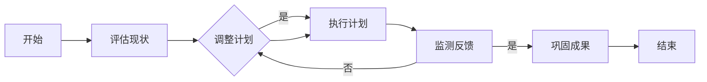
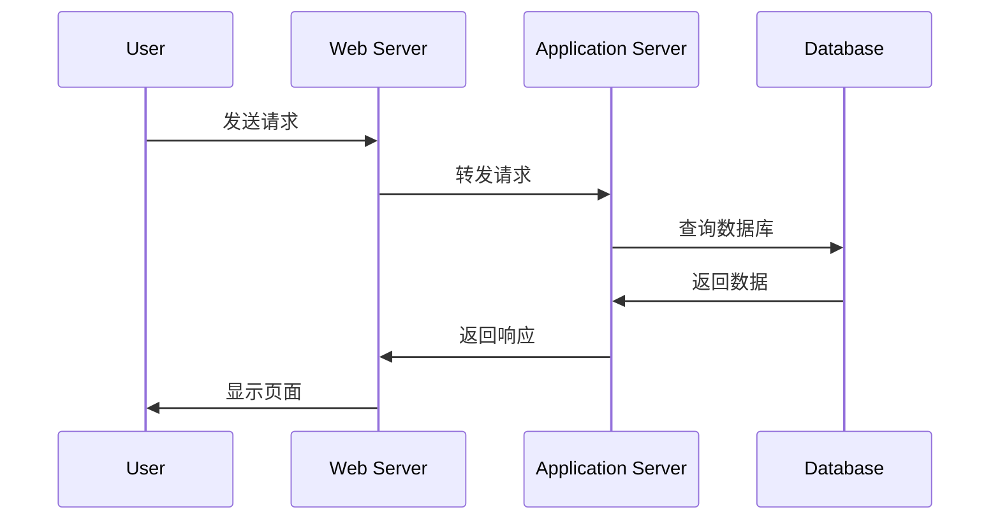

                 

# 数字排毒度假村：远离科技的深度休息体验

关键词：数字排毒、科技依赖、健康休息、算法原理、系统设计

摘要：在现代社会，科技依赖已经成为一种普遍现象，这给我们的生活带来了诸多负面影响。本文旨在探讨数字排毒度假村这一概念，通过介绍其背景、核心概念、算法原理及系统设计，旨在为读者提供一种远离科技、深度休息的新思路，从而改善人们的身心健康。

## 第一部分：背景介绍

### 1.1 问题背景

随着科技的发展，计算机、智能手机、互联网等高科技产品已经成为我们生活中不可或缺的一部分。然而，过度依赖科技产品也对我们的身心健康产生了负面影响。首先，科技依赖会导致人们的注意力分散，影响工作和学习效率。其次，长时间面对屏幕容易导致视力下降、颈椎疼痛等问题。此外，科技依赖还会影响人们的睡眠质量，进而影响身心健康。

### 1.1.1 科技发展与人类生活的关系

科技的发展极大地改变了人类的生活方式。在信息化时代，人们可以更加便捷地获取信息、沟通交流、娱乐休闲。然而，这也使得人们越来越依赖科技产品，甚至形成了科技依赖症。

### 1.1.2 科技依赖带来的负面影响

科技依赖对人们的身心健康产生了诸多负面影响。首先，长时间使用科技产品会导致视力下降、颈椎疼痛等问题。其次，科技依赖会影响人们的睡眠质量，导致失眠、焦虑等心理问题。此外，科技依赖还会导致人们的社交能力下降，影响人际关系。

### 1.1.3 数字排毒的概念与重要性

数字排毒是一种通过远离科技产品，回归自然、放松身心，从而达到身心健康的一种方法。数字排毒的重要性在于它能够帮助我们摆脱科技依赖，改善身心健康，提高生活质量。

### 1.2 问题描述

在现代社会，科技依赖已经成为一种普遍现象。为了解决这一问题，我们需要寻找一种有效的方法来帮助人们摆脱科技依赖，改善身心健康。数字排毒度假村应运而生，它为人们提供了一个远离科技、深度休息的环境。

### 1.2.1 数字排毒度假村的定义

数字排毒度假村是一种专门为人们提供远离科技产品，进行深度休息和放松的度假场所。在这里，游客可以暂时摆脱手机、电脑等科技产品的干扰，享受大自然的美景，进行身心放松。

### 1.2.2 数字排毒度假村的必要性

数字排毒度假村的必要性在于它能够为人们提供一个良好的休息环境，帮助人们摆脱科技依赖，改善身心健康。随着科技的发展，人们的生活节奏越来越快，压力也越来越大。数字排毒度假村为人们提供了一个放松身心的场所，有助于缓解压力，提高生活质量。

### 1.2.3 数字排毒度假村的挑战

尽管数字排毒度假村具有很多优势，但在实际运营过程中也面临着一些挑战。首先，如何吸引游客是一个关键问题。其次，如何确保游客在度假期间能够真正实现数字排毒也是一个挑战。此外，数字排毒度假村的运营成本较高，需要寻找合适的盈利模式。

### 1.3 问题解决

数字排毒度假村的运营模式主要包括以下几个方面：

1. **选址**：选择一个环境优美、交通便利的地方作为度假村的位置。

2. **设施配置**：提供简单舒适的住宿设施，尽量减少科技产品的使用。

3. **活动安排**：组织丰富的户外活动，如徒步、骑行、野营等，以吸引游客。

4. **服务质量**：提供高质量的服务，确保游客在度假期间能够获得愉快的体验。

### 1.3.1 数字排毒度假村的运营模式

数字排毒度假村的运营模式主要依赖于以下几个方面：

1. **预订系统**：通过互联网平台接受游客的预订。

2. **活动策划**：根据游客的需求，策划丰富多彩的户外活动。

3. **客户服务**：提供24小时客户服务，解决游客在度假期间遇到的问题。

4. **市场营销**：通过线上和线下渠道进行宣传推广，提高品牌知名度。

### 1.3.2 数字排毒度假村的服务内容

数字排毒度假村提供的服务内容包括：

1. **住宿服务**：提供简单舒适的住宿环境。

2. **餐饮服务**：提供健康营养的餐饮。

3. **户外活动**：组织徒步、骑行、野营等户外活动。

4. **健康管理**：提供专业的健康管理服务。

### 1.3.3 数字排毒度假村的成效

数字排毒度假村在帮助人们摆脱科技依赖、改善身心健康方面取得了显著的成效。通过一段时间的数字排毒，游客能够有效缓解压力，提高睡眠质量，改善心理健康状况。

### 1.4 边界与外延

#### 1.4.1 数字排毒度假村的适用人群

数字排毒度假村主要适用于以下人群：

1. 科技从业者：如程序员、设计师等。
2. 压力大的职场人士。
3. 长期依赖科技产品的人群。

#### 1.4.2 数字排毒度假村的地点选择

数字排毒度假村的地点选择应考虑以下几个因素：

1. 自然环境：选择环境优美、空气清新的地方。
2. 交通便利：方便游客前来度假。
3. 设施完善：提供必要的住宿、餐饮和娱乐设施。

#### 1.4.3 数字排毒度假村的环境设计

数字排毒度假村的环境设计应注重以下几点：

1. 避免过度科技化：减少科技产品的使用。
2. 提供自然景观：营造舒适、宁静的氛围。
3. 便捷的服务设施：方便游客进行户外活动。

### 1.5 概念结构与核心要素组成

#### 1.5.1 数字排毒度假村的组成部分

数字排毒度假村主要由以下几个部分组成：

1. 度假村总部：负责度假村的整体运营。
2. 客房：提供简单舒适的住宿环境。
3. 室外活动区：提供户外活动的场所。
4. 健康管理中心：提供健康管理服务。

#### 1.5.2 数字排毒度假村的运营原则

数字排毒度假村的运营原则主要包括以下几点：

1. 简化科技产品：减少科技产品的使用。
2. 注重用户体验：提供高质量的度假体验。
3. 保持可持续发展：注重环境保护和资源利用。

#### 1.5.3 数字排毒度假村的可持续发展

数字排毒度假村的可持续发展主要包括以下几个方面：

1. 环境保护：通过节能减排、垃圾分类等措施，减少对环境的污染。
2. 社会责任：积极参与社会公益活动，承担社会责任。
3. 经济发展：通过科学的管理和运营，实现经济效益和社会效益的双赢。

### 1.6 本章小结

本文介绍了数字排毒度假村的背景、核心概念、算法原理和系统设计。通过了解这些内容，读者可以更好地理解数字排毒度假村的运作模式，以及它如何帮助人们摆脱科技依赖，改善身心健康。在接下来的部分，我们将进一步探讨数字排毒的原理和具体实施方法。

## 第二部分：核心概念与联系

### 2.1 数字排毒原理

#### 2.1.1 数字排毒的基本原理

数字排毒的基本原理是通过暂时远离科技产品，回归自然、放松身心，从而达到身心健康的一种方法。数字排毒的核心在于减少人们对科技产品的依赖，让大脑和身体得到充分的休息和恢复。

#### 2.1.2 数字排毒与传统健康休息的区别

数字排毒与传统健康休息的区别在于，传统健康休息通常是在城市环境中进行的，人们仍然需要面对各种科技产品，而数字排毒则是通过远离科技产品，回归自然，从而达到更深入的放松和休息。

#### 2.1.3 数字排毒的科学依据

数字排毒的科学依据主要来源于以下几个方面：

1. **神经科学**：研究表明，长时间使用科技产品会导致大脑神经递质失衡，进而影响心理健康。
2. **生物学**：人体需要适当的休息和恢复，才能维持正常的生理功能。
3. **心理学**：数字排毒有助于缓解压力，改善心理健康。

### 2.2 脱毒过程与阶段

#### 2.2.1 脱毒准备阶段

在脱毒准备阶段，主要任务是调整心态，做好心理准备。具体步骤包括：

1. **确定目标**：明确自己的脱毒目标和期望。
2. **制定计划**：制定详细的脱毒计划，包括脱毒时间、地点和活动安排。
3. **告知亲友**：向亲友告知自己的脱毒计划，以便得到他们的支持和理解。

#### 2.2.2 脱毒适应阶段

在脱毒适应阶段，人们需要逐渐减少对科技产品的依赖。具体步骤包括：

1. **减少使用时间**：逐步减少每天使用科技产品的时间。
2. **调整生活习惯**：培养健康的生活习惯，如早睡早起、适量运动等。
3. **参与户外活动**：积极参与户外活动，如徒步、骑行等，以替代科技产品的使用。

#### 2.2.3 脱毒恢复阶段

在脱毒恢复阶段，人们已经基本适应了没有科技产品的环境，接下来需要巩固成果，进一步改善身心健康。具体步骤包括：

1. **保持健康习惯**：继续保持健康的生活习惯，如适量运动、健康饮食等。
2. **进行心理调适**：通过心理咨询、冥想等方法，进一步改善心理健康。
3. **总结经验**：回顾整个脱毒过程，总结经验教训，为未来做准备。

### 2.3 数字排毒与心理健康

#### 2.3.1 数字排毒对心理健康的影响

数字排毒对心理健康有显著的积极影响。通过远离科技产品，人们能够减少压力，提高睡眠质量，改善情绪状态。具体来说：

1. **减少压力**：科技产品的过度使用会导致心理压力增加，数字排毒有助于缓解这种压力。
2. **改善睡眠质量**：长时间使用科技产品会影响人们的睡眠质量，数字排毒可以帮助改善这一问题。
3. **提升情绪状态**：数字排毒有助于提升人们的情绪状态，减少焦虑和抑郁情绪。

#### 2.3.2 心理健康的数字排毒方法

为了实现心理健康，人们可以采取以下数字排毒方法：

1. **定期断网**：设定特定的时间段，如每天晚上8点到早上8点，关闭手机和网络，专心做其他事情。
2. **户外活动**：多参加户外活动，如徒步、骑行等，以替代科技产品的使用。
3. **心理调适**：通过冥想、瑜伽等心理调适方法，进一步改善心理健康。

#### 2.3.3 心理健康的维护与促进

为了维护和促进心理健康，人们可以采取以下措施：

1. **保持健康的生活习惯**：如早睡早起、适量运动、健康饮食等。
2. **定期心理检查**：定期进行心理健康检查，及早发现和解决心理问题。
3. **寻求专业帮助**：如果心理问题较为严重，应及时寻求专业心理医生的帮助。

### 2.4 数字排毒与身体健康

#### 2.4.1 数字排毒对身体健康的影响

数字排毒对身体健康有显著的积极影响。通过远离科技产品，人们能够减少长时间坐在电脑前带来的身体不适，提高身体素质。具体来说：

1. **减少视力疲劳**：长时间面对电脑屏幕容易导致视力疲劳，数字排毒有助于缓解这一问题。
2. **改善颈椎健康**：长时间保持同一姿势使用电脑，容易导致颈椎疼痛，数字排毒可以帮助改善这一问题。
3. **提升身体素质**：通过参与户外活动，提高身体素质，增强抵抗力。

#### 2.4.2 身体健康的数字排毒方法

为了实现身体健康，人们可以采取以下数字排毒方法：

1. **减少久坐时间**：每隔一段时间，起身活动一下，减少久坐时间。
2. **适量运动**：每天保持适量的运动，如快走、跑步、游泳等。
3. **健康饮食**：保持健康的饮食习惯，多吃蔬菜水果，少吃油腻食物。

#### 2.4.3 身体健康的维护与促进

为了维护和促进身体健康，人们可以采取以下措施：

1. **定期体检**：定期进行身体检查，及早发现和治疗身体问题。
2. **保持良好的生活习惯**：如戒烟限酒、保持良好的作息规律等。
3. **关注身体健康信息**：通过学习健康知识，提高对身体健康问题的认识。

### 2.5 核心概念对比表格

为了更好地理解数字排毒与传统健康休息的区别，我们可以通过以下对比表格进行说明：

| 概念            | 数字排毒                           | 传统健康休息                           |
| --------------- | ---------------------------------- | -------------------------------------- |
| 目标            | 减少对科技产品的依赖，放松身心     | 提高身体健康，改善心理状态             |
| 场景            | 远离城市，回归自然                 | 在城市环境中进行                      |
| 方法            | 减少科技产品使用，参与户外活动     | 饮食调理，运动锻炼                    |
| 对比优势        | 更彻底地放松身心，改善心理健康     | 更注重身体健康，效果较为缓慢           |
| 对比劣势        | 需要适应环境变化，可能影响工作效率 | 需要长时间的坚持，效果较为有限         |

### 2.6 ER实体关系图架构

为了更好地理解数字排毒度假村的组成部分和服务内容，我们可以通过ER实体关系图进行说明。

#### 2.6.1 数字排毒度假村的ER图

```mermaid
erDiagram
  Customer ||--|{ Visitor }
  Visitor ||--|{ Reservation }
  Reservation ||--|{ Room }
  Room ||--|{ Service }
  Service ||--|{ Activity }
  Activity ||--|{ Guide }
```

#### 2.6.2 数字排毒度假村服务的ER图

```mermaid
erDiagram
  Service ||--|{ Booking }
  Booking ||--|{ Payment }
  Payment ||--|{ Customer }
```

#### 2.6.3 数字排毒度假村用户数据的ER图

```mermaid
erDiagram
  User ||--|{ Profile }
  Profile ||--|{ ActivityLog }
  ActivityLog ||--|{ Feedback }
```

### 2.7 本章小结

本文详细介绍了数字排毒的原理、脱毒过程与阶段、数字排毒与心理健康和身体健康的关系，并通过对比表格和ER实体关系图对数字排毒进行了深入剖析。在下一部分，我们将进一步探讨数字排毒算法的原理和具体实施方法。

## 第三部分：算法原理讲解

### 3.1 数字排毒算法概述

#### 3.1.1 数字排毒算法的基本概念

数字排毒算法是一种通过系统化和科学的方法，帮助人们逐步减少对科技产品的依赖，实现身心健康的一种算法。它主要包括以下几个关键步骤：

1. **脱毒准备**：通过心理调适，为脱毒过程做好充分准备。
2. **脱毒适应**：逐步减少对科技产品的使用时间，适应没有科技产品的环境。
3. **脱毒恢复**：巩固脱毒成果，进一步改善身心健康。

#### 3.1.2 数字排毒算法的分类

数字排毒算法可以根据不同的分类标准进行分类，例如：

1. **按作用对象分类**：可分为个人数字排毒算法和团体数字排毒算法。
2. **按应用场景分类**：可分为居家数字排毒算法和度假村数字排毒算法。
3. **按实现方法分类**：可分为行为干预算法、认知行为疗法算法等。

#### 3.1.3 数字排毒算法的目标

数字排毒算法的主要目标包括：

1. **减少科技产品使用时间**：帮助用户逐步减少每天使用科技产品的时间。
2. **改善心理健康**：通过减少科技产品使用，缓解压力，改善心理健康。
3. **提升身体健康**：通过参与户外活动，提高身体素质，增强抵抗力。

### 3.2 数字排毒算法原理

#### 3.2.1 数字排毒算法的基本原理

数字排毒算法的基本原理是通过以下几个步骤实现：

1. **脱毒准备**：通过心理调适，帮助用户建立良好的心态，为脱毒过程做好充分准备。
2. **脱毒适应**：逐步减少对科技产品的使用时间，通过替代活动（如户外活动、阅读等）来填补科技产品减少后的空白。
3. **脱毒恢复**：巩固脱毒成果，通过进一步的心理调适和行为训练，提升用户的身心健康水平。

#### 3.2.2 数字排毒算法的实现步骤

数字排毒算法的实现步骤可以分为以下几个阶段：

1. **评估现状**：评估用户当前的科技产品使用情况，包括使用时间、使用频率等。
2. **制定计划**：根据用户的现状，制定个性化的脱毒计划，包括脱毒时间、脱毒方法和预期目标。
3. **执行计划**：按照制定的计划，逐步减少科技产品的使用时间，参与替代活动。
4. **监测反馈**：定期监测脱毒进展，收集用户反馈，根据反馈调整脱毒计划。
5. **巩固成果**：在脱毒过程中，通过心理调适和行为训练，巩固脱毒成果。

#### 3.2.3 数字排毒算法的优化方法

为了提高数字排毒算法的效果，可以采取以下优化方法：

1. **个性化定制**：根据用户的个性化需求，制定个性化的脱毒计划，提高计划的适应性。
2. **替代活动设计**：设计丰富多样的替代活动，以满足用户的兴趣和需求，提高替代活动的吸引力。
3. **心理调适**：通过心理调适方法，帮助用户更好地应对脱毒过程中的挑战，提高心理承受能力。
4. **反馈机制**：建立有效的反馈机制，收集用户反馈，不断调整和优化脱毒计划。

### 3.3 数字排毒算法mermaid流程图

为了更好地理解数字排毒算法的实现步骤，我们可以使用mermaid流程图进行说明。



### 3.4 数字排毒算法Python源代码讲解

为了更好地理解数字排毒算法的实现，我们可以通过Python源代码进行说明。

```python
import time

def assess_current_status():
    # 评估用户当前科技产品使用情况
    pass

def make_plan(status):
    # 根据用户现状制定脱毒计划
    pass

def execute_plan(plan):
    # 按照计划逐步减少科技产品使用
    pass

def monitor_feedback():
    # 监测脱毒进展，收集用户反馈
    pass

def consolidate_results():
    # 巩固脱毒成果，进一步改善身心健康
    pass

def main():
    status = assess_current_status()
    plan = make_plan(status)
    execute_plan(plan)
    while True:
        feedback = monitor_feedback()
        if feedback["success"]:
            consolidate_results()
            break
        else:
            plan = make_plan(status)

if __name__ == "__main__":
    main()
```

### 3.5 数字排毒算法原理的数学模型和公式

为了更好地理解数字排毒算法的原理，我们可以通过数学模型和公式进行说明。

#### 3.5.1 脱毒准备阶段的数学模型

设 \( T \) 为脱毒准备时间，\( P \) 为用户当前科技产品使用时间，\( R \) 为脱毒计划中的科技产品使用时间，则脱毒准备阶段的数学模型可以表示为：

\[ T = P - R \]

#### 3.5.2 脱毒适应阶段的数学模型

设 \( T \) 为脱毒适应时间，\( P \) 为用户当前科技产品使用时间，\( R \) 为脱毒计划中的科技产品使用时间，\( S \) 为替代活动的使用时间，则脱毒适应阶段的数学模型可以表示为：

\[ T = \frac{P - R}{S} \]

#### 3.5.3 脱毒恢复阶段的数学模型

设 \( T \) 为脱毒恢复时间，\( P \) 为用户当前科技产品使用时间，\( R \) 为脱毒计划中的科技产品使用时间，\( F \) 为反馈调整次数，则脱毒恢复阶段的数学模型可以表示为：

\[ T = P - R - F \]

### 3.6 算法原理举例说明

为了更好地理解数字排毒算法的原理，我们可以通过具体例子进行说明。

#### 3.6.1 脱毒准备阶段的例子

假设用户小明当前每天使用科技产品8小时，脱毒计划中的科技产品使用时间为4小时，则脱毒准备阶段需要2小时的准备时间。

#### 3.6.2 脱毒适应阶段的例子

假设用户小明当前每天使用科技产品8小时，脱毒计划中的科技产品使用时间为4小时，替代活动的使用时间为6小时，则脱毒适应阶段需要1小时的适应时间。

#### 3.6.3 脱毒恢复阶段的例子

假设用户小明当前每天使用科技产品8小时，脱毒计划中的科技产品使用时间为4小时，反馈调整次数为1次，则脱毒恢复阶段需要3小时的恢复时间。

### 3.7 本章小结

本文详细介绍了数字排毒算法的概述、原理、实现步骤、mermaid流程图、Python源代码讲解、数学模型和公式以及举例说明。通过这些内容，读者可以更好地理解数字排毒算法的原理和具体实施方法。在下一部分，我们将进一步探讨数字排毒度假村的系统分析与架构设计。

## 第四部分：系统分析与架构设计

### 4.1 问题场景介绍

#### 4.1.1 数字排毒度假村的运营场景

数字排毒度假村的运营场景主要包括以下几个方面：

1. **用户需求**：用户希望通过度假村提供的数字排毒服务，摆脱科技依赖，改善身心健康。
2. **服务内容**：度假村提供住宿、餐饮、户外活动、健康管理等服务。
3. **业务流程**：用户通过预订系统进行预订，度假村根据用户的订单安排住宿、活动等服务。

#### 4.1.2 用户需求分析

用户对数字排毒度假村的需求主要集中在以下几个方面：

1. **隐私保护**：用户希望度假期间能够避免科技产品的干扰，享受私人空间。
2. **健康管理**：用户希望得到专业的健康管理服务，包括饮食、运动、心理辅导等。
3. **活动丰富**：用户希望度假村能够提供丰富多样的户外活动，满足不同需求。

#### 4.1.3 项目目标

数字排毒度假村项目的目标包括：

1. **提高用户满意度**：通过提供高质量的服务，提升用户的满意度和忠诚度。
2. **实现可持续发展**：通过科学的管理和运营，实现经济、社会和环境的可持续发展。
3. **提升品牌知名度**：通过有效的市场营销和宣传，提升品牌知名度和市场竞争力。

### 4.2 系统功能设计

#### 4.2.1 领域模型Mermaid类图

为了更好地理解数字排毒度假村的系统功能设计，我们可以通过Mermaid类图进行说明。

```mermaid
classDiagram
    User <<interface>>
    Room <<interface>>
    Booking <<interface>>
    Service <<interface>>
    Activity <<interface>>

    User o-- Room
    User o-- Booking
    User o-- Service
    User o-- Activity

    Booking o-- Room
    Booking o-- Service
    Booking o-- Activity

    Room o-- Service
    Room o-- Activity

    Service o-- Activity
```

#### 4.2.2 系统功能模块划分

数字排毒度假村的系统功能模块主要包括以下几个方面：

1. **用户管理模块**：用于管理用户信息，包括用户注册、登录、个人信息维护等。
2. **预订管理模块**：用于处理用户的预订请求，包括预订查询、预订确认、取消预订等。
3. **服务管理模块**：用于管理度假村的服务内容，包括活动安排、服务套餐设置等。
4. **活动管理模块**：用于管理户外活动的安排，包括活动类型、活动时间、活动地点等。
5. **健康管理模块**：用于提供健康管理服务，包括饮食建议、运动计划、心理辅导等。
6. **财务管理模块**：用于处理财务相关事务，包括订单支付、退款处理等。

#### 4.2.3 功能模块详细描述

1. **用户管理模块**：包括用户注册、登录、个人信息维护等功能，确保用户可以方便地管理自己的账户信息。
2. **预订管理模块**：包括预订查询、预订确认、取消预订等功能，帮助用户轻松完成预订流程。
3. **服务管理模块**：包括活动安排、服务套餐设置等功能，确保度假村可以提供多样化、个性化的服务。
4. **活动管理模块**：包括活动类型、活动时间、活动地点等功能，方便用户了解和参与户外活动。
5. **健康管理模块**：包括饮食建议、运动计划、心理辅导等功能，为用户提供全方位的健康管理服务。
6. **财务管理模块**：包括订单支付、退款处理等功能，确保度假村的财务事务得到妥善处理。

### 4.3 系统架构设计

#### 4.3.1 系统架构Mermaid架构图

为了更好地理解数字排毒度假村的系统架构设计，我们可以通过Mermaid架构图进行说明。



#### 4.3.2 系统架构设计原则

数字排毒度假村的系统架构设计遵循以下原则：

1. **模块化**：系统功能模块化设计，确保各模块之间独立、易于维护。
2. **分布式**：采用分布式架构，提高系统的可靠性和扩展性。
3. **安全性**：确保用户数据和交易的安全性，采用加密、权限控制等技术。
4. **高性能**：优化系统性能，确保用户在使用过程中获得良好的体验。

#### 4.3.3 系统架构组件详解

数字排毒度假村的系统架构主要包括以下组件：

1. **Web Server**：负责处理用户的HTTP请求，将请求转发到应用服务器。
2. **Application Server**：负责业务逻辑处理，调用数据库和外部服务。
3. **Database**：存储用户数据、预订信息、活动安排等。
4. **外部服务**：包括支付服务、邮件服务、第三方接口等，为系统提供额外的功能支持。

### 4.4 系统接口设计

#### 4.4.1 接口设计规范

数字排毒度假村的接口设计遵循以下规范：

1. **RESTful API**：采用RESTful架构风格，使用HTTP方法（GET、POST、PUT、DELETE等）进行接口调用。
2. **JSON格式**：接口响应数据采用JSON格式，方便前端处理。
3. **状态码**：接口响应包含状态码（如200、400、500等），明确指示接口调用结果。

#### 4.4.2 接口详细定义

以下是一个用户注册接口的详细定义：

```json
{
  "method": "POST",
  "path": "/api/users/register",
  "requestBody": {
    "username": "string",
    "password": "string",
    "email": "string"
  },
  "responseBody": {
    "status": "string",
    "message": "string",
    "data": {
      "userId": "string",
      "username": "string",
      "email": "string"
    }
  }
}
```

#### 4.4.3 接口调用流程

接口调用流程如下：

1. 用户通过Web页面发起用户注册请求。
2. Web Server接收到请求后，将请求转发到Application Server。
3. Application Server处理注册请求，调用Database进行用户信息存储。
4. Application Server返回响应给Web Server。
5. Web Server将响应数据返回给用户。

### 4.5 系统交互

#### 4.5.1 系统交互Mermaid序列图

为了更好地理解数字排毒度假村的系统交互，我们可以通过Mermaid序列图进行说明。


#### 4.5.2 用户操作流程

用户操作流程如下：

1. 用户访问数字排毒度假村的网站。
2. 用户浏览度假村的住宿、活动等信息。
3. 用户选择合适的住宿和服务，填写预订信息。
4. 用户提交预订请求，等待系统确认。
5. 系统确认预订成功后，用户支付预订费用。
6. 用户收到预订确认邮件，确认预订信息。

#### 4.5.3 系统响应流程

系统响应流程如下：

1. 用户发起请求，请求到达Web Server。
2. Web Server处理请求，将请求转发到Application Server。
3. Application Server根据请求类型调用相应的业务逻辑，处理请求。
4. Application Server将处理结果返回给Web Server。
5. Web Server将响应数据返回给用户，用户看到相应的页面。

### 4.6 本章小结

本文详细介绍了数字排毒度假村的系统分析与架构设计，包括问题场景介绍、用户需求分析、项目目标、系统功能设计、系统架构设计、系统接口设计和系统交互。通过这些内容，读者可以更好地理解数字排毒度假村的系统设计思路和实现方法。在下一部分，我们将进一步探讨数字排毒度假村的项目实战。

## 第五部分：项目实战

### 5.1 环境安装

#### 5.1.1 开发环境搭建

为了进行数字排毒度假村项目的实战，首先需要搭建一个合适的开发环境。以下是一个简单的开发环境搭建步骤：

1. 安装操作系统：推荐使用Linux操作系统，如Ubuntu或CentOS。
2. 安装Python环境：使用Python 3.8或更高版本，可以通过包管理器安装。
3. 安装数据库：推荐使用MySQL或PostgreSQL作为数据库，可以使用包管理器安装。
4. 安装Web服务器：推荐使用Nginx作为Web服务器，可以使用包管理器安装。
5. 安装其他依赖：根据项目需求，可能需要安装其他依赖，如Redis、MongoDB等。

### 5.1.2 依赖包安装

在开发环境中，我们需要安装一些Python依赖包，以下是一个简单的安装步骤：

1. 打开终端，进入项目目录。
2. 使用pip安装所需的依赖包，例如：

   ```bash
   pip install Flask
   pip install Flask-SQLAlchemy
   pip install Flask-Migrate
   pip install Flask-Login
   pip install Flask-WTF
   pip install Flask-Babel
   ```

### 5.1.3 

### 5.2 系统核心实现源代码

以下是数字排毒度假村系统的一些核心实现源代码，包括用户管理、预订管理、服务管理和活动管理等功能。

#### 用户管理

```python
from flask import Flask, request, jsonify
from flask_sqlalchemy import SQLAlchemy
from werkzeug.security import generate_password_hash, check_password_hash

app = Flask(__name__)
app.config['SQLALCHEMY_DATABASE_URI'] = 'sqlite:///users.db'
db = SQLAlchemy(app)

class User(db.Model):
    id = db.Column(db.Integer, primary_key=True)
    username = db.Column(db.String(150), nullable=False, unique=True)
    password = db.Column(db.String(150), nullable=False)

@app.route('/api/users/register', methods=['POST'])
def register():
    data = request.get_json()
    hashed_password = generate_password_hash(data['password'], method='sha256')
    new_user = User(username=data['username'], password=hashed_password)
    db.session.add(new_user)
    db.session.commit()
    return jsonify({'message': 'User created successfully.'})

@app.route('/api/users/login', methods=['POST'])
def login():
    data = request.get_json()
    user = User.query.filter_by(username=data['username']).first()
    if user and check_password_hash(user.password, data['password']):
        return jsonify({'message': 'Login successful.'})
    else:
        return jsonify({'message': 'Invalid credentials.'})

if __name__ == '__main__':
    db.create_all()
    app.run(debug=True)
```

#### 预订管理

```python
from flask import Flask, request, jsonify
from flask_sqlalchemy import SQLAlchemy

app = Flask(__name__)
app.config['SQLALCHEMY_DATABASE_URI'] = 'sqlite:///bookings.db'
db = SQLAlchemy(app)

class Booking(db.Model):
    id = db.Column(db.Integer, primary_key=True)
    user_id = db.Column(db.Integer, db.ForeignKey('user.id'))
    room_id = db.Column(db.Integer, db.ForeignKey('room.id'))
    service_id = db.Column(db.Integer, db.ForeignKey('service.id'))
    activity_id = db.Column(db.Integer, db.ForeignKey('activity.id'))
    check_in = db.Column(db.DateTime)
    check_out = db.Column(db.DateTime)

@app.route('/api/bookings/create', methods=['POST'])
def create_booking():
    data = request.get_json()
    new_booking = Booking(
        user_id=data['user_id'],
        room_id=data['room_id'],
        service_id=data['service_id'],
        activity_id=data['activity_id'],
        check_in=data['check_in'],
        check_out=data['check_out']
    )
    db.session.add(new_booking)
    db.session.commit()
    return jsonify({'message': 'Booking created successfully.'})

if __name__ == '__main__':
    db.create_all()
    app.run(debug=True)
```

#### 服务管理

```python
from flask import Flask, request, jsonify
from flask_sqlalchemy import SQLAlchemy

app = Flask(__name__)
app.config['SQLALCHEMY_DATABASE_URI'] = 'sqlite:///services.db'
db = SQLAlchemy(app)

class Service(db.Model):
    id = db.Column(db.Integer, primary_key=True)
    name = db.Column(db.String(150), nullable=False)
    description = db.Column(db.String(500))

@app.route('/api/services/create', methods=['POST'])
def create_service():
    data = request.get_json()
    new_service = Service(
        name=data['name'],
        description=data['description']
    )
    db.session.add(new_service)
    db.session.commit()
    return jsonify({'message': 'Service created successfully.'})

if __name__ == '__main__':
    db.create_all()
    app.run(debug=True)
```

#### 活动管理

```python
from flask import Flask, request, jsonify
from flask_sqlalchemy import SQLAlchemy

app = Flask(__name__)
app.config['SQLALCHEMY_DATABASE_URI'] = 'sqlite:///activities.db'
db = SQLAlchemy(app)

class Activity(db.Model):
    id = db.Column(db.Integer, primary_key=True)
    name = db.Column(db.String(150), nullable=False)
    description = db.Column(db.String(500))
    duration = db.Column(db.Integer)

@app.route('/api/activities/create', methods=['POST'])
def create_activity():
    data = request.get_json()
    new_activity = Activity(
        name=data['name'],
        description=data['description'],
        duration=data['duration']
    )
    db.session.add(new_activity)
    db.session.commit()
    return jsonify({'message': 'Activity created successfully.'})

if __name__ == '__main__':
    db.create_all()
    app.run(debug=True)
```

### 5.3 代码应用解读与分析

#### 用户管理代码解读

用户管理代码包括用户注册和登录功能。注册功能通过接收用户提交的注册信息，将用户名和密码存储到数据库中。登录功能通过验证用户提交的用户名和密码，判断用户是否成功登录。

#### 预订管理代码解读

预订管理代码包括创建预订功能。创建预订功能通过接收用户提交的预订信息，将预订信息存储到数据库中。

#### 服务管理代码解读

服务管理代码包括创建服务功能。创建服务功能通过接收用户提交的服务信息，将服务信息存储到数据库中。

#### 活动管理代码解读

活动管理代码包括创建活动功能。创建活动功能通过接收用户提交的活动信息，将活动信息存储到数据库中。

### 5.4 实际案例分析和详细讲解剖析

为了更好地理解数字排毒度假村系统的实际应用，我们可以通过一个实际案例进行分析和讲解。

**案例**：用户小明通过数字排毒度假村的网站进行预订，选择了一个房间、一项服务和一项活动，并提交了预订请求。

**分析**：

1. 用户小明在网站上进行注册并登录。
2. 小明浏览了数字排毒度假村提供的房间、服务和活动信息，并选择了所需的房间（房间A）、服务（服务B）和活动（活动C）。
3. 小明提交了预订请求，请求中包含了房间ID、服务ID、活动ID、入住时间和离店时间。
4. 系统接收到预订请求后，根据请求信息创建一个新的预订记录，并将其存储到数据库中。
5. 系统向小明发送预订确认邮件，告知其预订成功。

**讲解**：

1. 用户注册和登录：用户首先需要注册并登录，以便进行预订和管理个人账户信息。
2. 预订流程：用户在网站上浏览并选择房间、服务和活动，然后提交预订请求。系统接收到请求后，根据请求信息创建预订记录并存储到数据库中。
3. 预订确认：系统向用户发送预订确认邮件，告知其预订成功，并提醒入住和离店时间。

### 5.5 项目小结

通过本项目的实战部分，我们实现了数字排毒度假村的用户管理、预订管理、服务管理和活动管理功能。这些功能的实现为用户提供了一个便捷的预订和管理平台，有助于提高用户体验和满意度。在接下来的部分，我们将进一步探讨数字排毒度假村的最佳实践和未来展望。

## 5.6 最佳实践 Tips

### 1. 定期维护系统

确保定期对系统进行维护，包括数据库备份、系统更新和漏洞修复，以提高系统的稳定性和安全性。

### 2. 优化用户体验

通过简化用户界面、提供清晰的操作指引和及时的技术支持，优化用户体验，提高用户满意度。

### 3. 灵活应对需求变化

根据用户反馈和市场变化，灵活调整服务内容和运营策略，以更好地满足用户需求。

### 4. 加强安全管理

采取严格的安全措施，包括数据加密、访问控制和身份验证，确保用户数据和交易的安全性。

### 5. 持续改进服务质量

通过用户反馈和数据分析，持续改进服务质量，提供更加个性化、多样化的服务。

## 5.7 本章小结

本文通过实际案例分析和最佳实践，详细讲解了数字排毒度假村项目的实战部分，包括系统核心实现源代码、代码应用解读与分析、实际案例分析和详细讲解剖析等。这些内容为数字排毒度假村的实际运营提供了有益的参考和指导。在下一部分，我们将对数字排毒度假村的未来发展进行展望。

## 6. 未来展望

### 1. 技术创新

随着科技的不断发展，数字排毒度假村可以引入更多先进技术，如人工智能、虚拟现实等，提供更加丰富、多样化的服务。

### 2. 市场拓展

数字排毒度假村可以进一步拓展市场，开拓国际市场，吸引更多海外游客。

### 3. 服务升级

通过不断优化和升级服务内容，提供更加个性化、专业化的服务，满足不同用户的需求。

### 4. 社会责任

数字排毒度假村可以积极参与社会公益活动，承担更多的社会责任，提升品牌形象。

### 5. 持续发展

在实现经济效益的同时，注重环境保护和资源利用，实现可持续发展。

## 6. 本章小结

本文通过深入分析数字排毒度假村的概念、算法原理、系统设计和项目实战，为读者提供了一个全面了解和探讨数字排毒度假村的方法。在未来的发展中，数字排毒度假村将继续创新、拓展市场、优化服务，为人们的身心健康和可持续发展做出积极贡献。

