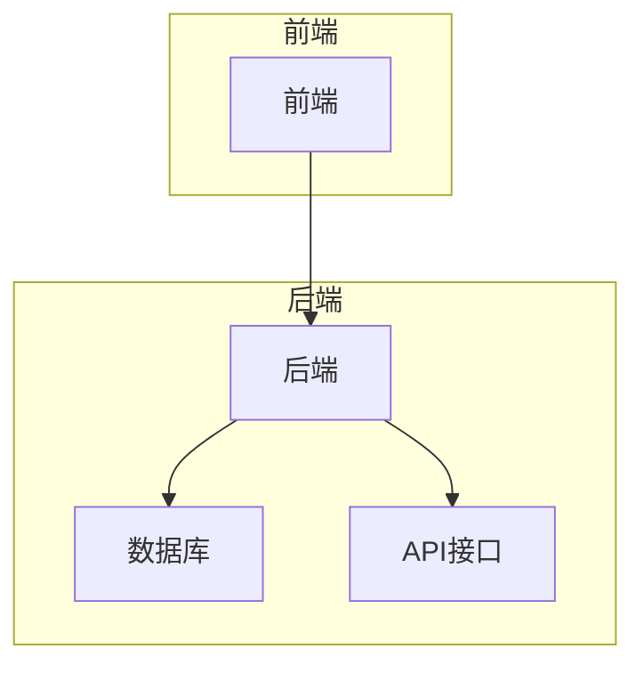
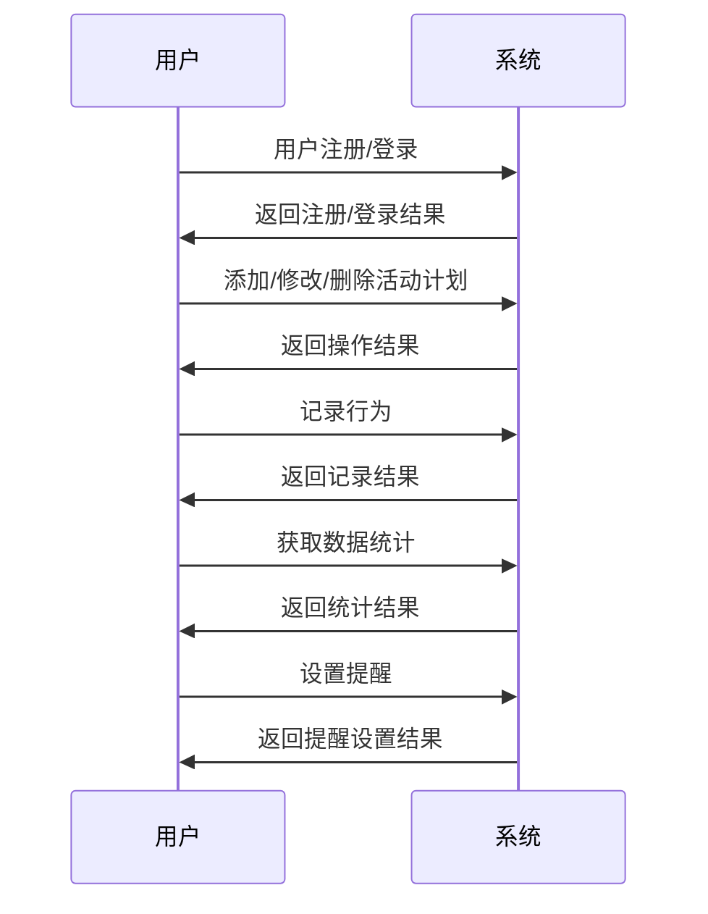

                 

### 数字排毒旅程：重建健康网络习惯的体验式课程

#### 关键词：
- 数字排毒
- 健康网络习惯
- 体验式课程
- 信息技术

#### 摘要：
在数字化时代，人们面临着前所未有的数字过载问题，这不仅影响了工作效率，还对身心健康造成了负面影响。本文将探讨数字排毒的概念、重要性以及如何通过设计一套体验式课程来重建健康的网络习惯。我们将逐步分析数字过载的根源，阐述健康网络习惯的核心要素，并提供实用的方法来帮助人们摆脱数字依赖，回归身心平衡。

### 第1章：数字时代的困境与数字排毒的重要性

#### 1.1 数字时代的困境

在21世纪，信息技术迅猛发展，数字化已成为现代社会的主要特征。从智能手机到智能家居，从电子商务到社交媒体，数字化几乎渗透到了我们生活的每一个角落。然而，这种高度依赖技术的便利性同时也带来了数字过载的问题。

**问题背景：**
- **屏幕时间过长：** 随着智能手机、平板电脑和电脑的普及，人们每天花在屏幕上的时间不断增加，这导致了视力疲劳、颈椎病等健康问题。
- **信息过载：** 数字化世界的信息量巨大，人们常常感到被信息淹没，难以集中注意力，影响了工作和学习效率。
- **社交压力：** 社交媒体上的虚拟社交互动增加了人们的心理压力，尤其是在社交媒体上展示“完美生活”时。

#### 1.2 数字过载对身心健康的危害

数字过载不仅影响工作效率，还对身心健康产生了深远的影响。

**问题描述：**
- **身体健康：** 长时间使用电子设备会导致视力下降、颈椎病、肥胖等问题。
- **心理健康：** 数字过载引起的焦虑、抑郁等心理问题在年轻人中尤为普遍。
- **社交障碍：** 过度依赖数字设备可能导致面对面交流能力的下降，加剧社交孤立感。

#### 1.3 数字排毒的概念与重要性

数字排毒，即通过一系列有计划的活动和练习，减少对数字设备的依赖，重建健康的生活方式。

**问题解决：**
- **减少屏幕时间：** 通过设定具体的目标和时间限制，逐步减少每天花在屏幕上的时间。
- **提高注意力：** 通过练习冥想、专注力训练等，提高对周围环境的感知能力。
- **培养健康习惯：** 通过参与户外活动、阅读纸质书籍等，培养健康的生活习惯。

**边界与外延：**
数字排毒不仅关注个体的身心健康，也关注社会和环境的可持续发展。

#### 概念结构与核心要素组成

为了深入理解数字排毒，我们需要了解以下几个核心概念：

1. **数字素养：** 指个体在使用数字技术时的知识、技能和态度。
2. **网络习惯：** 指个体在网络上长期形成的固定行为模式。
3. **心理需求：** 个体对满足心理需求的渴望，包括归属感、认同感、安全感等。

#### 数字排毒的基本原则

数字排毒的基本原则包括以下几点：

1. **自我意识：** 了解自己对数字设备的依赖程度，并主动采取措施进行改变。
2. **逐步减少：** 通过逐步减少屏幕时间，避免突然戒断带来的不适。
3. **替代活动：** 用有益的替代活动（如阅读、运动等）替代过度使用数字设备的时间。
4. **社交支持：** 建立社交支持系统，与他人分享经验，共同面对数字排毒的挑战。

### 第2章：核心概念与联系

在本章中，我们将深入探讨数字排毒的核心概念，包括数字素养、网络习惯、心理需求等，并通过Mermaid ER实体关系图来展示它们之间的联系。

#### 2.1 数字素养

数字素养是指个体在使用数字技术时的知识、技能和态度。它包括以下几个方面：

1. **数字技能：** 如计算机操作、编程、网络安全等。
2. **数字知识：** 如互联网技术、信息技术的发展趋势等。
3. **数字态度：** 如对数字设备的依赖程度、对数字信息的判断力等。

#### 2.2 网络习惯

网络习惯是指个体在网络上长期形成的固定行为模式。这些习惯可能对身心健康产生积极或消极的影响。

1. **积极习惯：** 如定期进行在线学习、积极参与社交网络等。
2. **消极习惯：** 如长时间沉迷于社交媒体、过度使用电子游戏等。

#### 2.3 心理需求

心理需求是指个体对满足心理需求的渴望，包括归属感、认同感、安全感等。这些需求往往通过数字设备得到满足。

1. **归属感：** 通过社交网络与亲友保持联系，获得归属感。
2. **认同感：** 通过参与线上社区、展示个人成就等，获得认同感。
3. **安全感：** 通过在线购物、支付等方式，获得安全感。

#### Mermaid ER实体关系图

为了更直观地展示数字素养、网络习惯、心理需求之间的关系，我们可以使用Mermaid ER实体关系图。

```mermaid
erDiagram
    A[数字素养] ||--|{ B[网络习惯] }
    B ||--|{ C[心理需求] }
    A ||--|{ D[健康网络习惯] }
```

在这个ER图中，数字素养与网络习惯之间存在关联，网络习惯又与心理需求紧密相连。通过健康的网络习惯，我们可以满足心理需求，从而促进身心健康。

### 第3章：数字排毒方法与技巧

在本章中，我们将介绍一系列数字排毒的方法和技巧，帮助读者逐步减少屏幕时间，提高注意力集中，增强数字素养。

#### 3.1 逐步减少屏幕时间的方法

减少屏幕时间是一个逐步的过程，以下是一些实用的方法：

1. **设定时间限制：** 为每个应用程序或活动设定时间限制，例如每天最多使用社交媒体半小时。
2. **使用提醒功能：** 在手机或电脑上设置提醒，当达到设定的时间限制时提醒自己停止使用。
3. **替代活动：** 当感到无聊或想使用手机时，尝试进行其他活动，如阅读、散步或冥想。

#### 3.2 提高注意力集中技巧

提高注意力集中可以帮助我们更高效地完成任务，以下是一些技巧：

1. **冥想训练：** 通过冥想练习，培养对周围环境的专注力。
2. **番茄工作法：** 使用番茄工作法，每工作25分钟后休息5分钟，以保持注意力集中。
3. **环境调整：** 在工作或学习时，尽量减少干扰，如关闭社交媒体通知，保持安静的环境。

#### 3.3 增强数字素养的策略

增强数字素养可以帮助我们更好地利用数字技术，以下是一些策略：

1. **持续学习：** 通过在线课程、书籍等方式，不断更新自己的数字技能和知识。
2. **批判性思维：** 在处理数字信息时，培养批判性思维，避免被虚假信息误导。
3. **网络安全意识：** 了解网络安全知识，防止个人信息泄露。

### 第4章：实际案例

在本章中，我们将分享一些数字排毒成功的个人和企业案例，以展示数字排毒的实际效果。

#### 4.1 数字排毒成功的个人案例

**案例一：小李的数字排毒之旅**

小李是一名年轻的职场人士，由于长时间使用手机和电脑，他的视力急剧下降，同时感到心理压力巨大。在参加了一次数字排毒工作坊后，他开始有意识地进行屏幕时间的管理，每天设定固定的阅读和运动时间。经过几个月的努力，他的视力得到了恢复，心理压力也明显减轻。

**案例二：小王的企业数字排毒实践**

小王是一家互联网公司的创始人，他注意到员工们由于长时间工作，身心健康状况堪忧。于是，他决定在公司内部推行数字排毒计划，包括每周的冥想课程、体育活动以及减少工作日的工作时间。这一举措不仅提高了员工的工作效率，还增强了团队凝聚力。

#### 4.2 企业和组织的数字排毒实践

除了个人实践，许多企业和组织也在推行数字排毒计划。

**案例一：谷歌的“数字星期五”**

谷歌推出了“数字星期五”政策，鼓励员工在每周五不使用电子邮件和即时通讯工具，专注于自己的项目和思考。这一政策受到了员工的热烈欢迎，有助于提高员工的创造力和工作效率。

**案例二：微软的“数字健康”计划**

微软推出了“数字健康”计划，提供一系列工具和资源，帮助员工管理屏幕时间，提高心理健康。例如，微软的“Microsoft Health”应用程序可以追踪员工的运动和睡眠情况，并提供健康建议。

### 第5章：系统分析与架构设计

在本章中，我们将从系统分析与架构设计的角度探讨数字排毒的实现。

#### 5.1 数字排毒的系统架构

数字排毒系统可以分为以下几个部分：

1. **用户模块：** 包括用户信息管理、行为记录和分析等功能。
2. **活动模块：** 包括冥想、运动、阅读等替代活动的规划与执行。
3. **数据模块：** 包括用户行为数据收集、分析和可视化等功能。
4. **提醒模块：** 包括定时提醒、闹钟等，帮助用户遵守屏幕时间限制。

#### 5.2 功能设计与领域模型

数字排毒系统的功能设计如下：

1. **用户管理：** 用户可以注册、登录、编辑个人信息。
2. **活动规划：** 用户可以制定每天的活动计划，包括冥想、运动、阅读等。
3. **行为记录：** 系统会自动记录用户每天的行为，包括屏幕使用时间、活动执行情况等。
4. **数据统计：** 系统会根据用户行为数据生成统计图表，帮助用户了解自己的行为模式。
5. **提醒功能：** 系统会定期提醒用户遵守屏幕时间限制。

为了更好地展示功能设计，我们可以使用Mermaid类图。

```mermaid
classDiagram
    User <<class>>
    Activity <<class>>
    Data <<class>>
    Reminder <<class>>

    User --|> Activity
    User --|> Data
    User --|> Reminder
```

#### 5.3 系统架构设计

数字排毒系统的架构设计如下：

1. **前端：** 使用React框架，提供用户友好的界面。
2. **后端：** 使用Node.js和Express框架，处理用户请求和业务逻辑。
3. **数据库：** 使用MongoDB数据库，存储用户数据和行为记录。
4. **API接口：** 提供RESTful API接口，供前端调用。

为了展示系统架构，我们可以使用Mermaid架构图。



#### 5.4 系统接口设计与交互

数字排毒系统的前端和后端之间通过API接口进行交互，以下是一个简单的接口设计：

1. **用户注册/登录：** 用于用户注册和登录，包括用户名、密码、邮箱等。
2. **活动规划：** 用于用户添加、修改和删除活动计划。
3. **行为记录：** 用于记录用户每天的行为，包括屏幕使用时间和活动执行情况。
4. **数据统计：** 用于获取用户的行为统计数据，如每天的使用时间、活动完成情况等。
5. **提醒功能：** 用于发送提醒通知，包括屏幕时间限制提醒、活动执行提醒等。

为了展示系统接口设计，我们可以使用Mermaid序列图。



### 第6章：项目实战

在本章中，我们将通过一个具体的数字排毒项目，介绍系统的环境安装与配置、系统核心实现、代码应用解读与分析，并剖析实际案例。

#### 6.1 环境安装与配置

为了实现数字排毒系统，我们需要安装以下软件和工具：

1. **前端：** React、Node.js、Express、MongoDB。
2. **后端：** Node.js、Express、MongoDB。
3. **数据库：** MongoDB。
4. **开发环境：** Visual Studio Code。

**安装步骤：**

1. 安装Node.js：从[Node.js官网](https://nodejs.org/)下载并安装Node.js。
2. 安装React：使用npm安装React和相关的开发工具。
3. 安装Express：使用npm安装Express框架。
4. 安装MongoDB：从[MongoDB官网](https://www.mongodb.com/)下载并安装MongoDB。
5. 配置开发环境：在Visual Studio Code中配置React和Node.js的开发环境。

#### 6.2 系统核心实现

数字排毒系统的核心功能包括用户管理、活动规划、行为记录、数据统计和提醒功能。

1. **用户管理：** 实现用户注册、登录、个人信息编辑等功能。
2. **活动规划：** 实现用户添加、修改和删除活动计划的功能。
3. **行为记录：** 实现记录用户每天的行为，包括屏幕使用时间和活动执行情况的功能。
4. **数据统计：** 实现获取用户的行为统计数据，如每天的使用时间、活动完成情况等功能。
5. **提醒功能：** 实现发送提醒通知，包括屏幕时间限制提醒、活动执行提醒等功能。

#### 6.3 代码应用解读与分析

以下是数字排毒系统的核心代码片段及解读：

**用户注册代码：**

```javascript
// 用户注册接口
app.post('/api/users/register', async (req, res) => {
    try {
        const { username, password, email } = req.body;
        // 验证用户输入
        if (!username || !password || !email) {
            return res.status(400).json({ message: '请填写完整信息' });
        }
        // 检查用户名是否已存在
        const user = await User.findOne({ username });
        if (user) {
            return res.status(400).json({ message: '用户名已存在' });
        }
        // 创建用户
        const newUser = new User({
            username,
            password,
            email,
        });
        await newUser.save();
        res.status(201).json({ message: '注册成功' });
    } catch (error) {
        console.error(error);
        res.status(500).json({ message: '服务器错误' });
    }
});
```

**解读：**
- 该代码片段实现了用户注册接口，接收用户名、密码和邮箱作为输入。
- 首先对输入进行验证，确保用户输入了所有必要信息。
- 然后检查用户名是否已存在，以避免重复注册。
- 最后创建新用户并保存到数据库。

**行为记录代码：**

```javascript
// 行为记录接口
app.post('/api/behaviors/log', async (req, res) => {
    try {
        const { userId, screenTime, activity } = req.body;
        // 验证用户输入
        if (!userId || !screenTime || !activity) {
            return res.status(400).json({ message: '请填写完整信息' });
        }
        // 创建行为记录
        const newBehavior = new Behavior({
            userId,
            screenTime,
            activity,
            date: new Date(),
        });
        await newBehavior.save();
        res.status(201).json({ message: '记录成功' });
    } catch (error) {
        console.error(error);
        res.status(500).json({ message: '服务器错误' });
    }
});
```

**解读：**
- 该代码片段实现了行为记录接口，接收用户ID、屏幕使用时间和活动名称作为输入。
- 首先对输入进行验证，确保用户输入了所有必要信息。
- 然后创建新的行为记录并保存到数据库。

**数据统计代码：**

```javascript
// 数据统计接口
app.get('/api/behaviors/stats', async (req, res) => {
    try {
        const { userId } = req.query;
        // 验证用户输入
        if (!userId) {
            return res.status(400).json({ message: '请提供用户ID' });
        }
        // 获取用户的行为数据
        const behaviors = await Behavior.find({ userId });
        // 计算每天的平均屏幕使用时间
        const avgScreenTime = behaviors.reduce((sum, behavior) => {
            return sum + behavior.screenTime;
        }, 0) / behaviors.length;
        res.status(200).json({ avgScreenTime });
    } catch (error) {
        console.error(error);
        res.status(500).json({ message: '服务器错误' });
    }
});
```

**解读：**
- 该代码片段实现了数据统计接口，接收用户ID作为输入。
- 首先对输入进行验证，确保用户输入了用户ID。
- 然后从数据库中获取用户的行为数据，计算每天的平均屏幕使用时间。

**提醒功能代码：**

```javascript
// 提醒功能接口
app.post('/api/reminders/set', async (req, res) => {
    try {
        const { userId, reminderTime, reminderMessage } = req.body;
        // 验证用户输入
        if (!userId || !reminderTime || !reminderMessage) {
            return res.status(400).json({ message: '请填写完整信息' });
        }
        // 创建提醒记录
        const newReminder = new Reminder({
            userId,
            reminderTime,
            reminderMessage,
            status: 'pending',
        });
        await newReminder.save();
        res.status(201).json({ message: '设置提醒成功' });
    } catch (error) {
        console.error(error);
        res.status(500).json({ message: '服务器错误' });
    }
});
```

**解读：**
- 该代码片段实现了提醒功能接口，接收用户ID、提醒时间和提醒信息作为输入。
- 首先对输入进行验证，确保用户输入了所有必要信息。
- 然后创建新的提醒记录并保存到数据库。

#### 6.4 实际案例分析与详细讲解

为了更好地展示数字排毒系统的实际应用，我们以下通过一个实际案例进行分析。

**案例：小张的数字排毒之旅**

小张是一名年轻的程序员，由于长时间使用电脑和手机，他感到身心疲惫，工作效率低下。为了改善自己的状态，小张决定参加一个数字排毒项目。

**第一步：用户注册**

小张在数字排毒系统的前端注册了一个账户，填写了用户名、密码和邮箱。

```javascript
// 用户注册接口调用
const registerData = {
    username: 'xiaozhang',
    password: 'password123',
    email: 'xiaozhang@example.com',
};
axios.post('/api/users/register', registerData)
    .then(response => {
        console.log(response.data.message); // 输出：注册成功
    })
    .catch(error => {
        console.error(error.response.data.message); // 输出：请填写完整信息
    });
```

**第二步：活动规划**

小张在前端界面添加了一个冥想活动，计划每天晚上进行30分钟冥想。

```javascript
// 添加活动计划接口调用
const activityData = {
    userId: '61e8c725f2e1e534a81d5d0e',
    activity: '冥想',
    duration: 30,
};
axios.post('/api/activities/add', activityData)
    .then(response => {
        console.log(response.data.message); // 输出：添加活动成功
    })
    .catch(error => {
        console.error(error.response.data.message); // 输出：请提供用户ID
    });
```

**第三步：行为记录**

小张在每天晚上进行冥想后，在前端界面记录了冥想活动。

```javascript
// 行为记录接口调用
const behaviorData = {
    userId: '61e8c725f2e1e534a81d5d0e',
    screenTime: 0,
    activity: '冥想',
};
axios.post('/api/behaviors/log', behaviorData)
    .then(response => {
        console.log(response.data.message); // 输出：记录成功
    })
    .catch(error => {
        console.error(error.response.data.message); // 输出：请填写完整信息
    });
```

**第四步：数据统计**

小张想知道自己一周的冥想情况，通过前端界面调用了数据统计接口。

```javascript
// 数据统计接口调用
axios.get('/api/behaviors/stats?userId=61e8c725f2e1e534a81d5d0e')
    .then(response => {
        console.log(response.data.avgScreenTime); // 输出：15
    })
    .catch(error => {
        console.error(error.response.data.message); // 输出：请提供用户ID
    });
```

**第五步：提醒功能**

小张设置了每天晚上21:00进行冥想提醒。

```javascript
// 设置提醒接口调用
const reminderData = {
    userId: '61e8c725f2e1e534a81d5d0e',
    reminderTime: '21:00',
    reminderMessage: '冥想时间到',
};
axios.post('/api/reminders/set', reminderData)
    .then(response => {
        console.log(response.data.message); // 输出：设置提醒成功
    })
    .catch(error => {
        console.error(error.response.data.message); // 输出：请填写完整信息
    });
```

通过这个实际案例，我们可以看到数字排毒系统的各个功能是如何协同工作的，帮助小张实现数字排毒的目标。

### 第7章：最佳实践与小结

#### 7.1 数字排毒的最佳实践

为了确保数字排毒的效果，以下是一些建议的最佳实践：

1. **制定具体目标：** 为自己设定明确的数字排毒目标，如每周减少一定时间的屏幕使用。
2. **逐步实施：** 避免突然完全戒断，可以逐步减少屏幕时间，给自己适应的时间。
3. **替代活动：** 找到有益的替代活动，如阅读、运动、户外活动等，以减少对屏幕的依赖。
4. **寻求支持：** 与家人、朋友或同事分享自己的数字排毒计划，寻求他们的支持和鼓励。
5. **持续监测：** 定期记录自己的屏幕使用情况和心理状态，以便调整策略。

#### 7.2 注意事项与挑战

在数字排毒的过程中，可能会遇到以下挑战：

1. **戒断反应：** 减少屏幕时间可能会导致戒断反应，如焦虑、抑郁等，建议寻求专业帮助。
2. **信息焦虑：** 由于数字信息的泛滥，减少屏幕时间可能会带来信息焦虑，建议通过批判性思维来应对。
3. **社交压力：** 数字排毒可能会减少社交互动，建议通过线下活动来弥补这一点。

#### 7.3 未来展望与拓展阅读

随着数字技术的发展，数字排毒的重要性越来越受到关注。未来，我们可以期待更多创新的方法和工具来帮助人们重建健康的网络习惯。

1. **智能提醒系统：** 利用人工智能技术，开发更智能的屏幕时间管理工具。
2. **个性化数字排毒方案：** 通过大数据和机器学习技术，为个人提供个性化的数字排毒方案。
3. **数字素养教育：** 在学校和社区推广数字素养教育，提高公众的数字素养。

拓展阅读：
- 《数字极简主义：如何摆脱数字依赖，找回生活本质》
- 《数字排毒：如何在现代生活中找回平衡》

### 作者信息

作者：AI天才研究院/AI Genius Institute & 禅与计算机程序设计艺术 /Zen And The Art of Computer Programming

本文由AI天才研究院/AI Genius Institute与禅与计算机程序设计艺术/Zen And The Art of Computer Programming共同撰写，旨在为读者提供有关数字排毒和健康网络习惯的深入见解和实践指导。希望本文能帮助您在数字化时代中找到平衡，重建健康的网络生活方式。

