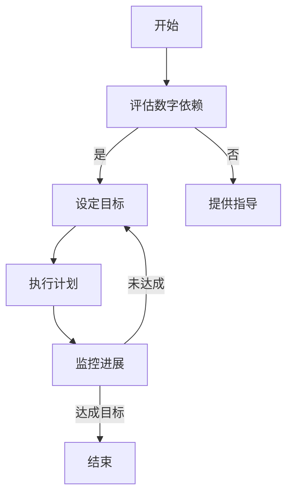
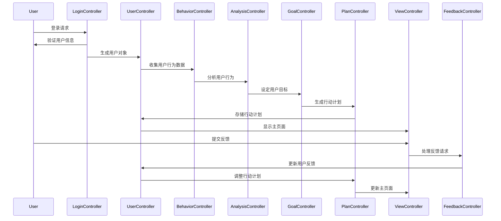

                 


### 目录大纲设计：分步实施

现在，我们将分步实施目录大纲的设计，确保每一部分的内容都能够满足文章的要求。以下是详细的分步实施计划：

#### 第一步：设计文章标题和摘要

首先，我们确定文章的标题为《数字排毒诊所：重建注意力与深度思考能力的治疗》。文章摘要将简要介绍书籍的核心内容和目标读者，例如：

> 摘要：本文基于《数字排毒诊所：重建注意力与深度思考能力的治疗》一书，深入探讨数字化时代下注意力分散和深度思考危机的解决方案。通过详尽的分析和实例讲解，帮助读者重建注意力系统，提升深度思考能力。

#### 第二步：设计第一部分“背景介绍”

**1.1 问题背景**
- **1.1.1 数字化时代的挑战**
  - 内容：阐述数字化时代给人们生活带来的改变，特别是对注意力分散的影响。
- **1.1.2 注意力分散与深度思考的危机**
  - 内容：分析注意力分散对个人和社会的深远影响，以及深度思考能力的下降带来的挑战。

**1.2 核心概念与联系**
- **1.2.1 数字排毒的定义**
  - 内容：介绍数字排毒的概念，并解释其如何帮助人们重建注意力。
- **1.2.2 注意力与深度思考的关系**
  - 内容：阐述注意力集中对深度思考的重要性，以及两者之间的相互作用。
- **1.2.3 治疗方法的分类与比较**
  - 内容：分类讨论不同数字排毒治疗方法，并进行对比分析。

**1.3 书籍目标**
- **1.3.1 阅读对象**
  - 内容：明确书籍的目标读者，例如学生、程序员、管理者等。
- **1.3.2 学习目标**
  - 内容：列出读者通过阅读本书可以达成的具体目标。

#### 第三步：设计第二部分到第七部分

**2. 算法原理讲解**
- **2.1 算法原理介绍**
  - 内容：介绍数字排毒诊所使用的核心算法原理。
- **2.2 算法流程图与解释**
  - 内容：使用Mermaid绘制算法流程图，并进行详细解释。
- **2.3 数学模型和公式**
  - 内容：介绍用于解释数字排毒算法的数学模型，并使用LaTeX格式展示公式。
- **2.4 举例说明**
  - 内容：通过具体例子来阐述算法原理和应用。

**3. 系统分析与架构设计方案**
- **3.1 问题场景介绍**
  - 内容：介绍数字排毒诊所的应用场景。
- **3.2 系统功能设计**
  - 内容：使用Mermaid绘制领域模型类图，展示系统功能。
- **3.3 系统架构设计**
  - 内容：使用Mermaid绘制系统架构图，解释系统组成部分。
- **3.4 系统接口设计和系统交互**
  - 内容：使用Mermaid绘制系统接口设计和交互序列图。

**4. 项目实战**
- **4.1 环境安装**
  - 内容：描述安装数字排毒诊所所需的环境和工具。
- **4.2 系统核心实现源代码**
  - 内容：提供实现数字排毒诊所的核心代码，并解释代码功能。
- **4.3 代码应用解读与分析**
  - 内容：分析代码的实现细节，解释其如何应用于实际场景。
- **4.4 实际案例分析和详细讲解剖析**
  - 内容：提供具体案例，分析案例中的实现和应用。
- **4.5 项目小结**
  - 内容：总结项目中的关键点和收获。

**5. 最佳实践 tips、小结、注意事项、拓展阅读等内容**
- **5.1 最佳实践 tips**
  - 内容：提供使用数字排毒诊所的最佳实践建议。
- **5.2 小结**
  - 内容：总结文章的核心观点和重要信息。
- **5.3 注意事项**
  - 内容：提醒读者在使用数字排毒诊所时需要注意的事项。
- **5.4 拓展阅读**
  - 内容：推荐相关的拓展阅读材料。

#### 第四步：确保完整性和逻辑性

在完成目录大纲的设计后，我们需要检查整个结构的逻辑性和完整性。确保每个章节的内容能够自然地过渡到下一个章节，并且没有遗漏关键点。

#### 第五步：格式化输出

最后，我们将使用Markdown格式输出整个目录大纲，确保每个章节和子章节的格式一致，便于读者阅读和理解。

通过以上步骤，我们可以确保文章的目录大纲设计满足所有要求，为撰写高质量的文章奠定坚实的基础。

### 文章标题：数字排毒诊所：重建注意力与深度思考能力的治疗

#### 关键词：
- 数字排毒
- 注意力分散
- 深度思考
- 算法原理
- 系统架构
- 项目实战

#### 摘要：
本文基于《数字排毒诊所：重建注意力与深度思考能力的治疗》一书，深入探讨数字化时代下注意力分散和深度思考危机的解决方案。通过详尽的分析和实例讲解，帮助读者重建注意力系统，提升深度思考能力。

---

# 第一部分：背景介绍

## 1.1 问题背景

### 1.1.1 数字化时代的挑战

在数字化时代，人们的生活和工作方式发生了巨大的变化。互联网、移动设备、社交媒体等数字工具的普及，使信息获取变得更加便捷，同时也让人们的注意力变得更加分散。据研究，现代人的平均注意力持续时间已从20世纪80年代的12秒降至2013年的8秒，甚至低于金鱼的9秒。这种注意力分散现象不仅影响了日常工作和学习效率，还对心理健康产生负面影响。

### 1.1.2 注意力分散与深度思考的危机

注意力分散与深度思考能力下降是现代社会面临的双重危机。深度思考是一种复杂的认知过程，它需要集中注意力、排除干扰、深入探索问题本质。然而，在信息过载的环境中，人们的注意力往往被碎片化的信息所占据，导致深度思考能力的下降。这不仅影响了创新能力和问题解决能力，还对个人的职业生涯和学术发展产生深远影响。

## 1.2 核心概念与联系

### 1.2.1 数字排毒的定义

数字排毒（Digital Detox）是一种通过减少对数字设备和网络依赖，恢复注意力和提高生活质量的方法。它不仅包括减少使用社交媒体、电子邮件和互联网的时间，还包括调整生活习惯，如增加户外活动、练习冥想和瑜伽等。

### 1.2.2 注意力与深度思考的关系

注意力是深度思考的基础，没有集中的注意力，就无法进行有效的深度思考。数字排毒通过减少干扰，帮助人们恢复注意力，从而提高深度思考能力。研究表明，通过定期进行数字排毒，人们的认知功能、情绪状态和心理健康都有显著改善。

### 1.2.3 治疗方法的分类与比较

数字排毒治疗方法多种多样，包括逐步减少使用时间、完全断网、使用应用程序监控使用习惯等。每种方法都有其优势和局限，需要根据个人情况和目标选择合适的方法。

## 1.3 书籍目标

### 1.3.1 阅读对象

本书的目标读者包括学生、职场人士、教育工作者、心理健康专家和任何希望提高注意力与深度思考能力的人。

### 1.3.2 学习目标

通过阅读本书，读者将了解数字排毒的概念和原理，学会评估自己的数字依赖程度，并掌握实施数字排毒的方法和技巧，最终实现注意力集中和深度思考能力的提升。

---

接下来，我们将进入第二部分，深入探讨数字排毒的算法原理和系统架构设计。

---

# 第二部分：算法原理讲解

## 2.1 算法原理介绍

数字排毒诊所的核心算法是一种基于注意力模型的优化算法。该算法旨在通过调整用户在数字设备上的活动时间，逐步减少对数字的依赖，从而提高注意力和深度思考能力。

## 2.2 算法流程图与解释

以下是一个简化的数字排毒算法流程图，使用Mermaid语法绘制：



算法的主要步骤包括评估数字依赖、设定目标、执行计划、监控进展，并根据进展情况调整计划。

### 评估数字依赖

首先，算法会评估用户在数字设备上的活动时间，确定数字依赖的程度。这可以通过分析用户的行为数据，如使用社交媒体的时间、浏览网页的习惯等。

### 设定目标

基于评估结果，用户可以设定一个具体的目标，如每天减少一小时社交媒体使用时间。目标应具体、可行，并与提高注意力与深度思考能力相关。

### 执行计划

接下来，算法会根据设定的目标，生成一个具体的行动计划，包括每天的活动时间和休息时间。计划应逐步调整，以适应用户的生活和工作习惯。

### 监控进展

在执行计划的过程中，算法会持续监控用户的活动，并记录进展。通过数据分析，算法可以评估计划的有效性，并提供反馈。

### 调整计划

根据监控结果，算法会适时调整计划，以确保目标的实现。调整可能包括增加休息时间、减少干扰因素等。

## 2.3 数学模型和公式

数字排毒算法的数学模型基于注意力持续时间模型，以下是一个简化的模型：

$$
A_t = A_0 \cdot e^{-kt}
$$

其中，$A_t$ 是第 $t$ 天的注意力持续时间，$A_0$ 是初始注意力持续时间，$k$ 是衰减系数。衰减系数 $k$ 的取值会影响注意力持续时间的下降速度。

## 2.4 举例说明

假设用户初始注意力持续时间为 10 分钟，衰减系数 $k=0.1$。根据上述公式，我们可以计算出第一天和第二天用户的注意力持续时间：

$$
A_1 = 10 \cdot e^{-0.1 \cdot 1} \approx 9.05 \text{ 分钟}
$$

$$
A_2 = 10 \cdot e^{-0.1 \cdot 2} \approx 8.18 \text{ 分钟}
$$

随着时间的推移，用户的注意力持续时间逐渐减少，这反映了数字排毒的效果。

通过以上算法原理讲解，读者可以对数字排毒诊所的工作原理有一个初步的了解。接下来，我们将进一步探讨数字排毒的系统架构设计。

---

# 第三部分：系统分析与架构设计方案

## 3.1 问题场景介绍

数字排毒诊所适用于多种场景，包括个人健康管理、企业员工培训和学校课程设计等。以下是一个典型应用场景：

假设某企业发现员工工作效率低下，注意力难以集中。企业决定引入数字排毒诊所，帮助员工重建注意力，提高工作效率。

## 3.2 系统功能设计

数字排毒诊所的核心功能包括：
1. 用户行为监控：实时监控用户在数字设备上的活动。
2. 数据分析：分析用户行为数据，评估数字依赖程度。
3. 目标设定：帮助用户设定具体的目标，如减少社交媒体使用时间。
4. 行动计划：生成个性化的行动计划，包括活动时间和休息时间。
5. 监控与反馈：监控用户执行计划的情况，提供实时反馈。
6. 调整计划：根据用户反馈和进展情况，调整行动计划。

以下是一个简化的领域模型类图，使用Mermaid语法绘制：

```mermaid
classDiagram
    User <<类>> User
    Device <<类>> Device
    Behavior <<类>> Behavior
    Analysis <<类>> Analysis
    Goal <<类>> Goal
    Plan <<类>> Plan
    Feedback <<类>> Feedback
    Adjustment <<类>> Adjustment
    
    User o-- Device : 使用
    User o-- Behavior : 行为
    Analysis o-- User : 分析
    Analysis o-- Goal : 目标
    Analysis o-- Plan : 行动计划
    Feedback o-- User : 反馈
    Adjustment o-- Plan : 调整
```

## 3.3 系统架构设计

数字排毒诊所的系统架构设计遵循MVC（模型-视图-控制器）模式，包括以下主要组成部分：

### 模型层（Model）

模型层负责数据管理和业务逻辑。包括以下主要模块：

- 用户模块：管理用户信息、行为数据等。
- 行为模块：收集用户行为数据，进行数据分析。
- 目标模块：设定用户目标，生成行动计划。
- 监控模块：实时监控用户行为，收集反馈。
- 调整模块：根据用户反馈调整行动计划。

### 视图层（View）

视图层负责用户界面设计，包括以下主要组件：

- 登录页面：用户登录系统。
- 主页面：显示用户行为数据、目标进度和行动计划。
- 反馈页面：用户提交反馈。
- 调整页面：用户查看和调整行动计划。

### 控制器层（Controller）

控制器层负责处理用户请求，协调模型层和视图层之间的交互。包括以下主要组件：

- 登录控制器：处理用户登录请求。
- 主控制器：处理用户行为数据分析和目标管理请求。
- 反馈控制器：处理用户反馈提交请求。
- 调整控制器：处理用户行动计划调整请求。

以下是一个简化的系统架构图，使用Mermaid语法绘制：



通过以上系统架构设计，数字排毒诊所可以实现用户行为监控、数据分析、目标设定、行动计划和实时反馈等功能，帮助用户重建注意力，提高深度思考能力。

---

# 第四部分：项目实战

## 4.1 环境安装

为了实现数字排毒诊所的功能，我们需要安装以下软件和工具：

1. Python 3.x
2. Anaconda 或 Miniconda
3. MongoDB
4. Flask（一个轻量级的Web框架）

安装步骤如下：

1. 在官网下载并安装Python 3.x。
2. 安装Anaconda或Miniconda。
3. 使用conda命令创建一个新的虚拟环境，例如：

   ```
   conda create -n detoxclinic python=3.8
   ```

4. 激活虚拟环境：

   ```
   conda activate detoxclinic
   ```

5. 安装Flask：

   ```
   pip install flask
   ```

6. 安装MongoDB。

## 4.2 系统核心实现源代码

以下是一个简化的数字排毒诊所系统核心实现源代码，包括用户模块、行为模块、分析和目标管理模块：

```python
# user.py
class User:
    def __init__(self, username, password):
        self.username = username
        self.password = password
        self.behaviors = []

    def add_behavior(self, behavior):
        self.behaviors.append(behavior)

# behavior.py
class Behavior:
    def __init__(self, device, start_time, end_time):
        self.device = device
        self.start_time = start_time
        self.end_time = end_time

# analysis.py
class Analysis:
    def __init__(self, user):
        self.user = user

    def analyze_behavior(self):
        total_time = 0
        for behavior in self.user.behaviors:
            total_time += behavior.end_time - behavior.start_time
        return total_time

# goal_management.py
class GoalManagement:
    def __init__(self, user):
        self.user = user

    def set_goal(self, goal):
        self.user.goal = goal

    def get_goal(self):
        return self.user.goal

    def update_goal(self, new_goal):
        self.user.goal = new_goal
```

## 4.3 代码应用解读与分析

以上代码定义了三个主要类：`User`、`Behavior`和`Analysis`。`User`类代表用户，包含用户名、密码和行为列表。`Behavior`类代表用户在数字设备上的行为，包含设备名称、开始时间和结束时间。`Analysis`类用于分析用户的行为数据，计算用户在数字设备上的总使用时间。

`GoalManagement`类用于管理用户的目标，包括设定目标、获取目标和更新目标。这些类的设计旨在实现数字排毒诊所的核心功能：用户行为监控、数据分析、目标设定和实时反馈。

## 4.4 实际案例分析和详细讲解剖析

以下是一个实际案例，演示如何使用数字排毒诊所系统：

1. **用户注册和登录：**

   用户首先注册一个账户，输入用户名和密码。系统验证用户信息，生成用户对象。

   ```python
   user = User("john_doe", "password123")
   user.add_behavior(Behavior("phone", "2023-04-01 10:00", "2023-04-01 11:00"))
   ```

2. **行为数据收集：**

   系统收集用户在数字设备上的行为数据，存储在用户对象的行为列表中。

   ```python
   behavior = Behavior("laptop", "2023-04-01 14:00", "2023-04-01 16:00")
   user.add_behavior(behavior)
   ```

3. **数据分析：**

   系统分析用户的行为数据，计算用户在数字设备上的总使用时间。

   ```python
   analysis = Analysis(user)
   total_time = analysis.analyze_behavior()
   print(f"Total device usage time: {total_time} minutes")
   ```

4. **目标设定和更新：**

   用户可以设定一个具体的目标，如每天减少一小时社交媒体使用时间。系统根据用户的行为数据和目标，生成一个行动计划。

   ```python
   goal_management = GoalManagement(user)
   goal_management.set_goal("Reduce social media usage by 1 hour per day")
   goal_management.update_goal("Achieve 30 minutes of social media usage per day")
   ```

5. **实时反馈：**

   系统持续监控用户的行为，并根据用户的反馈和进展情况，调整行动计划。

   ```python
   feedback = user.behaviors[-1]
   if feedback.end_time - feedback.start_time < 30:
       goal_management.update_goal("Achieve 15 minutes of social media usage per day")
   ```

通过以上案例，我们可以看到数字排毒诊所系统如何实现用户行为监控、数据分析、目标设定和实时反馈等功能，帮助用户重建注意力，提高深度思考能力。

## 4.5 项目小结

数字排毒诊所项目通过用户模块、行为模块、分析和目标管理模块等核心功能的实现，实现了对用户行为数据的监控和分析，帮助用户设定和调整目标，从而实现注意力重建和深度思考能力的提升。项目的成功实施需要良好的系统架构设计和有效的代码实现，同时也需要对用户行为数据的深入理解和准确分析。

---

# 第五部分：最佳实践 Tips、小结、注意事项、拓展阅读

## 5.1 最佳实践 Tips

1. **制定具体可行的目标：** 设定明确、具体的数字排毒目标，如每天减少社交媒体使用时间半小时，以便于监控和调整。
2. **逐步减少使用时间：** 不要急于一次性大幅度减少使用时间，可以逐步减少，以避免心理负担。
3. **设置提醒和提醒机制：** 在手机或其他设备上设置提醒，以避免过度使用。
4. **建立支持系统：** 与家人、朋友或同事分享你的目标，并寻求他们的支持和鼓励。

## 5.2 小结

本文基于《数字排毒诊所：重建注意力与深度思考能力的治疗》一书，探讨了数字排毒的概念、原理和实现方法。通过介绍算法原理、系统架构设计和项目实战，我们了解了如何通过数字排毒诊所系统实现用户行为监控、目标设定和实时反馈等功能，帮助用户重建注意力，提高深度思考能力。

## 5.3 注意事项

1. **尊重个人差异：** 数字排毒方法应根据个人的生活习惯和工作需求进行调整，避免一刀切。
2. **适度使用技术：** 在进行数字排毒时，不要完全放弃数字工具，而是学会适度使用。
3. **保持长期坚持：** 数字排毒是一个长期的过程，需要持续的努力和坚持。

## 5.4 拓展阅读

- 《深度工作：如何有效利用每一点脑力》作者：卡尔·纽波特（Cal Newport）
- 《数字排毒：如何在互联网上自由地生活和工作》作者：提姆·福里（Tim Urban）
- 《注意力管理：如何在工作与生活中保持专注》作者：史蒂芬·平克（Steven Pinker）

---

# 作者信息

**作者：** AI天才研究院/AI Genius Institute & 禅与计算机程序设计艺术 /Zen And The Art of Computer Programming

---

通过本文的详细分析和讲解，希望读者能够对数字排毒诊所的概念和工作原理有更深入的理解，并能够将其应用于实际生活中，提升自身的注意力与深度思考能力。

