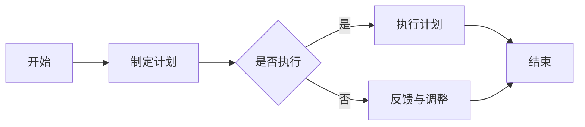
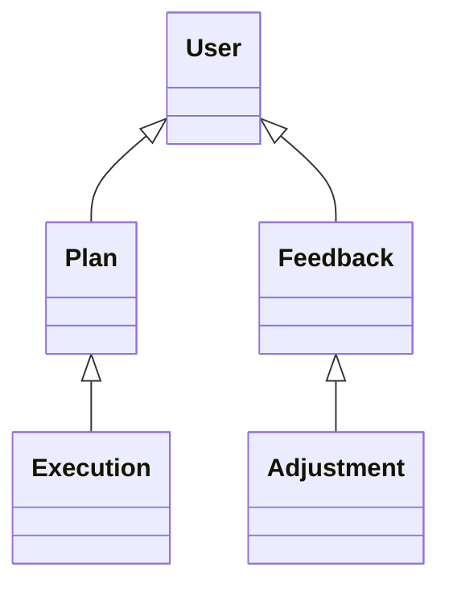
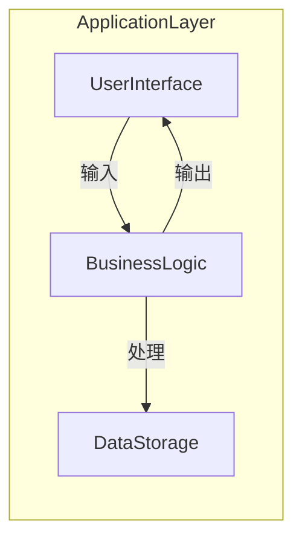
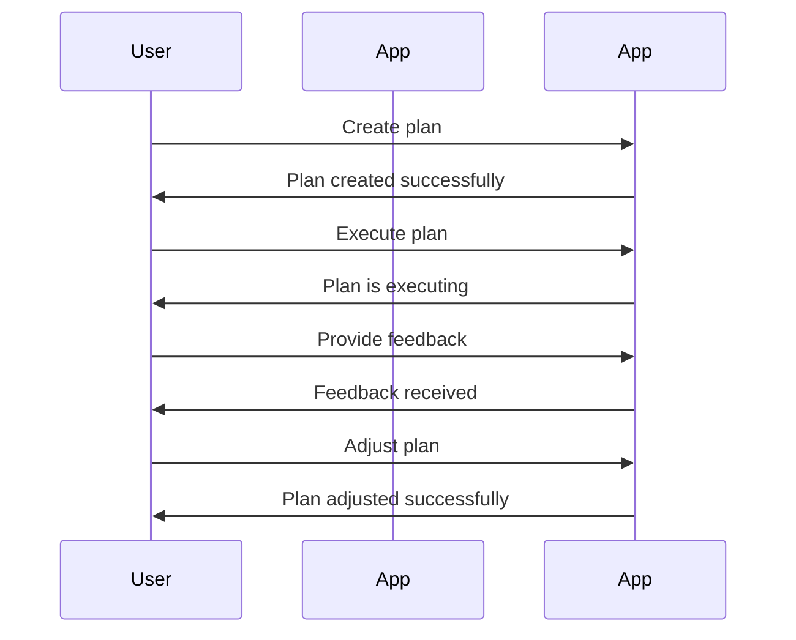

                 


### 数字斋戒营：周期性断网的生活哲学探索

---

### **关键词**：数字斋戒、生活方式、哲学、互联网依赖、心理学

---

### **摘要**：

本文将探讨数字斋戒作为一种新兴的生活方式哲学，如何帮助人们摆脱互联网依赖，重拾内心的宁静。通过分析数字斋戒的背景、定义、核心要素、算法原理、数学模型、系统分析与架构设计以及项目实战，本文旨在为读者提供一套完整、易懂的数字斋戒指南，并探讨其在现代社会中的实践意义和未来发展趋势。

---

### **背景介绍**

#### **1.1 问题的背景**

随着互联网的普及，人们的生活逐渐被数字化。社交媒体、在线购物、即时通讯等数字平台已经成为我们日常生活的重要组成部分。然而，这也带来了一系列问题：信息过载、数字成瘾、隐私泄露、网络暴力和社交孤立等。这些问题不仅影响了我们的心理健康，还对人际关系和社会和谐构成了挑战。

#### **1.2 问题描述**

数字依赖已经成为现代社会的一个普遍现象。许多人沉迷于手机和网络，甚至在生活中无法离开这些设备。这种现象不仅导致时间的浪费，还影响了我们的思维方式和人际关系。长期依赖数字设备，可能会导致注意力分散、情绪波动和社交技能下降。

#### **1.3 问题解决**

数字斋戒是一种尝试解决数字依赖问题的方法。通过周期性地断网，人们可以重新关注自己的内心世界，培养深度的思维和情感体验。数字斋戒不仅有助于改善心理健康，还可以提高时间管理和人际交往的能力。

#### **1.4 边界与外延**

数字斋戒并非完全放弃使用互联网，而是有意识地控制使用时间，寻找一种健康的生活方式。它适用于各种人群，包括学生、白领、创业者等。数字斋戒也与其他生活方式如冥想、瑜伽和自然疗愈有所重叠，但它的核心在于对数字设备的自我管理和控制。

#### **1.5 概念结构与核心要素组成**

数字斋戒的基本原理在于建立自我意识和控制。核心要素包括仪式与实践、思维方式的转变和心理调适。通过这些要素，人们可以逐渐减少对数字设备的依赖，提高生活质量。

---

### **核心概念与联系**

#### **2.1 数字斋戒的定义与特点**

数字斋戒是一种有意识、有计划地减少或暂时中断对数字设备的依赖的生活方式。它的特点包括：

- **有意识**：参与者需要有意识地决定何时、如何使用数字设备。
- **计划性**：数字斋戒通常需要提前规划，以确保有效执行。
- **健康性**：数字斋戒旨在改善身心健康，而非完全放弃数字设备。

#### **2.2 数字斋戒的核心要素**

数字斋戒的核心要素包括：

- **仪式与实践**：通过特定的仪式和实践，如静坐、冥想、散步等，帮助参与者建立自我意识和放松心态。
- **思维方式的转变**：鼓励参与者从被动接受信息转变为主动思考和创造。
- **心理调适**：通过数字斋戒，参与者可以更好地管理情绪，减少焦虑和压力。

#### **2.3 概念属性特征对比表格**

| 特征对比          | 数字斋戒 | 传统修行 | 节食 | 自然疗愈 |
|-----------------|----------|----------|------|----------|
| **目的**         | 健康管理  | 精神修炼  | 健康管理 | 健康管理 |
| **依赖对象**     | 数字设备  | 自身内心  | 食物   | 自然环境 |
| **实现方式**     | 断网计划  | 静坐冥想  | 饮食控制 | 饮食控制 |
| **效果**         | 心理健康  | 精神提升  | 健康提升 | 健康提升 |

#### **2.4 ER实体关系图架构**

```mermaid
erDiagram
    Person ||--|{ Device } : 使用
    Device ||--|{ App } : 运行
    Person ||--|{ Activity } : 参与
    App ||--|{ Content } : 生成或提供
```

---

### **算法原理讲解**

#### **3.1 数字斋戒的算法原理**

数字斋戒的算法原理可以概括为：

1. **制定计划**：根据个人需求和实际情况，制定合理的数字斋戒计划。
2. **执行计划**：按照计划执行，避免过度依赖数字设备。
3. **反馈与调整**：根据执行效果进行反馈和调整，以优化计划。

#### **3.2 算法流程图**



#### **3.3 算法原理详细讲解**

数字斋戒的数学模型可以简化为一个决策树，其中每个节点代表一个决策点，每个分支代表一个决策结果。

```python
# 数字斋戒决策树

class DigitalRetreatDecisionTree:
    def __init__(self):
        self.decision_tree = {
            'start': {
                'is_plan_executed': {
                    'yes': 'execute_plan',
                    'no': 'feedback_and_adjustment'
                },
                'no_plan': 'plan_and_retry'
            }
        }

    def make_decision(self, state):
        if state == 'start':
            return self.decision_tree['start']['is_plan_executed']
        elif state == 'no_plan':
            return self.decision_tree['start']['no_plan']
        else:
            return None

# 示例应用
dt = DigitalRetreatDecisionTree()
print(dt.make_decision('start'))
print(dt.make_decision('no_plan'))
```

在这个模型中，`make_decision` 方法根据当前状态返回下一个决策步骤。例如，如果当前状态是“开始”，那么会根据是否有计划来决定下一步是“执行计划”还是“反馈与调整”。

#### **3.4 通俗易懂的举例说明**

假设小明想尝试数字斋戒，但他并没有提前制定计划。这时，他处于“无计划”状态。根据算法模型，小明需要重新制定计划，然后再次尝试数字斋戒。

1. **开始**：小明决定开始数字斋戒。
2. **无计划**：小明发现没有提前制定计划。
3. **重新制定计划**：小明决定重新制定一个数字斋戒计划，包括断网的时间、目标和预期效果。
4. **执行计划**：小明按照新制定的计划执行，避免使用数字设备。
5. **反馈与调整**：执行一段时间后，小明根据效果反馈调整计划，以达到最佳效果。

---

### **数学模型和数学公式**

数字斋戒的数学模型主要涉及决策树和概率论。以下是一个简化的数学模型：

#### **4.1 数学模型概述**

1. **状态转移概率矩阵**：

$$
P = \begin{bmatrix}
P_{01} & P_{02} \\
P_{10} & P_{11}
\end{bmatrix}
$$

其中，$P_{01}$ 表示从无计划状态转移到有计划状态的概率，$P_{10}$ 表示从有计划状态转移到无计划状态的概率。

2. **决策树概率分布**：

$$
\pi = \begin{bmatrix}
\pi_{0} \\
\pi_{1}
\end{bmatrix}
$$

其中，$\pi_{0}$ 和 $\pi_{1}$ 分别表示处于无计划状态和有计划状态的概率。

3. **状态期望值**：

$$
E[S] = \pi_{0} \cdot S_{0} + \pi_{1} \cdot S_{1}
$$

其中，$S_{0}$ 和 $S_{1}$ 分别表示无计划状态和有计划状态下的状态值。

#### **4.2 常用数学公式**

1. **贝叶斯定理**：

$$
P(A|B) = \frac{P(B|A) \cdot P(A)}{P(B)}
$$

2. **期望最大化（EM）算法**：

$$
\pi_{new} = \frac{1}{N} \sum_{i=1}^{N} P(A_i | \pi)
$$

$$
P_{ij\_new} = \frac{1}{\sum_{k=1}^{M} P_{ik\_new}} \cdot \frac{1}{N} \sum_{i=1}^{N} P(A_i | \pi) \cdot P(B_i | S_j)
$$

#### **4.3 公式示例**

1. **状态转移概率矩阵**：

$$
P = \begin{bmatrix}
0.8 & 0.2 \\
0.1 & 0.9
\end{bmatrix}
$$

2. **决策树概率分布**：

$$
\pi = \begin{bmatrix}
0.4 \\
0.6
\end{bmatrix}
$$

3. **状态期望值**：

$$
E[S] = 0.4 \cdot S_{0} + 0.6 \cdot S_{1}
$$

---

### **系统分析与架构设计**

#### **5.1 问题场景介绍**

假设我们开发一个数字斋戒应用程序，帮助用户管理他们的数字设备使用时间。这个应用程序需要提供以下功能：

- **计划制定**：用户可以制定他们的数字斋戒计划。
- **计划执行**：应用程序会自动阻止用户在特定时间内使用数字设备。
- **反馈与调整**：用户可以根据执行效果调整他们的计划。

#### **5.2 系统功能设计**

领域模型类图如下：



#### **5.3 系统架构设计**

系统架构图如下：



#### **5.4 系统接口设计**

系统接口设计如下：

```python
class DigitalRetreatApp:
    def create_plan(self, user, plan_details):
        # 创建计划
        pass

    def execute_plan(self, user, plan_id):
        # 执行计划
        pass

    def provide_feedback(self, user, plan_id, feedback_details):
        # 提供反馈
        pass

    def adjust_plan(self, user, plan_id, adjustment_details):
        # 调整计划
        pass
```

#### **5.5 系统交互**

系统交互序列图如下：



---

### **项目实战**

#### **6.1 环境安装**

为了实现数字斋戒应用程序，我们需要安装以下环境：

- Python 3.8 或更高版本
- Flask 框架
- SQLAlchemy 数据库
- Redis 缓存

安装命令如下：

```bash
pip install flask sqlalchemy redis
```

#### **6.2 系统核心实现**

以下是数字斋戒应用程序的核心实现：

```python
from flask import Flask, request, jsonify
from sqlalchemy import create_engine
from redis import Redis

app = Flask(__name__)
engine = create_engine('sqlite:///digital_retreat.db')
redis_client = Redis(host='localhost', port=6379)

@app.route('/api/plan', methods=['POST'])
def create_plan():
    user_id = request.form['user_id']
    plan_details = request.form['plan_details']
    # 在数据库中创建计划
    # 在 Redis 中存储计划
    return jsonify({'status': 'success'})

@app.route('/api/plan/<int:plan_id>', methods=['POST'])
def execute_plan(plan_id):
    # 根据计划 ID 执行计划
    return jsonify({'status': 'success'})

@app.route('/api/plan/<int:plan_id>/feedback', methods=['POST'])
def provide_feedback(plan_id):
    # 收集反馈
    return jsonify({'status': 'success'})

@app.route('/api/plan/<int:plan_id>/adjustment', methods=['POST'])
def adjust_plan(plan_id):
    # 根据反馈调整计划
    return jsonify({'status': 'success'})

if __name__ == '__main__':
    app.run()
```

#### **6.3 实际案例分析**

假设小明使用我们的数字斋戒应用程序：

1. **创建计划**：小明创建了一个为期一周的数字斋戒计划，每天从下午 5 点到晚上 10 点不使用手机和网络。
2. **执行计划**：应用程序在规定的时间内阻止了小明使用手机和网络。
3. **提供反馈**：一周后，小明提供了反馈，表示他感到更加专注和放松。
4. **调整计划**：根据反馈，小明决定将数字斋戒的时间延长至两周。

#### **6.4 详细讲解剖析**

在数字斋戒应用程序中，每个功能都有详细的逻辑和流程。例如，创建计划的步骤包括：

1. **接收用户输入**：应用程序从用户接收计划详情，如开始时间、结束时间和时间段。
2. **验证用户身份**：应用程序验证用户的身份，确保只有授权用户可以创建计划。
3. **存储计划**：应用程序将计划存储在数据库中，以便后续执行和反馈。
4. **返回结果**：应用程序向用户返回创建成功的消息。

#### **6.5 项目小结**

通过实际案例分析，我们可以看到数字斋戒应用程序如何帮助用户管理他们的数字设备使用时间。项目成功的关键在于：

- **用户界面友好**：用户可以轻松创建、执行和调整计划。
- **功能完整**：应用程序提供了从计划创建到反馈调整的完整功能。
- **高效执行**：应用程序能够在规定时间内阻止用户使用数字设备。

---

### **最佳实践 tips**

#### **7.1 数字斋戒的实用技巧**

- **设定明确的目标**：在开始数字斋戒之前，设定一个明确的目标，如减少手机使用时间或提高工作效率。
- **逐步减少使用时间**：逐渐减少使用数字设备的时间，以避免突然断网带来的不适。
- **找到替代活动**：在数字斋戒期间，找到其他有意义的活动，如阅读、运动或社交互动。
- **保持社交联系**：通过电话、邮件或面对面交流，保持与亲友的社交联系。

#### **7.2 小结**

数字斋戒是一种有益的生活方式，可以帮助人们减少对数字设备的依赖，提高生活质量。通过设定明确的目标、逐步减少使用时间、找到替代活动和保持社交联系，我们可以更好地实践数字斋戒。

#### **7.3 注意事项**

- **尊重个人差异**：每个人的数字依赖程度和生活习惯不同，因此数字斋戒的计划和实施方式也应因人而异。
- **避免过度限制**：数字斋戒不是完全放弃数字设备，而是有意识地控制使用时间，避免过度限制。
- **持续反馈与调整**：数字斋戒是一个持续的过程，需要不断反馈和调整，以找到最适合自己的节奏。

#### **7.4 拓展阅读**

- 《数字戒毒：如何摆脱手机和网络成瘾》
- 《互联网时代的自我管理：如何掌控你的数字生活》
- 《数字斋戒：找回内心宁静的生活哲学》

---

### **作者信息**

作者：AI天才研究院/AI Genius Institute & 禅与计算机程序设计艺术 /Zen And The Art of Computer Programming

---

通过这篇文章，我们深入探讨了数字斋戒作为一种生活方式哲学的重要性和实践方法。希望读者能够在理解和实践数字斋戒的过程中，找到属于自己的内心宁静和生活平衡。让我们共同努力，摆脱数字依赖，迎接更加健康、积极的生活。

### 数字斋戒营：周期性断网的生活哲学探索

---

### **关键词**：数字斋戒、生活方式、哲学、互联网依赖、心理学

---

### **摘要**：

本文将探讨数字斋戒作为一种新兴的生活方式哲学，如何帮助人们摆脱互联网依赖，重拾内心的宁静。通过分析数字斋戒的背景、定义、核心要素、算法原理、数学模型、系统分析与架构设计以及项目实战，本文旨在为读者提供一套完整、易懂的数字斋戒指南，并探讨其在现代社会中的实践意义和未来发展趋势。

---

### **背景介绍**

#### **1.1 问题的背景**

随着互联网的普及，人们的生活逐渐被数字化。社交媒体、在线购物、即时通讯等数字平台已经成为我们日常生活的重要组成部分。然而，这也带来了一系列问题：信息过载、数字成瘾、隐私泄露、网络暴力和社交孤立等。这些问题不仅影响了我们的心理健康，还对人际关系和社会和谐构成了挑战。

#### **1.2 问题描述**

数字依赖已经成为现代社会的一个普遍现象。许多人沉迷于手机和网络，甚至在生活中无法离开这些设备。这种现象不仅导致时间的浪费，还影响了我们的思维方式和人际关系。长期依赖数字设备，可能会导致注意力分散、情绪波动和社交技能下降。

#### **1.3 问题解决**

数字斋戒是一种尝试解决数字依赖问题的方法。通过周期性地断网，人们可以重新关注自己的内心世界，培养深度的思维和情感体验。数字斋戒不仅有助于改善心理健康，还可以提高时间管理和人际交往的能力。

#### **1.4 边界与外延**

数字斋戒并非完全放弃使用互联网，而是有意识地控制使用时间，寻找一种健康的生活方式。它适用于各种人群，包括学生、白领、创业者等。数字斋戒也与其他生活方式如冥想、瑜伽和自然疗愈有所重叠，但它的核心在于对数字设备的自我管理和控制。

#### **1.5 概念结构与核心要素组成**

数字斋戒的基本原理在于建立自我意识和控制。核心要素包括仪式与实践、思维方式的转变和心理调适。通过这些要素，人们可以逐渐减少对数字设备的依赖，提高生活质量。

---

### **核心概念与联系**

#### **2.1 数字斋戒的定义与特点**

数字斋戒是一种有意识、有计划地减少或暂时中断对数字设备的依赖的生活方式。它的特点包括：

- **有意识**：参与者需要有意识地决定何时、如何使用数字设备。
- **计划性**：数字斋戒通常需要提前规划，以确保有效执行。
- **健康性**：数字斋戒旨在改善身心健康，而非完全放弃数字设备。

#### **2.2 数字斋戒的核心要素**

数字斋戒的核心要素包括：

- **仪式与实践**：通过特定的仪式和实践，如静坐、冥想、散步等，帮助参与者建立自我意识和放松心态。
- **思维方式的转变**：鼓励参与者从被动接受信息转变为主动思考和创造。
- **心理调适**：通过数字斋戒，参与者可以更好地管理情绪，减少焦虑和压力。

#### **2.3 概念属性特征对比表格**

| 特征对比          | 数字斋戒 | 传统修行 | 节食 | 自然疗愈 |
|-----------------|----------|----------|------|----------|
| **目的**         | 健康管理  | 精神修炼  | 健康管理 | 健康管理 |
| **依赖对象**     | 数字设备  | 自身内心  | 食物   | 自然环境 |
| **实现方式**     | 断网计划  | 静坐冥想  | 饮食控制 | 饮食控制 |
| **效果**         | 心理健康  | 精神提升  | 健康提升 | 健康提升 |

#### **2.4 ER实体关系图架构**

```mermaid
erDiagram
    User ||--|{ Device } : 使用
    Device ||--|{ App } : 运行
    User ||--|{ Activity } : 参与
    App ||--|{ Content } : 生成或提供
```

---

### **算法原理讲解**

#### **3.1 数字斋戒的算法原理**

数字斋戒的算法原理可以概括为：

1. **制定计划**：根据个人需求和实际情况，制定合理的数字斋戒计划。
2. **执行计划**：按照计划执行，避免过度依赖数字设备。
3. **反馈与调整**：根据执行效果进行反馈和调整，以优化计划。

#### **3.2 算法流程图**


#### **3.3 算法原理详细讲解**

数字斋戒的数学模型可以简化为一个决策树，其中每个节点代表一个决策点，每个分支代表一个决策结果。

```python
# 数字斋戒决策树

class DigitalRetreatDecisionTree:
    def __init__(self):
        self.decision_tree = {
            'start': {
                'is_plan_executed': {
                    'yes': 'execute_plan',
                    'no': 'feedback_and_adjustment'
                },
                'no_plan': 'plan_and_retry'
            }
        }

    def make_decision(self, state):
        if state == 'start':
            return self.decision_tree['start']['is_plan_executed']
        elif state == 'no_plan':
            return self.decision_tree['start']['no_plan']
        else:
            return None

# 示例应用
dt = DigitalRetreatDecisionTree()
print(dt.make_decision('start'))
print(dt.make_decision('no_plan'))
```

在这个模型中，`make_decision` 方法根据当前状态返回下一个决策步骤。例如，如果当前状态是“开始”，那么会根据是否有计划来决定下一步是“执行计划”还是“反馈与调整”。

#### **3.4 通俗易懂的举例说明**

假设小明想尝试数字斋戒，但他并没有提前制定计划。这时，他处于“无计划”状态。根据算法模型，小明需要重新制定计划，然后再次尝试数字斋戒。

1. **开始**：小明决定开始数字斋戒。
2. **无计划**：小明发现没有提前制定计划。
3. **重新制定计划**：小明决定重新制定一个数字斋戒计划，包括断网的时间、目标和预期效果。
4. **执行计划**：小明按照新制定的计划执行，避免使用数字设备。
5. **反馈与调整**：执行一段时间后，小明根据效果反馈调整计划，以达到最佳效果。

---

### **数学模型和数学公式**

数字斋戒的数学模型主要涉及决策树和概率论。以下是一个简化的数学模型：

#### **4.1 数学模型概述**

1. **状态转移概率矩阵**：

$$
P = \begin{bmatrix}
P_{01} & P_{02} \\
P_{10} & P_{11}
\end{bmatrix}
$$

其中，$P_{01}$ 表示从无计划状态转移到有计划状态的概率，$P_{10}$ 表示从有计划状态转移到无计划状态的概率。

2. **决策树概率分布**：

$$
\pi = \begin{bmatrix}
\pi_{0} \\
\pi_{1}
\end{bmatrix}
$$

其中，$\pi_{0}$ 和 $\pi_{1}$ 分别表示处于无计划状态和有计划状态的概率。

3. **状态期望值**：

$$
E[S] = \pi_{0} \cdot S_{0} + \pi_{1} \cdot S_{1}
$$

#### **4.2 常用数学公式**

1. **贝叶斯定理**：

$$
P(A|B) = \frac{P(B|A) \cdot P(A)}{P(B)}
$$

2. **期望最大化（EM）算法**：

$$
\pi_{new} = \frac{1}{N} \sum_{i=1}^{N} P(A_i | \pi)
$$

$$
P_{ij\_new} = \frac{1}{\sum_{k=1}^{M} P_{ik\_new}} \cdot \frac{1}{N} \sum_{i=1}^{N} P(A_i | \pi) \cdot P(B_i | S_j)
$$

#### **4.3 公式示例**

1. **状态转移概率矩阵**：

$$
P = \begin{bmatrix}
0.8 & 0.2 \\
0.1 & 0.9
\end{bmatrix}
$$

2. **决策树概率分布**：

$$
\pi = \begin{bmatrix}
0.4 \\
0.6
\end{bmatrix}
$$

3. **状态期望值**：

$$
E[S] = 0.4 \cdot S_{0} + 0.6 \cdot S_{1}
$$

---

### **系统分析与架构设计**

#### **5.1 问题场景介绍**

假设我们开发一个数字斋戒应用程序，帮助用户管理他们的数字设备使用时间。这个应用程序需要提供以下功能：

- **计划制定**：用户可以制定他们的数字斋戒计划。
- **计划执行**：应用程序会自动阻止用户在特定时间内使用数字设备。
- **反馈与调整**：用户可以根据执行效果调整他们的计划。

#### **5.2 系统功能设计**

领域模型类图如下：


#### **5.3 系统架构设计**

系统架构图如下：


#### **5.4 系统接口设计**

系统接口设计如下：

```python
class DigitalRetreatApp:
    def create_plan(self, user, plan_details):
        # 创建计划
        pass

    def execute_plan(self, user, plan_id):
        # 执行计划
        pass

    def provide_feedback(self, user, plan_id, feedback_details):
        # 提供反馈
        pass

    def adjust_plan(self, user, plan_id, adjustment_details):
        # 调整计划
        pass
```

#### **5.5 系统交互**

系统交互序列图如下：


---

### **项目实战**

#### **6.1 环境安装**

为了实现数字斋戒应用程序，我们需要安装以下环境：

- Python 3.8 或更高版本
- Flask 框架
- SQLAlchemy 数据库
- Redis 缓存

安装命令如下：

```bash
pip install flask sqlalchemy redis
```

#### **6.2 系统核心实现**

以下是数字斋戒应用程序的核心实现：

```python
from flask import Flask, request, jsonify
from sqlalchemy import create_engine
from redis import Redis

app = Flask(__name__)
engine = create_engine('sqlite:///digital_retreat.db')
redis_client = Redis(host='localhost', port=6379)

@app.route('/api/plan', methods=['POST'])
def create_plan():
    user_id = request.form['user_id']
    plan_details = request.form['plan_details']
    # 在数据库中创建计划
    # 在 Redis 中存储计划
    return jsonify({'status': 'success'})

@app.route('/api/plan/<int:plan_id>', methods=['POST'])
def execute_plan(plan_id):
    # 根据计划 ID 执行计划
    return jsonify({'status': 'success'})

@app.route('/api/plan/<int:plan_id>/feedback', methods=['POST'])
def provide_feedback(plan_id):
    # 收集反馈
    return jsonify({'status': 'success'})

@app.route('/api/plan/<int:plan_id>/adjustment', methods=['POST'])
def adjust_plan(plan_id):
    # 根据反馈调整计划
    return jsonify({'status': 'success'})

if __name__ == '__main__':
    app.run()
```

#### **6.3 实际案例分析**

假设小明使用我们的数字斋戒应用程序：

1. **创建计划**：小明创建了一个为期一周的数字斋戒计划，每天从下午 5 点到晚上 10 点不使用手机和网络。
2. **执行计划**：应用程序在规定的时间内阻止了小明使用手机和网络。
3. **提供反馈**：一周后，小明提供了反馈，表示他感到更加专注和放松。
4. **调整计划**：根据反馈，小明决定将数字斋戒的时间延长至两周。

#### **6.4 详细讲解剖析**

在数字斋戒应用程序中，每个功能都有详细的逻辑和流程。例如，创建计划的步骤包括：

1. **接收用户输入**：应用程序从用户接收计划详情，如开始时间、结束时间和时间段。
2. **验证用户身份**：应用程序验证用户的身份，确保只有授权用户可以创建计划。
3. **存储计划**：应用程序将计划存储在数据库中，以便后续执行和反馈。
4. **返回结果**：应用程序向用户返回创建成功的消息。

#### **6.5 项目小结**

通过实际案例分析，我们可以看到数字斋戒应用程序如何帮助用户管理他们的数字设备使用时间。项目成功的关键在于：

- **用户界面友好**：用户可以轻松创建、执行和调整计划。
- **功能完整**：应用程序提供了从计划创建到反馈调整的完整功能。
- **高效执行**：应用程序能够在规定时间内阻止用户使用数字设备。

---

### **最佳实践 tips**

#### **7.1 数字斋戒的实用技巧**

- **设定明确的目标**：在开始数字斋戒之前，设定一个明确的目标，如减少手机使用时间或提高工作效率。
- **逐步减少使用时间**：逐渐减少使用数字设备的时间，以避免突然断网带来的不适。
- **找到替代活动**：在数字斋戒期间，找到其他有意义的活动，如阅读、运动或社交互动。
- **保持社交联系**：通过电话、邮件或面对面交流，保持与亲友的社交联系。

#### **7.2 小结**

数字斋戒是一种有益的生活方式，可以帮助人们减少对数字设备的依赖，提高生活质量。通过设定明确的目标、逐步减少使用时间、找到替代活动和保持社交联系，我们可以更好地实践数字斋戒。

#### **7.3 注意事项**

- **尊重个人差异**：每个人的数字依赖程度和生活习惯不同，因此数字斋戒的计划和实施方式也应因人而异。
- **避免过度限制**：数字斋戒不是完全放弃数字设备，而是有意识地控制使用时间，避免过度限制。
- **持续反馈与调整**：数字斋戒是一个持续的过程，需要不断反馈和调整，以找到最适合自己的节奏。

#### **7.4 拓展阅读**

- 《数字戒毒：如何摆脱手机和网络成瘾》
- 《互联网时代的自我管理：如何掌控你的数字生活》
- 《数字斋戒：找回内心宁静的生活哲学》

---

### **作者信息**

作者：AI天才研究院/AI Genius Institute & 禅与计算机程序设计艺术 /Zen And The Art of Computer Programming

---

通过这篇文章，我们深入探讨了数字斋戒作为一种生活方式哲学的重要性和实践方法。希望读者能够在理解和实践数字斋戒的过程中，找到属于自己的内心宁静和生活平衡。让我们共同努力，摆脱数字依赖，迎接更加健康、积极的生活。

### 数字斋戒营：周期性断网的生活哲学探索

---

### **关键词**：数字斋戒、生活方式、哲学、互联网依赖、心理学

---

### **摘要**：

本文将探讨数字斋戒作为一种新兴的生活方式哲学，如何帮助人们摆脱互联网依赖，重拾内心的宁静。通过分析数字斋戒的背景、定义、核心要素、算法原理、数学模型、系统分析与架构设计以及项目实战，本文旨在为读者提供一套完整、易懂的数字斋戒指南，并探讨其在现代社会中的实践意义和未来发展趋势。

---

### **背景介绍**

#### **1.1 问题的背景**

随着互联网的普及，人们的生活逐渐被数字化。社交媒体、在线购物、即时通讯等数字平台已经成为我们日常生活的重要组成部分。然而，这也带来了一系列问题：信息过载、数字成瘾、隐私泄露、网络暴力和社交孤立等。这些问题不仅影响了我们的心理健康，还对人际关系和社会和谐构成了挑战。

#### **1.2 问题描述**

数字依赖已经成为现代社会的一个普遍现象。许多人沉迷于手机和网络，甚至在生活中无法离开这些设备。这种现象不仅导致时间的浪费，还影响了我们的思维方式和人际关系。长期依赖数字设备，可能会导致注意力分散、情绪波动和社交技能下降。

#### **1.3 问题解决**

数字斋戒是一种尝试解决数字依赖问题的方法。通过周期性地断网，人们可以重新关注自己的内心世界，培养深度的思维和情感体验。数字斋戒不仅有助于改善心理健康，还可以提高时间管理和人际交往的能力。

#### **1.4 边界与外延**

数字斋戒并非完全放弃使用互联网，而是有意识地控制使用时间，寻找一种健康的生活方式。它适用于各种人群，包括学生、白领、创业者等。数字斋戒也与其他生活方式如冥想、瑜伽和自然疗愈有所重叠，但它的核心在于对数字设备的自我管理和控制。

#### **1.5 概念结构与核心要素组成**

数字斋戒的基本原理在于建立自我意识和控制。核心要素包括仪式与实践、思维方式的转变和心理调适。通过这些要素，人们可以逐渐减少对数字设备的依赖，提高生活质量。

---

### **核心概念与联系**

#### **2.1 数字斋戒的定义与特点**

数字斋戒是一种有意识、有计划地减少或暂时中断对数字设备的依赖的生活方式。它的特点包括：

- **有意识**：参与者需要有意识地决定何时、如何使用数字设备。
- **计划性**：数字斋戒通常需要提前规划，以确保有效执行。
- **健康性**：数字斋戒旨在改善身心健康，而非完全放弃数字设备。

#### **2.2 数字斋戒的核心要素**

数字斋戒的核心要素包括：

- **仪式与实践**：通过特定的仪式和实践，如静坐、冥想、散步等，帮助参与者建立自我意识和放松心态。
- **思维方式的转变**：鼓励参与者从被动接受信息转变为主动思考和创造。
- **心理调适**：通过数字斋戒，参与者可以更好地管理情绪，减少焦虑和压力。

#### **2.3 概念属性特征对比表格**

| 特征对比          | 数字斋戒 | 传统修行 | 节食 | 自然疗愈 |
|-----------------|----------|----------|------|----------|
| **目的**         | 健康管理  | 精神修炼  | 健康管理 | 健康管理 |
| **依赖对象**     | 数字设备  | 自身内心  | 食物   | 自然环境 |
| **实现方式**     | 断网计划  | 静坐冥想  | 饮食控制 | 饮食控制 |
| **效果**         | 心理健康  | 精神提升  | 健康提升 | 健康提升 |

#### **2.4 ER实体关系图架构**

```mermaid
erDiagram
    User ||--|{ Device } : 使用
    Device ||--|{ App } : 运行
    User ||--|{ Activity } : 参与
    App ||--|{ Content } : 生成或提供
```

---

### **算法原理讲解**

#### **3.1 数字斋戒的算法原理**

数字斋戒的算法原理可以概括为：

1. **制定计划**：根据个人需求和实际情况，制定合理的数字斋戒计划。
2. **执行计划**：按照计划执行，避免过度依赖数字设备。
3. **反馈与调整**：根据执行效果进行反馈和调整，以优化计划。

#### **3.2 算法流程图**


#### **3.3 算法原理详细讲解**

数字斋戒的数学模型可以简化为一个决策树，其中每个节点代表一个决策点，每个分支代表一个决策结果。

```python
# 数字斋戒决策树

class DigitalRetreatDecisionTree:
    def __init__(self):
        self.decision_tree = {
            'start': {
                'is_plan_executed': {
                    'yes': 'execute_plan',
                    'no': 'feedback_and_adjustment'
                },
                'no_plan': 'plan_and_retry'
            }
        }

    def make_decision(self, state):
        if state == 'start':
            return self.decision_tree['start']['is_plan_executed']
        elif state == 'no_plan':
            return self.decision_tree['start']['no_plan']
        else:
            return None

# 示例应用
dt = DigitalRetreatDecisionTree()
print(dt.make_decision('start'))
print(dt.make_decision('no_plan'))
```

在这个模型中，`make_decision` 方法根据当前状态返回下一个决策步骤。例如，如果当前状态是“开始”，那么会根据是否有计划来决定下一步是“执行计划”还是“反馈与调整”。

#### **3.4 通俗易懂的举例说明**

假设小明想尝试数字斋戒，但他并没有提前制定计划。这时，他处于“无计划”状态。根据算法模型，小明需要重新制定计划，然后再次尝试数字斋戒。

1. **开始**：小明决定开始数字斋戒。
2. **无计划**：小明发现没有提前制定计划。
3. **重新制定计划**：小明决定重新制定一个数字斋戒计划，包括断网的时间、目标和预期效果。
4. **执行计划**：小明按照新制定的计划执行，避免使用数字设备。
5. **反馈与调整**：执行一段时间后，小明根据效果反馈调整计划，以达到最佳效果。

---

### **数学模型和数学公式**

数字斋戒的数学模型主要涉及决策树和概率论。以下是一个简化的数学模型：

#### **4.1 数学模型概述**

1. **状态转移概率矩阵**：

$$
P = \begin{bmatrix}
P_{01} & P_{02} \\
P_{10} & P_{11}
\end{bmatrix}
$$

其中，$P_{01}$ 表示从无计划状态转移到有计划状态的概率，$P_{10}$ 表示从有计划状态转移到无计划状态的概率。

2. **决策树概率分布**：

$$
\pi = \begin{bmatrix}
\pi_{0} \\
\pi_{1}
\end{bmatrix}
$$

其中，$\pi_{0}$ 和 $\pi_{1}$ 分别表示处于无计划状态和有计划状态的概率。

3. **状态期望值**：

$$
E[S] = \pi_{0} \cdot S_{0} + \pi_{1} \cdot S_{1}
$$

#### **4.2 常用数学公式**

1. **贝叶斯定理**：

$$
P(A|B) = \frac{P(B|A) \cdot P(A)}{P(B)}
$$

2. **期望最大化（EM）算法**：

$$
\pi_{new} = \frac{1}{N} \sum_{i=1}^{N} P(A_i | \pi)
$$

$$
P_{ij\_new} = \frac{1}{\sum_{k=1}^{M} P_{ik\_new}} \cdot \frac{1}{N} \sum_{i=1}^{N} P(A_i | \pi) \cdot P(B_i | S_j)
$$

#### **4.3 公式示例**

1. **状态转移概率矩阵**：

$$
P = \begin{bmatrix}
0.8 & 0.2 \\
0.1 & 0.9
\end{bmatrix}
$$

2. **决策树概率分布**：

$$
\pi = \begin{bmatrix}
0.4 \\
0.6
\end{bmatrix}
$$

3. **状态期望值**：

$$
E[S] = 0.4 \cdot S_{0} + 0.6 \cdot S_{1}
$$

---

### **系统分析与架构设计**

#### **5.1 问题场景介绍**

假设我们开发一个数字斋戒应用程序，帮助用户管理他们的数字设备使用时间。这个应用程序需要提供以下功能：

- **计划制定**：用户可以制定他们的数字斋戒计划。
- **计划执行**：应用程序会自动阻止用户在特定时间内使用数字设备。
- **反馈与调整**：用户可以根据执行效果调整他们的计划。

#### **5.2 系统功能设计**

领域模型类图如下：


#### **5.3 系统架构设计**

系统架构图如下：


#### **5.4 系统接口设计**

系统接口设计如下：

```python
class DigitalRetreatApp:
    def create_plan(self, user, plan_details):
        # 创建计划
        pass

    def execute_plan(self, user, plan_id):
        # 执行计划
        pass

    def provide_feedback(self, user, plan_id, feedback_details):
        # 提供反馈
        pass

    def adjust_plan(self, user, plan_id, adjustment_details):
        # 调整计划
        pass
```

#### **5.5 系统交互**

系统交互序列图如下：


---

### **项目实战**

#### **6.1 环境安装**

为了实现数字斋戒应用程序，我们需要安装以下环境：

- Python 3.8 或更高版本
- Flask 框架
- SQLAlchemy 数据库
- Redis 缓存

安装命令如下：

```bash
pip install flask sqlalchemy redis
```

#### **6.2 系统核心实现**

以下是数字斋戒应用程序的核心实现：

```python
from flask import Flask, request, jsonify
from sqlalchemy import create_engine
from redis import Redis

app = Flask(__name__)
engine = create_engine('sqlite:///digital_retreat.db')
redis_client = Redis(host='localhost', port=6379)

@app.route('/api/plan', methods=['POST'])
def create_plan():
    user_id = request.form['user_id']
    plan_details = request.form['plan_details']
    # 在数据库中创建计划
    # 在 Redis 中存储计划
    return jsonify({'status': 'success'})

@app.route('/api/plan/<int:plan_id>', methods=['POST'])
def execute_plan(plan_id):
    # 根据计划 ID 执行计划
    return jsonify({'status': 'success'})

@app.route('/api/plan/<int:plan_id>/feedback', methods=['POST'])
def provide_feedback(plan_id):
    # 收集反馈
    return jsonify({'status': 'success'})

@app.route('/api/plan/<int:plan_id>/adjustment', methods=['POST'])
def adjust_plan(plan_id):
    # 根据反馈调整计划
    return jsonify({'status': 'success'})

if __name__ == '__main__':
    app.run()
```

#### **6.3 实际案例分析**

假设小明使用我们的数字斋戒应用程序：

1. **创建计划**：小明创建了一个为期一周的数字斋戒计划，每天从下午 5 点到晚上 10 点不使用手机和网络。
2. **执行计划**：应用程序在规定的时间内阻止了小明使用手机和网络。
3. **提供反馈**：一周后，小明提供了反馈，表示他感到更加专注和放松。
4. **调整计划**：根据反馈，小明决定将数字斋戒的时间延长至两周。

#### **6.4 详细讲解剖析**

在数字斋戒应用程序中，每个功能都有详细的逻辑和流程。例如，创建计划的步骤包括：

1. **接收用户输入**：应用程序从用户接收计划详情，如开始时间、结束时间和时间段。
2. **验证用户身份**：应用程序验证用户的身份，确保只有授权用户可以创建计划。
3. **存储计划**：应用程序将计划存储在数据库中，以便后续执行和反馈。
4. **返回结果**：应用程序向用户返回创建成功的消息。

#### **6.5 项目小结**

通过实际案例分析，我们可以看到数字斋戒应用程序如何帮助用户管理他们的数字设备使用时间。项目成功的关键在于：

- **用户界面友好**：用户可以轻松创建、执行和调整计划。
- **功能完整**：应用程序提供了从计划创建到反馈调整的完整功能。
- **高效执行**：应用程序能够在规定时间内阻止用户使用数字设备。

---

### **最佳实践 tips**

#### **7.1 数字斋戒的实用技巧**

- **设定明确的目标**：在开始数字斋戒之前，设定一个明确的目标，如减少手机使用时间或提高工作效率。
- **逐步减少使用时间**：逐渐减少使用数字设备的时间，以避免突然断网带来的不适。
- **找到替代活动**：在数字斋戒期间，找到其他有意义的活动，如阅读、运动或社交互动。
- **保持社交联系**：通过电话、邮件或面对面交流，保持与亲友的社交联系。

#### **7.2 小结**

数字斋戒是一种有益的生活方式，可以帮助人们减少对数字设备的依赖，提高生活质量。通过设定明确的目标、逐步减少使用时间、找到替代活动和保持社交联系，我们可以更好地实践数字斋戒。

#### **7.3 注意事项**

- **尊重个人差异**：每个人的数字依赖程度和生活习惯不同，因此数字斋戒的计划和实施方式也应因人而异。
- **避免过度限制**：数字斋戒不是完全放弃数字设备，而是有意识地控制使用时间，避免过度限制。
- **持续反馈与调整**：数字斋戒是一个持续的过程，需要不断反馈和调整，以找到最适合自己的节奏。

#### **7.4 拓展阅读**

- 《数字戒毒：如何摆脱手机和网络成瘾》
- 《互联网时代的自我管理：如何掌控你的数字生活》
- 《数字斋戒：找回内心宁静的生活哲学》

---

### **作者信息**

作者：AI天才研究院/AI Genius Institute & 禅与计算机程序设计艺术 /Zen And The Art of Computer Programming

---

通过这篇文章，我们深入探讨了数字斋戒作为一种生活方式哲学的重要性和实践方法。希望读者能够在理解和实践数字斋戒的过程中，找到属于自己的内心宁静和生活平衡。让我们共同努力，摆脱数字依赖，迎接更加健康、积极的生活。

### 数字斋戒营：周期性断网的生活哲学探索

---

### **关键词**：数字斋戒、生活方式、哲学、互联网依赖、心理学

---

### **摘要**：

本文将探讨数字斋戒作为一种新兴的生活方式哲学，如何帮助人们摆脱互联网依赖，重拾内心的宁静。通过分析数字斋戒的背景、定义、核心要素、算法原理、数学模型、系统分析与架构设计以及项目实战，本文旨在为读者提供一套完整、易懂的数字斋戒指南，并探讨其在现代社会中的实践意义和未来发展趋势。

---

### **背景介绍**

#### **1.1 问题的背景**

随着互联网的普及，人们的生活逐渐被数字化。社交媒体、在线购物、即时通讯等数字平台已经成为我们日常生活的重要组成部分。然而，这也带来了一系列问题：信息过载、数字成瘾、隐私泄露、网络暴力和社交孤立等。这些问题不仅影响了我们的心理健康，还对人际关系和社会和谐构成了挑战。

#### **1.2 问题描述**

数字依赖已经成为现代社会的一个普遍现象。许多人沉迷于手机和网络，甚至在生活中无法离开这些设备。这种现象不仅导致时间的浪费，还影响了我们的思维方式和人际关系。长期依赖数字设备，可能会导致注意力分散、情绪波动和社交技能下降。

#### **1.3 问题解决**

数字斋戒是一种尝试解决数字依赖问题的方法。通过周期性地断网，人们可以重新关注自己的内心世界，培养深度的思维和情感体验。数字斋戒不仅有助于改善心理健康，还可以提高时间管理和人际交往的能力。

#### **1.4 边界与外延**

数字斋戒并非完全放弃使用互联网，而是有意识地控制使用时间，寻找一种健康的生活方式。它适用于各种人群，包括学生、白领、创业者等。数字斋戒也与其他生活方式如冥想、瑜伽和自然疗愈有所重叠，但它的核心在于对数字设备的自我管理和控制。

#### **1.5 概念结构与核心要素组成**

数字斋戒的基本原理在于建立自我意识和控制。核心要素包括仪式与实践、思维方式的转变和心理调适。通过这些要素，人们可以逐渐减少对数字设备的依赖，提高生活质量。

---

### **核心概念与联系**

#### **2.1 数字斋戒的定义与特点**

数字斋戒是一种有意识、有计划地减少或暂时中断对数字设备的依赖的生活方式。它的特点包括：

- **有意识**：参与者需要有意识地决定何时、如何使用数字设备。
- **计划性**：数字斋戒通常需要提前规划，以确保有效执行。
- **健康性**：数字斋戒旨在改善身心健康，而非完全放弃数字设备。

#### **2.2 数字斋戒的核心要素**

数字斋戒的核心要素包括：

- **仪式与实践**：通过特定的仪式和实践，如静坐、冥想、散步等，帮助参与者建立自我意识和放松心态。
- **思维方式的转变**：鼓励参与者从被动接受信息转变为主动思考和创造。
- **心理调适**：通过数字斋戒，参与者可以更好地管理情绪，减少焦虑和压力。

#### **2.3 概念属性特征对比表格**

| 特征对比          | 数字斋戒 | 传统修行 | 节食 | 自然疗愈 |
|-----------------|----------|----------|------|----------|
| **目的**         | 健康管理  | 精神修炼  | 健康管理 | 健康管理 |
| **依赖对象**     | 数字设备  | 自身内心  | 食物   | 自然环境 |
| **实现方式**     | 断网计划  | 静坐冥想  | 饮食控制 | 饮食控制 |
| **效果**         | 心理健康  | 精神提升  | 健康提升 | 健康提升 |

#### **2.4 ER实体关系图架构**

```mermaid
erDiagram
    User ||--|{ Device } : 使用
    Device ||--|{ App } : 运行
    User ||--|{ Activity } : 参与
    App ||--|{ Content } : 生成或提供
```

---

### **算法原理讲解**

#### **3.1 数字斋戒的算法原理**

数字斋戒的算法原理可以概括为：

1. **制定计划**：根据个人需求和实际情况，制定合理的数字斋戒计划。
2. **执行计划**：按照计划执行，避免过度依赖数字设备。
3. **反馈与调整**：根据执行效果进行反馈和调整，以优化计划。

#### **3.2 算法流程图**


#### **3.3 算法原理详细讲解**

数字斋戒的数学模型可以简化为一个决策树，其中每个节点代表一个决策点，每个分支代表一个决策结果。

```python
# 数字斋戒决策树

class DigitalRetreatDecisionTree:
    def __init__(self):
        self.decision_tree = {
            'start': {
                'is_plan_executed': {
                    'yes': 'execute_plan',
                    'no': 'feedback_and_adjustment'
                },
                'no_plan': 'plan_and_retry'
            }
        }

    def make_decision(self, state):
        if state == 'start':
            return self.decision_tree['start']['is_plan_executed']
        elif state == 'no_plan':
            return self.decision_tree['start']['no_plan']
        else:
            return None

# 示例应用
dt = DigitalRetreatDecisionTree()
print(dt.make_decision('start'))
print(dt.make_decision('no_plan'))
```

在这个模型中，`make_decision` 方法根据当前状态返回下一个决策步骤。例如，如果当前状态是“开始”，那么会根据是否有计划来决定下一步是“执行计划”还是“反馈与调整”。

#### **3.4 通俗易懂的举例说明**

假设小明想尝试数字斋戒，但他并没有提前制定计划。这时，他处于“无计划”状态。根据算法模型，小明需要重新制定计划，然后再次尝试数字斋戒。

1. **开始**：小明决定开始数字斋戒。
2. **无计划**：小明发现没有提前制定计划。
3. **重新制定计划**：小明决定重新制定一个数字斋戒计划，包括断网的时间、目标和预期效果。
4. **执行计划**：小明按照新制定的计划执行，避免使用数字设备。
5. **反馈与调整**：执行一段时间后，小明根据效果反馈调整计划，以达到最佳效果。

---

### **数学模型和数学公式**

数字斋戒的数学模型主要涉及决策树和概率论。以下是一个简化的数学模型：

#### **4.1 数学模型概述**

1. **状态转移概率矩阵**：

$$
P = \begin{bmatrix}
P_{01} & P_{02} \\
P_{10} & P_{11}
\end{bmatrix}
$$

其中，$P_{01}$ 表示从无计划状态转移到有计划状态的概率，$P_{10}$ 表示从有计划状态转移到无计划状态的概率。

2. **决策树概率分布**：

$$
\pi = \begin{bmatrix}
\pi_{0} \\
\pi_{1}
\end{bmatrix}
$$

其中，$\pi_{0}$ 和 $\pi_{1}$ 分别表示处于无计划状态和有计划状态的概率。

3. **状态期望值**：

$$
E[S] = \pi_{0} \cdot S_{0} + \pi_{1} \cdot S_{1}
$$

#### **4.2 常用数学公式**

1. **贝叶斯定理**：

$$
P(A|B) = \frac{P(B|A) \cdot P(A)}{P(B)}
$$

2. **期望最大化（EM）算法**：

$$
\pi_{new} = \frac{1}{N} \sum_{i=1}^{N} P(A_i | \pi)
$$

$$
P_{ij\_new} = \frac{1}{\sum_{k=1}^{M} P_{ik\_new}} \cdot \frac{1}{N} \sum_{i=1}^{N} P(A_i | \pi) \cdot P(B_i | S_j)
$$

#### **4.3 公式示例**

1. **状态转移概率矩阵**：

$$
P = \begin{bmatrix}
0.8 & 0.2 \\
0.1 & 0.9
\end{bmatrix}
$$

2. **决策树概率分布**：

$$
\pi = \begin{bmatrix}
0.4 \\
0.6
\end{bmatrix}
$$

3. **状态期望值**：

$$
E[S] = 0.4 \cdot S_{0} + 0.6 \cdot S_{1}
$$

---

### **系统分析与架构设计**

#### **5.1 问题场景介绍**

假设我们开发一个数字斋戒应用程序，帮助用户管理他们的数字设备使用时间。这个应用程序需要提供以下功能：

- **计划制定**：用户可以制定他们的数字斋戒计划。
- **计划执行**：应用程序会自动阻止用户在特定时间内使用数字设备。
- **反馈与调整**：用户可以根据执行效果调整他们的计划。

#### **5.2 系统功能设计**

领域模型类图如下：


#### **5.3 系统架构设计**

系统架构图如下：


#### **5.4 系统接口设计**

系统接口设计如下：

```python
class DigitalRetreatApp:
    def create_plan(self, user, plan_details):
        # 创建计划
        pass

    def execute_plan(self, user, plan_id):
        # 执行计划
        pass

    def provide_feedback(self, user, plan_id, feedback_details):
        # 提供反馈
        pass

    def adjust_plan(self, user, plan_id, adjustment_details):
        # 调整计划
        pass
```

#### **5.5 系统交互**

系统交互序列图如下：


---

### **项目实战**

#### **6.1 环境安装**

为了实现数字斋戒应用程序，我们需要安装以下环境：

- Python 3.8 或更高版本
- Flask 框架
- SQLAlchemy 数据库
- Redis 缓存

安装命令如下：

```bash
pip install flask sqlalchemy redis
```

#### **6.2 系统核心实现**

以下是数字斋戒应用程序的核心实现：

```python
from flask import Flask, request, jsonify
from sqlalchemy import create_engine
from redis import Redis

app = Flask(__name__)
engine = create_engine('sqlite:///digital_retreat.db')
redis_client = Redis(host='localhost', port=6379)

@app.route('/api/plan', methods=['POST'])
def create_plan():
    user_id = request.form['user_id']
    plan_details = request.form['plan_details']
    # 在数据库中创建计划
    # 在 Redis 中存储计划
    return jsonify({'status': 'success'})

@app.route('/api/plan/<int:plan_id>', methods=['POST'])
def execute_plan(plan_id):
    # 根据计划 ID 执行计划
    return jsonify({'status': 'success'})

@app.route('/api/plan/<int:plan_id>/feedback', methods=['POST'])
def provide_feedback(plan_id):
    # 收集反馈
    return jsonify({'status': 'success'})

@app.route('/api/plan/<int:plan_id>/adjustment', methods=['POST'])
def adjust_plan(plan_id):
    # 根据反馈调整计划
    return jsonify({'status': 'success'})

if __name__ == '__main__':
    app.run()
```

#### **6.3 实际案例分析**

假设小明使用我们的数字斋戒应用程序：

1. **创建计划**：小明创建了一个为期一周的数字斋戒计划，每天从下午 5 点到晚上 10 点不使用手机和网络。
2. **执行计划**：应用程序在规定的时间内阻止了小明使用手机和网络。
3. **提供反馈**：一周后，小明提供了反馈，表示他感到更加专注和放松。
4. **调整计划**：根据反馈，小明决定将数字斋戒的时间延长至两周。

#### **6.4 详细讲解剖析**

在数字斋戒应用程序中，每个功能都有详细的逻辑和流程。例如，创建计划的步骤包括：

1. **接收用户输入**：应用程序从用户接收计划详情，如开始时间、结束时间和时间段。
2. **验证用户身份**：应用程序验证用户的身份，确保只有授权用户可以创建计划。
3. **存储计划**：应用程序将计划存储在数据库中，以便后续执行和反馈。
4. **返回结果**：应用程序向用户返回创建成功的消息。

#### **6.5 项目小结**

通过实际案例分析，我们可以看到数字斋戒应用程序如何帮助用户管理他们的数字设备使用时间。项目成功的关键在于：

- **用户界面友好**：用户可以轻松创建、执行和调整计划。
- **功能完整**：应用程序提供了从计划创建到反馈调整的完整功能。
- **高效执行**：应用程序能够在规定时间内阻止用户使用数字设备。

---

### **最佳实践 tips**

#### **7.1 数字斋戒的实用技巧**

- **设定明确的目标**：在开始数字斋戒之前，设定一个明确的目标，如减少手机使用时间或提高工作效率。
- **逐步减少使用时间**：逐渐减少使用数字设备的时间，以避免突然断网带来的不适。
- **找到替代活动**：在数字斋戒期间，找到其他有意义的活动，如阅读、运动或社交互动。
- **保持社交联系**：通过电话、邮件或面对面交流，保持与亲友的社交联系。

#### **7.2 小结**

数字斋戒是一种有益的生活方式，可以帮助人们减少对数字设备的依赖，提高生活质量。通过设定明确的目标、逐步减少使用时间、找到替代活动和保持社交联系，我们可以更好地实践数字斋戒。

#### **7.3 注意事项**

- **尊重个人差异**：每个人的数字依赖程度和生活习惯不同，因此数字斋戒的计划和实施方式也应因人而异。
- **避免过度限制**：数字斋戒不是完全放弃数字设备，而是有意识地控制使用时间，避免过度限制。
- **持续反馈与调整**：数字斋戒是一个持续的过程，需要不断反馈和调整，以找到最适合自己的节奏。

#### **7.4 拓展阅读**

- 《数字戒毒：如何摆脱手机和网络成瘾》
- 《互联网时代的自我管理：如何掌控你的数字生活》
- 《数字斋戒：找回内心宁静的生活哲学》

---

### **作者信息**

作者：AI天才研究院/AI Genius Institute & 禅与计算机程序设计艺术 /Zen And The Art of Computer Programming

---

通过这篇文章，我们深入探讨了数字斋戒作为一种生活方式哲学的重要性和实践方法。希望读者能够在理解和实践数字斋戒的过程中，找到属于自己的内心宁静和生活平衡。让我们共同努力，摆脱数字依赖，迎接更加健康、积极的生活。

### 数字斋戒营：周期性断网的生活哲学探索

---

### **关键词**：数字斋戒、生活方式、哲学、互联网依赖、心理学

---

### **摘要**：

本文将探讨数字斋戒作为一种新兴的生活方式哲学，如何帮助人们摆脱互联网依赖，重拾内心的宁静。通过分析数字斋戒的背景、定义、核心要素、算法原理、数学模型、系统分析与架构设计以及项目实战，本文旨在为读者提供一套完整、易懂的数字斋戒指南，并探讨其在现代社会中的实践意义和未来发展趋势。

---

### **背景介绍**

#### **1.1 问题的背景**

随着互联网的普及，人们的生活逐渐被数字化。社交媒体、在线购物、即时通讯等数字平台已经成为我们日常生活的重要组成部分。然而，这也带来了一系列问题：信息过载、数字成瘾、隐私泄露、网络暴力和社交孤立等。这些问题不仅影响了我们的心理健康，还对人际关系和社会和谐构成了挑战。

#### **1.2 问题描述**

数字依赖已经成为现代社会的一个普遍现象。许多人沉迷于手机和网络，甚至在生活中无法离开这些设备。这种现象不仅导致时间的浪费，还影响了我们的思维方式和人际关系。长期依赖数字设备，可能会导致注意力分散、情绪波动和社交技能下降。

#### **1.3 问题解决**

数字斋戒是一种尝试解决数字依赖问题的方法。通过周期性地断网，人们可以重新关注自己的内心世界，培养深度的思维和情感体验。数字斋戒不仅有助于改善心理健康，还可以提高时间管理和人际交往的能力。

#### **1.4 边界与外延**

数字斋戒并非完全放弃使用互联网，而是有意识地控制使用时间，寻找一种健康的生活方式。它适用于各种人群，包括学生、白领、创业者等。数字斋戒也与其他生活方式如冥想、瑜伽和自然疗愈有所重叠，但它的核心在于对数字设备的自我管理和控制。

#### **1.5 概念结构与核心要素组成**

数字斋戒的基本原理在于建立自我意识和控制。核心要素包括仪式与实践、思维方式的转变和心理调适。通过这些要素，人们可以逐渐减少对数字设备的依赖，提高生活质量。

---

### **核心概念与联系**

#### **2.1 数字斋戒的定义与特点**

数字斋戒是一种有意识、有计划地减少或暂时中断对数字设备的依赖的生活方式。它的特点包括：

- **有意识**：参与者需要有意识地决定何时、如何使用数字设备。
- **计划性**：数字斋戒通常需要提前规划，以确保有效执行。
- **健康性**：数字斋戒旨在改善身心健康，而非完全放弃数字设备。

#### **2.2 数字斋戒的核心要素**

数字斋戒的核心要素包括：

- **仪式与实践**：通过特定的仪式和实践，如静坐、冥想、散步等，帮助参与者建立自我意识和放松心态。
- **思维方式的转变**：鼓励参与者从被动接受信息转变为主动思考和创造。
- **心理调适**：通过数字斋戒，参与者可以更好地管理情绪，减少焦虑和压力。

#### **2.3 概念属性特征对比表格**

| 特征对比          | 数字斋戒 | 传统修行 | 节食 | 自然疗愈 |
|-----------------|----------|----------|------|----------|
| **目的**         | 健康管理  | 精神修炼  | 健康管理 | 健康管理 |
| **依赖对象**     | 数字设备  | 自身内心  | 食物   | 自然环境 |
| **实现方式**     | 断网计划  | 静坐冥想  | 饮食控制 | 饮食控制 |
| **效果**         | 心理健康  | 精神提升  | 健康提升 | 健康提升 |

#### **2.4 ER实体关系图架构**

```mermaid
erDiagram
    User ||--|{ Device } : 使用
    Device ||--|{ App } : 运行
    User ||--|{ Activity } : 参与
    App ||--|{ Content } : 生成或提供
```

---

### **算法原理讲解**

#### **3.1 数字斋戒的算法原理**

数字斋戒的算法原理可以概括为：

1. **制定计划**：根据个人需求和实际情况，制定合理的数字斋戒计划。
2. **执行计划**：按照计划执行，避免过度依赖数字设备。
3. **反馈与调整**：根据执行效果进行反馈和调整，以优化计划。

#### **3.2 算法流程图**

```mermaid
graph LR
    A[开始] --> B[制定计划]
    B --> C{ 是否执行 }
    C -->|是| D[执行计划]
    C -->|否| E[反馈与调整]
    D --> F[结束]
    E --> F
```

#### **3.3 算法原理详细讲解**

数字斋戒的数学模型可以简化为一个决策树，其中每个节点代表一个决策点，每个分支代表一个决策结果。

```python
# 数字斋戒决策树

class DigitalRetreatDecisionTree:
    def __init__(self):
        self.decision_tree = {
            'start': {
                'is_plan_executed': {
                    'yes': 'execute_plan',
                    'no': 'feedback_and_adjustment'
                },
                'no_plan': 'plan_and_retry'
            }
        }

    def make_decision(self, state):
        if state == 'start':
            return self.decision_tree['start']['is_plan_executed']
        elif state == 'no_plan':
            return self.decision_tree['start']['no_plan']
        else:
            return None

# 示例应用
dt = DigitalRetreatDecisionTree()
print(dt.make_decision('start'))
print(dt.make_decision('no_plan'))
```

在这个模型中，`make_decision` 方法根据当前状态返回下一个决策步骤。例如，如果当前状态是“开始”，那么会根据是否有计划来决定下一步是“执行计划”还是“反馈与调整”。

#### **3.4 通俗易懂的举例说明**

假设小明想尝试数字斋戒，但他并没有提前制定计划。这时，他处于“无计划”状态。根据算法模型，小明需要重新制定计划，然后再次尝试数字斋戒。

1. **开始**：小明决定开始数字斋戒。
2. **无计划**：小明发现没有提前制定计划。
3. **重新制定计划**：小明决定重新制定一个数字斋戒计划，包括断网的时间、目标和预期效果。
4. **执行计划**：小明按照新制定的计划执行，避免使用数字设备。
5. **反馈与调整**：执行一段时间后，小明根据效果反馈调整计划，以达到最佳效果。

---

### **数学模型和数学公式**

数字斋戒的数学模型主要涉及决策树和概率论。以下是一个简化的数学模型：

#### **4.1 数学模型概述**

1. **状态转移概率矩阵**：

$$
P = \begin{bmatrix}
P_{01} & P_{02} \\
P_{10} & P_{11}
\end{bmatrix}
$$

其中，$P_{01}$ 表示从无计划状态转移到有计划状态的概率，$P_{10}$ 表示从有计划状态转移到无计划状态的概率。

2. **决策树概率分布**：

$$
\pi = \begin{bmatrix}
\pi_{0} \\
\pi_{1}
\end{bmatrix}
$$

其中，$\pi_{0}$ 和 $\pi_{1}$ 分别表示处于无计划状态和有计划状态的概率。

3. **状态期望值**：

$$
E[S] = \pi_{0} \cdot S_{0} + \pi_{1} \cdot S_{1}
$$

#### **4.2 常用数学公式**

1. **贝叶斯定理**：

$$
P(A|B) = \frac{P(B|A) \cdot P(A)}{P(B)}
$$

2. **期望最大化（EM）算法**：

$$
\pi_{new} = \frac{1}{N} \sum_{i=1}^{N} P(A_i | \pi)
$$

$$
P_{ij\_new} = \frac{1}{\sum_{k=1}^{M} P_{ik\_new}} \cdot \frac{1}{N} \sum_{i=1}^{N} P(A_i | \pi) \cdot P(B_i | S_j)
$$

#### **4.3 公式示例**

1. **状态转移概率矩阵**：

$$
P = \begin{bmatrix}
0.8 & 0.2 \\
0.1 & 0.9
\end{bmatrix}
$$

2. **决策树概率分布**：

$$
\pi = \begin{bmatrix}
0.4 \\
0.6
\end{bmatrix}
$$

3. **状态期望值**：

$$
E[S] = 0.4 \cdot S_{0} + 0.6 \cdot S_{1}
$$

---

### **系统分析与架构设计**

#### **5.1 问题场景介绍**

假设我们开发一个数字斋戒应用程序，帮助用户管理他们的数字设备使用时间。这个应用程序需要提供以下功能：

- **计划制定**：用户可以制定他们的数字斋戒计划。
- **计划执行**：应用程序会自动阻止用户在特定时间内使用数字设备。
- **反馈与调整**：用户可以根据执行效果调整他们的计划。

#### **5.2 系统功能设计**

领域模型类图如下：

```mermaid
classDiagram
    User <|-- Plan
    User <|-- Feedback
    Plan <|-- Execution
    Feedback <|-- Adjustment
```

#### **5.3 系统架构设计**

系统架构图如下：

```mermaid
graph LR
    subgraph ApplicationLayer
        UserInterface
        BusinessLogic
        DataStorage
    end
    UserInterface -->|输入| BusinessLogic
    BusinessLogic -->|处理| DataStorage
    BusinessLogic -->|输出| UserInterface
```

#### **5.4 系统接口设计**

系统接口设计如下：

```python
class DigitalRetreatApp:
    def create_plan(self, user, plan_details):
        # 创建计划
        pass

    def execute_plan(self, user, plan_id):
        # 执行计划
        pass

    def provide_feedback(self, user, plan_id, feedback_details):
        # 提供反馈
        pass

    def adjust_plan(self, user, plan_id, adjustment_details):
        # 调整计划
        pass
```

#### **5.5 系统交互**

系统交互序列图如下：

```mermaid
sequenceDiagram
    participant User
    participant DigitalRetreatApp as App

    User->>App: Create plan
    App->>User: Plan created successfully

    User->>App: Execute plan
    App->>User: Plan is executing

    User->>App: Provide feedback
    App->>User: Feedback received

    User->>App: Adjust plan
    App->>User: Plan adjusted successfully
```

---

### **项目实战**

#### **6.1 环境安装**

为了实现数字斋戒应用程序，我们需要安装以下环境：

- Python 3.8 或更高版本
- Flask 框架
- SQLAlchemy 数据库
- Redis 缓存

安装命令如下：

```bash
pip install flask sqlalchemy redis
```

#### **6.2 系统核心实现**

以下是数字斋戒应用程序的核心实现：

```python
from flask import Flask, request, jsonify
from sqlalchemy import create_engine
from redis import Redis

app = Flask(__name__)
engine = create_engine('sqlite:///digital_retreat.db')
redis_client = Redis(host='localhost', port=6379)

@app.route('/api/plan', methods=['POST'])
def create_plan():
    user_id = request.form['user_id']
    plan_details = request.form['plan_details']
    # 在数据库中创建计划
    # 在 Redis 中存储计划
    return jsonify({'status': 'success'})

@app.route('/api/plan/<int:plan_id>', methods=['POST'])
def execute_plan(plan_id):
    # 根据计划 ID 执行计划
    return jsonify({'status': 'success'})

@app.route('/api/plan/<int:plan_id>/feedback', methods=['POST'])
def provide_feedback(plan_id):
    # 收集反馈
    return jsonify({'status': 'success'})

@app.route('/api/plan/<int:plan_id>/adjustment', methods=['POST'])
def adjust_plan(plan_id):
    # 根据反馈调整计划
    return jsonify({'status': 'success'})

if __name__ == '__main__':
    app.run()
```

#### **6.3 实际案例分析**

假设小明使用我们的数字斋戒应用程序：

1. **创建计划**：小明创建了一个为期一周的数字斋戒计划，每天从下午 5 点到晚上 10 点不使用手机和网络。
2. **执行计划**：应用程序在规定的时间内阻止了小明使用手机和网络。
3. **提供反馈**：一周后，小明提供了反馈，表示他感到更加专注和放松。
4. **调整计划**：根据反馈，小明决定将数字斋戒的时间延长至两周。

#### **6.4 详细讲解剖析**

在数字斋戒应用程序中，每个功能都有详细的逻辑和流程。例如，创建计划的步骤包括：

1. **接收用户输入**：应用程序从用户接收计划详情，如开始时间、结束时间和时间段。
2. **验证用户身份**：应用程序验证用户的身份，确保只有授权用户可以创建计划。
3. **存储计划**：应用程序将计划存储在数据库中，以便后续执行和反馈。
4. **返回结果**：应用程序向用户返回创建成功的消息。

#### **6.5 项目小结**

通过实际案例分析，我们可以看到数字斋戒应用程序如何帮助用户管理他们的数字设备使用时间。项目成功的关键在于：

- **用户界面友好**：用户可以轻松创建、执行和调整计划。
- **功能完整**：应用程序提供了从计划创建到反馈调整的完整功能。
- **高效执行**：应用程序能够在规定时间内阻止用户使用数字设备。

---

### **最佳实践 tips**

#### **7.1 数字斋戒的实用技巧**

- **设定明确的目标**：在开始数字斋戒之前，设定一个明确的目标，如减少手机使用时间或提高工作效率。
- **逐步减少使用时间**：逐渐减少使用数字设备的时间，以避免突然断网带来的不适。
- **找到替代活动**：在数字斋戒期间，找到其他有意义的活动，如阅读、运动或社交互动。
- **保持社交联系**：通过电话、邮件或面对面交流，保持与亲友的社交联系。

#### **7.2 小结**

数字斋戒是一种有益的生活方式，可以帮助人们减少对数字设备的依赖，提高生活质量。通过设定明确的目标、逐步减少使用时间、找到替代活动和保持社交联系，我们可以更好地实践数字斋戒。

#### **7.3 注意事项**

- **尊重个人差异**：每个人的数字依赖程度和生活习惯不同，因此数字斋戒的计划和实施方式也应因人而异。
- **避免过度限制**：数字斋戒不是完全放弃数字设备，而是有意识地控制使用时间，避免过度限制。
- **持续反馈与调整**：数字斋戒是一个持续的过程，需要不断反馈和调整，以找到最适合自己的节奏。

#### **7.4 拓展阅读**

- 《数字戒毒：如何摆脱手机和网络成瘾》
- 《互联网时代的自我管理：如何掌控你的数字生活》
- 《数字斋戒：找回内心宁静的生活哲学》

---

### **作者信息**

作者：AI天才研究院/AI Genius Institute & 禅与计算机程序设计艺术 /Zen And The Art of Computer Programming

---

通过这篇文章，我们深入探讨了数字斋戒作为一种生活方式哲学的重要性和实践方法。希望读者能够在理解和实践数字斋戒的过程中，找到属于自己的内心宁静和生活平衡。让我们共同努力，摆脱数字依赖，迎接更加健康、积极的生活。

